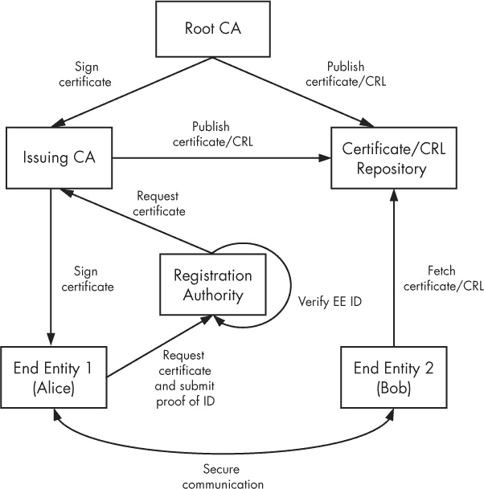
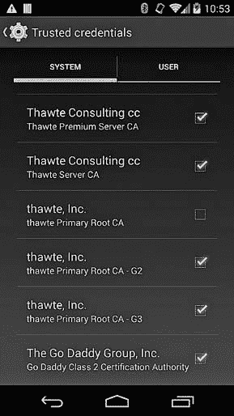
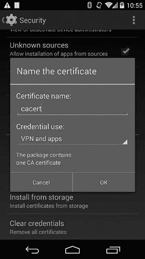
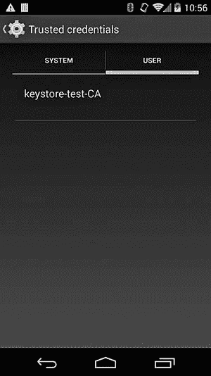
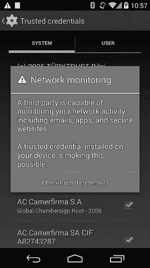

# 第六章 网络安全与 PKI

如前一章所述，Android 包括各种加密提供程序，这些提供程序实现了大多数现代加密原语：哈希、对称和非对称加密以及消息认证码。这些原语可以结合使用以实现安全通信，但即使是微小的错误也可能导致严重的漏洞，因此实现安全通信的首选方式是使用设计用于保护跨网络传输的数据的隐私和完整性的标准协议。

最广泛使用的安全协议是安全套接字层（SSL）和传输层安全（TLS）。Android 通过提供标准的 Java 安全套接字扩展（JSSE）实现来支持这些协议。在本章中，我们将简要讨论 JSSE 架构，然后提供一些关于 Android 的 JSSE 实现的细节。我们对 Android SSL 堆栈的描述重点是证书验证和信任锚管理，这些是与平台紧密集成的，并且是将其与其他 JSSE 实现区分开的最大特点之一。

### 注意

*虽然 TLS 和 SSL 在技术上是不同的协议，但我们通常使用更常见的术语* SSL *来指代两者，并且仅在讨论协议差异时才区分 SSL 和 TLS。*

# PKI 和 SSL 概述

TLS^([58]) 和 SSL^([59])（其前身）是安全的点对点通信协议，旨在提供（可选的）认证、消息机密性和消息完整性，供通过 TCP/IP 通信的双方使用。它们结合使用对称加密和非对称加密来实现消息的机密性和完整性，并在很大程度上依赖公钥证书来实现身份验证。

要启动安全的 SSL 通道，客户端首先联系服务器并发送其支持的 SSL 协议版本，以及建议的加密套件列表。*加密套件*是一组用于身份验证、密钥协商、加密和完整性的算法和密钥大小。为了建立安全通道，服务器和客户端协商一个共同支持的加密套件，然后根据各自的证书验证对方的身份。最后，通信双方商定一个对称加密算法，并计算出一个共享的对称密钥，用于加密所有后续的通信。通常，只验证服务器的身份（*服务器认证*），而不是客户端的身份。SSL 协议也支持验证客户端身份（*客户端认证*），但它的使用较为罕见。

### 注意

*虽然像* TLS_DH_anon_WITH_AES_128_CBC_SHA *这样的匿名（未经认证）加密套件在 SSL 规范中有定义，但它们容易受到中间人攻击（MITM），通常仅在 SSL 作为更复杂协议的一部分时使用，该协议有其他方法来确保认证。*

## 公钥证书

如前节所述，SSL 依赖公钥证书来实现身份验证。公钥证书是一种将身份与公钥绑定的构造。对于用于 SSL 通信的 *X.509 证书*，“身份”是一组通常包括常用名称（CN）、组织和位置的属性，形成实体的区分名称（DN）。X.509 证书的其他主要属性包括颁发者 DN、有效期以及一组扩展字段，这些扩展可能是附加的实体属性，或与证书本身相关（例如，预期的密钥使用）。

绑定是通过对实体的公钥及所有附加属性应用数字签名来生成数字证书的。所使用的签名密钥可以是认证实体自身的私钥，在这种情况下，证书被称为*自签名*证书，或者它可能属于一个称为*证书颁发机构（CA）*的受信任第三方。

OpenSSL `x509` 命令解析的典型 X.509 服务器证书的内容见示例 6-1。这个特定的证书将 *C=US, ST=California, L=Mountain View, O=Google Inc, CN=*.googlecode.com* DN ➋ 和一组备用的 DNS 名称 ➍ 绑定到服务器的 2048 位 RSA 密钥 ➌，并由 Google Internet Authority G2 CA ➊ 的私钥签名。

示例 6-1. 由 OpenSSL 解析的 X.509 证书内容

```
Certificate:
    Data:
        Version: 3 (0x2)
        Serial Number:
            09:49:24:fd:15:cf:1f:2e
    Signature Algorithm: sha1WithRSAEncryption
        Issuer: C=US, O=Google Inc, CN=Google Internet Authority G2➊
        Validity
            Not Before: Oct 9 10:33:36 2013 GMT
            Not After : Oct 9 10:33:36 2014 GMT
        Subject: C=US, ST=California, L=Mountain View, O=Google Inc, CN=*.googlecode.com➋
        Subject Public Key Info:
            Public Key Algorithm: rsaEncryption
                Public-Key: (2048 bit)➌
                Modulus:
                    00:9b:58:02:90:d6:50:03:0a:7c:79:06:99:5b:7a:
                    --*snip*--
                Exponent: 65537 (0x10001)
        X509v3 extensions:
            X509v3 Extended Key Usage:
                TLS Web Server Authentication, TLS Web Client Authentication
            X509v3 Subject Alternative Name:
                DNS:*.googlecode.com, DNS:*.cloud.google.com, DNS:*.code.google.com,➍
                --*snip*--
            Authority Information Access:
                CA Issuers - URI:http://pki.google.com/GIAG2.crt
                OCSP - URI:http://clients1.google.com/ocsp

            X509v3 Subject Key Identifier:
                65:10:15:1B:C4:26:13:DA:50:3F:84:4E:44:1A:C5:13:B0:98:4F:7B
            X509v3 Basic Constraints: critical
                CA:FALSE
            X509v3 Authority Key Identifier:
                keyid:4A:DD:06:16:1B:BC:F6:68:B5:76:F5:81:B6:BB:62:1A:BA:5A:81:2F
            X509v3 Certificate Policies:
                Policy: 1.3.6.1.4.1.11129.2.5.1
            X509v3 CRL Distribution Points:
                Full Name:
                  URI:http://pki.google.com/GIAG2.crl
    Signature Algorithm: sha1WithRSAEncryption
         3f:38:94:1b:f5:0a:49:e7:6f:9b:7b:90:de:b8:05:f8:41:32:
         --*snip*--
```

## 直接信任和私有 CA

如果一个 SSL 客户端与有限数量的服务器进行通信，它可以预先配置一组它信任的服务器证书（称为*信任锚*），此时决定是否信任远程方就变得非常简单，只需检查其证书是否在该信任集内即可。这个模型允许对客户端信任的对象进行细粒度控制，但也使得更换或升级服务器密钥变得更加困难，因为这需要颁发一个新的自签名证书。

这个问题可以通过使用*私有 CA*来解决，并配置客户端和服务器都使用它作为唯一的信任锚。在这种模型中，SSL 双方不会检查特定的实体证书，而是信任任何由私有 CA 颁发的证书。这允许透明地进行密钥和证书的升级，而无需升级 SSL 客户端和服务器，只要 CA 证书仍然有效。缺点是，这种单一 CA 模型会创建一个单点故障；如果 CA 密钥被泄露，任何获得密钥的人都可以颁发所有客户端都会信任的伪造证书（正如我们稍后将看到的，这不仅仅限于私有 CA）。从这种情况恢复需要更新所有客户端并替换 CA 证书。

这个模型的另一个问题是，它无法用于那些无法预先知道需要连接到哪些服务器的客户端——通常是通用的互联网客户端，如网页浏览器、电子邮件应用程序和消息或 VoIP 客户端。此类通用客户端通常配置有一组信任锚点，其中包括知名发行者，我们称之为*公共 CA*。尽管存在某些指导原则和要求，选择公共 CA 作为默认信任锚点的过程在不同浏览器和操作系统之间差异很大。例如，为了将 CA 证书作为信任锚点包含在其产品中，Mozilla 要求该 CA 必须有公开的*证书政策和认证实践声明（CP/CPS）*文件，要求操作员账户实施多因素认证，并且该 CA 证书不得直接颁发终端实体证书。^([60])其他供应商可能有较宽松的要求。目前，大多数操作系统和浏览器的最新版本都包含超过 100 个作为信任锚点的 CA 证书。

## 公钥基础设施

当证书由公共 CA 颁发时，通常会在颁发证书之前进行某种形式的身份验证。验证过程在不同 CA 和所颁发证书的类型之间差异很大，从接受自动电子邮件地址确认（用于廉价的服务器证书）到要求多个政府颁发的身份证明和公司注册文件（用于扩展验证（EV）证书）。

公共证书授权机构（CA）依赖于多个人员、系统、程序和政策来执行实体验证，以及创建、管理和分发证书。这些参与方和系统的集合被称为*公钥基础设施（PKI）*。PKI 可以是无限复杂的，但在安全通信的上下文中，特别是在 SSL 的应用中，最重要的部分是 CA 证书，它们充当信任锚点，并在验证通信方身份时使用。因此，管理信任锚点将是我们讨论 Android SSL 和 PKI 实现的关键点之一。图 6-1 展示了一个典型 PKI 的简化表示。



图 6-1. PKI 实体

在这里，持有证书的人员或服务器被称为*终端实体（EE）*。为了获得证书，终端实体向注册机构（RA）发送证书请求。RA 从 EE 获取一些身份验证信息，并根据 CA 的政策要求验证其身份。在 RA 确认 EE 的身份后，RA 检查该身份是否与证书请求的内容匹配，如果匹配，则将请求转发给颁发 CA。颁发 CA 对 EE 证书请求进行签名，从而生成 EE 证书，并维护有关已颁发证书的吊销信息（将在下一节讨论）。另一方面，根 CA 不直接签署 EE 证书，而只签署颁发 CA 的证书以及关于颁发 CA 的吊销信息。根 CA 的使用非常少，通常保持离线状态，以提高其密钥的安全性。

在图 6-1 中描述的 PKI 中，EE 证书与两个 CA 证书相关联：签署该证书的颁发 CA 的证书和签署颁发 CA 证书的根 CA 的证书。这三个证书形成一个证书链（也称为认证路径）。链条以 EE 证书开始，以根 CA 证书结束。为了让 EE 证书被信任，它的认证路径需要指向系统隐式信任的证书（信任锚）。虽然中间证书可以用作信任锚，但通常由根 CA 证书执行此角色。

## 证书吊销

除了颁发证书外，CA 还可以通过吊销证书来标记证书为无效。*吊销*涉及将证书序列号和吊销原因添加到 CA 签名并定期发布的证书吊销列表（CRL）中。验证证书的实体可以通过搜索其序列号（在给定的 CA 中是唯一的）来检查证书是否已被吊销，查看它是否出现在颁发 CA 当前的 CRL 中。示例 6-2 展示了由 Google Internet Authority G2 颁发的示例 CRL 文件内容。在这个例子中，序列号为 `40BF8571DD53E3BB` ➊ 和 `0A9F21196A442E45` ➋ 的证书已被吊销。

示例 6-2. CRL 文件内容

```
Certificate Revocation List (CRL):
        Version 2 (0x1)
    Signature Algorithm: sha1WithRSAEncryption
        Issuer: /C=US/O=Google Inc/CN=Google Internet Authority G2
        Last Update: Jan 13 01:00:02 2014 GMT
        Next Update: Jan 23 01:00:02 2014 GMT
        CRL extensions:
            X509v3 Authority Key Identifier:
                keyid:4A:DD:06:16:1B:BC:F6:68:B5:76:F5:81:B6:BB:62:1A:BA:5A:81:2F
            X509v3 CRL Number:
                219
Revoked Certificates:
    Serial Number: 40BF8571DD53E3BB➊
        Revocation Date: Sep 10 15:19:22 2013 GMT
        CRL entry extensions:
            X509v3 CRL Reason Code:
                Affiliation Changed
--*snip*--
    Serial Number: 0A9F21196A442E45➋
        Revocation Date: Jun 12 17:42:06 2013 GMT
        CRL entry extensions:
            X509v3 CRL Reason Code:
                Superseded
    Signature Algorithm: sha1WithRSAEncryption
         40:f6:05:7d:...
```

通过使用在线证书状态协议（OCSP），可以在不获取所有被吊销证书的完整列表的情况下检查吊销状态。^([61]) CRL 和 OCSP URI 通常作为扩展包含在证书中，以便验证方无需提前知道其位置。所有公共 CA 都维护吊销信息，但实际上，很多 SSL 客户端要么根本不检查吊销，要么即使远程方的证书被吊销，也允许连接（可能带有警告）。这种 SSL 客户端宽松行为的主要原因是获取当前吊销信息所需的开销以及确保连接的可用性。虽然增量 CRL（仅包含与上一个 CRL 版本的差异或 *增量*）和本地缓存在某种程度上缓解了这个问题，但主要 CA 的 CRL 通常非常庞大，必须在建立 SSL 连接之前下载，这会增加用户可见的延迟。OCSP 改善了这种情况，但仍然需要连接到另一台服务器，这再次增加了延迟。

无论哪种情况，由于 CA 基础设施中的网络或配置问题，吊销信息可能根本不可用。对于一个主要的 CA，吊销数据库故障可能会使大量安全站点瘫痪，这直接转化为其运营者的经济损失。最后，没有人喜欢连接错误，面对吊销错误时，大多数用户只会找到另一个更宽松的 SSL 客户端，它能“正常工作”。

# JSSE 介绍

我们将在这里简要介绍 JSSE 的架构和主要组件。（要全面了解，请参见官方的 *JSSE 参考指南*。^([62]))

JSSE API 位于 `javax.net` 和 `javax.net.ssl` 包中，提供表示以下功能的类：

+   SSL 客户端和服务器套接字

+   一个用于生成和消费 SSL 流的引擎（`SSLEngine`）

+   创建套接字的工厂

+   一个创建安全套接字工厂和引擎的安全套接字上下文类（`SSLContext`）

+   基于 PKI 的密钥和信任管理器以及用于创建它们的工厂

+   一个用于 HTTPS（TLS 上的 HTTP，指定于 *RFC 2818*^([63])) URL 连接的类（`HttpsURLConnection`）

就像 JCA 加密服务提供者一样，JSSE 提供者为 API 中定义的引擎类提供实现。这些实现类负责创建底层套接字以及建立连接所需的密钥和信任管理器，但 JSSE API 用户从不直接与它们互动，而是仅与相应的引擎类交互。让我们简要回顾 JSSE API 中的关键类和接口，以及它们之间的关系。

## 安全套接字

JSSE 支持基于流的阻塞 I/O 使用套接字和基于 NIO（新 I/O）通道的非阻塞 I/O。基于流的通信的核心类是 `javax.net.ssl.SSLSocket`，它可以通过 `SSLSocketFactory` 创建，或者通过调用 `SSLServerSocket` 类的 `accept()` 方法创建。反过来，`SSLSocketFactory` 和 `SSLServerSocketFactory` 实例是通过调用 `SSLContext` 类的适当工厂方法创建的。SSL 套接字工厂封装了创建和配置 SSL 套接字的细节，包括身份验证密钥、对等证书验证策略和启用的密码套件。这些细节通常对于应用程序使用的所有 SSL 套接字都是通用的，并且在初始化应用程序的 `SSLContext` 时进行配置。然后，它们会传递给由共享 `SSLContext` 实例创建的所有 SSL 套接字工厂。如果未显式配置 `SSLContext`，则会为所有 SSL 参数使用系统默认值。

非阻塞 SSL I/O 在 `javax.net.ssl.SSLEngine` 类中实现。该类封装了一个 SSL 状态机，并对其客户端提供的字节缓冲区进行操作。虽然 `SSLSocket` 隐藏了 SSL 的复杂性，但为了提供更大的灵活性，`SSLEngine` 将 I/O 和线程处理交给调用的应用程序。因此，`SSLEngine` 的客户端需要对 SSL 协议有一定了解。`SSLEngine` 实例是直接从 `SSLContext` 创建的，并继承其 SSL 配置，就像 SSL 套接字工厂一样。

## 对等身份验证

对等身份验证是 SSL 协议的一个重要组成部分，依赖于一组信任锚和身份验证密钥的可用性。在 JSSE 中，对等身份验证配置是通过 `KeyStore`、`KeyManagerFactory` 和 `TrustManagerFactory` 引擎类来提供的。`KeyStore` 代表一个存储加密密钥和证书的设施，可以用来存储信任锚证书以及终端实体的密钥和相关证书。`KeyManagerFactory` 和 `TrustManagerFactory` 分别基于指定的身份验证算法创建 `KeyManager` 或 `TrustManager`。虽然基于不同身份验证策略的实现是可能的，但实际上，SSL 仅使用基于 X.509 的 PKI（PKIX）进行身份验证，并且这些工厂类支持的唯一算法是 *PKIX*（别名为 *X.509*）。通过调用以下方法，可以使用一组 `KeyManager` 和 `TrustManager` 实例初始化 `SSLContext`。所有参数都是可选的，如果指定为 `null`，则使用系统默认值（参见 示例 6-3）。

示例 6-3. `SSLContext` 初始化方法

```
void init(KeyManager[] km, TrustManager[] tm, SecureRandom random);
```

`TrustManager` 决定是否信任呈现的对等身份验证凭据。如果信任，则建立连接；如果不信任，则终止连接。在 PKIX 的上下文中，这意味着基于配置的信任锚来验证呈现的对等证书的证书链。这也体现在 JSSE 使用的 `X509TrustManager` 接口中（参见 示例 6-4）：

示例 6-4. `X509TrustManager` 接口方法

```
void checkClientTrusted(X509Certificate[] chain, String authType);
void checkServerTrusted(X509Certificate[] chain, String authType);
X509Certificate[] getAcceptedIssuers();
```

证书链验证是通过系统的 Java 认证路径 API（或 CertPath API）实现执行的，^([65]) 该实现负责构建和验证证书链。尽管该 API 具有某种与算法无关的接口，但在实践中它与 PKIX 密切相关，并实现了 PKIX 标准中定义的链构建和验证算法。默认的 PKIX `TrustManagerFactory` 实现可以创建一个 `X509TrustManager` 实例，该实例使用 `KeyStore` 对象中存储的信任锚来预配置底层的 CertPath API 类。

`KeyStore` 对象通常是从一个称为*信任库*的系统密钥库文件中初始化的。当需要更细粒度的配置时，可以使用包含详细 CertPath API 参数的 `CertPathTrustManagerParameters` 实例来初始化 `TrustManagerFactory`。当系统 `X509TrustManager` 实现无法通过提供的 API 按要求配置时，可以通过直接实现接口来创建自定义实例，可能会将基础案例委托给默认实现。

`KeyManager` 决定将哪些身份验证凭据发送到远程主机。在 PKIX 的上下文中，这意味着选择发送到 SSL 服务器的客户端身份验证证书。默认的 `KeyManagerFactory` 可以创建一个 `KeyManager` 实例，使用 `KeyStore` 来搜索客户端身份验证密钥和相关证书。与 `TrustManager` 一样，具体的接口 `X509KeyManager`（参见 示例 6-5）和 `X509ExtendedKeyManager`（允许进行连接特定的密钥选择）是 PKIX 特定的，并根据服务器提供的受信任颁发者列表选择客户端证书。如果默认的 `KeyStore` 支持的实现不够灵活，可以通过扩展抽象的 `X509ExtendedKeyManager` 类来提供自定义实现。

示例 6-5. `X509KeyManager` 接口

```
String chooseClientAlias(String[] keyType, Principal[] issuers, Socket socket);
String chooseServerAlias(String keyType, Principal[] issuers, Socket socket);
X509Certificate[] getCertificateChain(String alias);
String[] getClientAliases(String keyType, Principal[] issuers);
PrivateKey getPrivateKey(String alias);
String[] getServerAliases(String keyType, Principal[] issuers);
```

除了支持“原始”SSL 套接字外，JSSE 还提供了通过 `HttpsURLConnection` 类支持 HTTPS。`HttpsURLConnection` 使用默认的 `SSLSocketFactory` 来创建安全套接字，在与 Web 服务器建立连接时。如果需要额外的 SSL 配置，例如指定应用私有的信任锚或身份验证密钥，则可以通过调用静态方法 `setDefaultSSLSocketFactory()` 来为所有 `HttpsURLConnection` 实例替换默认的 `SSLSocketFactory`。或者，您可以通过调用其 `setSSLSocketFactory()` 方法为特定实例配置套接字工厂。

## 主机名验证

虽然 SSL 通过检查服务器证书来验证服务器身份，但协议并未强制要求任何主机名验证，且在使用原始 SSL 套接字时，证书主题不会与服务器主机名匹配。然而，HTTPS 标准确实要求进行这样的检查，`HttpsURLConnection` 在内部执行此操作。默认的主机名验证算法可以通过将 `HostnameVerifier` 实例分配给类或单个实例来覆盖。它需要实现的 `verify()` 回调在示例 6-6 中显示。回调中使用的 `SSLSession` 类封装了当前 SSL 连接的详细信息，包括选定的协议和密码套件、本地和对等证书链、对等主机名和连接端口号。

示例 6-6. `HostnameVerifier` 主机名验证回调

```
boolean verify(String hostname, SSLSession session);
```

我们已经讨论了构成 JSSE API 的主要类和接口，并介绍了它们之间的关系。它们的关系可以通过图 6-2 来可视化。


图 6-2. JSSE 类及其关系

# Android JSSE 实现

Android 配备了两个 JSSE 提供者：基于 Java 的 HarmonyJSSE 和 AndroidOpenSSL 提供者，后者主要通过 JNI 桥接到公共 Java API 实现为本地代码。HarmonyJSSE 基于 Java 套接字和 JCA 类来实现 SSL，而 AndroidOpenSSL 通过使用 OpenSSL 库调用来实现其大部分功能。如第五章中所述，AndroidOpenSSL 是 Android 中首选的 JCA 提供者，它还提供了默认的 `SSLSocketFactory` 和 `SSLServerSocketFactory` 实现，分别由 `SSLSocketFactory.getDefault()` 和 `SSLServerSocketFactory.getDefault()` 返回。

两个 JSSE 提供者都属于核心 Java 库的一部分（分别位于 `core.jar` 和 `libjavacore.so`），而 AndroidOpenSSL 提供者的原生部分被编译到 `libjavacrypto.so` 中。HarmonyJSSE 仅支持 SSLv3.0 和 TLSv1.0，而 AndroidOpenSSL 则支持 TLSv1.1 和 TLSv1.2。虽然 SSL 套接字实现不同，但两个提供者共享相同的 `TrustManager` 和 `KeyManager` 代码。

### 注意

*HarmonyJSSE 提供者仍然可以在 Android 4.4 中使用，但已被视为弃用且不再积极维护。它可能会在未来的 Android 版本中被移除。*

除了当前的 TLS 协议版本外，基于 OpenSSL 的提供者还支持 *服务器名称指示（SNI）* TLS 扩展（在 *RFC 3546*^([66]) 中定义），它允许 SSL 客户端在连接到托管多个虚拟主机的服务器时指定目标主机名。在 Android 3.0 及之后版本中，建立连接时默认使用 SNI（版本 2.3 对 SNI 的支持有限）。然而，使用 Android 自带的 Apache HTTP 客户端库（位于 `org.apache.http` 包中）时，SNI 是不支持的。

在 Android 4.2 之前，Android 核心 Java 库中的 HTTP 栈，包括 `HttpsURLConnection`，是基于 Apache Harmony 代码实现的。在 Android 4.2 及之后的版本中，原始实现被 Square 的 HTTP 和 SPDY 客户端库 *OkHttp* 替代。^([67])

## 证书管理与验证

Android 的 JSSE 实现大多符合 JSSE API 规范，但也有一些显著的区别。最大的一点是 Android 如何处理系统信任存储。在 Java SE 的 JSSE 实现中，系统信任存储是一个单独的密钥存储文件（通常称为*cacerts*），其位置可以通过 `javax.net.ssl.trustStore` 系统属性设置，但 Android 采用了不同的策略。Android 的最新版本还提供了现代证书验证功能，如黑名单和固定证书，这些在原始的 JSSE 架构文档中并未指定。我们将在接下来的章节中讨论 Android 的信任存储实现和高级证书验证功能。

### 系统信任存储

如在“对等身份验证”中讨论的那样，JSSE 实现使用信任存储来验证连接对等方。虽然 SSL 确实支持仅加密、不进行身份验证的连接，但在实际操作中，原生的 SSL 客户端通常会执行服务器身份验证，并且 HTTPS 中对此是强制要求的。当没有明确提供每个应用的信任存储时，JSSE 会使用系统信任存储来进行 SSL 对等身份验证。系统信任存储对于像浏览器这样的通用 Internet 客户端尤为重要，因为它们通常不会在移动设备上管理自己的信任存储（Mozilla 客户端的桌面版本确实会维护私有的凭证和证书存储，但在 Android 上没有）。由于系统信任存储对所有使用 JSSE 的应用程序的安全性至关重要，我们将详细研究它们的实现。

在 Android 4.0 之前，操作系统的信任存储是硬编码到系统中的，用户对此完全无法控制。存储中的证书是由设备制造商或运营商单独选择的。唯一能做出更改的方式是对设备进行 root 操作，重新打包信任证书文件，并替换原始文件——这个过程显然不太实际，也是 Android 在企业 PKI 中使用的一大障碍。在多个主要 CA 被攻破之后，第三方工具应运而生，能够更改系统信任证书，但使用这些工具仍然需要一个已 root 的手机。幸运的是，Android 4.0 使得信任存储的管理变得更加灵活，并将控制谁可以信任的权力交给了用户。

### Android 4.x 系统信任存储

在 Android 4.0 之前，系统信任存储是一个单独的文件：*/system/etc/security/cacerts.bks*，这是一个 Bouncy Castle（Android 使用的加密提供者之一；详见第五章）的原生密钥存储文件。它包含了 Android 所信任的所有 CA 证书，并被系统应用程序（如电子邮件客户端和浏览器）以及第三方应用程序使用。因为它位于只读的 *system* 分区上，所以即使是系统应用程序也无法更改它。

Android 4.0 引入了一个新的、更灵活的 `TrustedCertificateStore` 类，它允许维护内置的信任锚并添加新的信任锚。它仍然从 */system/etc/security/* 读取系统信任的证书，但增加了两个新的可变位置，用于存储 CA 证书，这些位置位于 */data/misc/keychain/* 下：*cacerts-added/* 和 *cacerts-removed/* 目录。示例 6-7 显示了它们的内容：

示例 6-7. cacerts-added/ 和 cacerts-removed/ 目录的内容

```
# ls -l /data/misc/keychain
drwxr-xr-x system   system            cacerts-added
drwxr-xr-x system   system            cacerts-removed
-rw-r--r-- system   system         81 pubkey_blacklist.txt
-rw-r--r-- system   system          7 serial_blacklist.txt
# ls -l /data/misc/keychain/cacerts-added
-rw-r--r-- system   system        653 30ef493b.0➊
# ls -l /data/misc/keychain/cacerts-removed
-rw-r--r-- system   system       1060 00673b5b.0➋
```

这些目录中的每个文件包含一个 CA 证书。文件名可能看起来很熟悉：它们是基于 CA 主题名称的 MD5 哈希值（使用 OpenSSL 的`X509_NAME_hash_old()`函数计算），如同在*mod_ssl*和其他使用 OpenSSL 实现的加密软件中使用的那样。这使得通过直接将 DN 转换为文件名，可以快速找到证书，而不需要扫描整个存储。

还要注意目录的权限：*0775 system system*确保只有*system*用户可以添加或移除证书，但任何人都可以读取它们。如预期所示，添加受信任的 CA 证书是通过将证书存储在适当文件名的*cacerts-added/*目录下实现的。存储在*30ef493b.0*文件中的证书（➊在示例 6-7 中）也将在受信任的证书系统应用程序的用户标签中显示（**设置**▸**安全**▸**受信任的证书**）。

但是，操作系统信任的证书是如何被禁用的呢？因为预安装的 CA 证书仍然存储在*/system/etc/security/*（该目录为只读挂载）中，通过将其证书的副本放置在*cacerts-removed/*目录下，可以将 CA 标记为不受信任。重新启用通过简单地删除该文件来实现。在这个特殊的例子中，*00673b5b.0*（➋在示例 6-7 中）是*thawte Primary Root CA*，在系统标签中显示为禁用（参见图 6-3）。

### 使用系统信任存储

`TrustedCertificateStore` 不是 Android SDK 的一部分，但它有一个包装器（`TrustedCertificateKeyStoreSpi`），可以通过标准的 JCA `KeyStore` API 访问，供应用程序使用（请参见示例 6-8）。

示例 6-8。 使用 AndroidCAStore 列出受信任的证书

```
KeyStore ks = KeyStore.getInstance("AndroidCAStore");➊
ks.load(null, null);➋
Enumeration<String> aliases = ks.aliases();➌
while (aliases.hasMoreElements()) {
    String alias = aliases.nextElement();
    Log.d(TAG, "Certificate alias: " + alias);
    X09Certificate cert = (X509Certificate) ks.getCertificate(alias);➍
    Log.d(TAG, "Subject DN: " + cert.getSubjectDN().getName());
    Log.d(TAG, "Issuer DN: " + cert.getIssuerDN().getName());
}
```



图 6-3。标记为不受信任的预安装 CA 证书

要获取当前受信任证书的列表，我们：

1.  通过指定*AndroidCAStore*作为`type`参数来创建一个`KeyStore`实例 ➊。

1.  调用其`load()`方法并将`null`传递给两个参数 ➋。

1.  使用`aliases()`方法获取证书别名的列表 ➌。

1.  将每个别名传递给`getCertificate()`方法以获取实际的证书对象 ➍。

当你检查这段代码的输出时，你会注意到证书别名以*user:*（表示用户安装的证书）或*system:*（表示预安装的证书）为前缀，后面跟着主题的哈希值。

*AndroidCAStore* `KeyStore` 实现使我们能够轻松访问操作系统的受信任证书，但在实际应用中，更关注的是是否应该信任某个特定的服务器证书，而不是当前的信任锚是什么。Android 通过将 `TrustedCertificateKeyStoreSpi` 与其 JSSE 实现集成，使这一过程变得非常简单。默认的 `TrustManagerFactory` 使用它来获取信任锚列表，从而自动将服务器证书与系统当前受信任的证书进行验证。因此，使用 `HttpsURLConnection` 或 `HttpClient`（都建立在 JSSE 之上）的高层代码应当能够正常工作，而无需担心创建和初始化自定义的 `SSLSocketFactory`。

为了将我们自己的 CA 证书（例如来自私有企业 CA 的证书）安装到系统信任库中，我们需要将其转换为 DER（二进制）格式并复制到设备上。在 Android 4.4.1 之前的版本中，证书文件需要复制到外部存储的根目录，并且扩展名为 *.crt* 或 *.cer*。Android 4.4.1 及之后版本使用了 Android 4.4 引入的存储访问框架，允许从设备可以访问的任何存储后端选择证书文件，包括像 Google Drive 这样的集成云服务提供商。然后，我们可以通过选择 **设置**▸**个人**▸**安全性**▸**凭据存储**▸**从存储安装** 来导入证书。会显示可用证书文件的列表，点击文件名即可打开导入对话框，如图 6-4 所示。

导入的证书将在受信任的凭据屏幕的用户标签页中显示（见图 6-5）。你可以通过点击列表项查看证书详情，并通过向下滚动到详情页面底部并点击移除按钮来删除它。

### 注意

*如果证书成功导入，在 Android 4.4.1 之前的版本中，外部存储中的证书文件将被删除。*



图 6-4. CA 证书导入对话框



图 6-5. 用户导入的 CA 证书

从 Android 4.4 开始，如果用户安装了任何受信任的证书，系统将显示一个通知，警告用户网络活动可能会被监控。SSL 连接监控可以通过使用拦截代理服务器来完成，该服务器为用户尝试访问的站点返回自动生成的证书。只要这些证书是由 Android 信任的 CA 颁发的（例如手动安装到信任存储中的证书），大多数应用无法分辨与原始主机和拦截代理之间的连接差异（除非它们已将目标主机固定；有关详细信息，请参见“证书固定”）。在快捷设置和系统设置中的*安全性*首选项旁边会显示一个警告图标。点击该图标时，通知会显示图 6-6 中显示的警告信息。



图 6-6。Android 4.4 中的网络监控警告

### 系统信任存储 API

第三方应用可以通过使用`KeyChain` API 提示用户将所需证书导入系统信任存储，该 API 也在 Android 4.0 中引入。（我们将在第七章讨论`KeyChain` API。）从 Android 4.4 开始，设备管理员应用可以在拥有*MANAGE_CA_CERTIFICATES*系统权限的情况下，悄无声息地将 CA 证书安装到系统信任存储中。（我们将在第九章介绍设备管理和相关 API。）

一旦 CA 证书导入系统信任存储，我们可以使用它来验证证书，使用 JSSE `TrustManager` API，如示例 6-9 所示。

示例 6-9。使用系统信任锚初始化`TrustManager`并验证证书

```
// Certificate chain including the end entity (server) certificate
// and any intermediate issuers.
X509Certificate[] chain = { endEntityCert };
TrustManagerFactory tmf = TrustManagerFactory.getInstance("X509");➊
tmf.init((KeyStore) null);➋
TrustManager[] tms = tmf.getTrustManagers();
X509TrustManager xtm = (X509TrustManager) tms[0];➌
Log.d(TAG, "checking chain with " + xtm.getClass().getName());
xtm.checkServerTrusted(chain, "RSA");➍
Log.d(TAG, "chain is valid");
```

为此，我们首先获取系统的 PKIX（别名为*X509*）`TrustManagerFactory`（见 示例 6-9 中的 ➊）；通过向其 `init(KeyStore ks)` 方法传递 `null` 来使用系统信任库初始化它 ➋；然后获取指定算法的第一个 `TrustManager` 实现（通常只有一个，但在生产代码中请务必确认）并将其强制转换为与验证算法相关的 `X509TrustManager` 接口 ➌。最后，我们将证书链和所使用的密钥交换算法（如*RSA*、*DHE_DSS*等）传递给 `checkServerTrusted()` 方法 ➍。如果能够构建出一个指向受信 CA 证书的链，则验证通过，方法返回。如果链中的任何证书已过期或无效，或者链无法指向系统信任锚，则该方法将抛出 `java.security.cert.CertificateException`（或其子类中的一种）。使用 `SSLSocket` 和 `HttpsURLConnection` 建立的连接会自动执行类似的验证。

这段代码效果还不错，但有一个主要问题：它没有检查证书的吊销情况。Android 默认的 `TrustManager` 在验证证书链时明确关闭了吊销检查。因此，即使证书具有 CRL 分发点（CDP）扩展，指向有效的 CRL，或者在授权信息访问（AIA）扩展中包含了 OCSP 响应者 URI，并且证书实际上已经被吊销，它仍然会在 Android 中验证通过。这里缺少的功能是*在线吊销检查*：能够动态地获取、缓存并根据证书扩展中的信息更新吊销信息。

## 证书黑名单

与其使用在线吊销检查，Android 倚赖于 CA 和终端实体证书黑名单机制，接下来我们将讨论这个问题。*证书黑名单*指的是验证者明确阻止某些证书的使用，而不考虑它们在 PKI 仓库中的状态。黑名单机制并不是原始 PKI 哲学的一部分，也没有在任何相关标准中定义。那么，为什么在实际应用中它是必要的呢？

在一个理想的世界中，一个正常运作的 PKI（公钥基础设施）会负责根据需要发布、分发和撤销证书。系统只需要几个信任锚证书，就可以验证先前未知的机器和用户的身份：任何遇到的端实体证书都会由其中一个受信任的 CA 颁发，或者由它们的下级颁发机构（子 CA）颁发。然而，在实际中，存在许多问题，主要与处理密钥泄露相关。端实体证书的有效期相对较短（通常为一年），这限制了被泄露密钥的利用时间。然而，CA 证书的有效期非常长（通常为 20 年或更长），并且因为 CA 是隐式信任的，密钥泄露可能会长时间未被发现。最近一些顶级 CA 的安全漏洞表明，CA 密钥泄露并非理论问题，CA 泄露的后果可能非常广泛。

### 处理 CA 密钥泄露

可能最大的 PKI 问题是根证书的撤销并不真正得到支持。大多数操作系统和浏览器都预配置了一套受信任的 CA 证书（数量通常为几十个！），当 CA 证书被泄露时，有两种主要的处理方法：让用户从信任存储中移除它，或发布紧急更新以移除受影响的证书。显然，指望用户自己处理这个问题是不现实的，因此只能选择第二种方法。

Windows 通过 Windows 更新分发补丁来修改操作系统的信任锚，而浏览器厂商则只是发布新的补丁版本。然而，即使更新从系统信任存储中移除了 CA 证书，用户仍然可以重新安装它，尤其是在遇到“做这个，否则你将无法访问该站点”的最后通牒时。

为了确保被移除的信任锚不被恢复，它们的公钥哈希会被添加到黑名单中，操作系统或浏览器即使在用户的信任存储中也会拒绝它们。这种方法有效地撤销了 CA 证书（当然是在操作系统或浏览器的范围内），并解决了 PKI 无法处理泄露的信任锚的问题。然而，这并不完全理想，因为即使是紧急更新也需要一些时间来准备，而发布后，一些用户可能不会立即更新，无论他们被催促多少次。（幸运的是，CA 泄露事件相对较少，并且广泛宣传，因此在实践中似乎有效——至少目前如此。）也有提出过其他方法，但大多数并未得到广泛应用。我们将在“激进解决方案”中讨论一些提议的解决方案。

### 处理端实体密钥泄露

虽然证书颁发机构（CA）泄露事件相对少见，但最终实体（EE）密钥泄露的情况发生得要频繁得多。无论是由于服务器泄露、笔记本被盗，还是智能卡丢失，这些泄露事件每天都在发生。幸运的是，现代公钥基础设施（PKI）系统在设计时已经考虑到了这一点，CA 可以撤销证书，并以证书撤销列表（CRLs）的形式发布撤销信息，或者通过在线证书状态协议（OCSP）提供在线撤销状态。

不幸的是，这在实际应用中并不太有效。撤销检查通常需要访问与我们尝试连接的机器不同的网络机器，因此失败率相对较高。为了缓解这一问题，大多数浏览器会尝试获取最新的撤销信息，但如果由于某种原因失败，它们会简单地忽略错误（软失败），或者在最好情况下，显示一些视觉提示，表明撤销信息不可用。

### 注

*为了解决这个问题，Google Chrome 完全禁用了在线撤销检查*^([68])，*并且现在使用其更新机制主动将撤销信息推送到浏览器，而无需应用程序更新或重启。*^([69]) *因此，Chrome 可以拥有一个最新的本地撤销信息缓存，这使得证书验证更加快速且可靠。这可以被视为另一个黑名单（Chrome 称之为*CRL 集*），这次基于每个 CA 发布的信息。浏览器厂商有效地代表用户管理撤销数据是一个相当新颖的做法；虽然并不是每个人都认为这是个好主意，但到目前为止它表现得非常好。*

直接将撤销信息作为浏览器更新的一部分推送的替代方案是*OCSP stapling*，以前称为 TLS *证书状态请求* 扩展。^([70]) 与其要求客户端向服务器证书发出 OCSP 请求，不如将相关响应（“钉住”）在 SSL 握手过程中通过证书状态请求扩展响应一起包含。由于响应由 CA 签名，客户端可以像直接从 CA 的 OCSP 服务器获取它一样信任这个响应。如果服务器没有在 SSL 握手中包含 OCSP 响应，客户端则需要自行获取一个。OCSP stapling 已被所有主流 HTTP 服务器支持，但浏览器支持仍然不稳定，尤其是在移动版本中，由于延迟问题。

### Android 证书黑名单

正如我们在“Android 4.x 系统信任库”中所学，Android 4.0 添加了管理 UI，以及一个 SDK API，允许将信任锚添加到系统信任库或移除它们。然而，这并没有完全解决 PKI 的首要问题：除了用户手动禁用受损的信任锚外，仍然需要操作系统更新才能移除受损的 CA 证书。此外，由于 Android 在验证证书链时不执行在线吊销检查，因此即使端实体证书已经被吊销，也无法检测到受损的证书。

为了解决这个问题，Android 4.1 引入了证书黑名单，可以在不需要操作系统更新的情况下进行修改。目前有两个系统黑名单：

+   公钥哈希黑名单（用于处理受损的 CA）

+   序列号黑名单（用于处理受损的 EE 证书）

证书链验证器组件在验证网站或用户证书时会考虑这两个黑名单。让我们更详细地看一下如何实现这一点。

Android 使用内容提供者将操作系统设置存储在系统数据库中。一些设置可以由持有必要权限的第三方应用修改，而一些则保留给系统，仅能在系统设置中更改，或通过其他系统应用更改。保留给系统的设置被称为*安全设置*。Android 4.1 在以下 URI 下新增了两个安全设置：

+   *content://settings/secure/pubkey_blacklist*

+   *content://settings/secure/serial_blacklist*

正如名字所示，第一个黑名单存储受损 CA 的公钥哈希，第二个黑名单则存储 EE 证书的序列号列表。此外，系统服务器现在启动了一个`CertBlacklister`组件，该组件注册为这两个黑名单 URI 的`ContentObserver`。每当写入任何黑名单安全设置的新值时，`CertBlacklister`会收到通知并将该值写入磁盘上的文件。文件包含一个由逗号分隔的十六进制编码公钥哈希或证书序列号的列表。文件为：

+   证书黑名单：*/data/misc/keychain/pubkey_blacklist.txt*

+   序列号黑名单：*/data/misc/keychain/serial_blacklist.txt*

为什么要将文件写入磁盘，而它们已经可以在设置数据库中找到？因为实际使用黑名单的组件是一个标准的 Java CertPath API 类，它对 Android 及其系统数据库一无所知。证书路径验证器类`PKIXCertPathValidatorSpi`是 Bouncy Castle JCA 提供程序的一部分，经过修改以处理证书黑名单，这是 Android 特有的功能，标准的 CertPath API 中没有定义。该类实现的 PKIX 证书验证算法相当复杂，但 Android 4.1 所添加的功能相对简单：

+   在验证 EE（叶子）证书时，检查其序列号是否在序列号黑名单中。如果在，则返回与证书已被吊销相同的错误（异常）。

+   在验证 CA 证书时，检查其公钥的哈希值是否在公钥黑名单中。如果在，则返回与证书已被吊销相同的错误。

### 注意

*如果使用不合格的序列号来索引被列入黑名单的 EE 证书，可能会出现问题，如果两个或更多来自不同 CA 的证书恰好具有相同的序列号。在这种情况下，仅列入黑名单其中一张证书将有效地将所有具有相同序列号的证书都列入黑名单。然而在实际中，大多数公共 CA 使用长且随机生成的序列号，因此碰撞的概率非常低。*

证书路径验证器组件在整个系统中都被使用，因此黑名单会影响使用 HTTP 客户端类的应用程序，以及原生 Android 浏览器和 `WebView`。如上所述，修改黑名单需要系统权限，因此只有核心系统应用程序才能进行修改。AOSP 源代码中没有实际调用这些 API 的应用程序，但一个管理黑名单的好候选者是 Google 服务组件，这些组件可以在“Google Experience”设备上找到（即预安装了 Play Store 客户端的设备）。这些组件管理 Google 帐户和 Google 服务的访问，并通过 Google 客户端消息传递（GCM）提供推送式通知。由于 GCM 允许实时服务器发起的推送通知，因此可以放心地认为这些推送将用于触发证书黑名单更新。

## 重新审视 PKI 信任模型

Android 已采取措施，使其信任库更加灵活，允许按需修改信任锚点和证书黑名单，而无需系统更新。尽管证书黑名单确实使 Android 更加抵抗某些与公钥基础设施（PKI）相关的攻击和漏洞，但它并不能完全解决所有与使用公共 CA 签发的证书相关的问题。接下来我们将介绍一些这些问题以及提出的解决方案。然后，我们将通过描述 Android 实现其中一种解决方案——证书钉扎来结束我们对 PKI 和 SSL 的讨论。

### 当今 PKI 中的信任问题

在极不可能的情况下，如果你还没听说过，现有公共 CA 模型的可信度近年来遭到严重破坏。它已经存在一些问题，但最近一些高调的 CA 安全漏洞将这个问题推到了风口浪尖。攻击者成功地为许多网站签发了证书，包括 Windows 更新服务器和 Gmail。尽管并非所有这些证书都在实际攻击中被使用（或至少没有被检测到），但这些事件展示了当前互联网技术在多大程度上依赖于证书。

欺诈性证书可以用于从安装恶意软件到监视互联网通信的一切活动，同时欺骗用户认为他们正在使用安全的通道或安装受信的可执行文件。不幸的是，仅仅提高 CA 的安全性并不是解决方案，因为一些主要的 CA 乐意为像*localhost*、*webmail*和*exchange*这样不合格的名称颁发数百个证书^([71])。为不合格主机名颁发的证书可以用来对访问内部服务器时使用不合格名称的客户端发动中间人（MITM）攻击，从而轻松监听内部企业流量。当然，还有被强制颁发证书的问题，政府机构可以强迫 CA 颁发虚假证书，用于拦截安全通信流量。

显然，当前的 PKI 系统主要基于一组预选的受信 CA（其证书作为信任锚预先安装），这系统存在问题，但到底有哪些实际问题呢？对此有不同的看法，但首先，有太多的公共 CA。电子前沿基金会的 SSL 天文台项目^([72]) 显示，主流浏览器信任超过 650 个公共 CA。最近的安卓版本预装了超过 100 个受信 CA 证书，且直到 4.0 版本之前，移除信任证书的唯一方式是通过厂商发布的操作系统更新。

此外，通常没有技术性限制，规定 CA 可以颁发哪些证书。正如 Comodo 和 DigiNotar 攻击事件，以及最近的 ANNSI^([73]) 中间 CA 事件所示，任何人都可以为 **.google.com**（根 CA 不适用名称限制，并且对公共 CA 也没有太大作用）颁发证书。此外，由于 CA 不会公开他们已颁发的证书，网站运营商（在这种情况下是 Google）无法知道有人为他们的网站颁发了新的、可能是欺诈性的证书，并采取适当的措施（证书透明度标准^([74]) 旨在解决这个问题）。简而言之，在当前的系统下，如果任何内置的信任锚被攻破，攻击者就可以为任何网站颁发证书，而访问该网站的用户和网站所有者都不会察觉。

### 激进的解决方案

提出的解决方案从激进到温和不等——激进的方案是完全抛弃现有的公钥基础设施（PKI）概念，替换成一种全新的、更好的方法（DNSSEC 通常是一个常见的选择）；温和的方案是利用现有的基础设施，但不对证书颁发机构（CA）进行隐性信任；进化性的方案则是保持与现有系统的兼容性，但通过扩展其功能来限制 CA 被攻破的损害。

不幸的是，DNSSEC 仍未普遍部署，尽管关键的顶级域名（TLD）域已经签名。此外，它本质上是层级化的——国家顶级域名由各自的国家控制——实际上比 PKI 更为僵化，因此并不完全适用。改善当前 PKI 状况是一个活跃的研究领域，其他可行的激进解决方案尚未出现。

向中庸方向发展，SSH 模型也被提出（有时称为*首次使用时信任*，或*TOFU*）。在这种模型中，最初没有任何网站或证书颁发机构（CA）被信任，用户决定首次访问时信任哪个网站。然而，与 SSH 不同，你直接或间接（通过 CDN、嵌入式内容等）访问的网站数量几乎是无限的，用户管理信任显得非常不现实。

### Convergence 和信任灵活性

与此类似，但更为实用的是 Convergence。^([75])*Convergence* 是一个基于 *信任灵活性* 理念的系统，信任灵活性定义为“能够轻松选择你信任的人，并随时修订该决定。”它既废除了浏览器（或操作系统）预选的信任锚集，又认识到用户无法独立做出关于他们访问的所有网站的信任决策。信任决策被委托给一组公证人，这些公证人可以通过确认你从网站收到的证书是否是他们之前见过的来为网站背书。如果多个公证人指出同一个证书是正确的，用户可以合理地确信它是真实的，因此是值得信任的。

Convergence 并不是一个正式标准，但已经发布了一个工作实现，包括 Firefox 插件（客户端）和服务器端公证软件。虽然这个系统很有前景，但目前可用的公证人数量有限，谷歌已经公开表示不会将其添加到 Chrome 中。此外，由于 Chrome 不允许第三方扩展覆盖默认的证书验证模块，因此目前无法作为浏览器扩展实现。

### 证书钉扎

这就引出了当前的演化解决方案，这些方案已经部署给了相当大范围的用户，主要得益于 Chrome 浏览器。其中一个是证书黑名单，我们已经讨论过了，另一个是证书钉扎。

*证书固定*（更准确地说，是 *公钥固定*）采取了与黑名单方法相反的做法：它将被信任的用于签发特定站点证书的密钥列入白名单。固定功能最初是在 Google Chrome 版本 13 中引入的，目的是限制可以为 Google 属性签发证书的 CA。它通过维护一份受信任的公钥列表来实现，这些公钥被信任用于签发特定 DNS 名称的证书。验证主机的证书链时，会查阅该列表，如果链中没有至少一个白名单中的密钥，验证就会失败。实际上，浏览器会保留受信任证书的 `SubjectPublicKeyInfo`（SPKI）字段的 SHA-1 哈希列表。将公钥固定而不是固定实际的证书，允许更新主机证书而不会破坏验证，也不需要更新固定信息。

然而，硬编码的固定列表并不能真正扩展，因此已经提出了几个新的互联网标准来帮助解决这一可扩展性问题：Google 提出的 HTTP 公钥固定扩展（PKPE）^([76]) 和 Moxie Marlinspike 提出的证书密钥信任断言（TACK）^([77])。第一个较为简单，提出了一个新的 HTTP 头部（`Public-Key-Pin`，或 *PKP*），用于保存主机证书的固定信息。该头部值可以包括公钥哈希、固定的有效期以及一个标志，用于指定是否将固定应用于当前主机的子域。固定信息（或简单地称为 *固定项*）由浏览器缓存，并在做出信任决策时使用，直到它过期。固定项需要通过安全（SSL）连接传输，并且第一个包含 PKP 头部的连接被隐式信任（或可以选择验证客户端中内置的固定项）。该协议还支持通过 `report-uri` 指令报告验证失败的端点，并允许非强制模式（通过 `Public-Key-Pins-Report-Only` 头部指定），在该模式下，验证失败会被报告，但连接仍然允许。这使得可以通知主机管理员他们站点可能遭遇的 MITM 攻击，以便他们采取适当的措施。

另一方面，TACK 提案则稍微复杂一些，它定义了一个新的 TLS 扩展（也叫 TACK），用于携带用专用*TACK 密钥*签名的固定信息。连接到固定主机名的 TLS 连接要求服务器提供一个包含固定密钥和相应签名的“tack”，这个签名是对 TLS 服务器公钥的签名。因此，固定信息的交换和验证都是在 TLS 层进行的。相比之下，PKPE 使用 HTTP 层（通过 TLS）向客户端发送固定信息，但也要求在 TLS 层进行验证，如果验证失败，则断开连接。

现在我们已经了解了固定功能的工作原理，接下来我们看看它在 Android 上是如何实现的。

### Android 中的证书固定

证书固定是 Android 4.2 中引入的众多安全增强功能之一。操作系统本身并不带有任何内置的固定项，而是从*/data/misc/keychain/*目录中的文件读取它们（该目录存储了用户添加的证书和黑名单）。该文件名为*pins*，其格式如下所示（参见示例 6-10）：

示例 6-10. 系统固定文件格式

```
hostname=enforcing|SPKI SHA512 hash, SPKI SHA512 hash,...
```

在这里，`enforcing`的值为`true`或`false`，后面跟着一个由逗号分隔的 SPKI SHA-512 哈希列表。请注意，固定项没有有效期，因此它们在被删除之前是有效的。该文件不仅由浏览器使用，还被系统广泛使用，因为固定功能已集成在*libcore*中。实际上，这意味着默认（也是唯一的）系统`X509TrustManager`实现（`TrustManagerImpl`）在验证证书链时会查询固定列表。

但有一个变化：标准的`checkServerTrusted()`方法并不会查询固定列表。因此，任何不支持证书固定的旧版库仍然会按照原来的方式运行，无论固定列表的内容如何。这可能是出于兼容性考虑，因此需要注意：在 Android 4.2 或以上版本运行并不意味着你可以享受到系统级证书固定的好处。固定功能通过新的`X509TrustManagerExtensions` SDK 类暴露给第三方库和应用程序。该类有一个方法，`checkServerTrusted()`（完整签名请参见示例 6-11），成功时返回验证后的链，若验证失败则抛出`CertificateException`。

示例 6-11. `X509TrustManagerExtensions`证书验证方法

```
List<X509Certificate> checkServerTrusted(X509Certificate[] chain, String authType, String host)
```

最后一个参数`host`是底层实现（`TrustManagerImpl`）用来在固定列表中查找匹配固定项的依据。如果找到匹配项，将会检查验证中的公钥是否与该主机的固定项哈希匹配。如果没有匹配项，验证将失败，且会抛出`CertificateException`。

那么系统的哪个部分使用了新的固定功能呢？默认的 SSL 引擎（JSSE 提供者），即客户端握手（`ClientHandshakeImpl`）和 SSL 套接字（`OpenSSLSocketImpl`）实现会检查其底层的`X509TrustManager`，如果它支持固定功能，则会对固定列表进行额外验证。如果验证失败，连接将无法建立，从而在 TLS 层实现证书固定验证，符合前面章节讨论的标准要求。

*pins* 文件并不是由操作系统直接写入的。它的更新是由一个广播触发的（`android.intent.action.UPDATE_PINS`），该广播在其附加信息中包含了新的 pins。附加信息包括新 pins 文件的路径、其新版本（存储在 */data/misc/keychain/metadata/version/*）、当前 pins 的哈希值以及对上述所有内容的 *SHA512withRSA* 签名。广播的接收者（`CertPinInstallReceiver`）随后验证版本、哈希值和签名，如果有效，原子性地将当前 pins 文件替换为新的内容（更新付费短信号码列表时也使用相同的过程）。签署新的 pins 确保它们只能由控制私钥签名的人进行更新。用于验证的公钥存储为系统安全设置，位于 *config_update_certificate* 键下（通常在 */data/data/com.android.providers.settings/ 数据库/settings.db* 的安全表中）。 （截至本文撰写时，Nexus 设备上的 *pins* 文件包含超过 40 条 pin 记录，涵盖了大多数 Google 服务，包括 Gmail、YouTube 和 Play Store 服务器。）

# 摘要

Android 基于标准的 Java API，如 JSSE 和 CertPath，来实现 SSL 连接和所需的认证机制。大多数安全套接字功能是通过主要基于 OpenSSL 的本地 JSSE 实现提供的，而证书验证和信任存储管理则是用 Java 实现的。Android 提供了一个共享的系统信任存储，可以通过设置界面或 `KeyStore` API 来管理。所有使用 SSL 或证书验证 API 的应用程序都会继承系统的信任锚，除非明确指定了特定应用的信任存储。Android 中的证书验证不使用在线吊销检查，而是依赖系统证书黑名单来检测被破坏的 CA 或终端实体证书。最后，Android 的最新版本支持系统级证书钉扎，以便能够限制哪些证书可以为特定主机颁发服务器证书。

* * *

^([58]) T. Dierks 和 E. Rescorla，*传输层安全协议（TLS）版本 1.2*，2008 年 8 月，*[`tools.ietf.org/html/rfc5246`](http://tools.ietf.org/html/rfc5246)*

^([59]) A. Freier, P. Karlton 和 P. Kocher，*安全套接字层（SSL）协议版本 3.0*，2011 年 8 月，*[`tools.ietf.org/html/rfc6101`](http://tools.ietf.org/html/rfc6101)*

^([60]) Mozilla，*Mozilla CA 证书包含政策（版本 2.2）*，*[`www.mozilla.org/en-US/about/governance/policies/security-group/certs/policy/inclusion/`](https://www.mozilla.org/en-US/about/governance/policies/security-group/certs/policy/inclusion/)*

^([61]) S. Santesson 等人，*X.509 互联网公共密钥基础设施在线证书状态协议 - OCSP*，2013 年 6 月，*[`tools.ietf.org/html/rfc6960`](http://tools.ietf.org/html/rfc6960)*

^([62]) Oracle，*Java™安全套接字扩展（JSSE）参考指南*，*[`docs.oracle.com/javase/7/docs/technotes/guides/security/jsse/JSSERefGuide.html`](http://docs.oracle.com/javase/7/docs/technotes/guides/security/jsse/JSSERefGuide.html)*

^([63]) E. Rescorla，*通过 TLS 的 HTTP*，2000 年 5 月，*[`tools.ietf.org/html/rfc2818`](http://tools.ietf.org/html/rfc2818)*

^([64]) D. Cooper 等人，*互联网 X.509 公共密钥基础设施证书和证书吊销列表（CRL）配置文件*，2008 年 5 月，*[`tools.ietf.org/html/rfc5280`](http://tools.ietf.org/html/rfc5280)*

^([65]) Oracle，*Java™ PKI 程序员指南*，*[`docs.oracle.com/javase/7/docs/technotes/guides/security/certpath/CertPathProgGuide.html`](http://docs.oracle.com/javase/7/docs/technotes/guides/security/certpath/CertPathProgGuide.html)*

^([66]) S. Blake-Wilson 等人，*传输层安全性（TLS）扩展*，2003 年 6 月，*[`tools.ietf.org/html/rfc3546`](http://tools.ietf.org/html/rfc3546)*

^([67]) Square, Inc.，*OkHttp：Android 和 Java 应用程序的 HTTP & SPDY 客户端*，*[`square.github.io/okhttp/`](http://square.github.io/okhttp/)*

^([68]) Adam Langley，*吊销检查与 Chrome 的 CRL*，2012 年 2 月，*[`www.imperialviolet.org/2012/02/05/crlsets.html`](https://www.imperialviolet.org/2012/02/05/crlsets.html)*

^([69]) 通过设置*EnableOnlineRevocationChecks*选项为*true*（默认为*false*），仍然可以启用在线吊销检查。

^([70]) D. Eastlake 3rd, *传输层安全性（TLS）扩展：扩展定义*，第八部分，2011 年 1 月，*[`tools.ietf.org/html/rfc6066#section-8`](http://tools.ietf.org/html/rfc6066#section-8)*

^([71]) 电子前沿基金会，*SSL 观测站中的非限定名称*，2011 年 4 月，*[`www.eff.org/deeplinks/2011/04/unqualified-names-ssl-observatory`](https://www.eff.org/deeplinks/2011/04/unqualified-names-ssl-observatory)*

^([72]) 电子前沿基金会，*EFF SSL 观测站*，*[`www.eff.org/observatory`](https://www.eff.org/observatory)*

^([73]) *信息系统安全国家局*，法国网络与信息安全局

^([74]) B. Laurie, A. Langley 和 E. Kasper，*证书透明性*，2013 年 6 月，*[`tools.ietf.org/html/rfc6962`](http://tools.ietf.org/html/rfc6962)*

^([75]) Thoughtcrime Labs，*Convergence*，*[`convergence.io/`](http://convergence.io/)*

^([76]) C. Evans, C. Palmer 和 R. Sleevi，*HTTP 的公钥钉扎扩展*，2014 年 8 月 7 日，*[`tools.ietf.org/html/draft-ietf-websec-key-pinning-20`](http://tools.ietf.org/html/draft-ietf-websec-key-pinning-20)*

^([77]) M. Marlinspike, *证书密钥的信任声明*，2013 年 1 月 7 日，*[`tack.io/draft.html`](http://tack.io/draft.html)*
