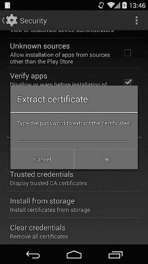
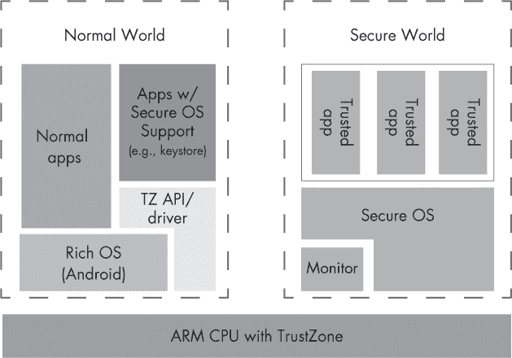
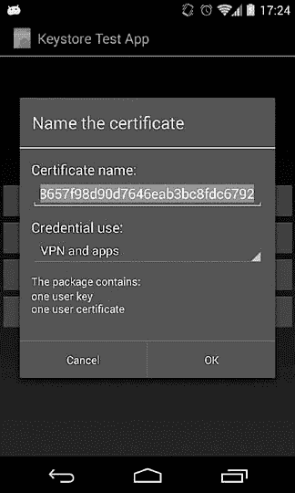
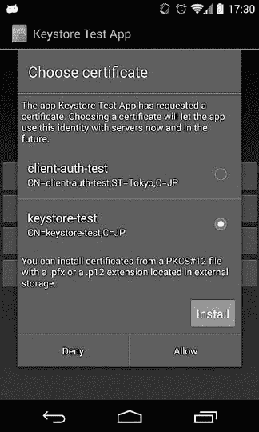
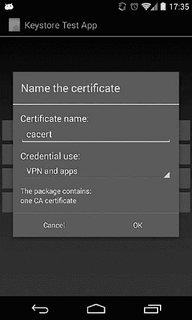
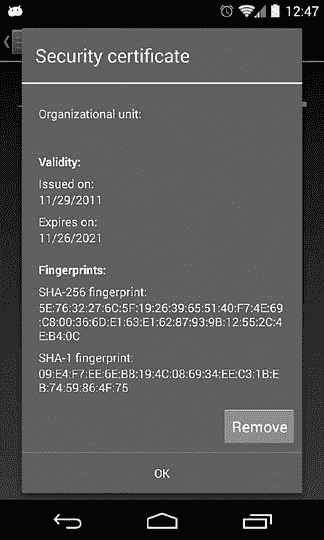
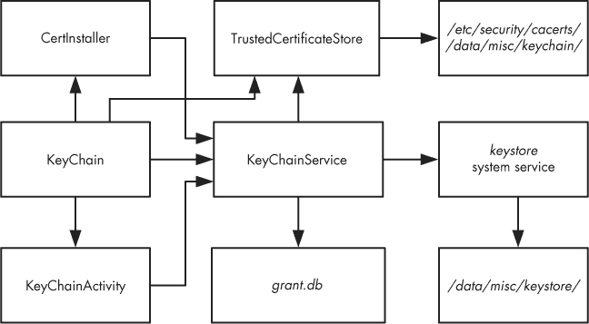

# 第七章. 凭证存储

上一章介绍了公钥基础设施（PKI）及其在管理信任过程中遇到的挑战。PKI 最常见的用途是认证你连接的实体（*服务器认证*），但它也用于认证你自己给这些实体（*客户端认证*）。客户端认证主要出现在企业环境中，用于从桌面登录到远程访问公司服务器等各种场景。基于 PKI 的客户端认证要求客户端通过执行一些加密操作来证明其拥有认证密钥（通常是 RSA 私钥），服务器可以独立验证这些操作。因此，客户端认证的安全性在很大程度上依赖于防止未经授权的使用认证密钥。

大多数操作系统提供系统服务，应用可以利用该服务安全地存储和访问认证密钥，而无需自己实现密钥保护。Android 自 1.6 版本起就提供了这样的服务，并且自 Android 4.0 以来有了显著改进。

Android 的凭证存储可以用来存储内置功能的凭证，如 Wi-Fi 和 VPN 连接凭证，以及第三方应用的凭证。应用可以通过标准 SDK API 访问凭证存储，并利用它安全地管理密钥。最近的 Android 版本引入了硬件支持的密钥存储，提供了更强的密钥保护。 本章讨论了 Android 凭证存储的架构和实现，并介绍了它提供的公共 API。

# VPN 和 Wi-Fi EAP 凭证

*虚拟专用网络 (VPN)* 是提供远程访问私有企业服务的首选方式。我们将在第九章中更详细地讨论 VPN 及相关技术，但简单来说，VPN 通过在远程客户端和公共隧道端点之间创建加密隧道，使远程客户端能够加入私有网络。VPN 的实现方式在隧道技术的使用上有所不同，但在建立安全连接之前，所有 VPN 都需要验证客户端身份。虽然某些 VPN 使用共享密钥或密码进行认证，但企业解决方案通常依赖基于公钥基础设施（PKI）的客户端认证。

*可扩展认证协议 (EAP)* 是一种在无线网络和点对点（P2P）连接中常用的认证框架。（EAP 在第九章中有更详细的讨论。）像 VPN 一样，EAP 可以使用多种不同的认证方法，但在企业环境中，EAP-传输层安全性 (EAP-TLS) 被首选，特别是在公司 PKI 已经部署的情况下。

## 认证密钥和证书

在 EAP-TLS 和基于 PKI 的 VPN 的情况下，客户端拥有身份验证密钥，并被颁发一个匹配的证书，通常由公司证书授权中心（CA）颁发。密钥有时存储在便携式、防篡改的设备中，如智能卡或 USB 密钥。这大大提高了安全性，因为密钥不能从设备中导出或提取，因此身份验证既需要物理持有令牌，又需要知道相关的 PIN 或密码。

当安全策略允许使用不受硬件设备保护的身份验证密钥时，密钥及其相关证书通常存储在标准的 PKCS#12 文件格式中。存储在 PKCS#12 文件中的私钥使用从用户提供的密码派生的对称密钥加密，因此提取密钥需要知道密码。有些应用程序使用 PKCS#12 文件作为安全容器，只有在需要时才将密钥和证书提取到内存中，但通常它们会在使用之前被导入到系统或应用程序特定的凭据存储中。这也是 Android 的工作方式。

在 Android 上导入凭据的用户界面实现相当简单：为了导入身份验证密钥和相关证书，用户将其 PKCS#12 文件（如果需要，还包括任何相关的 CA 证书）复制到设备的外部存储（通常是 SD 卡），然后从**安全性**系统设置屏幕中选择**从存储安装**。Android 会在外部存储的根目录中搜索匹配的文件（扩展名为 *.pfx* 或 *.p12*），并呈现一个导入对话框（参见 图 7-1）。如果提供了正确的密码，密钥将从 PKCS#12 文件中提取并导入到系统凭据存储中。

## 系统凭据存储

系统凭据存储是一个系统服务，在将导入的凭据存储到磁盘之前，会先对它们进行加密。加密密钥来自用户提供的密码：在 4.0 版本之前为专用的凭据存储保护密码，或者在 4.0 版本之后为设备解锁滑动模式、PIN 或密码。此外，凭据存储系统服务还会调节对存储凭据的访问，确保只有明确被授予访问权限的应用程序才能访问密钥。

原始凭据存储在 Android 1.6 中引入，最初仅限于存储 VPN 和 Wi-Fi EAP 凭据。只有系统—而非第三方应用程序—能够访问存储的密钥和证书。此外，导入凭据的唯一受支持方式是通过前面部分中概述的系统设置界面进行操作，并且没有公开的凭据存储管理 API。

访问系统凭据存储的 API 首次在 Android 4.0 中引入。系统凭据存储后来扩展为支持硬件加速的凭据存储，并提供不仅是共享系统密钥，还有应用私有密钥。表 7-1 显示了每个 Android 版本中添加的主要凭据存储增强功能的摘要。我们将在接下来的章节中介绍这些增强功能及相关 API。



图 7-1. PKCS#12 文件密码对话框

表 7-1. 凭据存储功能进展

| Android 版本 | API 等级 | 凭据存储变化 |
| --- | --- | --- |
| 1.6 | 4 | 增加了 VPN 和 Wi-Fi 的凭据存储支持。 |
| 4.0 | 14 | 添加了凭据存储的公共 API（`KeyChain` API）。 |
| 4.1 | 16 | 增加了生成和使用密钥而不导出的能力。引入了 keymaster HAL 模块，并对硬件加速 RSA 密钥存储提供了初步支持。 |
| 4.3 | 18 | 增加了通过*AndroidKeyStore* JCA 提供程序生成和访问应用私有密钥的支持，并增加了检查设备是否支持硬件加速 RSA 密钥存储的 API。 |
| 4.4 | 19 | 向*AndroidKeyStore* JCA 提供程序添加了对 ECDSA 和 DSA 的支持。 |

# 凭据存储实现

现在我们知道，Android 能够加密导入的凭据并管理对它们的访问。接下来我们看看这些是如何在底层实现的。

## 凭据存储服务

Android 中的凭据存储管理最初是由一个名为*keystore*的本地守护进程实现的。其最初功能仅限于以加密形式存储任意的二进制数据并验证凭据存储密码，但随着 Android 的发展，它被扩展了新功能。它为客户端提供了基于本地套接字的接口，每个客户端负责管理自己的状态和套接字连接。为了更好地与其他框架服务集成并促进扩展，Android 4.3 中将*keystore*守护进程替换为集中式的 Binder 服务。接下来我们来看一下这个*keystore*服务是如何工作的。

*keystore*服务定义在*init.rc*中，如示例 7-1 所示。

示例 7-1. keystore 服务定义在 init.rc

```
service keystore /system/bin/keystore /data/misc/keystore
    class main
    user keystore
    group keystore drmrpc
```

如你所见，*keystore*服务以专用的*keystore*用户身份运行，并将文件存储在*/data/misc/keystore/*中。我们先来看一下*/data/misc/keystore/*目录。如果你使用的是单用户设备，例如手机，你只会在*keystore/*目录下找到一个*user_0/*目录（见示例 7-2，时间戳已删除），但在启用多用户的设备上，你应该会为每个 Android 用户找到一个目录。

示例 7-2. 单用户设备上的密钥存储目录示例内容

```
# ls -la /data/misc/keystore/user_0
-rw------- keystore keystore       84 .masterkey
-rw------- keystore keystore      980 1000_CACERT_cacert
-rw------- keystore keystore      756 1000_USRCERT_test
-rw------- keystore keystore      884 1000_USRPKEY_test
-rw------- keystore keystore      724 10019_USRCERT_myKey
-rw------- keystore keystore      724 10019_USRCERT_myKey1
```

在此示例中，每个文件名由创建它的应用程序的 UID（1000 是*系统*）、条目类型（CA 证书、用户证书或私钥）和密钥名称（别名）组成，并用下划线连接。从 Android 4.3 开始，系统和应用私有密钥也得到了支持，UID 反映了 Android 用户 ID 以及应用程序 ID。在多用户设备中，用户 ID 为`UID / 100000`，如第四章中所述。

除了系统或应用程序拥有的密钥二进制数据外，还有一个单独的*.masterkey*文件，稍后我们将讨论这个文件。当一个拥有存储管理密钥的应用程序被用户卸载时，仅会删除该用户创建的密钥。如果应用程序从系统中完全删除，它的密钥会对所有用户删除。由于密钥访问与应用程序 ID 相关联，这个功能防止了另一个恰好获得相同 UID 的应用程序访问已卸载应用程序的密钥。（密钥存储重置会删除密钥文件和主密钥，并且仅影响当前用户。）

在默认的软件实现中，这些文件包含以下内容（硬件支持的实现可能有所不同；它们通常存储的不是加密的密钥数据，而是仅存储指向硬件管理密钥对象的引用）：

+   主密钥（存储在*.masterkey*中）使用从屏幕解锁密码派生的 128 位 AES 密钥进行加密，该密钥通过应用*PBKDF2*密钥派生函数，进行 8192 次迭代并使用随机生成的 128 位盐值。该盐值存储在*.masterkey*文件的头部信息中。

+   所有其他文件存储的是密钥二进制数据。*密钥二进制数据*（binary large object，简称 key blob）包含一个序列化的、可选加密的密钥，以及一些描述该密钥的数据（元数据）。每个密钥存储的密钥二进制数据包含一个元数据头部、用于加密的初始向量（IV），以及一个将数据的 MD5 哈希值与数据本身连接的字符串，并使用 128 位 AES 主密钥进行 CBC 模式加密。或者更简洁地表示为：`metadata || Enc(MD5(data) || data)`。

实际上，这种架构意味着，Android 密钥存储对于软件解决方案来说是相当安全的。即使你有访问权限到一个已经获取 root 权限的设备，并设法提取密钥二进制数据，你仍然需要密钥存储密码来推导出主密钥。为了尝试不同的密码以解密主密钥，至少需要进行 8192 次迭代才能推导出一个密钥，这在成本上是不可接受的。此外，由于推导函数使用 128 位随机数作为种子，不能使用预计算的密码表。不过，使用的基于 MD5 的完整性机制并未采用标准的消息认证码（MAC）算法，例如 HMAC，而是原始实现的遗留部分。它保留是为了向后兼容，但在未来的版本中可能会被替换。

## 密钥二进制数据版本和类型

从 Android 4.1 开始，密钥数据中添加了两个字段：*version*和*type*。当前版本（截至 Android 4.4）是*2*，当应用首次访问密钥时，密钥数据会自动升级到最新版本。根据目前的信息，已定义以下密钥类型：

+   `TYPE_ANY`

+   `TYPE_GENERIC`

+   `TYPE_MASTER_KEY`

+   `TYPE_KEY_PAIR`

`TYPE_ANY`是一个元密钥类型，可以匹配任何密钥类型。`TYPE_GENERIC`用于通过原始的 get/put 接口保存的密钥数据，这个接口存储任意的二进制数据，而`TYPE_MASTER_KEY`当然仅用于 keystore 的主密钥。`TYPE_KEY_PAIR`类型用于通过`generate_keypair`和`import_keypair`操作创建的密钥数据，这些操作是 Android 4.1 中新增的功能。我们将在“keymaster 模块和 keystore 服务实现”一节中讨论这些内容。

Android 4.3 是第一个使用密钥数据的`flags`字段的版本。它使用这个字段来区分加密的（默认）和未加密的密钥数据。受硬件实现保护的密钥数据（某些设备上可用）会在没有额外加密的情况下存储。

## 访问限制

密钥数据由*keystore*用户拥有，因此在普通（非 root）设备上，你需要通过*keystore*服务才能访问它们。*keystore*服务施加以下访问限制：

+   *root*用户无法锁定或解锁 keystore，但可以访问系统密钥。

+   *system*用户可以执行大多数 keystore 管理操作（如初始化、重置等），并存储密钥。然而，*system*用户无法使用或检索其他用户的密钥。

+   非系统用户可以插入、删除和访问密钥，但只能查看自己的密钥。

现在我们知道了*keystore*服务的作用，接下来让我们看看实际的实现。

## keymaster 模块和 keystore 服务实现

虽然原始的守护进程实现将密钥数据管理和加密功能合并在一个二进制文件中，但 Android 4.1 引入了新的*keymaster 硬件抽象层(HAL)*系统模块，负责生成非对称密钥以及签名/验证数据，而无需先导出密钥。

*keymaster*模块旨在将*keystore*服务与底层的非对称密钥操作实现解耦，并允许更容易地集成特定设备的硬件支持实现。一个典型的实现会使用厂商提供的库与加密硬件进行通信，并提供一个“粘合”HAL 库，供*keystore*守护进程链接使用。

Android 还自带了一个默认的*softkeymaster*模块，该模块仅通过软件执行所有密钥操作（使用系统的 OpenSSL 库）。该模块在模拟器中使用，并包含在缺少专用加密硬件的设备中。生成的密钥大小最初固定为 2048 位，并且只支持 RSA 密钥。Android 4.4 添加了对指定密钥大小的支持，并支持数字签名算法（DSA）和椭圆曲线 DSA（ECDSA）算法及其相应的密钥。

截至目前，默认的*softkeymaster*模块支持 RSA 和 DSA 密钥，密钥大小范围为 512 至 8192 位。如果没有明确指定密钥大小，DSA 密钥默认是 1024 位，RSA 密钥默认是 2048 位。对于 EC 密钥，密钥大小将映射到一个标准曲线及其相应的字段大小。例如，当指定密钥大小为 384 时，将使用*secp384r1*曲线来生成密钥。目前支持以下标准曲线：*prime192v1*、*secp224r1*、*prime256v1*、*secp384r1*和*secp521r1*。如果将它们转换为标准的 PKCS#8 格式，支持的算法的密钥也可以导入。

HAL 模块接口定义在*hardware/keymaster.h*中，并定义了以下操作。

+   `generate_keypair`

+   `import_keypair`

+   `sign_data`

+   `verify_data`

+   `get_keypair_public`

+   `delete_keypair`

+   `delete_all`

所有由*keystore*服务暴露的非对称密钥操作都是通过调用系统的*keymaster*模块来实现的。因此，如果*keymaster* HAL 模块由硬件加密设备支持，那么所有使用*keystore*服务接口的上层命令和 API 将自动使用硬件加密。除了非对称密钥操作外，所有其他凭证存储操作都由*keystore*系统服务实现，并不依赖于 HAL 模块。该服务通过*android.security.keystore*名称注册到 Android 的`ServiceManager`，并在启动时启动。与大多数 Android 服务不同，它是用 C++实现的，且实现位于*system/security/keystore/*目录下。

## Nexus 4 硬件支持实现

为了让大家更好地理解“硬件支持”的概念，我们简要讨论一下 Nexus 4 上如何实现这一点。Nexus 4 基于高通的 Snapdragon S4 Pro APQ8064 芯片系统（SoC）。像大多数最新的 ARM SoC 一样，它支持 TrustZone，并且在此基础上实现了高通的安全执行环境（QSEE）。

ARM 的 TrustZone 技术提供了两个由硬件访问控制支持的虚拟处理器，这使得 SoC 系统可以被划分为两个虚拟“世界”：用于安全子系统的*安全世界*，以及用于其他所有内容的*普通世界*。运行在安全世界中的应用程序被称为*受信应用程序*，并且只能通过它们显式公开的有限接口，供普通世界应用程序（Android 操作系统和应用程序运行的地方）访问。图 7-2 显示了一个典型的 TrustZone 启用系统的软件配置。



图 7-2. TrustZone 软件架构

一如既往，实施细节相当稀缺，但在 Nexus 4 中，唯一与受信应用程序交互的方式是通过*/dev/qseecom*设备提供的受控接口。希望与 QSEE 交互的 Android 应用程序会加载专有的*libQSEEComAPI.so*库，并使用其函数向 QSEE 发送命令。

与大多数其他 SEE（安全执行环境）一样，*QSEECom*通信 API 相当低级，基本上只允许交换不透明的二进制数据（通常是命令和响应），其内容完全依赖于你正在与之通信的安全应用程序。在 Nexus 4 的*keymaster*中，使用的命令有：`GENERATE_KEYPAIR`、`IMPORT_KEYPAIR`、`SIGN_DATA`和`VERIFY_DATA`。*keymaster*的实现仅创建命令结构，通过*QSEECom* API 发送它们，并解析响应。它不包含任何加密代码。

一个有趣的细节是，QSEE 的*密钥存储*受信应用程序（这可能不是一个专用应用程序，而是一个更通用的受信应用程序的一部分）不会返回简单的受保护密钥引用；它使用专有的加密密钥二进制数据。在这种模型中，唯一由硬件实际保护的是某种形式的主密钥加密密钥（KEK）；用户生成的密钥仅通过使用 KEK 加密间接受到保护。

这种方法允许几乎无限数量的受保护密钥，但它的缺点是，如果 KEK 被破解，所有外部存储的密钥二进制数据也将被破解。（当然，实际的实现可能会为每个创建的密钥二进制数据生成专用的 KEK，或者密钥可以被硬件烧录；无论如何，对于内部实现没有可用的细节。）话虽如此，高通*keymaster*密钥二进制数据在 AOSP 代码中有定义（在示例 7-3 中显示），该定义表明私钥指数使用 AES ➊加密，最有可能采用 CBC 模式，并添加了 HMAC-SHA256 ➋来检查加密数据的完整性。

示例 7-3. QSEE keymaster 二进制数据定义（针对 Nexus 4）

```
#define KM_MAGIC_NUM     (0x4B4D4B42)    /* "KMKB" Key Master Key Blob in hex */
#define KM_KEY_SIZE_MAX  (512)           /* 4096 bits */
#define KM_IV_LENGTH     (16)           ➊/* AES128 CBC IV */
#define KM_HMAC_LENGTH   (32)           ➋/* SHA2 will be used for HMAC */

struct qcom_km_key_blob {
  uint32_t magic_num;
  uint32_t version_num;
  uint8_t modulus[KM_KEY_SIZE_MAX];➌
  uint32_t modulus_size;
  uint8_t public_exponent[KM_KEY_SIZE_MAX];➍
  uint32_t public_exponent_size;
  uint8_t iv[KM_IV_LENGTH];➎
  uint8_t encrypted_private_exponent[KM_KEY_SIZE_MAX];➏
  uint32_t encrypted_private_exponent_size;
  uint8_t hmac[KM_HMAC_LENGTH];➐
};
```

如你在示例 7-3 中看到的，QSEE 密钥 blob 包含密钥模数 ➌、公钥指数 ➍、用于私钥加密的 IV ➎、私钥本身 ➏ 和 HMAC 值 ➐。

由于 Nexus 4 中使用的 QSEE 是通过处理器的 TrustZone 功能实现的，因此在这种情况下，硬件支持的凭证存储的“硬件”实际上只是 ARM SoC。是否可能有其他实现？理论上，基于硬件的*密钥大师*实现不需要依赖于 TrustZone。任何能够安全生成和存储密钥的专用设备都可以使用，常见的候选设备包括嵌入式安全元件（SE）和受信平台模块（TPM）。我们将在第十一章中讨论 SE 和其他防篡改设备，但截至目前，没有主流 Android 设备配备专用的 TPM，最近的旗舰设备也开始出货时不再内置 SE。因此，使用专用硬件的实现不太可能出现在主流设备中。

### 注意

*当然，所有移动设备都有某种形式的*通用集成电路卡（UICC）*，通常被称为 SIM 卡，通常可以生成和存储密钥，但 Android 仍然没有标准 API 来访问 UICC，尽管供应商的固件通常包含该功能。因此，虽然理论上可以实现基于 UICC 的*密钥大师*模块，但它只适用于定制的 Android 版本，并且需要运营商在其 UICC 中包括支持。*

## 框架集成

虽然安全地管理凭证是 Android 凭证存储的关键特性，但其主要目的是无缝地向系统的其余部分提供此服务。在介绍可供第三方应用程序使用的公共 API 之前，我们简要讨论它如何与 Android 的其余部分集成。

因为*密钥库*服务是一个标准的 Binder 服务，所以潜在的客户端只需要从`ServiceManager`获取对它的引用即可使用它。Android 框架提供了一个单例的`android.security.KeyStore`隐藏类，该类负责获取对*密钥库*服务的引用，并充当它暴露的`IKeystoreService`接口的代理。大多数系统应用程序，如 PKCS#12 文件导入器（参见图 7-1）以及一些公共 API 的实现，使用`KeyStore`代理类与*密钥库*服务进行通信。

对于一些较低级别的库（如原生库和核心 Java 库中的 JCA 类），它们不是 Android 框架的一部分，系统凭证存储的集成是通过一个名为*Android 密钥库引擎*的 OpenSSL 引擎间接提供的。

OpenSSL 引擎是一个可插拔的加密模块，作为动态共享库实现。*keystore* 引擎就是一个这样的模块，它通过调用系统的 *keymaster* HAL 模块来实现所有操作。它仅支持使用 RSA、DSA 或 EC 私钥加载和签名，但足以实现基于密钥的身份验证（如 SSL 客户端身份验证）。*keystore* 引擎使得使用 OpenSSL API 的原生代码能够使用保存在系统凭据存储中的私钥，而无需修改代码。它还具有一个 Java 包装器（`OpenSSLEngine`），用于在 JCA 框架中实现对 keystore 管理的私钥的访问。

# 公共 API

虽然系统应用可以直接通过 `android.security.KeyStore` 代理类或通过 *keystore* 守护进程 AIDL 接口访问，但这些接口与实现过于紧密耦合，不适合作为公共 API 的一部分。Android 提供了更高级的抽象层，供第三方应用使用 `KeyChain` API 和 *AndroidKeyStoreProvider* JCA 提供程序。我们将在以下部分展示如何使用这些 API，并提供一些实现细节。

## KeyChain API

自 Android 1.6 起，Android 提供了一个系统范围的凭据存储，但当时仅限内建的 VPN 和 Wi-Fi EAP 客户端使用。虽然可以通过设置应用安装私钥/证书对，但已安装的密钥无法被第三方应用访问。

Android 4.0 引入了用于受信任证书管理和安全凭据存储的 SDK API，提供了 `KeyChain` 类。此功能在 Android 4.3 中得到扩展，支持新引入的硬件支持功能。我们将在以下部分讨论如何使用此功能，并回顾其实现。

### KeyChain 类

`KeyChain` 类非常简单：它提供了六个公共静态方法，足以完成大多数与证书和密钥相关的任务。我们将看看如何安装私钥/证书对，并使用该对访问凭据存储管理的私钥。

`KeyChain` API 允许你安装捆绑在 PKCS#12 文件中的私钥/证书对。`KeyChain.createInstallIntent()` 工厂方法是访问此功能的入口。它不接受任何参数，并返回一个系统意图，该意图可以解析并安装密钥和证书。（这实际上是系统设置应用程序内部使用的相同意图。）

### 安装 PKCS#12 文件

要安装 PKCS#12 文件，你必须将其读取到字节数组中，存储在意图的 extras 中的 `EXTRA_PKCS12` 键下，然后启动相关的活动（参见 示例 7-4）：

示例 7-4：使用 `KeyChain` API 安装 PKCS#12 文件

```
Intent intent = KeyChain.createInstallIntent();
byte[] p12 = readFile("keystore-test.pfx");
intent.putExtra(KeyChain.EXTRA_PKCS12, p12);
startActivity(intent);
```



图 7-3：私钥和证书导入对话框

这应该提示你输入 PKCS#12 密码，以便提取和解析密钥和证书。如果密码正确，系统将提示你输入证书名称，如图 7-3 所示。如果 PKCS#12 包含友好名称属性，它将作为默认值显示；如果没有，你将看到一个长的十六进制哈希字符串。你在此处输入的字符串是你以后可以使用的密钥或证书别名，可以通过 `KeyChain` API 查找并访问这些密钥。如果你还没有设置锁屏 PIN 或密码，系统将提示你设置，以保护凭证存储。

### 使用私钥

要使用存储在系统凭证存储中的私钥，你需要使用其别名获取对该密钥的引用，并请求用户授权访问该密钥。如果你之前从未访问过密钥，也不知道其别名，你需要首先调用 `KeyChain.choosePrivateKeyAlias()` 并提供一个回调实现，该回调接收选中的别名，如示例 7-5 所示。

示例 7-5. 使用存储在系统凭证存储中的私钥

```
public class KeystoreTest extends Activity implements OnClickListener,
KeyChainAliasCallback {
   @Override
   public void onClick(View v) {
       KeyChain.choosePrivateKeyAlias(➊this, ➋(KeyChainAliasCallback)this,
          ➌new String[] { "RSA" }, ➍null, ➎null, ➏-1, ➐null);
   }
   @Override
   public void alias(final String alias) {➑
       Log.d(TAG, "Thread: " + Thread.currentThread().getName());
       Log.d(TAG, "selected alias: " + alias);
   }
}
```

第一个参数 ➊ 是当前上下文；第二个 ➋ 是要调用的回调；第三个和第四个分别指定了可接受的密钥 ➌（`RSA`、`DSA` 或 `null` 表示任何密钥）和与私钥匹配的证书颁发机构 ➍。接下来的两个参数是请求证书的服务器的主机 ➎ 和端口号 ➏，最后一个参数 ➐ 是要在密钥选择对话框中预选的别名。我们将除密钥类型之外的所有参数留为未指定（`null` 或 `-1`），以便能够从所有可用证书中进行选择。请注意，`alias()` ➑ 回调不会在主线程上调用，因此不要尝试直接在回调中操作 UI。（它是在一个绑定线程上调用的。）

使用密钥需要用户授权，因此 Android 应该显示一个密钥选择对话框（见图 7-4），该对话框也用于授权访问选中的密钥。一旦用户授予应用程序访问密钥的权限，它可以直接查找该密钥，而无需通过密钥选择对话框。



图 7-4. 密钥选择对话框

示例 7-6 展示了如何使用 `KeyChain` API 获取系统密钥库中管理的私钥的引用。

示例 7-6. 获取密钥实例及其证书链

```
PrivateKey pk =  KeyChain.getPrivateKey(context, alias);➊
X509Certificate[] chain =  KeyChain.getCertificateChain(context, alias);➋
```

要获取私钥的引用，您需要调用`KeyChain.getPrivateKey()` ➊方法，传入在前一步中收到的密钥别名。如果你尝试在主线程中调用此方法，会抛出异常，因此确保从后台线程中调用它，像`AsyncTask`工具类创建的线程那样。`getCertificateChain()` ➋方法返回与私钥相关的证书链（见示例 7-6）。如果指定别名的密钥或证书不存在，`getPrivateKey()`和`getCertificateChain()`方法将返回`null`。

### 安装 CA 证书

安装 CA 证书与安装 PKCS#12 文件没有太大区别。为此，将证书加载到字节数组中，并作为额外参数传递给安装意图下的`EXTRA_CERTIFICATE`键，如示例 7-7 所示。

示例 7-7. 使用`KeyChain` API 安装 CA 证书

```
Intent intent = KeyChain.createInstallIntent();
intent.putExtra(KeyChain.EXTRA_CERTIFICATE, cert);
startActivity(intent);
```

Android 解析证书，如果其*基本约束*扩展设置为`CA:TRUE`，则认为它是一个 CA 证书并将其导入用户信任存储。你需要进行身份验证才能导入证书。

不幸的是，导入对话框（见图 7-5）既没有显示证书的 DN，也没有显示其哈希值。用户在完成操作之前无法知道自己导入的是什么。很少有人会检查证书的有效性，因此这可能是一个潜在的安全威胁，因为恶意应用程序可能会欺骗用户安装恶意证书。

证书导入后，应显示在受信任凭证屏幕的用户选项卡中（设置 ▸ 安全性 ▸ 受信任凭证）。点击证书条目以显示详细信息对话框，你可以查看主题、颁发者、有效期、序列号和 SHA-1/SHA-256 指纹。要移除证书，请按**移除**按钮（见图 7-6）。



图 7-5. CA 证书导入对话框



图 7-6. 证书详细信息对话框

### 删除密钥和用户证书

尽管你可以删除单个 CA 证书，但无法删除单个密钥和用户证书，尽管在安全设置中的凭证存储部分有清除凭证选项，它会删除所有的密钥和用户证书。

### 注意

*只要凭证存储中有密钥，就无法移除屏幕锁，因为它用于保护密钥库的访问。*

### 获取支持的算法信息

Android 4.3 向 `KeyChain` 类添加了与新引入的硬件支持相关的两个方法。根据 API 文档，`isBoundKeyAlgorithm(String algorithm)` 方法“如果当前设备的 `KeyChain` 实现将给定算法的任何 `PrivateKey` 绑定到设备上（无论是导入还是生成），则返回 `true`。”换句话说，如果你将字符串 *RSA* 传递给此方法，如果生成或导入的 RSA 密钥具有硬件保护，不能简单地从设备上复制，它应返回 `true`。`isKeyAlgorithmSupported(String algorithm)` 方法应返回 `true`，如果当前的 `KeyChain` 实现支持指定类型的密钥（如 RSA、DSA、EC 等）。

我们已经介绍了 `KeyChain` API 的主要功能。现在让我们来看一下底层的 Android 实现。

## KeyChain API 实现

公共的 `KeyChain` 类和支持的接口位于 `android.security` Java 包中。该包还包含两个隐藏的 AIDL 文件：`IKeyChainService.aidl` 和 `IKeyChainAliasCallback`。这暗示了实际的 keystore 功能，像大多数 Android 操作系统服务一样，是作为一个远程服务实现的，公共 API 会绑定到该服务。接口 `IKeyChainAliasCallback` 在你通过 `KeyStore.choosePrivateKeyAlias()` 选择密钥时被调用，因此它的兴趣不大。`IKeyChainService.aidl` 定义了服务使用的实际系统接口，我们将在这里详细描述它。

`IKeyChainService` 接口有一个实现，即 `KeyChain` 系统应用中的 `KeyChainService` 类。除了 `KeyChainService`，该应用还包含一个活动 `KeyChain` 和一个广播接收器 `KeyChainBroadcastReceiver`。`KeyChain` 应用的 `sharedUserId` 被设置为 *android.uid.system*，因此继承了 *system* 用户的所有权限。这允许其组件向本地 *keystore* 服务发送管理命令。我们首先来检查这个服务。

`KeyChainService` 是 `android.security.KeyStore` 代理类的封装器，直接与本地 *keystore* 服务通信。它提供了四个主要服务：

+   Keystore 管理：用于获取私钥和证书的方法。

+   信任存储管理：用于在用户信任存储中安装和删除 CA 证书的方法。

+   密钥和信任存储初始化：一个 `reset()` 方法，删除所有密钥存储条目，包括主密钥，从而将 keystore 恢复到未初始化状态；它还会移除所有用户安装的受信任证书。

+   查询和添加条目到密钥访问授权数据库的方法。

## 控制对 Keystore 的访问

由于`KeyChain`应用以*系统*用户身份运行，任何绑定到其远程接口的进程在技术上都可以执行所有密钥和信任存储操作。为了防止这种情况，`KeyChainService`通过基于调用者的 UID 控制对凭据存储操作的访问，并使用密钥访问授权数据库来调节对各个密钥的访问。只有*系统*用户可以删除 CA 证书并重置密钥和信任存储（这些操作通常通过设置应用的 UI 进行调用，而设置应用以*系统*身份运行）。同样，只有*系统*用户或证书安装应用（`com.android.certinstaller`包）可以安装受信任的 CA 证书。

控制对凭据存储中单个密钥的访问比操作限制更有意思。`KeyChainService`维护一个授权数据库（位于*/data/data/com.android.keychain/databases/grants.db*），该数据库将 UID 与其被允许使用的密钥别名映射。我们可以在示例 7-8 中查看其内部结构。

示例 7-8. 授权数据库的模式和内容

```
# sqlite3 grants.db
sqlite> .schema
.schema
CREATE TABLE android_metadata (locale TEXT);
CREATE TABLE grants (alias STRING NOT NULL, uid INTEGER NOT NULL, UNIQUE (alias,uid));
sqlite> select * from grants;
select * from grants;
➊test|10044➋
➌key1|10044
```

在这个示例中，UID 为*10044* ➋的应用被授权访问别名为`test` ➊和`key1` ➌的密钥。

每次调用`getPrivateKey()`或`getCertificate()`时，都会对照授权数据库进行检查，如果未找到所需别名的授权，则会抛出异常。如前所述，`KeyChainService`具有用于添加和查询授权的 API，并且只有*系统*用户可以调用这些 API。但谁负责实际授权和撤销访问权限呢？

记得私钥选择对话框吗？(图 7-4)？当你调用`KeyChain.choosePrivateKeyAlias()`时，它会启动`KeyChainActivity`（如上所述），该活动检查密钥库是否已解锁；如果已解锁，`KeyChainActivity`会显示私钥选择对话框。点击**允许**按钮后，返回`KeyChainActivity`，它会调用`KeyChainService.setGrant()`并使用选定的别名，将其添加到授权数据库中。因此，即使请求访问私钥的活动具有所需的权限，用户仍然需要解锁密钥库并明确授权访问每个单独的密钥。

除了控制私钥存储外，`KeyChainService`还通过使用新添加的`TrustedCertificateStore`类（属于*libcore*）提供信任存储管理功能。该类既可以添加用户安装的受信任 CA 证书，也可以移除（标记为不受信任）系统（预安装）CA 证书。第六章详细讨论了其实现细节。

### KeyChainBroadcastReceiver

`KeyChain` 应用的最后一个组件是 `KeyChainBroadcastReceiver`。它监听 `android.intent.action.PACKAGE_REMOVED` 系统广播，并将控制转发给 `KeyChainService`。在接收到 `PACKAGE_REMOVED` 操作时，服务会进行一些授权数据库维护：它会遍历所有条目并删除任何不再可用的包（即已卸载的包）。

### 凭据和信任存储总结

Android 4.0 引入了一项新服务，它授予对系统密钥库（由*密钥库*系统服务管理）和信任存储（由 `TrustedCertificateStore` 类管理）的访问权限，这两个存储支持公共 SDK 中暴露的 `KeyChain` API。此功能使得可以根据调用进程的 UID 和密钥访问授权数据库来控制密钥的访问，从而实现细粒度、由用户驱动的控制，决定每个应用可以访问哪些密钥。Android 凭据和信任存储的组件及其关系展示在图 7-7 中。



图 7-7. 系统凭据存储组件

## Android Keystore 提供者

虽然在 Android 4.0 中引入的 `KeyChain` API 允许应用将密钥导入系统凭据存储区，但这些密钥归*系统*用户所有，任何应用都可以请求访问这些密钥。Android 4.3 增加了对*应用私有*密钥的支持，这使得任何应用都可以生成并保存只能由其自身访问和使用的私密密钥，且这些密钥对其他应用不可见。

与其引入另一个 Android 特有的 API，不如通过标准 JCA API 来暴露密钥库访问，即 `java.security.KeyPairGenerator` 和 `java.security.KeyStore`。这两个 API 都由新的 Android JCA 提供者 *AndroidKeyStoreProvider* 支持，并通过将 *AndroidKeyStore* 作为相应工厂方法的 `type` 参数来访问。示例 7-9 展示了如何使用 *AndroidKeyStoreProvider* 生成和访问 RSA 密钥。

示例 7-9. 使用 AndroidKeyStoreProvider 生成和访问 RSA 密钥

```
// generate a key pair
Calendar notBefore = Calendar.getInstance()
Calendar notAfter = Calendar.getInstance(); notAfter.add(1, Calendar.YEAR);
KeyPairGeneratorSpec spec = new KeyPairGeneratorSpec.Builder(ctx) .setAlias("key1")
                .setKeyType("RSA")
                .setKeySize(2048)
                .setSubject(new X500Principal("CN=test"))
                .setSerialNumber(BigInteger.ONE).setStartDate(notBefore.getTime())
                .setEndDate(notAfter.getTime()).build();➊
KeyPairGenerator kpGenerator = KeyPairGenerator.getInstance("RSA",
                              "AndroidKeyStore");
kpGenerator.initialize(spec);➋
KeyPair kp = kpGenerator.generateKeyPair();➌
// in another part of the app, access the keys
KeyStore ks = KeyStore.getInstance("AndroidKeyStore");
ks.load(null);
KeyStore.PrivateKeyEntry keyEntry = (KeyStore.PrivateKeyEntry)keyStore.getEntry("key1", null);➍
RSAPublic pubKey = (RSAPublicKey)keyEntry.getCertificate().getPublicKey();
RSAPrivateKey privKey = (RSAPrivateKey) keyEntry.getPrivateKey();
```

首先 ➊ 你创建一个 `KeyPairGeneratorSpec`，描述你想要生成的密钥以及每个密钥所关联的自动创建的自签名证书。你可以使用 `setKeyType()` 方法指定密钥类型（*RSA*、*DSA* 或 *EC*），并使用 `setKeySize()` 方法指定密钥大小。

### 注意

*每个由 `KeyStore` 对象管理的 `PrivateKeyEntry` 都需要与一个证书链相关联。Android 在生成密钥时会自动创建一个自签名证书，但你可以稍后将默认证书替换为由 CA 签名的证书。*

接下来，你使用`KeyPairGenerator` ➋ 和 `KeyPairGeneratorSpec` 实例进行初始化，然后通过调用 `generateKeyPair()` ➌ 来生成密钥。

最重要的参数是别名。你将别名传递给`KeyStore.getEntry()` ➍，以便稍后获取生成的密钥的引用。返回的密钥对象不包含实际的密钥材料；它只是指向硬件管理的密钥对象的指针。因此，它不能与依赖密钥材料直接访问的加密提供者一起使用。

如果设备有硬件支持的密钥存储实现，密钥将会在 Android 操作系统之外生成，并且即使是系统（或*root*）用户也无法直接访问这些密钥。如果实现仅为软件，则密钥将使用从解锁 PIN 或密码派生的每用户密钥加密主密钥进行加密。

# 总结

正如你在本章中学到的，Android 有一个系统凭据存储，可以用于存储 Wi-Fi 和 VPN 连接等内置功能的凭据，以及供第三方应用使用。Android 4.3 及更高版本提供了标准的 JCA API，用于生成和访问应用私有密钥，这使得非系统应用可以更加容易地安全地存储它们的密钥，而无需自己实现密钥保护。硬件支持的密钥存储在支持的设备上提供，保证即使是拥有*系统*或*root*权限的应用也无法提取密钥。大多数当前基于硬件的凭据存储实现基于 ARM 的 TrustZone 技术，并且不使用专用的防篡改硬件。
