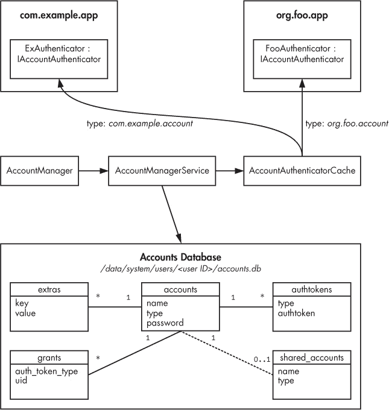
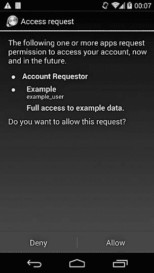
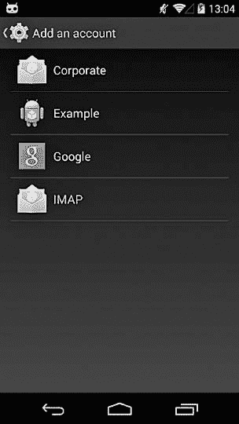
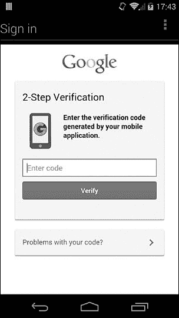
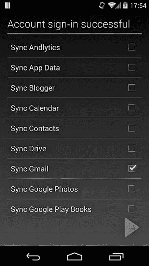
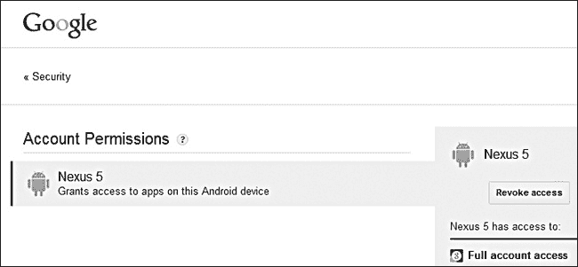
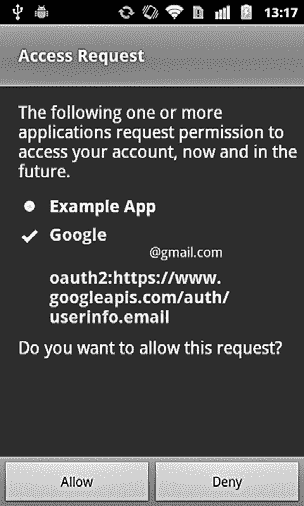
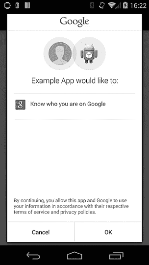

# 第八章 在线账户管理

尽管企业服务通常使用 PKI 进行用户认证，但大多数公开的在线服务依赖密码来验证用户身份。然而，在触摸屏移动设备上为不同网站多次输入复杂密码并不是一项愉快的操作。

为了改善用户在访问在线服务时的体验，Android 提供了一个集中的用户账户注册表，可以缓存和重用凭据。第三方应用可以访问这个账户注册表，从而代表设备用户访问网络服务，而不需要应用直接处理密码。在本章中，我们将讨论 Android 如何管理用户的在线账户凭据，以及应用程序可以使用的 API，以便利用缓存凭据并注册自定义账户。接着，我们将展示 Google 体验设备（即预装 Google Play 商店的设备）如何存储 Google 账户信息，并通过存储的凭据访问 Google API 和其他在线服务。

# Android 账户管理概述

尽管早期的 Android 设备内置支持 Google 账户以及与 Gmail 等 Google 服务的自动后台数据同步，但最初并未提供此功能的 API。Android 2.0（API 级别 5）引入了集中式账户管理的概念，并提供了公共 API。该 API 的核心部分是`AccountManager`类，它“提供对用户在线账户的集中式注册表的访问。用户每个账户仅需输入一次凭据（用户名和密码），就能通过‘一键’授权，允许应用程序访问在线资源。”^([78]) 该类的另一个主要功能是，它可以为受支持的账户获取认证令牌，从而允许第三方应用在无需处理用户密码的情况下认证在线服务。在某些旧版本的 Android 中，`AccountManager`还会监控 SIM 卡，并在更换卡片时清除缓存凭据，但这个功能在 Android 2.3.4 及以后版本中已被移除。

# 账户管理实现

与大多数 Android 系统 API 一样，`AccountManager`只是`AccountManagerService`的外壳，实际的工作由它完成。然而，该服务并未提供任何特定形式的认证实现。它仅仅协调多个可插拔的认证模块，以支持不同的账户类型（如 Google、Twitter、Microsoft Exchange 等）。任何应用程序都可以通过实现账户认证器和相关类来注册一个认证模块（如果需要的话）。我们将在“添加认证模块”中展示如何编写和注册一个自定义的认证模块。

将新账户类型注册到系统中可以让你利用多个 Android 基础设施服务，包括以下能力：

+   在系统数据库中使用集中式凭证存储

+   向第三方应用发放令牌

+   利用 Android 的自动后台同步（通过同步适配器）

图 8-1 显示了 Android 账户管理子系统的主要组件及其关系。每个组件及其角色将在接下来的章节中描述。



图 8-1. 账户管理组件

## AccountManagerService 和 AccountManager

这里的核心是 `AccountManagerService`，它协调所有其他组件并将账户数据持久化到账户数据库中。`AccountManager` 类是一个外观模式，它向第三方应用暴露其部分功能。它为异步方法启动工作线程，并将结果（或错误详情）返回给调用者。此外，当请求的令牌或功能可以由多个账户提供时，`AccountManager` 会显示账户选择器。然而，它不强制执行任何权限；所有调用者的权限由 `AccountManagerService` 检查，我们稍后会讨论具体的权限。

## 身份验证模块

如上所述，每个注册账户的功能是由可插拔的身份验证模块提供的，那么什么是身份验证模块呢？*身份验证模块*是由应用程序定义并托管的，每个模块只是一个实现了 `android.accounts.IAccountAuthenticator` AIDL 接口的绑定服务。该接口具有添加账户、提示用户输入凭证、获取身份验证令牌以及更新账户元数据的方法。实际上，应用程序并不直接实现此接口，而是扩展 `android.accounts.AbstractAccountAuthenticator` 类，该类将实现方法与内部 AIDL 存根链接。

`AbstractAccountAuthenticator` 还确保所有调用 AIDL 存根的客户端都持有 `ACCOUNT_MANAGER` 权限；这是一个系统签名权限，仅允许系统组件直接调用身份验证模块。所有其他客户端需要通过 `AccountManagerService`。

每个认证模块实现一个由字符串唯一标识的账户，称为*账户类型*。账户类型通常采用反向域名表示法（类似于 Java 包），通常使用定义应用程序的基础包名与账户类型、*账户* 或 *auth* 字符串连接而成（不过 Android 并不强制执行此规则，且没有明确的指导方针）。例如，在图 8-1 中，`com.example.app` 应用定义了一个类型为 `com.example.account` 的账户，而 `org.foo.app` 应用定义了一个类型为 `org.foo.account` 的账户。

认证模块通过添加一个服务来实现，该服务可以通过使用 *android.accounts.AccountAuthenticator* 意图操作与主机应用程序绑定。账户类型以及其他元数据通过向服务声明中添加 `<meta-data>` 标签与该服务关联。标签的 `resource` 属性指向一个包含账户元数据的 XML 文件（示例请参见 示例 8-8）。

### 注意

*<meta-data>* 标签允许将包含任意数据的键值对与其父组件关联。数据可以是字面值，如字符串或整数，也可以是对 Android 资源文件的引用。每个组件也支持多个 *<meta-data>* 标签。所有 *<meta-data>* 标签的值会收集到一个单独的 *Bundle* 对象中，并作为 *PackageItemInfo* 类（封装组件属性值的具体类的基类，例如 *ServiceInfo*）的 *metaData* 字段提供。关联元数据的解释是特定于组件的。

## 认证模块缓存

“可插拔性”由 `AccountAuthenticatorCache` 类提供，它扫描定义认证模块的包，并将它们提供给 `AccountManagerService`。`AccountAuthenticatorCache` 是 Android 提供的更通用的注册服务缓存机制的一种实现。该缓存按需（延迟）构建，通过查询 `PackageManagerService` 来获取安装的包，这些包注册了特定的意图动作和元数据文件。广播接收器会在安装包被添加、更新或删除时触发更新，以保持缓存的最新状态。缓存是持久化的，每次检测到变化时都会写入磁盘，缓存文件被写入到 */data/system/registered_services/* 目录，并以它们扫描的意图动作命名。认证模块缓存被保存到 *android.accounts.AccountAuthenticator.xml* 文件中，内容可能类似于 示例 8-1。

示例 8-1. *AccountAuthenticator.xml* 注册服务缓存文件的*内容*

```
<?xml version='1.0' encoding='utf-8' standalone='yes' ?>
<services>
    <service uid="10023" type="com.android.exchange" />➊
    <service uid="10023" type="com.android.email" />➋
    <service uid="10069" type="com.example.account" />➌
    <service uid="10074" type="org.foo.account" />➍
    --*snip*--
    <service uid="1010023" type="com.android.email" />➎
    <service uid="1010023" type="com.android.exchange" />➏
    <service uid="1010069" type="com.example.account" />➐
    --*snip*--
</services>
```

这里，*com.android.exchange* 和 *com.android.email* 账户类型（➊ 和 ➋）由系统自带的邮件应用注册，而 *com.example.account* 和 *org.foo.account*（➌ 和 ➍）由第三方应用注册。在多用户设备上，缓存文件会包含每个用户可用账户的条目。

在这个例子中，第一个次级用户（用户 ID 10）可以使用 *com.android.exchange*、*com.android.email* 和 *com.example.account*（➎、➏ 和 ➐），但不能使用 *org.foo.account* 账户（因为文件中没有它的条目）。当 `AccountManagerService` 需要对特定账户执行操作时，它通过传递账户类型查询 `AccountAuthenticatorCache` 以获取实现服务。如果当前用户已注册该账户类型的实现，`AccountAuthenticatorCache` 会返回包含实现服务信息的详细信息，其中包括实现组件的名称和主机包的 UID。`AccountManagerService` 使用这些信息绑定到服务，从而能够调用该服务实现的 `IAccountAuthenticator` 接口的方法。

## AccountManagerService 操作与权限

如 图 8-1 所示，`AccountManagerService` 通过调用认证模块或使用账户数据库中的缓存数据来实现其功能。第三方组件只能使用 `AccountManagerService` 暴露的 API；它们不能访问认证模块或账户数据库。这个集中的接口保证了操作流程，并对每个操作执行访问控制。

`AccountManagerService`通过权限、调用者 UID 和签名检查的组合实现访问控制。让我们来看一下它提供的操作以及相应的权限检查。

### 列出和验证账户

客户端可以通过调用`getAccounts()`方法之一获取匹配特定条件（包括类型、声明包和其他特性）的账户列表，他们还可以通过调用`hasFeatures()`方法检查特定账户是否具有所需特性。这些操作需要`GET_ACCOUNTS`权限，且具有*普通*保护级别。可以通过调用`addAccount()`方法（启动一个特定实现的*认证器活动*，从用户收集凭据）或通过调用`addAccountExplicitly()`方法静默添加新的账户，该方法以账户、密码和任何相关用户数据作为参数。第一个方法要求调用者拥有`MANAGE_ACCOUNTS`权限，而第二个方法则要求调用者同时拥有`AUTHENTICATE_ACCOUNTS`权限，并且与账户的认证器具有相同的 UID。这两个权限的保护级别为*dangerous*，因此在应用程序安装时需要用户确认。要求`addAccountExplicitly()`的调用者与认证器具有相同 UID，确保只有相同的应用程序或属于相同共享用户 ID（有关详细信息，请参见第二章）的应用程序，才能在无需用户交互的情况下添加账户。

其他需要调用者同时拥有`AUTHENTICATE_ACCOUNTS`权限，并与账户认证器具有相同 UID 的操作列举如下。（为了清晰起见，我们在此及以下部分省略了`AccountManager`方法的参数。有关完整的方法签名和更多信息，请参见`AccountManager`类的参考文档^([79])。）

+   ****`getPassword()`****。返回原始缓存密码。

+   ****`getUserData()`****。返回与指定键匹配的认证器特定账户元数据。

+   ****`peekAuthToken()`****。返回指定类型的缓存令牌（如果可用）。

+   ****`setAuthToken()`****。为账户添加或替换认证令牌。

+   ****`setPassword()`****。为账户设置或清除缓存密码。

+   ****`setUserData()`****。设置或清除指定键的元数据条目。

### 管理账户

正如添加新账户时一样，删除现有账户也需要`MANAGE_ACCOUNTS`权限。然而，如果调用设备用户设置了`DISALLOW_MODIFY_ACCOUNTS`限制（有关用户限制的更多信息，请参见第四章），则即使调用应用程序拥有`MANAGE_ACCOUNTS`权限，他们也无法添加或删除账户。其他需要此权限的方法包括修改账户属性或凭据的方法，具体如下所示。

+   ****`clearPassword()`****. 清除缓存的密码。

+   ****`confirmCredentials()`****. 明确确认用户知道密码（即使密码已经缓存），通过显示密码输入界面来实现。

+   ****`editProperties()`****. 显示一个用户界面，允许用户更改全局身份验证器设置。

+   ****`invalidateAuthToken()`****. 从缓存中移除身份验证令牌。（如果调用者持有`USE_CREDENTIALS`权限，也可以调用此方法。）

+   ****`removeAccount()`****. 删除现有账户。

+   ****`updateCredentials()`****. 请求用户输入当前密码，并相应更新保存的凭据。

### 使用账户凭据

`AccountManagerService`可能要求其客户端持有的最终权限是`USE_CREDENTIALS`。此权限保护返回或修改*身份验证令牌*的方法，身份验证令牌是一个服务相关的凭据字符串，客户端可以使用该令牌在不发送密码的情况下进行服务器请求的身份验证。

通常，在客户端使用用户名和密码（或其他永久凭据）成功进行身份验证后，服务器会返回一个身份验证令牌。该令牌通过一个字符串来标识，称为*令牌类型*，它描述了令牌所授予的访问类型（例如，只读或读写）。该令牌是可重用的，可以用于发送多个请求，但可能有有效期限制。此外，如果某个用户账户被认为已被泄露，或者用户更改了密码，通常会使该用户的所有现有身份验证令牌在服务器上失效。在这种情况下，使用缓存的身份验证令牌的请求将因身份验证错误而失败。由于`AccountManagerService`与协议和应用程序无关，它不会自动使缓存的令牌失效，即使它们已经过期或在服务器上被作废。应用程序需要通过调用`invalidateAuthToken()`方法来负责清除这些无效的缓存令牌。

以下是需要`USE_CREDENTIALS`权限的方法：

+   ****`getAuthToken()`****. 获取指定类型的身份验证令牌，适用于特定账户。

+   ****`invalidateAuthToken()`****. 从缓存中移除身份验证令牌。（如果调用者持有`MANAGE_ACCOUNTS`权限，也可以调用此方法。）



图 8-2. 账户访问请求对话框

### 请求身份验证令牌访问

除了持有`USE_CREDENTIALS`权限外，为了获得特定类型的身份验证令牌，调用`getAuthToken()`（或由`AccountManager`外观类提供的任何包装方法）的调用者必须明确获得访问请求的令牌类型。这是通过显示确认对话框来完成的，类似于图 8-2 中所示的对话框。该对话框显示了请求应用程序的名称（在第一个项目符号中，“账户请求者”，在此示例中），账户类型和名称（在第二个项目符号中，分别为“Example”和“example_user”），以及简短描述（在项目符号下方，“完全访问示例数据”）如果访问请求被批准，将允许的数据访问类型。如果用户授予访问权限，该决定将被缓存，并且如果再次请求相同类型的令牌，系统将不再显示对话框。在与身份验证模块运行在相同 UID 下的应用程序可以无需显示确认对话框直接访问其令牌。此外，特权系统应用程序隐式地允许访问所有令牌类型，而无需用户确认，因此如果令牌请求来自特权应用程序，则不会显示对话框。

## 账户数据库

我们已经介绍了身份验证模块、身份验证缓存和`AccountManagerService`的主要功能。现在让我们来看一下该服务如何使用*账户数据库*，这是一个存储在每个用户系统目录中的 SQLite 数据库，文件名为*accounts.db*，用于注册账户和缓存凭证。

在单用户设备上，账户数据库位于*/data/system/users/0/accounts.db*。在多用户设备上，该文件存储主用户的账户信息，而每个次要用户都有自己的实例，路径为*/data/system/users/<user ID>/accounts.db*。该数据库包含六个表：`accounts`、`extras`、`authtokens`、`grants`、`shared_users`和`meta`。截至本文写作时，`meta`表似乎未被使用；所有其他表及其关系如图 8-1 中所示。

### 表格架构

`accounts`表存储注册账户的名称、类型和密码，所有其他表都直接或间接地与之相关联。它可能包含类似于示例 8-2 的数据。

示例 8-2. 账户表内容

```
**sqlite> select * from accounts;**
_id|name             |type                   |password
1  |user1@gmail.com  |com.google             |1/......➊
2  |user1@example.com|com.google.android.pop3|password➋
3  |example_user     |com.example.account    |pass1234➌
```

这里，➊ 是一个 Google 账户（类型 *com.google*），允许访问 Gmail、Google Play 商店和其他 Google 服务。Google 账户依赖于专有的系统组件，只能在 Google 体验设备上使用。（你可以在 “Google 登录服务” 中找到关于 Google 账户的更多详细信息。）➋ 处的账户是一个 POP3 邮件账户（类型 *com.google.android.pop3*），由默认邮件应用程序注册，而 ➌ 是由第三方应用程序注册的自定义账户（类型 *com.example.account*）。每个账户可以与零个或多个元数据键值对关联，这些键值对存储在 `extras` 表中，并通过使用其主键（在 `_id` 列中）与账户关联。例如，如果我们的自定义应用程序（见 示例 8-2，`_id=3`）进行后台数据同步，它可能会有类似 示例 8-3 中的条目。

示例 8-3. `extras` 表的内容

```
**sqlite> select * from extras where accounts_id=3;**
_id|accounts_id|key      |value
11 |3          |device_id|0123456789
12 |3          |last_sync|1395297374
13 |3          |user_id  |abcdefghij
14 |3          |option1  |1
```

`authtokens` 表格存储已为某个账户颁发的令牌。对于我们的自定义应用，它可能类似于 示例 8-4。

示例 8-4. `authtokens` 表的内容

```
**sqlite> select * from authtokens where accounts_id=3;**
_id|accounts_id|type            |authtoken
16 |3          |com.example.auth|abcdefghij0123456789
```

`grants` 表将应用程序 UID 与它们被允许使用的令牌类型关联起来。当用户确认特定账户类型和令牌的访问对话框时，将添加授权记录（见 图 8-2）。例如，如果具有 UID 10291 的应用程序已请求并获得访问 *com.example.auth* 类型的令牌，如我们的示例应用程序所示（见 示例 8-4），则该授权将通过 `grants` 表中的以下行表示（见 示例 8-5）。每个账户 ID、令牌类型和授予的应用 UID 的组合都会添加一行。

示例 8-5. `grants` 表的内容

```
sqlite> **select * from grants;**
accounts_id|auth_token_type |uid
3          |com.example.auth|10291
```

`shared_accounts` 表用于将设备所有者的账户与设备上的某个受限用户共享。（你可以在 “多用户支持” 中找到关于其内容和使用的更多详细信息。）

### 表格访问

现在我们将研究账户数据库中表格与数据之间的关系，以及`AccountManagerService`的关键方法。从高层次来看，这种关系相当简单（如果忽略缓存和同步）：用于检索或操作账户详情的方法访问`accounts`表，而处理与账户关联的用户数据的方法则访问`extras`表。处理身份验证令牌的 API 访问`authtokens`表，并将每个应用程序的令牌访问授权保存在`grants`表中。接下来，我们将描述每个方法及其访问的数据。

当你通过调用`addAccount()`方法添加某种类型的账户时，`AccountManagerService`会在`accounts`表中插入一行，包含该账户的类型、用户名和密码。调用`getPassword()`、`setPassword()`或`clearPassword()`方法时，`AccountManagerService`会访问或更新`accounts`表中的`password`列。如果你使用`getUserdata()`或`setUserdata()`方法获取或设置账户的用户数据，`AccountManagerService`会从`extras`表中获取匹配的条目或将数据保存到该表中。

当你请求某个账户的令牌时，情况会变得稍微复杂一些。如果之前从未发放过指定类型的令牌，`AccountManagerService`会显示一个确认对话框（参见图 8-2），要求用户批准请求应用程序的访问。如果用户接受，请求应用程序的 UID 和令牌类型将被保存到`grants`表中。（身份验证器可以通过将`customTokens`账户元数据属性设置为`true`来声明它们使用自定义令牌。在这种情况下，它们负责管理令牌，Android 既不会显示令牌访问对话框，也不会自动将令牌保存到`authtokens`表中。）如果已经存在授权，`AccountManagerService`会检查`authtokens`表中是否有与请求匹配的令牌。如果找到有效令牌，则返回该令牌。如果没有找到匹配的令牌，`AccountManagerService`会在缓存中找到指定账户类型的身份验证器，并调用其`getAuthToken()`方法请求令牌。这通常涉及身份验证器从`accounts`表中获取用户名和密码（通过`getPassword()`方法），并调用相应的在线服务获取新的令牌。当令牌返回时，它会被缓存到`authtokens`表中，并返回给请求的应用程序（通常通过回调异步返回）。使令牌失效会导致删除存储令牌的行，从`authtokens`表中删除。最后，当通过调用`removeAccount()`方法删除账户时，其行将从`accounts`表中删除，数据库触发器将清理所有与之关联的行，包括`authtokens`、`extras`和`grants`表中的行。

### 密码安全

需要注意的一点是，虽然凭证（通常是用户名和密码）存储在*/data/system/*下的一个中央数据库中，且只有系统应用可以访问，但凭证并未加密；加密或以其他方式保护凭证的工作留给认证器模块根据需要来实现。事实上，如果你的设备已经获取 root 权限，你可能会发现查看账户表的内容时会显示某些明文密码，尤其是针对系统自带的电子邮件应用（`com.android.email`或`com.google.android.email`包）。例如，在示例 8-2 中，*password* ➋和*pass1234* ➌分别是系统自带应用使用的 POP 账户和自定义*com.example.account*账户的明文密码。

### 注意

*电子邮件应用程序可能需要存储密码，而不是密码哈希或认证令牌，以支持多种以密码为输入的挑战-响应认证方法，例如 DIGEST-MD5 和 CRAM-MD5。*

因为`AccountManger.getPassword()`方法只能由与账户认证器具有相同 UID 的应用程序调用，所以在运行时，其他应用程序无法访问明文密码，但它们可能会包含在备份或设备转储中。为了避免这一潜在的安全风险，应用程序可以使用设备特定的密钥对密码进行加密，或者在初始认证成功后选择用可撤销的主令牌替代密码。例如，官方 Twitter 客户端不会将用户密码存储在`accounts`表中，而只是保存获得的认证令牌（存储在`authtokens`表中）。Google 账户是另一个例子（账户类型*com.google*）：如“Google 登录服务”所示，Google 账户并不存储用户密码，而是存储一个主令牌，用于交换服务特定的认证令牌。

## 多用户支持

回顾第四章中提到的，在多用户设备上，Android 允许每个用户拥有自己的一组应用、应用数据和系统设置。这种用户隔离也扩展到了在线账户，用户可以在系统的账户管理服务中注册自己的账户。Android 4.3 增加了对受限配置文件的支持，这些配置文件不是完全独立的用户，而是与主用户共享已安装的应用程序。此外，受限配置文件还可以应用一系列限制。使用`AccountManager` API 的应用程序可以明确支持受限配置文件，从而使受限配置文件能够在支持的应用程序中查看和使用主用户账户的子集。我们将在下面的“共享账户”部分详细解释这一功能。

以下部分将讨论 Android 如何在多用户设备上实现账户隔离和共享。

### 每用户账户数据库

如在“账户数据库”中提到的，`AccountManagerServices`用于存储账户信息和缓存认证令牌的账户数据库存储在每个用户的系统目录中，即*/data/system/users/<user ID>/accounts.db*。这允许每个用户拥有专用的账户存储，不同的用户甚至可能拥有相同类型的在线账户的不同实例。除了数据库位置，其他一切与所有者用户的工作方式完全相同，包括权限、访问授权等。当用户被移除时，系统会删除其所有数据，包括账户数据库。

### 共享账户

主用户账户通过简单地将账户数据克隆到受限配置文件的账户数据库中来与受限配置文件共享。因此，受限配置文件不会直接访问主用户的账户数据，而是拥有自己的副本。当添加新的受限配置文件时，主用户所有当前账户的名称和类型会被复制到受限配置文件的账户数据库中的`shared_accounts`表中。然而，由于新用户尚未启动，此时`accounts`表为空，且共享账户尚不可用。

`shared_accounts`表的结构与`accounts`表相同，但没有`password`列。对于受限配置文件，它可能类似于示例 8-6。

示例 8-6. `shared_accounts`表的内容

```
**sqlite> select * from shared_accounts;**
_id|name             |type
1  |user1@gmail.com  |com.google
2  |user1@example.com|com.google.android.pop3
3  |example_user     |com.example.account
```

共享账户并不是通过直接从所有者的`accounts`表中复制数据来克隆的；而是通过声明账户的认证器进行克隆。默认情况下，所有认证器类都继承自`AbstractAccountAuthenticator`，而该认证器并不支持账户克隆。

要支持受限配置文件的共享账户，实施方案需要显式地进行支持，通过重写 Android 4.3 引入的几个方法来实现这些支持，此外还有受限配置文件支持：`getAccountCredentialsForCloning()`，该方法返回一个`Bundle`，包含克隆账户所需的所有数据；`addAccountFromCredentials()`，该方法接收这个`Bundle`作为参数，并负责根据`Bundle`中的凭证创建账户。`AccountManagerService`会延迟共享账户的克隆，直到受限用户实际启动。如果所有者用户添加了任何新账户，这些账户会被添加到`shared_accounts`表中，并同样进行克隆。

即使账户成功克隆，它们也可能对由受限配置文件启动的应用程序不可用。回想一下第四章，如果一个应用程序想要支持共享账户，必须在`<application>`清单标签的`restrictedAccountType`属性中显式声明所需的账户类型。`AccountManagerServices`使用`restrictedAccountType`属性的值来过滤账户，然后将它们传递给运行在受限配置文件中的应用程序。截至目前，一个应用程序只能通过该属性声明一种账户类型。

### 注意

*次要用户与所有者不会共享账户，因此他们的* *`shared_accounts`* *表始终为空，且所有者账户永远不会被克隆。*

## 添加认证器模块

在“认证器模块”中，我们展示了一个认证器模块是一个绑定服务，实现在`android.accounts.IAccountAuthenticator` AIDL 接口，可以通过使用*android.accounts.AccountAuthenticator*意图动作进行绑定。在本节中，我们将展示一个应用程序如何实现和声明一个认证器模块。

大多数认证器逻辑，包括添加账户、检查用户提供的凭证和获取认证令牌，都在从 Android 提供的基类——即`AbstractAccountAuthenticator`派生的认证器类中实现。^([80]) 认证器类需要实现所有抽象方法，但如果不需要所有功能，已实现的方法可以返回`null`或抛出`UnsupportedOperationException`。为了存储账户密码，至少需要实现`addAccount()`方法，并显示一个 UI 来收集用户密码。然后，可以通过调用`AccountManager`的`addAccountExplicitly()`方法将密码添加到账户数据库中。实现凭证收集和登录的活动可以继承自`AccountAuthenticatorActivity`，^([81]) 它提供了一个便利的方法，将收集的凭证传递回`AccountManager`。

### 注意

*请记住，* *`addAccountExplicitly()`* *方法默认不会加密或以其他方式保护存储的密码（明文存储）。如果需要加密，应该单独实现加密，并将加密后的密码或令牌传递给* *`addAccountExplicitly()`* *，而不是明文版本。*

一旦你有了账户认证器的实现，你只需要创建一个服务，当通过*android.accounts.AccountAuthenticator*意图动作调用时，返回其 Binder 接口，如示例 8-7 所示（`AbstractAccountAuthenticator`方法实现已省略）。

示例 8-7. 账户验证服务实现

```
public class ExampleAuthenticatorService extends Service {

    public static class ExampleAuthenticator extends
            AbstractAccountAuthenticator{
        // ...
    }

    private ExampleAuthenticator authenticator;

    @Override
    public void onCreate() {
        super.onCreate();
        authenticator = new ExampleAuthenticator(this);
    }

    @Override
    public IBinder onBind(Intent intent) {
        if (AccountManager.ACTION_AUTHENTICATOR_INTENT.equals(intent.
                getAction())) {
            return authenticator.getIBinder();
        }
        return null;
    }
}
```

为了能够被`AccountAuthenticatorCache`接收并通过`AccountManagerService`提供服务，该服务需要声明*android.accounts.AccountAuthenticator*意图动作和匹配的元数据，如示例 8-8 所示。访问账户和令牌所需的权限也需要添加到清单中。在本示例中，我们仅添加`AUTHENTICATE_ACCOUNTS`权限，这是能够通过`addAccountExplicitly()`方法添加账户所需的最低权限。

示例 8-8. 在 AndroidManifest.xml 中声明账户验证服务

```
<?xml version="1.0" encoding="utf-8"?>
<manifest 
    package="com.example.app"
    android:versionCode="1" android:versionName="1.0" >

    <uses-permission android:name="android.permission.AUTHENTICATE_ACCOUNTS" />

    <application ...>
        *--snip--*
        <service android:name=".ExampleAuthenticatorService" >
            <intent-filter>
                <action android:name="android.accounts.AccountAuthenticator" />
            </intent-filter>
            <meta-data
                android:name="android.accounts.AccountAuthenticator"
                android:resource="@xml/authenticator" />
        </service>
    </application>
</manifest>
```

最后，账户类型、标签和图标必须在引用的 XML 资源文件中声明，如示例 8-9 所示。这里，账户类型是*com.example.account*，我们仅使用应用图标作为账户图标。

示例 8-9. 在 XML 资源文件中声明账户元数据

```
<?xml version="1.0" encoding="utf-8"?>
<account-authenticator

    android:accountType="com.example.account"
    android:label="@string/account_label"
    android:icon="@drawable/ic_launcher"
    android:smallIcon="@drawable/ic_launcher"/>
```

在声明我们新账户的应用程序安装后，可以通过`AccountManager` API 或系统设置界面通过选择**添加账户**来添加*com.example.account*账户。新账户应出现在支持的账户列表中，如图 8-3 所示。

自定义账户仅供声明的应用程序使用，或者在创建同步适配器时使用，后者需要一个专用账户。为了允许第三方应用程序使用您的自定义账户进行身份验证，您必须实现身份验证令牌，因为正如我们在“列出和验证账户”中看到的那样，第三方应用程序无法通过`AccountManager.getPassword()` API 访问账户密码，除非它们与托管目标账户验证模块的应用程序使用相同的密钥和证书签名。



图 8-3. 通过系统设置界面添加自定义账户

# 谷歌账户支持

Android 账户管理功能的主要目标是简化将在线服务集成到操作系统中，并通过后台同步实现对用户数据的无缝访问。系统账户管理服务的早期版本旨在支持 Android 与 Google 在线服务的集成，后来该服务被解耦并成为操作系统的一部分。在 Android 2.0 及以后版本中，Google 账户和在线服务支持作为一组组件捆绑提供，这些组件为 *com.google* 账户类型提供账户验证器，并为 Gmail、日历、联系人等提供同步适配器，使用标准的操作系统 API。然而，与其他第三方验证器模块和同步适配器相比，存在一些显著的不同之处：

+   Google 账户组件与系统捆绑在一起，因此被授予了额外的权限。

+   许多实际功能是在服务器端实现的。

+   账户验证器不会以明文形式在设备上存储密码。

## Google 登录服务

实现 Google 账户和服务支持的两个主要组件是 Google 服务框架（GSF）和 Google 登录服务（GLS，最近版本中显示为 *Google 账户管理器*）。前者为所有 Google 应用提供公共服务，例如集中设置和功能开关管理，而后者实现了 Google 账户的身份验证提供者，将是本节的主要话题。

Google 提供了众多在线服务，并支持多种不同的方式进行身份验证，包括通过面向用户的网页 UI 和几个专用的身份验证 API。然而，Android 的 Google 登录服务并不直接调用这些公共身份验证 API，而是通过一个专用的在线服务来实现，地址是 *[`android.clients.google.com`](https://android.clients.google.com)*。该服务具有多个端点，用于身份验证、授权令牌发放以及不同的数据源（如邮件、日历等），这些数据源用于数据同步。

尽管许多身份验证和授权逻辑是在服务器端实现的，但仍然需要某种本地存储的凭据，尤其是在后台同步时。设备上的凭据管理是 GLS 提供的服务之一，尽管截至本文撰写时，尚未公开源代码或参考文档，但我们可以观察 GLS 在设备上存储的数据，并推测身份验证的实现方式。

如前所述，GLS 插入系统账户框架，因此缓存的凭证、令牌及相关的额外数据会存储在当前用户的系统账户数据库中，就像其他账户类型一样。然而，与大多数其他应用不同，GLS 并不直接存储 Google 账户密码。相反，GLS 在`accounts`表的`password`列中存储一个不透明的主令牌（可能是一种 OAuth 刷新令牌），并通过调用相关的 Web 服务端点将其交换为不同 Google 服务的认证令牌。该令牌在首次将 Google 账户添加到设备时通过输入登录活动中显示的用户名和密码获得，如图 8-4 所示。

如果目标 Google 账户使用默认的仅密码验证方法，并且输入了正确的密码，GLS 在线服务将返回主令牌，账户会被添加到用户的账户数据库中。所有后续的认证请求将使用主令牌获取服务或特定作用域的令牌，用于同步或自动网页登录。如果 Google 账户设置为启用两步验证（2FA），用户会被提示在嵌入式网页视图中输入一次性密码（OTP，在网页界面中称为*验证码*），就像图 8-5 中显示的那样。


图 8-4. Google 账户登录活动



图 8-5. 添加 Google 账户时输入一次性密码

如果 OTP 验证成功，主令牌会被添加到账户数据库，并显示支持后台同步的服务列表（见图 8-6）。



图 8-6. 支持后台同步的 Google 服务列表

请注意，对于启用了 2FA 的 Google 账户，唯一不同的是初次登录过程：所有后续的认证请求都使用缓存的主令牌，并不需要输入 OTP。因此，一旦缓存，主令牌便可完全访问 Google 账户，不仅可以用于数据同步，还可以用于其他类型的账户访问，包括网页登录。

虽然缓存一个全能的认证令牌非常方便，但这种以便捷为优先的权衡使得多个针对谷歌账户的攻击成为可能，因此许多谷歌服务现在在显示敏感数据或更改账户设置时要求额外的认证。通过更改谷歌账户密码、启用双因素认证，或从关联谷歌账户的*账户权限*页面中移除安卓设备，都可以使主令牌失效（参见图 8-7）。这些操作中的任何一种都会要求用户在下次尝试通过`AccountManager` API 获取谷歌认证令牌时，使用新的凭据在设备上重新认证。



图 8-7. 谷歌账户账户权限页面中的安卓设备条目

## 谷歌服务认证与授权

除了面向用户的在线服务（如 Gmail、Google Calendar 和当然还有搜索）之外，谷歌还通过不同的 Web API 提供程序化访问许多服务。这些大多数都需要认证，或者是为了能够访问特定用户数据的子集，或者是为了配额和计费目的。多年来，谷歌使用了几种标准或专有的认证和授权方法，目前的趋势是将一切迁移到 OAuth 2.0^([82])和 OpenID Connect^([83])。然而，许多服务仍然使用较旧的专有协议，因此我们也会简要介绍这些协议。

大多数认证协议有两种变体：一种适用于 Web 应用程序，另一种适用于所谓的安装应用程序。Web 应用程序在浏览器中运行，预期能够利用所有标准浏览器功能，包括丰富的用户界面、自由格式的用户交互、cookie 存储以及跟随重定向的能力。另一方面，安装应用程序没有原生方式来保存会话信息，可能也没有浏览器的完整 Web 功能。安卓原生应用程序（大多数）属于“安装应用程序”类别，因此我们来看看有哪些协议可供它们使用。

### ClientLogin

目前为止，最古老的并且仍被广泛使用的安装应用程序授权协议是*ClientLogin*。^([84]) 该协议假设应用程序可以访问用户的账户名和密码，并允许你获取特定服务的授权令牌，该令牌可以保存并用于代表用户访问该服务。服务通过专有的服务名称进行标识，例如*cl*代表 Google 日历，*ah*代表 Google App Engine。你可以在 Google 数据 API 参考中找到许多支持的服务名称，^([85]) 但这里有一些 Android 特定的服务名称没有列出：*ac2dm*，*android*，*androidsecure*，*androiddeveloper* 和 *androidmarket*。

这些服务的授权令牌可以存活相当长的时间（最多两周），但不能刷新，应用程序必须在当前令牌过期时获取新的令牌。不幸的是，除了访问关联服务外，无法验证令牌：如果返回*OK* HTTP 状态（200），则令牌有效；但如果返回 403，则需要查阅额外的错误代码并重试或获取新令牌。

ClientLogin 授权令牌的另一个限制是，它们不能提供对服务资源的细粒度访问：要么全部访问，要么完全无法访问，无法指定只读访问或仅访问特定资源。

对于移动应用程序来说，最大的缺点是 ClientLogin 需要访问实际的用户密码。因此，除非你希望每次需要新令牌时都强制用户输入密码，否则密码必须保存在设备上，这带来了各种问题和潜在的安全隐患。Android 通过在设备上存储主令牌来避免存储原始密码，并使用 GLS 和相关的在线服务将主令牌交换为 ClientLogin 令牌。获取令牌就像调用适当的 `AccountManager` 方法一样简单，它要么返回缓存的令牌，要么发出 API 请求以获取一个新的令牌。

尽管有许多限制，ClientLogin 协议易于理解且实现简单，因此得到了广泛使用。然而，它在 2012 年 4 月被正式弃用，使用该协议的应用程序被鼓励迁移到 OAuth 2.0。

### OAuth 2.0

OAuth 2.0 授权框架在 2012 年底成为官方互联网标准。它定义了不同的*授权流程*，以适应不同的使用场景，但我们在这里不会尝试介绍所有的流程。我们只讨论 OAuth 2.0 如何与本地移动应用程序相关。（有关实际协议的更多细节，请参见 RFC 6749。）

OAuth 2.0 规范定义了四种基本流程来获取资源的授权令牌。它还定义了两种不需要客户端（在我们的场景中是 Android 应用）直接处理用户凭证（如 Google 账号的用户名和密码）的流程，即*授权码授权*流程和*隐式授权*流程。这两种流程都要求授权服务器（Google 的）对资源所有者（Android 应用用户）进行身份验证，以确定是否授予或拒绝访问请求（比如，只读访问个人信息）。在典型的基于浏览器的 Web 应用中，这个过程非常直接：用户会被重定向到身份验证页面，然后到访问授权页面，页面上基本上会显示“您是否允许应用 X 访问数据 Y 和 Z？”如果用户同意，另一个重定向（包含授权令牌）将把用户带回到原始应用程序。浏览器只需要在下一个请求中传递令牌，即可访问目标资源。

使用原生应用时情况并不那么简单。原生应用可以选择使用系统浏览器处理授权许可步骤，或者在应用的 UI 中嵌入`WebView`或类似的控件。使用系统浏览器需要启动一个第三方应用程序（浏览器），检测成功或失败，并最终找到一种方法将令牌返回到调用应用程序。嵌入`WebView`则稍微更具用户友好性，因为它不需要在应用程序之间来回切换，但仍会展示一个非原生的网页 UI，并且需要复杂的代码来检测成功与否并提取访问令牌。两者都不是理想选择，且都会让用户感到困惑。

OAuth 2.0 支持通过原生 Android API 解决的就是这种集成复杂性和 UI 阻抗不匹配的问题。Android 提供了两种可以用来获取 OAuth 2.0 令牌的 API：平台 `AccountManager` 通过特殊的 *oauth2:scope* 令牌类型语法，以及 Google Play 服务（在下一节中讨论）。当使用这两种 API 中的任何一种来获取令牌时，用户身份验证通过将保存的主令牌传递给 GLS 的服务器端组件来透明地实现，从而显示原生的 `AccountManager` 访问授权对话框（见 图 8-8），而不是带有权限授予页面的 `WebView`。如果你授予请求应用程序令牌访问权限，则会发送第二个请求将此信息传递给服务器，服务器返回请求的令牌。然后，访问令牌直接传递给应用程序，而无需通过中介组件如 `WebView`。这本质上与 Web 应用程序的流程相同，只不过不需要在原生应用与浏览器之间切换，且更加用户友好。当然，这种原生授权流程仅适用于 Google 账户，编写支持其他使用 OAuth 2.0 的在线服务的客户端仍然需要将其 Web 界面集成到应用中。例如，Twitter 客户端通常使用 `WebView` 来处理 Twitter API 返回的权限授予回调 URL。

## Google Play 服务

*Google Play 服务 (GPS)*^([86]) 于 2012 年 Google I/O 大会上宣布，作为一个易于使用的平台，提供第三方 Android 应用与 Google 产品集成的方式。从那时起，它已经发展成一个庞大的全能包（拥有超过 14,000 个 Java 方法！），为开发者提供了访问 Google API 和专有操作系统扩展的功能。



图 8-8. OAuth 令牌访问请求对话框

如前一节所述，通过标准的`AccountManager`接口获取 OAuth 2.0 令牌已从 Android 2.2 及更高版本开始得到支持，但由于不同的 Android 版本捆绑了不同的 GLS 版本，这导致设备之间的行为有所不同，因而无法可靠地跨设备工作。此外，在请求令牌时显示的权限授予对话框并不是特别用户友好，因为在某些情况下它会显示原始的 OAuth 2.0 范围，这对大多数用户来说意义不大（见图 8-8）。尽管某些范围的可读别名部分得到了支持（例如，某些版本中显示*管理您的任务*字符串，而不是原始的 OAuth 范围*oauth2:[`www.googleapis.com/auth/tasks`](https://www.googleapis.com/auth/tasks)*），但这一解决方案既不理想，也不是普遍可用的，因为它依赖于预安装的 GLS 版本。

一般来说，尽管 Android 的账户管理框架与操作系统紧密集成，并且可以通过第三方身份验证模块进行扩展，但其 API 并不是特别灵活，添加对多步骤身份验证或授权流程（如 OAuth 2.0 中使用的流程）的支持并不简单。GPS 通过在线服务实现这一目标，该服务尽最大努力隐藏 OAuth 2.0 的复杂性，并提供与 Android 账户管理框架兼容的 Web API。我们接下来将讨论这一集成的详细信息。

GPS 通过将令牌发放过程分为两个步骤，增加了对显示用户友好 OAuth 范围描述的通用支持：

1.  与之前类似，第一次请求包括账户名、主令牌和请求的服务，采用*oauth2:scope*格式。GPS 在请求中添加了两个新参数：应用包名和签名证书的 SHA-1 哈希值。响应中包括一些可读的关于请求范围和请求应用的详细信息，GPS 会在权限授予对话框中显示这些信息，如图 8-9 所示。

1.  如果用户授权，决定将以专有格式记录在`extras`表中，该格式包括请求应用的包名、签名证书哈希值和授予的 OAuth 2.0 范围。（注意，`grants`表未被使用。）GPS 随后重新发送授权请求，并将*has_permission*参数设置为 1。成功后，响应中将返回 OAuth 2.0 令牌及其过期日期。过期日期保存在`extras`表中，令牌以类似格式缓存于`authtokens`表中。



图 8-9. Google Play 服务账户访问权限对话框

GPS 应用与 GSF 和 GLS 包具有相同的共享用户 ID（*com.google.uid.shared*），因此它可以直接与这些服务进行交互。这使得它能够，除其他外，直接获取和写入 Google 账户凭据及令牌到账户数据库。正如预期的那样，GPS 运行在一个远程服务中，通过客户端库访问，该库被链接到使用 GPS 的应用中。相较于传统的 `AccountManager` API，其主要卖点在于，虽然其底层的身份验证模块（GLS 和 GSF）是系统的一部分（因此无法在没有 OTA 的情况下更新），但 GPS 是一个用户可安装的应用，可以通过 Google Play 轻松更新。事实上，它是自动更新的，因此应用开发者显然不必依赖用户更新它，如果他们希望使用更新的功能（除非 GPS 被完全禁用）。这种更新机制旨在提供“推出新平台功能的敏捷性”，但由于 GPS 已集成了非常多样的 API 和功能，需要进行广泛测试，更新并不频繁。话虽如此，如果你的应用使用 OAuth 2.0 令牌来认证 Google API（截至本篇写作时的推荐方法），你绝对应该考虑使用 GPS 而不是“原始”的 `AccountManager` 访问。

### 注意

*为了能够实际使用 Google API，你必须在 Google 的 API 控制台中注册你的应用包名和签名密钥。此注册允许服务验证令牌并查询 Google 了解该令牌是为哪个应用颁发的，从而识别调用的应用。这个验证过程有一个微妙但重要的副作用：你不需要将 API 密钥嵌入到应用中并随每次请求发送。当然，对于第三方发布的应用，你可以轻松发现包名和签名证书，因此获得一个以其他应用名义颁发的令牌并不特别困难（当然不是通过官方 API）。*

# 概述

Android 提供了一个通过 `AccountManager` 类的集中式用户在线账户注册表，它允许你为现有账户获取令牌，而无需处理原始用户凭据并注册你自己的自定义账户类型。注册自定义账户类型使你能够访问强大的系统功能，如认证令牌缓存和自动后台同步。Google 体验设备包括对 Google 账户的内置支持，这使得第三方应用可以访问 Google 在线服务，而无需直接向用户请求认证信息。Google Play 服务应用及其客户端库通过便捷地使用来自第三方应用的 OAuth 2.0 令牌，进一步改善了对 Google 账户的支持。

* * *

^([78]) Google, *Android API Reference*, “AccountManager,” *[`developer.android.com/reference/android/accounts/AccountManager.html`](http://developer.android.com/reference/android/accounts/AccountManager.html)*

^([79]) Google，*Android API 参考*，“AccountManager”，*[`developer.android.com/reference/android/accounts/AccountManager.html`](http://developer.android.com/reference/android/accounts/AccountManager.html)*。

^([80]) Google，*Android API 参考*，“AbstractAccountAuthenticator”，*[`developer.android.com/reference/android/accounts/AbstractAccountAuthenticator.html`](http://developer.android.com/reference/android/accounts/AbstractAccountAuthenticator.html)*

^([81]) Google，*Android API 参考*，“AccountAuthenticatorActivity”，*[`developer.android.com/reference/android/accounts/AccountAuthenticatorActivity.html`](http://developer.android.com/reference/android/accounts/AccountAuthenticatorActivity.html)*

^([82]) D. Hardt，*OAuth 2.0 授权框架*，*[`tools.ietf.org/html/rfc6749`](http://tools.ietf.org/html/rfc6749)*

^([83]) N. Sakimura 等人，*OpenID Connect Core 1.0*，*[`openid.net/specs/openid-connect-core-1_0.html`](http://openid.net/specs/openid-connect-core-1_0.html)*

^([84]) Google，*Google 账户身份验证与授权*，“已安装应用程序的 ClientLogin”，*[`developers.google.com/accounts/docs/AuthForInstalledApps`](https://developers.google.com/accounts/docs/AuthForInstalledApps)*

^([85]) Google，*Google 数据 API*，“常见问题解答”，*[`developers.google.com/gdata/faq#clientlogin`](https://developers.google.com/gdata/faq#clientlogin)*

^([86]) Google，“Google Play 服务”，*[`developer.android.com/google/play-services/index.html`](http://developer.android.com/google/play-services/index.html)*
