# 第九章. 企业安全

最初的 Android 版本主要面向消费者，企业功能有限。然而，随着该平台的普及，Android 设备已进入职场，并越来越多地用于访问公司电子邮件、客户信息及其他公司数据。由于这一趋势，平台安全性需求以及允许有效管理员工设备的工具也稳步增长。虽然 Android 的主要焦点仍是通用消费类设备，但最近的版本已引入了许多企业功能，随着发展，Android 很可能会变得更加适合企业使用。

本章将讨论 Android 的主要企业导向功能，并展示如何使用它们来提高设备安全性并提供集中式设备策略管理。我们将从设备管理开始，展示如何将其集成到第三方应用程序中。然后，我们将探讨 Android 对 VPN 的支持，并描述允许开发新的 VPN 解决方案作为第三方用户安装应用程序的 API。接着，我们展示 Android 如何实现 EAP 认证框架支持的不同认证方法，并描述它是如何管理凭证的。最后，我们将演示如何使用 Android 4.3 中新增的扩展 Wi-Fi 管理 API 编程添加 EAP 配置文件。

# 设备管理

Android 2.2 引入了设备管理 API，允许开发可以执行系统范围安全策略并根据设备当前的安全级别动态调整其功能的应用程序。这类应用程序称为*设备管理员*。设备管理员必须在设备的安全设置中显式启用，并且如果它们处于活动状态，无法卸载。启用后，它们将获得特殊权限，允许它们锁定设备、修改锁屏密码，甚至清除设备（删除所有用户数据）。设备管理员通常与特定类型的企业账户（如 Microsoft Exchange 或 Google Apps 账户）配合使用，允许企业管理员通过仅允许符合所需安全策略的设备访问企业数据，从而控制对公司数据的访问。安全策略可以是静态的，内置在设备管理员应用程序中，或者可以在服务器端配置，并作为配置或同步协议的一部分发送到设备。

从版本 4.4 开始，Android 支持在表 9-1 中列出的策略类型。策略常量在`DeviceAdminInfo`类中定义。^([87])

表 9-1. 支持的设备管理策略

| 策略常量/XML 标签 | 值（设置位） | 描述 | API 级别 |
| --- | --- | --- | --- |
| `USES_POLICY_LIMIT_PASSWORD <limit-password>` | 0 | 通过设置最小长度或复杂度来限制用户可选择的密码。 | 8 |
| `USES_POLICY_WATCH_LOGIN <watch-login>` | 1 | 监视用户的登录尝试。 | 8 |
| `USES_POLICY_RESET_PASSWORD <reset-password>` | 2 | 重置用户的密码。 | 8 |
| `USES_POLICY_FORCE_LOCK <force-lock>` | 3 | 强制设备锁定，或限制最大锁定超时。 | 8 |
| `USES_POLICY_WIPE_DATA <wipe-data>` | 4 | 恢复出厂设置，擦除所有用户数据。 | 8 |
| `USES_POLICY_SETS_GLOBAL_PROXY <set-global-proxy>` | 5 | 指定设备的全局代理。（此项对 SDK 应用隐藏。） | 9 |
| `USES_POLICY_EXPIRE_PASSWORD <expire-password>` | 6 | 强制用户在管理员定义的时间限制后更改密码。 | 11 |
| `USES_ENCRYPTED_STORAGE <encrypted-storage>` | 7 | 要求存储的数据进行加密。 | 11 |
| `USES_POLICY_DISABLE_CAMERA <disable-camera>` | 8 | 禁用所有设备相机的使用。 | 14 |
| `USES_POLICY_DISABLE_KEYGUARD_FEATURES <disable-keyguard-features>` | 9 | 禁用锁屏功能，例如锁屏小部件或相机支持。 | 17 |

每个设备管理应用必须在元数据文件中列出其打算使用的策略（有关详细信息，请参见“权限管理”）。当用户激活管理员应用时，支持的策略列表将显示给用户，如图 9-1 所示。

## 实现

现在我们知道哪些策略可以通过设备管理 API 强制执行，接下来让我们看看内部实现。像大多数公共 Android API 一样，一个名为`DevicePolicyManager`^([88])的管理类暴露了底层系统服务`DevicePolicyManagerService`的一部分功能。然而，由于`DevicePolicyManager`外观类定义了常量并将服务异常转换为返回码，但除此之外增加的功能不多，因此我们将重点关注`DevicePolicyManagerService`类。

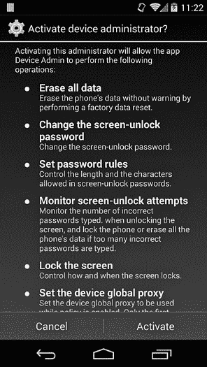

图 9-1. 设备管理员激活屏幕

和大多数系统服务一样，`DevicePolicyManagerService`由*system_server*进程启动并运行，且以*system*用户身份运行，因此可以执行几乎所有 Android 特权操作。与大多数系统服务不同，它可以将某些特权操作（例如更改锁屏密码）的访问权限授予第三方应用程序，而这些应用程序无需持有任何特殊的系统权限。这使得用户能够按需启用和禁用设备管理员，并保证设备管理员只能执行他们明确声明的策略。然而，这种灵活性无法通过标准的 Android 权限轻松实现，因为这些权限仅在安装时授予，且无法撤销（有些例外，详见第二章）。因此，`DevicePolicyManagerService`采用了一种不同的特权管理方法。

Android 设备管理实现的另一个有趣方面与策略的管理和执行有关。接下来，我们将详细描述设备管理员特权管理和策略执行。

### 特权管理

在运行时，`DevicePolicyManagerService`会为每个设备用户保持一个内部的、内存中的策略结构列表。（策略也会保存在磁盘上的 XML 文件中，具体细节见下一节。）

每个策略结构包含当前某个用户的有效策略和关于每个活动设备管理员的元数据列表。由于每个用户可以启用多个具有设备管理员功能的应用程序，因此当前的活动策略是通过在所有管理员中选择定义最严格的策略来计算的。关于每个活动设备管理员的元数据包含有关声明应用程序的信息，以及声明的策略列表（由位掩码表示）。

`DevicePolicyManagerService`根据其内部活动策略列表来决定是否授予调用应用程序特权操作的访问权限：只有当调用应用程序当前是一个活动设备管理员，且请求的策略与当前请求（API 调用）相对应时，请求才会被授予，操作才会执行。为了确认一个活动管理员组件确实属于调用应用程序，`DevicePolicyManagerService`将调用进程的 UID（由`Binder.getCallingUid()`返回）与目标管理员组件的 UID 进行比较。例如，调用`resetPassword()`的应用程序需要是一个活动设备管理员，且其 UID 与注册的管理员组件相同，并已请求`USES_POLICY_RESET_PASSWORD`策略，才能使调用成功。

通过添加一个列出设备管理员应用希望使用的所有策略的 XML 资源文件，并将其作为`<uses-policies>`标签的子项，来请求策略。在激活设备管理员之前，系统会解析 XML 文件并显示一个类似于图 9-1 的对话框，允许用户在启用管理员之前审查请求的策略。与 Android 权限类似，管理员策略是全选或全不选的，无法选择性地启用某些策略。请求所有策略的资源文件可能类似于示例 9-1（每个标签对应的策略，请参见表 9-1 的第一列）。你可以在“添加设备管理员”中找到更多关于将此文件添加到设备管理员应用的详细信息。

示例 9-1. 在设备管理员应用中声明策略

```
<?xml version="1.0" encoding="utf-8"?>
<device-admin >
    <uses-policies>
        <limit-password />
        <watch-login />
        <reset-password />
        <force-lock />
        <wipe-data />
        <expire-password />
        <encrypted-storage />
        <disable-camera />
        <disable-keyguard-features />
        <set-global-proxy />
    </uses-policies>
</device-admin>
```

为了接收与策略相关的系统事件通知，并允许访问设备管理 API，设备管理员必须首先被激活。这是通过调用`DevicePolicyManagerService`的`setActiveAdmin()`方法实现的。由于此方法需要`MANAGE_DEVICE_ADMINS`权限，而该权限是系统签名权限，因此只有系统应用可以在没有用户交互的情况下添加设备管理员。

用户安装的设备管理员应用只能通过启动`ACTION_ADD_DEVICE_ADMIN`隐式意图来请求激活，代码类似于示例 9-2。唯一处理此意图的应用是系统设置应用，它拥有`MANAGE_DEVICE_ADMINS`权限。在接收到意图后，设置应用检查请求的应用是否是有效的设备管理员，提取请求的策略，并构建图 9-1 中显示的确认对话框。用户点击激活按钮后，调用`setActiveAdmin()`方法，将该应用添加到当前设备用户的活动管理员列表中。

示例 9-2. 请求设备管理员激活

```
Intent intent = new Intent(DevicePolicyManager.ACTION_ADD_DEVICE_ADMIN);
ComponentName admin = new ComponentName(this, MyDeviceAdminReceiver.class);
intent.putExtra(DevicePolicyManager.EXTRA_DEVICE_ADMIN, admin);
intent.putExtra(DevicePolicyManager.EXTRA_ADD_EXPLANATION,
                "Required for corporate email access.");
startActivityForResult(intent, REQUEST_CODE_ENABLE_ADMIN);
```

### 策略持久化

当设备管理员被激活、停用或其策略更新时，变更会被写入目标用户的 *device_policies.xml* 文件。对于所有者用户，该文件存储在 */data/system/* 下，对于其他用户，则写入到该用户的系统目录（*/data/users/<user-ID>/*）。该文件由 *system* 用户拥有，并且只能由 *system* 用户修改（文件权限为 0600）。

*device_policies.xml* 文件包含有关每个活动管理员及其策略的信息，以及有关当前锁屏密码的一些全局信息。该文件可能类似于 示例 9-3。

示例 9-3. devices_policies.xml 文件内容

```
<?xml version='1.0' encoding='utf-8' standalone='yes' ?>
<policies>
  <admin name="com.google.android.gms/com.google.android.gms.mdm.receivers.MdmDeviceAdminReceiver">➊
    <policies flags="28" />
  </admin>
  <admin name="com.example.android.apis/com.example.android.apis.app.DeviceAdminSampleReceiver">➋
    <policies flags="1023" />➌
    <password-quality value="327680" />➍
    <min-password-length value="6" />
    <min-password-letters value="2" />
    <min-password-numeric value="2" />
    <max-time-to-unlock value="300000" />
    <max-failed-password-wipe value="100" />
    <encryption-requested value="true" />
    <disable-camera value="true" />
    <disable-keyguard-features value="1" />
</admin>
<admin name="com.android.email/com.android.email.SecurityPolicy$PolicyAdmin">➎
  <policies flags="475" />
</admin>
<password-owner value="10076" />➏
<active-password quality="327680" length="6"
                 uppercase="0" lowercase="3"
                 letters="3" numeric="3" symbols="0" nonletter="3" />➐
</policies>
```

这个示例有三个活动设备管理员，每个管理员都由一个 `<admin>` 元素表示（➊、➋ 和 ➎）。每个管理员应用程序的策略存储在 `<policies>` 标签的 `flags` 属性中 ➌。

如果相应的位被设置，则认为该策略已启用（参见 表 9-1 的值列）。例如，由于 *DeviceAdminSample* 应用程序请求了所有当前可用的策略，其 `flags` 属性的值为 1023 (0x3FF，或 1111111111 的二进制表示)。

如果管理员定义了密码质量限制（例如，字母数字或复杂），它们会作为 `<password-quality>` 标签的 `value` 属性被保存 ➍。在此示例中，值 327680 (0x50000) 对应于 `PASSWORD_QUALITY_ALPHANUMERIC`。（密码质量常量在 `DevicePolicyManager` 类中定义。）

其他策略要求的值，如密码长度和设备加密，也作为每个 `<admin>` 元素的子元素进行存储。如果密码是通过使用 `resetPassword()` 方法编程设置的，*device_policies.xml* 会包含一个 `<password-owner>` 标签，其 `value` 属性存储设置密码的应用程序的 UID ➏。最后，`<active-password>` 标签包含有关当前密码复杂性的详细信息 ➐。

### 策略强制执行

设备管理员策略具有不同的粒度，可以对当前用户或设备上的所有用户强制执行。有些策略根本没有被系统强制执行——系统只会通知声明的管理应用程序，由其负责采取适当的行动。在本节中，我们将描述每种类型的策略是如何实现和强制执行的。

**`USES_POLICY_LIMIT_PASSWORD`**

设置一个或多个密码限制后，用户不能输入不符合当前策略的密码。然而，系统并不要求立即更改密码，因此当前密码将在更改之前继续有效。管理员应用程序可以通过启动一个隐式意图，并使用`DevicePolicyManager.ACTION_SET_NEW_PASSWORD`操作来提示用户设置新密码。

因为每个设备用户都有单独的解锁密码，密码质量策略是按用户应用的。当设置密码质量时，不允许设置所需密码质量的解锁方法将被禁用。例如，将密码质量设置为`PASSWORD_QUALITY_ALPHANUMERIC`会禁用图案和 PIN 解锁方法，如图 9-2 所示。

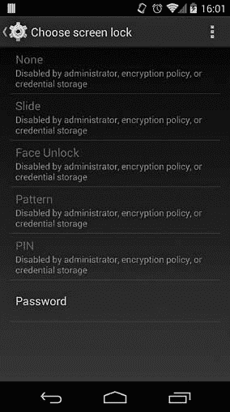

图 9-2. 设置密码质量策略禁用不兼容的解锁方法

**`USES_POLICY_WATCH_LOGIN`**

此策略允许设备管理员接收关于登录尝试结果的通知。通知通过`ACTION_PASSWORD_FAILED`和`ACTION_PASSWORD_SUCCEEDED`广播发送。继承自`DeviceAdminReceiver`的广播接收器会通过`onPasswordFailed()`和`onPasswordSucceeded()`方法自动接收通知。

**`USES_POLICY_RESET_PASSWORD`**

此策略允许管理员应用程序通过`resetPassword()` API 设置当前用户的密码。指定的密码必须满足当前密码质量要求，并立即生效。请注意，如果设备已加密，为拥有者用户设置锁屏密码时也会更改设备加密密码。（第十章提供了关于设备加密的更多详细信息。）

**`USES_POLICY_FORCE_LOCK`**

此策略允许管理员通过调用`lockNow()`方法立即锁定设备，或通过`setMaximumTimeToLock()`指定用户不活动的最大时间，直到设备自动锁定。设置最大锁定时间立即生效，并限制用户可以通过系统显示设置调整的不活动睡眠时间。

**`USES_POLICY_WIPE_DATA`**

该政策允许设备管理员通过调用`wipeData()` API 来擦除用户数据。申请了`USES_POLICY_WATCH_LOGIN`政策的应用程序可以通过`setMaximumFailedPasswordsForWipe()` API 设置设备在自动擦除数据前允许的最大登录失败次数。当设置的登录失败次数大于零时，锁屏实现会在每次登录失败后通知`DevicePolicyManagerService`并显示警告对话框，一旦达到阈值就触发数据擦除。如果擦除是由于所有者用户的登录失败触发的，则会执行完全擦除。如果擦除是由次要用户的登录失败触发的，则只会删除该用户及其相关数据，设备会切换回所有者用户。

### 注

*完全擦除设备数据并非即时进行，而是通过在* 缓存 *分区写入`wipe_data`命令并重启进入恢复模式来实现的。恢复操作系统负责执行实际的设备数据擦除。因此，如果设备有一个自定义恢复镜像忽略了擦除命令，或者用户设法进入自定义恢复模式并删除或修改了命令文件，设备擦除可能不会执行。（第十章和第十三章更详细地讨论了恢复镜像。）*

**`USES_POLICY_SETS_GLOBAL_PROXY`**

从 Android 4.4 开始，这项政策不适用于第三方应用程序。它允许设备管理员通过写入全局系统设置提供者来设置全局代理服务器主机（`Settings.Global.GLOBAL_HTTP_PROXY_HOST`）、端口（`GLOBAL_HTTP_PROXY_PORT`）和排除的主机列表（`GLOBAL_HTTP_PROXY_EXCLUSION_LIST`）。只有设备所有者才能设置全局代理设置。

**`USES_POLICY_EXPIRE_PASSWORD`**

该政策允许管理员通过`setPasswordExpirationTimeout()` API 设置密码过期超时。如果设置了过期超时，系统会注册一个每日闹钟以检查密码是否过期。如果密码已经过期，`DevicePolicyManagerService`会每天发布密码更改通知，直到密码被更改。设备管理员会通过`DeviceAdminReceiver.onPasswordExpiring()`方法收到密码过期状态的通知。

**`USES_ENCRYPTED_STORAGE`**

此政策允许管理员请求通过`setStorageEncryption()` API 加密设备存储。只有所有者用户才能请求存储加密。如果设备尚未加密，请求存储加密不会自动启动设备加密过程；设备管理员必须使用`getStorageEncryptionStatus()` API（该 API 检查*ro.crypto.state*只读系统属性）检查当前存储状态，并启动加密过程。可以通过启动相关的系统活动并带上`ACTION_START_ENCRYPTION`隐式意图来启动设备加密。

**`USES_POLICY_DISABLE_CAMERA`**

此政策允许设备管理员通过`setCameraDisabled()` API 禁用设备上的所有摄像头。通过将*sys.secpolicy.camera.disabled*系统属性设置为 1 来禁用摄像头。原生系统`CameraService`会检查此属性，并在其值为 1 时禁止所有连接，从而有效地禁用设备上所有用户的摄像头。

**`USES_POLICY_DISABLE_KEYGUARD_FEATURES`**

此政策允许管理员通过调用`setKeyguardDisabledFeatures()`方法禁用锁屏小部件等键盘保护定制功能。系统键盘保护实现会检查此政策是否生效，并为目标用户禁用相应功能。

## 添加设备管理员

与其他应用一样，设备管理员可以包含在系统镜像中，也可以由用户安装。如果管理员是系统镜像的一部分，它可以在 Android 4.4 及更高版本中设置为*设备所有者应用*，这是一种特殊的设备管理员，用户无法禁用且无法卸载。在本节中，我们将展示如何实现一个设备管理员应用，并演示如何将系统应用设置为设备所有者。

### 实现设备管理员

设备管理员应用需要声明一个广播接收器，并要求`BIND_DEVICE_ADMIN`权限（➊ 在示例 9-4 中），声明一个列出其使用的政策的 XML 资源文件 ➋，并响应`ACTION_DEVICE_ADMIN_ENABLED`意图 ➌。示例 9-1 展示了一个示例政策声明。

示例 9-4. 设备管理员广播接收器声明

```
<?xml version="1.0" encoding="utf-8"?>
<manifest 
    package="com.example.deviceadmin">
    --*snip*--
    <receiver android:name=".MyDeviceAdminReceiver"
        android:label="@string/device_admin"
        android:description="@string/device_admin_description"
        android:permission="android.permission.BIND_DEVICE_ADMIN">➊
        <meta-data android:name="android.app.device_admin"
                   android:resource="@xml/device_admin_policy" />➋
        <intent-filter>
           <action android:name="android.app.action.DEVICE_ADMIN_ENABLED" />➌
        </intent-filter>
    </receiver>
    --*snip*--
</manifest>
```

Android SDK 提供了一个基类，你可以从中派生你的接收器，即 `android.app.admin.DeviceAdminReceiver`。这个类定义了多个回调方法，你可以重写这些方法来处理系统发送的与设备策略相关的广播。默认实现为空，但至少你应该重写 `onEnabled()` 和 `onDisabled()` 方法，以便在管理员启用或禁用时收到通知。在调用 `onEnabled()` 之前或调用 `onDisabled()` 之后，设备管理员不能使用任何特权 API。

你可以随时使用 `isAdminActive()` API 来查看应用程序当前是否是一个活跃的设备管理员。如在 “权限管理” 中提到，管理员不能自动激活自己，而必须启动系统活动以提示用户确认，代码类似于 示例 9-2。然而，当管理员已经激活时，可以通过调用 `removeActiveAdmin()` 方法来禁用自己。

### 注意

*请参阅官方的设备管理 API 指南*^([89]) *获取更多细节和完整的示例应用。*

### 设置设备所有者

系统镜像中的设备管理员应用程序（即其 APK 文件安装在 *系统* 分区中）可以通过调用 `setDeviceOwner(String packageName, String ownerName)` 方法来设置为设备所有者（在公共 SDK API 中不可见）。该方法的第一个参数指定目标应用程序的包名，第二个参数指定要在 UI 中显示的所有者名称。虽然此方法不需要特殊权限，但只能在设备配置之前调用（即，如果全局设置 `Settings.Global.DEVICE_PROVISIONED` 被设置为 0），这意味着它只能由作为设备初始化一部分执行的系统应用程序调用。

成功调用此方法会将一个 *device_owner.xml* 文件（如 示例 9-5 中的文件）写入到 */data/system/* 目录中。关于当前设备所有者的信息可以通过 `getDeviceOwner()`、`isDeviceOwner()`（在 Android SDK API 中暴露为 `isDeviceOwnerApp()`）和 `getDeviceOwnerName()` 方法获取。

示例 9-5. device_owner.xml 文件的内容

```
<?xml version='1.0' encoding='utf-8' standalone='yes' ?>
<device-owner package="com.example.deviceadmin" name="Device Owner" />
```

当设备所有者被激活时，无论是作为配置过程的一部分还是由用户手动激活，都无法禁用或卸载，如 图 9-3 所示。


图 9-3. 设备所有者管理员无法被禁用。

### 管理设备

安装了所有者管理员的设备称为*受管设备*，与未受管设备相比，它对影响设备安全性的配置更改反应不同。如在第六章和第七章中所述，Android 允许用户通过系统设置应用或使用调用 `KeyChain` API 的第三方应用将证书安装到系统信任存储中。如果系统信任存储中有用户安装的证书，从 Android 4.4 版本开始，Android 会显示警告（见图 6-6），提醒用户他们的通信可能被监控。

企业网络通常要求安装受信证书（例如，企业 PKI 的根证书），才能访问企业服务。设备管理员可以通过 `DevicePolicyManager` 类的 `installCaCert()` 和 `uninstallCaCert()` 方法（这些方法保留给系统应用，且在公开 SDK API 中不可见）静默安装或删除此类证书。若在受管设备上安装了额外的受信证书，则网络监控警告将变为较不令人担忧的信息消息，如图 9-4 所示。

## 企业账户集成

如在“设备管理”中所述，设备管理员应用程序通常与企业账户配合使用，以便对访问公司数据的设备进行一定的控制。在本节中，我们将讨论两种这样的实现：一种是在内置的电子邮件应用中，它与 Microsoft Exchange ActiveSync 账户配合使用，另一种是在专用的 Google Apps 设备策略应用中，它与公司 Google 账户配合使用。

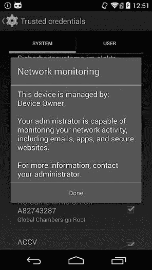

图 9-4. 受管设备上显示的网络监控信息消息

### Microsoft Exchange ActiveSync

*Microsoft Exchange ActiveSync*（通常缩写为 *EAS*）是一种协议，支持从组件服务器到移动设备的电子邮件、联系人、日历和任务同步。它不仅支持 Microsoft 自家的 Exchange Server，还支持大多数竞争产品，包括 Google Apps。

Android 中包含的电子邮件应用程序支持 ActiveSync 账户和通过专用账户认证器（见第八章）和同步适配器的数据同步。为了允许企业管理员对访问电子邮件和其他公司数据的设备执行安全策略，电子邮件应用程序在用户启用内置设备管理员之前，不允许进行同步。管理员可以设置锁屏密码规则、擦除所有数据、要求存储加密以及禁用设备摄像头，如图 9-5 所示。然而，这些策略并非内置于应用程序中，而是通过 EAS Provision 协议从服务中获取。

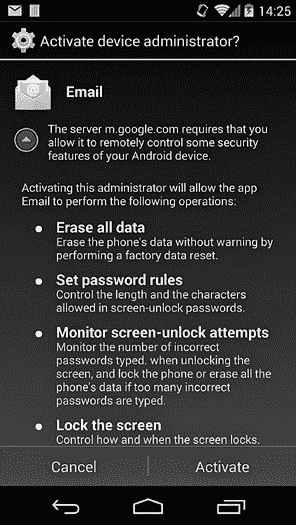

图 9-5. 使用 EAS 账户所需的设备管理员策略

### Google Apps

Google 的企业版 Gmail 服务——Google Apps，也支持设置移动设备的安全策略。如果域管理员启用了此功能，Google Apps 账户持有者还可以远程定位、响铃、锁定或擦除其 Android 设备。域管理员还可以选择性地删除 Google Apps 账户及其所有关联内容，而无需执行完全擦除。安全策略执行和远程设备管理都通过专用的 Google Apps 设备策略应用实现（见示例 9-3 中的➎）。

应用首次启动时，会请求用户启用内置的设备管理员，并显示当前的域策略设置，如图 9-6 所示。

域管理员在 Google Apps 管理员控制台中定义策略（见图 9-7），并通过 Google 的专有同步协议将策略设置推送到设备。

虽然免费的 Google 账户不支持设置设备策略，但 Google 体验设备可以使用内置在 Google Play 服务中的基本设备管理员（见示例 9-3 中的➊）。该管理员允许 Google 账户持有者通过 Android 设备管理器网站或关联的 Android 应用程序远程定位或擦除设备。

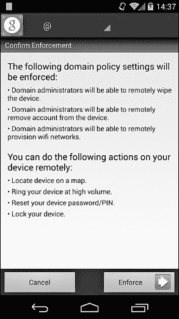

图 9-6. Google Apps 设备策略应用中的策略执行确认

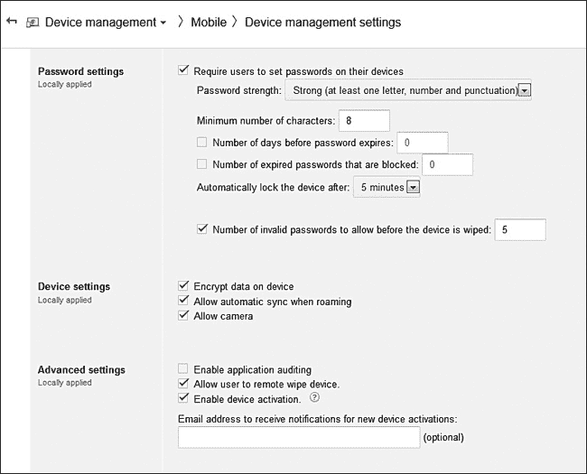

图 9-7. Google 应用设备策略管理界面

# VPN 支持

*虚拟专用网络（VPN）*允许将私有网络扩展到公共网络，而无需专用的物理连接，从而使所有连接的设备可以像位于同一私有网络并物理连接一样发送和接收数据。当 VPN 用于允许单个设备连接到目标私有网络时，称为*远程访问 VPN*，而用于连接两个远程网络时，称为*站点对站点 VPN*。

远程访问 VPN 可以连接具有静态 IP 地址的固定设备，例如远程办公室中的计算机，但移动客户端使用可变网络连接和动态地址的配置更为常见。这种配置通常被称为*路上战士*配置，也是 Android VPN 客户端最常使用的配置。

为了确保通过 VPN 传输的数据保持私密，VPN 通常会对远程客户端进行身份验证，并通过使用安全隧道协议提供数据的机密性和完整性。VPN 协议非常复杂，因为它们同时在多个网络层上工作，并且通常涉及多个级别的封装，以便与各种网络配置兼容。对它们的详细讨论超出了本书的范围，但在接下来的章节中，你将看到主要 VPN 协议类型的简要概述，重点介绍适用于 Android 的协议。

## PPTP

*点对点隧道协议（PPTP）*使用 TCP 控制通道来建立连接，并使用通用路由封装（GRE）隧道协议来封装点对点协议（PPP）数据包。支持多种认证方法，如密码认证协议（PAP）、挑战握手认证协议（CHAP）、其 Microsoft 扩展 MS-CHAP v1/v2，以及 EAP-TLS，但目前只有 EAP-TLS 被认为是安全的。

PPP 有效负载可以使用 Microsoft 点对点加密（MPPE）协议进行加密，该协议使用 RC4 流密码。由于 MPPE 不使用任何形式的密文认证，它容易受到位翻转攻击。此外，近年来已经揭示出多个 RC4 密码的漏洞，这进一步降低了 MMPE 和 PPTP 的安全性。

## L2TP/IPSec

*第二层隧道协议（L2TP）*类似于 PPTP，并位于数据链路层（OSI 模型中的第二层）。由于 L2TP 本身不提供加密或机密性（它依赖于隧道协议来实现这些功能），因此 L2TP VPN 通常使用 L2TP 和互联网协议安全（IPSec）协议套件的组合来实现，这样可以添加认证、机密性和完整性。

在 L2TP/IPSec 配置中，首先通过 IPSec 建立一个安全通道，然后在该安全通道上建立 L2TP 隧道。L2TP 数据包始终被封装在 IPSec 数据包中，因此是安全的。IPSec 连接需要建立一个 *安全关联（SA）*，它是加密算法和模式、加密密钥以及建立安全通道所需的其他参数的组合。

安全关联（SA）是通过互联网安全关联与密钥管理协议（ISAKMP）建立的。ISAKMP 并不定义特定的密钥交换方法，通常是通过手动配置预共享密钥，或者通过使用互联网密钥交换（IKE 和 IKEv2）协议来实现。IKE 使用 X.509 证书进行对等身份验证（类似于 SSL），并使用 Diffie-Hellman 密钥交换来建立共享密钥，该共享密钥用于派生实际的会话加密密钥。

## IPSec Xauth

*IPSec 扩展认证（Xauth）* 扩展了 IKE，增加了额外的用户认证交换。这使得现有的用户数据库或 RADIUS 基础设施可以用于认证远程访问客户端，并且能够集成双因素认证。

*模式配置（Modecfg）* 是另一个 IPSec 扩展，通常在远程访问场景中使用。Modecfg 允许 VPN 服务器将网络配置信息（如私有 IP 地址和 DNS 服务器地址）推送给客户端。当 Xauth 和 Modecfg 结合使用时，可以创建一个纯粹的 IPSec VPN 解决方案，该方案不依赖于额外的协议进行认证和隧道化。

## 基于 SSL 的 VPN

基于 SSL 的 VPN 使用 SSL 或 TLS（见第六章）来建立安全连接并隧道网络流量。没有单一的标准定义基于 SSL 的 VPN，不同的实现使用不同的策略来建立安全通道并封装数据包。

OpenVPN 是一个流行的开源应用程序，使用 SSL 进行身份验证和密钥交换（也支持预配置的共享静态密钥），并使用自定义加密协议^([90])来加密和认证数据包。OpenVPN 复用用于身份验证和密钥交换的 SSL 会话，且加密数据包通过单一的 UDP（或 TCP）端口流动。复用协议为 SSL 提供了基于 UDP 的可靠传输层，但它通过 UDP 隧道加密的 IP 数据包时不增加可靠性。可靠性由隧道协议本身提供，通常是 TCP。

OpenVPN 相对于 IPSec 的主要优点在于它更简单，且可以完全在用户空间实现。另一方面，IPSec 需要内核级支持并实现多个相互操作的协议。此外，OpenVPN 更容易通过防火墙、NAT 和代理，因为它使用常见的网络协议 TCP 和 UDP，并且可以通过单个端口复用隧道流量。

以下章节将探讨 Android 的内建 VPN 支持及其为希望实现额外 VPN 解决方案的应用程序提供的 API。我们还将回顾构成 Android VPN 基础设施的组件，并展示它是如何保护 VPN 凭证的。

## 传统 VPN

在 Android 4.0 之前，VPN 支持完全内建在平台中，无法扩展。新增的 VPN 类型只能作为平台更新的一部分添加。为了与基于应用的实现区分，内建的 VPN 支持被称为 *传统 VPN*。

早期的 Android 版本支持基于 PPTP 和 L2TP/IPsec 的不同 VPN 配置，并且在 4.0 版本中增加了对“纯-IPSec” VPN 的支持，通过 IPSec Xauth 实现。此外，Android 4.0 还通过提供基础平台类 `VpnService`，引入了基于应用的 VPN，使应用程序能够扩展这一类，以实现新的 VPN 解决方案。

传统 VPN 通过系统设置应用程序进行控制，仅对多用户设备中的所有者（也称为主用户）可用。图 9-8 显示了添加新 IPSec 传统 VPN 配置文件的对话框。

### 实现

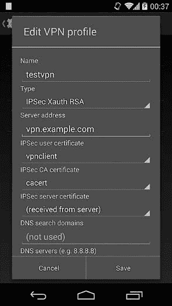

图 9-8. 传统 VPN 配置文件定义对话框

传统 VPN 是通过组合内核驱动程序以及原生守护进程、命令和系统服务实现的。PPTP 和 L2TP 隧道的底层实现使用了一种 Android 特有的 PPP 守护进程，名为 *mtpd*，以及 PPPoPNS 和 PPPoLAC（仅在 Android 内核中可用）内核驱动程序。

因为传统 VPN 每个设备只支持一个 VPN 连接，*mtpd* 只能创建一个会话。IPSec VPN 利用内建的内核支持和修改过的 *racoon* IKE 密钥管理守护进程（这是 IPSec-Tools^([91]) 工具包的一部分，补充了 Linux 内核的 IPSec 实现；*racoon* 仅支持 IKEv1）。示例 9-6 显示了这两个守护进程在 *init.rc* 中的定义方式。

示例 9-6. racoon 和 mtpd 在 init.rc 中的定义

```
service racoon /system/bin/racoon➊
    class main
    socket racoon stream 600 system system➋
    # IKE uses UDP port 500\. Racoon will setuid to vpn after binding the port.
    group vpn net_admin inet➌
    disabled
    oneshot

service mtpd /system/bin/mtpd➍
    class main
    socket mtpd stream 600 system system➎
    user vpn
    group vpn net_admin inet net_raw➏
    disabled
    oneshot
```

*racoon* ➊ 和 *mtpd* ➍ 都会创建控制套接字（➋ 和 ➎），这些套接字仅限 *system* 用户访问，并且默认情况下不会启动。两个守护进程都将 *vpn*、*net_admin*（由内核映射到 `CAP_NET_ADMIN` Linux 能力）和 *inet* 添加到它们的附加组（➌ 和 ➏），这允许它们创建套接字并控制网络接口设备。*mtpd* 守护进程还接收 *net_raw* 组（映射到 `CAP_NET_RAW` Linux 能力），这使它能够创建 GRE 套接字（PPTP 使用的套接字）。

当通过系统设置应用启动 VPN 时，Android 启动 *racoon* 和 *mtpd* 守护进程，并通过它们的本地套接字发送控制命令，以建立配置的连接。守护进程创建请求的 VPN 隧道，然后使用接收到的 IP 地址和网络掩码创建并配置隧道网络接口。虽然 *mtpd* 在内部执行接口配置，但 *racoon* 使用辅助命令 `ip-up-vpn` 来启动隧道接口，通常是 *tun0*。

为了将连接参数传回框架，VPN 守护进程在 */data/misc/vpn/* 路径下写入 *state* 文件，如 示例 9-7 所示。

示例 9-7. VPN 状态文件内容

```
# **cat /data/misc/vpn/state**
tun0➊
10.8.0.1/24➋
192.168.1.0/24➌
192.168.1.1➍
example.com➎
```

文件包含隧道接口名称 ➊、其 IP 地址和掩码 ➋、配置的路由 ➌、DNS 服务器 ➍ 和搜索域 ➎，每个项都占一行。

在 VPN 守护进程启动后，框架解析 *state* 文件，并调用系统 `ConnectivityService` 来配置新建立的 VPN 连接的路由、DNS 服务器和搜索域。随后，`ConnectivityService` 通过 *netd* 守护进程的本地控制套接字发送控制命令，因其以 root 身份运行，可以修改内核的包过滤和路由表。来自所有由所有者用户和受限配置文件启动的应用程序的流量，通过添加匹配应用程序 UID 和相应路由规则的防火墙规则，路由到 VPN 接口。（我们在 “Multi-User Support” 中详细讨论了每个应用程序流量路由和多用户支持。）

### 配置文件和凭证存储

通过设置应用创建的每个 VPN 配置称为 *VPN 配置文件*，并以加密形式保存在磁盘上。加密由 Android 凭证存储守护进程 *keystore* 执行，并使用设备特定的密钥。（有关凭证存储实现的更多信息，请参见 第七章）。

VPN 配置文件是通过将所有配置属性串联起来序列化的，这些属性由 *NUL* 字符（*\0*）分隔，并保存在系统密钥库中作为二进制大对象。VPN 配置文件的文件名是通过将当前时间的毫秒数（以十六进制格式）附加到 *VPN_* 前缀来生成的。例如，示例 9-8 展示了一个用户的 *keystore* 目录，其中有三个已配置的 VPN 配置文件（文件时间戳已省略）：

示例 9-8. 配置 VPN 配置文件时的 `keystore` 目录内容

```
# **ls -l /data/misc/keystore/user_0**
-rw------- keystore keystore      980 1000_CACERT_cacert➊
-rw------- keystore keystore       52 1000_LOCKDOWN_VPN➋
-rw------- keystore keystore      932 1000_USRCERT_vpnclient➌
-rw------- keystore keystore     1652 1000_USRPKEY_vpnclient➍
-rw------- keystore keystore      116 1000_VPN_144965b85a6➎
-rw------- keystore keystore       84 1000_VPN_145635c88c8➏
-rw------- keystore keystore      116 1000_VPN_14569512c80➐
```

这三个 VPN 配置文件分别存储在 *1000_VPN_144965b85a6* ➎、*1000_VPN_145635c88c8* ➏ 和 *1000_VPN_14569512c80* ➐ 文件中。*1000_* 前缀表示拥有者用户为 *system*（UID 1000）。由于 VPN 配置文件归 *system* 用户所有，只有系统应用程序可以检索和解密配置文件内容。

示例 9-9 展示了三个 VPN 配置文件的解密内容。（*NUL* 字符已被竖线 [`|`] 替换以提高可读性。）

示例 9-9. VPN 配置文件的内容

```
psk-vpn|1|vpn1.example.com|test1|pass1234||||true|l2tpsecret|l2tpid|PSK|||➊
pptpvpn|0|vpn2.example.com|user1|password||||true||||||➋
certvpn|4|vpn3.example.com|user3|password||||true||||vpnclient|cacert|➌
```

配置文件包含在 VPN 配置文件编辑对话框中显示的所有字段（见图 9-8），缺失的属性用空字符串表示。前五个字段分别表示 VPN 的名称、VPN 类型、VPN 网关主机、用户名和密码。在示例 9-9 中，第一个 VPN 配置文件 ➊ 是用于 L2TP/IPsec VPN 的预共享密钥（类型 1）；第二个配置文件 ➋ 是用于 PPTP VPN 的（类型 0），最后一个配置文件 ➌ 是用于使用证书和 Xauth 身份验证的 IPSec VPN（类型 4）。

除了用户名和密码外，VPN 配置文件还包含连接到 VPN 所需的所有其他凭据。在示例 9-9 中的第一个 VPN 配置文件 ➊ 中，额外的凭据是用于建立 IPSec 安全连接的预共享密钥（在本示例中由 *PSK* 字符串表示）。在第三个配置文件 ➌ 中，额外的凭据是用户的私钥和证书。然而，正如你在列表中看到的，完整的密钥和证书并未包含在内；相反，配置文件仅包含密钥和证书的别名（*vpnclient*）（二者共享相同的别名）。私钥和证书存储在系统凭据库中，VPN 配置文件中包含的别名仅作为标识符，用于访问或检索密钥和证书。

### 访问凭据

*racoon* 守护进程最初使用存储在 PEM 文件中的密钥和证书，后来修改为使用 Android 的 *keystore* OpenSSL 引擎。如第七章所讨论，*keystore* 引擎是系统凭证存储的网关，当有硬件支持的凭证存储实现时，它可以利用这些硬件支持的实现。当传递一个密钥别名时，它使用相应的私钥来签名认证数据包，而无需从密钥库中提取密钥。

在示例 9-9 中的 VPN 配置文件 ➌ 还包含了 CA 证书的别名 (*cacert*)，该别名用于在验证服务器证书时作为信任锚点。在运行时，框架从系统密钥库中检索客户端证书（➌ 在 示例 9-8 中）和 CA 证书（➊ 在 示例 9-8 中），并将它们与其他连接参数一起通过控制套接字传递给 *racoon*。私钥 Blob（➍ 在 示例 9-8 中）从未直接传递给 *racoon* 守护进程，只有其别名 (*vpnclient*) 被传递。

### 注意

*虽然私钥在具有硬件支持的密钥库的设备上受到硬件保护，但存储在 VPN 配置文件中的预共享密钥或密码并不受到保护。原因在于，直到目前为止，Android 并不支持在硬件支持的密钥库中导入对称密钥；它仅支持非对称密钥（RSA、DSA 和 EC）。因此，使用预共享密钥的 VPN 凭证以明文形式存储在 VPN 配置文件中，并且可以在配置文件解密后，从允许 root 权限的设备中提取。*

### 始终开启 VPN

Android 4.2 及更高版本支持 *始终开启* VPN 配置，这会阻止应用程序的所有网络连接，直到与指定的 VPN 配置文件建立连接为止。这可以防止应用程序通过不安全的通道（例如公共 Wi-Fi 网络）发送数据。

设置始终开启的 VPN 需要设置一个 VPN 配置文件，指定 VPN 网关的 IP 地址，并指定一个明确的 DNS 服务器 IP 地址。此明确配置是为了确保 DNS 流量不会发送到本地配置的 DNS 服务器，因为在始终开启的 VPN 生效时，DNS 请求会被阻止。VPN 配置文件选择对话框显示在图 9-9 中。

配置文件选择与其他 VPN 配置文件一起保存在加密文件 *LOCKDOWN_VPN* 中（示例 9-8 中的 ➋），该文件仅包含所选配置文件的名称；在我们的示例中是 *144965b85a6*。如果 *LOCKDOWN_VPN* 文件存在，系统在设备启动时会自动连接到指定的 VPN。如果底层网络连接重新连接或发生更改（例如切换 Wi-Fi 热点），VPN 会自动重新启动。

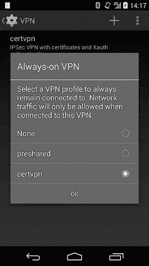

图 9-9. 始终开启 VPN 配置文件选择对话框

始终开启的 VPN 通过安装防火墙规则，确保所有流量都通过 VPN。这些规则会阻止所有数据包，除了那些通过 VPN 接口的。规则由 `LockdownVpnTracker` 类安装（在 Android 源代码中，始终开启的 VPN 称为 *lockdown VPN*），该类监控 VPN 状态，并通过向 *netd* 守护进程发送命令来调整当前的防火墙状态，后者执行 `iptables` 工具，以修改内核的包过滤表。例如，当一个始终开启的 L2TP/IPSec VPN 连接到 IP 地址为 11.22.33.44 的 VPN 服务器，并且创建了一个 IP 地址为 10.1.1.1 的隧道接口 *tun0* 时，安装的防火墙规则（由 `iptables` 报告；为了简洁，某些列已省略）可能如下所示：示例 9-10。

示例 9-10. 始终开启 VPN 防火墙规则

```
# **iptables -v -L n**
--*snip*--
Chain fw_INPUT (1 references)
 target     prot opt in     out    source      destination
 RETURN     all  --  *      *      0.0.0.0/0   10.1.1.0/24➊
 RETURN     all  --  tun0   *      0.0.0.0/0   0.0.0.0/0➋
 RETURN     udp  --  *      *      11.22.33.44 0.0.0.0/0    udp spt:1701➌
 RETURN     tcp  --  *      *      11.22.33.44 0.0.0.0/0    tcp spt:1701
 RETURN     udp  --  *      *      11.22.33.44 0.0.0.0/0    udp spt:4500
 RETURN     tcp  --  *      *      11.22.33.44 0.0.0.0/0    tcp spt:4500
 RETURN     udp  --  *      *      11.22.33.44 0.0.0.0/0    udp spt:500
 RETURN     tcp  --  *      *      11.22.33.44 0.0.0.0/0    tcp spt:500
 RETURN     all  --  lo     *      0.0.0.0/0   0.0.0.0/0
 DROP       all  --  *      *      0.0.0.0/0   0.0.0.0/0➍

Chain fw_OUTPUT (1 references)
 target     prot opt in     out    source      destination
 RETURN     all  --  *      *      10.1.1.0/24 0.0.0.0/0➎
 RETURN     all  --  *      tun0   0.0.0.0/0   0.0.0.0/0➏
 RETURN     udp  --  *      *      0.0.0.0/0   11.22.33.44  udp dpt:1701➐
 RETURN     tcp  --  *      *      0.0.0.0/0   11.22.33.44  tcp dpt:1701
 RETURN     udp  --  *      *      0.0.0.0/0   11.22.33.44  udp dpt:4500
 RETURN     tcp  --  *      *      0.0.0.0/0   11.22.33.44  tcp dpt:4500
 RETURN     udp  --  *      *      0.0.0.0/0   11.22.33.44  udp dpt:500
 RETURN     tcp  --  *      *      0.0.0.0/0   11.22.33.44  tcp dpt:500
 RETURN     all  --  *      lo     0.0.0.0/0   0.0.0.0/0
 REJECT     all  --  *      *      0.0.0.0/0   0.0.0.0/0   reject-with icmp-port-unreachable➑
--*snip*--
```

如您在列表中看到的，所有来自 VPN 网络的流量（➊ 和 ➎）和隧道接口上的所有流量（➋ 和 ➏）都是允许的。仅允许通过 IPSec（500 和 4500）和 L2TP（1701）端口的 VPN 服务器流量（➌ 和 ➐）。所有其他传入流量会被丢弃 ➍，所有其他传出流量会被拒绝 ➑。

## 基于应用程序的 VPN

Android 4.0 添加了 `VpnService` 公共 API^([92])，第三方应用程序可以利用该 API 构建既不是操作系统内建的，也不需要系统级权限的 VPN 解决方案。`VpnService` 及其关联的 `Builder` 类允许应用程序指定网络参数，如接口 IP 地址和路由，系统使用这些参数来创建和配置虚拟网络接口。应用程序会接收到与该网络接口关联的文件描述符，并且可以通过读取或写入接口的文件描述符来进行网络流量隧道传输。

每次读取时会检索一个外发的 IP 数据包，每次写入时会注入一个入站的 IP 数据包。由于对网络数据包的原始访问实际上允许应用拦截和修改网络流量，因此基于应用的 VPN 不能自动启动，并始终需要用户交互。此外，在 VPN 连接时，会显示一个持续的通知。基于应用的 VPN 连接警告对话框可能如图 9-10 所示。

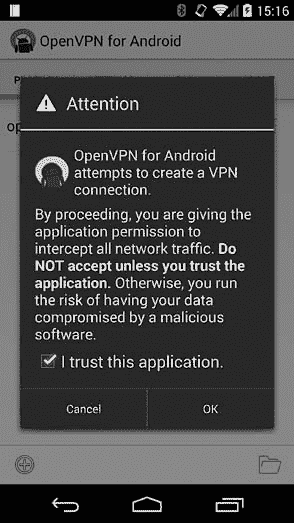

图 9-10. 基于应用的 VPN 连接警告对话框

### 声明一个 VPN

基于应用的 VPN 通过创建一个扩展`VpnService`基类的服务组件并在应用清单中注册来实现，如示例 9-11 所示。

示例 9-11. 在应用清单中注册 VPN 服务

```
<?xml version="1.0" encoding="utf-8"?>
<manifest 
    package="com.example.vpn">
    --*snip*--
    <application android:label="@string/app">
         --*snip*--
         <service android:name=".MyVpnService"
                  android:permission="android.permission.BIND_VPN_SERVICE">➊
            <intent-filter>
                <action android:name="android.net.VpnService"/>➋
            </intent-filter>
        </service>
    </application>
</manifest>:
```

该服务必须具有一个意图过滤器，能够匹配*android.net.VpnService*意图操作➋，以便系统能够绑定到该服务并控制它。此外，该服务必须要求`BIND_VPN_SERVICE`系统签名权限➊，这确保只有系统应用能够绑定到该服务。

### 准备 VPN

要将新的 VPN 连接注册到系统中，应用首先调用`VpnService.prepare()`以获得运行权限，然后调用`establish()`方法来创建一个网络隧道（在下一节中讨论）。`prepare()`方法返回一个意图，用于启动图 9-10 中显示的警告对话框。该对话框用于获得用户的许可，并确保每个用户始终只能运行一个 VPN 连接。如果在另一个应用创建的 VPN 连接正在运行时调用`prepare()`，该连接将被终止。`prepare()`方法保存调用应用的包名，并且只有该应用被允许启动 VPN 连接，直到该方法再次被调用或系统关闭 VPN 连接（例如，如果 VPN 应用的进程崩溃）。当 VPN 连接因任何原因被停用时，系统会调用当前 VPN 应用的`VpnService`实现中的`onRevoke()`方法。

### 建立 VPN 连接

在准备好 VPN 应用并授予其运行权限后，应用程序可以启动其 `VpnService` 组件，通常会创建一个隧道连接到 VPN 网关，并协商 VPN 连接的网络参数。接下来，应用程序使用这些参数设置 `VpnService.Builder` 类，并调用 `VpnService.establish()` 来接收一个文件描述符，以便读写数据包。`establish()` 方法首先确保它是由当前获得建立 VPN 连接权限的应用程序调用，通过比较调用者的 UID 和授权应用程序的 UID 来进行验证。然后，`establish()` 检查当前 Android 用户是否被允许创建 VPN 连接，并验证该服务是否需要 `BIND_VPN_SERVICE` 权限；如果该服务不需要该权限，则被认为是不安全的，并抛出 `SecurityException` 异常。接下来，`establish()` 方法使用本地代码创建并配置隧道接口，并设置路由和 DNS 服务器。

### 通知用户 VPN 连接

建立 VPN 连接的最后一步是显示一个持续的通知，告知用户网络流量正在通过 VPN 隧道传输，这使得用户能够通过关联的控制对话框监控和控制连接。Android 版 OpenVPN 应用的对话框如图 9-11 所示。

该对话框是专用包 `com.android.vpndialogs` 的一部分，这是唯一一个被明确允许管理基于应用的 VPN 连接的包，除了 *系统* 用户。这确保了 VPN 连接只能通过系统强制的用户界面启动和管理。

使用基于应用的 VPN 框架，应用程序可以自由实现网络隧道功能，并根据需要进行身份验证和加密方法的设置。由于设备发送或接收的所有数据包都经过 VPN 应用，因此它不仅可以用于隧道传输，还可以用于流量日志记录、过滤或修改（例如移除广告）。

### 注意

*要实现一个功能完整的基于应用的 VPN，利用 Android 的凭证存储来管理身份验证密钥和证书，请参阅 OpenVPN for Android 的源代码。*^([93]) *该应用实现了一个完全兼容 OpenVPN 服务器的 SSL VPN 客户端。*

## 多用户支持

如前所述，在多用户设备上，传统的 VPN 只能由拥有者用户控制。然而，通过引入多用户支持，Android 4.2 及更高版本允许所有次级用户（限制型用户除外，这些用户必须共享主用户的 VPN 连接）启动基于应用的 VPN。虽然这一变化从技术上讲允许每个用户启动自己的 VPN，但由于每次只能激活一个基于应用的 VPN，因此所有设备用户的流量都会通过当前激活的 VPN 路由，而不管是哪个用户启动的。Android 4.4 最终通过引入 *每用户 VPN* 完全支持多用户 VPN，该功能允许来自任何用户的流量通过其个人的 VPN 路由，从而将其与其他用户的流量隔离开。

### Linux 高级路由

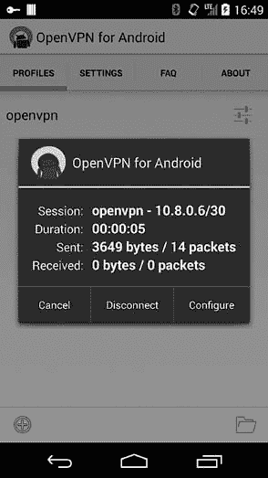

图 9-11. 基于应用的 VPN 管理对话框

Android 使用 Linux 内核的几个高级数据包过滤和路由特性来实现每用户 VPN。这些特性（由 *netfilter* 内核框架实现）包括 Linux *iptables* 工具的 *owner* 模块，该模块允许根据创建数据包的进程的 UID、GID 或 PID 来匹配本地生成的数据包。例如，示例 9-12 中显示的命令创建了一个数据包过滤规则，丢弃所有由 UID 为 1234 的用户生成的外发数据包。

示例 9-12. 使用所有者匹配和数据包标记的 iptables

```
# iptables -A OUTPUT -m owner --uid-owner 1234 -j DROP➊
# iptables -A PREROUTING -t mangle -p tcp --dport 80 -j MARK --set-mark 0x1➋
# ip rule add fwmark 0x1 table web➌
# ip route add default via 1.2.3.4 dev em3 table web➍
```

另一个重要的 netfilter 特性是能够标记匹配特定选择器的包，并为其指定一个数字（称为 *标记*）。例如，➋ 处的规则将所有目标端口为 80 的数据包（通常由 Web 服务器使用）标记为 0x1\。然后，可以在后续的过滤或路由规则中匹配此标记，例如，通过添加路由规则，将标记的数据包发送到预定义的路由表，从而将标记的数据包通过特定接口转发，在我们的示例 ➌ 中是 *web*。最后，可以通过在 ➍ 处显示的命令，添加一个路由规则，将匹配 *web* 表的数据包发送到 *em3* 接口。

### 多用户 VPN 实现

Android 使用这些数据包过滤和路由功能，将来自特定 Android 用户所有应用的包标记，并通过该用户启动的 VPN 应用所创建的隧道接口进行转发。当拥有者用户启动 VPN 时，该 VPN 会与设备上无法启动自己 VPN 的任何限制型用户共享，通过匹配所有来自限制型用户的数据包并将它们路由通过拥有者的 VPN 隧道来实现。

这种拆分路由在框架级别通过`NetworkManagementService`实现，该服务提供 API 来按 UID 或 UID 范围管理数据包匹配和路由。`NetworkManagementService`通过向本地的*netd*守护进程发送命令来实现这些 API，而*netd*以 root 身份运行，因此可以修改内核的数据包过滤和路由表。*netd*通过调用*iptables*和*ip*用户态工具来操控内核的过滤和路由配置。

让我们通过一个示例来说明 Android 的每个用户 VPN 路由，如示例 9-13 所示。主用户（用户 ID 0）和第一个次级用户（用户 ID 10）分别启动了基于应用的 VPN。主用户的 VPN 分配了*tun0*隧道接口，次级用户的 VPN 分配了*tun1*接口。设备上还存在一个带有用户 ID 13 的受限配置文件。示例 9-13 显示了内核的数据包过滤表状态，当两个 VPN 都连接时（一些细节被省略）。

示例 9-13。由两个不同设备用户启动的 VPN 的数据包匹配规则

```
**# iptables -t mangle -L –n**
--*snip*--
Chain st_mangle_OUTPUT (1 references)
target     prot opt source               destination
RETURN     all  --  0.0.0.0/0            0.0.0.0/0           mark match 0x1➊
RETURN     all  --  0.0.0.0/0            0.0.0.0/0           owner UID match 1016➋
--*snip*--
st_mangle_tun0_OUTPUT  all  --  0.0.0.0/0           0.0.0.0/0           [goto] owner UID match
0-99999➌
st_mangle_tun0_OUTPUT  all  --  0.0.0.0/0           0.0.0.0/0           [goto] owner UID match
1300000-1399999➍
st_mangle_tun1_OUTPUT  all  --  0.0.0.0/0           0.0.0.0/0           [goto] owner UID match
1000000-1099999➎

Chain st_mangle_tun0_OUTPUT (3 references)
target     prot opt source               destination
MARK       all  --  0.0.0.0/0            0.0.0.0/0           MARK and 0x0
MARK       all  --  0.0.0.0/0            0.0.0.0/0           MARK set 0x3c➏

Chain st_mangle_tun1_OUTPUT (2 references)
target     prot opt source               destination
MARK       all  --  0.0.0.0/0            0.0.0.0/0           MARK and 0x0
MARK       all  --  0.0.0.0/0            0.0.0.0/0           MARK set 0x3d➐
```

外发数据包首先发送到*st_mangle_OUTPUT*链，该链负责匹配和标记数据包。免于每个用户路由的数据包（那些已经被标记为 0x1 ➊）和来自传统 VPN 的数据包（UID 1016 ➋，分配给内置的*vpn*用户，该用户同时运行*mtd*和*racoon*）无需修改即可通过。

接下来，由 UID 介于 0 到 99999 之间的进程创建的数据包（这些 UID 范围分配给由主用户启动的应用，如第四章所讨论）会被匹配并发送到*st_mangle_tun0_OUTPUT*链 ➌。来自 UID 1300000–1399999 的数据包，即分配给我们受限配置文件（用户 ID 13）的 UID 范围，会被发送到相同的链 ➍。因此，来自主用户和受限配置文件的流量将以相同的方式处理。然而，来自第一个次级用户（用户 ID 10，UID 范围 1000000-1099999）的数据包将被发送到另一个链——*st_mangle_tun1_OUTPUT* ➎。目标链本身很简单：*st_mangle_tun0_OUTPUT*首先清除数据包标记，然后用*0x3c*标记它们 ➏；*st_mangle_tun1_OUTPUT*做相同的事情，但使用标记*0x3d* ➐。数据包被标记后，标记会用于实现并匹配不同的路由规则，如示例 9-14 所示。

示例 9-14。由两个不同设备用户启动的 VPN 的路由规则

```
# **ip rule ls**
0:      from all lookup local
100:    from all fwmark 0x3c lookup 60➊
100:    from all fwmark 0x3d lookup 61➋
--*snip*--
# **ip route list table 60**
default dev tun0 scope link➌
# **ip route list table 61**
default dev tun1 scope link➍
```

请注意，已创建了两个匹配每个标记的规则，并且它们与不同的路由表相关联。标记为*0x3c*的数据包进入路由表 60（16 进制中的 0x3c ➊），而标记为*0x3d*的数据包进入路由表 61（16 进制中的 0x3d ➋）。表 60 将所有流量通过由拥有者用户创建的*tun0*隧道接口路由 ➌，而表 61 将所有流量通过由次要用户创建的*tun1*接口路由 ➍。

### 注意

*尽管 Android 4.4 中引入的 VPN 流量路由方法提供了更大的灵活性，并允许用户的 VPN 流量隔离，但截至目前，实施似乎存在一些问题，尤其是与在不同物理网络之间切换（例如，从移动网络到 Wi-Fi 或反之）相关的问题。这些问题应在未来的版本中解决，可能通过修改数据包过滤链与接口的关联方式，但基本的实施策略可能会保持不变。*

# Wi-Fi EAP

Android 支持不同的无线网络协议，包括 Wi-Fi 保护访问（WPA）和 Wi-Fi 保护访问 II（WPA2），这两种协议目前在大多数无线设备上都有部署。两种协议都支持一种简单的*预共享密钥（PSK）*模式，也称为*个人模式*，在这种模式下，所有访问网络的设备必须配置相同的 256 位认证密钥。

设备可以通过原始密钥字节或使用 ASCII 密码短语来配置，后者用于通过 PBKDF2 密钥派生算法派生认证密钥。虽然 PSK 模式简单，但随着网络用户数量的增加，它无法扩展。如果需要撤销某个用户的访问权限，例如，取消其网络凭证的唯一方法是更改共享密码短语，这将迫使所有其他用户重新配置其设备。此外，由于没有实际的方法来区分用户和设备，因此很难实施灵活的访问规则或记账。

为了解决这个问题，WPA 和 WPA2 都支持 IEEE 802.1X 网络访问控制标准，该标准封装了可扩展认证协议（EAP）。使用 802.1X 并涉及客户端、认证者和认证服务器的无线网络认证如图 9-12 所示。

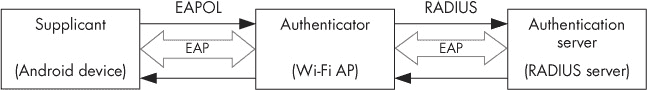

图 9-12. 802.1X 认证参与者

*客户端*是希望连接到网络的无线设备，如 Android 手机，*认证器*是网络的网关，用于验证客户端的身份并提供授权。在典型的 Wi-Fi 配置中，认证器是无线接入点（AP）。*认证服务器*，通常是 RADIUS 服务器，验证客户端凭据并根据预配置的访问策略决定是否授予访问权限。

通过在三个节点之间交换 EAP 消息来实现身份验证。这些消息被封装成适合连接每两个节点的介质的格式：客户端与认证器之间使用局域网（EAPOL），认证器与认证服务器之间使用 RADIUS。

由于 EAP 是一种支持不同具体身份验证类型的身份验证框架，而不是一种具体的身份验证机制，因此客户端（与认证器的帮助下）需要在执行身份验证之前协商一个共同支持的身份验证方法。存在多种标准和专有的 EAP 身份验证方法，当前的 Android 版本支持大多数用于无线网络中的方法。

以下部分简要概述了 Android 支持的 EAP 身份验证方法，并展示了它如何保护每种方法的凭据。我们还将演示如何使用 Android 的无线网络管理 API 配置使用 EAP 进行身份验证的 Wi-Fi 网络的访问。

## EAP 身份验证方法

从 4.4 版本开始，Android 支持 PEAP、EAP-TLS、EAP-TTLS 和 EAP-PWD 身份验证方法。在探索 Android 如何存储每种身份验证方法的凭据之前，让我们简要讨论每种方法的工作原理。

**PEAP**

保护扩展认证协议（PEAP）通过 SSL 连接传输 EAP 消息，以提供机密性和完整性。它使用公钥基础设施（PKI）和服务器证书来验证服务器并建立 SSL 连接（阶段 1），但不要求指定客户端的身份验证方式。客户端使用第二种内层（阶段 2）身份验证方法进行身份验证，该方法在 SSL 隧道内传输。Android 支持用于阶段 2 身份验证的 MSCHAPv2（在 PEAPv0 中指定^([94]))和通用令牌卡（GTC，在 PEAPv2 中指定^([95]))方法。

**EAP-TLS**

EAP-传输层安全性（EAP-TLS）方法^([96])使用 TLS 进行相互身份验证，曾是唯一经过认证可以与 WPA 企业版一起使用的 EAP 方法。EAP-TLS 使用服务器证书来验证服务器的身份，并使用客户端证书来验证身份验证服务器以建立请求者身份。授予网络访问权限需要发布和分发 X.509 客户端证书，从而维护公钥基础设施。可以通过吊销请求者证书来阻止现有客户端访问网络。Android 支持 EAP-TLS，并使用系统凭据存储管理客户端密钥和证书。

**EAP-TTLS**

与 EAP-TLS 类似，EAP 隧道传输层安全性（EAP-TTLS）协议^([97]) 基于 TLS。然而，EAP-TTLS 不需要使用 X.509 证书进行客户端身份验证。客户端可以在握手阶段（阶段 1）使用证书进行身份验证，或者在隧道阶段（阶段 2）使用另一种协议进行身份验证。Android 不支持在阶段 1 进行身份验证，但支持在阶段 2 使用 PAP、MSCHAP、MSCHAPv2 和 GTC 协议进行身份验证。

**EAP-PWD**

EAP-PWD 身份验证方法^([98])使用共享密码进行身份验证。与依赖简单的挑战-响应机制的传统方案不同，EAP-PWD 旨在防御被动攻击、主动攻击和字典攻击。该协议还提供前向保密性，保证即使密码被泄露，之前的会话也无法被解密。EAP-PWD 基于离散对数密码学，可以使用有限域或椭圆曲线来实现。

## Android Wi-Fi 架构

像大多数 Android 硬件支持一样，Android 的 Wi-Fi 架构由内核层（WLAN 适配器驱动模块）、本地守护进程（*wpa_supplicant*）、硬件抽象层（HAL）、系统服务和系统 UI 组成。Wi-Fi 适配器内核驱动通常是特定于 Android 设备所依赖的系统芯片（SoC）的，通常是闭源的并作为内核模块加载。*wpa_supplicant*^([99]) 是一个 WPA 请求者守护进程，实现与 WPA 身份验证器的密钥协商，并控制 WLAN 驱动的 802.1X 关联。然而，Android 设备很少包含原始的 *wpa_supplicant* 代码；包含的实现通常会针对底层 SoC 进行修改，以提高兼容性。

HAL 实现于 *libharware_legacy* 本地库，并负责通过其控制套接字将框架中的命令传递给 *wpa_supplicant*。控制 Wi-Fi 连接的系统服务是 `WifiService`，它通过 `WifiManager` 外观类提供公共接口。`WifiService` 将 Wi-Fi 状态管理委托给一个相当复杂的 `WifiStateMachine` 类，在连接无线网络时，该类可能经历十多个状态。

WLAN 连接通过系统设置应用程序中的 Wi-Fi 屏幕进行控制，连接状态显示在状态栏和快速设置中，二者都是 SystemUI 包的一部分。

Android 将与 Wi-Fi 相关的配置文件存储在 */data/misc/wifi/* 目录下，因为无线连接守护进程会将配置更改直接写入磁盘，因此需要一个可写的目录。该目录属于 *wifi* 用户（UID 1010），它也是 *wpa_supplicant* 运行的用户。包括 *wpa_supplicant.conf* 在内的配置文件的权限设置为 0660，文件的所有者是 *system* 用户，组设置为 *wifi*。这确保了系统应用程序和 supplicant 守护进程可以读取和修改配置文件，但其他应用程序无法访问。*wpa_supplicant.conf* 文件包含格式为键值对的配置参数，包括全局参数和特定于某个网络的参数。特定于网络的参数被包含在网络块中，可能类似于 示例 9-15 中的 PSK 配置。

示例 9-15. wpa_supplicant.conf 中的 PSK 网络配置块

```
network={
    ssid="psk-ap"➊
    key_mgmt=WPA-PSK➋
    psk="password"➌
    priority=805➍
}
```

如您所见，`network` 块指定了网络的 SSID ➊、认证密钥管理协议 ➋、预共享密钥本身 ➌ 以及优先级值 ➍。PSK 以明文形式保存，虽然 *wpa_supplicant.conf* 的访问位禁止非系统应用程序访问它，但它可以从允许 root 访问的设备中轻松提取。

## EAP 凭据管理

在本节中，我们将探讨 Android 如何管理每种支持的 EAP 认证方法的 Wi-Fi 凭据，并讨论允许 supplicant 守护进程利用 Android 系统凭据存储的 Android 特定 *wpa_supplicant* 更改。

示例 9-16 显示了配置为使用 PEAP 的网络在 *wpa_supplicant.conf* 中的网络块。

示例 9-16. wpa_supplicant.conf 中的 PEAP 网络配置块

```
network={
    ssid="eap-ap"
    key_mgmt=WPA-EAP IEEE8021X➊
    eap=PEAP➋
    identity="android1"➌
    anonymous_identity="anon"
    password="password"➍
    ca_cert="keystore://CACERT_eapclient"➎
    phase2="auth=MSCHAPV2"➏
    proactive_key_caching=1
}
```

在这里，密钥管理模式设置为 *WPA-EAP IEEE8021X* ➊，EAP 方法设置为 *PEAP* ➋，Phase 2 认证设置为 MSCHAPv2 ➏。凭据，即身份 ➌ 和密码 ➍，以明文存储在配置文件中，就像 PSK 模式一样。

与通用的 *wpa_supplicant.conf* 的一个显著不同之处是 CA 证书路径 ➎ 的格式。CA 证书路径（*ca_cert*）在验证服务器证书时使用，在 Android 中，*ca_cert* 采用类似 URI 的格式，使用 *keystore* 方案。这一 Android 特有的扩展允许 *wpa_supplicant* 守护进程从系统凭证存储中检索证书。当守护进程遇到以 *keystore://* 开头的证书路径时，它会连接到本地 *keystore* 服务的 `IKeystoreService` 远程接口，并使用 URI 路径作为密钥检索证书字节。

EAP-TLS 配置与 PEAP 配置类似，如 示例 9-17 所示。

示例 9-17. wpa_supplicant.conf 中的 EAP-TLS 网络配置块

```
network={
    ssid="eap-ap"
    key_mgmt=WPA-EAP IEEE8021X
    eap=TLS
    identity="android1"
    ca_cert="keystore://CACERT_eapclient"
    client_cert="keystore://USRCERT_eapclient"➊
    engine_id="keystore"➋
    key_id="USRPKEY_eapclient"➌
    engine=1
    priority=803
    proactive_key_caching=1
}
```

新增了客户端证书 URI ➊、引擎 ID ➋ 和密钥 ID ➌。客户端证书从系统凭证存储中获取，类似于 CA 证书。引擎 ID 指的是在连接到 `network` 块中配置的 SSID 时应使用的 OpenSSL 引擎。*wpa_supplicant* 原生支持可配置的 OpenSSL 引擎，通常与 PKCS#11 引擎一起使用，以便使用存储在智能卡或其他硬件设备中的密钥。

如 第七章 中所述，Android 的 *keystore* 引擎使用存储在系统凭证存储中的密钥。如果设备支持硬件支持的凭证存储，*keystore* 引擎可以通过中间的 *keymaster* HAL 模块透明地利用它。 示例 9-17 中的密钥 ID 引用用于身份验证的私钥别名。

从版本 4.3 开始，Android 允许在导入私钥和证书时选择其所有者。之前，所有导入的密钥都归 *system* 用户所有，但如果你在导入对话框中将凭证使用参数设置为 Wi-Fi（参见 图 9-13），密钥所有者将设置为 *wifi* 用户（UID 1010），且该密钥只能由以 *wifi* 用户身份运行的系统组件访问，比如 *wpa_supplicant*。

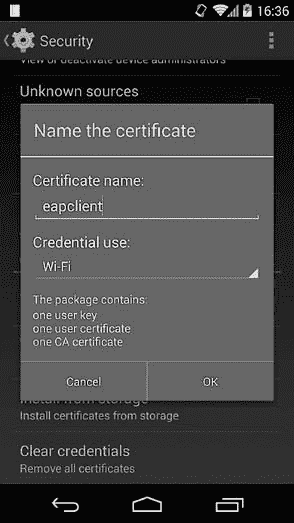

图 9-13. 在 PKCS#12 导入对话框中设置凭证所有者为 Wi-Fi

由于 Android 不支持在使用 EAP-TTLS 身份验证方法时进行客户端身份验证，因此该配置仅包含 CA 证书引用 ➋，如 示例 9-18 所示。密码 ➊ 以明文形式存储。

示例 9-18. 在 wpa_supplicant.conf 中的 EAP-TTLS 网络配置块

```
network={
    ssid="eap-ap"
    key_mgmt=WPA-EAP IEEE8021X
    eap=TTLS
    identity="android1"
    anonymous_identity="anon"
    password="pasword"➊
    ca_cert="keystore://CACERT_eapclient"➋
    phase2="auth=GTC"
    proactive_key_caching=1
}
```

EAP-PWD 方法不依赖于 TLS 来建立安全通道，因此不需要证书配置，如 示例 9-19 所示。凭证以明文存储（➊ 和 ➋），与其他使用密码的配置相同。

示例 9-19. 在 wpa_supplicant.conf 中的 EAP-PWD 网络配置块

```
network={
    ssid="eap-ap"
    key_mgmt=WPA-EAP IEEE8021X
    eap=PWD
    identity="android1"➊
    password="password"➋
    proactive_key_caching=1
}
```

总结来说，所有使用密码进行身份验证的 EAP 方法的配置，都将凭证信息以明文形式存储在 *wpa_supplicant.conf* 文件中。而使用 EAP-TLS 的情况下，由于依赖于客户端身份验证，客户端密钥被存储在系统密钥库中，因此提供了最高级别的凭证保护。

## 使用 WifiManager 添加 EAP 网络

虽然 Android 支持多种 WPA 企业身份验证方法，但由于需要配置的参数较多，并且需要安装和选择身份验证证书，正确设置这些方法可能会对部分用户构成挑战。由于 Android 在 4.3 版本之前的官方 API `WifiManager` 不支持 EAP 配置，设置 EAP 网络的唯一方法是通过系统设置应用手动添加并配置它。Android 4.3（API 级别 18）扩展了 `WifiManager` API，允许程序化配置 EAP，从而支持企业环境中的自动网络配置。在本节中，我们将展示如何使用 `WifiManager` 添加 EAP-TLS 网络，并讨论其底层实现。

`WifiManager` 允许持有 `CHANGE_WIFI_STATE` 权限（保护级别 *dangerous*）的应用程序通过初始化一个 `WifiConfiguration` 实例，并设置网络的 SSID、身份验证算法和凭证，然后将其传递给 `WifiManager` 的 `addNetwork()` 方法，从而添加 Wi-Fi 网络。Android 4.3 扩展了此 API，通过在 `WifiConfiguration` 类中新增一个类型为 `WifiEnterpriseConfig` 的 `enterpriseConfig` 字段，允许您配置要使用的 EAP 身份验证方法、客户端和 CA 证书、Phase 2 身份验证方法（如果有的话），以及其他凭证，如用户名和密码。示例 9-20 展示了如何使用此 API 添加一个使用 EAP-TLS 进行身份验证的网络。

示例 9-20. 使用 `WifiManager` 添加 EAP-TLS 网络

```
X509Certificate caCert = getCaCert();
PrivateKey clientKey = getClientKey();
X509Certificate clientCert = getClientCert();

WifiEnterpriseConfig enterpriseConfig = new WifiEnterpriseConfig();
enterpriseConfig.setCaCertificate(caCert);➊
enterpriseConfig.setClientKeyEntry(clientKey, clientCert);➋
enterpriseConfig.setEapMethod(WifiEnterpriseConfig.Eap.TLS);➌
enterpriseConfig.setPhase2Method(WifiEnterpriseConfig.Phase2.NONE);➍
enterpriseConfig.setIdentity("android1");➎
WifiConfiguration config = new WifiConfiguration();
config.enterpriseConfig = enterpriseConfig;➏
config.SSID = "\"eap-ap\"";
config.allowedKeyManagement.set(WifiConfiguration.KeyMgmt.IEEE8021X);➐
config.allowedKeyManagement.set(WifiConfiguration.KeyMgmt.WPA_EAP);➑

int netId = wm.addNetwork(config);➒
if (netId != -1) {
    boolean success = wm.saveConfiguration();➓
}
```

为了设置 EAP-TLS 认证，我们首先需要获取用于验证服务器身份的 CA 证书，以及客户端的私钥和证书。由于这些通常作为 PKCS#12 文件分发，我们可以使用类型为 *PKCS12* 的 `KeyStore` 来提取它们（未展示）。(当你添加使用这些证书的 EAP 配置文件时，Android 会自动将指定的密钥和证书导入系统密钥库，因此无需手动导入 PKCS#12 文件。）获得 CA 证书和客户端凭证后，我们通过 `setCaCertificate()` ➊ 和 `setClientKeyEntry()` ➋ 方法将它们设置到 `WifiEnterpriseConfig` 实例中。然后，我们将 EAP 方法设置为 `Eap.TLS` ➌，并将第二阶段方法设置为 `NONE` ➍，因为 EAP-TLS 在建立 SSL 连接（第一阶段）时进行用户认证。虽然认证服务器可能不会使用，但 Android 仍然要求我们设置身份 ➎。配置好 `WifiEnterpriseConfig` 对象后，我们可以将其添加到主 `WifiConfiguration` 实例 ➏。密钥管理协议集也需要进行配置（➐ 和 ➑），因为默认情况下它是 WPA PSK。最后，我们可以添加网络 ➒ 并保存配置 ➓，这将更新 *wpa_supplicant.conf* 文件，包含新配置的网络。

Android 会自动为配置的私钥和证书生成别名，然后将 PKI 凭证导入系统密钥库。别名基于 AP 名称、密钥管理方案和 EAP 认证方法。通过编程配置的网络会自动显示在系统设置应用的 Wi-Fi 屏幕中，可能如下图所示 图 9-14，与 示例 9-20 中的示例相同。

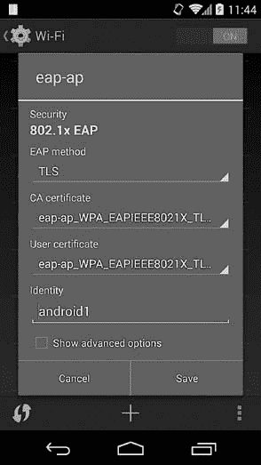

图 9-14. 使用 `WifiManager` 添加的 EAP-TLS 网络

# 概述

Android 支持设备管理 API，允许设备管理应用配置安全策略，其中包括锁屏密码复杂度、设备加密和相机使用等要求。设备管理员通常与企业账户一起使用，如 Microsoft Exchange 和 Google Apps，以根据策略和设备设置限制对公司数据的访问。设备管理 API 还提供了启用远程设备锁定和数据擦除的功能。

Android 设备可以连接到各种类型的 VPN，包括 PPTP、L2TP/IPSec 和基于 SSL 的 VPN。PPTP 和 L2TP/IPSec 的支持内置于平台中，且只能通过操作系统更新来扩展。Android 4.0 增加了对基于应用的 VPN 的支持，使得第三方应用可以实现自定义的 VPN 解决方案。

除了广泛使用的预共享密钥 Wi-Fi 认证模式外，Android 还支持各种 WPA 企业配置，即 PEAP、EAP-TLS、EAP-TTLS 和 EAP-PWD。使用 SSL 建立安全通道或认证用户的 EAP 认证方法的证书和私钥存储在系统密钥库中，并且在可用时可以使用硬件保护。使用 EAP 进行认证的 Wi-Fi 网络可以通过最近版本的 Android（从 Android 4.3 开始）中的 `WifiManager` API 自动配置。

* * *

^([87]) Google，*Android APIs 参考资料*，“DeviceAdminInfo，” *[`developer.android.com/reference/android/app/admin/DeviceAdminInfo.html`](https://developer.android.com/reference/android/app/admin/DeviceAdminInfo.html)*

^([88]) Google，*Android APIs 参考资料*，“DevicePolicyManager，” *[`developer.android.com/reference/android/app/admin/DevicePolicyManager.html`](https://developer.android.com/reference/android/app/admin/DevicePolicyManager.html)*

^([89]) Google，*API 指南*，“设备管理，” *[`developer.android.com/guide/topics/admin/device-admin.html`](https://developer.android.com/guide/topics/admin/device-admin.html)*

^([90]) OpenVPN Technologies, Inc，“OpenVPN 安全概述，” *[`openvpn.net/index.php/open-source/documentation/security-overview.html`](http://openvpn.net/index.php/open-source/documentation/security-overview.html)*

^([91]) IPSec-Tools， *[`ipsec-tools.sourceforge.net/`](http://ipsec-tools.sourceforge.net/)*

^([92]) Google，*Android APIs 参考资料*，“VpnService，” *[`developer.android.com/reference/android/net/VpnService.html`](https://developer.android.com/reference/android/net/VpnService.html)*

^([93]) Arne Schwabe，“适用于 Android 4.0+ 的 Openvpn，” *[`code.google.com/p/ics-openvpn/`](https://code.google.com/p/ics-openvpn/)*

^([94]) Vivek Kamath，Ashwin Palekar 和 Mark Woodrich，*微软的 PEAP 版本 0（Windows XP SP1 实现）*， *[`tools.ietf.org/html/draft-kamath-pppext-peapv0-00/`](https://tools.ietf.org/html/draft-kamath-pppext-peapv0-00/)*

^([95]) Ashwin Palekar 等人，*受保护的 EAP 协议（PEAP）版本 2*， *[`tools.ietf.org/html/draft-josefsson-pppext-eap-tls-eap-10/`](https://tools.ietf.org/html/draft-josefsson-pppext-eap-tls-eap-10/)*

^([96]) D. Simon，B. Aboba 和 R. Hurst，*EAP-TLS 认证协议，* [`tools.ietf.org/html/rfc5216/`](http://tools.ietf.org/html/rfc5216/)

^([97]) P. Funk 和 S. Blake-Wilson，*扩展认证协议隧道传输层安全认证协议版本 0（EAP-TTLSv0）*， *[`tools.ietf.org/html/rfc5281/`](https://tools.ietf.org/html/rfc5281/)*

^([98]) D. Harkins 和 G. Zorn，*仅使用密码的可扩展认证协议（EAP）认证*，*[`tools.ietf.org/html/rfc5931/`](https://tools.ietf.org/html/rfc5931/)*

^([99]) Jouni Malinen，*Linux WPA/WPA2/IEEE 802.1X 客户端*，*[`hostap.epitest.fi/wpa_supplicant/`](http://hostap.epitest.fi/wpa_supplicant/)*
