# 第十章. 设备安全

到目前为止，我们已经集中讨论了 Android 如何实现沙箱机制和权限隔离，以便将应用程序彼此隔离，并与核心操作系统分开。在本章中，我们将探讨 Android 如何确保操作系统的完整性，并保护设备数据免受具有物理访问权限的攻击者的威胁。我们将从简要介绍 Android 的引导加载程序和恢复操作系统开始，然后讨论 Android 的验证启动功能，它确保*系统*分区不会被恶意程序修改。接下来，我们将介绍 Android 如何加密*userdata*分区，该分区存储操作系统配置文件和应用程序数据。这确保了设备在没有解密密码的情况下无法启动，而且即使通过直接访问设备的闪存，也无法提取用户数据。然后，我们将展示 Android 如何实现屏幕锁定功能，以及如何将解锁图案、PIN 码和密码短语进行哈希处理并存储在设备上。

我们还将讨论安全的 USB 调试，它通过 USB 验证连接到*Android 调试桥 (ADB)* 守护进程的主机，并要求用户显式允许每个主机的访问权限。由于通过 USB 进行 ADB 访问可以执行特权操作，如应用程序安装、完整备份和文件系统访问（包括对外部存储的完全访问），此功能有助于防止对启用了 ADB 调试的设备上的数据和应用程序进行未经授权的访问。最后，我们将描述 Android 完整备份功能的实现以及存档加密格式。

# 控制操作系统启动和安装

由于设备的物理访问权限，攻击者不仅可以通过更高级别的操作系统结构（如文件和目录）访问或修改用户和系统数据，还可以通过直接访问内存或原始磁盘存储来实现这一点。此类直接访问可以通过物理接口与设备的电子组件进行交互来实现，例如，拆解设备并连接到隐藏的硬件调试接口，或者将闪存拆焊下来并使用专用设备读取内容。

### 注

*此类硬件攻击超出了本书的讨论范围；有关此主题的介绍，请参见《Android 黑客手册》（Wiley，2014）中的第十章。*

一种不太具侵入性，但仍然强大的获取数据访问权限的方法是使用设备更新机制修改系统文件并移除访问限制，或引导一个允许直接访问存储设备的替代操作系统。大多数消费级 Android 设备默认是锁定的，因此这些技术要么不可行，要么需要持有代码签名密钥，通常只有设备制造商才能获得该密钥。

在接下来的章节中，我们简要讨论了 Android 的引导加载程序和恢复操作系统如何调控对引导镜像和设备更新机制的访问。（我们将在第十三章中更详细地探讨引导加载程序和恢复功能。）

## 引导加载程序

*引导加载程序*是一个专门的、硬件特定的程序，在设备首次开机时执行（对于 ARM 设备，是从复位状态启动）。它的目的是初始化设备硬件，选择性地提供一个最小的设备配置接口，然后找到并启动操作系统。

启动设备通常需要经过不同的阶段，这可能涉及为每个阶段使用一个单独的引导加载程序——但为了简便起见，我们将统一称为一个包含所有引导阶段的整体引导加载程序。Android 引导加载程序通常是专有的，并且针对设备所使用的芯片系统（SoC）特定。设备和 SoC 制造商在其引导加载程序中提供不同的功能和保护级别，但大多数引导加载程序支持*fastboot*，或者更一般来说，*下载模式*，它允许将原始分区镜像写入设备的持久存储，以及启动临时系统镜像（而不将其刷写到设备中）。fastboot 模式通过在设备启动时按下特定的硬件键组合来启用，或者通过 ADB 发送*reboot bootloader*命令来启用。

为了确保设备的完整性，消费类设备出厂时都会有锁定的引导加载程序，这会完全禁止刷写和启动系统镜像，或者仅允许启动经过设备制造商签名的镜像。大多数消费类设备支持解锁引导加载程序，这样可以去除 fastboot 限制和镜像签名检查。解锁引导加载程序通常需要格式化*userdata*分区，从而确保恶意的操作系统镜像无法访问现有的用户数据。

在一些设备上，解锁引导加载程序是不可逆的过程，但大多数设备提供了一种重新锁定引导加载程序并恢复到原始状态的方法。这通常通过在一个专用的系统分区（通常叫做`param`或`misc`）上存储引导加载程序状态标志来实现，该分区托管着各种设备元数据。重新锁定引导加载程序只是简单地重置该标志的值。

## 恢复

更新设备的一个更灵活的方式是通过其恢复操作系统。*恢复操作系统*，简称*恢复*，是一个基于 Linux 的最小操作系统，包括一个内核、带有各种低级工具的 RAM 磁盘和一个最小的用户界面，通常使用设备的硬件按钮操作。恢复操作系统用于应用出厂后更新，通常以无线（OTA）更新包的形式交付。OTA 包包含更新的系统文件的新版本（或二进制补丁）以及一个应用更新的脚本。正如我们在第三章中了解到的那样，OTA 文件也经过设备制造商私钥的代码签名。恢复操作系统包含该密钥的公钥部分，并在应用 OTA 文件之前对其进行验证。这确保只有来自受信任方的 OTA 文件才能修改设备操作系统。

恢复操作系统存储在一个专用分区上，类似于主 Android 操作系统。因此，可以通过将引导加载程序置于下载模式并刷入自定义恢复镜像来替换它，从而替换嵌入的公钥，或者根本不验证 OTA 签名。这样的恢复操作系统允许将主操作系统完全替换为第三方生成的构建。自定义恢复操作系统还可以通过 ADB 允许无限制的 root 访问，以及获取原始分区数据。虽然*userdata*分区可以被加密（参见“磁盘加密”），使直接数据访问变得不可能，但在恢复模式下安装恶意程序（rootkit）到*system*分区是很简单的。然后，rootkit 可以在主操作系统启动时启用远程访问，从而允许访问用户数据，这些数据在主操作系统启动时会透明解密。验证启动（在下一节讨论）可以防止这种情况，但前提是设备使用存储在硬件中的不可修改的验证密钥验证*boot*分区。

解锁的引导加载程序允许启动或刷入自定义系统镜像，并直接访问系统分区。虽然像验证启动和磁盘加密等 Android 安全功能可以限制通过解锁的引导加载程序刷入的恶意系统镜像所造成的损害，但控制对引导加载程序的访问对于保护 Android 设备至关重要。因此，只有在测试或开发设备上才应解锁引导加载程序，或者在修改系统后立即将其重新锁定并恢复到原始状态。

# 验证启动

Android 的验证启动实现基于 dm-verity 设备映射器块完整性检查目标。^([100]) *设备映射器*^([101]) 是 Linux 内核框架，提供了一种实现虚拟块设备的通用方式。它是 Linux 逻辑卷管理器（LVM）的基础，且用于实现全盘加密（使用 dm-crypt 目标）、RAID 阵列，甚至分布式复制存储。

Device-mapper 的工作原理本质上是将一个虚拟块设备映射到一个或多个物理块设备，并在数据传输过程中选择性地修改传输的数据。例如，dm-crypt（它也是 Android 的*userdata* 分区加密的基础，如 “磁盘加密”中讨论的）在将读取的物理块写入磁盘前会先解密，并对写入的块进行加密。因此，磁盘加密对虚拟 dm-crypt 块设备的用户是透明的。Device-mapper 目标可以叠加使用，使得实现复杂的数据转换成为可能。

## dm-verity 概述

由于 dm-verity 是一个块完整性检查工具，它在从磁盘读取每个设备块时会透明地验证该块的完整性。如果块完整性检查通过，则读取成功；如果不通过，则读取会产生 I/O 错误，仿佛该块已被物理损坏。

在底层实现中，dm-verity 使用预先计算的哈希树（也叫*Merkle 树*），其中包含了所有设备块的哈希值。树的叶子节点包括物理设备块的哈希值，而中间节点则是它们子节点的哈希值（哈希的哈希）。根节点被称为*根哈希*，它基于所有下层节点的哈希值，如图 10-1 所示。因此，即使是单个设备块的变化，也会导致根哈希的变化。为了验证哈希树的真实性，我们只需要验证其根哈希。

在运行时，dm-verity 会在读取每个块时计算哈希，并通过遍历预先计算的哈希树进行验证。由于从物理设备读取数据本身就是一项耗时操作，因此哈希计算和验证带来的延迟相对较低。此外，一旦验证通过，磁盘块会被缓存，之后对同一块的读取将不再触发完整性验证。

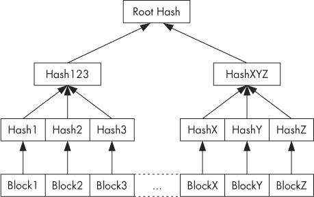

图 10-1. dm-verity 哈希树

由于 dm-verity 依赖于一个覆盖设备所有块的预计算哈希树，因此底层设备必须以只读方式挂载，才能进行验证。大多数文件系统会在其超级块中记录挂载时间和其他元数据，因此即使在运行时没有更改任何文件，如果底层块设备以可读写方式挂载，块完整性检查也会失败。尽管这可以视为一种限制，但它对于存储系统文件的设备或分区而言效果很好，因为系统文件只会在操作系统更新时发生变化。任何其他变化都可能意味着操作系统或磁盘损坏，或是恶意程序试图修改操作系统或伪装成系统文件。

最终，dm-verity 的只读要求非常符合 Android 的安全模型，该模型仅将应用数据保存在可读写分区上，并将操作系统文件保存在只读的*system* 分区中。

## Android 实现

dm-verity 设备映射器目标最初是为实现 Chrome OS 的已验证启动而开发的，并在 Linux 内核 3.4 版本中集成。通过`CONFIG_DM_VERITY`内核配置项启用。

像 Chrome OS 一样，Android 4.4 也使用 dm-verity 目标，但根哈希的加密验证和已验证分区的挂载实现方式有所不同。用于验证的 RSA 公钥嵌入在启动分区下的*verity_key*文件名中，并用于验证 dm-verity 映射表，该表保存目标设备的位置和哈希表的偏移量，以及根哈希和盐值。

映射表及其签名是 verity 元数据块的一部分，该元数据块在目标设备的最后一个文件系统块后直接写入磁盘。通过将`verify`标志添加到设备的*fstab*文件中的 Android 特定*fs_mgr_flags*字段，可以将分区标记为可验证。当 Android 的文件系统管理器在*fstab*中遇到`verify`标志时，它会从*fstab*中指定的块设备加载 verity 元数据，并使用包含的 verity 密钥验证其签名。如果签名检查成功，文件系统管理器会解析 dm-verity 映射表，并将其传递给 Linux 设备映射器，后者使用映射表中的信息创建一个虚拟的 dm-verity 块设备。然后，这个虚拟块设备会被挂载到*fstab*中指定的挂载点，替代相应的物理设备。因此，对底层物理设备的所有读取操作都会透明地与预生成的哈希树进行验证。修改或添加文件，甚至重新挂载分区为读写模式，会导致完整性验证失败并发生 I/O 错误。

### 注意

*由于 dm-verity 是内核功能，因此为了使其完整性保护有效，设备启动时使用的内核需要是可信的。在 Android 上，这要求验证启动分区，其中还包含根文件系统 RAM 磁盘（*initrd*）和 verity 公钥。内核或启动镜像验证是设备特定的过程，通常由设备的引导加载程序实现，并依赖于存储在硬件中的不可修改的签名验证密钥。*

## 启用已验证的启动

官方 Android 文档描述了启用 Android 已验证启动所需的过程，这是一个多步骤的过程，包括生成哈希树、为哈希树创建 dm-verity 映射表、签署该表，并生成并写入 verity 元数据块到目标设备。^([102]) 在本节中，我们简要描述了这个过程的关键步骤。

dm-verity 哈希树是通过 `veritysetup` 程序生成的，该程序是 *cryptsetup* 加密卷管理工具包的一部分。`veritysetup` 程序可以直接在块设备上操作，或者使用文件系统镜像生成哈希树，并将哈希表写入文件。Android 的 dm-verity 实现要求哈希树数据存储在与目标文件系统相同的设备上，因此在调用 `veritysetup` 时必须指定一个明确的哈希偏移量，该偏移量指向 verity 元数据块之后的位置。图 10-2 显示了为 dm-verity 验证准备的磁盘分区布局。


图 10-2. 为 dm-verity 验证准备的磁盘分区布局

生成哈希树会产生根哈希，该根哈希用于构建目标设备的 dm-verity 映射表。一个示例映射表显示在 示例 10-1 中。

示例 10-1. Android dm-verity 设备映射表

```
1➊ /dev/block/mmcblk0p21➋ /dev/block/mmcblk0p21➌ 4096➍ 4096➎
204800➏ 204809➐ sha256➑
1F951588516c7e3eec3ba10796aa17935c0c917475f8992353ef2ba5c3f47bcb➒
5f061f591b51bf541ab9d89652ec543ba253f2ed9c8521ac61f1208267c3bfb1➓
```

如列表所示，该表格为一行（为了可读性而分为多行），除了根哈希 ➒ 外，还包含了 dm-verity 版本 ➊、底层数据和哈希设备的名称（➋ 和 ➌）、数据和哈希块大小（➍ 和 ➎）、数据和哈希磁盘偏移量（➏ 和 ➐）、哈希算法 ➑，以及盐值 ➓。

映射表使用 2048 位 RSA 密钥进行签名，并与生成的 PKCS#1 v1.5 签名一起，用于形成 32 KB 的 verity 元数据块。表 10-1 显示了元数据块每个字段的内容和大小。

表 10-1. Verity 元数据块内容

| 字段 | 描述 | 大小 | 值 |
| --- | --- | --- | --- |
| 魔数 | fs_mgr 用于完整性检查 | 4 字节 | 0xb001b001 |
| 版本 | 元数据块版本 | 4 字节 | 当前为 0 |
| 签名 | 映射表签名（PKCS#1 v1.5） | 256 字节 |   |
| 映射表长度 | 映射表的字节长度 | 4 字节 |   |
| 映射表 | dm-verity 映射表 | 可变 |   |
| 填充 | 填充为 32k 字节长度的零字节 | 可变 |   |

用于验证的 RSA 公钥需要采用 mincrypt 格式（一个简化的加密库，也在 stock recovery 中用于验证 OTA 文件签名），该格式是 mincrypt 的 `RSAPublicKey` 结构的序列化版本。这个结构的有趣之处在于，它不仅包含公钥的模数和公有指数值，还包含了 mincrypt RSA 实现（基于 Montgomery 减法）所使用的预计算值。公钥包含在启动镜像的根目录下，文件名为 *verity_key*。

启用验证启动的最后一步是修改设备的 *fstab* 文件，以启用 *system* 分区的块完整性验证。这只是简单地添加 `verify` 标志，如 示例 10-2（Nexus 4 的示例 *fstab* 文件）所示。

示例 10-2. 已验证的 dm-verity 格式化分区的 fstab 条目

```
/dev/block/platform/msm_sdcc.1/by-name/system /system ext4 ro,barrier=1 wait,verify
```

当设备启动时，Android 会根据 *fstab* 条目和映射表（包含在元数据块中）的信息自动创建一个虚拟的 dm-verity 设备，并将其挂载到 */system*，如 示例 10-3 所示。

示例 10-3. dm-verity 虚拟块设备挂载到 /system

```
# mount|grep system
/dev/block/dm-0 /system ext4 ro,seclabel,relatime,data=ordered 0 0
```

现在，任何对系统分区的修改都会导致读取相应文件时出现读取错误。不幸的是，通过基于文件的 OTA 更新进行的系统修改会修改文件块而不更新 verity 元数据，这也会使哈希树无效。正如官方文档中所提到的，为了与基于 dm-verity 的验证启动兼容，OTA 更新应在块级别操作，确保同时更新文件块、哈希树和元数据。这需要更改当前的 OTA 更新基础设施，这可能是验证启动尚未部署到生产设备的原因之一。

# 磁盘加密

Android 3.0 引入了磁盘加密以及设备管理员策略（详细信息请参见 第九章），可以强制执行设备加密，作为该版本中包含的若干“企业增强功能”之一。磁盘加密在随后的所有版本中都有提供，直到 4.4 版本，才引入了一种新的密钥衍生函数（scrypt）。本节描述了 Android 如何实现磁盘加密，以及如何存储和管理加密密钥和元数据。

### 注意

*Android 兼容性定义要求“如果设备具有锁屏功能，则设备必须支持全盘加密。”*^([103])

*磁盘加密*使用加密算法将写入磁盘的每一位数据转换为密文，确保没有解密密钥就无法从磁盘读取数据。*全盘加密（FDE）*承诺将磁盘上的所有内容加密，包括操作系统文件、缓存和临时文件。实际上，操作系统的一个小部分或单独的操作系统加载器必须保持未加密，以便它能够获取解密密钥，然后解密并挂载主操作系统使用的磁盘卷。磁盘解密密钥通常是加密存储的，并且需要额外的密钥加密密钥（KEK）才能解密。KEK 可以存储在硬件模块中，例如智能卡或 TPM，或者从用户在每次启动时提供的口令中派生。当存储在硬件模块中时，KEK 还可以通过用户提供的 PIN 或密码进行保护。

Android 的 FDE 实现仅加密*userdata*分区，该分区存储系统配置文件和应用数据。*boot*和*system*分区存储内核和操作系统文件，这些分区不加密，但*system*可以选择性地使用 dm-verity 设备映射目标进行验证，正如我们在“验证启动”中所描述的那样。Android 的磁盘加密默认未启用，必须通过用户或托管设备上的设备策略触发加密过程。我们将在以下部分中讨论 Android 的磁盘加密实现。

## 密码模式

Android 的磁盘加密使用 dm-crypt，^([104])目前是 Linux 内核中的标准磁盘加密子系统。与 dm-verity 类似，dm-crypt 是一个设备映射目标，将加密的物理块设备映射到虚拟设备映射设备。所有对虚拟设备的访问都被透明地解密（读取）或加密（写入）。

Android 中使用的加密机制采用随机生成的 128 位密钥，并结合 AES 的 CBC 模式。如我们在第五章中所学，CBC 模式需要一个初始化向量（IV），这个向量必须既随机又不可预测，才能确保加密的安全性。当加密块设备时，这就成了一个问题，因为块设备是非顺序访问的，因此每个扇区（或设备块）都需要一个单独的 IV。

Android 使用加密盐扇区初始化向量（ESSIV）方法，并结合 SHA-256 哈希算法（ESSIV:SHA256）来生成每个扇区的 IV。ESSIV 利用哈希算法从磁盘加密密钥*K*中派生出一个次级密钥*s*，称为*盐*。然后，使用盐作为加密密钥，并加密每个扇区的扇区号*SN*，生成每个扇区的 IV。换句话说，*IV(SN) = AESs*，其中*s = SHA256(K)*。

由于每个扇区的初始化向量（IV）依赖于一个秘密信息（磁盘加密密钥），攻击者无法推断出每个扇区的 IV。然而，ESSIV 并没有改变 CBC 的可变性特性，也没有确保加密块的完整性。事实上，已经证明，如果攻击者知道原始的明文存储在磁盘上，便可以操纵存储的数据，甚至在使用 CBC 进行磁盘加密的卷上注入后门。^([105])

替代密码模式：XTS

针对 ESSIV 模式的这一特定攻击可以通过切换到一种可变加密密码模式来避免，例如 XTS（基于 XEX 的带有密文偷取的变动代码簿模式），该模式使用扇区地址和扇区内加密块的索引的组合来派生每个扇区的唯一“变动值”（变量参数）。

为每个扇区使用不同的变动值与为每个扇区加密一个唯一的密钥效果相同：相同的明文在不同扇区存储时会生成不同的密文，但比为每个扇区派生独立的密钥（或 IV）要具有更好的性能。然而，尽管比 CBC ESSIV 模式更好，XTS 在某些情况下仍然容易受到数据篡改的攻击，并且没有提供密文认证。

截至目前，Android 不支持用于磁盘加密的 XTS 模式。然而，底层的 dm-crypt 设备映射器目标支持 XTS，并且可以通过对 Android 卷守护进程（*vold*）实现进行一些修改轻松启用。

## 密钥派生

磁盘加密密钥（在 Android 源代码中称为“主密钥”）使用另一个 128 位 AES 密钥（KEK）加密，该密钥由用户提供的密码派生。在 Android 3.0 至 4.3 版本中，使用的密钥派生函数是 PBKDF2，迭代次数为 2,000 次，且随机盐值为 128 位。加密后的主密钥和盐值与其他元数据（例如失败的解密尝试次数）一起存储在加密分区的最后 16 KB 中的页脚结构中，称为 *crypto footer*。将加密密钥存储在磁盘上，而不是直接使用从用户提供的密码派生的密钥，可以快速更改解密密码，因为唯一需要使用新密码派生的密钥重新加密的是主密钥（16 字节）。

虽然使用随机盐值使得无法使用预计算表来加速密钥破解，但 PBKDF2 使用的迭代次数（2000 次）在今天的标准下已经不够大。（密钥库密钥派生过程使用了 8192 次迭代，详细内容见第七章。备份加密使用了 10000 次迭代，稍后会在“Android 备份”中讨论。）此外，PBKDF2 是一种迭代算法，基于标准且相对容易实现的哈希函数，这使得 PBKDF2 的密钥派生可以并行化，充分利用多核设备如 GPU 的处理能力。这使得即便是相当复杂的字母数字密码，也能够在几天甚至几小时内被暴力破解。

为了使暴力破解磁盘加密密码变得更加困难，Android 4.4 引入了对一种新的密钥派生函数——*scrypt*的支持。^([106]) Scrypt 采用一种专门设计的密钥派生算法，旨在需要大量内存以及多次迭代（这种算法被称为*memory hard*）。这使得针对专用硬件如 ASIC 或 GPU 的暴力攻击变得更加困难，因为这些硬件通常具有有限的内存。

Scrypt 可以通过指定变量参数*N*、*r*和*p*来调整，这些参数分别影响所需的 CPU 资源、内存量和并行化成本。Android 默认使用的值是*N* = 32768 (2¹⁵)，*r* = 8，*p* = 2。可以通过使用*N_factor:r_factor:p_factor*格式设置*ro.crypto.scrypt_params*系统属性的值来更改这些参数；例如，*15:3:1*（默认值）。每个参数的值通过将 2 提升到相应因子的幂来计算。Android 4.4 设备会自动更新加密页脚中的密钥派生算法，从 PBKDF2 更新为 scrypt，并使用 scrypt 派生的加密密钥重新加密主密钥。当加密的主密钥被更新时，用于 KEK 派生的*N*、*r*和*p*参数会写入加密页脚中。

### 注意

*在同一台桌面机器上，使用 PBKDF2 暴力破解 4 位 PIN 码（使用一个简单的单线程算法，从 0000 开始生成所有可能的 PIN）时，每个 PIN 约需要 5 毫秒，而使用 scrypt 作为 KEK 派生函数时，每个 PIN 大约需要 230 毫秒。换句话说，暴力破解 PBKDF2 比 scrypt 几乎便宜 50 倍（即更快）。*

## 磁盘加密密码

如前一节所述，用于加密磁盘加密密钥的 KEK 源自用户提供的密码。当你第一次启动设备加密过程时，系统会要求你确认设备解锁 PIN 码或密码，或者如果你还没有设置，或使用图案锁屏，则需要设置一个（参见图 10-3）。输入的密码或 PIN 码随后用于推导主密钥加密密钥，你需要在每次启动设备时输入密码或 PIN 码，然后在设备启动后再次输入密码或 PIN 码以解锁屏幕。

Android 没有专门的设置来管理设备加密密码，在设备加密后，更改屏幕锁密码或 PIN 码也会悄悄更改设备加密密码。这很可能是基于可用性驱动的决策：大多数用户会对需要记住并在不同时间输入两个不同密码感到困惑，并且很可能很快忘记那个不常用的、可能更复杂的磁盘加密密码。虽然这种设计对可用性有好处，但它实际上迫使用户使用简单的磁盘加密密码，因为他们每次解锁设备时都必须输入它，通常每天要输入几十次。没有人想要输入那么多次复杂密码，因此大多数用户选择使用简单的数字 PIN 码（除非设备政策要求不同）。此外，密码限制为 16 个字符（这是框架中硬编码的限制，无法配置），所以使用密码短语并不是一个选项。

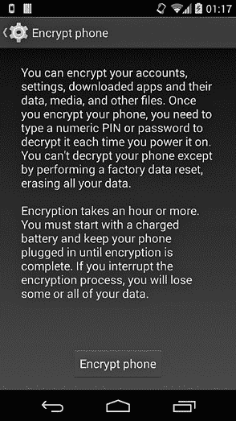

图 10-3. 设备加密屏幕

使用相同密码来同时保护磁盘加密和锁屏有什么问题呢？毕竟，要访问手机上的数据，你反正需要猜测锁屏密码，那为什么还要为磁盘加密设置一个单独的密码呢？原因在于，这两个密码保护你的手机免受两种不同类型的攻击。大多数屏幕锁攻击是在线的暴力破解攻击：本质上是有人在短暂接触设备时，尝试不同的密码。经过几次失败后，Android 会将屏幕锁定 30 秒（速率限制），如果解锁尝试失败次数过多（如果设备政策要求的话），还会擦除设备。因此，在大多数情况下，即使是相对简短的屏幕锁 PIN 码也能有效防止在线攻击（有关详细信息，请参见“暴力破解攻击保护”）。

当然，如果有人能够物理访问该设备或设备的磁盘镜像，他们可以提取密码哈希并离线破解，而无需担心速率限制或设备擦除。事实上，这正是全盘加密所设计来防范的场景：当设备被盗或没收时，攻击者可以通过暴力破解设备，或者即使设备被归还或处理后，也可以复制其数据并进行分析。如前所述，在“密钥推导”中，加密的主密钥存储在磁盘上，如果用于推导其加密密钥的密码是基于一个短数字 PIN，它可以在几分钟内被暴力破解^([107])（甚至在使用 PBKDF2 进行密钥推导的 4.4 版本之前的设备上，可能只需几秒钟）。远程擦除解决方案可以通过删除主密钥来防止此类攻击，这只需要片刻时间，并使设备变得无用，但这通常不是一个可行的选项，因为设备可能处于离线状态或关闭状态。

## 更改磁盘加密密码

磁盘加密的用户级部分是通过 Android 的卷管理守护进程（*vold*）中的*cryptfs*模块来实现的。*cryptfs*有用于创建和挂载加密卷的命令，还可以用来验证和更改主密钥加密密码。Android 系统服务通过本地套接字（也命名为*vold*）向*vold*发送命令，与*cryptfs*进行通信，*vold*根据接收到的命令设置描述加密或挂载过程当前状态的系统属性。（这导致了一个相当复杂的启动过程，详细描述见下面的“启用加密”以及“启动加密设备”。）

Android 并不提供一个界面来单独更改磁盘加密密码，但可以通过直接与*vold*守护进程通信，使用`vdc`命令行工具来做到这一点。然而，*vold*控制套接字的访问权限仅限于 root 用户和*mount*组的成员，此外，*cryptfs*命令仅对*root*和*system*用户可用。如果你使用的是工程版本，或者你的设备通过“超级用户”应用提供 root 访问（参见第十三章），你可以发送示例 10-4 中显示的*cryptfs*命令给*vold*，以更改磁盘加密密码。

示例 10-4. 使用`vdc`更改磁盘加密密码

```
# vdc cryptfs changepw <newpass>
200 0 0
```

### 注意

*如果你更改了锁屏密码，磁盘加密密码将自动更改。（这不适用于多用户设备上的次要用户。）*

## 启用加密

如前一节所述，Android 的磁盘加密的用户级部分是由 *vold* 守护进程的专用 *cryptfs* 模块实现的。*cryptfs* 提供了 `checkpw`、`restart`、`cryptocomplete`、`enablecrypto`、`changepw`、`verifypw`、`getfield` 和 `setfield` 等命令，框架会在加密或加密卷挂载的不同阶段发送这些命令。除了对 *vold* 本地套接字的权限设置外，*cryptfs* 还明确检查命令发送者的身份，只允许 *root* 和 *system* 用户访问。

### 使用系统属性控制设备加密

*vold* 守护进程设置了多个系统属性，以触发设备加密或挂载的各个阶段，并向框架服务传达当前的加密状态。*ro.crypto.state* 属性保存当前的加密状态，当数据分区成功加密时，它的值为 *encrypted*，如果尚未加密，则为 *unencrypted*。如果设备不支持磁盘加密，该属性也可以设置为 *unsupported*。*vold* 守护进程还设置了 *vold.decrypt* 属性的多个预定义值，以便指示设备加密或挂载的当前状态。*vold.encrypt_progress* 属性保存当前的加密进度（从 0 到 100），如果在设备加密或挂载过程中发生错误，则为错误字符串。

*ro.crypto.fs_crypto_blkdev* 系统属性包含由设备映射器分配的虚拟设备的名称。在成功解密磁盘加密密钥后，这个虚拟设备将挂载在 */data* 上，替代底层的物理卷，如 示例 10-5 所示（输出已拆分以便于阅读）。

示例 10-5. 加密的虚拟块设备挂载在 /data

```
# mount|grep '/data'
/dev/block/dm-0 /data ext4 rw,seclabel,nosuid,nodev,noatime,
errors=panic,user_xattr,barrier=1,nomblk_io_submit,data=ordered 0 0
```

### 卸载 /data

Android 框架期望 */data* 可用，但需要先卸载才能进行加密。这造成了一个进退两难的局面，Android 通过卸载物理 *userdata* 分区并在其位置挂载一个内存文件系统（tempfs）来解决这个问题，同时执行加密。运行时切换分区反过来又需要停止并重启某些系统服务，*vold* 通过将 *vold.decrypt* 系统属性的值设置为 *trigger_restart_framework*、*trigger_restart_min_framework* 或 *trigger_shutdown_framework* 来触发这些服务的停止与重启。这些值触发 *init.rc* 中的不同部分，如 示例 10-6 所示。

示例 10-6. 在 init.rc 中触发 vold.decrypt

```
--*snip*--
on post-fs-data➊
    chown system system /data
    chmod 0771 /data
    restorecon /data
    copy /data/system/entropy.dat /dev/urandom
--*snip*--
on property:vold.decrypt=trigger_reset_main➋
    class_reset main

on property:vold.decrypt=trigger_load_persist_props
    load_persist_props

on property:vold.decrypt=trigger_post_fs_data➌
    trigger post-fs-data

on property:vold.decrypt=trigger_restart_min_framework➍
    class_start main

on property:vold.decrypt=trigger_restart_framework➎
    class_start main
    class_start late_start

on property:vold.decrypt=trigger_shutdown_framework➏
    class_reset late_start
    class_reset main
--*snip-*
```

### 触发加密过程

当用户通过系统设置界面启动加密过程，选择“安全性▸加密手机”时，设置应用会调用`MountService`，进而向*vold*发送`cryptfs enablecrypto inplace` *`password`*命令，其中*`password`*是锁屏密码。接着，*vold* 卸载*userdata*分区并将*vold.decrypt*设置为*trigger_shutdown_framework*（➏，见示例 10-6），这将关闭大部分系统服务，除了属于*core*服务类的服务。然后，*vold*守护进程卸载*/data*，在其位置挂载一个 tempfs 文件系统，并将*vold.encrypt_progress*设置为 0，将*vold.decrypt*设置为*trigger_restart_min_framework*（➍，见示例 10-6）。这将启动一些更多系统服务（在*main*类中），这些服务是显示加密进度 UI 所必需的。

### 更新加密页脚和加密数据

接下来，*vold*设置虚拟的 dm-crypt 设备并写入加密页脚。页脚可以写入到*userdata*分区的末尾，或者写入到专用的分区或文件，其位置在*fstab*文件中作为`encryptable`标志的值指定。例如，在 Nexus 5 上，加密页脚被写入到专用分区*metadata*，如示例 10-7 所示为➊（为了可读性，单行被拆分）。当加密页脚写入到加密分区的末尾时，`encryptable`标志被设置为字符串*footer*。

示例 10-7. `encryptable` fstab 标志指定加密页脚的位置

```
--*snip*--
/dev/block/platform/msm_sdcc.1/by-name/userdata  /data  ext4
noatime,nosuid,nodev,barrier=1,data=ordered,nomblk_io_submit,noauto_da_alloc,errors=panic
wait,check,encryptable=/dev/block/platform/msm_sdcc.1/by-name/metadata➊
--*snip*--
```

加密页脚包含加密的磁盘加密密钥（主密钥）、用于 KEK 推导的盐值以及其他密钥推导参数和元数据。其*flags*字段设置为`CRYPT_ENCRYPTION_IN_PROGRESS`（0x2），表示设备加密已启动但尚未完成。

最后，从物理*userdata*分区读取每个数据块，并将其写入虚拟的 dm-crypt 设备，设备对读取的数据块进行加密并写入磁盘，从而实现对*userdata*分区的就地加密。如果加密过程没有错误，*vold*会清除`CRYPT_ENCRYPTION_IN_PROGRESS`标志并重新启动设备。

## 启动加密设备

启动加密设备需要向用户询问磁盘加密密码。与其使用专门的引导加载程序用户界面，Android 将*vold.decrypt*系统属性设置为 1，然后启动一组最小的系统服务以显示标准的 Android 用户界面。与设备加密类似，这同样需要在*/data*挂载一个 tmpfs 文件系统，以便核心系统服务能够启动。当核心框架启动后，Android 会检测到*vold.decrypt*被设置为 1，并启动*userdata*分区的挂载过程。

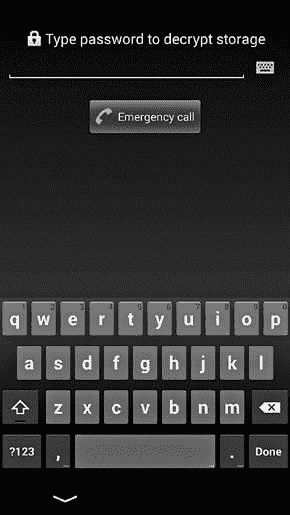

图 10-4 设备加密密码输入用户界面

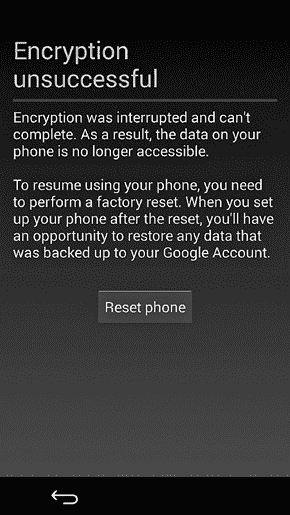

图 10-5 设备加密失败时显示的 UI

### 获取磁盘加密密码

该过程的第一步是通过向*vold*发送`cryptfs cryptocomplete`命令，检查分区是否已成功加密，后者会检查加密页脚是否正确格式化，并且`CRYPT_ENCRYPTION_IN_PROGRESS`标志未被设置。如果发现分区已成功加密，框架将启动由`CryptKeeper`提供的密码输入用户界面，如图 10-4 所示，`CryptKeeper`是系统设置应用的一部分。此活动作为主屏幕（启动器）启动，并且由于其优先级高于默认启动器，因此在设备启动后首先启动。

如果设备未加密，`CryptKeeper`会禁用自身并完成，从而导致系统活动管理器启动默认的主屏幕应用程序。如果设备已加密或正在加密过程中（即*vold.crypt*属性不为空或未设置为*trigger_restart_framework*），`CryptKeeper`活动会启动并隐藏状态栏和系统栏。此外，`CryptKeeper`会忽略硬件返回按钮的按压，从而禁止用户离开密码输入用户界面。

如果加密设备损坏，或者加密过程被中断，导致*userdata*分区仅部分加密，设备将无法启动。在这种情况下，`CryptKeeper`会显示图 10-5 中所示的 UI，允许用户触发恢复出厂设置，这将重新格式化*userdata*分区。

### 解密并挂载/data

当用户输入密码时，`CryptKeeper`通过调用系统`MountService`的`decryptStorage()`方法，将`cryptfs checkpw`命令发送给*vold*。这指示*vold*检查输入的密码是否正确，方法是尝试将加密分区挂载到临时挂载点，然后再卸载。如果该过程成功，*vold*将设备映射器分配的虚拟块设备的名称设置为*ro.crypto.fs_crypto_blkdev*属性的值，并将控制权返回给`MountService`，后者进一步发送`cryptfs restart`命令，指示*vold*重启*main*类中的所有系统服务（➋见示例 10-6）。这使得 tempfs 文件系统得以卸载，并且新分配的虚拟 dm-crypt 块设备被挂载到*/data*。

### 启动所有系统服务

在加密分区挂载并准备好后，*vold*将*vold.decrypt*设置为*trigger_post_fs_data*（➌见示例 10-6），从而触发*init.rc*的*post-fs-data* ➊部分。本部分的命令设置文件和目录权限，恢复 SELinux 上下文，并在必要时在*/data*下创建所需的目录。

最后，*post-fs-data*将*vold.post_fs_data_done*属性设置为 1，*vold*会定期轮询该属性。当*vold*检测到值为 1 时，它将*vold.decrypt*属性设置为*trigger_restart_framework*（➎见示例 10-6），从而重启*main*类中的所有服务，并启动所有延迟启动的服务（类*late_start*）。此时，框架已完全初始化，设备开始使用解密后的*userdata*分区的视图进行引导，该视图被挂载在*/data*。从此以后，所有由应用程序或系统写入的数据在提交到磁盘之前都会自动加密。

磁盘加密的限制

磁盘加密仅保护静态数据；也就是说，当设备关闭时。由于磁盘加密是透明的，并且在内核级别实现，在加密卷被挂载后，它对于用户级进程来说与明文卷没有区别。因此，磁盘加密并不能保护数据免受在设备上运行的恶意程序的攻击。处理敏感数据的应用程序不应仅依赖于全盘加密，而应实现自己的基于文件的加密。文件加密密钥应使用从用户提供的密码派生的 KEK 加密，或者如果数据需要与设备绑定，则可以使用不可更改的硬件属性加密。为了确保文件完整性，必须使用经过认证的加密方案（如 GCM）或附加认证功能（如 HMAC）对加密数据进行认证。

# 屏幕安全性

控制 Android 设备访问的一种方式是要求用户身份验证才能访问系统 UI 和应用程序。用户身份验证通过在设备每次启动或屏幕打开时显示*锁屏界面*来实现。配置为需要数字 PIN 码解锁的单用户设备上的锁屏界面可能类似于图 10-6。

在早期的 Android 版本中，锁屏仅用于保护对设备 UI 的访问。随着平台的发展，锁屏被扩展了许多功能，包括显示最新设备或应用程序状态的小部件，允许在多用户设备之间切换，并支持解锁系统密钥存储。同样，屏幕解锁的 PIN 码或密码现在用于派生凭证存储加密密钥（用于软件实现），以及磁盘加密密钥 KEK。

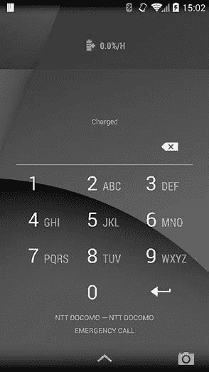

图 10-6. PIN 锁屏界面

## 锁屏实现

Android 的锁屏（或*键盘保护*）实现方式与普通的 Android 应用程序类似：窗口上布局了小部件。它的特殊之处在于，它的窗口位于一个高层窗口中，其他应用程序无法在其上方绘制或控制。此外，键盘保护拦截了普通的导航按钮，使得无法绕过它，从而实现“锁定”设备。

键盘保护窗口层并不是最高层，然而，源自键盘保护本身的对话框和状态栏会绘制在键盘保护之上。你可以使用 AD 工具包中的层次查看器工具查看当前显示的窗口列表。当屏幕被锁定时，活动窗口是键盘保护窗口，如图 10-7 所示。

### 注意

*在 Android 4.0 之前，第三方应用程序可以在键盘保护层中显示窗口，这允许应用程序拦截 Home 键并实现“自助终端”风格的应用程序。然而，由于某些恶意软件滥用了这一功能，因此自 Android 4.0 以来，向键盘保护层添加窗口需要`INTERNAL_SYSTEM_WINDOW`签名权限，而该权限仅限系统应用程序使用。*

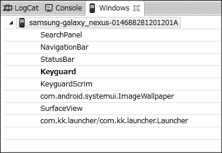

图 10-7. 键盘保护窗口在 Android 窗口堆栈中的位置

长期以来，键盘保护是 Android 窗口系统的一个实现细节，并没有被拆分成独立的组件。随着锁屏小部件、屏幕保护程序（即屏保）和多用户支持的引入，键盘保护获得了大量的新功能，最终在 Android 4.4 中被提取成一个独立的系统应用程序`Keyguard`。`Keyguard`应用程序位于*com.android.systemui*进程中，与核心的 Android UI 实现一起运行。

每种解锁方法的用户界面（稍后讨论）都实现为一个专用的视图组件。这个组件由一个名为`KeyguardHostView`的专用视图容器类承载，并包含关键 guard 小部件和其他辅助 UI 组件。例如，在图 10-6 中展示的 PIN 码解锁视图是由`KeyguardPINView`类实现的，而密码解锁是由`KeyguardPasswordView`类实现的。`KeyguardHostView`类会自动选择并显示当前配置的解锁方法和设备状态的适当解锁视图。解锁视图将密码检查委托给`LockPatternUtils`类，该类负责将用户输入与保存的解锁凭据进行比较，并将密码更改持久化到磁盘，并更新与身份验证相关的元数据。

除了关键 guard 解锁视图的实现之外，`Keyguard`系统应用程序还包括导出的`KeyguardService`服务，该服务公开了远程 AIDL 接口`IKeyguardService`。该服务允许客户端检查当前的关键 guard 状态，设置当前用户，启动相机，并隐藏或禁用关键 guard。更改关键 guard 状态的操作受到系统签名权限`CONTROL_KEYGUARD`的保护。

## 关键 guard 解锁方法

原生安卓提供了几种关键 guard 解锁方法（在安卓源代码中也称为*安全模式*）。其中，五种方法可以直接在选择屏幕锁定界面中选择：滑动、面部解锁、图案、PIN 码和密码，如图 10-8 所示。

滑动解锁方法不需要用户身份验证，因此其安全级别相当于选择“无”。这两种状态在内部通过将当前安全模式设置为`KeyguardSecurityModel.SecurityMode.None`枚举值来表示。截至目前，面部解锁是`SecurityMode.Biometric`安全模式的唯一实现，并且在内部被称为“弱生物特征”（未来版本可能会使用指纹或虹膜识别实现“强生物特征”）。与当前设备安全策略不兼容的解锁方法（如图 10-8 中列出的前三种方法）会被禁用，无法选择。安全策略可以由设备管理员显式设置，或者通过启用与安全相关的操作系统功能（如凭据存储或全盘加密）隐式设置。

图案解锁方法（`SecurityMode.Pattern`）是安卓特有的，要求用户在 3×3 网格上绘制预定义的图案以解锁设备，如图 10-9 所示。

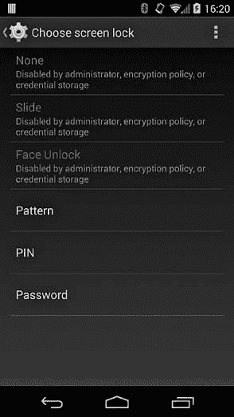

图 10-8. 可直接选择的锁屏解锁方法

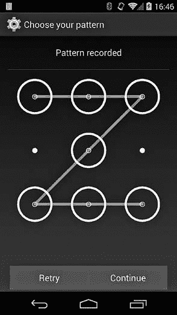

图 10-9. 配置图案解锁方法

PIN (`SecurityMode.PIN`) 和密码 (`SecurityMode.Password`) 解锁方法的实现类似，但在允许的字符范围上有所不同：PIN 只允许数字（0-9），而密码则允许字母数字字符。

`SecurityMode` 枚举定义了三种不能在选择屏幕锁屏界面直接选择的解锁方法：`SecurityMode.Account`、`SecurityMode.SimPin` 和 `SecurityMode.SimPuk`。`SecurityMode.Account` 方法仅在支持 Google 帐号（Google 体验设备）的设备上可用，并非独立的解锁方法。它只能作为其他安全模式的后备方法使用。类似地，`SecurityMode.SimPin` 和 `SecurityMode.SimPuk` 本身并不是锁屏解锁方法；它们仅在设备的 SIM 卡需要 PIN 码才能使用时可用。由于 SIM 卡会记住 PIN 验证状态，因此 PIN 或 PUK 只需输入一次——在设备启动时（或者如果 SIM 卡状态被重置）。我们将在接下来的章节中深入探讨每种锁屏安全模式的实现。

### 面部解锁

面部解锁是一种相对较新的解锁方法，首次在 Android 4.0 中引入。它利用设备的前置摄像头注册用户面部的图像（见图 10-10），并依靠图像识别技术来识别解锁时捕捉到的面部图像。尽管自面部解锁推出以来，已经对其准确性进行了改进，但它仍被认为是所有解锁方法中最不安全的，甚至设置屏幕上也警告用户“看起来像你的人可能解锁你的手机。”此外，面部解锁还需要备用解锁方法——图案或 PIN 码，以应对面部识别无法进行的情况（例如光线不足、摄像头故障等）。面部解锁的实现基于 PittPatt（Pittsburgh Pattern Recognition）公司开发的面部识别技术，该公司于 2011 年被 Google 收购。该技术的代码仍为专有代码，关于存储数据格式或所采用的识别算法没有详细信息。截至本文撰写时，面部解锁的实现位于 `com.android.facelock` 包中。

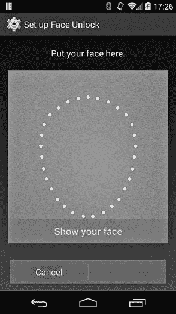

图 10-10. 面部解锁设置屏幕

### 图案解锁

如图 10-9 所示，图案解锁的代码是通过在 3×3 矩阵中至少连接四个点来输入的。每个点只能使用一次（交叉的点会被忽略），最大点数为九。内部上，图案以字节序列的形式存储，每个点通过其索引来表示，其中 0 是左上角，8 是右下角。因此，图案类似于一个最小为四位、最大为九位的 PIN 码，且只使用九个不同的数字（0 到 8）。然而，由于点不能重复，解锁图案的变化数远低于九位 PIN 码的变化数。

图案锁的哈希值存储在*/data/system/gesture.key*（在多用户设备上为*/data/system/users/<用户 ID>/gesture.key*）中，作为一个无盐的 SHA-1 值。通过简单地导出此文件，我们可以很容易地看到图 10-9 所示的图案（在十六进制中表示为*00010204060708*）在示例 10-8 中的*gesture.key*文件内容与图案字节序列的 SHA-1 哈希值相匹配，对于此示例来说，该哈希值为*6a062b9b3452e366407181a1bf92ea73e9ed4c48*。

示例 10-8. /data/system/gesture.key 文件的内容

```
# od -t x1 /data/system/gesture.key
0000000 6a 06 2b 9b 34 52 e3 66 40 71 81 a1 bf 92 ea 73
0000020 e9 ed 4c 48
```

由于在计算哈希时没有使用随机盐值，因此每个图案总是会被哈希为相同的值，这使得生成一个预计算的所有可能图案及其相应哈希值的表格相对容易。（此类表格在网上随处可见。）这使得一旦获取到*gesture.key*文件，就能立即恢复图案。然而，该文件由*system*用户拥有，且其权限设置为 0600，因此通常无法在生产设备上恢复。输入的图案会使用`LockScreenUtils`类的`checkPattern()`方法与保存的哈希值进行对比，而图案哈希会通过该类的`saveLockPattern()`方法进行计算并持久化保存。保存图案时，还会将当前密码强度值设置为`DevicePolicyManager.PASSWORD_QUALITY_SOMETHING`。

图案解锁方法的另一个不幸特点是，由于电容式触摸屏是直接用手指操作（而非使用触控笔或类似工具），多次绘制解锁图案会在触摸屏上留下明显的痕迹，从而容易受到所谓的“污迹攻击”。通过适当的光线和相机，屏幕上的指纹污迹可以被检测到，从而以很高的概率推测出解锁图案。因此，图案解锁方法的安全性被认为非常低。此外，由于组合数量有限，解锁图案是一个糟糕的熵源，在用户的解锁凭证用于推导加密密钥时（例如，用于系统密钥库和设备加密的密钥），该方法是不被允许的。

与面部解锁类似，图案解锁方法支持备份解锁机制，该机制只有在用户输入无效图案超过五次后才会启用。备份认证必须通过按下锁屏底部显示的“忘记图案”按钮手动激活。按下按钮后，设备进入`SecurityMode.Account`安全模式，并显示图 10-11 所示的屏幕。

用户可以输入设备上任何已注册 Google 账户的凭据来解锁设备，然后重置或更改解锁方法。因此，在设备上注册一个易于猜测（或共享）的密码的 Google 账户，可能成为设备锁屏的潜在后门。

### 注意

*截至本文写作时，已配置为要求两步验证的 Google 账户无法用于解锁设备。*

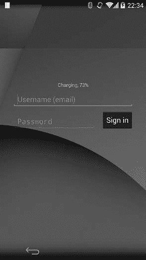

图 10-11. Google 账户解锁模式

### PIN 和密码解锁

PIN 和密码方法本质上是等价的：它们将用户输入的哈希值与设备上存储的加盐哈希值进行比较，并在值匹配时解锁设备。PIN 或密码的哈希值是用户输入的 SHA-1 和 MD5 哈希值的组合，并使用 64 位随机值加盐。计算出的哈希值以十六进制字符串的形式存储在*/data/misc/password.key*（在多用户设备上为/*data/system/users/<user ID>/password.key*）文件中，可能类似于示例 10-9。

示例 10-9. /data/misc/password.key 文件的内容

```
# cat /data/system/password.key && echo
9B93A9A846FE2FC11D49220FC934445DBA277EB0AF4C9E324D84FFC0120D7BAE1041FAAC
```

用于计算哈希值的盐值被保存在系统 `SettingsProvider` 内容提供者的 `secure` 表中，Android 4.2 之前的版本中使用 *lockscreen.password_salt* 键，但为了支持每个设备的多个用户，它被移动到一个专用的数据库中，数据库还包含其他与锁屏相关的元数据。从 Android 4.4 开始，数据库位于 */data/system/locksettings.db*，并通过 `LockSettingsService` 的 `ILockSettings` AIDL 接口进行访问。

访问该服务需要 `ACCESS_KEYGUARD_SECURE_STORAGE` 签名权限，仅允许系统应用程序使用。*locksettings.db* 数据库有一个名为 `locksettings` 的表，其中可能包含像 示例 10-10 中为特定用户（`user` 列包含 Android 用户 ID）提供的数据。

示例 10-10。/data/system/locksettings.db 中的所有者用户内容

```
sqlite> **select name, user, value from locksettings where user=0;**
name                              |user|value
--*snip*--
lockscreen.password_salt          |0   |6909501022570534487➊
--*snip*--
lockscreen.password_type_alternate|0   |0➋
lockscreen.password_type          |0   |131072➌
lockscreen.passwordhistory        |0   |5BFE43E89C989972EF0FA0EC00BA30F356EE7B
7C7BF8BC08DEA2E067FF6C18F8CD7134B8,EE29A531FE0903C2144F0618B08D1858473C50341A7
8DEA85D219BCD27EF184BCBC2C18C➍
```

在这里，*lockscreen.password_salt* 设置 ➊ 存储了 64 位（表示为 Java `long` 类型）盐值，*lockscreen.password_type_alternate* 设置 ➋ 包含当前解锁方法的备份（也叫备用）解锁方法类型（0 表示无）。*lockscreen.password_type* ➌ 存储了当前选定的密码类型，由 `DevicePolicyManager` 类中定义的相应 `PASSWORD_QUALITY` 常量的值表示。在这个示例中，131072（十六进制为 0x00020000）对应 `PASSWORD_QUALITY_NUMERIC` 常量，这是数字 PIN 提供的密码质量。最后，*lockscreen.passwordhistory* ➍ 存储了密码历史记录，保存为以前的 PIN 或密码哈希值的序列，用逗号分隔。只有当通过 `DevicePolicyManager` 类中的 `setPasswordHistoryLength()` 方法将历史记录长度设置为大于零的值时，历史记录才会被保存。当密码历史记录可用时，输入与历史记录中任何密码相同的新密码是禁止的。

密码哈希可以通过将密码或 PIN 字符串（在本例中为 *1234*）与盐值（在本例中为 *5fe37a926983d657*，格式为十六进制字符串）连接起来，然后计算结果字符串的 SHA-1 和 MD5 哈希值，轻松计算出来，如 示例 10-11 所示。

示例 10-11。使用 sha1sum 和 md5sum 计算 PIN 或密码的哈希值

```
$ **SHA1=`echo -n '12345fe37a926983d657'|sha1sum|cut -d- -f1|tr '[a-z]' '[A-Z]'**➊
$ **MD5=`echo -n '12345fe37a926983d657'|md5sum|cut -d- -f1|tr '[a-z]' '[A-Z]'`**➋
$ **echo "$SHA1$MD5"|tr -d ' '**➌
9B93A9A846FE2FC11D49220FC934445DBA277EB0AF4C9E324D84FFC0120D7BAE1041FAAC
```

在这个示例中，哈希值是通过使用 `sha1sum` ➊ 和 `md5sum` ➋ 命令计算的。当这两个命令的输出结果 ➌ 被连接时，它会生成一个字符串，该字符串包含在 示例 10-9 中所示的 *password.key* 文件。

请注意，虽然使用随机哈希使得无法使用单一的预计算表来暴力破解任何设备的 PIN 码或密码，但计算密码或哈希仍然需要一次哈希调用，因此为特定设备生成目标哈希表（假设盐值也可用）仍然相对便宜。此外，尽管 Android 计算了 PIN 码或密码的 SHA-1 和 MD5 哈希值，但这并没有提供额外的安全性，因为只需针对较短的哈希（MD5）即可破解 PIN 码或密码。

输入的密码将通过`LockPatternUtils.checkPassword()`方法与存储的哈希值进行比对，并且使用该类中的`saveLockPassword()`方法之一计算并保存用户提供的密码的哈希值。调用`saveLockPassword()`会更新目标（或当前）用户的*password.key*文件。像*gesture.key*一样，这个文件属于*system*用户，并具有 0600 权限。除了更新密码哈希外，`saveLockPassword()`还会计算输入密码的复杂度，并使用计算出的复杂度值更新`locksettings.db`中与*lockscreen.password_type*键对应的`value`列（➌，见示例 10-10）。如果启用了密码历史功能，`saveLockPassword()`还会将 PIN 码或密码的哈希值添加到`locksettings`表中（➍，见示例 10-11）。

请记住，当设备被加密时，PIN 码或密码用于推导出一个 KEK，KEK 用于加密磁盘加密密钥。因此，修改拥有者用户的 PIN 码或密码也会通过调用系统的`MountService`中的`changeEncryptionPassword()`方法重新加密磁盘加密密钥。（修改二级用户的 PIN 码或密码不会影响磁盘加密密钥。）

### PIN 码和 PUK 解锁

PIN 码和 PUK 安全模式本身并不是锁屏解锁方法，因为它们依赖于设备 SIM 卡的状态，只有在 SIM 卡处于锁定状态时才会显示。SIM 卡可能要求用户输入预配置的 PIN 码才能解锁卡片，并访问存储在其中的任何网络认证密钥，这些密钥用于与移动网络注册和拨打非紧急电话。

由于 SIM 卡在重置之前保持解锁状态，因此 PIN 码通常只在设备首次启动时需要输入。如果输入错误的代码超过三次，SIM 卡会被锁定，用户需要输入一个单独的代码来解锁它，这个代码称为*PIN 解锁密钥（PUK）*，或*个人解锁码（PUC）*。

当锁屏显示时，Android 会检查 SIM 卡的状态，如果是`State.PIN_REQUIRED`（在`IccCardConstants`类中定义），则显示图 10-12 所示的 SIM 解锁键盘视图。当用户输入 SIM 解锁 PIN 时，该 PIN 会传递给`ITelephony`接口的`supplyPinReportResult()`方法（在`TeleService`系统应用程序中实现），然后通过无线接口守护进程（*rild*）将其传递给设备的基带处理器（实现移动网络通信的设备组件，有时也称为*调制解调器*或*无线*）。最后，基带处理器直接与 SIM 卡连接，将 PIN 发送到 SIM 卡，并接收一个状态码作为响应。状态码通过相同的路径返回到解锁视图。如果状态码表明 SIM 卡接受了 PIN 且未配置屏幕锁定，则会显示主屏幕（启动器）。另一方面，如果已配置屏幕锁定，则在解锁 SIM 卡后会显示屏幕锁定，用户必须输入凭据才能解锁设备。

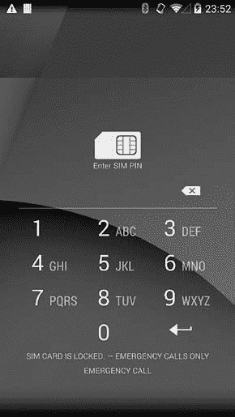

图 10-12. SIM 解锁屏幕

如果 SIM 卡被锁定（即处于`PUK_REQUIRED`状态），Android 会显示 PUK 输入屏幕，并在解锁卡后允许用户设置新的 PIN。PUK 和新 PIN 会传递给`ITelephony`接口的`supplyPukReportResult()`方法，该方法将其传递到 SIM 卡。如果已配置屏幕锁定，则在验证 PUK 并配置新 PIN 后，屏幕锁定会显示出来。

`Keyguard`系统应用程序通过注册`TelephonyIntents.ACTION_SIM_STATE_CHANGED`广播来监视 SIM 卡状态的变化，并在卡被锁定或永久禁用时显示锁屏。如果用户想要切换 SIM 卡的 PIN 保护，可以通过进入**设置**▸**安全性**▸**设置 SIM 卡锁**，并勾选**锁定 SIM 卡**复选框来操作。

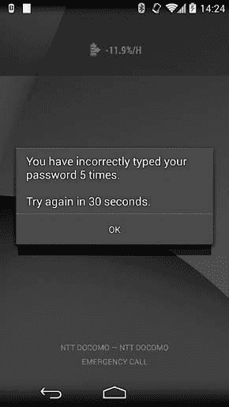

图 10-13. 五次连续身份验证失败后的速率限制

## 暴力破解攻击防护

由于复杂的密码在触摸屏键盘上输入起来比较麻烦，用户通常使用相对较短的解锁凭据，这些凭据容易被猜测或通过暴力破解获取。Android 通过要求用户在每五次连续的身份验证失败后等待 30 秒，来防止直接在设备上进行的暴力破解攻击（在线攻击），如图 10-13 所示。这种技术称为*速率限制*。

为了进一步防止暴力破解攻击，可以通过 `DevicePolicyManager` API 设置并强制执行密码复杂性、过期时间和历史规则，正如在第九章中讨论的那样。如果设备存储或允许访问敏感的企业数据，设备管理员还可以使用 `DevicePolicyManager.setMaximumFailedPasswordsForWipe()` 方法设置允许的失败认证尝试阈值。当达到阈值时，设备上的所有用户数据将被自动删除，防止攻击者未经授权访问设备。

# 安全的 USB 调试

Android 成功的一个原因是其应用开发的低门槛；应用可以在任何操作系统上使用高级语言开发，无需投资开发工具或硬件（使用 Android 模拟器时）。为嵌入式或其他专用设备开发软件传统上一直很困难，因为通常很难（或者在某些情况下不可能）检查程序的内部状态或以其他方式与设备进行交互，从而调试程序。

自 Android 最早版本以来，Android 就包含了一个强大的设备交互工具包，允许进行交互式调试和检查设备状态，称为 *Android 调试桥（ADB）*。ADB 通常在消费类设备上处于关闭状态，但可以通过系统 UI 打开，以启用设备上的应用开发和调试。由于 ADB 提供了对设备文件系统和应用程序的特权访问，它可以被用来获取未经授权的数据访问权限。在接下来的章节中，我们将讨论 ADB 的架构，然后讨论近期 Android 版本采取的限制 ADB 访问的措施。

## ADB 概述

ADB 跟踪所有连接到主机的设备（或模拟器），并为其客户端（命令行客户端、IDE 等）提供各种服务。它由三个主要组件组成：ADB 服务器、ADB 守护进程 (*adbd*) 和默认的命令行客户端（`adb`）。ADB 服务器作为后台进程在主机上运行，将客户端与实际设备或模拟器解耦。它监控设备的连接状态，并根据情况设置其状态（`CS_CONNECTED`、`CS_OFFLINE`、`CS_RECOVERY` 等）。

ADB 守护进程运行在 Android 设备（或模拟器）上，并提供客户端实际使用的服务。它通过 USB 或 TCP/IP 连接到 ADB 服务器，并接收和处理来自服务器的命令。`adb` 命令行客户端允许你向特定设备发送命令。在实践中，它与 ADB 服务器实现于同一个二进制文件中，因此共享大量的代码。图 10-14 显示了 ADB 架构的概览。

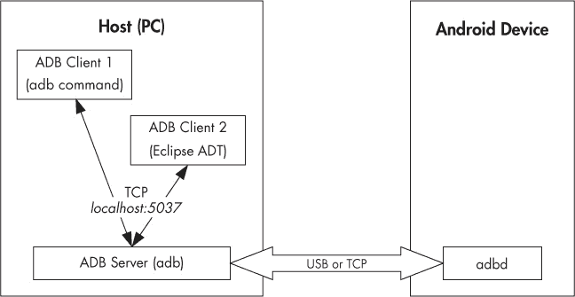

图 10-14. ADB 架构

### 注意

*除了在 `adb` 命令中的本地实现和在 Android 开发工具（ADT）Eclipse 插件中的基于 Java 的实现外，还可以使用各种第三方的 ADB 协议实现，包括一个 Python 客户端*^([108]) *和一个用 JavaScript 实现的 ADB 服务器，*^([109]) *可以作为扩展嵌入 Chrome 浏览器中。*

客户端通过 TCP（通常是 *localhost:5037*）与本地 ADB 服务器通信，使用基于文本的命令，并返回 *OK* 或 *FAIL* 响应。一些命令，比如列举设备、端口转发或守护进程重启，由本地守护进程处理，而其他命令（如 shell 或日志访问）则需要与目标 Android 设备建立连接。设备访问通常通过将输入输出流转发到/从主机来实现。实现这一功能的传输层使用简单的消息，具有一个 24 字节的头部，其中包含命令标识符、两个参数、可选负载的长度和 CRC32 校验码，以及一个魔数，该魔数仅仅是将命令的所有位翻转。消息结构在 *system/core/adb/adb.h* 中定义，并在 示例 10-12 中提供参考。消息进一步封装在数据包中，通过 USB 或 TCP 链接发送到运行在设备上的 ADB 服务器。

示例 10-12。ADB 消息结构

```
struct amessage {
    unsigned command;       /* command identifier constant      */
    unsigned arg0;          /* first argument                   */
    unsigned arg1;          /* second argument                  */
    unsigned data_length;   /* length of payload (0 is allowed) */
    unsigned data_check;    /* checksum of data payload         */
    unsigned magic;         /* command ^ 0xffffffff             */
};
```

我们不会详细讨论 ADB 协议，除了提到为了实现安全的 USB 调试，协议中添加了身份验证命令。（有关 ADB 的更多详细信息，请参阅 Android 源代码树中的*system/core/adb/protocol.txt* 文件中的协议描述。）

### 注意

*你可以通过在主机上设置 `ADB_TRACE` 环境变量为 1，以及在设备上设置 `persist.adb.trace_mask` 系统属性，来启用所有 ADB 服务的跟踪日志。通过将 `ADB_TRACE` 或 `persist.adb.trace_mask` 的值设置为以逗号或空格分隔的（列或分号作为分隔符也支持）服务标签列表，可以选择性地跟踪某些服务。有关支持的标签的完整列表，请参见* system/core/adb/adb.c *。*

## 安全 ADB 的必要性

如果你做过开发，你就会知道，“调试”通常与“安全”是完全相反的。调试通常涉及检查（有时甚至修改）程序的内部状态，向日志文件中转储加密的通信数据，通用的 root 权限访问，以及其他一些既可怕又必要的活动。调试本身就已经够难的了，如果还要考虑安全问题，那岂不是雪上加霜？所以，为什么要通过增加额外的安全层来进一步复杂化事情呢？通过 ADB 提供的 Android 调试非常灵活，当启用时，它几乎可以让你完全控制设备。当然，这个功能在开发或测试应用程序（或操作系统本身）时非常受欢迎，但它也可以用于其他目的。

以下是 ADB 让你可以做的一些选择性操作：

+   将文件复制到设备或从设备复制文件

+   调试设备上运行的应用（使用 JWDP 或 `gdbserver`）

+   在设备上执行 shell 命令

+   获取系统和应用日志

+   安装和卸载应用

如果设备启用了调试功能，你只需通过 USB 电缆将设备连接到计算机，就可以做上述所有操作以及更多操作（例如，注入触摸事件或在 UI 中输入文本）。因为 ADB 不依赖于设备的屏幕锁定，你不需要解锁设备就可以执行 ADB 命令，在大多数提供 root 访问权限的设备上，通过 ADB 连接可以访问和更改所有文件，包括系统文件和密码数据库。更糟的是，你实际上不需要一台具有开发工具的计算机就可以通过 ADB 访问 Android 设备；另一台 Android 设备和一根 USB On-The-Go (OTG) 数据线就足够了。现在有许多 Android 工具可以在短时间内从另一个设备提取尽可能多的数据^([110])。如果设备已经 root，这些工具可以提取你的所有凭据、禁用或暴力破解屏幕锁甚至登录你的 Google 账户。但即使没有 root，外部存储中的任何东西，尤其是照片，也能被访问，包括你的联系人和短信。

## 加固 ADB

Android 4.2 是第一个尝试通过隐藏开发者选项设置屏幕来使 ADB 访问更加困难的版本，它要求你使用“秘密敲击”（连续点击构建号七次）才能启用该选项。尽管这并不是一种非常有效的访问保护方法，但它可以确保大多数用户不会不小心启用 ADB 访问。当然，这仅仅是一个权宜之计，一旦你成功开启了 USB 调试功能，设备再次处于易受攻击的状态。

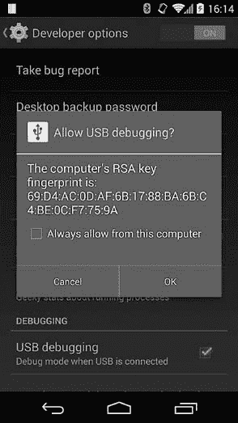

图 10-15. USB 调试授权对话框

Android 4.2.2 引入了一种正式的解决方案，称为安全 USB 调试功能。这里的“安全”指的是，只有用户明确授权的主机才能连接到设备上的 *adbd* 守护进程并执行调试命令。因此，如果有人试图通过 USB 将设备连接到另一台设备以访问 ADB，他们必须先解锁目标设备，并通过点击确认对话框中的 OK 按钮授权调试主机的访问，如图 10-15 所示。

你可以通过勾选**始终允许此计算机连接**复选框来使你的决策保持持久，并且只要你在同一台机器上，调试就会像以前一样正常工作。

自然，这种安全的 USB 调试功能只有在你设置了足够安全的锁屏密码的情况下才有效。

### 注意

*在支持多用户的平板电脑上，确认对话框仅会显示给主用户（所有者）。*

## 安全 ADB 实现

默认情况下，当*ro.adb.secure*系统属性设置为 1 时，启用 ADB 主机认证功能，并且无法通过系统接口禁用它。当设备连接到主机时，它最初处于`CS_UNAUTHORIZED`状态，只有在主机完成认证后才会进入`CS_DEVICE`状态。主机使用 RSA 密钥进行认证，以便向设备上的 ADB 守护进程进行身份验证，通常遵循以下三步过程：

1.  当主机尝试连接时，设备会发送`A_AUTH`消息，并带有`ADB_AUTH_TOKEN`类型的参数，其中包含一个 20 字节的随机值（从*/dev/urandom/*读取）。

1.  主机通过发送`A_AUTH`消息并带有`ADB_AUTH_SIGNATURE`类型的参数进行响应，该参数包括使用主机私钥之一对随机令牌的*SHA1withRSA*签名。

1.  设备尝试验证收到的签名，如果签名验证成功，它会响应一个`A_CNXN`数据包并进入`CS_DEVICE`状态。如果验证失败，无论是因为签名值不匹配，还是因为没有对应的公钥来进行验证，设备将发送另一个`ADB_AUTH_TOKEN`并带有新的随机值，以便主机可以重新进行认证（如果失败次数超过某个阈值，速度会变慢）。

签名验证通常在第一次将设备连接到新主机时失败，因为设备尚未获取主机的公钥。在这种情况下，主机通过`A_AUTH`消息并带有`ADB_AUTH_RSAPUBLICKEY`参数发送其公钥。设备对该公钥进行 MD5 哈希并在*允许 USB 调试确认*对话框中显示该哈希，见图 10-15。由于*adbd*是本地守护进程，因此必须将密钥传递给主 Android 操作系统，以便其哈希值可以在屏幕上显示。这是通过将密钥写入一个本地套接字（也命名为*adbd*）来完成的，该套接字由*adbd*守护进程监控。

当你在开发者设置屏幕上启用 ADB 调试时，会启动一个线程来监听该*adbd*套接字。当线程收到以*PK*开头的消息时，它将其视为公钥，解析该公钥，计算 MD5 哈希并显示确认对话框（该对话框实现于一个专用的活动`UsbDebuggingActivity`，是 SystemUI 包的一部分）。如果你点击“确定”，该活动会向*adbd*发送一个简单的*OK*响应，*adbd*使用该公钥验证认证消息。如果你勾选了“始终允许来自此计算机的连接”复选框，该公钥将被写入磁盘，并在下次连接同一主机时自动用于签名验证。

### 注意

*从 4.3 版本开始，Android 允许你清除所有已保存的主机认证密钥。你可以通过选择“设置”▸“开发者选项”▸“撤销 USB 调试授权”来触发此功能。*

`UsbDeviceManager` 类提供了公开的方法，允许和拒绝 USB 调试、清除缓存的认证密钥，以及启动和停止 *adbd* 守护进程。这些方法通过系统 `UsbService` 的 `IUsbManager` AIDL 接口提供给其他应用程序。调用修改设备状态的 `IUsbManager` 方法需要 `MANAGE_USB` 系统签名权限。

## ADB 认证密钥

虽然我们已经描述了 ADB 认证协议，但尚未详细介绍过程中使用的实际密钥：由本地 ADB 服务器生成的 2048 位 RSA 密钥。这些密钥通常存储在 *$HOME/.android*（在 Windows 上为 *%USERPROFILE%\.android*）中，分别为 *adbkey*（私钥）和 *adbkey.pub*（公钥）。可以通过设置 `ANDROID_SDK_HOME` 环境变量来覆盖默认的密钥目录。如果设置了 `ADB_VENDOR_KEYS` 环境变量，则会搜索它指向的目录中的密钥。如果在上述任何位置都没有找到密钥，则会生成并保存一对新的密钥。

私钥文件（*adbkey*）仅存储在主机上，采用标准的 OpenSSL PEM 格式。公钥文件（*adbkey.pub*）包含公钥的 Base 64 编码的 mincrypt 兼容表示形式，基本上是 mincrypt 的 `RSAPublicKey` 结构的序列化（参见 “启用验证引导”），后跟一个 *user@host* 用户标识符，二者以空格分隔。根据目前的情况，用户标识符似乎未被使用，仅在基于 Unix 的操作系统中有意义；在 Windows 上，它始终是 *unknown@unknown*。

密钥存储在设备上的 */data/misc/adb/adb_keys/* 文件中，接受新授权的密钥时会附加到同一文件中。只读的“厂商密钥”存储在 */adb_keys* 文件中，但目前似乎在 Nexus 设备上不存在。公钥与主机上的格式相同，这使得它能够轻松加载到 libmincrypt 中，而 *adbd* 静态链接该库。示例 10-13 显示了一些示例 *adb_keys*。该文件归 *system* 用户所有，组设置为 *shell*，权限为 0640。

示例 10-13. adb_keys 文件的内容

```
# cat data/misc/adb/adb_keys
QAAAAJs1UDFt17wyV+Y2GNGF+EgWoiPfsByfC4frNd3s64w3IGt25fKERnl7O8/A+iVPGv1W
--*snip*--
yZ61cFd7R6ohLFYJRPB6Dy7tISUPRpb+NF4pbQEAAQA= unknown@unknown
QAAAAKFLvP+fp1cB4Eq/6zyV+hnm1S1eV9GYd7cYe+tmwuQZFe+O4vpeow6huIN8YbBRkr7
--*snip*--
m7+bGd6F0hRkO82gopy553xywXU7rI/aMl6FBAEAAQA= user1@host2
```

## 验证主机密钥指纹

虽然 USB 调试确认对话框会显示一个密钥指纹，帮助你验证是否连接到预期的主机，但 `adb` 客户端没有一个方便的命令来打印主机密钥的指纹。虽然在运行几个虚拟机时看起来似乎不容易混淆（毕竟只有一根电缆插入到一台机器上），但事情可能会变得有些模糊。示例 10-14 展示了一种显示主机密钥指纹的方式，格式与在图 10-15 中显示的确认对话框相同（运行在 *$HOME/.android* 目录下，或者指定公钥文件的完整路径）。

示例 10-14. 显示主机密钥的指纹

```
$ **cut -d' ' -f1 adbkey.pub|openssl base64 -A -d -a | \**
**openssl md5 -c|cut -d' ' -f2|tr '[a-z]' '[A-Z]'**
69:D4:AC:0D:AF:6B:17:88:BA:6B:C4:BE:0C:F7:75:9A
```

# Android 备份

Android 包含一个备份框架，允许应用程序数据备份到 Google 的云存储，并支持将已安装的 APK 文件、应用程序数据和外部存储文件通过 USB 连接到主机的方式进行完全备份。虽然设备备份不完全是一个安全功能，但备份允许从设备中提取应用程序数据，这可能会带来安全问题。

## Android 备份概述

Android 的备份框架在 Android 2.2 中公开宣布，但它可能在内部更早就已经可用。该框架让应用程序声明一种特殊的组件，称为 *备份代理*，在为应用程序创建备份和恢复数据时，系统会调用这些代理。尽管备份框架内部支持可插拔的备份传输，但最初唯一可以实际使用的传输方式是一个专有的传输方式，它将应用程序数据存储在 Google 的云存储中。

### 云备份

由于备份与用户的 Google 账户相关联，当用户在新设备上安装带有备份代理的应用程序时，如果用户注册了与备份创建时相同的 Google 账户，应用程序的数据可以自动恢复。备份和恢复由系统管理，通常无法由用户触发或控制（尽管可以通过 Android shell 使用开发者命令触发云备份）。默认情况下，备份会定期触发，恢复仅在应用首次安装到设备时进行。

### 本地备份

Android 4.0 添加了一种新的本地备份传输方式，允许用户将备份保存到桌面计算机上的文件中。本地备份（也称为完全备份）需要启用并授权 ADB 调试，因为备份数据是通过与 ADB（通过 `adb pull`）传输设备文件到主机的相同方式流式传输到主机计算机的。

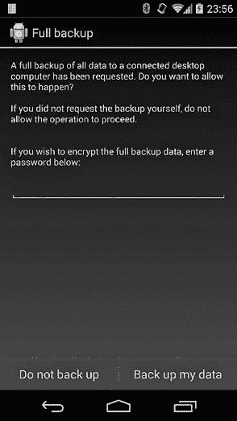

图 10-16. 备份确认对话框

完整备份通过在终端执行`adb backup`命令启动。该命令在设备上启动一个新的 Java 进程，该进程绑定到系统的`BackupManagerService`并请求进行备份，使用传递给`adb backup`的参数。`BackupManagerService`随后会启动一个确认活动，如图 10-16 所示，提示用户授权备份并在需要时指定备份加密密码。如果设备已加密，用户必须输入设备加密密码才能继续。该密码还将用于加密备份，因为不支持使用专用的备份加密密码。当用户按下“备份我的数据”按钮时，完整备份过程开始。

完整备份会调用每个目标包的备份代理，以获取其数据副本。如果未定义备份代理，`BackupManagerService`将使用内部的`FullBackupAgent`类，该类会复制包的所有文件。完整备份会遵循包中`<application>`标签的`allowBackup`属性，如果`allowBackup`设置为`false`，则不会提取包数据。

除了应用数据外，完整备份还可以包括用户安装的和系统应用的 APK 文件，以及外部存储内容，但有一些限制：完整备份不会备份受保护（带有 DRM）的应用，并且会跳过一些系统设置，如移动网络 APN 和 Wi-Fi 接入点的连接详情。

备份通过`adb restore`命令恢复。备份恢复功能非常有限，并且不允许指定任何选项，因为它只能执行完全恢复。

## 备份文件格式

Android 备份文件以几行文本开头，后面是二进制数据。这些行是备份头，指定了用于创建备份的备份格式和加密参数（如果指定了备份密码）。未加密备份的头部如示例 10-15 所示。

示例 10-15. 未加密备份头

```
ANDROID BACKUP➊
1➋
1➌
none➍
```

第一行 ➊ 是文件魔术（格式标识符），第二行 ➋ 是备份格式版本（Android 4.4.2 及以前为版本 1，之后版本为 2；版本 2 表示密钥派生方法发生了变化，现在考虑了多字节密码字符），第三行 ➌ 是压缩标志（如果压缩，则为 1），最后一行 ➍ 是所使用的加密算法（*none* 或 *AES-256*）。

实际的备份数据是一个压缩的、可选加密的 tar 文件，其中包含一个备份清单文件，接着是应用 APK（如果有的话），以及应用数据（文件、数据库和共享偏好设置）。数据使用 deflate 算法进行压缩，可以通过 OpenSSL 的 `zlib` 命令解压缩，如 示例 10-16 中所示。

示例 10-16：使用 OpenSSL 解压 Android 备份

```
$ **dd if=mybackup.ab bs=24 skip=1|openssl zlib -d > mybackup.tar**
```

在备份解压后，您可以使用标准的 `tar` 命令查看其内容或提取内容，如 示例 10-17 中所示。

示例 10-17：使用 `tar` 查看未压缩备份的内容

```
$ **tar tvf mybackup.tar**
-rw------- 1000/1000          1019 apps/org.myapp/_manifest➊
-rw-r--r-- 1000/1000       1412208 apps/org.myapp/a/org.myapp-1.apk➋
-rw-rw---- 10091/10091         231 apps/org.myapp/f/share_history.xml➌
-rw-rw---- 10091/10091           0 apps/org.myapp/db/myapp.db-journal➍
-rw-rw---- 10091/10091        5120 apps/org.myapp/db/myapp.db
-rw-rw---- 10091/10091        1110 apps/org.myapp/sp/org.myapp_preferences.xml➎
```

在 tar 文件内部，应用数据存储在 *apps/* 目录中，该目录为每个备份的包提供一个子目录。每个包目录的根目录中包含一个 *_manifest* 文件 ➊，APK 文件（如果有请求）存放在 *a/* ➋，应用文件存放在 *f/* ➌，数据库存放在 *db/* ➍，共享偏好设置存放在 *sp/* ➎。清单文件包含应用的包名和版本号、平台的版本号、一个标志，指示存档是否包含应用的 APK，以及应用的签名证书。

`BackupManagerService` 在恢复应用时使用这些信息，以检查它是否与当前安装的应用使用相同的证书进行签名。如果证书不匹配，它将跳过安装 APK，系统包除外，因为它们可能在不同设备上使用不同的（制造商拥有的）证书进行签名。此外，`BackupManagerService` 期望文件按 示例 10-17 中所示的顺序排列，如果顺序不对，恢复将失败。例如，如果清单文件声明备份包含 APK，`BackupManagerService` 会先尝试读取并安装 APK，然后再恢复应用的其他文件。此恢复顺序是必需的，因为无法恢复未安装的应用文件。然而，`BackupManagerService` 不会在存档中搜索 APK，如果 APK 不紧跟在清单文件之后，所有其他文件将被跳过。

如果用户请求了外部存储备份（通过将 `-shared` 选项传递给 `adb backup`），存档中还会包含一个 *shared/* 目录，包含外部存储文件。

## 备份加密

如果用户在请求备份时提供了加密密码，则备份文件会使用从密码派生的密钥进行加密。该密码用于通过 10,000 轮 PBKDF2 算法与随机生成的 512 位盐值一起生成 256 位的 AES 密钥。这个密钥接着用来加密另一个随机生成的 256 位 AES 主密钥，该主密钥随后用于在 CBC 模式下加密实际的归档数据（使用*AES/CBC/PKCS5Padding* `Cipher` 转换）。还会计算并保存主密钥的校验和到备份文件头部。为了生成校验和，生成的原始主密钥会通过将每个字节转换为`char`的方式转化为 Java 字符数组，结果作为密码字符串，并通过 PBKDF2 函数生成另一个 AES 密钥，之后其字节将作为校验和。

### 注意

*由于 AES 密钥本质上是随机字节序列，因此原始密钥通常包含几个无法映射到可打印字符的字节。由于 PKCS#5 未指定密码字符串的实际编码方式，Android 的加密校验和生成方法会产生依赖于实现和版本的结果。*

校验和用于在实际解密备份数据之前验证用户提供的解密密码是否正确。当主密钥被解密时，会使用上述方法计算其校验和，并与归档头中的校验和进行比较。如果校验和不匹配，则认为密码不正确，恢复过程将被中止。示例 10-18 展示了加密归档文件的示例备份头。

示例 10-18. 加密备份头

```
ANDROID BACKUP
1
1
AES-256➊
68404C30DF8CACA5FA004F49BA3A70...➋
909459ADCA2A60D7C2B117A6F91E3D...➌
10000➍
789B1A01E3B8FA759C6459AF1CF1F0FD ➎
8DC5E483D3893EC7F6AAA56B97A6C2...➏
```

这里，*AES-256* ➊ 是使用的备份加密算法，接下来一行 ➋ 是用户密码盐的十六进制字符串，随后是主密钥校验和盐 ➌、用于派生密钥的 PBKDF2 轮数 ➍，以及用户密钥 IV ➎。最后一行 ➏ 是主密钥数据块，包含归档数据加密 IV、实际主密钥及其校验和，所有这些都使用从用户提供的密码派生的密钥进行加密。示例 10-19 展示了主密钥数据块的详细格式。

示例 10-19. 主密钥数据块格式

```
byte Niv➊
byte[Niv] IV➋
byte Nmk➌
byte [Nmk] MK➍
byte Nck➎
byte [Nck] MKck➏
```

第一个字段 ➊ 是 IV 长度，接着是 IV 值 ➋、主密钥（MK）长度 ➌ 和实际主密钥 ➍。最后两个字段存储主密钥校验和哈希长度 ➎ 和主密钥校验和哈希本身 ➏。

## 控制备份范围

Android 的安全模型保证每个应用程序都在其自己的沙箱中运行，并且其文件无法被其他应用程序或设备用户访问，除非应用程序显式允许访问。因此，大多数应用程序在将数据存储到磁盘之前并不加密数据。然而，无论是合法用户还是通过某种方式获得设备解锁密码的攻击者，都可以轻松地通过 Android 的完整备份功能提取应用程序数据。因此，存储敏感数据的应用程序应当对其进行加密，或提供一个明确的备份代理，限制可导出的数据，以确保敏感数据无法通过备份轻易提取。

如在“Android 备份概述”中所提到的，如果不需要或不希望备份应用数据，应用程序可以通过在 *AndroidManifest.xml* 中将 `allowBackup` 属性设置为 `false` 来完全禁止备份，如示例 10-20 所示。

示例 10-20. 禁止在 AndroidManifest.xml 中备份应用数据

```
<xml version="1.0" encoding="utf-8"?>
<manifest 
   package="org.example.app"
   android:versionCode="1"
   android:versionName="1.0" >
   --*snip*--
   <application
       android:icon="@drawable/ic_launcher"
       android:label="@string/app_name"
       android:theme="@style/AppTheme"
       android:allowBackup="false">
        --*snip*-
    </application>
</manifest>
```

# 总结

Android 采取各种措施来保护用户数据和应用程序，并确保操作系统的完整性。在生产设备上，引导加载程序被锁定，恢复操作系统仅允许安装设备制造商签名的 OTA 更新，从而确保只有经过授权的操作系统构建可以启动或闪存到设备上。当启用时，基于 dm-verity 的验证启动确保 *系统* 分区未被修改，通过检查每个设备块的哈希值与受信任的哈希树进行比对，从而防止恶意程序（如 rootkit）在 *系统* 分区上安装。Android 还可以加密 *userdata* 分区，使得直接访问存储设备时更难提取应用程序数据。

Android 支持各种屏幕锁定方法，并对不成功的身份验证尝试应用速率限制，从而有效防止针对已启动设备的在线攻击。解锁 PIN 码或密码的类型和复杂性可以由设备管理员应用程序指定并强制执行。也支持一种设备策略，即在多次失败的身份验证尝试后清除设备数据。安全的 USB 调试要求调试主机必须得到用户明确授权并添加到白名单中，从而防止通过 USB 提取信息。

最终，完整设备备份可以通过由用户提供的密码派生的密钥进行加密，从而使得访问已提取到备份中的设备数据变得更加困难。为了实现更高水平的设备安全性，应启用并根据需要配置所有支持的安全措施。

* * *

^([100]) Milan Broz, “dm-verity：设备映射块完整性检查目标”， *[`code.google.com/p/cryptsetup/wiki/DMVerity`](https://code.google.com/p/cryptsetup/wiki/DMVerity)*

^([101]) Red Hat, Inc.，“设备映射资源页面”， *[`www.sourceware.org/dm/`](https://www.sourceware.org/dm/)*

^([102]) Google, “dm-verity 启动时”， *[`source.android.com/devices/tech/security/dm-verity.html`](https://source.android.com/devices/tech/security/dm-verity.html)*

^([103]) Google, *Android 4.4 兼容性定义*，“9.9\. 全盘加密”， *[`static.googleusercontent.com/media/source.android.com/en//compatibility/4.4/android-4.4-cdd.pdf`](https://static.googleusercontent.com/media/source.android.com/en//compatibility/4.4/android-4.4-cdd.pdf)*

^([104]) Milan Broz, “dm-crypt：Linux 内核设备映射加密目标”， *[`code.google.com/p/cryptsetup/wiki/DMCrypt`](https://code.google.com/p/cryptsetup/wiki/DMCrypt)*

^([105]) Jakob Lell, “针对 CBC 加密 LUKS 分区的实用可塑性攻击”， *[`www.jakoblell.com/blog/2013/12/22/practical-malleability-attack-against-cbc-encrypted-luks-partitions/`](http://www.jakoblell.com/blog/2013/12/22/practical-malleability-attack-against-cbc-encrypted-luks-partitions/)*

^([106]) C. Percival 和 S. Josefsson, *The scrypt 基于密码的密钥派生函数*， *[`tools.ietf.org/html/draft-josefsson-scrypt-kdf-01/`](http://tools.ietf.org/html/draft-josefsson-scrypt-kdf-01/)*

^([107]) 由 viaForensics 在 DEF CON 20 的“Into The Droid”演讲中演示。演示幻灯片可在 *[`www.defcon.org/images/defcon-20/dc-20-presentations/Cannon/DEFCON-20-Cannon-Into-The-Droid.pdf`](https://www.defcon.org/images/defcon-20/dc-20-presentations/Cannon/DEFCON-20-Cannon-Into-The-Droid.pdf)* 获取

^([108]) Anthony King, “PyAdb：使用 TCP 的 Python 基础 ADB 核心”， *[`github.com/cybojenix/PyAdb/`](https://github.com/cybojenix/PyAdb/)*

^([109]) Kenny Root, “adb-on-chrome: ADB（Android 调试桥）服务器作为 Chrome 扩展”， *[`github.com/kruton/adb-on-chrome/`](https://github.com/kruton/adb-on-chrome/)*

^([110]) Kyle Osborn, “p2p-adb 框架”， *[`github.com/kosborn/p2p-adb/`](https://github.com/kosborn/p2p-adb/)*
