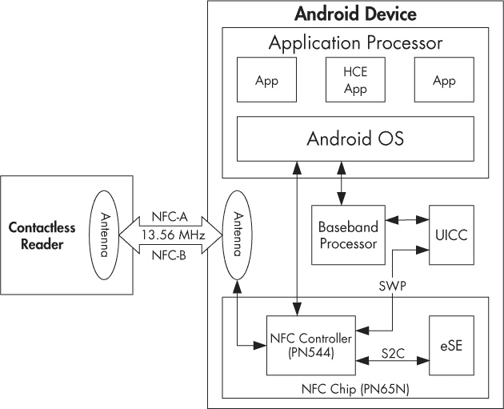
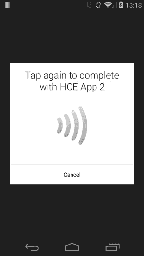
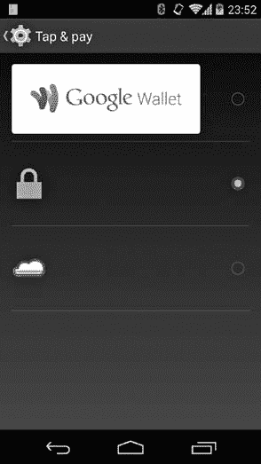

# 第十一章 NFC 与安全元素

本章简要概述了近场通信（NFC）和安全元素（SE），并解释了它们如何集成到移动设备中。虽然 NFC 有许多用途，但我们将重点介绍其卡片仿真模式，该模式用于提供与集成在移动设备中的 SE 的接口。安全元素为私密数据提供受保护的存储，例如身份验证密钥，并提供一个安全执行环境，以保护安全关键代码。我们将描述 Android 支持的 SE 类型，并介绍 Android 应用程序可以使用的与 SE 通信的 API。最后，我们将讨论基于主机的卡片仿真（HCE）及其在 Android 中的实现，并演示如何实现 HCE 应用程序。

# NFC 概述

*NFC*是一种允许处于近距离（通常为 10 厘米或更短）的设备之间建立无线通信并交换数据的技术。NFC 不是单一的标准，而是基于一组标准，这些标准定义了射频、通信协议和数据交换格式。NFC 基于射频识别（RFID）技术，并在 13.56 MHz 频率下工作，支持 106kbps、212kbps 和 424kbps 等不同的数据传输速率。

NFC 通信涉及两个设备：发起者和目标。在*主动模式*下，发起者和目标都有各自的电源，并且每个设备都可以发射无线信号以便与对方进行通信。在*被动模式*下，目标设备没有自己的电源，而是通过发起者发射的电磁场来激活并供电。

在被动模式下进行通信时，发起者通常被称为*读卡器*，而目标则被称为*标签*。读卡器可以是专用设备，也可以嵌入到通用设备中，例如个人电脑或手机。标签有各种形状和大小，从简单的、内存非常有限的贴纸到内嵌 CPU 的非接触智能卡。

NFC 设备可以在三种不同模式下工作：读写（R/W）、点对点（P2P）和卡片仿真（CE）。在 R/W 模式下，设备作为主动发起者，可以读取和写入外部标签的数据。在 P2P 模式下，两台 NFC 设备可以使用双向通信协议进行主动的数据交换。CE 模式允许 NFC 设备仿真标签或非接触式智能卡。Android 支持这三种模式，但存在一些限制。我们将在下一节概述 Android 的 NFC 架构，并展示如何使用每种模式。

# Android NFC 支持

Android 在 2.3 版本中引入了 NFC 支持，相关架构和功能在版本 4.4 之前基本保持不变，而版本 4.4 引入了 HCE 支持。

Android 的 NFC 实现位于`NfcService`系统服务中，属于`Nfc`系统应用（包名为`com.android.nfc`）。它封装了驱动每个支持的 NFC 控制器所需的本地库；实现了访问控制、标签发现和分发；并控制卡模拟。Android 并未向外部暴露`NfcService`的低级 API，而是提供了一个事件驱动框架，允许感兴趣的应用程序注册 NFC 事件。这种事件驱动的方法在所有三种 NFC 操作模式中均有使用。

## 读/写模式

启用 NFC 的 Android 应用程序不能直接将设备设置为读/写模式。相反，它们声明自己感兴趣的标签类型，当 Android 的标签分发系统发现标签时，选择并启动匹配的应用程序。

标签分发系统既使用标签技术（稍后讨论），又解析标签内容，以决定将标签分发到哪个应用程序。标签分发系统使用三个意图动作来通知应用程序发现的标签：`ACTION_NDEF_DISCOVERED`、`ACTION_TECH_DISCOVERED`和`ACTION_TAG_DISCOVERED`。`ACTION_NDEF_DISCOVERED`意图具有最高优先级，当 Android 发现一个使用标准 NFC 数据交换格式（NDEF）格式化的标签，并且该标签包含已识别的数据类型时，便会发送该意图。`ACTION_TECH_DISCOVERED`意图则在扫描的标签不包含 NDEF 数据或数据格式不被能够处理已发现标签技术的应用程序所识别时发送。如果没有应用程序可以处理`ACTION_NDEF_DISCOVERED`或`ACTION_TECH_DISCOVERED`，`NfcService`会发送通用的`ACTION_TAG_DISCOVERED`意图。标签分发事件仅传递给活动，因此无法在没有用户交互的情况下在后台处理。

### 注册标签分发

应用程序通过声明 NFC 启用的活动所支持的意图，在*AndroidManifest.xml*中使用标准的意图过滤器系统注册 NFC 事件，如示例 11-1 所示。

示例 11-1. NFC 启用应用程序的清单文件

```
<?xml version="1.0" encoding="utf-8"?>
<manifest 
    package="com.example.nfc" ...>
    --*snip*--

    <uses-permission android:name="android.permission.NFC" />➊
    --*snip*-
    <application ...>
        <activity
            android:name=".NfcActivity"➋
            android:launchMode="singleTop" >
            <intent-filter>
                <action android:name="android.nfc.action.NDEF_DISCOVERED"/>➌
                <category android:name="android.intent.category.DEFAULT"/>
                <data android:mimeType="text/plain" />
            </intent-filter>
            <intent-filter>
                <action android:name="android.nfc.action.TECH_DISCOVERED" />➍
            </intent-filter>
            <intent-filter>
                <action android:name="android.nfc.action.TAG_DISCOVERED" />➎
            </intent-filter>

            <meta-data
                android:name="android.nfc.action.TECH_DISCOVERED"➏
                android:resource="@xml/filter_nfc" >
            </meta-data>
        </activity>
        --*snip*--
    </application>
</manifest>
```

如该清单所示，应用程序首先请求`android.permission.NFC`权限 ➊，该权限用于访问 NFC 控制器，然后声明一个处理 NFC 事件的活动`NfcActivity` ➋。该活动注册了三个意图过滤器，每个过滤器对应一个标签发现事件。应用程序声明它可以通过在`NDEF_DISCOVERED`意图过滤器的`<data>`标签中指定`mimeType`属性，来处理具有*text/plain* MIME 类型的 NDEF 数据 ➌。`NfcActivity`还声明它可以处理`TECH_DISCOVERED`意图 ➍，如果扫描的标签使用关联的元数据 XML 资源文件中指定的某种技术，则会发送此意图 ➏。最后，应用程序通过添加通配符`TAG_DISCOVERED`意图过滤器 ➎，请求在发现所有 NFC 标签时得到通知。

如果找到多个支持扫描标签的活动，Android 会显示一个选择对话框，允许用户选择哪个活动处理该标签。已经在前台的应用程序可以通过调用`NfcAdapter.enableForegroundDispatch()`方法来绕过此选择。这样的应用程序将在所有其他匹配的应用程序中优先处理，并且当应用程序处于前台时，会自动接收 NFC 意图。

### 标签技术

*标签技术*是一个抽象术语，用于描述具体的 NFC 标签。标签技术由标签使用的通信协议、其内部结构或其提供的功能决定。例如，使用 NFC-A 协议（基于 ISO 14443-3A）进行通信的标签与*NfcA*技术匹配，而包含 NDEF 格式数据的标签则与*Ndef*技术匹配，无论其底层通信协议如何。（有关 Android 支持的所有标签技术的完整列表，请参见`TagTechnology`类参考文档。）

一个指定了`TECH_DISCOVERED`意图过滤器的活动必须提供一个 XML 资源文件，该文件进一步指定它支持的具体技术，并使用`<tech-list>`元素。 如果一个活动声明的技术列表是标签所支持的技术的子集，则认为该活动与标签匹配。 可以声明多个技术列表，以匹配不同的标签，如示例 11-2 所示。

示例 11-2. 使用技术列表声明匹配的技术

```
<?xml version="1.0" encoding="utf-8"?>
<resources>
    <tech-list>➊
        <tech>android.nfc.tech.IsoDep</tech>
        <tech>android.nfc.tech.NfcA</tech>
    </tech-list>

    <tech-list>➋
        <tech>android.nfc.tech.NfcF</tech>
    </tech-list>
</resources>
```

在这里，第一个技术列表 ➊ 将匹配提供与 ISO 14443-4（ISO-DEP）兼容的通信接口的标签，这些标签使用 NFC-A 技术实现（通常用于 NXP 非接触智能卡）；第二个技术列表 ➋ 匹配使用 NFC-F 技术的标签（通常是 Felica 卡）。由于这两个技术列表是独立定义的，我们的示例`NfcActivity`（参见示例 11-1）将在扫描到 NXP 非接触智能卡或 Felica 卡或标签时收到通知。

### 读取标签

在标签调度系统选择一个活动来处理扫描到的标签后，它会创建一个 NFC 意图对象，并将其传递给选中的活动。活动可以通过`EXTRA_TAG`额外数据来获取一个表示扫描到标签的`Tag`对象，并调用其方法以读取或写入标签。（包含 NDEF 数据的标签还会提供`EXTRA_NDEF_MESSAGES`额外数据，其中包含从标签解析出来的 NDEF 消息数组。）

可以使用相应技术类的静态`get()`方法获取表示底层标签技术的具体`Tag`对象，如示例 11-3 所示。如果`Tag`对象不支持请求的技术，`get()`方法将返回`null`。

示例 11-3. 从 NFC 意图中获取具体的`Tag`实例

```
protected void onNewIntent(Intent intent) {
    setIntent(intent);

    Tag tag = intent.getParcelableExtra(NfcAdapter.EXTRA_TAG);
    IsoDep isoDep = IsoDep.get(tag);
    if (isoDep != null) {
         isoDep.connect();
         byte[] command = {...};
         byte[] response = isoDep.transceive(command);
         --*snip*--
    }
}
```

### 使用阅读器模式

除了基于意图的标签调度系统，Android 4.4 还添加了一种新的方法，活动可以用来获取一个实时的`Tag`对象，称为阅读器模式。阅读器模式确保在目标活动处于前景时，NFC 控制器支持的所有其他操作模式（如点对点模式和卡片模拟模式）都会被禁用。当扫描一个活跃的 NFC 设备时，这种模式非常有用，比如另一台处于主机模拟模式的 Android 设备，它可能会触发点对点通信，从而将控制权转移给当前的前景活动。

活动可以通过调用`NfcAdapter`类的`enableReaderMode()`方法来启用阅读器模式，如示例 11-4 所示。

示例 11-4. 启用阅读器模式并使用`ReaderCallback`获取`Tag`对象

```
public class NfcActivity extends Activity implements NfcAdapter.ReaderCallback {
    private NfcAdapter adapter;
    --*snip*--
    @Override
    public void onResume() {
       super.onResume();
       if (adapter != null) {
           adapter.enableReaderMode(this, this, NfcAdapter.FLAG_READER_NFC_A➊
                   | NfcAdapter.FLAG_READER_SKIP_NDEF_CHECK, null);
       }
    }

    @Override
    public void onTagDiscovered(Tag tag) {➋
        IsoDep isoDep = IsoDep.get(tag);
        if (isoDep != null) {
             isoDep.connect();
             byte[] command = {...};
             byte[] response = isoDep.transceive(command);
             --*snip*--
        }
    }
    --*snip*--
}
```

在这种情况下，活动通过调用`enableReaderMode()`方法 ➊ 来启用前景模式中的阅读器模式（当活动离开前景时，应该使用相应的`disableReaderMode()`方法禁用阅读器模式），并通过`onTagDiscovered()`回调 ➋ 直接获取一个`Tag`实例（无需中间的意图）。然后，`Tag`对象的使用方式与基于意图的调度方式相同。

## 点对点模式

Android 实现了一种有限的 NFC P2P 模式数据交换，通过专有的 NDEF 推送和标准的简单 NDEF 交换协议（SNEP）协议进行交换。^([115]) Android 设备可以与支持这两种协议的任何设备交换单个 NDEF 消息，但 P2P 模式通常与其他 Android 设备一起使用，以实现所谓的 Android Beam 功能。

除了 NDEF 消息，Android Beam 还允许传输更大的数据对象，如照片和视频，这些数据无法通过单个 NDEF 消息传输。通过在设备之间创建一个临时的蓝牙连接，可以实现这一过程。这一过程称为*NFC 交接*，并在 Android 4.1 中加入了此功能。

在 P2P 模式下的 NDEF 消息交换是通过调用 `NfcAdapter` 类的 `setNdefPushMessage()` 或 `setNdefPushMessageCallback()` 方法来启用的。（有关更多详情和示例代码，请参见官方的 NFC API 指南^([116])。）

## 卡模拟模式

如在 “NFC 概述” 中所述，CE 模式允许 Android 设备模拟一张非接触式智能卡或 NFC 标签。在 CE 模式下，设备通过 NFC 接收命令，处理这些命令，并通过 NFC 返回响应。负责处理命令的组件可以是一个硬件安全元件（如下一节所讨论）连接到设备的 NFC 控制器，或者是一个运行在设备上的 Android 应用程序（当处于基于主机的卡模拟模式，HCE 时）。

在接下来的章节中，我们将讨论移动设备中的安全元件，以及应用程序可以用来与安全元件通信的 Android API。我们还将描述 Android 如何实现 HCE，并展示如何创建一个使能卡模拟的应用程序。

# 安全元件

一个 *安全元件 (SE)* 是一个防篡改的智能卡芯片，能够以一定的安全性和隔离性运行智能卡应用（称为 *小程序* 或 *卡片*）。智能卡本质上是一个包含 CPU、ROM、EEPROM、RAM 和 I/O 端口的最小计算环境。现代智能卡还包括加密协处理器，能够实现常见的算法，如 AES 和 RSA。

智能卡采用各种技术来实现防篡改，使得通过拆解或分析芯片来提取数据变得非常困难。现代智能卡预装了多应用操作系统，利用硬件的内存保护功能确保每个应用程序的数据仅对其自身可用。应用程序的安装和（可选的）访问通过要求每次操作使用加密密钥来控制。

SE 可以集成在移动设备中，作为通用集成电路卡（UICC，通常称为*SIM 卡*），嵌入在手机中或连接到 SD 卡槽。如果设备支持 NFC，SE 通常与 NFC 控制器连接（或嵌入其中），使得可以无线与 SE 通信。

智能卡自 1970 年代以来就已经出现，并且现在被广泛用于从预付费电话和交通票务到信用卡和 VPN 凭证存储等各种应用中。由于安装在移动设备中的 SE 具有与智能卡等效或更强的功能，因此理论上可以用于目前智能卡所使用的任何应用程序。此外，由于 SE 可以托管多个应用程序，它有潜力用一个设备替代人们日常使用的多张卡片。此外，由于 SE 可以由设备的操作系统控制，可以通过要求额外的身份验证（如 PIN 码、密码短语或代码签名）来限制对其的访问。

SE 在移动设备中的一个主要应用是模拟非接触支付卡，而启用移动支付的目标确实是推动 SE 部署的动力。除了金融应用外，移动 SE 还可以用于模拟其他广泛使用的非接触卡，如门禁卡、忠诚卡等。

移动 SE 也可以用来增强处理敏感信息或算法的应用程序的安全性：应用程序的安全关键部分，如凭证存储或许可证验证，可以在 SE 内部实现，从而确保其不易受到逆向工程和信息提取的攻击。其他可以从 SE 实现中受益的应用程序包括一次性密码（OTP）生成器，当然还有凭证存储（用于共享密钥或 PKI 中的私钥）。

尽管今天可以使用标准工具和技术实现支持 SE 的应用程序，但在当前的商业 Android 设备上实际使用它们并不简单。我们将在“Android SE 执行环境”中详细讨论这一点，但首先让我们探索一下移动设备上可用的 SE 类型，以及它们在 Android 中的支持级别。

## 移动设备中的 SE 形态

图 11-1 展示了一个简化的块图，描述了与 NFC 和 SE 支持相关的 Android 设备组件，包括嵌入式 SE（eSE）和 UICC。在我们讨论本章其余部分的安全元件和基于主机的卡模拟时，将引用此图中的组件。

在接下来的小节中，我们简要回顾了 Android 设备上可用的 SE 类型、它们与其他设备组件的连接方式，以及操作系统如何与每种 SE 进行通信。



图 11-1. Android NFC 和 SE 组件

### UICC

目前大多数移动设备都配备了某种类型的 UICC。虽然 UICC 是可以托管应用的智能卡，但由于 UICC 传统上只与基带处理器连接（而不是运行主设备操作系统的应用处理器），因此无法直接从 Android 进行访问。所有通信都通过无线接口层（RIL）进行，RIL 本质上是一个专有的 IPC 接口，用于与基带进行通信。

与 UICC SE 的通信通过扩展的 AT 命令（`AT+CCHO`、`AT+CCHC`、`AT+CGLA`，如 3GPP TS 27.007 定义）进行，^([117])，当前的 Android 电话管理器不支持这些命令。Android 的 SEEK 项目^([118])提供了补丁来实现所需的命令，从而通过 SmartCard API 与 UICC 进行通信，SmartCard API 是 SIMalliance 开放移动 API 规范的参考实现^([119])（详见“使用 OpenMobile API”）。然而，正如与 Android 中的大多数硬件直接通信的组件一样，RIL 由一个开源部分（*rild*）和一个专有库（*libXXX-ril.so*）组成。为了支持与 UICC 安全元件的通信，必须同时在*rild*和底层专有库中添加支持。是否添加该支持的决定权由硬件厂商来决定。

截至目前，SmartCard API 尚未集成到主线 Android 中（尽管 AOSP 源码树中包含一个空的*packages/apps/SmartCardService/*目录）。然而，来自主要厂商的 Android 设备配备了 SmartCard API 的实现，允许 UICC 与第三方应用进行通信（受各种访问限制的约束）。

单线协议（SWP）提供了一种将 UICC 用作 SE 的替代方式。SWP 用于将 UICC 连接到 NFC 控制器，允许 NFC 控制器在卡模拟模式下将 UICC 暴露给外部读卡器。近期的 Nexus 设备（如 Nexus 5 中的 Broadcom BCM20793M）内置的 NFC 控制器支持 SWP，但此功能默认是禁用的。（通过修改 Nexus 5 上*libnfc-brcm*库的配置文件，可以启用此功能。）目前没有公开的标准 API 来在卡模拟模式下切换 UICC、嵌入式 SE（如果有的话）和 HCE，但 Android 4.4 中可用的“离线”路由功能理论上可以将命令路由到 UICC（详情请参见“APDU 路由”）。

### 基于 microSD 的 SE

SE 的另一种形式因子是*高级安全 SD 卡（ASSD）*，^([120])，它基本上是一张带有嵌入式 SE 芯片的 SD 卡。当连接到带有 SD 卡插槽的 Android 设备时，并且运行 SEEK 修改版的 Android 系统时，可以通过智能卡 API 访问 SE。然而，带有 SD 卡插槽的 Android 设备已经成为例外而非常态，因此 ASSD 在 Android 上的支持不太可能成为主流。此外，即使在可用的情况下，最近的 Android 版本将 SD 卡视为次级存储设备，只能通过非常高层次、有限制的 API 进行访问。

### 嵌入式 SE

*嵌入式 SE（eSE）*并不是一个独立的设备，而通常与 NFC 控制器集成在一起，并被封装在同一个外壳中。eSE 的一个例子是 NXP 的 PN65N 芯片，它将 PN544 NFC 无线电控制器与 P5CN072 SE（智能 MX 系列的一部分）结合在一起。

第一款搭载嵌入式 SE 的主流 Android 设备是 Nexus S，它也首次为 Android 引入了 NFC 支持，并且采用了 PN65N 控制器。其后继产品，Galaxy Nexus 和 Nexus 4，也都配备了 eSE。然而，最近的 Google 品牌设备，如 Nexus 5 和 Nexus 7（2013 款），已不再使用 eSE，而是采用主机卡模拟，并且不再包括 eSE。

嵌入式 SE 通过 SignalIn/SignalOut 连接（S2C）与 NFC 控制器连接，并标准化为 NFC 无线接口（NFC-WI），^([121])，具有三种操作模式：关闭模式、无线模式和虚拟模式。在关闭模式下，与 SE 没有通信。在无线模式下，SE 对 Android 操作系统可见，就像它是一个连接到 NFC 读卡器的非接触式智能卡一样。在虚拟模式下，SE 对外部读卡器可见，就像手机是一个非接触式智能卡。这些模式是互斥的，因此我们可以通过非接触式接口（即，从外部读卡器）或通过有线接口（即，从 Android 应用程序）与 SE 进行通信。下一节将展示如何使用有线模式从 Android 应用程序与 eSE 通信。

## 访问嵌入式 SE

截至本文写作时，没有公开的 Android SDK API 允许与嵌入式 SE 进行通信，但最近的 Android 版本包括一个名为*nfc_extras*的可选库，提供了与 eSE 的稳定接口。本节将演示如何配置 Android，以允许某些 Android 应用程序访问 eSE，并展示如何使用*nfc_extras*库。

卡模拟和随之而来的用于访问嵌入式 SE 的内部 API 在 Android 2.3.4（引入了 Google Wallet 的版本）中引入。这些 API 对 SDK 应用程序是隐藏的，使用它们需要在 Android 2.3.4 及其后续版本 2.3.x，以及初始的 Android 4.0 发布（API 级别 14）中使用系统签名权限（`WRITE_SECURE_SETTINGS` 或 `NFCEE_ADMIN`）。签名权限非常限制，因为它仅允许控制平台签名密钥的方分发能够使用 eSE 的应用程序。

Android 4.0.4（API 级别 15）通过在操作系统级别将签名权限替换为签名证书白名单，从而取消了此限制。虽然这仍然需要修改核心操作系统文件，因此需要厂商合作，但无需使用厂商密钥对 SE 应用程序进行签名，这大大简化了分发。此外，由于白名单存储在文件中，可以通过 OTA 轻松更新，以便为更多的 SE 应用程序添加支持。

### 授予 eSE 访问权限

新的白名单访问控制方法通过 `NfceeAccessControl` 类实现，并由系统 `NfcService` 强制执行。`NfceeAccessControl` 类从 */etc/nfcee_access.xml* 读取白名单，该 XML 文件存储了允许访问 eSE 的签名证书和包名列表。可以授予所有由特定证书的私钥签名的应用程序访问权限（如果未指定包名），也可以仅授予单个包（应用）的访问权限。示例 11-5 展示了 *nfcee_access.xml* 文件的内容可能如下所示：

示例 11-5. nfcee_access.xml 文件的内容

```
<?xml version="1.0" encoding="utf-8"?>
<resources >
    <signer android:signature="308204a830820390a003020102020900b399...">➊
        <package android:name="com.example.nfc">➋
        </package>
    </signer>
</resources>
```

此配置允许 `com.example.nfc` 包访问 SE ➋，前提是该包由指定的签名证书 ➊ 签名。在生产设备上，该文件通常仅包含 Google Wallet 应用的签名证书，从而将 eSE 访问权限限制为 Google Wallet。

### 注意

*截至 2014 年 4 月，Google Wallet 仅支持 Android 4.4 及更高版本，并使用 HCE 而非 eSE。*

在应用程序的签名证书已添加到 *nfcee_access.xml* 后，除了标准的 NFC 权限外，不需要其他权限来访问 eSE。除了将应用程序的签名证书列入白名单外，还必须显式将 *nfc_extras* 库添加到应用的清单文件中，并使用 `<uses-library>` 标签将其标记为必需，以启用 eSE 访问（因为该库是可选的，默认情况下不会加载），如示例 11-6 所示 ➊。

示例 11-6. 将 nfc_extras 库添加到 AndroidManifest.xml

```
<manifest 
    package="com.example.nfc" ...>
    --*snip*--
    <uses-permission android:name="android.permission.NFC" />
    <application ...>
        --*snip*--
        <uses-library
            android:name="com.android.nfc_extras"➊
            android:required="true" />
    </application>
</manifest>
```

### 使用 NfcExecutionEnvironment API

Android 的 eSE 访问 API 并非基于标准智能卡通信 API，如 JSR 177^([122])或 Open Mobile API，而是提供了一个非常基础的通信接口，实现在`NfcExecutionEnvironment`类中。该类只有三个公共方法，具体方法参见示例 11-7。

示例 11-7. `NfcExecutionEnvironment` API

```
public class NfcExecutionEnvironment {
    public void open() throws EeIOException {...}

    public void close() throws IOException {...}

    public byte[] transceive(byte[] in) throws IOException {...}
}
```

这个简单的接口足以与 SE 进行通信，但要使用它，首先需要获取`NfcExecutionEnvironment`类的一个实例。可以通过`NfcAdapterExtras`类获取一个实例，而该类可以通过其静态方法`get()`进行访问，具体方法参见示例 11-8。

示例 11-8. 使用 `NfcExecutionEnvironment` API

```
NfcAdapterExtras adapterExtras =
     NfcAdapterExtras.get(NfcAdapter.getDefaultAdapter(context));➊
NfcExecutionEnvironment nfceEe =
     adapterExtras.getEmbeddedExecutionEnvironment();➋
nfcEe.open();➌
byte[] emptySelectCmd = { 0x00, (byte) 0xa4, 0x04, 0x00, 0x00 };
byte[] response = nfcEe.transceive(emptySelectCmd);➍
nfcEe.close();➎
```

在这里，我们首先获取一个`NfcAdapterExtras`实例 ➊，然后调用它的`getEmbeddedExecutionEnvironment()`方法以获取 eSE 接口 ➋。为了与 eSE 进行通信，我们首先打开一个连接 ➌，然后使用`transceive()`方法发送命令并获取响应 ➍。最后，使用`close()`方法关闭连接 ➎。

### eSE 相关广播

启用 SE 的应用需要接收 NFC 事件通知，如射频场检测以及与 eSE 和安装在其上的小程序相关的事件，例如通过 NFC 接口选择小程序，以便能够相应地改变状态。由于将这些事件泄露给恶意应用可能导致敏感信息泄露和拒绝服务攻击，因此对 eSE 相关事件的访问必须限制为仅信任的应用。

在 Android 中，全局事件是通过广播实现的，应用可以创建并注册广播接收器，接收应用感兴趣的广播。对 eSE 相关广播的访问可以通过标准的 Android 基于签名的权限来控制，但这种方法的缺点是只有使用平台证书签名的应用才能接收 eSE 事件，从而将启用 SE 的应用限制为设备制造商或移动网络运营商（MNO）创建的应用。为避免这种限制，Android 使用了与控制 eSE 访问相同的机制；即，通过白名单应用程序证书，控制可以接收 eSE 相关广播的应用范围。任何在*nfcee_access.xml*中注册了签名证书（以及可选的包名）的应用，都可以通过注册接收器接收 eSE 相关广播，接收器的声明方式如示例 11-9 所示。

示例 11-9. 在 AndroidManifest.xml 中声明用于 eSE 相关事件的广播接收器

```
<receiver android:name="com.example.nfc.SEReceiver" >
  <intent-filter>
   <action android:name="com.android.nfc_extras.action.RF_FIELD_ON_DETECTED" />➊
   <action android:name="com.android.nfc_extras.action.RF_FIELD_OFF_DETECTED" />➋
   <action android:name="com.android.nfc_extras.action.APDU_RECEIVED" />➌
   <action android:name="com.android.nfc_extras.action.AID_SELECTED" />➍
   <action android:name="com.android.nfc_extras.action.MIFARE_ACCESS_DETECTED" />➎
   <action android:name="com.android.nfc_extras.action.EMV_CARD_REMOVAL" />➏
   <action android:name="com.android.nfc.action.INTERNAL_TARGET_DESELECTED" />➐
   <action android:name="android.intent.action.MASTER_CLEAR_NOTIFICATION" />➑
  </intent-filter>
</receiver>
```

如您所见，Android 提供了用于低级别通信事件的通知，如射频场检测 ➊➋、APDU 接收 ➌ 和应用程序小程序选择 ➍，以及用于高级别事件的通知，如 MIFARE 扇区访问 ➎ 和 EMV 卡移除 ➏。（APDU 是 *应用协议数据单元*，智能卡协议的基本构建块；请参见 “SE 通信协议”。`APDU_RECIEVED` 广播未实现，因为实际上 NFC 控制器会将传入的 APDU 直接路由到 eSE，这使得它们对操作系统不可见。）支持 SE 的应用程序会注册这些广播，以便在每个事件发生时能够更改其内部状态或启动相关活动（例如，当选择 EMV 小程序时启动 PIN 输入活动）。`INTERNAL_TARGET_DESELECTED` 广播 ➐ 在卡模拟被停用时发送，`MASTER_CLEAR_NOTIFICATION` 广播 ➑ 在 eSE 内容被清除时发送。（Google Wallet 的 HCE 之前版本允许用户在设备丢失或被盗时远程清除 eSE 内容。）

## Android SE 执行环境

Android SE 本质上是一个不同包装的智能卡，因此最初为智能卡开发的大多数标准和协议依然适用。我们来简要回顾一下最重要的几个。

智能卡传统上是面向文件系统的，其操作系统的主要作用是处理文件访问和强制执行访问权限。更新的卡片支持在原生操作系统上运行的虚拟机，允许执行名为小程序的“平台无关”应用程序，这些小程序使用一个定义良好的运行时库来实现其功能。尽管存在不同的实现方式，但迄今为止最流行的实现是 Java Card 运行时环境（JCRE）。小程序是在受限版的 Java 语言中实现的，并使用一个有限的运行时库，该库提供了基本的 I/O 类、消息解析类和加密操作类。虽然 JCRE 规范^([123]) 完全定义了小程序的运行时环境，但并未指定如何在实际的物理卡上加载、初始化和删除小程序（只提供了用于 JCRE 模拟器的工具）。

由于智能卡的主要应用之一是各种支付服务，因此应用加载和初始化过程（通常称为*卡片个性化*）需要受到控制，并且只有授权实体能够更改卡片及其已安装应用程序的状态。Visa 最初开发了一种用于安全管理小程序的规范，称为开放平台（Open Platform），该规范现在由 GlobalPlatform（GP）组织以 GlobalPlatform Card Specification 的名义进行维护和开发。该规范的核心内容是，每个符合 GP 标准的卡片都有一个强制性的*发行者安全域（ISD）*组件（非正式地称为*卡片管理器*），该组件为卡片和应用生命周期管理提供了一个明确定义的接口。执行 ISD 操作需要使用存储在卡片上的加密密钥进行身份验证，因此，只有知道这些密钥的实体才能更改卡片的状态（如`OP_READY`、`INITIALIZED`、`SECURED`、`CARD_LOCKED`或`TERMINATED`）或管理小程序。此外，GP 卡片规范定义了多种安全通信协议（称为安全通道），在与卡片通信时，提供身份验证、保密性和消息完整性。

### SE 通信协议

如在《使用 NfcExecutionEnvironment API》中所讨论，Android 与 SE 通信的接口是`byte[] transceive(byte[] command)`方法，该方法属于`NfcExecutionEnvironment`类。通过此 API 交换的信息实际上是 APDU，它们的结构在*ISO/IEC 7816-4: 交换的组织、安全性和命令*标准中有定义。读卡器（也称为*卡片接受设备*，或*CAD*）发送命令 APDU（有时称为*C-APDU*）到卡片，命令包括一个强制性的四字节头部，其中包含命令类（*CLA*）、指令（*INS*）和两个参数（*P1*和*P2*）。接着是可选的命令数据长度（*Lc*）、实际数据，最后是最大期望响应字节数（如果有的话，*Le*）。卡片返回一个响应 APDU（*R-APDU*），其包含一个强制性的状态字（*SW*，由两字节组成：*SW1*和*SW2*），以及可选的响应数据。

历史上，命令 APDU 数据的长度限制为 255 字节（总 APDU 长度为 261 字节），响应 APDU 数据的长度限制为 256 字节（总 APDU 长度为 258 字节）。近年来的卡片和读卡器支持数据长度可达 65536 字节的扩展 APDU，但扩展 APDU 并不总是可用，主要是出于兼容性原因。读卡器与卡片之间的低层通信是通过多种传输协议之一来进行的，其中最常用的是 T=0（字节导向）和 T=1（块导向）。这两者都在 *ISO 7816-3: 带接触的卡片 — 电气接口和传输协议* 中有所定义。APDU 交换并非完全与协议无关，因为 T=0 无法直接发送响应数据，而只能通知读卡器可用字节数。需要发送额外的命令 APDU（`GET RESPONSE`）以检索响应数据。

原始的 ISO 7816 标准是为接触式卡片制定的，但相同的基于 APDU 的通信模型也被用于非接触式卡片。它是建立在 ISO/IEC 14443-4 定义的无线传输协议之上的，其行为类似于接触式卡片的 T=1。

### 查询 eSE 执行环境

如在“嵌入式 SE”中讨论的那样，Galaxy Nexus 中的 eSE 是 NXP SmartMX 系列的芯片。它运行一个兼容 Java Card 的操作系统，并配备一个符合 GlobalPlatform 标准的 ISD。该 ISD 被配置为需要进行身份验证才能执行大多数卡片管理操作，而身份验证密钥自然是无法公开的。此外，若发生多次身份验证失败（通常为 10 次），ISD 将被锁定，无法安装或移除小应用程序，因此暴力破解身份验证密钥不可行。然而，ISD 确实提供了一些关于其自身及卡片运行环境的信息，无需身份验证，目的是使客户端能够动态调整其行为，并兼容不同的卡片。

因为 Java Card 和 GlobalPlatform 都定义了多应用环境，所以每个应用都需要一个唯一标识符，称为 *应用标识符（AID）*。AID 由一个 5 字节的注册应用提供商标识符（RID，也称为资源标识符）和一个最多可长达 11 字节的专有标识符扩展（PIX）组成。因此，AID 的长度可以从 5 字节到 16 字节不等。在能够向特定小应用发送命令之前，必须通过发出 `SELECT`（`CLA`=00，`INS`=A4）命令并带上其 AID，使其激活或选中。像所有应用一样，ISD 也有一个 AID，该 AID 在不同的卡片制造商和 GP 实现中可能不同。我们可以通过发送一个空的 `SELECT` 命令来查找 ISD 的 AID，该命令不仅选中 ISD，还返回有关卡片和 ISD 配置的信息。空的 `SELECT` 命令就是没有指定 AID 的选择命令，因此 `SELECT` 命令的 APDU 格式为 `00 A4 04 00 00`。如果我们使用 `NfcExecutionEnvironment` 类的 `transcieve()` 方法发送这个命令（示例 11-8 在 ➍），返回的响应可能类似于 示例 11-10 ➋（➊ 是 `SELECT` 命令）。

示例 11-10。Galaxy Nexus eSE 对空 `SELECT` 的响应

```
--> 00A4040000➊
<-- 6F658408A000000003000000A5599F6501FF9F6E06479100783300734A06072A86488
6FC6B01600C060A2A864886FC6B02020101630906072A864886FC6B03640B06092A86488
6FC6B040215650B06092B8510864864020103660C060A2B060104012A026E0102 9000➋
```

响应包括一个成功的状态（0x9000）和一串长字节。该数据的格式在“APDU 命令参考”中定义，见 GlobalPlatform 卡片规范的 第九章，并且与智能卡世界中的大多数内容一样，采用标签-长度-值（TLV）格式。在 TLV 格式中，每个数据单元由一个唯一的标签描述，后面跟着数据的字节长度，最后是实际数据。大多数结构都是递归的，因此数据可以包含另一个 TLV 结构，后者又封装了另一个，以此类推。示例 11-10 中显示的结构被称为 *文件控制信息（FCI）*，在这种情况下，它封装了一个安全域管理数据结构，该结构描述了 ISD。当解析时，FCI 可能看起来像 示例 11-11。

示例 11-11。Galaxy Nexus 上 eSE 的 ISD 解析后的 FCI

```
SD FCI: Security Domain FCI
   AID: a0 00 00 00 03 00 00 00➊
    RID: a0 00 00 00 03 (Visa International [US])
    PIX: 00 00 00

   Data field max length: 255
   Application prod. life cycle data: 479100783300
   Tag allocation authority (OID): globalPlatform 01
   Card management type and version (OID): globalPlatform 02020101
   Card identification scheme (OID): globalPlatform 03
   Global Platform version: 2.1.1➋
   Secure channel version: SC02 (options: 15)➌
   Card config details: 06092B8510864864020103➍
   Card/chip details: 060A2B060104012A026E0102➎
```

这里，ISD 的 AID 是 A0 00 00 00 03 00 00 00 ➊，GlobalPlatform 实现的版本是 2.1.1 ➋，支持的安全通道协议是 SC02 ➌，结构的最后两个字段包含一些关于卡片配置的专有数据（➍ 和 ➎）。唯一一个不需要认证的 GP 命令是 `GET DATA`，可以用于返回有关 ISD 配置的附加数据。

## UICC 作为安全元件

如在“移动设备中的 SE 形态”中讨论的那样，移动设备中的 UICC 可以作为通用的 SE 使用，当通过 Open Mobile API 或类似的编程接口访问时。本节简要概述了 UICC 及其通常托管的应用程序，并展示了如何通过 Open Mobile API 访问 UICC。

### SIM 卡和 UICC

UICC 的前身是 SIM 卡，UICC 仍然被俗称为“SIM 卡”。*SIM* 代表 *Subscriber Identity Module*（用户身份模块），指的是一种智能卡，用于安全地存储用户标识符和用于识别和验证设备与移动网络连接的相关密钥。SIM 卡最初用于 GSM 网络，原始的 GSM 标准后来扩展以支持 3G 和 LTE。由于 SIM 卡是智能卡，它们符合 ISO-7816 标准的物理特性和电气接口要求。最初的 SIM 卡与“常规”智能卡（全尺寸，FF）大小相同，但如今最流行的尺寸是 Mini-SIM（2FF）和 Micro-SIM（3FF），而 Nano-SIM（4FF）则于 2012 年推出，市场份额也在逐步增加。

当然，并非每一张适合插入 SIM 卡槽的智能卡都可以在移动设备中使用，那么下一个问题是：什么使得一张智能卡成为 SIM 卡？从技术上讲，它需要符合如 3GPP TS 11.11 等移动通信标准，并经过 SIMalliance 的认证。在实践中，它需要能够运行一个允许其与手机（在相关标准中称为 *Mobile Equipment* 或 *Mobile Station*）进行通信并连接到移动网络的应用程序。虽然最初的 GSM 标准并未区分物理智能卡和用于连接移动网络所需的软件，但随着 3G 标准的引入，二者之间做出了明确区分。物理智能卡被称为 *Universal Integrated Circuit Card (UICC)*，并定义了在其上运行的不同移动网络应用程序：GSM、CSIM、USIM、ISIM 等。UICC 可以托管并运行多个网络应用程序（因此得名 *universal*），因此可以用于连接不同的网络。虽然网络应用功能依赖于具体的移动网络，但它们的核心特性是相似的：安全存储网络参数并向网络提供身份认证，以及（可选）进行用户认证并存储用户数据。

### UICC 应用程序

以 GSM 为例，我们简要回顾一下网络应用是如何工作的。对于 GSM，主要的网络参数有网络身份（国际移动用户身份，IMSI；与 SIM 卡绑定）、电话号码（MSISDN，用于路由呼叫并且可以更改）和共享网络认证密钥*Ki*。为了连接到网络，手机需要进行认证并协商会话密钥。认证密钥和会话密钥都是通过*Ki*生成的，而*Ki*也为网络所知，并通过 IMSI 查找。手机发送一个连接请求，其中包含其 IMSI，网络使用 IMSI 来查找相应的*Ki*。网络然后利用*Ki*生成一个挑战（*RAND*）、预期的挑战响应（*SRES*）和会话密钥*Kc*。当这些参数生成后，网络将*RAND*发送给手机，SIM 卡上的 GSM 应用程序开始起作用：手机将*RAND*传递给 SIM 卡，SIM 卡生成自己的*SRES*和*Kc*。*SRES*被发送到网络，如果与预期值匹配，则通过会话密钥*Kc*建立加密通信。

如你所见，该协议的安全性完全依赖于*Ki*的保密性。由于所有涉及*Ki*的操作都在 SIM 卡内部实现，并且*Ki*从不与手机或网络直接接触，因此该方案保持了合理的安全性。当然，安全性也取决于使用的加密算法，且在 A5/1 流密码的早期版本中发现了主要的漏洞，这些漏洞使得可以使用现成的硬件解密被拦截的 GSM 通话（A5/1 流密码最初是保密的）。

在 Android 中，网络认证是由基带处理器实现的（更多内容见下面的“访问 UICC”），并且从未直接暴露给主操作系统。

### UICC 应用程序的实现与安装

我们已经看到 UICCs 需要运行应用程序；现在让我们来看看这些应用程序是如何实现和安装的。最初的智能卡是基于文件系统模型的，其中文件（称为*基本文件*，或*EF*）和目录（称为*专用文件*，或*DF*）用一个两字节的标识符命名。因此，开发“一个应用程序”就涉及选择一个 ID，用于承载应用程序文件的 DF（称为*ADF*），并指定存储数据的 EF 的格式和名称。例如，GSM 应用程序位于*7F20* ADF 下，而 USIM ADF 承载着*EF_imsi*、*EF_keys*、*EF_sms*等必要文件。

因为目前使用的几乎所有 UICCs 都是基于 Java Card 技术并实现了 GlobalPlatform 卡规范，所以所有网络应用程序都作为 Java Card 小程序来实现，并为了向后兼容而模拟传统的基于文件的结构。小程序根据 GlobalPlatform 规范通过认证到 ISD 并发出`LOAD`和`INSTALL`命令进行安装。

一个特定于 SIM 卡的应用管理功能是支持通过二进制 SMS 进行 OTA 更新。并非所有运营商都使用此功能，但它允许运营商远程在其发放的 SIM 卡上安装小程序。OTA 通过将卡命令（APDU）封装在 SMS T-PDU（传输协议数据单元）中实现，手机将其转发到 UICC。在大多数 UICC 中，这也是加载小程序到卡上的唯一方式，即使是在初始个性化过程中。

此 OTA 功能的主要用途是安装和维护 SIM 工具包（STK）应用程序，这些应用程序可以通过标准的“主动”命令与手机交互（这些命令实际上是通过轮询实现的），并显示菜单，甚至打开网页和发送短信。Android 支持 STK，并配有专用的 STK 系统应用，如果 UICC 卡上没有安装 STK 小程序，该应用会自动禁用。

### 访问 UICC

如我们在“UICC 应用”中讨论的，Android 中与移动网络相关的功能，包括 UICC 访问，是通过基带软件实现的。主操作系统（Android）对 UICC 的操作受限于基带所暴露的功能。Android 支持 STK 应用程序，并可以查找和存储 SIM 卡上的联系人，因此可以明确看出，它内部支持与 SIM 卡的通信。然而，Android 安全概述明确指出，“第三方应用无法访问 SIM 卡的低级功能。”^([126]) 那么我们如何将 SIM 卡（UICC）作为 SE 使用呢？来自主要厂商的某些 Android 版本，尤其是三星，提供了 SIMalliance 开放移动 API 的实现，且 SEEK for Android 项目提供了该 API 的开源实现（适用于兼容设备）。开放移动 API 旨在提供统一的接口，用于访问 Android 上的 SE，包括 UICC。

为了理解开放移动 API 的工作原理以及其限制的原因，让我们回顾一下 Android 中如何实现对 SIM 卡的访问。在 Android 设备上，所有与移动网络相关的功能（拨打电话、发送短信等）都是由基带处理器（也称为 *调制解调器* 或 *无线电*）提供的。Android 应用程序和系统服务仅通过无线电接口层（RIL）守护进程（*rild*）间接与基带进行通信。*rild* 又通过使用制造商提供的 RIL HAL 库与实际硬件进行通信，该库封装了基带所提供的专有接口。UICC 卡通常仅与基带处理器连接（有时也通过 SWP 连接到 NFC 控制器），因此所有通信都必须通过 RIL 进行。

虽然专有的 RIL 实现总是能够访问 UICC，以进行网络识别和身份验证，并读取和写入联系人以及访问 STK 应用程序，但透明的 APDU 交换支持并不总是可用。如我们在 UICC 中提到的，提供此功能的标准方法是使用扩展的 AT 命令，如 `AT+CSIM`（通用 SIM 访问）和 `AT+CGLA`（通用 UICC 逻辑通道访问），但某些厂商使用专有扩展实现 APDU 交换，因此支持必要的 AT 命令并不自动提供对 UICC 的访问。

SEEK for Android 实现了一个资源管理服务（`SmartCardService`），该服务可以连接任何支持的 SE（eSE、ASSD 或 UICC）并扩展 Android 电话框架，允许与 UICC 进行透明的 APDU 交换。由于通过 RIL 的访问依赖于硬件和 HAL，你需要一个兼容的设备以及包含 `SmartCardService` 和相关框架扩展的构建版本，例如大多数最新的三星 Galaxy 设备中包含的那些。

### 使用 OpenMobile API

OpenMobile API 相对较小，定义了表示与 SE 连接的读卡器（`Reader`）、与 SE 的通信会话（`Session`）以及与 SE 的基本（通道 0，按 ISO 7816-4 规范）或逻辑通道（`Channel`）的类。`Channel` 类允许应用程序使用 `transmit()` 方法与 SE 交换 APDU。API 的入口点是 `SEService` 类，该类连接到远程资源管理服务（`SmartcardService`）并提供一个方法，返回设备上可用的 `Reader` 对象列表。（有关 OpenMobile API 和 `SmartcardService` 架构的更多信息，请参见 SEEK for Android Wiki。^([127]))

为了能够使用 OpenMobile API，应用程序需要请求 `org.simalliance.openmobileapi.SMARTCARD` 权限，并将 *org.simalliance.openmobileapi* 扩展库添加到其清单中，如示例 11-12 所示。

示例 11-12. 配置 AndroidManifest.xml 以使用 OpenMobile API

```
<manifest ...>
    --*snip*--
    <uses-permission android:name="org.simalliance.openmobileapi.SMARTCARD" />

    <application ...>
        <uses-library
            android:name="org.simalliance.openmobileapi"
            android:required="true" />
     --*snip*--
    </application>
</manifest>
```

示例 11-13 演示了应用程序如何使用 OpenMobile API 连接并向设备上的第一个 SE 发送命令。

示例 11-13. 使用 OpenMobile API 向第一个 SE 发送命令

```
Context context = getContext();
SEService.CallBack callback = createSeCallback();
SEService seService = new SEService(context, callback);➊
Reader[] readers = seService.getReaders();➋
Session session = readers[0].openSession();➌
Channel channel = session.openLogicalChannel(aid);➍
byte[] command = { ... };
byte[] response = channel.transmit(command);➎
```

在这里，应用程序首先创建一个 `SEService` ➊ 实例，该实例异步连接到 `SmartCardService`，并通过 `SEService.CallBack` 接口中的 `serviceConnected()` 方法（未显示）在连接建立时通知应用程序。然后，应用程序可以使用 `getReaders()` 方法 ➋ 获取可用的 SE 读卡器列表，接着使用 `openSession()` 方法 ➌ 打开与所选读卡器的会话。如果设备不包含 eSE（或除 UICC 外的其他 SE 形式），或者 `SmartCardService` 没有配置以使用它，则读卡器列表只包含一个 `Reader` 实例，代表设备中的内置 UICC 读卡器。当应用程序与目标 SE 建立了开放的 `Session` 之后，它调用 `openLogicalChannel()` 方法 ➍ 以获得一个 `Channel`，然后利用该通道发送 APDU 并通过其 `transmit()` 方法 ➎ 接收响应。

# 软件卡仿真

*软件卡仿真*（也称为 *基于主机的卡仿真* 或 *HCE*）允许 NFC 控制器接收到的命令被传送到应用处理器（主操作系统），并由常规 Android 应用程序处理，而不是由安装在硬件 SE 上的小程序处理。然后，响应通过 NFC 发送回读卡器，使应用程序能够充当虚拟的非接触式智能卡。

在正式加入 Android API 之前，HCE 最初作为 CyanogenMod Android 发行版的实验性功能提供。^([128]) 从版本 9.1 开始，CyanogenMod 集成了一组补丁（由 Doug Yeager 开发），解锁了流行的 PN544 NFC 控制器的 HCE 功能，并提供了一个框架接口来支持 HCE。为了支持 HCE，NFC 框架中增加了两种新的标签技术（`IsoPcdA` 和 `IsoPcdB`，分别代表基于 NFC A 型和 B 型技术的外部非接触式读卡器）。(*Pcd* 代表 *Proximity Coupling Device*，即非接触式读卡器的另一技术术语。)

`IsoPcdA` 和 `IsoPcdB` 类反转了 Android NFC API 中 `Tag` 对象的角色：由于外部非接触式读卡器作为“标签”呈现，从手机发送的“命令”实际上是对读卡器发起通信的回应。与 Android NFC 堆栈的其他部分不同，这种架构不是事件驱动的，需要应用程序在等待读卡器发送下一条命令时处理阻塞 I/O。Android 4.4 引入了一个标准的事件驱动框架，用于开发 HCE 应用程序，我们接下来将讨论这一点。

## Android 4.4 HCE 架构

与仅对活动可用的 R/W 和 P2P 模式不同，HCE 应用可以在后台工作，并通过定义一个服务来处理来自外部读卡器的命令并返回响应。此类 HCE 服务扩展了 `HostApduService` 抽象框架类，并实现了其 `onDeactivated()` 和 `processCommand()` 方法。`HostApduService` 本身是一个非常轻量的中介类，通过使用 `Messenger` 对象与系统 `NfcService` 进行双向通信。^([129]) 例如，当 `NfcService` 收到一个需要被路由（APDU 路由将在下一节讨论）到 HCE 服务的 APDU 时，它会向 `HostApduService` 发送一个 `MSG_COMMAND_APDU`，后者从消息中提取 APDU 并通过调用 `processCommand()` 方法将其传递给具体实现。如果 `processCommand()` 返回一个 APDU，`HostApduService` 会将其封装在 `MSG_RESPONSE_APDU` 消息中并发送回 `NfcService`，后者再将其转发到 NFC 控制器。如果具体的 HCE 服务无法立即返回响应 APDU，它会返回 `null` 并稍后通过调用 `sendResponseApdu()` 发送响应（当响应可用时），该方法将响应包装在 `MSG_RESPONSE_APDU` 消息中并发送回 `NfcService`。

## APDU 路由

当设备处于卡模拟模式时，NFC 控制器会接收所有来自外部读卡器的 APDU，并根据其内部的 APDU 路由表决定是将它们发送到物理 SE（如果有的话），还是发送到 HCE 服务。路由表是基于 AID 的，并且通过其应用清单中声明的支持 SE 的应用和 HCE 服务的元数据进行填充。当外部读卡器发送一个 `SELECT` 命令，该命令未直接路由到 SE 时，NFC 控制器会将其转发给 `NfcService`，后者从命令中提取目标 AID，并通过调用 `RegisteredAidCache` 类的 `resolveAidPrefix()` 方法在路由表中查找匹配的 HCE 服务。

如果找到匹配的服务，`NfcService` 将绑定该服务并获取一个 `Messenger` 实例，然后它将使用该实例发送后续的 APDU（如上一节所讨论的，封装在 `MSG_COMMAND_APDU` 消息中）。为了使其正常工作，应用的 HCE 服务需要在 *AndroidManifest.xml* 中声明，具体如 示例 11-14 所示。

示例 11-14. 在 AndroidManifest.xml 中声明 HCE 服务

```
<?xml version="1.0" encoding="utf-8"?>
<manifest 
    package="com.example.hce" ...>
    --*snip*--
    <uses-permission android:name="android.permission.NFC" />

    <application ...>
        --*snip*--
        <service
            android:name=".MyHostApduService"➊
            android:exported="true"
            android:permission="android.permission.BIND_NFC_SERVICE" >➋
            <intent-filter>
                <action
                    android:name="android.nfc.cardemulation.action.HOST_APDU_SERVICE" />➌
            </intent-filter>

            <meta-data
                android:name="android.nfc.cardemulation.host_apdu_service"➍
                android:resource="@xml/apduservice" />
        </service>
        --*snip*--
    </application>
</manifest>
```

应用程序按惯例声明其 HCE 服务 ➊，使用 `<service>` 标签，但有一些额外的要求。首先，服务必须使用 `BIND_NFC_SERVICE` 系统签名权限 ➋ 进行保护，以保证只有系统应用程序（实际上是 `NfcService`）可以绑定到该服务。接下来，服务需要声明一个意图过滤器，该过滤器匹配 `android.nfc.cardemulation.action.HOST_APDU_SERVICE` 动作 ➌，以便在扫描已安装的程序包时能够识别为 HCE 服务，并在接收到匹配的 APDU 时绑定该服务。最后，服务必须在名为 *android.nfc.cardemulation.host_apdu_service* ➍ 的 XML 资源元数据条目下声明，指向一个列出该服务可以处理的 AID 的 XML 资源文件。该文件的内容用于构建 AID 路由表，NFC 堆栈在接收到 `SELECT` 命令时会参考该表。

### 为 HCE 服务指定路由

对于 HCE 应用程序，XML 文件必须包含如示例 11-15 所示的 `<host-apdu-service>` 根元素。

示例 11-15. HCE 服务 AID 元数据文件

```
<host-apdu-service

    android:description="@string/servicedesc"
    android:requireDeviceUnlock="false">➊
    <aid-group android:description="@string/aiddescription"➋
               android:category="other">➌
        <aid-filter android:name="A0000000010101"/>➍
    </aid-group>
</host-apdu-service>
```

`<host-apdu-service>` 标签具有一个 `description` 属性和一个 `requireDeviceUnlock` 属性 ➊，它指定在设备锁定时是否应该激活相应的 HCE 服务。（设备屏幕必须开启才能使 NFC 工作。）根元素包含一个或多个 `<aid-group>` 条目 ➋，每个条目都有一个 `category` 属性 ➌，并包含一个或多个 `<aid-filter>` ➍ 标签，它们在 `name` 属性中指定一个 AID（例如本示例中的 *A0000000010101*）。

一个 AID 组定义了一组始终由特定 HCE 服务处理的 AID。NFC 框架保证，如果一个 AID 被一个 HCE 服务处理，那么该组中的所有其他 AID 也会由同一个服务处理。如果两个或多个 HCE 服务定义了相同的 AID，系统会显示一个选择对话框，允许用户选择哪个应用程序应处理传入的 `SELECT` 命令。当用户选择一个应用程序后，所有后续命令将路由到该应用程序，用户通过点击在图 11-2 中显示的对话框来确认选择。

每个 AID 组都与一个类别相关联（通过 `category` 属性指定），这使得系统可以按类别设置默认处理程序，而不是按 AID 设置。应用程序可以通过调用 `CardEmulation` 类的 `isDefaultServiceForCategory()` 方法来检查特定服务是否为某个类别的默认处理程序，并通过调用 `getSelectionModeForCategory()` 方法来获取类别的选择模式。截至本文写作时，已定义了两个类别：`CATEGORY_PAYMENT` 和 `CATEGORY_OTHER`。

Android 强制执行单一活动的支付类别，以确保用户明确选择了应该处理支付事务的应用程序。支付类别的默认应用程序是在系统设置应用的 Tap & pay 屏幕中选择的，如 图 11-3 所示。 (有关支付应用程序的更多信息，请参阅官方 HCE 文档^([130])。)



图 11-2. HCE 应用程序选择确认对话框



图 11-3. 在 Tap & pay 屏幕中选择默认支付应用程序

### 为 SE 应用程序指定路由

如果设备支持 HCE 并且具有物理 SE，外部读卡器发送的 `SELECT` 命令可以指向 HCE 服务或安装在 SE 上的应用程序。因为 Android 4.4 会将 AID 路由表中未列出的所有 AID 路由到主机，所以安装在 SE 上的应用程序的 AID 必须显式地添加到 NFC 控制器的路由表中。通过与注册 HCE 服务时相同的机制完成这一操作：通过在应用程序的清单中添加服务条目，并将其链接到一个指定了应该路由到 SE 的 AID 列表的元数据 XML 文件。当路由建立时，命令 APDU 将直接发送到 SE（SE 处理它们并通过 NFC 控制器返回响应），因此该服务仅作为标记使用，不提供任何功能。

Android SDK 包含一个辅助服务（`OffHostApduService`），可以用来列出应该直接路由到 SE 的 AID。这个 `OffHostApduService` 类定义了一些有用的常量，但除此之外是空的。应用程序可以扩展它，并在其清单中声明生成的服务组件，如 示例 11-16 所示。

示例 11-16. 在 AndroidManifest.xml 中声明一个 off-host APDU 服务

```
<manifest 
    package="com.example.hce" ...>
    --*snip*--
    <uses-permission android:name="android.permission.NFC" />

    <application ... >
        --*snip*--
        <service android:name=".MyOffHostApduService"
                 android:exported="true"
                 android:permission="android.permission.BIND_NFC_SERVICE">
        <intent-filter>
            <action
                android:name="android.nfc.cardemulation.action.OFF_HOST_APDU_SERVICE"/>➊
        </intent-filter>
        <meta-data
            android:name="android.nfc.cardemulation.off_host_apdu_service"➋
            android:resource="@xml/apduservice"/>
    </service>
    --*snip*--
    </application>
</manifest>
```

服务声明与 示例 11-14 类似，区别在于声明的意图动作是 *android.nfc.cardemulation.action.OFF_HOST_ APDU_SERVICE* ➊，而 XML 元数据名称是 *android.nfc.cardemulation.off_host_apdu_service* ➋。元数据文件也略有不同，如 示例 11-17 所示。

示例 11-17. Off-host APDU 服务元数据文件

```
<offhost-apdu-service

    android:description="@string/servicedesc">➊
    <aid-group android:description="@string/se_applets"
               android:category="other">➋
        <aid-filter android:name="F0000000000001"/>➌
        <aid-filter android:name="F0000000000002"/>➍
    </aid-group>
</offhost-apdu-service>
```

如你所见，该格式与 HCE 服务相同，但文件的根元素是`<offhost-apdu-service>` ➊，而不是`<host-apdu-service>`。另一个细微的区别是，`<offhost-apdu-service>`不支持`requireDeviceUnlock`属性，因为事务是直接发送到 SE 的，因此无论锁屏状态如何，主机都无法干预。驻留在 SE 上的 Applet 的 AID（➌和➍）包含在`<aid-group>` ➋中。这些 AID 直接发送到 NFC 控制器，NFC 控制器将其保存在内部路由表中，以便能够直接向 SE 发送匹配的 APDU，而无需与 Android 操作系统交互。如果接收到的 APDU 不在 NFC 控制器的路由表中，它会将其转发到`NfcService`，后者会将其发送到匹配的 HCE 服务，或者如果没有匹配项，则返回错误。

## 编写 HCE 服务

当应用程序的 HCE 服务在其清单中声明时，如示例 11-14 所示，可以通过扩展`HostApduService`基类并实现其抽象方法来添加 HCE 功能，如示例 11-18 所示。

示例 11-18：实现`HostApduService`

```
public class MyHostApduService extends HostApduService {
    --*snip*--
    static final int OFFSET_CLA = 0;➊
    static final int OFFSET_INS = 1;
    static final int OFFSET_P1 = 2;
    static final int OFFSET_P2 = 3;
    --*snip*--
    static final short SW_SUCCESS = (short) 0x9000;➋
    static final short SW_CLA_NOT_SUPPORTED = 0x6E00;
    static final short SW_INS_NOT_SUPPORTED = 0x6D00;
    --*snip*--
    static final byte[] SELECT_CMD = { 0x00, (byte) 0xA4,
            0x04, 0x00, 0x06, (byte) 0xA0,
            0x00, 0x00, 0x00, 0x01, 0x01, 0x01 };➌

    static final byte MY_CLA = (byte) 0x80;➍
    static final byte INS_CMD1 = (byte) 0x01;
    static final byte INS_CMD2 = (byte) 0x02;

    boolean selected = false;

    public byte[] processCommandApdu(byte[] cmd, Bundle extras) {
        if (!selected) {
            if (Arrays.equals(cmd, SELECT_CMD)) {➎
                selected = true;

                return toBytes(SW_SUCCESS);
            }
            --*snip*-
        }

        if (cmd[OFFSET_CLA] != MY_CLA) {➏
            return toBytes(SW_CLA_NOT_SUPPORTED);
        }

        byte ins = cmd[OFFSET_INS];➐
        switch (ins) {
            case INS_CMD1:➑
                byte p1 = cmd[OFFSET_P1];
                byte p2 = cmd[OFFSET_P2];
                --*snip*--
                return toBytes(SW_SUCCESS);
            case INS_CMD2:
                --*snip*--
                return null;➒
            default:
                return toBytes(SW_INS_NOT_SUPPORTED);
        }
    }

    @Override
    public void onDeactivated(int reason) {
        --*snip*--
        selected = false;➊
    }
    --*snip*--
}
```

在这里，示例 HCE 服务首先声明了一些常量，这些常量在访问 APDU 数据➊和返回标准状态结果➋时会很有帮助。该服务定义了用于激活它的`SELECT`命令，包括 AID ➌。接下来的几个常量➍声明了服务可以处理的指令类(*CLA*)和指令。

当 HCE 服务接收到 APDU 时，它将其作为字节数组传递给`processCommandApdu()`方法，该方法分析该数组。如果服务尚未被选择，`processCommandApdu()`方法会检查 APDU 是否包含`SELECT`命令➎，如果包含，则设置`selected`标志。如果 APDU 包含其他命令，代码会检查它是否包含服务支持的类字节(*CLA*)➏，然后提取命令中包含的指令字节(*INS*)➐。若命令 APDU 包含`INS_CMD1`指令➑，服务会提取*P1*和*P2*参数，可能会解析 APDU 中包含的数据（未显示），设置一些内部状态，并返回成功状态。

如果命令包括 `INS_CMD2`，在我们的示例中，这映射到一个假设的需要一定时间来处理的操作（例如，非对称密钥生成），服务将启动一个工作线程（未显示），并返回 `null` ➒ 以避免阻塞应用的主线程。当工作线程完成执行时，它可以使用继承自 `HostApduService` 类的 `sendResponseApdu()` 方法返回结果。当选择另一个服务或 SE 小程序时，系统会调用 `onDeactivated()` 方法，该方法应在返回之前释放任何已使用的资源，但在我们的示例中，它只是将 `selected` 标志设置为 `false` ➓。

由于 HCE 服务本质上是解析命令 APDU 并返回响应，因此编程模型与 Java Card 小程序非常相似。然而，由于 HCE 服务存在于常规的 Android 应用程序内，它并不运行在受限的环境中，可以利用所有可用的 Android 功能。这使得实现复杂功能变得容易，但也影响了 HCE 应用的安全性，接下来将讨论这一点。

## HCE 应用的安全性

由于任何 Android 应用都可以声明 HCE 服务并接收和处理 APDU，因此系统通过要求 `BIND_NFC_SERVICE` 系统签名权限才能绑定到 HCE 服务，保证恶意应用无法向 HCE 服务注入伪造的 APDU 命令。此外，Android 的沙箱模型确保其他应用无法通过读取 HCE 应用的文件或调用其可能公开的数据访问 API 来访问 HCE 应用存储的敏感数据，前提是这些 API 已正确加固（当然，假设这些 API 已得到了妥善保护）。

然而，能够获取设备 root 权限的恶意应用（例如，通过利用权限提升漏洞）既可以检查也可以注入针对 HCE 服务的 APDU，还可以读取其私有数据。HCE 应用可以采取一些措施来检测这种情况，例如检查调用其 `processCommandApdu()` 方法的调用者的身份和签名证书，但考虑到对操作系统的无限制访问，这些措施最终可能会被绕过。像所有存储敏感数据的应用一样，HCE 应用也应该采取措施保护存储的数据，例如通过加密存储在磁盘上的数据，或在加密密钥的情况下将其存储在系统凭证存储中。另一种保护 HCE 应用代码和数据的方法是将所有接收到的命令通过加密通道转发到远程服务器，并仅转发其回复。然而，由于大多数这些措施是通过软件实现的，它们最终可能会被一个足够复杂的具有 root 权限的恶意应用禁用或绕过。

相比之下，硬件安全元件提供物理篡改防护、由于功能受限而减少的攻击面以及对已安装小程序的严格控制。因此，物理 SE 更难以受到攻击，并且在典型的卡片仿真场景（如非接触支付）中提供更强的敏感数据保护，即使默认的主机操作系统安全保证已被绕过。

### 注意

*有关卡片仿真应用程序在安全元件中实现与通过 HCE 在软件中实现时安全级别差异的详细讨论，请参见 Cem Paya（曾参与原始 eSE 支持的 Google Wallet 实现）的“HCE 与嵌入式安全元件”博客系列。*^([131])

# 摘要

Android 支持三种 NFC 模式：读写模式、点对点模式和卡片仿真模式。在读写模式下，Android 设备可以访问 NFC 标签、非接触式卡片和 NFC 仿真设备，而点对点模式提供简单的数据交换功能。卡片仿真模式可以通过物理安全元件（SE）如 UICC、与 NFC 控制器集成的安全元件（嵌入式 SE）或从 Android 4.4 开始的常规 Android 应用程序来支持。硬件安全元件提供最高的安全性，通过提供物理篡改防护和对 SE 应用程序（通常以 Java Card 小程序实现）管理的严格控制，确保安全。然而，由于安装应用程序所需的认证密钥通常由单一实体（如设备制造商或移动网络运营商）控制，因此分发 SE 应用程序可能会遇到问题。Android 4.4 引入的基于主机的卡片仿真（HCE）简化了开发和分发卡片仿真模式应用程序的过程，但它仅依赖操作系统来执行安全性，因此对敏感应用程序代码和数据的保护较弱。

* * *

^([111]) NDEF 格式及其使用各种标签技术的实现已在 NFC 论坛规范中描述，规范可在其官网获取：* [`nfc-forum.org/our-work/specifications-and-application-documents/specifications/nfc-forum-technical-specifications/`](http://nfc-forum.org/our-work/specifications-and-application-documents/specifications/nfc-forum-technical-specifications/) *

^([112]) 所有 ISO 标准的正式版本可以在其官方网站上购买，* [`www.iso.org/iso/home/store/catalogue_ics.htm`](http://www.iso.org/iso/home/store/catalogue_ics.htm) *。标准草案版本通常可以从标准工作组的官网获得。

^([113]) Google, *Android API 参考*, “TagTechnology,” *[`developer.android.com/reference/android/nfc/tech/TagTechnology.html`](https://developer.android.com/reference/android/nfc/tech/TagTechnology.html)*

^([114]) 谷歌，*Android API 参考*，“NfcAdapter”，*[`developer.android.com/reference/android/nfc/NfcAdapter.html`](https://developer.android.com/reference/android/nfc/NfcAdapter.html)*

^([115]) NFC 联盟，“NFC 联盟技术规范”，*[`nfc-forum.org/our-work/specifications-and-application-documents/specifications/nfc-forum-technical-specifications/`](http://nfc-forum.org/our-work/specifications-and-application-documents/specifications/nfc-forum-technical-specifications/)*

^([116]) 谷歌，*Android API 指南*，“NFC 基础”，*[`developer.android.com/guide/topics/connectivity/nfc/nfc.html#p2p`](https://developer.android.com/guide/topics/connectivity/nfc/nfc.html#p2p)*

^([117]) 3GPP，*用户设备（UE）AT 命令集*，*[`www.3gpp.org/ftp/Specs/html-info/27007.htm`](http://www.3gpp.org/ftp/Specs/html-info/27007.htm)*

^([118]) “Android 平台的安全元件评估工具包”，*[`code.google.com/p/seek-for-android/`](https://code.google.com/p/seek-for-android/)*

^([119]) SIMalliance 有限公司，*Open Mobile API 规范 v2.05*，*[`www.simalliance.org/en?t=/documentManager/sfdoc.file.supply&fileID=1392314878580`](http://www.simalliance.org/en?t=/documentManager/sfdoc.file.supply&fileID=1392314878580)*

^([120]) SD 协会，“高级安全 SD 卡：ASSD”，*[`www.sdcard.org/developers/overview/ASSD/`](https://www.sdcard.org/developers/overview/ASSD/)*

^([121]) ECMA 国际，*ECMA-373：近场通信有线接口 (NFC-WI)*，*[`www.ecma-international.org/publications/files/ECMA-ST/ECMA-373.pdf`](http://www.ecma-international.org/publications/files/ECMA-ST/ECMA-373.pdf)*

^([122]) 甲骨文公司，“JSR 177：J2METM 的安全性和信任服务 API”，*[`jcp.org/en/jsr/detail?id=177`](https://jcp.org/en/jsr/detail?id=177)*

^([123]) 甲骨文公司，“Java Card 经典平台规范 3.0.4”，*[`www.oracle.com/technetwork/java/javacard/specs-jsp-136430.html`](http://www.oracle.com/technetwork/java/javacard/specs-jsp-136430.html)*

^([124]) GlobalPlatform，“卡片规范”，*[`www.globalplatform.org/specificationscard.asp`](http://www.globalplatform.org/specificationscard.asp)*

^([125]) ISO 7816 和其他智能卡相关标准的总结可以在 CardWerk 网站找到：*[`www.cardwerk.com/smartcards/smartcard_standards.aspx`](http://www.cardwerk.com/smartcards/smartcard_standards.aspx)*

^([126]) 谷歌，*Android 安全概述*，“SIM 卡访问”，*[`source.android.com/devices/tech/security/#sim-card-access`](https://source.android.com/devices/tech/security/#sim-card-access)*

^([127]) *SEEK for Android*，“SmartCardAPI*”，[`code.google.com/p/seek-for-android/wiki/SmartcardAPI`](https://code.google.com/p/seek-for-android/wiki/SmartcardAPI)

^([128]) CyanogenMod*， [`www.cyanogenmod.org/`](http://www.cyanogenmod.org/)*

^([129]) Google，*Android API 参考*，“Messenger，” *[`developer.android.com/reference/android/os/Messenger.html`](https://developer.android.com/reference/android/os/Messenger.html)*

^([130]) Google*，基于主机的卡片模拟*，“支付应用程序，” *[`developer.android.com/guide/topics/connectivity/nfc/hce.html#PaymentApps`](https://developer.android.com/guide/topics/connectivity/nfc/hce.html#PaymentApps)*

^([131]) Cem Paya*，随机 Oracle*，“HCE 与嵌入式安全元件，”第一至第六部分，* [`randomoracle.wordpress.com/2014/03/08/hce-vs-embedded-secure-element-comparing-risks-part-i/`](http://randomoracle.wordpress.com/2014/03/08/hce-vs-embedded-secure-element-comparing-risks-part-i/)*
