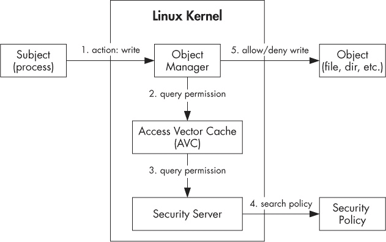

# 第十二章. SELinux

虽然前几章提到了增强型 Linux 安全（SELinux）及其在 Android 中的集成，但我们到目前为止讨论的 Android 安全模型主要集中在 Android 的“传统”沙盒实现上，它严重依赖于 Linux 的默认 DAC（自主访问控制）。Linux 的 DAC 机制轻量且易于理解，但它有一些缺点，最显著的缺点是 DAC 权限的粒度粗糙、程序配置错误可能导致数据泄漏，以及无法对作为 root 用户运行的进程应用细粒度的权限约束。（虽然 POSIX 能力（作为 Linux 中传统 DAC 的扩展实现）提供了一种仅向 root 进程授予特定权限的方法，但 POSIX 能力的粒度相当粗糙，且所授予的权限扩展到该进程访问的所有对象。）

*强制访问控制（MAC）*，由 SELinux 实现，旨在通过实施一个全系统范围、更加细粒度的安全策略，来克服 Linux 默认的 DAC（自主访问控制）的局限性，该策略只能由系统管理员更改，而不能由无特权的用户和程序更改。本章首先简要概述 SELinux 使用的架构和概念，然后描述为支持 Android 所做的主要修改。最后，我们概述了当前版本 Android 中部署的 SELinux 策略。

# SELinux 简介

SELinux 是一种为 Linux 内核设计的强制访问控制机制，作为 Linux 安全模块实现。Linux 安全模块（LSM）框架允许将第三方访问控制机制链接到内核中，并修改默认的 DAC 实现。LSM 通过一系列安全功能钩子（上行调用）和相关数据结构实现，这些功能和结构被集成到负责访问控制的 Linux 内核各个模块中。

一些主要的内核服务已插入 LSM 钩子，包括程序执行、文件和 inode 操作、netlink 消息传递和套接字操作。如果没有安装安全模块，Linux 使用其内置的 DAC 机制来规范访问这些服务管理的内核对象。如果安装了安全模块，Linux 除了参考 DAC 外，还会咨询该安全模块，以便在请求访问内核对象时做出最终的安全决策。

除了为主要内核服务提供钩子外，LSM 框架还扩展了 procfs 虚拟文件系统（*/proc*），以包含每个进程和每个任务（线程）的安全属性，并增加了支持使用文件系统扩展属性作为持久化安全属性存储的功能。SELinux 是第一个集成到 Linux 内核中的 LSM 模块，并从 2.6 版本开始正式提供（之前的 SELinux 实现是作为一组补丁发布的）。自 SELinux 集成以来，其他安全模块也已被接受到主线内核中，截至本文写作时，包括 AppArmor、Smack 和 TOMOYO Linux 等。这些模块提供了替代的 MAC 实现，并基于与 SELinux 不同的安全模型。

我们将在接下来的章节中探索 SELinux 的安全模型和架构。

## SELinux 架构

虽然 SELinux 架构相当复杂，但从高层次看，它由四个主要组件组成：对象管理器（OM）、访问向量缓存（AVC）、安全服务器和安全策略，如图 12-1 所示。

当主体请求对 SELinux 对象执行操作（例如，当一个进程尝试读取一个文件）时，相关的对象管理器会查询 AVC，看看是否允许该操作。如果 AVC 中已经缓存了此请求的安全决策，AVC 会将其返回给 OM，OM 根据该决策执行操作，允许或拒绝（如图 12-1 中的步骤 1、2 和 5 所示）。如果缓存中没有匹配的安全决策，AVC 会联系安全服务器，安全服务器基于当前加载的策略做出安全决策，并将其返回给 AVC，AVC 将其缓存。然后 AVC 将决策返回给 OM，OM 最终执行该决策（如图 12-1 中的步骤 1、2、3、4 和 5 所示）。安全服务器是内核的一部分，而策略则通过一系列函数从用户空间加载，这些函数包含在支持的用户空间库中。



图 12-1. SELinux 组件

OM 和 AVC 可以驻留在内核空间（当 OM 管理内核级对象时）或用户空间（当 OM 是所谓的 SELinux 感知应用程序的一部分时，该应用程序具有内置的 MAC 支持）。

## 强制访问控制

SELinux 的 MAC 模型基于三个主要概念：主体、对象和操作。在这个模型中，主体是执行操作的主动角色，对象是操作的目标，只有在安全策略允许的情况下，操作才会执行。

实际上，主体通常是正在运行的进程（进程也可以是对象），而对象是由内核管理的操作系统级资源，例如文件和套接字。主体和对象都有一组安全属性（统称为 *安全上下文*，将在下一节讨论），操作系统查询这些属性来决定是否允许所请求的操作。当 SELinux 启用时，主体不能绕过或影响策略规则；因此，策略是强制性的。  

### 注意事项  

*只有在 DAC 允许访问资源的情况下，才会咨询 MAC 策略。如果 DAC 拒绝访问（例如，基于文件权限），拒绝将作为最终安全决策。*

SELinux 支持两种形式的 MAC：*类型强制（TE）* 和 *多级安全（MLS）*。MLS 通常用于强制对受限信息的不同访问级别，并且在 Android 中不使用。SELinux 实现的类型强制要求所有主体和对象都有一个关联的类型，SELinux 使用此类型来执行其安全策略的规则。  

在 SELinux 中，*类型* 只是一个在策略中定义的字符串，与对象或主体相关联。主体类型指代进程或进程组，也称为 *域*。指代对象的类型通常指定对象在策略中的角色，例如系统文件、应用数据文件等。类型（或域）是安全上下文的重要组成部分，如下面的“安全上下文”所述。  

## SELinux 模式  

SELinux 有三种操作模式：禁用、宽容和强制。当 SELinux 被禁用时，未加载任何策略，仅执行默认的 DAC 安全性。在宽容模式下，策略被加载并检查对象访问，但拒绝访问仅被记录，而不执行。在强制模式下，安全策略既被加载又被强制执行，并且违规行为会被记录。  

在 Android 中，可以使用 `getenforce` 和 `setenforce` 命令检查和更改 SELinux 模式，如 示例 12-1 所示。但是，使用 `setenforce` 设置的模式不是持久的，设备重启时会恢复为默认模式。  

示例 12-1. 使用 *getenforce 和 setenforce 命令*  

```
# **getenforce**
Enforcing
# **setenforce 0**
# **getenforce**
Permissive
```

此外，即使 SELinux 处于强制模式，策略仍可以使用 `permissive` 语句为每个域（进程）指定宽容模式。（参见“对象类和权限语句”了解示例。）  

## 安全上下文  

在 SELinux 中，*安全上下文*（也称为 *安全标签*，或简称 *标签*）是一个由四个字段组成的字符串，用冒号分隔：用户名、角色、类型和一个可选的 MLS 安全范围。SELinux 用户名通常与用户组或用户类别相关联；例如，*user_u* 表示非特权用户，*admin_u* 表示管理员。

用户可以与一个或多个角色关联，以实现基于角色的访问控制，每个角色都与一个或多个域类型关联。该类型用于将进程分组到某个域中，或者指定对象的逻辑类型。

安全范围（或级别）用于实现 MLS，并指定主体允许访问的安全级别。截至目前，Android 只使用安全上下文的类型字段，而用户和安全范围始终设置为 *u* 和 *s0*。角色设置为 *r*（用于域，即进程）或内置的 *object_r* 角色（用于对象）。

通过为 `ps` 命令指定 `-Z` 选项，可以显示进程的安全上下文，如在示例 12-2 中所示（在 `LABEL` 列中）。

示例 12-2. 在 Android 中处理进程安全上下文

```
# **ps -Z**
LABEL                                   USER    PID    PPID     NAME
u:r:init:s0➊                            root    1      0        /init
u:r:kernel:s0                           root    2      0        kthreadd
u:r:kernel:s0                           root    3      2        ksoftirqd/0
--*snip*--
u:r:healthd:s0➋              root    175    1        /sbin/healthd
u:r:servicemanager:s0➌       system  176    1        /system/bin/
servicemanager
u:r:vold:s0➍                 root    177    1        /system/bin/vold
u:r:init:s0                             nobody  178    1        /system/bin/rmt_storage
u:r:netd:s0                             root    179    1        /system/bin/netd
u:r:debuggerd:s0                        root    180    1        /system/bin/debuggerd
u:r:rild:s0                             radio   181    1        /system/bin/rild
--*snip*--
u:r:platform_app:s0                     u0_a12  950    183      com.android.systemui
u:r:media_app:s0                        u0_a5   1043   183      android.process.media
u:r:radio:s0                            radio   1141   183      com.android.phone
u:r:nfc:s0                              nfc     1163   183      com.android.nfc
u:r:untrusted_app:s0                    u0_a7   1360   183      com.google.android.gms
--*snip*--
```

类似地，可以通过将 `-Z` 参数传递给 `ls` 命令来查看文件的上下文，如在示例 12-3 中所示。

示例 12-3. 文件和目录安全上下文在 Android 中的应用

```
# **ls -Z**
drwxr-xr-x root        root              u:object_r:cgroup:s0 acct
drwxrwx--- system      cache             u:object_r:cache_file:s0 cache
-rwxr-x--- root        root              u:object_r:rootfs:s0 charger
--*snip*--
drwxrwx--x system      system            u:object_r:system_data_file:s0 data
-rw-r--r-- root        root              u:object_r:rootfs:s0 default.prop
drwxr-xr-x root        root              u:object_r:device:s0 dev
lrwxrwxrwx root        root              u:object_r:rootfs:s0 etc -> /system/etc
-rw-r--r-- root        root              u:object_r:rootfs:s0 file_contexts
dr-xr-x--- system      system            u:object_r:sdcard_external:s0 firmware
-rw-r----- root        root              u:object_r:rootfs:s0 fstab.hammerhead
-rwxr-x--- root        root              u:object_r:rootfs:s0 init
--*snip*--
```

## 安全上下文分配与持久化

我们已经确定所有的主体和对象都有一个安全上下文，那么这个上下文是如何分配和持久化的呢？对于对象（通常与文件系统中的文件关联），安全上下文是持久的，通常存储为文件元数据中的扩展属性。

扩展属性不由文件系统解释，可以包含任意数据（尽管这些数据的大小通常是有限制的）。*ext4* 文件系统（大多数 Linux 发行版和当前版本的 Android 的默认文件系统）支持以名称-值对形式的扩展属性，其中名称是一个以空字符结尾的字符串。SELinux 使用 *security.selinux* 名称来存储文件对象的安全上下文。对象的安全上下文可以作为文件系统初始化的一部分显式设置（也称为 *标签化*），或者在对象创建时隐式分配。对象通常继承其父对象的类型标签（例如，目录中新创建的文件继承目录的标签）。但是，如果安全策略允许，对象可以获得与其父对象不同的标签，这一过程被称为 *类型转换*。

与对象一样，主体（进程）会继承其父进程的安全上下文，或者如果安全策略允许的话，它们可以通过 *域转换* 来改变自己的上下文。策略还可以指定自动域转换，这会根据父进程的域和已执行二进制文件的类型自动设置新启动进程的域。例如，由于所有系统守护进程都是由 *init* 进程启动的，而 *init* 进程的安全上下文是 *u:r:init:s0*（➊ 在 示例 12-2 中），这些进程通常会继承此上下文，但 Android 的 SELinux 策略使用自动域转换，根据需要为每个守护进程设置专用域（➋、➌ 和 ➍ 在 示例 12-2 中）。

## 安全策略

SELinux 安全策略由内核中的安全服务器使用，用于在运行时允许或拒绝访问内核对象。为了提高性能，策略通常以二进制形式存在，这是通过编译多个策略源文件生成的。策略源文件使用专门的策略语言编写，该语言由语句和规则组成。*语句*定义了策略实体，如类型、用户和角色。*规则*允许或拒绝访问对象（访问向量规则）；指定允许的类型转换（类型强制规则）；并指定如何分配默认用户、角色和类型（默认规则）。对 SELinux 策略语法的详细讨论超出了本书的范围，但以下部分将介绍一些最常用的语句和规则。

## 策略语句

SELinux 策略语言支持各种类型的语句，但类型、属性和权限语句构成了安全策略的主要部分。我们将在以下部分介绍这三种类型的语句。

### 类型和属性语句

`type` 和 `attribute` 语句声明了类型及其属性，如 示例 12-4 所示。

示例 12-4. `type` 和 `attribute` 语句

```
attribute file_type;➊
attribute domain;➋

type system_data_file, file_type, data_file_type;➌
type untrusted_app, domain;➍
```

在这里，第一条 ➊ 和第二条 ➋ 声明了 `file_type` 和 `domain` 属性，接下来的语句 ➌ 声明了 `system_data_file` 类型，并将其与 `file_type` 和 `data_file_type` 属性关联。第四行代码 ➍ 声明了 `untrusted_app` 类型，并将其与 `domain` 属性关联（该属性标记了所有用于进程的类型）。

根据粒度的不同，SELinux 策略可能包含数十个甚至数百个类型和属性声明，这些声明分布在多个源文件中。然而，由于需要在运行时对所有内核对象进行策略检查，大型策略可能会对性能产生负面影响。特别是在计算资源有限的设备上运行时，性能影响尤为明显，这也是 Android 力求保持 SELinux 策略相对简小的原因。

### 用户和角色声明

`user` 声明定义了一个 SELinux 用户标识符，将其与角色关联，并可选地指定其默认安全级别和用户可以访问的安全级别范围。示例 12-5 显示了 Android 中默认的唯一用户标识符声明。

示例 12-5. Android 中默认 SELinux 用户标识符的声明

```
user u roles { r } level s0 range s0 - mls_systemhigh;
```

如在示例 12-5 中看到的，*u* 用户与 *r* 角色（大括号内）关联，后者通过 `role` 声明 ➊ 进行声明，如示例 12-6 所示。

示例 12-6. Android 中默认 SELinux 角色的声明

```
role r;➊
role r types domain;➋
```

第二个声明 ➋ 将 *r* 角色与 `domain` 属性关联，这标记它为分配给进程（域）的角色。

### 对象类和权限声明

`permissive` 声明允许一个命名域以宽松模式运行（该模式仅记录 MAC 策略违规，但不实际强制执行该策略，后续将讨论），即使 SELinux 正在强制模式下运行。如我们将在“强制域”中看到的那样，Android 当前基础策略中的大多数域都是宽松模式。例如，*adbd* 域中的进程（实际上是 *adbd* 守护进程）以宽松模式运行，如示例 12-7 ➊ 所示。

示例 12-7. 将命名域设置为宽松模式

```
type adbd, domain;
permissive adbd;➊
--*snip*--
```

`class` 声明定义了一个 SELinux 对象类，如示例 12-8 所示。对象类及其相关权限由 Linux 内核中各自的对象管理器实现来确定，并在策略中保持静态。对象类通常定义在 *security_classes* 策略源文件中。

示例 12-8. 安全类 *文件* 中的对象类声明

```
--*snip*--
# file-related classes
class filesystem
class file
class dir
class fd
class lnk_file
class chr_file
class blk_file
class sock_file
class fifo_file
--*snip*--
```

SELinux 权限（也称为 *访问向量*）通常在名为 *access_vectors* 的策略源文件中定义并与对象类关联。权限可以是特定类的（使用 `class` 关键字定义）或可被一个或多个对象类继承的，在这种情况下，它们使用 `common` 关键字定义。示例 12-9 显示了所有文件对象共享的权限集的定义 ➊，以及 `dir` 类（表示目录）与所有通用文件权限的关联（使用 `inherits` 关键字），以及一组特定于目录的权限（*add_name*、*remove_name* 等） ➋。

示例 12-9. 访问向量文件中的权限定义

```
--*snip*--
common file
{
    ioctl
    read

    write
    create
    getattr
    setattr
    lock
    --*snip*--
}➊
--*snip*--
class dir
inherits file
{

    add_name
    remove_name
    reparent
    search
    rmdir
    --*snip*--
}➋
--*snip*--
```

## 类型过渡规则

类型强制规则和访问向量规则（在“域过渡规则”和“访问向量规则”中讨论）通常构成 SELinux 策略的主要部分。反过来，最常用的类型强制规则是`type_transition`规则，它指定了何时允许域和类型的过渡。例如，管理 Android 中 Wi-Fi 连接的 *wpa_supplicant* 守护进程，使用了在 示例 12-10") 中显示的类型过渡规则 ➍，该规则将它在 */data/misc/wifi/* 目录中创建的控制套接字与 `wpa_socket` 类型关联起来。如果没有这个规则，这些套接字将继承它们父目录的类型：`wifi_data_file`。

示例 12-10. wpa 域中的类型过渡（来自 wpa_supplicant.te）

```
# wpa - wpa supplicant or equivalent
type wpa, domain;
permissive wpa;➊
type wpa_exec, exec_type, file_type;

init_daemon_domain(wpa)➋
unconfined_domain(wpa)➌
type_transition wpa wifi_data_file:sock_file wpa_socket;➍
```

在这里，`wpa`、`wifi_data_file:sock_file` 和 `wpa_socket` 分别是源类型（在此案例中是 *wpa_supplicant* 进程的域）、目标类型和类（过渡前对象的类型和类）以及过渡后的对象类型。

### 注意

*为了能够创建套接字文件并更改其标签，`wpa` 域需要在父目录和套接字文件本身上拥有额外的权限——仅有 `type_transition` 规则是不够的。然而，由于 `wpa` 域既是宽松的* ➊ *又是不受限制的（默认授予大多数权限）* ➌*，因此可以在不显式允许每个所需权限的情况下完成过渡。*

## 域过渡规则

在 Android 中，像 *wpa_supplicant* 这样的本地系统守护进程由 *init* 进程启动，因此默认情况下继承其安全上下文。然而，大多数守护进程都与一个专用域相关联，并使用域转换在启动时切换其域。这通常通过使用 `init_daemon_domain()` 宏（示例 12-10 中的 ➋）来实现，其内部通过使用 `type_transition` 关键字实现，就像类型转换一样。

二进制 SELinux 策略构建过程使用 `m4` 宏预处理器^([132]) 在合并所有源文件之前展开宏，以创建二进制策略文件。`init_daemon_domain()` 宏接受一个参数（进程的新域），并在 *te_macros* 文件中使用两个其他宏定义：`domain_trans()` 和 `domain_auto_trans()`，分别用于允许转换到新域和自动执行转换。示例 12-11 展示了这三个宏的定义（➊、➋ 和 ➌）。以 `allow` 关键字开头的行是访问向量（AV）规则，我们将在下一节中讨论。

示例 12-11. 在 te_macros `文件` 中定义的域转换宏

```
# domain_trans(olddomain, type, newdomain)
define(`domain_trans', `
allow $1 $2:file { getattr open read execute };
allow $1 $3:process transition;
allow $3 $2:file { entrypoint read execute };
allow $3 $1:process sigchld;
dontaudit $1 $3:process noatsecure;
allow $1 $3:process { siginh rlimitinh };
')➊
# domain_auto_trans(olddomain, type, newdomain)
define(`domain_auto_trans', `
domain_trans($1,$2,$3)
type_transition $1 $2:process $3;
')➋
# init_daemon_domain(domain)
 define(`init_daemon_domain', `
domain_auto_trans(init, $1_exec, $1)
tmpfs_domain($1)
')➌
--*snip*--
```

## 访问向量规则

AV 规则通过指定进程在运行时对其目标对象的权限集，定义了进程所具有的特权。示例 12-12 展示了 AV 规则的一般格式。

示例 12-12. AV 规则的格式

```
rule_name source_type target_type : class perm_set;
```

`rule_name` 可以是 `allow`、`dontaudit`、`auditallow` 或 `neverallow`。要形成一个规则，`source_type` 和 `target_type` 元素会被一个或多个先前定义的 `type` 或 `attribute` 标识符替换，其中 `source_type` 是主体（进程）的标识符，`target_type` 是进程尝试访问的目标对象的标识符。`class` 元素会被目标的对象类别替换，`perm_set` 指定了源进程对目标对象拥有的权限集。你可以通过将它们包围在大括号（`{}`）中来指定多个类型、类别和权限。此外，一些规则支持使用通配符（`*`）和补集（`~`）运算符，分别允许你指定应包含所有类型或应包含所有类型，除了那些明确列出的类型。

### allow 规则

最常用的规则是 `allow`，它指定了指定源类型的主体（进程）可以对目标类型和类的对象执行的操作。以 *vold* 守护进程的 SELinux 策略为例（参见 示例 12-13），我们来说明如何使用 `allow` 规则。

示例 12-13. `allow` 规则用于 `vold` 域（来自 vold.te）

```
type vold, domain;
type vold_exec, exec_type, file_type;
init_daemon_domain(vold)
--*snip*--
allow vold sdcard_type:filesystem { mount remount unmount };➊
--*snip*--
allow vold self:capability { sys_ptrace kill };➋
--*snip*--
```

在这个列出规则的示例中，规则 ➊ 允许 *vold* 守护进程（在 `vold` 域中运行）挂载、卸载和重新挂载类型为 `sdcard_type` 的文件系统。规则 ➋ 允许该守护进程使用 `CAP_SYS_PTRACE`（允许对任何进程调用 `ptrace()`）和 `CAP_KILL`（允许向任何进程发送信号）Linux 能力，这些能力与规则中指定的权限集（位于 `{}` 内）相对应。在规则 ➋ 中，`self` 关键字表示目标域与源域相同，在此例中是 `vold`。

### auditallow 规则

`auditallow` 规则与 `allow` 配合使用，以便在操作被允许时记录审计事件。这很有用，因为默认情况下，SELinux 仅记录访问被拒绝的事件。然而，`auditallow` 本身并不授予访问权限，因此必须使用匹配的 `allow` 规则来授予必要的权限。

### dontaudit 规则

`dontaudit` 规则用于抑制当已知某个事件是安全时，拒绝消息的审计。例如，示例 12-14 中的规则 ➊ 指定如果 *installd* 守护进程被拒绝 `CAP_SYS_ADMIN` 能力，则不创建审计日志。然而，`dontaudit` 规则可能会掩盖程序错误，因此不建议使用 `dontaudit`。

示例 12-14. `dontaudit` 规则用于 installd 域（来自 installd.te）

```
type installd, domain;
--*snip*--
dontaudit installd self:capability sys_admin;➊
--*snip*--
```

### neverallow 规则

`neverallow` 规则表示即使存在显式的 `allow` 规则允许某个操作，也永远不允许执行该操作。例如，示例 12-15 中的规则禁止了除 `init` 域外的所有域加载 SELinux 策略。

示例 12-15. `neverallow` 规则禁止除 init 以外的所有域加载 SELinux 策略（来自 domain.te）

```
--*snip*--
neverallow { domain -init } kernel:security load_policy;
```

### 注意

*本节仅简要概述了 SELinux，重点讨论了在 Android 中使用的功能。如需更详细的 SELinux 架构和实现讨论，以及其策略语言，请参见* SELinux Notebook.^([133])

# Android 实现

如 第一章 和 第二章 中所讨论的，Android 的沙箱安全模型在很大程度上依赖于为系统守护进程和应用程序使用不同的 Linux UID。进程隔离和访问控制最终由 Linux 内核基于进程的 UID 和 GID 强制执行。由于 SELinux 也是 Linux 内核的一部分，因此 SELinux 是使用 MAC 策略加强 Android 沙箱模型的自然候选者。

由于 SELinux 已集成到主线 Linux 内核中，看起来在 Android 中启用它应该只是配置内核和设计适当的 MAC 策略的简单问题。然而，由于 Android 对 Linux 内核引入了一些独特的扩展，并且其用户空间结构与桌面和服务器 Linux 发行版的结构大不相同，因此需要对内核和用户空间进行多次修改，以便将 SELinux 集成并启用到 Android 中。虽然将 SELinux 集成的初步工作由 Google 启动，但大多数所需的更改是在 Android 安全增强项目（正式名称为安全增强 Android，或 SEAndroid）中实现的，并且后来被集成到主线 Android 源代码树中。以下部分将概述这些主要更改。有关更改的详细列表及其背后的理由，请参见 SEAndroid 项目原作者所撰写的论文 *Security Enhanced (SE) Android: Bringing Flexible MAC to Android*。

## 内核更改

回想一下，SELinux 是一个安全模块，实现在与对象访问控制相关的内核服务中插入的各种 LSM 钩子。Android 的 Binder IPC 机制也作为内核驱动实现，但由于其最初的实现并未包含任何 LSM 钩子，其运行时行为无法通过 SELinux 策略进行控制。为了将 SELinux 支持添加到 Binder 中，LSM 钩子被插入到 Binder 驱动程序中，并且 `binder` 对象类及相关权限的支持被添加到 SELinux 代码中。

SELinux 安全钩子在 *include/linux/security.h* 中声明，示例 12-16 显示了为支持 Android 而添加的与 Binder 相关的声明。

示例 12-16. 在 include/linux/security.h 中声明的 Binder 安全钩子

```
--*snip*--
int security_binder_set_context_mgr(struct task_struct *mgr);➊
int security_binder_transaction(struct task_struct *from,
                                struct task_struct * to);➋
int security_binder_transfer_binder(struct task_struct *from,
                                    struct task_struct *to);➌
int security_binder_transfer_file(struct task_struct *from,
                                  struct task_struct *to, struct file *file);➍
--*snip*--
```

第一个钩子 ➊ 控制哪个进程可以成为 Binder 上下文管理器，第二个钩子 ➋ 控制一个进程调用 Binder 事务的能力。接下来的两个函数用于调节谁可以将 Binder 引用传递给另一个进程 ➌，以及通过 Binder 将打开的文件传递给另一个进程 ➍。

为了允许 SELinux 策略为 Binder 设置限制，内核中还添加了对 `binder` 对象类及其权限（`impersonate`、`call`、`set_context_mgr` 和 `transfer`）的支持，具体如 示例 12-17 所示。

示例 12-17。selinux/include/classmap.h 中的 Binder 对象类和权限声明

```
--*snip*--
struct security_class_mapping secclass_map[] = {
    --*snip*--
    {"binder", {"impersonate", "call", "set_context_mgr", "transfer", NULL} },
    { NULL }
  };
```

## 用户空间更改

除了内核更改外，还需要进行许多用户空间修改和扩展，才能将 SELinux 集成到 Android 中。其中最重要的更改包括：核心 C 库（bionic）对文件系统标签的支持；*init* 以及核心本地守护进程和可执行文件的扩展；框架级别的 SELinux API；以及对核心框架服务的修改，使其能够识别 SELinux。本节将描述每个更改以及它是如何集成到 Android 运行时中的。

### 库和工具

因为 SELinux 使用扩展属性来存储文件系统对象的安全上下文，所以首先将用于管理扩展属性（`listxattr()`、`getxattr()`、`setxattr()` 等）的系统调用的包装函数添加到了 Android 的 C 库中，以便能够获取和设置文件和目录的安全标签。

为了能够从用户空间利用 SELinux 的功能，SEAndroid 添加了一个兼容 Android 的 *libselinux* 库移植版本，以及一组用于管理标签、安全策略，并在强制模式和宽松模式之间切换的实用命令。像大多数 Android 命令行工具一样，SELinux 工具实现于 `toolbox` 二进制文件中，并作为其符号链接进行安装。表 12-1 总结了添加或修改的命令行工具。

表 12-1。SELinux 命令行工具

| 命令 | 描述 |
| --- | --- |
| `chcon` | 更改文件的安全上下文 |
| `getenforce` | 获取当前的 SELinux 模式 |
| `getsebool` | 获取策略布尔值 |
| `id` | 显示进程的安全上下文 |
| `load_policy` | 加载策略文件 |
| `ls -Z` | 显示文件的安全上下文 |
| `ps -Z` | 显示正在运行的进程的安全上下文 |
| `restorecon` | 恢复文件的安全上下文 |
| `runcon` | 在指定的安全上下文中运行程序 |
| `setenforce` | 设置强制模式 |
| `setsebool` | 设置策略布尔值 |

### 系统初始化

与传统的 Linux 系统一样，在 Android 中，所有用户空间守护进程和程序都是由 *init* 进程启动的，这是内核启动的第一个进程（PID=1）。然而，不像其他基于 Linux 的系统，Android 的初始化脚本（*init.rc* 及其变体）不是由通用 shell 解释的，而是由 *init* 本身解释执行。每个初始化脚本都包含 *init* 执行时所需的内置命令。SEAndroid 扩展了 Android 的 *init* 语言，添加了许多新的命令，用于初始化 SELinux 和设置服务及文件的安全上下文，这些命令在表 12-2 中进行了总结。

表 12-2. init 内置命令用于 SELinux 支持

| init 内置命令 | 描述 |
| --- | --- |
| `seclabel` | 设置服务的安全上下文 |
| `restorecon` | 恢复文件或目录的安全上下文 |
| `setcon` | 设置 *init* 进程的安全上下文 |
| `setenforce` | 设置强制模式 |
| `setsebool` | 设置策略布尔值 |

当 *init* 启动时，它从 */sepolicy* 二进制策略文件加载 SELinux 策略，然后根据 *ro.boot.selinux* 系统属性的值设置强制模式（*init* 根据 *androidboot.selinux* 内核命令行参数的值来设置该属性）。当属性值为 *permissive* 时，SELinux 进入宽松模式；当设置为其他任何值或未设置时，模式则设置为强制模式。

接下来，*init* 加载并解析 *init.rc* 文件，并执行文件中指定的命令。示例 12-18 显示了 *init.rc* 的一部分，重点展示了负责 SELinux 初始化的部分。

示例 12-18. SELinux 在 init.rc 中的初始化

```
--*snip*--
on early-init
    --*snip*--
    setcon u:r:init:s0➊
    start ueventd
--*snip*--
on post-fs-data
    chown system system /data
    chmod 0771 /data
    restorecon /data➋
--*snip*--
service ueventd /sbin/ueventd
    class core
    critical
    seclabel u:r:ueventd:s0➌
--*snip*--
on property:selinux.reload_policy=1➍
    restart ueventd
    restart installd
--*snip*--
```

在这个示例中，*init* 在启动核心系统守护进程之前，使用 `setcon` 命令➊设置其自身的安全上下文。由于子进程会继承其父进程的安全上下文，*init* 显式地将 *ueventd* 守护进程（第一个启动的守护进程）的安全上下文设置为 *u:r:ueventd:s0* ➌，通过 `seclabel` 命令来实现。其他大多数本地服务会根据策略中定义的类型转换规则自动设置其域（如在示例 12-10 中所示）。(`seclabel` 命令仅用于设置在系统初始化过程中非常早期启动的进程的安全上下文。)

当可写文件系统被挂载时，*init* 使用 `restorecon` 命令恢复其挂载点的默认标签，因为出厂重置可能会清除它们的标签。示例 12-18 展示了该命令 ➋，它给 *userdata* 分区的挂载点（*/data*）打上标签。

最后，因为通过将 *selinux.reload_policy* 系统属性设置为 1 ➍ 可以触发策略重载，*init* 在该属性设置时会重启 *ueventd* 和 *installd* 守护进程，以便新策略生效。

### 标签文件

记住，持久化 SELinux 对象，如文件，具有持久的安全上下文，该上下文通常保存在文件的扩展属性中。在 Android 中，所有文件的初始安全上下文在一个名为 *file_contexts* 的文本文件中定义，其内容可能如下所示：示例 12-19.

示例 12-19. *file_contexts* 文件内容

```
/                            u:object_r:rootfs:s0➊
/adb_keys                    u:object_r:rootfs:s0
/default.prop                u:object_r:rootfs:s0
/fstab\..*                   u:object_r:rootfs:s0
--*snip*--
/dev(/.*)?                   u:object_r:device:s0➋
/dev/akm8973.*               u:object_r:akm_device:s0
/dev/accelerometer           u:object_r:accelerometer_device:s0
--*snip*--
/system(/.*)?                u:object_r:system_file:s0➌
/system/bin/ash              u:object_r:shell_exec:s0
/system/bin/mksh             u:object_r:shell_exec:s0
--*snip*--
/data(/.*)?                  u:object_r:system_data_file:s0➍
/data/backup(/.*)?           u:object_r:backup_data_file:s0
/data/secure/backup(/.*)?    u:object_r:backup_data_file:s0
--*snip*--
```

如你所见，文件包含了一系列路径（有时使用通配符）及其关联的安全上下文，每个路径占一行。*file_contexts* 文件会在 Android 的构建和启动过程中多次被查阅。例如，因为像 Android 根文件系统（挂载于 */*）和设备文件系统（挂载于 */dev*）这样的内存文件系统是非持久的，所有文件通常都会与 *genfs_contexts* 文件中指定的相同安全上下文相关联，或者通过 `context=` 挂载选项进行分配。为了将特定文件分配给这些文件系统中的独立安全上下文，*init* 使用 `restorecon` 命令在 *file_contexts* 中查找每个文件的安全上下文（➊ 对于根文件系统，➋ 作为设备文件系统的默认值），并根据查找到的内容进行设置。在从源代码构建 Android 时，`make_ext4fs` 命令也会查阅 *file_contexts*，以设置 *system*（挂载于 */system* ➌）和 *userdata* 分区（挂载于 */data* ➍）映像中文件的初始上下文。数据分区挂载点的安全上下文也会在每次启动时恢复（如 示例 12-18 所示），以确保它们保持一致的状态。最后，Android 的恢复操作系统也包含一个 *file_contexts* 文件的副本，用于在系统更新过程中设置恢复创建的文件的正确标签。这确保了系统在每次更新后都保持安全标签状态，并避免了每次更新后都需要重新标记。

### 标签系统属性

Android 使用全局系统属性，这些属性对所有进程可见，用于各种目的，如传达硬件状态、启动或停止系统服务、触发磁盘加密，甚至重新加载 SELinux 策略。只读系统属性的访问没有限制，但由于更改关键读写属性的值会改变系统行为，因此对这些属性的写访问受到限制，仅允许在特权 UID 下运行的系统进程访问，例如 *system* 和 *radio*。SEAndroid 通过添加 MAC 规则来增强这种基于 UID 的访问控制，规定了基于进程域的系统属性写访问权限，允许进程修改属性。为了使其正常工作，系统属性（这些属性不是原生的 SELinux 对象）必须与安全上下文关联。这是通过在 *property_contexts* 文件中列出属性的安全上下文来完成的，方式与 *file_contexts* 指定文件的安全标签类似。该文件由 *property_service*（*init* 的一部分）加载到内存中，生成的安全上下文查找表将用于根据进程（主体）和属性（对象）的安全上下文判断是否允许进程访问特定属性。SELinux 策略定义了一个新的 `property_service` 对象类，具有一个权限 `set`，用于指定访问规则，如 示例 12-20 所示。

示例 12-20. vold.te 中的系统属性访问规则

```
type vold, domain;
--*snip*--
allow vold vold_prop:property_service set;➊
allow vold powerctl_prop:property_service set;➋
allow vold ctl_default_prop:property_service set;➌
--*snip*--
```

在此列表中，`vold` 域被允许设置类型为 `vold_prop` ➊、`powerctl_prop` ➋ 和 `ctl_default_prop` ➌ 的系统属性。

这些类型与实际属性相关联，依据属性名称在 *property_contexts* 中进行匹配，如 示例 12-21 所示。

示例 12-21. 属性名称与其安全上下文在 property_contexts 中的关联

```
--*snip*--
vold.                     u:object_r:vold_prop:s0➊
sys.powerctl              u:object_r:powerctl_prop:s0➋
ctl.                      u:object_r:ctl_default_prop:s0➌
--*snip*--
```

该策略的效果是，*vold* 可以设置所有属性值，这些属性的名称以 `vold.` ➊、`sys.powerctl` ➋ 或 `ctl.` ➌ 开头。

### 标记应用程序进程

回想一下 第二章 中提到的，Android 中所有的应用程序进程都是从 *zygote* 进程派生的，以减少内存使用并提高应用启动速度。*system_server* 进程也从 *zygote* 派生，尽管是通过稍有不同的接口，但它以 *system* 用户身份运行，并托管大多数系统服务。

*合子*过程以根用户身份运行，负责设置每个应用程序进程的 DAC 凭证（UID、GID 和附加 GID），以及其能力和资源限制。为了支持 SELinux，*合子*被扩展为检查其客户端的安全上下文（在`ZygoteConnection`类中实现），并设置每个由其分叉的应用程序进程的安全上下文。安全上下文根据*seapp_contexts*配置文件中指定的分配规则确定，该规则依据应用程序的 UID、包名、标记系统服务器进程的标志以及一个名为`seinfo`的 SELinux 特定字符串属性来进行确定。*seapp_contexts*配置文件包含安全上下文分配规则（每行一个），这些规则由输入选择器属性和输出属性组成。为了匹配规则，所有输入选择器必须匹配（逻辑与）。示例 12-22 显示了截至版本 4.4.3 的参考 Android SELinux 策略中的*seapp_contexts*文件内容。

### 注意

*seapp_contexts*文件与参考策略中的所有文件一样，可以在 Android 源代码树的*external/sepolicy/*目录中找到。查看文件中的注释以获取输入选择器的完整列表、选择器匹配优先级规则和输出。

示例 12-22. seapp_contexts 文件的内容

```
isSystemServer=true domain=system➊
user=system domain=system_app type=system_data_file➋
user=bluetooth domain=bluetooth type=bluetooth_data_file
user=nfc domain=nfc type=nfc_data_file
user=radio domain=radio type=radio_data_file
user=_app domain=untrusted_app type=app_data_file levelFrom=none➌
user=_app seinfo=platform domain=platform_app type=platform_app_data_file➍
user=_app seinfo=shared domain=shared_app type=platform_app_data_file➎
user=_app seinfo=media domain=media_app type=platform_app_data_file
user=_app seinfo=release domain=release_app type=platform_app_data_file
user=_isolated domain=isolated_app➏
user=shell domain=shell type=shell_data_file
```

此列表中的第一行➊指定了系统服务器的域（`system`），因为`isSystemServer`选择器（只能使用一次）被设置为`true`。由于 Android 使用固定的 SELinux 用户标识符、角色和安全级别，结果安全上下文变为*u:r:system:s0*。

第二个分配规则➋将`user`选择器与目标进程的用户名进行匹配，用户名来源于其 UID。如果进程以内建的 Android Linux 用户之一运行（*system*、*radio*、*nfc*等，定义在*android_filesystem_config.h*中），则在匹配`user`选择器时使用关联的名称。孤立服务会分配一个`*_isolated*`用户名字符串，其他任何进程则分配`*_app*`用户名字符串。因此，匹配此选择器的系统应用程序会被分配`system_app`域。

`type`属性指定分配给目标进程所拥有的文件的对象类型。由于在此情况下类型为`system_data_file`，因此系统文件的安全上下文变为*u:object_r:system_data_file:s0*。

规则 ➌ 匹配所有在非系统 UID 下执行的应用，并将其进程分配到 `untrusted_app` 域。每个不受信任应用的私有应用数据目录递归地被分配为 `app_data_file` 对象类型，从而形成 *u:object_r:app_data_file:s0* 安全上下文。数据目录的安全上下文由 *installd* 守护进程在创建应用安装过程中的一部分时设置（参见 第三章）。

规则 ➍ 和 ➎ 使用 `seinfo` 选择器区分非系统应用并将其分配到不同的域：匹配 `seinfo=platform` 的应用进程被分配到 `platform_app` 域，匹配 `seinfo=shared` 的进程则分配到 `shared_app` 域。（正如我们将在下一节中看到的，应用的 `seinfo` 属性由其签名证书决定，因此实际上，规则 ➍ 和 ➎ 将每个应用的签名证书用作进程域选择器。）

最后，规则 ➏ 将 `isolated_app` 域分配给所有隔离服务。（隔离服务在与其托管应用的 UID 分离的 UID 下运行，不能访问任何系统服务。）

### 中间件 MAC

上一节中介绍的 `seinfo` 属性是 SEAndroid 的一项功能，称为 *中间件 MAC (MMAC)*，这是一种更高级别的访问控制方案，独立于内核级的 MAC（该功能由 SELinux LSM 模块实现）。

MMAC 的设计目的是对 Android 的权限模型提供 MAC 限制，该模型在框架级别工作，无法轻易映射到默认的内核级 MAC。原始实现包括一项安装时 MAC 功能，根据应用包名和签名证书限制可以授予每个包的权限，而不管用户的权限授予决定。也就是说，即使用户决定授予应用所有请求的权限，只要策略不允许授予某些权限，安装过程仍然可能被 MMAC 阻止。

SEAndroid 的 MMAC 实现还包括一项意图 MMAC 功能，该功能使用策略来控制应用之间可以交换的意图。另一个 SEAndroid 功能是内容提供者 MMAC，它定义了内容提供者数据访问的策略。然而，原始的 SEAndroid MMAC 实现仅部分地合并到主线 Android 中，目前唯一支持的功能是基于应用签名证书的 `seinfo` 分配。

### 注意

*从版本 4.3 开始，Android 引入了一项实验性的*意图防火墙*功能，该功能通过“防火墙”样式的规则限制可以发送和接收的意图。这项功能类似于 SEAndroid 的意图 MMAC，但并未与 SELinux 实现集成。*

MMAC 配置文件名为*mac_permission.xml*，并存储在设备的*/system/etc/security/*目录中。示例 12-23 显示了用于生成此文件的模板，通常存储在 Android 源树中的*external/sepolicy/mac_permission.xml*中。

示例 12-23. mac_permission.xml 文件模板

```
<?xml version="1.0" encoding="utf-8"?>
<policy>

    <!-- Platform dev key in AOSP -->
    <signer signature="@PLATFORM" >➊
      <seinfo value="platform" />
    </signer>

    <!-- Media dev key in AOSP -->
    <signer signature="@MEDIA" >➋
      <seinfo value="media" />
    </signer>

    <!-- shared dev key in AOSP -->
    <signer signature="@SHARED" >➌
      <seinfo value="shared" />
    </signer>

    <!-- release dev key in AOSP -->
    <signer signature="@RELEASE" >➍
      <seinfo value="release" />
    </signer>

    <!-- All other keys -->
    <default>➎
      <seinfo value="default" />
    </default>

</policy>
```

这里，*@PLATFORM* ➊、*@MEDIA* ➋、*@SHARED* ➌和*@RELEASE* ➍宏代表 Android 中使用的四个平台签名证书（*platform*、*media*、*shared*和*release*），在构建 SELinux 策略时，它们会被替换为各自的证书，并以十六进制字符串形式编码。

在扫描每个已安装的软件包时，系统的`PackageManagerService`会将其签名证书与*mac_permission.xml*文件的内容进行匹配，如果找到匹配项，它将把指定的`seinfo`值分配给该软件包。如果未找到匹配项，则会分配*default* `seinfo`值，如<default>标签 ➎中所指定。

## 设备策略文件

Android 的 SELinux 策略由一个二进制策略文件和四个支持的配置文件组成，这些文件用于进程、应用、系统属性和文件标记，以及 MMAC 初始化。表 12-3 显示了这些文件在设备上的位置，并简要描述了文件的目的和内容。

表 12-3. Android SELinux 策略文件

| 策略文件 | 描述 |
| --- | --- |
| */sepolicy* | 二进制内核策略 |
| */file_contexts* | 文件安全上下文，用于标记文件系统 |
| */property_contexts* | 系统属性安全上下文 |
| */seapp_contexts* | 用于推导应用进程和文件的安全上下文 |
| */system/etc/security/mac_permissions.xml* | 将应用签名证书映射到`seinfo`值 |

### 注意

*SELinux 启用的 Android 版本在 4.4.3 之前支持通过/data/security/current/和/data/system/（MMAC 配置文件）目录中的相应文件覆盖表 12-3 中显示的默认策略文件，从而实现在线策略更新，而无需完整的 OTA 更新。然而，Android 4.4.3 取消了这一功能，因为这可能会导致文件系统上设置的安全标签与新策略中引用的标签之间产生差异。现在，策略文件仅从表 12-3 中显示的默认只读位置加载。*

## 策略事件日志

具有匹配 `auditallow` 规则的访问拒绝和访问授权会被记录到内核日志缓冲区，并可以通过 `dmesg` 查看，如 示例 12-24 所示。

示例 12-24. SELinux 访问拒绝记录在内核日志缓冲区

```
# **dmesg |grep 'avc:'**
--*snip*--
<5>[18743.725707] type=1400 audit(1402061801.158:256): avc: denied { getattr
} for pid=9574 comm="zygote" path="socket:[8692]" dev="sockfs" ino=8692
scontext=u:r:untrusted_app:s0 tcontext=u:r:zygote:s0 tclass=unix_stream_socket
--*snip*--
```

在这里，审计日志显示一个第三方应用程序（源安全上下文 *u:r:untrusted_app:s0*）被拒绝访问 *zygote* Unix 域套接字的 *getattr* 权限（目标上下文 *u:r:zygote:s0*，对象类别 `unix_stream_socket`）。

# Android 4.4 SELinux 策略

Android 4.2 是首个包含 SELinux 代码的版本，但在发布构建中 SELinux 在编译时被禁用。Android 4.3 在所有构建中启用了 SELinux，但其默认模式设置为宽容模式。此外，所有域也都单独设置为宽容模式，并基于 `unconfined` 域，基本上允许它们完全访问（在 DAC 范围内），即使全局 SELinux 模式设置为强制模式。

Android 4.4 是首个以强制模式启用 SELinux 的版本，并且为核心系统守护进程包含了强制执行的域。本节概述了 Android 4.4 中部署的 SELinux 策略，并介绍了一些构成该策略的主要域。

## 策略概述

Android 基础 SELinux 策略的源代码托管在 Android 源代码树的 *external/sepolicy/* 目录中。除了本章迄今介绍的文件（*access_vectors*、*file_contexts*、*mac_permissions.xml* 等）外，策略源代码主要由类型强制（TE）语句和规则组成，这些语句和规则被分割到多个 *.te* 文件中，通常每个定义的域有一个文件。这些文件会合并生成二进制策略文件 *sepolicy*，该文件包含在启动镜像的根目录下，路径为 */sepolicy*。

你可以使用标准的 SELinux 工具（如 `seinfo`、`sesearch`、`sedispol` 等）来检查二进制策略文件。例如，我们可以使用 `seinfo` 命令来获取策略对象和规则数量的总结，如 示例 12-25 所示。

示例 12-25. 使用 `seinfo` 命令查询二进制策略文件

```
$**seinfo sepolicy**

Statistics for policy file: sepolicy
Policy Version & Type: v.26 (binary, mls)

   Classes:                84    Permissions:     249
   Sensitivities:           1    Categories:     1024
   Types:                 267    Attributes:       21
   Users:                   1    Roles:             2
   Booleans:                1    Cond. Expr.:       1
   Allow:                1140    Neverallow:        0
   Auditallow:              0    Dontaudit:        36
   Type_trans:            132    Type_change:       0
   Type_member:             0    Role allow:        0
   Role_trans:              0    Range_trans:       0
   Constraints:            63    Validatetrans:     0
   Initial SIDs:           27    Fs_use:           14
   Genfscon:               10    Portcon:           0
   Netifcon:                0    Nodecon:           0
   Permissives:            42    Polcap:            2
```

如你所见，策略相当复杂：它定义了 84 个类别，267 个类型和 1,140 条允许规则。

你可以通过为 `seinfo` 命令指定过滤选项来获取有关策略对象的更多信息。例如，由于所有域都与 `domain` 属性相关联，示例 12-26 中的命令列出了策略中定义的所有域。

示例 12-26. 使用 `seinfo` 命令获取所有定义的域的列表

```
$ **seinfo -adomain -x sepolicy**
   domain
      nfc
      platform_app
      media_app
      clatd
      netd
      sdcardd
      zygote
--*snip*--
```

你可以使用 `sesearch` 命令搜索策略规则。例如，可以使用 示例 12-27 中显示的命令，列出所有以 `zygote` 域为源的 `allow` 规则。

示例 12-27. 使用 `sesearch` 命令搜索策略规则

```
$**sesearch --allow -s zygote -d sepolicy**
Found 40 semantic av rules:
   allow zygote zygote_exec : file { read execute execute_no_trans entrypoint open } ;
   allow zygote init : process sigchld ;
   allow zygote rootfs : file { ioctl read getattr lock open } ;
   allow zygote rootfs : dir { ioctl read getattr mounton search open } ;
   allow zygote tmpfs : filesystem mount ;
   allow zygote tmpfs : dir { write create setattr mounton add_name search } ;
--*snip*--
```

### 注意

*有关构建和自定义 SELinux 策略的详细信息，请参阅* 在 Android 中验证增强安全的 Linux *文档。*^([136])

## 强制执行的域

尽管 SELinux 在 Android 4.4 中处于强制模式，但目前只有分配给少数核心守护进程的域正在执行强制策略，即：*installd*（负责创建应用数据目录）、*netd*（负责管理网络连接和路由）、*vold*（负责挂载外部存储和安全容器）以及 *zygote*。这些守护进程都以 root 身份运行或被授予特权，因为它们需要执行一些管理操作，比如更改目录所有权（*installd*）、操作数据包过滤和路由规则（*netd*）、挂载文件系统（*vold*）以及代表其他进程更改进程凭证（*zygote*）。

由于这些守护进程具有提升的特权，它们成为了各种权限提升漏洞的目标，这些漏洞允许非特权进程获得设备的 root 访问权限。因此，为与这些系统守护进程相关联的域指定严格的 MAC 策略是加强 Android 沙盒安全模型并防止未来类似漏洞的一个重要步骤。

让我们来看一下为 `installd` 域定义的类型强制规则（在 *installd.te* 中），以了解 SELinux 如何限制系统守护进程的访问权限（参见 示例 12-28）。

示例 12-28. installd 类型强制策略（来自 installd.te）

```
type installd, domain;
type installd_exec, exec_type, file_type;

init_daemon_domain(installd)➊
relabelto_domain(installd)➋
typeattribute installd mlstrustedsubject;➌
allow installd self:capability { chown dac_override fowner fsetid setgid setuid };➍
--*snip*--
allow installd dalvikcache_data_file:file create_file_perms;➎
allow installd data_file_type:dir create_dir_perms;➏
allow installd data_file_type:dir { relabelfrom relabelto };➐
allow installd data_file_type:{ file_class_set } { getattr unlink };➑
allow installd apk_data_file:file r_file_perms;➒
--*snip*--
allow installd system_file:file x_file_perms;➓
--*snip*--
```

在此列表中，*installd* 守护进程在启动时首先通过 `init_daemon_domain()` 宏自动转换到一个专用域（也命名为 `installd`）➊。然后，它被授予 `relabelto` 权限，以便它可以设置其创建的文件和目录的安全标签 ➋。接下来，该域与 `mlstrustedsubject` 属性关联 ➌，允许它绕过 MLS 访问规则。由于 *installd* 需要将其创建的文件和目录的所有者设置为相应应用的所有者，它被授予 `chown`、`dac_override` 以及与文件所有权相关的其他能力 ➍。

作为应用安装过程的一部分，*installd* 还触发 DEX 优化过程，该过程会在 */data/dalvik-cache/* 目录中创建 ODEX 文件（安全上下文 *u:object_r:dalvikcache_data_file:s0*），这也是为什么安装守护进程被授予在该目录中创建文件的权限 ➎。接下来，由于 *installd* 在 */data/* 目录下为应用程序创建私有数据目录，它被授予创建和重新标记目录的权限（➏ 和 ➐），以及获取属性和删除 */data/* 下文件的权限 ➑（该目录与 `data_file_type` 属性相关联）。由于 *installd* 还需要读取下载的 APK 文件以进行 DEX 优化，因此它被授予访问存储在 */data/app/* 目录下的 APK 文件的权限 ➒，该目录与 `apk_data_file` 类型（安全上下文 *u:object_r:apk_data_file:s0*）相关联。

最后，*installd* 被允许执行系统命令（安全上下文 *u:object_r:system_file:s0*） ➓ 以启动 DEX 优化过程。示例 12-28 忽略了其中的一些，但剩余的策略规则遵循相同的原则：只允许 *installd* 完成软件包安装所需的最少权限。因此，即使守护进程被攻破，恶意程序在 *installd* 的权限下执行，它也只能访问有限数量的文件和目录，并且任何未被 MAC 策略明确允许的权限都会被拒绝。

### 注意

*虽然 Android 4.4 只有四个强制执行的域，但随着平台的发展和基础 SELinux 策略的完善，最终所有域可能都会以强制模式部署。例如，截至目前，在 Android 开源项目（AOSP）主分支的基础策略中，所有域都被设置为在发布版本中强制模式，而宽容域仅用于开发版本。*

即使一个域处于强制模式，它仍然可以通过从一个授予了所有或大多数访问权限的基础域派生而被有效地允许完全无限制的访问。在 Android 的 SELinux 策略中，这样的域就是 `unconfineddomain` 域，接下来我们将讨论这个域。

## 无约束域

Android 的 SELinux 策略包含一个名为 `unconfineddomain` 的基础（也称为模板）域，该域几乎被授予所有系统特权，并且作为其他策略域的父域。自 Android 4.4 以来，`unconfineddomain` 已按 示例 12-29 中所示的方式进行定义。

示例 12-29. `unconfineddomain` 域定义（Android 4.4 中）

```
allow unconfineddomain self:capability_class_set *;➊
allow unconfineddomain kernel:security ~load_policy;➋
allow unconfineddomain kernel:system *;
allow unconfineddomain self:memprotect *;
allow unconfineddomain domain:process *;➌
allow unconfineddomain domain:fd *;
allow unconfineddomain domain:dir r_dir_perms;
allow unconfineddomain domain:lnk_file r_file_perms;
allow unconfineddomain domain:{ fifo_file file } rw_file_perms;
allow unconfineddomain domain:socket_class_set *;
allow unconfineddomain domain:ipc_class_set *;
allow unconfineddomain domain:key *;
allow unconfineddomain fs_type:filesystem *;
allow unconfineddomain {fs_type dev_type file_type}:{ dir blk_file lnk_file sock_file fifo_file
} ~relabelto;
allow unconfineddomain {fs_type dev_type file_type}:{ chr_file file } ~{entrypoint relabelto};
allow unconfineddomain node_type:node *;
allow unconfineddomain node_type:{ tcp_socket udp_socket rawip_socket } node_bind;
allow unconfineddomain netif_type:netif *;
allow unconfineddomain port_type:socket_class_set name_bind;
allow unconfineddomain port_type:{ tcp_socket dccp_socket } name_connect;
allow unconfineddomain domain:peer recv;
allow unconfineddomain domain:binder { call transfer set_context_mgr };
allow unconfineddomain property_type:property_service set;
```

如您所见，`unconfineddomain`领域被允许具有所有内核能力 ➊，完全访问 SELinux 安全服务器 ➋（除了加载 MAC 策略之外），所有与进程相关的权限 ➌，等等。其他领域通过`unconfined_domain()`宏“继承”此领域的权限，该宏将`unconfineddomain`属性分配给作为参数传递的领域。在 Android 4.4 的 SELinux 策略中，所有宽松领域也是 unconfined，因此被授予几乎不受限制的访问权限（在 DAC 的限制范围内）。

### 注意

*虽然`unconfineddomain`在 AOSP 的主分支中仍然存在，但它已经被大大限制，并不再作为一个不受限制的领域使用，而是作为系统守护进程和其他特权 Android 组件的基础策略。随着更多领域转为强制模式并对其策略进行细化，预计`unconfineddomain`将被移除。*

## 应用领域

回顾一下，SEAndroid 根据应用进程的 UID 或签名证书为应用进程分配多个不同的领域。这些应用领域通过继承基础的`appdomain`并使用`app_domain()`宏来分配共同的权限，正如在*app.te*中定义的那样，包括允许所有 Android 应用所需的常见操作的规则。示例 12-30 展示了*app.te*文件的一个摘录。

示例 12-30. `appdomain`策略摘录（来自 app.te）

```
--*snip*--
allow appdomain zygote:fd use;➊
allow appdomain zygote_tmpfs:file read;➋
--*snip*--
allow appdomain system:fifo_file rw_file_perms;
allow appdomain system:unix_stream_socket { read write setopt };
binder_call(appdomain, system)➌

allow appdomain surfaceflinger:unix_stream_socket { read write setopt };
binder_call(appdomain, surfaceflinger)➍

allow appdomain app_data_file:dir create_dir_perms;
allow appdomain app_data_file:notdevfile_class_set create_file_perms;➎
--*snip*--
```

此策略允许`appdomain`接收并使用来自*zygote*的文件描述符 ➊；读取由*zygote*管理的系统属性 ➋；通过管道、局部套接字或 Binder 与*system_server*进行通信 ➌；与负责屏幕绘制的*surfaceflinger*守护进程进行通信 ➍；并在其沙箱数据目录中创建文件和目录 ➎。其余策略定义了允许其他必需权限的规则，如网络访问、对下载文件的访问，以及对核心系统服务的 Binder 访问。应用通常不需要的操作，如原始块设备访问、内核内存访问和 SELinux 领域转换，则通过`neverallow`规则明确禁止。

具体的应用领域，如`untrusted_app`（根据*seapp_contexts*中显示的分配规则，所有非系统应用都会被分配此域，详见示例 12-22）扩展了`appdomain`并根据目标应用的要求添加了额外的访问规则。示例 12-31 展示了*untrusted_app.te*文件的一个摘录。

示例 12-31. `untrusted_app`领域策略摘录（来自 untrusted_app.te）

```
type untrusted_app, domain;
permissive untrusted_app;➊
app_domain(untrusted_app)➋
net_domain(untrusted_app)➌
bluetooth_domain(untrusted_app)➍

allow untrusted_app tun_device:chr_file rw_file_perms;➎

allow untrusted_app sdcard_internal:dir create_dir_perms;
allow untrusted_app sdcard_internal:file create_file_perms;➏

allow untrusted_app sdcard_external:dir create_dir_perms;
allow untrusted_app sdcard_external:file create_file_perms;➐

allow untrusted_app asec_apk_file:dir { getattr };
allow untrusted_app asec_apk_file:file r_file_perms;➑
--*snip*--
```

在这个策略文件中，`untrusted_app`域被设置为宽松模式➊，之后它继承了`appdomain`➋、`netdomain`➌和`bluetoothdomain`➍的策略。然后，允许该域访问隧道设备（用于 VPN）➎、外部存储（SD 卡，➏和➐）以及加密应用容器➑。其余的规则（未显示）授予访问套接字、伪终端和一些其他所需的操作系统资源。

所有其他应用程序域（在 4.4 版本中包括`isolated_app`、`media_app`、`platform_app`、`release_app`和`shared_app`）也继承自`appdomain`并添加额外的`allow`规则，可能是直接添加，或通过扩展其他域。在 Android 4.4 中，所有应用程序域都被设置为宽松模式。

### 注意

*AOSP 主分支中的 SELinux 策略通过移除专用的`media_app`、`shared_app`和`release_app`域，并将它们合并到`untrusted_app`域中，从而简化了应用程序领域层次结构。此外，只有`system_app`域没有限制。*

# 概述

从 4.3 版本开始，Android 已将 SELinux 集成，以加强使用 Linux 内核中的强制访问控制（MAC）的默认沙箱模型。与默认的自主访问控制（DAC）不同，MAC 提供了精细的对象和权限模型，并且是一种灵活的安全策略，恶意进程无法覆盖或更改（只要内核本身未被破坏）。

Android 4.4 是第一个将 SELinux 切换为强制模式的版本，但除了少数高度特权的核心守护进程之外，所有领域都被设置为宽松模式，以保持与现有应用程序的兼容性。Android 的基础 SELinux 策略随着每个版本的发布而不断完善，未来的版本可能会将大多数领域切换为强制模式，并移除当前由大多数与特权服务相关的领域继承的支持性`unconfined`域。

* * *

^([132]) 自由软件基金会，Inc.， “GNU M4 - GNU 项目 - 自由软件基金会（FSF）”，*[`www.gnu.org/software/m4/`](https://www.gnu.org/software/m4/)*

^([133]) Richard Haines，*The SELinux Notebook: The Foundations*，第 3 版，2012 年，*[`www.freetechbooks.com/efiles/selinuxnotebook/The_SELinux_Notebook_The_Foundations_3rd_Edition.pdf`](http://www.freetechbooks.com/efiles/selinuxnotebook/The_SELinux_Notebook_The_Foundations_3rd_Edition.pdf)*

^([134]) Android 的安全增强，*[`bitbucket.org/seandroid/manifests/`](https://bitbucket.org/seandroid/manifests/)*

^([135]) Craig Smalley，*Security Enhanced (SE) Android：将灵活的 MAC 引入 Android*，*[`www.internetsociety.org/sites/default/files/02_4.pdf`](http://www.internetsociety.org/sites/default/files/02_4.pdf)*

^([136]) Google, “在 Android 中验证安全增强型 Linux，” *[`source.android.com/devices/tech/security/se-linux.html`](http://source.android.com/devices/tech/security/se-linux.html)*
