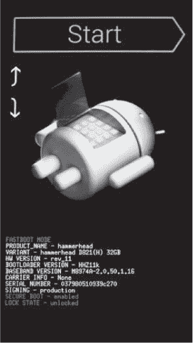
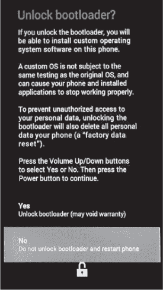
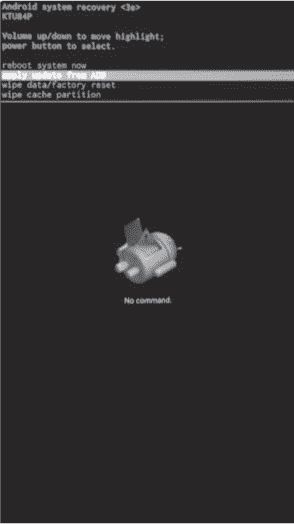
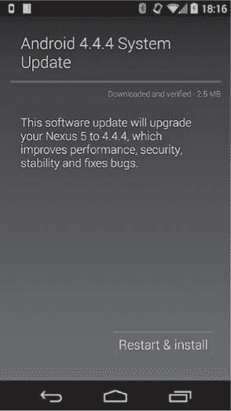
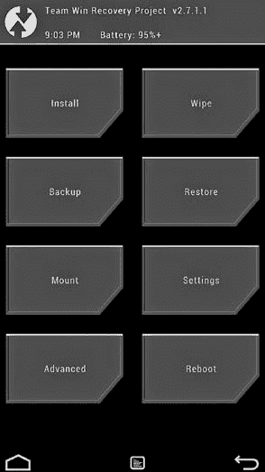
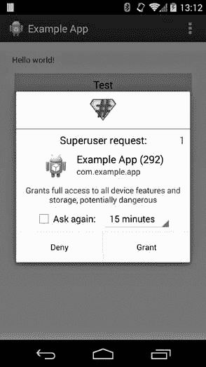
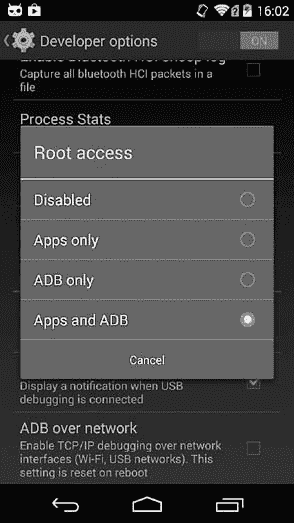

# 第十三章 系统更新与 Root 权限

在前面的章节中，我们介绍了 Android 的安全模型，并讨论了将 SELinux 集成到 Android 中是如何加强这一安全模型的。在本章中，我们稍微转变方向，介绍了一些可以绕过 Android 安全模型的方法。

为了执行完整的操作系统更新或将设备恢复到出厂状态，必须突破安全沙盒并获得设备的完全访问权限，因为即使是最特权的 Android 组件也没有完全访问所有系统分区和存储设备的权限。此外，尽管在运行时拥有完整的管理员（root）权限显然违背了 Android 的安全设计，但使用 root 权限执行操作对于实现 Android 不提供的功能是有用的，例如添加自定义防火墙规则或进行完整（包括系统分区）的设备备份。事实上，定制的 Android 版本（通常被称为 *ROMs*）以及允许用户通过 root 权限扩展或替代操作系统功能的应用程序（通常被称为 *root 应用*）的广泛可用性，正是 Android 成功的原因之一。

在本章中，我们探讨了 Android 引导加载程序和恢复操作系统的设计，并展示了它们如何用于替换设备的系统软件。接着，我们展示了如何在工程版构建中实现 root 权限，以及如何修改 Android 生产版构建以允许通过安装 “superuser” 应用程序执行具有超级用户权限的代码。最后，我们讨论了定制的 Android 发行版如何实现和控制 root 权限。

# 引导加载程序

*引导加载程序*是一个在设备通电时执行的低级程序。它的主要目的是初始化硬件并找到并启动主操作系统。

正如在第十章中简要讨论的那样，Android 引导加载程序通常是锁定的，只允许启动或安装已由设备制造商签名的操作系统镜像。这是建立受验证启动路径的重要步骤，因为它确保设备上只能安装受信任的、未修改的系统软件。然而，尽管大多数用户并不关心修改设备的核心操作系统，安装第三方 Android 版本仍然是一个有效的用户选择，并且可能是运行已停止接收操作系统更新的设备上最新版本 Android 的唯一方法。这就是为什么大多数新设备提供解锁引导加载程序并安装第三方 Android 版本的方式。

### 注意

*虽然 Android 的引导加载程序通常是封闭源代码的，但大多数基于 Qualcomm SoC 的 ARM 设备的引导加载程序是源自 Little Kernel (LK) 引导加载程序，*^([137]) *该引导加载程序是开源的。*^([138])

在接下来的章节中，我们将探讨如何与 Android 引导加载程序进行交互，以及如何在 Nexus 设备上解锁引导加载程序。然后，我们会描述通过引导加载程序更新设备时使用的 fastboot 协议。

## 解锁引导加载程序

Nexus 设备的引导加载程序通过在设备处于 fastboot 模式时发出 `oem unlock` 命令来解锁（将在下一节讨论）。因此，为了解锁设备，必须首先通过发出 `adb reboot bootloader` 命令（如果设备已允许 ADB 访问）或通过在设备启动时按下特定的按键组合进入 fastboot 模式。例如，在关闭电源的 Nexus 5 上同时按住音量下、音量上和电源按钮，会中断正常的启动过程，并显示图 13-1 中的 fastboot 屏幕。

引导加载程序具有一个简单的用户界面，可以通过音量上下和电源按钮进行操作。它允许用户继续启动过程、在 fastboot 或恢复模式下重新启动设备，并关闭设备电源。

通过 USB 电缆将设备连接到主机计算机可以使用 `fastboot` 命令行工具（Android SDK 的一部分）向设备发送额外的命令。发出 `fastboot oem unlock` 命令会显示确认屏幕，如图 13-2 所示。



图 13-1. Nexus 5 引导加载程序屏幕



图 13-2. Nexus 5 引导加载程序解锁屏幕

确认屏幕警告解锁引导加载程序将允许安装未经测试的第三方操作系统构建，并清除所有用户数据。由于第三方操作系统构建可能不遵循 Android 的安全模型，并可能允许对数据的无限制访问，因此清除所有用户数据是一个重要的安全措施；它确保在引导加载程序解锁后无法提取现有的用户数据。

通过发出 `fastboot oem lock` 命令可以重新锁定引导加载程序。重新锁定引导加载程序将其恢复到原始状态，并且不再能够加载或启动第三方操作系统镜像。然而，除了锁定/解锁标志之外，一些引导加载程序还会保持一个额外的“篡改”标志，该标志会在引导加载程序首次解锁时被设置。这个标志可以让引导加载程序检测它是否曾经被锁定，并在它处于锁定状态时拒绝某些操作或显示警告。

## Fastboot 模式

虽然 `fastboot` 命令和协议可用于解锁引导加载程序，但它们的初衷是简化通过向引导加载程序发送分区镜像来清除或覆盖设备分区，之后这些镜像会写入指定的块设备。当将 Android 移植到新设备（称为“设备启动”）或使用设备制造商提供的分区镜像将设备恢复到出厂状态时，这特别有用。

### Android 分区布局

Android 设备通常有多个分区，fastboot 通过名称（而不是对应的 Linux 设备文件）来引用这些分区。可以通过列出 *by-name/* 目录中的文件来获取分区及其名称，该目录对应设备的 SoC，位于 */dev/block/platform/* 下。例如，由于 Nexus 5 基于高通 SoC，其中包含移动台基带处理器（MSM），因此对应的目录名为 *msm_sdcc.1/*，如 示例 13-1 中所示（省略时间戳）。

示例 13-1. Nexus 5 的分区列表

```
# ls -l /dev/block/platform/msm_sdcc.1/by-name
lrwxrwxrwx root     root              DDR -> /dev/block/mmcblk0p24
lrwxrwxrwx root     root              aboot -> /dev/block/mmcblk0p6➊
lrwxrwxrwx root     root              abootb -> /dev/block/mmcblk0p11
lrwxrwxrwx root     root              boot -> /dev/block/mmcblk0p19➋
lrwxrwxrwx root     root              cache -> /dev/block/mmcblk0p27➌
lrwxrwxrwx root     root              crypto -> /dev/block/mmcblk0p26
lrwxrwxrwx root     root              fsc -> /dev/block/mmcblk0p22
lrwxrwxrwx root     root              fsg -> /dev/block/mmcblk0p21
lrwxrwxrwx root     root              grow -> /dev/block/mmcblk0p29
lrwxrwxrwx root     root              imgdata -> /dev/block/mmcblk0p17
lrwxrwxrwx root     root              laf -> /dev/block/mmcblk0p18
lrwxrwxrwx root     root              metadata -> /dev/block/mmcblk0p14
lrwxrwxrwx root     root              misc -> /dev/block/mmcblk0p15➍
lrwxrwxrwx root     root              modem -> /dev/block/mmcblk0p1➎
lrwxrwxrwx root     root              modemst1 -> /dev/block/mmcblk0p12
lrwxrwxrwx root     root              modemst2 -> /dev/block/mmcblk0p13
lrwxrwxrwx root     root              pad -> /dev/block/mmcblk0p7
lrwxrwxrwx root     root              persist -> /dev/block/mmcblk0p16
lrwxrwxrwx root     root              recovery -> /dev/block/mmcblk0p20➏
lrwxrwxrwx root     root              rpm -> /dev/block/mmcblk0p3
lrwxrwxrwx root     root              rpmb -> /dev/block/mmcblk0p10
lrwxrwxrwx root     root              sbl1 -> /dev/block/mmcblk0p2➐
lrwxrwxrwx root     root              sbl1b -> /dev/block/mmcblk0p8
lrwxrwxrwx root     root              sdi -> /dev/block/mmcblk0p5
lrwxrwxrwx root     root              ssd -> /dev/block/mmcblk0p23
lrwxrwxrwx root     root              system -> /dev/block/mmcblk0p25➑
lrwxrwxrwx root     root              tz -> /dev/block/mmcblk0p4
lrwxrwxrwx root     root              tzb -> /dev/block/mmcblk0p9
lrwxrwxrwx root     root              userdata -> /dev/block/mmcblk0p28➒
```

如你所见，Nexus 5 有 29 个分区，其中大多数存储设备特定的专有数据，如 *aboot* ➊ 中的 Android 引导加载程序，*modem* ➎ 中的基带软件，以及 *sbl1* ➐ 中的第二阶段引导加载程序。Android 操作系统托管在 *boot* ➋ 分区中，存储内核和 *rootfs* RAM 磁盘镜像，*system* 分区 ➑ 存储所有其他系统文件。用户文件存储在 *userdata* 分区 ➒ 中，临时文件，如下载的 OTA 镜像和恢复操作系统命令及日志，存储在 *cache* 分区 ➌ 中。最后，恢复操作系统镜像存储在 *recovery* 分区 ➏ 中。

### Fastboot 协议

fastboot 协议通过 USB 工作，并由主机驱动。也就是说，通信是由主机发起的，主机使用 USB 批量传输将基于文本的命令和数据发送到引导加载程序。USB 客户端（引导加载程序）会响应一个状态字符串，如 *OKAY* 或 *FAIL*；一个以 *INFO* 开头的信息消息；或 *DATA*，表示引导加载程序准备好接收来自主机的数据。当所有数据接收完毕后，引导加载程序会通过 *OKAY*、*FAIL* 或 *INFO* 消息响应，描述命令的最终状态。

### Fastboot 命令

`fastboot` 命令行工具实现了 fastboot 协议，允许你获取支持 fastboot 的已连接设备列表（使用 `devices` 命令），获取引导加载程序的信息（使用 `getvar` 命令），以各种模式重启设备（使用 `continue`、`reboot`、`reboot-bootloader`），并 `erase` 或 `format` 分区。

`fastboot`命令支持多种将磁盘镜像写入分区的方式。使用`flash` *`partition image-filename`*命令可以闪存单个命名分区，而使用`update` *`ZIP-filename`*命令可以一次性闪存 ZIP 文件中的多个分区镜像。

`flashall`命令会自动将其工作目录中的*boot.img*、*system.img*和*recovery.img*文件的内容分别闪存到设备的*boot*、*system*和*recovery*分区。最后，`flash:raw boot` *`kernel ramdisk`*命令会根据指定的内核和 RAM 磁盘自动创建一个启动镜像并将其闪存到*boot*分区。除了闪存分区镜像外，`fastboot`还可以在使用`boot` *`boot-image`*或`boot` *`kernel ramdisk`*命令时，启动一个镜像而无需将其写入设备。

修改设备分区的命令，如各种`flash`变体命令，以及启动自定义内核的命令，如`boot`命令，在启动加载程序被锁定时是不允许的。

示例 13-2 显示了一个`fastboot`会话的示例。

示例 13-2. 示例 `fastboot` 会话

```
**$ fastboot devices➊**
004fcac161ca52c5 fastboot
**$ fastboot getvar version-bootloader➋**
version-bootloader: MAKOZ10o
finished. total time: 0.001s
**$ fastboot getvar version-baseband➌**
version-baseband: M9615A-CEFWMAZM-2.0.1700.98
finished. total time: 0.001s
**$ fastboot boot custom-recovery.img➍**
downloading 'boot.img'...
OKAY [ 0.577s]
booting...
FAILED (remote: not supported in locked device)
finished. total time: 0.579s
```

在这里，第一个命令➊列出了连接到主机的设备的序列号，这些设备当前处于 fastboot 模式。命令➋和➌分别获取启动加载程序和基带版本字符串。最后，命令➍尝试启动一个自定义恢复镜像，但由于启动加载程序当前被锁定，操作失败。

# 恢复

*恢复操作系统*—也称为*恢复控制台*或简单的*恢复*—是一个最小化操作系统，用于执行不能直接从 Android 执行的任务，如恢复出厂设置（擦除*userdata*分区）或应用 OTA 更新。

与启动加载程序的 fastboot 模式类似，恢复操作系统可以通过在设备启动时按下特定的按键组合，或通过使用`adb reboot recovery`命令通过 ADB 启动。一些启动加载程序还提供一个菜单界面（见图 13-1），可以用来启动恢复。在接下来的部分，我们将介绍 Nexus 设备随附的“原生”Android 恢复以及包含在 AOSP 中的恢复系统，然后介绍自定义恢复，这些恢复提供了更丰富的功能，但需要解锁启动加载程序才能安装或启动。

## 存储恢复

Android 的原生恢复实现了满足*Android 兼容性定义文档（CDD）*中“可更新软件”部分所需的最小功能，该部分要求“设备实现必须包括一个机制来替换整个系统软件……”并且“所使用的更新机制必须支持在不擦除用户数据的情况下进行更新。”^([139])

也就是说，CDD（兼容性定义文档）并没有指定应使用哪种具体的更新机制，因此可能有不同的系统更新方法，而默认恢复模式实现了 OTA 更新和连接更新两种方式。对于 OTA 更新，主操作系统下载更新文件，然后指示恢复模式应用该更新。对于连接更新，用户在 PC 上下载更新包，并使用`adb sideload` *`otafile.zip`*命令将其推送到恢复模式。两种方法的实际更新过程是相同的；只有获取 OTA 包的方法不同。

默认恢复模式具有简单的菜单界面（如图 13-3 所示），通过设备的硬件按钮操作，通常是电源按钮和音量上下按钮。然而，菜单默认是隐藏的，需要通过按下特定的按键组合来激活。在 Nexus 设备上，通常通过同时按住电源和音量下按钮几秒钟即可显示恢复菜单。

系统恢复菜单有四个选项：*重启*、*通过 ADB 应用更新*、*恢复出厂设置*和*清除缓存分区*。***通过 ADB 应用更新***选项会在设备上启动 ADB 服务器，并启用连接更新（侧加载）模式。然而，如你所见，并没有应用 OTA 更新的选项，因为一旦用户选择从主操作系统应用 OTA 更新（见图 13-4），系统会自动应用更新，无需进一步的用户操作。Android 通过向恢复模式发送控制命令来实现这一点，这些命令会在恢复模式启动时自动执行。（我们将在下一节讨论用于控制恢复模式的机制。）



图 13-3. 默认恢复菜单



图 13-4. 从主操作系统应用系统更新

### 控制恢复模式

主操作系统通过`android.os.RecoverySystem` API 控制恢复模式，该 API 通过将每个选项字符串写入*/cache/recovery/command*文件中的新行，与恢复模式通信。*command*文件的内容会被`recovery`二进制文件（位于恢复操作系统的*/sbin/recovery*）读取，该文件会在恢复模式启动时从*init.rc*自动启动。选项会修改`recovery`二进制文件的行为，导致其擦除指定分区、应用 OTA 更新或仅仅重启。表 13-1 显示了默认`recovery`二进制文件支持的选项。

表 13-1. 默认恢复二进制的选项

| 恢复选项 | 描述 |
| --- | --- |
| `--send_intent=<string>` | 完成后将指定的意图动作保存并传回主操作系统 |
| `--update_package=<OTA 包路径>` | 验证并安装指定的 OTA 包 |
| `--wipe_data` | 擦除*用户数据*和*缓存*分区，然后重启 |
| `--wipe_cache` | 擦除*缓存*分区，然后重启 |
| `--show_text` | 显示的消息 |
| `--just_exit` | 退出并重启 |
| `--locale` | 恢复消息和 UI 使用的语言环境 |
| `--stages` | 设置恢复过程的当前阶段 |

为了确保指定的命令始终完成，`recovery`二进制文件将其参数复制到引导加载程序控制块（BCB），该控制块位于*misc*分区（➍处在示例 13-1 中）。BCB 用于将恢复过程的当前状态传递给引导加载程序。BCB 的格式在`bootloader_message`结构中定义，详见示例 13-3。

示例 13-3. BCB 格式结构定义

```
struct bootloader_message {
    char command[32];➊
    char status[32];➋
    char recovery[768];➌
    char stage[32];➍
    char reserved[224];➎
};
```

如果设备在恢复过程中重启或断电，下次启动时，引导加载程序会检查 BCB，如果 BCB 包含*boot-recovery*命令，则会重新启动恢复过程。如果恢复过程成功完成，`recovery`二进制文件会在退出前清除 BCB（将所有字节设置为零），并且在下次重启时，引导加载程序会启动主 Android 操作系统。

在示例 13-3 中，➊处的命令是发送给引导加载程序的命令（通常是*boot-recovery*）；➋是引导加载程序在执行平台特定操作后写入的状态文件；➌包含`recovery`二进制文件的选项（如`--update_package`、`--wipe-data`等）；➍是描述 OTA 包安装阶段的字符串，若安装需要多次重启，则例如*2/3*表示安装需要三次重启。最后的字段➎是保留字段，目前未使用。

### 安装 OTA 包

除了由主操作系统下载外，OTA 包还可以直接从主机 PC 传递给恢复模式。为了启用这种更新模式，用户必须首先从恢复菜单中选择*从 ADB 应用更新*选项。这将启动一个简化版本的标准 ADB 守护进程，仅支持`adb sideload`命令。在主机上执行`adb sideload` *`OTA-package-file`*将 OTA 文件传输到设备上的*/tmp/update.zip*并进行安装（参见“应用更新”）。

### OTA 签名验证

正如我们在 第三章 中所学，OTA 包是经过代码签名的，签名覆盖整个文件（与 JAR 和 APK 文件不同，后者为归档中的每个文件都包含单独的签名）。当从主 Android 操作系统启动 OTA 过程时，首先使用 `RecoverySystem` 类的 `verifyPackage()` 方法验证 OTA 包（ZIP 文件）。该方法接收 OTA 包的路径和一个包含允许签署 OTA 更新的 X.509 证书列表的 ZIP 文件作为参数。如果 OTA 包是使用与 ZIP 文件中任何证书对应的私钥签署的，则该 OTA 被视为有效，并且系统会重启进入恢复模式以应用该更新。如果未指定证书 ZIP 文件，则使用系统默认值 */system/etc/security/otacerts.zip*。

恢复程序验证它将应用的 OTA 包，而无需依赖主操作系统，以确保在启动恢复之前 OTA 包没有被替换。验证通过一组内置在恢复映像中的公钥来执行。在构建恢复时，这些密钥从指定的 OTA 签名证书集中提取，使用 `DumpPublicKey` 工具转换为 mincrypt 格式，并写入到 */res/keys* 文件中。当使用 RSA 作为签名算法时，这些密钥是 mincrypt 的 `RSAPublicKey` 结构，序列化为 C 字面量（如同在 C 源文件中出现的形式），可选择性地前面加上版本标识符，该标识符指定在签署 OTA 包时使用的哈希以及 RSA 密钥的公共指数。*keys* 文件可能如下所示：示例 13-4。

示例 13-4. 恢复操作系统中 /res/keys 文件的内容

```
{64,0xc926ad21,{1795090719,...,3599964420},{3437017481,...,1175080310}},➊
v2 {64,0x8d5069fb,{393856717,...,2415439245},{197742251,...,1715989778}},➋
--*snip*--
```

这里，第一行 ➊ 是一个序列化的版本 1 密钥（如果未指定版本标识符，则隐式使用该版本），该密钥具有公共指数 *e=3*，可以用于验证使用 SHA-1 创建的签名；第二行 ➋ 包含一个版本 2 密钥，具有公共指数 *e=65537*，也用于 SHA-1 签名。当前支持的签名算法有 2048 位 RSA 配合 SHA-1（密钥版本 1 和 2）或 SHA-256（密钥版本 3 和 4），以及 ECDSA 配合 SHA-256（密钥版本 5，AOSP 的 master 分支可用）和使用 NIST P-256 曲线的 256 位 EC 密钥。

### 启动系统更新过程

如果 OTA 包的签名验证通过，恢复程序通过执行 OTA 文件中包含的更新命令来应用系统更新。更新命令保存在恢复映像的 *META-INF/com/google/android/* 目录下，文件名为 `update-binary` ➊，如 示例 13-5 中所示。

示例 13-5. 系统更新 OTA 包的内容

```
.
|-- META-INF/
|   |-- CERT.RSA
|   |-- CERT.SF
|   |-- com/
|   |   |-- android/
|   |   |   |-- metadata
|   |   |   `-- otacert
|   |   `-- google/
|   |       `-- android/
|   |           |-- update-binary➊
|   |           `-- updater-script➋
|   `-- MANIFEST.MF
|-- patch/
|   |-- boot.img.p
|   `-- system/
|-- radio.img.p
|-- recovery/
|   |-- etc/
|   | `-- install-recovery.sh
|   `-- recovery-from-boot.p
`-- system/
    |-- etc/
    |   |-- permissions/
    |   |   `-- com.google.android.ble.xml
    |   `-- security/
    |       `-- cacerts/
    |-- framework/
    `-- lib/
```

恢复过程从 OTA 文件中提取`update-binary`到*/tmp/update_binary*并启动它，传递三个参数：恢复 API 版本（截至本文写作时为版本 3）；`update-binary`用于与恢复进程通信的管道文件描述符；以及 OTA 包的路径。然后，*update-binary*进程提取更新脚本，该脚本作为*META-INF/com/google/android/updater-script* ➋包含在 OTA 包中，并执行它。更新脚本使用一种名为*edify*的专用脚本语言编写（自 1.6 版本起；以前的版本使用旧的变种，称为*amend*）。edify 语言支持简单的控制结构，如`if`和`else`，并且可以通过函数扩展，这些函数也可以充当控制结构（通过决定评估哪些参数）。更新脚本包含一系列函数调用，触发应用更新所需的操作。

### 应用更新

edify 实现定义并注册了用于复制、删除和修补文件；格式化和挂载卷；设置文件权限和 SELinux 标签等操作的各种函数。表 13-2 展示了最常用的 edify 函数的摘要。

表 13-2. 重要 edify 函数摘要

| 函数名称 | 描述 |
| --- | --- |
| `abort` | 以错误信息中止安装过程。 |
| `apply_patch` | 安全地应用二进制补丁。在替换原始文件之前，确保补丁文件具有预期的哈希值。也可以修补磁盘分区。 |
| `apply_patch_check` | 检查文件是否具有指定的哈希值。 |
| `assert` | 检查条件是否为真。 |
| `delete/delete_recursive` | 删除文件/目录中的所有文件。 |
| `file_getprop` | 从指定的属性文件中获取系统属性。 |
| `format` | 使用指定的文件系统格式化一个卷。 |
| `getprop` | 获取系统属性。 |
| `mount` | 将一个卷挂载到指定路径。 |
| `package_extract_dir` | 将指定的 ZIP 目录提取到文件系统的路径。 |
| `package_extract_file` | 将指定的 ZIP 文件提取到文件系统的路径，或将其作为二进制数据返回。 |
| `run_program` | 在子进程中执行指定程序，并等待其完成。 |
| `set_metadata/set_metadata_recursive` | 设置文件/目录中所有文件的所有者、组、权限位、文件功能和 SELinux 标签。 |
| `show_progress` | 向父进程报告进度。 |
| `symlink` | 创建指向目标的符号链接，首先删除现有的符号链接文件。 |
| `ui_print` | 向父进程发送一条消息。 |
| `umount` | 卸载一个已挂载的卷。 |
| `write_raw_image` | 将原始镜像写入指定的磁盘分区。 |

示例 13-6 展示了一个典型的系统更新 edify 脚本的（简略）内容。

示例 13-6。完整系统更新 OTA 包中的 updater-script 内容

```
mount("ext4", "EMMC", "/dev/block/platform/msm_sdcc.1/by-name/system", "/system");
file_getprop("/system/build.prop", "ro.build.fingerprint") == "google/...:user/release-keys" ||
    file_getprop("/system/build.prop", "ro.build.fingerprint") == "google/...:user/release-keys" ||
    abort("Package expects build fingerprint of google/...:user/release-keys; this device has " +
    getprop("ro.build.fingerprint") + ".");
getprop("ro.product.device") == "hammerhead" ||
    abort("This package is for \"hammerhead\" devices; this is a \"" +
    getprop("ro.product.device") + "\".");➊
--*snip*--
apply_patch_check("/system/app/BasicDreams.apk", "f687...", "fdc5...") ||
    abort("\"/system/app/BasicDreams.apk\" has unexpected contents.");➋
set_progress(0.000063);
--*snip*--
apply_patch_check("EMMC:/dev/block/platform/msm_sdcc.1/by-name/boot:8835072:21...:8908800:a3...")
|| abort("\"EMMC:/dev/block/...\" has unexpected contents.");➌
--*snip*--
ui_print("Removing unneeded files...");
delete("/system/etc/permissions/com.google.android.ble.xml",
       --*snip*--
       "/system/recovery.img");➍
ui_print("Patching system files...");
apply_patch("/system/app/BasicDreams.apk", "-",
            f69d..., 32445,
            fdc5..., package_extract_file("patch/system/app/BasicDreams.apk.p"));➎
--*snip*--
ui_print("Patching boot image...");
apply_patch("EMMC:/dev/block/platform/msm_sdcc.1/by-name/boot:8835072:2109...:8908800:a3bd...",
            "-", a3bd..., 8908800,
            2109..., package_extract_file("patch/boot.img.p"));➏
--*snip*--
delete("/system/recovery-from-boot.p",
       "/system/etc/install-recovery.sh");
ui_print("Unpacking new recovery...");
package_extract_dir("recovery", "/system");➐
ui_print("Symlinks and permissions...");
set_metadata_recursive("/system", "uid", 0, "gid", 0, "dmode", 0755, "fmode", 0644,
                       "capabilities", 0x0, "selabel", "u:object_r:system_file:s0");➑
--*snip*--
ui_print("Patching radio...");
apply_patch("EMMC:/dev/block/platform/msm_sdcc.1/by-name/modem:43058688:7493...:46499328:52a...",
            "-", 52a5..., 46499328,
            7493..., package_extract_file("radio.img.p"));➒
--*snip*--
unmount("/system");➓
```

### 复制和修补文件

updater 脚本首先挂载 *system* 分区，然后检查设备型号及其当前构建是否符合预期 ➊。此检查是必需的，因为试图在不兼容的构建上安装系统更新可能会导致设备无法使用。（这通常被称为“软砖”，因为通常可以通过重新刷写所有分区并使用有效的构建恢复；而“硬砖”是无法恢复的。）

因为 OTA 更新通常不包含完整的系统文件，而只是对每个已更改文件的前一版本进行二进制补丁（使用 `bsdiff` 生成），^([140]) 所以只有在每个待修补的文件与生成相应补丁时所使用的文件一致的情况下，更新才能成功。为确保这一点，updater 脚本使用 `apply_patch_check` 函数 ➋ 检查每个待修补文件的哈希值是否符合预期。

除了系统文件外，更新过程还会修补不包含文件系统的分区，如 *boot* 和 *modem* 分区。为了确保修补这些分区能成功，updater 脚本还会检查目标分区的内容，如果它们不处于预期状态则会中止 ➌。验证完所有系统文件和分区后，updater 脚本会删除不必要的文件，以及那些将完全替换而不是修补的文件 ➍。接着，脚本会修补所有系统文件 ➎ 和分区 ➏。然后，它会删除任何先前的恢复补丁，并将新的恢复环境解包到 */system/* ➐。

### 设置文件所有权、权限和安全标签

下一步是使用 `set_metadata_recursive` 函数 ➑ 设置所有创建或修补的文件和目录的用户、所有者、权限以及文件能力。从版本 4.3 开始，Android 支持 SELinux（见 第十二章），因此所有文件必须正确标记，以便访问规则生效。这就是为什么 `set_metadata_recursive` 函数被扩展以设置文件和目录的 SELinux 安全标签（➑ 中的最后一个参数，*u:object_r:system_file:s0*）。

### 完成更新

接下来，updater 脚本修补设备的基带软件 ➒，基带软件通常存储在 *modem* 分区。脚本的最后一步是卸载系统分区 ➓。

在*update-binary*进程退出后，如果使用了`–wipe_cache`选项启动恢复操作系统，恢复会擦除缓存分区，并将执行日志复制到*/cache/recovery/*，以便从主操作系统访问。最后，如果没有报告错误，恢复操作系统会清除 BCB 并重启到主操作系统。

如果更新过程由于错误中止，恢复操作系统会向用户报告此错误，并提示用户重启设备以重新尝试。由于 BCB 未被清除，设备会自动以恢复模式重启，并从头开始更新过程。

### 更新恢复操作系统

如果你详细查看示例 13-6 中的整个更新脚本，你会注意到，尽管它会修补*boot* ➏和*modem* ➒分区，并为*recovery*分区 ➐（用于恢复操作系统）解压补丁，但它并不会应用解压后的补丁。这是设计使然。因为更新过程可能随时被中断，因此更新过程需要在设备下次开机时从相同的状态重新开始。例如，如果在写入*recovery*分区时电源中断，更新恢复操作系统会改变初始状态，可能会导致系统处于不可用的状态。因此，恢复操作系统仅在主操作系统更新完成且主操作系统成功启动后才会进行更新。

更新由 Android 的*init.rc*文件中的*flash_recovery*服务触发，如示例 13-7 所示。

示例 13-7. flash_recovery *服务在* init.rc 中的定义

```
--*snip*--
service flash_recovery /system/etc/install-recovery.sh➊
    class main
    oneshot
--*snip*--
```

如你所见，这个服务仅仅是启动*/system/etc/install-recovery.sh* shell 脚本 ➊。如果恢复需要更新，OTA 更新脚本会将这个 shell 脚本及恢复分区的补丁文件（见示例 13-6 中的➐）复制到设备中。*install-recovery.sh*的内容可能如示例 13-8 所示。

示例 13-8. install-recovery.sh 的内容

```
#!/system/bin/sh
if ! applypatch -c EMMC:/dev/block/platform/msm_sdcc.1/by-name/recovery:9506816:3e90...; then➊
  log -t recovery "Installing new recovery image"
  applypatch -b /system/etc/recovery-resource.dat \
      EMMC:/dev/block/platform/msm_sdcc.1/by-name/boot:8908800:a3bd... \
      EMMC:/dev/block/platform/msm_sdcc.1/by-name/recovery \
      3e90... 9506816 a3bd...:/system/recovery-from-boot.p➋
else
  log -t recovery "Recovery image already installed"➌
fi
```

脚本使用`applypatch`命令通过检查*recovery*分区的哈希值来判断恢复操作系统是否需要打补丁 ➊。如果设备的*recovery*分区的哈希值与创建补丁时所用版本的哈希值匹配，脚本将应用补丁 ➋。如果恢复分区已经更新或哈希值未知，脚本将记录一条消息并退出 ➌。

## 自定义恢复

自定义恢复是由第三方（而非设备制造商）创建的恢复操作系统版本。由于它是由第三方创建的，因此自定义恢复没有使用制造商的密钥签名，因此设备的引导加载程序需要解锁才能启动或刷入它。

自定义恢复可以通过`fastboot boot` *`custom-recovery.img`* 命令在不安装到设备上的情况下启动，或者可以使用`fastboot flash recovery` *`custom-recovery.img`* 命令永久刷入设备。

自定义恢复提供了通常在官方恢复中不可用的高级功能，如完整分区备份与恢复、具有完整设备管理工具集的根权限 shell、支持挂载外部 USB 设备等。自定义恢复还可以禁用 OTA 包签名检查，这允许安装第三方操作系统或进行修改，如框架或主题定制。

有多种自定义恢复可供选择，但截至目前，功能最全且维护最积极的是 Team Win Recovery Project (TWRP)。^([141]) 它基于 AOSP 官方恢复，且也是一个开源项目。^([142]) TWRP 拥有一个可定制的触摸屏界面，非常类似于原生 Android UI。它支持加密分区备份、从 USB 设备安装系统更新、从外部设备备份与恢复，并且内置文件管理器。TWRP 版本 2.7 的启动屏幕见于 图 13-5。



图 13-5. TWRP 恢复启动屏幕

与 AOSP 官方恢复类似，自定义恢复也可以从主操作系统中控制。除了通过 */cache/recovery/ 命令* 文件传递参数外，自定义恢复通常允许从主操作系统触发其某些（或所有）扩展功能。例如，TWRP 支持一种简洁的脚本语言，用于描述在启动恢复时应执行的恢复操作。这允许 Android 应用通过便捷的 GUI 界面排队执行恢复命令。例如，请求压缩备份 *boot*、*userdata* 和 *system* 分区时，会生成 示例 13-9 中所示的脚本。

示例 13-9. TWRP 备份脚本示例

```
#**cat /cache/recovery/openrecoveryscript**
backup DSBOM 2014-12-14--01-54-59
```

### 警告

*永久刷入一个可以忽略 OTA 包签名的自定义恢复可能会导致在设备有短暂物理接触的情况下，设备的系统软件被替换并且被植入后门。因此，不建议在您日常使用的设备上刷入自定义恢复，特别是那些存储个人或敏感信息的设备。*

# 根权限访问

Android 的安全模型应用了最小权限原则，并通过将每个进程作为一个独立的用户来努力将系统和应用进程彼此隔离。然而，Android 也基于 Linux 内核，后者实现了标准的 Unix 风格的 DAC（除非启用了 SELinux；请参见 第十二章）。

这种 DAC 安全模型的最大缺点之一是，某个系统用户，通常称为 *root*（UID=0），也被称为 *超级用户*，被授予对系统的绝对控制权限。Root 可以读取、写入并更改任何文件或目录的权限位；杀死任何进程；挂载和卸载卷；等等。尽管这种不受限制的权限对于管理传统的 Linux 系统是必要的，但在 Android 设备上拥有超级用户权限，意味着可以有效绕过 Android 的沙盒，并读取或写入任何应用程序的私密文件。

Root 权限还允许通过修改本应为只读的分区、更改系统配置、随意启动或停止系统服务、以及删除或禁用核心系统应用程序。这可能会对设备的稳定性产生不利影响，甚至导致设备无法使用，这也是为什么生产设备通常不允许 root 权限的原因。

此外，Android 尝试限制以 root 权限执行的系统进程数量，因为任何此类进程中的编程错误都可能导致权限提升攻击，进而使第三方应用程序获得 root 权限。通过在强制模式下部署 SELinux，进程受到全局安全策略的限制，因此，即使破解了 root 进程，也不一定能获得对设备的无限制访问权限，但仍可能访问敏感数据或修改系统行为。此外，即使进程受到 SELinux 限制，也有可能通过利用内核漏洞绕过安全策略，或以其他方式获得无限制的 root 权限。

话虽如此，root 权限对于在开发设备上调试或逆向工程应用程序来说是非常方便的。此外，虽然允许第三方应用程序获得 root 权限会破坏 Android 的安全模型，但它也允许进行一些通常在生产设备上无法执行的系统定制。

由于 Android 的一个最大卖点一直是其易于定制性，用户对通过修改核心操作系统（也称为 *modding*）获得更大灵活性的需求一直很高，尤其是在 Android 的早期。除了定制系统外，获得 Android 设备的 root 权限还可以实现一些在不修改框架和添加系统服务的情况下无法实现的应用程序，例如防火墙、完整设备备份、网络共享等。

在接下来的章节中，我们将描述在开发（工程版）Android 构建和自定义 Android 构建（ROM）中如何实现 root 访问，以及如何将其添加到生产构建中。然后，我们展示需要超级用户访问（通常称为*root 应用*）的应用如何请求并使用 root 权限，以便作为 root 用户执行进程。

## 工程版构建中的 Root 访问

Android 的构建系统可以为特定设备生成多个构建变体，这些变体在包含的应用程序和工具的数量以及几个修改系统行为的关键系统属性值上有所不同。我们将在接下来的章节中展示，这些构建变体中的一些允许通过 Android shell 获得 root 访问权限。

### 以 Root 身份启动 ADB

商业设备使用*用户*构建变体（当前构建变体的值设置为*ro.build.type*系统属性的值），该变体不包含诊断和开发工具，默认禁用 ADB 守护进程，禁止调试未在其清单中明确将`debuggable`属性设置为`true`的应用，并且不允许通过 shell 访问 root。*userdebug*构建变体与*用户*变体非常相似，但它还包括一些额外的模块（带有*debug*模块标签的模块），允许调试所有应用，并默认启用 ADB。

工程版（或*eng*版）构建包括大多数可用模块，默认允许调试，默认启用 ADB，并将*ro.secure*系统属性设置为 0，这会改变设备上运行的 ADB 守护进程的行为。当设置为 1（安全模式）时，*adbd*进程最初作为 root 用户运行，除`CAP_SETUID`和`CAP_SETGID`（这些是实现`run-as`工具所必需的）外，丢弃其能力边界集中的所有权限。然后，它添加了几个附加的 GID，用于访问网络接口、外部存储和系统日志，最后将其 UID 和 GID 更改为`AID_SHELL`（UID=2000）。另一方面，当*ro.secure*设置为 0（工程版构建的默认值）时，*adbd*守护进程继续作为 root 用户运行，并拥有完整的能力边界集。示例 13-10 展示了*用户*构建中*adbd*进程的进程 ID 和权限。

示例 13-10：用户构建中的 adbd 进程细节

```
**$ getprop ro.build.type**
user
**$ getprop ro.secure**
1
**$ ps|grep adb**
shell     200   1      4588   220    ffffffff 00000000 S /sbin/adbd
**$ cat /proc/200/status**
Name: adbd
State:      S (sleeping)
Tgid: 200
Pid:  200
Ppid: 1
TracerPid: 0
Uid:  2000  2000 2000 2000➊
Gid:  2000  2000 2000 2000➋
FDSize:     32
Groups:     1003 1004 1007 1011 1015 1028 3001 3002 3003 3006➌
--*snip*--
CapInh:     0000000000000000
CapPrm:     0000000000000000
CapEff:     0000000000000000
CapBnd:     fffffff0000000c0➍
--*snip*--
```

如您所见，进程的 UID ➊和 GID ➋都被设置为 2000（`AID_SHELL`），并且*adbd*进程添加了若干附加的 GID ➌。最后，进程的能力边界集，决定了子进程可以使用哪些能力，被设置为 0x0000000c0（`CAP_SETUID|CAP_SETGID`） ➍。此能力设置保证了，在*用户*构建中，从 Android shell 启动的进程仅限于`CAP_SETUID`和`CAP_SETGID`权限，即使执行的二进制文件设置了 SUID 位，或其文件权限允许额外的特权。

相比之下，在 *eng* 或 *userdebug* 构建中，ADB 守护进程可以作为 root 执行，如 示例 13-11 中所示。

示例 13-11. 在 eng 版本构建中的 adbd 进程详情

```
# getprop ro.build.type
userdebug➊
# getprop ro.secure
1➋
# ps|grep adb
root      19979 1     4656   264   ffffffff 0001fd1c S /sbin/adbd
root@maguro:/ # cat /proc/19979/status
Name: adbd
State:      S (sleeping)
Tgid: 19979
Pid:  19979
Ppid: 1
TracerPid:  0
Uid:  0     0     0    0➌
Gid:  0     0     0    0➍
FDSize:     256
Groups:➎
--*snip*--
CapInh:     0000000000000000
CapPrm:     ffffffffffffffff➏
CapEff:     ffffffffffffffff➐
CapBnd:     ffffffffffffffff➑
--*snip*--
```

在这里，*adbd* 进程以 UID ➌ 和 GID ➍ 0（root）身份运行，没有附加的组 ➎，并且拥有完整的 Linux 能力集（➏、➐ 和 ➑）。然而，正如你在 ➋ 中所看到的，*ro.secure* 系统属性被设置为 1，这表明 *adbd* 不应该以 root 身份运行。

虽然在 *userdebug* 构建中 ADB 守护进程会丢失其 root 权限（如本示例 ➊ 所示），但它可以通过从主机发出 `adb root` 命令以不安全模式手动重启，如 示例 13-12 中所示。

示例 13-12. 在用户调试版构建中以 root 身份重启 adbd

```
$ **adb shell id**
uid=2000(shell) gid=2000(shell)➊ groups=1003(graphics),1004(input),1007
(log),1009(mount),1011(adb),1015(sdcard_rw),1028(sdcard_r),3001(net_bt_
admin),3002(net_bt),3003(inet),3006(net_bw_stats) context=u:r:shell:s0
$ **adb root**➋
restarting adbd as root $
**$ adb shell ps|grep adb**
root      2734  1     4644  216    ffffffff 0001fbec R /sbin/adbd➌
**$ adb shell id**
uid=0(root) gid=0(root) context=u:r:shell:s0➍
```

在这里，*adbd* 守护进程最初以 *shell*（UID=2000）身份运行，任何从主机启动的 shell 也具有 UID=2000 和 GID=2000 ➊。执行 `adb root` 命令 ➋（该命令内部将 *service.adb.root* 系统属性设置为 1）会将 ADB 守护进程重启为 root ➌，之后启动的任何 shell 的 UID 和 GID 都为 0 ➍。

### 注意

*由于此设备启用了 SELinux，即使 shell 的 UID 和 GID 改变，其安全上下文（安全标签）依然保持不变：* u:r:shell:s0 *在* ➊ *和* ➍ *中都相同*。因此，即使通过 ADB 获取了 root shell，所有从 shell 启动的进程仍然受限于分配给 *shell* 域的权限（除非通过 MAC 策略允许转换到其他域；有关详细信息，请参见 第十二章）。实际上，从 Android 4.4 开始，*shell* 域是没有限制的，因此当以 root 身份运行时，属于该域的进程几乎可以完全控制设备。

### 使用 su 命令

在 *userdebug* 构建中，也可以在不将 ADB 以 root 身份重启的情况下获得 root 访问权限。可以通过使用 `su`（即 *substitute user* 的简称，也称为 *switch user* 和 *superuser*）命令来实现，该命令以 SUID 位设置安装，从而允许调用进程获取一个 root shell 或以指定的 UID（包括 UID=0）执行命令。默认的 `su` 实现非常基础，只允许 *root* 和 *shell* 用户使用，如 示例 13-13 中所示。

示例 13-13. 用户调试版构建中 *`su` 的默认实现*

```
int main(int argc, char **argv)
{
    --*snip*--
    myuid = getuid();
    if (myuid != AID_ROOT && myuid != AID_SHELL) {➊
        fprintf(stderr,"su: uid %d not allowed to su\n", myuid);
        return 1;
    }

    if(argc < 2) {
        uid = gid = 0;➋

    } else {
       --*snip*--
    }
    if(setgid(gid) || setuid(uid)) {➌
        fprintf(stderr,"su: permission denied\n");
        return 1;
    }

    --*snip*--

    execlp("/system/bin/sh", "sh", NULL);➍

    fprintf(stderr, "su: exec failed\n");
    return 1;
}
```

主要功能首先检查调用的 UID 是否为 `AID_ROOT` (0) 或 `AID_SHELL` (2000) ➊，如果是由其他 UID 的用户调用，则退出。接着，它将进程的 UID 和 GID 设置为 0 (➋ 和 ➌)，最后启动 Android shell ➍。从这个 shell 执行的任何命令默认继承它的权限，从而允许对设备进行超级用户访问。

# 生产版本中的 Root 权限

正如我们在“工程版本中的 Root 权限”中所学到的，商业 Android 设备通常基于 *用户* 构建变种。这意味着 ADB 守护进程以 *shell* 用户身份运行，并且设备上没有安装 `su` 命令。

这是一个安全配置，大多数用户应能够使用平台提供的工具或第三方应用程序（如自定义启动器、键盘或 VPN 客户端）来实现设备配置和定制任务。然而，修改 Android 的外观、感觉或核心配置是不可行的，底层 Linux 操作系统的低级访问也无法实现。只有通过运行某些具有 root 权限的命令，才能执行这些操作，这就是为什么许多高级用户寻求在设备上启用 root 权限的原因。

在安卓设备上获得 root 权限通常被称为 *rooting*，对于那些拥有可解锁 bootloader 的设备来说，这个过程相对简单；而对于那些不允许解锁 bootloader 并采取额外措施防止修改系统分区的设备，则几乎不可能。在接下来的章节中，我们将描述典型的 root 过程，并介绍一些最受欢迎的“超级用户”应用程序，这些应用程序可以启用和管理 root 权限。

## 通过更改启动或系统镜像进行 Root

在一些 Android 设备上，给定一个解锁的 bootloader，通过简单地刷入新的启动镜像（通常称为 *kernel*，或 *custom kernel*），一个 *用户* 构建可以轻松转变为工程版或 *userdebug* 构建，从而改变 *ro.secure* 和 *ro.debuggable* 系统属性的值。修改这些属性使得 ADB 守护进程可以作为 root 执行，并通过 Android shell 启用 root 访问，正如在“工程版本中的 Root 权限”中所描述的那样。然而，大多数当前的 Android *用户* 构建在编译时禁用了这种行为（通过不定义 `ALLOW_ADBD_ROOT` 宏），并且 *ro.secure* 和 *ro.debuggable* 系统属性的值会被 *adbd* 守护进程忽略。

启用 root 权限的另一种方法是解包系统镜像，添加一个 SUID `su` 二进制文件或类似的工具，并用新的系统镜像覆盖 *system* 分区。这通常不仅允许从 shell 获取 root 权限，还允许第三方应用程序获取 root 权限。然而，Android 4.3^([143]) 及更高版本中的一些安全增强功能禁止应用程序执行 SUID 程序，通过从 Zygote 启动的进程的边界集合中删除所有能力，并将 *system* 分区挂载为 `nosetuid` 标志。

此外，在将 SELinux 设置为强制模式的 Android 版本上，执行具有 root 权限的进程通常不会改变其安全上下文，该进程仍然会受到 MAC 策略的限制。因此，在最新的 Android 版本上启用 root 权限可能不像改变一些系统属性或将 SUID 二进制文件复制到设备那么简单。当然，替换 *boot* 或 *system* 镜像可以禁用 SELinux 并恢复任何安全缓解措施，从而放宽设备的安全级别并启用 root 权限。然而，这种激进的方法不亚于替换整个操作系统，并且可能会阻止设备从设备制造商处接收系统更新。在大多数情况下，这是不可取的，因此已经开发了几种尝试与设备的原生操作系统共存的 root 方法。

## 通过闪存 OTA 包进行 Root

OTA 包可以添加或修改系统文件，而无需替换整个操作系统镜像，因此是向设备添加 root 权限的良好候选方法。大多数流行的超级用户应用程序以 OTA 包和配套的管理应用程序的组合形式分发，OTA 包只需安装一次，管理应用程序可以在线更新。

### SuperSU

我们将使用 SuperSU OTA 包 ^([144]) 和应用程序 ^([145])（由 Jorrit “Chainfire” Jongma 开发）来演示这种方法是如何工作的。SuperSU 是目前最流行的超级用户应用程序，并且在积极维护中，与 Android 平台的最新修改保持同步。SuperSU OTA 包的结构类似于完整的系统更新包，但只包含少量文件，如 示例 13-14 所示。

示例 13-14。SuperSU OTA 包的内容

```
.
|-- arm/➊
|   |-- chattr
|   |-- chattr.pie
|   `-- su
|-- common/
|   |-- 99SuperSUDaemon➋
|   |-- install-recovery.sh➌
|   `-- Superuser.apk➍
|-- META-INF/
|   |-- CERT.RSA
|   |-- CERT.SF
|   |-- com/
|   |   `-- google/
|   |       `-- android/
|   |           |-- update-binary➎
|   |           `-- updater-script➏
|   `-- MANIFEST.MF
`-- x86/➐
    |-- chattr
    |-- chattr.pie
    `-- su
```

该包包含一些为 ARM ➊ 和 x86 ➐ 平台编译的原生二进制文件，启动和安装 SuperSU 守护进程的脚本（➋ 和 ➌），管理 GUI 应用程序的 APK 文件 ➍，以及两个更新脚本（➎ 和 ➏），用于应用 OTA 包。

为了理解 SuperSU 如何启用 root 权限，我们需要首先检查它的安装过程。为此，让我们分析 `update-binary` 脚本 ➎ 的内容，见 示例 13-15。（SuperSU 使用常规的 shell 脚本而不是本地二进制文件，因此 `updater-script` 只是一个占位符。）

示例 13-15. SuperSU OTA 安装脚本

```
#!/sbin/sh
--*snip*--
ui_print "- Mounting /system, /data and rootfs"➊
mount /system
mount /data
mount -o rw,remount /system
--*snip*--
mount -o rw,remount /
--*snip*--
ui_print "- Extracting files"➋
cd /tmp
mkdir supersu
cd supersu
unzip -o "$ZIP"
--*snip*--
ui_print "- Placing files"
mkdir /system/bin/.ext
cp $BIN/su /system/xbin/daemonsu➌
cp $BIN/su /system/xbin/su
--*snip*--
cp $COM/Superuser.apk /system/app/Superuser.apk➍
cp $COM/install-recovery.sh /system/etc/install-recovery.sh➎
cp $COM/99SuperSUDaemon /system/etc/init.d/99SuperSUDaemon
echo 1 > /system/etc/.installed_su_daemon
--*snip*--
ui_print "- Setting permissions"
set_perm 0 0 0777 /system/bin/.ext➏
set_perm 0 0 $SUMOD /system/bin/.ext/.su
set_perm 0 0 $SUMOD /system/xbin/su
--*snip*--
set_perm 0 0 0755 /system/xbin/daemonsu
--*snip*--
ch_con /system/bin/.ext/.su➐
ch_con /system/xbin/su
--*snip*--
ch_con /system/xbin/daemonsu
--*snip*--
ui_print "- Post-installation script"
/system/xbin/su --install➑

ui_print "- Unmounting /system and /data"➒
umount /system
umount /data

ui_print "- Done !"
exit 0
```

更新脚本首先以读写模式挂载 *rootfs* 文件系统以及 *system* 和 *userdata* 分区 ➊，然后它提取 ➋ 并将包含的文件复制到文件系统中的预定位置。`su` 和 `daemonsu` 本地二进制文件 ➌ 被复制到 */system/xbin/*，这是额外本地二进制文件的常见位置（这些文件对于运行 Android 操作系统不是必需的）。根访问管理应用被复制到 */system/app/* ➍ 并在设备重启时由包管理器自动安装。接下来，更新脚本将 *install-recovery.sh* 脚本复制到 */system/etc/* ➎。

### 注意

*如在“更新恢复模式”中讨论的那样，这个脚本通常用于从主操作系统更新恢复镜像，因此你可能会疑惑为什么 SuperSU 安装脚本会尝试更新设备的恢复镜像。SuperSU 使用这个脚本在启动时启动其某些组件，我们稍后会讨论。*

OTA 包安装过程的下一步是设置已安装二进制文件的权限 ➏ 和 SELinux 安全标签 ➐（`ch_con` 是一个调用 `chcon` SELinux 工具并设置 *u:object_r:system_file:s0* 标签的 shell 函数）。最后，脚本调用 `su` 命令并使用 `--install` 选项 ➑ 执行一些安装后的初始化，然后卸载 */system* 和 */data* ➒。当脚本成功退出时，恢复模式会重新启动设备并进入主 Android 操作系统。

### SuperSU 初始化方式

为了理解 SuperSU 是如何初始化的，让我们查看 *install-recovery.sh* 脚本的内容（见 示例 13-16，省略了注释），该脚本在启动时由 `init` 自动执行。

示例 13-16. SuperSU 的 install-recovery.sh *脚本* 内容

```
#!/system/bin/sh
/system/xbin/daemonsu --auto-daemon &➊

/system/etc/install-recovery-2.sh➋
```

脚本首先执行`daemonsu`二进制文件➊，它启动一个具有 root 权限的守护进程。接下来的步骤执行*install-recovery-2.sh*脚本➋，该脚本可能用于执行其他初始化，以便其他 root 应用程序使用。为了允许应用程序以 root 权限执行代码，在 Android 4.3 及更高版本中，必须使用守护进程，因为所有应用程序（从*zygote*派生）其能力边界被设置为零，这防止它们执行特权操作，即使它们设法以 root 身份启动进程。此外，从 Android 4.4 开始，SELinux 处于强制模式，因此任何由应用程序启动的进程都会继承其安全上下文（通常是*untrusted_app*），因此受到与应用程序本身相同的 MAC 限制。

SuperSU 通过让应用程序使用`su`二进制文件以 root 身份执行命令来绕过这些安全限制，命令通过 Unix 域套接字传输给*daemonsu*守护进程，后者最终在*u:r:init:s0* SELinux 上下文中以 root 身份执行接收到的命令。相关进程如示例 13-17 所示。

示例 13-17。当应用程序通过 SuperSU 请求 root 权限时启动的进程

```
$ **ps -Z**
LABEL                   USER    PID    PPID   NAME
u:r:init:s0             root    1      0      /init➊
--*snip*--
u:r:zygote:s0           root    187    1      zygote➋
--*snip*--
u:r:init:s0             root    209    1      daemonsu:mount:master➌
u:r:init:s0             root    210    209    daemonsu:master➍
--*snip*--
u:r:init:s0             root    3969   210    daemonsu:10292➎
--*snip*--
u:r:untrusted_app:s0    u0_a292 13637  187    com.example.app➏
u:r:untrusted_app:s0    u0_a209 15256  187    eu.chainfire.supersu➐
--*snip*--
u:r:untrusted_app:s0    u0_a292 16831  13637  su➑
u:r:init:s0             root    16835  3969   /system/bin/sleep➒
```

在这里，`com.example.app`应用程序➏（其父进程是*zygote*➋）通过将命令传递给`su`二进制文件并使用其`-c`选项请求 root 权限。如你所见，`su`进程➑以与请求应用相同的用户（*u0_a292*，UID=10292）和相同的 SELinux 域（*untrusted_app*）执行。然而，应用请求以 root 身份执行的命令的进程➒（在此示例中为`sleep`）确实在*init* SELinux 域中以 root 身份执行（安全上下文*u:r:init:s0*）。如果我们追踪其父 PID（PPID，在第四列），会发现*sleep*进程是由*daemonsu:10292*进程➎启动的，这是专为我们的示例应用程序（UID=10292）创建的*daemonsu*实例。*daemonsu:10292*进程➎从*daemonsu:master*实例➍继承其*init* SELinux 域，该实例又由第一个*daemonsu*实例➌启动。这个实例是通过*install-recovery.sh*脚本启动的（参见示例 13-16），并且在其父进程*init*（PID=1）的域内运行。

*eu.chainfire.supersu*进程➐属于 SuperSU 管理应用程序，该程序显示图 13-6 中显示的 root 访问授权对话框。



图 13-6. SuperSU root 访问请求授权对话框

超级用户访问权限可以只授予一次、一定时间内，或永久授予。SuperSU 保留一个内部白名单，列出已获得 root 访问权限的应用程序，如果请求的应用程序已经在白名单中，则不会显示授权对话框。

### 注意

*SuperSU 有一个配套库，* libsuperuser,^([146]) *它通过提供 Java 封装器来简化编写 root 应用程序的过程，适配不同的调用 `su` 二进制文件的模式。SuperSU 的作者还提供了一个全面的编写 root 应用程序的指南，名为* How-To SU.^([147])

### 自定义 ROM 上的 root 访问

提供 root 访问权限的自定义 ROM 不需要通过 *install-recovery.sh* 来启动其超级用户守护进程（相当于 SuperSU 的 *daemonsu*），因为它们可以随意定制启动过程。例如，流行的 CyanogenMod 开源 Android 发行版从 *init.superuser.rc* 启动其 *su* 守护进程，如示例 13-18 所示。

示例 13-18. CyanogenMod 中 su *守护进程的启动脚本*

```
service su_daemon /system/xbin/su --daemon➊
    oneshot

on property:persist.sys.root_access=0➋
    stop su_daemon

on property:persist.sys.root_access=2➌
    stop su_daemon

on property:persist.sys.root_access=1➍
    start su_daemon

on property:persist.sys.root_access=3➎
    start su_daemon
```

这个 *init* 脚本定义了 *su_daemon* 服务 ➊，可以通过更改 *persist.sys.root_access* 持久系统属性的值来启动或停止（➋ 到 ➎）。该属性的值还决定了是否仅授予应用程序、ADB shell 或两者 root 访问权限。默认情况下，root 访问被禁用，可以通过 CyanogenMod 的开发选项进行配置，如图 13-7 所示。

### 警告

*尽管 SuperSU 和允许 root 访问的自定义 ROM 采取一定措施来规范哪些应用程序可以作为 root 执行命令（通常通过将它们添加到白名单中），但是实现缺陷可能会允许应用程序绕过这些措施并在没有用户确认的情况下获得 root 访问权限。因此，root 访问应在日常使用的设备上禁用，仅在开发或调试时需要时使用。*



图 13-7. CyanogenMod 根访问选项

## 通过漏洞获取 Root 访问

在无法解锁引导程序的生产设备上，可以通过利用特权提升漏洞来获得 root 权限，该漏洞允许应用程序或 shell 进程启动一个 root shell（也称为 *软 root*），并修改系统。这些漏洞通常打包成“单击式”应用程序或脚本，试图通过安装 `su` 二进制文件或修改系统配置来保持 root 权限。例如，所谓的 towelroot 漏洞（它以 Android 应用程序的形式分发）利用 Linux 内核中的一个漏洞（CVE-2014-3153）获得 root 权限，并安装 SuperSU 以保持 root 权限。（Root 权限也可以通过覆盖 *recovery* 分区并安装自定义恢复镜像来持久化，从而允许安装任意软件，包括超级用户应用程序。然而，一些设备有额外的保护机制，防止修改 *boot*、*system* 和 *recovery* 分区，因此永久获得 root 权限可能不可行。）

### 注意

*详见《Android 黑客手册》 (Wiley, 2014) 的第三章，该章详细描述了用于在不同 Android 版本中获取 root 权限的主要特权提升漏洞。第十二章介绍了 Android 中为防止特权提升攻击而实施的主要漏洞缓解技术，并总体上增强了系统的安全性。*

# 总结

为了能够更新系统软件或将设备恢复到出厂状态，Android 设备通过引导程序（bootloader）允许对其存储进行不受限制的低级访问。引导程序通常实现一个管理协议，通常是 fastboot，允许从主机传输和刷写分区映像。生产设备上的引导程序通常是锁定的，只允许刷写签名的映像。然而，大多数引导程序可以解锁，从而允许刷写第三方的映像。

Android 使用一个专用分区来存储第二个最小化的操作系统，称为恢复模式（recovery），用于应用 OTA 更新包或清除设备上的所有数据。与引导程序类似，生产设备上的恢复模式通常只允许应用设备制造商签名的 OTA 更新包。如果引导程序已解锁，则可以启动或永久安装自定义恢复模式，这种模式允许安装由第三方签名的更新，或完全放弃签名验证。

Android 的工程或调试版允许通过 Android shell 获取 root 权限，但生产设备上通常会禁用 root 权限。在这些设备上，可以通过安装包含“superuser”守护进程和配套应用程序的第三方 OTA 包来启用 root 权限，从而控制对应用程序的 root 访问。第三方 Android 构建（ROM）通常开箱即用允许 root 权限，尽管也可以通过系统设置界面禁用。

* * *

^([137]) Code Aurora Forum, “基于(L)ittle (K)ernel 的 Android 引导加载程序，” *[`www.codeaurora.org/blogs/little-kernel-based-android-bootloader/`](https://www.codeaurora.org/blogs/little-kernel-based-android-bootloader/)*

^([138]) Code Aurora Forum, *[`www.codeaurora.org/cgit/quic/la/kernel/lk/`](https://www.codeaurora.org/cgit/quic/la/kernel/lk/)*

^([139]) Google, *Android 兼容性定义*，* [`static.googleusercontent.com/media/source.android.com/en//compatibility/android-cdd.pdf`](https://static.googleusercontent.com/media/source.android.com/en//compatibility/android-cdd.pdf)*

^([140]) Colin Percival, “二进制差异/补丁工具，” *[`www.daemonology.net/bsdiff/`](http://www.daemonology.net/bsdiff/)*

^([141]) TeamWin, “TWRP 2.7,” *[`teamw.in/project/twrp2/`](http://teamw.in/project/twrp2/)*

^([142]) TeamWin, “Team Win Recovery Project (TWRP),” *[`github.com/TeamWin/Team-Win-Recovery-Project/`](https://github.com/TeamWin/Team-Win-Recovery-Project/)*

^([143]) Google, “Android 4.3 中的安全增强功能，” *[`source.android.com/devices/tech/security/enhancements43.html`](http://source.android.com/devices/tech/security/enhancements43.html)*

^([144]) Jorrit “Chainfire” Jongma, “CF-Root 下载页面，” *[`download.chainfire.eu/supersu/`](http://download.chainfire.eu/supersu/)*

^([145]) Jorrit “Chainfire” Jongma, “Google Play 应用：SuperSU，” *[`play.google.com/store/apps/details?id=eu.chainfire.supersu&hl=en`](https://play.google.com/store/apps/details?id=eu.chainfire.supersu&hl=en)*

^([146]) Jorrit “Chainfire” Jongma, libsuperuser， *[`github.com/Chainfire/libsuperuser/`](https://github.com/Chainfire/libsuperuser/)*

^([147]) Jorrit “Chainfire” Jongma, “无问题的 su 使用指南，” *[`su.chainfire.eu/`](http://su.chainfire.eu/)*
