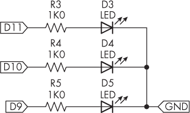
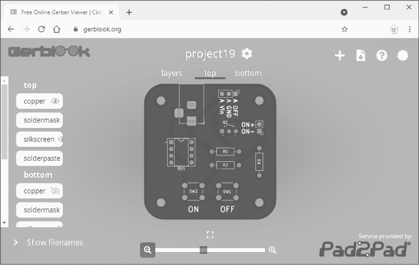
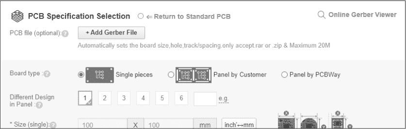
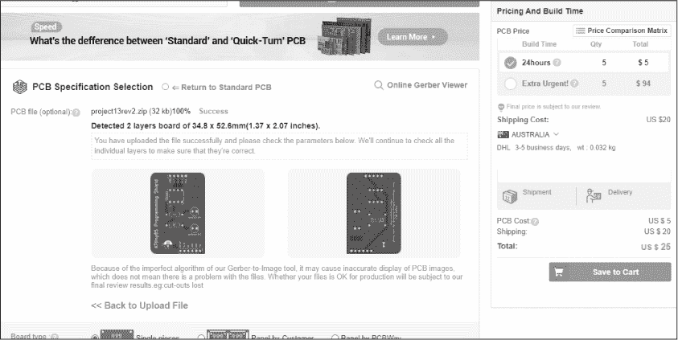
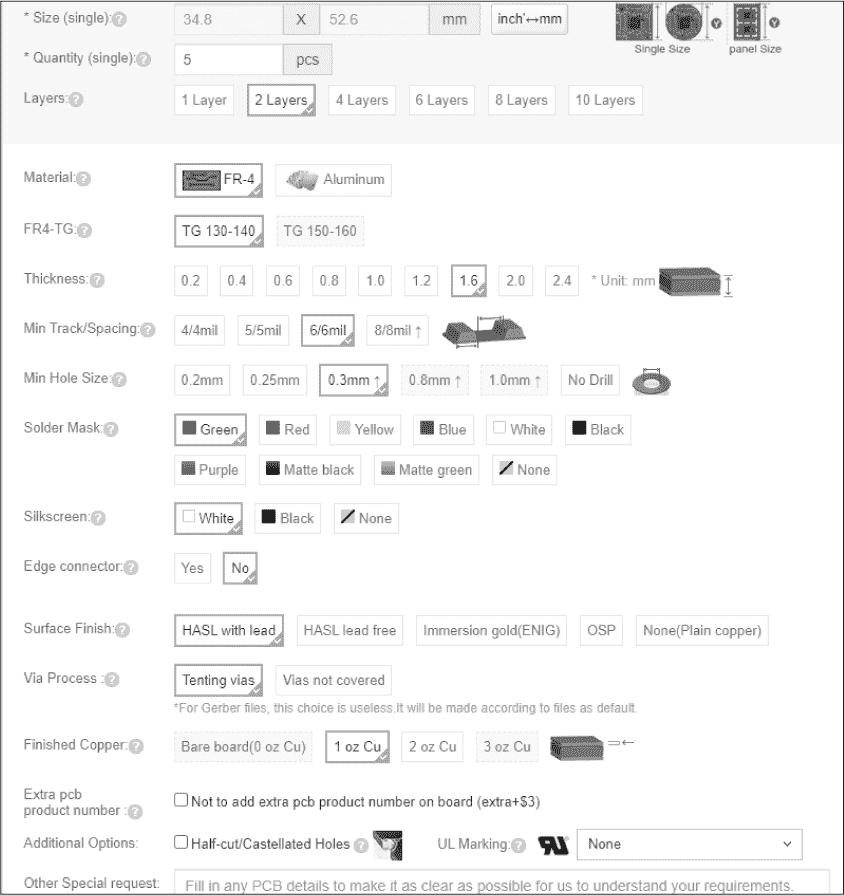
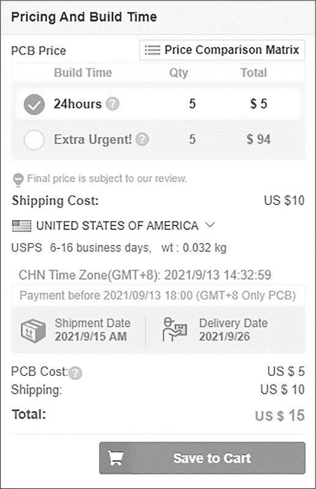
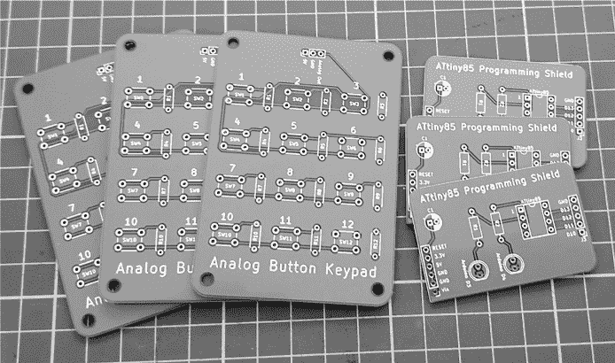

# 前言

我写这本书是为了那些了解 Arduino 微控制器环境基础知识但渴望学习更多的人。也许你已经完成了我的第一本为初学者编写的 Arduino 书《Arduino 工作坊》中的项目，或者读过其他的入门书籍。你知道如何使用数据总线，控制小型电机，处理各种传感器的数据，做很多其他事情。但是，还有更多知识等待你去学习，你已经准备好挑战更复杂的项目了。

在本书中，你将继续进入基于 Arduino 的学习和娱乐世界。每一章都包含关于你可能听说过但还未尝试的高级技巧和工具的详细教程，并附有构建 70 个复杂而实用项目的说明。我选择这些主题是基于我在帮助他人创造有趣、实用和创新的 Arduino 电路和产品时，发现的最有价值的技能。

## 本书适合谁阅读？

本书适合那些具备中级 Arduino 经验并准备扩展技能的人。你可能已经完成了 Arduino 入门套件中的示例，或阅读过一本关于 Arduino 项目构建的基础书籍，或者参加过一门使用 Arduino 的基础计算机工程大学课程。

你可能希望将本书作为参考，构建自己的项目创意，或者你可能只是想学习一系列新的技能。如果你有兴趣提高功率效率、使用常见数据总线与旧设备进行接口、将项目数据记录到在线或离线存储、通过互联网控制项目等，那么这本书就是为你而写的。

为了让尽可能多的人能够完成本书，我最大程度地减少了构建每个项目的成本。你可以轻松地从各种在线零售商处购买所需的所有零件。

## 你可以期待学到什么？

在本书的每一章中，我都会介绍一组新的概念或工具，并教你如何将它们应用于总共 70 个有趣且富有教育意义的项目。我希望这些内容能够激发你的创造性想象力，并成为你未来工作的参考。

一般来说，你不需要按顺序阅读，每一章的项目可以在完成前一章后再进行，也可以选择任何你觉得有趣或有用的章节。第十九章及其后续章节介绍了联网项目，因此最好按顺序阅读这些章节，但这并不是强制要求。当某一章节依赖于前一章节的内容时，我会提供必要的参考，你可以回头查看，学习所需的技能。一旦开始阅读某一章节，请从头到尾读完。

以下列表简要描述了每一章的内容。

**第一章：通过一个模拟输入读取多个按钮状态**    解释了如何通过一个模拟到数字输入引脚读取多个按钮的状态。当你没有足够的输入引脚时，这种方法可以用来创建带有多个按钮的用户输入。

**第二章：端口操作**    解释了如何使用 Arduino 的数字输出引脚进行端口操作。这样可以减少控制多个输出所需的代码，并且允许你同时控制多个数字输出。

**第三章：使用 ATtiny 微控制器**    演示了如何在 Arduino 环境中使用更小、更便宜的 ATtiny 微控制器。如果你的项目不需要整个 Arduino 板，使用 ATtiny 可以节省成本。

**第四章：构建看门狗定时器**    演示了如何构建和使用看门狗定时器——一个小型外部电路，可以在硬件或软件故障导致项目停止工作时重新启动你的项目，通过重置来解决问题。

**第五章：使用查理复用控制 LED**    介绍了查理复用的概念，一种用更少的数字输出引脚控制多个 LED 的高效方法。

**第六章：添加专业电源控制**    展示了如何构建一个外部电路，用于为你的 Arduino 项目提供软开关和软关机电源控制。你可以利用这个功能使 Arduino 在任务完成时自动关闭。

**第七章：控制交流电主电源插座**    讲解了一种通过使用无线遥控插座和一些简单焊接的方法来安全地控制交流电插座。

**第八章：控制高功率设备**    演示了如何控制高电流移位寄存器 IC，从而让你的项目能够控制比常见移位寄存器 IC 更高的电流。最终项目是一个由超亮 LED 显示屏组成的巨大时钟。

**第九章：构建数字音乐播放器和音效板**    介绍了廉价的 MP3 播放器模块，并展示了如何为 Arduino 项目添加音频功能，用于通知和娱乐。

**第十章：使用相同地址的多个 I²C 设备**    演示了如何使用外部控制器 IC 来控制多个共享相同总线地址的 I²C 总线设备。

**第十一章：使用 Leonardo 模拟 USB 鼠标和键盘**    展示了如何使用 Arduino Leonardo 或兼容板来模拟 USB 鼠标或键盘，实现直接向 PC 软件记录数据或进行有趣的创意项目。

**第十二章：向 USB 闪存驱动器传输数据**    介绍了如何使用廉价模块直接将数据保存到或从 USB 闪存驱动器读取。

**第十三章：与 PS/2 键盘接口**    展示了如何将 Arduino 与 PS/2 风格的 PC 键盘接口，使你能够直接将数据输入到 Arduino 中，并为用户界面提供另一种选择。

**第十四章：通过蓝牙控制 Arduino**    演示了如何使用廉价的蓝牙接口模块与 Arduino 配合使用，并构建一个 Android 应用来远程控制 Arduino 项目。

**第十五章：便携式项目的能效**    展示了如何将 Arduino 置于各种低功耗和休眠模式，以便在使用电池电源时获得更长的自主性。

**第十六章：通过 CAN 总线监控汽车电子**    教你如何将机动车 CAN 数据总线与 Arduino 接口，以便查询车辆的发动机管理系统，获取汽车的速度、转速等信息。

**第十七章：Arduino 与 RS232 通信**    演示了如何通过流行的 RS232 数据总线将 Arduino 与另一个 Arduino 或其他设备接口。

**第十八章：Arduino 与 RS485 通信**    演示了如何使用 RS485 数据总线与 RS485 兼容设备接口，或在更长的有线距离上传输 Arduino 与 Arduino 之间的通信。

**第十九章：ESP32 微控制器平台与物联网**    剩余章节使用带有 Wi-Fi 功能的 ESP32 Arduino 兼容板，通过 Wi-Fi 接入点连接到互联网。在第十九章中，你将使用 ESP32 板构建基于 Web 的远程控制系统，用于控制你的项目。

**第二十章：通过 Telegram 进行远程控制**    展示了如何使用 Telegram 社交媒体应用在移动设备上，几乎在全球任何地方远程控制和与 Arduino 项目进行交互。

**第二十一章：从互联网时间服务器获取当前时间**    教你如何使用 Wi-Fi 从互联网上的网络时间服务器获取准确的时间和日期。

**第二十二章：捕获并将数据记录到 Google 表格**    展示了如何将从 ESP32 Arduino 兼容板捕获的数据直接记录到 Google 表格中进行分析和分发。

**第二十三章：构建迷你 Web 服务器**    解释了如何构建你自己的网页，展示由 ESP32 Arduino 兼容板捕获并分析的数据。

**第二十四章：ESP32 摄像头板**    展示了如何使用和控制带有数字摄像头的 ESP32 Arduino 兼容板，用于视频流传输或根据请求控制数字摄像头。

最后，如果你需要提醒，可以参考附录，学习如何使用 ZIP 文件安装方法创建并安装 Arduino 库。

## 我期望你知道的内容

由于这是一本中级教程书籍，我预计你已经知道如何制作一系列 Arduino 项目，从简单的到较为复杂的。你还应该熟悉编写自己的 Arduino 程序并将其上传到开发板。

你应该能够理解电路图，以便构建每个项目所需的电路。在描述与 Arduino 或兼容板的连接时，电路图不会显示整个电路板，而是使用标签来表示应连接到的 Arduino 引脚。例如，考虑图 1 中的电路图。

图 1：一个示例电路图

Arduino 的 D11 引脚连接到 R3，Arduino 的 D10 引脚连接到 R4，Arduino 的 D9 引脚连接到 R5，LED 的负极连接到 GND，而 GND 连接到 Arduino 的 GND 引脚。贯穿本书使用电路图也会提高你阅读复杂电路的能力。

最后，准备好为你的工作站采取适当的安全措施。对于本书中的项目，你将使用基本的手工具、电池供电的电气设备、锋利的刀具、剪刀、烙铁等。像任何爱好或手工艺一样，确保自己和周围人的安全是你的责任。

警告

*在你的项目中，绝对不要直接接触市电电流。这应该交给持证的电工来处理，他们经过专业培训。接触市电电流可能会致命。*

如果你需要帮助，或者对本书内容有任何反馈或建议，请通过出版商的官网 [*https://<wbr>nostarch<wbr>.com<wbr>/contactus*](https://nostarch.com/contactus) 与我联系。

## 所需材料

完成本书中的项目，你需要最新版本的 Arduino IDE 软件以及各种硬件部件和配件，包括一些印刷电路板。

### Arduino IDE 和 Sketch 文件

如果你还没有这样做，下载并安装最新版的 Arduino IDE 软件。你可以在 [*https://<wbr>www<wbr>.arduino<wbr>.cc<wbr>/en<wbr>/software*](https://www.arduino.cc/en/software) 找到适用于 Windows 10 及更新版本、macOS 10.14 64 位及更新版本和 Linux（如 Ubuntu）的版本。IDE 自 2005 年以来一直在不断改进，目前版本为 2.*x*（具体数字可能会变化，但本书中的说明仍然适用）。如果你仍在使用旧版 IDE，建议更新到最新版本。

接下来，访问本书的官方网站 [*https://<wbr>nostarch<wbr>.com<wbr>/arduino<wbr>-arduinians*](https://nostarch.com/arduino-arduinians) 下载每个示例和项目的 Arduino 草图文件，以及使用的零件清单、某些项目中板子的 PCB 设计文件和必要的勘误表。我会稍后解释如何订购 PCB 文件。

### 零件和配件

与其他电子设备一样，Arduino 可以通过许多零售商购买，他们提供各种产品和配件。在购买微控制器时，请选择原装 Arduino 或质量较高的衍生产品——否则你可能会收到故障或性能差的商品。为什么冒着购买劣质板子、最终可能让你付出更高代价的风险呢？要查看正品 Arduino 供应商的列表，请访问 [*http://<wbr>arduino<wbr>.cc<wbr>/en<wbr>/Main<wbr>/Buy<wbr>.*](http://arduino.cc/en/Main/Buy)

所有项目所需的零件都在各自的章节中列出。我推荐以下这些供应商（按字母顺序排列），用于购买与 Arduino 相关的零件和配件：

**Altronics (澳大利亚)** [*https://<wbr>altronics<wbr>.com<wbr>.au*](https://altronics.com.au)

**Arduino 商店 美国** [*https://<wbr>store<wbr>-usa<wbr>.arduino<wbr>.cc*](https://store-usa.arduino.cc)

**Newark/element14** [*https://<wbr>element14<wbr>.com*](https://element14.com)

**PMD Way** [*https://<wbr>pmdway<wbr>.com*](https://pmdway.com)

**RS 组件** [*https://<wbr>www<wbr>.rs<wbr>-components<wbr>.com*](https://www.rs-components.com)

**SparkFun 电子产品** [*https://<wbr>sparkfun<wbr>.com*](https://sparkfun.com)

本书中所有项目所需的零件都是常见且容易从列出的各个零售商以及其他你可能已经熟悉的商家处获得的。但别急着去购物。花些时间阅读几章，了解你需要哪些东西，这样你就不会浪费钱购买不必要的东西。

### 项目 PCB

本书中的所有项目都可以使用一个或多个无焊面包板进行组装，这可能还需要对其他设备进行一些外部焊接。例如，在第七章中，你将用无焊面包板搭建无线交流电插座遥控器的接口电路。然而，对于某些项目，如第五章中的 30 个 LED 矩阵显示器，订购印刷电路板（PCB）将使你的项目更加可靠，且更易于构建。这也能为你的努力提供一个更持久的实例。

下载并解压从 No Starch 网站获取的本书文件后，你会发现一组 ZIP 文件，每个文件都带有一个项目编号。每个项目的 ZIP 文件包含一组名为 Gerber 的文件，PCB 制造商使用这些文件来控制机器，塑造并钻孔空白 PCB，形成所需的配置。

你可以通过使用如 [*https://<wbr>www<wbr>.gerblook<wbr>.org*](https://www.gerblook.org) 等 Gerber 查看器工具查看 PCB。只需上传你的 Gerber ZIP 文件，工具应该会显示 PCB 的正面和背面以及其他感兴趣的层，如 图 2 所示。

图 2：使用在线 Gerber 查看器显示第 19 项项目的 PCB

让我们一起了解一下订购 PCB 的过程。你不必一次性订购所有书中的 PCB，但请注意，生产周期可能需要两到三周。

首先，访问你首选的 PCB 制造商。我发现以下公司比较可靠（按字母顺序排列）：

**JLCPCB** [*https://<wbr>jlcpcb<wbr>.com*](https://jlcpcb.com)

**OSH Park** [*https://<wbr>oshpark<wbr>.com*](https://oshpark.com)

**PCB Way** [*https://<wbr>pcbway<wbr>.com*](https://pcbway.com)

如果你想节省开支，可以选择 JLCPCB。我发现总部位于美国的 OSH Park 提供高质量的 PCB，而 PCB Way 则以合理的价格出售优质产品。这仅是一个简单的列表，是我多年来使用过并成功的三家公司。

你选择的制造商网站通常会在首页显示“立即报价”或“快速订购”按钮。点击该按钮后，应该会引导你到一个“添加 Gerber 文件”的按钮。例如，图 3 显示了 PCB Way 网站该页面的截图。

图 3：上传 Gerber 文件到 PCB 工厂

点击 **添加 Gerber 文件**，导航到你所需的 ZIP 文件，然后点击 **打开** 或 **确定** 上传 ZIP 文件到工厂网站。（上传前不需要解压单独的项目 ZIP 文件，因为制造商可以接受未修改的文件。）上传 ZIP 后，网站应显示你的 PCB 的正面和背面，并可能显示尺寸以及初步的价格估算，如 图 4 所示。通常，PCB 的费用可以从较小的项目约 10 美元到较大的项目约 40 美元不等。

图 4：上传 PCB ZIP 文件后显示的 PCB 价格和运费报价示例

一旦你看到你正在订购的 PCB 图像，向下滚动即可看到许多设计选项供你选择，如图 5 所示。

图 5：选择 PCB 选项

不用慌张——你只需要关注其中的一些选项。你可以根据需要更改以下内容：

**数量**    PCB 工厂通常有最低数量要求，通常是三块或五块电路板，但你可以根据需要订购任意数量的电路板。

**焊盘掩膜**    这是 PCB 双面保护涂层的颜色。通常，默认颜色是绿色，但你可以根据个人口味或需求更改颜色。

**丝网印刷**    这是印刷在焊盘掩膜上方的文本颜色，例如电路板的标签或标题。同样，你可以根据个人偏好更改此颜色。

**表面处理**    默认情况下，工厂通常使用铅基工艺，这已经是几十年的标准。如果你更倾向于无铅环境，或者你将电路板运送到要求无铅 PCB 的国家，你可以将表面处理更改为 HASL 无铅或浸金。

一旦你选择了选项或保留了默认设置，点击**下一步**或**计算**来查看最终价格。网站还应该提供多种配送选项，从便宜的邮寄到空运快递，正如图 6 所示。将你的 PCB 保存到购物车中，然后完成最后的支付和配送步骤。

图 6：最终 PCB 报价

你应该收到一套精细加工的 PCB，如图 7 所示。

图 7：用于各类项目的 PCB

这些电路板将成为可靠且耐用项目的基础。

## 继续

在本介绍中，你了解了本书的结构，在哪里获取零件，以及如何订购本书项目中使用的 PCB。你现在已经准备好继续你的 Arduino 之旅，创造一些你从未想到过的东西，从简单实用到相对复杂。你还将学习到新的方法，应用于你自己的设计，让原创项目栩栩如生。让我们开始吧！
