# 第二章：2 端口操作


本章介绍了*端口操作*，即同时访问你的 Arduino 数字输入和输出引脚的过程，以提高控制或读取它们状态的速度。这样可以减少*响应时间*，即完成数字读写所需的时间，从而提高草图的操作速度。端口操作还比常规的数字写入/读取函数使用更少的代码，减少了草图的大小，这在遇到 Arduino 内存限制时非常有用。

本章中，你将学习：

+   使用端口操作快速控制数字输出

+   控制七段 LED 显示器

+   同时读取多个数字输入引脚

+   读取二进制编码十进制（BCD）开关

在这个过程中，你将构建一个二进制数字显示器、一个发光二极管（LED）闪烁波形和一个单数字 LED 骰子。本章中的说明适用于 Arduino Uno 或兼容板、原始 Nano 或其他使用 ATmega328 系列微控制器的 Arduino 兼容设备。

## 端口、引脚和寄存器

*端口*是一个包含顺序排列 I/O 引脚的集合。每个端口都有一个*寄存器*（微控制器内的一段内存），写入该寄存器可以控制输出状态，或者如果引脚状态被设置为输入，则从该寄存器读取。你还需要使用另一个寄存器——数据方向寄存器（DDR）——来设置端口中的引脚为输入或输出。

图 2-1 显示了引脚及其所在的端口。端口 B 包含数字引脚 D13 到 D8，端口 C 包含模拟引脚 A5 到 A0，端口 D 包含数字引脚 D7 到 D0。

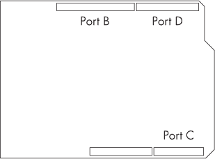

图 2-1：Arduino Uno 的端口

要将引脚设置为输入或输出，你不需要像通常那样在 void setup() 中使用 pinMode()。相反，使用以下简单语法：

```
DDR`x` = B`yyyyyyyy`
```

DDRx是数据方向寄存器，其中x是端口（B、C 或 D），每个y对应端口中的一个引脚（从最高到最低）。B表示yyyyyyyy是一个二进制数。例如，要将整个 D 端口设置为数字输出，你可以在void setup()中使用以下代码：

```
DDRD = B11111111; 
```

要将 D13、D12 和 D11 数字引脚设置为输入，将 D9、D8 和 D7 数字引脚设置为输出，请使用以下代码：

```
DDRB = B000111; // Port B has six pins in total 
```

你可以看到与多个或循环使用pinMode()相比，这样节省了多少草图空间。

除了简化代码和缩短响应时间，端口操作还可以在控制数字输出引脚时节省硬件成本。例如，过去你可能会使用移位寄存器 IC 来控制 LED 显示器，而端口操作可以让你使用备用的 I/O 引脚组来实现相同的功能。

让我们通过一些项目将这一理论付诸实践。

项目#4：提高数字输出引脚速度

在这个项目中，你将通过控制八个数字输出进行端口操作练习，使用 LED 显示输出状态。

你需要以下元件：

+   一块 Arduino Uno 或兼容板及 USB 电缆

+   八个 1 kΩ，0.25 W，1%电阻

+   八个 LED

+   一块无焊面包板

+   公对公跳线

为了减少本书中使用的元件类型数量，从而降低完成项目的成本，本项目使用了与前一章相同的 1 kΩ电阻，而不是通常使用的 560 Ω或类似的电阻。LED 的亮度依然足够。

按照图 2-2 所示，将电路组装在无焊面包板上，连接 D7 到 D0 以及 GND 标记的点到 Arduino 的相应引脚。

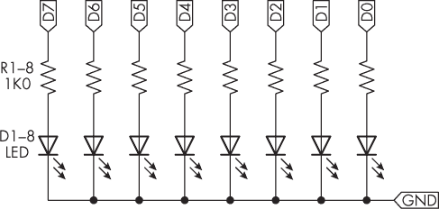

图 2-2：项目#4 的原理图

输入并上传以下草图到你的 Arduino：

```
// Project #4 - Fast digital outputs

void setup()
{
  ❶ DDRD = B11111111; // Set PORTD (digital 7 through 0) to outputs
}

void loop()
{
  ❷ PORTD = B11111111;
    delay(500);
  ❸ PORTD = B00000000;
    delay(500);
} 
```

上传完成后，所有 LED 应每半秒闪烁一次。D 端口上的引脚被设置为输出❶，并且先全部打开❷，然后再次关闭❸。这个简单的例子展示了实现大量数字引脚控制所需的极少代码。

请将本项目的硬件保管好，因为你将在项目#5 中再次使用它。

## 速度优势

Arduino 环境使用一个硬件抽象层，借助软件函数和类简化了控制 Arduino 板或兼容电路的硬件操作。此代码需要额外的处理时间，通常会导致草图执行速度变慢。端口操作可以绕过硬件抽象层，从而大大减少 CPU 执行相同任务所需的代码量。

为了观察端口操作如何加速 I/O 引脚的操作，本节将展示如何使用测试设备（如频率计或数字存储示波器（DSO））来测量数字引脚端口的开关频率。如果你有示波器或频率计，可以跟着一起操作。

首先，使用常规的 Arduino 草图函数测试引脚速度，使用清单 2-1 中的草图，并将数字引脚连接到示波器。

```
void setup()
{
    for (int a = 0; a < 8; a++)
    {
        pinMode(a, OUTPUT);
    }
}

void loop()
{
    for (int a = 0; a < 8; a++)
    {
        digitalWrite(a, HIGH);
    }
    for (int a = 0; a < 8; a++)
    {
        digitalWrite(a, LOW);
    }
} 
```

清单 2-1：一个引脚速度测试，依次打开和关闭数字引脚 D7 至 D0，并重复此操作

图 2-3 展示了此测量的结果：平均频率为 15.15 kHz，意味着将所有八个数字引脚开关一次的时间间隔约为 0.000066 秒（66 微秒）。

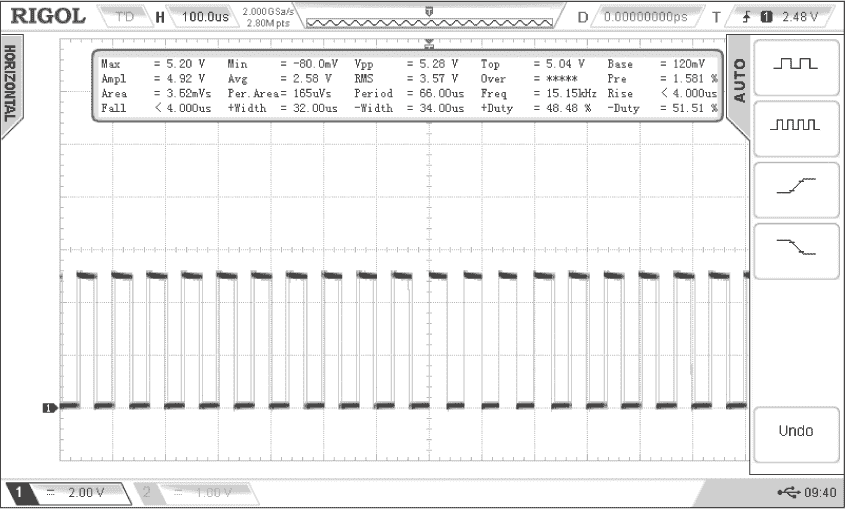

图 2-3：运行清单 2-1 测试的结果

现在，使用清单 2-2 中修改过的草图，使用端口操作重复此测试。

```
void setup()
{
    DDRD = B11111111; // Set PORTD (digital 7 through 0) to outputs
}

void loop()
{
    PORTD = B11111111;
    PORTD = B00000000;
    PORTD = B11111111;
    PORTD = B00000000;
    PORTD = B11111111;
    PORTD = B00000000;
    PORTD = B11111111;
    PORTD = B00000000;
    PORTD = B11111111;
    PORTD = B00000000;
    PORTD = B11111111;
    PORTD = B00000000;
    PORTD = B11111111;
    PORTD = B00000000;
} 
```

清单 2-2：使用端口操作测试引脚速度

清单 2-2 中的PORTD命令展示了将引脚开关足够长时间，以便示波器能够捕捉到此操作的真实速度。如果只有两个PORTD命令（分别控制开和关），时间测量将包括引脚关闭与循环重新开始之间的时间间隔。

图 2-4 展示了该草图在示波器上的结果。

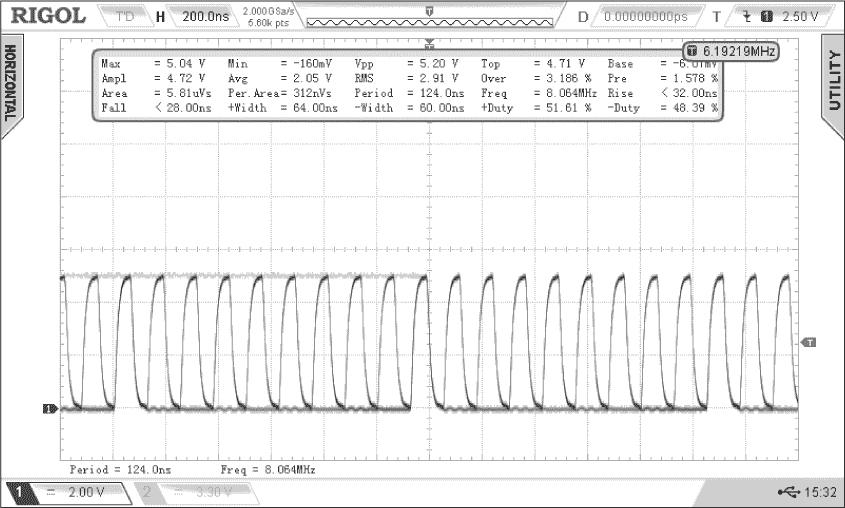

图 2-4：“快速”测试的结果

第二次测试的结果是平均频率为 8.06 MHz，即将所有八个数字引脚开关一次的时间间隔约为 0.00000012406 秒（0.12405 微秒）。平均而言，使用端口操作使这些引脚的开关速度比正常草图函数快约 532 倍。

你可以看到，使用端口操作如何提高操作速度，并减少草图中所需的代码量。在下一个项目中，我们将通过控制 LED 显示来演示端口操作的这些优势。

项目 #5：显示二进制数字

在这个项目中，你将继续巩固端口操作的知识，通过这种方法使用八个 LED 显示二进制数字。

这个项目使用与项目 #4 相同的硬件。一旦上传了草图，LED 应依次点亮，显示从 0 到 255 的二进制数字，最不重要的位位于 LED 的右侧。

```
// Project #5 - Display binary numbers

void setup()
{
  ❶ DDRD = B11111111; // Set PORTD (digital 7 through 0) to outputs
}

void loop()
{
    for (int a = 0; a < 256; a++)
    {
       ❷ PORTD = a;
         delay(250);
    }
} 
```

我们再次将端口 D 的引脚设置为输出 ❶。然后将PORTD 设置为整数 a 的递增值。由于端口寄存器包含 8 位，我们可以将 0 到 255 之间的整数赋值给端口，从而使输出与分配给寄存器的数字的二进制等效值匹配 ❷。

在继续之前，让我们通过在一个方向上点亮和熄灭 LED，然后在另一个方向上进行练习，掌握端口操作中的位移技巧。

项目 #6：创建一个闪烁的 LED 波

在这个项目中，使用来自项目 #4 和 #5 的硬件，你将创建一个波浪状的光效图案，以模拟 1980 年代电视剧《*骑士先锋*》中著名的 K.I.T.T. 车辆的车灯。一旦上传了这个草图，你应该会看到你自己版本的 K.I.T.T. 的标志性滚动灯光。

```
// Project #6 - Creating a blinking LED wave

void setup()
{
    DDRD = B11111111; // Set PORTD (digital 7 through 0) to outputs
}

void loop()
{
  ❶ for (int k = 0; k < 8; k++)
    {
      ❷ PORTD = 1 << k;
         delay(100);
    }

  ❸ for (int k = 6; k > 0; —k)
    {
        PORTD = 1 << k;
        delay(100);
    }
} 
```

这个草图有两个循环：一个从右到左闪烁 LED，另一个则是相反的方向。我们使用位移操作将数字 1 从右到左移动沿着端口寄存器。我们循环八次，处理八个 LED ❶。通过将 1 赋值给端口寄存器 ❷，激活 LED，这将在第二次循环中点亮数字引脚 D0 上的 LED。

k 的值为 1，所以我们将位向左移一位（使用 <<）在端口寄存器中，点亮数字引脚 D1 上的第二个 LED。这个过程会重复，直到所有八个 LED 被依次点亮和熄灭。以下是代表这一事件序列的端口寄存器字节列表：

```
00000001 // PORD = 1 << 0
00000010 // PORD = 1 << 1
00000100 // PORD = 1 << 2
00001000 // PORD = 1 << 3
00010000 // PORD = 1 << 4
00100000 // PORD = 1 << 5
01000000 // PORD = 1 << 6
10000000 // PORD = 1 << 7 
```

该过程然后在第二个循环中以反向重复 ❸，从将位放入第七位开始（01000000），然后继续到位 1。对于这个第二个循环，我们不需要在位置 0 放置位，因为那样会连续点亮第一个 LED 两次。

接下来的两个项目展示了端口操作的另一个便捷应用：使用七段 LED 显示器，这实际上是八个 LED 排列成一个数字并可以选择性地显示小数点。

项目 #7：控制七段 LED 显示屏

人们通常使用外部移位寄存器 IC，如 74HC595，通过七段 LED 显示屏显示简单的数字信息。然而，如果你有多余的数字 I/O 引脚，你可以通过使用本项目中的方法节省零件费用。本项目还包含了按位运算的简要回顾。

你将需要以下零件来完成这个项目：

+   一块 Arduino Uno 或兼容板以及 USB 电缆

+   八个 1 kΩ、0.25 W、1% 的电阻

+   一个共阴极七段 LED 显示屏（兼容 FND500）

+   一块无焊接面包板

+   公对公跳线

按照图 2-5 中所示的电路图，在无焊接面包板上组装电路，并将标记为 D7 至 D0 和 GND 的点连接到 Arduino 的相应引脚。

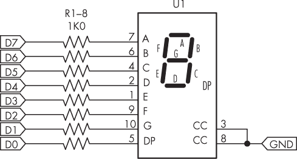

图 2-5：项目 #7 的电路图

一旦上传了草图，数字 0 到 9 应该依次显示，然后再次显示一次，这次 LED 显示屏上的小数点会亮起。

让我们看看这如何工作：

```
// Project #7 - Controlling seven-segment LED displays with port manipulation

❶ int digits[] = {B11111100, // 0
                B01100000, // 1
                B11011010, // 2
                B11110010, // 3
                B01100110, // 4
                B10110110, // 5
                B10111110, // 6
                B11100000, // 7
                B11111110, // 8
                B11110110}; // 9
void setup()
{
  ❷ DDRD = B11111111; // Set PORTD (digital 7 through 0) to outputs
}

void loop()
{
    for (int a = 0; a < 10; a++)
    {
      ❸ PORTD = digits[a];
         delay(250);
    }

    for (int a = 0; a < 10; a++)
    {
      ❹ PORTD = digits[a]|B00000001; // Activate decimal point (D0)
         delay(250);
    }
} 
```

该草图定义了一个包含 10 个元素 ❶ 的数组，每个元素包含一个二进制数字，表示需要打开或关闭的 LED，以显示每个数字。从图 2-5 的电路图中可以看到，显示屏的第一个引脚（A）连接到数字引脚 D7，依此类推。在这个项目中，端口 D 被设置为 ❷。显示所需数字的操作很简单，只需将所需的数组元素（0 到 9）分配给 ❸ 和 ❹ 处的 PORTD 即可。

循环 ❹ 打开小数点。每个数组元素中的第 0 位代表显示屏中的小数点 LED，因此草图需要使用按位运算中的 OR 函数（|）来更改第 0 位。当你使用 OR 比较两个比特时，如果其中一个比特是 1，或者两个比特都是 1，结果就是 1。

```
1|0 = 1 // 1 or 0 = 1
0|1 = 1 // 0 or 1 = 1
1|1 = 1 // 1 or 1 = 1
0|0 = 0 // 0 or 0 = 0 
```

因此，你可以通过以下方法将小数点添加到数字字节中（在草图中，数字字节被设置为显示数字 1 和小数点）：

```
B01100000 | // Byte to display digit 1
B00000001 = // "or" decimal point bit
B01100001 // Gives us digit 1 with decimal point 
```

未来，如果你在自己的项目中使用带有端口操作的 LED 显示屏，可以利用以下自定义函数显示带或不带小数点的数字。你也可以通过将其添加到项目 #7 来进行测试。

```
void display(int n, boolean point)
{
    if (point == false) // No decimal point
    {
        PORTD = digits[n];
    }
    else if (point == true) // Decimal point
    {
      PORTD = digits[n]|B00000001;
    }
} 
```

如果你想关闭当前已打开的某个特定输出，而不影响其他引脚，可以使用按位与函数 &。当比特与 & 0 比较时，如果比特是 1，结果为 0。例如：

```
1&0 = 0 // 1 or 0 = 0
0&1 = 0 // 0 or 1 = 0 
```

要关闭第一个和最后一个输出（当所有引脚都打开时），你可以使用以下代码，这将保留位 6 到位 1 打开，而位 7 和位 0 关闭：

```
PORTx = B11111111 &
        B01111110; 
```

现在你已经连接了 LED 显示电路，接下来让我们制作一个电子骰子。

项目 #8：创建一个电子骰子

在这个项目中，你将创建一个电子骰子，生成一个 1 到 6 之间的随机数，模拟掷物理骰子的过程。

该项目使用与项目 #7 相同的硬件。上传草图后，显示屏应迅速滚动显示数字，然后逐渐变慢直到停止。

```
// Project #8 - Single-digit electronic die

int digits[] = {B11111100, // 0
                B01100000, // 1
                B11011010, // 2
                B11110010, // 3
                B01100110, // 4
                B10110110, // 5
                B10111110, // 6
                B11100000, // 7
                B11111110, // 8
                B11110110}; // 9

❶ void display(int n, boolean point)
{
    if (point == false)
    {
        PORTD = digits[n];
    } else if (point == true)
    {
        PORTD = digits[n] | B00000001;
    }
}

void displayRandom(int _delay)
{
    display(random(1, 7), false); // Display the number
    if (_delay > 0)
    {
        delay(_delay); // Hold the display on for the delay received
    }
    else if (_delay == 0)
    {
        do // The delay entered was 0, hold the display on
        {}
 while (1);
    }
}

void setup()
{
    DDRD = B11111111; // Set PORTD (digital 7 through 0) to outputs
  ❷ randomSeed(analogRead(0)); // Seed the random generator
}

void loop()
{
    int a;
    // Cycle the LEDs around for effect
  ❸ for (a = 0; a < 100; a++)
    {
        displayRandom(50);
    }
    // Display numbers with increasing delay
  ❹ for (a = 1; a < 10; a++)
    {
        displayRandom(a * 100);
    }
    // Stop at the final random number and LED
  ❺ displayRandom(0);
} 
```

该草图结合了新代码和项目 #7 中使用的函数。草图首先使用该项目中的自定义函数显示数字 ❶，然后初始化随机数生成器 ❷。它迅速显示 100 个随机数以产生视觉效果 ❸，然后显示接下来的 10 个随机数，每个数字之间的时间延迟逐渐增加 ❹。最后，在显示最后一个随机数 ❺ 后，一切停止。要显示另一个随机数，按下重置按钮。

项目 #9：同时读取多个数字输入

你还可以使用端口式操作快速读取数字输入引脚，而不是通过使用多个 digitalRead() 函数。因为每个端口返回 8 位数据（包括 B 和 C 端口，虽然它们只有六个物理引脚），所以我们只需将所需端口设置为输入，然后将端口的值赋给变量。该值是一个 8 位数字，表示输入引脚的状态。

一旦使用 DDRx 函数在 void setup() 中设置了输入，只需将端口赋值给一个变量来读取引脚的状态。例如，一旦将端口 D 设置为输入，就可以使用以下代码读取其状态：

```
int port = PIND; // Value of pins on PORTD is stored in integer "port" 
```

该项目演示了如何一次性读取整个端口，然后使用另一个端口的 LED 显示该端口的状态。

你将需要以下部件：

+   一块 Arduino Uno 或兼容板及 USB 数据线

+   四个 1 kΩ，0.25 W，1% 的电阻

+   四个 10 kΩ，0.25 W，1% 的电阻

+   四个 LED

+   四个触摸按钮

+   无焊面包板

+   男对男跳线

按照 图 2-6 所示的电路在无焊面包板上组装电路，并将标记为 D7 到 D4，D13 到 D10，5V 和 GND 的点连接到 Arduino 的相应引脚。

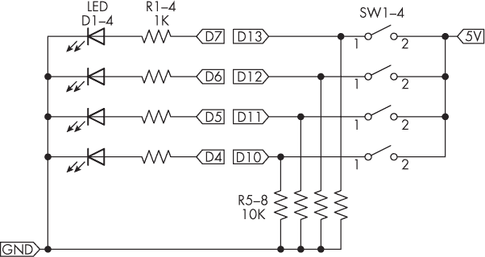

图 2-6：项目 #9 的电路图

上传草图后，按下按钮应点亮对应的 LED。

让我们看看这个是如何工作的：

```
// Project #9 - Simultaneous reading of Arduino digital inputs

void setup()
{
  ❶ DDRB = B00000000; // Set PORTB (digital 13 through 8) to inputs
  ❷ DDRD = B11111111; // Set PORTD (digital 7 through 0) to outputs
}

void loop()
{
  ❸ PORTD = PINB<<2; // Bit-shift PORTB value as only 6 bits
} 
```

这个示例展示了通过端口操作使代码最小化的可能性：你可以在一行中读取最多八个按钮的状态，而不是使用八个单独的 digitalRead() 函数。在设置引脚状态❶后，示例将引脚的值(PINB)赋给端口 D，从而按照指示设置输出❷。

接下来，代码将 PINB 的值左移 2 位❸。B 端口只有六个物理引脚，但读取时仍会返回一个 8 位数字。最显著的两位是 0，最后六位代表 D13 到 D8 的状态。因此，本项目将 PINB 的值左移，以便与端口 D 的输出控制匹配。

## 二进制编码十进制开关

项目 #9 中展示的数字输入读取形式非常适合多输出的输入设备，例如带有 BCD 输出的旋转开关，BCD 输出代表 0 到 9 之间数字的二进制值。BCD 开关是一种方便的用户输入方法，用于设置选项、数值或其他项目需求，其中用户输入一个 0 到 9 之间的数字。

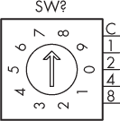

图 2-7：典型 BCD 开关的原理符号

BCD 开关提供 10 个位置选择，并且有 4 个输出引脚，可以通过 4 个数字输入引脚轻松读取。第五个引脚通常连接到 5V 引脚，这允许电流通过切换的输出引脚。图 2-7 展示了典型 BCD 开关的原理符号。

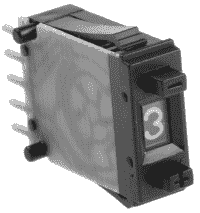

图 2-8：推轮 BCD 开关

BCD 开关的例子包括复古风格的“推轮”开关，如图 2-8 所示，以及旋转开关，如图 2-9 所示。

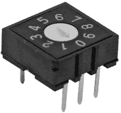

图 2-9：旋转 BCD 开关

为了进行简单的 BCD 实验，使用图 2-9 中展示的旋转 BCD 开关更为方便，因为它不需要任何焊接。

使用任何开关时，用户必须小心将杠杆或指针移到正确的位置。例如，如果你改变旋转开关并将指针留在两个数字之间，它将无法返回正确的值。下一个项目展示了如何使用端口操作实现这些开关。

项目 #10：读取 BCD 开关

本项目演示了如何通过端口操作读取 BCD 开关，将值以二进制和十进制返回到串行监视器，允许你简单高效地接收数字用户输入。

你需要以下组件：

+   一块 Arduino Uno 或兼容板和 USB 线

+   一个 BCD 旋转开关或推钮开关

+   一块无焊接面包板

+   公对公跳线

按照图 2-10 所示，在无焊接面包板上组装电路，并将标记为 5V 和 D11 到 D8 的点连接到 Arduino 的相应引脚。

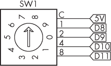

图 2-10：项目#10 的电路图

输入并上传草图，然后打开串行监视器。你应该能看到开关设置的值以二进制和十进制显示，如图 2-11 所示。

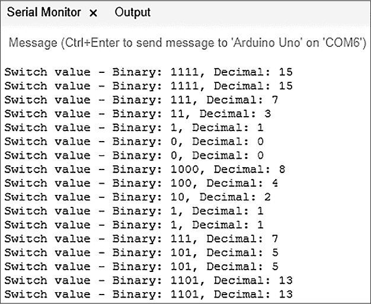

图 2-11：项目#10 的示例输出

让我们看看它是如何工作的：

```
// Project #10 - Reading BCD switches

void setup()
{
  ❶ DDRB = B11110000; // Set PORTB (digital 11 through 8) to inputs
    Serial.begin(9600);
}

void loop()
{
    Serial.print("Switch value - Binary: ");
  ❷ Serial.print(PINB,BIN);
    Serial.print(", Decimal: ");
  ❸ Serial.println(PINB);
    delay(250);
} 
```

代码将 D11 到 D8 的引脚设置为输入，将 D12 和 D13 设置为输出❶，因为它不想返回 D12 和 D13 的引脚值。然后，它简单地将端口 B 的值以二进制❷和十进制❸形式返回给串行监视器。二进制值应反映来自开关到 Arduino 输入引脚的实际信号，而十进制是相同信号的整数等价物。

## 继续前进

本章向你展示了如何通过使用端口操作，更快速高效地使用 Arduino 的数字输入和输出引脚，控制许多 LED 而无需外部 IC，并接收设置而不需要使用显示器或多个开关。在下一章，你将学习如何使用体积更小、成本更低的 ATtiny 系列微控制器来进行不太复杂的 Arduino 项目。
