# 第三章：3 使用 ATtiny 微控制器


到目前为止，在你的 Arduino 旅程中，你可能最常使用的是微芯片 ATmega328P-PU。然而，对于较小的项目，你可以通过使用像 ATtiny85 这样的微控制器来节省成本和功耗。本章将教你如何为 ATtiny 微芯片配置 Arduino IDE。

在为你的 ATtiny85 配置 Arduino IDE，并通过闪烁 LED 演示工具链正常工作后，你将学习如何：

+   了解 ATtiny 引脚参考及其在 Arduino 环境中的功能

+   为 ATtiny 电路添加重置按钮

+   使用 ATtiny 进行端口操作

+   更改 ATtiny 的操作速度

你还将构建一个快速读取的温度计，并设计一个 Arduino 编程扩展板，让你轻松将代码上传到 ATtiny85 微控制器。

## ATtiny85 微控制器

图 3-1 展示了紧凑型的 ATtiny85 微控制器。

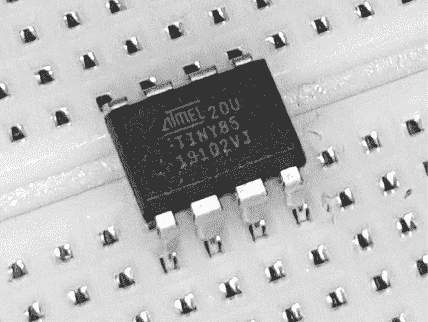

图 3-1：ATtiny85 微控制器的通孔封装

除了尺寸外，ATtiny85 和常见的 ATmega328P-PU 微控制器之间还有一些重要的差异，这些差异影响它们在 Arduino 环境中的使用，正如在图 3-2 和表 3-1 中所示。

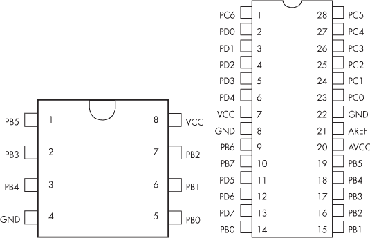

图 3-2：ATtiny85（左）和 ATmega328P-PU（右）的引脚图。

表 3-1： ATtiny85 和 ATmega328P-PU 的规格

|  | ATtiny85 | ATmega328P-PU |
| --- | --- | --- |
| 最大处理速度 | 20 MHz | 16 MHz |
| 数字引脚数量 | 最多 5 | 14 |
| 模拟输入引脚数量 | 最多 3 | 6 |
| 闪存 | 8KB | 32KB |
| 静态随机存取内存（SRAM） | 512 字节 | 2KB |

这个表格帮助您确定哪些电子组件可以与 ATtiny85 一起实际使用。简而言之，ATtiny 适合预算有限、需要较少输入输出引脚但能从提高能效中受益的项目。

## 使用 Arduino IDE 的 ATtiny 芯片

麻省理工学院的高低技术小组首先创建了在 Arduino IDE 中使用 ATtiny85 微控制器的代码。然而，在实现此代码之前，您需要在 Arduino IDE 中安装 ATtiny 支持。

手头有 ATtiny85 时，打开 Arduino IDE，然后选择**文件**  **偏好设置**。当偏好设置对话框出现时，点击附加板管理器 URLs 字段右侧的小按钮。附加板管理器 URLs 对话框将出现，如图 3-3 所示。

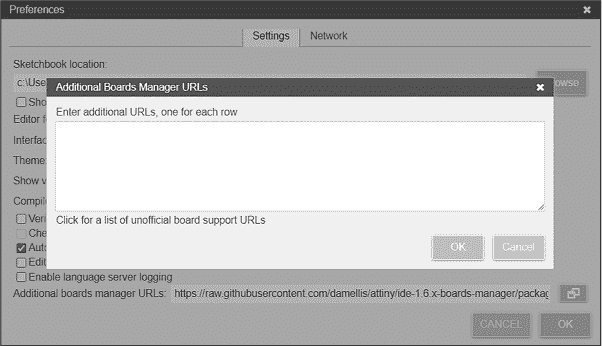

图 3-3：Arduino IDE 附加板管理器网址对话框

在字段中输入以下 URL。如果您之前的项目中已经有其他 URL，请在最后一个 URL 后加上逗号，并在逗号后输入这一新行：

```
https://raw.githubusercontent.com/damellis/attiny/ide-1.6.x-boards-manager/package_damellis_attiny_index.json
```

点击**确定**关闭附加 URL 对话框，然后点击**确定**关闭偏好设置对话框。

关闭并重新打开 IDE。如果您的计算机未连接互联网，请现在连接。选择**工具**  **板管理器**。当板管理器在 IDE 的左侧打开时，在搜索框中输入**attiny**。

ATtiny 包将出现，如图 3-3 所示。点击**安装**，然后等待几秒钟安装完成。您可以在 IDE 的输出窗口底部看到进度：

```
Downloading packages
Attiny:avr@1.0.2
Installing attiny:avr@1.0.2
Configuring platform
attiny:@1.0.2 installed 
```

最后，通过选择**工具**  **板**  **attiny**  **ATtiny25/45/85**来检查安装是否成功，如图 3-4 所示。

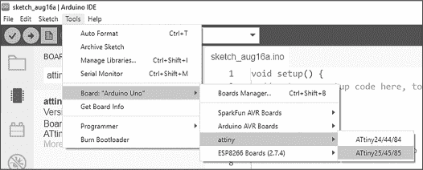

图 3-4：现在可以在板菜单中选择 ATtiny85

现在您已经配置好了 IDE，接下来需要配置*硬件程序员*，即计算机与 ATtiny85 之间的接口，使用 Arduino Uno 或兼容的板子。打开 Arduino IDE，选择**文件**  **示例**  **11.ArduinoISP**  **ArduinoISP**，如图 3-5 所示。

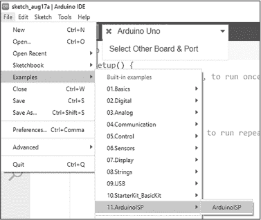

图 3-5：选择 ArduinoISP 示例

在将这个示例程序上传到你的 Arduino Uno 或兼容板之后，该板将充当硬件编程器。你随时可以向 Uno 上传其他示例程序，但如果你想向 ATtiny 上传程序，你需要先在 Arduino 上上传 ArduinoISP 示例程序。

让我们检查一下你的硬件和软件环境是否正常工作，可以使用一个典型的示例程序来使 LED 闪烁。

项目 #11：构建硬件的“Hello, World”程序

这个项目不会让你的 ATtiny85 在屏幕上打印“Hello, world”，而是做一个硬件等效的动作：闪烁 LED 来演示工具链的工作。

你将需要以下部件：

+   一块 Arduino Uno 或兼容板和 USB 数据线

+   一只 ATtiny85 微控制器

+   一只 1 kΩ, 0.25 W, 1% 的电阻

+   一只 10 µF, 16 V 电解电容

+   一只 LED

+   一块无焊面包板

+   公对公跳线

按照图 3-6 所示，在无焊面包板上组装电路，并将标有 5V、GND、RESET 和 D10 到 D13 的点连接到 Arduino 的相应引脚。

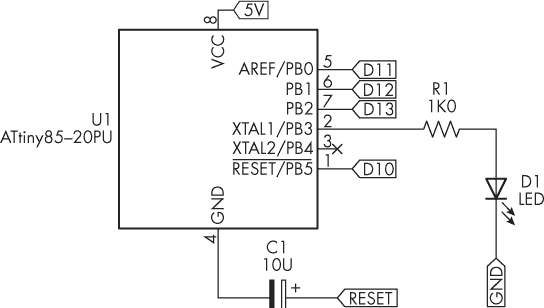

图 3-6：项目 #11 的原理图

通过 D10 到 D13 的连接到 Arduino 的 SPI 总线，以及 10 µF 电容与 Arduino 重置引脚之间的连接，仅在上传每个 ATtiny 项目时需要。上传示例程序后，移除这些连接。

接下来，你需要更改 IDE 设置以适应硬件的变化。打开 IDE 并将板卡类型更改为**ATtiny25/45/85**，如图 3-4 所示。选择 **工具**  **时钟**  **内部 1 MHz**。最后，通过选择 **工具**  **Arduino 作为 ISP** 来更改编程器。

现在输入并上传项目 #11 的示例程序。LED 应该开始以大约一秒钟的延迟闪烁，确认你的 ATtiny 开发环境已经正常工作。

```
// Project #11: Build the "Hello, world" of hardware

void setup()
{
  ❶ pinMode(3, OUTPUT);
}

void loop()
{
  ❷ digitalWrite(3, HIGH);
    delay(1000);
  ❸ digitalWrite(3, LOW);
    delay(1000);
} 
```

ATtiny85 的物理引脚 2 在 Arduino 环境中对应的是数字引脚 3，因此示例程序声明引脚 3 为输出❶，然后将其打开❷，再在延迟后关闭❸。

现在我将介绍你在构建下一个项目之前需要了解的三件事：Arduino Uno 和 ATtiny 引脚参考的差异、如何向 ATtiny 电路添加复位按钮，以及 Arduino 函数如何在 ATtiny 版本的 Arduino 项目中使用。

## Arduino Uno 与 ATtiny85 引脚参考

在 Arduino 环境中，ATtiny85 的物理引脚参考编号与您在典型的 Arduino Uno 和兼容板上使用的不同。因此，当您使用 Arduino 环境制作基于 ATtiny85 的项目时，您需要参考表 3-2 来确定 ATtiny85 的物理引脚及其在 Arduino Uno 环境中的对应引脚。

表 3-2： ATtiny85 与 Arduino 引脚参考

| ATtiny 物理引脚 | Arduino (1) | Arduino (2) |
| --- | --- | --- |
| 2 | 数字引脚 3 (D3) | 模拟引脚 3 (A3) |
| 3 | 数字引脚 4 (D4) | 模拟引脚 2 (A2) |
| 5 | 数字引脚 0 (D0) | 脉宽调制（使用 analogWrite(0)） |
| 6 | 数字引脚 1 (D1) | 脉宽调制（使用 analogWrite(1)） |
| 7 | 数字引脚 2 (D2) | 模拟引脚 1 (A1) |

在上传程序时，D0 至 D2 上的 HIGH 和 LOW 信号会触发任何连接的外部设备，如继电器。在这种情况下，最好先将程序上传到微控制器，然后再将其插入最终项目中。

由于 ATtiny85 与 ATmega328 类型的微控制器具有相同的基本架构，因此您可以使用第二章中描述的端口操作来控制 I/O 引脚。ATtiny 的 I/O 引脚位于 PORTB 的最低 4 位（位 3 至 0），并与物理引脚 2、7、6 和 5 匹配。只需将更高的 4 位设置为 0，并使用 DDRB 和 PORTB 函数即可。

## 为 ATtiny85 电路添加复位按钮

与其他 Arduino 和兼容板一样，你可以在 ATtiny85 电路中添加复位按钮。你将在下一个项目中使用这个按钮，它也可能在未来的项目中方便地帮助你进行重启。

ATtiny85 的复位按钮将物理引脚 1 与 GND 连接，并与一个 10 kΩ的上拉电阻一起工作。当引脚 1 连接到 GND 时，电路会复位。图 3-7 显示了电路图。


图 3-7：ATtiny85 复位按钮电路图

在设计不会在运行过程中连接到主机 Arduino 板的电路时，可以在 5V 和 GND 之间放置一个 0.1µF 电容器，以保持更平稳的电源供应。

## ATtiny85 可用的 Arduino 函数

如果你熟悉 Arduino 环境，并且想直接进入自己的基于 ATtiny 的项目，注意 ATtiny85 提供的 Arduino 函数比大型微控制器要少，但仍然有很多可用的函数：

analogRead()    告诉 ADC 返回一个 0 到 1,023 之间的值，表示 0 到 5V 直流电压范围

analogWrite()    生成 PWM 输出

delay()    暂停程序运行（以毫秒为单位）

delayMicroseconds()    暂停程序运行（以微秒为单位）

digitalWrite()    开启或关闭数字输出引脚

digitalRead()    读取数字输入引脚的状态

micros()    返回程序开始运行以来的微秒数

millis()    返回程序开始运行以来的毫秒数

pinMode()    设置数字引脚的状态

pulseIn()    返回在数字输入引脚上测量到的脉冲宽度

shiftOut()    将一个字节的数据输出到数字引脚

如果你对这些函数不熟悉，可以查阅我的书籍*Arduino 工作坊*第二版，或者访问 Arduino 语言参考：[*https://<wbr>www<wbr>.arduino<wbr>.cc<wbr>/reference<wbr>/en<wbr>/*](https://www.arduino.cc/reference/en/)。

你在使用 ATtiny85 时也可以使用各种 Arduino 库。然而，如果这些库是为访问 GPIO 引脚设计的，你需要修改库代码，以便更新 ATtiny85 的引脚引用。一些 Arduino 库可能还需要比 ATtiny85 提供的更多内存。

项目#12：创建快速读取温度计

在这个项目中，您将使用流行的 TMP36 温度传感器创建一个记录并显示三个预定温度范围的温度计：过冷、适宜和过热。这还展示了如何在 Arduino 环境中使用 ATtiny85 的模拟输入和数字输出引脚。

您将需要以下零件：

+   一块 Arduino Uno 或兼容板和 USB 电缆

+   一个 ATtiny85 微控制器

+   三个 1 kΩ、0.25 W、1%电阻

+   一个 10 kΩ、0.25 W、1%电阻

+   一个触觉按钮

+   一个 0.1 µF 陶瓷电容器

+   三个 LED

+   一个 TMP36 模拟温度传感器

+   一个无焊面包板

+   公对公跳线

根据无焊面包板上显示的图 3-8 组装电路。此原理图仅显示最终产品，但您首先需要连接线路以上传草图——您可以参考项目#11 来复习如何操作。使用您的 Arduino Uno 作为快速 5V 电源。

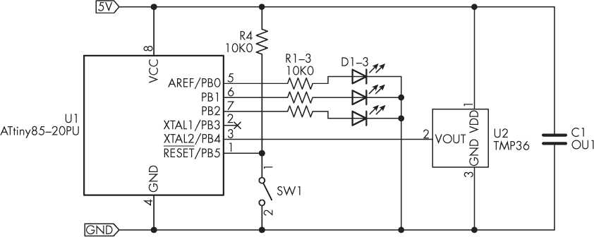

图 3-8：项目#12 的原理图

上传草图后，从 Arduino Uno 的 D10 至 D13 引脚和 RESET 引脚中移除线路，但保留 5V 和 GND 以供电温度计。当草图开始运行时，三个 LED 中的一个应该表示草图中设置的温度范围。

让我们看看这是如何工作的：

```
// Project #12 - A "quick-read" thermometer

// Define the pins that the LEDs are connected to:
❶ #define HOT 2
#define NORMAL 1
#define COLD 0

float voltage = 0;
float celsius = 0;
❷ float hotTemp = 25;
float coldTemp = 15;
float sensor = 0;

void setup()
{
  ❸ pinMode(HOT, OUTPUT);
    pinMode(NORMAL, OUTPUT);
    pinMode(COLD, OUTPUT);
    pinMode(HOT, LOW);
    pinMode(NORMAL, LOW);
    pinMode(COLD, LOW);
}

void loop()
{
    // Read sensor and convert result to degrees Celsius
  ❹ sensor = analogRead(2);
  ❺ voltage = (sensor * 5000) / 1024;
    voltage = voltage - 500;
    celsius = voltage / 10;
    // Act on temperature range
  ❻ if (celsius < coldTemp)
    {
        digitalWrite(COLD, HIGH);
        delay(250);
        digitalWrite(COLD, LOW);
    }
  ❼ else if (celsius > coldTemp && celsius < hotTemp)
    {
        digitalWrite(NORMAL, HIGH);
        delay(250);
        digitalWrite(NORMAL, LOW);
    }
    else
    {
      ❽ // Celsius is > hotTemp
        digitalWrite(HOT, HIGH);
 delay(250);
        digitalWrite(HOT, LOW);
    }
} 
```

草图定义了读出 LED 引脚的值，并将它们设置为 LOW ❶。您可以为热和冷设置自己的值 ❷；“正常”温度将高于coldTemp值，并且低于或等于hotTemp值。

草图将数字引脚设置为输出 ❸，然后循环，从温度传感器中获取值 ❹ 并将其转换为摄氏度 ❺。最后，它确定温度为冷 ❻、正常 ❼ 或热 ❽ 并点亮相应的 LED。

## 增加 ATtiny85 的速度

ATtiny85 可以在 Arduino 环境和其他环境中以三种不同的速度运行：1 MHz（默认速度）、8 MHz 或 16 MHz。到目前为止，您的项目都使用了默认速度，这需要最少的功率，并且适用于电池供电项目。对于涉及更多计算的项目，您需要将速度更改为 8 MHz 或更高，这将消耗更多电力。

为了准备下一个项目，您将使用 IDE 烧写一个新的*bootloader*——这是加载到 ATtiny85 微控制器中的软件，使其能够通过 SPI 或 USB 连接接收代码。这将擦除最后上传的草图并设置微控制器内部的振荡器速度，从而确定操作速度。

### 振荡器速度

按照上传草图到微控制器时的电路设置进行连接。接下来，打开 IDE 并选择 **工具**  **时钟**  **内部 16 MHz**，如图 3-9 所示。

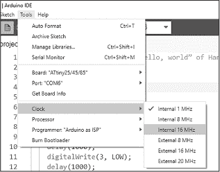

图 3-9：准备更改时钟速度

接下来，选择 **工具**  **烧录引导加载程序**。该操作应在几秒钟内完成，如图 3-10 所示。

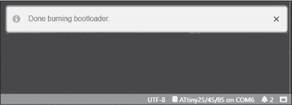

图 3-10：烧录引导加载程序后 Arduino IDE 界面

现在，上传的草图应以 16 MHz 的速度运行。

### 振荡器精度

环境温度会影响微控制器的速度精度。当你仅仅使用延时来闪烁 LED 或进行其他简单任务时，这通常不是问题，但如果你使用 millis() 和 micros() 函数进行更精确的计时时，温度变化可能会成为问题。例如，在外部温度约为 25°C 时，速度可能会变化±10%。

解决方案是使用像 Arduino Uno 等板卡所使用的外部晶体电路。你需要两个 22 pF 的陶瓷电容和一个 8、16 或 20 MHz 的通孔型 HC-49 晶体，像图 3-11 所示的那种。

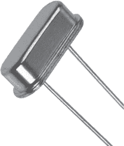

图 3-11：一个通孔型 HC-49 晶体

> 注意

*如果你做过 Arduino 工作坊第二版中描述的“面包板 Arduino”，你应该对这种电路类型很熟悉。*

图 3-12 显示了添加到 ATtiny85 的晶体振荡器电路。

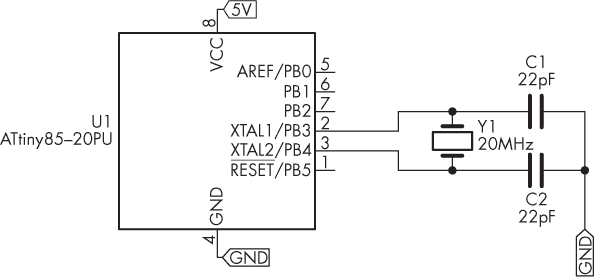

图 3-12：带有外部晶体子电路的 ATtiny85 电路

使用外部晶体时，不要忘记将振荡器速度设置为外部，并与晶体频率匹配。使用外部晶体的一个缺点是，它会占用数字引脚 2 和 3，这意味着你不能再将它们用作输入或输出。

下一个项目将帮助你在日后的工作中定期使用 ATtiny85 进行紧凑的 Arduino 兼容项目。

项目 #13：创建 ATtiny85 编程扩展板

本项目创建了一个小型屏蔽板，您可以通过 Arduino Uno 向 ATtiny 微控制器上传草图。该屏蔽板包含所有必需的电路，并配有两个 LED，用于快速原型设计或实验。然后，您可以将微控制器从屏蔽板上取下，单独使用它进行其他项目。

您将需要以下部件：

+   项目 #13 PCB

+   两个 1 kΩ, 0.25 W, 1% 的电阻

+   一个 10 µF, 16 V 的电解电容

+   两个 5 mm 的 LED

+   1 × 40 内联 2.54 mm 引脚头

+   一个八针 IC 插座

图 3-13 显示了本项目的原理图。

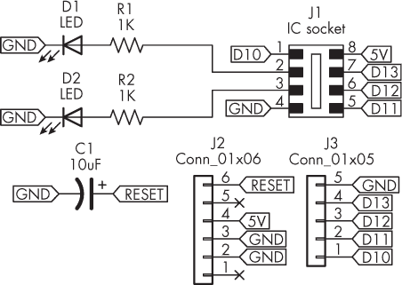

图 3-13：项目 #13 的原理图

要组装电路，请按照 图 3-14 上 PCB 上标记的方式连接各个元件。首先是电阻器，然后是 IC 插座。接着安装电容，并注意 PCB 上标明的极性。然后安装 LED，确保其短脚与 PCB 上的方形孔对接。

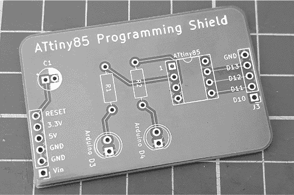

图 3-14：项目 #13 的 PCB

最后，将内联引脚修剪成一个六针长度和一个五针长度，然后按 图 3-15 所示插入 Arduino Uno。

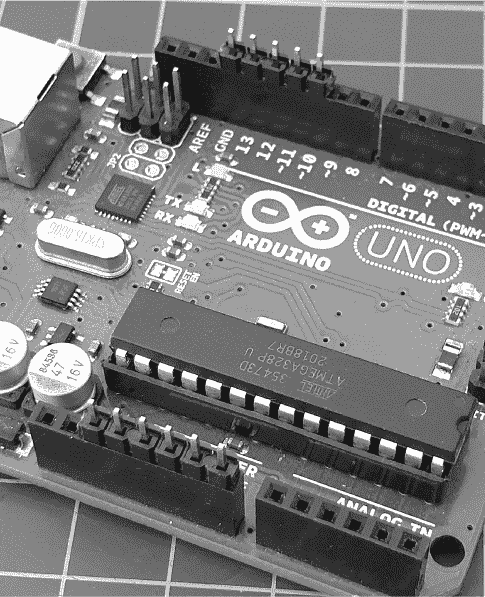

图 3-15：准备内联引脚头

将 PCB 放置在引脚头上方，并按照 图 3-16 所示焊接引脚。

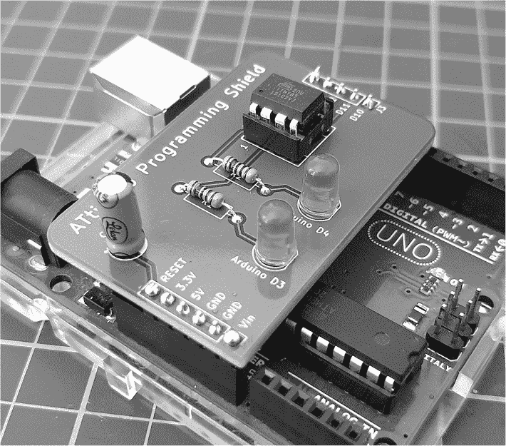

图 3-16：已组装的屏蔽板

现在，您可以通过在上传 Arduino 作为 ISP 程序时移除屏蔽板，然后在上传 ATtiny 程序时再插入屏蔽板，轻松上传草图。这样可以让您在未来更快速、更轻松地搭建基于 ATtiny85 的项目，避免手动将 Uno 连接到无焊接面包板。

## 继续进行

本章向您展示了如何使用 ATtiny 微控制器来构建更小、更简单且成本更低的 Arduino 兼容项目。Arduino 编程屏蔽板还为您提供了一个更快的方式，将代码上传到 ATtiny。

在下一章中，您将学习如何使用看门狗定时器保持 Arduino 持续运行。
