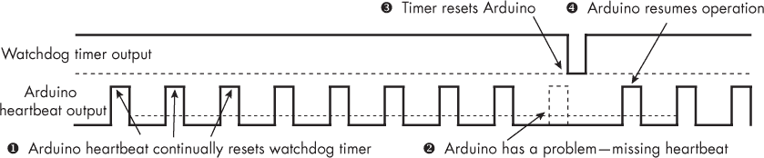
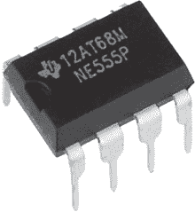
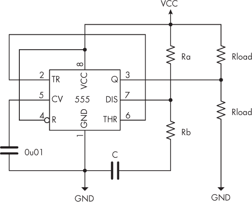
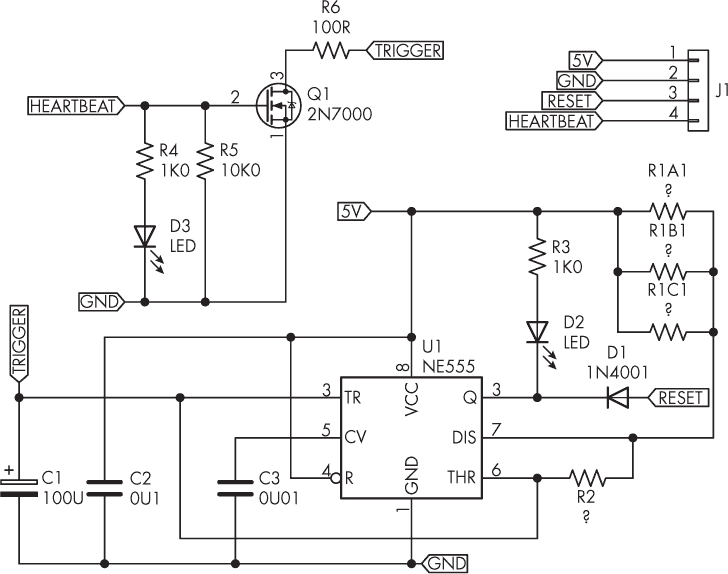
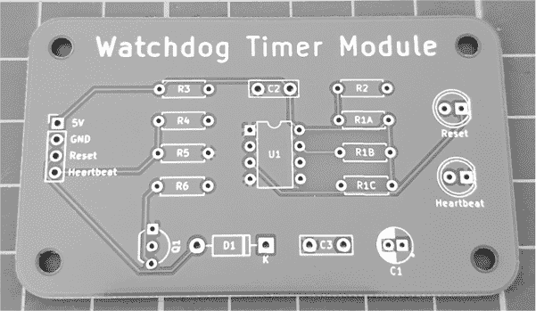
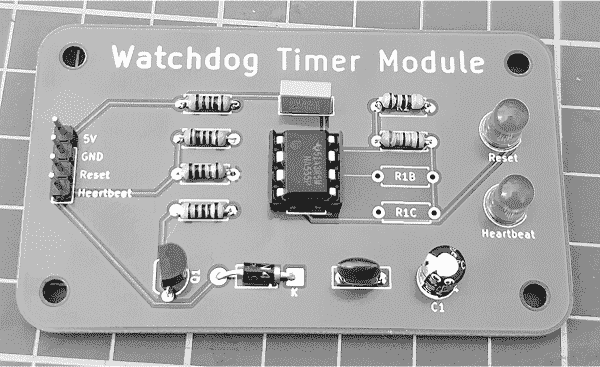

# 第四章：4 构建看门狗定时器


长时间无人看管的项目可能会因为事故、设计不佳或电力问题而停止工作或死机。为了解决这些问题，你可以使用*看门狗定时器*，这是一种小型电路，当项目正常运行时它保持静止，但如果未收到正常信号，它会强制重置微控制器，重新启动操作。这些定时器可以帮助你构建更加先进、专业且可靠的项目。

在本章中，你将学习：

+   配置 555 定时器 IC 为不稳定定时器

+   使用公式计算 555 定时器 IC 的延迟周期

+   使用 PCB 构建自己的看门狗定时器

## 确保恒定且可靠的运行

随着你掌握更多的微控制器知识，你可能会发现自己在构建一些长时间无需你持续关注的项目或产品。这些项目可以是天气监测系统、数据记录设备、硬件网页主机（允许远程查看当前数据），或者其他一些位置难以接触到的设备（如埋在地下室或阁楼中的设备）。

当最终的项目交到你手中时，如何确保其恒定且可靠的运行？即使你的硬件和草图或代码看似万无一失，意外情况仍可能导致你的 Arduino 停止运行。短暂的电源电压下降可能会使微控制器死机（即停止草图运行）。极端的温度变化也可能引发问题，或者你的草图可能有未预料的错误。由于这些原因及更多问题，你将需要一个看门狗定时器。

在本节中，我将解释看门狗定时器背后的理论，并展示如何构建自己的看门狗定时器电路。

### 看门狗定时器理论

看门狗定时器电路是一个外部定时器，连接到 Arduino 板上的 RESET 引脚。看门狗电路开始时发送一个高电平信号，该信号会在预定的时间后变为低电平，这将导致 Arduino 重置并重新启动。然而，Arduino 可以通过向看门狗电路连接的数字输出引脚发送定期信号或*心跳*来防止这种重置。心跳信号会在看门狗定时器重置 Arduino 之前重置定时器电路。

请参考图 4-1 中的时序图。



图 4-1：看门狗定时器输出与 Arduino 心跳输出的时序图

上方的信号是来自看门狗定时器的输出，持续在高电平（HIGH）和低电平（LOW）之间振荡。高电平信号的周期远长于低电平信号的周期。看门狗的输出连接到 Arduino 的重置（RESET）引脚。当看门狗定时器重置时，输出从高电平开始，这意味着 Arduino 必须不断重置看门狗定时器，以防止看门狗定时器重置 Arduino。

为了实现这一功能，连接到看门狗定时器的 Arduino 数字输出引脚会向定时器发送一个快速脉冲（高电平然后低电平）❶，重置定时器并阻止定时器输出变为低电平（LOW）。如果 Arduino 出现问题并停止向看门狗定时器发送心跳信号❷，看门狗定时器将继续振荡，并且其信号将变为低电平❸，从而重置 Arduino。重置后，Arduino 应该恢复并再次开始发送心跳信号❹。

看门狗定时器是一种硬件解决方案，较软件实现更不易出错。如果重置无法让 Arduino 重新启动，说明项目中存在重大故障，需要你物理检查硬件或代码。

### 看门狗定时器电路配置

看门狗定时器电路的核心是 图 4-2 所示的 555 定时器 IC。这个紧凑的部件包含了一个可定制的定时电路，可以通过多种方式使用。



图 4-2：555 定时器 IC

要将 555 用作看门狗定时器，你需要将其配置为*非稳态定时器*，即生成一个持续的信号输出，高电平周期比低电平周期更长，如 图 4-3 所示。



图 4-3：一个基本的非稳态定时器电路

非稳态定时器电路相当简单。在 555 内部有一个电压比较器电路和一个触发器，它在低电平和高电平之间切换，以驱动输出引脚。当电源接入时，管脚 2（触发引脚）的电压低于 V[CC] 的三分之一，这意味着触发器切换并将 555 的输出设置为高电平。然后，电容 C 通过电阻 R[A] 和 R[B] 充电。

在输出为高电平（HIGH）一段时间后，管脚 6（阈值引脚）的电压超过 V[CC] 的三分之二。触发器切换并将 555 的输出设置为低电平（LOW）。这也启用了放电功能，使得电容 C 通过电阻 R[B] 放电。

在输出为低电平（LOW）一段时间后，管脚 2 的电压低于 V[CC] 的三分之一，因此触发器会切换，将 555 的输出设置为高电平（HIGH）……然后循环重复。输出来自管脚 3，它作为一个开路集电极工作——也就是说，当为低电平（LOW）时，它可以将电流吸入地（GND）。

输出信号的占空比及高低电平周期由电阻 R[1]、R[2]和电容 C 的值决定。R[L]部分是负载，或者说是由输出控制的电路。当输出关闭时，电流可以从 V[CC]通过较高的 R[L]流动；当输出开启时，电流则从输出通过较低的 R[L]流向 GND。555 的输出脚最多可以流入或流出 200 mA 的电流。

为了确定输出的高低电平周期时间——如果你有兴趣的话，输出信号的频率（虽然我们不使用它，但也可以设置！）——我们使用以下三个公式：


T[low]是 555 定时器输出为低电平的时间长度，T[high]是输出为高电平的时间长度。例如，若 R[1]的值为 100 kΩ，R[2]的值为 4.7 kΩ，电容 C 的值为 100 uF，则计算如下：

T[high] = 0.693 (4,700) 0.0001 = 7.255 s

T[low] = 0.693 (100,000 + 4,700) 0.0001 = 0.3257 s

一个包含这些公式的电子表格可以在[*https://<wbr>nostarch<wbr>.com<wbr>/arduino<wbr>-arduinians*](https://nostarch.com/arduino-arduinians)下载。使用这些公式可以轻松计算所需的电阻和电容值，以获得所需的高低电平时间。R[2]的值通常保持不变，因为 R[1]对最终结果的影响较大。

在构建 555 定时器电路时，请使用 1%公差的电阻。较大的电容可能会有很大的公差，尤其是在温度波动时—有时高达+/-20%的误差—因此尽量保持电容的值尽可能小。

现在你知道如何操作 555 定时器，让我们为 Arduino 构建一个看门狗定时器电路。

项目#14：构建看门狗定时器

在这个项目中，你将为 Arduino Uno 或其他微控制器构建一个便捷且可调的看门狗定时器，使用了所讨论的复位电路类型。你可以在无焊接面包板上搭建电路，作为一个临时设置，或者下载该项目的 PCB 文件，制作自己的 PCB，创建一个永久性的看门狗定时器。

你将需要以下部件：

+   项目#14 的 PCB 或无焊接面包板

+   一只 NE555 定时器 IC（不是 CMOS 7555 版本！）

+   一个八针 IC 插座

+   一只 1N4001 二极管

+   一只 5 mm 的 LED

+   1 × 40 个 2.54 mm 的直插针（如果使用 PCB）

+   各种跳线

+   一只 2N7000 N 型 MOSFET

+   两只 1 kΩ，0.25 W，1%精度的电阻

+   一只 10 kΩ，0.25 W，1%精度的电阻

+   一只 100 Ω，0.25 W，1%精度的电阻

+   其他电阻（请参见以下部分）

+   一只 0.01 µF 的陶瓷电容

+   一只 0.1 µF 的陶瓷电容

+   一只 100 µF，16 V 的电解电容

图 4-4 展示了该项目的原理图。



图 4-4：项目#14 的原理图

在组装电路之前，根据前一节提供的公式确定用于控制输出 HIGH 和 LOW 时段长度的 R[1] 和 R[2] 值。结果将根据你使用的是 PCB 还是无焊面包板而有所不同，因为面包板内部的接触点也有其自身的电阻值。

对于那些使用 PCB 构建的用户，原理图显示了三个电阻器用于 R[e]：R[1A]、R[1B] 和 R[1C]。我为最多使用三个电阻器作为 R[1] 的组合值留出了空间，这样你可以根据需要通过在 R[1B] 或 R[1C] 空间添加新的电阻器并切除不需要的值来更改电阻值。或者，你可能需要使用两个或三个电阻器并联以获得精确的所需值。

计算并联电阻值时，使用以下公式：

R[T] = 1 / (1 / R[1A] + 1 / R[1B] + 1 / R[1C] + …)

如果你只需要使用一个电阻器用于 R[1]，将其插入 PCB 上的 R[1A] 空间。

如果你不确定该为此项目使用哪些电阻值，一个不错的默认选项是将 R[1] 设置为大约 100 kΩ，R[2] 设置为 4.7 kΩ。这样可以创建一个大约 57 秒的 HIGH 延迟，接近一分钟。通过这个延迟，你的 Arduino 必须比每 7 秒重置一次计时器更频繁地重置，以避免被计时器本身重置。

### 555 电路的内部工作原理

让我们更仔细地了解 555 电路的内部工作原理。当你为电路供电时，555 应该按照前面描述的那样开始工作，输出信号连接到 Arduino 的 RESET 引脚，并以 HIGH 开始。Arduino 应该正常工作。二极管 D[1]，连接在 555 的输出引脚和 Arduino RESET 引脚之间，确保没有杂散信号能够重置 Arduino。

随着时间的推移，根据你的 R[1] 值，电容器 C[1] 应该开始通过 555 的触发引脚充电。当 Arduino 通过心跳引脚发送 HIGH 信号时，它应该打开 N-MOSFET Q[1]。这样做不仅会闪烁 LED D[3]（作为 Arduino 心跳信号的视觉指示），还会通过 R[6] 将电容器 C[1] 短接到地（GND），从而放电。电容器 C[1] 然后重新开始充电，重置 555 重新设置 Arduino 的时间。

如果 Arduino 持续发送心跳脉冲，555 定时器将无法有机会将输出状态改变为低电平（LOW）并重置 Arduino，如前所述。然而，如果 Arduino 停止发送心跳信号，电容 C[1]将继续充电，直到 555 的阈值引脚电压达到 5V 的三分之二。此时，555 的输出将短暂改变为低电平（由 R[2]决定）。这会重置 Arduino 并使 LED D[2]闪烁（这表示复位电路已被激活）。当 555 的输出引脚为低电平时，电流可以从 5V 流过电阻 R[3]和 LED，进入 555 的输出引脚。当输出引脚为低电平时，电流可以流入该引脚，而当其为高电平时，电流则流出。输出随后会恢复为高电平，过程重新开始。

电阻 R[3]和 R[4]限制 LED 的电流，而电阻 R[5]在 N-MOSFET 未激活时将其拉低，避免了不必要的激活。电阻 R[6]在电容 C[1]放电时保护电容，避免接收到心跳信号时发生短路。电容 C[2]在电路中平滑电源。最后，555 定时器需要电容 C[3]以确保正常运行。

### 电路组装

按照通常的方式使用图 4-5 所示的 PCB 组装项目：从最矮的元件开始，如电阻，然后逐步安装更高的元件（如电容和直插头针）。



图 4-5：项目#14 的 PCB

别忘了给 555 使用一个 IC 插座，并将 IC 端的缺口与 PCB 上的缺口对准。你可能需要修剪直插头针，使其变成一条四针排。

一旦组装完成，你的看门狗定时器应该类似于图 4-6 中所示的样子。



图 4-6：完成的看门狗定时器板

将 5V、RESET 和 GND 引脚连接到 Arduino 的相应引脚，并将心跳引脚连接到 Arduino 上未使用的数字引脚。为了使你的草图发送一个比看门狗定时器操作更快的脉冲频率，请参考以下使用看门狗定时器的示例。在将看门狗定时器连接到 Arduino 后，上传草图。

```
// Project #14 - Watchdog timer

❶ #define heartBeatPin 5

❷ void heartBeat()
{
    digitalWrite(heartBeatPin, HIGH);
    delay(100);
    digitalWrite(heartBeatPin, LOW);
}

❸ void setup()
{
    pinMode(heartBeatPin, OUTPUT);
    heartBeat(); // Send heartbeat signal to watchdog timer
}

void loop()
{
    // Do things
  ❹ heartBeat(); // Send heartbeat signal to watchdog timer
} 
```

这段代码将数字引脚 5 定义为与看门狗定时器电路的心跳连接 ❶。heartBeat() 函数生成心跳脉冲 ❷，它只是瞬间将引脚切换开和关——足够长时间以复位看门狗定时器电路。void setup() 函数 ❸ 在 Arduino 复位或上电后尽快发送心跳信号以复位看门狗。最后，主循环 ❹ 定期发送心跳信号。

将 heartbeat() 函数放入 void loop() 是一个理想的位置，前提是循环中单次代码执行的时间小于看门狗的超时周期。如果你想增加看门狗触发的复位次数，你也可以在其他函数中插入更多对 heartBeat() 的调用。

## 继续前进

本章讲解了为什么你需要使用看门狗定时器，以及如何操作和构建自己的电路的理论。你学会了如何使用看门狗定时器方法，以保持未来基于 Arduino 的项目的可靠性，同时也学会了如何使用其他微控制器，如 ATtiny，或者与其他具有输出和低电平输入复位功能的电子设备一起使用。

在下一章，你将学习如何用最少的数字输出引脚控制多个 LED 灯。
