# 第五章：5 使用 CHARLIEPLEXING 控制 LED


使用一块 Arduino 板控制多个 LED 非常简单。然而，你也可以在 Arduino 环境中使用*Charlieplexing*方法一次控制多个 LED，而无需外部显示驱动 IC。这是减少项目中数字或字符显示所需组件数量（和费用）的一种好方法。

在本章中，你将学习：

+   使用 Arduino Uno 或兼容板，或 ATtiny85 微控制器进行 Charlieplexing

+   使用 6 个和 12 个 LED 进行 Charlieplexing

+   使用逻辑表格简化 Charlieplexing 电路的规划

你还将构建一个 30 个 LED 的矩阵显示器，用于显示字母数字数据，可以用于你自己的项目

## Charlieplexing 简介

*Charlieplexing*一词来源于 Charlie Allen，他在 Maxim Integrated（现为 Analog Devices 一部分）工作时最早提出了这一概念，该公司生产了如流行的 MAX7219 LED 显示驱动器等集成电路。这个词是由“Charlie”和“multiplexing”（多路复用）两个词组合而成，后者是一种通过微控制器的少量 I/O 引脚控制多个 LED 的方式。

Charlieplexing 是一种多路复用方式，依赖于微控制器 I/O 引脚的*三态*能力来控制激活多个 LED 所需的电流。你可以将每个引脚设置为三种状态之一：

**高**    电流从 I/O 引脚流出，例如使用digitalWrite()函数时。

**低**    当 I/O 引脚也可以接收电流时，电流不会从该引脚流出。

**输入状态（或高阻抗）**    引脚被设置为数字输入。在此状态下，几乎没有电流流动。这也被称为*高阻抗*或*高-Z*状态。

你可以设置这些 I/O 引脚为不同的状态，以便在电路中导电并创建一个可控的 LED 矩阵。每次只能点亮一个 LED，并且在同一电路中使用的所有 LED 必须具有相同的规格——即，它们的正向电压和工作电流必须相同。

为了帮助理解 Charlieplexing，让我们通过一些小例子来演示。首先，考虑图 5-1 中的电路图。

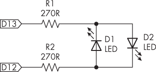

图 5-1：连接到 Arduino 输出的两个 LED 的电路图

如果 D13 引脚为 HIGH 且 D12 引脚为 LOW，电流将从 D13 引脚流经 R[1]，通过 D[2]，然后流经 R[2]，最后进入 D12，引起 LED D[2] 点亮。如果你反转输出，使 D12 引脚为 HIGH 而 D13 引脚为 LOW，电流将从 D12 引脚流经 D[1]，通过 R[1]，并进入 D13，引起 LED D[1] 点亮。电流始终会流经两个电阻器，因此它们的总值应适合通过数字输出驱动 LED。使用 5V 输出时，270 Ω 到约 510 Ω 的电阻值将提供足够的亮度。

为了测试 Charlieplexing，构建图 5-1 中的电路；然后运行清单 5-1 中的草图。

```
void setup()
{
    pinMode(13, OUTPUT);
    pinMode(12, OUTPUT);
}

void loop()
{
    digitalWrite(13, HIGH);
    digitalWrite(12, LOW);
    delay(500);
    digitalWrite(13, LOW);
    digitalWrite(12, HIGH);
    delay(500);
} 
```

清单 5-1：两个 LED 的演示

这个草图展示了如何通过电流控制两个 LED 中的一个，而不需要 GND 引脚。它仅作为介绍 Charlieplexing 概念的基础示例；将两个 LED 进行 Charlieplexing 并没有实际好处，因为它并没有减少所使用的 I/O 引脚数量。然而，一旦你在电路中增加另一个 I/O 引脚，Charlieplexing 的潜力将变得非常明显，如下一个项目所示。

项目 #15：使用六个 LED 的 Charlieplexing

在这个项目中，你将使用仅三个数字输出引脚控制六个 LED，展示 Charlieplexing 的优势。

你将需要以下部件：

+   一块 Arduino Uno 或兼容板和 USB 电缆

+   三个 270 Ω，0.25 W，1% 的电阻器

+   六个 LED

+   两块无焊面包板

+   公对公跳线

按照图 5-2 所示组装电路。

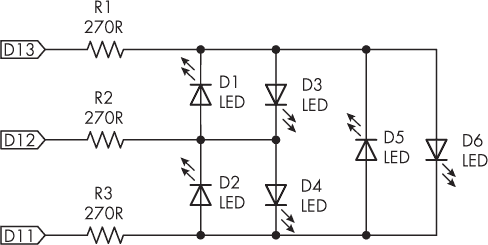

图 5-2：项目 #15 的电路图

为了便于组装，使用两块并排的无焊面包板，如图 5-3 所示。

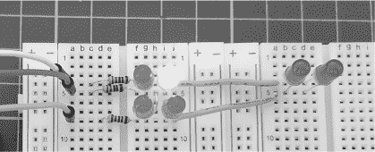

图 5-3：已组装的项目 #15

现在输入并上传以下草图到你的 Arduino。上传草图后不久，每个 LED 从 1 到 6 将依次点亮。

```
// Project #15 - Charlieplexing six LEDs

❶ #define d 1000

❷ void LED1()
{
  ❸ DDRB = B00110000;
  ❹ PORTB = B00010000;
}

void LED2()
{
    DDRB = B00110000;
    PORTB = B00100000;
}

void LED3()
{
    DDRB = B00011000;
    PORTB = B00001000;
}

void LED4()
{
    DDRB = B00011000;
    PORTB = B00010000;
}

void LED5()
{
  ❺ DDRB = B00101000;
    PORTB = B00001000;
}

void LED6()
{
    DDRB = B00101000;
 PORTB = B00100000;
}

void setup() {}

void loop()
❻ {
    LED1(); delay(d); LED2(); delay(d); LED3(); delay(d);
    LED4(); delay(d); LED5(); delay(d); LED6(); delay(d);
} 
```

如果你习惯于为每个数字输出引脚使用一个 LED，操作的前几秒钟可能看起来像是魔术，但你可以通过小心地引导电流通过合适的引脚和电阻来实现这些效果。

以原理图中的第一个 LED，D[1]为例，它由函数LED1() ❷控制。按照原理图的路径追踪：电流需要从 D12 引脚流经 R[2]、LED 本身，再流过 R[1]，最后进入 D13 引脚。你不希望电流流经 D[4]，因此将 D11 引脚设置为输入，阻止电流流动。虽然 D[4]和 D[5]在电流路径中，但它们不会被激活，因为电阻和它们的正向工作电压极大地降低了电流的电压。

这段草图使用端口操作（详见第二章）来控制数字引脚，而不是使用大量的pinMode()和digitalWrite()函数。这大大减少了所需的代码量，同时也为项目的其余部分释放了更多内存。

要在代码中开启 D[1]，该草图通过端口操作开启 LED D[1]，并将 D13 引脚设置为 HIGH，D12 引脚设置为 LOW。草图首先激活 PORTB 引脚类型 D13 到 D8 ❸，将 D13 设置为输出，将 D12 设置为输出，将 D11 设置为输入，未使用的引脚保持为 0。接着，草图激活输出引脚 ❹，将 D13 设置为 LOW，将 D12 设置为 HIGH，输入保持为 0。这就点亮了 LED D[1]。

在项目中的另一个例子中，考虑 LED D[5]。要点亮它，电流必须从 D11 引脚流经 R[3]、D[4]和 R[1]，然后进入 D13 引脚。草图将 D11 引脚设置为 HIGH，将 D13 引脚设置为 LOW，将 D12 引脚设置为输入 ❺，以阻止电流向该方向流动。

草图为每个 LED 依次设置电流流动方式，使用从❶开始的每个 LED 的函数。与使用传统的digitalWrite()函数不同，后者需要先使用pinMode()函数将引脚配置为输出或输入，在void setup()中无需任何操作，因此代码可以依次点亮每个 LED，从❻开始。

你可以通过更改定义的值d ❶，来调整每个 LED 开启之间的时间间隔。尽管草图没有使用这个选项，你也可以在代码的任何位置一次性关闭所有 LED，方法是使用以下代码行：

```
DDRB = B00000000; // Set all pins to inputs (high-Z) 
```

将该项目的硬件保留，以便用于下一个项目。在下一部分，我将向你展示一种更系统化的方式，来确定哪些引脚需要设置为 HIGH 或 LOW。

## 更大的 Charlieplexing 显示器

在构建更大的 Charlieplexing 电路时，创建一个包含 LED 及其所需引脚类型和输出的逻辑表，可以帮助你规划如何编写代码。这使得创建控制 LED 所需的 DDRB 和 PORTB 函数变得更加容易。为此，追踪每个 LED 所需的电流路径，然后确定每个 LED 的引脚状态。例如，表 5-1 是项目 #15 的逻辑表，其中 L 代表 LOW，H 代表 HIGH，Z 代表输入。

表 5-1: 项目 #15 的逻辑表

| LED# | 引脚 D13 | 引脚 D12 | 引脚 D11 |
| --- | --- | --- | --- |
| 1 | L | H | Z |
| 2 | H | L | Z |
| 3 | Z | L | H |
| 4 | Z | H | L |
| 5 | L | Z | H |
| 6 | H | Z | L |

创建这样的表格可以简化确定端口操作命令的过程，因为你可以将每个字母与其相应的 1、0 和输入对应起来。要制作你自己的表格，首先追踪每个 LED 所需的电流流向，然后标注每个 I/O 引脚的状态。例如，要在项目 #15 中激活 LED 4，电流必须从引脚 D12（因此它是 HIGH）流出，经过 R[2]，通过 LED D[4]，然后经过 R[3]，返回 D11（因此它是 LOW）。你不希望电流流入或流出 D13，因此它会是 Z。你可以使用这些 HIGH、LOW 和 Z 信息来创建代码中所需的 DDR 和 PORTB 函数。

一旦你使用的 I/O 引脚超过两个，你就可以将一对 LED 连接到每一条 I/O 线上。要确定你可以用 Arduino 上的任意数量的 I/O 引脚控制多少个 LED，可以使用公式 *L* = *n*² − *n*，其中 *L* 是 LED 的数量，*n* 是 I/O 引脚的数量。例如，如果你有 4 个引脚，你可以使用 12 个 LED（4² − 4 = 12）。

让我们在下一个项目中尝试这个。

项目#16：使用 12 个 LED 的 Charlieplexing

在这个项目中，你将练习使用 Charlieplexing 技术，仅通过四个数字输出引脚控制一个更大的 LED 显示器。你将需要以下零件：

+   一块 Arduino Uno 或兼容的开发板和 USB 电缆

+   四个 270 Ω，0.25 W，1% 的电阻器

+   12 个 LED

+   两块无焊接面包板

+   公对公跳线

按照图 5-4 中的示意图组装电路。

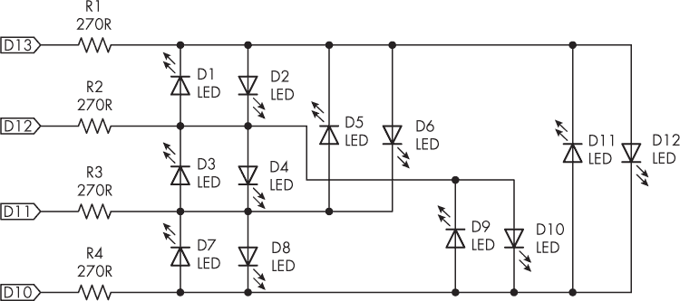

图 5-4：项目#16 的电路图

你可以通过扩展项目#15 的硬件设置来构建这个项目，使用两块并排放置的无焊接面包板，如图 5-5 所示。

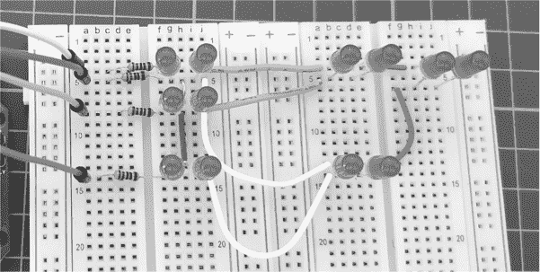

图 5-5：已组装的项目#16

表 5-2 是项目#16 的逻辑表。你可以将此与后续草图中的端口操作进行比较，以加深你对控制 LED 的理解。为了练习，可以沿着电路图追踪不同 LED 的电流，并与表格进行对比。

表 5-2： 项目#16 的逻辑表

| LED# | 引脚 D13 | 引脚 D12 | 引脚 D11 | 引脚 D10 |
| --- | --- | --- | --- | --- |
| 1 | L | H | Z | Z |
| 2 | H | L | Z | Z |
| 3 | Z | L | H | Z |
| 4 | Z | H | L | Z |
| 5 | L | Z | H | Z |
| 6 | H | Z | L | Z |
| 7 | Z | Z | L | H |
| 8 | Z | Z | H | L |
| 9 | Z | L | Z | H |
| 10 | Z | H | Z | L |
| 11 | L | Z | Z | H |
| 12 | H | Z | Z | L |

将项目#16 的草图上传到你的 Arduino 板。上传草图后一两秒钟，每个 LED 应该依次亮起。

让我们看看这个是如何工作的：

```
// Project #16 - Charlieplexing with 12 LEDs

#define d 250 ❶
void LED1()
{
    DDRB = B00110000; ❷
    PORTB = B00010000;
}

void LED2() {DDRB = B00110000; PORTB = B00100000;}
void LED3() {DDRB = B00011000; PORTB = B00001000;}
void LED4() {DDRB = B00011000; PORTB = B00010000;}
void LED5() {DDRB = B00101000; PORTB = B00001000;}
void LED6() {DDRB = B00101000; PORTB = B00100000;}
void LED7() {DDRB = B00001100; PORTB = B00000100;}
void LED8() {DDRB = B00001100; PORTB = B00001000;}
void LED9() {DDRB = B00010100; PORTB = B00000100;}
void LED10(){DDRB = B00010100; PORTB = B00010000;}
void LED11(){DDRB = B00100100; PORTB = B00000100;}
void LED12(){DDRB = B00100100; PORTB = B00100000;}

void noLED() ❸
{
    DDRB = B00000000; // All to inputs, high-impedance
}

void setup() {}

void loop()
{
LED1(); delay(d); LED2(); delay(d); LED3(); delay(d); LED4(); delay(d);
LED5(); delay(d); LED6(); delay(d); LED7(); delay(d); LED8(); delay(d);
LED9(); delay(d); LED10(); delay(d); LED11(); delay(d); LED12(); delay(d); ❹
}
```

与项目#15 一样，每个 LED 由从❷开始的单独函数激活。在void LED1()之后，为了节省空间，我将每个函数压缩成一行代码。再次强调，端口操作大大提高了草图的效率。

你可以改变每个 LED 开关之间的延迟时间❶。该草图包含了一个函数，可以在需要时关闭所有 LED，以便用于其他未来的项目❸。为了节省空间，我把多个函数放在了一行上❹，每个 LED 在预设的延迟时间后被点亮。

该项目中 LED 的布局看起来可能是随机的，但你现在已经掌握了使用 Charlieplexing 创建更有用、更复杂显示的技能，这将在项目 #18 中进行。不过，首先，我将向你展示如何使用 ATtiny85 进行 Charlieplexing。

项目 #17：使用 ATtiny85 进行 Charlieplexing

使用 ATtiny85 微控制器进行 Charlieplexing 可以为你提供一个更便宜、更小巧的电路方案，用于控制大量的 LED 而无需外部设备。这个项目展示了如何使用 ATtiny85 控制 12 个 LED。

你将需要项目 #16 中的 LED 电路，以及项目 #13 在第三章中的 ATtiny85 编程扩展板，或者以下部件：

+   一块 Arduino Uno 或兼容板以及 USB 电缆

+   一个 ATtiny85 微控制器

+   一个 10 微法的电解电容

+   两块无焊面包板

+   公对公跳线

首先，按照第三章中的说明（如果你完成了项目 #13）组装 ATtiny85 编程设置，使用编程扩展板或为该项目列出的部件，然后上传代码。接着，将 ATtiny85 连接到 LED 电路，如图 5-6 所示。LED 电路与项目 #16 中的引脚连接不同，但其他方面是相同的。

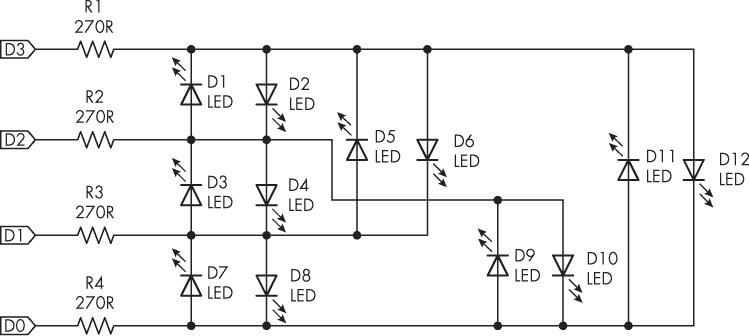

图 5-6：项目 #17 的电路图

接下来，上传代码：

```
// Project 17 - Charlieplexing with ATtiny85

#define d 250
void LED1() {DDRB = B00001100; PORTB = B00000100;}
void LED2() {DDRB = B00001100; PORTB = B00001000;}
void LED3() {DDRB = B00000110; PORTB = B00000010;}
void LED4() {DDRB = B00000110; PORTB = B00000100;}
void LED5() {DDRB = B00001010; PORTB = B00000010;}
void LED6() {DDRB = B00001010; PORTB = B00001000;}
void LED7() {DDRB = B00000011; PORTB = B00000001;}
void LED8() {DDRB = B00000011; PORTB = B00000010;}
void LED9() {DDRB = B00000101; PORTB = B00000001;}
void LED10(){DDRB = B00000101; PORTB = B00000100;}
void LED11(){DDRB = B00001001; PORTB = B00000001;}
void LED12(){DDRB = B00001001; PORTB = B00001000;}

void noLED(){DDRB = B00000000;} // All to inputs, high-impedance

void setup() {}

void loop()
{
LED1(); delay(d); LED2(); delay(d); LED3(); delay(d); LED4(); delay(d);
LED5(); delay(d); LED6(); delay(d); LED7(); delay(d); LED8(); delay(d);
LED9(); delay(d); LED10(); delay(d); LED11(); delay(d); LED12(); delay(d);
}
```

上传后，该代码应该与项目 #16 的操作方式相同，12 个 LED 将依次亮起。不过，代码对端口的操作方式有所不同。由于你使用的是 ATtiny85 的 PORTB 的 3、2、1 和 0 引脚（数字 D3 至 D0），因此你的 DDRB 和 PORTB 函数需要操作位 0 至 3。

项目 #18：构建一个 30 LED 矩阵显示器

本项目将 Charlieplexing 技术提升到下一个层次，使用一个更大的 30 LED 电路，你可以用它来显示数字或你自己设计的字符。

从理论上讲，虽然可能实现，但在两块无焊面包板上搭建这个项目的电路极其困难，因此我强烈建议你下载该项目的 PCB 文件并自行制作 PCB。你将需要以下部件：

+   一块 Arduino Uno 或兼容板以及 USB 电缆

+   六个 270 Ω，0.25 W，1% 的电阻

+   三十个 5 毫米 LED

+   两块无焊面包板或项目 #18 的 PCB

+   1 个 40 针 2.54 毫米排针（如果使用 PCB）

+   各种跳线

按照图 5-7 所示组装电路。

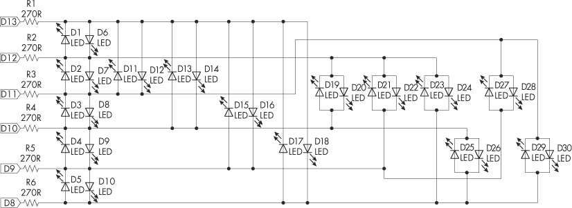

图 5-7：项目 #18 的电路图

如果你已经订购了 PCB，组装起来很简单。从板上的布局可以看出，所有 LED 的正极引脚指向顶部，负极（平面的一侧）指向底部，如 图 5-8 所示。

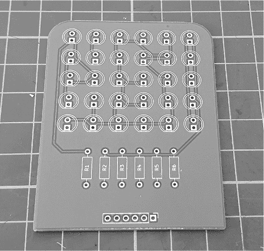

图 5-8：项目 #18 的 PCB

先安装电阻器，再安装 LED，最后安装内联插头引脚。将引脚放置在后面，确保它们从背面突出出来，然后通过跳线将 PCB 支撑连接到 Arduino，或者直接将 PCB 放入 Arduino 中，如 图 5-9 所示。PCB 上的引脚标有与 Arduino 引脚号匹配的标签。

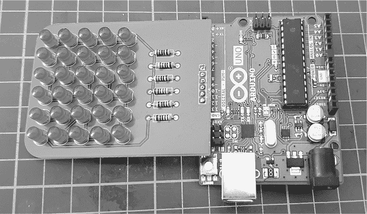

图 5-9：完成的项目 #18 电路

表 5-3 是项目 #18 的逻辑表，你可以将其与 清单 5-2 中的端口操作进行比较，或者与稍后列出的项目 #18 的草图或 图 5-7 中的原理图进行比较。同样，为了练习，可以通过原理图追踪不同 LED 的电流，并与表格对比，以增加你对控制 LED 的熟悉度。

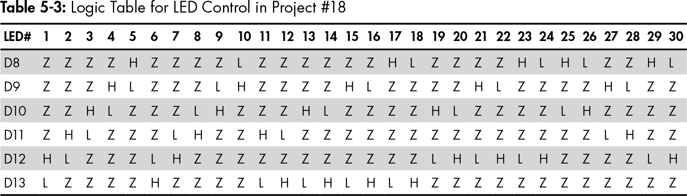

在继续之前，请确保你的 LED 正常工作，通过输入并上传 清单 5-2 中的草图，应该能让每个 LED 依次点亮和熄灭。

```
#define d 250 ❶
void LED1() {DDRB = B00110000; PORTB = B00010000;} ❷
void LED2() {DDRB = B00011000; PORTB = B00001000;}
void LED3() {DDRB = B00001100; PORTB = B00000100;}
void LED4() {DDRB = B00000110; PORTB = B00000010;}
void LED5() {DDRB = B00000011; PORTB = B00000001;}
void LED6() {DDRB = B00110000; PORTB = B00100000;}
void LED7() {DDRB = B00011000; PORTB = B00010000;}
void LED8() {DDRB = B00001100; PORTB = B00001000;}
void LED9() {DDRB = B00000110; PORTB = B00000100;}
void LED10(){DDRB = B00000011; PORTB = B00000010;}
void LED11(){DDRB = B00101000; PORTB = B00001000;}
void LED12(){DDRB = B00101000; PORTB = B00100000;}
void LED13(){DDRB = B00100100; PORTB = B00000100;}
void LED14(){DDRB = B00100100; PORTB = B00100000;}
void LED15(){DDRB = B00100010; PORTB = B00000010;}
void LED16(){DDRB = B00100010; PORTB = B00100000;}
void LED17(){DDRB = B00100001; PORTB = B00000001;}
void LED18(){DDRB = B00100001; PORTB = B00100000;}
void LED19(){DDRB = B00010100; PORTB = B00000100;}
void LED20(){DDRB = B00010100; PORTB = B00010000;}
void LED21(){DDRB = B00010010; PORTB = B00000010;}
void LED22(){DDRB = B00010010; PORTB = B00010000;}
void LED23(){DDRB = B00010001; PORTB = B00000001;}
void LED24(){DDRB = B00010001; PORTB = B00010000;}
void LED25(){DDRB = B00000101; PORTB = B00000001;}
void LED26(){DDRB = B00000101; PORTB = B00000100;}
void LED27(){DDRB = B00001010; PORTB = B00000010;}
void LED28(){DDRB = B00001010; PORTB = B00001000;}
void LED29(){DDRB = B00001001; PORTB = B00000001;}
void LED30(){DDRB = B00001001; PORTB = B00001000;}

void noLED(){DDRB = B00000000;} // All LEDs to input, high impedance ❸

void setup() {}

void loop()
{
LED1(); delay(d); LED2(); delay(d); LED3(); delay(d); LED4(); delay(d);
LED5(); delay(d); LED6(); delay(d); LED7(); delay(d); LED8(); delay(d);
LED9(); delay(d); LED10(); delay(d); LED11(); delay(d); LED12(); delay(d);
LED13(); delay(d); LED14(); delay(d); LED15(); delay(d); LED16(); delay(d);
LED17(); delay(d); LED18(); delay(d); LED19(); delay(d); LED20(); delay(d);
LED21(); delay(d); LED22(); delay(d); LED23(); delay(d); LED24(); delay(d);
LED25(); delay(d); LED26(); delay(d); LED27(); delay(d); LED28(); delay(d);
LED29(); delay(d); LED30(); delay(d);
}
```

清单 5-2：测试 30 个 LED 矩阵显示

草图通过定义 d ❶ 来设置每个 LED 点亮和熄灭之间的延迟。从 ❷ 开始，函数设置 GPIO 引脚端口，以依次控制每个所需的引脚激活 LED。函数 ❸ 将所有 LED 关闭。之后，主循环会无限次地依次激活每个 LED。我已将代码的空格最小化，以提高显示效率。

现在你已经测试了 LED，接下来可以进入并上传项目的草图了。（如果你还没有，建议从书籍网页 [*https://<wbr>nostarch<wbr>.com<wbr>/arduino<wbr>-arduinians*](https://nostarch.com/arduino-arduinians) 下载代码，而不是自己输入。）数字 0 到 9 应该依次在 LED 显示屏上显示，然后从 0 开始重新显示。

```
// Project #18 - Using the 30-LED matrix display

int pixels[10][30] = ❶
{ {0, 1, 1, 1, 0, 0, 1, 1, 0, 0, 1, 0, 1, 0, 1, 0, 1, 0, 1, 0, 0, 1, 1, 0, 0, 1, 1, 1, 0, 0},
  {0, 1, 0, 0, 0, 0, 1, 1, 0, 0, 0, 0, 0, 1, 0, 0, 0, 0, 0, 1, 0, 0, 0, 0, 1, 1, 1, 0, 0, 0},
  {0, 1, 1, 0, 0, 0, 1, 0, 0, 1, 0, 0, 0, 0, 1, 0, 0, 0, 0, 1, 0, 0, 0, 0, 1, 1, 1, 1, 0, 0},
  {1, 1, 1, 0, 0, 0, 0, 0, 0, 1, 0, 0, 0, 1, 1, 0, 0, 0, 0, 0, 0, 1, 0, 0, 1, 1, 1, 0, 0, 0},
  {1, 0, 0, 1, 0, 0, 1, 0, 0, 1, 0, 0, 1, 1, 1, 1, 0, 0, 0, 0, 0, 1, 0, 0, 0, 0, 0, 1, 0, 0},
  {1, 1, 1, 1, 0, 0, 1, 0, 0, 0, 0, 0, 1, 1, 1, 0, 0, 0, 0, 0, 0, 1, 0, 0, 1, 1, 1, 0, 0, 0},
  {0, 1, 1, 0, 0, 0, 1, 0, 0, 0, 0, 0, 1, 1, 1, 0, 0, 0, 1, 0, 0, 1, 0, 0, 0, 1, 1, 0, 0, 0},
  {1, 1, 1, 1, 1, 0, 0, 0, 0, 0, 1, 0, 0, 0, 0, 0, 1, 0, 0, 0, 0, 0, 1, 0, 0, 0, 0, 0, 1, 0},
  {1, 1, 1, 1, 1, 0, 1, 0, 0, 0, 1, 0, 1, 1, 1, 1, 1, 0, 1, 0, 0, 0, 1, 0, 1, 1, 1, 1, 1, 0},
  {1, 1, 1, 1, 1, 0, 1, 0, 0, 0, 1, 0, 1, 1, 1, 1, 1, 0, 0, 0, 0, 0, 1, 0, 0, 0, 0, 0, 1, 0}};

void displayDigits(int i, int duration) ❷
{
    for (int a = 0; a < duration; a++)
    {
        for (int b = 0; b < 30; b++)
        {
            if (pixels[i][b] == 1)
            {
                turnOnLED(b + 1); ❸
                delay(1); // Adjust as required ❹
 }
        }
    }
    noLED();
}

void LED1() {DDRB = B00110000; PORTB = B00010000;} ❺
void LED2() {DDRB = B00011000; PORTB = B00001000;}
void LED3() {DDRB = B00001100; PORTB = B00000100;}
void LED4() {DDRB = B00000110; PORTB = B00000010;}
void LED5() {DDRB = B00000011; PORTB = B00000001;}
void LED6() {DDRB = B00110000; PORTB = B00100000;}
void LED7() {DDRB = B00011000; PORTB = B00010000;}
void LED8() {DDRB = B00001100; PORTB = B00001000;}
void LED9() {DDRB = B00000110; PORTB = B00000100;}
void LED10(){DDRB = B00000011; PORTB = B00000010;}
void LED11(){DDRB = B00101000; PORTB = B00001000;}
void LED12(){DDRB = B00101000; PORTB = B00100000;}
void LED13(){DDRB = B00100100; PORTB = B00000100;}
void LED14(){DDRB = B00100100; PORTB = B00100000;}
void LED15(){DDRB = B00100010; PORTB = B00000010;}
void LED16(){DDRB = B00100010; PORTB = B00100000;}
void LED17(){DDRB = B00100001; PORTB = B00000001;}
void LED18(){DDRB = B00100001; PORTB = B00100000;}
void LED19(){DDRB = B00010100; PORTB = B00000100;}
void LED20(){DDRB = B00010100; PORTB = B00010000;}
void LED21(){DDRB = B00010010; PORTB = B00000010;}
void LED22(){DDRB = B00010010; PORTB = B00010000;}
void LED23(){DDRB = B00010001; PORTB = B00000001;}
void LED24(){DDRB = B00010001; PORTB = B00010000;}
void LED25(){DDRB = B00000101; PORTB = B00000001;}
void LED26(){DDRB = B00000101; PORTB = B00000100;}
void LED27(){DDRB = B00001010; PORTB = B00000010;}
void LED28(){DDRB = B00001010; PORTB = B00001000;}
void LED29(){DDRB = B00001001; PORTB = B00000001;}
void LED30(){DDRB = B00001001; PORTB = B00001000;}

void noLED(){DDRB = B00000000;} // all LEDs to input, high impedance

void turnOnLED(int l)
{
    switch (l)
    {❻
        case 1 : LED1(); break;
        case 2 : LED2(); break;
        case 3 : LED3(); break;
        case 4 : LED4(); break;
        case 5 : LED5(); break;
        case 6 : LED6(); break;
        case 7 : LED7(); break;
        case 8 : LED8(); break;
        case 9 : LED9(); break;
        case 10 : LED10(); break;
        case 11 : LED11(); break;
 case 12 : LED12(); break;
        case 13 : LED13(); break;
        case 14 : LED14(); break;
        case 15 : LED15(); break;
        case 16 : LED16(); break;
        case 17 : LED17(); break;
        case 18 : LED18(); break;
        case 19 : LED19(); break;
        case 20 : LED20(); break;
        case 21 : LED21(); break;
        case 22 : LED22(); break;
        case 23 : LED23(); break;
        case 24 : LED24(); break;
        case 25 : LED25(); break;
        case 26 : LED26(); break;
        case 27 : LED27(); break;
        case 28 : LED28(); break;
        case 29 : LED29(); break;
        case 30 : LED30(); break;
    }
}

void setup(){}

void loop()
{
    for (int q = 0; q < 10; q++) ❼
    {
        displayDigits(q, 50); ❽
        delay(250);
    }
}
```

二维数组 ❶ 包含 10 个数组，分别对应数字 0 到 9。每个数字数组有 30 个元素，与显示板上的 30 个 LED 对应。显示板上的 LED 从左上角的 1 到右下角的 30 排列。在数组中，每个 1 表示需要快速依次点亮的 LED，以显示每个数字。

自定义的 displayDigits() 函数 ❷ 接受你要显示的数字以及该函数显示所需 LED 的次数。第二个参数中的数字越大，数字在显示器上的显示时间就越长。displayDigits() 函数使用另一个自定义函数 turnOnLED() ❸ 来点亮所需的 LED。turnOnLED() 函数又使用 switch…case ❻ 来调用列表 ❺ 中的适当函数，并点亮每个单独的 LED。

delay() 函数 ❹ 在 displayDigits() 内被设置为使每个 LED 在下一个点亮之前保持点亮 1 毫秒。由于 LED 亮灭非常快，人眼将所需的所有 LED 视为在同一时间亮起，如图 5-10 所示。你可以改变延迟的长度，以调整显示效果以适应个人喜好。

最后，在 void loop() 中，数字 0 到 9 会依次显示 ❼，并在每个数字之间有短暂的延迟。每个数字通过 50 次刷新来显示 ❽。

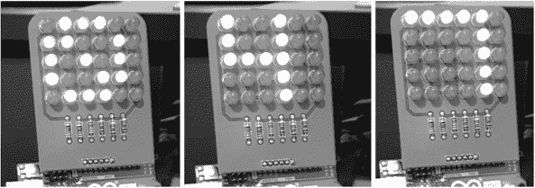

图 5-10：项目 #18 的示例

该草图使用 Monomin 字体显示数字，如图 5-11 所示。


图 5-11：Monomin 6×5 字体数字

你可以通过访问 [*https://<wbr>fontstruct<wbr>.com*](https://fontstruct.com) 查找更多关于此字体的信息，并搜索 Monomin 6×5 字体。

## 制作自定义字符显示

除了项目 #18 中显示的数字外，你还可以创建其他显示类型。要创建你自己的字符，首先使用一些方格纸或电子表格绘制你想要的显示样式。例如，要创建一个边界矩形，绘制图 5-12 所示的图示。

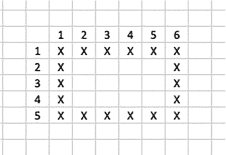

图 5-12：规划要显示的字符

左上角的 X 代表 LED 1，右下角的 X 代表 LED 30。然后，你创建自己的数组，表示每个 LED 的状态。对于这个示例，数组看起来会是这样的：

```
{1, 1, 1, 1, 1, 1, 1, 0, 0, 0, 0, 1, 1, 0, 0, 0, 0, 1, 1, 0, 0, 0, 0, 1, 1, 1, 1, 1, 1, 1}
```

然后，你可以像在项目 #18 中对待其他数字一样，将这个数组添加或替换到草图中，并使用 displayDigits() 函数在显示器上显示自定义字符，如 图 5-13 所示。

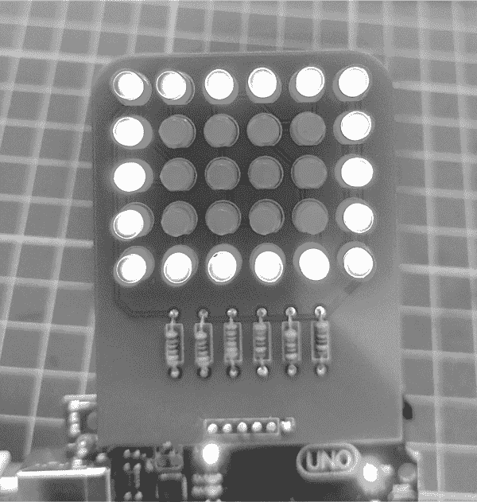

图 5-13：自定义字符

在设计你自己的自定义字符时，使用电子表格或图纸来规划你想要开启和关闭的 LED 布局会有所帮助。

## 继续

使用 Charlieplexing 技术，你现在可以用最少的 I/O 引脚控制多个 LED，而无需使用外部集成电路。你已经学会了如何通过最少的数字输出引脚控制 2、6、12 或 30 个 LED，并且了解了如何使用 Charlieplexing 控制紧凑型 ATtiny 微控制器。

在下一章，你将学习如何使你的 Arduino 能够自动关闭电源。
