# 第六章：6 添加专业电源控制


你可以使用*软电源控制*而不是通过开关或 USB 线来控制 Arduino 的电源：通过按钮打开和关闭电源，或者让 Arduino 通过程序或外部传感器自动关闭电源。软电源提高了项目的专业性。例如，如果你正在设计一个精美的高保真放大器，一对开关按钮看起来比你在工业设备上看到的那种开关要好得多。

本章介绍了多种软电源控制方法。你将学到：

+   使用 MOSFET 控制更大的电流

+   使用 555 定时器 IC 的双稳态模式

+   使用外部设备打开 Arduino 电路

+   通过构建仅在需要时开启的项目来节省电力

+   使用 DS3231 实时时钟（RTC）库进行 Arduino 开发

你还将为 Arduino 创建一个软开关，并构建一个低功耗事件记录器。

## 无物理开关供电 Arduino

为 Arduino 项目供电通常是通过 USB 插口、电池组或外部 AC 适配器。此时打开和关闭项目意味着需要拔掉电缆或 DC 插头，这对于仅做实验或为个人使用而构建的项目来说是可行的。然而，软电源控制使你能够通过按钮或来自其他设备的信号控制 Arduino 项目的电源，或者让 Arduino 项目完全关机。这不需要连接或切断电流流动的“硬”物理开关。

软电源控制减少了硬件的磨损，因为没有用于电源控制的活动部件，并且使接口更加简洁易用。通过按钮开启和关闭电源，或者进一步自动化设备控制，能够创造更好的用户体验。

本节进一步讨论了实现这些软电源控制电路所需的两种组件：用于开关电流的 MOSFET；以及 555 定时器 IC，在本例中作为软电源控制中的开关信号接口。

### 操作 MOSFET

MOSFET 允许你通过小信号（例如来自 Arduino 数字输出引脚的信号）开关大电压和电流。它们有多种大小可供选择，如图 6-1 所示。

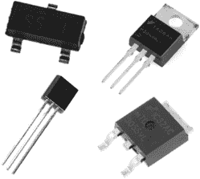

图 6-1：各种 MOSFET

图 6-1 左下角显示的是来自第四章项目#14 的小型 2N7000 N-MOSFET，我们将在本章中继续使用它。看 2N7000 的正面（平面一侧），三个引脚从左到右分别是：

+   电源

+   门极

+   排水

图 6-2 显示了 2N7000 MOSFET 的原理符号。


图 6-2：2N7000 MOSFET 的原理符号

操作 MOSFET 非常简单。当你向栅极引脚施加一个小电流时，较大的电流就可以通过漏极引脚流入，并从源极引脚流出。你还可以使用 PWM 控制 MOSFET，从而实现对灯光、电机等设备的多种控制。你的 2N7000 MOSFET 可以连续处理高达 60 V DC 和 200 mA，或在突发情况下处理 500 mA。在为其他项目选择 MOSFET 时，一定要检查最大电压和电流是否符合你想要切换的信号要求。

你可以使用更大的 MOSFET 来控制更大的电流，例如 图 6-3 中显示的 IRF520。

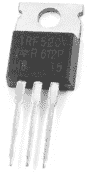

图 6-3：IRF520 N-MOSFET

使用 MOSFET 时，务必查看数据表以确认引脚定义，因为不同型号的引脚定义可能不同。你可以找到更大的 MOSFET 扩展板形式，方便原型制作。图 6-4 显示了两个例子：左侧是 Freetronics 的 N-MOSFET 模块，右侧是 PMD Way（零件号 759300）的 IRF520 扩展板。

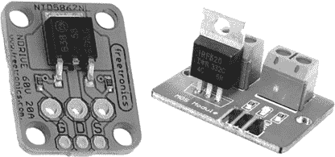

图 6-4：两块示例 MOSFET 扩展板

在本章中，你将使用 2N7000 来控制 Arduino 的电源供应。你还会在栅极和源极引脚之间连接一个 10 kΩ 的电阻，以确保当没有电流作用于栅极时，栅极保持关闭状态，防止 MOSFET 在随机情况下微弱开关。

### 在双稳态模式下使用 555 定时器 IC

要创建开/关开关，你可以使用 555 定时器 IC（最初用于 第四章）在 *双稳态模式* 下，配置电路使两个按钮切换输出引脚的电平为高或低。然后，输出将用来控制 MOSFET，进而开关 Arduino 的电源。

图 6-5 显示了双稳态 555 电路。

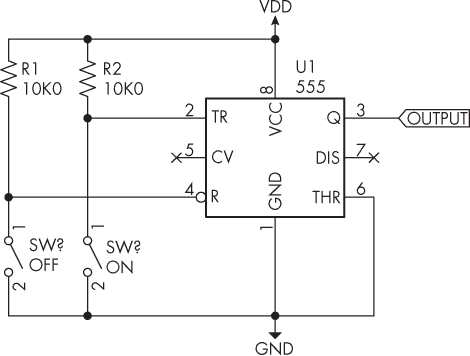

图 6-5：555 定时器 IC 在双稳态模式下的原理图

将引脚 2（触发引脚）通过 SW[1] 拉至 GND 将开启输出，而将引脚 4（复位引脚）通过 SW[2] 拉至 GND 将关闭输出。这就是你所需要的软开关！该电路可以在 5 V 到 12 V DC 的电压范围内工作。自己动手制作并测试，或许可以使用 LED 和 1 kΩ 电阻作为输出指示器。

然而，在本章的项目中，你需要切换整个 Arduino 的电源。在接下来的项目中，你将不再使用输出引脚作为电源，而是通过双稳态电路开关 2N7000 N-MOSFET 的开关，允许你控制更大的电流。

项目#19：创建一个软开关

在这个项目中，你将为你的 Arduino 创建一个软开关。你可以使用 9 到 12 V 直流电源来驱动 555 定时器；Arduino 将调节电压至其所需的 5 V。

你可以使用无焊面包板搭建此电路进行临时实验，或者使用可下载的项目文件创建一个定制的 PCB，如果你希望制作一个更持久的版本。你将使用这里列出的零件来完成本章剩余项目：

+   一个 Arduino Uno 或兼容板和 USB 电缆

+   一个 9 到 12 V 直流、1A 电源，墙壁适配器或插头式电源

+   一个无焊面包板或项目#19 的 PCB

+   三个 10 kΩ、0.25 W、1%的电阻

+   一个 2N7000 N-MOSFET

+   一个 555 定时器 IC（如果使用 PCB 的话，还需要一个 8 针 IC 插座）

+   两个触觉按钮

+   1 × 40 2.54 mm 内联连接器针脚（如果使用 PCB）

+   一个 PCB 安装的直流插座（如果使用 PCB 的话）

+   公对公跳线

如果你使用的是带有直流插头的电源，例如墙壁适配器，你可能希望使用像 PMD Way 的 51201299 直流插座模块，以避免需要切断电源线插头，如图 6-6 所示。

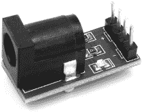

图 6-6：直流插座模块

按照图 6-7 所示组装电路。

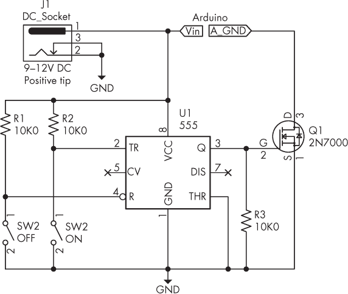

图 6-7：项目#19 的原理图

如果你使用的是无焊面包板，直流插座只是将所需的 9 到 12 V 直流电源送到电路。原理图右上方的 Vin 和 GND 标签分别是 Arduino 的 Vin 和 GND 引脚的连接。

如果你使用的是图 6-8 中所示的 PCB，组装过程非常简单。首先安装电阻器，然后是按钮，接着是 IC 插座、直流插座和内联连接器针脚。（这个项目中有一些额外的连接没有列出，稍后在项目#20 中你会使用到它们。）

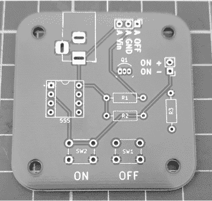

图 6-8：项目#19 的 PCB

一旦组装完成，你的 PCB 应该与图 6-9 所示相似。

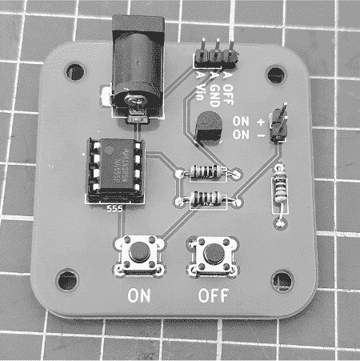

图 6-9：项目#19 完成的 PCB

将 Arduino 连接到 PCB 上，然后连接外部电源，电压范围为 6 到 12 V 直流电。你可以通过 SW[1]和 SW[2]分别打开和关闭 Arduino。Arduino 的电源指示 LED 将立即告诉你 Arduino 是否开机。

如前所述，当你按下 SW[2]时，555 的输出应该变为 HIGH。在这个电路中，电流流向 N-MOSFET 的栅极（G）引脚，进而开启 MOSFET，使得电流通过漏极（D）引脚流向源极（S）引脚。（即使 Arduino 关闭，电路本身仍会在 9 V 直流电下消耗约 5 mA 的电流。）当 MOSFET 开启时，电流可以通过 Vin 引脚从外部电源流入 Arduino，再通过 GND 引脚流出，通过 MOSFET，最后回到 GND，完成电力回路。当你按下 SW[1]时，555 的输出变为 LOW，MOSFET 被关闭。这意味着没有电流可以通过 Arduino，从而将其关闭。

如果你使用的是无焊面包板，请将电路保持在整个章节中不变。如果它们满足相同的电力需求，你也可以将此电路与其他设备一起使用。现在，让我们使用这个电路来赋予 Arduino 关闭自身的能力。

项目#20：自动关闭 Arduino

作为项目#19 中软开关电路的扩展，你可以通过将 555 的引脚 4 拉至 LOW 来让 Arduino 自动关闭（如同在前一个项目中通过 SW[1]实现的）。这对于创建不需要持续运行的应用非常有用，适用于从简单的游戏到需要仅在事件发生时才记录数据的更复杂数据记录项目。

为了修改项目#19 的电路以实现这个目的，首先将数字输出引脚 D12 连接到 555 引脚 4 和电阻 R[1]的交点，成为关闭信号连接，如果使用无焊面包板，如图 6-10 所示，或者连接到 PCB 上标记为 A OFF 的引脚。

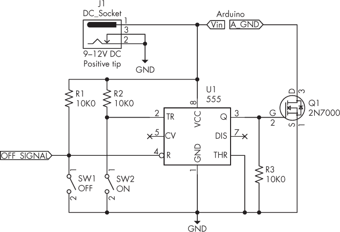

图 6-10：带有 Arduino 自关接点的项目#20 电路

还需连接 Vin 和 GND。打开 Arduino（这应该会点亮板载电源 LED），D13 LED 也应点亮。五秒钟后，D13 LED 应该熄灭；然后，一秒钟后，Arduino 应自动关闭。

让我们看看这个是如何工作的：

```
// Project #20 - Arduino self power off

❶ void turnOff()
{
    digitalWrite(12, LOW);
}

void setup()
{
    pinMode(12, OUTPUT);
    pinMode(13, OUTPUT);
    digitalWrite(12, HIGH);
}

void loop()
{
  ❷ digitalWrite(13, HIGH);
    delay(5000);
  ❸ digitalWrite(13, LOW);
    delay(1000);
  ❹ turnOff();
} 
```

程序首先确保在void setup()中 D12 为 HIGH。接下来，一个简单的自定义函数turnOff() ❶ 将 D12 置为 LOW，触发 555 关闭 MOSFET，从而关闭 Arduino 的电源。程序将点亮 D13 LED ❷ 并熄灭 ❸ 作为活动示例；然后，Arduino 将自动关闭 ❹。

## 从外部设备激活 Arduino

到目前为止，你已经了解了 Arduino 如何自我关闭。我现在将解释如何编程一个外部设备或传感器来激活 Arduino 的电源，它完成任务后再关闭电源，为下一个事件做好准备。

### 常开触点设备

在第 18 和第 19 个项目中使用的开关关闭了 555 引脚 2 和 GND 之间的电路。这意味着你可以用（或与）具有常开（NO）触点的设备替代该开关——换句话说，就是用一种与按键或开关关闭电路的方式相同的设备。这可以是任何东西，例如简单的门铃按钮、当踩在上面时起作用的压力垫、带继电器输出触点的被动红外（PIR）运动传感器、常开簧片开关、可以检测门是否打开的门磁等。

任何可以闭合电路中两个触点的设备都会激活你的 Arduino。只需将设备的两根线分别连接到 555 引脚 2 和 GND，如图 6-11 所示。

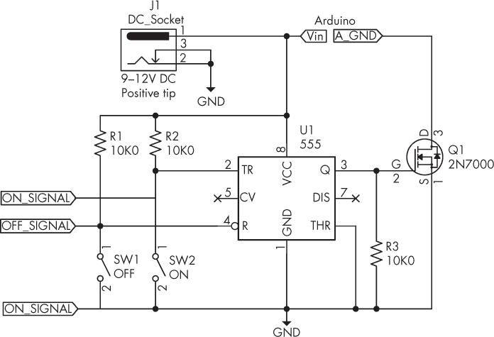

图 6-11：带外部触发连接的软开/关电路原理图

这两个触点在原理图中显示为 ON_SIGNAL 点。如果你使用的是本章的项目 PCB，那么这些点就是 ON+和 ON−引脚。

### 输出逻辑设备

你可能希望通过一些在激活时发出电信号的设备来开启 Arduino，例如逻辑电平 5V 输出。这些设备包括一些被动红外（PIR）运动探测器、温控器、一些工业可编程逻辑控制器（PLC）设备输出等。然而，这些设备需要稍微复杂一点的电路来连接激活点，因为它们的输出信号与前一部分描述的常开方法不同。

为了利用这些设备，你将使用它们的逻辑输出来驱动另一个 2N7000 MOSFET，从而桥接电路并作为开关为你开启电源。这些设备的输出电压必须足够高，才能开启 MOSFET，所以在开始之前一定要向设备供应商或查阅数据手册确认这一点。你将在下一个项目中使用的 MOSFET 需要 3 到 5V DC 来激活。

图 6-12 显示了一个示例电路，左侧包含了必要的额外 MOSFET 和输入。TRIGGER 点连接到设备的输出，而 TR_GND 连接到设备的负极或地线。

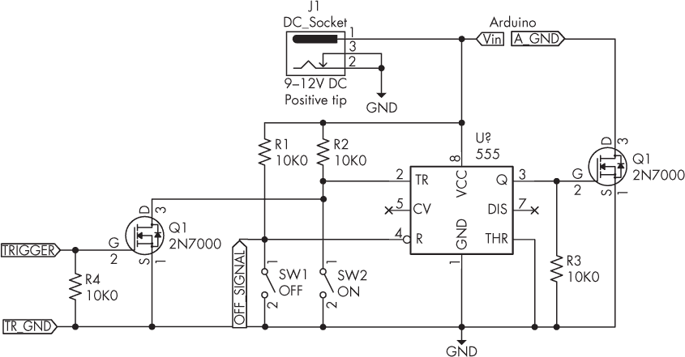

图 6-12：带逻辑电平触发的软开/关电路原理图

在进入下一个项目之前，我将向你展示一个更简单的方法，通过安装一个有用的 Arduino 库来使用 DS1307 和 DS3231 实时时钟 IC。

## DS3231 实时时钟库

下一个项目使用 DS1307 或 DS3231 实时时钟 IC 来为数据记录项目保持时间。为了简化这个过程，你现在将学习如何使用匹配的 DS3231 RTC 库来节省编码工作和空间。该库的工作方式与 DS1307 的库相似。

首先，从[*https://<wbr>github<wbr>.com<wbr>/NorthernWidget<wbr>/DS3231*](https://github.com/NorthernWidget/DS3231)下载库代码的 ZIP 文件。打开 Arduino IDE，选择**草图**  **包含库**  **添加.ZIP 库**。导航到下载的文件，然后点击**确定**来安装库。你可以通过在 IDE 中选择**文件**  **示例**来检查库是否已安装；一个新的 DS3231 选项应该会出现。

输入列表 6-1 中的草图来测试库以及设置和获取时间和日期信息的基本功能，但现在不要上传它：

```
❶ #include <Wire.h>
#include <DS3231.h>
DS3231 RTC;

❷ bool century = false;
bool h12Flag = false;
bool pmFlag = false;
// Change the following for your own time
byte year = `22`;
byte month = `9`;
byte date = `2`;
byte hour = `11`;
byte minute = `8`;
byte second = `0`;

void setTimeData()
{
    RTC.setYear(year);
    RTC.setMonth(month);
    RTC.setDate(date);
    RTC.setHour(hour);
    RTC.setMinute(minute);
    RTC.setSecond(second);
    RTC.setClockMode(false); // Set clock to 24 hour
}

void setup()
{
    Wire.begin();
  ❸ //setTimeData(); // Set time and date
    Serial.begin(9600);
}

void loop()
{
    // Display data on Serial Monitor
    Serial.print(RTC.getDate());
    Serial.print("/");
    Serial.print(RTC.getMonth(century));
    Serial.print("/20");
    Serial.print(RTC.getYear());
    Serial.print(" - ");
    Serial.print(RTC.getHour(h12Flag, pmFlag));
    Serial.print(":");
  ❹ if (RTC.getMinute() < 10)
    {
        Serial.print("0");
    }
    Serial.print(RTC.getMinute());
    Serial.print(":");
  ❺ if (RTC.getSecond() < 10)
    {
        Serial.print("0");
    }
    Serial.println(RTC.getSecond());
    delay(1000);
} 
```

列表 6-1：测试 DS3231 RTC 库

该草图首先包含 I²C 和 RTC 库，然后创建一个实时时钟实例以进行引用 ❶。然后，它声明了所需的变量来保存时间和日期信息 ❷。其中包括三个布尔变量，默认情况下设置为 false，因为你使用的是 24 小时制。

要设置时间，自定义函数setTimeData()包含设置所有时间和日期参数的功能。之前声明的变量被放入每个匹配的函数中。此函数只需调用一次 ❸，因为你将首先设置时间和日期，然后在重新上传草图之前注释掉该函数。否则，时钟将重置为变量的值 ❷。

要检索时间，草图使用一系列以RTC开头的函数，如RTC.getdate()，它们返回相应的数据。为了让分钟和秒数的显示更自然，草图在小于 10 的分钟值 ❹ 和秒数值 ❺ 前显示 0。

要将时间和日期值更改为匹配你自己的时区，输入你自己的时间和日期值 ❷，然后取消注释函数setTimeData()❸，最后上传草图。现在重新注释掉setTimeData()函数，保存并重新上传草图。完成后，以 9,600 bps 打开串口监视器，你应该看到日期和时间每秒更新一次。

让我们将这些触发 Arduino 电源并记录事件的方法结合在一个最终项目中。

项目#21：构建事件记录器

对于这个项目，假设有人需要定期证明自己到达了某个地点。这可能是一个孩子到达学校或参加活动，或者是一个保安检查上班时间，或是一个必须在早上某个特定时间开店的员工。为了创建一个记录这些事件时间和日期的设备，本项目使用了带有 Arduino 和 DS1307 或 DS3231 实时时钟 IC 以及 SD 卡插槽的开关电路来将数据记录到存储卡中。触发器将是一个简单的按钮，布置在离 Arduino 一定距离的地方，就像有线门铃中的按钮一样。

作为一名经验丰富的 Arduino 用户，你可能会用与本项目中略有不同的产品来构建类似的电路。例如，你可以使用 SD 卡模块或 SD 卡扩展板（例如 PMD Way 的 668046 部件，如图 6-13 所示）来构建一个类似的电路。你可以将本项目中学到的框架应用于任何希望触发 Arduino 做某件事一次并且在下一个事件发生之前保持关闭的情况。

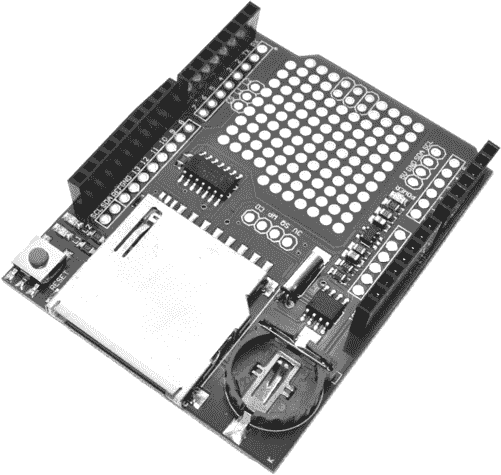

图 6-13：Arduino 的 SD 和 RTC 扩展板

你将使用以下硬件：

+   一块 Arduino Uno 或兼容板和 USB 电缆

+   一款 9 至 12 伏直流电源，1 安培的电源适配器或插头电源

+   项目#20 的完整 PCB 或硬件

+   一块 DS1307 或 DS3231 实时时钟模块和 SD 或 microSD 卡模块，或者 Arduino 的 SD 卡和 RTC 扩展板

+   一张 microSD 或 SD 存储卡

+   一个远程按钮和合适的双核线

按照图 6-14 中的示意图组装电路。如果你使用的是无焊接面包板，并且不需要本地控制，可以省略触摸开关。

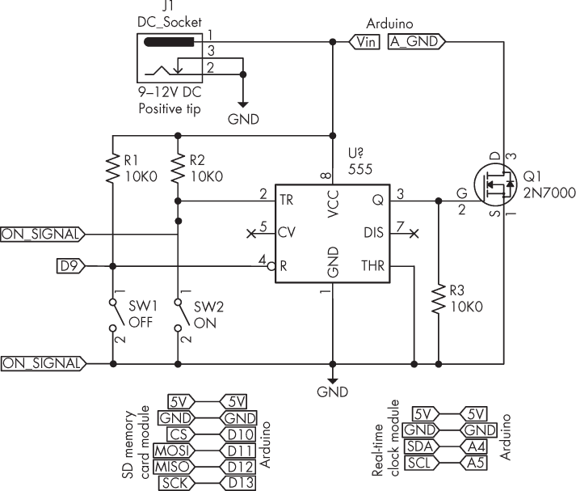

图 6-14：项目#21 的原理图

别忘了正确格式化你的存储卡。

> 注意

*如果你不熟悉使用 SD 卡或实时时钟模块，请参考《Arduino 工作坊》第七章和第二十章（第二版）。*

一旦你组装好硬件，就在项目#21 的草图中使用函数setDS3231time()在void setup()中设置当前时间和日期。为了保持实时时钟中的时间和日期，上传草图后注释掉该行并重新上传草图，就像在上一节中做的那样。

让我们看看它是如何工作的：

```
// Project #21 - Arduino event logger

❶ #include <Wire.h>
#include <DS3231.h>
DS3231 RTC;
#include <SD.h>
#define offPin 9

❷ bool century = false;
bool h12Flag = false;
bool pmFlag = false;
byte year = `22`;
byte month = `9`;
byte date = `2`;
byte hour = `11`;
byte minute = `8`;
byte second = `0`;

void setTimeData()
{
    RTC.setYear(year);
    RTC.setMonth(month);
    RTC.setDate(date);
    RTC.setHour(hour);
    RTC.setMinute(minute);
    RTC.setSecond(second);
    RTC.setClockMode(false); // Set clock to 24 hour
}

void turnOff()
{
    digitalWrite(offPin, LOW);
}

void logEvent()
{
    // Create the file for writing
    File dataFile = SD.open("DATA.TXT", FILE_WRITE);
    // If the file is ready, write to it:
    if (dataFile)
    {
        dataFile.print("Event occurred on: ");
        dataFile.print(RTC.getDate());
        dataFile.print("/");
        dataFile.print(RTC.getMonth(century));
        dataFile.print("/20");
        dataFile.print(RTC.getYear());
        dataFile.print(" - ");
        dataFile.print(RTC.getHour(h12Flag, pmFlag));
        dataFile.print(":");
        if (RTC.getMinute() < 10) {
            dataFile.print("0");
        }
        dataFile.print(RTC.getMinute());
        dataFile.print(":");
        if (RTC.getSecond() < 10) {
            dataFile.print("0");
        }
    dataFile.println(RTC.getSecond());
    dataFile.close(); // Close the file once the system has finished with it
    }
}

void setup()
{
    Wire.begin();
    //setTimeData(); // Set time and date
    pinMode(offPin, OUTPUT);
    digitalWrite(offPin, HIGH);
    pinMode(10, OUTPUT);
    // Check that the memory card exists and is usable
    if (!SD.begin(10))
    {
        // Stop sketch:
        return;
    }
}

❸ void loop()
{
    logEvent(); // Log event to SD card
    delay(1000); // Wait a moment
    turnOff();
} 
```

该草图结合了基本的实时时钟和 SD 卡写入功能，以及一旦事件记录到存储卡后自我关闭的功能。它首先包含所需的库，然后设置 RTC I²C 总线地址和触发 555 定时器关闭电路的引脚编号 ❶。接着，它设置所需的日期和时间变量，以及写入数据的函数 ❷。

当调用时，turnOff() 函数将连接到 555 定时器的数字引脚设置为 LOW，关闭电路。logEvent() 函数打开 SD 卡上的文本文件，从实时时钟获取时间和日期，并将其整齐地写入一行。void setup() 函数初始化实时时钟并允许设置时间和日期。它还初始化触发外部电路和使用 SD 卡所需的数字引脚，并检查 SD 卡是否准备好。

最终的循环 ❸ 在外部设备电路触发 Arduino 并将其打开时开始运行。logEvent() 函数记录事件，将时间和日期写入 SD 卡。之后有一个短暂的延迟，确保数据文件已关闭，接着 turnOff() 关闭 Arduino。

要查看项目记录的数据，请断开 Arduino 的电源并将 SD 卡插入计算机。打开 *DATA.TXT* 文件查看按顺序列出的事件。

项目为每个事件记录了包含日期和时间的新文本行。

在 9 V 直流电压下运行时，项目关闭时电流约为 5 mA，工作时最大电流为 70 mA。如果使用六个 AA 电池进行便携式使用，并且每小时发生一到两个事件，则该项目可以轻松运行超过七天。

## 继续前进

本章向您展示了如何为您的项目添加专业的电源控制，通过让外部动作打开电源并让 Arduino 自动关闭电源，从而降低功耗。

下一章演示了另一种先进的开关控制方式：使用无线遥控插座安全控制交流电流。
