# 第七章：7 控制交流电源插座


在本章中，你将学会如何通过各种自动化和远程控制方式安全地控制主电源交流插座。此技术让你能够轻松地从远程操作设备，如灯具、风扇和水泵，而无需与主电源线路直接连接。

你将学到：

+   使用光耦合器来隔离电气信号

+   改装无线交流电源远程控制发射器，并将其连接到 Arduino 电路

+   创建一个定时控制的无线交流电源插座

+   使用短信控制远程交流电源插座

## 光耦合器

*光耦合器*是一种小型设备，它可以在电路的不同部分之间传输信号，同时保持这两部分电气隔离。在典型的光耦合器内部，有一个 LED 和一个光电晶体管，后者通过响应光线放大电流。当电流通过 LED 时，它会打开；光电晶体管检测到光线后，允许另一个电流通过。当 LED 关闭时，电流无法通过光电晶体管。整个过程中，这两个电流是完全电气隔离的。

图 7-1 展示了光耦合器的原理符号。

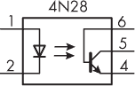

图 7-1：典型光耦合器的原理符号

在原理图中，LED 连接到 1 引脚（阳极）和 2 引脚（阴极）。4、5、6 引脚是光电晶体管，而 3 引脚没有使用。你将使用的光耦合器型号 4N28 是一个六脚双排直插（DIL）封装，如图 7-2 所示。

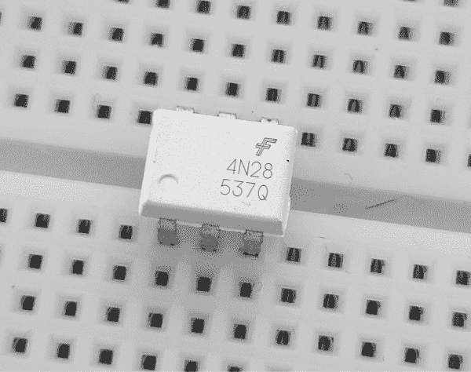

图 7-2：插入无焊面包板中的 4N28 光耦合器

使用光耦合器时，你需要为 LED 添加一个限流电阻。在本章中，你将使用 1 kΩ的电阻。将电路连接到 4 和 5 引脚之间的开关，以控制开关的开启或关闭。如果你想实验光耦合器，可以构建图 7-3 中显示的电路。

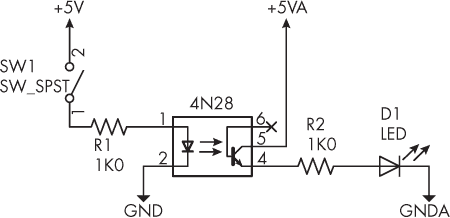

图 7-3：光耦合器演示电路

当 SW[1]闭合时，电流通过电阻 R[1]，光耦合器内的 LED 发光。接着，光电晶体管被触发，允许电流从 5 引脚流向 4 引脚，从而点亮 LED D[1]。光耦合器的 3 引脚没有电气连接。这使得光耦合器像一个开关一样工作，但两侧之间没有任何电气或机械接触。

在接下来的项目中，你将使用光耦合器与无线遥控交流电插座的发射器进行接口连接。

## 遥控交流电插座

像图 7-4 所示的廉价无线遥控交流电插座，能够安全地控制市电。在图 7-4 中，发射器位于右侧，接收器插座位于左侧。

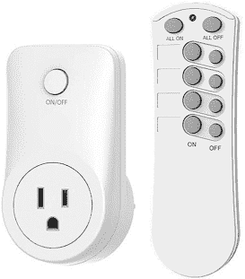

图 7-4：典型的无线遥控交流电插座

发射器需要独立的开关按钮进行控制。尽量找一个按钮之间有较大间距的型号；按钮间距越大，在第 22 个项目中破解发射器时就越容易，这样可以将其连接到 Arduino 电路，以控制电源插座。你可以从常见零售商那里购买这些设备，如亚马逊、沃尔玛等。

警告

*无论如何，你绝对不应打开或修改包含市电插座的接收器单元，因为暴露在市电线路中可能会致命。*

为了顺利完成本章内容，我建议购买两套控制设备：一套用于实验（这样你就不用太担心弄坏它），另一套用于项目。

## 破解插座发射器

本节将解释如何破解无线发射器，并通过 Arduino 进行控制。我将通过一系列照片展示如何破解我的遥控器，你可以参考这些指导方针，对你的遥控器进行实验，达到相同的目的。此过程需要一定的焊接和拆焊操作，因此请确保你准备了一个 20 到 50 瓦的爱好者级焊接铁、一些手工工具（如侧切钳），以及一些拆焊丝。

发射器在形状、大小等方面会有所不同，但请确保你购买的发射器使用小型 12V A23 型电池，并且有独立的开关按钮，如前所述。在对设备进行任何损坏之前，插入电池并进行测试，以了解发射器与接收器之间的有效距离，从而确定你可以使用该插座的距离。图 7-5 展示了我发射器中的电池。

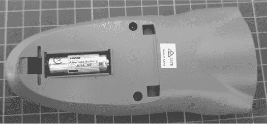

图 7-5：无线遥控发射器中的电池

检查是否有任何螺丝或卡扣可以用来打开发射器外壳，并按照图 7-6 所示将其打开。

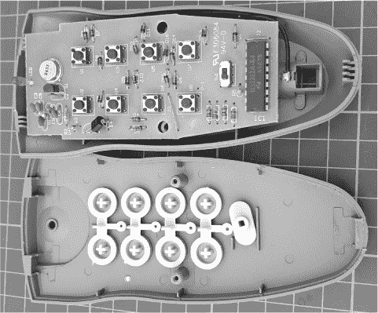

图 7-6：无线遥控发射器内部接线

这样应该能看到电路板和控制输出的按钮。小心地取下电路板，检查是否有可能去除某些按钮的焊接；如果不行，就重新组装设备并将其退还给零售商。对于符合本节之前描述规格的任何发射器，你应该能去除按钮，但最好确认这些按钮是通过孔脚的类型。

你还需要连接电源。如果电池架到电路板（PCB）之间已经有电线连接，如图 7-7 所示，仔细将其切断或使用吸锡带将电池架两端的电线去除。

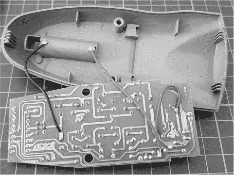

图 7-7: 电路板中的电源电线

接下来，通过定位按钮，并找到 PCB 另一侧与按钮匹配的引脚，识别系统中第一个（或唯一）插座的开关按钮的焊盘。从电路板底部查看按钮（即有铜轨的一面），将按钮引脚与电路板的焊盘匹配。

在我们的示例中，电路板使用了标准的四脚触觉按钮，每个触点有两根引脚。在图 7-8 中，我用线条标记了触觉开关两侧的焊盘，以标注出我需要去除焊接的焊盘。

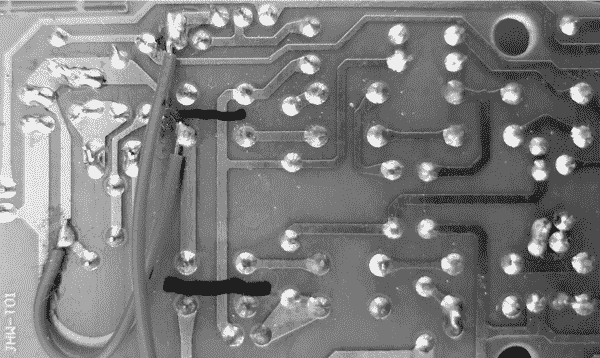

图 7-8: 发射器电路板，按钮引脚用黑色标记笔分开

一旦找到了开关按钮的焊盘，使用吸锡带去除引脚，最好使用一些吸锡带，如图 7-9 所示。小心不要过热并损坏焊盘。

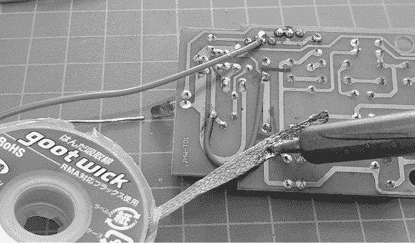

图 7-9: 从发射器上去除按钮的焊接

现在，轻轻地从电路板上撬出按钮。这样，你将得到一些空白的按钮位置，如图 7-10 所示。

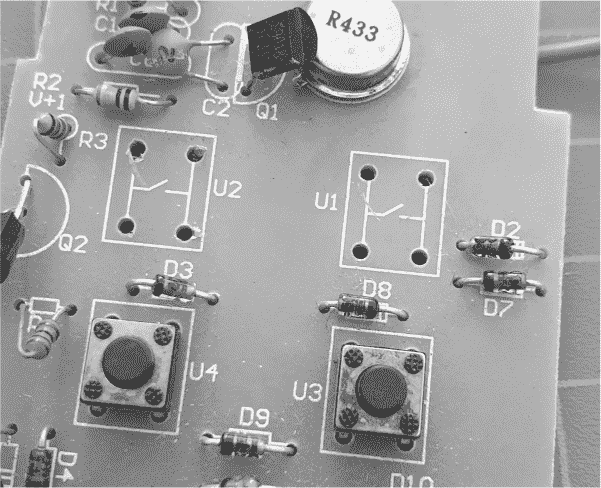

图 7-10: 移除控制按钮的发射器电路板

在这些空的孔位中，焊接一些足够长的跳线，以便将电路板与无焊面包板连接。我已将一些预制跳线的两端剪掉，以便轻松连接到外部电路，如图 7-11 所示。

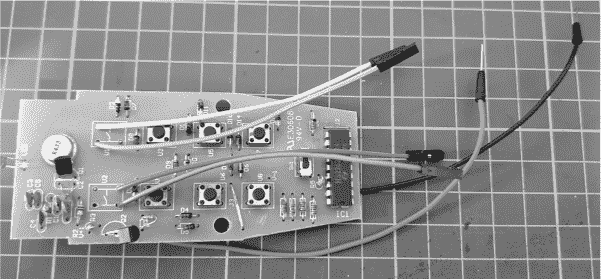

图 7-11：修改后的发射器电路板接线

现在是检查发射器电路板操作的时候了。将 12V 电源连接到电源引线，然后依次短接开关的开和关导线对，检查接收器是否仍能开关。如果不能，可能是（已拆除的）按钮形成了电路的一部分——也就是说，每个按钮的两边接触点都作为 PCB 轨道连接使用。我遇到的情况是这样的，因此我将一根短导线横跨按钮的一侧并将其焊接到电路板上，如图 7-12 所示。


图 7-12：为发射器按钮焊盘添加连接

如有必要，再次测试系统。如果测试成功，将连接线的焊点用热熔胶覆盖，以防止它们以后意外脱落，如图 7-13 所示。

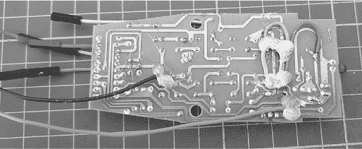

图 7-13：用热熔胶保护额外焊接的连接

现在你有了一个可以通过 Arduino 和外部光耦电路控制的发射器电路板。让我们开始使用它吧。

项目 #22：控制发射器电路板

这个项目简要演示了如何控制一个被破解的发射器电路板，这为你在自己的项目中控制插座提供了框架。你将需要以下部件：

+   一块 Arduino Uno 或兼容板和 USB 数据线

+   一个 12V DC、1A 电源适配器，墙插电源适配器，或插头电源（如果需要，你可以使用第六章中为项目 #19 描述的 DC 插座插座扩展模块）

+   来自上一节的被破解的无线插座发射器和接收器

+   两个 1 kΩ、0.25 W、1% 的电阻器

+   两个 4N28 光耦合器

+   一块无焊面包板

+   各种跳线

按照图 7-14 所示组装电路。

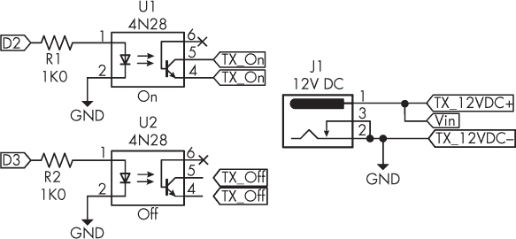

图 7-14：项目 #22 的电路图

电路图中的 TX_On 和 TX_Off 对应发射器电路板控制按钮的接线，而 TX_12VDC+ 和 – 则表示连接到发射器电路板的 12V 电源引线。由于 12V DC 为整个电路提供电源，因此 Arduino 的电源通过 Vin 引脚供电。Arduino 的 D2 和 D3 引脚用来控制发射器的开关。

现在上传项目 #22 的草图。几秒钟后，主电源插座应每隔大约五秒钟开关一次。

让我们看看这是如何工作的：

```
// Project #22 - Mains outlet control with Arduino

❶ void mainsOff()
{
    digitalWrite(3, HIGH);
    delay(1000);
    digitalWrite(3, LOW);
}

❷ void mainsOn()
{
    digitalWrite(2, HIGH);
    delay(1000);
    digitalWrite(2, LOW);
}

void setup()
{
    delay(1000);
    pinMode(2, OUTPUT);
    pinMode(3, OUTPUT);
}

void loop()
{
  ❸ mainsOn(); // AC mains on
    delay(5000);
  ❹ mainsOff(); // AC mains off
    delay(5000);
} 
```

为了控制发射器，草图只需关闭开关的触点，这些触点现在由光耦合器表示，使用 ❶ 和 ❷ 中的函数。这些函数中的延迟确保发射器已激活足够长的时间以触发接收单元。

在 void setup() 中的延迟有助于测试电路，否则发射器在为 Arduino 通电时可能会立即开启。你应该在自己的项目中保留这个延迟，以避免不必要或不希望的插座激活。

最后，代码通过慢慢打开和关闭交流电来演示控制 ❸ ❹。你可以将灯或小风扇连接到交流电源插座，以查看效果。

将本项目的硬件保留好，因为你将在下一个项目中扩展使用它。

项目 #23：用定时器控制交流电源插座

在这个项目中，你将使用 DS1307 或 DS3231 实时时钟 IC 来构建一个交流电源插座，可以在所需的时间点打开或关闭。这是控制小型灌溉泵、夜灯、警报器或类似设备的绝佳方法。

要构建这个项目，你需要与项目 #22 中使用的相同硬件设置，以及 DS3231 或 DS1307 RTC 模块，或者是项目 #21 中使用的日志盾牌，详见第六章。按照图 7-15 中的示意图组装电路。

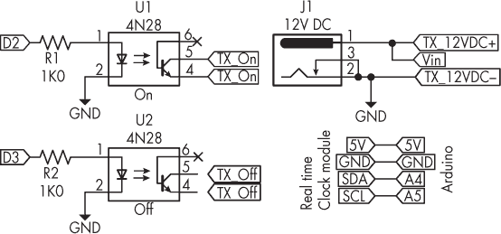

图 7-15：项目 #23 的原理图

现在上传项目 #23 草图（它应该适用于你使用的任何 RTC IC）。别忘了使用 setDS3231time() 函数在 void setup() 中设置当前时间数据。一旦你更新了时间值，取消注释该函数，上传草图，然后重新注释该函数并再次上传草图。我使用了 DS3231 库，如在第六章的项目 #21 中所示。

让我们看看它是如何工作的：

```
// Project #23 - Timer-controlled mains outlet
#include <Wire.h> ❶
#include <DS3231.h>

DS3231 RTC;
bool century = false; ❷
bool h12Flag = false;
bool pmFlag = false;
byte year = `22`;
byte month = `9`;
byte date = `19`;
byte hour = `21`;
byte minute = `53`;
byte second = `0`;

void setTimeData()
{
    RTC.setYear(year);
    RTC.setMonth(month);
    RTC.setDate(date);
    RTC.setHour(hour);
    RTC.setMinute(minute);
    RTC.setSecond(second);
    RTC.setClockMode(false); // Set clock to 24 hour
}

void mainsOff()
{
    digitalWrite(3, HIGH);
    delay(1000);
    digitalWrite(3, LOW);
    digitalWrite(13, LOW);
}

void mainsOn()
{
    digitalWrite(2, HIGH);
    delay(1000);
    digitalWrite(2, LOW);
    digitalWrite(13, HIGH);
}

void setup()
{
    mainsOff();
    //setTimeData(); ❸ // Set time and date
    Wire.begin();
 pinMode(2, OUTPUT);
    pinMode(3, OUTPUT);
    pinMode(13, OUTPUT);
    digitalWrite(13, LOW);
}

void turnOn(int onHour, int onMinute)
{
    if ((RTC.getHour(h12Flag, pmFlag) == hour) && (onMinute == RTC.getMinute()))
    {
        mainsOn();
        delay(59100);
    }
}

void turnOff(int offHour, int offMinute)
{
    if ((RTC.getHour(h12Flag, pmFlag) == hour) && (offMinute == RTC.getMinute()))
    {
        mainsOff();
        delay(59100);
    }
}

void loop()
{
    turnOn(17, 02);
    turnOff(17, 03);
    turnOn(17, 04);
    turnOff(17, 05);
    turnOn(17, 06);
    turnOff(17, 07);
}
```

草图首先包含 I²C 和 RTC 库，然后创建一个实时时钟实例以进行引用 ❶。接着，它声明所需的变量来保存时间和数据 ❷。这些变量包括三个布尔值变量，默认设置为 false，因为草图使用的是 24 小时制时间。

自定义 setTimeData() 函数包含设置所有时间和日期参数的函数。之前声明的变量被放置到每个匹配的函数中。这个函数只需要调用一次 ❸，因为你最初设置了时间和日期，然后在重新上传草图之前注释掉该函数；否则，时钟将重置为变量的值。

mainsOff() 和 mainsOn() 函数还使用 Arduino 板上 D13 的 LED 指示系统的开关状态。对于在特定时间控制插座，两个 turnOn() 和 turnoff() 函数各自接受一个小时和分钟参数，并将其与当前时间进行比较。

如果时间匹配，插座就会被打开或关闭，如在 void loop() 中的示例所示。你可以根据需要添加任意多的开关函数；代码将不断循环，检查是否需要开关插座。在 turnOn() 和 turnOff() 函数中有一个较长的延迟，目的是防止在开关时间匹配时发生多次触发。

如果你想增加一些挑战性，可以修改代码，让用户可以选择日期或星期几，并结合时间来控制开关。

项目 #24：通过短信控制主电源插座

这个项目将无线控制提升到了一个新水平，结合使用项目 #22 的硬件和一个 3G 蜂窝盾牌，创建一个可以通过短信控制的交流主电源插座（只要有手机信号覆盖）。这样做出奇的简单。

> 注意

*你可能在《Arduino 工作坊》第 2 版的第二十二章中构建过类似的项目。*

要使此项目正常运行，你需要接入一个支持 UMTS（3G）850 MHz、900 MHz、1900 MHz 或 2100 MHz 频段的蜂窝网络，并且允许使用非网络提供商提供的设备。你的蜂窝服务提供商应该能提供此类信息。此外，你还需要为该盾牌准备一个 SIM 卡（可为预付费卡或其他类型的卡），并确保 SIM 卡的 PIN 码设置已关闭。（你可以通过将 SIM 卡插入普通手机并在安全菜单中修改设置来实现这一点。）

本项目使用的是 SIM5320 型 3G GSM 盾牌和天线，具体如图 7-16 所示。该盾牌可以通过 TinySine（[*https://<wbr>www<wbr>.tinyosshop<wbr>.com*](https://www.tinyosshop.com)）及其经销商购买。SIM5320 盾牌有两种类型，SIM5320A 和 SIM5320E。后者使用 UMTS/HSDPA 900/2100MHz 频段（主要供欧洲用户使用），前者使用 UMTS/HSDPA 850/1900MHz 频段（主要供美国用户和使用 Telstra 网络的澳大利亚用户使用）。

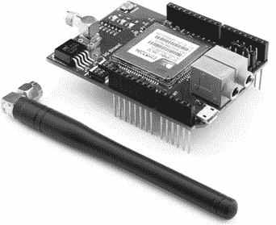

图 7-16：带天线的 3G shield

由于这些 shields 需要 12V 外部电源，首先通过 Vin 和 GND 引脚连接你在本章早期项目中使用的电源。为了配置 D2 和 D3 引脚，shield 使用这些引脚通过 SoftwareSerial 与 Arduino 通信，请按照图 7-17 所示，连接跳线到 RX 3 和 TX 2 引脚。

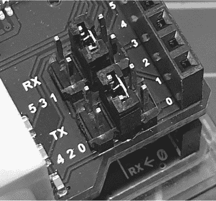

图 7-17：Shield 串行配置跳线

接下来，将 shield 翻转过来，并将你的运营商 SIM 卡插入卡槽，如图 7-18 所示。

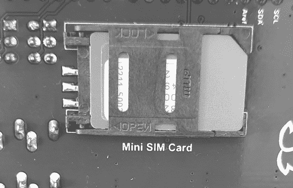

图 7-18：SIM 卡及其卡槽

轻轻地将 3G shield 插入 Arduino。连接外部电源和 USB 电缆到 Arduino 和 PC 之间，然后拧上外部天线。最后，按下 shield 左上角的电源按钮开启 SIM 模块，如图 7-19 所示。按下按钮 2 秒钟，然后松开。

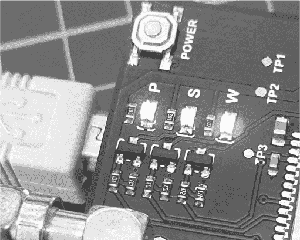

图 7-19：3G shield 电源按钮和状态 LED，当电源、状态和网络活动时，LED 会亮起

P（电源）和 S（状态）LED 应该会亮起。蓝色的 W（网络活动）LED 应该会开始闪烁，一旦 3G shield 注册到蜂窝网络，表示你已经准备好使用这个 shield，一切正常。

要构建这个项目，你需要刚刚组装好的 3G shield，以及在项目 #22 中搭建的硬件设置。按照图 7-20 所示组装电路。请注意，光耦合器输入引脚已从项目 #22 中使用的引脚更改为 Arduino 的 D4 和 D5 引脚，因为我们将 D2 和 D3 用于 3G shield 的串行通信。

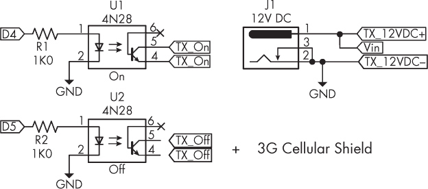

图 7-20：项目 #24 的原理图

输入并上传以下代码。一旦 shield 开机并且蓝色 LED 开始闪烁，向 SIM 卡的蜂窝号码发送 #1 作为短信。主电源插座应该打开；发送 #0 则可以关闭它。我希望这能激发你短暂的好奇心——这些时刻让学习和构建项目变得非常愉快。

让我们看看这个是如何工作的：

```
// Project #24 - Setting up an SMS remote control

#include <SoftwareSerial.h>
❶ SoftwareSerial cell(2, 3);

❷ void mainsOff()
{
    digitalWrite(5, HIGH);
    delay(1000);
    digitalWrite(5, LOW);
    digitalWrite(13, LOW);
}

❸ void mainsOn()
{
    digitalWrite(4, HIGH);
    delay(1000);
    digitalWrite(4, LOW);
    digitalWrite(13, HIGH);
}

void setup()
{
    pinMode(5, OUTPUT);
    pinMode(4, OUTPUT);
    pinMode(13, OUTPUT);
  ❹ pinMode(8, OUTPUT);
    mainsOff();
  ❺ digitalWrite(8, HIGH);
    delay(2000);
    digitalWrite(8, LOW);
    cell.begin(4800);
    delay(30000);
  ❻ cell.println("AT+CMGF=1");
    delay(200);
  ❼ cell.println("AT+CNMI=3,3,0,0");
    delay(200);
}

void loop()
{
    char inchar;
    if (cell.available() > 0)
    {
        inchar = cell.read();
      ❽ if (inchar == '#')
 {
            delay(10);
            inchar = cell.read();
            if (inchar == '0')
            {
              ❾ mainsOff();
            }
            else if (inchar == '1')
            {
              ❿ mainsOn();
            }
            delay(10);
            cell.println("AT+CMGD=1,4"); // Delete all SMS
        }
    }
} 
```

这段代码初始化了软件串口，用于与 3G 扩展板进行通信❶，然后声明了用于查询来自扩展板的传入数据的变量。发射器控制功能出现在❷和❸位置，代码在void setup()中配置了数字引脚❹。

从❺开始，代码启动并配置 3G 扩展板以供使用，使用 AT 命令AT+CMGF=1将传入的短信转换为文本，并将其发送到软件串口❻。每当 3G 扩展板接收到短信时，详细信息会通过软件串口逐个字符发送到 Arduino❼。代码测试每个传入的字符，看看它是否是#❽；如果是，它会检查是否为0或1，然后分别关闭❾或打开❿发射器。

扩展板的电源按钮连接到数字引脚 8，因此你也可以通过项目中的代码控制电源，而不必手动开关按钮。

## 继续前进

在本章中，你学习了如何使用各种形式的自动化和远程控制安全地控制主电源插座。你可以将所学知识应用于自己的项目中，通过各种传感器、开关或其他输入设备或代码来控制交流电源插座。只要你的输入设备能够控制 LED，它也能控制交流电源插座。

在下一章中，你将使用高功率移位寄存器构建更加有趣的控制应用。
