# 第八章：8 控制高功率设备


许多 Arduino 用户依赖 74HC595 移位寄存器来进行项目，因为它流行且易于使用。然而，74HC595 只能处理相对较小的电流，特别是当所有引脚都处于活动状态时：虽然每个输出可以连续提供 20 mA 电流，但整个 IC 的 V[CC]或 GND 引脚的最大电流仅为 70 mA。

如果你需要每个输出提供 20 mA 电流来驱动，例如八个独立的 LED，你只能在推荐的工作条件下使用八个引脚中的三个。虽然可能超出制造商的建议，但良好的电子设计应该考虑安全性和可靠性。设计为处理更高电流的移位寄存器是更好的选择。

本章向你展示如何使用 Arduino 和 TPIC6B595 移位寄存器集成电路控制高功率设备。你将学习：

+   实验二进制数字显示

+   使用多个 TPIC6B595 来控制超过八个高功率输出

+   使用比普通 LED 更强大的亮度 Pirhana 风格 LED

你还将构建一个 PC 控制的八继电器板，并控制巨大的七段数字显示。

## TPIC6B595

TPIC6B595 的控制方式与 74HC595 相同，但每个输出可提供最高 150 mA 的电流，整个 IC 的总电流为 500 mA——当所有引脚都使用时，每个引脚的电流约为 60 mA。它还能够切换最高 50 V DC 的电压。这使得可以控制八个高电流设备，如强力 LED、继电器线圈或机械开关设备。

TPIC6B595 是一个*锁存移位寄存器*，这意味着只要电源连接，它将保持输出状态。例如，如果你上传一个新的草图，输出不会受到影响。如果你从电源而非 Arduino 供电，你可以在不改变输出的情况下重置 Arduino。

图 8-1 显示了一个 TPIC6B595 双列直插封装，通过孔格式的无焊接面包板。


图 8-1：TPIC6B595 移位寄存器

图 8-2 显示了 TPIC6B595 的原理图符号。

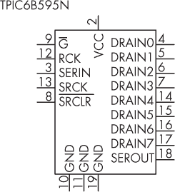

图 8-2：TPIC6B595 的原理图符号

电路图中的八个输出引脚标记为 DRAIN*x*，因为 TPIC6B595 是低侧输出。与前几章使用的 2N7000 N-MOSFET 一样，这些输出控制电流流入引脚（与 74HC595 的高侧输出不同，后者是电流从控制引脚流出）。这意味着受控设备连接在电源和 TPIC6B595 的控制引脚之间，TPIC6B595 则切换电流是否从设备流向地面（GND）。  

查看 图 8-3 中的电路图。电流从 5V 电源流经电阻和 LED，再进入 TPIC6B595 的输出引脚。当该引脚被激活时，电流继续流向地面（GND），完成电路。  

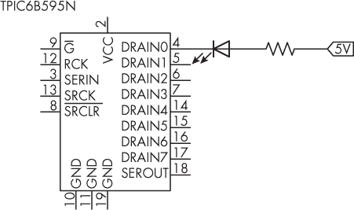  

图 8-3：TPIC6B595 控制 LED 的示例  

由于 TPIC6B595 控制电流的方式，它控制的设备电压可高达 50V，而移位寄存器仍然以 5V 工作。方便的是，这意味着你可以控制 12V 或更高电压的设备，而无需担心将电平转换回 Arduino。  

让我们通过一个简单的项目来测试 TPIC6B595，演示移位寄存器的操作。  

项目 #25：创建一个 TPIC6B595 二进制数字显示  

本项目演示了 TPIC6B595 输出的使用，同时复习了二进制数字及其如何与移位寄存器输出控制相关。你将需要以下组件：  

+   一块 Arduino Uno 或兼容板和 USB 电缆  

+   一块免焊接面包板  

+   各种跳线

+   一颗 TPIC6B595 移位寄存器 IC  

+   一个 0.1 µF 电容器  

+   八个 LED  

+   八个 1 kΩ，0.25 W，1% 的电阻器  

按照 图 8-4 所示组装电路。  

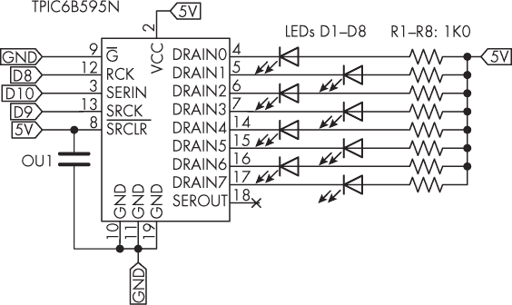  

图 8-4： 项目 #25 的电路图  

输入并上传项目 #25 的草图。在 IDE 中打开串行监视器，输入一个介于 0 到 255 之间的数字（包括 0 和 255），然后按下 CTRL-ENTER。Arduino 应该会通过使用 LED 在二进制中显示该数字，并在串行监视器中显示出来，如 图 8-5 所示。LED 1 将是该数字的最低有效位，表示 1，而 LED 8 将是最高有效位，表示 255。  

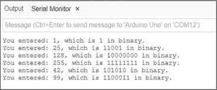  

图 8-5：项目 #25 的示例输出  

让我们看看这个是如何工作的：  

```
// Project #25 - TPIC6B595 binary number display

❶ #define latch 8 // Latch RCK pin
#define clock 9 // Clock SRCK pin
#define data 10 // Data SERIN pin

void displayBinary(int displayNumber)
{
    digitalWrite(latch, LOW);
    shiftOut(data, clock, MSBFIRST, displayNumber);
    digitalWrite(latch, HIGH);
}

void setup()
{
  ❷ Serial.begin(9600);
    pinMode(latch, OUTPUT);
    pinMode(clock, OUTPUT);
    pinMode(data, OUTPUT);
}

voi`d` loop()
{
    long number = 0;
    long entry = 0;
  ❸ Serial.flush();
    while (Serial.available() == 0) {}
  ❹ while (Serial.available() > 0)
    {
        number = number * 10;
        entry = Serial.read() - '0';
        number = number + entry;
        delay(5);
    }
    displayBinary(number);
    Serial.print("You entered: ");
    Serial.print(number);
    Serial.print(", which is ");
    Serial.print(number, BIN);
    Serial.println(" in binary.");
} 
```

草图开始时定义了 Arduino 数字引脚，用于连接到移位寄存器的锁存器、时钟和数据引脚，分别是 ❶。自定义的 displayBinary() 函数接受一个整数，并将其发送到移位寄存器进行输出控制，使用的方法与之前提到的 74HC595 移位寄存器相同。为了以二进制形式将表示数字的位发送到移位寄存器并激活移位寄存器中的引脚，以控制将与要显示的二进制数字匹配的 LED，该函数使用 MSBFIRST（最高有效位优先）。

你可以通过发送到移位寄存器的 8 位数字来控制移位寄存器的输出开关，每一位与一个输出和状态（1 为高电平，0 为低电平）对应。你还可以将 MSBFIRST 改为 LSBFIRST，即“最低有效位优先”，这样可以看到数字在二进制中“反转”。

该草图初始化了串口监视器和数字输出引脚 ❷，然后刷新串口输入并等待用户在串口监视器中输入一个数字 ❸。接着它将串口监视器中输入的数字合并成最终要显示的数字 ❹。自定义的 displayBinary() 函数将该数字发送到移位寄存器和串口监视器。

你将在下一个项目中使用这种移位寄存器控制框架。

项目 #26：构建 PC 控制的继电器板

在这个项目中，你将构建一个带有 8 个单刀双掷（SPDT）继电器的继电器控制板，你可以通过 PC 或其他带有 Arduino 兼容 UART 的设备进行控制。未来，你可能会使用这个项目中介绍的技术来控制低压照明、电动门锁、开关扬声器等。

本项目中的每个继电器能够控制最高 30 V 的直流电压，电流为 2 A，前提是使用项目的 PCB。如果使用的是免焊面包板，则继电器的控制电流应仅限于 100 毫安左右。

尽管使用免焊面包板也能构建这个项目，但你需要将跳线焊接到继电器的引脚上，以便将继电器远程接回电路，如图 8-6 所示，因为继电器的引脚在面包板上不太稳定。我强烈建议你使用 PCB。

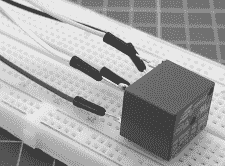

图 8-6：具有远程接线的继电器，用于面包板

本项目需要以下部件：

+   一块 Arduino Uno 或兼容板及 USB 电缆

+   各种跳线

+   一个 12 V 的电源或带有直流插头的电源适配器

+   一个 TPIC6B595 移位寄存器

+   一个 20 引脚 IC 插座

+   一个 0.1 µF 电容

+   八个 LED

+   八个 1 kΩ, 0.25 W, 1% 的电阻

+   八个 1N4001 电源二极管

+   八个 SRD-12VDC-SL-C SPDT 继电器

+   一个无焊面包板或项目 #26 的 PCB

如果你使用的是 PCB，还需要以下组件：

+   十个三路 5.08 mm 端子块

+   一个 20 引脚 IC 插座

+   一个 PCB 安装的 DC 插座

按照图 8-7 所示组装电路。

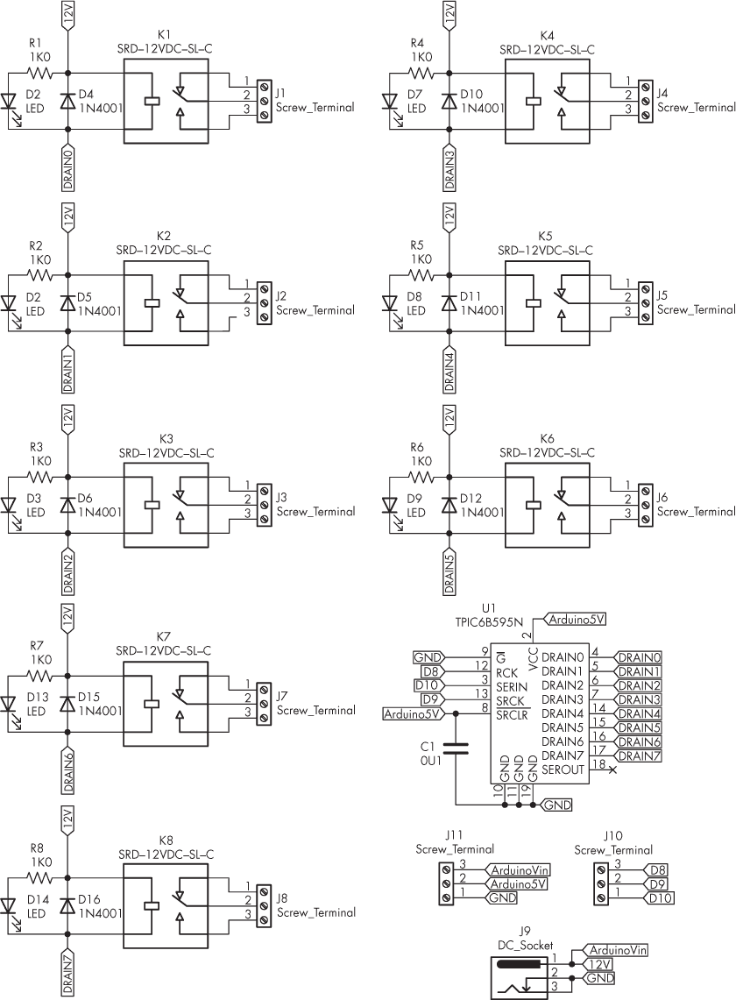

图 8-7: 项目 #26 的原理图

如果你使用的是 PCB，布局非常简单，如图 8-8 所示。

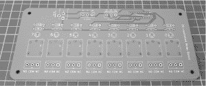

图 8-8: 项目 #26 的 PCB

从插入电阻开始；然后插入二极管、LED、IC 和 DC 插座、端子块，最后插入继电器。确保正确插入移位寄存器——PCB 上有标记的引脚 1。通过移位寄存器旁的两个端子块连接到 Arduino，如原理图和图 8-9 所示。Arduino 通过继电器板的 12V 电源供电，并返回 5V 给板子供电以驱动移位寄存器。

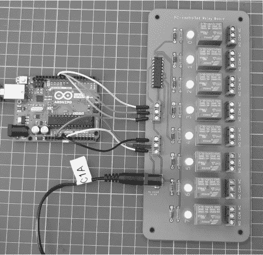

图 8-9: 项目 #26 的完成硬件

一旦硬件搭建完成，输入并上传项目 #26 的草图，控制继电器执行各种命令。使用串口监视器或终端软件输入 0 到 7，会依次打开继电器 0 到 7；输入 8 到 F 会关闭继电器 0 到 7；输入 G 会打开所有继电器；输入 H 会关闭所有继电器。输入 ? 可以检查哪些继电器已开或未开。返回的结果是一个二进制数，匹配继电器的顺序。如果输入了未识别的字符，Arduino 会返回一个有效命令列表。

例如，图 8-10 显示了命令 G、然后是 Q（这导致显示错误命令信息），然后是 H，再然后是 0、3、5、7 和 ? 的输出。

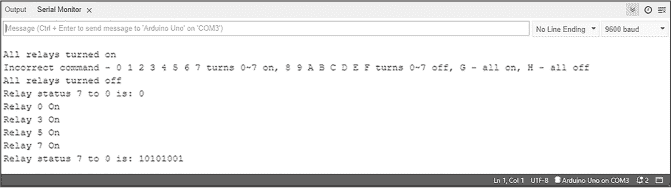

图 8-10：串行监视器中的操作示例

如果你和其他人共享继电器板和 Arduino，他们不需要运行 Arduino IDE 来进行控制；相反，他们可以使用任何支持 USB 串行的终端软件，如 PC、Mac 或其他计算机。例如，使用 Roger Meier 的 CoolTerm 应用程序进行相同的操作，该程序可以从 [*http://<wbr>freeware<wbr>.the<wbr>-meiers<wbr>.org*](http://freeware.the-meiers.org) 下载，如图 8-11 所示。

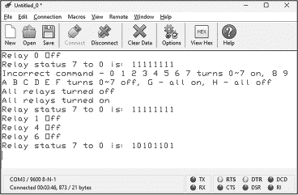

图 8-11：使用 CoolTerm 应用程序控制继电器

控制 Arduino 仅期望从主机计算机（或其他 UART）接收单个字符，因此你可以在多种环境中为你的计算机编写软件来控制继电器。在你喜欢的环境中搜索 “plaintext serial over USB” 或类似的资源，以了解更多信息。

让我们来看一下这是如何工作的：

```
// Project #26 - PC-controlled relay board

#define latch 8 // Latch RCK pin
#define clock 9 // Clock SRCK pin
#define data 10 // Data SERIN pin

int relayStatus;

void showStatus()
{
    Serial.print("Relay status 7 to 0 is: ");
    Serial.println(relayStatus,BIN);
}

void waveHello()
{
    int d = 250;
    Serial.println("Hello!");
    allOff();
    for (int a = 0; a < 8; a++)
    {
        relayOn(a);
        delay(d);
        relayOff(a);
    }
    for (int a = 6; a >= 0; a--)
    {
        relayOn(a);
        delay(d);
        relayOff(a);
    }
}

void relayOn(int a)
{
    relayStatus = relayStatus|(1<<a);
    sendStatus(relayStatus);
    Serial.print("Relay "); Serial.print(a); Serial.println(" On");
}

void relayOff(int a)
{
    relayStatus = relayStatus^(1<<a);
    sendStatus(relayStatus);
    Serial.print("Relay "); Serial.print(a); Serial.println(" Off");
}

void allOn()
{
    relayStatus = 255;
    sendStatus(relayStatus);
    Serial.println("All relays turned on");
}

void allOff()
{
    relayStatus = 0;
    sendStatus(relayStatus);
    Serial.println("All relays turned off");
}

void sendStatus(int a)
{
    digitalWrite(latch, LOW);
    shiftOut(data, clock, MSBFIRST, a);
    digitalWrite(latch, HIGH);
}

void setup()
{
    Serial.begin(9600);
    pinMode(latch, OUTPUT);
    pinMode(clock, OUTPUT);
    pinMode(data, OUTPUT);
}

void loop()
{
    char a = 0;
    Serial.flush();
    while (Serial.available() == 0) {}
    while (Serial.available() > 0) ❶
    {
        a = Serial.read();
    }
    switch (a) ❷
    {
        case '0' : relayOn(0); break;
        case '1' : relayOn(1); break;
        case '2' : relayOn(2); break;
        case '3' : relayOn(3); break;
        case '4' : relayOn(4); break;
        case '5' : relayOn(5); break;
        case '6' : relayOn(6); break;
        case '7' : relayOn(7); break;
        case '8' : relayOff(0); break;
        case '9' : relayOff(1); break;
        case 'A' : relayOff(2); break;
        case 'B' : relayOff(3); break;
        case 'C' : relayOff(4); break;
        case 'D' : relayOff(5); break;
        case 'E' : relayOff(6); break;
        case 'F' : relayOff(7); break;
        case 'G' : allOn(); break;
        case 'H' : allOff(); break;
        case 'Z' : waveHello(); break; ❸
        case '?' : showStatus(); break;
        default : Serial.print("Incorrect command - 0 1 2 3 4 5 6 7 turns 0~7 on, "); ❹
        Serial.println("8 9 A B C D E F turns 0~7 off, G - all on, H - all off");
    }
}
```

该草图首先声明了整数 relayStatus，用于保存继电器的状态。可以将这个数字看作二进制数，其中最低有效位表示继电器 0：如果该位为 1，表示继电器开启；如果该位为 0，表示继电器关闭。自定义的 showStatus() 函数将 relayStatus 的二进制值发送回串行接口，接收方可以在他们的终端、串行监视器或其他软件中查看哪些继电器是开启的，哪些是关闭的。所有控制继电器的函数还会通过串行端口向用户发送反馈，描述已完成的操作。

relayOn(int a) 函数用于打开继电器，使用位运算符 OR（|）来激活指定的继电器，同时不影响其他继电器。该函数接收值 a，并与 relayStatus 变量执行按位 OR 操作，然后使用新的 relayStatus 值更新继电器。例如，如果继电器 0、1、2 和 3 已经打开，则当前 relayStatus 的二进制值为 B00001111。如果用户在串口监视器（或终端软件）中输入 5 来打开继电器 5，程序将会把第 5 位切换为 1，如下所示：

```
B00001111 | // Current value of relayStatus
B00100000 = // Perform OR with 1 << 5—received by the function in a
B00101111   // New value of relayStatus 
```

sendStatus() 函数通过更新移位寄存器的输出来相应地改变继电器状态。

relayOff(int a) 函数用于关闭继电器，使用位运算符 XOR（^）来停用指定的继电器，同时不影响其他继电器。例如，如果继电器 0、1、2、3 和 5 已经开启，当前 relayStatus 的二进制值为 B00101111。如果在串口监视器或终端软件中输入 A 来关闭继电器 3，程序应该将第 3 位切换为 0，如下所示：

```
B00101111 ^ // Current value of relayStatus
B00001000 = // Perform XOR with 1 << 3
B00100111   // New value of relayStatus 
```

同样，sendStatus() 函数通过更新移位寄存器的输出相应地改变继电器状态。两个额外的函数，allOn() 和 allOff()，分别通过向移位寄存器发送 255（即二进制 B11111111）和 0（即二进制 B0000000）来打开或关闭所有继电器。

一般操作很简单。Arduino 等待串口线接收到一个字符 ❶。接收到字符后，它会与一个命令进行匹配 ❷。用户可以通过按下 Z 来激活简单的 waveHello() 函数 ❸，从而依次打开和关闭继电器，用于测试和娱乐。最后，如果接收到的字符不是命令，程序会向串口发送快速参考 ❹，让用户了解可用的命令集。

为了增加挑战，你可以修改草图，使得继电器状态在更改时保存到内部 EEPROM，并且系统在重置后从 EEPROM 数据中设置继电器状态。

现在你已经知道如何使用单个 TPIC6B595 控制 8 个高电流设备，接下来我将向你展示如何同时使用两个或更多的 TPIC6B595。

## 使用多个 TPIC6B595

你可以轻松地同时使用两个或更多的 TPIC6B595 移位寄存器，以与使用 74HC595 时相同的方式控制 16 个或更多的设备，但具有处理更高电流的能力。首先将每个 TPIC6B595 的时钟线连接在一起，将它们的锁存线连接在一起，然后将第一个移位寄存器的串行输出连接到第二个移位寄存器的串行输入，按需要重复此操作。例如，图 8-12 中的原理图展示了由项目#25 控制的双倍数量的 LED。

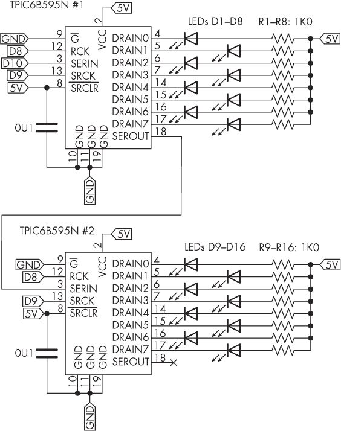

图 8-12：使用移位寄存器控制 16 个 LED 的原理图

接下来，在锁存线为低电平时，发送 2 字节的数据，而不是 1 字节。你需要首先发送链中最后一个移位寄存器的字节。例如，要向图 8-12 中的移位寄存器发送 2 字节数据，你将使用以下函数：

```
void sendData(int a, int b)
{
digitalWrite(latch, LOW);
shiftOut(data, clock, MSBFIRST, b); // For TPIC #2
shiftOut(data, clock, MSBFIRST, a); // For TPIC #1
digitalWrite(latch, HIGH);
} 
```

要添加一个或更多的移位寄存器，只需添加更多的参数和每个额外寄存器的<sup class="SANS_TheSansMonoCd_W5Regular_11">shiftOut()</sup>函数。你将在接下来的项目中使用多个 TPIC6B595，并结合使用一种新的 LED 类型。

## 食人鱼风格 LED

市场上有着种类繁多的 LED，从微小的表面贴装 LED 到足够大的 LED，能够作为汽车前大灯的一部分。介于这两者之间的一个例子是紧凑且非常亮的食人鱼风格 LED；它的通孔封装使得使用起来非常方便。图 8-13 展示了一对食人鱼 LED。

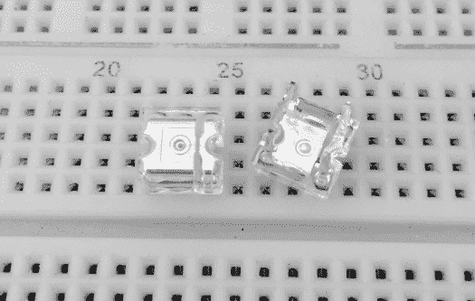

图 8-13：两颗食人鱼 LED

每个 LED 有四根引脚，其中两个是阳极，两个是阴极。两个阳极引脚相互连接，两个阴极引脚也相互连接。阳极侧的底部左角被切去，并且与阴极侧相比，阳极侧有更大的金属表面。图 8-14 展示了食人鱼 LED 的原理图符号。


图 8-14：食人鱼风格 LED 的原理图符号

当单独使用时，这些 LED 在大约 2 到 2.2 伏直流电压下，以 20 毫安的电流安全运行。接下来的项目中，你将以每组四个的方式使用它们，并将它们串联（而不是并联）。在这种配置中，每组四颗 LED 将需要 9 伏直流电源和 47 欧姆的电阻，以维持所需的电流和高亮度。

要计算与串联 LED 一起使用的所需电阻，使用公式 R = (V[s] − V[f]) / I[f]，其中 V[s]是电源电压，V[f]是 LED 的正向电压（推荐的工作电压），I[f]是 LED 的推荐工作电流。对于以下项目，你将使用 8V 的 LED 正向电压和 20mA 的工作电流，电源为 9V。根据公式，R = (9V − 8V) / 0.02A，结果为 50Ω。由于没有 50Ω电阻，47Ω是最接近的选择。

项目#27：创建一个巨型七段 LED 显示器

多个 TPIC6B595 芯片可以很好地驱动大量 LED。在这个项目中，你将构建一个或多个七段 LED 显示器，创建可以用于各种用途的大型数字显示。例如，你可以用它们来显示通过 Arduino 项目生成的各种数据，如温度、事件计数或时间。

要构建一个单数字显示器，你需要以下部件。对于更大的显示器，将除了 Arduino 以外的所有部件数量乘以你希望创建的数字数量。如果你想按照示例完全操作，那么就乘以四，因为这个项目展示了如何同时使用四个数字。对于这个项目，请使用 PCB 而不是面包板。

+   一个 Arduino Uno 或兼容板以及 USB 电缆

+   各种跳线

+   一个 9V 电源或带 DC 插头的电源适配器

+   一个 TPIC6B595 移位寄存器

+   一个 20 引脚 IC 插座

+   一个 0.1µF 电容

+   三十二个 5 毫米 Piranha 风格 LED

+   八个 47Ω、0.25W、1%的电阻

+   四个 3 接触 5.08 毫米接线端子

+   一个 PCB 安装式 DC 插座

+   项目#27 的 PCB

图 8-15 显示了项目的原理图。

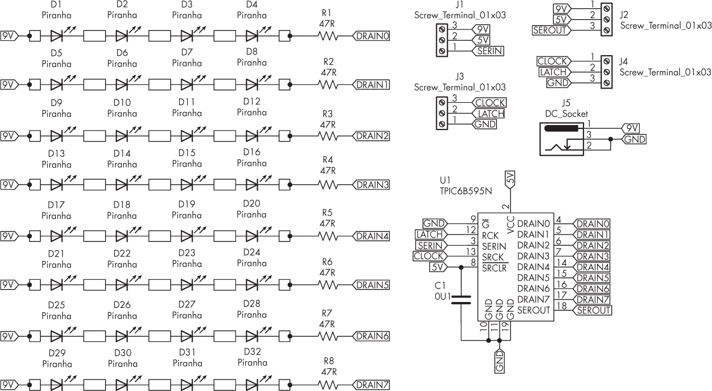

图 8-15：项目#27 的原理图

如你所见，TPIC6B595 具有“低端”输出。当输出被激活时，电流从电源开始，经过待控制的元件，然后通过移位寄存器的 DRAIN 引脚，最后通过 GND 输出。

### 单位显示

图 8-16 显示了简单的 PCB 布局。

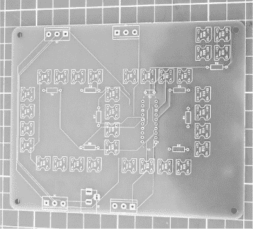

图 8-16：一个未装配的单数字 PCB

总是从连接最薄的元件开始：电阻器、IC 插座、LED，然后最后连接 DC 插座和接线端子。不要一开始就把所有的 LED 插好，再翻转 PCB，因为一些 LED 可能会松动或掉出来。相反，应该逐个焊接。所有的 LED 都应当按照阳极在左，阴极在右的方式摆放（PCB 的左侧是带有 DC 插座的那一边）。完成后，您的电路板应该与图 8-17 中的示例相似。

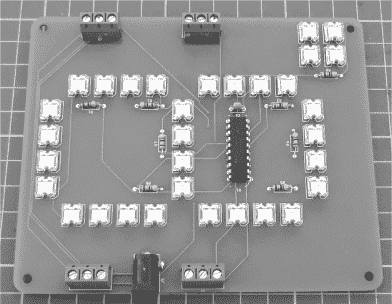

图 8-17：一个数字的完整 PCB

在设置好硬件后，上传下面的项目 #27a 草图，它展示了一个数字（你可以选择在“四色显示”部分中构建另外三个数字）。上传草图后，你需要将 Arduino 和电源连接到 PCB。将 PCB 朝上，DC 插座在左侧，按照表 8-1 中描述的方式进行连接。

表 8-1： PCB 与 Arduino 连接

| PCB 左侧 | Arduino |
| --- | --- |
| 时钟 | D9 |
| 锁存器 | D8 |
| 地 | GND |
| 9V | Vin |
| 5V | 5V |
| 串行输入 | D10 |

最后，将 9 V DC 电源连接到 PCB 上的 DC 插座。Arduino 通过 Vin 引脚从 9 V 电源供电，并通过反馈的 5 V 为显示板供电，驱动移位寄存器。显示屏应从零数到九，然后每个数字旁边都有一个小数点，如图 8-18 所示，最后重复此过程。

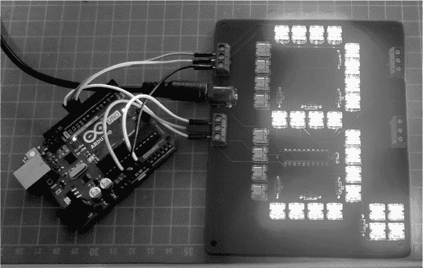

图 8-18：示例显示板输出

由于 LED 的亮度非常高，我在拍摄图 8-18 之前将电源电压设置为 7 V DC，以获得更清晰的照片。当工作在其指定的 9 V DC 电压下时，显示屏应当会更亮。

每个数字的每个段由 28 个 Piranha LED 组成，再加上 4 个用于小数点，由 TPIC6B595 的输出驱动。因此，可以将每个数字视为由七个 LED 组成，再加上一个小数点的 LED。这些 LED 通过 TPIC6B595 的输出以与第 26 项目中继板相同的方式进行控制。

让我们看看它是如何工作的：

```
// Project #27a - Single giant seven-segment LED displays

❶ #define latch 8 // Latch RCK pin
#define clock 9 // Clock SRCK pin
#define data 10 // Data SERIN pin

int digits[] = {B00111111,  // 0
              ❷ B00000110,  // 1
                B01011011,  // 2
                B01001111,  // 3
                B01100110,  // 4
                B01101101,  // 5
                B01111101,  // 6
                B00000111,  // 7
                B01111111,  // 8
                B01100111}; // 9

void sendNumber(int a, boolean point)
{
    if (point == false)
    {
        digitalWrite(latch, LOW);
        shiftOut(data, clock, MSBFIRST, digits[a]);
        digitalWrite(latch, HIGH);
    } else if (point == true)
    {
        digitalWrite(latch, LOW);
      ❸ shiftOut(data, clock, MSBFIRST, digits[a]|B10000000);
        digitalWrite(latch, HIGH);
    }
}

void setup()
{
    pinMode(latch, OUTPUT);
    pinMode(clock, OUTPUT);
    pinMode(data, OUTPUT);
}

void loop()
{
  ❹ for (int a = 0; a < 10; a++)
    {
        sendNumber(a,false);
        delay(1000);
    }
 ❺ for (int a = 0; a < 10; a++)
    {
        sendNumber(a,true);
        delay(1000);
    }
} 
```

示例首先定义了用于连接到移位寄存器的锁存、时钟和数据引脚的 Arduino 数字引脚 ❶。对于 8 字节的数组 ❷，每个字节代表用于控制显示上段的八个输出。例如，数字 1 在二进制中表示为 B00000110，因为你想要点亮显示器的第二和第三段来显示数字 1。

自定义的 sendNumber() 函数将所需的数据发送到移位寄存器，以显示每个数字，然后设置相应的输出。此函数接受要显示的数字，并接受 true 或 false 作为第二个参数，用于打开或关闭小数点。如果需要小数点，示例使用 OR 函数 | ❸（如第二章的第 7 项目中所示）来开启移位寄存器的最高位（位 7），该位控制 DRAIN7。

void setup() 函数设置所需的数字输出引脚。最后，示例演示了通过从零计数到九并反向计数 ❹，然后再次显示带有小数点的数字 ❺。

现在你有了一个大型且引人注目的数字 LED 显示屏，可以从很远的地方看到。如果 LED 的亮度太强，你可以增加电阻的阻值，可能设为 180 或 270 Ω。请确保使用 0.25 W（1/4 W）类型的电阻。

### 四位数字显示器

你可以为更大的数字项目构建和使用多个显示板。在这个示例中，你将使用四个板来显示最多四位的数字。你可以用它来显示数据或作为一个大型、明亮的时钟。

按照上一节的方式构建第二、第三和第四个板，唯一的区别是：这些新板不需要直流插座，因为第一个显示板将充当电源。一旦附加板组装完成，通过将每侧的接线端子连接起来来将它们连接在一起。显示板背面上的匹配标签，如图 8-19 所示，将帮助你完成这一操作。

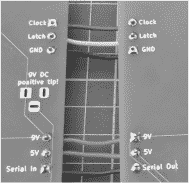

图 8-19：两个显示板的背面

接下来，输入并上传项目#27b 演示程序。一旦上传完成，将 Arduino 连接到最左边的显示板，并连接 9V 电源。显示板应该显示随机的四位数字，并且小数点位置随机，正如图 8-20 所示。

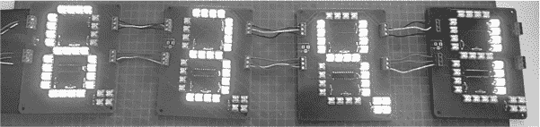

图 8-20：四个显示板在 7V 直流电压下工作

让我们看看这是如何工作的：

```
// Project #27b - Four giant seven-segment LED displays

#define latch 8 // Latch RCK pin ❶
#define clock 9 // Clock SRCK pin
#define data 10 // Data SERIN pin

int digits[] = {B00111111,   // 0 ❷
                B00000110,   // 1
                B01011011,   // 2
                B01001111,   // 3
                B01100110,   // 4
                B01101101,   // 5
                B01111101,   // 6
                B00000111,   // 7
                B01111111,   // 8
                B01100111};  // 9

void sendNumbers(int numbers[], int dp)
{
    digitalWrite(latch, LOW);
    for (int i = 0; i < 4; i++)
    {
        int dig_idx = numbers[i]; ❸
        if (dp == i) {
        // Display the digit
           shiftOut(data, clock, MSBFIRST, digits[dig_idx] | B10000000); ❹
        } else {
            shiftOut(data, clock, MSBFIRST, digits[dig_idx]);
        }
    }
    digitalWrite(latch, HIGH);
}

void setup()
{
    randomSeed(analogRead(0)); ❺
    pinMode(latch, OUTPUT);
    pinMode(clock, OUTPUT);
    pinMode(data, OUTPUT);
}

void loop()
{
    int numbers[4] = {random(0, 10), random(0, 10), random(0, 10), random(0, 10)}; ❻
    sendNumbers(numbers, random(0, 3)); ❼
    delay(1000);
}
```

四个显示板的程序与项目#27a 的程序有一些不同，以便更容易使用多个显示器。它再次定义了连接到移位寄存器的锁存器、时钟和数据引脚的 Arduino 数字引脚❶，并定义了一个包含 8 个字节的数组❷，这些字节用于控制显示板上各个段的输出。

void sendNumbers()函数接受两个参数：一个包含四个数字的数组（每个显示板一个数字）和一个整数，表示在哪些显示板上显示小数点。程序会检查这个值❸。如果参数是 1，则需要的小数点显示位将包含在发送到移位寄存器的字节中❹。

在你显示随机数字时，生成器会使用模拟输入数据❺进行初始化，然后数字显示数组也会被填充为随机数字❻，并发送到显示板❼。最后，程序包含一个延迟，之后会显示更多的随机数字。

你可以使用这些显示板显示各种数字数据。你还可以通过向数字数组中添加更多元素来添加自己的字符。例如，表示温度的度符号如下所示：

```
B01100011 // Binary representation of ° 
```

对于一个挑战，将四个显示板与 Arduino 和实时时钟模块配对，制作一个大型明亮的时钟。你也可以加入一个温度计。希望你能像我设计这些显示板时那样享受使用它们的乐趣。

## 继续前进

在本章中，你学习了如何使用 TPIC6B595 移位寄存器控制电流和电压，这是一种比流行的 74HC595 更强大的替代方案。你现在可以控制比 Arduino 的数字 I/O 引脚安全处理的电流更大的设备。你还学会了如何使用明亮的 Piranha 风格 LED 作为出色的指示灯。

在下一章中，你将使用 MP3 播放器模块来创建数字音乐播放器和各种用途的声音板。
