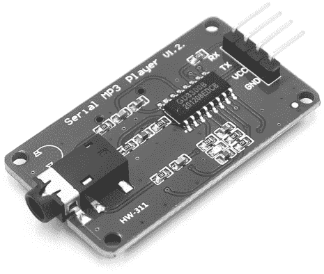
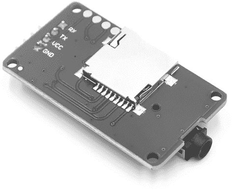
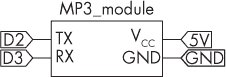
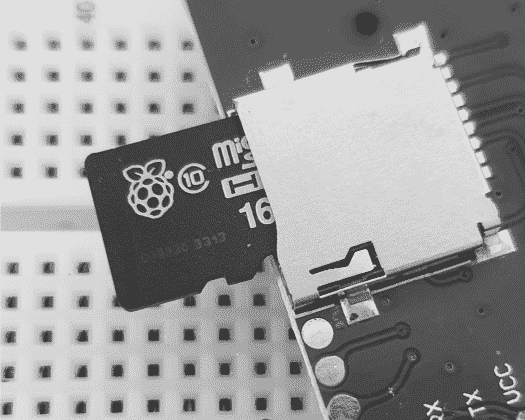
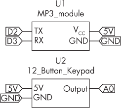
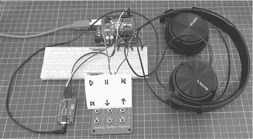
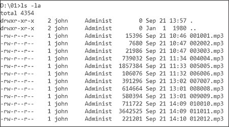

# 第九章：9 构建数字音乐播放器和音效板


数字音频播放器在 2000 年代流行起来，但随着智能手机开始主导市场，它们逐渐消失。不过，离散的 MP3 播放器仍然有很多用途，比如玩具中的音频播放、公告系统或简单的音频播放器。由于裸 MP3 播放器模块的成本较低，你可以轻松构建有趣的 MP3 播放器项目。

在本章中，你将学习：

+   构建一个简单的 MP3 播放器，仅用于听音乐，没有智能手机带来的干扰。

+   制作一个 MP3 音频音效板，用于直接播放控制。

你可以使用本章中构建的设备播放任何你喜欢的音频，并可以将它们修改为前面提到的应用，应用到你未来的项目中。

## YX6300 MP3 模块

对于本章中的 MP3 项目，你将使用 YX6300 型紧凑模块，如图 9-1 所示的 PMD Way 部件 725600。



图 9-1：MP3 播放器模块（正面）

模块的背面是一个 microSD 闪存卡插槽，可以使用最大 32GB 的卡，如图 9-2 所示。



图 9-2：MP3 播放器模块背面

在购买用于 MP3 模块的闪存卡时，请务必购买一个适配器，这样你就可以将其插入 PC 上的普通 SD 内存卡插槽进行文件传输。

我选择基于 YX6300 型 MP3 模块来编写本章，原因有几点。首先，你可以通过模块的 3.5 毫米立体声音频插孔连接耳机、放大器或扬声器，无需额外的电路。其次，命令和信息通过串行数据（UART）使用 Arduino 软件串口发送，因此我们只需要将四个引脚连接到 Arduino 电路。最后，该单元价格低廉，且广泛可用。

在你开始第一个项目之前，先进行一个测试，使用模块播放一些音频。首先，准备三到四个你选择的 MP3 音频文件，并将它们复制到 microSD 卡中。接下来，按照图 9-3 中的原理图将 MP3 模块连接到 Arduino。



图 9-3：MP3 播放器测试电路

小心地将内存卡插入模块，标签面朝上，如图 9-4 所示。卡会滑入并碰到一个弹簧锁—再稍微推一下，直到锁扣住。（要取出卡片，请轻轻推卡片，卡片会弹回来一些，然后弹出。）



图 9-4：将内存卡插入 MP3 播放器模块

最后，将耳机或放大音响插入 MP3 模块，然后输入并上传列表 9-1 中的草图。几秒钟后，模块应该会播放内存卡中第一个音频文件的前 10 秒，然后重复跳到下一个文件并播放 10 秒。模块后面的 LED 应该在内存卡插入时保持亮起，在播放音频时闪烁。如果您的设备无法正常工作，请检查接线，包括 TX/RX 是否连接回 Arduino。

列表 9-1 显示了如何实现这一过程。

```
❶ #define HEADER_START   0x7E
#define HEADER_VERSION 0xFF
#define TAIL_END       0xEF
#define CMD_PLAY_NEXT  0x01
#define CMD_PLAY_PREV  0x02
#define CMD_PLAY_IDX   0x03

int8_t commands[8] = {0, 0, 0, 0, 0, 0, 0, 0};
// Holds command set to send to MP3

#include <SoftwareSerial.h>
SoftwareSerial MP3(2, 3); // Module TX to D2; module RX to D3

void controlMP3(int8_t command, int16_t data)
{
    commands[0] = HEADER_START;        // Header byte 0 (start)
    commands[1] = HEADER_VERSION;      // Header byte 1 (version)
    commands[2] = 0x06;                // Header byte 2 (length cmd + data)
    commands[3] = command;             // Command byte
    commands[4] = 0x00;                // Feedback (0x00 = no, 0x01 = yes)
    commands[5] = (int8_t)(data >> 8); // Data byte 0
    commands[6] = (int8_t)(data);      // Data byte 1
    commands[7] = 0xEF;                // End byte
  ❷ for (int i = 0; i < 8; i++)
    {
        MP3.write(commands[i]);
    }
}

void setup()
{
    MP3.begin(9600);
  ❸ controlMP3(0x09, 0x02); // Select flash card for operation
    delay(500);
  ❹ controlMP3(0x0D, 0); // Resume playback, no feedback
    delay(500);
}

void loop()
{
  ❺ controlMP3(0x01, 0); // Next track, zero data
  ❻ delay(10000);
} 
```

列表 9-1：测试串行 MP3 播放器

该草图通过与 Arduino 的串行 UART 连接，将命令和数据发送到 MP3 模块。每个数据包包含命令和相关数据，共有 8 个十六进制字节的数据。

为了节省时间，草图将一些有用的命令值定义为变量❶。这些命令被组装到commands[]数组中，并通过软件串口发送出去❷。这使用表 9-1 中列出的第一个命令来初始化 MP3 播放器，并选择 microSD 卡插槽作为音频文件的来源❸，然后开始播放音频文件❹。该草图会播放 microSD 卡中找到的下一个音频文件❺，持续播放 10 秒钟❻，然后过程重复。

表 9-1 描述了您可以在播放器上使用的命令。

表 9-1： MP3 播放器命令

| 命令集 | 目的 |
| --- | --- |
| 7E FF 06 09 00 00 02 EF | 初始化 MP3 播放器，使用 microSD 卡 |
| 7E FF 06 0D 00 00 00 EF | 恢复/开始播放 |
| 7E FF 06 0E 00 00 00 EF | 暂停播放 |
| 7E FF 06 16 00 00 00 EF | 停止播放，重置为第一首曲目 |
| 7E FF 06 02 00 00 00 EF | 播放上一首曲目 |
| 7E FF 06 01 00 00 00 EF | 播放下一首曲目 |
| 7E FF 06 05 00 00 00 EF | 调低音量 |
| 7E FF 06 04 00 00 00 EF | 调高音量 |

在每个命令组中的两个粗体字节中，第一个是命令字节，第二个是数据字节。这些是草图中 controlMP3() 函数用来指示 MP3 播放器的两个参数。对于基本播放使用，你无需发送数据字节。

在下一个项目中，你将通过构建一个具有控制功能的 MP3 播放器来测试这些命令。

项目 #28：构建一个简单的 MP3 播放器

在这个项目中，你将创建一个带有典型播放、暂停、音量和曲目前进/后退控制的 MP3 播放器。你将需要以下零件：

+   一块 Arduino Uno 或兼容板和 USB 电缆

+   一个带有 MP3 音频文件的 microSD 卡的 MP3 播放器模块

+   一个无焊接面包板

+   各种跳线

+   耳机或音频放大器和扬声器的连接线

+   来自第一章的模拟 6 或 12 按钮键盘电路

为了构建这个项目，你可以重用在项目 #3 中构建的 12 按钮键盘，只使用其中的 6 个按钮，或者使用项目 #2 中的键盘。如果你使用 12 按钮键盘，别忘了更新模拟键盘库中的模拟值。按照 图 9-5 所示组装电路。



图 9-5：项目 #28 的原理图

输入并上传项目 #28 草图。几秒钟后，按下按钮 7；你在存储卡上安排的 MP3 文件中的音乐应该开始播放。测试其他按钮以确保它们的功能正常。如果某些或所有按钮不起作用，请检查按钮的模拟值是否与实际的按键匹配，按照项目 #2 中描述的过程检查，并按照项目 #3 中的说明更新模拟键盘库中的值。

让我们来看一下这个是如何工作的：

```
// Project #28 - Simple MP3 player

❶ #define HEADER_START   0x7E
#define HEADER_VERSION 0xFF
#define TAIL_END       0xEF
#define CMD_PLAY_NEXT  0x01
#define CMD_PLAY_PREV  0x02
#define CMD_PLAY_IDX   0x03

❷ int8_t commands[8] = {0, 0, 0, 0, 0, 0, 0, 0};
// Holds command set to send to MP3
#include <SoftwareSerial.h>
SoftwareSerial MP3(2, 3); // module TX to D2; module RX to D3
#include <analogkeypad.h>
analogkeypad keypad;

void controlMP3(int8_t command, int16_t data)
{
    commands[0] = HEADER_START;
    commands[1] = HEADER_VERSION;
    commands[2] = 0x06;
  ❸ commands[3] = command;8
    commands[4] = 0x00;
  ❹ commands[5] = (int8_t)(data >> 8);
 commands[6] = (int8_t)(data);
    commands[7] = TAIL_END;
    for (int i = 0; i < 8; i++)
    {
      ❺ MP3.write(commands[i]);
    }
    delay(100);
}

void setup()
{
  ❻ MP3.begin(9600);
    controlMP3(0x09, 0x02); // Select uSD card for operation
    delay(500);
}

void loop()
{
    switch (keypad.readKeypad()) // Read button status
    {
        case 7 : controlMP3(0x0D, 0); break; // Play
        case 8 : controlMP3(0x0E, 0); break; // Pause
        case 9 : controlMP3(0x02, 0); break; // Previous track
        case 10 : controlMP3(0x01, 0); break; // Next track
        case 11 : controlMP3(0x05, 0); break; // Volume down
        case 12 : controlMP3(0x04, 0); break; // Volume up
    }
    delay(250);
} 
```

该草图首先声明了用于存储控制 MP3 模块命令的数组❶，然后初始化了用于 Arduino 与 MP3 播放器控制的软件串口，以及模拟按钮键盘的库❷。自定义的 void controlMP3() 函数接收控制 MP3 播放器所需的命令和数据参数，将它们插入数组❸ ❹，并通过软件串口发送命令给 MP3 播放器❺。然后，草图启动软件串口并发送初始化命令，指示 MP3 播放器使用 microSD 卡❻。

一旦操作开始，草图将循环等待来自模拟按钮电路的响应，在 void loop() 中，每个按钮都被分配一个 controlMP3() 函数，并与来自 表 9-1 的适当命令数据一起使用。

你现在拥有一个可操作的 MP3 音频播放器，可以嵌入、修改或将其做成便携式设备，作为你自己的无干扰音频源（与智能手机不同，智能手机的游戏、信息和其他内容可能会分散注意力）。连接到 Arduino 的 USB 电缆为该项目供电，但你也可以使用移动电源或交流转 USB 适配器，并将所有组件放置在你自己设计的外壳内。如果你要向朋友或家人演示这个项目，你还可以绘制一张小地图，说明哪些按钮对应哪些功能，正如图 9-6 所示。



图 9-6：项目 #28 的示例，配有 12 键键盘和用户参考播放控制

在下一个项目中，你将使用刚刚制作的 MP3 播放器模块来创建一个声音板。

项目 #29：构建一个 MP3 播放器声音板

在本项目中，你将使用项目 #28 中的硬件，结合 12 键板，创建一个 *声音板*，这是一个可以通过按下按钮播放预设音频的设备。声音板常用于广播、玩具或博物馆展览中，为视障人士提供信息。本项目使用按钮来启动音频播放，但你可以将其作为框架，用于在 Arduino 检测到其他动作时播放音频，比如代码中的触发器或传感器、开关等的输出。

在上传项目 #29 的草图之前，按照图 9-7 所示的编号规范，重命名 microSD 卡上的 MP3 音频文件，以便 MP3 播放器可以在按下按钮时搜索并播放准确的音频文件。例如，当播放器搜索音频文件 1 时，MP3 会播放 *001001.mp3* 文件。因此，你应该将文件 4 命名为 *004004.mp3*，文件 12 命名为 *012012.mp3*，依此类推。将这些文件存储在名为 *01* 的文件夹中。



图 9-7：MP3 文件在 01 文件夹中的示例，文件名结构适用于声音板使用

这些 MP3 文件可以包含你喜欢的任何音频。为了好玩，你可以尝试从网站如 [*https://<wbr>www<wbr>.zapsplat<wbr>.com*](https://www.zapsplat.com) 下载一些音效，例如动物叫声或日常环境噪音。我已将 Zapsplat 的音效文件夹随书籍下载文件一起提供，下载地址是 [*https://<wbr>nostarch<wbr>.com<wbr>/arduino<wbr>-arduinians*](https://nostarch.com/arduino-arduinians)。另外，你也可以将 MP3 文件替换成你最喜欢的 12 首歌曲。

一旦你收集并整理好了 MP3 文件，并将 microSD 卡插入播放器，输入并上传以下草图：

```
// Project #29 - MP3 player sound board

#define HEADER_START   0x7E
#define HEADER_VERSION 0xFF
#define TAIL_END       0xEF
#define CMD_PLAY_NEXT  0x01
#define CMD_PLAY_PREV  0x02
#define CMD_PLAY_IDX   0x03

int8_t commands[8] = {0, 0, 0, 0, 0, 0, 0, 0};
// Holds command set to send to MP3
#include <SoftwareSerial.h>
SoftwareSerial MP3(2, 3); // Module TX to D2; module RX to D3
#include <analogkeypad.h>
analogkeypad keypad;

void controlMP3(int8_t command, int16_t data)
{
    commands[0] = 0x7E;
    commands[1] = 0xFF;
    commands[2] = 0x06;
    commands[3] = command;
    commands[4] = 0x00;
    commands[5] = 0x01;
    commands[6] = (int8_t)(data);
    commands[7] = 0xEF;
    for (int i = 0; i < 8; i++)
    {
        MP3.write(commands[i]);
    }
    delay(100);
}

void setup()
{
    MP3.begin(9600);
    controlMP3(0x09, 0x02); // Select uSD card for operation
    delay(500);
}

void loop()
{
    switch (keypad.readKeypad()) // Read button status
    {
 ❶ case 1 : controlMP3(0x0F, 1); break; // Play 01/001001.mp3
        case 2 : controlMP3(0x0F, 2); break; // Play 01/002002.mp3
        case 3 : controlMP3(0x0F, 3); break; // Play 01/003003.mp3
        case 4 : controlMP3(0x0F, 4); break; // And so on…
        case 5 : controlMP3(0x0F, 5); break;
        case 6 : controlMP3(0x0F, 6); break;
        case 7 : controlMP3(0x0F, 7); break;
        case 8 : controlMP3(0x0F, 8); break;
        case 9 : controlMP3(0x0F, 9); break;
        case 10 : controlMP3(0x0F, 10); break;
        case 11 : controlMP3(0x0F, 11); break;
        case 12 : controlMP3(0x0F, 12); break;
    }
    delay(250);
} 
```

这个草图的工作方式与前一个项目相同，唯一不同的是，当你按下按钮时，会发送不同类型的命令和数据到播放器。这些新命令播放与数据值匹配的轨道编号。例如，要播放文件*001001.mp3*，草图会发送

```
7E FF 06 0F 00 01 01 EF 
```

使用controlMP3(0x0F, 1) ❶。直接播放轨道的命令是0x0F，数据值（1）是轨道文件名的编号（*001001.mp3*）。其他按钮遵循相同的命令格式，数据值与其他 MP3 文件名匹配。

## Moving On

在本章中，你学习了如何构建自己的 MP3 播放器，并用它来听音乐和播放音效。还有许多其他有趣的方式可以使用你的 MP3 模块，例如为项目创建可听见的输出，而不是使用 LED 或显示器。作为最后的挑战，你可能会编写自己的 MP3 播放器 Arduino 库。

在下一章，你将学习如何使用一种新的温度传感器、OLED 显示屏以及多个 I²C 总线与 Arduino 配合使用。
