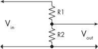
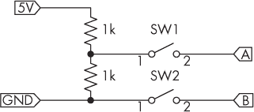
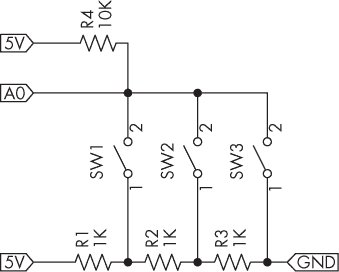
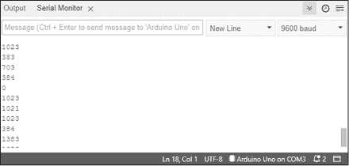
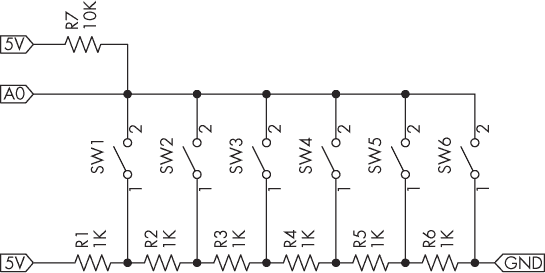
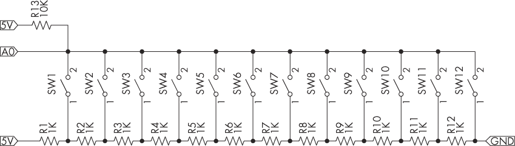
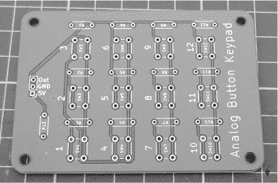
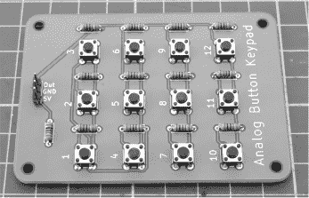
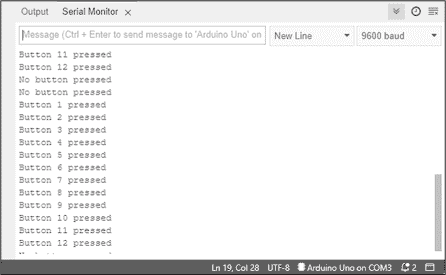

# 第一章：1 使用一个模拟输入读取多个按钮


与其使用多个数字输入来读取多个按钮，你可以通过一个模拟输入引脚读取多个按钮。这不仅减少了 Arduino 上使用的输入/输出（I/O）引脚数量，还可以节省你的开支，因为你不需要任何外部集成电路（IC），例如移位寄存器或端口扩展器。

在本章中，你将学习：

+   使用电压分压器和按钮创建不同的电压，区分连接到模拟到数字转换器（ADC）引脚的按钮

+   使用一个模拟输入读取三个或六个按钮

+   构建一个 12 按钮键盘，可以通过一个模拟输入读取

## 电压分压器

本章使用的多按钮方法基于你的 Arduino 的模拟到数字转换器（ADC）引脚，这些引脚返回与连接到 ADC 引脚的电压相关的值。回想一下，你的 Arduino Uno 或兼容板有六个 ADC 引脚，如图 1-1 所示。


图 1-1：Arduino Uno 的模拟输入

若要构建电路，以便通过一个 ADC 引脚一次读取最多 12 个按钮，你需要使用*电压分压*：即使用两个或更多电阻将较大的电压分压成多个较小的电压，Arduino 可以通过模拟输入引脚逐个读取这些电压。图 1-2 展示了如何使用两个电阻来实现这一目的。



图 1-2：基本电压分压器的原理图

你可以使用以下公式计算输出电压（V[out]）：


用相同值的电阻和任何电压替代时，将导致输出电压 V[out]为输入电压 V[in]的一半。例如，如果 R1 和 R2 都是 1 kΩ，并且你有一个 5 V 的输入电压，那么计算为 V[out] = 5 (1,000 / (1,000 + 1,000))，这将得到 2.5 V 的 V[out]。

电阻没有精确的值；电阻越精确，制造起来就越困难。你可以选择不同公差的电阻，例如 5%或 1%。例如，一个 1 kΩ、1%公差的电阻，其值在 990 和 1,010 Ω之间。在构建电压分压器或一般电路时，尽量使用公差为 1%的电阻——它们与 5%电阻相比价格差不多，但你的结果会更精确。

在构建电压分压器时，确保你的电阻能够承受你计划通过它们的功率。例如，如果你使用的是 0.25 W 的电阻，并且需要将 24 V DC 分压为 12 V，你最多只能通过分压器流过 20 mA 的电流。使用公式 *W* = *V* × *A*（瓦特 = 电压（DC）× 电流（安培））来帮助你计算消耗的功率。

将 图 1-2 中的示例电压分压器与两个按钮结合，得到如 图 1-3 所示的电路。



图 1-3：带有两个按钮的电压分压器

当你按下第一个按钮时，A 点的电压应为 2.5 V DC，因为电流从 5 V 电源流出并通过两个电阻分压。当按下第二个按钮时，B 点的电压应为 0 V DC，因为 B 点直接连接到 GND。如果你将 A 点和 B 点连接到模拟输入端口，你应该能够检测到按下的是哪个按钮，因为 ADC 返回的值对于每个按钮会有所不同（理论上，按钮 1 的值应该为 512，按钮 2 的值应该为 0）。你只用一个输入端口读取了两个按钮的状态！

如果你同时按下两个或更多按钮，另一个电压—由按下的按钮与电阻分压器的组合决定—应返回给 ADC。确定值的最简单方法是搭建电路并进行测试。通过电压分压，你可以使用一系列相同值的按钮和电阻，生成不同的输出电压，使得 Arduino 的模拟输入能够读取，从而区分每个按钮。

项目 #1：三个按钮与一个模拟输入

让我们从一个简单的多按钮使用示例开始：通过一个模拟输入读取三个按钮。你需要以下零件来完成此项目：

+   一块 Arduino Uno 或兼容板及 USB 电缆

+   三个 1 kΩ、0.25 W、1% 的电阻

+   一个 10 kΩ、0.25 W、1% 的电阻

+   三个触觉按钮

+   一个无焊接面包板

+   公对公跳线

按照 图 1-4 所示的电路在无焊接面包板上组装电路，并将标有 5V、GND 和 A0 的点分别连接到 Arduino 的 5V、GND 和 A0 引脚。



图 1-4：项目 #1 的电路

现在输入并上传项目 #1 的代码到你的 Arduino。稍等片刻，然后在 Arduino IDE 中打开串口监视器，开始依次按下按钮。当你没有按下任何按钮时，ADC 返回的值应保持在大约 1,010 左右。试着按下按钮 1、2 和 3，查看不同的返回值，如 图 1-5 所示。



图 1-5：项目 #1 的示例输出

让我们看看代码，了解它是如何工作的：

```
// Project #1 - Reading three buttons from one analog input

void setup()
{
    Serial.begin(9600);
}

void loop()
{
  ❶ int sensorValue = analogRead(A0);
  ❷ Serial.println(sensorValue);
    delay(100);
} 
```

项目 #1 中的代码读取模拟引脚 A0 ❶ 测得的值，并在串口监视器 ❷ 上显示出来。这是为了演示三按钮电路生成的不同模拟值。上传代码后，打开串口监视器并开始按下按钮。当按下按钮 1 时，示例返回的值介于 700 和 704 之间；按下按钮 2 时，值介于 383 和 385 之间；按下按钮 3 时，值为 0。由于电阻的公差，您的值可能会略有不同。

当按下按钮时，电流至少会通过一个电阻作为您的 R1，并且根据所按的按钮，电流会通过某些电阻，这些电阻作为电压分压器。

使用电阻分压公式，您可以计算出按下按钮 1 时，R1 值为 1 kΩ，R2 值为 2 kΩ（按钮连接点以下的电阻之和）。使用 V[out] = 5 (2,000 / (1,000 + 2,000))，理论上呈现给 ADC 的电压为 3.33 V。如果按下按钮 2，则 V[out] = 5 (1,000 / (1,000 + 2,000)) 结果为 1.66 V。如果按下按钮 3，则 V[out] = 5 (0 / (3,000 + 0)) 结果为 0 V，因为 ADC 直接连接到 GND。

最后，如果没有按下任何按钮，ADC 返回的值应接近 1,010。该项目通过电路中的 10 kΩ 上拉电阻实现此功能，电阻将 5V 电源与模拟输入连接。如果没有这个电阻，ADC 将“浮动”，报告随机值，这些值可能会落入其他按钮的范围内。这一点很重要，因为我们需要在没有按下任何按钮时返回一个恒定的值范围。

实际操作中，ADC 返回的值会有些许变化。例如，Arduino 的 5V 引脚（如果通过 USB 供电）测得的值略低，因为一些电压在微控制器中损失，这会影响 ADC 代码中的计算。始终使用您预期的电源（USB 或外部 DC 电源）为 Arduino 供电，并测试代码，以确保按钮读取代码的准确性。

现在，您已经实验了三个按钮，我们来尝试一个更复杂的设计。

项目 #2：六个按钮与一个模拟输入

该项目通过一个模拟引脚读取六个按钮，并提供改进的按钮状态报告草图。您将需要以下部件：

+   一块 Arduino Uno 或兼容板以及 USB 电缆

+   六只 1 kΩ、0.25 W、1% 的电阻

+   一只 1 kΩ、0.25 W、1% 的电阻

+   六个触觉按钮

+   一块无焊接面包板

+   公对公跳线

按照 图 1-6 所示，在无焊接面包板上组装电路，并将标记为 5V、GND 和 A0 的点分别连接到 Arduino 的 5V、GND 和 A0 引脚。



图 1-6：项目 #2 的电路

现在输入并上传以下草图到你的 Arduino：

```
// Project #2 - Reading six buttons from one analog input

void setup()
{
    Serial.begin(9600);
}

❶ int analogButton()
// Returns number of button pressed by comparing ADC value
{
    int adcValue;
    int button;
  ❷ adcValue = analogRead(A0);
    if (adcValue>1000) {button = 0;}
    else if (adcValue>857 && adcValue<861) {button = 1;}
    else if (adcValue>696 && adcValue<700) {button = 2;}
    else if (adcValue>535 && adcValue<539) {button = 3;}
    else if (adcValue>371 && adcValue<375) {button = 4;}
    else if (adcValue>199 && adcValue<203) {button = 5;}
  ❸ else if (adcValue>=0 && adcValue<16)   {button = 6;}
  ❹ return button;
}
void loop()
{
  ❺ switch(analogButton()) // Read button status
  ❻ {
        case 0 : Serial.println("No button pressed"); break;
        case 1 : Serial.println("Button 1 pressed"); break;
        case 2 : Serial.println("Button 2 pressed"); break;
        case 3 : Serial.println("Button 3 pressed"); break;
        case 4 : Serial.println("Button 4 pressed"); break;
 case 5 : Serial.println("Button 5 pressed"); break;
        case 6 : Serial.println("Button 6 pressed"); break;
    }
    delay(250);
} 
```

为了简化按钮电路的使用，自定义的 analogButton() 函数 ❶ 返回被按下的按钮编号，如果没有按钮被按下，则返回 0。该函数从模拟引脚 A0 ❷ 获取读数，并将其与每个按钮按下时返回的期望范围进行比较 ❸。该草图返回按钮编号，作为 analogButton() 函数的结果 ❹。主循环中的自定义函数检查按钮是否被按下 ❺，而 switch…case 函数则根据不同的按钮按下执行相应操作 ❻。

你从模拟输入获取的所需范围会有所不同；使用项目 #1 中的草图来确定本项目中需要使用的确切范围。

项目 #3：一个带有一个模拟输入的 12 按钮键盘

本项目将项目 #2 的电路扩展至 12 个按钮，创建一个更大的最终设计，并使用自己的 Arduino 库。使用这个库可以减少读取按钮所需的主草图中的代码。虽然可以在无焊接面包板上搭建这个电路，但我推荐你下载本项目的 PCB 文件并制作一个永久版。

如果你使用面包板，你将需要以下部件：

+   一个 Arduino Uno 或兼容板和 USB 线

+   十二个 1 kΩ, 0.25 W, 1% 的电阻

+   一个 10 kΩ, 0.25 W, 1% 的电阻

+   十二个触觉按钮

+   一个无焊接面包板

+   公对公跳线

如果你使用 PCB，你将需要以下部件：

+   一个 Arduino Uno 或兼容板和 USB 线

+   十二个 1 kΩ, 0.25 W, 1% 的电阻

+   一个 1 kΩ, 0.25 W, 1% 的电阻

+   十二个 6 × 6 × 4.3 mm 触觉按钮

+   1 × 3 排 2.54 mm 排头针

+   公对母跳线

图 1-7 显示了本项目的电路原理图。



图 1-7：项目 #3 的电路原理图

如果你正在构建 PCB 电路，部件上会有标签，帮助你将组件准确放置在 PCB 上，如图 1-8 所示。



图 1-8：项目 #3 的 PCB 顶面

安装并焊接电阻后再安装按钮。通常，在 PCB 上组装电路时，应首先从最低高度的部件开始，然后逐步安装较大或较重的部件。排头针通常以 40 针为一条出售，因此你需要修剪出一段 3 针的部分来使用于本项目。

一旦组装完成，您的项目应该类似于图 1-9 所示的电路板。



图 1-9：完成的项目#3 PCB

现在，按照图 1-10 所示，通过 5V、GND 和 A0 引脚将电路连接到 Arduino。


图 1-10：连接到 Arduino Uno 的键盘

接下来，通过从项目#1 上传草图，确定每个按钮的模拟值，并将其插入到库的源文件中。打开串行监视器，依次按下每个按钮，并记录监视器显示的值。您可以使用这些值为该项目创建库的范围。

为了简化键盘的使用，安装以下模拟键盘库，接下来的三个文件列出了该库的内容。（有关编写和安装您自己的 Arduino 库的详细信息，请参见附录 A。）以下代码是源文件；使用项目#1 中的草图和本项目的键盘来确定您的ADCvalue范围。

```
// analogkeypad.cpp source file

#include "Arduino.h"
#include "analogkeypad.h"

analogkeypad::analogkeypad()
{
}

int analogkeypad::readKeypad()
{
    int adcValue;
    int button;
    adcValue = analogRead(A0);
    if (adcValue>`1000`) {button = 0;}
    else if (adcValue>`941` && adcValue<`944`) {button = 1;}
    else if (adcValue>`863` && adcValue<`868`) {button = 2;}
 else if (adcValue>`790` && adcValue<`795`) {button = 3;}
    else if (adcValue>`716` && adcValue<`720`) {button = 4;}
    else if (adcValue>`643` && adcValue<`648`) {button = 5;}
    else if (adcValue>`570` && adcValue<`573`) {button = 6;}
    else if (adcValue>`493` && adcValue<`496`) {button = 7;}
    else if (adcValue>`413` && adcValue<`418`) {button = 8;}
    else if (adcValue>`325` && adcValue<`329`) {button = 9;}
    else if (adcValue>`231` && adcValue<`235`) {button = 10;}
    else if (adcValue>`129` && adcValue<`133`) {button = 11;}
    else if (adcValue>`13` && adcValue<`18`) {button = 12;}
    return button;
} 
```

这是头文件：

```
// analogkeypad.h header file

#ifndef analogkeypad_h
#define analogkeypad_h

#include "Arduino.h"

class analogkeypad
{
    public:
        analogkeypad();
        int readKeypad();
    private:
        int adcValue;
        int button;
};
#endif 
```

这是*KEYWORDS.TXT*文件：

```
Analogkeypad. KEYWORD1
readKeypad.   KEYWORD2 
```

安装库后，上传项目#3 的匹配草图：

```
// Project #3 - Reading 12 buttons from 1 analog input

#include <analogkeypad.h>
❶ analogkeypad keypad;
void setup()
{
    Serial.begin(9600);
}

void loop()
{
  ❷ switch (keypad.readKeypad()) // Read button status
 {
    ❸  case 0 : Serial.println("No button pressed"); break;
        case 1 : Serial.println("Button 1 pressed"); break;
        case 2 : Serial.println("Button 2 pressed"); break;
        case 3 : Serial.println("Button 3 pressed"); break;
        case 4 : Serial.println("Button 4 pressed"); break;
        case 5 : Serial.println("Button 5 pressed"); break;
        case 6 : Serial.println("Button 6 pressed"); break;
        case 7 : Serial.println("Button 7 pressed"); break;
        case 8 : Serial.println("Button 8 pressed"); break;
        case 9 : Serial.println("Button 9 pressed"); break;
        case 10 : Serial.println("Button 10 pressed"); break;
        case 11 : Serial.println("Button 11 pressed"); break;
        case 12 : Serial.println("Button 12 pressed"); break;
    }
delay(250);
} 
```

该草图的结果与项目#2 相同，但允许在主循环中添加更多按钮。它首先包含模拟键盘库❶，并启动键盘的一个实例；接下来，通过库函数❷获取按下的按钮编号。然后，草图将按钮编号发送到串行监视器，在switch…case函数❸中显示。

上传草图后，打开串行监视器并依次按下按钮。这应该会产生类似于图 1-11 所示的输出。



图 1-11：项目#3 的示例输出

您可以在自己的项目中使用此草图，只需在需要时查询键盘，同时使用库和readKeypad()函数。

> 注意

*在您自己的项目中，如果使用了本章的草图，可以使用除 Uno 以外的其他 Arduino 类型，只要它们有模拟输入。如果您的电路板使用 3.3V 而不是 5V，请在更新项目#2 中的自定义函数或项目#3 中使用的库之前，使用项目#1 中的草图来确定电路所需的模拟值。*

## 继续

在本章中，你学会了构建一个电路，使得你的 Arduino 仅使用一个模拟输入引脚就能读取多达 12 个按钮的状态。在下一章中，你将学习另一种提高项目效率的方法：通过端口操作同时读取和写入数字 I/O 引脚。
