# 第十章：10 使用具有相同地址的多个 I2C 设备


在您的 Arduino 旅程中，您可能遇到过通过 I²C 总线接口的设备，I²C 是一个简单的双线数据总线，在这个总线上 Arduino 被视为*主设备*，而总线上的每个附加设备或 IC 则是*从设备*。每个从设备都有自己的地址，允许 Arduino 与其通信。然而，如果两个或更多设备具有相同的总线地址，您将无法将它们一起使用在同一总线上。

本章将向您展示如何通过 TCA9548A I²C 开关 IC 使用两个或更多具有相同总线地址的设备。您将学习如何：

+   构建一个 I²C 地址扫描仪，以确定设备的总线地址

+   使用紧凑型图形有机发光二极管（OLED）显示屏

+   使用 BMP180 温度和气压传感器

+   将 BMP180 和 OLED 设备结合使用

为了让您能同时使用多个 I²C 设备，我将首先介绍一个简单的工具，它可以报告连接到 Arduino I²C 总线的设备的总线地址：I²C 总线扫描仪。

> 注意

*如果您不熟悉 I* *²**C 总线，可以查看* 《Arduino Workshop》第十九章*，第二版。*

项目 #30：使用 I²C 总线扫描仪

在本项目中，您将学习如何使用 I²C 总线扫描仪。这个工具帮助您收集无法找到文档的零件或设备的信息，例如零件的总线地址。它对于在将设备连接到总线后进行快速的 I²C 总线测试也非常理想。

您需要以下零件：

+   一块 Arduino Uno 或兼容板及 USB 数据线

+   一个无焊接面包板或 I²C 设备的安装架

+   各种跳线

硬件连接将取决于待测 I²C 设备。例如，我将使用 BMP180 传感器来测量温度、大气压力和海拔，如图 10-1 所示。

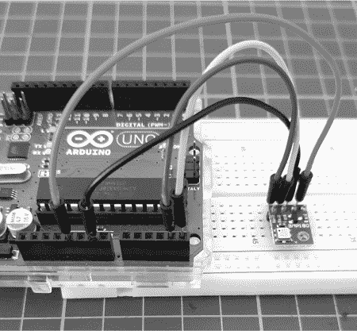

图 10-1：BMP180 传感器板

您还将在本章及本书的其他部分使用 BMP180，但在本项目中，您可以使用任何兼容 5V 的 I²C 设备。如果您的设备不是模块，请不要忘记像平时一样使用上拉电阻。

本项目的草图已随 Arduino IDE 提供。通过选择 **文件**  **示例**  **Wire**  **i2c_scanner**，打开并上传随 Wire 库示例一起提供的 i2c_scanner 草图。

该示意图应该查询总线并在串口监视器中报告找到的地址（或地址），如图 10-2 所示。

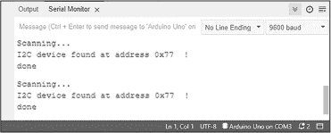

图 10-2：I²C 扫描器示意图的结果2C 扫描器示意图

如果总线上有两个或更多设备，扫描器将报告两个地址，但你无法知道哪个设备属于哪个地址。例如，图 10-3 显示了连接到总线的两个设备的总线地址。当你同时使用两个或更多设备时，即使电源开启，移除一个或多个设备也是可以的，因为 I²C 总线支持“热插拔”。也就是说，它设计成允许设备在运行时连接或移除。

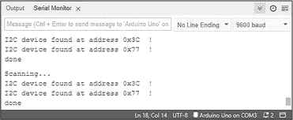

图 10-3：带有两个设备的 I²C 扫描器示意图的结果

该示意图非常简单。让我们来看它是如何工作的：

```
// Project #30 - I2C bus address scanner

void loop()
{
    int nDevices = 0;
    Serial.println("Scanning…");
  ❶ for (byte address = 1; address < 127; ++address)
    {
        Wire.beginTransmission(address);
        byte error = Wire.endTransmission();
     ❷ if (error == 0)
        {
            Serial.print("I2C device found at address 0x");
            if (address < 16)
            {
 Serial.print("0");
            }
            Serial.print(address, HEX);
            Serial.println(" !");
            ++nDevices;
        }
      ❸ else if (error == 4)
        {
            Serial.print("Unknown error at address 0x");
            if (address < 16)
            {
                Serial.print("0");
            }
            Serial.println(address, HEX);
        }
    }
    if (nDevices == 0)
    {
      ❹ Serial.println("No I2C devices found\n");
    } else
    {
        Serial.println("done\n");
    }
    delay(5000); // Wait 5 seconds for next scan
} 
```

该示意图开始并完成对每个可能的 I²C 地址位置（0 到 127）进行 I²C 连接 ❶。如果在测试的地址上存在设备，示意图会返回错误代码 0 ❷；如果发生错误，它会返回 4 ❸。如果没有找到任何设备，它会打印信息 未找到 I2C 设备 ❹。

现在你已经了解了如何将一个或多个 I²C 设备连接到总线，让我们开始使用 TCA9548A。

## TCA9548A 扩展板

TCA9548A，如图 10-4 所示，允许你将 Arduino 的单个 I²C 总线连接到从 TCA9548A 发出的八个独立总线中的任何一个，每个总线的工作方式与 Arduino 原始的 I²C 总线相同。

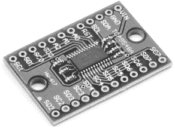

图 10-4：TCA9548A 扩展板

TCA9548A 还负责电压转换，使你可以使用与主机 Arduino 工作在不同电压的设备——这是一个方便的优点，因为越来越多的设备只在 3.3 V 或 1.8 V 下工作。不幸的是，TCA9548A 仅以表面贴装形式提供，因此无法与无焊接面包板或原型板一起使用。相反，你需要使用模块。

TCA9548A 插件板应包括一对尚未焊接到板上的内联插针。现在我们来焊接它们。为了使插针正确对齐，你可以将它们插入无焊接面包板，如 图 10-5 所示。

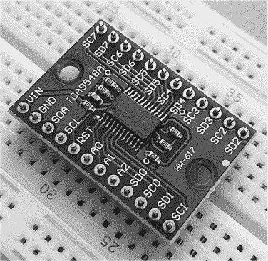

图 10-5：未焊接内联插针的 TCA9548A 插件板

在你焊接好插针后，板子就可以在无焊接面包板和其他硬件解决方案中使用，如 图 10-6 所示。

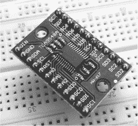

图 10-6：带有内联插针并已焊接到 PCB 焊盘的 TCA9548A 插件板

板上的引脚排列与 图 10-7 中显示的原理图相匹配，原理图中还包括了你应该连接到 Arduino Uno 或兼容板的连接。

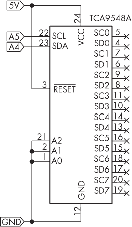

图 10-7：TCA9548A 原理图

TCA9548A 需要在 I²C 总线与正电源之间连接上拉电阻；这些电阻已经包含在插件板上。

原理图中标记为 A0 到 A2 的引脚用于定义 TCA9548A 的总线地址。正如你所看到的，原理图将它们都设置为 GND。如果你运行端口扫描器，它将返回地址 0x70。如果需要，你可以通过将 A0 到 A2 引脚连接到 GND 或 5V 的组合，来更改地址，如 表 10-1 所列。

表 10-1： TCA9548A 地址配置

| A0 | A1 | A2 | 地址 |
| --- | --- | --- | --- |
| GND | GND | GND | 0x70 |
| GND | GND | 5V | 0x71 |
| GND | 5V | GND | 0x72 |
| GND | 5V | 5V | 0x73 |
| 5V | GND | GND | 0x74 |
| 5V | GND | 5V | 0x75 |
| 5V | 5V | GND | 0x76 |
| 5V | 5V | 5V | 0x77 |

原理图中的八个 I²C 总线对标记为 SC0/SD0 到 SC7/SD7（分别是时钟和数据）。TCA9548A 将它们每个都视为物理上独立的 I²C 总线。

在您的草图中使用 TCA9548A 只需要在正常使用 I²C 设备之前进行一个额外的步骤：指示 TCA9548A 使用它控制的八个总线之一。为此，您需要向 TCA9548A 的 I²C 总线寄存器发送一个字节的数据，以确定您想使用的总线是哪一条。该字节的每一位用于打开或关闭总线，其中最高有效位（MSB）对应总线 7，最低有效位（LSB）对应总线 0。例如，发送 B00000001（二进制）或 0（十进制）将激活总线 0，而发送 B00010000 将激活总线 5。然后，TCA9548A 会将所有数据在所选总线上进出 Arduino；TCA9548A 对 Arduino 是透明的。

仅在您想要更改总线时发送总线选择数据。为了简化此过程，您可以使用以下函数来选择所需的总线：

```
void TCA9548A(uint8_t bus)
{
    Wire.beginTransmission(0x70); // TCA9548A address is 0x70
    Wire.write(1 << bus);         // Send byte to select bus
    Wire.endTransmission();
} 
```

该函数接受一个总线编号，并在 TCA9548A 的总线寄存器中放置一个 1，以匹配我们的需求。在需要访问特定 I²C 总线上的设备之前，插入此函数。例如，您可以使用此函数访问总线 0 上的设备：

```
TCA9548A(0); 
```

这是访问总线 7 上设备的函数：

```
TCA9548A(7); 
```

现在您知道如何选择所需的总线，我将介绍一个有趣的显示器，您将在项目中使用它。

## 图形 OLED 显示器

您可能熟悉经典的 16 × 2 字符 LCD 显示器，因为它们非常流行且价格便宜。然而，它们也有点笨重且过时。OLED 显示器是一种更时尚、更现代的选择，能够显示文本和图形，且尺寸可调。

本章中的项目将使用一款紧凑型 128 × 32 像素 OLED 显示器，显示尺寸对角线为 0.91 英寸，例如 PMD Way 的 35998841A，见 图 10-8。

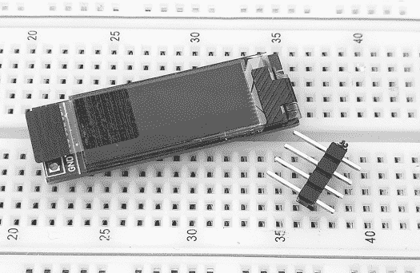

图 10-8：一款带内联连接引脚的紧凑型 OLED 显示器

使用无焊面包板的内联连接头随 PMD Way 示例板一起提供，通常其他供应商的产品也包括这个，但请与供应商确认。你可以通过将引脚和 OLED 安装到面包板上，轻松地将它们焊接到面包板上，正如 图 10-9 所示。用其他内联引脚支撑 OLED 的另一端，保持显示器水平，正如 图 10-9 中所示，可以帮助确保引脚保持笔直。

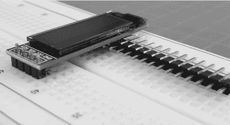

图 10-9：一款紧凑型 OLED 显示器放置在内联连接引脚上，准备焊接

一旦准备好使用 OLED，按 图 10-10 所示，通过拉动蓝色标签移除塑料屏幕保护膜。

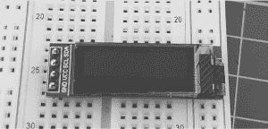

图 10-10：即插即用 OLED

要使用 OLED，你需要安装 Arduino 库。在库管理器中搜索 **u8g2**，然后点击库描述底部的 **安装**。

安装库之后，运行 I²C 扫描器草图来测试 OLED。它应该返回地址 0x3C，但如果你得到不同的结果，记下它以备后用。接下来，使用 表 10-2 中列出的连接方式，将 OLED 连接到你的 Arduino Uno 或兼容板。

表 10-2： OLED 与 Arduino 连接

| OLED | Arduino Uno |
| --- | --- |
| SDA | A4 |
| SCL | A5 |
| VCC | 5V |
| GND | GND |

现在，输入并上传清单 10-1 的草图，你可以在本书网页上的可下载代码文件中找到它。片刻后，显示屏应当在显示“Count!”和一个整数之间滚动，如图 10-11 所示。如果你的显示屏的总线地址与 0x3C 不同，请将新地址插入到行 u8g2_2.setI2CAddress(0x3D); 的 “address” 字段中，在 void setup() 中，然后取消注释此行，保存并重新上传草图。

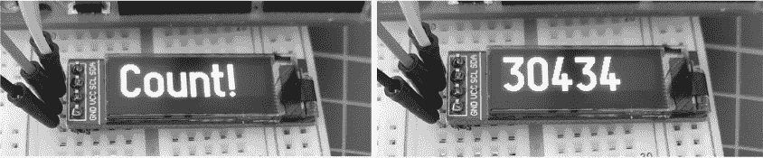

图 10-11：来自 清单 10-1 的示例显示

清单 10-1 展示了如何实现这一点。

```
❶ #include <U8g2lib.h>
#include <Wire.h>
U8G2_SSD1306_128X32_UNIVISION_F_HW_I2C u8g2(U8G2_R0, U8X8_PIN_NONE);

void setup()
{
    Wire.begin();
  ❷ u8g2.begin();
    //u8g2_2.setI2CAddress(address);
  ❸ u8g2.setFont(`u8g2_font_logisoso32_tr`); // Select font
}

void loop()
{
    for (int a = 29999; a < 32767; a++)
    {
        u8g2.clearBuffer(); // Clear OLED memory
      ❹ u8g2.drawStr(0, 32, "Count!"); // Write text to memory
        u8g2.sendBuffer(); // Display contents of memory
        delay(1000);
        u8g2.clearBuffer(); // Clear OLED memory
        u8g2.setCursor(0, 32); // Position cursor in memory
        u8g2.print(a); // Write integer to memory
        u8g2.sendBuffer(); // Display contents of memory
        delay(1000);
    }
} 
```

清单 10-1：使用图形 OLED 显示屏

首先，草图包含了 u8g2 库，并包含了 OLED 库 ❶，然后创建了 OLED 的实例。OLED 的规格在此文件中定义，以便库知道你正在使用哪种类型的 OLED。

草图首先初始化 OLED ❷ 并为显示屏选择字体 ❸。草图使用的字体为 32 像素高，这对于这个 OLED 显示屏效果很好，但你可以用[*https://<wbr>github<wbr>.com<wbr>/olikraus<wbr>/u8g2<wbr>/wiki<wbr>/fntlistall*](https://github.com/olikraus/u8g2/wiki/fntlistall) 上提供的任何字体来替换它。

草图通过在其内存中绘制预期的显示内容，然后将内存中的内容发送到显示屏，来控制 OLED。OLED 的内存清空后，函数 ❹ 接受 OLED 显示屏的较低 x 和 y 坐标，然后开始绘制文本本身。草图随后将 OLED 内存中的内容打印到显示屏上。

草图在短暂的延迟后再次清空内存，并通过首先设置光标位置，再将数字打印到内存中，然后通过另一个 sendBuffer() 函数来显示内存中的内容。

现在你已经掌握了 OLED 显示屏，我将介绍一个你将在最终项目中与 OLED 一起使用的传感器。

## BMP180 传感器

BMP180 传感器是一种廉价、易于使用的 I²C 设备，用于测量环境温度和气压。本章的最终项目使用了一个紧凑型的 BMP180 模块，带有上拉电阻，类似于第 30 个项目中使用的那种，例如 PMD Way 部件 18000001，如图 10-12 所示。

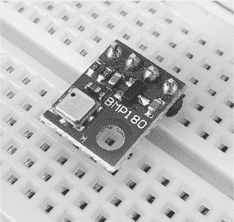

图 10-12：BMP180 传感器模块

与 OLED 显示屏一样，首先需要将 BMP180 的引脚焊接到电路板上。接着，在 Arduino 库管理器中找到**Adafruit BMP180**库并安装它。

在安装 BMP180 库的过程中，可能会提示你安装一些缺失的依赖项。如果出现提示，请点击**安装全部**。

现在，输入并上传清单 10-2 的草图。上传完成后，打开 IDE 中的串口监视器，你将看到当前的温度（单位为摄氏度）和气压（单位为百帕）。在一些地区，气压单位是毫巴。一百帕等于一毫巴。图 10-13 显示了这个输出的示例。

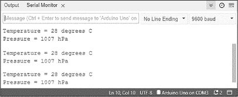

图 10-13：清单 10-2 的示例输出

清单 10-2 展示了这一过程是如何工作的。

```
❶ #include "Adafruit_BMP085.h"
Adafruit_BMP085 bmp;

int temperature;
int pressure;

void setup()
{
    Serial.begin(9600);
  ❷ bmp.begin();
}

void loop()
{
    Serial.print("Temperature = ");
  ❸ temperature = bmp.readTemperature();
    Serial.print(temperature);
    Serial.println(" degrees C");
    Serial.print("Pressure = ");
  ❹ Serial.print(int(bmp.readPressure() / 100));
    Serial.println(" hPa");
    Serial.println();
    delay(500);
} 
```

清单 10-2：使用 BMP180 温度和气压传感器

要设置 BMP180，草图首先包含所需的库，并创建一个传感器实例 ❶。两个变量，temperature 和 pressure 存储传感器数据。接下来是初始化传感器 ❷。

然后，草图可以使用read Temperature() ❸和readPressure() ❹函数从传感器获取数据。温度和气压读数（后者除以 100 转换为百帕）将被发送到串口监视器。

项目 #31：创建一个温度和气压显示

这个项目结合了本章到目前为止学到的所有技巧，通过使用多个 I²C 总线将 BMP180 的温度和气压读数与 OLED 显示器进行显示。你将需要以下组件：

+   一块 Arduino Uno 或兼容板及 USB 电缆

+   一个 128 × 32 像素，0.91 英寸的 OLED 显示屏

+   一块 BMP180 温度和气压传感器板

+   一个 TCA9548A 扩展板

+   一块无焊面包板

+   各种跳线

按照图 10-14 所示组装电路。

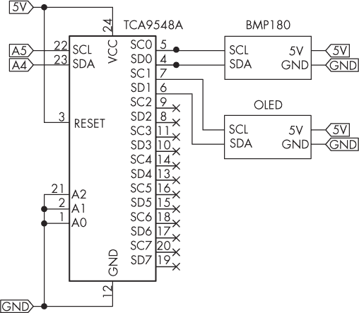

图 10-14：项目 #31 的电路图

接下来，输入并上传项目 #31 的草图。温度和气压应交替显示在 OLED 上，如图 10-15 所示。

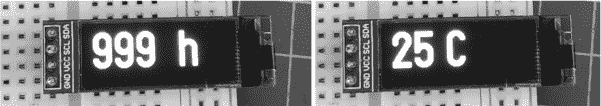

图 10-15：项目 #31 的示例输出

让我们看看这个是如何工作的：

```
// Project #31 - Temperature display

❶ #include <U8g2lib.h>
#include <Adafruit_BMP085.h>
#include <Wire.h>

U8G2_SSD1306_128X32_UNIVISION_F_HW_I2C u8g2(U8G2_R0, U8X8_PIN_NONE);
Adafruit_BMP085 bmp;
float temperature;
float pressure;

❷ void TCA9548A(uint8_t bus)
{
    Wire.beginTransmission(0x70); // TCA9548A address is 0x70
    Wire.write(1 << bus);        // Send byte to select bus
    Wire.endTransmission();
}

void setup()
{
  ❸ Wire.begin();
    u8g2.begin();
  ❹ u8g2.setFont(u8g2_font_logisoso32_tr); // Select font
    TCA9548A(0); // Select I2C bus 0 for the BMP180
  ❺ bmp.begin();
}

void loop()
{
    // First, get the temperature from the BMP180
  ❻ TCA9548A(0); // Select I2C bus 0 for the BMP180
    temperature = bmp.readTemperature();
    pressure = bmp.readPressure();

    // Next, display the temperature on the OLED
  ❼ TCA9548A(1); // Select I2C bus 1 for the OLED
    u8g2.clearBuffer(); // Clear OLED memory
    u8g2.setCursor(0, 32);
    u8g2.print(int(temperature));
    u8g2.drawStr(50, 32, "C");
  ❽ u8g2.sendBuffer();
    delay(1000);

    u8g2.clearBuffer(); // Clear OLED memory
    u8g2.setCursor(0, 32);
    pressure = pressure / 100; // Convert to hectopascals
    u8g2.print(int(pressure));
    u8g2.drawStr(80, 32, "h");
  ❾ u8g2.sendBuffer();
    delay(1000);
} 
```

程序首先引入所需的库 ❶，并配置要使用的 OLED 类型、温度传感器和所需的变量，正如之前所讲。然后它定义了一个自定义函数，用于从 TCA9548A 选择 I²C 总线 ❷。接着，它启动 I²C 和 OLED 功能 ❸，选择 OLED 字体 ❹，并启动温度传感器 ❺。

程序接着将 TCA9548A 切换到其第一个 I²C 总线，以获取来自 BMP180 的数据 ❻，然后切换到第二个 I²C 总线 ❼，以便将温度和压力数据显示在 OLED 屏幕上 ❽ ❾。

## 继续前进

在这一章，你学会了如何在 I²C 总线上控制多个设备，同时将新的传感器和显示器加入你的工具包。你可以运用这些技能制作一个大型的多时区时钟，使用多个 OLED 屏幕和实时时钟芯片，或者你也可以在一个区域使用多个温度传感器来检测冰箱内部温度的变化。无论是什么项目，你再也不受限于只有一个 I²C 总线地址的廉价设备。

在下一章，你将使用 Arduino Leonardo 或兼容板来模拟 USB 鼠标和键盘，这为许多有趣且实用的应用打开了可能性。
