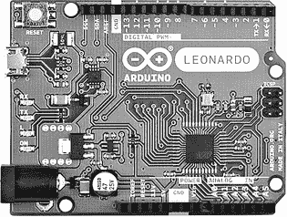
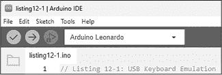
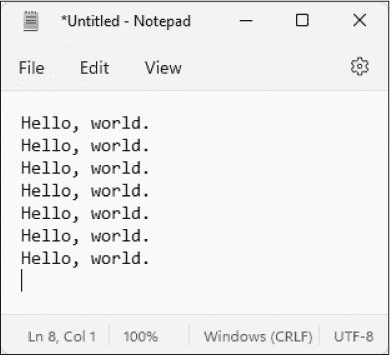
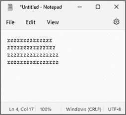
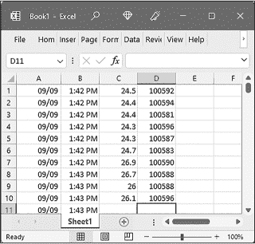
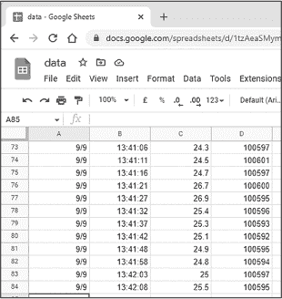
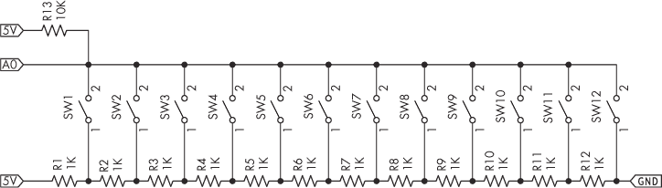
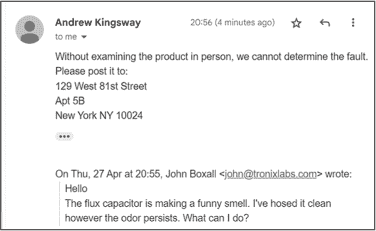
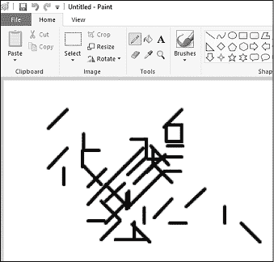

# 第十一章：11 使用 LEONARDO 模拟 USB 鼠标和键盘


本章将展示如何将 Arduino 收集到的信息转换为按键或鼠标移动，然后将其发送到计算机，模拟 USB 键盘上的输入或模拟操作外部鼠标。为此，你将使用 Arduino Leonardo 开发板，它与通常的 Uno 或兼容板有一些细微的不同。

除了微型 USB 连接器和所有主要组件的完整表面贴装设计外，Leonardo 还使用了 Microchip Technology 的 ATmega32U4 微控制器。该微控制器内置 USB 通信，因此开发板无需 USB 接口芯片，这使得 Leonardo 可以作为鼠标或键盘出现在连接的计算机上。你可以使用这种键盘模拟技术来构建自己的游戏控制器、快捷键键盘、快速数据捕获和输入系统、为不同能力的用户设计的输入设备等。

在本章中，你将学到：

+   模拟 USB 键盘的按键输入和打字操作，以及 USB 鼠标的移动和按钮控制

+   构建一个直接写入电子表格的 USB 数据记录器

+   使用键盘使其成为快捷键键盘

## USB 键盘

要使用 Leonardo 模拟键盘（如图 11-1 所示），除了足够长的 USB 电缆将开发板与主机 PC 连接外，不需要任何额外的硬件。如果你购买更长的电缆，请记得你需要一根 USB-A 到 micro-USB 的电缆。



图 11-1：Arduino Leonardo 开发板

你可以通过包含 Arduino 键盘库来激活键盘模拟，使用以下两行：

```
#include "Keyboard.h" // Entered at start of sketch
Keyboard.begin();     // Entered in void setup() 
```

若要让 Leonardo 通过 USB 键盘模拟用户的按键操作，使用以下功能：

```
Keyboard.print()
Keyboard.println() 
```

这些功能的操作方式类似于Serial.print()和Serial.println()：前者将要“输入”的文本作为按键发送，后者则将相同的内容发送并添加一个回车符（或按下 RETURN 或 ENTER 键）以换行。使用这两个函数，你可以发送任何通常通过 USB 键盘发送的文本。

若要停止模拟 USB 键盘，请使用以下功能：

```
Keyboard.end() // Ends emulation 
```

该功能仅在你期望用户在 Leonardo 仍然连接时，继续通过正常键盘使用 PC 时才需要。

让我们试试看。首先，将 Arduino Leonardo 连接到计算机。如果这是你第一次使用 Leonardo，你的 PC 可能会花几秒钟自动安装所需的 USB 驱动程序。接下来，打开 Arduino IDE，并使用下拉菜单将板卡类型更改为 Arduino Leonardo，如图 11-2 所示（请注意，你的 COM 端口可能与图中的不同）。



图 11-2：在 IDE 中选择 Leonardo

在使用包含 Keyboard 库的草图时，务必确保板卡类型设置为 Leonardo；否则，如果你在测试错误时，它们将无法编译。

如果你的 PC 上有其他软件正在运行，关闭它们或确保它们的窗口在你进行键盘和鼠标仿真时不会处于活动状态。否则，Leonardo 发送的“按键”可能会干扰其他软件。例如，在我自己机器上上传以下草图之前，我打开的唯一软件是 Arduino IDE 和记事本。

现在输入并上传列表 11-1 中的草图；然后立即切换到简单的文本编辑器，如记事本。

```
#include "Keyboard.h"
void setup()
{
    delay(5000);
    Keyboard.begin();
}

void loop()
{
  ❶ Keyboard.print("Hello, ");
  ❷ Keyboard.println("world. ");
    delay(1000);
} 
```

列表 11-1：USB 键盘仿真

上传后，Leonardo 应该每秒打出一次“Hello, world.”，如图 11-3 所示。



图 11-3：列表 11-1 的示例输出

首先，草图包括 Keyboard 库。五秒的延迟为用户提供了一些时间以准备好 PC 接收来自 Arduino 的输入。然后初始化 Keyboard 库。接下来，草图发送一些没有换行符的文本 ❶，然后是一些带有换行符的文本 ❷。

当你完成使用 Leonardo 进行任何 USB 键盘或鼠标仿真项目时，上传一个简单的草图，例如 IDE 示例中的 *blink*，以防下次连接 Leonardo 到 PC 时，它不会尝试接管控制。如果你在上传新草图时遇到控制问题，可以使用 CTRL-U 快捷键上传草图。

### 模拟键盘修饰键和特殊键

除了为字母、数字和符号创建按键输入外，你还可以通过一些额外的函数模拟按钮，如光标键、TAB 键、功能键等。

要发送单个按键（即按下按钮并释放它），使用

```
Keyboard.write(`x`) 
```

其中 x 是要按下的字母、数字或符号的 ASCII 代码，或特殊修饰键的代码，列在表 11-1 中。

表 11-1: 修饰键及其代码

| 修饰键 | 代码 | 修饰键 | 代码 |
| --- | --- | --- | --- |
| KEY_LEFT_CTRL | 128 | KEY_F1 | 194 |
| KEY_LEFT_SHIFT | 129 | KEY_F2 | 195 |
| KEY_LEFT_ALT | 130 | KEY_F3 | 196 |
| KEY_LEFT_GUI | 131 | KEY_F4 | 197 |
| KEY_RIGHT_CTRL | 132 | KEY_F5 | 198 |
| KEY_RIGHT_SHIFT | 133 | KEY_F6 | 199 |
| KEY_RIGHT_ALT | 134 | KEY_F7 | 200 |
| KEY_RIGHT_GUI | 135 | KEY_F8 | 201 |
| KEY_UP_ARROW | 218 | KEY_F9 | 202 |
| KEY_DOWN_ARROW | 217 | KEY_F10 | 203 |
| KEY_LEFT_ARROW | 216 | KEY_F11 | 204 |
| KEY_RIGHT_ARROW | 215 | KEY_F12 | 205 |
| KEY_BACKSPACE | 178 | KEY_F13 | 240 |
| KEY_TAB | 179 | KEY_F14 | 241 |
| KEY_RETURN | 176 | KEY_F15 | 242 |
| KEY_ESC | 177 | KEY_F16 | 243 |
| KEY_INSERT | 209 | KEY_F17 | 244 |
| KEY_DELETE | 212 | KEY_F18 | 245 |
| KEY_PAGE_UP | 211 | KEY_F19 | 246 |
| KEY_PAGE_DOWN | 214 | KEY_F20 | 247 |
| KEY_HOME | 210 | KEY_F21 | 248 |
| KEY_END | 213 | KEY_F22 | 249 |
| KEY_CAPS_LOCK | 193 | KEY_F23 | 250 |
|  |  | KEY_F24 | 251 |

除了表中列出的修饰符外，您还可以查看完整的 ASCII 码列表，包括字母、数字和符号的编码，网址为 [*https://<wbr>www<wbr>.asciitable<wbr>.com<wbr>/*](https://www.asciitable.com/)。

为了简化操作，你可以为想要模拟的键定义所需的代码和匹配的描述。例如，CAPS LOCK 的代码是 193，因此在草图开始时加入以下内容：

```
#define CAPS_LOCK 193 
```

要使用 Leonardo 按下 CAPS LOCK，你可以使用以下函数：

```
Keyboard.write(CAPS_LOCK); 
```

要测试此功能，你可以使用清单 11-2 中的草图，每秒按下 CAPS LOCK。

```
#define CAPS_LOCK 193
#include "Keyboard.h"
void setup()
{
    Keyboard.begin();
}

void loop()
{
  ❶ Keyboard.write(CAPS_LOCK);
    delay(1000);
} 
```

清单 11-2：每秒闪烁 CAPS LOCK 每秒

该草图告诉主机 PC 已按下 CAPS LOCK ❶，并将反映在连接到 PC 的 USB 键盘上。（如果此时你打算在朋友的电脑上恶作剧，请自行承担风险！）

### 按下和松开一个或多个键

你还可以模拟按下键盘上的一个按钮，并在设定的时间后松开它。为此，使用

```
Keyboard.press(`x`) 
```

按住修饰符或 ASCII 代码为 x 的按钮。然后，要释放该按钮，请使用以下代码：

```
Keyboard.release(`x`) 
```

你可以使用清单 11-3 进行测试。

```
#include "Keyboard.h"
void setup()
{
Keyboard.begin();
}

void loop()
{
  ❶ Keyboard.press(122); // Hold down the "z" key
    delay(1000);
  ❷ Keyboard.release(122);
    Keyboard.println(); // Press ENTER for new line
    Delay(5000);
} 
```

清单 11-3：测试按下和松开

这个草图展示了按住 Z 键 ❶，等待片刻后松开该键 ❷。图 11-4 展示了该草图的结果。如你所见，打印到屏幕上的前两行文字比后两行短，因为键盘响应时间略有差异，取决于主机 PC 的操作速度。



图 11-4：来自清单 11-3 的示例输出

最后，你可以编程让 Leonardo 同时按下多个键，然后使用多个 Keyboard.press() 函数将它们一一松开，或者一次性全部松开。这使得你能够模拟操作系统中常用的多个按键快捷方式。

例如，你可以通过按下 CTRL-ALT-DELETE 键组合，然后按下 ALT-S 来退出 Windows PC。以下函数会同时按下左侧 CTRL 键、左侧 ALT 键和 DELETE 键：

```
Keyboard.press(128); // CTRL
Keyboard.press(130); // ALT
Keyboard.press(212); // DEL 
```

然后你可以使用以下代码一次性释放所有按钮：

```
Keyboard.releaseAll(); // Let go of all buttons 
```

你还可以通过使用 Keyboard.release(x) 来松开单个按钮，并保持其他按钮按下，其中 x 是所需的修饰符或 ASCII 代码。

你将在下一个项目中通过将 Leonardo 的数据直接记录到 PC 上来运用这一切。

项目#32：使用 USB 键盘仿真记录数据

键盘仿真功能的一个非常有用的好处是能够直接将数据从 Leonardo 记录到 PC 中。在这个项目中，你将把来自第十章的 BMP180 传感器的温度和气压数据直接记录到电子表格中。如果你能为数据记录专门配备一台 PC——例如，在实验室或办公室——这是一个快速且经济的数据捕获方法。

你将需要以下零件来完成此项目：

+   一块 Arduino Leonardo 或兼容板和 USB 电缆

+   一块 BMP180 温度和气压传感器板

+   一块无焊接面包板

+   各种跳线

按照图 11-5 所示组装电路。


图 11-5：项目#32 的原理图

要开始，打开你喜欢的电子表格，例如 Microsoft Excel 或 Google Sheets。然后切换回 Arduino IDE 并上传项目#32 的草图。接着迅速切换回电子表格软件，点击左上角的单元格并等待。重置 Leonardo 后的十秒钟，日期、时间、温度和以帕斯卡为单位的气压应会自动“输入”到单元格中，如图 11-6 所示。



图 11-6：项目#32 在 Excel 电子表格中的示例输出数据

一旦开始记录数据，你可以断开 PC 上的鼠标和键盘，以防其他人中断数据采集。此外，通过使用基于云的工具，如 Google Sheets，你可以从任何支持网络的设备实时监控和查看结果，如图 11-7 所示。



图 11-7：Google Sheets 中的示例结果

让我们来看一下这如何工作：

```
// Project #32 - Data logging using USB keyboard emulation

#define Ctrl 128
#define Semicolon 59
#define Shift 129
#define Tab 179
#define Enter 176

❶ #include "Keyboard.h"
#include "Wire.h"
#include "Adafruit_BMP085.h"
Adafruit_BMP085 bmp;

❷ void spreadsheetDate()
{
    Keyboard.press(Ctrl);
    Keyboard.press(Semicolon);
    delay(100);
    Keyboard.releaseAll(); // Let go of all buttons
}

❸ void spreadsheetTime()
{
    Keyboard.press(Ctrl);
    Keyboard.press(Shift);
    Keyboard.press(Semicolon);
    delay(100);
    Keyboard.releaseAll(); // Let go of all buttons
}

void pressTab()
{
    Keyboard.write(Tab);
}

void pressEnter()
{
    Keyboard.write(Enter);
}

void setup()
{
    Keyboard.begin();
    bmp.begin();
  ❹ delay(10000);
}

void loop()
{
    spreadsheetDate();
    pressTab();
    spreadsheetTime();
    pressTab();
    Keyboard.print(bmp.readTemperature());
    pressTab();
    Keyboard.print(bmp.readPressure());
    pressEnter();
    delay(5000);
} 
```

草图首先初始化传感器和键盘库 ❶。自定义函数 ❷ 模拟按下 CTRL-+，这是许多电子表格中用来插入当前单元格日期的快捷键。释放键之前有一个小延迟。接下来的自定义函数 ❸ 模拟按下 CTRL-SHIFT-+，这是插入当前单元格时间的快捷键。接着是一些按下 TAB 和 ENTER 的函数，方便你省去使用原始命令的步骤。

键盘控制基于 Windows 操作系统的控制方式。如果你使用的是 macOS 或其他操作系统，可能需要更改屏幕上移动光标或电子表格软件中的快捷键。

通常的初始化发生在 void setup() 中，并且有一个长时间的延迟 ❹，这给用户足够的时间将光标导航到电子表格中的起始单元格，之后 Leonardo 才开始打字。最后，在 void loop() 中，日期、时间、温度和气压使用所需的按键组合“输入”到电子表格中，之后会有一个延迟，才会记录下一个样本。

现在你已经对键盘仿真有了扎实的理解，让我们再构建一个你可以定期使用的工具：快捷键键盘。

项目 #33：构建一个 USB 快捷键键盘

那些每天使用 PC 工作或娱乐的人，随着时间的推移，需要反复输入各种内容，比如密码、键盘快捷键或常用的文本行。使用 Arduino Leonardo 和项目 #3 中描述的 12 键键盘（见 第一章），你可以构建一个方便的快捷键键盘，具有 12 个不同的选项。

为了演示目的，项目将会将各种示例分配给键盘。不过，除了有用的文本外，你可以研究你电脑操作系统或最喜欢的软件的快捷方式，并创建你自己的。表 11-2 列出了各种键盘和打字快捷键。

表 11-2： 示例快捷键

| 按钮 | 快捷键 | 所需的仿真按键 |
| --- | --- | --- |
| 1 | 输入 PIN 456700。 | 456700 |
| 2 | 锁定 Windows 11 屏幕。 | CTRL-ALT-DEL，然后按 ENTER |
| 3 | 显示 Windows 任务管理器。 | CTRL-ESC-SHIFT |
| 4 | 打印到默认打印机。 | CTRL-P，然后按 ENTER |
| 5 | 在应用之间切换。 | ALT-TAB |
| 6 | 在 Edge 浏览器中将打开的页面保存为书签。 | CTRL-SHIFT-D |
| 7 | 在 Excel 中切换到页面布局视图。 | 按 ALT-W，然后按 P |
| 8 | 在 Excel 中切换到正常布局视图。 | 按 ALT-W，然后按 L |
| 9 | 您可以通过电子邮件联系我……或在下午 3 点后拨打电话…… | 输入的文字 |
| 10 | 我们无法通过社交媒体解决您的问题。请通过电子邮件联系……以获得技术支持。 | 输入的文字 |
| 11 | 感谢您的邮件。我会在找到所需信息后尽快详细回复。 | 输入的文字 |
| 12 | 如果不亲自检查产品，我们无法确定故障原因。请将其邮寄至…… | 输入的文字 |

您将需要以下部件来完成本项目：

+   一块 Arduino Leonardo 或兼容板和 USB 数据线

+   如第一章项目#3 中所描述的键盘硬件

装配与项目#3 相同，只是将 Arduino Leonardo 替换为 Uno，如图 11-8 所示。您可能需要使用项目#1 中的草图检查每个键盘按钮报告的 ADC 值，然后更新我们 analogkeypad 库中的范围。



图 11-8：项目#33 的电路图

现在输入并上传以下草图：

```
// Project #33 - USB shortcut keyboard

#define Ctrl 128
#define Alt 130
#define Escape 177
#define Shift 129
#define Tab 179
#define Enter 176
#define Delete 212

❶ #include "Keyboard.h"
#include "analogkeypad.h"
analogkeypad keypad;

void button1()
{
    Keyboard.print("456700");
}

void button2()
{
    Keyboard.press(Ctrl);
    Keyboard.press(Alt);
    Keyboard.press(212);
    delay(100);
    Keyboard.releaseAll(); // Let go of all buttons
    delay(100);
    Keyboard.write(Enter);
    delay(100);
}

void button3()
{
    Keyboard.press(Ctrl);
    Keyboard.press(Shift);
    Keyboard.press(Escape);
    delay(100);
    Keyboard.releaseAll(); // Let go of all buttons
}

void button4()
{
    Keyboard.press(Ctrl);
    Keyboard.press(112); // Press P
    delay(100);
    Keyboard.releaseAll(); // Let go of all buttons
    delay(100);
    Keyboard.write(Enter);
    delay(100);
}

void button5()
{
    Keyboard.press(Alt);
    Keyboard.press(Tab);
    delay(100);
    Keyboard.releaseAll(); // Let go of all buttons
}

void button6()
{
    Keyboard.press(Ctrl);
    Keyboard.press(Shift);
    Keyboard.press(100); // Press d
    delay(100);
    Keyboard.releaseAll(); // Let go of all buttons
}

void button7()
{
    Keyboard.press(130);
    Keyboard.press(119); // Press w
    delay(100);
    Keyboard.releaseAll(); // Let go of all buttons
    Keyboard.write(112); // Press p
}

void button8()
{
    Keyboard.press(Alt);
    Keyboard.press(119); // Press w
    delay(100);
    Keyboard.releaseAll(); // Let go of all buttons
    Keyboard.write(108); // Press l
}

void button9()
{
    Keyboard.println("You can contact me via email at email@address.com
or telephone 212-555-1213 after 3 p.m. ");
}

void button10()
{
    Keyboard.println("We cannot solve your problem via social media.
Please email support@company.com for technical support. ");
}

void button11()
{
    Keyboard.println("Thank you for your email, I will reply in more detail
once I can locate the required information. ");
}

void button12()
{
    Keyboard.println("Without examining the product in person, we cannot
determine the fault. Please post it to: ");
    Keyboard.println("129 West 81st Street");
    Keyboard.println("Apt 5B");
    Keyboard.println("New York NY 10024");
}

void setup()
{
  ❷ Keyboard.begin();
}

void loop()
{
  ❸ switch (keypad.readKeypad()) // Read button status
    {
        case 1: button1(); break;
        case 2: button2(); break;
        case 3: button3(); break;
        case 4: button4(); break;
        case 5: button5(); break;
        case 6: button6(); break;
        case 7: button7(); break;
        case 8: button8(); break;
        case 9: button9(); break;
        case 10: button10(); break;
        case 11: button11(); break;
        case 12: button12(); break;
    }
    delay(250);
} 
```

该草图利用了 analogkeypad 库来控制硬件，利用 Keyboard 库来模拟 USB 键盘。这些库在❶处包含，然后在❷处初始化。草图在循环中等待按钮按下，操作发生在❸处。之后，只需监控键盘并调用与每个按钮匹配的自定义函数，范围从button1()到button12()。每个自定义按钮函数随后执行所需的模拟任务，您可以根据自己的需求进行更改。

一旦草图上传完毕，你的键盘应该会作为快捷键键盘工作。例如，在收到关于故障产品的邮件时，我们的示例用户可以点击回复，按下第 12 个按钮，然后发送邮件。图 11-9 显示了一个示例邮件交换。



图 11-9：项目 #33 示例输出邮件

对于处理客户支持邮件的人来说，这将节省大量时间。根据你自己的日常计算机使用习惯，你可以用自己的快捷键替换草图中的快捷键。

## USB 鼠标

你还可以通过在草图中包含以下两行代码来使用 Leonardo 激活鼠标仿真功能：

```
#include "Mouse.h" // Entered at start of sketch
Mouse.begin();    // Entered in void setup() 
```

要让 Leonardo 像 USB 鼠标一样移动鼠标指针，使用这个功能：

```
Mouse.move(`x`,`y`,`z`); 
```

参数如下：

x    在 x 轴上的移动量。使用正数向右移动，使用负数向左移动，0 则保持在当前 x 轴位置。

y    在 y 轴上的移动量。使用正数向下移动，负数向上移动，0 则保持在当前 y 轴位置。

z    模拟鼠标滚轮的移动。使用正数向“你”滚动，使用负数向“远离你”滚动。如果你更改了计算机操作系统中默认的鼠标操作，你需要交换正数和负数。

要结束草图中的鼠标仿真，使用：

```
Mouse.end(); 
```

在使用鼠标仿真时，每个鼠标功能后需要一个 2 毫秒的小延迟，以便计算机有时间跟上。你可以使用 清单 11-4 来测试控制指针移动。

```
#include <Mouse.h>
void setup()
{
    Mouse.begin();
}

void loop()
{
  ❶ Mouse.move(−10, −5, 0);
    delay(500);
} 
```

清单 11-4：控制指针移动

草图首先初始化库，然后鼠标指针向左移动 10 像素，向上移动 5 像素❶。之后会有一个短暂的延迟，以稍微减慢操作速度。

上传草图后，你的鼠标指针应该会向屏幕左上方漂移。你也可以随时用 PC 鼠标改变其位置。完成后，上传一个非鼠标的草图以停止移动。

现在，你将通过一个简单的项目来使用这些鼠标仿真功能。

项目 #34：自动保持电脑唤醒

一些带有 USB 鼠标输入的 PC 或其他设备可能会进入“睡眠模式”，或定期需要鼠标移动以证明用户在场。在这个项目中，你将编程 Leonardo 每隔 30 秒左右“晃动”一次鼠标，以保持 PC 唤醒或让老板满意。

唯一需要的硬件是你的 Arduino Leonardo 和匹配的 USB 电缆。输入并上传以下草图：

```
// Project #34 - PC "Keep Awake"

#include <Mouse.h>
void wiggleMouse()
{
  ❶ Mouse.move(−50, 0, 0);
    delay(500);
  ❷ Mouse.move(50, 0, 0);
    delay(500);
}

void setup()
{
        Mouse.begin();
}

void loop()
{
    wiggleMouse();
    delay(30000);
} 
```

鼠标指针应该向左移动 ❶，稍等片刻，向右移动 ❷，然后再等片刻，正如<sup class="SANS_TheSansMonoCd_W5Regular_11">wiggleMouse()</sup>自定义函数中所指示的那样。函数和主循环中的延迟完全是任意的；你可以根据需要调整它们。

## USB 鼠标按钮

要让你的 Leonardo 模拟鼠标按钮“点击”（按下然后释放），可以使用

```
Mouse.click(); // Clicks the left mouse button by default 
```

或者

```
Mouse.click(`x`); 
```

其中 x 可以是 MOUSE_LEFT、MOUSE_RIGHT 或 MOUSE_MIDDLE，分别对应各个按钮。

要按下并保持鼠标按钮，可以使用以下函数：

```
Mouse.press(); // Presses and holds down the left mouse button by default 
```

要释放已按下的鼠标按钮，可以使用以下函数：

```
Mouse.release(); // Defaults to releasing the left mouse button 
```

你还可以使用与<sup class="SANS_TheSansMonoCd_W5Regular_11">Mouse.click()</sup>相同的参数来控制中键和右键。请注意，鼠标按钮的左键和右键的定义由操作系统中的设置决定。例如，如果你交换了按钮（即“右键”是物理的左键），你需要考虑这一点。

让我们通过创建一个有趣的绘画项目来演示鼠标按钮的控制。

项目 #35：创建一个 PC 随机绘画工具

这个项目将随机移动鼠标指针并随机按下左键。通过将此草图与 PC 绘图程序结合运行，你可以创作一些前卫的 Arduino 生成的艺术作品。

再次提醒，所需的唯一硬件是你的 Arduino Leonardo 和匹配的 USB 线。输入但不要上传项目 #35 草图。现在打开一个 PC 绘图程序，如 Microsoft Paint，然后切换到 Arduino IDE 并上传草图。上传后切回绘图软件，选择画笔和颜色后将光标放在绘图区域。草图应该开始根据随机鼠标移动进行绘制，创作出类似图 11-10 中的画作。



图 11-10：随机 PC 绘画工具的示例结果

让我们看看这个是如何工作的：

```
// Project #35 - PC Random Painter

#include <Mouse.h>
void setup()
{
    Mouse.begin();
    randomSeed(analogRead(0));
  ❶ delay(10000);
}

void loop()
{
  ❷ Mouse.press();
    delay(2);
    switch (random(8))
  ❸ {
        case 0: Mouse.move(−10, 0, 0); break;
        case 1: Mouse.move(10, 0, 0); break;
 case 2: Mouse.move(0, −10, 0); break;
        case 3: Mouse.move(0, 10, 0); break;
        case 4: Mouse.move(10, 10, 0); break;
        case 5: Mouse.move(10, −10, 0); break;
        case 6: Mouse.move(−10, 10, 0); break;
        case 7: Mouse.move(−10, 10, 0); break;
    }
    delay(1000);
  ❹ Mouse.release();
    delay(2);
    switch (random(8))
  ❺ {
        case 0: Mouse.move(−10, 0, 0); break;
        case 1: Mouse.move(10, 0, 0); break;
        case 2: Mouse.move(0, −10, 0); break;
        case 3: Mouse.move(0, 10, 0); break;
        case 4: Mouse.move(10, 10, 0); break;
        case 5: Mouse.move(10, −10, 0); break;
        case 6: Mouse.move(−10, 10, 0); break;
        case 7: Mouse.move(−10, 10, 0); break;
    }
    delay(1000);
} 
```

为了创作这幅杰作，草图首先按下鼠标按钮 ❷，执行八种随机鼠标移动之一 ❸，然后释放鼠标按钮 ❹。接着，它再做一次随机鼠标移动 ❺，然后重复此过程。大的延迟 ❶ 让你有时间在上传草图后从 Arduino IDE 切换到绘图软件。

作为最后的挑战，你可以为你的项目添加一个启动按钮，这样 Arduino 就不会在你准备好之前接管键盘或鼠标。你还可以尝试制作一个 Etch A Sketch 模拟器，使用两个电位器来控制鼠标的 x 轴和 y 轴。

## 继续前进

到此为止，你已经具备了实施 USB 键盘和鼠标仿真所需的技能和实践。你学会了如何指示 Arduino Leonardo 或兼容板作为键盘和鼠标进行操作。每当你这么做时，确保在项目开始时有足够的延迟，以便在 PC 上进行任何必要的准备。这也给你时间轻松地上传新的草图到板子上，如果你完成了仿真实验。如果你完全失去了对板子的控制，可以通过 ICSP 引脚使用 USBasp 硬件上传新的草图。

在下一章，你将学习如何使用 Arduino 读取和写入 USB 闪存驱动器的数据。
