# 第十二章：12 数据的传输与接收：USB 闪存驱动器


USB 闪存驱动器是将数据传输进出 Arduino 项目的便捷工具。本章将向你展示如何使用 Arduino 和一个廉价的接口模块，将数据传输进出这些便携式存储设备。

你可以使用这些记录和检索数据的方法，创建更用户友好的信息交互方式。例如，你可以通过让 Arduino 控制的机器人读取 USB 闪存驱动器上的控制值，改变机器人的动作；或者，你可以改变自动洒水器控制器的时间，而不需要物理用户界面。

本章中，你将学到：

+   安装并测试 USB 闪存驱动器模块

+   将数据从 Arduino 写入并追加到 USB 闪存驱动器

+   将传感器数据记录到 USB 闪存驱动器

+   从 USB 闪存驱动器读取数字和文本到 Arduino

+   构建一个项目 USB 安全密钥

+   使用外部数据从 USB 闪存驱动器配置 Arduino 项目

## 选择和准备 USB 闪存驱动器

市面上有许多品牌和类型的 USB 闪存驱动器。由于接口模块的独特性，某些驱动器可能完全无法工作。经过测试，我发现 Lexar 和 Toshiba 品牌的闪存驱动器是成功的。确保它们是标明为 USB 2.0，而不是 USB 3.0 的。

USB 闪存驱动器应该出厂时已格式化。然而，如果你发现它们无法可靠地工作，你可能需要自己重新格式化它们。在这种情况下，请使用 FAT32 文件系统，并设置 16KB 的分配单元大小。

每当需要从电脑中移除 USB 闪存驱动器时，请始终使用操作系统提供的安全移除选项。不要在你认为 PC 完成操作后直接拔出闪存驱动器，因为这通常会导致驱动器无法被 USB 接口模块读取。

## USB 接口模块

为了与 USB 闪存驱动器配合使用，你需要一个基于 CH376S USB 文件管理器和控制 IC 的接口模块——例如，图 12-1 中显示的 PMD Way 566592 部件。

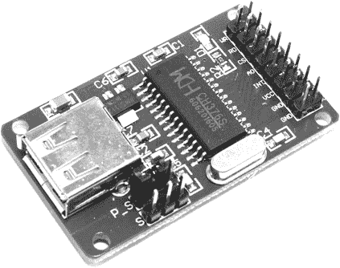

图 12-1：USB 闪存驱动器接口模块

你可以使用多种接口将模块与微控制器连接起来。为了本章的目的，我们将使用 9,600 bps 的串行 UART 连接模块与 Arduino 上的软件串口。

由于本章所有项目的模块设置相同，我们首先来测试您的模块并确保其配置正确。在 USB 插座下方的 2 × 3 引脚组中找到跳线引脚，并将跳线放置在顶部行的第二和第三个引脚之间，如图 12-2 所示。这将模块设置为串口接口模式。如果您的模块有一个 1 × 3 的跳线引脚组，您可能需要尝试两种选项（跳线连接 1 和 2，或 2 和 3，若引脚未标记）。

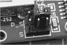

图 12-2: 设置 USB 闪存驱动接口模块的跳线

接下来，使用一些公对母跳线将模块与您的 Arduino Uno 或兼容板连接，并按照图 12-3 中所示进行连接。您刚刚放置的跳线下方的三排引脚被称为 S1、S2 和 S3。

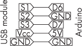

图 12-3: USB 模块与 Arduino 之间连接的示意图

模块需要您安装一个 Arduino 库。在库管理器中搜索**CH376**，然后点击库描述底部的**安装**按钮。

安装完库后，将 Arduino 与接口模块连接到您的 PC，并上传包含在 CH376 库示例中的 *basicUsageSoftSerial* 示例代码，如图 12-4 所示。

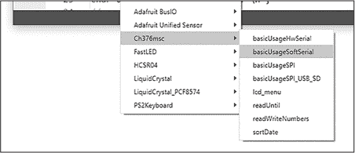

图 12-4: 在 Arduino IDE 中定位 CH376 示例代码

运行此示例代码的目的是在将其集成到您自己的项目之前，测试 USB 使用情况。现在打开串口监视器，将速率更改为 115,200 bps，并重置您的 Arduino。示例代码应显示一系列选项，并显示闪存驱动器的存在，如图 12-5 所示。

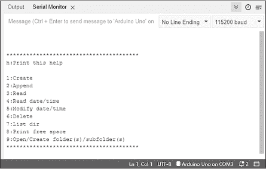

图 12-5: CH376 演示示例的输出

如果在监视器中看不到消息 Flash drive attached!，请轻轻拔出并重新插入 USB 闪存驱动器。模块上的一个 LED 灯应该会在插入 USB 闪存驱动器时亮起。如果这仍然不成功，尝试按照前一节的描述重新格式化闪存驱动器。如果仍然无效，可以尝试更换一个闪存驱动器。

如果 Arduino 报告闪存驱动器已连接，则执行串口监视器上显示菜单中描述的各种操作。首先，在串口监视器中发送 1 来在闪存驱动器上创建一个文本文件，然后发送 2 来将数据附加到该文件（这会打开原文件并向其中添加更多文本），接着发送 7 来显示闪存驱动器的内容，如 图 12-6 所示。

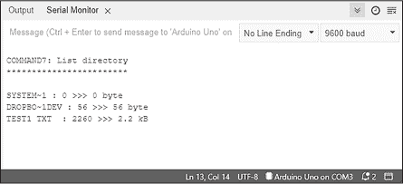

图 12-6：闪存驱动器操作结果

草图会创建文件并将其命名为 *TEST1.TXT*。如果你有文件名超过经典 8 + 3 文件格式的文件，它们将被截断，并且文件名中会插入波浪符（~），就像 图 12-6 中显示的前两个文件一样。

一旦你创建并附加了文件 *TEST1.TXT*，你就可以确认硬件和 USB 闪存驱动器组合正常工作。现在是时候将数据写入闪存驱动器上的文本文件了。

## 写入数据

在本节中，我将向你展示如何初始化并将各种数值和文本数据写入闪存驱动器上的文本文件，然后通过一个示例草图演示这一过程。这项技术非常适合数据捕获和日志记录应用。首先，我将向你展示所需的函数及其工作原理，随后将在接下来的项目中进行演示。

无论你想写入什么类型的文本数据，你首先需要在草图的开头加入以下四行代码，以初始化接口模块和所需的软件串口：

```
#include <Ch376msc.h>
#include <SoftwareSerial.h>
SoftwareSerial USBserial (7, 6);
Ch376msc USBdrive(Serial1); 
```

这包括 USB 模块（CH376）和软件串口的库，然后初始化软件串口，最后通过软件串口创建 USB 模块的实例。

接下来，你将在 void setup() 中添加一些代码行：

```
Serial.begin(115200); // For Serial Monitor
USBserial.begin(9600); // For USB module
USBdrive.init(); 
```

这会启动串口监视器与 USB 模块之间的串口通信，并开始 USB 模块的通信。你必须按照所示的顺序放置这三个函数。

在草图的 void loop() 部分，使用以下代码来检查 USB 模块的状态。除了检查 USB 闪存驱动器是否存在外，它对于故障排除也很有用；如果闪存驱动器没有连接或无法工作，这段代码将停止草图并通过串口监视器通知你：

```
if (USBdrive.checkIntMessage())
{
    if (USBdrive.getDeviceStatus())
    {
        Serial.println(F("Flash drive attached!"));
    } else {
        Serial.println(F("Flash drive detached!"));
    }
} 
```

Serial.println()中的文本被包裹在F()中，以节省 Arduino 的 SRAM（可以把它想象成用于操作的内存，就像电脑中的 RAM），并改为使用闪存（微控制器中存储草图的地方）。

接下来，设置文件名并打开文件：

```
USBdrive.setFileName("TEST1.TXT");
USBdrive.openFile(); 
```

文件名必须遵循经典的 8 + 3 格式。如果您打算写入纯文本，请使用*.txt*文件扩展名；如果打算在电子表格中打开该文件，请使用*.csv*。如果您使用相同的文件名并多次写入该文件，文件中的数据将从头开始被覆盖。

接下来，写入一些数据。要写入字节、整数、双精度或长整型变量，请使用

```
USBdrive.writeNum(`x`)
USBdrive.writeNumln(`x`) 
```

其中，x是您要写入的变量的名称。第二个函数会在数字后写入一个新行。

要写入一段文本字符或以字符形式发送命令（例如换行符\n），请使用此方法：

```
USBdrive.writeChar('`x`'); 
```

这将把字符x写入文件。

要写入一行文本，您必须首先将其存储在不超过 254 个字符的字符数组中：

```
char text1[] = "This is a line of text. \n";
USBdrive.writeFile(text1, strlen(text1)); 
```

这将把数组text1中的文本写入已打开的文件，并添加一个换行符。writeFile()函数接受字符数组以及字符数组的长度作为参数。

要写入浮点变量，您必须先将数字转换为字符数组，然后写入该数组。首先创建一个字符数组以存放该数字：

```
char floatChar[8] = " "; 
```

确保数组足够长，可以包含所有数字、小数点以及必要时的负号。然后为浮点变量赋一个值：

```
float f = 123.456; 
```

现在，使用以下方法将浮动数转换为字符数组：

```
dtostrf(`a`,`b`,`c`,`d`); 
```

这里，a是要转换的浮动数，b是整数部分的位数，c是小数部分的位数，d是存放结果数字的数组。例如，要将f转换为floatChar，请使用以下代码：

```
dtostrf(f,3,3,floatChar); 
```

您现在可以使用以下方法写入字符数组（就像您写入文本行时一样）：

```
USBdrive.writeFile(floatChar, strlen(floatChar)); 
```

最后，当您完成数据写入文本文件后，关闭文件：

```
USBdrive.closeFile(); 
```

此时，您可以将闪存驱动器从模块中取出并插入到 PC 中以检索文本文件。

你可以使用以下草图来测试这些函数。在将接口模块连接到你的 Arduino 并插入 USB 闪存驱动器后，输入并上传 列表 12-1。

```
char text1[] = "This is a line of text in the form of a character
array, followed by a new line function. \n"; ❶

char text2[] = "This is another line of text. I hope you're enjoying the book. John. \n";

char floatChar[8] = " ";
float f = 12.34567;

#include <Ch376msc.h> ❷
#include <SoftwareSerial.h>
SoftwareSerial USBserial(7, 6);
Ch376msc USBdrive(USBserial);

void fileWrite()
{
    Serial.println("fileWrite()");
    USBdrive.setFileName("TEST1.TXT"); // Set the filename ❸
    USBdrive.openFile();               // Open the file

    // Write some integers:
    for (int a = 0; a < 20; a++)
    {
        USBdrive.writeNum(a); ❹
        USBdrive.writeChar(',');
    }

    // Write new line:
    USBdrive.writeChar('\n'); ❺
 // Write lines of text:
    USBdrive.writeFile(text1, strlen(text1)); ❻
    USBdrive.writeFile(text2, strlen(text2));
    USBdrive.writeChar('\n');

    // Write floating-point number - first convert to char:
    dtostrf(f,2,5,floatChar); // 2 whole digits, 5 decimals ❼
    USBdrive.writeFile(floatChar, strlen(floatChar));
    USBdrive.closeFile(); // Close the file ❽
    Serial.println("Finished.");
}

void setup()
{
    Serial.begin(115200); // For Serial Monitor ❾
    USBserial .begin(9600); // For USB module
    USBdrive.init();
    delay(5000);
}

void loop()
{
    if (USBdrive.checkIntMessage()) ❿
    {
        if (USBdrive.getDeviceStatus())
        {
            Serial.println("Flash drive attached!");
        } else {
            Serial.println("Flash drive detached!");
        }
    }
    fileWrite();
    delay(5000);
}
```

列表 12-1: 测试写入 USB 闪存驱动器

该草图声明了文本使用所需的变量和用于演示的浮动变量 ❶。它初始化了所需的库 ❷，然后命名并打开文件 ❸。接着，它将整数写入文件 ❹，并加入字符（逗号用于分隔写入的数字）。程序向文件写入换行命令 ❺，然后写入文本 ❻，将浮动变量转换为字符数组，并将其写入文件 ❼。

一旦文件关闭 ❽，就可以拔出闪存驱动器。串行通信和 USB 驱动器在 ❾ 开始。然后，草图插入用于 USB 闪存驱动器检测的代码 ❿，最后通过调用 fileWrite() 函数来写入数据。

你可以通过监视写入进度，并在串行监视器中显示 “Finished” 后拔出闪存驱动器。通过在 PC 上查看文本文件来检查结果，如 图 12-7 所示。

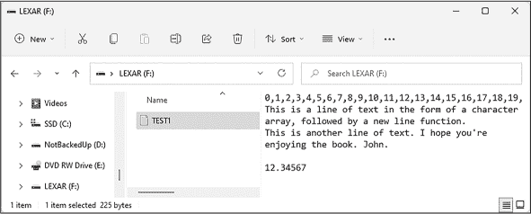

图 12-7: 列表 12-1 的结果

所有这些都允许你以一次性爆发的方式写入数据。然而，如果你希望随着时间的推移向文件添加数据，你需要附加数据。

## 向文件附加数据

将数字和文本数据写入存储在闪存驱动器上的文本文件非常适合一次性使用的情况。然而，如果你需要向文件添加数据，就不能像前一节那样直接写入。相反，在第一次写入文件后，你必须将数据附加到文件中，以确保所有数据都能安全存储。在本节中，我将解释所需的函数，然后在接下来的项目中演示它们。

附加数据到文件的代码与写入代码相似，主要区别是在打开文件之后。我会先解释需要做什么，然后通过一个项目来演示操作。首先，你检查文件是否存在，如果存在，就使用以下命令将光标（即 USB 接口开始写入的位置）移到文件的末尾：

```
if (USBdrive.openFile() == ANSW_USB_INT_SUCCESS)
{
    USBdrive.moveCursor(CURSOREND);
} 
```

如果闪存驱动器上有足够的空闲空间，你可以使用之前描述的写入函数将数据附加到文件中：

```
if (USBdrive.getFreeSectors())
{
  ❶ // Write data to flash drive here
} else
{
    Serial.println("Disk full");
} 
```

插入所需的代码以将数据写入文件 ❶；然后像往常一样使用 USBdrive.closeFile() 关闭文件。

现在让我们测试追加数据，参考清单 12-2，该清单会向由清单 12-1 生成的*TEST1.TXT*文件中追加一个随机数。

```
#include <Ch376msc.h>
#include <SoftwareSerial.h>

SoftwareSerial USBserial (7, 6);
Ch376msc USBdrive(USBserial);

void fileAppend()
{
    Serial.println("fileAppend()");
    USBdrive.setFileName("TEST1.TXT"); // Set the filename
  ❶ if (USBdrive.openFile() == ANSW_USB_INT_SUCCESS)
    {
        USBdrive.moveCursor(CURSOREND);
    }
  ❷ if (USBdrive.getFreeSectors())
    {
      ❸ USBdrive.writeNumln(random(1000));
    } else
    {
        Serial.println("Disk full");
    }
    USBdrive.closeFile();
    Serial.println("Finished");
    delay(1000);
}

void setup()
{
    Serial.begin(115200); // For Serial Monitor
    USBserial .begin(9600); // For USB module
    USBdrive.init();
    delay(5000);
  ❹ randomSeed(analogRead(0));
}

void loop()
{
    if (USBdrive.checkIntMessage())
    {
        if (USBdrive.getDeviceStatus())
        {
            Serial.println(F("Flash drive attached!"));
        } else {
            Serial.println(F("Flash drive detached!"));
        }
    }
    fileAppend();
  ❺ do {} while (1);
} 
```

清单 12-2：向 .txt 文件追加一个随机数

初始化所需的库并完成void setup()后，草图调用自定义函数fileAppend()，此时只有在要追加的文件存在时，草图才会继续执行❶。如果文件存在，光标（即新文本被追加到文件中的位置）将被移动到文件末尾。

会检查是否有足够的空闲空间❷。如果有空闲空间，草图将在文本文件中新的一行写入一个随机数❸。然后，它像往常一样关闭文件。由于项目使用了随机数，草图会对随机数生成器进行初始化❹。“永远什么都不做”的代码行❺防止数据被无限制地追加。

如同清单 12-1 一样，你可以监控写入进度，并在串口监视器显示Finished后移除闪存驱动器。通过在 PC 上查看文本文件来检查结果。例如，图 12-8 展示了草图运行六次后的结果。

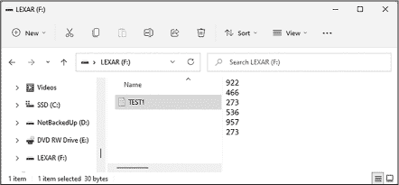

图 12-8：清单 12-2 的结果

在下一个项目中，你将使用刚刚学到的框架，将温度传感器的数据追加到文本文件中。

项目#36：传感器数据记录

这个简单的数据记录演示程序记录了温度、气压和由 BMP180 传感器检测到的海拔高度，示例参见第十章。项目#36 的草图从传感器获取数据，并在固定间隔时间内将数据写入 USB 闪存驱动器，你可以根据自己的需要修改这些间隔时间。

你将需要以下部件来完成此项目：

+   一块 Arduino Uno 或兼容板和 USB 数据线

+   一个 USB 闪存驱动器接口模块

+   配备插针的 BMP180 传感器模块

+   无焊接面包板

+   各种跳线

对于这个项目，你将使用面包板作为桥梁，帮助为两个模块和 Arduino 创建更多的 5V 和 GND 连接。如果你之前没有使用过 BMP180 传感器，请参考第十章中的“BMP180 传感器”部分。按照图 12-9 所示组装电路。

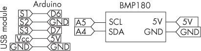

图 12-9：项目#36 的原理图

输入并上传项目 #36 的示例代码。代码运行几分钟后，移除 USB 闪存驱动器，并使用电脑查看文件，如 图 12-10 所示。

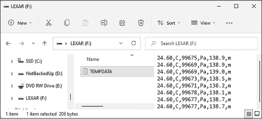

图 12-10：由项目 #36 捕获的示例数据

由于使用逗号分隔符作为数据和描述之间的分隔符，你可以将文件导入到电子表格程序中，例如 Microsoft Excel，这样就可以轻松分析或分发捕获的数据，正如 图 12-11 所示。

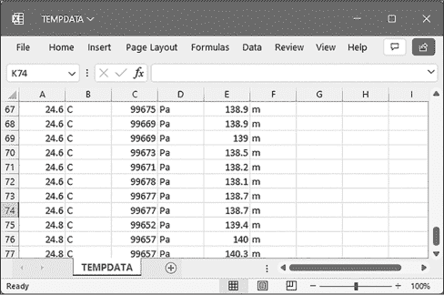

图 12-11：项目 #36 在 Excel 中捕获的示例数据

让我们看看这个是如何工作的：

```
// Project #36 - Log sensor data to USB flash drive

❶ #include <Wire.h>
#include <Adafruit_BMP085.h>
#include <Ch376msc.h>
#include <SoftwareSerial.h>

Adafruit_BMP085 bmp;
SoftwareSerial USBserial (7, 6);
Ch376msc USBdrive(USBserial);

❷ char floatChar[8] = " ";

void fileAppend()
{
    Serial.println("fileAppend()");
    USBdrive.setFileName("TEMPDATA.TXT"); // Set the filename
    if (USBdrive.openFile() == ANSW_USB_INT_SUCCESS)
    {
        USBdrive.moveCursor(CURSOREND);
    }
    if (USBdrive.getFreeSectors())
    {
      ❸ dtostrf(bmp.readTemperature(),2,2,floatChar);
        USBdrive.writeFile(floatChar, strlen(floatChar));
        USBdrive.writeChar(',');
        USBdrive.writeChar('C');
        USBdrive.writeChar(',');

      ❹ USBdrive.writeNum(bmp.readPressure());
        USBdrive.writeChar(',');
        USBdrive.writeChar('P');
        USBdrive.writeChar('a');
        USBdrive.writeChar(',');

      ❺ dtostrf(bmp.readAltitude(),5,1,floatChar);
        USBdrive.writeFile(floatChar, strlen(floatChar));
        USBdrive.writeChar(',');
        USBdrive.writeChar('m');
        USBdrive.writeChar('\n');
    } else
    {
        Serial.println("Disk full");
    }
    USBdrive.closeFile();
    Serial.println("Finished");
}

void setup()
{
    bmp.begin();
    Serial.begin(115200);  // For Serial Monitor
    USBserial.begin(9600); // For USB module
 USBdrive.init();
    delay(5000);
}

void loop()
{
    if (USBdrive.checkIntMessage())
    {
        if (USBdrive.getDeviceStatus()) {
        Serial.println(F("Flash drive attached!"));
    }
    else
    {
        Serial.println(F("Flash drive detached!"));
        return;
    }
}

fileAppend();
❻ delay(5000); // Arbitrary delay
    9 
```

这个 Listing 12-2 示例的实用扩展首先包含并设置了 BMP180、USB 模块和软件串口所需的库，从 ❶ 开始。然后，示例声明了一个字符数组 ❷，用于将浮动小数点数字转换为字符以写入闪存驱动器。温度（摄氏度）、气压（帕斯卡）和海拔（米）从 BMP180 获取，并在 ❸、❹ 和 ❺ 处分别写入闪存驱动器，数据之间有简单的分隔符。你可以根据需要更改任意延迟 ❻。

你可以使用这个项目将任何 Arduino 能够捕获或生成的数据记录到 USB 闪存驱动器上。为了增加挑战性，你可以加入一个实时时钟，记录时间和日期以及天气数据。

## 读取数字数据

从 USB 闪存驱动器读取数据是将设置、参数和其他信息导入 Arduino 项目的有用方法。在本节中，我将向你展示如何从 USB 读取数字数据；稍后你将学习如何读取文本数据。

你的 Arduino 可以查询存储在闪存驱动器上的文件，该文件仅包含整数并逐个读取它们。每个整数必须单独存储在文件的每一行，并且后面必须跟随一个换行符。你可以使用记事本风格的文本编辑器创建文本文件，确保使用 8 + 3 的文件名格式，如 *FILENAME.TXT*。

代码初始化与写入或附加数据到 USB 闪存驱动器时相同。你需要在代码开始时使用以下四行来初始化接口模块和所需的软件串口：

```
#include <Ch376msc.h>
#include <SoftwareSerial.h>
SoftwareSerial Serial1(7, 6);
Ch376msc USBdrive(Serial1); 
```

接下来，设置你想要打开的文件的名称，并使用以下两个函数打开文件：

```
USBdrive.setFileName("`FILENAME.TXT`");
USBdrive.openFile(); 
```

然后，你可以使用以下代码依次读取文件中的每个数字，从文件的开始到结束：

```
while(!USBdrive.getEOF())
{
    number = USBdrive.readLong();
} 
```

该示例中的整数将存储在变量 number 中。

最后，关闭文件：

```
USBdrive.closeFile(); 
```

让我们通过一个示例来演示，草图将 10 个整数写入闪存驱动器上的文件，然后检索并显示这些数字。你需要将 USB 闪存驱动器模块连接到 Arduino，并且像往常一样准备闪存驱动器。

上传 清单 12-3 草图。

```
❶ #include <Ch376msc.h>
#include <SoftwareSerial.h>
SoftwareSerial Serial1(7, 6);
Ch376msc USBdrive(Serial1);

void writeIntegers()
{
    int number;
    if (USBdrive.driveReady())
    {
        USBdrive.setFileName("NUMBERS.TXT");
        USBdrive.openFile();
        Serial.println(F("Writing integers:"));
        for (int a = 0; a < 10; a++)
        {
            number = random(−1000, 1000);
            Serial.print(number); Serial.print(" ");
            USBdrive.writeNumln(number);
        }
        USBdrive.closeFile();
        Serial.println(F("Finished writing integers."));
 Serial.println();
    }
}

void readIntegers()
{
  ❷ USBdrive.setFileName("NUMBERS.TXT");
    USBdrive.openFile();
    Serial.println(F("Reading integer numbers…"));

  ❸ while(!USBdrive.getEOF())
    {
      ❹ Serial.print(USBdrive.readLong());
        Serial.print(" ");
    }
  ❺ USBdrive.closeFile();
    Serial.println(F("Finished reading integers."));
    Serial.println();
}

void setup()
{
  ❻ randomSeed(analogRead(0));
    Serial.begin(115200);
    Serial1.begin(9600);
    USBdrive.init();
    delay(5000);
}

void loop()
{
  ❼ if (USBdrive.checkIntMessage())
    {
        if (USBdrive.getDeviceStatus()) {
            Serial.println(F("Flash drive attached!"));
    } else {
            Serial.println(F("Flash drive detached!"));
            return;
        }
    }
  ❽ writeIntegers();
    delay(2000);
  ❾ readIntegers();
    delay(30000);
} 
```

清单 12-3：在 USB 闪存驱动器上写入和显示整数

在短暂的延迟后，草图应在串口监视器中显示写入到闪存驱动器上的数字，然后从闪存驱动器中读取这些数字，并再次在串口监视器中显示相同的数字，如 图 12-12 所示。

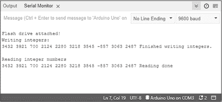

图 12-12：清单 12-3 示例输出

草图首先包含并设置 USB 模块和软件串口所需的库 ❶。自定义的 writeIntegers() 函数将一些整数写入 USB 闪存驱动器以供演示，USBdrive.setFileName() 函数 ❷ 设置要存储的文件名。在设置要打开的文件名并打开文件后，草图从文件的起始位置 ❸ 开始循环，直到文件结束，读取每个整数 ❹ 并在串口监视器上显示它们。

草图接着关闭文件 ❺，初始化随机数生成器 ❻，并启动串口和 USB 模块。它检查模块中是否存在 USB 闪存驱动器 ❼，然后分别在 ❽ 和 ❾ 运行写入和读取演示功能。

你已准备好在接下来的两个项目中运用你在整数读写方面的知识，通过创建 USB 安全密钥，然后将参数加载到 Arduino 项目中。

项目 #37：使用 USB 安全密钥

该项目展示了如何通过强制 Arduino 在操作主代码之前读取存储在 USB 闪存驱动器上的一个秘密数字文本文件来锁定或解锁 Arduino 的操作能力。如果文本文件中的数字与草图中加载的数字匹配，代码就可以运行；否则，Arduino 将停止并且无法运行。如果没有 USB 闪存驱动器，它也无法操作。

你将需要以下零件来完成此项目：

+   一个 Arduino Uno 或兼容板和 USB 电缆

+   一个 USB 闪存驱动器接口模块

+   各种跳线

按照项目 #36 的描述，将 USB 闪存驱动器模块连接到 Arduino，然后使用你的 PC 创建一个名为 *SECURITY.TXT* 的文本文件，文件内容仅包含一行数字 12345。将该文件复制到 USB 闪存驱动器上。

接下来，将闪存驱动器插入 USB 模块中，然后输入并上传以下草图。

```
// Project #37 - USB security key

#include <Ch376msc.h>
#include <SoftwareSerial.h>
SoftwareSerial Serial1(7, 6);
Ch376msc USBdrive(Serial1);

boolean readKey()
{
    boolean keyStatus=false;
  ❶ int securityKey=12345;
    int testKey=0;
  ❷ USBdrive.setFileName("SECURITY.TXT");
    USBdrive.openFile();
    while(!USBdrive.getEOF())
    {
      ❸ testKey=USBdrive.readLong();
    }
    USBdrive.closeFile();
    if (securityKey==testKey)
    {
      ❹ keyStatus=true;
    }
  ❺ return keyStatus;
}

void setup()
{
    pinMode(13, OUTPUT);
    Serial.begin(115200);
    Serial1.begin(9600);
    USBdrive.init();
    delay(5000);

  ❻ if (USBdrive.checkIntMessage())
    {
        if (USBdrive.getDeviceStatus())
        {
            Serial.println(F("Flash drive attached!"));
        } else {
            Serial.println(F("Flash drive detached!"));
            return;
        }
    }
  ❼ if (readKey()==false)
    {
        Serial.println("Incorrect key!");
      ❽ do {} while (1); // Halt
  }
}

void loop()
{
  ❾ digitalWrite(13, HIGH);
    delay(500);
    digitalWrite(13, LOW);
    delay(500);
} 
```

本质上，这个草图打开一个文本文件，读取五位数字，并将其与草图中存储的数字进行比较。如果匹配，则执行 void loop() 中的代码；如果不匹配，草图将停止在 void setup() 中。

自定义的 boolean readKey() 函数检查安全文件，该文件中存储了安全密钥值 ❶。草图打开 USB 闪存驱动器上的文件 ❷，然后读取文件中的密钥值 ❸。如果 Arduino 密钥值和文件中的密钥值匹配，当草图进行比较时，函数的值将设置为 true ❹。否则，函数将默认返回 false。无论哪种结果，都将在 ❺ 返回。

检查键值从 void setup() 开始。该草图首先检查 USB 闪存驱动器 ❻ 的存在，然后检查文件键值 ❼。如果没有匹配，或者未插入 USB 闪存驱动器，草图会停止 ❽，并且 Arduino 必须重置才能重试。这些结果将显示在串行监视器中。例如，在 图 12-13 中，监视器告诉我闪存驱动器已连接，但我的键值不正确。

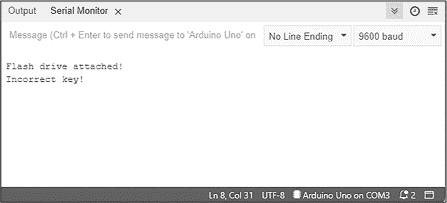

图 12-13：当安全密钥不匹配时，项目 #37 的示例输出

然而，如果密钥匹配，草图可以继续执行到 void loop() 并像往常一样运行任何代码 ❾。在这种情况下，它只是简单地闪烁 Arduino 的板载 LED。

你可以使用这个草图为你自己的基于 Arduino 的项目添加安全密钥。在下一个项目中，你将使用类似的硬件将大量数据导入 Arduino，从而可以做出相应的决策。

项目 #38：通过 USB 闪存驱动器配置项目

你还可以使用 USB 闪存驱动器功能，将数据或参数从 USB 闪存驱动器导入到 Arduino 中。例如，你可以导入机器人预设的指令，设置计时器控制项目的开始和结束时间，或为由项目控制的灯光添加开关模式。你可以通过读取 USB 上的文件，将这些值保存到 Arduino 的内部 EEPROM 中，然后检索并处理这些值。这对于更持久的项目配置非常有用。

为了演示这一过程，本项目向你展示了如何从 USB 闪存驱动器上的文件中读取介于 0 到 255 之间的整数，存储这些值到 EEPROM 中，然后再检索这些值并在八个 LED 上以二进制形式显示它们。完成后，你可以将这些函数作为框架用于你自己的项目。

你将需要以下零件来完成本项目：

+   一块 Arduino Uno 或兼容板及 USB 线

+   一个 USB 闪存驱动器接口模块

+   各种跳线

+   八个 1 kΩ，0.25 W，1% 的电阻器

+   八个 LED

+   一块无焊接面包板

按照图 12-14 中的示意图组装电路。

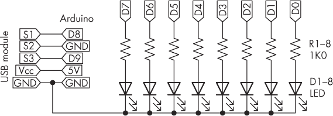

图 12-14：项目 #38 的电路图

接下来，在 USB 闪存驱动器上创建一个名为*SETTINGS.TXT*的文本文件，并在每一行上放置一个 0 到 255 之间的数字（包括 0 和 255）。这些值将从闪存驱动器复制到 EEPROM 中。（你可以在《Arduino 工作坊》第二版的第十八章中查看如何编写和安装你自己的 Arduino 库。）

接下来，将闪存驱动器插入 USB 模块，输入并上传项目 #38 的草图，打开串行监视器。LED 应该会显示存储在 EEPROM 中的每个数字的二进制等效值。（值 0 到 3 可能无法正确显示，因为这些 LED 共享了用于 USB 串行连接到 PC 的数字引脚。）

让我们看看它是如何工作的：

```
// Project #38 - Project configuration via USB flash drive

#include <EEPROM.h>
#include <Ch376msc.h>
#include <SoftwareSerial.h>
SoftwareSerial Serial1(9, 8);
Ch376msc USBdrive(Serial1);

void loadData()
{
    int _data;
    int pointer = 0;

  ❶ USBdrive.setFileName("SETTINGS.TXT");
    USBdrive.openFile();
    Serial.println(F("Reading data from USB:"));

    while(!USBdrive.getEOF())
    {
      ❷ data = USBdrive.readLong();
        EEPROM.write(_data,pointer);
        Serial.print(pointer); Serial.print(" "); Serial.println(_data);
        pointer++;
    }
  ❸ USBdrive.closeFile();
    Serial.println(F("Finished."));
    Serial.println();
}

void useData()
{
    int a;
    int _data;
    Serial.println("Reading from EEPROM…");
    for (a = 0; a < 100; a++)
    {
      ❹ _data = EEPROM.read(a);
        PORTD = _data;
        Serial.print(a); Serial.print(" "); Serial.println(_data);
        delay(100);
    }
}

void setup()
{
    DDRD = B11111111;
    Serial.begin(115200);
    Serial1.begin(9600);
    USBdrive.init();
    delay(5000);
}

void loop()
{
    if (USBdrive.checkIntMessage())
    {
        if (USBdrive.getDeviceStatus()) {
            Serial.println(F("Flash drive attached!"));
        } else
 {
            Serial.println(F("Flash drive detached!"));
            return;
        }
    }
    loadData();
    delay(1000);

    useData();
    delay(1000);

    do {} while (1); // Halt

} 
```

草图首先包含并设置了 USB 模块、EEPROM 和软件串行线路所需的库。自定义函数 loadData() 从 USB 闪存驱动器中的*SETTINGS.TXT*文件中检索数据，并将其存储到 EEPROM 中。草图打开闪存驱动器上的文件 ❶ ，然后从文件中读取每个整数 ❷ 并将其存储到 EEPROM 中。pointer 变量跟踪 EEPROM 的位置，并在每次读取后增加 1。草图读取完文件后会关闭文件 ❸。

自定义的 useData() 函数依次读取每个值并将其存储在 PORTD 寄存器中，以控制 LED。（关于端口操作的复习，请参阅第二章）。for 循环依次读取 EEPROM 中的每个位置的值 ❹ ，然后将该值发送到 PORTD 寄存器。

该草图在 void setup() 中设置了常见的配置，并在 void loop() 中检查闪存驱动器。然后它调用了自定义函数 loadData() 和 useData()。由于“什么也不做”的那一行，草图仅运行一次。

当该项目运行时，你将看到数据从闪存驱动器复制到 EEPROM 中，随后你将看到相同的数据从 EEPROM 中显示出来。我在 loadData() 和 useData() 函数中插入了几行 Serial.print()，以便监控过程；图 12-15 显示了这个过程的示例。

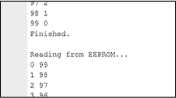

图 12-15：项目 #38 的示例输出

不过，如果你不需要调试信息，可以移除 Serial.print() 语句。

这个简单的示例演示了如何从 USB 闪存驱动器读取数字数据并将其存储到 Arduino 中。接下来的任务就是你自己从 EEPROM 获取所需的数据，应用到你的项目中。

现在你已经学会了如何读取数字数据，我将向你展示如何读取文本。

## 读取文本

你的 Arduino 还可以读取来自简单文件（与整数使用的文本文件类型相同）的文本文件，这些文件只包含文本和换行符。库将检测到换行符，但由文字处理软件创建的任何其他格式代码将仅显示为 ASCII 表中的字符。

同样，最好使用记事本风格的文本编辑器创建此类文件，采用 8 + 3 的文件名格式。读取文本与读取整数类似；首先设置你想要打开的文件，然后打开它：

```
USBdrive.setFileName("TESTTEXT.TXT");
USBdrive.openFile(); 
```

接下来，依次读取文件中的每个字符，从文件的开始到结束，使用

```
moreText = USBdrive.readFile(_buffer, sizeof(_buffer)); 
```

其中，moreText 是一个布尔变量（true 或 false），_buffer 是一个字符数组，长度在 2 到 255 个字符之间，用于存放文本。你需要重复执行前述语句，直到变量 moreText 返回 false（这表示文件读取完毕）。

最后，关闭文件：

```
USBdrive.closeFile(); 
```

让我们通过一个草图来演示，展示名为 *TESTTEXT.TXT* 的文本文件内容，该文件存储在 USB 闪存驱动器上。按照图 12-3 的方式连接 USB 模块，将 USB 闪存驱动器插入模块，上传并输入 清单 12-4 草图：

```
#include <Ch376msc.h>
#include <SoftwareSerial.h>
SoftwareSerial Serial1(7, 6);
Ch376msc USBdrive(Serial1);

void readText()
{
    char _buffer[254];
    boolean moreText;

  ❶ USBdrive.setFileName("TESTTEXT.TXT");
    USBdrive.openFile();
  ❷ moreText = true;
    while(moreText)
    {
      ❸ moreText = USBdrive.readFile(_buffer, sizeof(_buffer));
      ❹ Serial.print(_buffer);
    }
  ❺ USBdrive.closeFile();
}

void setup()
{
    Serial.begin(115200);
    Serial1.begin(9600);
    USBdrive.init();
    delay(5000);
}

void loop()
{
    if (USBdrive.checkIntMessage())
    {
        if (USBdrive.getDeviceStatus())
        {
            Serial.println(F("Flash drive attached!"));
        } else
        {
            Serial.println(F("Flash drive detached!"));
        }
    }
  ❻ readText();
    delay(5000);
} 
```

清单 12-4：从闪存驱动器读取文本

打开串口监视器，应该会显示文本文件的内容，如图 12-16 所示。

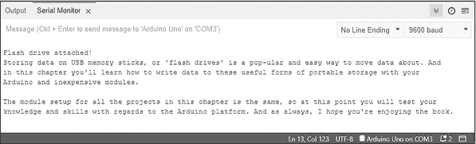

图 12-16：来自清单 12-4 的示例输出

自定义的 readtext() 函数负责打开文本文件、读取内容并使用这些文本。所需的变量包括字符数组 _buffer[254]，它一次从 USB 闪存驱动器存储 254 个字符的数据，以及布尔变量 moreText，它监控读取状态。在函数设置并打开文件进行使用 ❶ 之后，它将布尔变量 moreText 设置为 true ❷，以启动随后的 while 循环。它从文件中读取 254 个字符，并将它们放入数组 _buffer[254] ❸。如果还有更多文本需要读取，函数会将 true 返回到 moreText，使得 while 循环重复执行。然后，函数将文本发送到串口监视器 ❹。当读取到文件末尾时，moreText 被设置为 false，并关闭文件 ❺。最后，草图调用整个 readtext() 函数 ❻。

现在，你已经有了基本的框架，可以从 USB 闪存驱动器读取文本，并在自己的项目中使用它。如同前一节中读取整数的演示，你可以使用字符或单词作为加载参数来配置项目，或者使用收集到的字符数组通过其他方法进行显示。如果你使用较小的缓冲区数组，可能是 10 个字符长，这将使你能够读取 Arduino 可以识别并执行的命令词。

## 继续前进

在这一章中，你学习了如何将数据写入 USB 闪存驱动器，并从 USB 闪存驱动器中检索和使用数据与 Arduino 进行交互。这是一种简单易用的将数据从 Arduino 传输到外部设备的方法。

在下一章中，你将通过学习如何将 PS/2 PC 键盘与 Arduino 连接，进一步扩展你的输入方法知识。
