# 第十三章：13 与 PS/2 键盘的接口


一些 Arduino 项目，比如电机控制器、照明系统，甚至是游戏，需要通过一种熟悉且用户友好的方式输入文本或数值数据。本章将展示如何通过标准的 PS/2 风格 PC 键盘接受这些数据，然后通过 I²C 接口 LCD 显示出来。

你将学习：

+   通过 Arduino 接收来自个人系统/2（PS/2）键盘的数据

+   设置 I²C 接口 LCD，以便方便地显示数据

+   从 PS/2 键盘捕获文本并在 LCD 上显示

你还将构建一个带有键盘输入的 RGB LED 测试器，以及一个无干扰的文本文件输入设备。

## PS/2 键盘

本章使用的键盘具有 PS/2 风格的接口，这种接口最初由 IBM 于 1987 年与其新的 PS/2 系列个人计算机一起推出。这种接口在 1997 年左右流行，但 USB 标准的普及让其逐渐被取代。然而，由于接口简单，PS/2 键盘仍然可用并被各种 PC 和工业设备使用。PS/2 键盘的实际按键布局几乎与今天使用的键盘完全相同。

PS/2 键盘连接器采用六针迷你 DIN 格式，如图 13-1 所示。

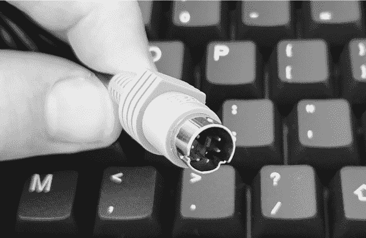

图 13-1：PS/2 键盘连接器

我们将使用一个简单的 PS/2 插座分线板（例如 PMD Way 的 694804 部件）将键盘与 Arduino 连接，如图 13-2 所示。插座分线板使用四个连接：5V、GND、时钟和数据。

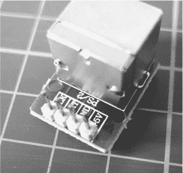

图 13-2：PS/2 插座分线板

每个键盘上的按键都有一个数字代码表示。当按下键盘上的一个按键时，按键码数据通过一个双向半双工数据线传输到 PC。这意味着数据可以在 PC 和键盘之间双向传输，但每次只能在一个方向上传输。

> 注意

*PS/2 键盘是 5V 设备。如果你使用的是工作电压为 3.3V 的 Arduino 或兼容设备，你需要在 Arduino 与 PS/2 分线板之间使用双向电平转换板。*

对于每一次按键，键盘会发送一个低电平的起始位，接着是 8 个比特表示按下的键，然后是一个校验位，通过数据线传输，并且有一个匹配的时钟线来保持时序和数据的准确性。例如，图 13-3 显示了按下 P 键时时钟线（1）和数据线（2）。

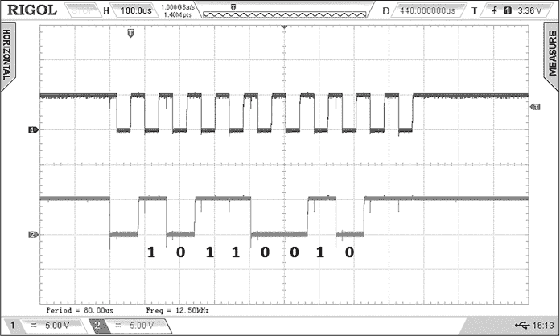

图 13-3： 在数字存储示波器上显示的 PS/2 键盘按键时序图

字母 P 的键码是 16 进制的 0x4D，或二进制的 01001101——你可以在图 13-3 中看到标记在数据线上的位。键码的完整列表可从[*https://<wbr>wiki<wbr>.osdev<wbr>.org<wbr>/PS<wbr>/2<wbr>_Keyboard*](https://wiki.osdev.org/PS/2_Keyboard)获取。

要在 Arduino 上使用键盘，您需要安装一个库。打开 IDE 的库管理器并搜索**ps/2**，然后安装结果库。

要测试键盘，请将 PS/2 突破板连接到 Arduino，如图 13-4 中的原理图所示。

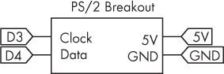

图 13-4：键盘连接的原理图

接下来，输入并上传列表 13-1 示例。

```
❶ #include <PS2Keyboard.h>
PS2Keyboard keyboard;

void setup()
{
    delay(1000);
  ❷ keyboard.begin(4, 3);
    Serial.begin(9600);
    Serial.println("Keyboard Test:");
}

void loop()
{
    if (keyboard.available())
  ❸ {
        // Read the next key:
      ❹ char c = keyboard.read();
        // Check for some of the special keys:
        switch (c)
        {
            case PS2_ENTER: Serial.println(); break;
            case PS2_TAB: Serial.print("[Tab]"); break;
            case PS2_ESC: Serial.print("[ESC]"); break;
            case PS2_PAGEDOWN: Serial.print("[PgDn]"); break;
            case PS2_PAGEUP: Serial.print("[PgUp]"); break;
            case PS2_LEFTARROW: Serial.print("[Left]"); break;
            case PS2_RIGHTARROW: Serial.print("[Right]"); break;
            case PS2_UPARROW: Serial.print("[Up]"); break;
            case PS2_DOWNARROW: Serial.print("[Down]"); break;
            case PS2_DELETE: Serial.print("[Del]"); break;
            // Otherwise, just print all normal characters
          ❺ default: Serial.print(c); break;
      }
    }
} 
```

列表 13-1：测试 PS/2 键盘

上传后几秒钟，打开串口监视器并在 PS/2 键盘上随便输入任何内容。图 13-5 显示了项目运行时的示例输出，其中我在键盘上输入的内容显示在串口监视器中。

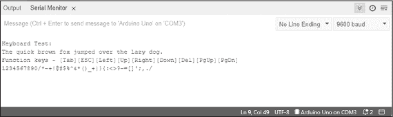

图 13-5：键盘测试示例输出

该示例初始化库 ❶，然后激活连接到数字引脚 4 和 3 的键盘 ❷；keyboard.begin()的参数分别是时钟线和数据线的数字引脚号。该示例检查是否按下了一个按钮 ❸，并将结果分配给字符变量c ❹。在使用switch…case语句检查功能键后，它将结果发送到串口监视器 ❺。

如果你发现键盘返回乱码，检查键盘的电源是否正好或接近 5V 直流电压；键盘需要稳定的 5V 电压才能正常工作。一些 Arduino 板可以提供接近 5V 的电压，但有些可能会低一些，大约是 4.7V 或更低。如果电压太低，可以为电路和以后使用 PS/2 键盘的项目使用外部 5V 电源。

现在你已经了解了如何将键盘输入集成到项目中，让我们来设置一个输出显示，使用兼容 I²C 总线的 LCD。

## PCF8574 LCD 模块

在 Arduino 世界中，使用 LCD 作为显示输出非常流行。通常，这涉及使用 LCD 扩展板或将与 HD44780 兼容的 LCD 用大约八根线连接回 Arduino。然而，近年来，一种新的使用这些 LCD 的方法变得越来越流行：将 PCF8574 I²C 背包单元焊接到显示屏上，这样只需四根线就可以将 LCD 连接到你的项目中。

PCF8574 是一个基于 I²C 的端口扩展器，它可以将 LCD 的控制引脚连接到流行的串行数据总线。这避免了使用数字 I/O 引脚的需求，并有助于简化整体布线。你可以单独购买模块，或者购买带有预先附加模块的 LCD，如 图 13-6 所示。

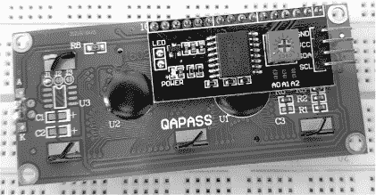

图 13-6：PCF8574 I2C LCD 模块的背面

要将模块连接到 Arduino，请使用 5V/V[CC]、GND、时钟和数据线，就像连接其他任何 I²C 设备一样。你可以使用模块上的可调电位器调节显示对比度。你还可以在电位器下方的三个焊接桥接垫（A0、A1 或 A2）之间桥接，以将 I²C 总线地址从默认的 0 x 27 更改为其他七个选项之一。要在 Arduino 上使用 LCD，你必须安装一个库。打开 IDE 的库管理器并搜索 **PCF8574**，然后安装该库的最新版本。

要测试显示，按照 图 13-7 中的原理图连接到 Arduino。

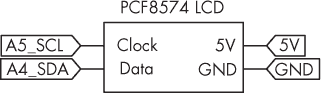

图 13-7：LCD 连接的原理图

接下来，输入并上传 列表 13-2 草图。

```
❶ #include <Wire.h>
#include <LiquidCrystal_PCF8574.h>
LiquidCrystal_PCF8574 lcd(0x27);

void setup()
{
    Wire.begin();
  ❷ Wire.beginTransmission(0x27);
    lcd.begin(16, 2);
  ❸ lcd.setBacklight(255);
}

void loop()
{
    lcd.home();
    lcd.clear();
    lcd.setCursor(2, 0);
    lcd.print("Hello, world!");
    delay(1000);
    lcd.setCursor(2,1);
    lcd.print("* Arduino *");
    delay(1000);
} 
```

列表 13-2：测试 PCF8574 LCD

在草图上传后，你应该能看到 Hello, world! 和 * Arduino * 在 LCD 上闪烁，如 图 13-8 所示。

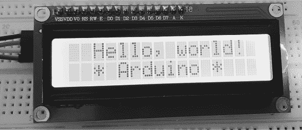

图 13-8：I2C LCD 在工作中的表现

一旦 LCD 初始化完成，基本操作与常规 Arduino LCD 库相同。该草图包含了用于 I²C 的 Wire 库和 I²C LCD 库 ❶，然后通过总线地址 0x27 创建 LCD 的实例。它在 I²C 总线上启动通信，地址为 0x27（即 LCD） ❷，接着用 lcd.begin() 配置 LCD 大小（16 个字符，2 行），最后使用 lcd.setBacklight() 打开背光。你可以通过使用 255 来开启背光，0 来关闭背光；在此草图中，背光设置为开启状态 ❸。

该草图使用了常规的 LCD 函数：lcd.home() 将光标重置到左上角，lcd.clear() 清除显示屏，等等。如果你在同一个项目中使用其他 I²C 总线设备，记得在发送显示命令之前，使用另一个 Wire.beginTransmission(0x27) 来重新启动 LCD 的总线。

如果显示器无法工作，可能是显示器的总线地址与草图中使用的地址不同。你可以使用第十章中描述的项目 #30 I²C 扫描器草图来检查设备的总线地址，并将其替换为草图中的 0x27。

## 测试 I2C LCD 和 PS/2 键盘

既然你已经分别实验了 I²C LCD 和键盘，本节将展示它们如何作为一个综合硬件进行协作。我希望这能激发你自己独立项目的灵感，比如使用 LCD 的文本编辑器，或许是你自己设计的基于文本的游戏。

按照前面的章节连接键盘和 LCD，然后输入并上传清单 13-3 草图。

```
❶ #include <LiquidCrystal_PCF8574.h>
#include <Wire.h>
LiquidCrystal_PCF8574 lcd(0x27);
#include <PS2Keyboard.h>
PS2Keyboard keyboard;

int xPosition = 0;
int yPosition = 0;

void setup()
{
    Wire.begin();
    Wire.beginTransmission(0x27);
    lcd.begin(16, 2);
    lcd.setBacklight(255);
    lcd.blink();
    keyboard.begin(4, 3);
}

void loop()
{
  ❷ if (keyboard.available())
    {
        // Read the next key:
        char c = keyboard.read();
        // Check for some of the special keys:
      ❸ if (c == PS2_ENTER)
        {
            xPosition = 0;
            if (yPosition == 0)
            {
                yPosition = 1;
            } else if (yPosition == 1)
            {
                yPosition = 0;
            }
            lcd.setCursor(xPosition, yPosition);
      ❹ }
        else if (c == PS2_TAB)
        {
            lcd.print("[Tab]");
      ❺ }
        else if (c == PS2_ESC)
        {
            lcd.home();
            lcd.clear();
            xPosition = 0;
            yPosition = 0;
      ❻ }
        else if (c == PS2_PAGEDOWN)
        {
            lcd.print("[PgDn]");
        }
        else if (c == PS2_PAGEUP)
        {
            lcd.print("[PgUp]");
        }
        else if (c == PS2_LEFTARROW)
        {
            lcd.print("[Left]");
        }
        else if (c == PS2_RIGHTARROW)
        {
            lcd.print("[Right]");
        }
        else if (c == PS2_UPARROW)
        {
            lcd.print("[Up]");
        }
        else if (c == PS2_DOWNARROW)
        {
            lcd.print("[Down]");
        }
 else if (c == PS2_DELETE)
        {
            lcd.print("[Del]");
        }
        else
        {
            // Otherwise, just print all normal characters
          ❼ lcd.print(c);
            xPosition++;
          ❽ if (xPosition > 15)
            {
                xPosition = 0;
              ❾ if (yPosition == 0)
                {
                    yPosition = 1;
                }
                else if (yPosition == 1)
                {
                    yPosition = 0;
                }
              ❿ lcd.setCursor(xPosition, yPosition);
            }
        }
    }
} 
```

清单 13-3：LCD 和键盘协同工作

几秒钟后，LCD 背光应该会亮起，块状光标应开始在 LCD 的左上角闪烁。现在开始输入。你在键盘上输入的任何内容——包括文本、符号和大多数功能键——都会显示出来，并且在屏幕上循环，就像 LCD 是一个小型文本编辑器一样，如图 13-9 所示。（为了更清晰的照片，我已关闭背光。）

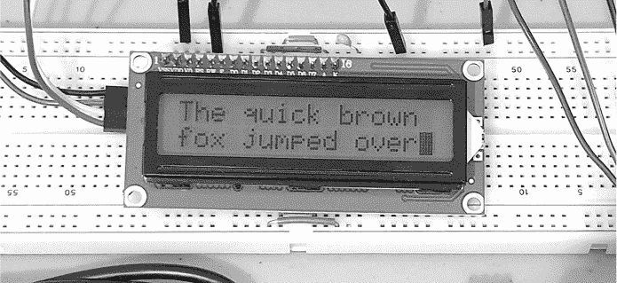

图 13-9：LCD 显示通过 PS/2 键盘输入的文本

你可以按 ESC 键清除屏幕并将光标移回左上角。程序会从键盘（除了 ESC 键）获取输入，并将每次按键发送到显示器。

程序首先初始化 LCD 和键盘所需的库，并创建两个变量来存储光标的位置 ❶。然后，它启动键盘和 LCD，打开 LCD 背光和闪烁的光标。

程序的主循环首先通过检查键盘上的按键来启动，并根据按键判断接下来要执行的操作 ❷。首先，项目检查用户是否按下了回车键。如果是，LCD 上的光标会移动到第二行的起始位置，如果光标已经在第二行，则返回第一行的起始位置。程序同样检查是否按下了 TAB 键 ❹，如果按下，就在 LCD 上显示。或者，如果用户按下 ESC ❺，屏幕会清空，光标会移回 LCD 的左上角。

程序会继续检查其他按键并在 LCD 上显示相应按键的名称 ❻。这包括按下任何其他不属于前述检查的按键，包括字母、数字和符号 ❼。每次按键后，LCD 上的光标位置会增加，使其在列 ❽ 和行 ❾ 上移动，并在必要时移动到下一行或 LCD 的左上角 ❿。

现在你已经知道如何读取 PS/2 键盘并显示按下的按键，你将在以下项目中使用这些技能，通过从键盘读取整数并与其一起工作，控制 RGB LED 的亮度和可用颜色。

项目 #39：创建 RGB LED 测试仪

在未来的项目中，你可能需要测试可以通过红、绿、蓝（RGB）LED 显示的各种颜色，以便校准设置，以达到所需的 LED 亮度和颜色。在这个项目中，你将构建一个设备，该设备接受每种颜色的脉宽调制（PWM）值，并根据定义的时间控制每个 LED。如果你没有 RGB LED，仍然可以使用三个独立的 LED 来享受和理解这个项目。

> 注意

*你可以在《Arduino Workshop》（第二版，No Starch Press，2021 年）第十九章了解更多关于 PWM 的内容。*

本项目需要以下部件：

+   一个 Arduino Uno 或兼容板和 USB 电缆

+   一个 PS/2 分线板

+   一个 PS/2 键盘

+   一个 PCF8574 LCD 模块

+   一个共阴极 RGB LED 或各自一个 RGB LED

+   三个 1 kΩ、0.25 W、1%精度的电阻器

+   一个无焊接面包板

+   各种跳线

按照图 13-10 中的电路图组装电路。在这个项目中，面包板被用作桥接，帮助为两个模块与 Arduino 之间提供更多的 5V 和 GND 连接。


图 13-10：项目#39 的电路图

现在输入并上传项目 #39 的草图。LCD 应显示 R:。使用 PS/2 键盘，输入一个介于 000 和 255 之间的三位数字值，用来设置红色 LED 的 PWM 值。数字越大，LED 中的颜色越强。对绿色和蓝色 LED 重复这个过程，以响应 G: 和 B: 提示。最后，LCD 应显示 T: 提示。输入你要求的 LED 激活持续时间，单位为 000 到 255 秒。LED 将根据你的指示激活。

图 13-11 显示了输入所有三个 LED 的亮度值以及激活时长（秒）的结果。


图 13-11：项目 #39 操作中的用户界面

让我们看看这是如何工作的：

```
// Project #39 - RGB LED tester

❶ #include <Wire.h>
#include <LiquidCrystal_PCF8574.h>
LiquidCrystal_PCF8574 lcd(0x27);
#include <PS2Keyboard.h>
PS2Keyboard keyboard;

#define red 11
#define green 10
#define blue 9

❷ int readDigit()
{
    int _digit=−1;
  ❸ do
    {
        if (keyboard.available())
        {
            // Read the next key:
            char c = keyboard.read();
            switch (c)
            {
                case '1' : _digit=_digit+2; break;
                case '2' : _digit=_digit+3; break;
                case '3' : _digit=_digit+4; break;
                case '4' : _digit=_digit+5; break;
                case '5' : _digit=_digit+6; break;
                case '6' : _digit=_digit+7; break;
                case '7' : _digit=_digit+8; break;
                case '8' : _digit=_digit+9; break;
                case '9' : _digit=_digit+10; break;
                case '0' : _digit=0; break;
                default: _digit=0; break;
            }
          ❹ lcd.print(c);
        }
  ❺ }
    while(_digit==−1);
    return _digit;
}
❻ int get3digit()
{
    int z;
    z = readDigit()*100;
    z = z + (readDigit()*10);
    z = z + readDigit();
    return z;
}

void setup()
{
  ❼ Wire.begin();
    Wire.beginTransmission(0x27);
    lcd.begin(16, 2);
    lcd.setBacklight(255);
    keyboard.begin(4, 3);
    DDRB = B111111; // Set LED pins to output
}

void loop()
{
  ❽ int _red;
    int _green;
    int _blue;
    int _delay;
    lcd.home();
    lcd.clear();
    lcd.setCursor(1, 0);
    lcd.print("R:");
    lcd.setCursor(4, 0);
    _red = get3digit();

    lcd.setCursor(8, 0);
    lcd.print("G:");
    lcd.setCursor(11, 0);
    _green = get3digit();

    lcd.setCursor(1, 1);
    lcd.print("B:");
    lcd.setCursor(4, 1);
    _blue = get3digit();

    lcd.setCursor(8, 1);
    lcd.print("T:");
    lcd.setCursor(11, 1);
  ❾ _delay = get3digit();
    analogWrite(red, _red);
    analogWrite(green, _green);
    analogWrite(blue, _blue);
    delay(_delay*1000);

    analogWrite(red, 0);
    analogWrite(green, 0);
    analogWrite(blue, 0);
} 
```

草图首先像往常一样包含并配置 I²C LCD 和键盘库 ❶，然后将 LED 的 Arduino 数字引脚号定义为颜色名称，方便参考。自定义函数 readDigit() ❷ 返回一个整数，该整数用于返回按下的 PS/2 键盘数字。此函数使用一个变量 _digit，初始化时设置为 –1，并保持该值直到按下数字键。然后，它返回用户按下的任何按钮的值，作为函数的返回值。

由于 readDigit() 函数需要等待直到键盘按下数字，因此 do…while 函数 ❸ 会持续循环，直到通过测试 _digit 的值来等待按键。当草图检测到按键时，函数会通过 switch…case 函数来查询按键的值。然后，_digit 的值被设置为按下的数字键的值，等于数字加 1。例如，如果用户按下数字 5 键，草图将向 _digit 添加 6 来反映这一点。如果用户没有按下任何数字，则 _digit 返回 0。

一旦_digit的值发生变化，do…while函数中的测试❺就会失败。因此，代码可以继续在 LCD 上显示适当的数字❹，并返回按下的数字值。

该项目需要用户输入三个数字值来设置 PWM 和时间值。因此，用户自定义函数get3digit()❻通过从键盘读取三次数字并将其组合成变量z，作为该函数的返回结果。

草图启动 I²C 总线、LCD 和键盘❼，然后通过端口操作设置 LED 的数字引脚为输出（详见第二章）。我设置了变量来保存每个 LED 的 PWM 值和时间延迟❽。接着，项目接受用户输入的红色 PWM、绿色 PWM、蓝色 PWM 和 LED 点亮的秒数。这些操作会在❾执行，延迟时间转换为毫秒。一旦延迟结束，LED 会熄灭，系统重新开始。

现在，您已经掌握了从 PS/2 键盘获取和处理数字输入的示例，接下来您将构建一个设备，用于捕获文本并将其保存到 SD 卡，以便与 PC 一起使用。

项目#40：构建文本捕获设备

本项目中描述的文本捕获设备让您可以记录笔记或其他文本，供以后参考，不会被互联网或手机通知等干扰，避免分心。这一切您在项目中的 PS/2 键盘上输入的内容都会被记录到 SD 存储卡上的文本文件中，您可以在 PC 上打开该文件进行最终编辑。

> 注意

*您可以在《Arduino 工作坊》第二版（No Starch Press, 2021）第七章中了解更多关于使用 SD 存储卡的内容。*

本项目需要以下零件：

+   一块 Arduino Uno 或兼容板及 USB 线

+   一个 PS/2 接线板

+   一台 PS/2 键盘

+   一个 PCF8574 LCD 模块

+   一个 SD 卡模块或 Arduino 的 SD 卡扩展板

+   一张空白 SD 存储卡

+   一块无焊接面包板

+   各种跳线

按照图 13-12 所示组装电路。如果使用 SD 卡扩展板，请将其插入 Arduino，然后连接 LCD 和 PS/2 模块。再次提醒，本项目使用面包板作为桥梁，帮助为这两个模块提供更多的 5V 和 GND 连接到 Arduino。

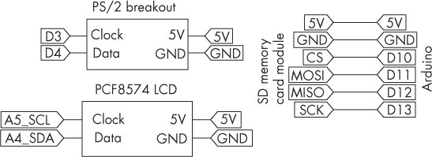

图 13-12：项目#40 的原理图

现在，输入并上传项目#40 的草图，然后将 SD 卡插入模块。当 LCD 提示时开始输入，如图 13-13 所示。

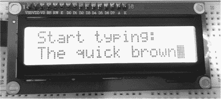

图 13-13：项目 #40 的 LCD 显示从键盘捕获的文本

当您继续输入时，光标应在第二行滚动，然后返回到第一行，方式与 图 13-14 所示相同。

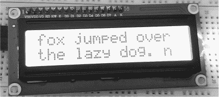

图 13-14：文本在 LCD 上滚动跨越两行

当您输入时，Arduino 应该自动将每 100 个字符保存到 SD 卡上的文件中。当您输入完毕并且想取出 SD 卡时，按下键盘上的 ESC 键。Arduino 应该保存剩余的字符，然后提示您取出 SD 卡，如 图 13-15 所示。

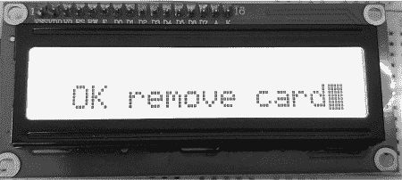

图 13-15：LCD 显示可以移除 SD 卡的消息

如果在任何尝试保存时 SD 卡出现问题，显示器应显示信息 SD card fail，如 图 13-16 所示。

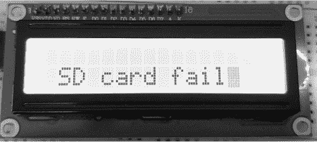

图 13-16：LCD 显示 SD 卡出现问题

在这种情况下，您的 SD 卡可能没有正确格式化，写保护开关可能被设置为开启，或者 SD 卡可能没有插入模块中。修复问题并取出 SD 卡后，您可以通过将 SD 卡插入 PC 来查看和编辑使用您的 PC 创建的文本文件。

让我们看看它是如何工作的：

```
// Project #40 - Text capture device

❶ char _text[100];
int _counter = 0;
int xPosition = 0;
int yPosition = 1;

#include <SD.h>
#include <LiquidCrystal_PCF8574.h>
#include <Wire.h>
LiquidCrystal_PCF8574 lcd(0x27);
#include <PS2Keyboard.h>
PS2Keyboard keyboard;

❷ void halt()
{
    do {} while (1);
}

❸ void saveText(boolean _halt)
{
    if (!SD.begin(10))
    {
        lcd.setCursor(1, 1);
        lcd.print("SD card fail");
        halt();
    }
  ❹ File dataFile = SD.open("WRITING.TXT", FILE_WRITE);
    if (dataFile)
    {
        // Save and clear array
        for (int i = 0; i < 100; i++)
        {
            dataFile.print(_text[i]);
            _text[i] = " ";
        }
        dataFile.close();
    }
  ❺ if (_halt == true)
    {
        File dataFile = SD.open("WRITING.TXT", FILE_WRITE);
        if (dataFile)
        {
            dataFile.println();
            dataFile.println("-------------------------");
            dataFile.close();
        }
        lcd.setCursor(1, 1);
        lcd.print("OK remove card");
        halt();
    }
}

void setup()
{
  ❻ Wire.begin();
    Wire.beginTransmission(0x27);
    lcd.begin(16, 2);
    lcd.setBacklight(255);
    lcd.blink();
    lcd.clear();
    lcd.home();
    lcd.print("Start typing:");
    lcd.setCursor(xPosition, yPosition);
    keyboard.begin(4, 3);
    pinMode(10, OUTPUT);
}

void loop()
{
  ❼ if (keyboard.available())
    {
        char c = keyboard.read();
        if (c == PS2_ENTER)
        {
          ❽ _text[_counter] = '\n';
            _counter = _counter + 1;
            xPosition = 0;
            if (yPosition == 0)
            {
                yPosition = 1;
            }
            else if (yPosition == 1)
            {
                yPosition = 0;
            }
            lcd.setCursor(xPosition, yPosition);
      }
        else if (c == PS2_ESC)
        {
            lcd.home();
            lcd.clear();
            saveText(true);
        }
        else
        {
            _text[_counter] = c;
          ❾ lcd.print(_text[_counter]);
            _counter = _counter + 1;
            if (_counter >= 99)
            {
              ❿ saveText(false);
                _counter = 0;
            }
            xPosition++;
            if (xPosition > 15)
            {
                xPosition = 0;
                if (yPosition == 0)
                {
                    yPosition = 1;
                }
                else if (yPosition == 1)
                {
                    yPosition = 0;
                }
                lcd.setCursor(xPosition, yPosition);
            }
        }
    }
} 
```

本草图基于 列表 13-3 构建，加入了写入 SD 卡的额外代码。首先，它声明了全局变量 ❶，包括用于在写入 SD 卡之前保存用户输入的 array_text[] 缓冲区，跟踪缓冲区中存储字符数的 _counter 变量，以及 LCD 上的光标位置。

接下来，程序包含并初始化 SD 卡模块、LCD 和键盘所需的库。自定义函数 halt() ❷ 用于停止程序的操作，并在文本保存到 SD 卡后调用，以便用户可以安全地移除 SD 卡。它仅在 do…while 函数中永久循环，因为 1 始终为真。

自定义函数 saveText(boolean _halt) ❸ 将数据保存到 SD 卡，具体是根据布尔参数 false 或 true 来决定是保存文本并返回用户输入，还是保存文本并结束操作。该函数会检查 SD 卡是否可用，如果出现问题，会停止并返回错误，具体如图 13-16 所示。如果没有错误，程序将打开此函数中设置的文件并向其写入数据；如果文件不存在，则会创建该文件 ❹。然后，程序会将文本缓冲区写入 SD 卡，并清空缓冲区，以准备接收更多数据。

如果参数 true 被传递给 saveText(boolean _halt) 函数 ❺，代码会打开 SD 卡上的文件，写入一行破折号来结束文本文件，然后关闭该文件并向用户指示，具体如图 13-15 所示。从 ❻ 开始，通常需要激活 I²C 总线、LCD 和键盘，并设置 D10 为 SD 卡模块 SPI 接口的输出。

然后，程序设置项目的主要操作：从键盘捕获文本，显示在 LCD 上，并将其写入 SD 卡。在 ❼ 处，程序准备接收来自 PS/2 键盘的按键。如果用户按下 ENTER，程序将在文本数组中插入一个换行符 | ❽，将数组的大小计数器增加 1，并根据需要将光标移动到 LCD 的另一行。如果用户按下 ESC，程序会清除 LCD，将数据保存到 SD 卡，并通过调用 saveText(true); 停止操作。所有其他按键都会作为普通文本插入到文本数组 ❾ 中，然后显示在 LCD 上，同时程序将大小计数器加 1。

然后，程序会检查文本数组的大小。如果数组的大小大于或等于 99 个字符，程序会通过调用 saveText(false); ❿ 将文本数组写入文本文件，写入后返回正常的文本捕获状态，并将计数器重置为 0。最后，程序会更新光标位置，检查文本是否超出边距，并在必要时重新定位光标。

作为最终挑战，你可以为第 40 号项目添加一个实时钟表，并在文件关闭时加上数据时间戳。

## 继续前进

许多项目的用户界面表现不佳；正如你在这一章中看到的，使用 PS/2 键盘简化了数据输入的过程。在这一章中，你学习了如何将键盘数据捕获到 Arduino 中，并如何保存键盘输入的数据。希望本章能为你改善自己项目的配置或操作提供一些灵感。

在下一章中，我将向你展示如何利用蓝牙模块，让智能手机与其他设备通过无线通信与 Arduino 项目进行连接。
