# 第十四章：14 通过蓝牙控制 Arduino


大多数现代智能手机、个人电脑或平板电脑可以通过蓝牙与其他设备无线通信。在本章中，你将使用廉价的蓝牙模块，并配合 Windows、Android 或 Apple 设备来控制你的 Arduino 项目。

你将学习如何：

+   使用电平转换板与串口蓝牙接口模块进行电压转换

+   将蓝牙模块与基于 Android、Apple 和 Windows 的设备配对

+   编辑串口蓝牙模块的参数

你还将通过蓝牙向 Arduino 项目发送和接收数据，然后使用 MIT App Inventor 构建自己的 Android 应用程序来远程控制你的项目。

## 蓝牙模块

市面上有许多类型的蓝牙模块。本章依赖于 HC-05 型蓝牙模块，例如 PMD Way 部件 590526，如图 14-1 所示。

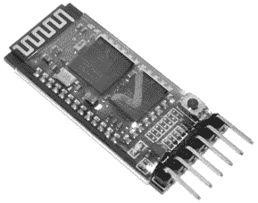

图 14-1：一个 HC-05 蓝牙模块

市面上其他模块，如 HC-06，不适用于本章中的示例和项目，因为它们只能发送数据，无法接收数据。这些模块使用 TX 和 RX 线进行串口通信，可以像往常一样与 SoftwareSerial 库一起使用。数据传输速率默认为 9,600 bps。稍后我会在本章中解释如何设置。

将模块物理连接到 Arduino 项目非常简单，这得益于模块末端的标准针脚间距，而且针脚通常会在模块背面标注。它们都使用 5V DC 电源供应。然而，通信针脚使用较低的逻辑电压 3.3V DC。将 5V 转换为 3.3V 的最佳方法是使用电平转换模块，我将在接下来讲解。

## 电平转换模块

许多设备的通信引脚设计为工作在 3.3V 电压下，而不是通常的 5V DC。这可能用于串口通信，比如蓝牙模块，或者当使用其他数据总线如 SPI 或 I²C 时。然而，这些引脚与 5V 设备（如 Arduino Uno 或兼容设备）不兼容，因此你需要使用电压转换板在 3.3V 和 5V 之间转换信号。

为此，你可以使用一个电平转换模块，例如 图 14-2 中所示的 PMD Way 部件 441079。


图 14-2：一个电平转换模块

大多数电平转换模块都包括内联针脚，您需要将其焊接到电路板上。不同的电平转换器有不同数量的通道；我们需要至少两个通道来连接蓝牙设备，一个用于串行 TX，另一个用于串行 RX。

所有电平转换器都需要连接到 5V 和 3.3V 电源才能工作。只需将低电压设备连接到电平转换器的 LV 通道端，然后将 Arduino 连接到匹配的 HV 通道端。我将在本章的项目中解释如何使用电平转换器。

在将蓝牙模块与 PC 或其他设备一起使用之前，您需要将蓝牙模块与该设备配对，方法与配对蓝牙耳机或扬声器相同。为了以后的参考，并在本章进行操作时，以下部分提供了与 Windows PC、Android 设备和 macOS 计算机配对模块的说明，您可以根据项目需要进行配对。请注意，当成功与这些设备中的任何一个配对时，蓝牙模块上的 LED 会慢慢闪烁。

### 与 Windows 设备配对

将蓝牙模块与 Windows 机器配对的步骤与其他蓝牙设备（如耳机或扬声器）相似。首先，确保模块已连接到 5V 和 GND 引脚以供电。一旦供电连接，模块上的 LED 将快速闪烁，表示模块与设备之间没有蓝牙连接。

在使用基于 Windows 的 PC 时，只需从设置中的“蓝牙和设备”页面搜索新的蓝牙设备。选择列表中的 HC-05 设备，系统会提示您输入 PIN 码。输入**1234**，点击**连接**，然后就可以开始使用了。

然后，您可以通过 COM 端口地址向蓝牙模块发送和接收数据。这些地址可以在 Windows 设备管理器中找到。

要继续，请跳到第 228 页的“通过蓝牙发送数据”部分。

### 与 macOS 设备配对

从 Apple 菜单打开“系统偏好设置”窗口，然后选择**蓝牙**。确保蓝牙已打开，这样计算机就会开始搜索附近的设备。

在连接选项中找到 HC-05 并点击**连接**。片刻之后，您应该会看到一个密码错误提示；这没关系。点击**选项**，输入 PIN 码**1234**，然后点击**连接**。

片刻之后，您的 Mac 应该会与蓝牙模块配对。

要继续，请跳到第 228 页的“通过蓝牙发送数据”部分。

### 与 Android 设备配对

将蓝牙模块与 Android 配对的步骤与任何其他蓝牙设备（如耳机或扬声器）的步骤相似。打开 Android 设备上的蓝牙，搜索新设备，然后点击**HC-05**的列表。系统会提示你输入 PIN 码，输入**1234**以配对模块。

现在你已经将模块与 Android 或计算机配对，我将向你展示如何通过蓝牙从 Arduino 发送数据。

## 通过蓝牙发送数据

蓝牙模块是一个串行设备，你可以使用 SoftwareSerial 库轻松地发送数据。让我们现在进行测试。

你将需要以下部件来完成这个项目：

+   一个 Arduino Uno 或兼容板和 USB 电缆

+   一个无焊面包板

+   一个电平转换模块

+   各种跳线

+   一个 HC-05 蓝牙模块

按照图 14-3 中的示意图组装电路。

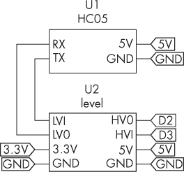

图 14-3：通过电平转换器将蓝牙模块连接到 Arduino 的原理图

现在输入并上传列表 14-1。

```
❶ #define PIN_BT_TX 3
#define PIN_BT_RX 2
#include <SoftwareSerial.h>
SoftwareSerial BT(PIN_BT_RX, PIN_BT_TX);
void setup()
{
    // Set the data rate for the SoftwareSerial port:
  ❷ BT.begin(9600);
    // Send test message to other device:
}

void loop()
{
    BT.print("millis = ");
    BT.println(millis());
    delay(500);
} 
```

列表 14-1：测试蓝牙输出

Sketch 操作很简单。由于蓝牙模块是串行数据设备，因此 Sketch 将其配置为使用在 D2 和 D3 引脚上定义的软件串行端口❶。接着，Sketch 启动软件串行端口❷，并使用 print() 和 println() 函数通过模块发送数据。当模块与另一设备建立数据连接时，LED 每五秒闪烁两次。

现在你需要选择一种接收通过蓝牙从 Arduino 发送的数据的方法。我将展示如何在 PC、macOS 计算机和 Android 设备上进行此操作。请根据你可用的平台按照说明操作。

### 连接 Windows 设备

要在支持蓝牙的 PC 上接收 Arduino 数据，你可以使用任何可以通过 COM: 端口进行通信的终端软件。在本章中，我建议使用 Roger Meier 开发的 CoolTerm 软件，可以从[*http://<wbr>freeware<wbr>.the<wbr>-meiers<wbr>.org*](http://freeware.the-meiers.org)下载。

安装 CoolTerm 后，使用“选项”菜单选择合适的 COM: 端口并点击**连接**。几秒钟后，来自 Arduino 的数据应当会滚动显示在窗口中，如图 14-4 所示。

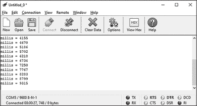

图 14-4：PC 终端上列表 14-1 的示例输出

现在你可以在 Windows 设备上接收 Arduino 数据，跳到项目 #41，开始使用此功能。

### 到 macOS 设备

要在支持蓝牙的 Mac 上接收数据，你可以使用任何能够通过 COM 端口进行通信的终端软件。在本章中，我建议使用由 Roger Meier 提供的 CoolTerm 软件，可以从[*http://<wbr>freeware<wbr>.the<wbr>-meiers<wbr>.org*](http://freeware.the-meiers.org)下载。

安装 CoolTerm 后，在尝试运行软件时，可能会出现 macOS 安全错误。为了解决这个问题，找到 CoolTerm 图标，右键点击并选择**打开**；你可能需要在 macOS 系统偏好设置的隐私与安全选项卡中点击**仍然打开**。之后，每次使用时，CoolTerm 都应该能够正常运行。

一旦解决了错误，来自 Arduino 的数据应开始在终端窗口中滚动，如图 14-5 所示。

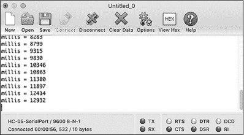

图 14-5：在 macOS 计算机上显示列表 14-1 的示例输出

接下来，进入项目 #41，开始使用此功能。

### 到 Android 设备

在你的 Android 设备上，找到 Google Play 商店中的 Bluetooth Terminal HC-05 应用并下载。安装并打开终端应用后，它应该会提示你选择已配对的蓝牙设备，选择**HC-05**。连接完成后，终端应用窗口应显示来自 Arduino 的millis()值。图 14-6 展示了这个过程。

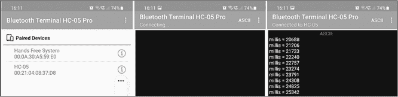

图 14-6：在 Android 设备上显示列表 14-1 的示例输出

现在你可以在 Android 设备上接收 Arduino 数据，继续进入项目 #41，开始使用此功能。

在接下来的项目中，你将使用你的新能力，在设备上查看来自 Arduino 的数据。

项目 #41：实时监控数据采集

在这个项目中，使用在第十章中介绍的 BMP180 温度和气压传感器，你将构建一个系统，通过你刚设置的 Arduino 和蓝牙模块来监控数据。如果你需要在移动中保持实时监控，可以使用智能手机进行此类数据采集，或者使用运行 CoolTerm 的 PC 进行记录和分析。如果你有这两种设备，也可以尝试同时使用。

你将需要以下部件来完成此项目：

+   一个 Arduino Uno 或兼容的开发板和 USB 线

+   一个无焊面包板

+   一个电平转换模块

+   各种跳线

+   一个 HC-05 蓝牙模块

+   一个 BMP180 温度和气压传感器板

接下来，按照图 14-7 所示组装电路。

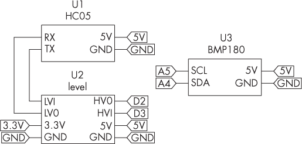

图 14-7：项目 #41 的原理图

现在输入并上传项目 #41 草图。接下来，在你的 Android 设备或 Windows 或 Mac 机器上打开终端应用，并按照上一节的说明连接到蓝牙模块。你应该开始看到显示的温度和气压，如图 14-8 所示。

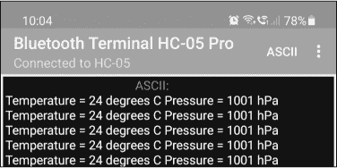

图 14-8：项目 #41 的示例输出

让我们看看这个是如何工作的：

```
// Project #41 - Capturing Data via Bluetooth

❶ #define PIN_BT_TX 3
#define PIN_BT_RX 2
#include <SoftwareSerial.h>
#include "Wire.h"
#include "Adafruit_BMP085.h"
SoftwareSerial BT(PIN_BT_RX, PIN_BT_TX);
Adafruit_BMP085 bmp;

❷ int temperature;
int pressure;

void setup()
{
    // Set the data rate for the SoftwareSerial port:
  ❸ BT.begin(9600);
    bmp.begin();
}

void loop()
{
  ❹ BT.print("Temperature = ");
    temperature = bmp.readTemperature();
    BT.print(temperature);
    BT.print(" degrees C");
    BT.print(" Pressure = ");
  ❺ BT.print(int(bmp.readPressure() / 100));
    BT.println(" hPa");
    delay(1000);
} 
```

这个草图结合了从 BMP180 读取数据、整齐地格式化数据并将其发送到蓝牙模块。草图包含并配置了所需的库 ❶，然后声明了两个变量 ❷ 来存储温度和气压数据。它启动了软件串行连接和 BMP180 传感器 ❸，并发送温度数据 ❹。来自 BMP180 的压力读数被从帕斯卡转换为百帕 ❺，然后也发送出去。

现在数据通过蓝牙发送，你可以使用 CoolTerm 软件将其捕获到文本文件中。如果你的设备已连接到项目，请断开连接，然后按照上一节的说明连接你的 macOS 或 Windows 电脑。打开 CoolTerm 并连接。数据应显示在终端窗口中，如图 14-9 所示。

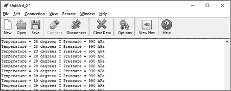

图 14-9：PC 上显示的示例输出

按下 CTRL-R 打开“捕获到文本文件”对话框，输入文件名，选择保存位置，然后点击**保存**。Arduino 的所有数据应该会写入文本文件中。完成后，按下 CTRL-SHIFT-R 停止并最终保存文本文件。

现在，你可以在像 Microsoft Excel 这样的电子表格软件中打开文本文件，如图 14-10 所示，在导入过程中使用空格作为分隔符。你的数据现在已经准备好进行分析。

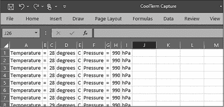

图 14-10：Excel 中捕获的数据

使用从 Arduino 发送的任何数据的便利性将取决于它如何格式化以进行传输。不过，现在你有了无线捕获任何 Arduino 项目生成的数据并将其转换为用户友好格式的选项。

此外，借助智能手机和终端应用或配备蓝牙的笔记本电脑，你可以创建一个步进式监控系统来监视各种设备，而无需花费资金构建本地数据的显示系统。只需将你的计算机或 Android 手机带入蓝牙 Arduino 项目的范围内并连接到该项目，即可监控数据读数。通过这种技术，你可以创建只自己知晓的安全数据传输，通过自己的设备监控数据，而不是让任何人都能看到显示内容。

在下一个项目中，你将学习如何通过创建一个蓝牙远程控制项目，将数据发送到 Arduino 和其他设备之间。

项目 #42：使用蓝牙进行数字 I/O 控制

像任何外部串口设备一样，蓝牙模块可以同时发送和接收数据，允许你将数据发送到 Arduino 用于各种目的。通过这个项目，你将制作一个简单的远程控制器，用于控制连接到四个数字引脚的 LED，这将为你自己的无线远程控制项目提供框架。

你将需要以下零件来完成此项目：

+   一块 Arduino Uno 或兼容板和 USB 数据线

+   一个无焊接面包板

+   一个电平转换模块

+   各种跳线

+   一个 HC-05 蓝牙模块

+   四个 LED

+   四个 1 kΩ、0.25 W、1% 的电阻器

按照 图 14-11 所示组装电路。完成此项目后，请保持电路组装好，因为接下来的项目中你将再次使用它。

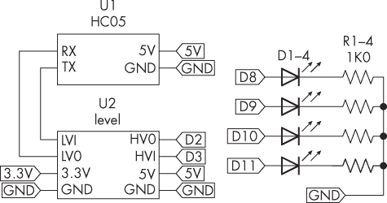

图 14-11：项目 #42 的原理图

输入并上传项目 #42 的草图，然后在你的 Android 设备或计算机上打开终端应用并连接到蓝牙模块。通过终端应用发送一个问号 (?)，Arduino 应该会快速响应一个控制概述。

你还可以发送 0、1、2 或 3 来分别开启数字引脚 D8 到 D11。要关闭它们，分别发送 4、5、6 或 7。每个命令发送后，Arduino 会返回确认信息。图 14-12 显示了在 Android 终端应用中输出的内容。

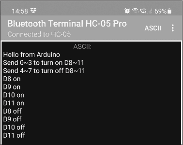

图 14-12：从安卓手机控制项目 #42

和之前的项目一样，你可以使用配备蓝牙的计算机进行相同的控制方法，如 图 14-13 所示。

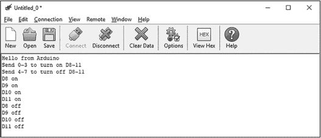

图 14-13：从 PC 控制项目 #42

让我们看看这是如何工作的：

```
// Project 42 - Digital I/O control with Android and Bluetooth

❶ #define PIN_BT_TX 3
#define PIN_BT_RX 2
#include <SoftwareSerial.h>
SoftwareSerial BT(PIN_BT_RX, PIN_BT_TX);
void sendHelp()
{
    BT.println("Send 0~3 to turn on D8~11");
    BT.println("Send 4~7 to turn off D8~11");
}

void setup()
{
    // Set digital pin to control as an output:
  ❷ DDRB = B111111;
    // Set the data rate for the SoftwareSerial port:
 ❸ BT.begin(9600);
    // Send test message to other device:
    BT.println("Hello from Arduino");
}

void loop()
{
  ❹ char a; // Stores incoming character from other device
    if (BT.available())
    {
      ❺ a = (BT.read());
        if (a == '0') {digitalWrite(8, HIGH); BT.println("D8 on");   }
        if (a == '1') {digitalWrite(9, HIGH); BT.println("D9 on");   }
        if (a == '2') {digitalWrite(10, HIGH); BT.println("D10 on");}
        if (a == '3') {digitalWrite(11, HIGH); BT.println("D11 on");}
        if (a == '4') {digitalWrite(8, LOW); BT.println("D8 off");   }
        if (a == '5') {digitalWrite(9, LOW); BT.println("D9 off");   }
        if (a == '6') {digitalWrite(10, LOW); BT.println("D10 off");}
        if (a == '7') {digitalWrite(11, LOW); BT.println("D11 off");}
      ❻ if (a == '?') {sendHelp();}
    }
} 
```

蓝牙模块的软件串口首先进行设置 ❶。自定义函数 sendHelp() 在用户发送问号给 Arduino 时发送指令。草图设置了 D13 到 D8 的数字输出引脚为输出 ❷，并启动软件串口连接 ❸。它还声明了一个字符变量，用于存储从蓝牙接收到的命令 ❹。

当从蓝牙模块接收到一个字符时，它会被存储到字符变量 a 中 ❺；一系列的 if 函数将字符转换为所需的操作。除了打开或关闭数字引脚，还会发送一条消息确认命令已执行。如果 Arduino 收到一个问号，草图会调用 sendHelp() 函数 ❻，该函数告诉用户如何操作项目。

你可以在自己未来的工作中使用本项目的远程控制框架，通过使用 Android 手机或计算机上的蓝牙而不是控制面板，将控制保持在公众视野之外。你还可以修改本项目，以控制 第八章 中描述的继电器板，具体见项目 #26。

你现在将创建自己的智能手机应用来控制这个项目，以提高其用户友好性。

项目 #43：使用 Android 应用进行蓝牙控制

用 Android 设备上的终端应用控制 Arduino 的数字输出对你来说很简单，作为创建者。然而，当其他人需要控制输出时，定制的 Android 智能手机应用更为理想，因为它可以防止最终用户发生误操作。为了避免从零开始编写这样的应用代码，在本项目中，我将向你展示如何使用免费的 MIT App Inventor —— 由 Google 和麻省理工学院提供的在线服务 —— 创建你自己的 Android 应用来控制项目 #42 中的硬件。

> 注意

*你可以在 Windows、macOS 或 Linux 上使用 MIT App Inventor 网站，但生成的应用仅能在 Android 设备上运行。*

图 14-14 显示了完整应用界面的样式，展示了连接 Android 手机或平板电脑到项目的蓝牙按钮，并且可以打开或关闭 Arduino 的 D8 到 D11 的数字输出。

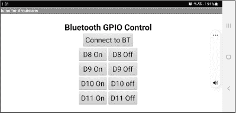

图 14-14：完成的 Android 应用，控制项目 #42

构建自己的应用程序过程分为两个主要阶段。第一阶段涉及应用程序的设计，例如按钮和文本在显示屏上的位置。第二阶段则是确定应用程序在响应用户输入或与硬件交互时执行的操作。使用 MIT App Inventor，每个阶段都包括将项目拖放到适当位置以构建应用界面和操作指令的过程。我将向你展示如何导航这个过程来创建你的应用。

该项目的硬件与项目#42 相同。设置完该项目的电路后，请访问 MIT App Inventor 网站：[*https://<wbr>appinventor<wbr>.mit<wbr>.edu*](https://appinventor.mit.edu)。点击首页顶部的**创建应用**按钮。一个新窗口应该会弹出，要求你使用 Google 账户登录。如果没有 Google 账户，你需要先创建一个。

一旦登录并同意服务条款后，欢迎屏幕应该会出现。点击**开始一个空白项目**并在提示时输入项目名称。我把它命名为 Project42，但你可以选择任何你喜欢的名字。这也将是你稍后下载到 Android 设备上的应用名称。请注意，你可以像使用其他编辑器一样，通过屏幕顶部的“项目”菜单保存和加载进度。

现在你的屏幕应该像图 14-15 中的那样，显示一个空白的手机屏幕和各种菜单。

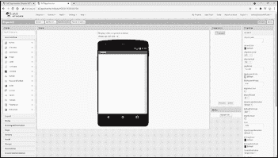

图 14-15：控制项目#42 的 Android 应用

你将从上到下开始构建界面，从标题文本开始。显示屏的左侧是调色板。点击**用户界面**，它会显示各种界面选项。将鼠标指针悬停在**标签**上，然后点击并将其拖动到手机显示屏中，如图 14-16 所示。

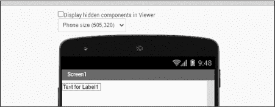

图 14-16：构建标签

要编辑标签，点击手机右侧组件窗口中的**Label1**条目。这将允许你使用屏幕右侧的属性窗口编辑标签的属性，如图 14-17 所示。

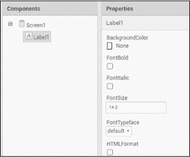

图 14-17：标签属性

打开**FontBold**，将字体大小设置为**28**，并在文本框中输入**Bluetooth GPIO Control**。这些更改应该立即生效，并反映在屏幕中央的手机显示中，如图 14-18 所示。

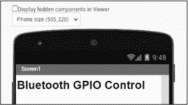

图 14-18：完成的标签

请注意，当你向手机显示屏中添加一个项目时，它会出现在右侧的组件列表中。点击该列表中的项目，你可以在最右侧的属性框中编辑其属性。稍后你会用到这个功能。

接下来，你将开始将按钮添加到应用程序中。第一个按钮将激活手机上的蓝牙连接菜单。为了添加这个按钮，从网页左侧的用户界面列表中点击并拖动**ListPicker**到手机显示屏中。然后点击组件列表中的**ListPicker**，并在右侧编辑其属性。将文本字段更改为**Connect to BT**。此时你的按钮应该与图 14-19 中显示的按钮类似。

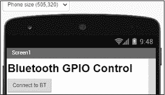

图 14-19：完成的按钮

现在是时候确保所有内容在显示屏中居中。点击组件列表中的**Screen1**，并将 AlignHorizontal 设置更改为**Center**。显示屏上的项目现在应该已经居中对齐，如图 14-20 所示。

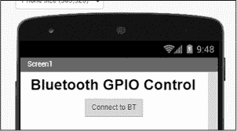

图 14-20：项目现在居中显示。

接下来，你将创建一个由八个按钮组成的表格，每个按钮控制一个数字输出引脚的开关。点击调色板中的**Layout**列表，然后将**TableArrangement**拖动到显示屏中。这将在连接按钮下方留下一个框，如图 14-21 所示。同时将 TableArrangement 属性中的行数改为四。

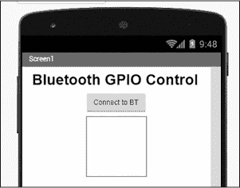

图 14-21：表格已经插入。

现在来处理按钮：从左侧的用户界面列表中点击并拖动八个按钮到手机显示屏中的灰色表格中。借助 TableArrangement，你可以轻松地将它们排列成四行两列，如图 14-22 所示。

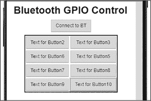

图 14-22：正在操作按钮

点击组件列表中的**Button2**，并将文本更改为**D8 On**。逐个修改其他七个按钮的文本属性，直到它们与图 14-23 中的按钮一致。

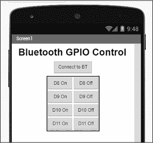

图 14-23：按钮已经完成。

为了使按钮在后续的应用开发步骤中更易于操作，请在组件窗口中重命名按钮：依次点击每个按钮，点击 **重命名**，并将按钮的名称更改为其功能。例如，将 Button2 的名称更改为 **D8 On**，如图 14-24 所示。

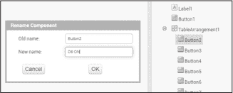

图 14-24：编辑按钮引用

接下来，我们需要添加蓝牙引用。这是应用和手机蓝牙硬件之间的虚拟链接。在调色板中点击 **连接性** 标签，将 **BluetoothClient** 拖动到主窗口，并将其放置在手机上方。蓝牙图标应出现在手机下方，如图 14-25 所示。

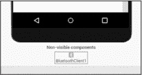

图 14-25：蓝牙已添加到应用设计中

最后，你可以通过编辑组件菜单中的 Screen1 项来编辑应用顶部的文本，或者删除它。要将应用名称更改为更有用或更有趣的名称，请编辑属性窗口底部出现的标题字段，或者如果不想显示应用的标题，请取消选中 **TitleVisible** 选项框。

到目前为止，你已经在设计器窗口中创建了应用的设计和界面。现在，你将开始应用设计的第二阶段：确定应用在用户交互时将执行的操作。首先，点击显示界面右上角的 **块** 按钮，如图 14-26 所示。


图 14-26：切换到块编辑器

在 MIT App Inventor 中，设计器界面用于构建应用的用户界面，而块页面则用于构建定义应用工作方式的代码。你可以使用块编辑器页面，通过拖放各种“块”来形成指令序列或基于用户输入的活动，而不需要编写代码。每个块代表一种指令类型、一个函数或一项活动。你可以通过在 **设计器** 和 **块** 按钮之间切换，来在这两个设计界面之间移动。

现在，我将向你展示如何创建所需的块结构，以实现应用的操作。在块编辑器页面中，点击 **ListPicker1**，在块菜单中将出现一系列块，其中一些会在图 14-27 中显示。

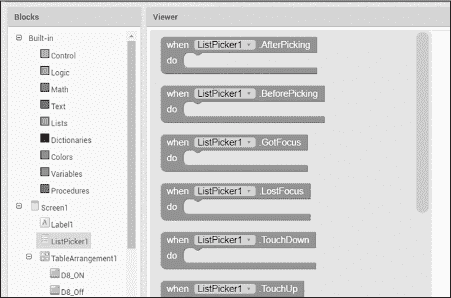

图 14-27：各种代码块

从左侧的**Blocks**菜单中拖放**when ListPicker1 BeforePicking**块到查看窗口。再次点击 Blocks 菜单中的**ListPicker1**，然后将**set ListPicker1 elements to**块拖放到前一步中的**when**块中。它应该会点击到**when**块中。

在这个过程中，若要删除不需要的块，只需将其拖动到查看窗口右下角的垃圾桶图标上。

接下来，点击 Blocks 菜单中的**BluetoothClient1**项目，并将**BluetoothClient1 AddressesAndNames**项目拖到并点击到最后添加的项目。

你现在需要创建一组指令来连接到用户所选的蓝牙设备。将块拼接在一起，你可以在 Blocks 菜单中的 Control 部分找到**if then**块。

现在你需要为每个按钮配置操作。为了与项目#42 控制 LED 的方式一致，你希望应用程序发送 0 到 3 来依次打开 D8 到 D11，并发送 4 到 7 来关闭它们。点击**D8**按钮，在 Blocks 菜单中的 TableArrangement1 列表里，然后将**when D8_On.click**块拖放到查看窗口中。

从 BluetoothClient1 列表中拖放**call BluetoothClient1.SendText text**块到**when**块中。

要完成按钮操作组，点击 Blocks 菜单中的**Math**项目，然后将第一个块（仅包含一个 0）拖入**text**旁边的凹槽中。

这一组块会在用户按下按钮 D8 时激活；这将通过蓝牙发送文本字符 0。

你需要创建另外七个这样的组，确保总共创建八个，以匹配按钮。为了节省时间，你可以右键点击一个组中的第一个块并选择**Duplicate**来重复你正在编辑的组。其他组必须引用不同的按钮。点击**D8_ON**，应该会显示所有可用按钮的下拉列表，如图 14-28 所示。

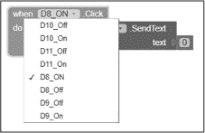

图 14-28：按钮组选择

确保你已在每个八个按钮组中更改了设置，使其与八个按钮匹配，并随后更改其发送的文本字符的值。也就是说，按下 D8 关闭时应发送 4，按下 D9 开启时应发送 1，依此类推。你只需点击每个组中的 0 并输入新的值。完成后，你的屏幕应与图 14-29 中显示的内容相似。

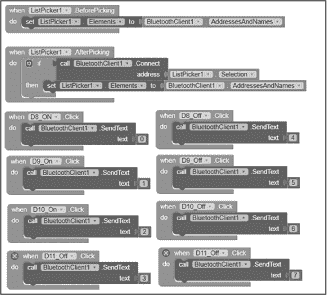

图 14-29：完成的控制块组

您的应用现在已完成，并准备安装到 Android 手机或平板上。使用项目菜单保存您的项目（以防以后需要更改），然后在构建菜单中选择**Android 应用（.apk）**。App Inventor 将编译指令，经过一两分钟后，提供下载按钮和二维码，如图 14-30 所示。

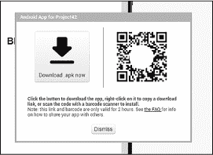

图 14-30：下载您的应用！

然后，您可以下载并保存应用的*.apk*文件，将其加载到您的设备上，或者直接使用设备的摄像头扫描二维码。出现提示时，访问从图像中解码的 URL 并按照下载和安装提示操作。点击**是**或**同意**，接受 Android 可能弹出的任何对话框。

最终，您的应用应该会弹出。将其拖到主屏幕上，如图 14-31 所示。

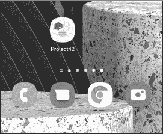

图 14-31：您的应用已安装在手机上

恭喜！您已经制作了一个 Android 应用。现在进行测试：确保您的第 42 号项目硬件正确连接，然后打开应用。开启设备的蓝牙功能，点击应用中的**连接到 BT**按钮。您应该会看到一份已配对蓝牙设备的列表。选择 HC-05 设备，应用将返回到主页面。

现在，您应该能够按下每个按钮来打开或关闭 Arduino 上的数字输出引脚，LED 灯将反映 Arduino 的状态。如果应用无法正常工作，首先返回第 42 号项目，确保硬件可以通过终端应用或支持蓝牙的 PC 控制。如果还是不行，检查 App Inventor 中的应用设置。您还可以在书籍网页上的可下载文件中，下载*项目#43*文件夹中的 AI 项目文件，[*https://<wbr>nostarch<wbr>.com<wbr>/arduino<wbr>-arduinians*](https://nostarch.com/arduino-arduinians)。

这个简单的示例展示了如何使用 Android App Inventor 创建具有专业用户界面的远程控制项目。如果您愿意，可以花更多时间在 App Inventor 上进行实验。我相信您会自己想出一些有趣的使用案例。

让我们通过修改蓝牙模块学习另一种保持项目用户友好的方式。

## 更新模块名称和 PIN

现在你已经构建了一个 Android 应用，最后一步是更新模块的名称和 PIN/密码以增强安全性，因为每个设备通常从工厂出厂时 PIN 为 1234。为了实现这一点，你必须将模块的操作模式更改为 AT 命令模式，这样你就可以发送 AT 命令来更新和查看各种参数（就像你在 Arduino 的蜂窝模块上所做的那样）。

要切换到 AT 命令模式，将模块按 图 14-3 所示连接到 Arduino，然后将 3.3 V 接到蓝牙模块的 EN 引脚。此额外连接仅在修改参数时需要——正常使用时，请移除或断开此连接。

接下来，输入并上传 Listing 14-2 中的代码，它可以实现 Arduino 串口监视器与蓝牙模块之间的通信。

```
#define PIN_BT_TX 3
#define PIN_BT_RX 2
#include <SoftwareSerial.h>
❶ SoftwareSerial BT(PIN_BT_RX, PIN_BT_TX);

void setup()
{
  ❷ BT.begin(38400);
  ❸ Serial.begin(9600);
}

void loop()
{
    if (BT.available())
        Serial.write(BT.read());
    if (Serial.available())
        BT.write(Serial.read());
} 
```

Listing 14-2: 配置 HC-05 蓝牙模块

这段代码首先建立了 Arduino 和蓝牙模块之间的串口连接 ❶。蓝牙模块在 AT 模式下的串口速度设置为 38,400 波特率 ❷。PC 与 Arduino 之间的串口连接保持在 9,600 波特率 ❸。模块的 LED 应该缓慢闪烁，表示 AT 命令模式正在工作。

打开串口监视器，并确保在速度旁边的菜单中选择了 NL（表示“新行”）和 CR（表示“回车”）。输入 **AT** 并按 **发送**。蓝牙模块应在串口监视器中回复 OK。如果没有回复，请仔细检查线路连接，并确保 LED 正在缓慢闪烁。

就像网络设备一样，每个蓝牙模块都有一个唯一的媒体访问控制（MAC）地址。在串口监视器中发送 AT+ADDR?，它应返回模块的 MAC 地址。

我的设备返回的 MAC 地址是 00:21:06:08:30:BF。要更改四位数的配对 PIN，发送 AT+PSWD =xxxx，其中 xxxx 是新的四位 PIN，例如 8675。然后，你可以通过在蓝牙菜单中忘记该设备并重新搜索它来测试新的 PIN。

要将蓝牙名称从 HC-05 更改为更具描述性的名称，请发送 AT+NAME =NewName，其中 NewName 是您希望模块在操作时传输的名称。例如，如果您正在构建一个使用继电器在车库中操作设备的项目，您可以通过发送 AT+NAME =GarageRelay 将其名称更改为 GarageRelay。新名称应该会在配对时出现在设备的蓝牙屏幕上，如图 14-32 所示。

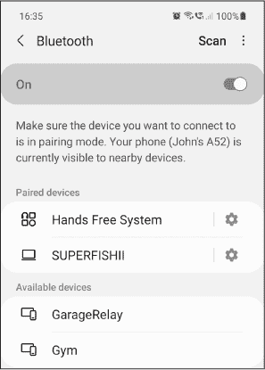

图 14-32：更改模块名称的结果

当在同一地区处理多个蓝牙设备项目时，更改模块名称非常有用，这样可以轻松地跟踪您希望配对的设备。如果您希望将模块的名称和 PIN 重置为 HC-05 和 1234，请发送 AT + ORGL 来恢复出厂默认设置。您可能会在项目临时使用或者将模块转交给他人时执行此操作。

## 继续前进

在本章中，您学习了几种将串行蓝牙模块与 Arduino 项目结合使用的方法。您现在可以使用蓝牙进行无线遥控，捕获 Arduino 数据并通过蓝牙传输到计算机，以及为 Android 设备构建自己的遥控应用程序。在未来，您可以将这些技能应用于许多领域，例如遥控继电器板、在难以触及的地方记录传感器数据，或者制作定制的遥控圣诞灯。

在下一章中，您将学习如何减少 Arduino 的功耗。
