# 第十五章：15 便携项目的能效


基于 Arduino 的项目通常由交流电适配器或 USB 电源供电，而不太考虑功耗。然而，对于便携式项目来说，减少能量消耗以延长电池寿命非常重要，从而获得更长的运行时间。这包括便携游戏或没有外部电源的传感器和数据记录项目。

本章介绍了提高你 Arduino 项目电源效率的各种方法。你将学习如何：

+   测量你的 Arduino 项目的功耗

+   估算项目电池寿命

+   通过软件和硬件方法减少 Arduino 功耗

+   构建低功耗的数据记录设备

你还将学习一些与 Arduino 配合使用的有用工具和方法，如适用于 DS3231 型时钟 IC 模块的 Arduino 库、声音传感器模块以及用于将程序上传到 Arduino 板和兼容电路的 USBasp 设备。

## 电学基本原理

便携项目通常都以某种形式由电池供电。你使用的电量越少，项目在电池充电或更换之间的持续时间就越长。本章旨在教你多种方法，以使你的项目在没有有线电源的情况下能更长时间运行。在继续之前，让我们回顾一些基本的电学原理，确保你具备测量功耗和确定电池寿命的概念基础，便于后续章节的学习。

简单来说，*电力*是一种我们可以利用并转化为热能、光能、运动和功率的能量形式。电力有三个主要特性：电流、电压和功率。

**电流**

电能通过电路的流动被称为*电流*。电流从电源的正极流向负极，例如从电池的正极到负极。这被称为*直流 (DC)*。在本书中，我们不会涉及*交流电 (AC)*。

在一些电路中，负极称为*接地 (GND)*。电流以*安培 (A)*为单位测量，也叫做*安*。较小的电流以*毫安 (mA)*为单位测量，1,000 毫安等于 1 安培。

**电压**

*电压*是电路正负端之间潜在能量差的度量。它以*伏特 (V)*为单位进行测量。电压越大，电流通过电路的速度就越快。

**功率**

*功率*是电气设备将能量从一种形式转换为另一种形式的速率的度量。功率以*瓦特 (W)*为单位进行测量。例如，100 瓦的白炽灯比 60 瓦的灯更亮，因为更高瓦数的灯泡将更多的电能转化为光能。

电压、电流和功率之间存在简单的数学关系：

功率 (*W*) = 电压 (*V*) × 电流 (*A*)

您将在本章稍后的计算中使用此公式。接下来，我将向您介绍功耗的类型及如何测量这些功率。

## 测量功耗

确定您的 Arduino 项目在特定时刻使用多少功率的方法取决于电源如何连接到您的 Arduino。为了计算本章后面示例和项目中的功耗，您需要能够选择一种适合当前项目的功率测量方法。在本节中，我将向您展示各种测量 Arduino 项目功耗的方法。

### USB 电源

如果您的项目通过 USB 电源供电，最简单的测量功耗的方法是使用诸如 USB Doctor 这样的在线设备，如图 15-1 所示。USB Doctor 是一个小型设备，可以测量通过 USB 电缆传输的电压和电流。

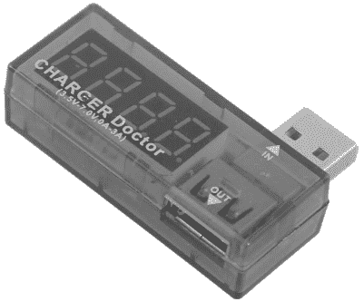

图 15-1：USB Doctor，一种在线电源测量设备

USB Doctor 设备在线连接在 Arduino 与电源（例如 PC、墙壁适配器或电池组）之间，它会在数字显示屏上交替显示当前使用的电流和电压。主要关注的值是电流，因为您将使用它来计算电池寿命。

### 有线电源

如果一个项目有*有线功耗*，那意味着它通过 Arduino 的 DC 插座或直接连接到电路板上的 5V 和 GND 引脚来连接电源。要测量此类项目的功耗，可以使用具有电流设置的万用表。

与测量电压不同，测量电流需要电源通过电流插孔进入万用表，并通过 COM 插孔退出。要快速确定您的万用表是否具有此功能（大多数都有），请检查它是否有标有 mA 或 A 的插孔。

例如，考虑图 15-2 中的万用表。从最左边的万用表开始，依次使用 A mA 和 COM 插孔；10A 和 COM 插孔；20A 和 COM 插孔；以及 10A mA 和 COM 插孔。

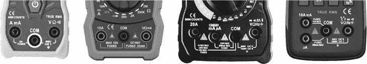

图 15-2：具有电流测量能力的万用表

如果你看到 A 型插座和 mA 型插座，首先使用安培（A）插座。如果显示的值在毫安（mA）设置范围内，你可以改用那个插座和范围来获得更精确的测量。

别忘了将万用表设置为与你使用的插座相匹配的电流模式。如果有疑问，请查看万用表的说明书。一旦将万用表设置为电流范围，探针需要连接到电源电路中。

如果你使用的是直流插座电源，测量的简单方法是使用一对直流端子连接器，例如 PMD Way 部件 116101M 和 116101F，图示见图 15-3。然后，你可以在两个单元之间接入电线，并用你的表笔进行测量。如果万用表返回负值，交换表笔以改变极性。

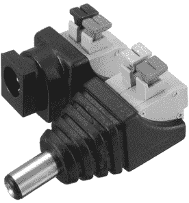

图 15-3：直流端子连接器

然而，如果你直接连接到 Arduino 的 5V 和 GND 引脚，你可以很容易地在电源正端和 Arduino 的 5V 引脚之间进行探测。

## Arduino 电源消耗

现在你已经了解了可用的测量工具类型，我将给你一个关于消耗的基准概念。我们来看看我用万用表从标准的 Arduino Uno R3 板上测量的电流消耗值，板上 D13 LED 已开启。然后你可以跟着做，确定你自己项目的电流消耗。

表 15-1 列出了以毫安为单位的电流及用于为 Arduino 提供电力的电源。当你使用前面描述的方法测量你自己项目的电流消耗时，根据你使用的 Arduino 或兼容板的品牌，测量值可能会与你的略有不同。

表 15-1： 不同供电电压下的 Arduino 电流消耗

| 电源 | 电流消耗（毫安） |
| --- | --- |
| 12 V 通过直流插座 | 47.9 |
| 9 V 通过直流插座 | 47.9 |
| 5 V 通过 5V 引脚或 USB 插座 | 44.5 |
| 4.8 V 通过 5V 引脚 | 42.5 |

请记住，这些数值仅适用于 Arduino 本身。无论你在项目中添加什么，都将增加电流消耗。我在这个示例中测量的是 4.8V 下的电流，因为这是使用四个 AA 充电电池（它们是 1.2V，而不是 1.5V）或四个几乎耗尽寿命的 AA 一次性电池时常见的电压。

Arduino 可以在这些较低的电压下正常工作。然而，如果你使用微控制器的内置 ADC 来测量模拟信号，你需要考虑降低的工作电压，因为 ADC 的参考电压假设为 5V，而不是实际的工作电压。相反，使用外部参考电压引脚和analogReference()函数。如果你不熟悉这个过程，你可以在《Arduino 工作坊》第二版的第四章中学习更多。

现在你对 Arduino 在没有任何外部部件情况下的常规功耗有所了解，我将向你展示如何根据电池容量和项目电流消耗来估算电池寿命。

## 估算电池寿命

要确定你项目的电池寿命，你需要确定项目在一段时间内（以毫安时为单位）消耗的电流。首先，测量你的项目从连接的电源吸取的电流。一旦你得到了电流消耗值，例如 65 mA，你的项目应该在一小时内消耗这个电流。这样，你的消耗就是毫安时（mAh）。然后，你可以认为消耗是 65 mAh。

如果 Arduino 激活外部设备，例如电机或伺服电机，别忘了考虑额外的电流消耗。例如，如果你的项目每小时运行 1 分钟的电机，测量电机开启和关闭时的电流，然后确定一小时内总共消耗的电流。例如，如果项目以恒定速度运行电机 10 分钟，电流测量为 100 mA，而项目运行了 50 分钟，电流为 60 mAh，那么消耗量为 100 mA × (10 / 60 分钟) + 60 mA × (50 / 60 分钟) = 66.6 mAh。

接下来，考虑你的项目使用的电池类型。例如，如果你有一个 20 Ah（安培时，通常标示为 20,000 mAh）的 USB 电池银行，如图 15-4 所示，你的项目应该能持续大约 300 小时，因为 20,000 / 66.6 = 300.3003。如果你的电池的额定值是 Ah，将该值乘以 1000 即可转换为 mAh。

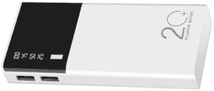

图 15-4：典型的 USB 电池银行

有些电池组在电流消耗不足时会关闭，以节省电能。选择那些具有常开模式的电池组，这样它们就不会在 Arduino 的功耗降到非常低时自动关闭。

除了电池组，另一种常见且简单的为便携项目供电的方法是使用镍氢 (NiMH) AA 可充电电池，通常是四颗一组。这提供了 4.8 V DC 的电压，同样可以很好地为 Arduino 供电。你可以使用四节 AA 电池座来固定这些电池，如图 Figure 15-5 所示，然后将电池座直接接线到 Arduino 的 5V 和 GND 引脚。

每个 NiMH 电池应标明其容量，如 2000 mAh。使用四颗全新并充满电的电池，在 66.6 mA 的功耗下，你的项目大约可以运行 30 小时。

如果你只能使用一次性 AA 电池，可以将一个像常见的 1N4001 二极管串联在电池组的正极和 Arduino 的 5V 引脚之间。阳极连接到电池组的正极输出，阴极连接到 Arduino 的 5V 引脚。这样应该能将新电池组的电压从约 6 V DC 降到约 5.3 V DC，这是 Arduino 可以正常使用的电压。

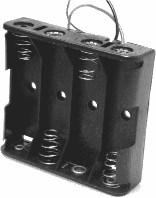

Figure 15-5：四节 AA 电池座

像 NiMH 可充电电池和一次性电池这样的电池在整个生命周期内并不提供恒定的电压——相反，电压会在放电周期的末期下降。为了让事情更复杂，一次性电池的使用寿命可能会根据每次所用的电流量有所不同。例如，图 Figure 15-6 显示了从 Energizer 品牌的碱性 AA 电池放出的电流越多，其可用容量就越小。

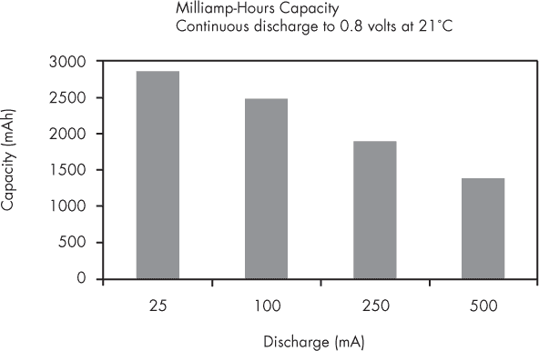

Figure 15-6：一次性 Energizer 品牌碱性 AA 电池的容量与放电率关系图

为了获得最准确的电池寿命估算，找到并查看你感兴趣的电池类型的数据表。这些数据表提供了放电率图、不同温度下的表现以及更多有趣的信息，帮助你做出明智的决策。

现在你已经知道如何测量项目的功耗，并能在多种便携电源选项中做出选择，我将解释一些减少功耗的方法。你将在接下来的项目中运用这些方法。

## 基于软件的方法来减少功耗

要在你的 Arduino 上使用低功耗功能，你需要安装一个库。打开 IDE 的库管理器并搜索 **low-power rocket**，然后安装 Rocket Scream Electronics 提供的 Low-Power 库，如 图 15-7 所示。


图 15-7：低功耗库安装

在接下来的部分中，我将向你展示两种使用该库来减少功耗的方法。你将首先在以下作业中练习编程电源关闭/唤醒模式，然后继续测试中断唤醒模式。本章中的示例和项目使用的是 Arduino Uno 或兼容的 ATmega328 微控制器板。

### 电源关闭/唤醒周期模式

电源关闭/唤醒周期模式在你需要让 Arduino 定期执行某个任务，并在任务完成后停止耗电时非常有用——例如，唤醒并检查某个状态，或记录数据然后返回休眠状态。要使用此模式，请在你的草图中包含以下库：

```
#include "LowPower.h" 
```

你可以使用此函数通过 ADC_OFF 和 BOD_OFF 参数来关闭 ADC 和微控制器的欠压检测，如下所示。当你希望 Arduino 在启用所有省电功能的情况下进入睡眠状态时，请在你的草图中使用以下函数：

```
LowPower.powerDown (SLEEP_8S, ADC_OFF, BOD_OFF); 
```

该函数有几个参数，第一个是空闲的持续时间。在这个示例中，我将持续时间设置为八秒，使用了 SLEEP_8S。然而，你也可以使用其他延迟选项之一：

SLEEP_15MS    15 毫秒

SLEEP_30MS    30 毫秒

SLEEP_60MS    60 毫秒

SLEEP_120MS    120 毫秒

SLEEP_250MS    250 毫秒

SLEEP_500MS    500 毫秒

SLEEP_1S    1 秒

SLEEP_2S    2 秒

SLEEP_4S    4 秒

SLEEP_8S    8 秒

以下简单的草图使用此函数使 Arduino 休眠 8 秒，然后重复再次休眠，然后以满功率运行 16 秒。这让你能够快速检查在满功率和省电模式下的功耗，使用万用表进行测量。

将你的 Arduino Uno 连接到 PC，并上传列表 15-1。上传完成后，如前面章节所述，连接你的 USB 电源监视器或万用表，以观察功耗变化。

```
❶ #include "LowPower.h"

void setup() {}

void loop()
{
    // Idle for 16 seconds
  ❷ LowPower.powerDown(SLEEP_8S, ADC_OFF, BOD_OFF);
    LowPower.powerDown(SLEEP_8S, ADC_OFF, BOD_OFF);
    // Operate at normal power for 16 seconds
  ❸ delay(16000);
} 
```

列表 15-1：测试断电/唤醒周期模式

草图包含了库❶，然后运行空闲函数两次，所有参数设置为OFF，并有八秒的延迟❷。接下来，草图引入另一个延迟，在此期间，Arduino 以全功率运行❸。

如果你测量这个电路的电流，功耗应该从全功率下的大约 42 mA 下降到省电模式下的大约 30 mA，功耗下降约 12 mA。这意味着，当你的项目处于省电模式时，功耗减少了 28%。

我在这个例子中引用这些数值为“大约 42 mA”等等，因为实际功耗会在引用的数值上下波动 1 到 2 mA，具体取决于你使用的 Arduino 或兼容板的品牌。它也可能因你使用的测试设备不同而有所变化。为了简化，我使用了整数和平均功耗。

在实际示例中使用省电功能之前，我将介绍一个方便的库用于 DS3231 实时钟 IC，后续项目中你将会使用到它。

### DS3231 实时钟库

DS3231 实时钟模块提供了一种方便且准确的方式来追踪时间和日期信息，尽管使用它们确实需要编写大量代码。在本节中，我将向你展示如何通过使用 DS3231 库以更简单的方式读写时间和日期数据。

首先，打开 Arduino IDE，进入库管理器，搜索**Andrew Wickert 的 DS3231**库。

将实时钟模块连接到你的 Arduino Uno，如图 15-8 所示，然后使用 USB 线将 Uno 连接到 PC。

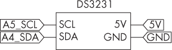

图 15-8：DS3231 与 Arduino Uno 之间的连接

接下来，输入但不要上传列表 15-2。

```
❶ #include <DS3231.h>
#include <Wire.h>

DS3231 RTCmodule;

❷ bool century = false;
bool h12Flag = false;
bool pmFlag = false;
int hh, mm, ss, dd, dow, mo, yy;

void setTime()
{
  ❸ RTCmodule.setClockMode(false); // Set to 24-hour time
    RTCmodule.setYear(`22`);
    RTCmodule.setMonth(`1`);
    RTCmodule.setDate(`28`);
    RTCmodule.setDoW(`6`); // Sunday = 1
    RTCmodule.setHour(`14`);
    RTCmodule.setMinute(`5`);
    RTCmodule.setSecond(`30`);
}

void showTime()
{
    // Get data from RTC.
  ❹ dd = RTCmodule.getDate();
    dow = RTCmodule.getDoW();
    mo = RTCmodule.getMonth(century);
    yy = RTCmodule.getYear();
    hh = RTCmodule.getHour(h12Flag, pmFlag);
    mm = RTCmodule.getMinute();
    ss = RTCmodule.getSecond();

 // Send information to Serial Monitor
  ❺ switch(dow)
    {
        case 1: Serial.print("Sunday "); break;
        case 2: Serial.print("Monday "); break;
        case 3: Serial.print("Tuesday "); break;
        case 4: Serial.print("Wednesday "); break;
        case 5: Serial.print("Thursday "); break;
        case 6: Serial.print("Friday "); break;
        case 7: Serial.print("Saturday "); break;
    }
    Serial.print(dd, DEC);
    Serial.print("/");
    Serial.print(mo, DEC);
    Serial.print("/");
    Serial.print(yy, DEC);
    Serial.print(" | ");
    Serial.print(hh, DEC);
    Serial.print(":");
    if (mm < 10) // Check for leading 0 on minutes
    {
        Serial.print("0");
    }
    Serial.print(mm, DEC);
    Serial.print(":");
    if (ss < 10) // Check for leading 0 on seconds
    {
        Serial.print("0");
    }
    Serial.println(ss, DEC);
}

void setup()
{
    Serial.begin(9600);
    Wire.begin();
  ❻ // setTime();
}

void loop()
{
    showTime();
    delay(1000);
} 
```

列表 15-2：测试 DS3231 库

该草图包含并初始化了所需的库 ❶，然后声明了所需的全局变量 ❷。这些变量用于存储 RTC 数据和设置。setTime() 函数用于设置时间和日期到 RTC。该草图使用 false ❸ 表示 24 小时制，但你也可以输入 true 来使用 12 小时制。否则，输入时间和日期数据时使用一位或两位数字格式。setDoW 的值代表星期几的数字，1 表示星期日，7 表示星期六。  

为了从 RTC 获取数据并在串口监视器上显示，showTime() 函数依次将 RTC 中的数据存入变量 ❹，然后开始在串口监视器上显示这些数据 ❺，首先使用 switch…case 函数来显示星期几。  

通过取消注释 ❻ 处的函数并更新 setTime() 函数中的数据，以匹配你上传草图时的当前时间和日期来设置时间。上传草图后，再次注释掉这一行，以免每次重置 Arduino 时都重置时间。  

最后，… 常规的时钟显示。串口监视器将输出你当前的时间和日期。  

在接下来的项目中，你将使用 DS3231 库。  

项目 #44：创建低功耗周期性数据记录器

在这个项目中，你将创建一个数据记录器，它每分钟左右将温度、湿度以及时间和日期记录到 SD 卡中。在这些时间段之间，Arduino 将进入空闲模式以节省电源。这种类型的项目适用于长期数据记录，例如，记录一季或几个月的天气数据。  

对于此项目，你将需要以下硬件：  

+   一块 Arduino Uno 或兼容的开发板和 USB 数据线  

+   一块免焊面包板  

+   各种跳线  

+   一块 BMP180 温度和气压传感器模块  

+   一块 DS3231 实时时钟模块  

+   一块 SD 或 microSD 卡模块和匹配的内存卡  

按照 图 15-9 中的示意图组装电路。  

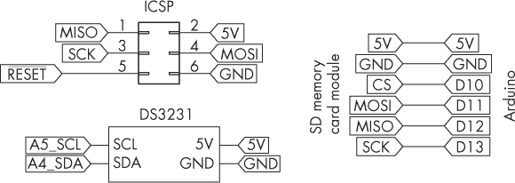  

图 15-9：项目 #44 的电路原理图  

接下来，输入并上传以下草图：  

```
// Project #44 - Periodic low-power data logging

❶ #include <SD.h>
#include <LowPower.h>
#include <DS3231.h>
#include <Wire.h>
#include <Adafruit_BMP085.h>

Adafruit_BMP085 bmp;
DS3231 RTCmodule;

❷ bool century = false;
bool h12Flag = false;
bool pmFlag = false;

int hh, mm, ss, dd, mo, yy, temperature, pressure;

void setup()
{
    delay(3000); // Allow time for SD card to be inserted
    Serial.begin(9600);
  ❸ Serial.println("Initializing SD card…");
    pinMode(10, OUTPUT);
    // Check that the memory card exists and is usable:
    if (!SD.begin(10))
    {
        Serial.println("Card failed, or not present");
        // Stop sketch
        return;
    }
    Serial.println("memory card is ready");
    Wire.begin();
    bmp.begin();
}

void setTime()
{
    // Set to 24-hour time
    RTCmodule.setClockMode(false);
    RTCmodule.setYear(`2022`);
    RTCmodule.setMonth(`1`);
    RTCmodule.setDate(`11`);
    RTCmodule.setHour(`17`);
    RTCmodule.setMinute(`11`);
    RTCmodule.setSecond(`8`);
}

void logData()
{
    // Create the file for writing:
    File dataFile = SD.open("DATA.TXT", FILE_WRITE);
    // If the file is ready, write to it:
    if (dataFile)
    {
        // Get data from RTC:
        dd = RTCmodule.getDate();
        mo = RTCmodule.getMonth(century);
        yy = RTCmodule.getYear();
 hh = RTCmodule.getHour(h12Flag, pmFlag);
        mm = RTCmodule.getMinute();
        ss = RTCmodule.getSecond();
        // Write time and date to SD card:
        dataFile.print(dd, DEC);
        dataFile.print("/");
        dataFile.print(mo, DEC);
        dataFile.print("/");
        dataFile.print(yy, DEC);
        dataFile.print(" | ");
        dataFile.print(hh, DEC);
        dataFile.print(":");
        if (mm < 10) // Check for leading 0 on minutes
        {
            dataFile.print("0");
        }
        dataFile.print(mm, DEC);
        dataFile.print(":");
        if (ss < 10) // Check for leading 0 on seconds
        {
            dataFile.print("0");
        }
        dataFile.print(ss, DEC);
        dataFile.print(" | ");

        // Write temperature data:
        temperature = bmp.readTemperature();
        pressure = int(bmp.readPressure() / 100);
        dataFile.print(temperature, DEC);
        dataFile.print(" C - ");
        dataFile.print(pressure, DEC);
        dataFile.println(" hPa");
        dataFile.close();
    }
}

void loop()
{
  ❹ // setTime(); // Used to set time in RTC if necessary
    for (int snooze = 0; snooze<8; snooze++)
    // Idle for 64 seconds
    {
      ❺ LowPower.powerDown(SLEEP_8S, ADC_OFF, BOD_OFF);
    }
    logData();
} 
```

一如既往，草图包含并初始化了所需的库 ❶，并声明了用于存储 RTC 数据和设置的全局变量 ❷。它初始化并测试了 SD 存储卡读取器 ❸，然后使用 setTime() 函数将时间和日期设置到 RTC 中。如同 Listing 15-2 所示，草图使用 false 来表示 24 小时制，但你可以将其更改为 true 来使用 12 小时制。务必在 RTCmodule 函数中替换为当前你所在位置的时间。

logData() 函数在调用时会将日期、时间、温度和压力写入 SD 存储卡。通过取消注释❹处的函数来设置 DS3231 中的时间和日期，以便你在 setTime() 函数中所做的更改生效。上传草图后，再次注释这一行，以避免每次 Arduino 重启时时间被重置。

最后，for 循环将执行 8 秒关机操作 8 次，总计 64 秒；然后 Arduino 会醒来并记录数据 ❺。此时，草图会再次循环，将 Arduino 置于关机状态。

图 15-10 展示了输出文本文件的示例。你的日期和时间当然会有所不同。

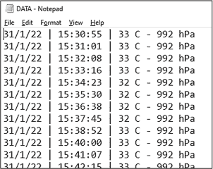

图 15-10：项目#44 的示例输出

如果你测量这个电路的电流，功率全开时消耗应为大约 51 mA，而当项目关闭电源时，消耗大约降至 38 mA。在 Arduino 写入数据到 SD 卡时，消耗会出现短暂的跳跃。撇开这一点不谈，整个项目的功率消耗大约减少了 10 mA。（Arduino 本身的功率消耗减少，但不会影响其连接的设备。）

这可能看起来节省不多，但考虑到在关机模式下，这相当于节省了 20%的功耗，而关机模式占据了 97%到 98%的工作时间。此外，当你从电池供电时，任何节省都是值得的。

## 中断唤醒模式

还有一种基于软件的节能方式：中断唤醒模式。使用这种模式会让 Arduino 进入睡眠状态，直到触发中断，导致 Arduino 醒来并继续运行草图。完成必要任务后，它会再次进入睡眠状态，等待另一个中断。

> 注意

*有关中断的更多信息，请查看《Arduino 工作坊》第二版的第七章。*

要使用此模式，在草图中包含以下代码行来引用库：

```
#include "LowPower.h" 
```

由于每个 Arduino 中断都会调用一个函数，因此你需要定义一个函数以使草图能够编译。然而，由于在中断触发时不需要调用任何特定代码，可以将该函数留空：

```
void wakeUp() {} 
```

你还必须在void setup()中将硬件中断引脚声明为输入，使用 D2 或 D3 引脚。

在草图的主部分，使用以下代码附加中断：

```
attachInterrupt(pinNumber, interruptFunction, `mode`); 
```

将pinNumber替换为 0 以连接到数字引脚 D2，或者替换为 1 以连接到数字引脚 D3。

在attachInterrupt()函数中，将mode替换为以下四种中断类型之一：

LOW    没有电流施加到中断引脚。

CHANGE    电流发生变化，无论是从打开到关闭，还是从关闭到打开。

RISING    电流从关闭变为打开，电压为 5V。

FALLING    电流从 5V 的打开状态变为关闭状态。

Arduino 中断函数需要一个在中断触发后调用的函数，但直接从附加到中断的函数中运行代码会导致递归循环。为了避免这种情况，我们使用一个空白的（也叫做*占位*）自定义函数——即一个没有任何代码的函数。例如，你可以使用以下代码：

```
void interruptFunction() {} 
```

接下来，当你想让 Arduino 进入睡眠状态时，使用以下代码行：

```
LowPower.powerDown(SLEEP_FOREVER, ADC_OFF, BOD_OFF); 
```

在中断触发 Arduino 唤醒后，使用以下函数将中断从数字引脚分离：

```
detachInterrupt(0); 
```

接下来，运行代码或调用所需的函数进行操作。此操作完成后，Arduino 将返回睡眠状态。

我将在以下简单示例中演示这一点，其中 D2 引脚的信号从 HIGH 变为 LOW，Arduino 的板载 LED 闪烁一次，然后 Arduino 返回睡眠状态。将你的 Arduino Uno 连接到 PC，从 5V 引脚跳线连接到 D2 引脚，并上传清单 15-3。连接你的 USB 功率监视器或万用表观察功耗变化。

```
❶ #include <LowPower.h>

❷ void interruptFunction(){}

void setup()
{
    ❸ pinMode(2, INPUT);
    ❹ pinMode(13, OUTPUT); // For demo LED
}

void loop()
{
    // start using interrupt pin
  ❺ attachInterrupt(0, interruptFunction, FALLING);

    // Enter power down state with ADC and BOD module disabled.
    // Wake up when D2 is low.
  ❻ LowPower.powerDown(SLEEP_FOREVER, ADC_OFF, BOD_OFF);

    // Disable external pin interrupt on wake up pin
    // Not using interrupt anymore
  ❼ detachInterrupt(0);

    // Do something here when interrupt triggered
  ❽ digitalWrite(13, HIGH);
    delay(1000);
    digitalWrite(13, LOW);
} 
```

清单 15-3：在中断模式下唤醒

草图包含了低功耗库❶，接着是一个空的函数，正如中断函数❷所要求的。然后，它将用于中断的数字引脚设置为输入❸，并配置了 Arduino 的内建 LED❹。

程序还将中断类型❺配置到 D2 引脚，并定义空白中断函数和触发中断的事件类型。在这种情况下，事件类型为FALLING，意味着 D2 引脚的信号从 5V 变化为 0V。

一旦中断被配置，程序就会让 Arduino 进入休眠状态❻。在中断被触发之前，什么也不会发生，直到 Arduino 进入全功率模式。这时，程序会禁用中断，以避免在程序其余部分运行时再次触发中断❼。

在此时，程序会打开和关闭板载 LED，演示 Arduino 正常运行❽，但如果你愿意，也可以在这里替换为其他功能。一旦代码执行完毕，void loop()会返回到起始位置，重新激活中断❺，并将 Arduino 重新置于休眠状态❻。

你可以通过将跳线从 5V 引脚移除到 D2 来测试这个项目，这将触发中断并将 Arduino 恢复到全功率模式。然后恢复跳线，LED 激活并关闭后，Arduino 应该会重新进入休眠模式。在这个例子中，功耗从 Arduino 唤醒时约 42 mA 降到休眠模式时的 28 mA，减少了大约 59%。

在下一个项目中，你将使用这种技术进行更严肃的应用，通过记录由声音传感器检测到的噪声事件。

## 廉价的声音传感器

当你构建一个必须检测响声的项目时，可以使用可调声音级传感器，例如 PMD Way 部件 596692，如图 15-11 所示。

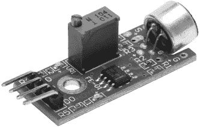

图 15-11：一个可调声音传感器

这些传感器可以在大多数零售商处找到，具有两种输出类型：模拟和数字。在下面的项目中，你将使用该传感器的数字模式。将 5V 和 GND 分别连接到传感器的+和−（或 G）引脚时，当环境声音达到某一水平时，数字输出（DO）引脚会发送 5V 信号。当声音达到阈值时，LED 会亮起，你可以使用传感器上的可调电位器来调整此阈值。

项目#45：记录中断触发

本项目的目标是记录声音事件的日期和时间，例如嘈杂的邻居或周围环境中的强烈震动。它使用声音传感器模块触发中断，将 Arduino 从低功耗模式唤醒，记录日期和时间到 SD 卡中，然后再次让 Arduino 休眠，直到下一个事件。如果你不想记录声音事件，你可以使用任何具有数字输出的传感器或开关。

对于这个项目，你将需要以下硬件：

+   一个 Arduino Uno 或兼容板以及 USB 数据线

+   一个无焊接面包板

+   各种跳线

+   一个声音传感器模块

+   一个 DS3231 实时时钟模块

+   一个 SD 或 microSD 卡模块和匹配的存储卡

按照 图 15-12 中的示意图组装电路。

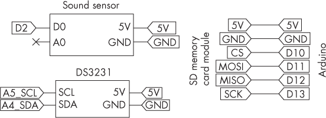

图 15-12：项目 #45 的电路原理图

接下来，输入并上传以下草图：

```
// Project #45 - Interrupt-triggered logging with reduced power consumption

#include <SD.h>
#include <LowPower.h>
#include <DS3231.h>
#include <Wire.h>
DS3231 RTCmodule;

bool century = false;
bool h12Flag = false;
bool pmFlag = false;

int hh, mm, ss, dd, mo, yy;

void setup()
{
    delay(3000); // Allow time for SD card to be inserted:
    Serial.begin(9600);
    Serial.println("Initializing SD card…");
    pinMode(10, OUTPUT);
    // Check that the memory card exists and is usable:
    if (!SD.begin(10))
    {
        Serial.println("Card failed, or not present.");
        // Stop sketch
        return;
    }
 Serial.println("Memory card is ready!");
    Wire.begin();
    pinMode(13, OUTPUT);
}

void interruptFunction() {}

void setTimeData()
// Use once to set the time and date in the RTC module:
{
    RTCmodule.setClockMode(false); // Set to 24-hour time
    RTCmodule.setYear(2022);
    RTCmodule.setMonth(1);
    RTCmodule.setDate(11);
    RTCmodule.setDoW(2);
    RTCmodule.setHour(17);
    RTCmodule.setMinute(11);
    RTCmodule.setSecond(8);
}

void logData()
{
    // Create the file for writing:
    File dataFile = SD.open("DATA.TXT", FILE_WRITE);
    // If the file is ready, write to it:
    if (dataFile)
    {
        // Get data from RTC:
        dd = RTCmodule.getDate();
        mo = RTCmodule.getMonth(century);
        yy = RTCmodule.getYear();
        hh = RTCmodule.getHour(h12Flag, pmFlag);
        mm = RTCmodule.getMinute();
        ss = RTCmodule.getSecond();

        // Write time and date to SD card:
        dataFile.print(dd, DEC);
        dataFile.print("/");
        dataFile.print(mo, DEC);
        dataFile.print("/");
        dataFile.print(yy, DEC);
        dataFile.print(" | ");
        dataFile.print(hh, DEC);
        dataFile.print(":");
        if (mm < 10) // Check for leading 0 on minutes
        {
            dataFile.print("0");
        }
        dataFile.print(mm, DEC);
        dataFile.print(":");
        if (ss < 10) // Check for leading 0 on seconds
        {
            dataFile.print("0");
        }
 dataFile.print(ss, DEC);
        dataFile.println(".");
        // Close the file once the system has finished with it
        dataFile.close();
    }

}

void loop()
{
  ❶ attachInterrupt(0, interruptFunction, RISING);
  ❷ LowPower.powerDown(SLEEP_FOREVER, ADC_OFF, BOD_OFF);
  ❸ detachInterrupt(0);
  ❹ logData();
} 
```

到现在为止，你应该理解了这个草图中的初始代码，这些代码用于设置低功耗库、实时时钟和 SD 存储卡。代码的最后几行配置了中断为 RISING ❶，因此当 Arduino 的 D2 引脚的电压从 0 V 升高到 5 V（声音传感器的数字输出）时，草图会告诉 Arduino 关闭电源 ❷。一旦传感器被触发，草图就会取消低功耗模式并禁用中断 ❸，以防止递归中断。最后，草图将声音事件的时间和日期记录到 SD 卡 ❹，然后草图会再次激活中断 ❶ 并关闭 Arduino 的电源，为下一轮做准备 ❷。

该项目的功耗大约是当 Arduino 处于休眠状态时为 28 mA，而在项目向 SD 卡记录数据的短暂期间，功耗大约为 60 mA。这意味着该项目在休眠模式下节省了约 50% 的功耗。

## 基于硬件的方法来减少功耗

你还可以通过对 Arduino 进行硬件修改来减少功耗。Arduino 开发平台最初设计时考虑到了易用性。虽然标准的 Arduino Uno 型电路很好地实现了这个目的，但更高级的用户可以通过移除许多对于许多项目来说不必要的组件来提高功效。

如果以下部分的元件在你的项目中不会被使用，可以将其移除：

+   四个 LED（电源、D13、TX 和 RX）

+   用于板载 5 V 和 3.3 V 电源的线性电压调节器电路（如果你用 5 V DC 给 Arduino 供电）

+   一个比较器电路，用于决定是否使用 USB 或 DC 插座电源（如果你用 5 V DC 给 Arduino 供电）

+   一个 USB 到串口接口的微控制器和电路

+   如果不需要，可以移除重置按钮

如果你准备制作自己的 Arduino 兼容电路并提供合适的电源，那么让你的项目比标准的 Arduino Uno 消耗更少的能量是很容易的。为了演示这一点，我将向你展示如何制作两种版本的极简主义 Arduino 兼容电路，一种在 5 V 下工作，另一种在 3.3 V 下工作。你可以在无焊接的面包板或原型板上构建这些电路，然后围绕它们构建项目。

要构建这些项目，你首先需要知道如何使用 ICSP 引脚（而非 USB 接口）将程序上传到 Arduino 和极简电路。

## 使用 ICSP 引脚上传程序

到目前为止，你很可能一直在使用 Arduino 或兼容板上的 USB 连接上传程序。然而，你可以通过使用内电路串行编程器（ICSP）连接到微控制器来减少电路的使用，从而使你的项目更节能。

ICSP 是你 Arduino 板右侧的六针连接器，如图 15-13 所示。在不上传程序时，你还可以将其作为连接 SPI 数据总线的另一种方式。

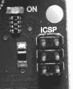

图 15-13: Arduino Uno 上的 ICSP 接头引脚

这六个引脚按固定的配置排列，如图 15-14 所示。

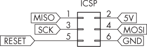

图 15-14: ICSP 接头引脚布局

引脚 1 通常在 PCB 上标记为数字 1 或靠近左上角引脚的小点，正如你在图 15-13 中看到的那样。要将程序上传到电路中，你需要一个外部编程器，它连接到这些引脚，称为 USBasp 设备。这些开源设备由 Thomas Fischl 创建，仅在与 Windows 系统的 PC 一起使用时才需要 USB 驱动程序。除了帮助你降低功耗外，USBasp 还允许你在 Arduino Uno 或兼容板的 USB 接口损坏或被破坏的情况下上传程序。

> 注意

*如果你有兴趣在没有 Arduino 环境的情况下编程 AVR 微控制器，USBasp 也很有用，正如我在我的书《AVR 工作坊》(No Starch Press, 2022)中所描述的那样。*

USBasp 在外观上有所不同，但功能相同。图 15-15 展示了两个例子。图中上方的编程器是来自供应商 PMD Way 的通用设备，位于书中的配件清单上，而下方的编程器则来自澳大利亚的 Freetronics。

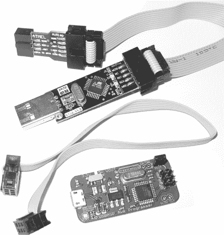

图 15-15: USBasp 编程器示例

在购买 USBasp 编程器时，确保购买带有 6 针（而非 10 针）排线的型号。Windows 用户应咨询供应商，了解如何安装编程器。Linux 和 Mac 用户只需将其插入 USB 插口，USBasp 很快就能准备好使用。

快速测试你的 USBasp，确保它工作正常，然后再继续构建下一节中你将搭建的简约电路。首先将它连接到你的 Arduino Uno 或兼容板，如图 15-16 所示。

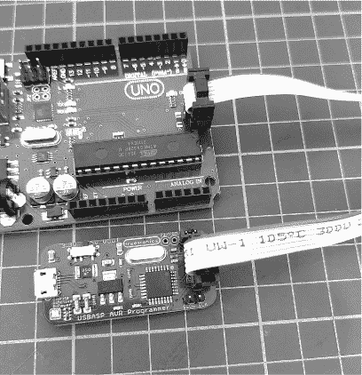

图 15-16：USBasp 编程器连接到 Arduino Uno

USBasp 为 Arduino 提供电源，因此你不需要连接其他电源。接下来，通过附带的 USB 数据线将 USBasp 连接到你的 PCB。打开 Arduino IDE 中的 Blink 示例程序，然后选择 **工具**  **编程器**  **USBasp**。

最后，要上传程序，选择 **程序**  **通过编程器上传**。

代码应该上传完成，板载 LED 应该按预期闪烁，确认你的 USBasp 工作正常。如果是这样，你就准备好构建一个简约的低功耗 5 V Arduino 电路了。

项目 #46：构建一个简约的 5 V Arduino 电路

在这个项目中，你将构建一个尽可能简约的 Arduino 兼容电路，能够以大约 5 V DC 的电压运行。你可以在此模板的基础上扩展，构建你未来的低功耗 Arduino 兼容项目。

你需要以下硬件：

+   一个 USBasp 编程器和匹配的 USB 数据线

+   一个无焊接面包板

+   各种跳线

+   一个 ATmega328P-PU 微控制器

+   一个 0.1 µF 聚酯电容器（C1）

+   两个 22 pF 陶瓷电容（C2，C3）

+   一个 16 MHz 的 HC49S 晶体

+   一个 ICSP 面包板适配器

+   一个 560 Ω，0.25 W，1% 的电阻

+   一个 LED

按照图 15-17 所示的电路进行组装。尽量将晶体、C2 和 C3 放得尽可能靠近微控制器。

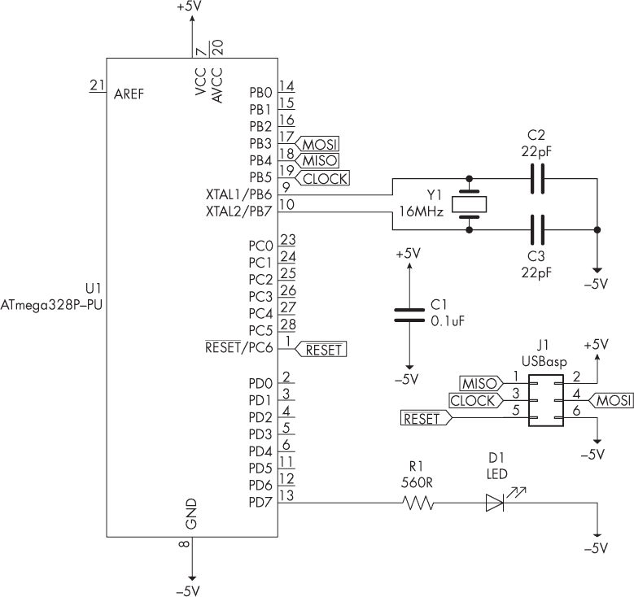

图 15-17：项目 #46 的原理图

现在上传以下代码：

```
// Project #46 - Blink LED on D7

void setup()
{
    pinMode(7, OUTPUT);
}
void loop()
{
    digitalWrite(7, HIGH);
    delay(1000);
 digitalWrite(7, LOW);
    delay(1000);
} 
```

连接到微控制器第 13 引脚的 LED 应该按预期每秒闪烁一次，开与关交替。你现在已经有了一个工作正常的简约 Arduino 电路示例，可以用于实验；如果你想将其永久纳入项目中，可以将其焊接到条形板或自定义的 PCB 上。电阻和 LED 仅用于演示目的，因此如果未来的项目中不需要它们，当然可以将其去除。

这个电路的目的是减少功耗。在去除 LED 和电阻后，我测得电流大约为 22 mA，比标准的 Uno 板要好得多，后者通常需要大约 44 mA。

这是一个很好的开始，但你可以通过前面章节中学到的基于软件的方法进一步降低功耗。你需要一台能够测量微安级电流的万用表来测量项目运行时的功耗。当我将这个电路与 Listing 15-1 中的 Power Down/Wake Periodic 模式草图配对使用时，当 Arduino 关闭电源时，电流大约为 3 μA（微安，每个微安等于 1,000 毫安）。在使用这个电路试验 Listing 15-3 时，也返回了大约 3 μA 的测量值。结合硬件和软件方法的电池供电项目可以持续非常长的时间。

对于将来使用这种简约电路的项目，你需要知道微控制器的哪个引脚与 Arduino 草图中的哪个引脚相关联，因为 Arduino 板上的引脚编号与微控制器上的引脚编号并不匹配。正常的 Arduino 板上的所有模拟、数字及其他引脚在面包板版本中也可用；你只需直接连接到微控制器。

R2 和 LED2 在你的面包板 Arduino 的数字引脚 13 上。表 15-2 列出了左侧为 Arduino 引脚，右侧为匹配的 ATmega328P-PU 引脚。

表 15-2： ATmega328P-PU 引脚

| Arduino 引脚名称 | ATmega328P-PU 引脚 |
| --- | --- |
| RST | 1 |
| RX/D0 | 2 |
| TX/D1 | 3 |
| D2 | 4 |
| D3 | 5 |
| D4 | 6 |
| (仅 5V) | 7 |
| GND | 8 |
| D5 | 11 |
| D6 | 12 |
| D7 | 13 |
| D8 | 14 |
| D9 | 15 |
| D10 | 16 |
| D11 | 17 |
| D12 | 18 |
| D13 | 19 |
| (仅限 5 V) | 20 |
| AREF | 21 |
| GND | 22 |
| A0 | 23 |
| A1 | 24 |
| A2 | 25 |
| A3 | 26 |
| A4 | 27 |
| A5 | 28 |

为避免混淆，像 Freetronics 这样的零售商提供可粘贴标签，可以贴在微控制器上，如图 15-18 所示（访问 Freetronics 首页并搜索 *labels*）。

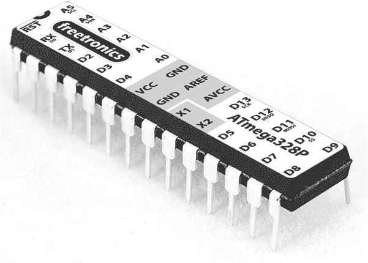

图 15-18：Arduino 引脚标签，适用于快速原型制作

使用这些标签是确保在匆忙时不会搞错引脚布局的好方法。

## 继续前进

在本章中，你学习了如何测量你的 Arduino 使用多少电量，以及如何使用各种硬件和软件方法来最小化功耗，从而使得电池供电的项目比原本可以持续的时间更长。你还学习了如何使用一些新的传感器和定时模块，以及 USBasp 编程器。你现在可以创建一些可以长时间从电池中获取电力的项目，例如在远程地区监测季节性天气数据，或者在没有市电的区域检测附近的运动。

在下一章中，我将向你展示如何使用汽车的 CAN 数据总线将你的汽车与 Arduino 连接，以监控和记录车辆引擎数据等信息。
