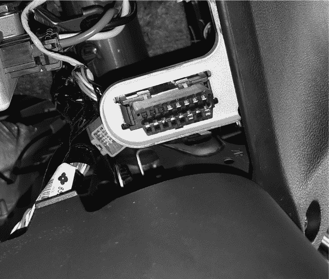
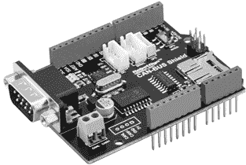
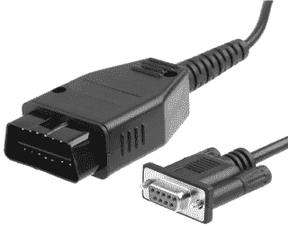
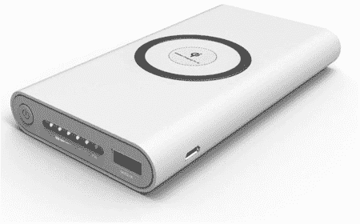
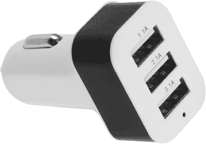
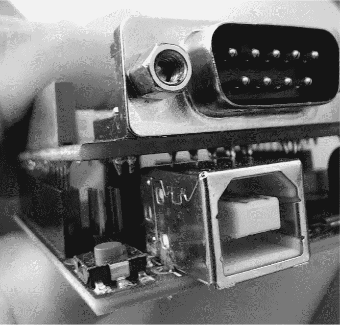
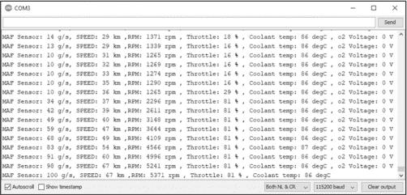
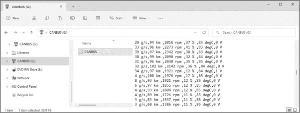
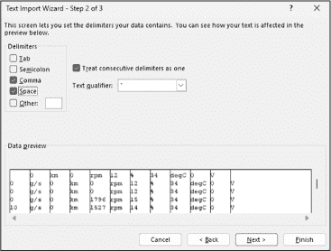
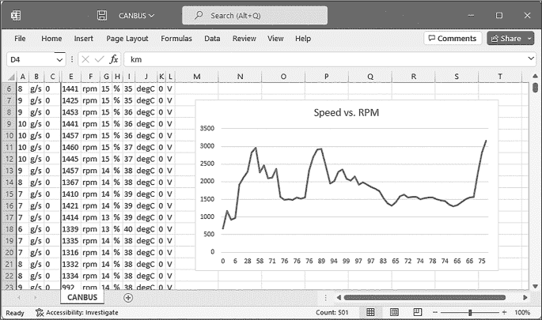

# 第十六章：16 通过 CAN 总线监控汽车电子设备


汽车使用复杂的电子网络来监控操作并控制各种功能，包括发动机管理、温度测量以及窗户和锁的控制。这些电子设备通过*控制器局域网络数据总线（CAN 总线）*相互通信。

在本章中，你将学习如何将 Arduino 与 CAN 总线接口，监控来自某些汽车电子设备的数据。你将设置并测试 Arduino 与 CAN 总线的数据连接，然后监控并记录实时的发动机统计数据以便后续分析。

## CAN 总线

你可能熟悉 SPI 和 I²C 数据总线。CAN 总线是一种用于将发动机管理计算机与现代汽车中其他设备连接的数据总线。它减少了设备之间的物理布线，并允许你将外部设备（如计算机、扫描工具或 Arduino）连接到汽车进行操作监控。

例如，汽车的发动机管理计算机会读取发动机和制动系统中的传感器数据。通过 CAN 总线，它会将速度、发动机转速、温度和其他数据广播到控制仪表盘显示的计算机系统。当你按下遥控器上的按钮锁车门时，无线电数据收发器接收到遥控器的信号，然后通过 CAN 总线指示中央锁定控制单元锁住所有车门。

用于 CAN 总线通信的协议称为*车载诊断 II（OBDII）*，这是 OBD 协议的第二代。你可以使用 Arduino 和匹配的 CAN 总线扩展板与总线进行通信，以查看汽车统计数据。

在进一步操作之前，如果你打算制作本章的项目，请检查你的汽车是否具备 CAN 总线和 OBDII 连接器，因为一些较老的汽车可能没有。为此，你可以在车内仪表盘下方查看连接器的位置；例如，我的三菱欧蓝德运动版/ASX 的连接器位于踏板上方，如图 16-1 所示。如果你最初找不到 OBDII 连接器，你可能需要查阅制造商提供的手册或维修手册。



图 16-1：OBDII 连接器插槽

当你准备将电缆连接到 OBDII 连接器时，一只手稳稳地握住插槽，另一只手将插头插入。插槽通常没有太多支撑，如果不小心，可能会破坏支架。

## 所需的 CAN 总线硬件

本章的项目需要一个 Arduino 扩展板，如 图 16-2 所示的 PMD Way 部件 13479987。无论选择哪个扩展板，它必须使用 Microchip MCP2515 CAN 控制器和 MCP2551 CAN 收发器芯片。



图 16-2: 一款 Arduino 用的 CAN 总线扩展板

接下来，你需要一根适配的电缆，将车辆的 OBDII 端口与扩展板上的九针插口连接，例如 图 16-3 所示的 PMD Way 部件 717211。



图 16-3: 一根 OBDII 到扩展板的电缆

最后，你需要一种方式为 Arduino 提供电源。如果你没有一台电池续航足够支持一个小时左右使用的笔记本电脑，考虑购买一个 USB 电源银行，如 图 16-4 所示。



图 16-4: 一款 USB 电源银行

你也可以使用 USB 电缆和汽车 USB 适配器为你的项目供电，如 图 16-5 所示。



图 16-5: 一款汽车 USB 电源适配器

OBDII 连接可能因品牌和车型不同而有所差异，因此在购买本章所需硬件之前，建议查阅爱好者论坛，获取更多关于你车辆的信息。例如，三菱车主可以访问 [*https://<wbr>www<wbr>.mitsubishi<wbr>-forums<wbr>.com*](https://www.mitsubishi-forums.com) 查找 OBDII 相关帖子。

一旦你有了所需的硬件，下载 CAN 总线库的 ZIP 文件，链接为 [*https://<wbr>github<wbr>.com<wbr>/sparkfun<wbr>/SparkFun<wbr>_CAN<wbr>-Bus<wbr>_Arduino<wbr>_Library<wbr>/archive<wbr>/master<wbr>.zip*](https://github.com/sparkfun/SparkFun_CAN-Bus_Arduino_Library/archive/master.zip)。打开 Arduino IDE，选择 **Sketch**  **Include Library**  **Add ZIP Library** 来安装这个库。

现在你准备好用一个简单的 CAN 总线数据检索程序来测试你的硬件了。

项目 #47: 监控发动机数据

在这个项目中，你将使用 CAN 总线扩展板从汽车的发动机控制单元（ECU）接收基本的发动机数据和速度，并在 Arduino IDE 的串口监视器中显示这些数据。这是检查硬件是否正常运行并增加对汽车操作统计数据熟悉度的好方法。

你的项目将监控以下内容：

+   汽车速度

+   发动机转速（RPM）

+   油门位置

+   油门应用百分比

+   发动机冷却液温度

+   氧气传感器电压

+   质量空气流量（MAF）传感器值

ECU 使用氧传感器的电压来确定发动机排气气体中氧气的含量，这能指示发动机的燃油效率。一旦你的车的 MAF 传感器测量了进入发动机的空气量，ECU 会使用这个数值来确定发动机正常运行所需的正确燃油量。

你需要以下部件来完成这个项目：

+   一块 Arduino Uno 或兼容的开发板以及 USB 电缆

+   一块适用于 Arduino 的 CAN 总线扩展板

+   一根 OBDII 到扩展板的电缆

+   一台笔记本电脑（最好，但不是必需的）

如果你有一台运行 Arduino IDE 的笔记本电脑，你可以使用它来监控项目的输出。否则，你可以在车库中设置一台台式电脑。如果两者都不行，可以跳过这个项目。

要组装这个项目，将 CAN 总线扩展板连接到 Arduino，将 Arduino 连接到计算机，并将 CAN 总线扩展板连接到汽车中的 OBDII 连接器。如果你的 Arduino 开发板有全尺寸的 USB 插座，如 图 16-6 所示，它可以靠在 CAN 总线扩展板的焊接点上。如果是这种情况，请在两者之间放一些纸张，以将 Arduino 与扩展板隔离。



图 16-6：Arduino USB 端口连接到 CAN 总线扩展板

输入并上传草图，然后确保在启动发动机时汽车不会移动。启动发动机，在 Arduino IDE 中打开串口监视器，将数据速率设置为 115,200 波特率。几秒钟后，发动机数据应该会显示出来，如 图 16-7 所示。



图 16-7：项目 #47 的示例输出

在图中，速度大于 0 公里/小时。这是因为我开车带着一个乘客，乘客用笔记本电脑截取了屏幕截图。这个测试还展示了不同车辆之间 OBDII 数据的潜在差异：在 图 16-7 中的结果可以看到，我没有从 ECU 获取氧传感器电压的任何读数。

让我们看看这个是如何工作的：

```
// Project #47 - Monitoring engine data

❶ #include <Canbus.h>
int requestDelay = 100;
char buffer[456];

void setup()
{
  ❷ Serial.begin(115200);
    // Initialize CAN bus shield with the required speed
  ❸ if (Canbus.init(CANSPEED_500))
    {
        Serial.println("CAN initialization ok");
    } else
    {
        Serial.println("CAN initialization error");
        while (1) {}
    }
    delay(2000);
}

void loop()
{
  ❹ Canbus.ecu_req(VEHICLE_SPEED, buffer);
    Serial.print("Speed: ");
    Serial.print(buffer);
    delay(requestDelay);

    Canbus.ecu_req(ENGINE_RPM, buffer);
    Serial.print(", RPM: ");
    Serial.print(buffer);
    delay(requestDelay);

 Canbus.ecu_req(THROTTLE, buffer);
    Serial.print(", Throttle: ");
    Serial.print(buffer);
    delay(requestDelay);

    Canbus.ecu_req(ENGINE_COOLANT_TEMP, buffer);
    Serial.print(", Coolant temp: ");
    Serial.print(buffer);
    delay(requestDelay);

    Canbus.ecu_req(O2_VOLTAGE, buffer);
    Serial.print(", o2 Voltage: ");
    Serial.print(buffer);
    delay(requestDelay);

    Canbus.ecu_req(MAF_SENSOR, buffer);
    Serial.print(" , MAF sensor: ");
    Serial.println(buffer);
    delay(requestDelay);
} 
```

该示例代码首先引入 CAN 总线库 ❶，然后创建两个变量。第一个是 requestDelay，用于在从 CAN 总线读取数据后创建延迟。根据你使用的汽车，可能需要调整这个变量的值，但先尝试 100。如果返回的数据类型不匹配，或者你根本看不到数据，你需要尝试更高或更低的值。第二个变量是较大的字符数组 buffer，用于存储通过 CAN 总线接收到的数据，然后显示在串口监视器中。

在 void setup() 中，示例代码初始化串口输出 ❷。然后开始 CAN 总线通信 ❸，同时检查 Arduino 是否能够与 CAN 总线进行通信，使用 if (Canbus.init (CANSPEED_500)) 函数。参数 CANSPEED_500 设置了 CAN 总线与数据之间的传输速率。所需的速度取决于汽车类型；对于我的车辆，合适的速度是 500 kbps。

该示例代码通过 Canbus.ecu_req() 函数在 void loop() 中获取数据。这些函数有两个参数：数据类型和存储数据的变量。例如，示例代码获取并将第一个数据项——速度，存储到 buffer 变量中，并在串口监视器上显示该数据❹。之后会有一个短暂的延迟，接着获取下一个参数并显示，过程会重复。

如果项目无法正常工作，你可能需要更改数据传输速率。你可以将参数更改为 CANSPEED_125 或 CANSPEED_250，分别对应 125 kbps 或 250 kbps，尝试不同的速度，看哪个有效。

使用这个示例代码，你可以学到很多关于你汽车的知识。例如，我发现我的三菱汽车的 ECU 在变速杆处于停车档或空档时，将油门限制在 18%，防止驾驶员不必要地让引擎过度转速。

现在你已经有了一个基本框架来获取 OBDII 数据，接下来你可以学习如何将这些数据保存到 microSD 卡上，供以后查看。请将这个项目的硬件设备保存好，因为你将在下一个项目中继续使用它。

项目 #48：记录 OBDII 汽车数据

在本项目中，您将把从 CAN 总线获取的数据记录到 microSD 卡上，这样可以随着时间的推移分析数据，无论汽车是静止还是行驶中。所需的硬件和组装与上一个项目相同，只是您还需要一张 microSD 卡——使用第九章中所述的类型即可——以及为您的 Arduino 提供电源，如本章开始时所描述的。

输入并上传程序草图，将 microSD 卡插入 CAN 总线扩展板，然后确认如果启动发动机，汽车不会移动。将 Arduino 连接到电源并启动发动机。程序草图应该会将数据提取并记录到 microSD 卡上的名为*CANBUS.TXT*的文本文件中，每秒生成一个新的数据条目。

如果可能，开车出行一段时间。完成后，断开 Arduino 的电源，将 microSD 卡插入您的 PC 中并打开查看。它应该包含记录的所有数据，存储在名为 *CANBUS.TXT* 的文件中，如图 16-8 所示。



图 16-8：来自 microSD 卡的示例数据文件内容

在电子表格中打开 *CANBUS.TXT*，在打开过程中，使用逗号和空格作为分隔符。例如，如果您使用的是 Microsoft Excel，您可以通过在打开文本文件时出现的文本导入向导来完成此操作，如图 16-9 所示。



图 16-9：在 Excel 中打开 CANBUS.TXT 文件

现在您的数据已经是标准的电子表格文件格式，您可以在电子表格软件中打开它，进行进一步的分析，例如查找速度与转速（RPM）或转速与油门位置之间的关系，如图 16-10 所示。



图 16-10：在电子表格中处理示例数据

让我们看看这个程序是如何工作的：

```
// Project #48 - Logging OBDII car data

❶ #include <Canbus.h>
int requestDelay = 1000;
char buffer[456];

#include <SPI.h>
#include <SD.h>
int chipselect = 9;

void setup()
{
    Serial.begin(115200);
    // Check uSD card
  ❷ if (!SD.begin(chipselect))
    {
        Serial.println("Card failed, or not present");
        // Stop
        while (1);
    }
    Serial.println("Micro SD card initialized.");
  ❸ if (Canbus.init(CANSPEED_500))
    {
        Serial.println("CAN initialization ok");
    } else
 {
        Serial.println("CAN initialization error");
        while(1) {}
    }
    delay(2000);
}

void loop()
{
    // Open file on memory card
  ❹ File dataFile = SD.open("CANBUS.TXT", FILE_WRITE);
  ❺ if (dataFile)
    {
      ❻ Canbus.ecu_req(VEHICLE_SPEED, buffer);
      ❼ dataFile.print(buffer);
        delay(requestDelay);

        Canbus.ecu_req(ENGINE_RPM, buffer);
        dataFile.print(",");
        dataFile.print(buffer);
        delay(requestDelay);

        Canbus.ecu_req(THROTTLE, buffer);
        dataFile.print(",");
        dataFile.print(buffer);
        delay(requestDelay);

        Canbus.ecu_req(ENGINE_COOLANT_TEMP, buffer);
        dataFile.print(",");
        dataFile.print(buffer);
        delay(requestDelay);

        Canbus.ecu_req(O2_VOLTAGE, buffer);
        dataFile.print(",");
        dataFile.print(buffer);
        delay(requestDelay);

        Canbus.ecu_req(MAF_SENSOR, buffer);
        dataFile.print(",");
        dataFile.println(buffer);

        // Close file on memory card
      ❽ dataFile.close();
        delay(1000); // Around 1-second delay between logging data
    }
} 
```

程序草图包含所需的 CAN 总线库和变量 ❶，接着是用于读取 microSD 卡的库以及 chipselect 变量。此变量指示 microSD 卡插槽使用的 CS 引脚，在本例中，Arduino 数字引脚 9 的值为 9。在 void setup() 中，程序会检查 microSD 卡子系统是否正常工作 ❷，然后初始化 CAN 总线接口并设置所需的总线速度 ❸。与之前的项目一样，如果程序没有记录任何数据，请尝试更改 requestDelay 的值。

如果 microSD 卡和 CAN 总线初始化成功，程序将进入主循环，并打开 microSD 卡上的文件进行写入❹。如果存在需要写入的文件❺，程序将继续从 ECU 获取第一条数据❻；然后，程序不是将数据发送到串口监视器，而是将其写入 microSD 卡❼。这个过程会对来自 ECU 的其他五条数据重复执行。一旦完成，程序将关闭文件进行写入❽。你可以使用delay()来调整数据记录的时间间隔。

作为挑战，你可以添加一个实时时钟 IC，如流行的 DS3231 系列，用来记录时间和日期信息，以及发动机参数。你还可以添加一个 GPS 模块，记录来自 ECU 和 GPS 的车速，从而比较你车速表的准确性。

## 继续前进

本章为你提供了监控和记录车辆系统提供的各种信息参数的工具，如车速、发动机转速、油门位置、冷却液温度等，这些信息可以帮助你更深入地了解发动机及其传感器的工作原理。每种车辆都有不同，因此，通过使用你在本章中构建的项目，你可以找到适合自己车辆的数据。

在下一章，你将学习如何使用 RS232 数据总线让 Arduino 与其他设备进行通信。
