# 第十七章：17 ARDUINO 与 RS232 通信


RS232 数据总线是一种常用的有线方式，用于电子设备之间的通信。它最初是在 1960 年代末期发明的，至今仍广泛应用于工业可编程逻辑控制器（PLC）和需要可靠有线点对点数据传输的应用中。它也常用于将计算机与旧设备连接。

本章将向你展示如何将 Arduino 与 RS232 总线进行数据传输和远程控制应用的接口。你将学到：

+   使用开发板或扩展板为你的 Arduino 添加 RS232 接口

+   构建一个通过 RS232 工作的 PC 到 Arduino 的远程控制

+   在两块 Arduino 板之间设置 RS232 通信

你可以将本章中的项目作为框架，用于未来 Arduino 与 RS232 通信的需求。

## RS232 总线

RS232 总线最初是为了实现数据终端与调制解调器之间的连接，调制解调器再连接到远程主机和小型计算机。该标准随着时间的推移不断发展，每个版本通过字母后缀进行标注，如 RS232-C。为了本章的目的，我将所有版本的标准统称为 RS232。

尽管 RS232 总线是一项较老的技术，但仍然有许多使用它的理由，包括与旧硬件接口以及在设备之间建立长距离、可靠的有线数据连接，如 Arduino 与 PC 之间。RS232 数据线的长度可以延伸到 15 米，超出此长度时，可靠性可能会成为问题，尽管你可以通过降低数据传输速率来延长超过 15 米的距离。本章中的示例使用 9600 bps，但在你自己的项目中，如果需要，可以使用 Arduino 支持的更低速度。

RS232 是一种串行数据总线，其工作方式与 Arduino 的串行端口（通常位于 D0 和 D1 引脚）类似。基本的 RS232 连接有 TX（发送）和 RX（接收）线路，以及一个共同地线。完整的 RS232 标准还包括用于电话、控制数据开始/停止和设备间发送状态的额外线路，但在本章中你不需要使用这些线路。

尽管 RS232 总线按顺序传送表示 1 和 0 的数据位，但其信号类型不同于 Arduino 使用的 TTL 串行。例如，图 17-1 展示了从 Arduino 串口发送的数据。你可以看到，1（在 RS232 术语中称为*标记*）是 5V，而 0（*空格*）是 0V。

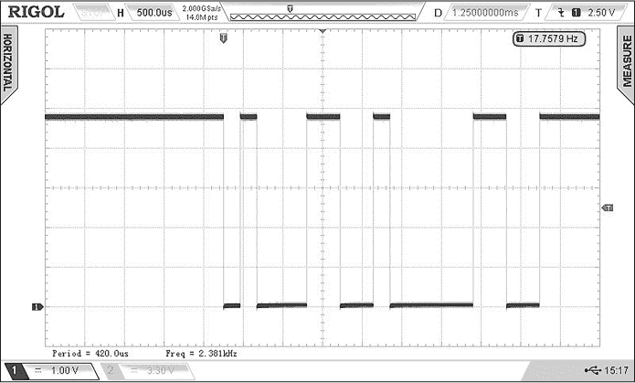

图 17-1：来自 Arduino 串口的生存时间（TTL）逻辑数据

现在考虑沿 RS232 发送的相同数据，如图 17-2 所示。RS232 要求标记是负电压，空格是正电压。

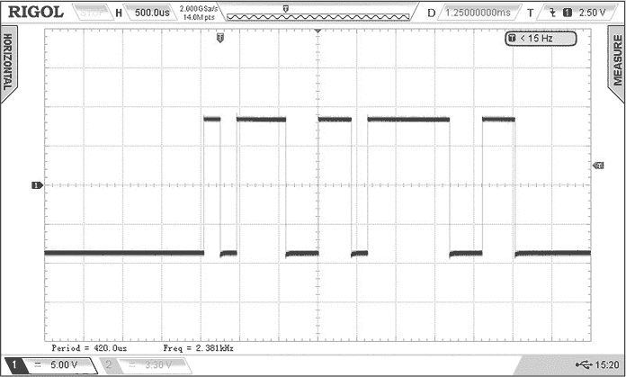

图 17-2：来自 RS232 端口的 RS232 逻辑数据

使用相反的电压表示标记和空格可以清晰地定义 2 位数据，避免潜在的混淆，从而提高数据的准确性。每发送一个字节的数据，RS232 会在每 8 位数据的两端包含一个起始位和一个停止位。（在本章后面，我会向你展示如何更改每次传输时发送的位数。）

标记的电压范围可以从 3 V 到 15 V DC，而空格的电压范围则在 −3 V 到 −15 V DC 之间。虽然较长的电缆意味着信号电压会有更大的波动——电缆越长，电压降越大，因为电缆的电阻——但标记和空格之间的宽电压范围意味着 RS232 电缆的长度对信号完整性的影响较小。如果周围的电气环境噪声较大，标记与空格之间发生混淆的几率较小。

RS232 信号所需的增加电压由 TTL 至 RS232 串行转换器 IC（MAX3232）生成，该 IC 存在于 Arduino 的 RS232 扩展板和模块上。该 IC 使用电荷泵电路将 5 V DC 转换为 +/−10 V DC 或更高电压，但电流较小。因此，使用 RS232 和 Arduino 时无需单独的双轨电源。

## 连接 RS232

有几种简便的方法可以将 Arduino 与设备或 PC 上的 RS232 连接进行接口。无论你使用哪种接口设备，它都会有一个九针连接器用于 RS232，并且有一种方法可以将板载的 MAX3232 IC 与 Arduino 的 TX/RX 串行引脚电气连接起来。

最方便的接口方式是使用 Arduino 的 RS232 扩展板（PMD Way 部件 954042），如图 17-3 所示。该扩展板具有一个方便的开关，用于选择 RS232 使用和 Arduino 与 PC 之间的通信；上传程序时关闭开关，使用 RS232 时打开开关。

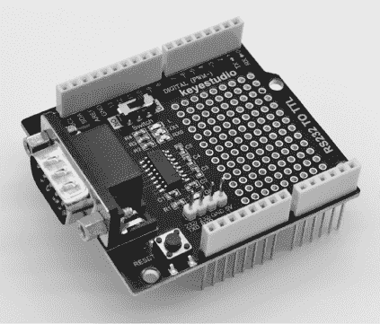

图 17-3：Arduino 的 RS232 扩展板

对于 Arduino 的 RS232 扩展板的更紧凑替代方案，特别适用于制作较小的 Arduino 基础电路，是 RS232 至 TTL 模块，如图 17-4 所示。

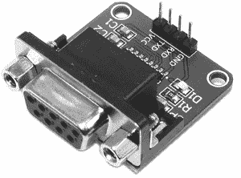

图 17-4：RS232 至 TTL 模块

本模块通过内联针脚连接到 Arduino：将 V[CC]和 GND 连接到 Arduino 的 5V 和 GND，将模块 TXD 连接到 Arduino 的 RX（D0），将模块 RXD 连接到 Arduino 的 TX（D1）。本章的项目使用 Arduino 的 RS232 扩展板，但你也可以使用本模块来完成相同的项目。

本章中，你还需要一根 RS232 电缆，将 Arduino 与 RS232 硬件连接到设备或计算机。基于 RS232 扩展板和模块上的标准连接器以及标准 PC 的 RS232 插座（如图 17-5 顶部所示），你将需要一根双头九针母头电缆。

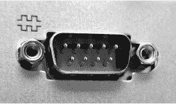

图 17-5：显示 RS232 插座的台式电脑背面

如果你使用的是 Mac 或笔记本电脑，或者 PC 没有 RS232 端口，你将需要一根 USB 到 RS232 电缆，比如 PMD Way 的 514539A，如图 17-6 所示。

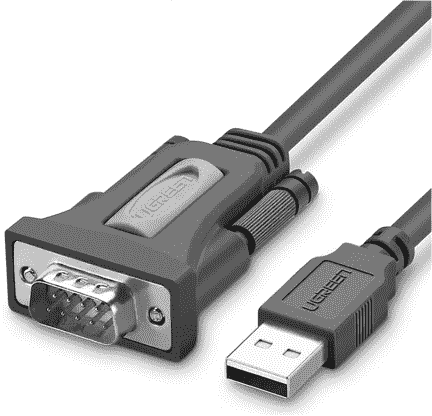

图 17-6：USB 到 RS232 电缆

你 PC 或 Arduino 扩展板上的 RS232 连接器是九针型，有两排针脚，无论是公头还是母头配置。当使用带有 25 针连接器的旧设备时，你应该能从其他 RS232 设备供应商处购买到像图 17-7 所示的转换插头或电缆。

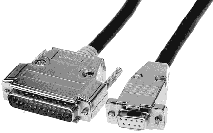

图 17-7：DB9 到 DB25 串口电缆

一旦你收集了所需的硬件，你就可以开始设置并测试通过 RS232 进行的 PC 到 Arduino 的连接。

## 通过 USB 测试 Arduino 与 PC 的连接

要测试 Arduino 与 PC 的连接，请将清单 17-1 上传到你的 Arduino 板。

```
void setup()
{
    Serial.begin(9600);
}

void loop()
{
    Serial.print("Hello ");
    delay(1000);
} 
```

清单 17-1：测试 Arduino 与 PC 的连接

接下来，拔下 Arduino 上的 USB 电缆，然后按照上一节描述连接 RS232 扩展板或模块。重新将 Arduino 连接到 USB 或外部电源，然后打开终端软件。与之前的章节一样，本章的项目使用的是 Roger Meier 提供的免费终端模拟器 CoolTerm，你可以在[*http://<wbr>freeware<wbr>.the<wbr>-meiers<wbr>.org*](http://freeware.the-meiers.org)下载。

打开终端软件后，点击**选项**。你应该会看到一个串口选项菜单，如图 17-8 所示。

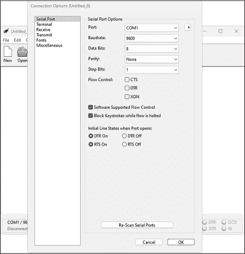

图 17-8：CoolTerm 选项菜单

从端口下拉菜单中选择您的串口（例如 COM1），并确保其他串口设置与图中所示相匹配。点击**确定**关闭菜单，然后点击**连接**开始通过 RS232 从 Arduino 向 PC 传输数据。PC 应该会不断接收到“Hello”这个词，并在终端窗口中显示，如图 17-9 所示。

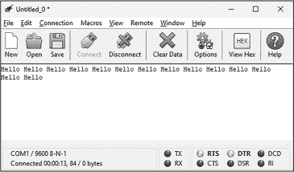

图 17-9：列出 17-1 在 CoolTerm 窗口中的结果

您可以使用这个简单的设置，通过 RS232 连接在比使用 USB 电缆更远的距离上捕获来自 Arduino 的数据。在 CoolTerm 中，按 CTRL-R 开始记录接收到的任何输出到文本文件，按 CTRL-SHIFT-R 停止记录。

保持硬件连接；您将在接下来的项目中使用它来实现 PC 到 Arduino 的远程控制，使用 RS232 进行通信。

项目 #49：创建一个 PC 到 Arduino 的远程控制

本项目演示了一个基本框架，通过 RS232 远程控制 Arduino 来控制连接到数字输出的设备、请求传感器的信息，甚至使用 PC 软件通过串口写入的方式将计算机控制加入到 Arduino 项目中。

您将需要以下零件：

+   一块 Arduino Uno 或兼容的板子和 USB 电缆

+   一个用于 Arduino 的 RS232 扩展板或模块

+   一个用于 PC 与 RS232 连接的九针电缆

为了组装这个项目，请按照上一节所述将 Arduino 连接到 RS232 硬件和 PC。上传项目 #49 的草图，打开 CoolTerm 软件，然后点击**连接**开始通过 RS232 在 Arduino 和 PC 之间进行数据通信。

按**0**或**1**键请求 Arduino 的模拟输入 0 和 1 的值，分别按**2**和**3**键打开和关闭板载 LED。如果按下其他键，终端应显示错误信息未识别的命令，如图 17-10 所示。

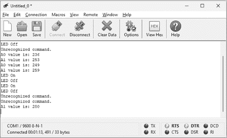

图 17-10：项目 #49 的示例输出

让我们看看它是如何工作的：

```
// Project #49 - PC-to-Arduino remote control

❶ void doSomething0()
{
    Serial.print("A0 value is: ");
    Serial.println(analogRead(0));
}

void doSomething1()
{
    Serial.print("A1 value is: ");
    Serial.println(analogRead(1));
}

void doSomething2()
{
    digitalWrite(13, HIGH);
    Serial.println("LED On");
}

void doSomething3()
{
    digitalWrite(13, LOW);
    Serial.println("LED Off");
}

void setup()
{
  ❷ Serial.begin(9600);
    pinMode(13, HIGH);
    digitalWrite(13,LOW);
}

void loop()
{
    char command;
  ❸ if(Serial.available()) // If data received by Arduino serial
    {
 command = Serial.read(); // Save the data
      ❹ switch (command)
        // Act on the received data:
        {
            case '0': doSomething0(); break;
            case '1': doSomething1(); break;
            case '2': doSomething2(); break;
            case '3': doSomething3(); break;
          ❺ default: Serial.println("Unrecognized command.");
        }
    }
} 
```

从❶开始，草图创建了四个自定义函数，用于在接收到匹配命令时调用。然后草图初始化 Arduino 串口 ❷，并将板载 LED 引脚设置为输出并将其关闭。

在主循环中，Arduino 等待通过串口连接从 RS232 接收到一个字符❸，然后使用switch…case函数❹对该字符进行处理。如果该字符不在选择范围内，程序会将错误信息发送回 PC❺。这个示例中的操作仅用于演示，你可以根据自己的需求替换其中的内容。

本项目演示了你可以通过 RS232 连接使用 PC 控制或监视任何 Arduino 操作。你也可以编写自己的定制 PC 软件进行远程控制。任何可以写入 COM:或串口的代码都可以控制 Arduino，而任何能够从串口接收文本的代码都可以对其进行操作。

在下一个项目中，我将展示如何通过 RS232 设置两个 Arduino 之间的通信。由于 RS232 是 Arduino 串行通信的扩展，两个 Arduino 可以通过 RS232 互相通信。然而，所需的 RS232 电缆与普通电缆稍有不同：TX 和 RX 数据线需要交叉连接。也就是说，一端的 TX 针脚需要连接到另一端的 RX 针脚，反之亦然。否则，你将试图连接两个 Arduino 的 TX 针脚，这是不行的。

解决这个问题的方法是使用*交叉*电缆，或*无调制解调器*电缆，它具有直接 RS232 到 RS232 设备通信所需的内部接线，示例中使用的是 PMD Way 部件 6045480L15，如图 17-11 所示。

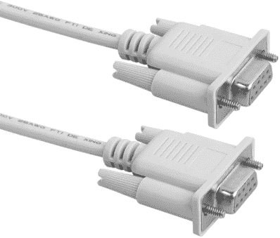

图 17-11：RS232 交叉电缆

如果你只是进行短距离实验，可以直接使用跳线在两个 RS232 保护板或 Arduino 模块之间连接：只需将一侧的 TX 和 RX 分别连接到另一侧的 RX 和 TX，再将 GND 连接起来即可。

项目#50：启用 Arduino 到 Arduino 的通信

本项目演示了一个 Arduino 如何通过 RS232 与另一个 Arduino 进行通信。一块带有 BMP180 温度传感器的 Arduino 板会通过 RS232 将当前温度发送到另一块 Arduino 板，接收 Arduino 上的 I²C LCD 会显示该值。

你将需要以下部件来完成这个项目：

+   两块 Arduino Uno 或兼容的开发板和 USB 线

+   两个 RS232 保护板或模块用于 Arduino

+   一根九针 RS232 交叉电缆

+   一个免焊面包板

+   各种跳线

+   一个 BMP180 温度和气压传感器板

+   一个 PCF8574 LCD 模块

一块 Arduino 将充当发射器板，另一块将充当接收器板。要组装硬件，将 RS232 扩展板或模块连接到每块 Arduino，然后通过交叉电缆或跳线将它们连接起来。将 BMP180 传感器添加到发射器板，如 图 17-12 中的原理图所示。

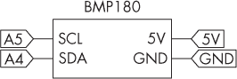

图 17-12：BMP180 传感器与发射器 Arduino 的连接图

接下来，将 LCD 模块添加到接收器板，如 图 17-13 所示。

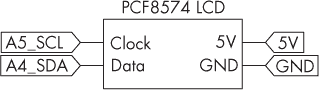

图 17-13：LCD 与接收器 Arduino 的连接图

如果你之前没有使用过 BMP180 传感器，请按照 第十章 中的说明安装库，并按照 第十三章 中的说明安装 I²C LCD。

现在，Arduino 已连接，如果你使用的是 RS232 扩展板，请确保它们已经开启。为了为项目供电，如果 PC 和 Arduino 之间有距离，可以使用 USB 电缆或外部电源。

接下来，将发射器草图输入并上传到发射器 Arduino，然后将接收器草图上传到接收器 Arduino。稍等片刻，LCD 屏幕应该会显示当前温度，显示内容的示例如 图 17-14 所示。

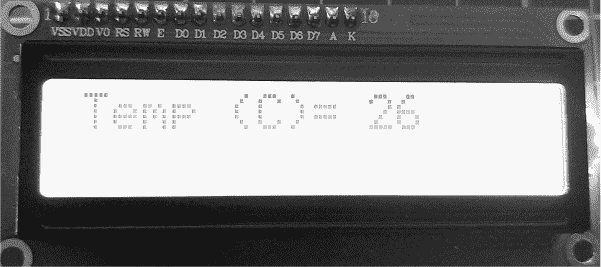

图 17-14：项目 #50 的示例输出

让我们先从发射器草图开始，看看它是如何工作的：

```
// Project #50 - Arduino-to-Arduino communication with RS232C - transmitter

#include "Adafruit_BMP085.h"
Adafruit_BMP085 bmp;

❶ int temperature;

void setup()
{
  ❷ Serial.begin(9600);
    bmp.begin();
}

void loop()
{
  ❸ temperature = bmp.readTemperature();
    Serial.print("Temp (C)= ");
    Serial.print(temperature);
    Serial.print("\n");
    delay(1000);
} 
```

发射器草图包含并初始化了 BMP180 库，并创建一个变量来存储温度 ❶。它启动了串口和 BMP180 ❷。循环从 BMP180 获取温度读取 ❸，然后将文本发送到接收 Arduino，文本以描述 Temp (C) = 开头，后面跟着温度的数值。接着是 \n，它告诉接收 Arduino 添加一个新行。然后稍作延迟，过程重复。

现在让我们来看一下接收器的草图：

```
// Project #50 - Arduino-to-Arduino communication with RS232 - receiver

#include <LiquidCrystal_PCF8574.h>
#include <Wire.h>
LiquidCrystal_PCF8574 lcd(0x27);

int length = 16;
char newLine = '\n';
char buffer[16];

void setup()
{
    Serial.begin(9600);
    Wire.begin();
    Wire.beginTransmission(0x27);
    lcd.begin(16, 2);
    lcd.setBacklight(255);
    lcd.clear();
}

void loop()
{
    if (Serial.available())
    {
        lcd.home();
        lcd.setCursor(0, 0);
        Serial.readBytesUntil(newLine, buffer, length);
        lcd.print(buffer);
    }
} 
```

接收器草图的任务是将通过 RS232 接收到的串行数据行显示在 LCD 上。它包含并初始化了 LCD 库和 I²C 总线，然后创建了三个必要的变量：length，表示 LCD 每行可显示的字符数；endOfLine，保存换行符；以及字符数组 buffer，用于保存来自 RS232 总线的接收数据。

在void setup()中，草图设置了串行通信，激活了 I²C 总线，并初始化了 LCD 的使用，通过开启背光并将光标设置到显示屏的左上角来实现。在主循环中，如果检测到传入的字符，LCD 光标会通过lcd.home();和lcd.setCursor(0, 0);重置到左上角。Serial.readBytesUntil()函数会捕获最多 16 个来自串行的数据字符，直到接收到换行符。草图将这些字符存储在数组缓冲区中。最后，它会在 LCD 上显示缓冲区数组的字符。每当从发射端 Arduino 接收到新数据时，这个过程会重复。

对于涉及两个 Arduino 板在彼此之间的距离的更长期项目，本项目中的简单演示为可靠的数据传输提供了理想的框架。作为挑战，您可以创建一个项目，在其中两个 Arduino 通过发送随机数据或传感器值“对话”。

## 其他 RS232 数据配置

到目前为止，在本章中，您使用了默认的 9,600 bps 数据速率，每个数据单元为 8 位，无校验和 1 个停止位。（在设备规格表或用户手册中，这通常写作“8, None, 1”在速率后面。）然而，在未来的项目中，您可能需要使用不同数据速率或发送接收数据的方式。例如，一台旧终端可能使用 7 位而非 8 位，使用 2 个停止位而不是 1 个。

为了解决这个问题，您可以修改本章中项目中使用的Serial.begin()函数的参数。将第一个参数设置为您需要的数据速率，将第二个参数设置为新的数据配置：

```
Serial.begin(`speed`, SERIAL_`XYZ`) 
```

在第二个参数中，X代表所需的数据位数，可以在 5 到 8 之间；Y代表奇偶校验，可以是N表示无，E表示偶数，或O表示奇数；Z代表停止位的数量，可以是 1 或 2。

例如，要以 4,800 bps 的速度启动串行通信（即 RS232），使用 7 位数据，无校验和 1 个停止位，请在您的草图中使用以下函数：

```
Serial.begin(4800, SERIAL_7N1) 
```

如果你决定将任何复古设备与 Arduino 连接，这可能会派上用场。为了体验一些复古计算乐趣，可以留意 eBay 或计算机市场，寻找旧的计算机终端或打印机。例如，看看这个 Arduino 控制的 RS232 到并行打印机接口：[*https://<wbr>hackaday<wbr>.io<wbr>/project<wbr>/18140<wbr>-serial<wbr>-to<wbr>-parallel<wbr>-printer<wbr>-interface*](https://hackaday.io/project/18140-serial-to-parallel-printer-interface)。

## 继续前进

你已经学会了如何通过 RS232 在 PC 和 Arduino 之间进行通信，以及在多个 Arduino 之间通过 RS232 进行通信。现在你具备了利用 RS232 总线进行远程控制、Arduino 间的数据通信、以及将数据捕捉到 PC 中进行分析的工具，同时还可以通过 Arduino 与基于 RS232 的设备进行通信。

在下一章中，你将学习如何使用 Arduino 通过另一种数据总线——RS485 数据总线，与其他设备进行通信。
