# 第十八章：18 ARDUINO-TO-RS485 COMMUNICATION


在上一章中，你使用了 RS232 总线创建了 Arduino 微控制器与其他设备之间的长距离可靠有线数据连接。本章介绍了 RS485 总线，你可以使用它实现更长的有线连接。

RS485 数据总线广泛应用于各种设备，从供暖、通风和空调（HVAC）系统的设备控制器到远程传感器通信和安全系统网络。它需要使用双绞屏蔽线。根据数据传输速度，你的电缆长度可以超过 800 米，并且可以在单一总线上连接多达 256 台设备。这种设备之间的安全、无干扰通信是无线数据模块无法实现的。RS485 模块价格非常低廉，使得你可以轻松地在自己的项目中使用它们。

本章将介绍如何将 RS485 接口模块与 Arduino 连接。你将学习：

+   通过电路将数据从远程 Arduino 发送到你的 PC。

+   创建一个带 LCD 显示的远程温度计

+   构建一个远程控制的 Arduino 项目，包含一个主要控制器和两个或更多的远程控制 Arduino。

你可以将这些项目作为未来 Arduino 到 RS485 通信需求的框架。

## RS485 总线

RS485 数据总线旨在直接连接两个或多个数据终端设备，而无需通过调制解调器，连接距离比 RS232 等其他数据总线更长。它非常适合连接需要相互通信的两个基于微控制器的设备，因为它比无线数据链接更可靠，并且在设备之间的通信距离更长。

与 RS232 类似，RS485 是一种串行数据总线，其工作方式与 Arduino 的串口（通常位于 D0 和 D1 引脚）类似。然而，数据并不会简单地从 Arduino 通过 RS485 接口传输到另一端的 RS485 设备。Arduino 必须在数据传输前告诉 RS485 设备是发送数据还是接收数据，然后数据才能按照需要在总线上传输。数据随后按照要求沿 RS485 总线传输到另一个 RS485 设备，再传输到连接的 Arduino。

虽然 RS485 总线发送的是表示 1 和 0 的顺序数据位，但其信号类型与 Arduino 中常见的 TTL 串行通信不同。为了比较，图 18-1 显示了从 Arduino 串口发送的一些数据，捕捉到的波形图。正如你所看到的，1 的电平是 5 V，0 的电平是 0 V。

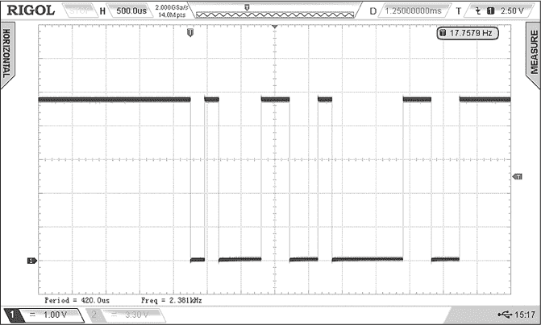

图 18-1：从 Arduino 串口发送的数据

现在考虑通过 RS485 发送的相同数据，如 图 18-2 所示。RS485 使用两根线，A 和 B。当发送 1 时，A 线的电压高于 B 线，当发送 0 时，A 线的电压低于 B 线。所使用的电压范围可以在 −7 V 到 12 V DC 或更高之间变化，具体取决于所使用的 RS485 接口硬件。

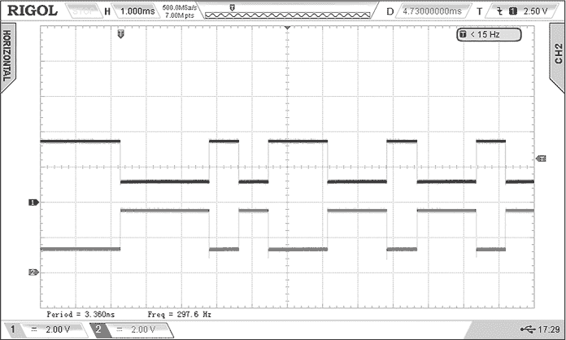

图 18-2：通过 RS485 接口发送的数据

使用不同的电压表示 1 和 0，通过两根导线可以清晰地区分这两个比特，消除了混淆的可能性，从而提高了数据的准确性。由于电压范围较宽，RS485 电缆的长度对信号完整性的影响较小，因为信号电压可以在电缆长度变化的范围内变化（电缆越长，因电缆电阻而导致的电压降越大）。结合使用屏蔽电缆，这个电压范围意味着你可以在比其他数据总线（如 RS232）更长的距离上使用 RS485。

## 连接到 RS485

基本的 RS485 接口板或模块具有一个发送端子（称为 RO）和一个接收端子（称为 DI），用于 Arduino 之间的通信，还有电源（通常为 5V）和地线（GND）。从微控制器到 RS485 接口的一个额外信号，通常标记为 DE/RE，用于指示数据是接收还是发送。在某些模块上，DE 和 RE 是两个独立的引脚，必须将它们连接在一起。最后，正如上一节所描述，RS485 接口之间的连接使用两根线，A 和 B。这允许进行 *半双工通信*，即数据一次只能在一个方向上传输。

> 注意

*RS485 总线还支持通过四根线进行全双工通信，但详细描述此内容超出了本书的范围。*

你可以在廉价的 RS485 模块上清晰地看到所有引脚的标注，例如 图 18-3 中显示的 PMD Way 零件号 600197。这些模块可以方便地放置在无焊接面包板上进行实验或快速原型设计。在本章的项目中，你将使用这些模块。

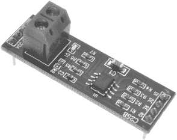

图 18-3：一款廉价的 RS485 接口模块

图 18-4 显示了这些模块使用的原理图符号。

原理图中的 5V 和 GND 引脚连接到电源。接口模块的 A 和 B 引脚连接到其他接口模块；A 引脚连接到 A 引脚，B 引脚连接到 B 引脚。DI（数据输入）引脚接收来自 Arduino 的数据，并通过 RS485 发送出去。R0 引脚将通过 RS485 接收到的数据发送到 Arduino。最后，在电路中使用 DE 和 RE 引脚设置接口模块为发送或接收模式，将它们设置为 HIGH 以发送数据，设置为 LOW 以接收数据，就像你将在接下来的项目中所做的那样。

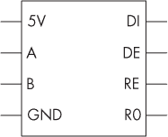

图 18-4：RS485 接口模块原理图符号

项目 #51：创建 Arduino 到 PC 的数据链路

本项目展示了如何通过 RS485 总线轻松地将数据从一个 Arduino 发送到另一个 Arduino，再到 PC。你也可以用它从远程 Arduino 捕获数据到 PC。

你将需要以下部件：

+   两个 Arduino Uno 或兼容板和一根 USB 电缆

+   两个 RS485 接口模块

+   两个免焊接面包板

+   各种跳线

+   适合 Arduino Uno 或兼容板的电源

+   一根用于长距离通信的双绞线（可选）

与本章中的所有项目一样，你将创建两个 Arduino 到 RS485 的电路：一个接收器电路和一个发送器电路。发送器的 Arduino 将通过 RS485 向接收器的 Arduino 发送数据，这些数据然后通过常规的 USB 连接传输到 PC。你可能会发现，在构建电路之前先将接收器和发送器的草图上传到各自的 Arduino 会更容易，因为那样在构建电路时会更加方便，特别是当电路之间有较长距离时。

如果你想使用长的 RS485 电缆，请使用屏蔽双绞线，并利用电缆的屏蔽层将发送端和接收端的 GND 连接起来。不过，你也可以使用短接线来测试此项目。

图 18-5 显示了接收器电路的原理图。

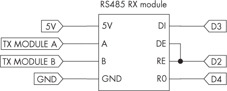

图 18-5：项目 #51 接收器电路原理图

图 18-6 显示了发送器电路的原理图。

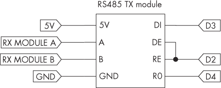

图 18-6：项目 #51 发送器电路原理图

一旦构建了电路并上传了草图，通过 USB 将接收单元连接到 PC，并打开 Arduino 的串行监视器或终端软件（如 CoolTerm，第一次在 第十四章 中解释）。终端应该显示发送器电路的 Arduino 上模拟引脚 0 的值，如 图 18-7 所示。

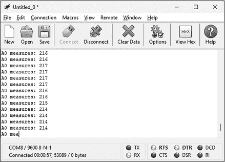

图 18-7：项目 #51 的示例输出

让我们看看它是如何工作的，首先仔细查看发射器电路的草图：

```
// Project #51 - Transmitter

❶ #include <SoftwareSerial.h>
SoftwareSerial RS485(4, 3);

❷ #define TXRX 2 // Using D2 for RS485 DE/RE

void setup()
{
    RS485.begin(9600);
    pinMode(TXRX, OUTPUT);
    digitalWrite(TXRX, HIGH); // RS485 transmit
}

void loop()
{
    RS485.print("A0 measures: ");
    RS485.println(analogRead(0));
} 
```

该草图配置软件串行以使用数字引脚 D4 和 D3 ❶与 RS485 接口模块进行通信。它使用 Arduino 数字引脚 D2 来控制 DE/RE 引脚，这些引脚决定 RS485 总线上的数据方向 ❷。在void setup()中，草图启动将与 RS485 模块通信的软件串行，然后设置 D2 引脚为输出，以控制 RS485 模块上的数据方向。然后，它将方向设置为发送。最后，在void loop()中，草图通过软件串行不断地将模拟输入 0 的值作为示例数据沿 RS485 总线发送。

现在考虑接收电路的草图：

```
// Project #51 - Receiver

#include <SoftwareSerial.h>
SoftwareSerial RS485(4, 3);

#define TXRX 2 // Using D2 for RS485 DE/RE

void setup()
{
    Serial.begin(9600);
    pinMode(TXRX, OUTPUT);
  ❶ digitalWrite(TXRX, LOW); // RS485 receive
}

void loop()
{
    if (RS485.available())
    {
      ❷ Serial.write(RS485.read());
    }
} 
```

接收器草图的配置与发射器草图相同，唯一不同的是程序通过将数字引脚 D2 设置为低电平 ❶来将 RS485 模块设置为接收模式。然后，Arduino 等待通过软件串行从 RS485 总线接收到一个字符。当一个字符到达时，Arduino 通过硬件串行和 USB 将其发送到连接的计算机 ❷。您可以使用此项目通过 RS485 数据连接将由连接到 Arduino 的设备生成的任何类型的数据发送到 PC 进行记录。

下一个项目演示了一种查看通过 RS485 数据连接接收的数据的方法，且不依赖于计算机进行操作。

项目 #52：创建 Arduino 与 Arduino 的数据连接

在此项目中，您将建立一个 RS485 数据连接，通过总线发送来自 BMP180 传感器的温度数据，并使用 I²C PCF8574 LCD 模块进行显示。除了作为使用 RS485 数据总线的另一个良好示范外，该项目还作为构建远程实时监控系统的框架，这些系统在接收端无需主机计算机，例如操作温度、机器速度或其他传感器数据。

> 注意

*如果您不熟悉 I**²**C PCF8574 模块 LCD，请参考第十三章中描述的用法。我还在第十章中讲解了 BMP180 传感器。*

您需要以下零件来完成此项目：

+   两个 Arduino Uno 或兼容板和一根 USB 电缆

+   两个 RS485 接口模块

+   两个无焊面包板

+   各种跳线

+   两个适合 Arduino Uno 或兼容板的电源供应器

+   一个 PCF8574 LCD 模块

+   一个 BMP180 温度和气压传感器板

+   一根双芯电缆用于远距离通信（可选）

你将再次构建两个 Arduino 至 RS485 电路，一个接收器和一个发送器。在这个项目中，发送器的 Arduino 将通过 RS485 向接收器的 Arduino 发送温度数据，以在 LCD 上显示。同样，你可能会发现，在构建电路之前先将两个草图上传到各自的 Arduino 上会更容易。

图 18-8 显示了接收器电路的原理图。


图 18-8: 项目 #52 接收器电路原理图

图 18-9 显示了发送器电路的原理图。

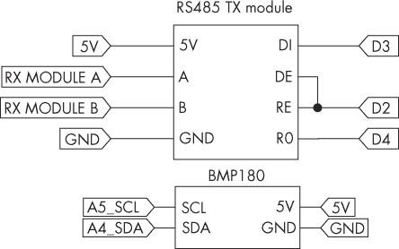

图 18-9: 项目 #52 发送器电路原理图

一旦你将草图上传到各自的 Arduino 板并完成电路搭建，启动两个电路。当前的环境温度应该会显示在 LCD 上，如 图 18-10 所示。

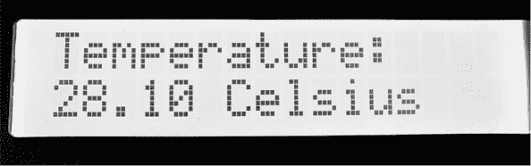

图 18-10: 项目 #52 示例输出

让我们看看这个是如何工作的，首先仔细观察发送器的草图：

```
// Project #52 - Transmitter

❶ #include <Adafruit_BMP085.h>
Adafruit_BMP085 bmp;

❷ #include <SoftwareSerial.h>
SoftwareSerial RS485(4, 3);

❸ #define TXRX 2 // Using D2 for RS485 DE/RE

void setup()
{
    RS485.begin(9600);
    pinMode(TXRX, OUTPUT);
    digitalWrite(TXRX, HIGH); // RS485 transmit
    bmp.begin();
}

void loop()
{
    RS485.print(bmp.readTemperature());
    delay(500);
} 
```

草图首先包含了使用 BMP180 温度传感器所需的库，并创建了实例 ❶。然后，草图配置软件串行通信，使用数字引脚 D4 和 D3 与 RS485 接口模块进行通信 ❷。草图使用 Arduino 的数字引脚 D2 来控制 DE/RE 引脚，从而决定 RS485 总线上的数据方向 ❸。

在 void setup() 中，程序启动软件串行通信，与 RS485 模块进行通信，然后设置 D2 引脚为输出，以控制 RS485 模块上的数据方向。接着，它将方向设置为发送模式，并启动 BMP180 传感器。最后，在 void loop() 中，它通过软件串行通信每半秒将 BMP180 传感器的温度数据通过 RS485 总线发送出去。

现在，来看一下接收器电路的草图：

```
// Project #52 - Receiver

❶ #include <Wire.h>
#include <LiquidCrystal_PCF8574.h>
LiquidCrystal_PCF8574 lcd(0x27);

#include <SoftwareSerial.h>
SoftwareSerial RS485(4, 3);

#define TXRX 2 // Using D2 for RS485 DE/RE

float temperature = 0;

void setup()
{
    Wire.begin();
    Wire.beginTransmission(0x27);
  ❷ lcd.begin(16, 2);
  ❸ lcd.setBacklight(255);
  ❹ lcd.clear();
    RS485.begin(9600);
    pinMode(TXRX, OUTPUT);
    digitalWrite(TXRX, LOW); // RS485 receive
}

void loop()
{
    byte incoming = RS485.available();
  ❺ if (incoming != 0)
    {
        temperature = RS485.parseFloat();
      ❻ lcd.home();
        lcd.clear();
        lcd.setCursor(0, 0);
        lcd.print("Temperature:");
        lcd.setCursor(0, 1);
        lcd.print(temperature);
        lcd.print(" Celsius");
    }
} 
```

由于接收器使用 PCF8574 I²C LCD，草图包含了 I²C 总线所需的库、LCD 显示和实例 ❶。在 void setup() 中，它启动了 I²C 总线并开始与 LCD 通信，以配置 LCD 显示的尺寸 ❷，打开背光 ❸，并清空显示 ❹。然后，草图包含了接收器草图的 RS485 配置。这与发送器草图完全相同，只是草图通过将数字引脚 D2 设置为 LOW，将 RS485 模块设置为接收模式。

Arduino 通过软件串行口❺等待来自 RS485 总线的文本。一旦文本到达，示意图会使用串口库中的.parsefloat()函数将其转换为浮点数。然后，温度信息会显示在 LCD 屏幕❻上。这个过程在接收到更多来自发射电路的温度数据时会重复。

项目#53：远程控制操作

由于 RS485 支持更长的电缆连接，它也非常适合远程控制应用。这个项目展示了通过 RS485 进行远程控制操作，其中一个 Arduino 电路（主电路）通过 RS485 向另一个 Arduino 电路（次级电路）发送信号，以执行各种操作。

你将需要以下零件来完成这个项目：

+   两个 Arduino Uno 或兼容板和一根 USB 电缆

+   两个 RS485 接口模块

+   两块无焊接面包板

+   各种跳线

+   两个适用于 Arduino Uno 或兼容板的电源

+   一根双芯电缆，用于更长距离的通信（可选）

在这个项目中，主 Arduino 通过 RS485 向次级 Arduino 发送单个字符。你将编程次级 Arduino，根据接收到的字符执行各种操作；如果接收到未知命令，将执行默认操作。同样，你可能会发现，在构建电路之前，将示意图上传到每个 Arduino 会更容易一些。

图 18-11 展示了主电路的原理图。

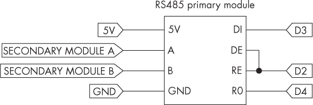

图 18-11：项目#53 主电路原理图

图 18-12 展示了次级电路的原理图。

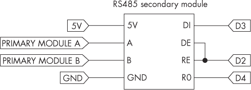

图 18-12：项目#53 次级电路原理图

一旦你将项目示意图上传到各自的 Arduino 板并搭建好电路，启动电源。主 Arduino 应开始向次级 Arduino 发送命令，次级 Arduino 将通过各种顺序闪烁其板载 LED 灯来响应这些命令。

让我们来看看这个是如何工作的，首先查看主电路的示意图：

```
// Project #53 - Primary

#include <SoftwareSerial.h>
SoftwareSerial RS485(4, 3);

#define TXRX 2 // Using D2 for RS485 DE/RE

void setup()
{
    RS485.begin(9600);
    pinMode(TXRX, OUTPUT);
    digitalWrite(TXRX, HIGH); // RS485 transmit
}

void loop()
{
    RS485.print("0");
    delay(1000);
    RS485.print("1");
    delay(1000);
    RS485.print("2");
    delay(1000);
    RS485.print("3");
    delay(1000);
    RS485.print("8");
    delay(5000);
} 
```

此示意图配置了主电路，通过 RS485 进行传输，就像以前的项目一样。不同之处在于在void loop()中发送的示例命令。次级 Arduino 被配置为响应命令 0、1、2 和 3，因此主示意图会按顺序发送这些命令作为演示。它还发送数字 8 来展示接收方处理未知命令的功能。每个命令依次发送，每个命令之间有延迟。

这是次级电路的示意图：

```
// Project #53 - Secondary

#include <SoftwareSerial.h>
SoftwareSerial RS485(4, 3);

#define TXRX 2 // Using D2 for RS485 DE/RE

void blinkLED(int i)
{
    for (int j = 0; j < i; j++)
    {
        digitalWrite(13, HIGH);
        delay(100);
        digitalWrite(13, LOW);
        delay(100);
    }
}

void setup()
{
    RS485.begin(9600);
    pinMode(TXRX, OUTPUT);
    digitalWrite(TXRX, LOW); // RS485 receive
    pinMode(13, OUTPUT);
}

void loop()
{
  ❶ if (RS485.available() > 0)
    {
        char receivedChar = RS485.read();
      ❷ switch (receivedChar)
        {
            case '0': blinkLED(5); break;
            case '1': blinkLED(10); break;
            case '2': blinkLED(15); break;
            case '3': blinkLED(20); break;
          ❸ default: blinkLED(2); break;
        }
    }
} 
```

从属电路配置为通过 RS485 接收命令，然后根据这些命令执行操作。为了演示这一点，草图使用了<sup class="SANS_TheSansMonoCd_W5Regular_11">blinkLED()</sup>函数，该函数接受一个整数并使板载 LED 闪烁该次数。从属电路通过软件串口 ❶等待来自 RS485 总线的一个文本字符（命令）。从属单元使用<sup class="SANS_TheSansMonoCd_W5Regular_11">switch…case</sup>函数 ❷来确定根据从主单元接收到的命令调用哪个函数。如果它收到的命令不在<sup class="SANS_TheSansMonoCd_W5Regular_11">switch…case</sup>函数中，它会让 LED 闪烁两次 ❸。

你可以通过将对<sup class="SANS_TheSansMonoCd_W5Regular_11">blinkLED()</sup>函数的调用替换为你自己的可操作需求，修改此项目以满足你自己的远程控制需求。

## 控制两个或更多从属 RS485 设备

到目前为止，你已经学会了如何在两块 RS485 连接的 Arduino 板之间进行通信。然而，如前所述，你可以通过 RS485 总线控制多个从设备，最多可以连接 256 个设备。在本节以及接下来的项目中，我将向你展示如何做到这一点。

当使用三个或更多设备时，RS485 总线的布线稍有不同。你一直在使用的模块上的收发器 IC 还需要在 RS485 总线的每个端点，A 和 B 线之间添加一个 120 Ω的终端电阻。如果你只使用两个模块，那么终端电阻已经装配好，你不需要做任何更改。然而，如果你使用本章中介绍的三个或更多 RS485 模块，你需要从模块上拆下标有 R7 的终端电阻（电阻值为 121，解释为 12 Ω，末尾加上 0 变为 120 Ω）。这个电阻在图 18-13 中已圈出。

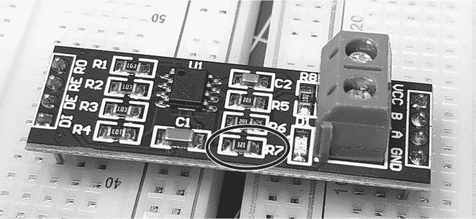

图 18-13：一个 RS485 终端电阻

当你的设备连接距离超过演示中工作台上的距离时，确保 A/B 对的线缆以“菊花链”配置从一个设备延伸到另一个设备，如图 18-14 所示。不要为每个设备创建一条从设备到主 A/B 对的单独线路。


图 18-14：三个设备的 RS485 布线配置示例

你将在下一个项目中实际应用这个技术。

项目 #54：控制两个或更多从属 Arduino 板

这个项目演示了如何通过 RS485 从一个主板控制两个或更多的从 Arduino 板。一个 Arduino 电路（主设备）会通过 RS485 向其他 Arduino（从设备）发送命令，指示它们执行各种操作。

这个项目的硬件与第 53 号项目中使用的相同，只是你将使用两个或更多的从设备。首先搭建一个主设备和两个从设备，通过 RS485 总线将它们连接起来，正如上一节中图 18-14 所示。同样，在搭建电路之前，最好先将草图上传到每个 Arduino。如果你喜欢，可以在三设备设置成功后，稍后再向项目中添加更多的从设备。

如果你只是测试这个项目在工作台上的表现，RS485 总线的距离足够短，你可能不需要从 RS485 模块中移除终端电阻，因此在对硬件做出任何更改之前，先测试代码。

在这个项目中，主板通过 RS485 总线发送一个三位数字，所有从板都会接收到这个数字。命令的第一位表示要控制的从设备的编号（从设备 1 到 9），最后两位表示发送给特定从设备的命令。例如，要向从设备 2 发送命令 12，主设备会通过 RS485 总线发送 212，因为加载到第二个从设备的草图被编程为根据接收 12 来执行动作。如果你添加了 10 个或更多从设备，你可以更改草图中的命令，以便它们发送四位数字，或根据自己的需求修改命令编码方式。

这个项目只是一个通过 RS485 控制多个从设备的演示。在当前形式下，从主设备发送的每个命令都会触发对应从设备的 LED 闪烁特定次数。然而，在你未来的项目中，你可以用你自己的需求替换从设备中的简单示例动作。

让我们来看看这个在草图中是如何工作的，从主设备的草图开始：

```
// Project #54 - Primary

#include <SoftwareSerial.h>
SoftwareSerial RS485(4, 3);

#define TXRX 2 // Using D2 for RS485 DE/RE

void setup()
{
    RS485.begin(9600);
    pinMode(TXRX, OUTPUT);
    digitalWrite(TXRX, HIGH); // RS485 transmit
}

void loop()
{
  ❶ RS485.println(105); // Command for secondary 1
    delay(5000);
  ❷ RS485.println(205); // Command for secondary 2
    delay(5000);
} 
```

在你现在应该已经熟悉的序列中，草图首先配置主设备以将数据发送到 RS485 总线。在 void loop() 中，它发送两个新的示例命令：105 ❶，这是给从设备 1 的命令 5，以及 205 ❷，这是给从设备 2 的命令 5。记住，命令是三位数字，第一位表示目标从设备的编号，后两位（00 到 99）表示实际的命令。

以下是从设备 1 的草图：

```
// Project #54 - Secondary device 1

#include <SoftwareSerial.h>
SoftwareSerial RS485(4, 3);

#define TXRX 2 // Using D2 for RS485 DE/RE

void blinkLED(int i)
{
    for (int j = 0; j < i; j++)
    {
        digitalWrite(13, HIGH);
        delay(250);
        digitalWrite(13, LOW);
        delay(250);
    }
}

void setup()
{
    RS485.begin(9600);
    pinMode(TXRX, OUTPUT);
    digitalWrite(TXRX, LOW); // RS485 receive
    pinMode(13, OUTPUT);
}

void loop()
{
    while (RS485.available() == 0) {}
  ❶ int commandType = RS485.parseInt();
  ❷ if (commandType >= 100 && commandType < 200)
    {
        switch (commandType)
        {
          ❸ case 105: blinkLED(5); break;
            case 110: blinkLED(10); break;
            case 115: blinkLED(15); break;
            case 120: blinkLED(20); break;
          ❹ default: blinkLED(2); break;
        }
    }
} 
```

该草图配置为，当接收到来自主单元的命令时，会调用blinkLED()函数，并传递一个变化的参数来使 LED 闪烁不同次数。在void loop()中，次级设备等待来自 RS485 总线的整数输入❶。然后，它检查接收到的整数是否在 100 到 199 之间（包括 100 和 199）❷。如果是，表示该命令是为该单元发出的，草图会使用switch…case函数将该整数与预设的命令进行比较。例如，如果收到命令 105，调用blinkLED()函数使板载 LED 闪烁五次❸。如果接收到的命令无法识别❹，LED 闪烁两次。

次级设备 2 的草图的第一部分与次级设备 1 相同。只有草图中的void loop()部分有所不同：

```
void loop()
{
    while (RS485.available() == 0) {}
    int commandType = RS485.parseInt();
  ❶ if (commandType >= 200 && commandType < 300)
    {
        switch (commandType)
        {
          ❷ case 205: blinkLED(5); break;
            case 210: blinkLED(10); break;
            case 215: blinkLED(15); break;
            case 220: blinkLED(20); break;
          ❸ default: blinkLED(2); break;
        }
    }
} 
```

该草图测试接收到的命令，检查它是否在 200 到 299 之间（包括 200 和 299）❶，因为命令的第一位数字（2）表示该命令是为该次级单元发出的。如果该命令是为此单元发出的，草图会使用switch…case函数将其与预设的命令进行比较。例如，如果设备收到命令 205，草图会调用blinkLED()函数使板载 LED 闪烁五次❷。如果接收到的命令无法识别❸，LED 闪烁两次。

要添加额外的次级单元，您只需修改测试行❶，以便新单元能够检查主设备发出的命令是否在其要求的数字范围内。您还需要在switch…case函数中添加相应的命令和所需的操作。

为了增加挑战，您可以尝试创建一个系统，将来自次级设备的数据返回给主设备。

## 继续前进

本章已为您提供了使用 Arduino 实现 RS485 数据总线的基本构建模块。您可以利用这些知识，制作自己的数据传输和控制应用，支持远距离操作，例如监控传感器或控制办公室或工厂内其他房间的设备。

在下一章中，您将开始使用流行的支持 Wi-Fi 的 Arduino 兼容板，制作可以从手机或任何网络设备远程控制的设备。
