# 第十九章：19 ESP32 微控制器平台与物联网


*物联网（IoT）*这一术语描述了通过互联网通信或被控制的各种设备。过去，使用 Wi-Fi 通信的物联网 Arduino 项目既复杂又昂贵，因为 Arduino 的 Wi-Fi 扩展板通常体积庞大，且与 Arduino 微控制器结合时功能有限。然而，随着 Espressif 的 ESP32 微控制器平台的出现，情况已经发生了改变，ESP32 内置了 Wi-Fi，并且与 Arduino 兼容。

本书的最后六章将使用基于 ESP32 的开发板。为了获得最佳的学习体验，建议按顺序阅读这些章节；不过，如果你愿意，也可以随意跳过某些章节。

在这一章中，我将向你介绍基于 ESP32 的 Arduino 兼容开发板。你将学习如何在 Arduino IDE 中安装新开发板配置文件，测试 ESP32 的 Wi-Fi 连接，并在 ESP32 开发板上使用 PWM。你将学习：

+   创建一个带按钮的简单网页

+   构建一个带状态显示的四路输出遥控器

+   构建一个可遥控调整的 PWM 输出

你将在本章中掌握的技能将帮助你在本书后续章节中与其他联网设备进行互动。

## ESP32

ESP32 是一款内置 Wi-Fi 和蓝牙的微控制器，其运行速度比典型的 Arduino 或兼容开发板更快。它并不是一个简单的单片配置；相反，它需要外部闪存芯片和无线操作所需的天线。芯片和天线通常紧密放置在一起，如图 19-1 所示。

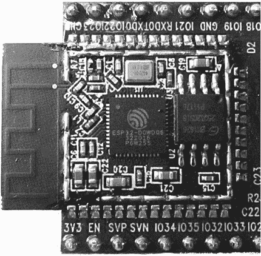

图 19-1：示例 ESP32 芯片组，去除顶部金属外壳后的模块

为了避免信号干扰，所需的电路被集成在一个模块中，该模块上方有金属外壳。这个模块被安装到开发板上，电路用于与其他设备连接，或者被添加到开发板上以实现 Arduino 兼容性，如图 19-2 所示。

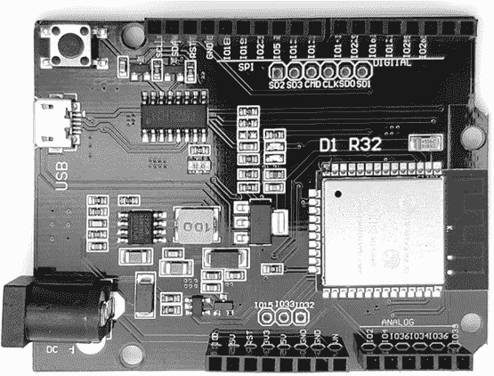

图 19-2：ESP32 开发板示例

像 PMD Way part 51045204 这样的开发板，见图 19-2，通常被称为*ESP32 开发板*（或 *开发板*）。你将在本章及第二十四章的项目中使用此开发板。如果购买的开发板没有附带 USB 电缆，请确保单独订购所需的电缆。

Arduino Uno 和 ESP32 开发板之间有四个主要的区别。第一个是较大的外部闪存 IC；ESP32 提供的空间比 8 位 Arduino 更多，可以存储更多的 Arduino 代码。第二个区别是 CPU 的速度更快，最高可达 240 MHz。

第三个区别是，ESP32 是 3.3 V 设备，因此所有通过输入或输出引脚连接的外部设备，必须在 3.3 V 下工作，或者具有 3.3 V 容忍性。如果默认连接电压不是 3.3 V，你需要使用电平转换器，例如 图 19-3 中显示的 PMD Way 441079。将转换器连接在 5 V 设备的线路和 HV 垫之间，以及连接 ESP32 的 LV 垫上的匹配低电压线路，最后将两侧的 GND 连接到 ESP32 和 5 V 设备。

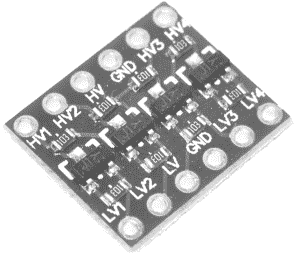

图 19-3：四通道电平转换器板

在购买电平转换器时，选择一个四通道的设备，比如图 19-3 中的设备。这样，你可以同时使用 SPI 和 I²C 数据总线，而不会用完转换器的引脚。

Arduino Uno 和 ESP32 之间的最后一个区别是，尽管 ESP32 和 Uno 具有相同的物理外形尺寸，但它们的引脚排布是不同的，具体如下所示 表 19-1。这也意味着某些 Arduino 扩展板可能无法与 ESP32 开发板兼容，因此在购买用于 ESP32 的扩展板之前，需先了解其所需的连接方式。

表 19-1： ESP32 和 Arduino 引脚排布比较

| Arduino 标签 | Uno R3 | ESP32 | Arduino 标签 | Uno R3 | ESP32 |
| --- | --- | --- | --- | --- | --- |
| I2C 时钟 | SCL | SCL | 数字 I/O | D3 | IO25 |
| I2C 数据 | SDA | SDA | 数字 I/O | D2 | IO26 |
| 模拟参考 | AREF | RESET | 数字 I/O | D1 | 仅 TX |
| GND | GND | GND | 数字 I/O | D0 | 仅 RX |
| 数字 I/O | D13 | IO18 | 模拟输入 | A5 | IO39 |
| 数字 I/O | D12 | IO19 | 模拟输入 | A4 | IO36 |
| 数字 I/O | D11 | IO23 | 模拟输入 | A3 | IO34 |
| 数字 I/O | D10 | IO5 | 模拟输入 | A2 | IO35 |
| 数字 I/O | D9 | IO13 | 模拟输入 | A1 | IO4 |
| 数字 I/O | D8 | IO12 | 模拟输入 | A0 | IO2 |
| 数字 I/O | D7 | IO14 | 板载电压 | IOREF | IO0 |
| 数字 I/O | D6 | IO27 | 重置 MCU | RESET | RESET |
| 数字 I/O | D5 | IO16 | 3.3 V 输出 | 3.3V | 3.3V |
| 数字 I/O | D4 | IO17 | 5 V 输出 | 5V | 5V |
|  |  |  | GND | GND | GND |
|  |  |  | GND | GND | GND |
|  |  |  | 原始电压输入 | Vin | Vin |

ESP32 上标记为 IO*xx* 的引脚是（3.3 V）数字输入和输出引脚。在 Arduino 草图中引用这些引脚时，不需要包含 IO，只需使用数字编号。我很快会演示这一点。

> 注意

*端口操作在 ESP32 板上无法使用。引脚可能还具有表格中未显示的其他功能，但对于本章中的项目，你只会使用表格中显示的功能。*

## 为 ESP32 配置 Arduino IDE

Arduino IDE 默认没有预装 ESP32 板，因此你需要安装所需的文件。拿起你的 ESP32，打开 Arduino IDE，选择 **文件**  **首选项**。当首选项对话框出现时，点击附加板管理器 URL 字段旁的小按钮，附加板管理器 URL 对话框应该会出现，如 图 19-4 所示。

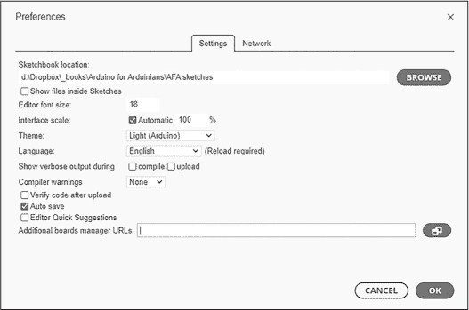

图 19-4：Arduino IDE 附加板管理器 URL 对话框

在对话框中输入以下 URL：

```
**https://dl.espressif.com/dl/package_esp32_index.json** 
```

如果对话框中已经有其他 URL，在最后一个 URL 后添加逗号，并将新 URL 粘贴到逗号后面。

点击**确定**关闭首选项对话框。现在关闭并重新打开 IDE。如果你的电脑未连接到互联网，请现在连接。选择**工具**  **板管理器**。打开板管理器后，在搜索框中输入**ESP32**。ESP32 软件包应显示在列表中。请始终使用最新版本。

点击**安装**并等待片刻，直到进度条显示过程完成，如“板管理器”对话框底部所示。

由于 ESP32 使用的是与 Arduino Uno 或兼容板不同的 CH340 USB 到串口接口，你需要为计算机安装相应的驱动程序。为此，请按照 SparkFun 提供的指南，访问 [*https://<wbr>learn<wbr>.sparkfun<wbr>.com<wbr>/tutorials<wbr>/how<wbr>-to<wbr>-install<wbr>-ch340<wbr>-drivers<wbr>/all*](https://learn.sparkfun.com/tutorials/how-to-install-ch340-drivers/all)。安装驱动程序后，通过 USB 线将 ESP32 开发板连接到 PC。

如果你的电脑上还没有安装最新版本的 Python，你还需要下载并安装它，因为 Arduino IDE 需要它作为工具链的一部分，以便将代码上传到 ESP32 板。如果需要，请访问 [*https://<wbr>www<wbr>.python<wbr>.org<wbr>/downloads*](https://www.python.org/downloads)，根据你的操作系统选择并安装。

安装完 Python 后，macOS 用户可能需要打开终端并运行以下命令，然后再重新打开 Arduino IDE：

```
**Open -a Arduino** 
```

现在打开 Arduino IDE，选择**工具**，并将所有设置从板开始更改为与图 19-5 中所示的设置相匹配。

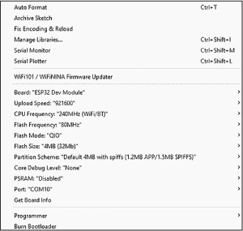

图 19-5：Arduino IDE 中的 ESP32 板设置

唯一可能因你的计算机而有所不同的参数是 USB 端口；请选择显示的适当端口。

## 测试 ESP32

在开始本章第一个项目之前，先测试开发板，确保你可以上传草图，操作 GPIO 引脚，并连接 Wi-Fi。

### GPIO 引脚

首先，尝试通过构建经典的测试电路来控制一些 GPIO 引脚，电路会闪烁一些 LED 灯。你需要以下材料：

+   一块 ESP32 开发板和匹配的 USB 电缆

+   一块无焊面包板

+   各种跳线

+   四个 LED 灯

+   一个 560 Ω，0.25 W，1% 的电阻器

按照图 19-6 中的示意图组装电路。

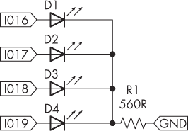

图 19-6：一个用于测试目的的基本四 LED 电路。

现在输入并上传列出 19-1 到你的 ESP32 开发板。上传草图后，片刻之内，每个 LED 灯应该依次打开和关闭。

```
void setup()
{
  ❶ pinMode(16, OUTPUT);
    pinMode(17, OUTPUT);
    pinMode(18, OUTPUT);
    pinMode(19, OUTPUT);
}

void blinkLEDs()
{
    int i;
    int d = 250;
    for (i = 16; i < 20; i++)
    {
      ❷ digitalWrite(i, HIGH);
        delay(d);
      ❸ digitalWrite(i, LOW);
    }
}

void loop()
{
    blinkLEDs();
} 
```

清单 19-1：测试来自 ESP32 开发板的输出

尽管 GPIO 引脚的硬件描述是 IO*xx*，如表 19-1 所示，但草图在设置 GPIO 引脚状态❶并控制它们的开关❷❸时，仅通过其数字标识符来引用引脚。

如果你的草图没有上传，检查之前章节中描述的板卡类型和参数设置。完成此测试后，请保持电路组装，因为你将在接下来的项目中使用它。

### Wi-Fi 连接性

你现在将测试 ESP32 的 Wi-Fi 连接性，使用 ESP32 开发板配置文件中包含的 WiFiScan 草图，该草图会扫描你周围的 Wi-Fi 网络。

你无需额外的硬件，除了开发板、USB 线和 Wi-Fi 网络。通过 IDE 的示例上传草图，路径为**文件**  **示例**  **WiFi**  **WiFiScan**，然后在 Arduino IDE 中打开串行监视器。过一会儿，开发板应该会搜索 Wi-Fi 接入点的存在，并列出它们以及信号强度，如图 19-7 所示。

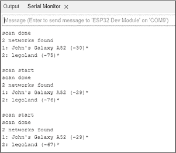

图 19-7：扫描 Wi-Fi 接入点的示例结果

串行监视器仅显示接入点的名称，而不显示连接是否开放。如果你想了解信号强度的含义，可以访问[*https://<wbr>en<wbr>.wikipedia<wbr>.org<wbr>/wiki<wbr>/Received<wbr>_signal<wbr>_strength<wbr>_indication*](https://en.wikipedia.org/wiki/Received_signal_strength_indication)获取更多信息。

## 端口转发

若要从未连接到本地网络的设备（如通过蜂窝连接的平板电脑或手机）控制你的项目，并且这些设备没有静态 IP 地址，你需要使用一种叫做*端口转发*的技术，这需要在你的网络路由器或调制解调器中设置。端口转发可以从外部提供商获取静态 IP 地址，然后将数据直接转发到你的设备。

端口转发服务由一些组织提供，如 No-IP（[*https://<wbr>www<wbr>.noip<wbr>.com*](https://www.noip.com)）和 Dyn（[*https://<wbr>account<wbr>.dyn<wbr>.com*](https://account.dyn.com)）。设置通常与路由器的品牌和型号有关，因此可以在互联网上搜索你的路由器型号的*路由器端口转发*。另外，你也可以向提供路由器的 ISP 咨询，或者访问如[*http://<wbr>www<wbr>.wikihow<wbr>.com<wbr>/Port<wbr>-Forward*](http://www.wikihow.com/Port-Forward)的教程网站获取更多信息。

一旦你设置了端口转发或以其他方式确认了静态 IP 地址，你就可以开始构建远程控制应用程序的框架了。不过，如果你无法设置端口转发，你仍然可以通过本地 Wi-Fi 网络控制你的项目。

项目 #55：远程控制单个 GPIO 引脚

在这个项目中，你将通过任何带有网页浏览器的设备远程控制你的 ESP32 开发板上的 GPIO 引脚。这包括使用 HTML 和 CSS 构建一个由 ESP32 托管的简单网页。然后，你可以使用这个网页控制任何通常用 Arduino 3.3 V（或通过电平转换器转换为 5 V）数字输出控制的设备，例如继电器、MOSFET、LED 等。

对于硬件，使用前一节中描述的 GPIO 引脚测试电路。输入并上传项目 #55 的草图到你的 ESP32 开发板。在上传之前，别忘了在草图中更新你的 Wi-Fi 网络凭证。上传后，稍等片刻，打开 Arduino IDE 中的串口监视器，观察 ESP32 连接 Wi-Fi 网络的过程。草图应该显示你项目的 IP 地址，如图 19-8 所示。

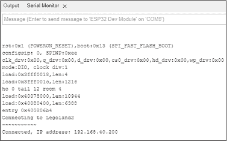

图 19-8：串口监视器显示 ESP32 已连接到 Wi-Fi 网络

接下来，使用带有网页浏览器的设备，访问串口监视器中显示的 IP 地址。你应该能看到由 ESP32 开发板托管的简单网页，如图 19-9 所示。

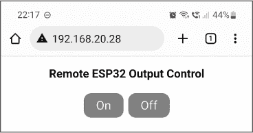

图 19-9：远程控制网页

当你点击开（On）或关（Off）按钮时，连接到 GPIO 16 的 LED 应该会开关。在这个项目中，ESP32 开发板有两个任务：一是作为网页服务器托管用户界面的简单网页（包括开/关按钮），二是响应网页浏览器的 HTML 请求（打开或关闭 GPIO 引脚）。

让我们更详细地了解一下它是如何工作的：

```
// Project #55 - Digital output control via web page

#include <WiFi.h> ❶
WiFiServer server(80); // Set web server port to 80

// Store your Wi-Fi network credentials:
char* ssid = "`name`"; // Insert name of Wi-Fi access point
char* password = "`password`"; // Insert password

String request; // Stores HTTP request from client (web browser)
int outputPin = 16; // Using GPIO pin 16 on the ESP32 board

unsigned long currentTime = millis(); ❷
unsigned long previousTime = 0;
const long timeoutTime = 2000; // Allowed client connection time

void setup()
{
    Serial.begin(115200);
    // Set up digital pin to control
    pinMode(outputPin, OUTPUT);
    digitalWrite(outputPin, LOW);

    // Connect to Wi-Fi network:
    Serial.print("Connecting to ");
    Serial.println(ssid);
    WiFi.begin(ssid, password);
    while (WiFi.status() != WL_CONNECTED)
    // Show indicator while waiting for connection:
    {
        delay(500);
        Serial.print("~");
    }
    Serial.println(); // Display local IP address on Serial Monitor
    Serial.print("Connected, IP address: ");
    Serial.println(WiFi.localIP());
    // Start web server
    server.begin();
}

void loop()
{
    // Listen for incoming clients from web browser: ❸
    WiFiClient client = server.available();
    if (client) // If a request received
    {
        currentTime = millis();
        previousTime = currentTime;
        Serial.println("New client connected");
        String currentLine = " ";
        while (client.connected() && currentTime - previousTime <= timeoutTime)
        {// Stay connected for timeoutTime
            currentTime = millis();
            if (client.available())
            {
                // Display data from client on Serial Monitor:
                char c = client.read(); ❹
                Serial.write(c);
                request += c;
 if (c == '\n') // Client request has finished
                {
                    if (currentLine.length() == 0)
                    {
                        // Send HTTP response to client:
                        client.println("HTTP/1.1 200"OK");
                        client.println("Content-type:text/h"ml");
                        client.println("Connection: cl"se");
                        client.println();
                        // Now do things based on the client request:
                        if (request.indexOf("GET /16/on") >= 0) ❺
                        {
                            // If request was IP address/16/on:
                            Serial.println("output on");
                            digitalWrite(outputPin, HIGH);
                        } else if (request.indexOf("GET /16/off") >= 0) ❻
                        // If request was IP address/16/off:
                        {
                            Serial.println("output off");
                            digitalWrite(outputPin, LOW);
                        }
                        // Build web page for display on browser:
                        client.println("<!DOCTYPE html><html>");
                        client.print("<head><meta name=\"viewport\");
                        client.println(" content=\"width=device-width, initial-scale=1\">");
                        client.println("<link rel=\"icon\" href=\"data:,\ ">");
                        // Build buttons using CSS:
                        client.print("<style>html {font-family: Helvetica; display:");
                        client.print("inline-block; margin: 0px auto; text-align: center;}");
                        client.println();
                        client.print (".button {background-color: #ff0000; border: ");
                        client.println("none; color: white; padding: 8px 20px;");
                        client.print ("text-decoration: none; font-size: 20px; margin: ");
                        client.println("2px; cursor: pointer; border-radius: 12px;}");
                        client.println("</style></head>");
                        // Now HTML for layout:
                        client.println("<body><h3>Remote ESP32 Output Control</h3>");
                        // Display "On" button with matching HTML "/16/on":
                        client.print ("<p><a href=\"/16/on\"><button ");
                        client.println("class=\"button\">On</button></a>");
                        // Display "Off" button with matching HTML "/16/off":
                        client.print ("<a href=\"/16/off\"><button class");
                        client.println("=\"button\">Off</button></a></p>");
                        client.println("</body></html>");
                        // End the response to client request:
                        client.println();
                        break;
                    } else
                    {// If you got a newline, then clear currentLine
                        currentLine = " ";
                    }
                } else if (c != '\r')
                {
                    currentLine += c;
 }
            }
        }
        request = " "; ❼
        // Close connection to client:
        client.stop();
        Serial.println("Disconnected.");
    }
}
```

首先，草图包含了 Arduino Wi-Fi 库 ❶，并创建了一个端口为 80 的服务器实例。接下来，它将 SSID（Wi-Fi 接入点名称）和密码存储在相应的字段中。它声明了一个字符串变量，用来存储来自客户端（显示项目网页的网页浏览器）的 HTTP 请求文本，然后设置它将控制的 GPIO 引脚。

草图接着声明了变量来处理每个客户端与服务器（ESP32 开发板）连接时允许的时间 ❷。在 void setup() 中，它配置了串口监视器，然后将 GPIO16 设置为输出并拉低。ESP32 使用之前输入的凭据尝试连接 Wi-Fi 网络，代码会每半秒循环一次并显示波浪线 (~)，直到网络连接成功。一旦 ESP32 成功连接到 Wi-Fi，草图将在串口监视器中显示 IP 地址，项目也开始作为一个网页服务器运行，这都得益于 server.begin()。

ESP32 接下来会运行 void loop() 中的代码，直到重置或断电。每次循环开始时，代码会检查是否有客户端（使用网页浏览器的人）尝试连接到项目 ❸。如果是，代码会记录连接开始的时间点，使用 millis() 函数，以确保每个客户端最多连接到 ESP32 两秒钟（如 timeoutTime 设置的时间）。这是因为其他用户也可能想要访问，你不希望某一个人占用项目的访问权限。代码还会清空字符串变量 currentLine，等待客户端发送的文本。

如果客户端连接时间少于 2000 毫秒并已发出请求，ESP32 会接收到该请求。代码将最新的 millis() 值赋给 currentTime 变量。字符串请求按一个字符接收客户端请求 ❹。该请求会显示在串口监视器中，以便你如果好奇的话，可以查看客户端发送的信息（浏览器类型、设备操作系统等）。一旦客户端完成发送请求，并以换行符 (\n) 标记，ESP32 就会以 HTML 格式向客户端浏览器发送响应。为此，它使用 client.println() 函数，通过 Wi-Fi 连接发送文本，就像你在其他项目中使用 Serial.println() 一样。

ESP32 最终可以响应客户端请求并执行操作。客户端请求以 /16/on 或 /16/off 的形式接收，因此该字符串请求会依次搜索开启命令 ❺ 并执行，通过将其发送到串口监视器并打开 GPIO16；如果收到关闭命令，则会发生相反的操作 ❻。这是你可以根据自己的需要修改操作的地方。这个项目只是调用了一个 digitalWrite() 函数，你可以用自己的函数替换它，让 ESP32 执行你自己选择的操作。

代码的最后一部分使 ESP32 托管了简单的网页，即用户界面，如 图 19-10 所示。通过多个 client.println() 函数，代码生成 HTML，创建网页的框架，使用 CSS 定义要显示的按钮，定位按钮，并发送 HTML 来定义网页的结束。一旦客户端请求完成，草图会从变量中刷新请求 ❼ 并关闭连接，为下一个用户做好准备。

让我们仔细看看 `client.println()` 函数中包含的 HTML：

```
<!DOCTYPE html><html>
<head><meta name=\"viewport\" content=\"width=device-width, initial-scale=1\">
<link rel=\"icon\" href=\"data:,\">
<style>html {font-family: Helvetica; display: inline-block;
 margin: 0px auto; text-align: center;}
.button {background-color: #ff0000; border: none; color: white; padding: 8px 20px;
text-decoration: none; font-size: 20px; margin: 2px; cursor: pointer; border-radius: 12px;} ❶
</style></head>
<body><h3>Remote ESP32 Output Control</h3> ❷
<p><a href=\"/16/on\"><button class=\"button\">On</button></a> ❸
<a href=\"/16/off\"><button class=\"button\">Off</button></a></p> ❹
</body></html>
```

这段代码使用 CSS 来选择网页界面按钮的颜色、大小、字体大小和圆角 ❶，并将标题显示为更大的字体 ❷。然后，它将两个按钮添加到网页中。每个按钮都附有一个指向其各自操作的超链接：第一个链接是 /16/on ❸，第二个是 /16/off ❹。当用户点击其中任何一个按钮时，客户端请求将包括 ESP32 的 IP 地址，后跟 */16/on*——例如 *http://<wbr>192<wbr>.168<wbr>.20<wbr>.28<wbr>/16<wbr>/on*。

如果你将鼠标悬停在网页上的按钮上，链接应该会出现在屏幕底部。例如，图 19-10 显示了当鼠标悬停在开启按钮上时的情况。（浏览器标签页顶部的 URL 是我上次访问页面的地址，点击关闭按钮后的结果。）

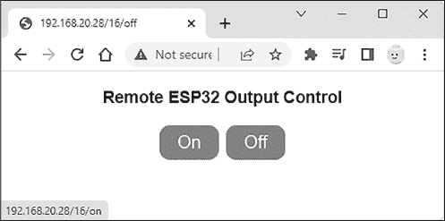

图 19-10：在浏览器中显示的示例超链接

当在较为永久的基础上安装项目时，最终用户也可以为每个功能添加完整的 URL 书签。例如，如果项目返回的 IP 地址是 192.168.20.28，则需要打开的书签为 *http://<wbr>192<wbr>.168<wbr>.20<wbr>.28<wbr>/16<wbr>/on*。

请注意，任何拥有此类型项目的 URL 地址的人都可以操作控制按钮。为了提高安全性，你可以创建一个安全的网站或门户，设置密码保护以限制对控制按钮的访问。

项目#56：远程控制四个 GPIO 引脚

这个项目基于之前的项目，允许你远程控制四个 GPIO 引脚，并在 ESP32 主机托管的网页上显示其状态。用户可以快速查看被控制设备的状态，这对于真正的远程控制项目非常理想。

你将使用与“GPIO 引脚”一节中描述的相同演示电路（这就是为什么它包括四个 LED）。设置好电路后，输入并上传项目#56 的草图到你的 ESP32 开发板。上传后不久，打开 Arduino IDE 中的串口监视器，观察 ESP32 如何连接到 Wi-Fi 网络。

一旦 ESP32 连接，项目的 IP 地址应出现在串口监视器中。将该 IP 地址输入到网页浏览器中，项目的界面应显示出来，如图 19-11 所示。

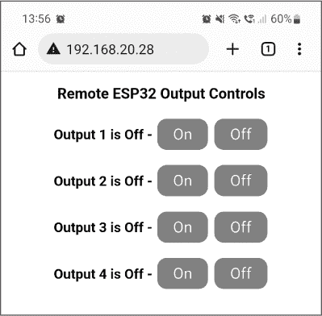

图 19-11：项目#56 的用户界面

你应该能够通过点击相应按钮控制所有四个 LED。每次点击按钮后，网页应显示已连接 LED 的状态。例如，图 19-12 显示输出 2 和 4 已开启。

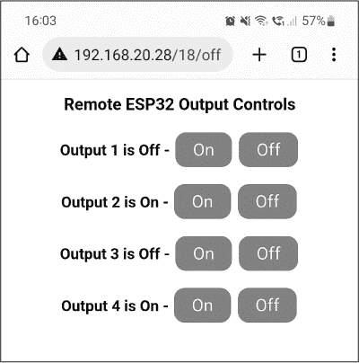

图 19-12：输出 2 和 4 已开启，而 1 和 3 关闭。

你可以想象，拥有四组按钮，能够控制更多的继电器、输出、由 MOSFET 控制的设备等，这将变得多么有用。

让我们仔细看看它是如何工作的：

```
// Project #56 - Digital output controls via web page with status update

#include <WiFi.h>
WiFiServer server(80); // Set web server port to 80

// Store your Wi-Fi network credentials:
char* ssid = "`name`"; // Insert name of Wi-Fi access point
char* password = "`password`"; // Insert password

String request; // Stores HTTP request from client (web browser)
String outputPin1State = "Off"; ❶
String outputPin2State = "Off";
String outputPin3State = "Off";
String outputPin4State = "Off";

int outputPin1 = 16; // Using GPIO pins 16~19 on the ESP32 board ❷
int outputPin2 = 17;
int outputPin3 = 18;
int outputPin4 = 19;

unsigned long currentTime = millis();
unsigned long previousTime = 0;
const long timeoutTime = 2000; // Allowed client connection time

void setup()
{
    Serial.begin(115200);
    // Set up digital pins to control:
    pinMode(outputPin1, OUTPUT); ❸
    pinMode(outputPin2, OUTPUT);
    pinMode(outputPin3, OUTPUT);
    pinMode(outputPin4, OUTPUT);
    digitalWrite(outputPin1, LOW);
    digitalWrite(outputPin2, LOW);
    digitalWrite(outputPin3, LOW);
    digitalWrite(outputPin4, LOW);
    // Connect to Wi-Fi network:
    Serial.print("Connecting to ");
    Serial.println(ssid);
    WiFi.begin(ssid, password);
    while (WiFi.status() != WL_CONNECTED)
    // Show indicator while waiting for connection:
    {
        delay(500);
        Serial.print("~");
    }
    Serial.println(); // Display local IP address on Serial Monitor
    Serial.print("Connected, IP address: ");
    Serial.println(WiFi.localIP());
    // Start web server:
    server.begin();
}

void loop()
{
    // Listen for incoming clients from web browser:
    WiFiClient client = server.available();
    if (client) // If a request received
    {
        currentTime = millis();
        previousTime = currentTime;
        Serial.println("New client connected");
        String currentLine = " ";
        while (client.connected() && currentTime—previousTime <= timeoutTime)
        {// Stay connected for timeoutTime
            currentTime = millis();
            if (client.available())
            {
                char c = client.read(); // Display data from client on Serial Monitor
                Serial.write(c);
                request += c;
                if (c == '\n')
                {
                    // Client request has finished
                    if (currentLine.length() == 0)
                    {
                        // Send HTTP response back to client
                        client.println("HTTP/1.1 200 OK");
                        client.println("Content-type:text/html");
                        client.println("Connection: close");
                        client.println();
                        // Now do things based on the client request:
                        if (request.indexOf("GET /16/on") >= 0) ❹
                        {
                            // If request was IP address/16/on:
                            Serial.println("output 1 on");
                            outputPin1State = "On"; ❺
                            digitalWrite(outputPin1, HIGH);
                        } else if (request.indexOf("GET /16/off") >= 0)
                        {
                            // If request was IP address/16/off:
                            Serial.println("output 1 off");
                            outputPin1State = "Off";
                            digitalWrite(outputPin1, LOW);
                        } else if (request.indexOf("GET /17/on") >= 0)
                        {
                        // If request was IP address/17/on:
                            Serial.println("output 2 on");
                            outputPin2State = "On";
                            digitalWrite(outputPin2, HIGH);
                        } else if (request.indexOf("GET /17/off") >= 0)
                        // If request was IP address/17/off:
                            {
                            Serial.println("output 2 off");
                            outputPin2State = "Off";
                            digitalWrite(outputPin2, LOW);
                                }
                    else if (request.indexOf("GET /18/on") >= 0)
 {
                        // If request was IP address/18/on:
                        Serial.println("output 3 on");
                        outputPin3State = "On";
                        digitalWrite(outputPin3, HIGH);
                    } else if (request.indexOf("GET /18/off") >= 0)
                    // If request was IP address/18/off:
                    {
                        Serial.println("output 3 off");
                        outputPin3State = "Off";
                        digitalWrite(outputPin3, LOW);
                    }
                    else if (request.indexOf("GET /19/on") >= 0)
                    {
                        // If request was IP address/19/on:
                        Serial.println("output 4 on");
                        outputPin4State = "On";
                        digitalWrite(outputPin4, HIGH);
                    } else if (request.indexOf("GET /19/off") >= 0)
                    // If request was IP address/19/off:
                    {
                        outputPin4State = "Off";
                        Serial.println("output 4 off");
                        digitalWrite(outputPin4, LOW);
                    }

                    // Build web page for display on browser:
                    client.println("<!DOCTYPE html><html>");
                    client.print("<head><meta name=\"viewport\" content=\"width=");
                    client.println("device-width, initial-scale=1\">");
                    client.println("<link rel=\"icon\" href=\"data:,\">");
                    // Build buttons using CSS:
                    client.print("<style>html {font-family: Helvetica; display: inline-block;");
                    client.print("margin: 0px auto; text-align: center;} ");
                    client.print(".button {background-color: #ff0000; border: none; color: ");
                    client.print("white; padding: 8px 20px; ");
                    client.print("text-decoration: none; font-size: 20px; margin: 2px; ");
                    client.println("cursor: pointer; border-radius: 12px;} ");

                    client.println("</style></head>");
                    // Now HTML for layout:
                    client.println("<body><h3>Remote ESP32 Output Controls</h3>");
                    client.println("<p><b>Output 1 is ");
                    client.println(outputPin1State); ❻
                    client.print(" - </b><a href=\"/16/on\"><button);
                    client.println("class=\"button\">On</button></a>");
                    client.print("<a href=\"/16/off\"><button");
                    client.println("class=\"button\">Off</button></a></p>");
                    client.println("<p><b>Output 2 is ");
                    client.println(outputPin2State);
                    client.print(" - </b><a href=\"/17/on\"><button ");
                    client.println("class=\"button\">On</button></a>");
                    client.print("<a href=\"/17/off\"><button");
                    client.println("class=\"button\">Off</button></a></p>");
 client.println("<p><b>Output 3 is ");
                    client.println(outputPin3State);
                    client.print(" - </b><a href=\"/18/on\"><button ");
                    client.println("class=\"button\">On</button></a>");
                    client.print ("<a href=\"/18/off\"><button ");
                    client.println("class=\"button\">Off</button></a></p>");
                    client.println("<p><b>Output 4 is ");
                    client.println(outputPin4State);
                    client.print(" - </b><a href=\"/19/on\"><button");
                    client.println("class=\"button\">On</button></a>");
                    client.print ("<a href=\"/19/off\"><button");
                    client.println(" class=\"button\">Off</button></a></p>");
                    client.println("</body></html>");
                    // End the response to client request:
                    client.println();
                    break;
                } else
                {// If you got a newline, then clear currentLine
                    currentLine = " ";
                }
              } else if (c != '\r')
                {
                    currentLine += c;
                }
            }
        }
        request = " ";
        // Close connection to client:
        client.stop();
        Serial.println("Disconnected.");
    }
}
```

这个项目的框架与之前的项目相同，唯一不同的是它控制四个 GPIO 引脚和八个按钮，并跟踪 GPIO 的状态。这个草图使用了四个字符串变量来存储四个 GPIO 引脚的状态，以文本形式表示“开”或“关”，并声明它们的默认值为“关”❶。为了避免混淆，草图还声明了变量，为每个 GPIO 引脚指定一个名称，而不是在代码中使用数字❷。然后，它将引脚设置为输出，并设定为 LOW❸。

由于现在有八个按钮和八个相应的操作（每个 GPIO 的开与关），需要注意八个客户端请求❹。每次操作完成后，匹配 GPIO 的状态将在其相应的状态变量中更新❺。这对所有八种客户端请求类型都适用。

再次强调，代码中使用了许多 client.println() 函数来生成用户界面的 HTML。项目代码中的 ❻ 位置的函数生成了显示每个 GPIO 引脚状态所需的 HTML。草图还为每个按钮附加了超链接（使用 <a href=），例如 /16/on 用于开启 GPIO 16，等等。

这是草图中包含的完整 HTML 代码：

```
<!DOCTYPE html><html>
<head><meta name=\"viewport\" content=\"width=device-width, initial-scale=1\">
<link rel=\"icon\" href=\"data:,\">
<style>html {font-family: Helvetica; display: inline-block;
margin: 0px auto; text-align: center;}
".button {background-color: #ff0000; border: none; color: white; padding: 8px 20px;"
"text-decoration: none; font-size: 20px; margin: 2px; cursor: pointer; border-radius: 12px;}"
</style></head>
<body><h3>Remote ESP32 Output Controls</h3>
<p><b>Output 1 is "
// Insert outputPin1State:
" - </b><a href=\"/16/on\"><button class=\"button\">On</button></a>
<a href=\"/16/off\"><button class=\"button\">Off</button></a></p>
<p><b>Output 2 is "
// Insert outputPin2State:
" - </b><a href=\"/17/on\"><button class=\"button\">On</button></a>
<a href=\"/17/off\"><button class=\"button\">Off</button></a></p>
<p><b>Output 3 is "
// Insert outputPin3State:
" - </b><a href=\"/18/on\"><button class=\"button\">On</button></a>"
"<a href=\"/18/off\"><button class=\"button\">Off</button></a></p>
<p><b>Output 4 is ");
// Insert outputPin4State:
" - </b><a href=\"/19/on\"><button class=\"button\">On</button></a>
<a href=\"/19/off\"><button class=\"button\">Off</button></a></p>
</body></html>
```

我鼓励你尝试修改按钮的大小、形状、链接等内容，以帮助你掌握构建界面的过程。

保持该项目的电路已组装好。你将在下一部分使用它，学习如何在 ESP32 开发板上使用脉冲宽度调制。

## 脉冲宽度调制

就像通常的 Arduino 和兼容板一样，ESP32 开发板提供了所有 GPIO 引脚的脉冲宽度调制（PWM）。PWM 使你能够控制 LED 的感知亮度，而不仅仅是开关 LED。LED 的亮度由占空比决定，即 GPIO 引脚处于开启状态的时间（LED 点亮）与关闭状态的时间（LED 熄灭）的比例。

占空比是指引脚在每个 *周期* 中处于开启状态的时间百分比，周期是指引脚可以开或关的固定时间段。占空比越大，连接到引脚的 LED 的感知亮度就越高。此外，PWM 信号的频率越高，即信号开关的速度越快，视觉效果越平滑。如果你在控制电机，更高的 PWM 频率使得转速更加接近所需的实际速度。

图 19-13 展示了四种可能的 PWM 占空比。填充的灰色区域表示 LED 点亮的时间；如你所见，随着占空比的增加，这一时间也在增加。

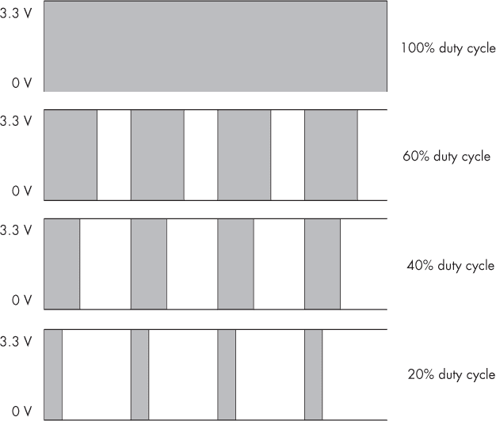

图 19-13：各种 PWM 占空比

ESP32 模块有 16 个 PWM 通道（编号 0 到 15）。你可以将每个通道指向一个 GPIO 引脚。为了做到这一点，你需要为每个要使用的引脚在 `void setup()` 中添加两行代码。第一行是

```
ledcSetup(`channel`, `frequency`, `resolution`); 
```

其中，channel是要使用的 PWM 通道（0 到 15），frequency是 PWM 频率，resolution是占空比的精度。对于frequency，我建议使用 5,000，即 5 kHz。对于resolution，使用 8 位分辨率，得到一个 0 到 255 之间的值用于占空比（就像你在使用 Arduino 或兼容板时使用analogWrite()一样）。

第二行需要的是

```
ledcAttachPin(`GPIO`, `channel`); 
```

其中，GPIO是要使用的 GPIO 引脚的编号，channel是要使用的 PWM 通道，正如前一行代码中所定义的。

最后，若要在 GPIO 上启用 PWM，使用

```
ledcWrite(`channel`, `dutyCycle`); 
```

其中，channel是要控制的 PWM 通道，dutyCycle当然是占空比。

要停止在特定 GPIO 引脚上使用 PWM，并改为将其用作数字输入或输出，使用

```
ledcDetachPin(`GPIO`); 
```

其中，GPIO是 GPIO 引脚的编号（而非 PWM 通道）。

你可以使用以下示例代码测试 PWM，并尝试这些参数，该代码使用了你在本章中一直使用的相同四个 LED 电路。在你输入并上传清单 19-2 后，所有四个 LED 应该会使用 PWM 展现“呼吸”效果，通过增加和减少占空比值来实现。

```
void setup()
{
  ❶ ledcSetup(0, 5000, 8); // LED channel, frequency, resolution (8-bit)
    ledcSetup(1, 5000, 8);
    ledcSetup(2, 5000, 8);
    ledcSetup(3, 5000, 8);

  ❷ ledcAttachPin(16, 0); // GPIO, LED channel
    ledcAttachPin(17, 1);
    ledcAttachPin(18, 2);
    ledcAttachPin(19, 3);
}

void loop()
{
    int dutyCycle;
    for (dutyCycle = 0; dutyCycle <= 255; dutyCycle++)
    {
      ❸ ledcWrite(0, dutyCycle);
        ledcWrite(1, dutyCycle);
        ledcWrite(2, dutyCycle);
        ledcWrite(3, dutyCycle);
        delay(10);
    }
    for (dutyCycle = 255; dutyCycle > −0; dutyCycle--)
    {
      ❹ ledcWrite(0, dutyCycle);
        ledcWrite(1, dutyCycle);
        ledcWrite(2, dutyCycle);
        ledcWrite(3, dutyCycle);
        delay(10);
    }
} 
```

清单 19-2：测试 PWM 输出

这个示例演示了使用 PWM 的三行相关代码，设置所需的 PWM 通道❶，然后将这些通道连接到 GPIO 引脚❷。这允许为每个引脚设置占空比，并按递增❸和递减❹的方式调整。

你将在下一个项目中使用这一技巧。

项目 #57：构建用于用户界面的托管网页

本项目综合了你在本章中学到的所有内容：使用 ESP32 开发板通过 Wi-Fi 控制 GPIO，使用 PWM 控制不同的输出电平，并构建一个用于用户界面的托管网页。你可以将其作为框架，构建需要 PWM 控制的项目，如 LED 灯光效果、通过 MOSFET 控制直流电机，或远程实验声音效果。

这个项目使用与之前项目相同的电路，仅控制连接到 GPIO16 的一个 LED。当电路准备好并且 ESP32 开发板已连接到 PC 时，上传 Project #57 的草图。稍等片刻，像往常一样通过串口监视器确定项目的 IP 地址，然后在浏览器中输入该地址。浏览器应该会显示项目的界面，如图 19-14 所示。

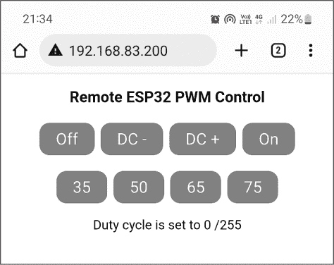

图 19-14：Project #57 的用户界面

你应该能够像往常一样通过适当的按钮打开或关闭 LED。不过这次，你还可以通过 DC−和 DC+按钮逐步减少或增加占空比。你可以点击第二排的四个附加按钮为占空比设置预设值，下面的文本行显示当前的占空比值。例如，图 19-14 显示 LED 关闭（因为占空比为 0），而在图 19-15 中，LED 亮起，占空比为 72/255。

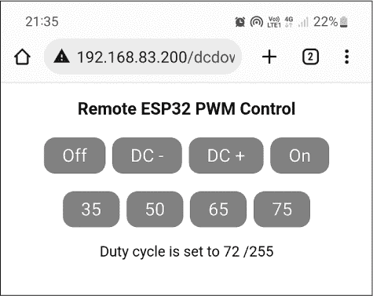

图 19-15：占空比设置为 72/255 的用户界面

让我们看看这是如何工作的：

```
// Project #57 - ESP32 Remote Control PWM Output

#include <WiFi.h>
WiFiServer server(80); // Set webserver port to 80

// Store your Wi-Fi network credentials:
char* ssid = "`name`"; // Insert name of Wi-Fi access point
char* password = "`password`"; // Insert password

int outputPin1 = 16;
int dutyCycle = 0; ❶
String request; // Stores HTTP request from client (web browser)

unsigned long currentTime = millis();
unsigned long previousTime = 0;
const long timeoutTime = 2000; // Allowed client connection time

void pinOff()
{
    ledcDetachPin(16); // Disconnect from PWM
    digitalWrite(16, LOW); // Pin off
}

void pinOn()
{
    ledcDetachPin(16); // Disconnect from PWM
    digitalWrite(16, HIGH); // Usual turn pin on
}

void pinPWM(int dc)
{
 // Set up digital pin for PWM:
    ledcSetup(0, 5000, 8); // LED channel, frequency, resolution (8-bit)
    ledcAttachPin(16, 0);  // Attach PWM — GPIO, LED channel
    ledcWrite(0, dc);      // Set duty cycle
}

void setup()
{
    Serial.begin(115200);
    pinMode(16, OUTPUT);
    pinOff(); ❷

    // Connect to Wi-Fi network:
    Serial.print("Connecting to ");
    Serial.println(ssid);
    WiFi.begin(ssid, password);
    while (WiFi.status() != WL_CONNECTED)
    // Show indicator while waiting for connection:
    {
        delay(500);
        Serial.print("~");
    }
    Serial.println(); // Display local IP address on Serial Monitor
    Serial.print("Connected, IP address: ");
    Serial.println(WiFi.localIP());
    // Start web server:
    server.begin();
}

void loop()
{
    // Listen for incoming clients from web browser:
    WiFiClient client = server.available();
    if (client) // If a request received
    {
        currentTime = millis();
        previousTime = currentTime;
        Serial.println("New client connected");
        String currentLine = " ";
        while (client.connected() && currentTime—previousTime <= timeoutTime)
        {// Stay connected for timeoutTime
            currentTime = millis();
            if (client.available())
            {
                char c = client.read(); // Display data from client on Serial Monitor
                Serial.write(c);
                request += c;
                if (c == '\n') // Client request has finished
                {
                    if (currentLine.length() == 0)
                    {
                        // Send HTTP response back to client:
                        client.println("HTTP/1.1 200 OK");
 client.println("Content-type:text/html");
                        client.println("Connection: close");
                        client.println();

                        // Now do things based on the client request:
                        if (request.indexOf("GET /off") >= 0)
                        {
                            // If request was IP address/off:
                            pinOff(); ❸
                            dutyCycle = 0;
                        } else if (request.indexOf("GET /dcdown") >= 0)
                        // If request was reduced duty cycle:
                        {
                            if (dutyCycle >= 2) ❹
                            {
                                pinPWM(dutyCycle − 1);
                                dutyCycle−−;
                            } else if (dutyCycle <= 1)
                            {
                                pinOff();
                                dutyCycle = 0;
                            }

                        } else if (request.indexOf("GET /dcup") >= 0) ❺
                        {
                            // If request was increased duty cycle:
                            if (dutyCycle > 253)
                            {
                                pinOn();
                                dutyCycle = 255;
                            }
                            else if (dutyCycle <= 253)
                            {
                                pinPWM(dutyCycle + 1);
                                dutyCycle++;
                            }

                        } else if (request.indexOf("GET /on") >= 0) ❻
                        // If request was IP address/on:
                        {
                            pinOn();
                            dutyCycle = 255;
                        }
                        else if (request.indexOf("GET /35") >= 0) ❼
                        {
                            // If request was IP address/35:
                            pinPWM(35);
                            dutyCycle = 35;
                        } else if (request.indexOf("GET /50") >= 0)
                        // If request was IP address/50:
                        {
                            pinPWM(50);
 dutyCycle = 50;
                        }
                        else if (request.indexOf("GET /65") >= 0)
                        {
                            // If request was IP address/65:
                            pinPWM(65);
                            dutyCycle = 65;
                        } else if (request.indexOf("GET /75") >= 0)
                        // If request was IP address/75:
                        {
                            pinPWM(75);
                            dutyCycle = 75;
                        }

                        // Build web page for display on browser:
                        client.println("<!DOCTYPE html><html>");
                        client.print("<head><meta name=\"viewport\" content=\"width=device-width");
                        client.println(", initial-scale=1\">");
                        client.println("<link rel=\"icon\" href=\"data:,\">");
                        // Build buttons using CSS:
                        client.print("<style>html {font-family: Helvetica; display: inline-block; ");
                        client.println("margin: 0px auto; text-align: center;}");
                        client.print(".button {background-color: #ff0000; border: none; color: ");
                        client.println("white; padding: 8px 20px;");
                        client.print("text-decoration: none; font-size: 20px; margin: 2px; cursor: ");
                        client.println("pointer; border-radius: 12px;}");
                        client.println("</style></head>");
                        // Now HTML for layout:
                        client.println("<body><h3>Remote ESP32 PWM Control</h3>");
                        client.println("<p><a href=\"/off\"><button class=\"button\">Off</button></a>");
                        client.print("<a href=\"/dcdown\"><button class=\"button\"> ");
                        client.println("DC -</button></a>");
                        client.println(" <a href=\"/dcup\"><button class=\"button\">DC +</button></a>");
                        client.println(" <a href=\"/on\"><button class=\"button\">On</button></a></p>");
                        client.println("<p><a href=\"/35\"><button class=\"button\">35</button></a>");
                        client.println(" <a href=\"/50\"><button class=\"button\">50</button></a>");
                        client.println(" <a href=\"/60\"><button class=\"button\">65</button></a>");
                        client.println(" <a href=\"/75\"><button class=\"button\">75</button></a></p>");
                        client.println(" Duty cycle is set to ");
                        client.println(dutyCycle);
                        client.println("/255</p>");
 client.println("</body></html>");
                        // End the response to client request
                        client.println();
                        break;
                    } else {// If you got a newline, then clear currentLine
                    currentLine = " ";
                    }
                } else if (c != '\r')
                {
                    currentLine += c;
                }
            }
        }
        request = " ";
        // Close connection to client:
        client.stop();
        Serial.println("Disconnected.");
    }
}
```

该项目的操作类似于之前的项目，但按钮更多，状态显示方式也不同。

当用户更改 PWM 输出的占空比时，该值会存储在一个整数变量❶中。用户点击“Off”按钮时会调用自定义的pinOff()函数。由于无法通过将 PWM 设置为 0 占空比来关闭 GPIO 输出，因此该函数将 PWM 通道从 GPIO 引脚上分离，然后使用digitalWrite()关闭 GPIO 引脚。pinOn()函数则执行相反的操作；由于无法将 PWM 设置为完全开启，该函数将 PWM 通道分离，然后使用digitalWrite()打开 GPIO 引脚。

该草图使用自定义的PWM(int dc)函数来激活 PWM，将 PWM 通道连接到 GPIO 引脚，并设置所需的占空比，通过参数dc传入。当你第一次启动项目或重置它时，草图会关闭 GPIO 引脚❷。

接下来，草图回顾客户端请求。如果用户按下关闭按钮以关闭 GPIO 引脚，代码会调用pinOff()函数❸，并将dutyCycle变量设置为 0，以便在界面上显示。如果用户按下 DC 按钮❹，占空比会减少 1。如果这样会导致占空比低于 1，则使用pinOff()函数关闭 GPIO。同样，如果用户按下 DC+按钮❺，占空比增加 1。如果这样会导致占空比超过 254，则草图会使用pinOn()函数打开 GPIO。按下开启按钮❻会调用pinOn()函数，并将dutyCycle变量设置为 255，以便在界面上显示。

最后的四个按钮❼将占空比设置为预设值。它们仅作为示例，给你一个了解可能实现的功能的概念。每个请求只是通过pinPWM()设置 PWM 值，然后相应地更新dutyCycle变量。

## 继续前进

本章演示了如何通过专门设计的网页远程控制 ESP32 开发板，而不是控制操作，你也可以简单地在网页上显示通过 ESP32 生成的数据进行远程查看，例如来自传感器的数据。

在接下来的章节中，你将继续使用 ESP32。在下一章，你将学习如何通过与社交媒体互动来控制它。
