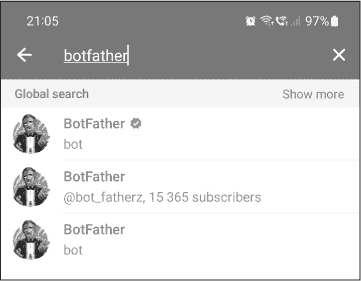
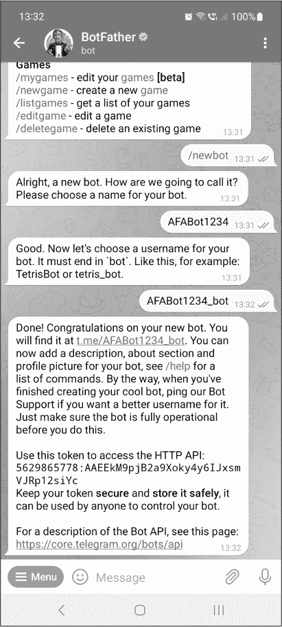
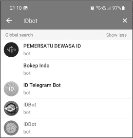
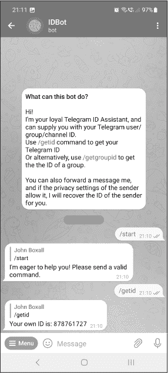
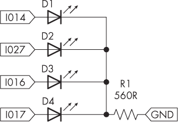
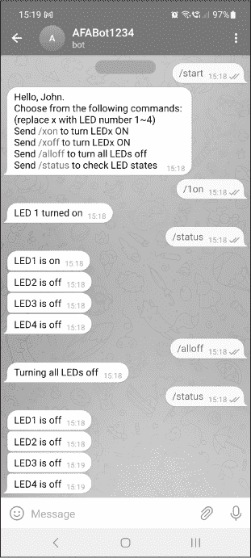
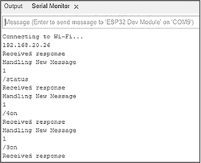
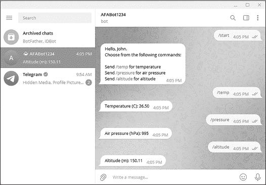
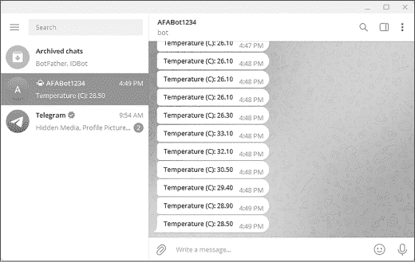

# 第二十章：20 通过 TELEGRAM 远程控制


从远程控制 Arduino，超出本地网络的范围，通常需要付费的物联网服务，例如 Blynk 或 Microsoft Azure，或者一些复杂的编码和时间。为了更简单且成本更低的远程控制方式，你可以使用 Telegram 即时消息服务和基于 ESP32 的 Arduino 兼容板。

Telegram 是一款免费的全球可访问的跨平台加密消息服务，允许用户以相对隐秘的方式进行一对一或群组聊天。得益于 Telegram 的自动化功能，你可以让 Arduino 控制一个 Telegram 用户账户，通过该服务发送和接收数据。这使你能够构建远程控制的设备，并使用 Telegram 从连接到互联网的 Arduino 远程请求数据。

在本章中，我将介绍 Telegram 应用和网页版界面。你将学习如何将 Arduino 程序与 Telegram 库连接。你将学到：

+   创建一个简单的遥控器来控制数字输出引脚

+   构建一个项目，远程检索 BMP180 传感器板生成的数据

+   配置一个你可以从互联网监控的自动化数据传输器

## 配置你的 Telegram 账户

你可以通过 Telegram 应用或者几乎任何连接到互联网的设备上的网页浏览器进行通信。然而，在你可以在电脑上使用该服务之前，你需要先通过智能手机或平板设备创建一个 Telegram 账户。如果你还没有账户，请访问网站 [*https://<wbr>telegram<wbr>.org*](https://telegram.org)，下载并安装适合你设备的应用，并设置一个用户账户。

要通过 Telegram 与你的 Arduino 兼容的 ESP32 板进行通信，你需要创建一个 Telegram “机器人”，这是你自己的自动化 Telegram 用户，用于接收和发送消息到 ESP32。为此，打开 Telegram，登录你的设备账户，搜索用户 *BotFather*，如图 20-1 所示（Android）。



图 20-1：在 Android 上搜索 Telegram 用户 BotFather 的截图

选择带有蓝色勾选标记的 BotFather 账户，你应该会看到开始界面。

点击 **START** 继续。Telegram 应该会显示一个选项列表。点击、触摸或在消息中发送 **/newbot** 来提示您输入一个机器人帐户名称。输入您喜欢的机器人名称后，系统会提示您为机器人设置用户名。输入您喜欢的用户名后，您将获得一个 *令牌*，这是机器人独有的标识符，您的 Arduino 草图中需要使用它，如图 20-2 所示。



图 20-2: 在 Telegram 中创建机器人帐户

将令牌记下来以供以后参考。如果您在计算机上使用 Telegram，可以将其复制并粘贴到文件中，或者在移动设备的笔记应用中保存。

接下来，您需要确定您的 Telegram 聊天 ID，这是一个唯一的数字，用于验证您 Arduino 向 Telegram 发送的消息。搜索 Telegram 用户 *IDBot*，并选择带有指纹图标的结果，如图 20-3 所示。



图 20-3: 查找 IDBot Telegram 帐户

打开其帐户后，向 IDBot 发送 **/start** 消息以初始化通信，然后发送 **/getid**，如图 20-4 所示。当 IDBot 回复您的聊天 ID 后，请记下该号码，您将需要它和令牌一起使用。



图 20-4: 查找帐户的聊天 ID

现在您已经设置好 Telegram 帐户和机器人，是时候配置您的 Arduino IDE 了。

## 配置 Arduino IDE

如果您还没有完成，请按照第十九章中“为 ESP32 配置 Arduino IDE”和“测试 ESP32”的说明进行操作。一旦您设置好 ESP32，您需要安装两个库。在库管理器中搜索 **UniversalTelegramBot**，然后点击 **安装**。

安装好 UniversalTelegramBot 后，在库管理器中搜索 **ArduinoJson**，然后点击库描述底部的 **安装**（除非该库已经与 UniversalTelegramBot 一起安装）。

现在，您准备好创建您的第一个由 Telegram 遥控的项目了。

项目 #58: 遥控四个 LED

本项目演示了一种通过 Telegram 控制四个 LED 的快速简便方法，使用的是你的 Arduino 兼容板上的四个数字输出引脚。凭借你现有的电子学和 Arduino 知识，你应该能够轻松地从这个基本框架中推导出如何控制其他可以通过数字输出引脚触发的设备。

你将需要以下硬件：

+   一块 ESP32 开发板和匹配的 USB 电缆

+   一块无焊面包板

+   各种跳线

+   四个 LED

+   一个 560 Ω，0.25 W，1%精度的电阻器

按照图 20-5 所示组装电路。



图 20-5：项目#58 的原理图

接下来，输入并上传项目#58 的草图，适当添加你的 Wi-Fi 网络凭证到前几行，正如在项目#55 的第十九章中所解释的那样。上传草图后，ESP32 应该会尝试连接到你的 Wi-Fi 网络并与之前创建的 Telegram 机器人进行通信。几秒钟后，打开你设备上的 Telegram 或网页浏览器，搜索你的机器人。

选择你的机器人。你应该会看到机器人的聊天历史页面。你可以通过这个聊天历史来控制你的 ESP32 板。当用户发送**/start**命令时，任何 Telegram 机器人都应该将其发送回 ESP32，ESP32 会通过一组基本的指令来回应该命令。始终在你的项目中包含这样的指令，以确保用户不会不知道如何控制系统。

在 Telegram 显示启动消息后，你可以发送指令集中包含的命令，并观察 LED 如何响应你的命令。图 20-6 展示了启动机器人并控制 LED 的示例。



图 20-6：通过 Telegram 向 ESP32 板发送各种命令

你应该会收到所有发送命令的响应；同样，良好的编程习惯是写出回应用户的代码，以确保操作已经发生。草图也会在 Arduino IDE 的串口监视器中确认回应，如图 20-7 所示。



图 20-7：项目#58 的示例串口监视器输出

让我们看看这个是如何工作的：

```
// Project #58 - ESP32 GPIO remote control over Telegram

#include <WiFi.h>
#include <WiFiClientSecure.h>
#include <UniversalTelegramBot.h>
#include <ArduinoJson.h>

// Enter your Wi-Fi network SSID and password:
const char* ssid = "`wifiname`";
const char* password = "`password`";

// Enter your Telegram bot token and chat ID:
#define botToken "token"
#define chatID "chatID"

❶ #define LED1 17
#define LED2 16
#define LED3 27
#define LED4 14

WiFiClientSecure client;
UniversalTelegramBot bot(botToken, client);

❷ int bot_delay = 1000;
unsigned long lastRun=0;

void processMessages(int numNewMessages)
{
    Serial.println("Handling New Message");
    Serial.println(String(numNewMessages));

    for (int i = 0; i < numNewMessages; i++)
    {
        // Chat ID of the requester:
 ❸ String chat_id = String(bot.messages[i].chat_id);
        if (chat_id != chatID)
        {
            bot.sendMessage(chat_id, "Unauthorized user", " ");
            continue;
        }

        // Print the received message:
        String user_text = bot.messages[i].text;
        Serial.println(user_text);

      ❹ String your_name = bot.messages[i].from_name;

      ❺ if (user_text == "/start")
        {
            String startMessage = "Hello, " + your_name + ".\n";
            startMessage += "Choose from the following commands:\n";
            startMessage += "(replace x with LED number 1~4)\n";
            startMessage += "Send /xon to turn LEDx ON \n";
            startMessage += "Send /xoff to turn LEDx ON \n";
            startMessage += "Send /alloff to turn all LEDs off \n";
            startMessage += "Send /status to check LED states \n";
          ❻ bot.sendMessage(chat_id, startMessage, " ");
        }

      ❼ if (user_text == "/1on")
        {
            bot.sendMessage(chat_id, "LED 1 turned on", " ");
            digitalWrite(LED1, HIGH);
        }

        if (user_text == "/1off")
        {
            bot.sendMessage(chat_id, "LED 1 turned off", " ");
            digitalWrite(LED1, LOW);
        }

        if (user_text == "/2on")
        {
            bot.sendMessage(chat_id, "LED 2 turned on", " ");
            digitalWrite(LED2, HIGH);
        }

        if (user_text == "/2off")
        {
            bot.sendMessage(chat_id, "LED 2 turned off", " ");
            digitalWrite(LED2, LOW);
        }

        if (user_text == "/3on")
        {
            bot.sendMessage(chat_id, "LED 3 turned on", " ");
            digitalWrite(LED3, HIGH);
        }

 if (user_text == "/3off")
        {
            bot.sendMessage(chat_id, "LED 3 turned off", " ");
            digitalWrite(LED3, LOW);
        }

        if (user_text == "/4on")
        {
            bot.sendMessage(chat_id, "LED 4 turned on", " ");
            digitalWrite(LED4, HIGH);
        }

        if (user_text == "/4off")
        {
            bot.sendMessage(chat_id, "LED 4 turned off", " ");
            digitalWrite(LED4, LOW);
        }

        if (user_text == "/alloff")
        {
            bot.sendMessage(chat_id, "Turning all LEDs off", " ");
            digitalWrite(LED1, LOW);
            digitalWrite(LED2, LOW);
            digitalWrite(LED3, LOW);
            digitalWrite(LED4, LOW);
        }

        if (user_text == "/status")
        {
            if (digitalRead(LED1))
            {
                bot.sendMessage(chat_id, "LED1 is on", " ");
            } else
            {
                bot.sendMessage(chat_id, "LED1 is off", " ");
            }
            if (digitalRead(LED2))
            {
                bot.sendMessage(chat_id, "LED2 is on", " ");
            } else
            {
                bot.sendMessage(chat_id, "LED2 is off", " ");
            }
            if (digitalRead(LED3))
            {
                bot.sendMessage(chat_id, "LED3 is on", " ");
            } else
            {
                bot.sendMessage(chat_id, "LED3 is off", " ");
            }
            if (digitalRead(LED4))
            {
                bot.sendMessage(chat_id, "LED4 is on", " ");
            } else
 {
                bot.sendMessage(chat_id, "LED4 is off", " ");
            }
        }
    }
}

void setup()
{
    Serial.begin(115200);

    pinMode(LED1, OUTPUT);
    pinMode(LED2, OUTPUT);
    pinMode(LED3, OUTPUT);
    pinMode(LED4, OUTPUT);

    digitalWrite(LED1, LOW);
    digitalWrite(LED2, LOW);
    digitalWrite(LED3, LOW);
    digitalWrite(LED4, LOW);

    // Connect to Wi-Fi
    WiFi.mode(WIFI_STA);
    WiFi.begin(ssid, password);

    // Add root certificate for api.telegram.org
    client.setCACert(TELEGRAM_CERTIFICATE_ROOT);
    while (WiFi.status() != WL_CONNECTED)
    {
        delay(1000);
        Serial.println("Connecting to Wi-Fi…");
    }
    Serial.println(WiFi.localIP()); // Display IP address used by ESP32
}

void loop()
{
    if (millis() > lastRun + bot_delay)
    {
        int numNewMessages = bot.getUpdates(bot.last_message_received + 1);
        while (numNewMessages)
        {
            Serial.println("Received message");
            processMessages(numNewMessages);
            numNewMessages = bot.getUpdates(bot.last_message_received + 1);
        }
        lastRun = millis();
    }
} 
```

草图首先包含所需的库文件，接着是输入 Wi-Fi 网络 ID 和密码的字段，然后是输入 Telegram token 和聊天 ID 的字段。它定义了 LED 的引脚编号，以便在草图的其余部分中方便引用 ❶，然后启动安全 Wi-Fi 连接客户端和 Telegram 机器人接口的实例。接下来，草图设置等待检查是否有新的 Telegram 消息的周期长度为 1,000 毫秒 ❷。

该草图使用自定义函数 processMessages() 来检索 Telegram 机器人接收到的消息，然后根据消息的内容采取相应的操作。整个过程会根据传入的参数 numNewMessages 重复执行。草图首先通过比较你的 Telegram 字母数字聊天 ID 与 Telegram 发送的消息中的聊天 ID 来进行安全检查 ❸。这可以防止黑客试图控制你的 Telegram 机器人。如果两者不匹配，草图会使用 continue 函数跳出循环并忽略接收到的消息。如果匹配，草图将继续将接收到的消息发送到串口监视器进行调试，然后检索附加到你的 Telegram 帐户的 Telegram 用户名 ❹。这用于增加一些个性化的友好设置。

为了决定如何处理接收到的消息，草图将接收到的消息与多个 if 函数进行比较，第一个是 /start ❺。当激活时，草图的这一部分会将多行文本，包括 Telegram 用户名，合并成一个字符串变量，然后使用 bot.sendMessage() ❻ 发送该字符串以在 Telegram 聊天中显示。草图已设置为接受来自用户的各种其他聊天消息，所有消息都以斜杠（/）开头。例如，打开 LED 1 的消息（/1on）在 ❼ 处被检测到。当收到用户的消息时，bot.sendMessage() 函数会向 Telegram 聊天发送一条确认消息，然后打开 LED。草图以类似的方式接收并执行其他可能的消息。

在 void setup() 中，草图配置了 LED 的数字引脚，并将其默认设置为 LOW，初始化了 Wi-Fi 库，并建立了与 Telegram 的安全连接。最后，它将 ESP32 板连接到 Wi-Fi 并将 IP 地址发送到串口监视器。

在 void loop() 中，示例代码每秒检查一次 Telegram 是否有新的聊天消息，使用 if 函数中的比较。每当收到一条消息时，lastRun 的值会被更新为 millis() 返回的值。如果 millis() 的值大于 lastRun 加上 bot_delay（即检查消息之间的延迟时间），那么就该再次检查消息了。然后，从 Telegram 获取新的消息数量，并通过之前描述的 processMessages() 函数逐一处理这些消息。

本示例提供了一个简单的框架，用于处理从 Telegram 接收到的消息，并提供了一个简单的数字输出远程控制。下一个项目将在此框架基础上进行拓展，教你如何通过 Telegram 从远程的 ESP32 板获取数据。

项目 #59：获取远程数据

本项目使你能够按需获取由 BMP180 传感器板（首次在第十章中使用）生成的数据，包括温度、气压或海拔高度。你也可以将此项目作为一个通用框架，通过 Telegram 远程监控参数。

你需要以下硬件：

+   一块 ESP32 开发板和匹配的 USB 电缆

+   一块无焊接面包板

+   各种跳线

+   一块 BMP180 传感器板

按照图 20-8 中的示意图组装电路。BMP180 可以在 3.3 V 和 5 V 下工作，因此在这种情况下不需要电平转换板。


图 20-8：项目 #59 的电路图

一旦你搭建好电路并上传了示例代码，打开 Telegram，进入你的 Telegram 机器人聊天历史，就像之前的项目一样。在 Telegram 中输入 **/start**。你应该会收到一条消息，列出你可以用来获取传感器数据的命令，如图 20-9 所示。为了增加变化，我使用了 Telegram Windows 应用程序，而不是 Android 应用，来为这个项目截图。



图 20-9：项目 #59 的示例输出

让我们看看这个是如何工作的：

```
// Project #59 - ESP32 remote data retrieval via Telegram

#include <WiFi.h>
#include <WiFiClientSecure.h>
#include <UniversalTelegramBot.h>
#include <ArduinoJson.h>
❶ #include <Adafruit_BMP085.h>

Adafruit_BMP085 bmp;

// Enter your Wi-Fi network SSID and password:
const char* ssid = "`wifiname`";
const char* password = "`password`";

// Enter your Telegram bot token and chatID:
#define botToken "token"
#define chatID "chatID"

WiFiClientSecure client;
UniversalTelegramBot bot(botToken, client);

// Checks for new messages every 1 second:
int bot_delay = 1000;
unsigned long lastRun=0;

void processMessages(int numNewMessages)
{
    String welcome; // Used for assembling messages to send
    Serial.println("Handling New Message");
    Serial.println(String(numNewMessages));

    for (int i = 0; i < numNewMessages; i++)
    {
        // Chat ID of the requester:
        String chat_id = String(bot.messages[i].chat_id);
        if (chat_id != chatID)
        {
            bot.sendMessage(chat_id, "Unauthorized user", " ");
            continue;
        }

        // Print the received message:
        String user_text = bot.messages[i].text;
        Serial.println(user_text);

        String your_name = bot.messages[i].from_name;

      ❷ if (user_text == "/start")
        {
            welcome = "Hello, " + your_name + ".\n";
            welcome += "Choose from the following commands:\n\n";
            welcome += "Send /temp for temperature\n";
            welcome += "Send /pressure for air pressure\n";
 welcome += "Send /altitude for altitude\n";
            bot.sendMessage(chat_id, welcome, " ");
        }

      ❸ if (user_text == "/temp")
        {
            // get BMP180 temperature
            welcome = "Temperature (C): ";
            welcome += String(bmp.readTemperature());
            bot.sendMessage(chat_id, welcome, " ");
        }

      ❹ if (user_text == "/pressure")
        {
            // Get BMP180 air pressure, convert to hPa:
            welcome = "Air pressure (hPa): ";
            welcome += String(bmp.readSealevelPressure() / 100);
            bot.sendMessage(chat_id, welcome, " ");
        }

      ❺ if (user_text == "/altitude")
        {
            // Get BMP180 altitude:
            welcome = "Altitude (m): ";
            welcome += String(bmp.readAltitude());
            bot.sendMessage(chat_id, welcome, " ");
        }
    }
}

void setup()
{
  ❻ bmp.begin();
    Serial.begin(115200);

    // Connect to Wi-Fi:
    WiFi.mode(WIFI_STA);
    WiFi.begin(ssid, password);

    client.setCACert(TELEGRAM_CERTIFICATE_ROOT);
    // Add root certificate for api.telegram.org:
    while (WiFi.status() != WL_CONNECTED)
    {
        delay(1000);
        Serial.println("Connecting to Wi-Fi…");
    }
    // Print ESP32 Local IP Address:
    Serial.println(WiFi.localIP());
}

void loop()
{
    if (millis() > lastRun + bot_delay)
    {
        int numNewMessages = bot.getUpdates(bot.last_message_received + 1);
        while (numNewMessages)
 {
            Serial.println("Received message");
            processMessages(numNewMessages);
            numNewMessages = bot.getUpdates(bot.last_message_received + 1);
        }
        lastRun = millis();
    }
} 
```

该草图使用 Telegram 的框架与项目 #58 相同。唯一的区别是为了新硬件的使用所做的更改——在此案例中为 BMP180 传感器——以及用于 Telegram 的通信消息。草图包括 BMP180 传感器的所需库和初始化 ❶ ❻。它修改了之前的 Telegram 启动消息，以适应本项目的目的 ❷，并编写了温度 ❸、气压 ❹ 和高度 ❺ 消息请求的响应程序。你可以轻松修改本项目的草图，以便替换为你自己的操作，用于通过 Telegram 远程控制 ESP32 兼容的 Arduino 开发板。

保持该项目的硬件连接。你将在下一个项目中使用它，在该项目中你将学习如何通过 Telegram 自动化数据传输。

项目 #60：自动化数据传输

该项目会自动定期将 BMP180 传感器板生成的数据发送到你的 Telegram 帐户。与通过消息请求数据不同，你只需打开 Telegram 聊天即可查看最新的项目更新，几乎实时地观看数据的变化。

所需硬件与项目 #59 相同。一旦设置完成，输入并上传项目 #60 的草图，像往常一样在 #define 字段中添加你的 Wi-Fi 网络凭证。稍等片刻，打开 Telegram 机器人聊天窗口。你应该能看到来自 BMP180 的温度，每隔五秒钟更新一次，如 图 20-10 所示。



图 20-10：项目 #60 的示例输出

让我们看看这是如何工作的：

```
// Project #60 - Automating data transmission over Telegram

#include <WiFi.h>
#include <WiFiClientSecure.h>
#include <UniversalTelegramBot.h>
#include <ArduinoJson.h>
#include <Adafruit_BMP085.h>

Adafruit_BMP085 bmp;

// Enter your Wi-Fi network SSID and password:
const char* ssid = "`wifiname`";
const char* password = "`password`";

// Enter your Telegram bot token and chatID:
#define botToken "token"
#define chatID "chat ID"

WiFiClientSecure client;
UniversalTelegramBot bot(botToken, client);

void setup()
{
    bmp.begin();
    Serial.begin(115200);

    // Connect to Wi-Fi:
    WiFi.mode(WIFI_STA);
    WiFi.begin(ssid, password);

    client.setCACert(TELEGRAM_CERTIFICATE_ROOT);
    // Add root certificate for api.telegram.org:
    while (WiFi.status() != WL_CONNECTED)
    {
        delay(1000);
        Serial.println("Connecting to Wi-Fi…");
    }
    // Print ESP32 Local IP Address:
    Serial.println(WiFi.localIP());
}

void loop()
{
    String messageOut; // Used for assembling messages to send
  ❶ messageOut = "Temperature (C): ";
  ❷ messageOut += String(bmp.readTemperature());
    bot.sendMessage(chatID, messageOut, " ");
    delay(5000);
} 
```

由于该项目是单向消息传递形式，所需的代码比之前的项目要短得多。尽管仍然需要为 BMP180、Wi-Fi 和 Telegram 设置配置，但不需要处理接收和响应 Telegram 聊天消息的自定义函数。草图仅通过 void loop() 定期发送一条消息。它声明了一个字符串变量 messageOut 用于存储要发送的文本，然后通过说明文本构建消息，显示数据是温度 ❶ 以及来自 BMP180 的温度值 ❷。然后，它将消息发送到 Telegram 聊天中。经过五秒钟的延迟后，过程会重复进行。

## 继续前进

在本章中，你学习了如何利用 Telegram 消息应用程序进行远程项目控制或数据检索，无需额外的云服务费用或特殊的智能手机应用程序。你可以利用这些项目通过数字输出引脚控制自己的设备，或者从任何可以连接到 Arduino 或兼容板的传感器中检索数据。

下一章将介绍如何从互联网时间服务器获取当前时间。
