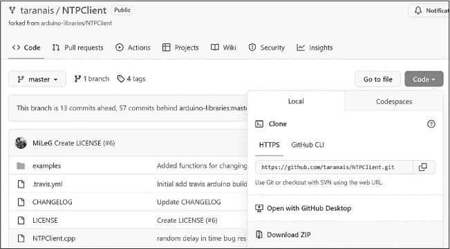
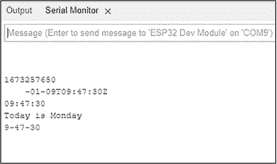
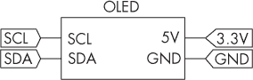
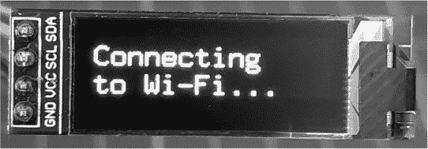
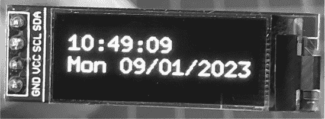
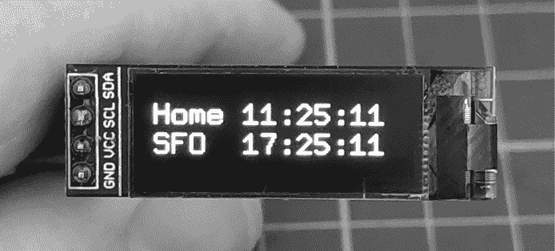
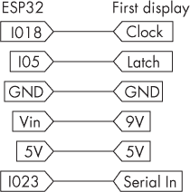
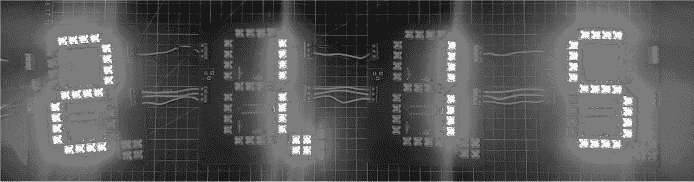

# 第二十一章：21 从互联网时间服务器获取当前时间


当构建依赖于当前时间跟踪的项目（例如数据记录、创建计划事件或仅仅是制作自己的时钟）时，通常使用实时钟表 IC。然而，为了提高时间和日期的准确性，你可以使用 ESP32 兼容 Arduino 的板子从互联网时间服务器获取当前时间和日期。使用 ESP32 还可以节省 RTC IC 模块或独立 Arduino 板的成本，并且可以在代码中设置你所需的时区，而不是在单独的界面中设置。

在本章中，你将学习网络时间协议（NTP），安装并测试 Arduino 的 NTP 客户端库，并提取时间和日期组件用于你自己的项目。你将学会：

+   构建一个带 OLED 显示屏的紧凑型时钟

+   构建一个双时区时钟，显示家里和另一个地点的时间

+   构建一个巨型超亮数字时钟

## 网络时间协议

NTP 最初在 1980 年代中期标准化，是一种将计算机与协调世界时（正式称为格林威治标准时间，或 GMT）同步的方法。NTP 可以达到 1 毫秒或更好的精度。一般情况下，误差范围约为 100 毫秒，但对于与时间相关的 Arduino 项目来说，十分之一秒的差距通常已经足够准确。

你可以从 NTP 服务器中以通常的 24 小时制时间和标准日期格式或以*纪元时间*格式获取时间。纪元时间是自 1970 年 1 月 1 日起的秒数，你可以基于此时间进行自己的计算，以确定当前的日期和时间。有些人使用纪元时间来计算自己的时间类型，例如公制时间。

世界各地有许多 NTP 服务器，每个服务器都有自己的地址。通常，离你的位置最近的服务器应该能提供最快的连接，但你可能希望根据互联网路由使用不同的服务器。请访问[*https://<wbr>www<wbr>.pool<wbr>.ntp<wbr>.org<wbr>/zone<wbr>/@*](https://www.pool.ntp.org/zone/@) 查找最适合你的服务器地址，并用它替换本章项目中默认的 NTP 服务器。

你还需要知道你的*时区偏移*：即相对于格林威治标准时间（GMT）或更现代的协调世界时（UTC）的小时数。例如，如果你住在伦敦，将时区偏移设置为 0，因为伦敦时区属于 UTC（或 GMT）0。如果你住在洛杉矶，加利福尼亚州，时区为 UTC −8。这意味着你应该使用−28,800 的值，因为洛杉矶比 UTC 晚 8 小时，将其乘以 3,600 来转换为秒。最后，更新间隔值 60,000 是以毫秒为单位的更新间隔。这是设置为默认值，等于一分钟，因为你不需要每秒钟更新时间超过一次。

为了准备本章的项目，直接从我的 GitHub 页面下载并安装 Arduino 的 NTP 客户端库。访问[*https://<wbr>github<wbr>.com<wbr>/taranais<wbr>/NTPClient*](https://github.com/taranais/NTPClient)，点击屏幕中间的**代码**。会弹出一个小菜单，如图 21-1 所示。点击**下载 ZIP**，将库 ZIP 文件下载到你的 PC。如果 Arduino IDE 提示你更新此库，请不要更新——使用你已安装的第一个版本。



图 21-1：下载 NTP 客户端库

打开 Arduino IDE，并通过选择**草图**  **包含库**  **添加 .ZIP 库**来安装库。安装完成后，重新启动 Arduino IDE 以继续操作。

现在，你可以开始在项目中使用互联网时间了。

项目#61：获取时间和日期

该项目作为一个框架，用于从 NTP 服务器获取时间和日期，然后提取日期和时间的各个元素（小时、分钟等），以便你在自己的项目中使用。

该项目使用串口监视器显示时间和日期，因此在硬件方面，你只需要 ESP32 开发板和与前几章相同的 USB 电缆。如果你还没有完成，请转到第十九章，按照“为 ESP32 配置 Arduino IDE”到“测试 ESP32”的步骤安装 Arduino IDE 所需的板卡配置。

输入并上传项目#61 的草图，在草图顶部附近的 SSID 和密码字段中添加你的 Wi-Fi 网络凭证（如在第十九章中项目#55 部分所述）。上传草图后，ESP32 应该尝试连接到你的 Wi-Fi 网络，并在串口监视器中检索并显示时间和日期信息，如图 21-2 所示。



图 21-2：项目 #61 的示例输出

让我们更仔细地看看它是如何工作的：

```
// Project #61 - Retrieving Internet time

❶ #include <NTPClient.h>
#include <WiFi.h>
#include <WiFiUdp.h>
WiFiUDP ntpUDP;

❷ // Enter your Wi-Fi network SSID and password:
const char* ssid = "`SSID`";
const char* password = "`password`";

// ntpUDP, time server pool, offset in seconds, update interval (mS):
NTPClient timeClient(ntpUDP, "`0.north-america.pool.ntp.org`", `36000`, 60000);

void setup()
{
    Serial.begin(115200);
    WiFi.mode(WIFI_STA);
    WiFi.begin(ssid, password);
    Serial.print("Connecting to Wi-Fi ");
    while (WiFi.status() != WL_CONNECTED)
    {
        delay(500);
        Serial.print(".");
    }
    timeClient.begin();
}

void loop()
{
    String dateString;
    String date, month, year;

  ❸ timeClient.update();
    Serial.println(timeClient.getEpochTime());
    Serial.println(timeClient.getFormattedDate());
    Serial.println(timeClient.getFormattedTime());

    // Retrieve and display day of week
  ❹ Serial.print("Today is ");
    switch (timeClient.getDay())
    {
        case 0: Serial.println("Sunday"); break;
        case 1: Serial.println("Monday"); break;
        case 2: Serial.println("Tuesday"); break;
        case 3: Serial.println("Wednesday"); break;
        case 4: Serial.println("Thursday"); break;
        case 5: Serial.println("Friday"); break;
        case 6: Serial.println("Saturday"); break;
        case 7: Serial.println("Sunday"); break;
    }

 // Retrieve hours, minutes, and seconds separately and display:
    if (timeClient.getHours() < 10)
    {
        Serial.print("0");
    }
    Serial.print(timeClient.getHours());
        Serial.print("-");
  if (timeClient.getMinutes() < 10)
  {
          Serial.print("0");
    }
      Serial.print(timeClient.getMinutes());
        Serial.print("-");
    if (timeClient.getSeconds() < 10)
    {
        Serial.print("0");
    }
    Serial.println(timeClient.getSeconds());

  ❺ // Extract data from formatted date result and display:
    dateString = timeClient.getFormattedDate();
    date = dateString.substring(8, 10);
    Serial.print(date);
    Serial.print("/");
    month = dateString.substring(5, 7);
    Serial.print(month);
    Serial.print("/");
    year = dateString.substring(0, 4);
    Serial.println(year);
    Serial.println();
    delay(1000);
} 
```

首先，草图包含了 Wi-Fi 和 NTP 客户端所需的库，并创建了一个定时器服务器实例 ntp ❶。接下来，它存储了 Wi-Fi 网络的名称和密码，以供 Wi-Fi 库使用 ❷。

NTPClient timeClient() 函数接受要使用的 NTP 服务器地址、所需的时区偏移量和更新时间间隔。如前节所述，尝试使用代码中提供的默认时间服务器地址，或查找一个离您位置更近的服务器地址。对于时区偏移，请将代码中的值替换为适合您所在位置的偏移量。

在 void loop() 中，声明了多个字符串变量用于存储时间和日期信息，接着强制更新时间客户端 ❸ 以从服务器获取最新的时间和日期。接下来的三个函数演示了如何以不同的格式检索时间和日期信息，并将其值显示在串口监视器上。第一个是 timeClient.getEpochTime()，它获取纪元时间。接着，timeClient.getFormattedDate() 显示设置时区后的完整时间和日期，日期格式为 *yyyy*-*mm*-*dd*，后跟字母 *T*（表示“时间”），然后是当前时间的 24 小时制。最后，timeClient.getFormattedTime() 显示当前时间，格式为 *hh*:*mm*:*ss*。

接下来，草图演示了如何提取单独的时间和日期信息。timeClient.getDay() 函数返回一个介于 0 和 6 之间的整数，表示星期几，分别是从星期天到星期六。这个值用于 switch…case 函数 ❹ 来确定当前是星期几，并在串口监视器上显示对应的名称。草图通过函数 timeClient.getHours()、timeClient.getMinutes() 和 timeClient.getSeconds() 显示小时、分钟和秒的单独值，这些函数都返回对应的整数值。代码还包括一个测试，检查分钟和秒是否小于 10，并在必要时添加前导零，以确保正确的时间格式。例如，防止显示为 9:5:00，表示早上 9 点 5 分。

获取日期、月份和年份的方式稍有不同。程序首先使用 timeClient.getFormattedDate()❺ 获取完整的时间和日期，然后使用 .substring 函数将日期、月份和年份的值存储在字符串变量中。例如，年份位于字符串 dateString 的前四个字符中，因此函数 dateString.substring(0,4) 将返回这四个字符。最后，程序会延迟 1 秒后重复该过程。

如果你的项目与 Wi-Fi 网络断开连接，时间将保持不变，直到 ESP32 能够重新连接到 NTP 服务器，届时时间和日期将自动更新。

以下项目使用此代码框架来获取时间和日期，并在不同的设备上显示结果。

项目 #62：在 OLED 上显示时间和日期

本项目展示了如何在你在第十章中首次使用的廉价 OLED 显示屏上显示来自 NTP 服务器的时间和日期。如果愿意，你可以修改本项目来控制其他类型的显示器，比如 LCD 或者甚至是尼克管显示器。

你将需要以下硬件：

+   一块 ESP32 Arduino 兼容板和 USB 电缆

+   一个 128 × 32 像素、0.91 英寸的 OLED 显示屏

+   一个无焊接面包板

+   各种跳线

如果这是你第一次使用 OLED 显示屏，请转到第十章，按照第 149 页的“图形 OLED 显示屏”部分中的说明，测试 OLED 显示屏，然后按照图 21-3 中的电路图组装电路。

> 注意

*尽管你的 OLED 可能标明为 5 V 设备，但指定型号在 3.3 V 下也能正常工作，无需电平转换器。*



图 21-3：项目 #62 的电路图

输入并上传项目 #62 的代码，适当更新你的 Wi-Fi 网络详细信息。OLED 应该显示一条信息，告诉你 ESP32 正在尝试连接 Wi-Fi，如图 21-4 所示。



图 21-4：项目连接到 Wi-Fi

一旦项目连接到 NTP 服务器，OLED 显示屏应该显示当前时间和日期，以及星期几，如图 21-5 所示。



图 21-5：项目 #62 的示例输出

让我们更仔细地看看它是如何工作的：

```
// Project #62 - OLED NTP clock

#include <NTPClient.h>
#include <WiFi.h>
#include <WiFiUdp.h>
#include <U8g2lib.h>
#include <Wire.h>
U8G2_SSD1306_128X32_UNIVISION_F_HW_I2C u8g2(U8G2_R0, U8X8_PIN_NONE);

// Enter your Wi-Fi network SSID and password
const char* ssid = "`SSID`";
const char* password = "`Password`";
WiFiUDP ntpUDP;

❶ // ntpUDP, time server pool, offset in seconds, update interval (mS)
NTPClient timeClient(ntpUDP, "`0.us.pool.ntp.org`", `36000`, 60000);

void setup()
{
    Wire.begin();
    u8g2.begin();
    u8g2.setFont(u8g2_font_9x18_tr);
    Serial.begin(115200);
  ❷ WiFi.mode(WIFI_STA);
    WiFi.begin(ssid, password);
    Serial.print("Connecting to Wi-Fi ");
    while (WiFi.status() != WL_CONNECTED)
    {
        u8g2.clearBuffer();
        u8g2.drawStr(0, 16, "Connecting");
        u8g2.drawStr(0, 31, "to Wi-Fi"…");
        u8g2.sendBuffer();
    }
    timeClient.begin();
}

void loop()
{
    int hours, minutes, seconds;
    int date, month, year, dayOfWeek;
    String hh, mm, ss, dateString;
    String OLED1, OLED2;

    timeClient.update();

    // Assemble time:
  ❸ hours = timeClient.getHours();
    minutes = timeClient.getMinutes();
    seconds = timeClient.getSeconds();

    if (hours < 10) {hh = hh + "0";}
    if (minutes < 10) {mm = mm + "0";}
    if (seconds < 10) {ss = ss + "0";}
    hh = hh + String(hours);
    mm = mm + String(minutes);
    ss = ss + String(seconds);
  ❹ OLED1 = hh + ":" + mm + ":" + ss;

    // Assemble date:
  ❺ dateString = timeClient.getFormattedDate();
    switch (timeClient.getDay())
    {
        case 0: OLED2 = OLED2 + "Sun "; break;
        case 1: OLED2 = OLED2 + "Mon "; break;
        case 2: OLED2 = OLED2 + "Tue "; break;
 case 3: OLED2 = OLED2 + "Wed "; break;
        case 4: OLED2 = OLED2 + "Thu "; break;
        case 5: OLED2 = OLED2 + "Fri "; break;
        case 6: OLED2 = OLED2 + "Sat "; break;
        case 7: OLED2 = OLED2 + "Sun "; break;
	}

  ❻ OLED2 = OLED2 + dateString.substring(8, 10); // Date
    OLED2 = OLED2 + "/";
    OLED2 = OLED2 + dateString.substring(5, 7); // Month
    OLED2 = OLED2 + "/";
    OLED2 = OLED2 + dateString.substring(0, 4); // Year

    // Show time and date on OLED:
  ❼ u8g2.clearBuffer();
    u8g2.drawStr(0, 16, OLED1.c_str());
    u8g2.drawStr(0, 31, OLED2.c_str());
    u8g2.sendBuffer();
    delay(1000);
} 
```

这个草图包括并初始化了 Wi-Fi、NTP 客户端、I²C 总线和 OLED 所需的库。像往常一样，设置你的 Wi-Fi 网络详细信息。

然后，草图初始化了 NTP 客户端的一个实例，并设置了池服务器、时区偏移和更新时间间隔❶。在void setup()中，它启动了 I²C 总线、OLED 显示库和用于调试的串口监视器，然后初始化了 Wi-Fi。接下来的代码块会使“OLED 正在连接...”消息在连接过程中显示❷。草图接着启动了 NTP 客户端库。

void loop()中的代码旨在组合时间信息并将其显示在 OLED 的顶部行，然后组合日期信息并将其显示在底部行。首先通过获取时间❸，然后将一个 0 添加到字符串OLED1中，如果小时、分钟或秒数小于 10，字符串将包含这些数据。接着，小时、分钟和秒数被添加到各自的字符串变量中，最终它们会被拼接成一个字符串进行显示❹。

获取日期字符串❺之后，代码获取星期几并将其放入字符串OLED2中，接着利用switch…case函数显示完整的日期。然后，它获取日期、月份和年份，并将这些数据添加到主日期字符串中，同时使用分隔符进行整洁的显示❻。

最后，草图将两行数据OLED1和OLED2发送到 OLED 显示器进行显示❼。如代码所示，必须在变量名后添加后缀.c_str，以告诉 OLED 库将变量从字符串转换为可用的数据。

保持这个项目的硬件组件已组装好。在下一个项目中，你将使用它制作一个双时区时钟，利用 NTP 库中的偏移功能。

项目 #63：在 OLED 上显示两个时区

这个项目展示了如何在前一个项目使用的 OLED 显示器上同时显示两个时区的时间。如果你是 HAM 无线电爱好者，或者你经常与不同时间区的朋友、家人或同事沟通，这可能会很有用。

所需的硬件和组装与项目#62 相同。硬件准备好后，进入并上传项目#63 的草图。别忘了将你的 Wi-Fi 网络凭证添加到这个草图中。ESP32 连接到 Wi-Fi 网络后，OLED 应显示澳大利亚东海岸的“家庭时区”时间（我所在的地方），并显示美国旧金山的“离开时区”时间（No Starch Press 的总部），如图 21-6 所示。



图 21-6：项目#63 的示例显示

为了学习如何更改时区，让我们仔细看看这个草图：

```
// Project #63 - OLED dual-zone NTP clock

#include <NTPClient.h>
#include <WiFi.h>
#include <WiFiUdp.h>
#include <U8g2lib.h>

#include <Wire.h>
U8G2_SSD1306_128X32_UNIVISION_F_HW_I2C u8g2(U8G2_R0, U8X8_PIN_NONE);

// Enter your Wi-Fi network SSID and password:
const char* ssid = "`SSID`";
const char* password = "`Password`";
WiFiUDP ntpUDP;

// ntpUDP, time server pool, offset in seconds, update interval (mS)
// Starts with home offset (e.g. 36000 for UTC + 10)
NTPClient timeClient(ntpUDP, "`0.us.pool.ntp.org`", `36000`, 60000);

void setup()
{
    Wire.begin();
    u8g2.begin();
    u8g2.setFont(u8g2_font_9x18_tr);

    Serial.begin(115200);
    WiFi.mode(WIFI_STA);
    WiFi.begin(ssid, password);
    Serial.print("Connecting to Wi-Fi ");
    while (WiFi.status() != WL_CONNECTED)
    {
        u8g2.clearBuffer();
        u8g2.drawStr(0, 16, "Connecting");
        u8g2.drawStr(0, 31, "to Wi-Fi…");
        u8g2.sendBuffer();
    }
    timeClient.begin();
}

void loop()
{
    int hours, minutes, seconds;
    String hh, mm, ss, dateString;
    String OLED1, OLED2;
    timeClient.update();

    // Assemble home time (BNE, UTC + 10):
  ❶ timeClient.setTimeOffset(`36000`);
    hours = timeClient.getHours();
    minutes = timeClient.getMinutes();
    seconds = timeClient.getSeconds();

    if (hours < 10) {hh = hh + "0";}
    if (minutes < 10) {mm = mm + "0";}
    if (seconds < 10) {ss = ss + "0";}
    hh = hh + String(hours);
    mm = mm + String(minutes);
    ss = ss + String(seconds);
  ❷ OLED1 = "Home " + hh + ":" + mm + ":" + ss;
  ❸ hh = " "; mm = " "; ss = " ";

    // Assemble away time (SFO, UTC - 8):
    timeClient.setTimeOffset(−`28800`);
    hours = timeClient.getHours();
    minutes = timeClient.getMinutes();
    seconds = timeClient.getSeconds();

    if (hours < 10) {hh = hh + "0";}
    if (minutes < 10) {mm = mm + "0";}
    if (seconds < 10) {ss = ss + "0";}
    hh = hh + String(hours);
    mm = mm + String(minutes);
    ss = ss + String(seconds);
 ❹ OLED2 = "SFO " + hh + ":" + mm + ":" + ss;

    // Show time and date on OLED:
  ❺ u8g2.clearBuffer();
    u8g2.drawStr(0, 16, OLED1.c_str());
    u8g2.drawStr(0, 31, OLED2.c_str());
    u8g2.sendBuffer();
    delay(1000);
} 
```

这个草图与项目#62 的草图类似，同样将两行数据组装并显示到 OLED 上。为了创建一个双时区时钟，代码首先设置第一个时区的时区偏移量❶。草图中的示例本地时区是布里斯班，布里斯班的时区是 UTC+10，因此timeClient.setTimeOffset()函数的偏移值是 36,000（3,600 乘以+10 小时），但是你可以将其更改为任何你喜欢的时区。接着，草图获取时间数据并将其组装到字符串变量OLED1 ❷中，在前面加上标签Home。草图然后清空临时存储获取时间数据的字符串变量，供以后重用❸。

相同的过程会对第二个时区重复。我使用了旧金山的例子，旧金山的时区是 UTC-8，这意味着timeClient.setTimeOffset()函数的偏移值为-28,800（3,600 乘以-8 小时）。草图将获取并组装时间数据到字符串变量OLED2 ❹中，以“离开时区”的标签SFO开头。最后，它将这两组数据发送到 OLED 显示❺，然后稍作延迟后整个过程再次重复。

如果你想挑战自己，可以尝试修改这个项目，在按下按钮时切换显示不同的时区。

项目#64：构建一个巨型数字时钟

本章的最终项目，让我们来点乐趣，使用项目#27 中来自第八章的七段 LED 模块构建一个巨型数字时钟。组装完成后，你可以将这个项目用作车间里的时间工具，展示你的技术实力。

如果你还没有设置七段 LED 模块，回顾一下项目 #27 并制作四个需要的显示板。（如果你想挑战自己，可以做六个显示板，这样就可以同时显示秒数、分钟和小时了。）除了这个项目中涉及的显示板、布线和 9 V DC 1A 电源，你还需要本章节中使用的 ESP32 板以及常规的跳线和 USB 电缆。

> 注意

*LED 显示板中使用的 TPIC6B595 移位寄存器 IC 既支持 3.3 V 也支持 5 V，所以你不需要在它们与 ESP32 板之间连接电平转换器。*

一旦连接好四个显示板，上传项目 #64 的草图。按照 图 21-7 中的连接图，连接 ESP32 到第一个显示板（图中左侧的那个显示板）。



图 21-7：ESP32 与第一个显示板之间的连接布局

将电源连接到第一个显示板。ESP32 应该连接到 Wi-Fi 网络并获取时间。稍微退后，你就能看到四个数字同时亮起，显示当前时间，如 图 21-8 所示。



图 21-8：项目 #64 的运行示例

让我们看看这个草图是如何工作的：

```
// Project #64 - Giant LED NTP Clock

#include <NTPClient.h>
#include <WiFi.h>
#include <WiFiUdp.h>

// Enter your Wi-Fi network SSID and password:
const char* ssid = "`SSID`";
const char* password = "`Password`";
WiFiUDP ntpUDP;

// ntpUDP, time server pool, offset in seconds, update interval (mS)
// Starts with home offset (e.g. 36000 for UTC + 10)
NTPClient timeClient(ntpUDP, "`0.us.pool.ntp.org`", `36000`, 60000);
❶ #define LATCH 5  // Latch RCK pin
#define CLOCK 18 // Clock SRCK pin
#define DATA 23  // Data SERIN pin

int digits[] = { B00111111,   // 0
                 B00000110,   // 1
                 B01011011,   // 2
                 B01001111,   // 3
                 B01100110,   // 4
                 B01101101,   // 5
                 B01111101,   // 6
                 B00000111,   // 7
                 B01111111,   // 8
                 B01100111}; // 9

void sendNumbers(int numbers[], int dp)
{
    digitalWrite(LATCH, LOW);
    for (int i = 0; i < 4; i++)
    {
        int dig_idx = numbers[i];
        if (dp == i)
        {
          // Display the digit:
          shiftOut(DATA, CLOCK, MSBFIRST, digits[dig_idx] | B10000000);
        } else
        {
          shiftOut(DATA, CLOCK, MSBFIRST, digits[dig_idx]);
        }
    }
    digitalWrite(LATCH, HIGH);
}

void setup()
{
    pinMode(LATCH, OUTPUT);
    pinMode(CLOCK, OUTPUT);
    pinMode(DATA, OUTPUT);
    Serial.begin(115200);
    WiFi.mode(WIFI_STA);
    WiFi.begin(ssid, password);
    Serial.print("Connecting to Wi-Fi…");
    while (WiFi.status() != WL_CONNECTED)
    {
        Serial.print(".");
        delay(500);
    }
  ❷ timeClient.begin();
}

void loop()
{
    int numbers[4];
    int hours, minutes;
 ❸ timeClient.update();

    hours = timeClient.getHours();
    minutes = timeClient.getMinutes();

  ❹ numbers[3] = hours / 10;
    numbers[2] = hours % 10;
    numbers[1] = minutes / 10;
    numbers[0] = minutes % 10;

  ❺ sendNumbers(numbers, 2);
    delay(1000);
} 
```

这个草图中的操作现在应该对你来说已经很熟悉了。代码包含了所需的库和 Wi-Fi 网络详情。接着，它创建了一个 NTP 客户端实例，包含了池服务器、时区偏移和更新时间间隔的细节。为了便于参考，草图还定义了用于向显示板上的移位寄存器输出的引脚编号 ❶。

数组 digits[] 存储了用于定义数字在 LED 显示板上如何显示的 10 个字节数据，其中每一位代表组成数字的七个段之一。自定义的 sendNumbers() 函数接受一个包含四个整数的数组，以在四个 LED 显示板上显示，并且还可以接受另一个整数，如果使用这个整数，就会在相应的 LED 显示板上点亮小数点。

在 void setup() 中，代码初始化了所需的数字引脚，设置了串口监视器进行调试，启动了 Wi-Fi 连接和 NTP 客户端 ❷。在 void loop() 中，代码更新 NTP 客户端以获取最新的时间信息 ❸，然后检索并存储小时和分钟的值。时间在发送到 LED 显示板之前必须拆解成单个数字，因此对小时和分钟值进行取模和除法操作 ❹，返回第一个和第二个数字，然后将其存储在数组 numbers[] 中。最后，代码通过 sendNumbers() 函数将这些数字发送到显示屏，且在第二个数字处放置小数点作为小时和分钟之间的分隔符 ❺。

作为最终挑战，你可以尝试修改本章任何项目中的代码，将时间格式从 24 小时制改为 12 小时制。为此，你需要将任何大于或等于 13 的小时值减去 12，然后再显示该小时数。当然，你也可以增加一个 AM 和 PM 的测试。

## 继续前进

在这一章中，你学习了如何从互联网获取准确的时间和日期信息，并使用各种显示类型展示这些信息。掌握了这些技能后，你可以尝试构建其他类型的时钟，作为练习，为需要时间和日期的其他项目做准备。

下一章介绍了另一种使用 ESP32 的方法，演示了如何将开发板的数据捕获到 Google Sheets 应用中进行分析。
