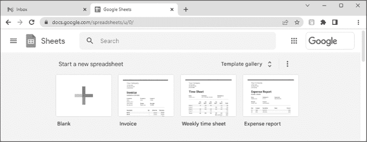
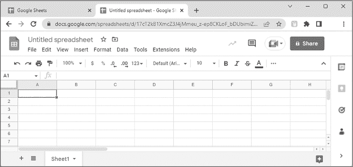
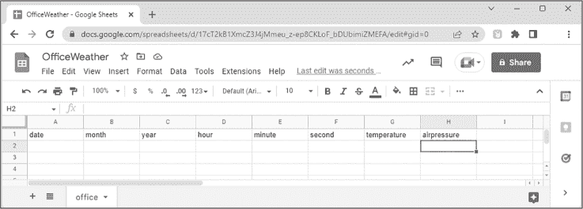
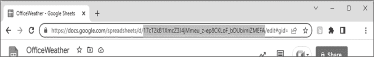
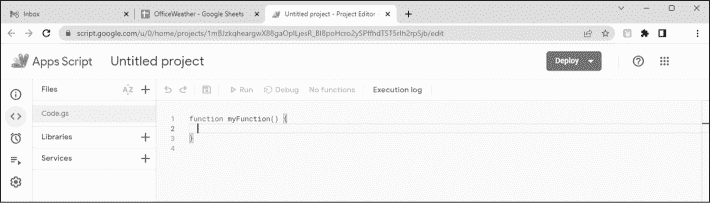
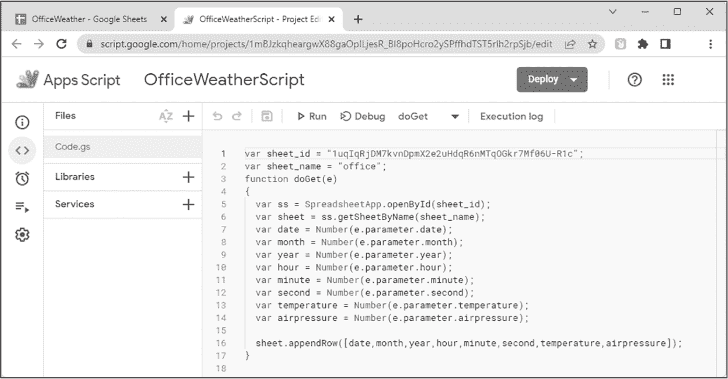
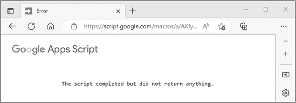
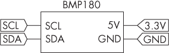
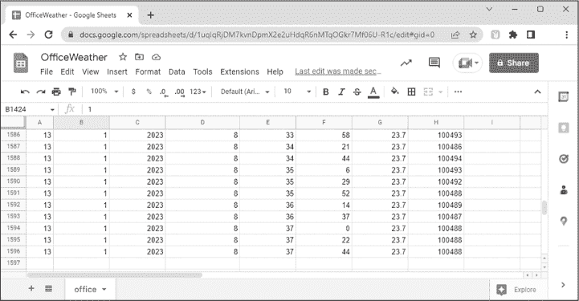
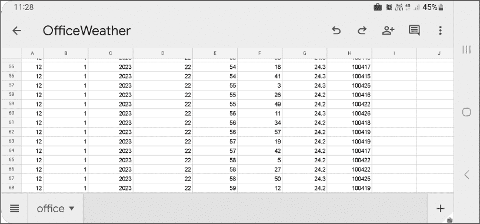

# 第二十二章：22 将数据捕获并记录到 Google Sheets


你可以使用像 ESP32 这样的联网开发板来捕捉数据并将其存储在在线电子表格中，进行实时监控和后期分析。在本章中，你将使用这种方法构建一个项目，将时间和温度数据通过 Google Workspace 中的 Google Sheets 电子表格工具发送到 Google Sheets，Google Workspace 是一个云计算协作工具集合，几乎所有支持网络的设备都能访问。

你可以在未来的项目中使用这个框架，记录任何你能够通过兼容 Arduino 的项目收集到的数据。例如，你可能想与其他同事共享远程地点的天气数据，或者在度假时，通过手机监控实验室实验中的传感器值。

项目 #65：记录时间和温度数据

本项目演示了如何通过 ESP32 开发板将来自 NTP 服务器的时间和日期，以及来自 BMP180 传感器板的温度和气压数据，发送到 Google Workspace 的 Google Sheets 工具。

你将需要以下硬件：

+   一块 ESP32 开发板及匹配的 USB 电缆

+   无焊接面包板

+   各种跳线

+   一块 BMP180 温度和压力传感器板

如果你还没有这样做，请转到 第十九章，完成“为 ESP32 配置 Arduino IDE”到“测试 ESP32”的说明，以确保 ESP32 工作正常。同时，确保你已经完成了 第十章 中的“BMP180 传感器”部分，并阅读了 第二十一章 来熟悉 NTP 服务器。

为了构建这个项目，你将首先配置一个 Google Workspace 账户来接收来自 ESP32 的数据，然后设置 ESP32 开发板和传感器进行数据传输。

## 准备 Google Sheets 文档

Google Sheets 是 Google Workspace 云计算产品的一部分，提供基于云的电子表格。如果你还没有账户，可以在 [*https://<wbr>workspace<wbr>.google<wbr>.com*](https://workspace.google.com) 上设置一个 Google Workspace 账户。如果你希望先试用而不进行长期订阅，可以选择免费试用，但截至目前，月度订阅费用低于每月 10 美元。

登录你的账户后，访问 [*https://<wbr>docs<wbr>.google<wbr>.com<wbr>/spreadsheets*](https://docs.google.com/spreadsheets) 查看 Google Sheets 起始页，如 图 22-1 所示。



图 22-1：Google Sheets 起始页

通过点击**空白**图标，在“开始新电子表格”下创建一个新的空白电子表格。该电子表格的新标签将会出现，如图 22-2 所示。



图 22-2：一个空白电子表格

点击**无标题电子表格**，并为用于跟踪您所在位置的温度和气压数据的电子表格输入一个合适的名称，例如**OfficeWeather**，然后按回车键。接下来，将页面底部标签从 Sheet1 重命名为**office**。

现在，从 A1 单元格开始，按照图 22-3 所示，给第 1 行的列命名，分别为**date, month, year, hour, minute, second, temperature, airpressure**。这些标题将与 ESP32 板发送的数据匹配，稍后您将看到。



图 22-3：电子表格设置，带有名称和数据标题

请注意，Google Sheets 中的列标题必须始终小写，并且不能包含任何空格或符号。

等待 Google 自动保存电子表格，然后检索并保存电子表格 ID。该 ID 是电子表格 URL 中*/d*和*/edit*之间的一长串字符，如图 22-4 所示。复制该电子表格 ID 并将其粘贴到文本文件中，以便以后轻松获取。



图 22-4：电子表格 ID 在 URL 中的示例

现在，您的电子表格已准备好接收数据。暂时将其保持在网页浏览器中打开。

## Google Apps 脚本

您的 ESP32 硬件将通过在 HTTP 地址末尾附加数据来向 Google 电子表格发送数据。为了启用这一过程，您必须将一小段 JavaScript 代码上传到 Google 服务器，该代码解码来自 ESP32 板的 HTTP 调用，将数据分开并放入电子表格的正确列中。

通过在 Google Sheets 中选择**扩展**  **Apps 脚本**来打开 Google Apps 脚本工具。

一个新的 Apps 脚本编辑器标签将在网页浏览器中打开，如图 22-5 所示。



图 22-5：打开一个新标签

点击**无标题项目**，并为脚本输入一个名称，例如**OfficeWeatherScript**。复制以下代码并将其粘贴到编辑器的第 1 行文本中：

```
var sheet_id = "`sheet_ID`";
var sheet_name = "office";
function doGet(e)
{
    var ss = SpreadsheetApp.openById(sheet_id);
    var sheet = ss.getSheetByName(sheet_name);
    var date = Number(e.parameter.date);
    var month = Number(e.parameter.month);
    var year = Number(e.parameter.year);
    var hour = Number(e.parameter.hour);
    var minute = Number(e.parameter.minute);
 var second = Number(e.parameter.second);
    var temperature = Number(e.parameter.temperature);
    var airpressure = Number(e.parameter.airpressure);
    sheet.appendRow([date,month,year,hour,minute,second,temperature,airpressure]);
}
```

将您之前获取的表格 ID 插入代码第一行的引号之间。在接下来的行中，表格标签名称<sup class="SANS_TheSansMonoCd_W5Regular_11">office</sup>出现在引号之间。每一列数据的存储都通过<sup class="SANS_TheSansMonoCd_W5Regular_11">var</sup>声明表示，按它们在电子表格第 1 行中的顺序排列（从<sup class="SANS_TheSansMonoCd_W5Regular_11">date</sup>到<sup class="SANS_TheSansMonoCd_W5Regular_11">airpressure</sup>）。

最后，sheet.appendrow() 函数将接收到的数据写入电子表格中的新行。函数中变量出现的顺序决定了数据写入表格的顺序。每一组接收到的数据都会保存到下一个空行，直到达到 Google 表格的最大行数 40,000 行。之后，您将无法再记录更多数据。

现在，您的编辑器页面应该与图 22-6 类似。脚本编辑器会高亮显示任何语法错误，因此在继续之前请检查是否有错误。



图 22-6：完成的应用脚本

若要部署脚本，选择**部署**  **新部署**。当新部署窗口出现时，点击齿轮图标选择部署类型。在出现的下拉菜单中，点击**Web 应用**以打开配置对话框，其中有三个字段。

系统将显示配置对话框，其中有三个字段。在第一个字段“新描述”中，输入**OfficeWeather**（或您为表格命名的名称）。在 Web 应用字段中选择**我**，在谁可以访问字段中选择**任何人**，如图 22-7 所示。点击**部署**。


图 22-7：部署配置页面

一个弹出窗口应该会提示您授权访问帐户。点击**授权访问**。

如果系统提示您再次登录 Google 帐号，请进行登录。接下来，您会看到一个新窗口，显示您的电子表格部署 ID 和 Web 应用 URL。

使用窗口中的复制链接功能，将每项内容复制并保存在包含表格 ID 的文档中。您现在可以关闭 Web 浏览器中的 Apps Script 标签。

在设置此项目的硬件之前，测试您的脚本是否正常工作。使用文本编辑器，在新的一行输入 Web 应用的 URL，然后在 URL 的末尾添加以下文本：

```
**?date=12&month=1&year=2023&hour=12&minute=37&second=30&temperature=28.5&airpressure=9999**
```

附加到 URL 的文本描述了以 column =data 格式发送到电子表格的数据，每对列和数据之间由问号分隔。这行代码中的数据仅用于测试脚本——稍后你将编程 ESP32 开发板来发送自己的数据。

将整个 URL 复制到网页浏览器的地址栏并按 ENTER 键。应该会发生两件事。首先，网页浏览器应返回一条消息，告诉你脚本已完成但没有返回任何内容，如 图 22-8 所示。



图 22-8：由 Google Apps 脚本返回的消息

该消息意味着脚本已成功执行，但没有将数据发送回网页浏览器。没关系——数据已经发送到电子表格中了。检查你的表格，你应该能看到数据出现在新的一行中，如 图 22-9 所示。如果你愿意，可以返回并编辑输入 URL 末尾的数据，重新提交 URL，并查看另一个数据行被输入到电子表格中。


图 22-9：成功执行 HTML 调用后的电子表格

这个过程是 ESP32 数据记录的基础：草图将传感器捕获的数据与时间和日期一起安排到一个 URL 中，然后执行一个 HTTP 调用，由你之前创建的 Google Apps 脚本处理，将数据输入到电子表格中。如果这个测试没有对你有效，请检查你是否正确按照项目中到目前为止提供的所有指示进行操作。

## 准备硬件

按照 图 22-10 中所示的方式组装你的硬件。请注意，尽管你的 BMP180 板可能标注为 5 V 设备，但它也可以在 3.3 V 和 ESP32 板上正常工作，无需电平转换器。



图 22-10：项目 #65 的电路图

输入并上传草图，包括在程序开头部分输入你的 Wi-Fi 网络名称（SSID）和密码，正如在 第十九章中的项目 #55 原始解释中所述。别忘了更改你的时区偏移量，正如在 第二十一章“网络时间协议”中所描述的那样，并将你的 Web 应用 URL 插入到相应的字段中。ESP32 应该连接到 Wi-Fi 网络，然后从 NTP 服务器获取时间和日期，从 BMP180 获取温度和气压。它应该将数据合并为一个包含 Web 应用 URL 和数据的字符串，并随后完成对 Google 服务器的 HTTP 请求。

稍等片刻后，你应该能在电子表格中看到数据出现。保持该表格打开，以便看到其几乎实时更新，如 图 22-11 所示。



图 22-11：项目 #65 的示例输出

让我们看看这如何工作：

```
// Project #65 - Logging time and temperature data to Google Sheets

#include <WiFi.h>
#include <HTTPClient.h>
#include <NTPClient.h>
#include <WiFiUdp.h>
#include <Adafruit_BMP085.h>

WiFiUDP ntpUDP;
Adafruit_BMP085 bmp;

const char* ssid = "`SSID`";
const char* password = "`password`";

// ntpUDP, time server pool, offset in seconds, update interval (mS)
NTPClient timeClient(ntpUDP, "0.au.pool.ntp.org", 36000, 60000);

❶ String webAppURL = "`webapp_URL`";

unsigned long lastUpdate = 0;
❷ unsigned long updatePeriod = 20000; // 20 seconds

void setup()
{
  ❸ bmp.begin();
    Serial.begin(115200);
    WiFi.mode(WIFI_STA);
    WiFi.begin(ssid, password);
    Serial.print("Connecting to Wi-Fi ");
    while (WiFi.status() != WL_CONNECTED)
    {
        Serial.print(".");
        delay(500);
    }
    timeClient.begin();
}

void loop()
{
    String dateString, finalAppURL;
    String date, month, year;
    String hh, mm, ss;
    String temperature, pressure;

  ❹ if ((millis() - lastUpdate) > updatePeriod)
    {
        if (WiFi.status() == WL_CONNECTED)
        {
            HTTPClient http;
            timeClient.update();

            // Extract date from NTP server:
            dateString = timeClient.getFormattedDate();
            date = dateString.substring(8, 10);
            month = dateString.substring(5, 7);
            year = dateString.substring(0, 4);

            // Extract time from NTP server:
            hh = String(timeClient.getHours());
            mm = String(timeClient.getMinutes());
            ss = String(timeClient.getSeconds());

            // Add time and date to web app URL:
          ❺ finalAppURL = webAppURL + "?date=" + date + "&month=";
            finalAppURL += month + "&year=" + year + "&hour=" + hh;
            finalAppURL += "&minute=" + mm + "&second=" + ss;

          ❻ // Get weather data from BMP180:
            temperature = String(bmp.readTemperature());
            pressure = String(bmp.readSealevelPressure());

 // Add weather data to web app URL:
            finalAppURL = finalAppURL + "&temperature=";
            finalAppURL += temperature + "&airpressure=" + pressure;

          ❼ http.begin(finalAppURL.c_str());

          ❽ int httpCode = http.GET(); // Get response code from server
            if (httpCode > 0)
            {
                Serial.print("HTTP Response code: ");
                Serial.println(httpCode);
                String httpMessage = http.getString();
                Serial.println(httpMessage);
            } else
            {
                Serial.print("HTTP error: ");
                Serial.println(httpCode);
            }
        http.end(
        } else
        {
            Serial.println("Wi-Fi problem.");
        }
  ❾ lastUpdate = millis();
    }
} 
```

该草图包含并初始化了所有所需的库，接着是 Wi-Fi 网络名称和密码的字段，然后是网络时间服务器客户端的初始化 ❶。

接着，草图设置了发送不同数据读数到电子表格之间的周期 ❷，以毫秒为单位。这是更新之间的最小时间，但实际的更新频率由 Google 服务器的速度和你的互联网连接决定。例如，参考 图 22-12 中显示的值——尽管演示设置为 20 秒，实际记录的时间为 22 秒或更长。10 秒或更短的值可能无法被记录，因为这不足以让过程完成接收和在 Google 服务器上保存数据的操作。

在 void setup() 中，进行常规的声明，并启动所需的库和串口监视器。草图连接到你的 Wi-Fi 网络并启动网络时间客户端。void loop() 中的代码声明了所需的字符串变量，用于分别存储来自网络时间服务器和 BMP180 传感器的时间和温度数据。

该程序包含了一个计算，以确定在发送更多数据之前是否已经过去了所需的时间 ❸。这允许草图在从上次更新时间的 millis() 计数大于设定周期时继续执行 ❹。一旦周期过去，就该从 NTP 服务器提取日期和时间信息，并将其存储在字符串变量中，然后将这些数据附加到 Web 应用 URL 中 ❺。

接下来，从 BMP180 传感器获取温度和气压数据，并将这些值存储到字符串变量中 ❻。这些变量随后会被附加到已经包含 web 应用 URL 以及日期和时间的巨大字符串 finalAppURL 中。

现在，web 应用 URL 已完全构建，HTTP 调用将数据发送到 Google 服务器 ❼。最后的代码行获取来自 Google 服务器的 HTTP 响应代码 ❽，并将其发送到串口监视器。这对于调试很有帮助，因为它确认了过程是否成功，但一旦草图按要求运行，你可以将其移除。最后，草图记录了自上次更新后的经过时间，这个时间用于计算下一次更新前的延迟 ❾。

## 未来 Google Sheets 项目的提示

现在你已经有了一个工作机制，将现实世界的数据记录到 Google Sheets 电子表格中，以下是一些构建此类项目的最终提示。首先，由于电子表格存储在 Google 服务器上，因此你只能通过浏览器查看你的项目。你还可以通过在移动设备或平板电脑上使用 Google Sheets 应用来监控项目的进展，如图 22-12 所示。



图 22-12：通过 Android 上的 Google Sheets 应用显示的项目 #65 示例输出

如前所述，Google Sheets 电子表格的最大行数为 40,000。为了同时监控两个或更多的 ESP32 开发板，给它们各自分配独立的电子表格；然后，一旦所需数据被捕获，你可以在桌面上合并并分析这些数据。如果你想编辑现有项目——例如更改电子表格中的变量名或位置——别忘了更新应用脚本，然后创建一个新的部署，使用新的 web 应用 URL，并将其插入到草图中。

## 继续前进

本章为你提供了一个廉价的框架，用于捕捉任何类型的由 Arduino 兼容板收集的数据，并将其直接发送到电子表格中。这使你能够从世界上几乎任何地方监控实时数据，并以公开或私人方式与他人分享这些数据。你可以使用自己的传感器，改变电子表格中的变量，并根据自己的需要更新时间。

在下一章，你将继续与联网设备合作，使用 ESP32 开发板创建自己的 web 服务器，以只读格式共享信息，供他人查看。
