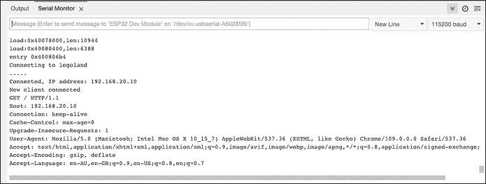
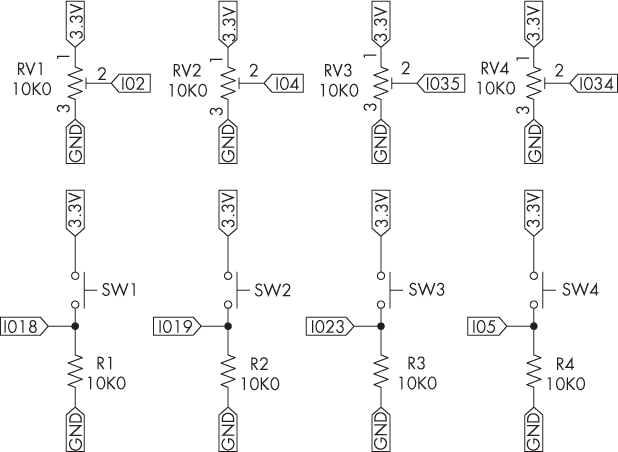
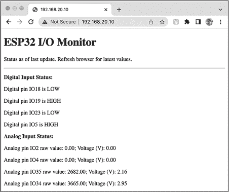
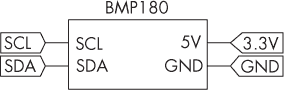
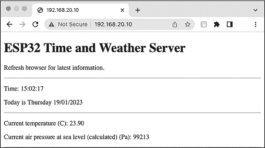

# 第二十三章：23 构建迷你网页服务器


*网页服务器*这个术语可能会让你联想到一个满是计算机服务器和各种电缆的房间。然而，任何拥有 IP 地址的设备都可以充当网页服务器，包括你的 ESP32 开发板。得益于它的板载 Wi-Fi 连接和软件库，这块开发板可以响应来自网页浏览器客户端的 HTTP 请求，以显示你所需的数据。

在本章中，你将创建一个迷你网页服务器，用于实时监控 ESP32 开发板收集或生成的任何信息，允许任何有权限访问服务器的人查看捕获的数据，无需额外的软件或工具。你将使用 HTML 设置一个简单的网页，以测试并展示本章中的框架，然后构建一个网页服务器来显示 ESP32 模拟输入和数字输入状态，接着再构建一个网页来显示日期、时间和温度信息。

项目 #66：创建一个基本的文本网页服务器

在本项目中，你将创建一个基本的文本网页服务器。你可以将其作为一个框架，用来展示用 HTML 构建的文本或其他信息。

如果你还没有完成，请转到第十九章，并按照“为 ESP32 配置 Arduino IDE”到“测试 ESP32”部分的说明，确保 ESP32 正常工作。如果需要，务必按照说明设置端口转发。你还应该完成了第十章中的“BMP180 传感器”部分。

对于硬件，你只需要 ESP32 开发板和相应的 USB 数据线。连接好 ESP32 和计算机后，上传项目 #66 的草图，并在适当的字段中填写你的 Wi-Fi 网络和名称，这些内容在第十九章的项目 #55 中已有说明。

打开 Arduino IDE 中的串口监视器。你应该能够看到 ESP32 连接到的网络名称（SSID），以及其在本地网络中的 IP 地址。图 23-1 显示了连接到 IP 地址 192.168.20.10 的情况。



图 23-1：项目 #66 的串口监视器输出

现在，打开一个网页浏览器，在 URL 栏中输入你项目的 IP 地址，如图 23-2 所示。


图 23-2：基本网页服务器的运行示例

让我们来看看这是如何工作的：

```
// Project #66 - Basic web page server

#include <WiFi.h>
WiFiServer server(80); // Set web server port to 80

char* ssid = "`name`";
char* password = "`password`";

String request; // Stores HTTP request from client (web browser)
unsigned long currentTime = millis();
unsigned long previousTime = 0;
const long timeoutTime = 2000; // Allowed client connection time

void setup()
{
    Serial.begin(115200);
    // Connect to Wi-Fi network:
    Serial.print("Connecting to ");
    Serial.println(ssid);
    WiFi.begin(ssid, password);
    while (WiFi.status() != WL_CONNECTED)
    // Show indicator while waiting for connection:
    {
        delay(500);
        Serial.print(".");
    }
    Serial.println(); // Display local IP address on Serial Monitor
    Serial.print("Connected, IP address: ");
    Serial.println(WiFi.localIP());
    // Start web server:
    server.begin();
}

void loop()
{
    String millisValue;
    String textLine = " ";
    // Listen for incoming clients from web browser
    WiFiClient client = server.available(); ❶
    if (client) // If a request received
    {
        currentTime = millis();
        previousTime = currentTime;
        Serial.println("New client connected");
        String currentLine = " ";
        while (client.connected() && (currentTime - previousTime <= timeoutTime))
        {// Stay connected for timeoutTime
            currentTime = millis();
            if (client.available())
            {
                char c = client.read();
                Serial.write(c);
 request += c;
                if (c == '\n') // Client request has finished
                {
                    if (currentLine.length() == 0)
                    {
                        // Send HTTP response back to client: ❷
                        client.println("HTTP/1.1 200 OK");
                        client.println("Content-type:text/html");
                        client.println("Connection: close");
                        client.println();

                        // Build web page for display on browser:
                        client.println("<!DOCTYPE html><html><body>");

                        // Now HTML for your page:
                        client.println("<h1>millis() server</h1>"); ❸
                        millisValue = String(millis());
                        textLine += "<p>ESP32 board uptime is : ";
                        textLine += millisValue;
                        textLine += " milliseconds</p>";

                        client.println(textLine);
                        client.println("</body></html>"); ❹
                        // End the response to client request:
                        client.println();
                        break;
                    } else
                    {// If you received a newline, clear currentLine:
                        currentLine = " ";
                    }
                } else if (c != '\r')
                {
                    currentLine += c;
                }
            }
        }
        request = " ";
        // Close connection to client:
        client.stop(); ❺
        Serial.println("Disconnected.");
    }
}
```

草图首先包含 Wi-Fi 库并初始化一个端口号为 80 的 Web 服务器实例。客户端计算机会使用此端口号与 Web 服务器进行连接。也就是说，如果你使用的是静态 IP 地址，你需要在浏览器的 URL 字段中输入 IP 地址，并在后面加上:80，以访问 Web 服务器。

草图接着声明所需的变量，包括timeoutTime，它是客户端可以连接到 Web 服务器的最大时长（以毫秒为单位）。如果你计划允许多个客户端使用 Web 服务器，可能需要减少此值，因为服务器一次只能处理一个客户端请求。

在void setup()中，代码启动了串口监视器，并像往常一样连接到 Wi-Fi 网络。连接成功后，IP 地址会在串口监视器中显示，并且 Web 服务器开始启动。在void loop()中，ESP32 等待来自 HTTP 客户端（远程设备上的 Web 浏览器）的请求 ❶。当接收到请求时，草图记录由millis()返回的当前值，以确定客户端连接的时长。只要客户端连接的时间少于之前设置的限制，Web 服务器将接收客户端请求，并将其发送到串口监视器，用于调试和观察。

当客户端请求结束时，服务器发送以下的 HTTP 响应，格式为 HTML ❷：

```
HTTP/1.1 200 OK
Content-type:text/html
Connection: close 
```

为了将你的网页 HTML 代码发送回客户端 Web 浏览器，草图使用client.print()将文本发送到 Web 客户端，然后使用.println()将文本及换行符发送到客户端，开始时包括网页初始化。每次形成网页时，都需要从这个页面初始化的 HTML 行开始。

接下来，草图以以下 HTML 代码的形式发送网页内容：

```
<h1>millis() server</h1>
<p>ESP32 board uptime is : `millis` </p> 
```

草图将 HTML 中的millis替换为millis()的值，通过在<header><h1>行之后构建一行文本，将其转换为字符串，然后使用client.println(textLine)函数发送该字符串。

草图发送结束网页的行 ❹。与网页初始化代码一样，你将在类似的项目中始终使用这一行来结束网页。最后，草图关闭与客户端的连接 ❺，ESP32 等待新的请求。

在下一个项目中，你将基于刚学到的技能，展示与 ESP32 的 I/O 端口相关的数据在网页上。

项目 #67：创建一个 ESP32 I/O 端口监控器

本项目展示了 ESP32 开发板上四个数字输入引脚和四个模拟输入引脚的状态。这为你创建一个 Web 服务器框架提供了基础，服务器能够显示来自具有模拟输出的设备（例如光传感器或可调电阻）的数据，以及来自具有简单数字输出的设备（例如运动传感器或门控开关）的数据。在这个项目中，你将通过按钮和可调电阻来模拟这些类型的传感器。

你将需要：

+   一块 ESP32 开发板和匹配的 USB 数据线

+   一块无焊面包板

+   各种跳线

+   四个触摸按钮

+   四个 10 kΩ，0.25W，1% 精度的电阻

+   四个 10 kΩ的面包板兼容型可调电阻

按照图 23-3 所示组装电路。



图 23-3：项目 #67 的原理图

上传草图，填写草图顶部的 Wi-Fi 网络和名称，然后在 Arduino IDE 中打开串行监视器。串行监视器应该显示 ESP32 连接的 Wi-Fi 网络的名称（SSID），以及 ESP32 在本地网络上的 IP 地址。

使用本地网络中的设备在网页浏览器中打开这个 IP 地址。你应该能看到由 ESP32 提供的状态网站。调整可调电阻到随机位置，按下电路中的一个或多个按钮，然后刷新网页浏览器。下一个显示应该展示 ADC 引脚测量的值以及四个数字输入的状态，如图 23-4 所示。



图 23-4：项目 #67 的示例输出

与 Arduino Uno 及兼容板不同，后者的 ADC 范围是 0 到 1,023（10 位分辨率），ESP32 开发板的 ADC 范围是 0 到 4,095，因为它使用的是 12 位分辨率（2¹² = 4,096）。你还可以在网页上查看每个模拟引脚状态数据的最后一项，显示 ADC 输入的计算电压。

让我们看看它是如何工作的：

```
// Project #67 - ESP32 I/O monitor

#include <WiFi.h>
WiFiServer server(80); // Set web server port to 80

char* ssid = "`SSID`";
char* password = "`password`";

String request; // Stores HTTP request from client (web browser)

unsigned long currentTime = millis();
unsigned long previousTime = 0;
const long timeoutTime = 2000; // Allowed client connection time

void setup()
{
    Serial.begin(115200);
    pinMode(18, INPUT);
    pinMode(19, INPUT);
    pinMode(23, INPUT);
    pinMode(5, INPUT);

    // Connect to Wi-Fi network:
    Serial.print("Connecting to ");
    Serial.println(ssid);
    WiFi.begin(ssid, password);
 while (WiFi.status() != WL_CONNECTED)
    // Show indicator while waiting for connection:
    {
        delay(500);
        Serial.print(".");
    }
    Serial.println(); // Display local IP address on Serial Monitor
    Serial.print("Connected, IP address: ");
    Serial.println(WiFi.localIP());
    // Start web server
    server.begin();
}

void loop()
{
    String textLine = " "; ❶
    int IO18, IO19, IO23, IO5;
    float IO2, IO4, IO35, IO34;
    float IO2A, IO4A, IO35A, IO34A;
    String IO2S, IO4S, IO35S, IO34S;
    // Listen for incoming clients from web browser:
    WiFiClient client = server.available();
    if (client) // If a request received
    {
        currentTime = millis();
        previousTime = currentTime;
        Serial.println("New client connected");
        String currentLine = " ";
        while (client.connected() && (currentTime - previousTime <= timeoutTime))
        {// Stay connected for timeoutTime:
            currentTime = millis();
            if (client.available())
            {
                char c = client.read();
                Serial.write(c);
                request += c;
                if (c == '\n') // Client request has finished
                {
                    if (currentLine.length() == 0)
                    {

                        // Send HTTP response back to client:
                        client.println("HTTP/1.1 200 OK");
                        client.println("Content-type:text/html");
                        client.println("Connection: close");
                        client.println();

                        // Build web page for display on browser:
                        client.println("<!DOCTYPE html><html><body>");

                        // Now HTML for your page:
                        client.println("<h1>ESP32 I/O Monitor</h1>"); ❷
                        client.print ("<p> Status as of last update.");
                        client.println("Refresh browser for latest values.</p>");
                        client.println("<hr>");

 IO18 = digitalRead(18); ❸
                        IO19 = digitalRead(19);
                        IO23 = digitalRead(23);
                        IO5 = digitalRead(5);

                        IO2 = analogRead(2);
                        IO4 = analogRead(4);
                        IO35 = analogRead(35);
                        IO34 = analogRead(34);

                        IO2A = ((IO2 / 4096) * 3.3); ❹
                        IO4A = ((IO4 / 4096) * 3.3);
                        IO35A = ((IO35 / 4096) * 3.3);
                        IO34A = ((IO34 / 4096) * 3.3);

                        client.println("<p><b>Digital Input Status:</b></p>"); ❺
                        textLine += "<p>Digital pin IO18 is ";
                        if (IO18 == 1)
                        {
                            textLine += "HIGH";
                        } else
                        {
                          textLine += "LOW</p>";
                        }
                        client.println(textLine);
                        textLine = " ";
                        textLine += "<p>Digital pin IO19 is ";
                        if (IO19 == 1)
                        {
                            textLine += "HIGH";
                        } else
                        {
                            textLine += "LOW</p>";
                        }
                        client.println(textLine);
                        textLine = " ";
                        textLine += "<p>Digital pin IO23 is ";
                        if (IO23 == 1)
                        {
                            textLine += "HIGH";
                        } else
                        {
                            textLine += "LOW</p>";
                        }
                        client.println(textLine);
                        textLine = " ";
                        textLine += "<p>Digital pin IO5 is ";
                        if (IO5 == 1)
                        {
                          textLine += "HIGH";
                        } else
                        {
                            textLine += "LOW</p>";
                        }
 client.println(textLine);
                        textLine = " ";
                        client.println(" ");
                        client.println("<p><b>Analog Input Status:</b></p>"); ❻
                        textLine += "Analog pin IO2 raw value: ";
                        textLine += String(IO2);
                        textLine += "; Voltage (V): ";
                        client.println(textLine);
                        client.println(IO2A);
                        client.println("</p>");
                        textLine = " ";

                        textLine += "Analog pin IO4 raw value: ";
                        textLine += String(IO4);
                        textLine += "; Voltage (V): ";
                        client.println(textLine);
                        client.println(IO4A);
                        client.println("</p>");
                        textLine = " ";

                        textLine += "Analog pin IO35 raw value: ";
                        textLine += String(IO35);
                        textLine += "; Voltage (V): ";
                        client.println(textLine);
                        client.println(IO35A);
                        client.println("</p>");
                        textLine = " ";

                        textLine += "Analog pin IO34 raw value: ";
                        textLine += String(IO34);
                        textLine += "; Voltage (V): ";
                        client.println(textLine);
                        client.println(IO34A);
                        client.println("</p>");
                        textLine = " ";
                        client.println("<hr>");

                        client.println("</body></html>"); ❼
                        // End the response to client request:
                        client.println();
                        break;
                    } else
                    {// If you received a newline, clear currentLine:
                        currentLine = " ";
                    }
                } else if (c != '\r')
                {
                    currentLine += c;
                }
            }
        }
 request = " ";
        // Close connection to client:
        client.stop();
        Serial.println("Disconnected.");
    }
}
```

与之前的项目类似，这个草图在接收到客户端请求后会提供一个 HTML 网页。唯一的不同是需要处理 I/O 值并在 HTML 中显示结果的代码块。

草图声明了变量 ❶，用于存储每个输入的状态——数字输入的整型变量，以及模拟输入的浮点型变量。然后，它使用字符串变量存储来自 ADC 的值，这些值稍后将与 HTML 结合，用于网页显示。网页的主要构建从 ❷ 开始，包含一个大的标题和一些用户文本，后面跟着一条水平线。草图存储数字输入的值（1 代表 HIGH，0 代表 LOW） ❸，然后是四个 ADC 的模拟值，将后者转换为电压 ❹。

为了在网页 ❺ 上显示输入数据，草图测试每个数字引脚的状态，将结果作为文本添加到字符串 textLine 中。它使用 client.print() 显示该文本，并对其他三个数字输入引脚重复此过程。接下来，它显示每个模拟输入的值以及相应的电压 ❻。它将每行所需的 HTML 文本连接到字符串 textLin，然后跟随一个 HTML </p> 命令来结束段落。在草图发送该行以结束网页 ❼ 后，ESP32 关闭连接并等待新的客户端请求。

在整个代码中，草图使用函数 String() 将整数或浮点值转换为文本，以将该值添加到更大的字符串变量中。这是将草图生成的数据显示在 HTML 网页中的关键。

为了更多地练习在网页上显示传感器数据，你将在下一个项目中在服务器网页上显示更多类型的数据。

项目 #68：构建时间和天气服务器

本项目基于你现有的知识，创建一个能够根据请求显示当前时间、日期、温度和海平面气压的网页服务器。这是一个很好的示例，展示了如何在一个网页上显示来自多个源的数据。

你将需要：

+   一块 ESP32 开发板和匹配的 USB 数据线

+   一块无焊接面包板

+   各种跳线

+   一块 BMP180 温度和气压传感器板

按照 图 23-5 所示组装电路。



图 23-5：项目 #68 的原理图

上传项目 #68 的草图，像往常一样在代码顶部的字段中添加你的 Wi-Fi 网络和名称，然后在 Arduino IDE 中打开串口监视器。串口监视器应该显示 ESP32 连接的网络名称（SSID），以及它在本地网络中的 IP 地址。

如第二十一章中“网络时间协议”部分所讨论的，你可能需要根据自己的位置更改网络时间服务器的 IP 地址和时区偏移量。

使用本地网络中的设备在网页浏览器中打开 IP 地址。你应该能看到由 ESP32 提供的状态网站，如图 23-6 所示。刷新浏览器以随时查看最新信息。



图 23-6：项目 #68 的示例输出

让我们看看它是如何工作的：

```
// Project #68 - ESP32 time and weather server

#include <Adafruit_BMP085.h>
Adafruit_BMP085 bmp;
#include <NTPClient.h>
#include <WiFi.h>
#include <WiFiUdp.h>
WiFiUDP ntpUDP;
WiFiServer server(80); // Set web server port to 80

char* ssid = "`SSID`";
char* password = "`password`";

// ntpUDP, time server pool, offset in seconds, update interval (mS)
NTPClient timeClient(ntpUDP, "`0.au.pool.ntp.org`", 36000, 60000);

String request; // Stores HTTP request from client (web browser)

unsigned long currentTime = millis();
unsigned long previousTime = 0;
const long timeoutTime = 2000; // Allowed client connection time

void setup()
{
    Serial.begin(115200);
    bmp.begin();
    // Connect to Wi-Fi network
    WiFi.mode(WIFI_STA);
    WiFi.begin(ssid, password);
    while (WiFi.status() != WL_CONNECTED)
    {
        delay(500);
        Serial.print(".");
    }
    Serial.println(); // Display local IP address on Serial Monitor
    Serial.print("Connected, IP address: ");
    Serial.println(WiFi.localIP());
    // Start web server
    server.begin();
}

void loop()
{
    String dateString;
    String date, month, year;

    // Listen for incoming clients from web browser:
    WiFiClient client = server.available();
    if (client) // If a request received
    {
        currentTime = millis();
        previousTime = currentTime;
        Serial.println("New client connected");
        String currentLine = " ";
        while (client.connected() && (currentTime - previousTime <= timeoutTime))
        {// Stay connected for timeoutTime
            currentTime = millis();
            if (client.available())
            {
                char c = client.read(); // Display data from client on Serial Monitor
                Serial.write(c);
                request += c;
                if (c == '\n') // Client request has finished
                {
                    if (currentLine.length() == 0)
                    {
                        // Send HTTP response back to client
                        client.println("HTTP/1.1 200 OK");
                        client.println("Content-type:text/html");
                        client.println("Connection: close");
                        client.println();
 // Build web page for display on browser:
                        client.println("<!DOCTYPE html><html><body>");
                        client.println("<h1>ESP32 Time and Weather Server</h1>");
                        client.println("<p>Refresh browser for latest information.</p>");
                        client.println("<hr>");
                        client.print("<p>Time: ");
                        timeClient.update();
                        client.print(timeClient.getFormattedTime()); ❶
                        client.print("</p>");
                        client.print("<p>Today is ");
                        switch (timeClient.getDay()) ❷
                        {
                            case 0: client.print("Sunday "); break;
                            case 1: client.print("Monday "); break;
                            case 2: client.print("Tuesday "); break;
                            case 3: client.print("Wednesday "); break;
                            case 4: client.print("Thursday "); break;
                            case 5: client.print("Friday "); break;
                            case 6: client.print("Saturday "); break;
                            case 7: client.print("Sunday "); break;
                        }
                        // Retrieve and format date display:
                        dateString = timeClient.getFormattedDate(); ❸
                        date = dateString.substring(8, 10);
                        client.print(date);
                        client.print("/");
                        month = dateString.substring(5, 7);
                        client.print(month);
                        client.print("/");
                        year = dateString.substring(0, 4);
                        client.print(year);
                        client.print("</p>");
                        client.println("<hr>"); ❹
                        client.print("<p>Current temperature (C): ");
                        client.print(bmp.readTemperature()); ❺
                        client.print("</p>");
                        client.print("<p>Current air pressure at ");
                        client.print("sea level (calculated) (Pa): ");
                        client.print(bmp.readSealevelPressure()); ❻
                        client.print("</p>");
                        client.println("<hr>");
                        client.println("</body></html>"); ❼
                        // End the response to client request
                        client.println();
                        break;
                        } else
                            {// If you received a newline, clear currentLine:
                                currentLine = " ";
                        }
                } else if (c != '\r')
                {
 currentLine += c;
                }
            }
        }
        request = " ";
        // Close connection to client:
        client.stop();
        Serial.println("Disconnected.");
    }
}
```

提供网页的要求与之前的项目相同；只不过所需的代码不同，用于记录数据和显示的部分不同。草图包括了所需的库，并启动了 Wi-Fi 服务器和网络时间协议客户端实例。

与之前的项目一样，草图连接到本地局域网 Wi-Fi，并在串口监视器上显示连接详情。当收到客户端请求时，ESP32 板发送网页 HTML 给客户端，并请求网络时间服务器中的第一个数据（当前时间） ❶，然后通过 client.print() 函数将时间发送到网页。接下来，草图检索星期几 ❷，通过 switch…case 函数确定星期几的名称，并将所有这些信息发送给客户端。

草图将完整的日期存储在字符串 dateString ❸ 中。日期值（日期、月份和年份）被提取到各自的字符串变量中，以便草图可以使用 client.print() 将它们作为 HTML 的一部分发送出去。

代码添加了一条水平线以便于更整洁的显示 ❹，然后检索并显示海平面的温度 ❺ 和气压 ❻。最后，完成网页 ❼，客户端请求的响应也完成了。

## 继续前进

在本章中，你学会了创建网页，可以显示任何你能通过与 ESP32 一起使用的设备收集或计算的数据。从简单的天气报告到实验室传感器数据，你可以将这些数据放到网页上，供自己或他人使用。

下一章将介绍一个最终的 IoT 技能集，展示如何使用 ESP32 控制的数码相机进行监控或娱乐。
