# 第二十四章：24 ESP32 摄像头板


过去，要在 Arduino 上使用数码相机，你必须破解相机的远程控制系统，并通过 Arduino 的数字输出引脚控制它。如今，得益于价格便宜的 ESP32 开发板的发布（也称为 ESP32 摄像头板），你可以轻松地在项目中控制小型数码相机，并保存图像以供回顾或通过 Wi-Fi 流媒体传输。

ESP32 摄像头板使用与 第十九章 到 第二十四章 中使用的 ESP32 开发板相同的带 Wi-Fi 的 ESP32 微控制器。然而，摄像头板是一个更加紧凑的单元，并且包括一个连接小型但实用的摄像头模块，通常在购买 ESP32 摄像头板时会随附该模块。它可能也是本书中你用 Arduino 兼容板控制的最复杂设备。

本章中，你将学习如何：

+   为 Arduino 配置 ESP32 摄像头板

+   构建一个简单的视频流设备

+   控制 ESP32 摄像头板以按命令捕捉静态图像

## 选择 ESP32 摄像头

本章基于 AI-Thinker ESP32 CAM 模块，这是一块小型电路板，包含 ESP32 硬件、microSD 存储卡插槽、小型电源调节器和一个连接器，用于连接小型摄像头模块。包装中通常还会包含摄像头模块。

一些 ESP32 摄像头板，如 PMD Way 的 97263257 部件（如 图 24-1 所示），没有 USB 接口，以节省空间。

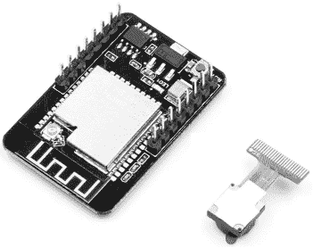

图 24-1：一块 ESP32 摄像头板

如果你购买的模块是这种情况，你将需要一根 USB 到串行电缆，如 图 24-2 所示的 PL2303TA 电缆（PMD Way 部件 727859）。你将使用这根电缆为 ESP32 摄像头供电，以便在 Arduino IDE 的串行监视器中上传草图并监控串行输出。

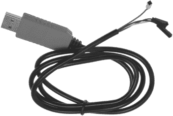

图 24-2：一根 USB 到 TTL 电缆

或者，你可以选择带有匹配 USB 接口板的 ESP32 摄像头，例如 PMD Way 的 26409000 部件，如 图 24-3 所示。

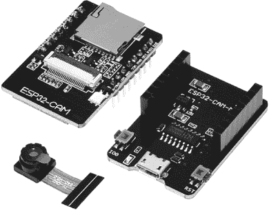

图 24-3：一块带有 USB 接口板的 ESP32 摄像头板

我选择了如图 图 24-1 所示的 ESP32 摄像头板，不仅因为它是最受欢迎的型号，还因为它允许你使用外部 Wi-Fi 天线，从而使你可以与 Wi-Fi 接入点保持更大的操作距离。通常，出厂时模块已配置为使用外部天线。你仍然可以在没有天线的情况下使用它，但 Wi-Fi 信号范围将不理想。

在初步实验后，你可能希望用不同类型的镜头替换默认的摄像头镜头，用于变焦或广角摄影，或者使用更长的电缆将摄像头与 ESP32 摄像头板连接。你可以从 PMD Way 购买这些镜头（例如，查看 26401000 部件）或从你的 ESP32 摄像头板供应商处购买。然而，这些额外的镜头类型并不是本章项目的必要条件。

## 设置 ESP32 摄像头

一旦你购买了 ESP32 摄像头板，你需要进行设置以便接收草图并正常运行。

如果你还没有完成，转到 第十九章，并完成“为 ESP32 配置 Arduino IDE”到“测试 ESP32”的步骤，以使你的 ESP32 正常工作。接下来，将 ESP32 摄像头连接到电脑。如果你有如图 图 24-2 所示的 USB 接口板，按常规通过 USB 电缆连接。如果你使用的是替代的 USB 到 TTL 电缆连接 USB 接口，请按照 表 24-1 所示的方式连接 ESP32 摄像头的引脚到电缆。

表 24-1： ESP32 摄像头与 USB-TTL 电缆的连接

| ESP32 摄像头引脚 | 电缆连接器 |
| --- | --- |
| 5V | 5V（红色） |
| GND | GND（黑色） |
| U0T | RX（白色） |
| U0R | TX（绿色） |

如果你使用的是 USB 到 TTL 电缆，在上传草图之前，你还必须将跳线连接到 GND 引脚和 IO0 引脚之间。上传草图后，你必须断开并重新连接 USB 电缆到电脑，然后移除 IO0 到 GND 的跳线，并按下开发板上的重置按钮以启动草图。每次上传草图时，你都需要执行这些步骤。

连接 ESP32 相机到您的 PC 后，打开 Arduino IDE 并将开发板设置为 AI Thinker ESP-32 CAM，方法是选择**工具** 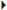 **开发板**  **esp32**。您可能还需要通过选择**工具**  **端口**来设置 USB 端口，以便与您的 USB 接口匹配。

打开 Arduino Wi-Fi 库中附带的 WiFiScan 示例草图。将此草图上传到 ESP32 相机板，并打开串口监视器。您应该能看到附近可用的 Wi-Fi 网络列出，如图 24-4 所示。

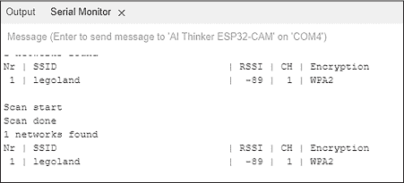

图 24-4：运行 WiFiScan 示例草图的输出示例

在图 24-4 中显示的接收信号强度指示器（RSSI）值是一个测量 ESP32 相机板接收到您 Wi-Fi 接入点信号强度的指标。数值越接近 0，信号越好。CH 值是您 Wi-Fi 接入点的 Wi-Fi 频道；大多数接入点有 16 个频道。最后，加密类型显示的是所列 Wi-Fi 接入点使用的加密协议类型。如果 WiFiScan 示例草图工作正常，那么您的 ESP32 相机板已准备好使用。

如果您的相机在送达时没有预先连接到板上，您现在需要进行连接。请小心慢慢地操作，撬开黑色塑料铰链条带，如图 24-5 所示。使用塑料镊子可能会比用手指更有帮助。


图 24-5：打开 ESP32 相机板上的相机电缆连接器

将相机的接口电缆插入 ESP32 相机板上的连接器。在此过程中，相机镜头应朝上，电缆应滑入几毫米。不要用力过大；如果遇到阻力，电缆已经插入足够深，如图 24-6 所示。

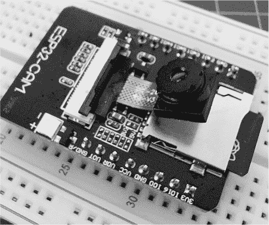

图 24-6：将相机电缆连接器插入 ESP32 相机板

最后，将黑色塑料铰链条带沿连接器方向推下，直到听到“咔嚓”一声，表示已经锁定到位，这样也能将相机连接器电缆固定到 ESP32 相机板上，如图 24-7 所示。


图 24-7：相机安装到 ESP32 相机板上

如果镜头上有保护塑料膜，请小心地拉起保护膜一侧的标签将其取下。现在你可以通过它在 Wi-Fi 网络中进行视频流测试了。

项目#69：从基本相机服务器流式传输视频

在这个项目中，你将通过 Wi-Fi 局域网远程控制 ESP32 相机模块，使用网页浏览器界面，尝试调整相机界面上的各种设置来调整相机的图像或视频流。

对于硬件，你只需要按照前一节的描述准备 ESP32 相机模块和 USB 接口。对于草图，你需要像往常一样从书籍网站下载项目文件，[*https://<wbr>nostarch<wbr>.com<wbr>/arduino<wbr>-arduinians*](https://nostarch.com/arduino-arduinians)。然而，本章的项目包括比通常的*.ino*草图文件更多的额外文件。对于这个项目，你只需打开*project69.ino*文件，Arduino IDE 会自动打开其他文件。如图 24-8 所示，你应该能看到作为标签显示在菜单栏下的包含文件。

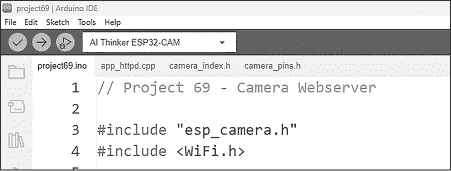

图 24-8：Arduino IDE 中显示的所有项目文件标签

额外的文件（*app_httpd.cpp*、*camera_index.h*和*camera_pins.h*）包含用于定义 ESP32 相机板 GPIO 引脚的数据，并包含帮助显示相机网页的数据。该项目操作的是一个预定义的界面，因此你无法修改太多内容。你只需要关注*.ino*草图文件。

在项目#69 的草图中，按照之前在第十九章项目#55 中解释的那样，添加你的 Wi-Fi 网络和名称到 SSID 和密码字段。当你将 ESP32 相机连接到计算机时，上传草图并打开 Arduino IDE 中的串口监视器。如果你的 USB 接口通过外部电缆连接，请记得从 IO0 移除与 GND 的连接，然后按下**RESET**按钮重启相机模块。

你应该能在串口监视器中看到 ESP32 相机正在使用的 IP 地址，如图 24-9 所示。

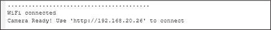

图 24-9：串口监视器输出示例，显示相机的 IP 地址

打开连接到同一 Wi-Fi 网络的 PC 或移动设备上的网页浏览器，访问串口监视器中显示的 IP 地址。ESP32 相机应该会提供一个包含各种控件和设置的网页。点击页面底部的**开始流式传输**按钮。来自相机的实时视频流应该会出现在屏幕上，如图 24-10 所示。（图中的视频是我在厨房桌子上拍摄的。）

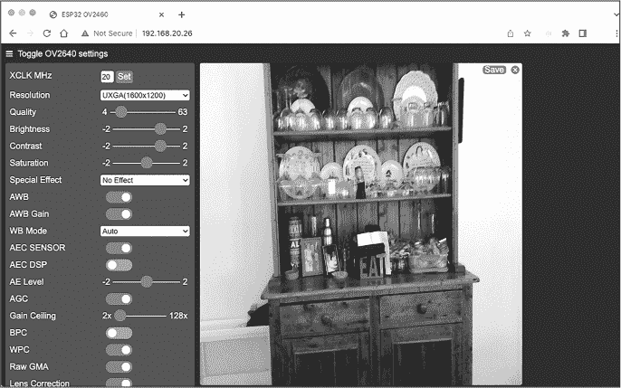

图 24-10：来自相机流媒体页面的示例输出

花些时间尝试调整设置，调整亮度、对比度等。进行视频流传输时，图像质量越高，网络上传输的数据量越大。如果你发现视频更新速度或*帧率*太慢或卡顿，可以通过下拉菜单更改分辨率。你也可以切换为黑白流媒体，因为这比彩色图像传输需要的数据显示量要少得多。如果你对操作时的帧率感到好奇，可以在串口监视器中查看相机流媒体时的帧率，如图 24-11 所示。

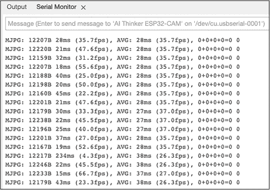

图 24-11：来自 ESP32 相机的帧率示例输出

如果你对视频或图像的质量或亮度不满意，可能需要更好的外部照明，或者重新调整相机的位置，以便让更多的环境光照射到镜头上。

让我们来看一下*.ino* 草图文件：

```
// Project #69 - Camera web server

#include "esp_camera.h"
#include <WiFi.h>

#define CAMERA_MODEL_AI_THINKER
#include "camera_pins.h"

const char* ssid = "`SSID`";
const char* password = "`password`";

void startCameraServer();

void setup()
{
  ❶ Serial.begin(115200);
    Serial.setDebugOutput(true);
    Serial.println();

  ❷ camera_config_t config;
    config.ledc_channel = LEDC_CHANNEL_0;
    config.ledc_timer = LEDC_TIMER_0;
    config.pin_d0 = Y2_GPIO_NUM;
    config.pin_d1 = Y3_GPIO_NUM;
    config.pin_d2 = Y4_GPIO_NUM;
    config.pin_d3 = Y5_GPIO_NUM;
    config.pin_d4 = Y6_GPIO_NUM;
    config.pin_d5 = Y7_GPIO_NUM;
    config.pin_d6 = Y8_GPIO_NUM;
    config.pin_d7 = Y9_GPIO_NUM;
    config.pin_xclk = XCLK_GPIO_NUM;
    config.pin_pclk = PCLK_GPIO_NUM;
    config.pin_vsync = VSYNC_GPIO_NUM;
    config.pin_href = HREF_GPIO_NUM;
    config.pin_sscb_sda = SIOD_GPIO_NUM;
    config.pin_sscb_scl = SIOC_GPIO_NUM;
    config.pin_pwdn = PWDN_GPIO_NUM;
    config.pin_reset = RESET_GPIO_NUM;
    config.xclk_freq_hz = 20000000;
    config.pixel_format = PIXFORMAT_JPEG;
  ❸ config.frame_size = FRAMESIZE_UXGA;
    config.jpeg_quality = 10;
    config.fb_count = 2;

  ❹ esp_err_t err = esp_camera_init(&config);
    if (err != ESP_OK)
    {
      ❺ Serial.printf("Camera init failed with error 0x%x", err);
        return;
 }
  ❻ s->set_framesize(s, FRAMESIZE_QVGA); // Set default frame size

  ❼ WiFi.begin(ssid, password);
    while (WiFi.status() != WL_CONNECTED)
    {
        delay(500);
        Serial.print(".");
    }
    Serial.println(" ");
    Serial.println("WiFi connected");

    startCameraServer();

  ❽ Serial.print("Camera Ready! Use 'http://");
    Serial.print(WiFi.localIP());
    Serial.println(" ' to connect");
}

void loop() {} 
```

草图包含了所需的库，然后定义了 ESP32 相机类型，允许将正确的引脚标签与 Arduino IDE 使用的引脚进行关联。请确保在适当的字段中插入您的 Wi-Fi 网络名称和密码。

在 void setup() 中，代码会启用串口监视器以进行调试 ❶。它为相机接口引脚进行 Arduino GPIO 关联 ❷，然后定义默认的图像大小和质量 ❸。如果初始化相机时出现问题，会进行相应的提示 ❹。以下的 printf() 函数仅在使用 ESP32 兼容的 Arduino 时可用，而不是 Arduino 板本身。它允许在文本字符串中显示变量的值。例如，❺ 处的代码将显示存储在变量 err 中的错误代码，该错误代码以十六进制格式显示。

默认的图像帧大小设置为四分之一 VGA（320 × 240 像素，或 QVGA），以提高速度 ❻。由于 QVGA 分辨率较小，每帧所需的数据较少，这意味着帧率可以更高，从而实现更流畅的视频。

在建立 Wi-Fi 连接后 ❼，草图会在串口监视器 ❽ 中显示 ESP32 相机的网页 IP 地址。尽情尝试相机吧。有很多方法可以使用这款廉价硬件，例如监控房产入口、从另一个房间观察孩子，或者查看鸟巢。现在是学习如何使用外部天线最大化 Wi-Fi 范围的好时机。

## 外部 Wi-Fi 天线

本章推荐的 ESP32 摄像头板支持使用外部 Wi-Fi 天线，这可以使 Wi-Fi 接入点的距离更远。在购买天线时，请确保选择一个包含从天线到 ESP32 摄像头板电缆的天线。板上的插座称为 *uFL* 或 *mini ipex 连接器*。外部天线和电缆通常作为一套出售，但通常不包括在摄像头中，这意味着你需要单独购买它们。

图 24-12 展示了一个外部天线和电缆的示例，PMD Way 部件 70202023。

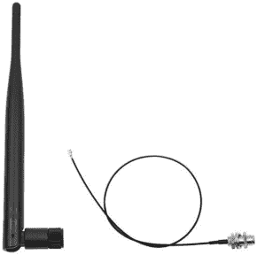

图 24-12：外部天线和电缆

要检查模块天线配置，请将模块翻转过来，以便看到天线插座，PCB 上天线下方的微小圆形铜环，如图 24-13 所示。

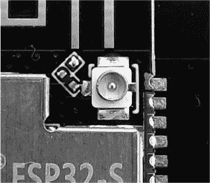

图 24-13：ESP32 摄像头板天线插座

插座的左侧应有三个微小的 PCB 焊盘——上、下和左。两个焊盘应通过一个表面贴装电阻桥接。如果下部和左部焊盘按这种方式桥接，如图 24-14 所示，那么你就可以准备连接一个外部天线到插座，如图 24-13 所示。

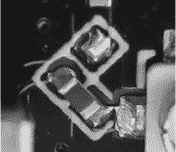

图 24-14：ESP32 摄像头板桥接电阻

然而，如果你的板子上电阻跨接在顶部和左侧焊盘之间，你需要将其拆除并重新焊接到正确的位置。为此，你需要一把细尖焊枪或适用于表面贴装元件回流工作的热风枪，以及少量的焊锡。如果这对你来说是个问题，最好在订购 ESP32 摄像头板之前与板子的供应商确认。

使用天线可以大大提高 ESP32 摄像头板的无线电范围。一旦连接上外部天线和电缆，你可以轻松地通过运行本章前面使用过的 WiFiScan 演示示例来展示无线电范围的改善。例如，图 24-15 展示了未连接天线和连接天线后的 WiFiScan 结果。

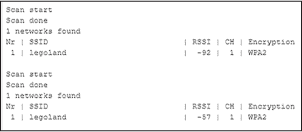

图 24-15：带和不带外部天线的 WiFiScan 结果

未连接天线时，输出显示 RSSI 值为 −92；但是，连接天线后，RSSI 值为 −57。

现在你已经知道如何测试 ESP32 相机模块的 Wi-Fi 并设置视频流，我将向你展示如何按命令拍照并将其保存到 microSD 卡，同时在每张图像的文件名中存储时间和日期，便于参考。

项目 #70：拍照并保存到存储卡

本项目演示了如何控制板载相机按你的命令拍照。你可以在自己的草图中使用本项目的代码，制作延时摄影相机、由传感器或开关触发的相机，或者只是一个简单的便携数字相机。

对于硬件，你需要 ESP32 相机模块（带有匹配的 USB 接口）和一张 microSD 存储卡，用于存储拍摄的图像。如果你还没有这么做，格式化 microSD 卡以便与相机配合使用，将文件系统类型设置为 FAT32。任何在 PC、Mac 或 Linux 机器上的正常格式化程序都提供设置文件系统类型的选项。

将格式化后的卡插入 ESP32 相机，然后将 ESP32 相机连接到计算机并上传项目 #70 的草图。在 Arduino IDE 中打开串口监视器。如果你的 USB 接口是通过外部电缆连接的，请记得移除 IO0 到 GND 的连线，然后按**RESET**按钮重启相机模块。

串口监视器应显示 ESP32 相机拍摄的图像文件名，如图 24-16 所示。

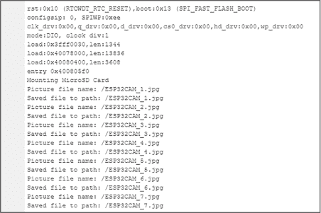

图 24-16：图像文件名的串口监视器输出

要停止相机并查看结果，断开 USB 电缆与计算机的连接，并将 microSD 卡插入计算机。打开计算机的文件管理器，找到代表 microSD 卡的驱动器，你应该能找到 ESP32 相机拍摄的图像。例如，图 24-17 展示了我办公室窗外的照片。

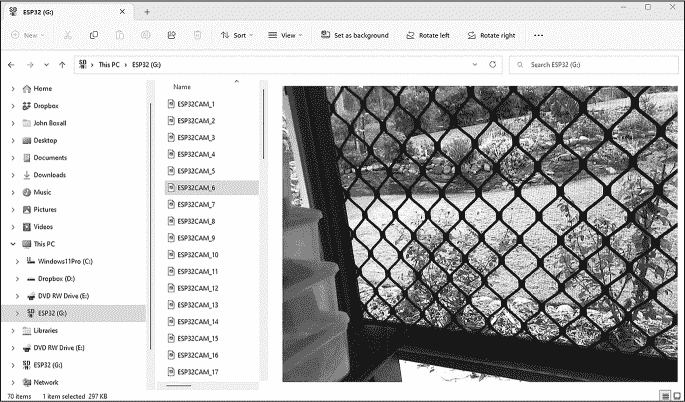

图 24-17：项目 #70 的示例输出

让我们看看这个是如何工作的：

```
// Project #70 - Save images to microSD card

#include "esp_camera.h"
#include "soc/soc.h"
#include "soc/rtc_cntl_reg.h"
#include "driver/rtc_io.h"
#include "FS.h"
#include "SD_MMC.h"

// Pin definitions for CAMERA_MODEL_AI_THINKER
#define PWDN_GPIO_NUM 32
#define RESET_GPIO_NUM −1
#define XCLK_GPIO_NUM 0
#define SIOD_GPIO_NUM 26
#define SIOC_GPIO_NUM 27
#define Y9_GPIO_NUM 35
#define Y8_GPIO_NUM 34
#define Y7_GPIO_NUM 39
#define Y6_GPIO_NUM 36
#define Y5_GPIO_NUM 21
#define Y4_GPIO_NUM 19
#define Y3_GPIO_NUM 18
#define Y2_GPIO_NUM 5
#define VSYNC_GPIO_NUM 25
#define HREF_GPIO_NUM 23
#define PCLK_GPIO_NUM 22

❶ int imageCounter = 0;

void configESPCamera()
{
    // Object for camera configuration parameters:
    camera_config_t config;

  ❷ config.ledc_channel = LEDC_CHANNEL_0;
    config.ledc_timer = LEDC_TIMER_0;
    config.pin_d0 = Y2_GPIO_NUM;
    config.pin_d1 = Y3_GPIO_NUM;
    config.pin_d2 = Y4_GPIO_NUM;
    config.pin_d3 = Y5_GPIO_NUM;
    config.pin_d4 = Y6_GPIO_NUM;
    config.pin_d5 = Y7_GPIO_NUM;
    config.pin_d6 = Y8_GPIO_NUM;
    config.pin_d7 = Y9_GPIO_NUM;
    config.pin_xclk = XCLK_GPIO_NUM;
    config.pin_pclk = PCLK_GPIO_NUM;
    config.pin_vsync = VSYNC_GPIO_NUM;
    config.pin_href = HREF_GPIO_NUM;
    config.pin_sscb_sda = SIOD_GPIO_NUM;
    config.pin_sscb_scl = SIOC_GPIO_NUM;
    config.pin_pwdn = PWDN_GPIO_NUM;
    config.pin_reset = RESET_GPIO_NUM;
    config.xclk_freq_hz = 20000000;
    config.pixel_format = PIXFORMAT_JPEG;
    config.frame_size = FRAMESIZE_UXGA;
    config.jpeg_quality = 10;
    config.fb_count = 2;

    esp_err_t err = esp_camera_init(&config);
    if (err != ESP_OK)
    {
        Serial.printf("Camera init failed with error 0x%x", err);
        return;
    }

    // Set camera quality parameters:
    sensor_t *s = esp_camera_sensor_get();

  ❸ // Brightness (−2 to 2)
    s->set_brightness(s, 0);
    // Contrast (−2 to 2)
    s->set_contrast(s, 0);
    // Saturation (−2 to 2)
    s->set_saturation(s, 0);
    // Special effects (0 - none, 1 - negative, 2 - grayscale,
    // 3 - red tint, 4 - green tint, 5 - blue tint, 6 - sepia)
    s->set_special_effect(s,  0);
    // Auto white balance (0 = disable , 1 = enable)
 s->set_whitebal(s, 1);
    // Auto white balance gain (0 = disable , 1 = enable)
    s->set_awb_gain(s, 1);
    // WB MODES (0 - automatic, 1 - sunny, 2 - cloudy,
    // 3 - office, 4 - home)
    s->set_wb_mode(s,  0);
    // EXPOSURE CONTROLS (0 = disable , 1 = enable)
    s->set_exposure_ctrl(s, 1);
    // AEC2 (0 = disable , 1 = enable)
    s->set_aec2(s, 0);
    // AE LEVELS (−2 to 2)
    s->set_ae_level(s, 0);
    // AEC VALUES (0 to 1200)
    s->set_aec_value(s, 300);
    // GAIN CONTROLS (0 = disable , 1 = enable)
    s->set_gain_ctrl(s, 1);
    // AGC GAIN (0 to 30)
    s->set_agc_gain(s, 0);
    // GAIN CEILING (0 to 6)
    s->set_gainceiling(s, (gainceiling_t)0);
    // BPC (0 = disable , 1 = enable)
    s->set_bpc(s, 0);
    // WPC (0 = disable , 1 = enable)
    s->set_wpc(s, 1);
    // RAW GMA (0 = disable , 1 = enable)
    s->set_raw_gma(s, 1);
    // LENC (0 = disable , 1 = enable)
    s->set_lenc(s, 1);
    // HORIZ MIRROR (0 = disable , 1 = enable)
    s->set_hmirror(s, 0);
    // VERT FLIP (0 = disable , 1 = enable)
    s->set_vflip(s, 0);
    // DCW (0 = disable , 1 = enable)
    s->set_dcw(s, 1);
    // COLOR  BAR PATTERN (0 = disable , 1 = enable)
    s->set_colorbar(s, 0);
}

void initMicroSDCard()
{
    if (!SD_MMC.begin())
    {
        Serial.println("microSD card failed");
        return;
    }
    uint8_t cardType = SD_MMC.cardType();
    if (cardType == CARD_NONE)
    {
        Serial.println("microSD card not found");
        return;
    }
}

void takeNewPhoto(String path)
{
    // Set up frame buffer:
    camera_fb_t *fb = esp_camera_fb_get();

    if (!fb)
    {
        Serial.println("Camera capture failed");
        return;
    }

    // Save picture to microSD card:
    fs::FS &fs = SD_MMC;
    File file = fs.open(path.c_str(), FILE_WRITE);
    if (!file)
    {
        Serial.println("Couldn't open file in write mode!");
    } else
    {
        file.write(fb->buf, fb->len);
        Serial.printf("File saved as: %s\n", path.c_str());
    }
    file.close();
    esp_camera_fb_return(fb);
}

void captureImage()
{
    imageCounter += 1;
    // Build image path and filename:
    String path = "/ESP32CAM_" + String(imageCounter) + ".jpg";
    Serial.printf("Picture file name: %s\n", path.c_str());
    takeNewPhoto(path);
}

void setup()
{
    Serial.begin(115200);
    WRITE_PERI_REG(RTC_CNTL_BROWN_OUT_REG, 0);
    configESPCamera();
    initMicroSDCard();
}

void loop()
{
    captureImage();
    delay(5000);
} 
```

该草图包括所有必需的库，然后给出 AI-Thinker ESP32 相机模块的引脚定义。每次相机拍照时，程序会使用imageCounter整型变量❶跟踪照片的数量，图像的文件名将包含此数字（如图 24-17 所示）。

该草图还定义了用于连接相机❷的引脚编号，保存了图像类型，并根据config.pixel_format定义了图像的大小和质量。此设置为*.jpg*文件类型，图像大小为 UXGA（1,600 × 1,200 像素），最大质量为 10（数字越大，图像质量越低）。其他相机设置❸包括白平衡控制、亮度、对比度等。草图中每个参数上方的注释描述了它们的值范围，因此你可以调整这些值，以便为你的相机安装获取理想的效果。

initMicroSDCard()函数包含了 microSD 卡电路的初始化，而takeNewPhoto()函数使相机能够拍摄并保存图像；其参数是用于存储图像的文件名。草图的核心是captureImage()，程序调用该函数来捕获图像。此函数增加imageCounter变量，并将其插入到以*/ESP32CAM_*开头（你可以根据需要更改）的字符串中，最后添加*.jpg*文件扩展名。请注意，如果你在从存储卡中获取图像之前重置了 ESP32 板，这些图像将被覆盖。

在void setup()中，草图初始化了串行监视器，接着是WRITE_PERI_REG()函数，该函数关闭了相机的欠压检测。此函数允许相机在电源电压暂时下降时继续工作（尽管质量较低）。草图初始化了相机和 microSD 卡电路。最后，它通过调用captureImage()捕获一张新图像，然后等待五秒钟。

你可以围绕这个项目的草图构建自己的数字摄影项目，它包含了控制相机所需的一切——只需根据你的喜好调整相机设置，并在需要拍照时调用captureImage()函数。捕获图像并将其保存到 microSD 卡的过程大约需要两秒钟，因此你不能强迫它更快地工作。

现在你已经可以拍摄自己的照片了，是时候了解 ESP32 相机板上的引脚分配，这样你就可以与外部设备交互，扩展你的项目了。

## ESP32 相机引脚分配

与 ESP32 开发板一样，ESP32 摄像头板也具有一系列可以用于非摄像头操作的 GPIO 引脚。了解这些引脚图后，你可以根据需要在自己的项目中使用它们。表 24-2 显示了引脚标签及其对应的 Arduino 用法。

表 24-2： ESP32 摄像头引脚图

| 引脚标签 | 引脚用途 | 备注 |
| --- | --- | --- |
| 5V | 5 V 电源输入 | 无 |
| GND | 地 | 无 |
| IO12 | GPIO 引脚 | 无 |
| IO13 | GPIO 引脚 | 无 |
| IO15 | GPIO 引脚 | 无 |
| IO14 | GPIO 引脚 | 无 |
| IO2 | GPIO 引脚 | 无 |
| IO4 | GPIO 引脚 | 控制板载明亮 LED |
| 3V3 | 3.3 V 电源输入 | 建议使用 5 V |
| IO16 | GPIO 引脚 | 无 |
| IO0 | 代码上传/GPIO 引脚 | 连接到 GND 以上传代码 |
| GND | 地 | 无 |
| VCC | 电源输出 | 输出，不是输入！ |
| UOR | 串口 RX（接收） | 无 |
| UOT | 串行 TX（传输） | n/a |
| GND | GND | n/a |

如果你在使用相机，最好使用 5 V 为 ESP32 相机供电；否则，3.3 V 也可以。使用较低电压可能会导致图像轻微退化。当你在构建包含比板子更多硬件的项目时，建议使用至少 500 mA 电流的 5 V 直流电源。

明亮的白色“闪光灯”LED 连接到 GPIO 引脚 IO4，可以像任何数字输出引脚一样打开和关闭。它还连接到 microSD 卡插槽电路，当卡被访问时会点亮。这款 LED 产生大量热量，因此在控制它用于自己的项目时，不要让它持续运行超过一秒钟，而应给予它足够的时间冷却。

在相机模块的另一侧有一个小的红色 LED，它通过 GPIO 引脚 33 内部连接。它的接线方式是反向的，设置该引脚为低电平时会点亮 LED，高电平时则关闭。总体来说，GPIO 引脚可以用作输入或输出。请记住，逻辑电压是 3.3 V，而不是 5 V。

## 继续前进

在本章中，你学习了如何利用廉价且实用的 ESP32 相机板进行视频流传输或拍照，并将其保存到存储卡。这为六个基于 ESP32 的章节增加了最后一项技能集，后者展示了远程控制项目、记录和显示数据的各种方式。

这标志着*Arduino for Arduinians*的最后一章！要继续你的 Arduino 之旅，请查看结语，了解接下来的步骤。
