# 附录

# 压缩并安装 Arduino 库

创建新的 Arduino 库后，你可以通过将库文件保存为 ZIP 文件来存储和分发它。未来获取 ZIP 文件的用户可以轻松安装该库。

本附录将教你如何在 Windows、macOS 和 Linux 上创建 ZIP 文件，这些步骤是将 Arduino 库文件整理为可安装文件的过程的一部分。之后，你将学习如何将作为 ZIP 文件收到的 Arduino 库安装到 Arduino IDE 中。

## 压缩文件为 ZIP 文件

本节内容将教你如何将自定义的 Arduino 库文件压缩成 ZIP 文件，这不仅方便分发，还将它们转换成适合快速安装到 Arduino IDE 中的格式。请跳转到适合你操作系统的部分。

本节基于名为*blinko*的示例 Arduino 库。但是，在你自己的项目中，你应当将其替换为你自己的库名称。

### Windows 7 及更高版本

要在 Windows 上为 Arduino 库创建 ZIP 文件，首先将你想压缩的自定义 Arduino 库文件和示例草图（草图存放在它自己的文件夹中，所有草图都应如此）放置在一个位置。图 A-1 展示了库文件在一起的示例。

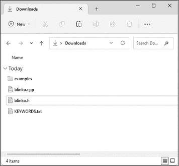

图 A-1：下载文件夹中的 Arduino 库文件

选择所有文件，右键点击选中的文件，选择**压缩为 ZIP 文件**，如图 A-2 所示。

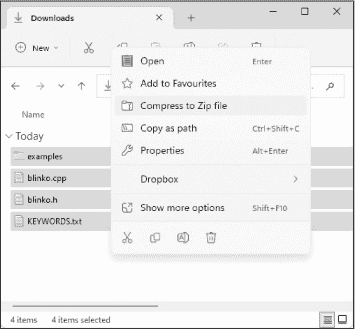

图 A-2：压缩库文件

文件夹中会出现一个新文件，允许修改文件名。将库文件名更改为*blinko.zip*，然后按 ENTER 键，如图 A-3 所示。

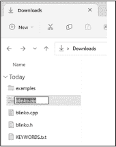

图 A-3：更改库 ZIP 文件名

现在你有了一个库的 ZIP 文件，可以轻松分发给他人或自行安装。

### macOS 10 或更高版本

要在 macOS 上创建 ZIP 文件，首先将你想压缩的自定义 Arduino 库文件和示例草图（草图存放在它自己的文件夹中，所有草图都应如此）放置在一个位置。图 A-4 展示了库文件在一起的示例。

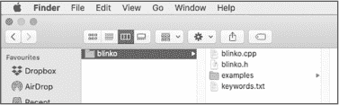

图 A-4：下载文件夹中的 Arduino 库文件

选择所有文件，右键点击文件，选择**压缩 4 个项目**，如图 A-5 所示。

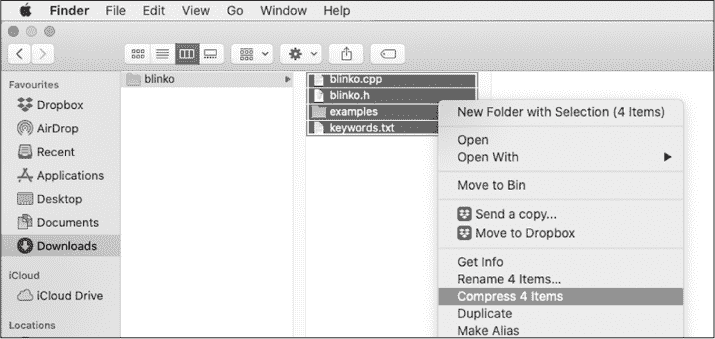

图 A-5：压缩库文件

一个名为*Archive.zip*的新文件将出现在文件夹中，如图 A-6 所示。

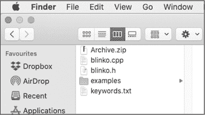

图 A-6： Archive.zip 文件在下载文件夹中

点击*Archive.zip*文件夹并将其重命名为*blinko.zip*，如图 A-7 所示。

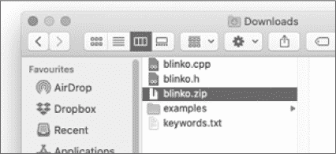

图 A-7：重命名 Archive.zip 为 blinko.zip

现在你有了一个库 ZIP 文件，可以轻松地分发给他人或自己安装。

### Ubuntu 20.04 LTS 及更高版本

要在 Ubuntu Linux 上创建 ZIP 文件，首先将你要压缩的自定义 Arduino 库文件与示例草图（存储在自己的文件夹中，所有草图都是如此）放置在一个位置。图 A-8 展示了库文件的一个例子。

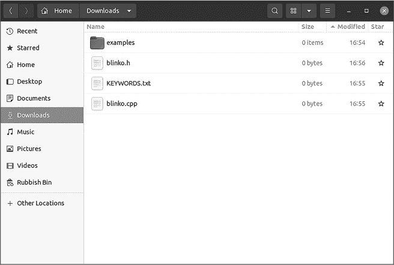

图 A-8：Blinko Arduino 库文件

选择所有文件，右键点击文件，选择**压缩**，如图 A-9 所示。

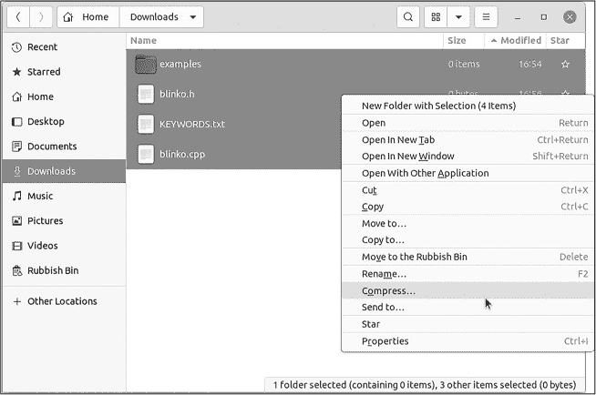

图 A-9：压缩库文件

一个新窗口将出现，提示你输入归档名称。输入*blinko*作为文件名，并点击.zip 单选按钮，然后点击**创建**，如图 A-10 所示。

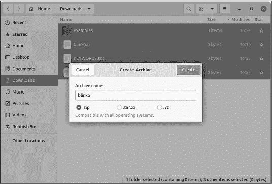

图 A-10：设置 ZIP 文件名

一旦压缩完成，你将在同一文件夹中找到你的新 ZIP 文件以及库文件。现在你有了一个库 ZIP 文件，可以轻松地分发给他人或自己安装。

## 安装你的新库

现在，你可以使用 ZIP 文件方法安装库。打开 Arduino IDE，选择 **草图** ➧ **包含库**  **添加 .ZIP 库**。文件对话框将会打开。导航到你的 ZIP 文件并选择它进行安装。

一旦库安装完成并且你重新启动了 Arduino IDE，当你选择 **草图**  **包含库** 时，你会看到你的库在列表中，如 图 A-11 所示。

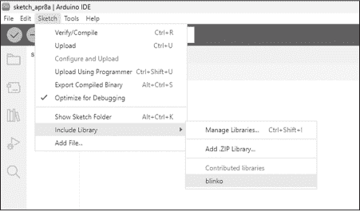

图 A-11：Arduino 库，现已在 IDE 中可用

现在，你可以轻松访问你已安装的草图，例如 *blinko* 库，方法是选择 **文件**  **示例**  **blinko**，如 图 A-12 所示。

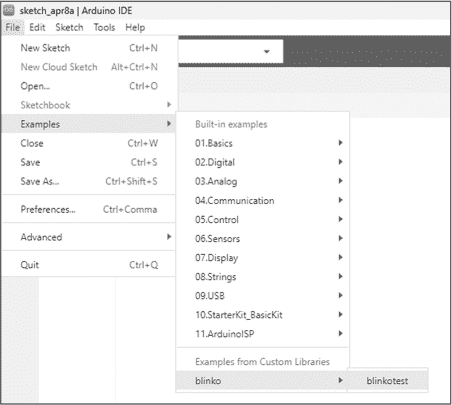

图 A-12：Arduino IDE 的库示例草图菜单，显示 blinko 示例草图
