## 第一章：电子学入门

本章为那些几乎没有电子学或电力经验的读者提供了一个电子学的广泛概述。如果你已经对本章的一些话题感到熟悉，你可以像看选择自己冒险的书一样，跳到你想进一步了解的主题，甚至直接跳到项目 1。

如果你是电子学的新手或只是想复习一下，我们建议你完整阅读本章。虽然它不是一本完整的电子学指南（关于这个话题有整本书、课程和学位），但本章是一本实用的参考书，旨在帮助你掌握基本概念和词汇。如果你想深入了解电力、电子学和电路，请参阅本章末尾的推荐阅读清单。

### 电力、导电性和基本术语

电力是一种奇特的存在。在许多方面它是可以预测的，但有时它也有些狡猾。如果你查找*电力*一词的字典定义，你可能会发现它对电力是什么、如何运作或最重要的，如何使用它，几乎没有提供什么线索。让我们从基础开始。

#### 什么是电力？

要理解电力，首先需要了解原子的结构。原子是构成你周围一切的基本单元。一个原子由质子、中子和电子组成。电子带负电荷，质子带正电荷。一个典型的原子中电子和质子的数量相同，因此它是电中性的。电力是一种涉及电荷的移动或储存的能量形式；当我们推动或强迫电荷按照规定的方式或定义的路径移动时，就会发生电力现象。如果你曾经见过雷暴，你就看到了云层与地面之间电荷转移的证据。这些电荷通过我们大气中的空气分子转移，随着它们的移动，天空会被点亮。电荷的移动和转移被称为*电流*。电流的单位是安培（A）或毫安（mA）。

**注意**

*传统上，我们把电流看作是正电荷的运动。尽管从技术上讲，电子是原子中可以移动的部分，但仍然习惯性地将电流称为从正极到负极的运动。*

除了闪电、弧焊和偶尔的静电震动，我们通常看不见电力的直接表现。即使是我们在闪电中看到的明亮光线，也仅仅是空气分子在电荷通过时发生了形态变化。

当电荷受到电场力作用并且有路径供电荷移动时，电荷就会运动。这个电场力是由*电势差*产生的，或者我们通常称之为*电压*。电压是最终导致电荷运动的原因，其单位是伏特（V）。作为参考，典型的电池电压通常在 1.5 V 到 12 V 之间。12 V 电池会使电荷比 1.5 V 电池更快地移动。

#### 电的种类

一般来说，电可以分为两种基本类型：*直流电*（*DC*）和*交流电*（*AC*）。交流电是你家外面的电力线和墙上插座中的电。交流电非常适合发电（例如发电厂）、长距离传输电力（如从发电厂到家中）以及驱动大型设备（如电动机和加热器）。然而，我们并不使用交流电来为大多数家用电子设备供电。大多数插入墙壁插座的小型电器和家用电子设备需要直流电，并使用*变压器*将交流电转换为直流电。关于交流电和直流电的详细内容超出了本书的范围，但你在这里构建的项目将专注于直流电。

#### 什么是电路？

即使有电场力的推动，电荷也需要一条路径，从高电势点到低电势点。电荷从电池的正极（高电势）到负极（低电势）移动的路径称为*电路*。电路由一条从正极到负极的闭合路径组成，路径中包含如发光二极管（LED）、电阻器、灯或电动机等设备。图 1 显示了一个包含 LED、电池和电阻器的简单电路。请注意，电路的形状大致呈现一个环或圆形，因此得名*电路*。

**图 1：** 一个基本的直流电路

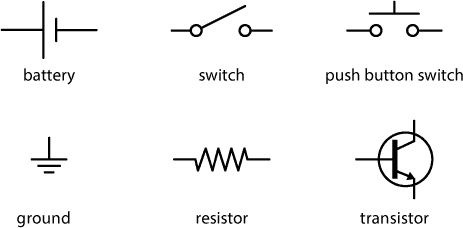

为了使电荷能够移动，路径必须由*导电*材料构成。导电性不是一个绝对的量度，而是一个连续体。虽然一些材料通常被认为是导体或绝缘体，但大多数材料的导电性占据一个范围。换句话说，有些材料允许电荷更自由地移动。想象一下在不同路面上开车。在平滑的高速公路上，你的车可以比在越野或土路上行驶时更快。不同的道路允许不同的速度，就像不同的材料允许不同的导电性一样。我们用*电阻*这个术语来描述材料减缓电荷运动的程度。

#### 欧姆定律

正如你可能已经猜到的，电流、电压和电阻之间存在关系。这个关系通常被称为*欧姆定律*，并且可以用以下数学公式表示：

*V* = *I* × *R*

在这个公式中，*V* 代表电压，*I* 代表电流，*R* 代表电阻。（不要让这个数学公式吓到你：这是你在本书中看到的约三条公式之一。）

#### 将电流可视化为管道中的水

要理解电路中的运作，最有用的方法是将电流想象成水在管道中的流动。想象水流通过花园里的水管。当你打开阀门时，水开始流过水管到达另一端，如图 2 所示。

**图 2：** 水与电流模型

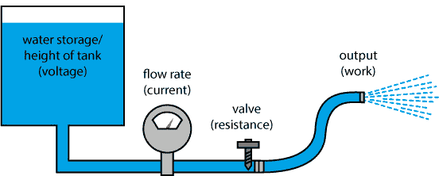

在水管中移动的水分子代表电荷的流动（电流）。如果我们调节水阀的开关，我们可以改变管道中的水压。水管中的水压类似于电路中的电压。如果你增加水压，流量也会增加。在电路中也是一样：如果你增加电压，电流也会增加。比喻的最后一部分在于水管本身。如果我们在水管中打一个结或限制管道的直径，就会产生电阻。电阻的增加会减慢流量（降低电流）。

这个模型在描述电流流动方面效果不错，但你并不想搭建一整套水管、阀门和管道系统，仅仅是为了让水流到地面上（除非你的目的是浇灌草坪）。你希望用它做些事情；你希望它能做*工作*。在电路中，我们使用一些设备将电能转换为其他有用的能量形式，比如照亮灯泡、旋转马达或发出蜂鸣声。将电能转换为其他形式能量的设备被称为*负载*。托马斯·爱迪生发现，他可以通过灯泡将电能转化为光能；在本书中，你将做的事情远不止于此。

### 电路原理图、线路蓝图和接线图

虽然图示很不错，但细致地绘制每个组件来显示电路的接线方式并不高效。在本书中，你会看到像图 3 这样的*原理图*以及其他插图，帮助你理解电路。

**图 3：** 这个简单的原理图展示了一块电池、一个 LED 灯和一个电阻器。

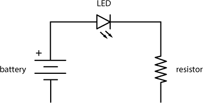

原理图是电路的简化图示。我们有时也称这些为*接线图*或*电路蓝图*。原理图显示了各个组件之间的连接关系以及构建电路时需要使用的组件。在本书中，我们将使用 IEEE（美国电气和电子工程师协会）的标准来绘制电路。 图 3 中的原理图实际上代表了图 1 中的相同电路。直线代表导线，每个组件都有自己独特的符号。图 4 展示了本书中你将看到的一些常见原理图符号。

**图 4：** 一些标准的 IEEE 原理图符号

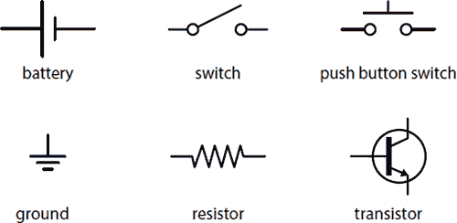

IEEE 原理图符号格式是国际公认的，用于在全球范围内交流和共享电路图。其目的是通过非常简单的线条和图形快速表示组件。

### 原型电路

在本书的项目中，你将构建和测试各种设计。在构建电路时，你可能还希望重新排列部件、交换位置或添加新组件。这个过程叫做*原型设计*。你可以像使用木块或乐高积木一样，通过使用*无焊接面包板*来制作电子原型，正如图 5 所示。

**图 5：** 一个透明的无焊接面包板，具有水平行和垂直电源轨

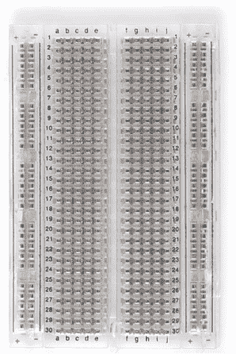

无焊接面包板是一个带有许多孔的塑料矩形。这些孔按照 0.100 英寸的网格间隔，并且大小适合大多数电子组件牢固地插入。孔下方是由软导电金属制成的小夹子，如图 6 所示。

**图 6：** 无焊接面包板的内部结构（左）和内部金属夹的特写（右）

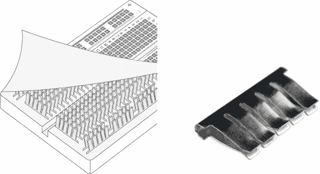

插入同一行孔中的电线通过这些金属夹子在电气上连接在一起。就像是把电线扭在一起，只不过没有扭转的部分。请注意，这些夹子只跨越五个孔的宽度。面包板中间有一个“沟槽”，将面包板分为左右两部分，右侧的夹子与左侧的夹子没有连接。

**注意**

*将面包板竖着拿（纵向排列），并确保顶部的字母是正向的。我们将水平排列的五个孔组称为*行*，将面包板两侧的垂直部分称为*列*，假设此方向。*

面包板有多种形状和尺寸，但大多数仍然会在板子的外缘有垂直的列。这些列被称为*电源轨*或*电源总线*，每个列都有一个从顶部到底部连接的连续夹子，如图 7 所示。面包板通常还会有+和–标签，用于指示电源连接的位置，并配有红色和蓝色的颜色编码。

**图 7：** 面包板的底部，展示了水平行和垂直电源轨

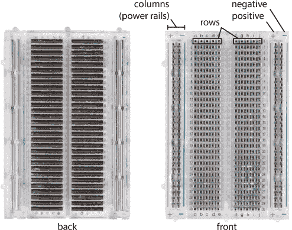

你可以在图 8 中看到一个无焊接面包板在实际工作中的样子，图中展示了一个带有八个 LED 的电路原型设计。

**图 8：** 面包板上的电路

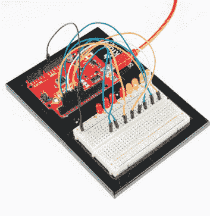

在本书中，您将使用无焊面包板构建电路，这样如果您犯了错误，可以轻松更改或修复。如果您想进一步探索某个部分，您也可以快速地将其添加到电路中。当您开始构建更大、更复杂的电路时，我们建议您准备多个面包板，这样您可以将电路分块构建。这允许您逐步构建并测试项目的每个部分，而不必在出现问题时重做、排除故障或拆解整个项目。

### 离散元件与接线板

我们之前提到过元件，这里简单介绍一下。世界上有成百上千种不同的电子元件。当我们提到*元件*时，我们指的是*离散元件*——最基础的、您可以购买的零件。例如，图 9 中的电阻、电容和 LED 就是离散元件。

另一方面，*接线板*是将多个元件预先连接到一个单一电路板上的组件，这种电路板设计为便于在面包板上使用。接线板有助于加速原型制作过程。您可以在图 10 中看到一个很好的示例。

**图 9：** 电阻（左）、电容（中）和 LED（右）是离散元件的示例。

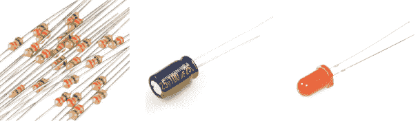

**图 10：** 一个小型加速度计（左）及其接线板（右）。注意接线板左侧的镀金孔。

图 10 比较了一个复杂的元件——集成加速度计传感器模块（型号：ADXL345，来自 Analog Devices）与 SparkFun 为其生产的接线板。这个芯片仅有 5 × 3 毫米！它有非常小的金属连接引脚，类似于离散元件上您看到的长金属引脚。它们太小了，几乎不可能直接将连接线接到上面。接线板将这些小的连接点引导到板边缘的*镀金孔*上，孔之间的间距精确为 0.100 英寸，使得板上的孔可以与无焊面包板上的孔对接。每个孔都经过金属镀层，这样您就可以直接在其上焊接线材。或者，如果您希望与面包板配合使用，您也可以像图 11 所示那样焊接上公头接头。（如果您从未焊接过，也不用担心；请参阅“如何焊接”的说明，详见 302 页。）

请注意，孔上都有丝印标签，这样您就知道如何连接传感器。接线板上有这些标签，您可以直接在面包板上使用它们，而无需花费数小时的时间研究和构建，才能单独使用裸件元件。

**图 11：** 带接头的 ADXL345 接线板

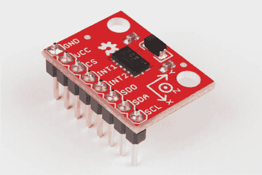

### 模拟与数字

通过定义电路、组件、电压、电流和电阻的概念，我们现在可以讨论两种不同的电子学方法：*模拟*和*数字*。这两种方法并不是互相排斥的，要真正理解你所构建的电路，必须同时理解这两个概念。

模拟处理在设定范围内变化的数值。想象一下某些餐厅的调光开关；那就是模拟的。模拟值可以是开、关以及介于两者之间的任何状态。而数字值则只有两种状态：开或关。

数字电子学通常包括一个微控制器或微处理器，该处理器被编程以响应条件开关设备，而模拟电路则倾向于使用组件来调节电流、电压和电阻，从而实现相同的结果。

这两种思维方式各有优缺点，但你不能只使用其中一个而不使用另一个。例如，你无法仅用微控制器而不使用一些模拟组件来读取温度。

### 什么是微控制器？

*微控制器*是一种小型计算机，你可以通过上传程序或指令集来对其进行编程。微控制器用于自动化简单的任务，比如控制房屋的温度或在草地干旱时浇水。

本书中的项目使用了 SparkFun RedBoard 微控制器板，它与 Arduino Uno 完全兼容。两者如图 12 所示。

**图 12：** SparkFun RedBoard（左）和 Arduino Uno（右）微控制器板

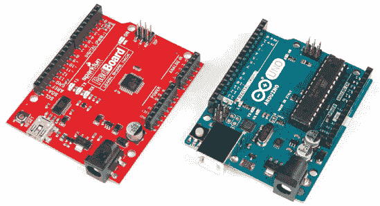

在一天的时间里，你可能使用 15 到 20 个微控制器，而你甚至没有意识到它们的存在。它们出现在你的咖啡机、闹钟和微波炉中。仅仅是你的汽车，就有 5 到 10 个微控制器来控制刹车、音响和点火系统。我们的世界几乎是由微控制器运行的。本书将帮助你学习如何利用这一点，重新掌控你周围的世界。

**注意**

*随着你构建项目，你将学习更多关于 Arduino 的内容，包括如何编程以及它的功能。现在，你只需要知道微控制器是一种可编程的大脑，使得任何人都可以更容易地构建电子产品，并原型化自动化周围世界的创意。*

我们希望这本简短的入门书籍为你提供了一些背景知识，并预览了本书接下来将涉及的内容。我们很高兴你决定与我们一起开始这次冒险。现在，让我们开始构建我们的第一个项目吧！

**关于基础电学和电子学的附加资源**

如果你渴望更详细地了解电学和电子学，我们强烈建议你阅读以下书籍：

• *基础电学*，海军人员局（Dover Publications，1970）

• *Arduino 工作坊*，John Boxall 著（No Starch Press，2013）

• *电子学入门* 由 Forrest M. Mims III 著（Master Publishing, 2003）

• *发明家的实用电子学，第 4 版* 由 Paul Scherz 和 Simon Monk 著（McGraw-Hill Education, 2016）
