## 第二章：1 开始使用 Arduino

本项目涵盖了让你启动 Arduino 所需的一切！我们将介绍硬件，展示如何安装编程环境，并帮助你通过加载一个简单的程序来确保一切正常。完成后，你应该能够拥有一个自己的闪烁灯，并激发继续前进的兴奋感。我们开始吧！

### 收集材料

你将需要以下硬件（如图 1-1 所示）来完成本项目：

• 一个 SparkFun RedBoard（DEV-13975），Arduino Uno（DEV-11021）或任何其他兼容 Arduino 的板子

• 一条 USB Mini-B 数据线（CAB-11301 或你板子的 USB 数据线）

• 一个 LED（COM-09590，或一包 20 个的 COM-12062）

**图 1-1：** 所需组件

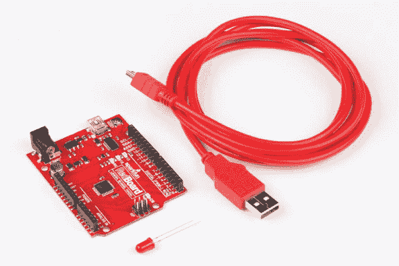

### 关于 Arduino

*Arduino*（发音为 är·də’wēn·ō 或 “arr-dween-oh!”）是一个小型可编程设备，能够为没有智能的物体添加智能功能。你可以使用 Arduino 来驱动机器人、创造 LED 艺术，甚至充当手持游戏机。在这一部分，我们将更详细地介绍 Arduino 是什么，以及它如何改变你对周围世界的看法。

#### 一个易于接入的硬件平台

Arduino 就像一台小型计算机。你可以使用非常简单的指令对其编程，并且只需少量 AA 电池就能为其供电。与普通计算机不同的是，Arduino 使用*微控制器*而不是 CPU 来处理信息并执行操作。这个小芯片充当了你项目的大脑，它可以接收传感器（如光传感器、温度传感器或按钮）的输入，并输出信号来控制 LED、马达、蜂鸣器等。像图 1-2 中的 Arduino 板就包含了使微控制器正常工作所需的所有支持组件和电路。

**图 1-2：** Arduino Uno 是一个开源、可编程的电子平台，适用于爱好者。

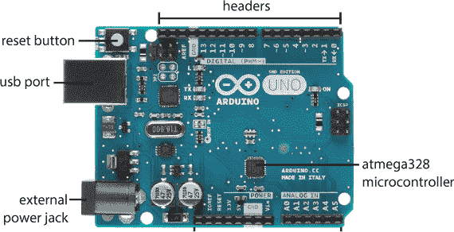

Arduino 使用的编程语言本质上是 C/C++ 的一种版本。编程环境是*Arduino IDE（集成开发环境）*。开发该环境的团队将许多预先编写的函数和库打包在一起，以简化与硬件接口的代码编写过程。例如，这些库将打开 LED 所需的多行代码简化为一条指令！

#### 关于 SparkFun RedBoard

有许多官方认证的 Arduino 品牌电路板，但由于该平台是*开源的*（意味着硬件设计和软件的源代码可以供任何人查看和修改），因此也有许多 Arduino 衍生板、克隆板和兼容板。所有的电路板设计都采用了创意共享署名相同方式许可协议，Arduino 的常见问题解答（* [`www.arduino.cc/en/Main/FAQ`](https://www.arduino.cc/en/Main/FAQ) *）中指出，任何人“都可以自由使用和修改这些设计以满足自己的需求，无需请求许可或支付费用。”衍生板与官方 Arduino 使用相同的编程环境，但硬件通常已经经过某些调整或修改。

如图 1-3 所示的 SparkFun RedBoard 是一个 Arduino 兼容衍生板。它基于 Arduino Uno 的设计，但具有更稳定的 USB 接口，并使用 USB 迷你连接器而不是 Type-A 连接器。除此之外，它与 Uno 完全相同，大小和形状一致。

**图 1-3：** Arduino 兼容的 SparkFun RedBoard。注意它的形状与图 1-2 中的 Arduino Uno 相匹配。

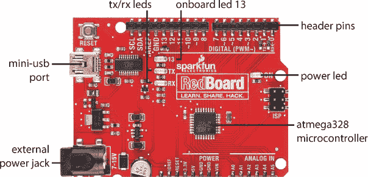

RedBoard 是 SparkFun 推荐的 Arduino 板，包含了一些你需要了解的关键组件，以帮助你顺利阅读本书的前几个章节。我们在图 1-3 中标出了每个术语。

**ATmega328 微控制器** 电路板中间的方形黑色芯片。它是 Arduino 的大脑。

**插针** 微控制器上的细小金属引脚，用于读取输入和发送输出。你可以通过 Arduino 两侧的四组黑色插针接触到这些引脚。它们已编号并标注了特定用途。你最常用到的引脚是标有*数字*（0-13）、*模拟输入*（A0-A5）和*电源*的引脚。

**迷你 USB 端口** 这是你向 Arduino 发送代码并与其通信的方式。对于本书中的大多数应用，你也可以通过 USB 端口为电路板供电。如果需要外部电源，我们会特别指出。

**电源 LED** 这个 LED 指示灯用来显示 Arduino 是否已经通电。如果电路板上出现短路或电源连接不良，这个指示灯将不会亮起。

**TX/RX LED** 当数据（如代码或数字）在你的 Arduino 和笔记本电脑之间传输时，这些 LED 会闪烁。

**板载 LED 13** 调试指示灯。如果你是第一次插入 Arduino，LED 13 应该每秒闪烁一次。它连接到 Arduino 的第 13 号引脚。

**外部电源插孔** 一个位于 USB 端口旁的圆柱插孔。Arduino 需要 5V 电源，尽管你可以安全地为 Arduino 提供 7V 到 15V 之间的电压而不会损坏电路板。Arduino 上的一个芯片将输入电压降低到 5V，以便电子元件和电路正常工作。

像所有兼容 Arduino 的板子一样，你将通过 Arduino IDE 来编程 RedBoard。

### 安装 Arduino IDE 和驱动程序

在第一次将 RedBoard 插入 USB 端口之前，你应该先安装 Arduino IDE。要安装 Arduino IDE，请访问*[`www.arduino.cc/download/`](http://www.arduino.cc/download/)*。选择适合你电脑操作系统的版本，点击链接进行下载（图 1-4）。你将被询问是否愿意做出贡献；Arduino IDE 的开发和维护依赖于使用该软件的社区的帮助和贡献。

**注意**

*如果你已经插入了你的板子，那也没问题——你可能只需要在安装完成后重启计算机，才能使驱动程序正常工作。*

**图 1-4：** 你可以使用在线 IDE，也可以下载适合你操作系统的最新版本。


即使你已经安装了 IDE，我们仍然建议下载并安装最新版本。Arduino IDE 正在持续更新和改进，最好使用最新发布的版本。本书中的示例使用的是 IDE 1.8.1 及更高版本。

**注意**

*如果你喜欢使用最新的软件版本，Arduino 下载页面还提供了夜间构建版，可以预览下一次发布的版本。不过，本书建议使用最新的稳定版。*

Arduino 官网还提供了一个名为 Arduino Create 的在线平台，其中包括一个基于网页的代码编辑器。它允许你通过网页浏览器编程设备，并与他人分享和查看项目。截至本书编写时，它仅支持 Windows 和 OS X。

无论你选择使用 Arduino Create 还是下载的 IDE，按照在线指南完成安装过程。

#### 在 Windows 上安装

如果你使用的是 Windows 电脑，我们建议下载 Arduino 的 Windows 安装包版本。下载此文件，打开它，并点击**运行**。这将弹出安装选项对话框（图 1-5）。

**图 1-5：** Arduino 安装选项对话框。确保选择了 USB 驱动程序！

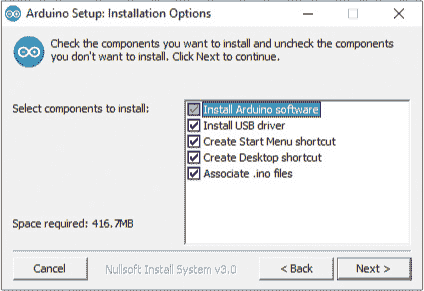

勾选**安装 Arduino 软件**选项以及其他选项，否则你将需要单独安装驱动程序。然后，告诉安装程序你希望将 Arduino 安装在哪个位置（我们建议接受默认目录），并点击**安装**。

一旦你开始安装过程，记得吃个零食或者喝杯咖啡，因为完成安装可能需要几分钟。根据你使用的 Windows 版本，你可能会再次被询问是否要安装驱动程序，以及是否信任 Arduino LLC，如图 1-6 所示。

**图 1-6：** 我们信任 Arduino！

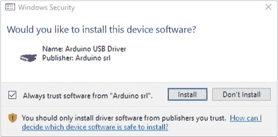

如果你不想再看到类似的提示，勾选“我信任 Arduino”的选项。无论如何，点击**安装**来安装 USB 驱动程序。就这样！Arduino 通常会在桌面上安装一个快捷方式。现在双击它以运行 Arduino IDE。

#### 在 OS X 上安装

如果你使用的是 Mac，请下载适用于 OS X 的 Arduino IDE 选项，并按照本节中的说明操作。

##### 安装 IDE

下载完成后，将光标悬停在*下载*文件夹上，并点击**在 Finder 中打开**，如图 1-7 所示。

**图 1-7：**下载后，程序将位于*下载*文件夹中。点击**在 Finder 中打开**将其移动到*应用程序*文件夹。

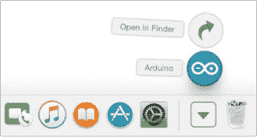

然后，只需点击并拖动*Arduino*程序文件到*应用程序*文件夹，如图 1-8 所示。在大多数情况下，你不需要安装其他任何东西，你应该可以像打开其他程序一样打开 Arduino IDE。

**图 1-8：**点击并将*Arduino*文件拖动到左侧的*应用程序*文件夹中。

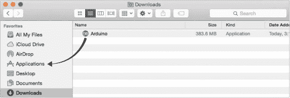

##### 在 OS X 上手动安装 FTDI 驱动程序

如果你使用的是标准的 Arduino Uno 板，驱动程序应该已经预装并且开箱即用。如果你使用的是 SparkFun RedBoard，则需要额外一步来手动安装驱动程序。SparkFun RedBoard 使用来自未来科技设备国际公司（FTDI）的 USB 芯片与计算机通信。你需要手动安装该芯片的 FTDI 驱动程序。首先，访问*[`www.sparkfun.com/ftdi/`](http://www.sparkfun.com/ftdi/)*。这将引导你查看我们关于安装 FTDI 驱动程序的教程（见图 1-9）。

点击 Mac OS X 的链接。这将引导你根据计算机上运行的 OS X 版本选择要安装的驱动程序选项。如果你使用的是 Mac OS X 10.3（Panther）到 10.8（Mountain Lion），有一个选项；如果你使用的是 Mac OS X 10.9（Mavericks）或更高版本，则有另一个选项。

**图 1-9：**SparkFun FTDI 安装指南


下载适当的驱动程序并双击它以启动安装过程。你应该会看到熟悉的 Mac 软件安装窗口。找到你的硬盘并点击**确定**。继续安装过程，当进度条填满（如图 1-10 所示）时，驱动程序应已安装完毕。

**图 1-10：**在 OS X 上安装 FTDI 驱动程序

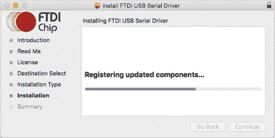

就这样！现在，双击你*应用程序*文件夹中的 Arduino 图标来运行 IDE。如果你在安装 FTDI 驱动程序之前已经打开过 IDE，你需要完全退出并关闭 Arduino IDE，然后重新启动它，才能正确显示串口。

**注意**

*如果在安装驱动程序后遇到错误，请查看解决方案：* [`www.sparkfun.com/macdriver/`](https://www.sparkfun.com/macdriver/) *。*

#### 在 Linux 上安装

Arduino 也可以供 Linux 用户使用。下载适合你系统的 Linux 文件，文件有 32 位和 64 位版本。然后，使用`xz-utils`或其他文件压缩工具解压该文件。如果你想在 Linux 上使用最新版本的 Arduino，可能还需要安装一些其他依赖程序。请访问*[`playground.arduino.cc/Learning/Linux/`](http://playground.arduino.cc/Learning/Linux/)*，查看与特定发行版相关的信息。

对于大多数 Linux 发行版（包括 Ubuntu、Debian 和 Fedora），你应该能够使用`apt-get`包管理器通过命令行安装 Arduino。打开终端并输入以下命令：

```
sudo apt-get install arduino
```

安装完成后，打开你刚刚安装的 Arduino 程序。Arduino 使用 Java 运行 IDE，必须在 XWindows 或类似的窗口用户界面环境中运行。

**注意**

*根据你的 Linux 发行版的包管理器，你通过这种方式安装的版本可能不是当前 Arduino 网站上托管的最新版本。*

### 简要介绍 IDE

IDE 是你编写 Arduino 指令并进行测试的地方。这些指令组成一个程序，或者在 Arduino 术语中称为*草图*。IDE 允许你将草图*上传*到 Arduino，并控制现实世界中的事物。

如果你还没有这样做，打开你新安装的 Arduino 程序。经过启动屏幕后，你应该会看到 IDE，它看起来像图 1-11 所示。

**图 1-11：** Arduino IDE

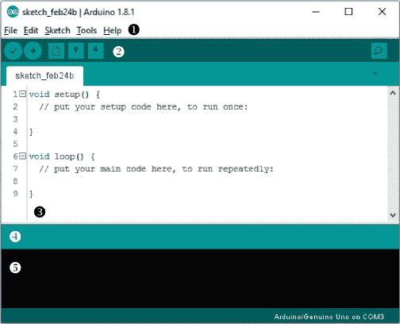

你可以使用菜单栏（包含文件、编辑、草图、工具和帮助菜单） ➊ 来打开或保存文件，上传代码到 Arduino，修改设置等。你还应该看到一组图形按钮 ➋。从左到右依次是验证/编译、上传、新建、打开和保存。我们将在本书中探讨这些菜单和按钮。IDE 的大部分区域是空白区域 ➌；这里是你编写代码的地方。代码区域下方是*警报栏* ➍，下面是控制台 ➎；这些区域用于报告状态、警报和错误。例如，如果你的草图中有拼写错误（称为*语法错误*），IDE 会在那里显示错误。如果你在代码窗口中键入你的名字并点击勾选按钮（验证/编译），Arduino IDE 会稍作思考，然后在警报栏中显示错误，突出显示你的名字，并在控制台中提供更多错误信息，如图 1-12 所示。

**图 1-12：** Arduino IDE 中的典型错误信息和输出

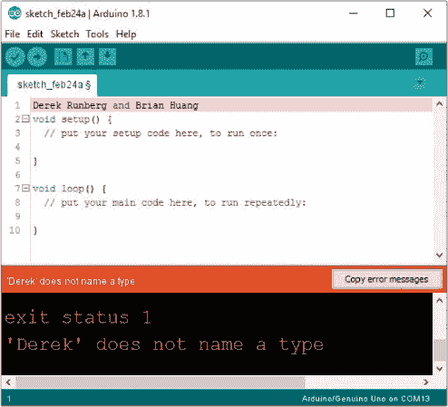

### 更改默认偏好设置

Arduino 是一个完全开放且可配置的编程环境。我们有一些小设置可以调整，以便更容易编写代码、调试和制作有趣的东西。选择 **文件 ▸ 首选项** 来查看和更改 Arduino IDE 的一般设置。你应该会看到一个类似于图 1-13 的窗口。

我们建议调整编辑器的字体大小，使其适合你阅读。我们还喜欢勾选 **显示行号**，并取消勾选 **验证或上传时保存**。行号会帮助你更容易地导航代码，取消自动保存功能则可以让你快速测试代码，而不必每次都保存。Arduino 是完全开放的，所以如果你愿意，你也可以点击 *preferences.txt* 文件，调整更多其他功能。

**图 1-13：** Arduino 设置窗口

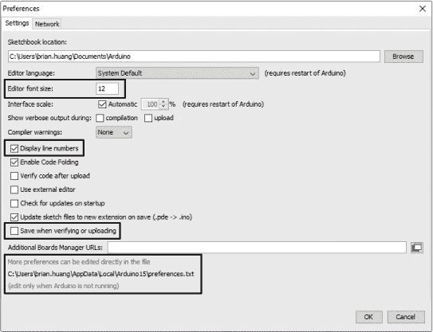

### 试用：第一次插入 Arduino

当你完全安装好 Arduino IDE 和驱动程序后，使用合适的电缆将 Arduino 板子连接到计算机的 USB 端口。电源 LED 应该会亮起，如果你的板子是全新的，你应该会看到一个标记为 13 的 LED 如图 1-14 所示闪烁。你的计算机通过 USB 电缆为 Arduino 板子供电，并运行出厂时已安装的代码。与计算机不同，Arduino 一次只能存储和运行一个 sketch。加载到 Arduino 上的标准测试 sketch 是一个简单的 LED 闪烁。当你的板子连接好后，你将设置 IDE 以便编写你自己的 sketch。

**注意**

*如果你在安装 IDE 和驱动程序之前插入了板子，可能需要重启计算机。*

**图 1-14：** 当你为新板子供电时，标记为 13 的 LED 会开始闪烁。

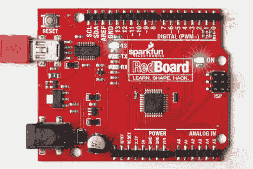

#### 在 IDE 中选择你的板子

根据你的计算机或操作系统，可能需要一些时间让计算机识别你刚插入的新硬件，并与已安装的驱动程序关联。在计算机识别新设备后，点击 **工具**，并将鼠标悬停在 **板子** 选项上，如图 1-15 所示。

**图 1-15：** 工具菜单中的板子选择列表

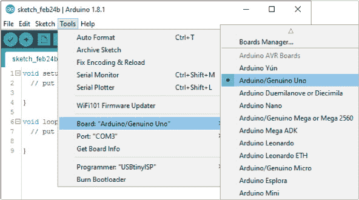

应该会出现一个预支持的 Arduino 板子列表。如果你使用的是标准的 Arduino Uno 或 SparkFun RedBoard，选择 **Arduino/Genuino Uno** 选项。如果以后使用的板子不同于 Uno 或 RedBoard，请根据板子的文档选择正确的 Arduino——本书假设你使用的是 Uno 或 Uno 衍生板。

#### 选择通信端口

每个连接到你计算机的设备都有一个独特的通信端口标识符。你需要配置 IDE，以便它知道你的 Arduino 连接到哪个端口。为此，首先选择 **工具 ▸ 端口**，查看设备的通信端口选项。根据你的操作系统，你会看到不同的选项。

##### 在 Windows 上

如果你使用的是 Windows PC，你可能会看到 COM3、COM4 或其他编号的 COM 端口，如图 1-16 所示。选择此选项。如果没有显示任何选项，请参阅页面 27 上的“基本 Arduino 故障排除”。

**图 1-16：** 在 Windows 上选择通信端口

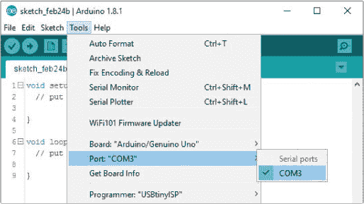

##### 在 OS X 和 Linux 上

在 Mac 或 Linux 机器上，通信端口应该列为 */dev/cu.usbserial-A<xxxx>*，其中的 *<xxxx>* 是一个独特的随机字符序列，特定于你的 Arduino。选择此选项。你可能会看到列出多个端口，如图 1-17 所示，但只有带有此唯一 ID 字符串的端口会映射到你的 Arduino。如果没有显示任何选项，请参阅页面 27 上的“基本 Arduino 故障排除”。

**图 1-17：** 在 OS X 上选择通信端口

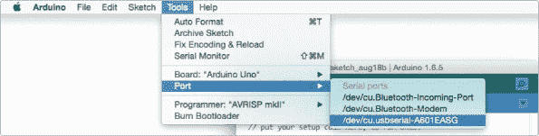

### 一个 Arduino 的“Hello, World！”

`Hello, world!` 是许多初学者编写的经典第一个程序。在大多数其他编程语言中，这个程序会在屏幕上显示 `Hello, world!`。由于 Arduino 没有屏幕，它的`Hello, world!`版本是一个闪烁的 LED。

对于你的第一个程序，我们将向你展示如何使用 Arduino IDE 自带的示例。将你的板子连接到计算机后，点击 **文件** 下拉菜单，选择 **示例 ▸ 01.基础 ▸ Blink**，如图 1-18 所示，打开名为 *Blink* 的程序。

应该会打开一个包含 Blink 程序的新 IDE 窗口。在这个窗口中，点击 **程序 ▸ 上传** 或点击 **上传** 图标。IDE 会将这段相对易于理解的代码转化为 Arduino 可以理解的 1 和 0（二进制代码），这叫做 *编译*，然后将程序上传到你的板子上。

**图 1-18：** 查找 Blink 程序

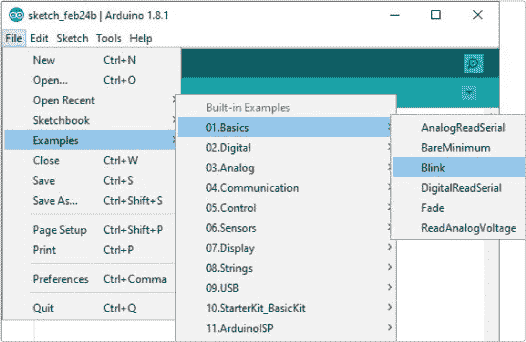

在点击上传后，注意观察警报区域的状态消息。它应该显示*正在编译草图…*并显示进度条。编译完成后，你的电脑将开始将草图上传到 Arduino。Arduino 板上的 RX（接收）和 TX（发送）指示灯应该快速闪烁，表示草图正在传输到 Arduino 板上。TX 灯闪烁是因为你正在向 Arduino 发送数据，RX 灯闪烁是因为 Arduino 在接收到草图后，会向你的电脑确认已接收。当上传过程完成时，IDE 上的状态区域应该显示*上传完成*，并且板上标有 13 的 LED 应该闪烁，正如图 1-19 所示。

**图 1-19：** 打开 LED 13


如果你收到任何错误消息，可能是你的 Arduino 没有与电脑通信。阅读下一节“基本的 Arduino 故障排除”以了解一些常见问题，并尝试重新上传草图。

### 基础的 Arduino 故障排除

像其他任何可编程电子设备一样，Arduino 有时也会出现问题。以下是一些编程 Arduino 时遇到问题的故障排除建议。

1. 确保你的 Arduino 已插入 USB 电缆，并且电缆完全插入电脑。电缆可能只部分插入了板上。你也可以尝试拔掉电缆再重新插上。

2. 始终确认在板菜单中选择的板是已插入电脑的板。我们的示例中将选择 *Arduino/Genuino Uno*。

3. 确认在工具 ▸ 端口菜单中选择了正确的通信端口；该端口旁边应该有一个勾选标记或圆点。如果你不确定哪个端口对应你的 Arduino，可以拔掉 USB 电缆，刷新通信端口列表，观察哪个端口消失。

4. 确保你没有在示例草图中错误地输入一些杂散字符。如果有多余的字符，代码将无法编译。

5. 在 Windows 上，检查你电脑的设备管理器。确保设备旁没有感叹号。如果有，你需要手动重新安装驱动程序。

6. 如果你仍然收到错误消息，重新安装你的板驱动程序。我们在 *[www.sparkfun.com/ftdi/](http://www.sparkfun.com/ftdi/)* 提供了更多的安装说明。

这六个小贴士是解决 Arduino 新手常见问题的方法，建议从这里开始。如果这些建议没有解决问题，请保持冷静，耐心等待，记住你不是第一个遇到问题的人。如果你完全卡住了，可以在官方 Arduino 论坛上寻找解决方案，地址是 *[`forum.arduino.cc/`](http://forum.arduino.cc/)*。

### Arduino 草图的结构

在这一节中，我们将引导你通过上传到 Arduino 中的 Blink 示例，这个示例在《Arduino "Hello, World!"》的第 25 页中出现。首先，清单 1-1 展示了完整的 Blink 示例，闪烁效果尽显其中。

**清单 1-1:** Blink 示例代码

```
➊ /*
    Blink
    Turns an LED on for one second, then off for one second,
      repeatedly.

    Most Arduinos have an onboard LED you can control. On the
      UNO, MEGA, and ZERO, it is attached to digital pin 13;
      on the MKR1000 it's on pin 6\. LED_BUILTIN is set to the
      correct LED pin independent of which board is used.

    If you want to know which pin the onboard LED is connected
      to on your Arduino model, check the Technical Specs of
      your board at https://www.arduino.cc/en/Main/Products

    This example code is in the public domain.

    modified 8 May 2014
    by Scott Fitzgerald

    modified 2 Sep 2016
    by Arturo Guadalupi

    modified 8 Sep 2016
    by Colby Newman
  */

  //the setup function runs once when you press reset or
  //power the board
➋ void setup() {
    //initialize digital pin LED_BUILTIN as an output
    pinMode(LED_BUILTIN, OUTPUT);
  }

  //the loop function runs over and over again forever
➌ void loop() {
      digitalWrite(LED_BUILTIN, HIGH); //turn the LED on
                                       //(voltage level is HIGH)
      delay(1000);                     //wait for a second
      digitalWrite(LED_BUILTIN, LOW);  //turn the LED off
                                       //(voltage level is LOW)
      delay(1000);                     //wait for a second
  }
```

在编写 Arduino 示例时，你需要非常注意使用的词汇、标点符号和大小写。这些元素是编程语言*语法*的一部分。为了使 IDE 能够正确编译你的示例，你必须使用它所识别的单词。这些单词被称为*关键字*，你会注意到它们会变成不同的颜色，比如橙色、青色或绿色。现在，让我们详细看看这个第一个示例中使用的一些特性。

#### 关键示例元素

在示例的顶部，你会声明一个新的*全局命名空间* ➊。这个命名空间描述了示例的功能，并且通常会包含其他信息，如变量初始化和库声明。几乎每个示例都会包括一个命名空间。这个示例的命名空间有注释，帮助人类读者理解示例的功能。在 Arduino IDE 中，注释是灰色的。每个注释要么以`//`开始，要么如果注释内容较长，则用`/*`和`*/`符号包围。注意，不是所有注释都出现在代码行之间；有些注释会出现在它们解释的代码同一行。这不会影响示例，因为 IDE 会忽略注释。与代码不同，你可以在注释中写任何你想写的内容，包括常规的单词、拼写或标点。

任何示例的框架都由两个主要的函数定义组成，`setup()` ➋和`loop()` ➌。*函数*仅仅是将多个指令或代码行组合在一起的一种方式。每个函数都有一个数据类型、一个名称和一组指令。函数前面的单词表示函数将返回的数据类型。`setup()`和`loop()`都有`void`类型，因为它们不会返回任何值。

每个函数的名称后面都包括一对圆括号。这对圆括号是你传递*参数*给函数的地方。参数是函数执行任务所需要的值。`setup()`和`loop()`不需要参数，但在后续的项目中，你将使用一些需要参数的函数。最后，构成函数的代码行由一个大括号`{`和一个闭合的大括号`}`包围。

`setup()`和`loop()`函数是每个 Arduino 示例所必需的；当 Arduino 首次启动或被重置时，`setup()`代码只会运行一次，而`loop()`代码则会不断地循环执行。这就像是在烤饼干：`setup()`中的指令准备好所有的工具和原料，而`loop()`则一次次地烘烤批次，直到你关掉烤箱（也就是 Arduino）。

现在，让我们来弄清楚`setup()`和`loop()`中的每一行代码究竟在做什么。

#### setup()函数

首先，让我们仔细看看 Blink 示例中的`setup()`函数；请参见清单 1-2。

**清单 1-2：** 我们的 Blink 示例中的`setup()`代码

```
void setup() {
  //initialize digital pin LED_BUILTIN as an output
  pinMode(LED_BUILTIN, OUTPUT);
}
```

`setup()`函数中的唯一一行代码是对`pinMode()`函数的调用。Arduino 上的引脚 0–13 被认为是*通用输入/输出(GPIO)引脚*。它们可以用作输入或输出，而`pinMode()`允许你告诉 Arduino 你打算如何使用数字引脚。你通过传递两个参数来实现这一点。第一个是引脚编号，范围从 0 到 13。第二个参数是引脚配置。

对于引脚的引用，Blink 示例使用了一个名为`LED_BUILTIN`的系统常量，来指定你正在使用设备上的默认 LED。在大多数 Arduino 设备上，这与引脚 13 相同。注意，值是全大写且为深青色。这种颜色表示`LED_BUILTIN`是一个具有预定义值的特殊关键字，用于 IDE 中。

第二个参数将引脚配置定义为`OUTPUT`。注意，关键字`OUTPUT`也是深青色的，因为它是 Arduino 中使用的另一个常量。这里还有一些其他选择，我们将在项目 4 和项目 9 中详细讨论，但现在请注意，Blink 将引脚设置为 LED 的`OUTPUT`。

如果你要将这一行代码描述为一句话，它的意思是：“告诉引脚 13 从 Arduino 输出。”

**注意**

*`pinMode()`* *函数遵循一种称为驼峰命名法的大小写约定。在驼峰命名法中，首字母小写，后续单词的首字母大写。*

`pinMode()`调用中的最后一个字符是分号（`;`），它标志着一行代码的结束。当你开始编写自己的代码时，始终以分号结束一行代码。如果你忘记了，也不用担心；几乎每个编程过的人都会忘记分号，所以 Arduino IDE 会显示一个有用的警告，帮助你找出哪里需要加上缺失的标点符号。

**main()函数在哪里？**

如果你对编程有所了解，或者熟悉 C 或 C++，你可能会想知道 Arduino 示例中`main()`函数在哪里。当你点击验证/编译或上传时，Arduino 实际上会在后台集成许多其他文件，包括一个名为*main.cpp*的文件。你可以在 Arduino 程序文件夹中找到所有有关操作的详细信息。记住，它是开源的！

这是来自*main.cpp*文件的一段代码：

```
  int main(void)
  {
    init();
    initVariant();
  #if defined(USBCON)
    USBDevice.attach();
  #endif
➊   setup();
    for (;;)
    {
➋   loop();
    if (serialEventRun) serialEventRun();
    }
    return 0;
  }
```

看看`setup()`函数在哪里被调用的➊？并注意`loop()`函数➋处于一个无限循环中；Arduino 通过一个空的`for(;;)`来实现这个永远循环。就是这样，它不断运行。

#### loop()函数

现在让我们再看看`loop()`函数，它按从上到下的顺序执行每一条指令，并且永远重复自己。请参见清单 1-3。

**清单 1-3：** Blink 示例的`loop()`代码

```
void loop() {
  digitalWrite(LED_BUILTIN, HIGH);  //turn the LED on
                                    //(voltage level is HIGH)
  delay(1000);                      //wait for a second
  digitalWrite(LED_BUILTIN, LOW);   //turn the LED off
                                    //(voltage level is LOW)
  delay(1000);                      //wait for a second
}
```

`digitalWrite()`函数允许你打开或关闭 Arduino 的引脚；这称为控制引脚的**状态**。这个函数也使用两个参数。第一个参数指示你想要控制的引脚；在这种情况下，我们再次使用系统常量`LED_BUILTIN`。第二个参数是你希望引脚处于的状态。要点亮 LED，Blink 示例传入`HIGH`。要熄灭 LED，则传入`LOW`。

第二条指令是`delay()`，它通过传入的毫秒数来延迟你的程序执行。Arduino Uno 以及像 SparkFun RedBoard 这样的衍生板每秒钟能执行 1600 万个指令；这真是非常快！实际上，它非常快，以至于没有延迟，你根本不会注意到 LED 的变化。延迟使我们能够控制 LED 点亮的持续时间。在这个示例中，`delay(1000)`指示 Arduino 在执行下一条命令之前延迟 1000 毫秒。

接下来的两行代码与前两行类似；它们只是指示 Arduino 关闭 LED，并延迟另外 1000 毫秒。在最后一行之后，`loop()`函数会从顶部开始重复，并重新点亮 LED。

**黑客（你好）世界**

学习示例代码的最佳方法之一是修改它的行为。试着将延迟时间减少到`500`。点击**上传**。闪烁的变化是什么？如果你传入数字`5`呢？这是一个 5 毫秒的闪烁！你能看得清楚吗？你能看到的最快闪烁频率是多少？

#### 你的第一个硬件

当板子上的 LED 正常工作并闪烁时，下一步是添加你第一个硬件：一个外部 LED。正如我们之前提到的，Arduino 的引脚用于连接输入和输出到微控制器，我们可以通过 LED 来简单地展示这一点。拿一个 LED 仔细看看，它的样子大致如图 1-20 所示。

你会注意到 LED 有一个短脚和一个长脚。如果你仔细观察，你还会看到 LED 灯泡的边缘有一个平面，且平面位于短脚的同一侧。这些帮助你识别**极性**；LED 的长脚是正极，位于平面一侧的短脚是负极或地线脚。

**图 1-20：** 显示长脚和短脚的 LED


记住，`LED_BUILTIN`指的是 Arduino 上的引脚 13。所以，将 LED 连接到 Arduino 就像是将 LED 的长脚插入引脚 13，将短脚插入紧邻引脚 13 的 GND（地线）引脚一样简单。现在插入 LED，确保板子已通电。如果你正确插入，如图 1-21 所示，LED 会开始闪烁。如果 LED 没有闪烁，可能是你插反了。别担心：拔出来并反过来插。

**图 1-21：** 将 LED 添加到引脚 13 的快速简便方式

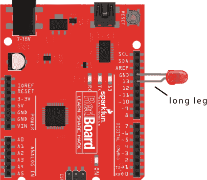

### 进一步探索

本书中的每个项目都会有一个“进一步探索”部分，介绍如何将你在该项目中学到的概念提升到更高的层次。这些部分会包括关于如何使用现有项目、修改代码以及物理修改项目的建议。

#### 破解

对于这个项目，我们建议你尝试创建一些有趣的闪烁模式。首先，复制并粘贴 `loop()` 函数中的四行代码，让它重复执行，这样你就得到了八行代码。这将产生两个闪烁序列，并且提供更多的代码可以使用。你可以通过修改延迟时间来创建模式，从而控制 LED 的点亮时机。例如，我们制作了一个看起来像心跳的模式；我们修改过的 Blink 草图见 列表 1-4。

**列表 1-4：** 心跳模式的示例代码

```
void setup() {
  pinMode(LED_BUILTIN, OUTPUT);
}

void loop() {
  digitalWrite(LED_BUILTIN, HIGH);
  delay(200);
  digitalWrite(LED_BUILTIN, LOW);
  delay(200);
  digitalWrite(LED_BUILTIN, HIGH);
  delay(200);
  digitalWrite(LED_BUILTIN, LOW);
  delay(800);
}
```

对于一个真正的挑战，试着编程让你的 Arduino 用摩尔斯电码闪烁出你的名字，使用一系列短点（点）和长线（划）的闪烁。图 1-22 展示了一个摩尔斯电码备忘单，帮助你理解闪烁模式。大多数人开始时使用的经典信息是 S-O-S，或者 . . . - - - . . . （点点点，划划划，点点点）。

**图 1-22：** 基本摩尔斯电码图表

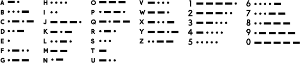

#### 修改

闪烁的灯光是一件强大的事情！拥有了这个新发现的超级能力，你可以在家里的很多物品上加上 LED 灯。万圣节服装总是一个放入闪烁灯饰的好地方。你可以将 LED 的引脚焊接到一些导线上，延长连接线，这样就能轻松地将 Arduino 隐藏在佩戴者更舒适的地方（比如口袋里）。我们拿了一个从本地超市买来的万圣节蜘蛛，并给它加上了一些会闪烁的红色眼睛（见 图 1-23）。

另一个适合闪烁和控制 LED 的场景是比例模型。为汽车头灯、建筑物或街灯等添加可工作 LED 总是一个很好的方式，可以在任何比例模型或场景中创造出现实的假象，如 图 1-24 所示。

**图 1-23：** 一个闪烁的可怕蜘蛛


**图 1-24：** 一个带有 Arduino 控制灯光的模型


### 保存草图

每个项目在加入一些闪烁的 LED 后都会显得更加时尚，因此我们建议你随时保留你修改过的 Blink 草图，以便在未来的项目中重复使用其中的部分代码。保存你的草图，并确保给它起一个描述性的名字，以便提醒你它是什么。你的文件名不应包含空格；如果包含空格，Arduino 会用下划线（_）替换空格。默认情况下，当你保存草图时，Arduino 会将其保存在 Arduino 草图文件夹中，该文件夹通常位于你计算机的 *Documents* 文件夹内。你可以选择将它们保存在其他地方，但通常把所有草图保存在一个地方是个好主意。

当你准备好提升你的眨眼技能时，前往项目 2，我们将在那里教你如何构建一个由 Arduino 驱动的红绿灯。
