## 第三章：2 A 你家的红绿灯

在你通过嵌入式电子学迈出的第一大步中，你设置了 Arduino IDE 并让 LED 闪烁。这是一个巨大的进步，但有了 Arduino，任何项目都不必止步于一个 LED。本项目将展示如何扩展你的第一个 LED 草图，使三个 LED 显示闪烁模式。你的任务，如果你选择接受的话，是为你家一个繁忙的走廊制作并编程一个红绿灯（见图 2-1）。

**图 2-1：** 完成的红绿灯项目

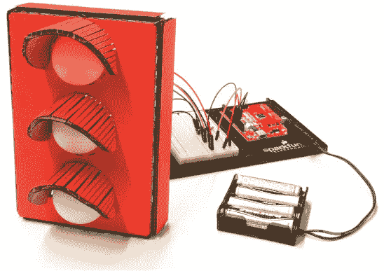

### 所需材料

本项目中的材料都很简单。所有电子零件都在 SparkFun Inventor’s Kit 标准套件中，除了带星号（*）标记的部分。如果你使用的是自己的工具包或自行拼凑零件，请参见以下零件清单。图 2-2 展示了本项目中使用的所有零件。

#### 电子零件

• 一块 SparkFun RedBoard（DEV-13975），Arduino Uno（DEV-11021），或任何其他兼容 Arduino 的电路板

• 一根 USB Mini-B 电缆（CAB-11301 或你电路板的 USB 电缆；未显示）

• 一块无焊面包板（PRT-12002）

• 一只红色 LED、一只黄色 LED 和一只绿色 LED（COM-12062）

• 三个 330 Ω电阻（COM-08377，或一包 20 个的 COM-11507）

• 公对公跳线（PRT-11026）

• 公对母跳线（PRT-09140*）

• （可选）一个 4 节 AA 电池盒（PRT-09835*；未显示）

**图 2-2：** 红绿灯组件

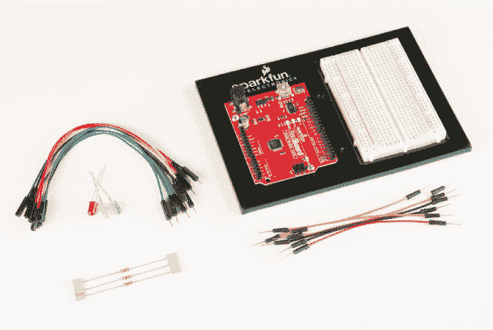

#### 其他材料和工具

如果你想要构建像图 2-1 中那样的外壳，或按照第 64 页“进一步学习”中的建议进行操作，你还需要以下材料，这些材料展示在图 2-3 和图 2-4 中：

• 铅笔

• 工艺刀

• 金属尺

• 钳子

• 剥线钳

• 胶水（热熔胶枪或工艺胶水）

• （可选）钻机和 3/16 英寸的钻头

• （可选）电烙铁

• （可选）焊锡

• （可选）辅助工具（未显示）

• 纸板（大约 12 英寸见方）或纸盒

• 两个乒乓球

• 外壳模板（参见图 2-15，第 55 页）

**注意**

*好的干净的纸板在这些项目中将是非常宝贵的。我们建议从手工艺或美术用品商店购买纸板。*

**图 2-3：** 推荐工具

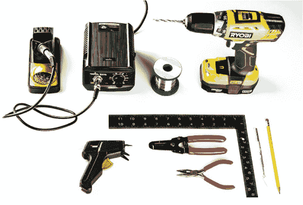

**图 2-4：** 推荐的建筑材料

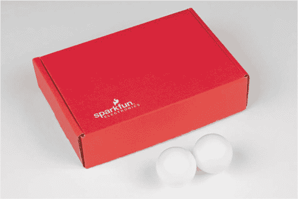

### 新组件：电阻

尽管在项目 1 中你单独使用了 LED，但在大多数情况下，最好使用*电阻*来保护 LED 免受过多电流的损害。像图 2-5 中所示的电阻是非常常见的。它们在构建电路时是必不可少的，你在完成本项目时也需要用到它们。

**图 2-5：** 近距离看电阻

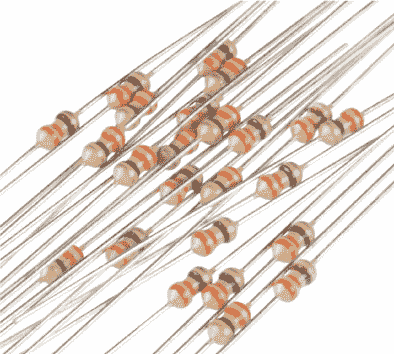

如果你将电流比作水流通过管道，那么电阻器就像是管道变窄的地方，减少了水流的流量。（如果你感兴趣，可以参考 “将电流比作管道中的水流” 第 4 页，这里详细描述了这个比喻。）电阻器用于控制或限制电流的流动。

电阻以*欧姆*为单位（通常缩写为 Ω，希腊字母欧米伽），电阻器上的彩色带表示其电阻值。你可以在 “电阻器与带” 第 308 页找到电阻器色带解码器；然而，在本书中，你只需要识别两种不同的电阻器值：330 Ω 和 10 kΩ。330 Ω 电阻器的色带为橙色、橙色和棕色（见 图 2-5），而 10 kΩ 电阻器的色带则为棕色、黑色和橙色。电阻器上还有第四个带，其颜色表示电阻器的*公差*。电阻器的值将在一定公差范围内准确：银色表示电阻器有 5% 的公差，而金色则表示 10% 的公差。然而，本书中的项目对公差的要求不高，因此我们将仅按其假定值来使用这些电阻器，这对于任何公差带都适用。

一些元件，如 LED，如果流向它们的电流过高，可能会受到损坏，电阻器可以通过减少电流来保护这些元件。在 LED 上使用电阻器将电流限制在安全范围内，是一种很好的预防措施，避免 LED 灯泡烧坏——或者在最坏的情况下，烧爆！（是的，它们真的会爆炸。）从现在开始，我们将在所有项目中使用限流电阻器。

**为什么红绿灯使用 330 Ω 电阻器**

一般红色 LED 的最大电流额定值大约为 20 mA，如其数据表所列。为了保护 LED，你需要添加一个电阻器，以确保电流不超过这一限制。那么，如何知道要使用 330 Ω 电阻器呢？

Arduino 上的输出引脚在开启时提供 5 V。根据颜色，每个 LED 需要的电压略有不同，通常在 2.0 到 3.5 V 之间。红色 LED 大约在 2 V 时点亮，剩下 3 V 的电压将通过电阻器或电路中的其他元件被消耗。通常的好做法是将通过 LED 的电流限制在最大电流的一半左右，因此对于最大电流额定值为 20 mA 的红色 LED，你会得到 10 mA 的电流。你可以利用*欧姆定律*（记得 10 mA = 0.01 A）来计算所需的电阻器：


但是，300 Ω 并不是一个标准的电阻值。最接近的标准电阻值是 330 Ω，通常最接近的标准电阻已经足够使用。这应该能确保 LED 使用很长时间。由于电阻器将决定电流，因此这是一个*限流电阻器*。

如果你有不同的电阻器可用，可以尝试使用不同阻值的电阻，看看会发生什么。较大的电阻器会使电流减小，而较小的电阻器会使电流增大。如果你使用 10 kΩ 电阻器，会发生什么呢？

### 构建交通灯原型

现在是时候构建电路了。首先，查看 图 2-6 中显示的原理图。你将在面包板上构建此电路，如 图 2-7 所示。

**图 2-6：** 交通灯项目的原理图

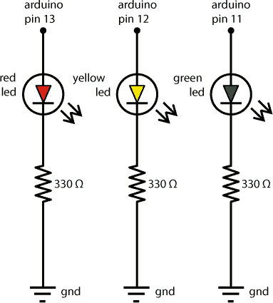

原理图展示了每个组件如何在电路中连接。Arduino 的引脚 13、引脚 12 和引脚 11 将分别用于控制交通灯电路中的每个 LED。正如原理图所示，每个 LED 都连接到一个独立的电阻器，而每个电阻器又连接到 GND（地）。接下来，让我们来看一下布线。

**图 2-7：** 将红色 LED 和限流电阻连接到面包板

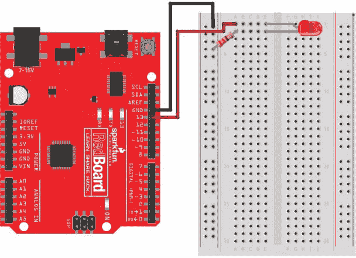

#### 将红色 LED 连接到面包板

现在你将开始把原理图转换为实际的电路。在第一个项目中，你闪烁了一个内置于 Arduino 板上的 LED。这个 LED 是通过 Arduino 的引脚 13 内部接线的。由于你将使用三个独立的 LED，你需要自己将它们接线。取出你的面包板，并按照 图 2-6 中的原理图或 图 2-7 中的示意图，将引脚 13 连接到 LED 的正极（较长的腿）。

**注意**

*如需复习面包板的工作原理，请参见第 6 页的“电路原型制作”章节。*

要在面包板上连接这些，我们建议你首先按照 图 2-7 中所示的位置放置 Arduino 和面包板。（这将在本书中作为标准布局。）然后，找到一个红色 LED 和一个 330 Ω 电阻器。按 图 2-8 中所示弯曲电阻器的腿，这样电阻器就更容易插入面包板。我们建议使用剪线钳将电阻器的两条腿各修剪约一半长度，以便更方便操作。电阻器不像 LED 那样有极性，因此你不必记住哪一条腿是正极或负极。

**图 2-8：** 弯曲电阻器

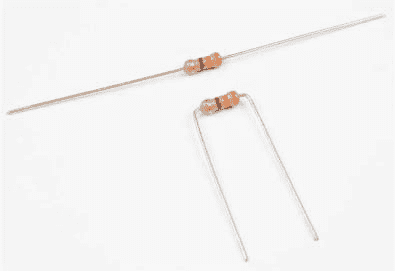

图 2-9 展示了典型面包板的示意图。大多数面包板都有标记的列和编号的行作为参考。利用这些参考点，将 LED 按照图 2-7 所示插入面包板。长的正极腿（阳极）应插入面包板的 E 列第 1 行（E1），而短的负极腿（阴极）应插入面包板的 E 列第 2 行（E2）。现在，找到一个 330 Ω（橙色-橙色-棕色）电阻器。将电阻器的一条腿插入面包板第 2 行的任意孔中，以将电阻器连接到 LED 的短腿。在我们的示意图中，我们将电阻器的这一腿插入面包板上的 A2 孔。在所有标准面包板上，每行的 A–E 列是相连的，F–J 列也是相连的。现在，将电阻器的另一条腿插入面包板的*负电源轨*，即标有蓝色或黑色线条和负号（–）符号的列。

**图 2-9：** 面包板具有编号的行和标有字母的列。

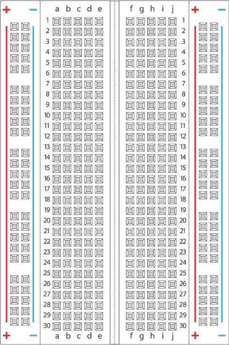

#### 为面包板供电

拿两根公对公的跳线。我们建议使用黑色表示接地（GND），红色表示电源，这也是本书中采用的标准。

将 Arduino 上的 GND 引脚的黑线连接到面包板上的负电源轨。Arduino 上有三个标有 GND 的引脚，您可以使用其中任何一个。每个 LED 的电源实际上来自数字引脚。由于引脚 13 将为红色 LED 供电，因此将一根线从 Arduino 的 13 号引脚连接到面包板上的 A1。

使用 USB 线将 Arduino 板连接到计算机，并且项目 1 中的“Hello, world!”示例程序应该会运行，从而使您的 LED 开始闪烁。实际上，面包板上的 LED 和 Arduino 上的 LED 都会闪烁，因为它们都连接到 13 号引脚。

如果面包板上的 LED 没有闪烁，而 Arduino 上的 LED 闪烁，请仔细检查您的接线和 LED 的方向。确保短腿插入面包板的第二行，连接到电阻器，并且电阻器通过负电源轨连接到 GND。在红色 LED 闪烁后，请断开 Arduino 与计算机的连接，以便您可以安全地完成电路的其余部分。搭建电路时，最好断开电路板的连接。

#### 添加黄色和绿色 LED

现在，将黄色 LED 连接到 Arduino 的 12 号引脚，将绿色 LED 连接到 11 号引脚；您可以按照为红色 LED 所做的相同基本步骤操作，但为每个新 LED 使用不同的行对，就像在图 2-10 中的最终接线图所示。

**图 2-10：** 使用 11、12 和 13 号引脚的最终交通信号灯电路

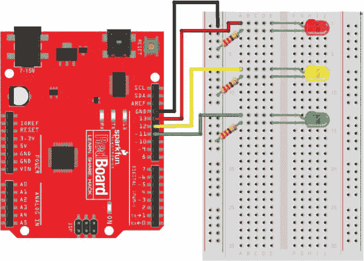

每个 LED 都应该有自己的电阻器连接到地轨，就像图 2-6 中的原理图一样。还要注意，我们给每个 LED 在面包板上留了一些空间，以便有足够的地方插入线缆而不会弄乱电路的其他部分。虽然我们建议了一种特定的接线方式，但请记住，您可以使用面包板的任何部分——只要您要连接的两根线在同一行。一旦完成，您的电路应该类似于图 2-11。

**图 2-11：** 完成的交通信号灯电路，包括 Arduino、LED 和电阻器

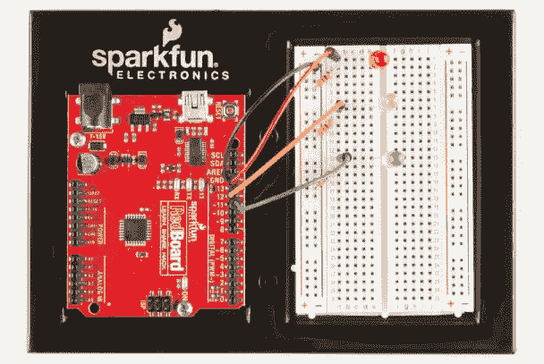

为了模拟一个真实的交通信号灯，该项目需要一种方式来依次点亮每个灯，并在一段时间后切换到下一个。幸运的是，Arduino 草图可以使用各种指令，包括定时命令，来控制电路。

### 编程交通信号灯

现在，将您的 Arduino 重新连接到计算机。是时候开始编程了！打开 Arduino IDE，开始一个新的草图。

#### 确认您的 IDE 设置

在编写任何草图时，您应该始终从一些基础工作开始。首先，检查板类型和端口是否正确设置。现在点击**工具 ▸ 板**。如果您使用的是 SparkFun RedBoard 或标准的 Arduino Uno，选择**Arduino/Genuino Uno**。然后，点击**工具 ▸ 端口**。在 Windows 上，您的 Arduino 应该设置为最高编号的 COM 端口。在 OS X 或 Linux 上，端口应该列出为*/dev/cu.usbserial-A<xxxx>*，其中*<xxxx>*是一个独特的随机字符字符串。

#### 为引脚编号创建占位符

在确认了 IDE 设置后，您准备好创建草图了。如在“Arduino 草图的结构”第 27 页中讨论的那样，一个基本的 Arduino 草图由两个部分组成：`setup()`函数和`loop()`函数。这个简化的描述适用于大多数简单的草图，但更复杂的草图有许多不同的部分。停止灯草图使用的一个新部分是*全局命名空间*，这是草图中位于`setup()`函数上方并完全在任何函数之外的部分。在这个区域，您可以将某些名称（*变量*）定义为值的占位符，并且这些值将在草图的所有部分中使用。Arduino 草图可以处理几种类型的值。

##### 草图能够理解的数据

Arduino 语言包含多种可能的*数据类型*，在编写草图时，您会经常遇到其中的一些。以下列表并不详尽，但涵盖了主要的类型，并展示了它们在代码中出现的方式：

**整数（**int**）** 一个范围从-32,768 到 32,767 的整数

**浮点数（**float**）** 一个带小数点的数字，范围从-3.4028235E+38 到 3.4028235E+38

**字节（**byte**）** 一个范围从 0 到 255 的数字

**字符（**char**）** 一个单一的字母，用一对单引号括起来，例如`‘a’`

**字符串（**String**）** 一系列字符，用一对双引号括起来，例如`"hello"`

**布尔值（**Boolean**）** 一个值，可以是`true`或`false`，在程序中映射为`1`或`0`，在引脚输出方面则为`HIGH`或`LOW`

Arduino 程序要求在定义变量时指定其数据类型。我们来看看这是如何工作的。

##### 可变值

你在编写程序时大部分创建的值将是变量。可以把变量看作是数据的占位符。这个数据可以是一个数字，一个字母，甚至是一个完整的句子。

在使用变量之前，你必须*定义*它，这包括给它命名、声明它的数据类型，并给它一个初始值。养成在定义变量时同时赋值的习惯，看起来大概是这样：

```
➊int ➋val = ➌10;
```

这个变量定义有三个部分：数据类型 ➊、变量名 ➋ 和变量的值 ➌。注意，在这一行的末尾有一个分号——它表示语句或指令的结束。分号非常重要，忘记加它常常是导致许多编译错误或代码中的 bug 的根本原因，因此要小心记住它！

在选择变量名时，你可以使用任何未被打断的字符集，包括字母和数字。这里有一个注意事项：变量不能以数字开头，也不能包含任何特殊字符。我们建议尽可能地使变量名具有描述性，同时保持简洁。这是一个发挥创意的机会，你可以用缩写词和描述来简化变量名。在这个例子中，我们选择将变量命名为`val`（即*value*的缩写），而`10`是变量的*初始化值*，即给变量赋予的初始值。你在定义变量时不一定要初始化它，但同时进行定义和初始化是一个好习惯，也有助于代码的清晰性。

在这个项目中，你将创建三个变量，用来存储 Arduino 控制的三个 LED 的引脚编号。用一个描述 LED 颜色的变量要比记住哪个 LED 连接到哪个引脚要容易得多！

启动一个新的程序，并将清单 2-1 中的代码添加到你程序的全局命名空间中。

**清单 2-1：** 表示引脚编号的变量

```
byte redPin = 13;
byte ylwPin = 12;
byte grnPin = 11;
```

再次说明，这三个变量存储三个 LED 的引脚编号。在 Arduino 上，引脚编号限制为 0 到 13 之间的整数，因此我们使用`byte`数据类型。我们可以使用`byte`，因为我们知道引脚编号不会超过 255。请注意，每个变量的名称都描述了它包含的内容：`redPin`是红色 LED 的引脚，`ylwPin`是黄色 LED 的引脚，`grnPin`是绿色 LED 的引脚。而且正如图 2-10 所示，红色引脚是 13 号引脚，黄色是 12 号引脚，绿色是 11 号引脚。现在，每当你在草图中使用引脚编号时，可以使用描述性的变量名代替。

**注意**

*为了易读性，我们* 使用驼峰命名法 *为变量命名，* *将`p`* *大写，* *这就是*`pin`*的命名方式。* *驼峰命名法是一种编码约定，它允许你在变量中使用大写字母分隔单词，而无需使用空格。*

#### 编写 setup()函数

要继续编写停车信号灯草图，请在清单 2-2 中添加`setup()`函数。

**清单 2-2：** 停车信号灯的`setup()`代码

```
void setup()
{
  //red LED
  pinMode(redPin➊, OUTPUT➋);
  //yellow LED
  pinMode(ylwPin, OUTPUT);
  //green LED
  pinMode(grnPin, OUTPUT);
}
```

就像在项目 1 中的“Hello, world!”草图一样（见第 30 页中的“setup()函数”），本草图在`setup()`中使用`pinMode()`函数来配置 Arduino 的数字引脚。

本项目使用了三个不同的数字引脚，因此草图中有三个单独的`pinMode()`函数。每个函数调用包括一个引脚编号作为其变量➊（`redPin`、`ylwPin`和`grnPin`）和常量`OUTPUT`➋。使用`OUTPUT`是因为本草图控制的是 LED，这些是输出设备。我们将在项目 4 中介绍`INPUT`设备。

#### 编写 loop()函数

接下来是`loop()`函数。普通的停车信号灯会从红色转到绿色再转到黄色，然后再回到红色，所以本项目也做到了这一点。将清单 2-3 中的代码复制到草图的`loop()`部分。

**清单 2-3：** 停车信号灯的`loop()`代码

```
void loop()
{
  //red on
  digitalWrite(redPin, HIGH);
  digitalWrite(ylwPin, LOW);
  digitalWrite(grnPin, LOW);
  delay(2000);

  //green on
  digitalWrite(redPin, LOW);
  digitalWrite(ylwPin, LOW);
  digitalWrite(grnPin, HIGH);
  delay(1500);

  //yellow on
  digitalWrite(redPin, LOW);
  digitalWrite(ylwPin, HIGH);
  digitalWrite(grnPin, LOW);
  delay(500);
}
```

停车信号灯一次只有一个灯亮，以避免混乱的走廊交通并防止造成混乱。为了保持秩序，每次点亮一个 LED 时，其他 LED 应该熄灭。例如，如果你想让红灯亮起，你会调用`digitalWrite(redPin, HIGH)`，接着调用`digitalWrite(ylwPin, LOW)`和`digitalWrite(grnPin, LOW)`。第一次调用会写入`HIGH`，使红色 LED 在`redPin`（第 13 号引脚）上点亮，另外两次调用会写入`LOW`，使`ylwPin`和`grnPin`（第 12 号和第 11 号引脚）上的黄色和绿色 LED 熄灭。由于 Arduino 运行在 16 MHz（大约每秒执行 1600 万次指令），这些命令之间的时间只有几微秒。因此，可以认为这三条命令几乎是同时执行的。最后，请注意`delay(2000)`函数。此函数会暂停草图，并保持红灯亮起 2,000 毫秒（即 2 秒），然后再执行下一组指令。

黄色和绿色 LED 的代码重复了相同的概念，将相应的引脚设置为`HIGH`，其余引脚设置为`LOW`，并延迟不同的时间。对于你自己的红绿灯项目，试着调整延迟时间，使其更符合你走廊的交通情况。记住，你传递给`delay()`函数的值是 LED 保持亮起的时间，单位是毫秒。

#### 上传草图

在你输入完所有代码后，仔细检查它是否与清单 2-4 中的代码一致，保存你的草图，然后点击**草图 ▸ 上传**或按 CTRL-U 将其上传到你的 Arduino。如果 IDE 给出了任何错误，请仔细检查你的代码，确保它与示例代码完全一致。你的指令应当保持相同的拼写、大小写和标点符号，并且不要忘记在每条指令的末尾加上分号。

当一切正常时，你的 LED 灯应当按照类似真实红绿灯的方式循环开关——首先是红灯，接着是绿灯，然后是短暂的黄灯，最后返回到`loop()`函数的顶部，再次变为红灯。只要 Arduino 持续供电，你的程序将不断以这种方式运行。

**清单 2-4：** 红绿灯的完整代码

```
byte redPin = 13;
byte ylwPin = 12;
byte grnPin = 11;

void setup()
{
  pinMode(redPin, OUTPUT);
  pinMode(ylwPin, OUTPUT);
  pinMode(grnPin, OUTPUT);
}
void loop()
{
  //red on
  digitalWrite(redPin, HIGH);
  digitalWrite(ylwPin, LOW);
  digitalWrite(grnPin, LOW);
  delay(2000);

  //green on
  digitalWrite(redPin, LOW);
  digitalWrite(ylwPin, LOW);
  digitalWrite(grnPin, HIGH);
  delay(1500);

  //yellow on
  digitalWrite(redPin, LOW);
  digitalWrite(ylwPin, HIGH);
  digitalWrite(grnPin, LOW);
  delay(500);
}
```

#### 让红绿灯变得便捷

当你的 Arduino 连接到电脑时，它是通过 USB 端口接收电源的。但如果你想移动项目或者展示它呢？你需要添加一个便携式电源——也就是电池包。Arduino 板有一个桶形插孔电源端口，可以插入电池包，并且配有一个板载电压调节器，能够接受大约 6V 到 18V 的电压。市场上有很多不同的电池适配器，但我们喜欢使用 4 节 AA 电池适配器，因为它非常适合我们的很多项目，如图 2-12 所示。

**图 2-12：** 配有桶形插孔适配器的 4 节 AA 电池包

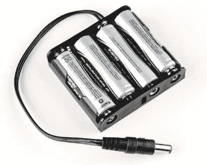

拔掉 USB 线，将四节 AA 电池放入电池包中，然后将便携式电池包插入 Arduino，如图 2-13 所示。如果你的电池已充电，你就可以随意移动项目，或将它嵌入到一个模型红绿灯中！

**图 2-13：** 通过添加电池包使红绿灯变得便捷

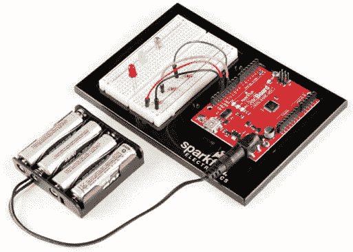

现在你将提升这个项目。在接下来的部分中，我们将向你展示如何将这些 LED 变成一个可以安装在你家高流量区域的模型红绿灯。

### 制作红绿灯外壳

一旦你的 Arduino 不再依赖计算机，你就可以将任何电子项目制作成更为永久的外壳。面包板上的电路很好，但你可能需要发挥想象力才能将它想象成一个红绿灯。为了达到最佳效果，红绿灯只需要一个好的外壳和能让灯光从远处可见的镜片。如果你仅仅是想进行原型制作，外壳是可选的，但我们希望你尝试一下。

在这个项目中，我们将教你如何使用纸板或卡纸制作一个更逼真的红绿灯模型，但你也可以使用任何手头有的材料。发挥创造力！我们的示例，如图 2-14 所示，是由一些纸板、乒乓球和一点手工技巧制成的。

**图 2-14：** 用纸板和乒乓球制作的外壳

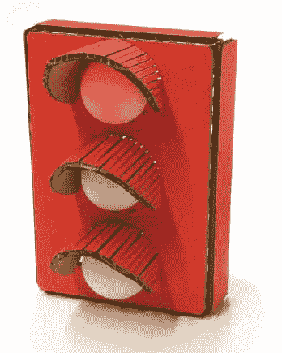

你可以单独根据这个项目的灵感制作一个红绿灯，或者如果你想完全复制这个项目，就下载[`www.nostarch.com/arduinoinventor/`](https://www.nostarch.com/arduinoinventor/)上的 ZIP 文件，包括模板和草图。书中的每个项目都附有可以打印、描绘和用工艺刀与金属尺手工切割的模板。

**注意**

*如果你有幸可以使用像 Cricut、Silhouette Cameo 或激光切割机这样的切割机器，这些文件也应该能轻松适用于这些工具。*

从 ZIP 文件中提取项目 2 文件，如果你需要切割指南，可以将红绿灯模板 PDF 按实际大小打印出来。拿到模板后，收集页面 39 中“其他材料和工具”里列出的其他物品，开始制作。

#### 纸板制作

首先，剪下模板，如图 2-15 所示。在我们的模板中，外壳主体是一个单一的纸板片，设计为切割、压痕并折叠。

将模板描绘到纸板上，并仔细注意虚线的位置，可以用不同的颜色在纸板上标出虚线。你将沿着这些线进行压痕，所以千万不要沿着这些线切割。

**图 2-15：** 红绿灯外壳模板（非实际大小）

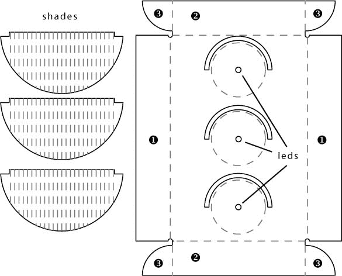

一旦你完成了所有的描绘，沿着实线使用工艺刀和金属尺剪下红绿灯的各个部分，如图 2-16 所示。如果你从未使用过工艺刀，请务必阅读页面 56 中的“安全使用工艺刀”一节。在纸板上为外壳沿每条虚线进行压痕，压痕应在纸板的外侧进行。压痕时，用工艺刀进行几次浅切（不要完全切透）。暂时不要压痕遮光罩部分。

**图 2-16：** 用工艺刀和金属尺沿模板划线


**安全使用工艺刀**

你将在本书中经常使用工艺刀，因此了解如何安全使用它们非常重要。就像任何工具一样，使用不当时，像这种工艺刀也可能导致受伤。

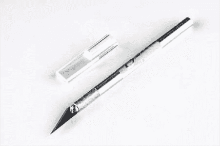

以下是使用工艺刀的安全小贴士：

• 切割板材时，始终拉动刀片。向其他方向推或强行操作刀片会增加刀片滑脱或断裂的风险。

• 耐心点。不要试图在一次切割中穿透整个材料的厚度。用适中的压力进行多次切割。这不仅能保护刀片，还能最终产生更干净的成品。

• 使用金属材质的直尺作为直线工具。例如金属尺。如果使用木制或塑料尺，刀片有更大的机会卡住直尺，反弹并最终朝着你的手移去。

• 保持手指远离刀片。这看起来显而易见，但意外时常发生。

• 如果你的刀开始从桌面上滚落，任其掉落，然后从地板上捡起来。如果你在刀掉落前伸手去接，可能会刺伤自己的手。哎呀！

• 最后，使用锋利、新的和完好的刀片。如果刀片断裂，请更换它。如果刀片钝了，也需要更换。切割纸张和纸板会迅速使刀片变钝。保持备用刀片，并且如果开始切割困难，及时更换刀片。

一旦你切出了纸板外壳，添加三个 LED 的安装孔；这些孔应位于大虚线圈内的小实线圆圈处。一个简单的做法是用锋利的铅笔轻轻按压纸板以打孔。然而，为了获得更干净的孔，我们建议使用 3/16 英寸的钻头和电钻在纸板上打孔，如图 2-17 所示。LED 的直径大约是 5 毫米（约 0.197 英寸）。你希望孔的大小恰到好处，因此 3/16 英寸（0.1875 英寸）的孔非常适合 LED 的紧密安装。

完成这一步时要小心，确保注意手指和手的位置，避免钻头伤到自己！如果你没有电钻或不习惯使用电钻，也可以不用电钻，手动旋转钻头穿透纸板。

**图 2-17：** 为 LED 打孔

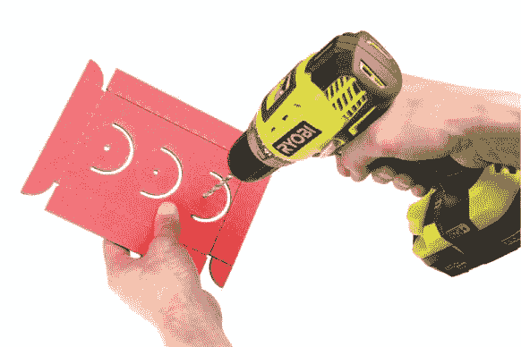

一旦打好孔，将三个 LED 从面包板上取下，从纸板的背面插入，如图 2-18 所示。记住，标准的交通信号灯通常是从上到下依次排列为红、黄、绿。注意 LED 在电路板上的连接位置，因为我们最后会重新连接它们。

**图 2-18：** 所有三颗 LED 灯已压入纸板中

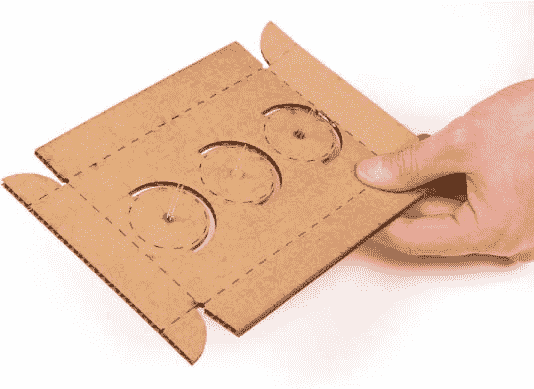

接下来，如图 2-19 所示，沿着刻痕将纸板弯曲。将垂直侧面➊朝内弯曲，然后对顶部和底部侧面➋以及标签➌进行同样操作。（侧面和标签在图 2-15 中有标注。）

**图 2-19：** 预折叠刻痕纸板，形成交通信号灯的外壳

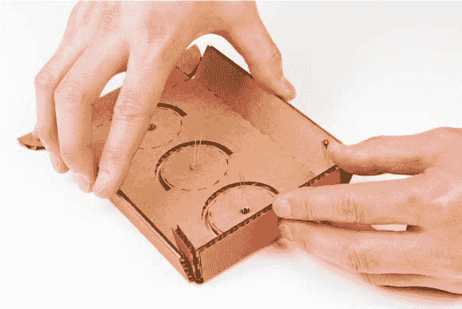

将标签➌放入垂直侧面➊内，并按照图 2-20 所示将其粘合到位。你可以使用热胶、胶带或工艺胶——我们推荐使用热胶，因为它易于操作、快速固化且粘合力较强。

重复此步骤，用于上下角。你将最终得到一个浅的矩形盒子，后部保持开口。

**图 2-20：** 折叠和粘合纸板外壳

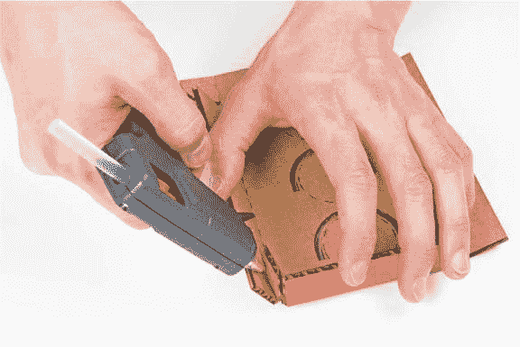

#### 制作交通信号灯透镜

交通信号灯的透镜是用乒乓球切成两半制成的，但你也可以使用任何适度透明的物品。

如果你使用的是乒乓球或类似的物品，小心地将两个乒乓球切成两半。在切割时，将球放在切割垫或厚纸板上，并用指尖牢牢按住两侧。小心地将刀片推向垫子并切入乒乓球（确保刀片没有指向你或你的手），如图 2-21 所示，进行切割。旋转乒乓球并重复操作，直到完全切割穿透。确保手指远离刀片，并始终在切割垫或纸板上切割。

**图 2-21：** 安全切割乒乓球

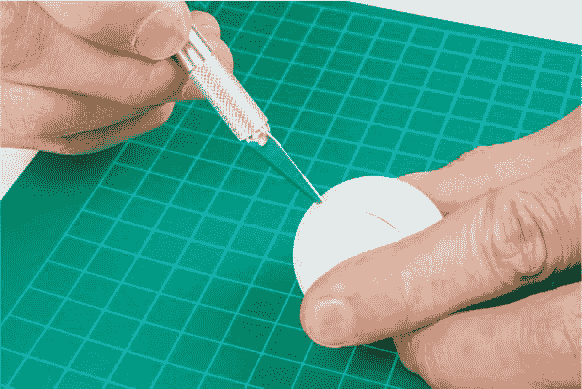

一旦你有了三半个乒乓球（你将有四个，一个是多余的，可以用于未来的项目或作为你最喜欢的填充玩具的小帽子），如图 2-22 所示，用热胶将它们固定在一起。

**图 2-22：** 使用乒乓球作为透镜的外壳

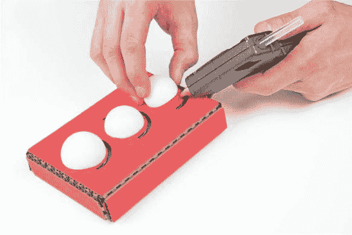

#### 制作阴影

最后，为交通信号灯添加阴影。为了得到漂亮的曲线，做出多条平行的刻痕，间距约为 1/8 英寸，如图 2-23 所示。模板中有刻痕示例，你可以参照这些进行操作。完成所有刻痕后，将每个阴影弯曲成曲线，如图 2-24 所示。

**图 2-23：** 刻痕阴影

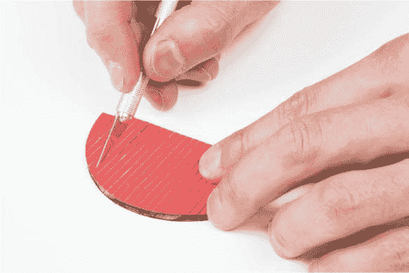

**图 2-24：** 将阴影弯曲成曲线

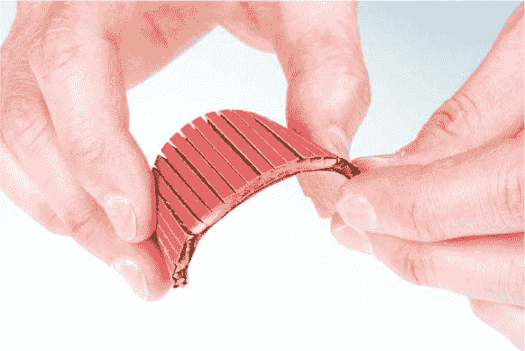

一旦你把遮光罩弯曲并塑形到满意的样子，就可以将它们安装到每个透镜上方的外壳中，如图 2-25 所示，然后用胶水固定。如果你想要更完美或更逼真的外观，可以将外壳喷成黑色。请确保在喷漆之前，要么将透镜取下，要么用遮蔽胶带将其遮住，以免它们被喷漆覆盖。

**图 2-25：** 将遮光罩安装到外壳中

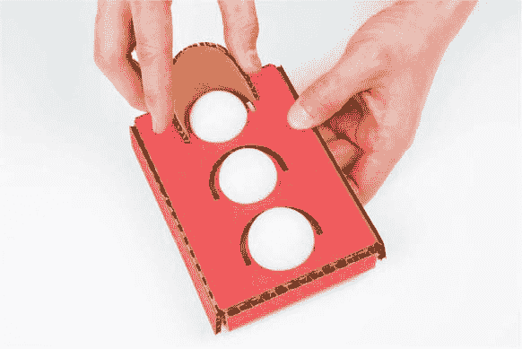

#### 安装 LED 灯和 Arduino

接下来，你需要将新外壳中的 LED 灯连接到你的 Arduino 上。首先，使用两根公对母跳线（SparkFun PRT-09385）延长每个 LED 灯。你将需要六根这样的跳线。只需将每根 LED 的引脚插入跳线的母头即可。为了保持线路整洁，我们建议使用黑色线材连接负极（较短的引脚），而使用彩色线材连接正极（较长的引脚），如图 2-26 所示。

**图 2-26：** 连接跳线到 LED 灯

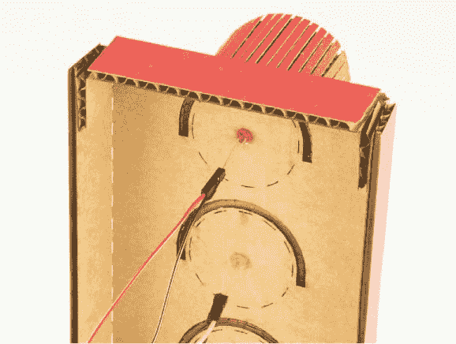

将跳线连接到 LED 灯后，将公头插入面包板中与 LED 灯所在位置相同的插孔，如图 2-27 所示。再次提醒，注意每个 LED 灯的位置。如果不记得了，可以参考原始图示图 2-10。

**图 2-27：** 将每根跳线的公头插入面包板

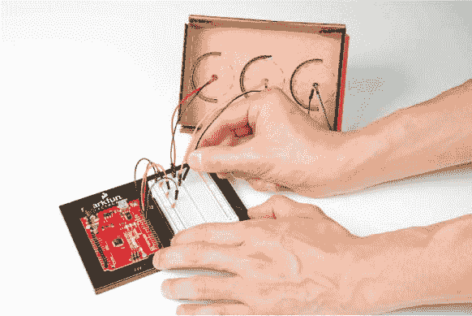

通过将 Arduino 插入电脑或电池包，检查你的连接是否正常工作。如果某个灯不亮，尝试轻轻晃动连接处，或者再检查一下跳线是否插入了面包板上的正确位置。

你可以将 Arduino 和面包板留在交通信号灯外面，或者用胶水或双面胶将它们固定在外壳内部。不管你选择哪种方式，完成后，打开你的交通信号灯，去找一个需要交通安全管理的繁忙走廊交叉口。

图 2-28 展示了完成的交通信号灯，尽显其光彩。

**图 2-28：** 完成的交通信号灯项目

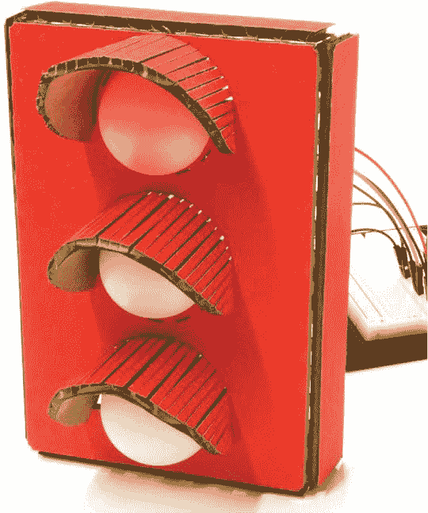

### 更进一步

在制作交通信号灯的过程中，你学到的一些概念，比如控制输出（LED 灯）的定时，可以应用到你家里和生活中的许多不同场景。以下是对交通信号灯进行调整的几个建议。

#### 改进

交通信号灯的基本概念就是定时。什么时候定时器会有用呢？比如你可以修改代码来帮助你控制煎蛋的时间？你可以将交通信号灯进行改造，当蛋的熟度还处于“生”或“半熟”时，红灯亮起；当蛋快煎熟时，黄灯亮起；蛋煎熟时，绿灯亮起。

我们不能给你具体的时间，因为我们每个人对鸡蛋烹饪的喜好不同。还有许多变量会影响烹饪时间，比如温度、锅具类型和鸡蛋的大小。你得自己摸索出合适的时间。

在代码中，你需要使用比较大的数字来设置延时，因为它是以毫秒为单位的。要设置分钟级别的延时，你只需要做一点乘法运算。记住，1,000 毫秒等于 1 秒；再乘以 60，你就能得出 60,000 毫秒等于 60 秒，或者 1 分钟。对于 3 分钟的延时，你可以直接在`delay()`函数中将 3 乘以 60,000，如下所示：

```
delay(60,000 * 3);
```

你可能会想知道`delay()`函数的最大延时时间是多少。`delay()`接收的数据类型是*无符号长整型*，它的值范围是从 0 到 4,294,967,295。所以最大延时大约是 1,193 小时。相当酷吧！知道这一点后，你是否想到其它用`delay()`函数可以计时的事情？

#### 修改

如果你想让这个项目更加持久和坚固，你可以选择将导线焊接到 LED 上，而不是使用公对母跳线。如果你从未焊接过，可以参考第 302 页的“如何焊接”部分，在开始前学习一些焊接的基本技巧。你需要剪掉一根公对公跳线的末端，使用剥线钳将绝缘层剥离大约 1/2 英寸，然后将剥去的部分焊接到修剪过的 LED 的每个引脚上，正如图 2-29 所示。注意，我们在焊接时将导线绕在 LED 的引脚上，以确保它牢固。焊接后，连接会更加耐用，而且你还可以在其他项目中使用这些 LED，因为另一端仍然是公头跳线。

**图 2-29：** 将切割的跳线焊接到 LED 上

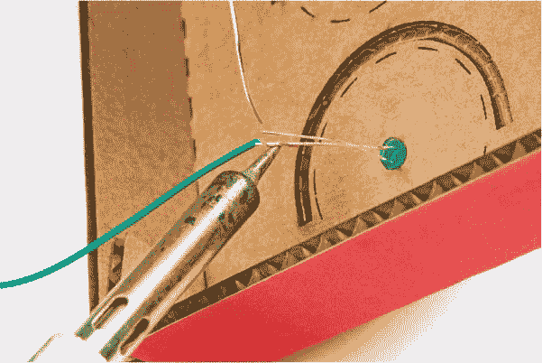

尽管这个项目看起来很令人印象深刻，但编程和硬件其实非常简单。在接下来的几章中，阅读关于传感器和逻辑的内容时，我们鼓励你回顾这个项目，并思考如何利用你所学的内容对其进行扩展。
