## 第四章：3 九像素动画机

我们每天都在使用显示器，无论是在手机、电脑、平板还是电视上。大多数现代显示器的显示屏由数百万个像素（即图像元素）组成。像素是计算机可以用不同颜色点亮的微小点；所有像素共同组成了屏幕上的文字、图像和视频。

在这个项目中，你将使用 LED 构建一个简单的显示器。你将扩展之前关于闪烁 LED 的工作，并学习在 Arduino 中使用自定义函数。最后，你将学习如何在你自己的九像素动画机上显示秘密字符。你可以在图 3-1 中看到我们的设备。

**图 3-1：** 完成的九像素动画机

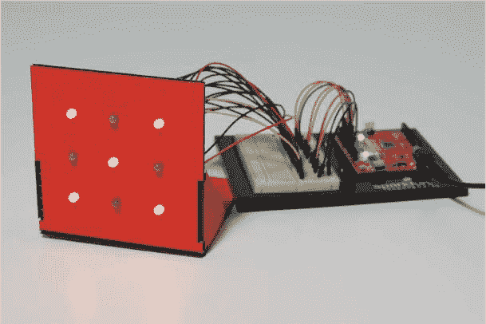

你可以使用九像素动画机显示字母和数字，绘制基本的几何图形，制作其他有趣的像素艺术。

### 需要准备的材料

在这个项目中，你需要比项目 2 更多的电子元件，尤其是更多的 LED。然而，这个项目在外壳构建方面更简单。你需要的材料如图 3-2 和图 3-3 所示。

**注意**

*在我们的项目中，所有 LED 的颜色相同，因此图案更容易看清。如果你没有九个相同颜色的 LED，可以混合使用它们。*

#### 电子元件

• 一块 SparkFun RedBoard（DEV-13975）、Arduino Uno（DEV-11021）或任何其他兼容 Arduino 的板子

• 一条 USB Mini-B 电缆（CAB-11301 或你的板子自带的 USB 电缆；未显示）

• 一块无焊接面包板（PRT-12002）

• 九个 LED，最好是相同颜色的（COM-10049，一包 20 个红色和黄色 LED）

• 九个 330Ω电阻（COM-11507，一包 20 个）

• 公对公跳线（PRT-11026）

• 公对母跳线（PRT-09140*）

• （可选）一个 4 个 AA 电池的电池架（PRT-09835*；未显示）

**注意**

*带有星号（*）标记的部分不包含在标准的 SparkFun 发明者套件中，但可以通过单独的附加套件获得。*

**图 3-2：** 九像素动画机的组件

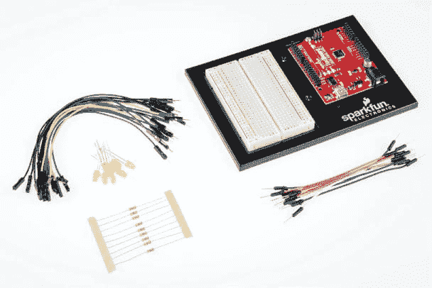

#### 其他材料和工具

• 铅笔

• 工艺刀

• 金属直尺

• 剪线钳

• 胶水（热熔胶枪或工艺胶水）

• 方格纸（未显示）

• （可选）电钻和 3/16 英寸的钻头

• （可选）电烙铁

• （可选）焊锡

• （可选）辅助工具（未显示）

• 一张纸板（大约 8 × 11 英寸，或 20.5 × 30 厘米；未显示）

• 外壳模板（请参见图 3-13 在 83 页）

**图 3-3：** 推荐工具

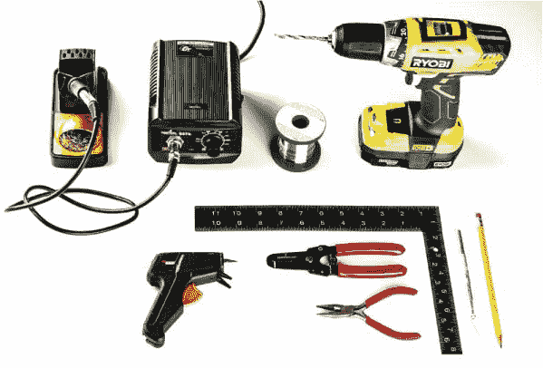

### 构建九像素动画机原型

这个简单的像素艺术显示器将教你如何在一个电路中管理大量的电线，这对于电路变得越来越复杂时非常重要。首先，你将使用面包板确保电路正常工作，测试一个草图，并熟悉所有的跳线。（我们将在 “纸板结构” 第 83 页中向你展示如何将 LED 转移到显示外壳中。）请注意，图 3-4 中的电路图与第 43 页的 图 2-6 非常相似。原因是这个项目使用的是相同的 LED 电路，不过它不仅仅使用三个 LED，而是使用九个 LED，每个 LED 都由 Arduino 的一个引脚独立控制。

**图 3-4：** 九像素动画机的原理图

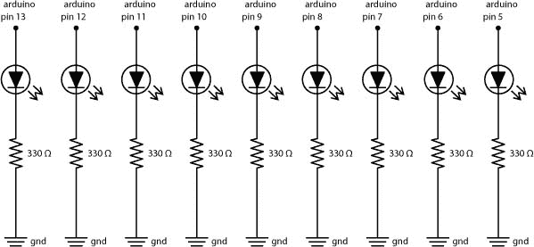

在本节中，你将使用面包板将所有九个 LED 连接到 Arduino 的引脚上。准备好你的元件和跳线后，在面包板上搭建 图 3-5 中的电路。如果你想先练习搭建更小的 LED 电路，可以翻回 “将红色 LED 连接到面包板” 第 44 页，复习一下。

**图 3-5：** 九个 LED 灯连接到 Arduino，其中引脚 13 的 LED 位于顶部，引脚 5 的 LED 位于底部

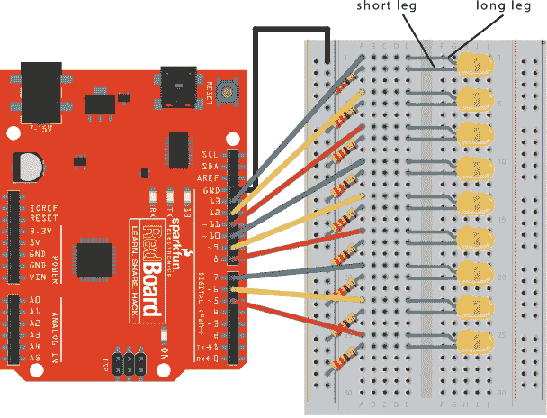

接线九个 LED 可能会让面包板显得杂乱无章。为了保持面包板的整洁，首先将面包板左侧的地线（–）连接到 Arduino 的 GND 引脚。这就是 图 3-5 中的黑色线。然后，将第一个 LED 的负极（较短的一端）通过一个 330 Ω 电阻连接到这个地线。在 图 3-5 中，LED 的长腿位于第 1 行，短腿位于第 2 行。最后，将 LED 的长腿用一根跳线从 Arduino 的引脚 13 连接到面包板的第 1 行。以相同的方式，将其他八个 LED 连接到引脚 12 到引脚 5。记住：LED 的短腿是负极。在搭建电路时，确保每个 LED 的短腿通过电阻连接到面包板的地线。当你完成后，你的电路应该像 图 3-6 中的电路一样。

**图 3-6：** 最终原型电路，九个 LED 灯连接到 Arduino，其中引脚 13 的 LED 位于顶部，引脚 5 的 LED 位于底部

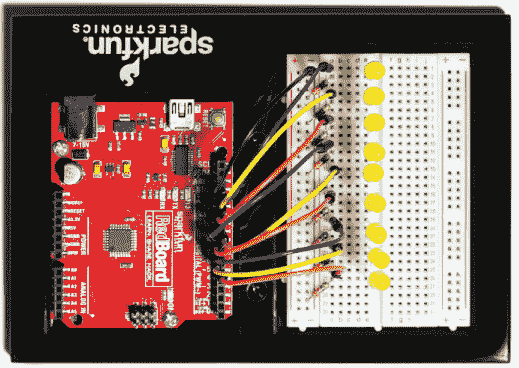

一旦你接好九个 LED，打开 Arduino IDE，并使用 USB 数据线将 Arduino 连接到计算机。如果你在之前的项目中已经将草图上传到 Arduino，你可能会看到 LED 灯亮起，因为它在运行你最后上传的草图。现在，让我们来看看如何编写代码控制这九个 LED。

### 编程九像素动画机

在以前的项目中，使用一堆`digitalWrite()`函数和`delay()`函数来控制 LED 是相对简单的。但如果有九个 LED，你的`loop()`函数就会变得非常混乱！相反，你可以编写自己的*自定义函数*来闪烁一个 LED，然后使用这个函数来控制所有的 LED。

#### 什么是自定义函数？

Arduino 语言大约有 60 个 *内置*（或预定义）函数，它们通过简单的单行指令使你更容易与硬件进行交互。`digitalWrite()`和`delay()`函数就是两个例子。在幕后，`digitalWrite()`函数由 20 多行代码组成。尽管大部分代码比较复杂，但`digitalWrite()`函数本身很容易理解。

即使你理解了一个大型草图，每次想要打开或关闭一个 LED 时，输入 20 行或更多的代码仍然是繁琐且容易出错的。Arduino 内置的函数可以处理常见任务，但当你需要对草图进行特定操作时，你会希望编写自定义函数。自定义函数可以让你轻松地在其他草图中重用代码，并且它们能让你的`loop()`函数更易于阅读。

##### 编写自定义函数

你可以使用自定义函数来教 Arduino 新的命令。你的第一个测试函数将使一个 LED 闪烁，先点亮再熄灭，使用修改版的清单 3-1 中的代码。

**清单 3-1：** 一个简单的草图，用于闪烁 LED

```
void setup()
{
  pinMode(13, OUTPUT);
}

void loop()
{
  digitalWrite(13, HIGH);
  delay(1000);
  digitalWrite(13, LOW);
  delay(1000);
}
```

这段代码应该与项目 1 中的 Blink 示例类似（清单 1-1 在第 28 页）。然而，在这里我们明确使用引脚 13，而不是使用`LED_BUILTIN`系统常量。这段代码将 LED 点亮，等待一秒钟，再将 LED 熄灭，然后等待另一秒钟后再次执行。你将在以后的项目中频繁使用此代码，因此我们将展示如何将这段代码放入自定义的`blink()`函数中。为了使你的自定义函数尽可能有用，你将以一种允许你为任何引脚和任何延迟时间使用该函数的方式来编写它。

首先，打开一个新的草图，将清单 3-1 中的代码复制进去并保存。然后，在`setup()`和`loop()`函数下方定义`blink()`函数，如清单 3-2 所示。

**清单 3-2：** 自定义`blink()`函数的框架

```
➊void ➋blink(➌int pinNumber, int delayTime)
{
  //custom function code goes here
}
```

这只是函数的框架。函数定义总是首先指定函数将返回的数据类型➊。`blink()`函数要求 Arduino 执行一个任务而不期待任何数据返回，因此，和`setup()`与`loop()`函数一样，它的数据类型是`void`。

接下来是函数的名称 ➋，在这个例子中是`blink`。你几乎可以随意给 Arduino 函数命名，但它们不能以数字开头，也不能包含空格或特殊字符。此外，为了确保在阅读草图时函数的用途清晰明了，我们建议使用一个既具有描述性又容易记住的名称。

命名函数后，在括号中定义函数所需的参数 ➌。为了使`blink()`函数尽可能多次使用，提供一个引脚号和延迟时间作为参数。这样你就可以指定哪个 LED 要闪烁，以及闪烁的时长。每个`blink()`函数的参数都是`int`类型。注意，定义参数类似于声明变量。因为参数本质上是只能在函数内使用的变量。

最后，自定义函数有自己的一组花括号，它们包含了你希望函数调用代表的所有代码。对于`blink()`函数来说，这就是示例 3-1 中的`digitalWrite()`和`delay()`函数，如示例 3-3 所示。现在把代码加到`blink()`函数的花括号内吧。

**示例 3-3：** 自定义`blink()`函数

```
void blink(int pinNumber, int delayTime)
{
  digitalWrite(pinNumber, HIGH);
  delay(delayTime);
  digitalWrite(pinNumber, LOW);
  delay(delayTime);
}
```

请注意，在`digitalWrite()`和`delay()`函数调用中，`blink()`函数分别用`pinNumber`和`delayTime`参数替代了引脚号`13`和延迟`1000`毫秒。

##### 使用自定义函数

现在，你可以在`loop()`函数中使用你的自定义函数，像在示例 3-4 中那样。

**示例 3-4：** 使用新自定义的`blink()`函数完成的草图

```
void setup()
{
  pinMode(13, OUTPUT);
}

void loop()
{
  blink(13, 1000);
}
 void blink(int pinNumber, int delayTime)
{
  digitalWrite(pinNumber, HIGH);
  delay(delayTime);
  digitalWrite(pinNumber, LOW);
  delay(delayTime);
}
```

修改后的`loop()`函数调用了`blink()`函数，并传入了要闪烁的 LED 的引脚号（`13`）以及灯光应该保持开启或关闭的时间，单位为毫秒（建议使用`1000`，即 1 秒）。就是这样！这个代码是不是看起来更简洁、清晰？

将这个草图上传到你的 Arduino，13 号引脚上的 LED 应该会开始闪烁。恭喜！你刚刚“教会”了 Arduino 什么是`blink()`，并将四行代码浓缩成了一条指令。

但是，自定义函数只是这个项目的一个关键。你还需要提前规划一些九像素的图案，以便更容易编程，现在就让我们来做这件事。

**试试看：玩转图案**

在完成九像素动画机之前，花些时间好好玩玩你更强大的`blink()`草图。例如，将你的`loop()`函数修改如下：

```
void loop()
{
 blink(13, 100);   //short 100 ms blink on pin 13
 blink(13, 2000);  //longer 2000 ms blink on pin 13
}
```

这将使 LED 闪烁 100 毫秒，然后进行一次较长的闪烁，时间为 2000 毫秒。试着闪烁其他 LED，创造属于你自己的图案和序列！

#### 设计你的艺术作品

拿出彩色铅笔和方格纸，戴上你的艺术家帽子！你将要制作一些像素艺术，展示在九像素动画机上。

首先画几个 3 × 3 的网格，或者打印出图 3-7 中显示的模板，你可以在本书的资源文件中找到该模板。这些图形不必完美；你只是在草绘一些想法。

**图 3-7：** 空白网格规划模板

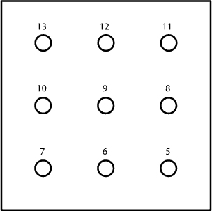

我们在左上角标记了 13 号像素，在右下角标记了 5 号像素。这些数字对应 Arduino 上的 LED 引脚编号；这就是你如何控制九像素动画机中的 LED。当你的画布准备好后，发挥创造力：填充像素以制作自己的图案。图 3-8 展示了我们在部门会议中想出的几个例子……别告诉我们老板！

**图 3-8：** 一些像素图案示例

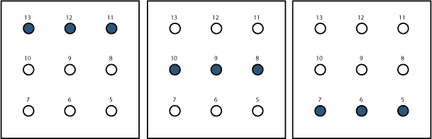

当你按顺序显示这些图案和形状时，就可以创建动画了！首先，我们将教你编程两个简单的形状，然后我们将处理一个完整的动画。

#### 测试草图

在 Arduino IDE 中创建一个新的草图，并添加清单 3-5 中的`setup()`和`loop()`函数。

**清单 3-5：** 九像素动画机的`setup()`函数

```
//LED array is set up in this arrangement:
//  13 ---- 12 ---- 11
//  10 ----  9 ----- 8
//   7 ----  6 ----- 5

void setup()
{
  pinMode(13, OUTPUT);
  pinMode(12, OUTPUT);
  pinMode(11, OUTPUT);
  pinMode(10, OUTPUT);
  pinMode(9, OUTPUT);
  pinMode(8, OUTPUT);
  pinMode(7, OUTPUT);
  pinMode(6, OUTPUT);
  pinMode(5, OUTPUT);
}

void loop()
{
}
```

**注意**

*我们还建议添加一段带有 LED 布置图的注释。在草图中描述你正在编写代码的电路，将帮助其他人重现它，并且在你开发代码时，也能提醒你自己结构。*

本项目使用九个 LED，连接到九个数字 GPIO 引脚（从 13 到 5），因此`setup()`函数中有九个`pinMode()`函数。它们都被设置为`OUTPUT`，因为它们控制 LED。

##### 编写一个绘制 X 的函数

在设置好`pinMode()`函数后，看看你手绘的图形并注意数字；它们会帮助你编写自定义函数。图 3-9 展示了一个可以测试的例子——一个简单的*X*图案。

**图 3-9：** 九像素*X*


图 3-9 中的*X*图案对应清单 3-6 中的`digitalWrite()`函数集合。

**清单 3-6：** 在九个 LED 上显示*X*的代码

```
digitalWrite(13, HIGH);
digitalWrite(12, LOW);
digitalWrite(11, HIGH);

digitalWrite(10, LOW);
digitalWrite(9, HIGH);
digitalWrite(8, LOW);

digitalWrite(7, HIGH);
digitalWrite(6, LOW);
digitalWrite(5, HIGH);
```

这些`digitalWrite()`函数调用仅打开网格对角线上的 LED，并关闭其余的 LED。但绘制一个单独的*X*图案需要九行代码！每次手动编写这些代码太麻烦，你可以创建一个自定义函数，用一行代码执行所有这些调用。

在`loop()`函数的花括号下面，创建一个名为`xChar()`的自定义函数，并使用清单 3-7 中的代码。

**清单 3-7：** `xChar()` 自定义函数

```
void xChar()
{
  digitalWrite(13, HIGH);
  digitalWrite(12, LOW);
  digitalWrite(11, HIGH);

  digitalWrite(10, LOW);
  digitalWrite(9, HIGH);
  digitalWrite(8, LOW);

  digitalWrite(7, HIGH);
  digitalWrite(6, LOW);
  digitalWrite(5, HIGH);
}
```

我们将这个自定义函数命名为`xChar()`，因为它显示了一个*X*字符。这个函数不会返回任何内容，所以它的数据类型是`void`。由于列表 3-6 中的`digitalWrite()`调用都在这个自定义函数内，你可以保持`loop()`代码简洁。在现有的`loop()`中调用`xChar()`函数，如列表 3-8 所示。

**列表 3-8：** 包含`xChar()`函数调用的`loop()`函数

```
void loop()
{
  xChar();
}
```

这是一个小步骤，但非常重要。如果你忘记调用自定义函数，它的代码将永远不会运行，你的*X*字符也无法显示。

现在将这个草图上传到你的 Arduino 中。虽然你的 LED 依然排列成垂直线，而不是网格，但这个草图仍然可以帮助你测试电路和代码是否正确。你应该看到每隔一个 LED 点亮，从顶部开始，如图 3-10 所示。如果 LED 没有按预期点亮，请再次检查与图 3-5 中的电路图（第 71 页）对比你的接线，并确保所有的`digitalWrite()`函数都正确。

当你看到正确的图案时，继续创建第二个字符。

**图 3-10：** *X*字符的原型和正确的顺序

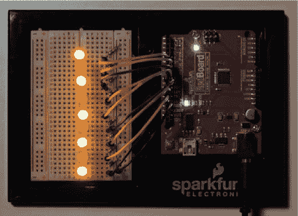

##### 编写一个绘制 O 字符的函数

接下来，你将创建一个像图 3-11 中的*O*，以配合*X*字符。

**图 3-11：** 九像素的*O*

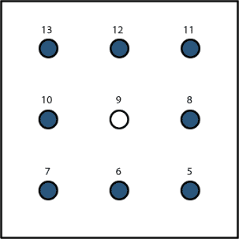

专业提示：你可以通过更聪明的方式工作，而不是更辛苦。复制整个`xChar()`函数，将副本粘贴到`xChar()`的最后一个大括号之后，将其名称改为`oChar()`，并调整其使之像列表 3-9 中的样子。

**列表 3-9：** `oChar()`自定义函数

```
void oChar()
{
  digitalWrite(13, HIGH);
  digitalWrite(12, HIGH);
  digitalWrite(11, HIGH);

  digitalWrite(10, HIGH);
  digitalWrite(9, LOW);
  digitalWrite(8, HIGH);

  digitalWrite(7, HIGH);
  digitalWrite(6, HIGH);
  digitalWrite(5, HIGH);
}
```

`xChar()`和`oChar()`之间唯一的区别在于哪些 LED 被点亮，哪些 LED 熄灭。`xChar()`会点亮交替的 LED，而`oChar()`则点亮除了中心 LED 以外的所有 LED。

**动手尝试：为你的图像编写一个自定义函数**

我们向你展示了如何编写绘制*X*和*O*的函数，但我们相信你脑海中一定有自己喜欢的像素艺术图案。创建一个函数来展示你制作的图案，并将其保存，以便在完成九像素动画机时使用。

##### 显示 X 和 O 字符

现在的目标是先显示一个*X*字符，然后显示一个*O*字符，最后再返回到*X*。为了在固定的时间内显示每个字符，你可以将`oChar()`函数添加到现有的循环中，并使用`delay()`函数减慢循环速度。更新你的草图，使其像列表 3-10 一样。

**列表 3-10：** `loop()`函数看起来类似于 Blink 示例中的函数，但使用了`xChar()`和`oChar()`代替了`digitalWrite()`。

```
//LED array is set up in this arrangement:
//  13 ---- 12 ---- 11
//  10 ----  9 ----- 8
//   7 ----  6 ----- 5

void setup()
{
  pinMode(13, OUTPUT);
  pinMode(12, OUTPUT);
  pinMode(11, OUTPUT);
  pinMode(10, OUTPUT);
  pinMode(9, OUTPUT);
  pinMode(8, OUTPUT);
  pinMode(7, OUTPUT);
  pinMode(6, OUTPUT);
  pinMode(5, OUTPUT);
}

void loop()
{
  //blink between x and o characters
  xChar();
  delay(500);
  oChar();
  delay(500);
}

void xChar()
{
  digitalWrite(13, HIGH);
  digitalWrite(12, LOW);
  digitalWrite(11, HIGH);

  digitalWrite(10, LOW);
  digitalWrite(9, HIGH);
  digitalWrite(8, LOW);

  digitalWrite(7, HIGH);
  digitalWrite(6, LOW);
  digitalWrite(5, HIGH);
}

void oChar()
{
  digitalWrite(13, HIGH);
  digitalWrite(12, HIGH);
  digitalWrite(11, HIGH);
 digitalWrite(10, HIGH);
  digitalWrite(9, LOW);
  digitalWrite(8, HIGH);

  digitalWrite(7, HIGH);
  digitalWrite(6, HIGH);
  digitalWrite(5, HIGH);
}
```

这个循环会显示一个*X*，持续 500 毫秒，然后切换为一个*O*，也持续 500 毫秒。将更新后的草图上传到你的 Arduino，并运行它，看看它是如何工作的。每个 LED 灯（除了中间的那个）都会在调用`oChar()`时亮起。图 3-12 展示了当 LED 灯闪烁时你会看到的效果。

**图 3-12：** 在两种图案之间切换

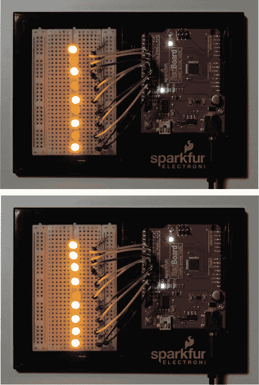

现在保存你的草图，因为稍后你会在其基础上进行扩展。但只要这个电路中的 LED 灯仍然在面包板上，它们就不会显示任何可识别的图像。所以接下来，我们将向你展示如何制作显示器，让你能够看到九像素动画机的微小辉煌。

### 构建九像素动画机外壳

这个项目的外壳只是一个带有 LED 灯孔的硬纸板显示器。还需要进行一些接线，但一旦完成，你就可以制作各种像素艺术了。

#### 硬纸板构建

找一张干净且没有折痕和弯曲的硬纸板。我们的设计是基于大约 1/8 英寸厚的硬纸板，但你也可以使用任何类似的板材或面板材料。有些材料比其他材料更容易切割，因此可以根据你拥有的工具选择适合的材料。

##### 切割零件

打开本书资源文件中显示的图 3-13 模板，并将其描绘到你的硬纸板上。尽量将模板与硬纸板的边缘对齐，以便更容易切割。

**图 3-13：** 九像素动画机外壳模板（非实际尺寸）

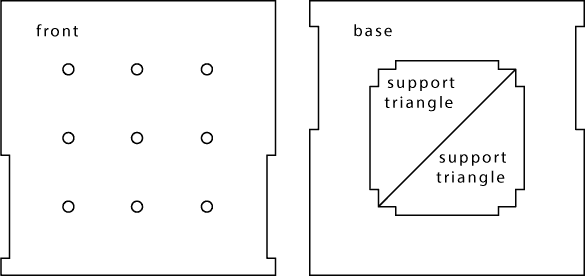

一旦你描绘好了零件，开始切割它们。我们强烈推荐使用锋利的手工刀和金属尺，以确保切割边缘整齐。记住手工刀的安全：总是拉刀（不要推），并且多次轻轻切割，而不是第一次就用力深切。

切割好硬纸板零件后，在前面板上打上 LED 灯孔。你可以按照图 3-14 中的示意图进行钻孔，使用孔打孔器，甚至用铅笔戳出来。只需确保手边有一个 LED 灯来测试每个孔的大小，确保它们能合适地安装。如果孔稍微大了一点，而且你不介意将 LED 灯固定在项目上，你可以使用热胶将它们固定。

**图 3-14：** 为 LED 灯钻孔。钻孔时请小心，或寻求成人的帮助。

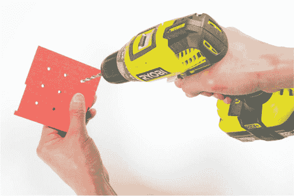

你应该已经切割出了四个零件，如图 3-15 所示。底座中间有一个大孔；使用其中心部件剪切出两个三角形，作为支撑支架。这些三角形有卡槽，可以将底部零件和前部零件连接起来。然而，在组装零件之前，请添加标签，以便在连接电路时能保持 LED 灯的位置正确。

**图 3-15：** 外壳的硬纸板零件

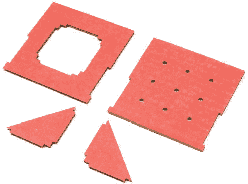

##### 标记 LED 灯孔

翻转前面板纸板，并为每个 LED 编号，以便有一个连接指南。从右上角的 13 引脚开始，然后依次向左数，如 图 3-16 所示。你应该在左下角完成编号，最终编号为 5。

**图 3-16：** 标记 LED 网格的背面

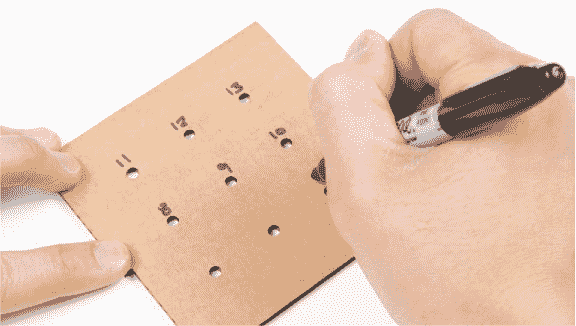

##### 添加 LED

将纸板平放，从背面插入九个 LED。你可以重用面包板原型中的 LED，或者使用新的 LED。当插入 LED 时，确保它们的长脚对齐到右侧，这样在稍后将它们重新接到 Arduino 时会更方便。你希望 LED 紧密地装入孔中，如 图 3-17 所示。如果孔太大，你可以加一点热熔胶将其固定（但请记住，之后你将无法再次使用这些 LED）。

**图 3-17：** 插入 LED

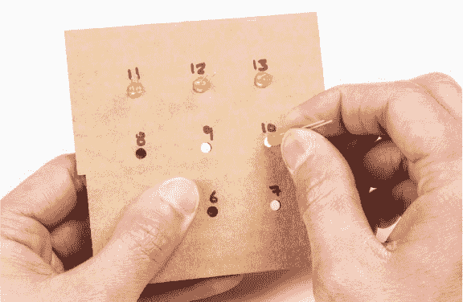

##### 组装零件

现在，收集待组装的四个纸板部件。你可能需要使用工艺胶水或热熔胶枪将所有部件粘合在一起。

首先，将一个三角形粘到基座上，以支撑前面板，如 图 3-18 所示。请参见 图 3-19 了解支撑三角形的方向。对另一个三角形部件重复此过程。请给胶水一些时间干燥后再继续下一步。

**图 3-18：** 将支撑三角形添加到基座上

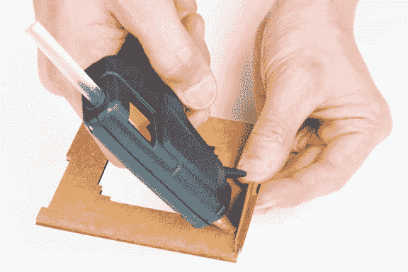

将支撑三角形放置好后，使用胶水将前面板粘到基座上。前面板应紧密地贴合支撑三角形的卡口，并安放在基座纸板的上方，如 图 3-19 所示。为了增强强度，你还可以在前面板连接基座和支撑三角形的内侧边缘处加上热熔胶。

**图 3-19：** 添加项目的最后一块——前面板

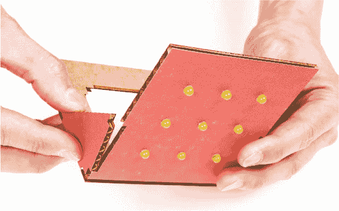

在完成纸板构建部分后，现在是时候接线了。

#### 连接电子元件

这个项目有很多接线，我们将一步一步来。你将重用本章早些时候构建的面包板原型电路，只需使用跳线将九个 LED 连接到 Arduino 上。

这个部分有两种方式来进行：非永久方式，使用公对母跳线，和永久方式，涉及到焊接。我们将介绍非永久方式，但如果你确实想把 LED 焊接到跳线，可以参考 “如何焊接” 页码 302 上的简短教程，再尝试焊接。

如果 LED 的引脚太长，你可以在连接跳线之前将它们剪短，但要注意哪个引脚是正极（较长的引脚）哪个是负极。把正极引脚剪得稍长一点，这样你还能辨别正负引脚；你也可以在盒子背面画个点。记得佩戴护目镜——修剪引脚时，小的金属片可能会飞起来，向你的眼睛飞来！

将每根跳线的母头连接到前面板上的九个 LED 之一。为了保持组织性，使用黑色导线指定负极，并将其连接到 LED 的较短腿，如图 3-20 所示。每个 LED 的正极可以使用任何颜色的导线。

**图 3-20：** 使用公对母跳线连接 LED

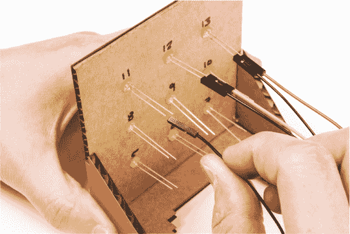

当所有九个 LED 连接到公对母跳线后，将每根跳线的另一端连接到面包板，按照项目背面标注的引脚标签进行连接。如果你之前已经把 LED 插入了面包板，先把它们取下来，然后像图 3-21 中所示的那样插入跳线。

**图 3-21：** 使用公对母跳线将九个 LED 连接到面包板

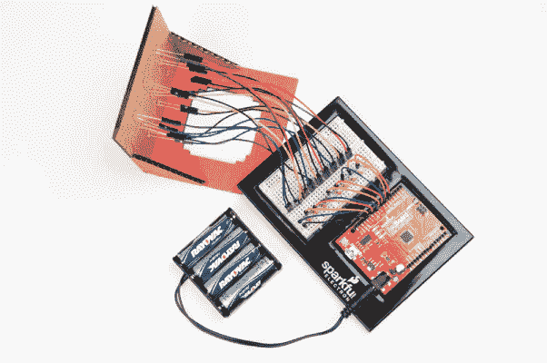

每条连接到 LED 负极腿的导线（每条黑色导线）连接到一个与接地轨道相连的电阻器。每条正极导线连接到 LED 阵列背面标注的 Arduino 引脚。

一旦你把所有九个 LED 添加到显示器的前面并完成接线，将 Arduino 通过 USB 电缆连接到电脑。如果所有的接线正确，你的显示器将显示交替的*X*和*O*图案。如果你有电池组，可以按照图 3-22 中的示意图连接它。

如果测试图像显示不正常，检查 LED 是否插入到正确的 Arduino 引脚。当你看到正确的图案时，稍作停留，享受你新像素艺术显示器的辉煌，但不要停在这里！当你准备好时，试着制作一个更复杂的动画。

**图 3-22：** 显示交替的*X*和*O*字符的最终显示效果

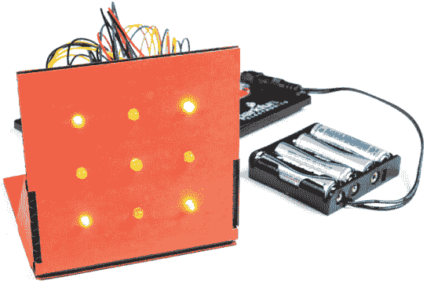

### 创建一个 LED 动画

你的显示器可以显示任何你能在 3×3 网格上绘制的图像。动画其实就是一系列按顺序显示的图像，所以如果你连续显示一堆 3×3 的图像，你就会得到一个像素艺术动画。我们将教你如何设计和显示一个旋转的线条。

#### 规划动画序列

让我们从将一个旋转的线条转化为一系列图像开始。我们从一条垂直线开始，并将其在显示器上旋转，分成四个独立的图像，如图 3-23 所示。

**图 3-23：** 旋转线条的图像进展

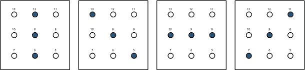

保存 Listing 3-10 中的程序，然后创建一个新的草图。将 Listing 3-11 中的 `setup()` 和 `loop()` 函数添加到新的草图中。

**LISTING 3-11：** 所有九个 LED 的 `setup()` 代码

```
void setup()
{
  pinMode(13, OUTPUT);
  pinMode(12, OUTPUT);
  pinMode(11, OUTPUT);
  pinMode(10, OUTPUT);
  pinMode(9, OUTPUT);
  pinMode(8, OUTPUT);
  pinMode(7, OUTPUT);
  pinMode(6, OUTPUT);
  pinMode(5, OUTPUT);
}

void loop()
{
  //animation function call will go here
}

//custom functions to show frames will go here
```

由于你使用的是之前在 *X* 和 *O* 草图中使用的相同 LED，你可以将那里代码复制到新的草图中。

#### 编写自定义函数

现在，为你的动画中的每一帧创建一个自定义函数。这个动画有四帧，因此你需要四个函数。在 `loop()` 函数的闭括号之后，将 Listing 3-12 中的函数添加到你的草图中。

**LISTING 3-12：** 用于绘制旋转线的自定义函数

```
➊ void verticalLine()
  {
    digitalWrite(13, LOW);
    digitalWrite(12, HIGH);
    digitalWrite(11, LOW);

    digitalWrite(10, LOW);
    digitalWrite(9, HIGH);
    digitalWrite(8, LOW);

    digitalWrite(7, LOW);
    digitalWrite(6, HIGH);
    digitalWrite(5, LOW);
  }

➋ void topLeftDiagonal()
  {
    digitalWrite(13, HIGH);
    digitalWrite(12, LOW);
    digitalWrite(11, LOW);

    digitalWrite(10, LOW);
    digitalWrite(9, HIGH);
    digitalWrite(8, LOW);
 digitalWrite(7, LOW);
    digitalWrite(6, LOW);
    digitalWrite(5, HIGH);
  }

➌ void horizontalLine()
  {
    digitalWrite(13, LOW);
    digitalWrite(12, LOW);
    digitalWrite(11, LOW);

    digitalWrite(10, HIGH);
    digitalWrite(9, HIGH);
    digitalWrite(8, HIGH);

    digitalWrite(7, LOW);
    digitalWrite(6, LOW);
    digitalWrite(5, LOW);
  }

➍ void topRightDiagonal()
  {
    digitalWrite(13, LOW);
    digitalWrite(12, LOW);
    digitalWrite(11, HIGH);

    digitalWrite(10, LOW);
    digitalWrite(9, HIGH);
    digitalWrite(8, LOW);

    digitalWrite(7, HIGH);
    digitalWrite(6, LOW);
    digitalWrite(5, LOW);
  }
```

`verticalLine()` 函数 ➊ 显示 图 3-23 中的第一张图，`topLeftDiagonal()` 函数 ➋ 显示第二张图，`horizontalLine()` 函数 ➌ 显示第三张图，`topRightDiagonal()` 函数 ➍ 显示最后一张。和你之前的自定义函数一样，这些自定义函数的返回类型是 `void`，因为它们不会返回值。

自定义函数也可以调用其他自定义函数，所以我们可以在一个 `spinningLine()` 函数中调用四个线条函数。将以下代码添加到你的草图中，放在 `topRightDiagonal()` 函数的闭括号后面。

```
void spinningLine(int delayTime)
{
  verticalLine();
  delay(delayTime);

  topLeftDiagonal();
  delay(delayTime);

  horizontalLine();
  delay(delayTime);

  topRightDiagonal();
  delay(delayTime);
}
```

这段代码展示了垂直线、对角线、水平线和另一条对角线，每条线之间都有延迟。现在，你只需在 `loop()` 函数内调用 `spinningLine()` 即可。

**注意**

*你可以在资源文件中找到完整的代码列表，访问地址为* [`nostarch.com/arduinoinventor/`](https://nostarch.com/arduinoinventor/)*。*

#### 调整你的 loop() 函数

在 `loop()` 函数内添加一个对自定义函数的调用，如 Listing 3-13 中所示。记住，你仍然需要在 `setup()` 函数中包含所有的 `pinMode()` 命令。

**LISTING 3-13：** 完整的 `loop()` 函数，带有新的自定义函数调用 `spinningLine(200)`；

```
void loop()
{
  spinningLine(200);
}
```

一旦你添加了函数并传递了延迟时间参数（代码使用的是 `200`），将你的草图上传到 Arduino。你将看到显示器上旋转的线条。通过了解如何按顺序控制 LED 和使用自定义函数，你可以制作自己的九像素动画！

### 深入了解

自定义函数将在你以后需要重用代码或组织代码时非常有用。要进一步推进这个项目，尝试设计更复杂的动画；你甚至可以设计自己的字母表，并利用显示器展示一个秘密信息。

#### 技巧

要进一步推进这个项目，首先创建更复杂的动画。在接下来的几个项目中，尝试寻找将显示器整合到项目中的方法——例如，或许你可以使用传感器来控制动画速度，或者以有趣的方式显示传感器值。你可以在 *[`www.nostarch.com/arduinoinventor/`](https://www.nostarch.com/arduinoinventor/)* 下载一个空白设计模板。

#### 修改

你已经学会了如何通过使用数字引脚和自定义函数来控制多个电子元件。试着将你的单独 LED 灯换成不同的组件。我们建议使用*七段显示器*，如图 3-24 所示。

**图 3-24：** 单个七段显示器

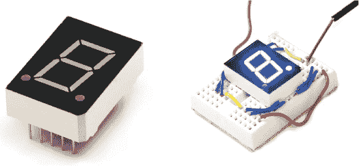

每个段都是一个你可以控制的 LED 灯。有七个独立段（加上小数点），如图 3-25 所示，通过打开和关闭特定的段，你可以显示数字和大多数英文字母。

**图 3-25：** 七个独立段和小数点的示意图及相应的接线图

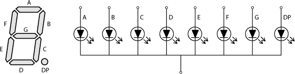

你可以像控制九像素动画机一样控制这些显示器：只需为每个数字创建自定义函数。为了挑战自己，创建一个函数，允许你传递一个数字并显示它。
