## 第五章：4 反应计时器

一般来说，人的视觉反应时间大约为 215 毫秒。也就是说，从你看到信号（如灯光打开）到信号传递到大脑，再到肢体反应的时间。反应计时器是一个很好的项目来展示这种时间延迟，同时它也是一个有趣的游戏！你和你的朋友反应有多快？

在这一章，你将学习如何使用 Arduino 制作自己的反应计时器。完整的项目展示在图 4-1 中。其背后的概念很简单：Arduino 会点亮一个 LED，启动计时器，并等待你按下按钮。当你看到 LED 亮起时，你尽快按下按钮，Arduino 会将从灯光亮起到你按下按钮之间的时间反馈给你的计算机。Arduino 的时钟速度为 16 MHz，意味着它每秒可以处理 1600 万个指令！这可是*非常快*的，因此 Arduino 非常适合这个项目。

**图 4-1：** 完整的反应计时器项目

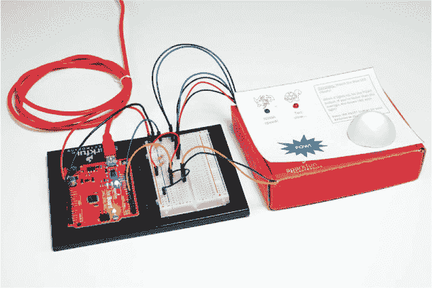

### 所需材料

像本书中的前几个项目一样，反应计时器使用了 LED、 电阻、电线和 Arduino。与其他项目不同的是，这个项目还包括了一个按钮来使游戏更加互动，并且为了让外观更加炫酷，我们建议使用定制的纸板外壳。图 4-2 和 4-3 展示了你需要的零件和材料。

#### 电子元件

• 一块 SparkFun RedBoard（DEV-13975）、Arduino Uno（DEV-11021）或任何兼容 Arduino 的开发板

• 一根 USB Mini-B 数据线（CAB-11301，或你使用的开发板的 USB 线）

• 一块无焊面包板（PRT-12002）

• 一个红色 LED，一个蓝色 LED 和一个绿色 LED（COM-12062）

• 三个 330 Ω电阻（COM-08377，或者 COM-11507，一包 20 个）

• 一个 10 kΩ电阻（COM-08374，或者 COM-11508，一包 20 个）

• 一个按钮（COM-10302）

• 公对公跳线（PRT-11026）

• 公对母跳线（PRT-09140*）

**注意**

*标有星号（*）的零件不包含在标准 SparkFun 发明者工具包中，但可以在单独的附加工具包中找到。*

**图 4-2：** 反应计时器的组件和材料

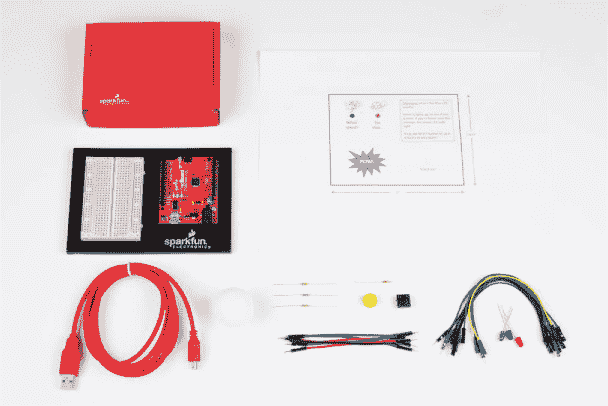

#### 其他材料与工具

• 铅笔

• 工艺刀

• 金属尺

• 胶水（热熔胶枪或工艺胶水）

• （可选）电钻以及 3/16 英寸和 5/16 英寸钻头

• （可选）电线剪（未显示）

• 纸板（大约 12 英寸见方）或一个纸箱

• 外壳模板（见图 4-16，第 115 页）

• （可选）乒乓球

**图 4-3：** 推荐的工具

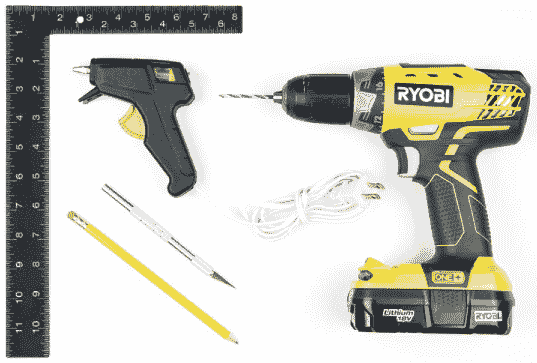

### 新组件：按钮

本项目围绕两个组件：LED 和按钮。按钮开关是 Arduino 引脚的*输入*，这意味着该草图可以对该引脚上的电压变化作出反应。像按钮这样的输入设备让你可以创建人们可以互动的电路。

#### 按钮如何工作

有很多种按钮，但它们的工作原理都类似。*按钮*实际上是一个电气开关。像图 4-4 中显示的按钮是小型的弹簧加载设备，当你施加压力时，它将两个端口电连接起来，类似于你键盘上的按键。而且它们无处不在——遥控器、车库门开门器、咖啡机、收音机、游戏手柄等！

**图 4-4：** 各种按钮

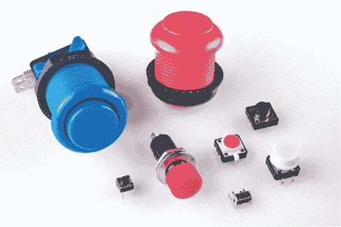

这些巧妙的输入设备内部其实非常简单。图 4-5 展示了按钮和开关的示意图。

**图 4-5：** 按钮和开关的示意图

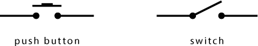

当你翻动开关时，内部的一块金属闭合了两个接触点之间的间隙，就像一个门一样。当你按下按钮时，金属直线向下推动，桥接了这个间隙。找到这个项目所需的按钮，并仔细检查它。即使图 4-5 中的示意图仅显示了两个接触点，绝大多数面包板用的标准按钮都有四根引脚。图 4-6 则展示了更准确的内部接触点示意图，并且展示了类似按钮在面包板上的样子。当你将按钮插入时，引脚应该跨越面包板中间的槽口。

**图 4-6：** 按钮示意图和按钮正确放置在面包板上，脚插入槽口两侧

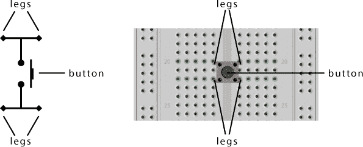

按钮在项目中是非常好的输入设备，因为每个人都知道它们是如何工作的。按钮连接到 Arduino 电路也相对简单。让我们看看它是如何工作的。

#### 与按钮一起使用电阻

要将任何按钮用作 Arduino 的输入，你需要使用像图 4-7 中的*上拉电阻电路*。上拉电阻的一端连接到电源，另一端连接到输入组件（如按钮）。需要检测输入的电路部分连接在电阻和按钮的交点处。

在图 4-7 所示的配置中，电阻将 5 V *拉*到 Arduino 引脚的默认电压 *升高* 到 5 V，这被认为是 `HIGH`。当按钮被按下时，会在 Arduino 引脚和地之间创建一个通路，Arduino 引脚读取 `LOW` 电压。之所以有效，是因为电流总是沿着电阻最小的路径流动：当按钮没有按下时，Arduino 引脚上的 10 kΩ 电阻是电流唯一能通过的路径，而当按钮 *按下* 时，它提供了一个几乎没有电阻的路径。

**图 4-7：** 上拉电阻和按钮电路

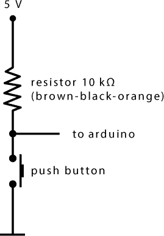

### 构建反应计时器原型

反应计时器结合了类似于前面项目中的 LED 电路和图 4-7 中的按钮电路，组成了图 4-8 中的超级电路，点亮 LED 并检测按钮按压。

**图 4-8：** 反应计时器原型的电路图


拿出你的面包板，按照图 4-9 和 4-10 所示，接一个 LED 和一个按钮。你将使用这个原型来测试你的代码，然后再构建最终的反应计时器。

**图 4-9：** 反应计时器电路接线图

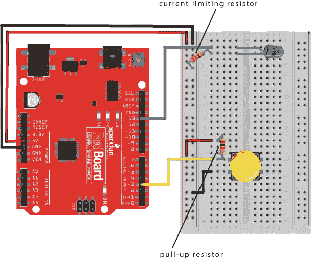

**图 4-10：** 带有单个按钮和单个 LED 的反应计时器最终原型电路


在连接这个电路时，请注意两种不同的电阻值：LED 为 330 Ω，按钮为 10 kΩ。（有关如何根据颜色带确定电阻值的详细信息，请参见“电阻器和色带”第 308 页。）LED 上的电阻是限流电阻，应连接到地，而按钮上的电阻是上拉电阻，将引脚 3 连接到 5 V。但没有代码，你的电路什么也做不了，现在我们来看一下代码。

### 编程反应计时器

随着草图和电路的复杂化，你会发现按顺序列出 Arduino 要执行的每个动作会有助于整理思路。一些程序员把这样的列表称为*伪代码*。以下是我们为反应计时器编写的伪代码：

1. 在打开 LED 之前，等待一个随机时间（以防预测/作弊反应计时器）。

2. 打开 LED。

3. 记录起始时间。

4. 启动计时器，等待按钮按下。

5. 按下按钮时，计算反应时间，即计时器值减去起始时间。

6. 返回时间。

很简单，对吧？我们打开 Arduino，看看草图。

#### 编写 setup() 函数

打开一个新的草图，输入初始化和`setup()`代码，如清单 4-1 所示。

**清单 4-1：** 反应计时器的`setup()`和初始化代码

```
➊ unsigned int waitTime;   //random wait time before
                           //turning on LED
  unsigned int startTime;  //zero reference time
  unsigned int reactTime;  //calculated reaction time

  void setup()
  {
➋   **Serial**.begin(9600);   //sets up serial
                           //communication
    pinMode(13, OUTPUT);   //sets pin 13 as an OUTPUT for the
                           //stimulus LED
➌   pinMode(3, INPUT);     //sets pin 3 as an INPUT for the
                           //button
  }
```

**注意**

*`unsigned int`* *数据类型可以存储从 0 到 65,535（2¹⁶ – 1)的值。*

首先，命名空间定义了三个`unsigned int`变量 ➊，用来存储`waitTime`、`startTime`和`reactTime`值。

接下来是`setup()`函数，它有一个新指令：`Serial.begin(9600)` ➋。确保将`Serial`大写，并且`Serial`、句点和`begin`之间没有空格。这个指令与之前的命令略有不同，因为它有一个句点来分隔*对象*和*方法*。*对象*是计算机编程中的一个概念，类似于一种特殊类型的变量，可以执行不同的功能或操作。这里的`Serial`是我们正在使用的对象名称。一个对象可以执行的功能叫做*方法*。`begin()`方法初始化或启动*串口通信*，使得 Arduino 和计算机之间能够通过 USB 线进行数据传输。对于这个命令，括号中的数字`9600`设置了通信速率为 9,600 位每秒（或*波特率*）。Arduino 将使用串口通信将你的反应时间报告回计算机。`Serial`对象还有许多其他方法，我们将在本书中介绍，用于处理计算机和 Arduino 之间的数据。

最后，你将设置引脚。本项目使用第 13 号引脚上的一个 LED 指示何时按下按钮，因此你再次使用`pinMode()`函数将第 13 号引脚设置为`OUTPUT`。然后使用`pinMode()`函数 ➌ 将第 3 号引脚设置为`INPUT`。这里使用`INPUT`是因为 Arduino 需要能够检测按钮按下的动作，而不是向按钮输出信号。

#### 编写 loop()函数

现在让我们编写草图中的`loop()`部分。在`setup()`函数后，输入 Listing 4-2 中的代码。

**Listing 4-2：** 反应计时器的`loop()`函数

```
  void loop()
  {
  //prints the challenge instructions
➊   **Serial**.println("When the LED turns on, push the button!");
    **Serial**.println("Now, watch the LED. Ready?");
➋   waitTime = random(2000, 4000); //random wait time
                                   //from 2000 to 4000 ms
➌   delay(waitTime);               //delay random wait time

    //turn on the LED!
    digitalWrite(13, HIGH);

    startTime = ➍millis(); //set zero time reference
    //loop to wait until button is pressed
➎   while(digitalRead(3) == HIGH)
    {
    }

➏   reactTime = millis() - startTime; //calculation of
                                      //reaction time
    digitalWrite(13, LOW);            //turn off LED!

    //display information to Serial Monitor
➐   **Serial**.print("Nice job! Your reaction time was ");
➑   **Serial**.print(reactTime);
➒   **Serial**.println(" milliseconds");
    delay(1000);  //short delay before starting again
  }
```

首先，这段代码使用`Serial.println()`方法 ➊ 显示一条消息提示，解释如何玩游戏。`println()`方法将文本发送到计算机，并添加一个换行符，使光标向下一行移动。当调用此方法时，任何在引号（`" "`）中的文本都会显示在 Arduino IDE 的串口监视器上。串口监视器就像一个简单的聊天窗口或*终端*，允许你在 Arduino 和计算机之间发送和接收数据。你可以通过点击 Arduino IDE 右上角的放大镜按钮（如图 4-11 所示），点击工具 ▸ 串口监视器，或使用快捷键 CTRL-SHIFT-M 来打开串口监视器。

**图 4-11：** 通过 Arduino IDE 打开串口监视器


我们稍后会查看串口监视器。

##### 生成延迟时间

为了使反应计时器更加不可预测，草图调用 `random()` 函数 ➋ 来生成一个随机的 `waitTime`。`random()` 函数接受最小值和最大值作为参数，并返回一个 *伪随机数*（看似随机但实际上不是；在 “尝试：让 `waitTime` 更加随机” 第 109 页中有更详细的解释）。在这个示例中，`waitTime` 变量被设置为介于 2,000 和 4,000 之间的“随机”数，并在 LED 灯亮起之前传递给 `delay()` ➌。这样可以防止你和你的朋友预测按钮的按下时机。

当 LED 灯亮起时，调用 `millis()` 函数 ➍ 来捕获起始时间。`millis()` 函数检查 Arduino 的内部计时器，并返回自 Arduino 开机或重置以来的毫秒数。`millis()` 函数对于任何涉及计时的 Arduino 项目都非常有用。

##### 检查带有 while() 循环的按钮

在获取起始时间后，草图使用 `while()` 循环 ➎ 等待按钮按下。在 Arduino 中，像许多其他编程语言一样，`while()` 循环只要括号中的表达式为 `true`，就会运行其大括号内的代码。在这种情况下，表达式是

```
digitalRead(3) == HIGH
```

`digitalRead()` 命令读取括号中指定引脚的电压，并根据是否检测到 5V 或 GND 返回 `HIGH` 或 `LOW` 的值。此调用检查引脚 3 的电压。还记得那个按钮上的上拉电阻吗？按钮的正常状态是开路，默认情况下引脚为 `HIGH`，直到按下按钮闭合电路。当按下按钮时，引脚 3 连接到地面，状态变为 `LOW`。双等号 (`==`) 用于检查相等性。（参见 “逻辑比较运算符” 第 106 页。）

只要按钮没有被按下，表达式为 `true`，`while()` 循环就会重复，从而阻止草图执行后续代码。不过请注意，循环内实际上没有任何代码。这被称为 *保持* 或 *阻塞循环*，它并不执行任何代码，而是仅仅阻止其他代码的执行。当按钮被按下时，表达式变为 `false`，草图继续执行。

##### 计算并显示反应时间

接下来，草图通过从当前计时器值中减去 `startTime` 来计算反应时间 ➏，当前计时器值通过 `millis()` 命令获取。

最后一步，关闭 LED，并将 `reactTime` 值打印到串口通信线上。为了使信息更易读，草图使用 `Serial` 对象的 `print()` 方法➐ 将字符串 `"Nice job! Your reaction time was "` 打印到串口监视器。这种方法发送括号中的文本，并且不会将光标移动到新的一行。实际上，它会保持光标在同一行，以便你可以追加更多信息，比如实际的反应时间，后者通过 `Serial.print(reactTime);` 在 ➑ 处添加。然后，通过调用 `println()` 方法 ➒ 完成句子，这将打印字符串 `" milliseconds"`，并将光标移到新的一行。

**逻辑比较运算符**

*逻辑比较运算符* 执行将一个值与另一个值进行比较的操作。例如，双等号（`==`）比较两个值是否相等。逻辑运算只能返回两种值中的一种：`true`，表示比较正确，或者 `false`，表示比较不正确。在 Arduino 中，有很多方法可以比较两个值，所有的运算符如下表所示：

| **运算符** | **比较** |
| --- | --- |
| `==` | 等于 |
| `!=` | 不等于 |
| `>` | 大于 |
| `>=` | 大于或等于 |
| `<` | 小于 |
| `<=` | 小于或等于 |

例如，如果你在 Arduino IDE 中输入 `2 == 4`，它会返回 `false`，因为二者不相等。但是，如果你在 Arduino IDE 中输入 `2 <= 4`，它会返回 `true`，因为二者小于或相等。在草图中，比较运算符通常与 `if()` 或 `while()` 语句一起使用，根据某个条件执行特定的代码块。例如，清单 4-2 中的 `while()` 循环写道：“当 `digitalRead(3) == HIGH` 为 `true` 时，重复执行保持循环；否则，跳到下一段代码。”

一个常见的错误是错误地使用单等号进行比较。记住：单等号用于赋值，而双等号用于比较两个值。

随着你开始评估 Arduino 从各种传感器和输入中收集的数据，你将越来越多地使用比较运算符，接下来我们也会在本章中使用其中的一些。

请注意，每个字符都必须显式打印，包括数字或字符之间的空格。你可以使用 `print()` 和 `println()` 方法，如本示例所示，来组合、格式化或组织你在串口监视器中显示的文本。

`loop()` 函数中的最后一行代码是一个简短的 `delay()` 函数，用于在草图回到起始位置并重新开始反应计时器之前暂停。

**特殊命令字符**

打印数据或文本时，必须表示每个单独的字符，包括空格，以及代码中的每个格式化命令。有一组保留字符，称为 *转义序列*，用于表示特殊格式。例如，`\n` 将光标移动到新的一行；因此，`Serial.print("Hello Arduino!\n");` 等同于 `Serial.println("Hello Arduino!");`。

你可以在 `print` 语句中使用转义序列，向文本中添加格式或其他特殊字符。下表列出了一些有用的转义序列。

| **转义序列** | **结果** |
| --- | --- |
| `\t` | 制表符 |
| `\n` | 换行 |
| `\'` | 单引号 |
| `\"` | 双引号 |
| `\x*hh*` | ASCII 字符，其中 `*hh*` 是十六进制数 |

#### 测试反应计时器草图

这就是你需要测试反应计时器游戏电路的所有代码！现在保存你的草图，编译并上传到你的 Arduino。要查看草图通过串行通信线路发送的数据，请通过点击 **工具 ▸ 串口监视器** 或 IDE 右上角的放大镜按钮打开串口监视器窗口。

注意，串口监视器右下角有一个下拉菜单，可以控制串行数据速率，以 *波特率*（每秒位数）表示，默认值为 9,600 波特（见 图 4-12）。这是此草图用于初始化 `Serial` 对象的相同值，使用 `Serial.begin(9600)` 指令。请始终检查串口监视器的速度是否与草图中 `Serial.begin()` 设置的速率相同，否则你可能会看到乱码！

**图 4-12：** Arduino IDE 的串口监视器窗口测试反应计时器


**注意**

*某些组件，例如 GPS 或串行启用的 LCD 屏幕，可能会以不同的波特率与 Arduino 通信，因此在使用新部件时，最好检查它使用的速率并在草图中进行设置。*

你可以将串行数据速率设置为从 300 到 250,000 波特的任何标准速率，但 9,600 波特是最常用的速度。一般来说，较慢的速度更可靠，消耗的功率和资源较少，但也会引入延迟，减缓 `loop()` 的执行速度。如果你需要非常快速的响应并且不太在乎功耗，你可以使用更高的波特率。

现在，让我们开始吧！运行草图并仔细观察你的 LED。当它亮起时，按下按钮。你的代码将把你的反应时间（毫秒为单位）打印到串口监视器上，就像 图 4-12 中所示的那样。你有多快？快去挑战你的朋友吧！平均反应时间约为 215 毫秒。*你*的表现如何？

**试一试：使等待时间更随机**

在大多数数字设备，如 Arduino 中，很难获得一个*真正*的随机数，因为随机数是通过数学计算生成的。在 Arduino 上，每次调用`random()`函数时，函数会基于上次`random()`的结果进行计算。由于下一个“随机”数是由上一个结果计算得出的，因此数字序列将始终相同。

例如，在我们的 Arduino 上（也可能是你的），第一次调用`random(2000, 4000)`总是将`waitTime`设置为`2807`。第二个生成的数字总是`3249`，第三个是`2073`，依此类推。

你可以通过在`setup()`函数中调用`randomSeed()`来让`waitTime`值看起来更随机。这会生成一个*种子*值，告诉`random()`伪随机序列应该从哪里开始。当你的 Arduino 开始运行草图时，种子默认为`1`，这就是为什么`random(2000, 4000)`调用时`2807`总是第一个生成的数字。

为了让你的反应计时器表现得更随机，在`setup()`例程中，在闭合大括号前添加这一行代码：

```
randomSeed(analogRead(A5));
```

这会用 Arduino 模拟引脚 A5 上的当前电压值来为随机数生成器提供种子。我们将在第五章详细讨论`analogRead()`，但现在只需知道它读取传入的模拟引脚上的电压水平。因为引脚 A5 在反应计时器中没有连接到任何东西，所以电压会*浮动*，或者说有些不可预测地波动。

如果你选择添加这行代码，那么每次运行草图时，第一次调用`random(2000, 4000)`应该会返回不同的数字。为确认这一点，在你的草图中的`delay(waitTime)`调用后添加以下两行代码：

```
**Serial**.print("waitTime = ");
**Serial**.println(waitTime);
```

现在，通过在行首添加`//`来注释掉`randomSeed()`调用，运行你的草图几次，并记录初始的`waitTime`值。取消注释`randomSeed()`调用并重复这个过程。随着时间的推移以及大量数据点的累积，仍然会出现模式，但那是另一本书的内容——或者可能是计算机科学学位的内容！

#### 再玩一次？

要再玩一次，只需按下 Arduino 的重置按钮——即板子角落附近的黄铜色按钮，如图 4-13 所示。这将重新启动你的代码并让你再玩一次。仔细观察 LED。你变得更快了吗？

**图 4-13：** 按下重置按钮再玩一次。

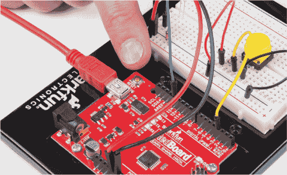

#### 添加一个游戏元素

要为这个项目增加一点嘉年华游戏的风格，你可以添加一个视觉速度指示器，用来显示你是否比给定的反应时间更快。我们建议以平均反应时间 215 毫秒作为挑战目标。为了实现这一点，你需要再添加两个 LED 灯：一个绿色 LED 表示你比代码设置的时间快，另一个红色 LED 表示你较慢。由于你已经使用了 13 号引脚连接刺激 LED，所以你将把这两个 LED 连接到 11 号和 12 号引脚。将它们按照图 4-14 和图 4-15 所示连接到面包板上。

**图 4-14：** 带有两个额外 LED 的电路图

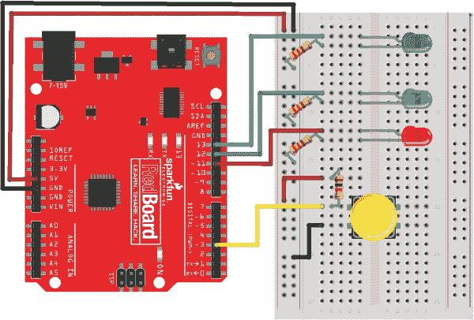

**图 4-15：** 新电路的完整接线图，包含两个额外的 LED

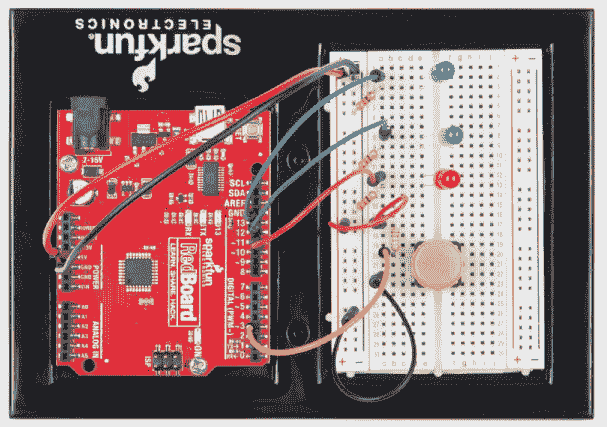

##### 更新代码以支持额外的 LED

既然你已经有了这两个指示 LED，你需要再添加一些代码行，用于在你的反应时间比目标时间快时点亮绿色 LED，在反应时间不如目标时间时点亮红色 LED。

你需要为 12 号和 11 号引脚添加`pinMode()`命令，并将其设置为`OUTPUT`，以控制你的新 LED。对`setup()`函数的修改见列表 4-3（现有代码用浅灰色显示）。

**列表 4-3：** 添加了额外速度指示 LED 的反应计时器`setup()`函数修改版

```
void setup()
{
  Serial.begin(9600);   //sets up serial
                        //communication
  pinMode(13, OUTPUT);  //sets pin 13 as an OUTPUT for the
                        //stimulus LED
  pinMode(12, OUTPUT);  //sets pin 12 as an OUTPUT for the
                        //green LED
  pinMode(11, OUTPUT);  //sets pin 11 as an OUTPUT for the
                        //red LED
  pinMode(3, INPUT);    //sets pin 3 as an INPUT for the
                        //button
}
```

你只是插入了两个额外的`pinMode()`指令，用于配置你将要添加的两个 LED。

##### 使用 if()和 else()控制流程

现在，你需要在你的代码中加入一些决策逻辑。在 Arduino 编程中，`if()`语句允许你控制代码的执行方向和流程。它告诉代码：“如果这个条件成立，就执行以下大括号内的代码。”`if()`语句的一般语法见列表 4-4。

**列表 4-4：** Arduino 中的通用`if()`语句

```
  if(➊*expression*)  //if *expression* is true, run the code in
                   //the following loop
    {
    ➋
    }
➌ else //otherwise, run the code in this loop instead
    {
    ➍
    }
```

*`expression`* ➊ 是一个布尔表达式，可以是`true`或`false`，类似于我们在“逻辑比较运算符”一节中讨论过的内容，见第 106 页。如果表达式为`true`，程序将开始执行大括号之间的代码 ➋。如果表达式不为`true`，程序将跳过大括号，直接执行下一个语句。通常，`if()`语句会和`else` ➌一起使用。如果表达式不为`true`，程序将跳过第一组大括号 ➋，继续执行`else`语句中的代码 ➍。

在反应计时器游戏中，你将使用`if()`语句来控制绿色 LED 在反应时间小于或等于 215 毫秒时点亮，红色 LED 在反应时间大于 215 毫秒时点亮。你可以更改这个值，来调整游戏难度，但现在这个值是一个不错的中等难度。列表 4-5 展示了实现此功能的代码。

**列表 4-5：** 反应计时器游戏的`if()`语句代码片段

```
➊ if (➋reactTime <= 215)
  {
➌   digitalWrite(12, HIGH);  //green LED ON
➍   digitalWrite(11, LOW);   //red LED OFF
  }
➎ else
  {
    digitalWrite(12, LOW);   //green LED OFF
    digitalWrite(11, HIGH);  //red LED ON
  }
```

你可以看到➊，草图使用了`if()`语句来执行这个逻辑。布尔表达式`reactTime <= 215` ➋，检查`reactTime`的值是否小于或等于`215`，如果是，绿灯就会亮起➌。当绿灯亮起时，红灯需要关闭，所以你会加上一条额外的指令➍来关闭它。最后，你加上`else`语句➎来在`if()`语句为`false`时点亮红灯。

#### 上传完整的反应计时器代码

新的`if()`语句应放置在`loop()`中，紧接着关闭红色 LED 的代码，如清单 4-6 所示。（*`snip`*表示页面中由于篇幅问题省略的现有代码位置。）

**清单 4-6：** 为绿灯和红灯游戏指示器添加`if()`语句

```
--*snip*--

  //loop to wait until button is pressed
  while(digitalRead(3) == HIGH)
  {
  }

  reactTime = millis() - startTime;  //calculation of reaction
                                     //time

  digitalWrite(13, LOW);             //turn off LED!

  if (reactTime <= 215)
  {
    digitalWrite(12, HIGH);  //green LED ON
    digitalWrite(11, LOW);   //red LED OFF
  }
  else
  {
    digitalWrite(12, LOW);   //green LED OFF
    digitalWrite(11, HIGH);  //red LED ON
  }

//display information to Serial Monitor
--*snip*--
```

在添加完新代码后，将整个草图上传到你的 Arduino。打开串口监视器并进行游戏，确保一切按预期运行。你能让绿灯亮起来吗？你得够快！

**玩转游戏：控制难度**

和所有游戏一样，反应计时器有时也需要调整难度级别。既然你是程序员，你就能控制游戏。如果 215 毫秒太快或太慢，你可以通过更改`if (reactTime <= 215)`中的数字来调整游戏的*阈值*。

想要让它几乎不可能被击败吗？把这个值改成像 100 毫秒这样的小数值。想要让它变得简单点？改成像 500 毫秒这样的数字。你在写代码，所以你可以决定游戏的规则！

### 构建反应计时器外壳

当你的原型工作正常时，是时候构建一个更永久的外壳了。为了尽可能简化这个项目，我们版本的反应计时器设计为适合放入一个小的 SparkFun 盒子。盒子的顶部尺寸为 3 7/8 英寸×5 英寸，但你可以将游戏放进家里任何现有的东西里——一个旧的谷物盒、燕麦容器或任何其他结实的纸板物品。

我们让我们的反应计时器看起来像一个老式的嘉年华游戏，配上我们找到的一些有趣的剪贴画，但你可以根据自己的喜好来设计外观。图 4-16 展示了我们盒子外部的模板。这个设计中有一个按钮孔、一个刺激 LED 孔和两个指示 LED 孔——一个显示你比忍者还快，另一个显示你像乌龟一样慢。你可以通过本书的资源下载模板，链接在* [`www.nostarch.com/arduinoinventor/`](https://www.nostarch.com/arduinoinventor/)*，或者直接在盒子上随便切割 LED 和按钮的孔。

**图 4-16：** 反应计时器嘉年华游戏封面艺术模板（非完整尺寸）

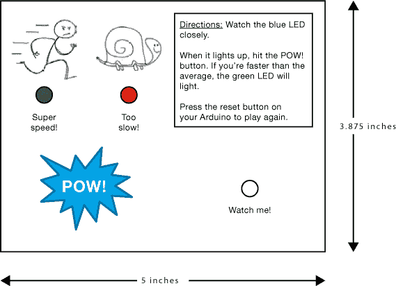

#### 剪裁纸板

如果你使用我们的模板，先打印出来，然后将它粘贴或用胶带固定在盒子的前面。不论是否使用模板，你都需要在纸板上打四个孔，用于三个 LED 和一个按钮。你可以使用工艺刀或电钻*小心*地切出孔洞，如图 4-17 所示。LED 的直径是 5 毫米，所以使用 3/16 英寸的钻头比较合适。对于按钮孔，我们建议使用 5/16 英寸的钻头，如果你在钻孔，也可以用一支尖锐的铅笔。

**图 4-17：** 从纸板盒中切出孔洞

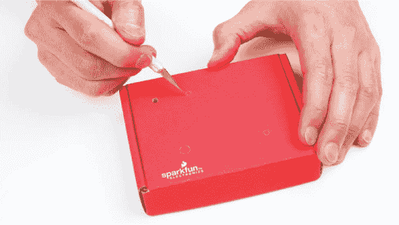

#### 组装电子元件

现在你已经从反应计时器盒中切出了孔洞，接下来需要添加电子元件。你将把三个 LED 和按钮从面包板上移动到新纸板盒的外部，这样玩家才能看到它们。

##### 将 LED 和按钮固定到纸板上

首先，从纸板的背面把 LED 插入它们的三个孔中，确保每个 LED 均紧密地固定。如果你切出的孔太大，导致 LED 有些松动，可以在孔周围加一点胶水将它们固定，如图 4-18 所示。

**图 4-18：** 将 LED 移动到项目盒/纸板上

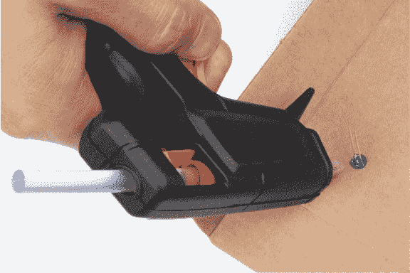

接下来，添加按钮。SparkFun 发明者工具包中的按键有一个可以拆下的按钮帽。移除按钮帽，从盒子的内侧插入按钮，并将按钮粘贴到纸板上，如图 4-19 所示。然后将按钮帽重新安装到纸板的顶部。玩家会在尽力获得最佳分数时疯狂按压这个按钮，所以一定要使用大量胶水来确保它稳固！当胶水干了之后，试试按钮。你需要能够将按钮完全按下，所以确保按下时按钮帽不会卡在纸板上。

**图 4-19：** 使用大量胶水固定按钮

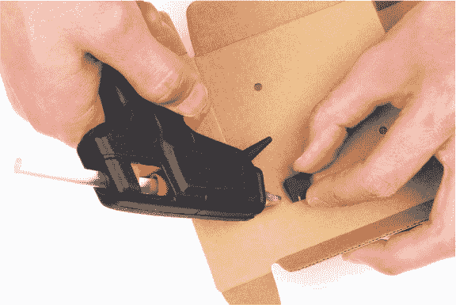

**注意**

*如果使用热熔胶，在将按钮粘贴到纸板上时要小心。热熔胶很烫！*

##### 重新连接电子元件到 Arduino

现在，使用公对母跳线将 LED 连接到面包板。记住，LED 的短腿需要连接到电路的地（GND），而每根长腿应该通过一个 330 Ω 电阻连接到 Arduino 上相应的引脚。由于 LED 的腿有点长，你可能需要用剪线钳把它们剪短。我们常用的一个方法是把短腿剪得稍微短一点，这样你就可以随时辨别哪一腿是负极腿，如图 4-20 所示。

**图 4-20：** 剪短 LED 的腿。保持短腿短！

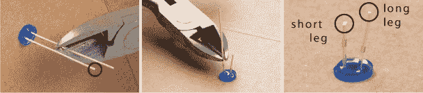

如果你分不清哪个引脚更长，还可以查看 LED 的塑料镜头形状。通常，LED 负极一侧的塑料镜头会有一个平边。这个平边虽然不明显，但如果仔细观察，你应该能看到。

将公对母跳线的母端按压到 LED 的端口上，使其紧密贴合，像图 4-21 所示。为了保持组织整洁并便于跟随，我们建议使用黑色线材连接 LED 的负极（短脚）。

**图 4-21：** 将 LED 连接到跳线

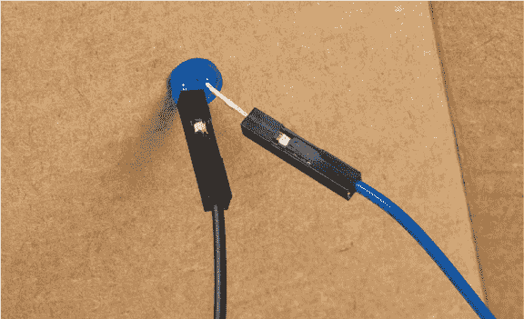

一旦跳线接入所有三个 LED 灯，将公端连接到面包板电路中。刺激 LED 的线应连接到 E2 和 E3，绿色 LED 连接到 E8 和 E9，红色 LED 连接到 E12 和 E13。

接下来，重新将按钮连接到电路中。按钮有四个引脚，但你只需要连接按钮一侧的两个引脚。将一根公对母跳线连接到一个引脚，另一根连接到另一个引脚，如图 4-22 所示。然后，将一根线插入与 10 kΩ电阻和 Arduino 引脚 3 连接的同一面包板行，另一根插入面包板的 GND。如果你的面包板原型与图 4-14 中的示意图相同，那么请将这些线连接到面包板的 E20 和 E22 上。因为按钮只是一个开关，所以接入 GND 的线不需要特别注意。

**图 4-22：** 将公对母跳线连接到按钮一侧的两个引脚


当所有组件就位后，将 Arduino 连接到计算机并打开串口监视器，确保电路仍然工作。你应该能在串口监视器上看到指令信息。当蓝色 LED 亮起时，尽可能快地按下按钮。串口监视器应显示你的反应时间，并且红色或绿色 LED 应亮起，具体取决于你的反应速度。

如果你的电路似乎不工作，请检查所有连接是否牢固，并将电路与图 4-14 和图 4-15 进行对比，确保连接正确。

#### 装饰你的游戏外壳

最后，为你的新游戏添加一些装饰。发挥你的想象力！你可能想用你喜欢的贴纸装饰反应计时器，或者给盒子涂上颜色。我们在项目中喜欢使用乒乓球，因为我们在项目 2 中剩下了一个半个，所以我们决定把它粘在蓝色 LED 上面，像图 4-23 所示。

**图 4-23：** 以狂欢节为主题的反应计时器游戏

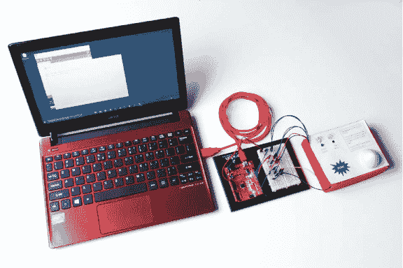

### 深入探索

接下来，尝试将前面三个项目中的所学与这个项目的知识结合起来，使游戏更有趣——加入更多的 LED，或者将游戏改造成适合两名玩家。

#### 技巧

添加两个额外的 LED，制作一个四 LED 的速度显示条，以更准确地显示你的反应速度。更快的反应时间将点亮更多的 LED。为了实现这一点，你将需要使用嵌套的 `if()`–`else if()` 控制语句。你可以堆叠条件语句，让代码根据不同的条件做出相应的处理，因此如果第一个逻辑表达式为 `false`，则会测试下一个；如果那个也为 `false`，则继续测试下一个，以此类推，直到最后的 `else()` 语句执行，如果之前的条件都没有为 `true`。列表 4-7 展示了这种条件逻辑的示例。假设你已经添加了两个额外的 LED，分别连接到 10 和 9 引脚。不要忘了你需要在 `setup()` 中添加的 `pinMode()` 命令！

**列表 4-7：** 嵌套的 `if()–else if()` 语句片段

```
➊   if (reactTime <= 215)
    {
      //turn all LEDs on
      digitalWrite(12, HIGH);
      digitalWrite(11, HIGH);
      digitalWrite(10, HIGH);
      digitalWrite(9, HIGH);
    }
➋   else if (reactTime <= 250)
    {
      //turn three LEDs on
      digitalWrite(12, LOW);
      digitalWrite(11, HIGH);
      digitalWrite(10, HIGH);
      digitalWrite(9, HIGH);
    }
➌   else if (reactTime <= 300)
    {
      //turn two LEDs on
      digitalWrite(12, LOW);
      digitalWrite(11, LOW);
      digitalWrite(10, HIGH);
      digitalWrite(9, HIGH);
    }
➍   else
    {
      //turn one LED on
      digitalWrite(12, LOW);
      digitalWrite(11, LOW);
      digitalWrite(10, LOW);
      digitalWrite(9, HIGH);
}
```

➊ 处的 `if()` 语句检查反应时间是否小于或等于 215 毫秒，并点亮所有四个 LED。然后，两个 `else if()` 语句分别处理 215 毫秒至 250 毫秒 ➋ 之间的时间，点亮三个 LED，以及 250 毫秒至 300 毫秒 ➌ 之间的时间，点亮两个 LED。最后，一个 `else` 语句 ➍ 处理所有超过 300 毫秒的时间，并点亮一个 LED。

如果你需要更多的代码帮助，请查看我们在资源中提供的示例草图，地址为 *[`www.nostarch.com/arduinoinventor/`](https://www.nostarch.com/arduinoinventor/)*。

#### 修改

修改这个项目的一种有趣方式是将其变成两人游戏。你可以添加第二个按钮，并重新利用你的 LED 来显示哪个玩家更快。在这个修改中，如果玩家 1 更快，绿色 LED 会亮起；如果玩家 2 更快，红色 LED 会亮起。

首先，添加第二个按钮。图 4-24 显示了面包板底部的附加按钮。请注意，它只是你为第一个按钮构建的上拉电阻/按钮组合电路的重复。

**图 4-24：** 为两人模式添加第二个按钮

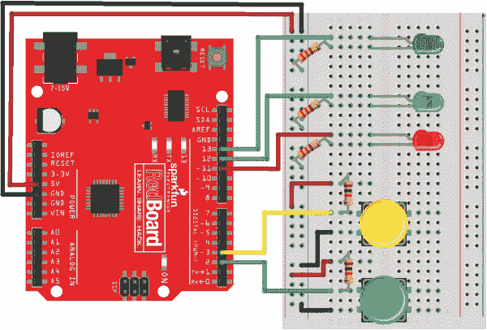

**注意**

*如果两个玩家恰好同时按下按钮，游戏会偏向玩家 1（绿色 LED）。虽然这种情况非常罕见，但如果两个按钮同时按下，你会如何修改代码，让两个 LED 都亮起呢？*

两人游戏模式的完整代码可用，并附有修改的接线图，详见 *[`www.nostarch.com/arduinoinventor/`](https://www.nostarch.com/arduinoinventor/)*。

现在，去把你新的游戏带到城里吧。你比家里的人快吗？你比朋友们快吗？你认识的最快的人是谁？
