## 第六章：5 A 彩色混合夜光灯

数字电子学和微控制器的奇妙之处在于它们很聪明。它们能够读取传感器并根据传感器告诉它们的信息做出决策。传感器是收集周围环境信息并将其转化为微控制器能够理解的形式的组件。

你可以使用传感器制作对各种刺激（如温度、声音和物体接近度）作出反应的项目，但在这个项目中，我们将从一个简单的夜光灯开始，它会对光线变化做出反应，如图 5-1 所示。

**图 5-1：** 完成的夜光灯项目

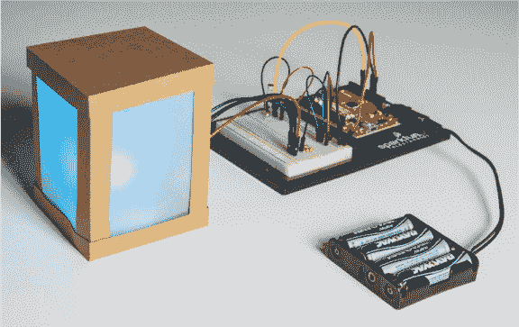

### 收集的材料

这个项目使用了一种新型 LED 和*光敏电阻*，这是一种根据检测到的光线强度变化而改变电阻值的传感器。我们鼓励你发挥创意，设计一个定制的灯罩，但如果你还不准备迎接这个挑战，也不必担心！本书的资源文件包括一个可以开始使用的灯罩设计。图 5-2 和图 5-3 展示了你在此项目中所需的零件和设备。

#### 电子零件

**注意**

*带星号（*）的零件不包含在标准的 SparkFun 发明者套件中，但可以在单独的附加套件中获得。*

• 一块 SparkFun RedBoard（DEV-13975）、Arduino Uno（DEV-11021）或其他兼容 Arduino 的板子

• 一根 USB Mini-B 电缆（CAB-11301，或你板子的 USB 电缆；未显示）

• 一块无焊面包板（PRT-12002）

• 一块迷你面包板（PRT-12043*；未显示）

• 一只 RGB LED，共阴极（COM-09264）

• 三个 330 Ω电阻（COM-08377，或者 20 个装的 COM-11507）

• 一只 10 kΩ电阻（COM-08374，或者 20 个装的 COM-11508）

• 一块光敏电阻（SEN-09088）

• 公对公跳线（PRT-11026）

• 短 4 英寸的公对公跳线（PRT-13870*）

• （可选）公对母跳线（PRT-09140*）

• （可选）一只 4 节 AA 电池架（PRT-09835*；未显示）

**图 5-2：** 夜光灯的组件

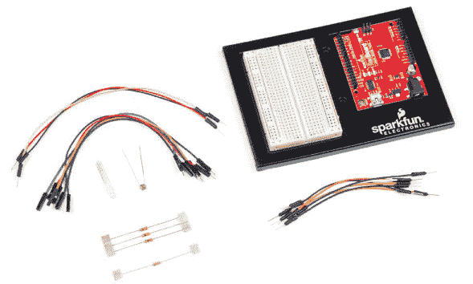

#### 其他材料和工具

• 工艺刀

• 金属尺

• 胶水（热熔胶枪或工艺胶水）

• 一张卡纸（不是纸板），约 8.5 × 11 英寸

• 一张白色或半透明的羊皮纸，或者标准的复印纸，约 8.5 × 11 英寸

• 外壳模板（见图 5-20 第 144 页）

**图 5-3：** 夜光灯的推荐建筑材料

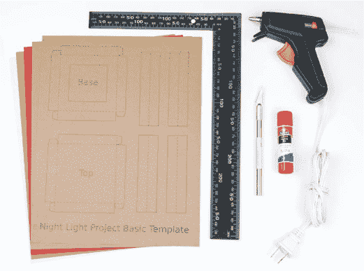

### 新组件

在这个项目中，你将使用两种新组件：一种将三种颜色集成在一个包中的 LED，以及一个光敏电阻。我们来看看这些组件是如何工作的。

#### RGB LED

如果你已经做过本书中的其他项目，那么你已经有了使用普通 LED 的经验。图 5-4 中显示的*红色、绿色、蓝色（RGB）* LED 工作方式非常相似。这个 LED 实际上是三只 LED 合在一个外壳中的：一只红色、一只绿色和一只蓝色。每个 LED 都有自己的正极（或阳极）引脚，但它们都共享一个负极（或阴极）引脚，称为*公共阴极*。

如果仔细观察图 5-4 中的 LED，你会注意到它的引脚长度各不相同。对于普通的 LED，短引脚是负极引脚，但对于 RGB LED，最长的引脚是负极引脚。这个元件的电路图通常像图 5-5 那样绘制。请注意，它显示了三个独立的 LED 被连接在一起，它们共享一个负极连接。

**图 5-4：** 带公共阴极引脚的 RGB LED

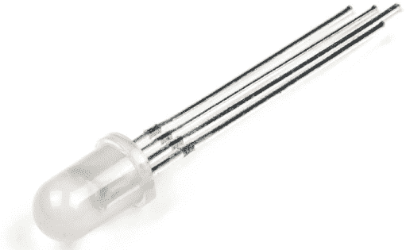

**图 5-5：** RGB LED 的电路图

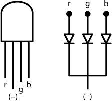

要弄清楚这个特定 LED 哪个正极对应哪种颜色，可以将 LED 定位为图 5-5 中所示的样子。在这种方向下，最左边的引脚是红色正极引脚。接下来的引脚（最长的）是共享的负极引脚，最后两个引脚分别是绿色和蓝色的正极引脚。

记住哪个正极对应哪种颜色后，你可以像连接三个独立的 LED 一样将这个 LED 接入电路。只需要将你想使用的正极引脚连接到电源或 Arduino 输出引脚，串联一个限流电阻，再将公共阴极连接到地线。

RGB LED 很酷，因为你可以用它们创建大量的颜色。红色、绿色和蓝色是加色法中的三原色，LED 可以混合这些颜色来创造其他颜色的光。（这与*原色颜料*——红色、蓝色和黄色——不同，后者在你从小学美术课上可能记得，混合在一起可以在油漆中创造新的颜色。）图 5-6 中的加色环展示了三原色如何组合来创造彩虹中的任何颜色。

**图 5-6：** 加色环

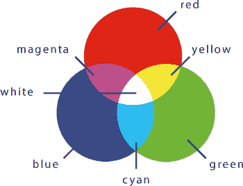

使用你的 RGB LED，如果同时点亮蓝色 LED 和红色 LED，你会得到品红色光。将红色和绿色 LED 结合在一起，你会得到黄色。如果所有 LED 都亮起，你会得到白色光。这一概念是 LED 电视或显示器工作的基础：你屏幕上的每个像素本质上是一个 RGB LED。

#### 光敏电阻

这个夜光灯在黑暗的房间里会打开，在光线充足的房间里会关闭。这意味着夜光灯需要判断房间是否黑暗。为此，它使用光传感器来监测周围的光照水平。有许多不同的光传感器可以选择，但我们使用了如图 5-7 所示的简单光敏电阻。这个组件有时也被称为*光敏电阻（LDR）*或*光电池*。另外，类似于许多其他类型的传感器，光敏电阻有时也被称为*可变电阻传感器*。

在这个项目中，光敏电阻的电阻值从约 80 Ω 到约 1,000,000 Ω（1 MΩ）变化，具体取决于其所接收的光照强度。当光敏电阻暴露在强光下时，它的电阻较低，而在黑暗中时，它的电阻较高。

**图 5-7：** 一只光敏电阻

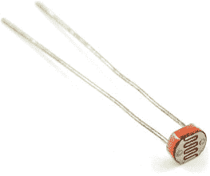

要使用光敏电阻来测量亮度，必须将其放置在如图 5-8 所示的*电压分压*电路中。电压分压电路使用两个串联连接的电阻（即串联在电源电压 5 V 和地之间）来获得较小的电压。

**图 5-8：** 电压分压电路

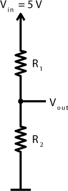

这两个电阻上的总电压为 5 V，而*R*[1]和*R*[2]上的电压取决于两个电阻的阻值比。*V*[out]将是介于 5 V 和 0 V 之间的某个电压，因为电压在这两个电阻之间分配。*V*[out]与电阻值 *R*[1] 和 *R*[2] 之间的关系可以通过以下方程式来表示。

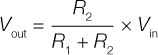

我们知道你在想什么：看起来像数学！嗯，确实是，而且数学是电子学中的一个重要部分，但它并不复杂。我们会慢慢来，确保每个人都能理解。这个小小的方程式在处理光敏电阻或任何其他类型的电阻传感器时特别有用。在电压分压电路中，如果你用光敏电阻替代*R*[1]，就得到如图 5-9 所示的电路。

**图 5-9：** 一个带光敏电阻的电压分压电路

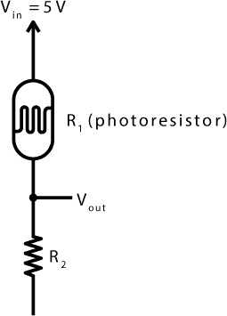

当周围光线变暗时，光敏电阻的电阻增大。现在，看看电压分压方程。当电阻*R*[1]增大时，分数的分母增大，使得整个分数变小。这意味着当光线变暗时，*V*[out]会变小。

通过这个电路，你可以通过将*V*[out]连接到 Arduino 左侧的一个模拟输入引脚（标有 A 的引脚）来准确读取光敏电阻上的光线强度。*模拟*信号是指那些可以在一定范围内变化的信号。到目前为止，你只使用了 Arduino 板右侧的*数字*引脚。与按键只有两种状态不同，光敏电阻可以根据光线的亮度和电压分压电路的影响，产生一系列的数值。这就是数字信号和模拟信号之间的区别。

这就是你需要了解的关于如何使用这个电压分压器电路的所有内容，但如果你想练习计算，参见第 130 页的“给我一些数学：电压分压器”。

**给我一些数学：电压分压器**

使用万用表，你可以在不同条件下测量光敏电阻的电阻值。（关于如何使用万用表的说明，请参见第 298 页的“用万用表测量电流”）。当我们用手电筒或手机照射光敏电阻时，测得的电阻大约为 100 Ω。当我们用手遮住光敏电阻时，测得的电阻大约为 200 kΩ。当固定电阻(*R*[2])设置为 10 kΩ时，我们预计在这两种情况下电压分压器的输出值会如下所示：

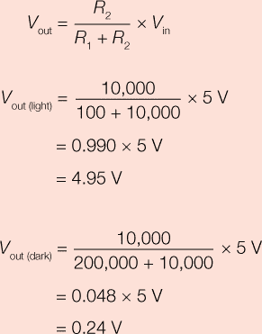

在 5V 的输入电压下，光敏电阻上的电压在不同的光照强度下从 0.24 V 变化到 4.95 V。在本章中，我们将向你展示如何使用 Arduino 读取这些电压。很酷吧？数学是有效的！

### 构建夜灯原型

让我们把 RGB LED 和电压分压器连接起来，构建夜灯电路。你将首先构建包含光敏电阻的电压分压器电路，然后添加 RGB LED。完成后，你的面包板应该像图 5-10 那样。我们还在图 5-11 中提供了一个电路图供参考。

**图 5-10：** 完成的原型电路

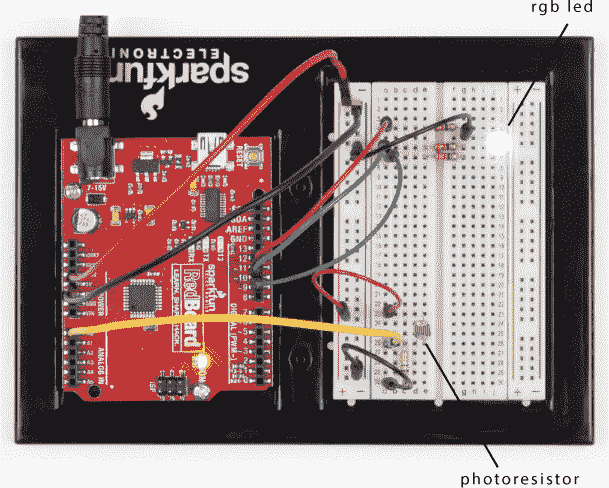

**图 5-11：** 完成的夜灯原型电路图

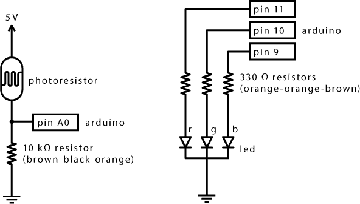

#### 接线电压分压器

找到你的光敏电阻（它应该像图 5-7 中的那样）和一个 10 kΩ的电阻。回忆一下，10 kΩ电阻的颜色带为棕色、黑色和橙色，如图 5-12 所示。有关如何通过颜色带确定电阻值的详细信息，请参见第 308 页的“电阻与颜色带”。

**图 5-12：** 10 kΩ电阻（棕黑橙）


手头有了零件后，按照图 5-13 所示搭建电压分压电路。在搭建面包板电路时，连接电源（5V）和接地是一个很好的做法，因此首先完成这一步。找到面包板左侧的接地轨（–）和电源轨（+）。将 Arduino 的 5V 引脚连接到电源轨，将 Arduino 的 GND 引脚连接到接地轨。

**图 5-13：** 完成的电压分压器，使用光敏电阻

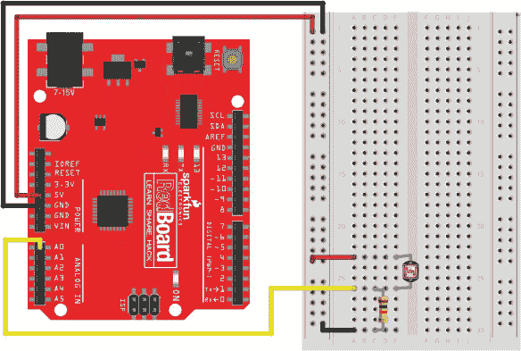

接下来，将光敏电阻插入面包板的下方，每条腿插入不同的排针中。将一端 10 kΩ电阻的一端插入与光敏电阻一条腿相同的排针中（连接两者），并将电阻的另一端插入一个单独的排针中。添加一根导线，将 5V 电源轨（+）连接到未连接电阻的光敏电阻腿。然后，添加另一根导线，将接地轨（–）连接到单独排针中的电阻腿。

最后，通过将一根导线从面包板与电阻和光敏电阻共用的排针连接到 Arduino 的模拟输入引脚 A0，将光敏电阻连接到 Arduino。这个导线通常被称为光敏电阻的输出电压线，也就是*信号线*。模拟输入引脚 A0-A5 都可以用来测量不同范围的电压。

注意，面包板电路看起来很像图 5-9 中的示意图。这是 Arduino 项目中最基本的传感器电路之一。许多其他模拟传感器，比如用于弯曲、温度和压力的传感器，也都是可变电阻。如果以后想尝试这些传感器，只需将光敏电阻替换为相应的传感器。

#### 连接 RGB LED

记得项目 2 中的红绿灯电路吗？那个项目有三个 LED。RGB LED 实际上将这三个 LED 合并在一起。RGB LED 有四条腿，其中最长的一条是公共阴极（负极）腿。按照图 5-5 中的方向摆放 RGB LED，找到红色腿。将 RGB LED 插入面包板，使红色腿位于顶部，最长的腿排在第二位置，正如图 5-14 所示。

**图 5-14：** 将 RGB LED 添加到电压分压电路中

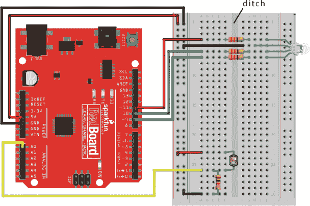

面包板的两半通过一条隔开的沟槽分开，分隔了各个排针。将 RGB LED 插入右侧，从红色引脚插入第 4 排开始。

接下来，找到三颗 330 Ω的电阻，它们的颜色带为橙色-橙色-棕色。使用这三颗电阻将红色、绿色和蓝色引脚连接过电路的沟槽，以便通向另一侧的开放行，如图 5-14 所示。电阻需要跨越沟槽，以确保电阻的两端不会直接短路。将一根线从 LED 的公共阴极（负极）引脚接到面包板左侧的地轨。最后，将 RGB LED 的三根引脚通过线缆连接到 Arduino：将 Arduino 的 11 号引脚连接到面包板上与红色引脚相连的电阻，将 Arduino 的 10 号引脚连接到面包板上与绿色引脚相连的电阻，将 Arduino 的 9 号引脚连接到面包板上与蓝色引脚相连的电阻。完成后，它应该与图 5-14 中的示意图相似。注意，红色、绿色和蓝色的线缆分别对应 LED 上的红色、绿色和蓝色正极引脚。

将 RGB LED 连接好后，你可以像控制单独的 LED 一样，通过 9、10、11 号引脚来控制每种颜色。打开 Arduino IDE，让我们来试试这个想法吧！

### 测试夜灯与基本颜色混合

在这个项目中，你将接触到一些新的概念，首先是如何使用 RGB LED 混合颜色。RGB LED 实际上是三颗 LED 组成的，你需要在代码中像对待三颗单独的 LED 那样来操作它。创建一个新的草图，并将默认代码替换为列表 5-1 中的`setup()`和`loop()`函数。

**列表 5-1：** 显示 RGB LED 青色的简单代码示例

```
  void setup()
  {
➊   pinMode(11, OUTPUT);    //red
    pinMode(10, OUTPUT);    //green
    pinMode(9, OUTPUT);     //blue
  }

  void loop()
  {
➋   digitalWrite(11, LOW);  //red
➌   digitalWrite(10, HIGH); //green
➍   digitalWrite(9, HIGH);  //blue
  }
```

每个控制 RGB LED 的引脚都需要一个独立的`pinMode()`函数来将该引脚设置为`OUTPUT` ➊。之前的项目使用`digitalWrite()`函数通过单独的引脚控制 LED 的开关，你将使用相同的方法来控制 RGB LED。使用图 5-6 中的色轮，从其中选择你喜欢的颜色。我们选择了青色，即绿色和蓝色的组合。要生成青色，你需要通过`digitalWrite()`函数开启绿色 ➌ 和蓝色 ➍ 的 LED。为了确保红色 LED 熄灭，代码中还需要添加一个第三个`digitalWrite()`函数 ➋。

将此草图上传到你的 Arduino，如果电路连接正确且代码无误，你的 RGB LED 应该会发出柔和的青色光。如果颜色不同或完全不亮，请检查接线和 RGB LED 的方向。

注意，尽管你使用 RGB LED 来混合颜色，但你的代码仍然与本书中其他 LED 项目的代码非常相似。每颗 LED 都是通过单独的数字引脚控制的，使用`pinMode()`函数开启。你只是在同时使用多个`digitalWrite()`函数来控制颜色。

**尝试：混合更多颜色！**

尝试自己改变 LED 的颜色，这次加入红色。你能做出品红色吗？黄色呢？当你打开所有三种颜色时，你会得到什么颜色？可以参考颜色轮来看看。

### 编程夜光灯

在夜光灯电路中，光敏电阻器用作光传感器。光敏电阻器电压分压器连接到模拟输入引脚 A0。回想一下，Arduino 可以用来测量任何模拟输入引脚上的电压。你可以使用`analogRead()`函数让 Arduino 读取该引脚的传感器值。`analogRead()`函数读取应用到模拟输入引脚的电压，并返回一个介于 0 和 1,023 之间的值，电压范围从 0 V 到 5 V。例如，如果你将 2.5 V 施加到 A0，引脚的`analogRead(A0)`函数将返回一个大约为 512 的值，即大约是 1,023 的一半。

随着光线照射到光敏电阻器的强度变化，它的电阻会变化，由于电压分压电路的作用，模拟输入引脚上的电压也会发生变化。让我们看看如何在 Arduino 上编码。为了确定夜光灯是否应该开启，你需要读取光敏电阻器的电压，并将其与一个值进行比较，这个值可以表示房间是昏暗还是明亮。你应该已经将电路接好，RGB LED 和光敏电阻器连接到 A0 引脚。列表 5-2 显示了整个 Arduino 草图。你可以修改为列表 5-1 所做的草图，或者直接将此代码添加到一个全新的草图中。

**列表 5-2：** 完整的夜光灯代码

```
  int calibrationValue;
  int lightValue;

  void setup()
  {
    pinMode(9, OUTPUT);
    pinMode(10, OUTPUT);
    pinMode(11, OUTPUT);
➊   calibrationValue = analogRead(A0);
  }
 void loop()
  {
➋   lightValue = analogRead(A0);
    if(lightValue < calibrationValue - 50)
    {
      digitalWrite(11, LOW);   //red
      digitalWrite(10, HIGH);  //green
      digitalWrite(9, HIGH);   //blue
    }
➌   else
    {
      digitalWrite(11, LOW);   //red
      digitalWrite(10, LOW);   //green
      digitalWrite(9, LOW);    //blue
    }
  }
```

将此代码上传到你的 Arduino 板上，并确保你所在的房间光线充足。当你用手遮住光敏电阻器时，RGB LED 应该会亮起，显示青色。如果它没有反应，试着用手将光敏电阻器包住，或者用书籍或杂志遮住它，确保它感应不到任何光线。现在，如果你移开手并将光敏电阻器暴露在光线下，RGB LED 应该会关闭。很酷吧！让我们来看看这如何工作。

#### 准备检查光照强度

首先，草图创建了`calibrationValue`和`lightValue`全局变量，但没有给它们赋值。像列表 5-1 中的代码一样，`setup()`函数为 RGB LED 的每个引脚调用一次`pinMode()`，将引脚 9、10 和 11 设置为`OUTPUT`。接下来，草图从光敏电阻器➊读取一个初始的校准值，并将其存储在`calibrationValue`变量中。这个值将作为草图未来用来比较测得光照强度的基准值，以决定是否开启 LED。

现在，进入`loop()`函数。`loop()`函数会重复读取当前的光照强度并将其存储在`lightValue`➋变量中。每次`loop()`函数重复时，`lightValue`的值都会更新。

#### 根据光线水平控制夜光灯

将初始光线水平存储在`calibrationValue`变量中，并将当前光线水平存储在`lightValue`变量中，Arduino 可以比较两者，并决定是否打开或关闭夜光灯。你可以通过使用`if()`语句来指示 Arduino 执行此操作，`if()`语句是一种控制草图中代码执行流程的结构。它允许 Arduino 根据一个*表达式*的真假来做出决策，表达式是一个数学语句，它只有两个结果：`true`或`false`。你可以在图 5-15 中看到`if()`语句的基本流程。

**图 5-15：** `if()`语句的结构流程

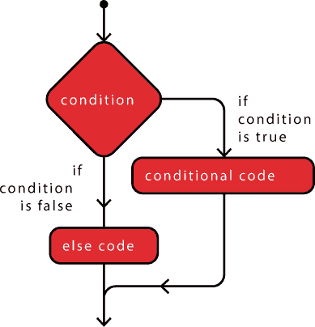

这个草图的`if()`语句检查表达式`lightValue < calibrationValue - 50`。`<`符号表示“小于”，所以这条语句的意思是，“`lightValue`是否小于`calibrationValue`减去 50？”如果该表达式为`true`，草图将执行`if()`语句下方花括号中的代码。

随着房间变暗，来自传感器电路的电压减小。这个表达式检查`lightValue`是否明显小于`calibrationValue`，如果房间变暗，这个表达式的值为`true`。如果是，草图将引脚 9 和 10 设置为`HIGH`，并将引脚 11 设置为`LOW`，以用青色点亮夜光灯。

当`if()`语句为`false`时，Arduino 跳过后续的代码。这段草图包含一个`else` ➌语句，只有在`if()`语句的表达式评估为`false`后，`else`语句才会执行。在`else`语句中，草图关闭所有三个引脚。

#### 防止误报

如果草图仅需要检查光线水平是否发生变化，为什么要在表达式中从`calibrationValue`变量中减去 50 呢？将`lightValue`与小于`calibrationValue`的数字进行比较，可以增加草图的容忍度。如果你使用`lightValue < calibrationValue`的表达式，你的夜光灯会在最小的光线变化下闪烁（返回到页面 106 上的“逻辑比较运算符”以了解更多关于`<`符号的内容）。从校准值中减去 50 可以确保夜光灯在光线水平比校准（初始）测量值低 50 时开启。

#### 重新校准夜光灯

在你美化夜灯之前，最后一个有用的信息是如何重置校准值，以便根据不同的光照水平重新校准。`calibrationValue` 的值在 `setup()` 函数中设置，因此它只运行一次。当你的 Arduino 通电时，有两种不同的方法可以重启你的草图。首先，你可以将 Arduino 关掉再重新开机，但这有点麻烦而且不太优雅。第二种方法稍微优雅一些。就像项目 4 一样，你只需按下图 5-16 所示的重置按钮即可重启草图。它的工作原理与计算机或游戏机上的重置按钮一样。每次按下该按钮，夜灯的校准值都会被重置。

**图 5-16：** 重置按钮，展现其点击时的光辉

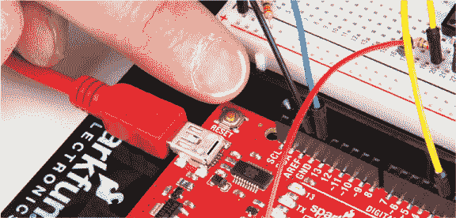

每次你将项目搬到一个新房间或新的光照环境时，按下重置按钮重新校准光敏电阻。当你重新校准光敏电阻时，确保它读取的是房间的实际光照条件，并且没有被任何阴影遮挡。

### 使用 ANALOGWRITE() 创建更多颜色

你不仅限于目前看到的 RGB LED 的颜色。通过混合这些颜色的渐变，你可以创造出天蓝色、橙色、粉红色或其他成千上万种组合。但你不能通过简单地开关 RGB LED 上的标准颜色来创造这些颜色，因此你需要一种方法，只将红色稍微打开，并加入一点蓝色和绿色，来创造例如粉红色。

#### 使用 PWM 创建模拟信号

要以这种方式使用 LED，你需要使用模拟值而不是数字值。在《电子学入门》一书中，我们讨论了模拟与数字的区别（见第 10 页）。数字值只能是开或关，就像普通的电灯开关一样。模拟信号有无限多个值，因此它像调光开关一样工作。

问题在于 Arduino 是一个数字设备，这意味着它只能开或关。为了让它输出一个介于开和关之间的值，你需要使用一种叫做*脉宽调制（PWM）*的技术，通过数字值模拟模拟信号。Arduino 通过极快地开关数字引脚，并根据信号处于 `HIGH`（开）与 `LOW`（关）的时间比例来创建一个看起来像模拟信号的输出。引脚处于高值的时间越长，信号的模拟值就越高。这有时也叫做改变*占空比*。图 5-17 展示了不同脉宽的占空比信号；75% 占空比的脉冲模拟值比 25% 占空比的脉冲高。

**图 5-17：** 展示不同脉宽的占空比信号

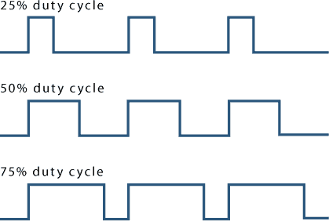

这很好，但并非所有 Arduino 引脚都支持 PWM。在标准 Arduino 板上，只有某些 GPIO 引脚——即引脚 3、5、6、9、10 和 11——支持 PWM。这些引脚在板上用波浪号（~）标注，在图 5-18 中突出显示。

**图 5-18：** 标准 RedBoard 上的 PWM 引脚

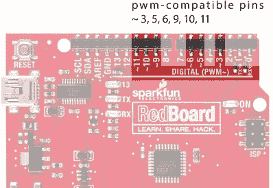

每当你需要控制某个具有变化值的事物时，例如 LED 的亮度、电机的速度或蜂鸣器的音调，你都需要使用 PWM 引脚来模拟模拟信号。在这里，我们将使用它来控制 RGB LED 每种颜色的亮度，从而混合颜色。对于这个项目，你的 RGB LED 红、绿、蓝引脚已经分别连接到 PWM 引脚 11、10 和 9，因此你不需要更改任何接线，只需修改代码。

#### 使用 analogWrite()混合颜色

为了利用这些 PWM 功能，你需要使用`analogWrite()`函数，它将 PWM 值写入一个引脚。`analogWrite()`函数接受两个参数：你想控制的引脚编号和要写入的 PWM 值，范围始终是 0 到 255。`0`表示完全关闭，`255`表示完全开启。让我们写一个简单的草图来演示`analogWrite()`函数。

```
  void setup()
  {
➊   pinMode(9, OUTPUT);
  }

  void loop()
  {
➋   analogWrite(9, 2);
  }
```

首先，和其他引脚一样，你需要使用`pinMode()`函数指定如何使用 GPIO 引脚。你传递引脚编号，并且由于 LED 是输出设备，你传递`OUTPUT`，就像在过去的项目中一样 ➊。要设置 PWM 值，使用`analogWrite()`函数设置一个介于 0 和 255 之间的模拟值。在这个示例中，引脚 9（RGB LED 的蓝色阳极）被设置为模拟值`2` ➋。将这个草图上传到 Arduino，你应该能看到一个微弱的蓝色 RGB LED。`analogWrite()`值为 2，使用 PWM 将此 LED 开启约 0.7%的时间，或 2/255 的时间。在继续之前，尝试更改 PWM 值并重新上传几次，感受不同值的强度。

现在你已经掌握了`analogWrite()`函数，尝试使用它来混合颜色。清单 5-3 创建了一种闪烁模式，使用了比之前更有趣的颜色。

**清单 5-3：** 多色闪烁

```
  void setup()
  {
➊   pinMode(11, OUTPUT);   //red
    pinMode(10, OUTPUT);   //green
    pinMode(9, OUTPUT);    //blue
  }

  void loop()
  {
➋   analogWrite(11, 153);  //dark orchid purple
    analogWrite(10, 50);
    analogWrite(9, 204);
    delay(1000);
➌   analogWrite(11, 155);  //pale cerulean
    analogWrite(10, 196);
    analogWrite(9, 226);
    delay(1000);
➍   analogWrite(11, 255);  //cadmium yellow
    analogWrite(10, 246);
    analogWrite(9, 0);
    delay(1000);
  }
```

首先，使用`pinMode()`函数添加另外两个颜色引脚 ➊。然后，通过为三个引脚设置不同的模拟值来循环显示三种不同的颜色。这将设置每种特定颜色的亮度级别，改变最终混合中每种颜色的加入量。

第一组颜色会产生一种蓝紫色 ➋，第二组产生一种灰白色的浅蓝色 ➌，最后一组则产生明亮的黄色 ➍。尝试使用`analogWrite()`创建不同的颜色。

#### 使用颜色选择器查找 RGB 值

你之前已经创建了一些非常具体的颜色，但很难预测哪些 RGB 值能生成某种颜色。一个简单的方法是使用网上的颜色选择器工具。有很多这样的工具，我们推荐*[`www.colorpicker.com/`](https://www.colorpicker.com/)*。这个工具能为你从调色板中选取的颜色提供 RGB 值，如图 5-19 所示。

**图 5-19：** 来自*[`www.colorpicker.com/`](https://www.colorpicker.com/)*的颜色选择器工具。

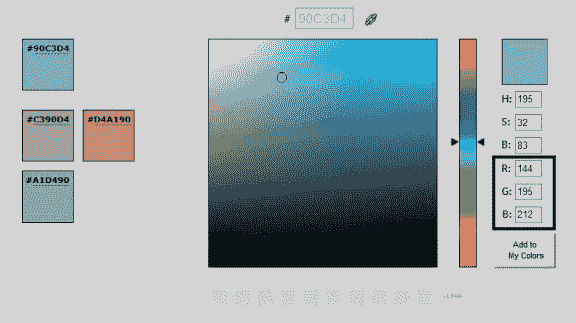

你要使用的三个数字标记为 R、G、B，分别代表红色、绿色和蓝色。忽略顶部的三个 H、S、B 框，它们是另一种常见的指定颜色的方法，称为*HSB（色相、饱和度和亮度）*。这是一种在许多颜色混合和图形设计应用中非常有用的技术，但当你能直接控制红色、绿色和蓝色这三种颜色时，它就没那么有用了。

#### 自定义颜色夜灯代码

拥有 RGB 知识后，你现在可以轻松修改你的夜灯代码，通过将`digitalWrite()`函数替换为`analogWrite()`来加入你的自定义颜色。清单 5-4 显示了夜灯代码的变化，将颜色值设置为我们在图 5-19 中选择的青绿色。

**清单 5-4：** 使用`analogWrite()`替代`digitalWrite()`命令的最终夜灯代码

```
int calibrationValue;
int lightValue;

void setup()
{
  pinMode(9, OUTPUT);
  pinMode(10, OUTPUT);
  pinMode(11, OUTPUT);
  calibrationValue = analogRead(A0);
}
 void loop()
{
  lightValue = analogRead(A0);
  if(lightValue < calibrationValue - 50)
  {
    analogWrite(11, 66);   //red
    analogWrite(10, 166);  //green
    analogWrite(9, 199);   //blue
  }
  else
  {
    analogWrite(11, 0);    //red off
    analogWrite(10, 0);    //green off
    analogWrite(9, 0);     //blue off
  }
}
```

到此为止，你的夜灯原型完成了！如果你不喜欢我们选择的青绿色，可以使用颜色选择器工具找到你喜欢的颜色，更新你的`analogWrite()`函数，使用它的 RGB 值，然后重新上传草图再继续进行。想要浏览一些有趣的颜色建议，可以访问*[`99colors.net/color-names/`](http://99colors.net/color-names/)*。

现在代码已经可以运行了，是时候发挥创意，开始制作外壳和灯罩了。

### 制作夜灯外壳

我们建议使用卡纸而非纸板来制作此项目的外壳（因为卡纸切边更整齐且更容易操作），并使用羊皮纸或透明纸来制作灯罩。让我们开始动手吧。

#### 卡纸制作

我们会展示一个基础的夜灯设计来帮助你入门，但我们鼓励你稍后通过自定义设计来发挥创意。或者，如果你有信心，也可以完全不使用我们的模板，自己从头设计夜灯外壳。

##### 裁剪部件

这个项目有两个模板：一个是夜灯的结构模板，另一个是灯罩模板。灯罩可以由任何类似打印纸厚度的材料制作，但我们发现完全透明的材料（如羊皮纸）效果最好。如果你有打印机，可以在本书的资源文件中打开图 5-20 的模板，直接打印到你的材料上然后裁剪出来。

**图 5-20：** 夜光灯外壳模板（非全尺寸）

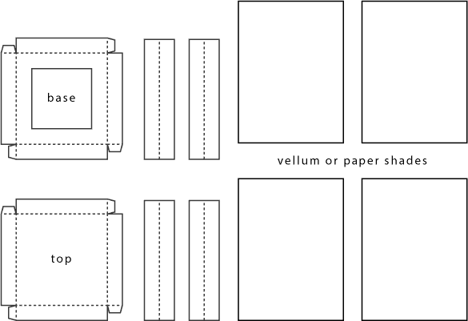

请注意，夜光灯外壳的底部有一个方形开口，用于电线的通过。我们还发现，去掉四个侧面板中的一个会更方便，这样可以更容易地将电线引回到较大的面包板上。是否包括第四个面板，将由你决定。

一旦你的模板部件复制到卡纸和透明材料上，开始切割它们。我们强烈推荐使用锋利的工艺刀和金属尺来确保项目的边缘干净，如图 5-21 所示。记住工艺刀使用安全：总是拉刀片（不要推），并进行多次切割。

**图 5-21：** 从卡纸上切割模板

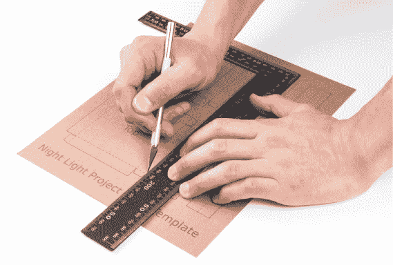

##### 组装部件

将所有部件摆放在你面前。你应该有六个结构部件和四个遮光片部件，正如图 5-22 所示。

**图 5-22：** 切割好的单独部件，准备组装

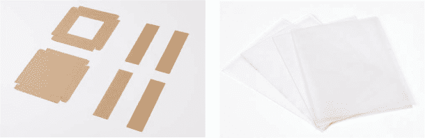

首先，拿起底部部件（中央有开口的部件）。将其平放在你面前，并将左边和顶部边缘向你折叠，以形成一个直角。将左边缘上的标签向内折叠，并用少量胶水将其固定在顶部边缘，正如图 5-23 所示。对底部部件的其他四个角重复此步骤，然后使用相同的方法组装顶部部件。

**注意**

*根据你的卡纸厚度，你可能想用工艺刀轻轻划出折痕线。这将使角部更加锋利、干净。*

**图 5-23：** 底部和顶部部件的组装

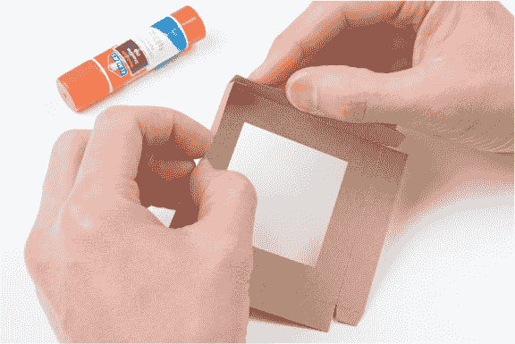

接下来，将四个侧面部件沿中线纵向折叠，形成一个漂亮的 90 度角。模板中有虚线可以指导你。一旦顶部和底部组装好并且侧面折叠完成，六个部件应该如图 5-24 所示。

**图 5-24：** 夜光灯外壳的组装部件

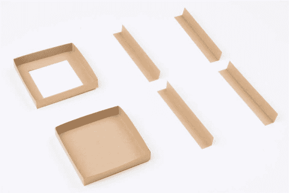

最后，拿起每个角部件并将其粘到底部，正如图 5-25 所示。

**图 5-25：** 将每个角部件粘到底部

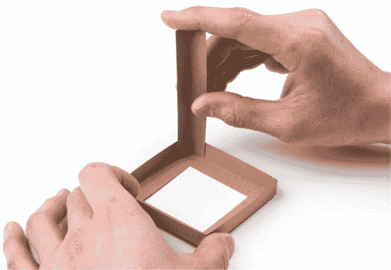

当你完成粘合角落时，应该会有四个立起的角撑结构。我们发现，在粘合顶部部件之前先将遮光片粘好更为容易，所以只需在每个支撑结构的内边缘涂上一小点胶水，然后将遮光片按图示位置压入，正如图 5-26 所示。你可能只想使用三个遮光片，以便让电线能够通过。

**图 5-26：** 在加上顶部部件之前，先将遮光片粘好。

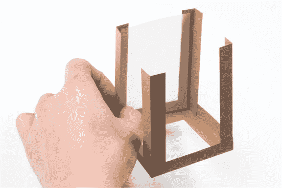

当你添加完所有面板后，添加顶部件。只需在每个角落上涂一点胶水，以固定顶部件，如图 5-27 所示。

**图 5-27：** 添加最终的顶部件


现在，你应该已经有了一个完成的夜灯外壳，像图 5-28 中的那样！

**图 5-28：** 最终的夜灯外壳

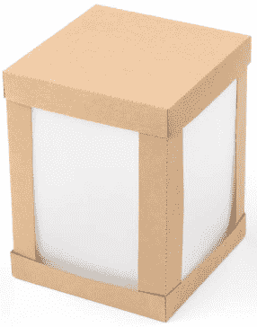

#### 将电子元件放入内部

你有几个选择可以将电子元件转移到新的项目中：将面包板和 Arduino 底座放在夜灯下方，或者仅将 LED 移入夜灯内。我们选择了第二种方法。

首先，将 Arduino 从电脑上拔下，然后将 RGB LED 移到迷你面包板上。迷你面包板的工作原理与较大的面包板相同，只是没有电源轨，且较短。将跳线添加到迷你面包板上，以便将 LED 连接回原始电路，如图 5-29 所示。请注意，RGB LED 的四个引脚分别位于不同的行：一个是红色引脚，一个是地线引脚（最长的），一个是绿色引脚，一个是蓝色引脚。

**图 5-29：** 使用迷你面包板将 RGB LED 移入夜灯内

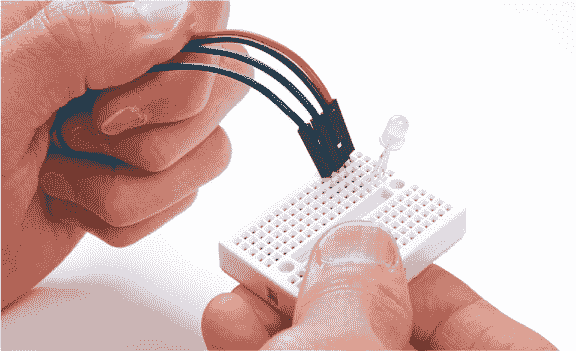

现在，将每根跳线的另一端连接到面包板上对应 RGB LED 引脚所在的行，如图 5-30 所示。

**图 5-30：** 将迷你面包板连接回主电路

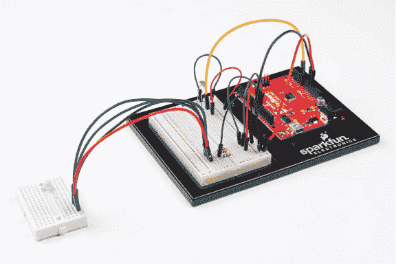

如果你留了一边空着，只需像我们在图 5-31 中所做的那样，将跳线从灯罩后面引出。否则，仔细地将灯罩放在迷你面包板上，并用胶带将跳线固定在桌面上，以确保灯罩平稳，或者在灯罩底部的纸板上做几个缺口，以便跳线通过。

**图 5-31：** 将灯罩放置在迷你面包板上


#### 让它发光！

如果你有外部电池包，现在可以放入四个 AA 电池，并将桶形插头插入 Arduino。电路板应该仍然是编程并运行的，因此只需关闭灯光。你应该得到一个柔和发光的夜灯，就像我们在图 5-32 中的那样。

**图 5-32：** 灯光熄灭！我们最终的发光夜灯项目。

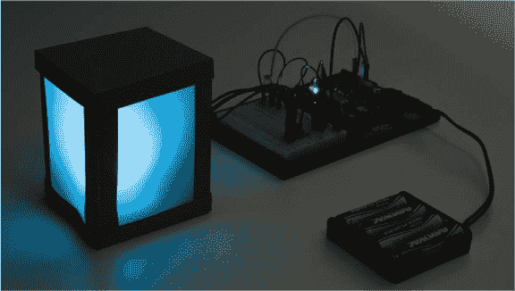

### 进一步扩展

这个项目使用了许多新的技能和知识，但它仍然具有大量进一步修改的潜力。随着你在 Arduino 方面技能的提升，无论是设计还是代码方面，都有许多可以尝试的地方。

#### 黑客

一个很好的草图技巧是，当夜光灯开启时，让颜色周期性地变化。你可以参考你的红绿灯项目代码，获得一些提示。一种方法是在`if()`语句中加入一些简单的闪烁代码，而不仅仅是使用`digitalWrite()`函数，来构建一个颜色动画。

你还可以尝试使用`else if()`命令为不同的光照读取值添加不同的颜色，而不是仅仅使用`if()`或`else`。这种方法的基本结构可能类似于列表 5-5。

**列表 5-5：** 三阶段夜光灯代码示例

```
if (lightValue < calibrationValue - 200)
{
  //do if it is completely dark
  digitalWrite(11, HIGH);
  digitalWrite(10, LOW);
}
else if (lightValue < calibrationValue - 50)
{
  //do if it is a little dim
  digitalWrite(11, LOW);
  digitalWrite(10, HIGH);
}
else
{
  //do if it is bright
  digitalWrite(11, LOW);
  digitalWrite(10, LOW);
}
```

你可以看到草图使用了`else` `if()`来设置光照值的类别。然后，你需要为每个类别设置颜色。

#### 修改

你的夜光灯设计完全由你决定，所以如果你愿意，可以创造一个全新的设计。你可以使用许多工具来设计一个外壳，然后通过自动化方式制作它，比如使用轻木激光切割、3D 打印（使用 ABS 或 HIPS 塑料等材料）甚至 CNC 铣削、雕刻或加工。计算机控制的制造将产生非常干净且精确的部件，从而成就一个更精致的产品。我们鼓励你探索这些可能性，创造出更持久、更精致的作品。如果你没有这些工具，可以尝试查找你所在城市的本地黑客空间或创客空间。通常它们会提供你可以使用的设施和工具。

我们提供了一些示例模板和项目创意，你可以在*[`www.nostarch.com/arduinoinventor/`](https://www.nostarch.com/arduinoinventor/)*上查看和改编这些内容。图 5-33 展示了如何通过一些有趣的图案来打破灯罩设计的示例。

**图 5-33：** 来自我们设计模板的有趣设计。

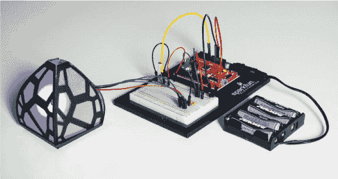
