## 第七章：6 平衡梁

在这个项目中，你将使用旋转旋钮和舵机电机（能够进行精确运动的小型电机）构建一个桌面平衡梁游戏。游戏的目标是让小球在梁上来回滚动，而不掉下去。你将通过旋转旋钮来控制舵机的位置。舵机移动时，梁也会随之移动！准备好开始了吗？

图 6-1 显示了完成的项目。这是一个完全由纸板和一些家庭材料制成的简单机制。

**图 6-1：** 完成的平衡梁项目

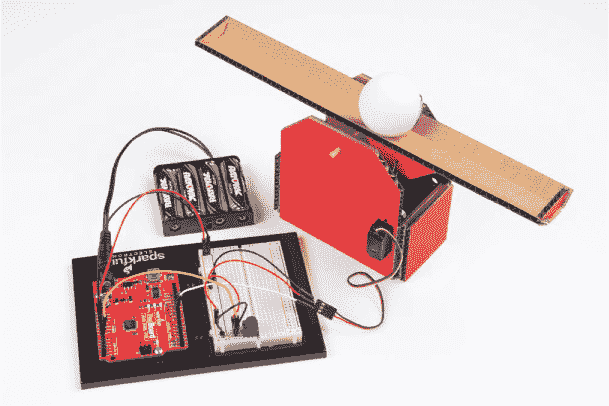

### 收集材料

本项目的电路使用的零件相对较少，不过我们将介绍两种新的硬件：舵机电机和电位器。请查看图 6-2 至 6-4 中展示的电子零件和其他材料。

#### 电子零件

• 一个 SparkFun RedBoard (DEV-13975)、Arduino Uno (DEV-11021) 或任何其他兼容的 Arduino 板

• 一根 USB Mini-B 电缆（CAB-11301 或你板子的 USB 电缆；未显示）

• 一个无焊面包板（PRT-12002）

• 一个 10 kΩ电位器（COM-09806）

• 一个微型舵机电机（ROB-09065）

• 公对公跳线（PRT-11026）

**注意**

*本项目中使用的所有零件均为 SparkFun 发明者套件中的标准配件。*

**图 6-2：** 平衡梁的组件

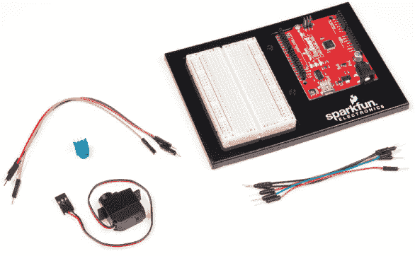

#### 其他材料和工具

• 铅笔或马克笔

• 工艺刀

• 金属直尺

• 钳形钳

• 线切割钳

• 胶水（热熔胶枪或工艺胶水）

• 微型螺丝刀

• 剪刀（未显示）

• （可选）电钻以及 1/4 英寸、1/8 英寸和 1/16 英寸钻头

• 两张纸板（大约 8.5 × 11 英寸）

• 平衡梁模板（请参见图 6-16 在第 167 页）

• 一根竹签

• 一根小饮料吸管（竹签应该能够松松地插入吸管中）

• 一个乒乓球

• 一个中型回形针

**图 6-3：** 推荐的建筑材料


**图 6-4：** 推荐工具

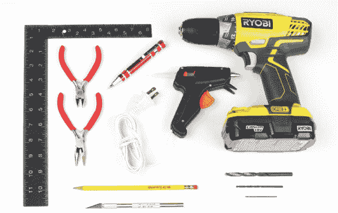

### 新组件

在之前的项目中，你主要使用 Arduino 来控制 LED，但现在是时候拓展并探索其他组件了。本项目介绍了一种新的传感器，叫做*电位器*，以及电机，特别是*舵机电机*。

#### 电位器

在这个项目中，你将使用电位器来控制平衡梁的运动。电位器是一种被称为*可变电阻*的传感器，这意味着它是一个电阻器，其值可以变化。

一个电位器通常有三个接脚或连接点，并由图 6-5 所示的符号表示。

**图 6-5：** 电位器的电路图

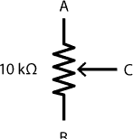

电位器有多种形状和尺寸，部分如图 6-6 所示。有些看起来像旋钮，有些是滑块，还有一些需要小螺丝刀来调节。无论它们的外观如何，它们的工作原理都是一样的。而且它们无处不在——在家里，你可能会在餐厅灯的调光开关、立体声音响的音量旋钮或 DVD 播放器等设备中找到它们。

**图 6-6：** 各种形状和尺寸的电位器。我们将使用左侧的那个。

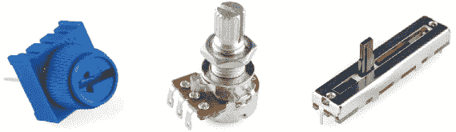

一个电位器在图 6-7 中标记为 A 和 B 的两条对面脚之间具有固定的电阻值。电位器有各种电阻值，但在这个项目中，你将使用一个 10 kΩ的电位器。当你转动旋钮或移动滑块时，电位器的第三条脚（标记为 C），称为*刮臂*，会在电阻器上向上或向下移动，B 和 C 之间的电阻值会发生变化。正是这个电阻值被应用到电路中。

如果你顺时针转动旋钮，刮臂会向 A 移动，C 和 B 之间的电阻增加；如果你逆时针转动旋钮，刮臂会向 B 移动，电阻减小。图 6-7 展示了刮臂移动如何影响电阻。

**图 6-7：** 电位器的各种位置

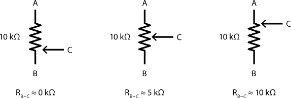

如果你将 A 接到 5V，B 接到 GND，将 C 接到 Arduino 的模拟输入引脚，那么这个电路就开始类似于你在项目 5 中使用的电压分压器。当你转动旋钮时，你可以调节 C 端的电压，范围在 0V 和 5V 之间。这种设置有时也被称为*可调电压分压器*。

#### 伺服电机

伺服电机（简称*伺服*）是一种特殊类型的电机，旨在将一个臂（或*角度控制器*）旋转到一个特定角度，这个角度你将在草图中确定。大多数伺服电机的旋转范围为 180 度，但有些可以旋转 360 度；这些称为*连续旋转伺服电机*。在这个项目中，你将使用一个标准的 180 度爱好者伺服电机，如图 6-8 所示。

**图 6-8：** 标准爱好者伺服电机

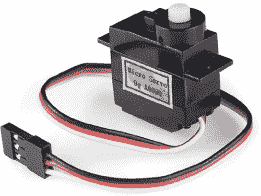

伺服电机广泛应用于成千上万种不同的产品，从模型车和飞机到你车上的速度计，再到制造它的机器人手臂。

黑色盒子里是什么？我们已经打开了一个，省得你自己动手——见图 6-9。

**图 6-9：** 伺服电机内部结构

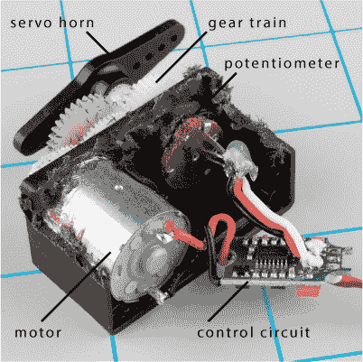

在伺服电机内部，有三个主要部件：电机、齿轮传动和控制电路。当电压施加到电机上时，它会驱动齿轮传动，从而转动伺服电机的转轴。转轴的旋转位置由控制电路控制。齿轮传动的一部分是电位器，它随着电机的旋转而旋转。记住，电位器是一个简单的传感器，根据旋转的多少来改变电阻，当它作为可调电压分压器连接时，电压会随着电位器的旋转而变化。控制电路读取输入信号（此时来自 Arduino）和电位器值，并对比它们。当两个值相等时，电机停止并保持其位置。

一个伺服电机依赖于 PWM，这是我们在 “使用 `analogWrite()` 创建更多颜色” 中介绍的一个概念，见第 138 页。为了控制伺服电机的位置，Arduino 会发出每 20 毫秒脉冲一次的 PWM 信号。脉冲的宽度对应于伺服电机的特定旋转位置。图 6-10 通过显示伺服电机 0 度、90 度的中点和 180 度最大位置的最小 PWM 脉冲宽度来说明这一点。类似于闪烁 LED，你可以使用 Arduino 创建一个非常短的脉冲，持续 1 毫秒开，19 毫秒关，将伺服电机移动到 0 度的角度。

**图 6-10：** 标准伺服电机范围的 PWM 占空比

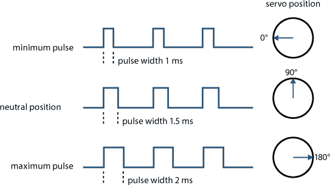

要将伺服电机的角度设置为 0 度，你可以使用如下代码：

```
void setup()
{
  pinMode(9, OUTPUT);
}
 void loop()
{
  digitalWrite(9, HIGH);
  delay(1);
  digitalWrite(9, LOW)
  delay(19);
}
```

这段代码将引脚 9 设置为 `HIGH` 持续 1 毫秒，然后立即将引脚设置为 `LOW` 持续 19 毫秒。一旦 19 毫秒过去，它需要再次将引脚设置为 `HIGH` 持续 1 毫秒，以维持定时周期。如果你的代码忙于管理像这样的定时，你就无法在不影响脉冲的定时和伺服控制的情况下添加任何其他内容。幸运的是，Arduino 有一个简便的技巧来简化伺服电机的控制方式：使用一个*库*。库是一个包含额外代码的文件，你可以将其与草图一起使用，以执行特定任务或更方便地使用某些部件。Servo 库处理了所有驱动伺服电机到特定角度所需的脉冲定时。

在这个项目中，你将使用 Arduino 根据传感器——你的电位器——的电压输出来移动一个平衡梁。代码将使用传感器的电压读数来设置伺服电机在给定旋转角度下的脉冲宽度，从而决定梁的角度。

好消息是，Arduino，特别是 Servo 库，已经为你完成了所有的繁重工作！了解脉冲宽度如何控制伺服电机的位置是很有意义的，但最终，软件会为你处理这些。

### 构建平衡梁原型

现在您了解了理论部分，接下来您将构建平衡梁的电路。您将从连接伺服电机开始，然后添加可变电阻器；图 6-11 展示了完整的电路。

请注意，伺服电机有一个三针母头。为了将其连接到电路，您需要使用母对母跳线。取三根短的母对母跳线，将它们连接到母针，如图 6-12 所示。为了方便区分各个引脚，可以使用与伺服电机线缆颜色相对应的跳线：黑色、红色和白色分别代表地线、电源线和信号线。现在，将伺服电机连接到 Arduino。

**图 6-11：** 平衡梁原型电路

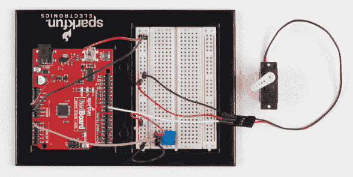

**图 6-12：** 向伺服电机添加母对母跳线延长线

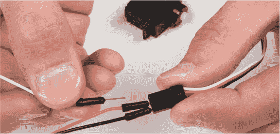

电路连接非常简单：将 Arduino 的 5 V 和 GND 连接到面包板左侧的电源轨道。将伺服电机的地线（黑色）连接到面包板的地线轨道，电源线（红色）连接到 5 V 轨道。将信号线直接连接到 Arduino 的 9 号引脚。完整的电路图请参见图 6-13。

**图 6-13：** 伺服电机连接到信号、电源和地线

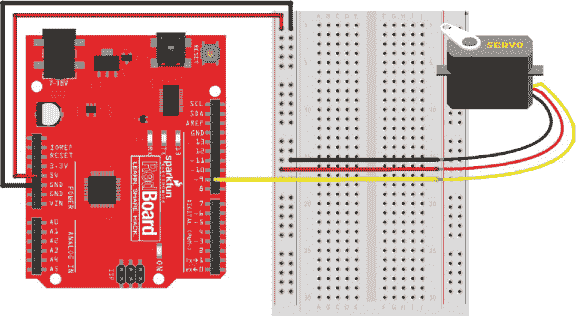

最后，将伺服电机的*旋钮*安装到伺服电机的中心轴上。旋钮是伺服电机的不同形状的臂，与中心轴一起旋转，使得使用和安装物品更加方便。此时，选择伺服电机附带的任意一个旋钮，并将其按压安装到伺服电机的中心轴上，如图 6-14 所示。稍后您会安装特定的旋钮，但现在我们只需要让旋转更容易看到。

**图 6-14：** 按压安装伺服电机的旋钮（来自附带选项）

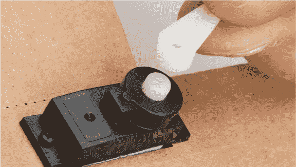

如果伺服电机开始移动或表现异常，只需将其黑色线缆从地线轨道中断开即可停止伺服电机。为了安全起见，在上传代码之前，最好保持黑色线缆断开。

现在，接入可变电阻器。面包板上有足够的空间，您可以将可变电阻器放置在任何位置，确保每个引脚都在自己的行中。将两侧的引脚连接到 5 V 和地线轨道，中央引脚直接连接到 Arduino 的模拟输入引脚 A0，如图 6-15 所示。

**图 6-15：** 完整的平衡梁电路

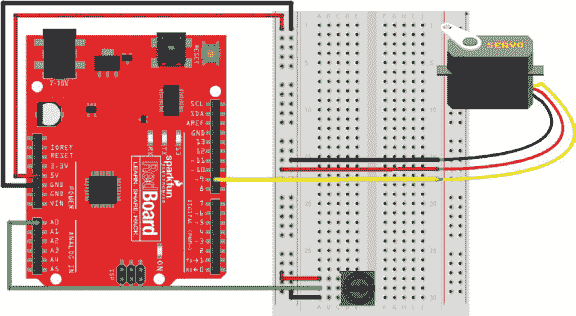

此时，您只连接了一个伺服电机和一个可变电阻器。为了赋予项目平衡的功能，您需要编写程序。

### 编程平衡梁

要在 Arduino 上使用伺服电机，你需要使用 Servo 库——正如前面提到的，这是一个预先编写的代码集合，扩展了你草图中代码的命令和功能。它为你提供了更多的功能和特性，简化了使用外部硬件与 Arduino 进行交互。例如，Servo 库包括将伺服电机连接到特定 Arduino 引脚的代码，将伺服电机移动到特定角度，甚至从引脚上断开伺服电机。

在你编写完整项目之前，你可以上传一个快速测试草图，检查你的伺服电机是否正常工作。

#### 测试伺服电机

这是一个控制伺服电机的简单示例草图。通过选择 **文件 ▸ 新建** 来开始一个新的草图，然后在 Listing 6-1 中输入草图：

**LISTING 6-1:** 一个伺服电机的“Hello world”

```
➊ #include<**Servo**.h>

➋ **Servo** myServo;
  void setup()
  {
➌   myServo.attach(9);
  }

  void loop()
  {
➍   myServo.write(90);
  }
```

要使用 Servo 库，首先调用 `#include<Servo.h>` ➊，这告诉 Arduino 包含包含 Servo 库代码的*Servo.h* 文件。这将库的功能和定义添加到草图中。请注意，这是少数几个没有在行尾加分号的情况之一。在 Arduino 编程中，`#` 符号表示接下来的代码是*预处理指令*，这是一段特殊的代码，应该在草图的其余部分执行之前先执行。当你编译一个草图时，首先运行的是*预处理器*，它会查找所有以 `#` 符号开头并且没有分号结尾的行，并首先执行这些行。`#include` 指令告诉预处理器在编译草图中的代码之前包含命名文件中的所有代码。

你还可以使用下拉菜单通过选择 **草图 ▸ 引入库...** 来添加一个库，然后选择你想使用的库（在这个例子中是 **Servo**）。这将自动将 `#include` 语句添加到你的草图中。如果你不记得 `#include` 命令或库名称的确切语法，这个选项非常有用——例如，当你第一次使用某个库时。

该库允许你创建一种名为*对象*的数据结构。对象只是一个包含预定义变量和函数的容器。与对象关联的函数被称为*方法*。在这个草图中，`Servo myServo;` 这一行创建了一个名为 `myServo` 的新的 `Servo` 对象 ➋。

你可以给对象取任何你喜欢的名字，但我们建议使用具有描述性的名称，如 `myServo`，这样更容易识别。现在，你可以使用这个名字来引用 Servo 库中所有可用的伺服电机命令。例如，方法 `myServo.attach()` 告诉 Arduino 伺服电机连接到哪个引脚。如果你有多个伺服电机，每个电机都会有一个唯一的名称，这样你就可以独立控制它们。

举个例子，想象一个机器人臂，它在肩部、肘部和手腕处使用伺服电机。它的代码会创建三个 `Servo` 对象，分别命名为 `shoulderServo`、`elbowServo` 和 `wristServo`，这样你就可以精确地定位每个关节，并使它们的角度不同。每个 `Servo` 对象都有自己的一组方法，可以单独使用。

对于平衡梁，你只需要使用一个伺服电机。草图的设置告诉 Arduino，你在 9 号引脚上连接了一个伺服电机，方法是 `myServo.attach(9)` ➌。然后它会告诉 Arduino 将伺服电机移动到 90 度的位置，方法是 `myServo.write(90)` ➍。伺服库会在后台将旋转的角度转换为适当的脉冲宽度。这是 `write()` 方法内置的功能。

现在，将伺服电机的黑色线接入地线，并将代码上传到 Arduino，伺服电机将旋转至 90 度。此时将伺服电机连接好是安全的。

**注意**

*尽管伺服电机的运动范围为 180 度，我们建议将* *`write()`* *的值保持在 10 至 170 度之间，特别是对于塑料齿轮的伺服电机。过度拉伸伺服电机的范围可能会造成无法修复的损害。*

要再次移动伺服电机，只需将伺服电机运动范围内的另一个数字（10–170）传递给 `write()` 方法，并重新上传草图。稍微玩一下伺服电机，传递不同的数值。

好的，你现在知道如何让伺服电机只动一次了。现在，下面的代码让它开始真正地动起来。列表 6-2 将伺服电机的控制放入一个循环中，并重复动作。

**列表 6-2：** 伺服电机闪烁草图

```
#include<**Servo**.h>
**Servo** myServo;
void setup()
{
  myServo.attach(9);
}

void loop()
{
  myServo.write(10);
  delay(1000);
  myServo.write(170);
  delay(1000);
}
```

这段代码是项目 1 中的闪烁草图的伺服电机版本。伺服电机先移动到 10 度，等待 1 秒钟，再移动到 170 度，等待 1 秒钟，然后重复这个过程。我们亲切地称之为“机器人行军”，因为当你有 20 多个人同时做这个动作时，它听起来像是一支机器人军队在行进，准备征服世界。

哇！你真的进展很快。伺服电机变得更有趣的是，当你能够自己控制伺服电机，而无需每次重新编程它时。现在，是时候让电位器参与进来了。

#### 完成平衡梁草图

对于最终的草图，你将编程电位器来控制伺服电机的旋转。按照 列表 6-3 所示修改你的草图：

**列表 6-3：** 使用 `map()` 函数通过电位器控制伺服电机

```
  #include<**Servo**.h>
  **Servo** myServo;
➊ int potVal;
  int anglePosition;
  void setup()
  {
    myServo.attach(9);
  }

  void loop()
  {
    potVal = analogRead(A0);
➋   anglePosition = map(potVal, 0, 1023, 10, 170);
    myServo.write(anglePosition);
    delay(20);
}
```

这个草图读取电位器的值，将其转换为角度值，然后将该值写入伺服电机。这里有一些新的命令，我们将一步一步地讲解。

这段代码的顶部部分与前两个例子列表非常相似。它包含了 Servo 库并创建了一个名为`myServo`的`Servo`对象。它还声明了两个全局变量➊，分别是`potVal`和`anglePosition`。这些变量将用于分别存储电位器的原始值和计算得出的伺服电机角度位置。

在`loop()`函数中，变量`potVal`存储来自`analogRead(A0)`函数的原始模拟到数字转换值。当你旋转电位器上的旋钮时，擦拭脚的电压会在 0V 到 5V 之间变化。记住，`analogRead()`会将 0V 到 5V 的电压转换为 0 到 1,023 之间的数字。然而，0 到 1,023 的数值对于控制伺服电机并不十分有用。正如我们之前提到的，伺服电机需要保持在 10 到 170 度之间。

幸运的是，Arduino 有一个内置的`map()`函数，允许你将一个数值范围映射到另一个范围。变量`anglePosition`存储一个角度位置，这个位置是通过`map()`函数从`potVal`计算得出的➋。`map()`函数使用五个参数：`map(input, fromLow, fromHigh, toLow, toHigh)`。在这个例子中，它将`potVal`的值从 0 到 1,023 的范围映射到 10 到 170 的新范围。这是 Arduino 中一个非常方便的函数，使得数值范围的缩放和转换变得非常简单！

这个草图还增加了一个短暂的 20 毫秒延迟，给伺服电机足够的时间移动，然后再读取电位器的值。20 毫秒的延迟是伺服电机所需的最小延迟。你可能还记得，它是用来控制角度的 PWM 信号的时间周期。

一旦你更新了这个草图，将其上传到你的 Arduino。现在，当你旋转电位器时，伺服电机会随着它一起移动。非常酷！接下来，你将利用你刚获得的超能力，基于它构建一个平衡游戏。

### 制作平衡木

使用这种控制伺服电机的酷方法，我们认为创建一个桌面游戏会非常有趣。你将创建一个平衡木，并通过电位器和伺服电机来控制它。一个乒乓球会在平衡木上滚动，而你的目标是让乒乓球尽可能靠近平衡木的两端而不掉下来。

#### 剪裁各部分

下载提供的模板，地址是 *[`www.nostarch.com/arduinoinventor/`](https://www.nostarch.com/arduinoinventor/)*（如图 6-16 所示），打印出来，然后将其描摹到你的纸板上。我们设计这个项目时，尽量将它缩小到尽可能小的纸板上。

**图 6-16：** 平衡木框架模板（非全尺寸）

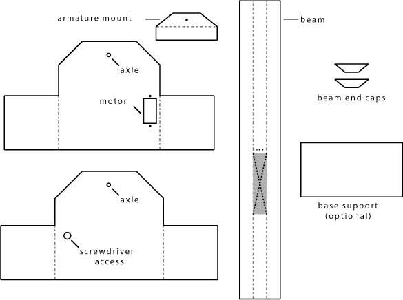

使用工艺刀沿每个形状的周边线切割所有实线，以及电机支架的切割线。现在不要刻划任何部件；你将在后续过程中逐步进行。记住在切割时要注意安全。使用金属尺和锋利的工艺刀，如图 6-17 所示，并且要慢慢进行。使用钻机或工艺刀制作设计中六个不同的孔。如果使用钻机，你将需要一个 1/4 英寸的钻头来打入螺丝刀的通道孔，一个 1/8 英寸的钻头来打入轴孔，和一个 1/16 英寸的钻头来打入支架安装孔和两个电机安装孔。

**图 6-17：** 从模板中裁剪框架部件

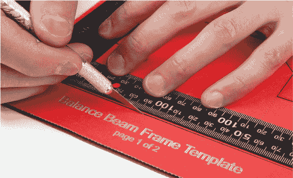

完成切割后，你应该会得到六个像图 6-18 中所示的部件。

**图 6-18：** 所有纸板部件已裁剪

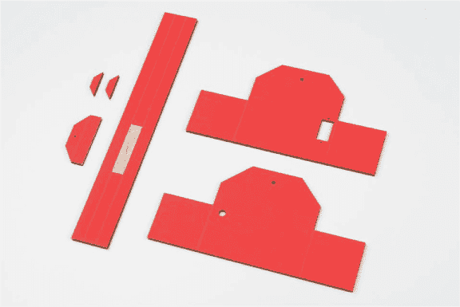

#### 制作梁

取最长的一块，它将作为实际的梁，并小心地在其长度上沿虚线刻划。这将使你能够弯曲梁，使其托住球体。我们设计了这个模板，使得梁的长度为 11 英寸，等于标准 8.5 × 11 英寸纸张的长度。

接下来，准备支架安装。这是一个小的梯形纸片，宽约 2 1/4 英寸，高 1 英寸。你将使用这块纸片将伺服电机连接到梁上。沿着它刻划并将其弯成直角，如图 6-19 所示。

**图 6-19：** 准备支架安装

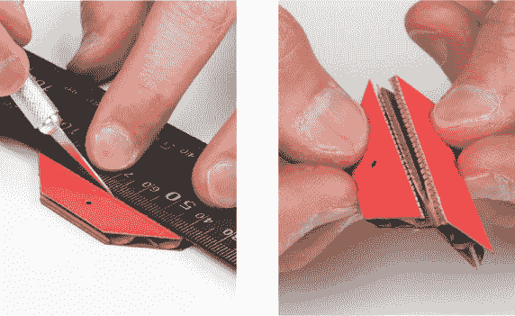

接下来，剪短吸管，使其长度为 1 3/4 英寸，并将其粘在梁的中心线上，如图 6-20 所示。

**图 6-20：** 将吸管粘在梁的中点


现在，将没有钻孔的支架安装半部粘在吸管旁边，如图 6-21 所示；确保带孔的那一半面朝向你，当吸管在右侧时。这个位置很重要，以便它能与伺服电机的安装臂配合。

**图 6-21：** 将支架安装到梁上

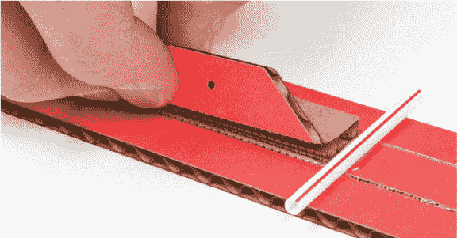

接下来，将梁的两侧弯起，形成一个托住球体的摇篮，如图 6-22 所示。

**图 6-22：** 弯曲梁的两侧以形成摇篮

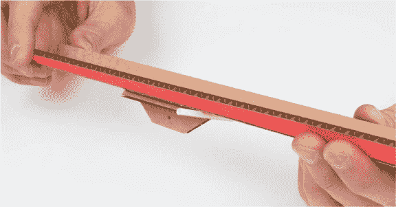

使用较小的梯形纸片来固定梁的两端，并将梁固定在一起，以保持摇篮的形状。我们建议使用热熔胶枪，这样部件就能牢固地固定，正如在图 6-23 中所示。

**图 6-23：** 将端部件粘贴到梁上

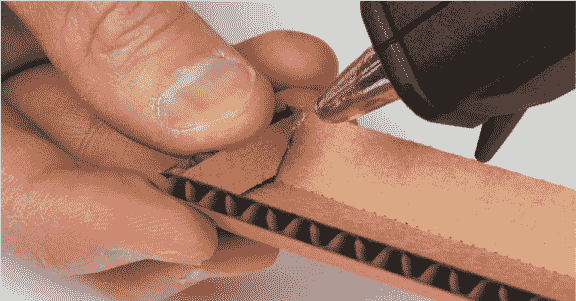

接下来，使用剪线钳将竹签剪成大约 3 1/4 英寸长。我们建议使用竹签的钝端。将竹签插入饮料吸管中，形成平衡梁的轴心（如图 6-24 所示）。

**图 6-24：** 将剪好的竹签定位，使其两侧均匀突出

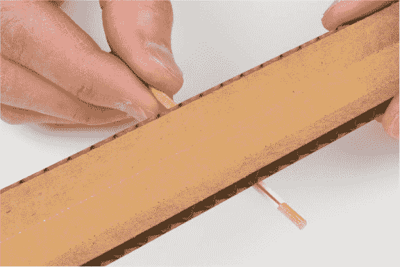

#### 构建底座并安装伺服电机

现在你将开始制作平衡梁的底座。按照图 6-25 所示，打槽以便将底座部件弯曲成形。

**图 6-25：** 打槽底座部件的两侧

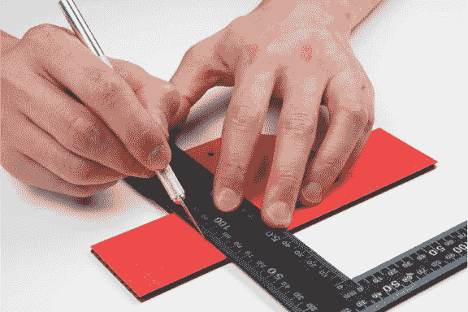

在打槽后，将两侧弯曲形成 U 形，如图 6-26 所示。对两个部件重复此操作。

**图 6-26：** 弯曲底座部件的两侧

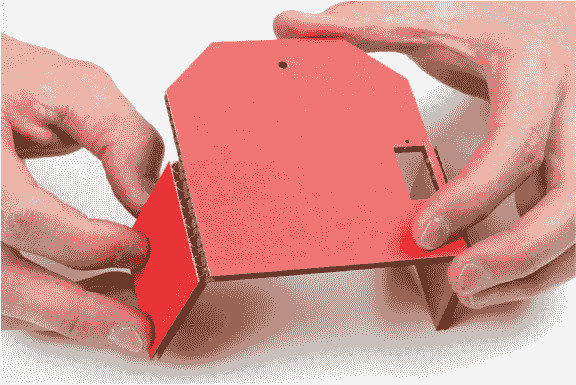

在将底座粘合之前，你需要先安装伺服电机。将伺服电机从面包板电路中取出。模板中有一个小的方形切口，应该刚好适合超小型伺服电机。将伺服电机插入，使电机面朝内，如图 6-27 所示。

**图 6-27：** 插入伺服电机

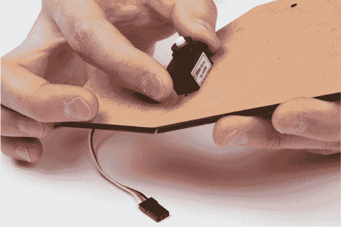

你的伺服电机应附带三颗小螺丝，其中一颗较短，另外两颗较长。使用两颗较长的螺丝将伺服电机固定在位，如图 6-28 所示。如果没有螺丝，你也可以使用少量热熔胶来固定电机。

**图 6-28：** 使用两颗较长的螺丝将伺服电机固定到位

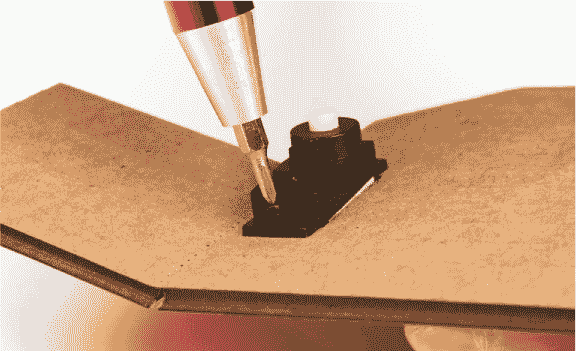

现在，选择一个约 0.5 英寸长的单面伺服电机齿轮。轻轻地将其推入伺服电机的末端，如图 6-29 所示。确保它已经牢固安装在伺服电机上，然后将伺服电机调整到 0 度。用手指轻轻地将伺服电机逆时针旋转，直到停止。你会听到伺服电机内的小齿轮转动。确保慢慢移动伺服电机；齿轮通常是塑料制的，可能会破裂。

**图 6-29：** 安装单面伺服电机齿轮

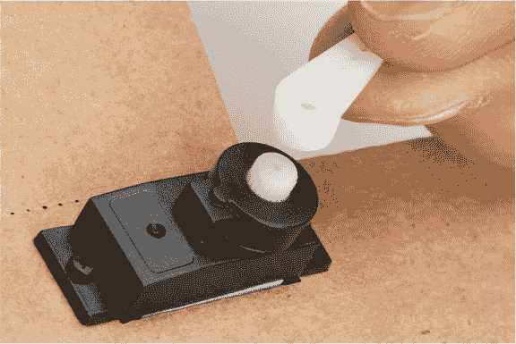

当伺服电机齿轮旋转到最大逆时针位置时，取下齿轮并重新安装，使其朝上，如图 6-30 所示。这将使连接连杆到梁上变得更容易。

**图 6-30：** 将伺服电机齿轮调整到 0 度位置


最后，使用伺服电机附带的最后一颗小螺丝将号角固定到位，以确保号角不会意外弹出。拧紧螺丝时，号角可能会旋转。没关系——这不会损坏任何部件，但你可能希望在拧紧螺丝时用手指固定号角，以防止号角旋转。如果你丢失了螺丝，也不用担心；你可以不使用螺丝，若号角滑出，只需重新安装即可。如果需要重新定位伺服电机臂，你需要拆下这颗螺丝，这也是为什么我们在底座模板的另一侧加了一个孔。

接下来，你需要一个联动装置，将伺服电机号角与梁连接起来。为此，你需要使用一把尖嘴钳将一只中等大小的回形针弯曲成型。图 6-31 展示了整个过程的步骤。

**图 6-31：** 切割、弯曲和塑形伺服电机联动的步骤

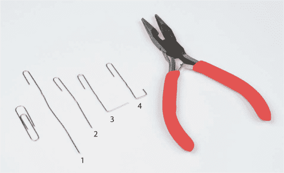

**1.** 使用钳子将回形针拉直，保持一端的小钩子。

**2.** 将回形针修剪至大约 2 英寸长。

**3.** 将回形针的一端从钩子处大约 1 1/2 英寸的位置弯开。

**4.** 进行最后的弯曲，形成一个大约 3/8 英寸深的小钩子。完成后，伺服电机联动的长度应约为 1 1/2 英寸（图 6-32）。考虑到我们模板的几何形状，这个长度刚好合适。如果你设计的是自己的外壳，可能需要稍微调整这个长度，以确保伺服电机号角能正确连接到梁上。

**图 6-32：** 回形针联动的最终弯曲

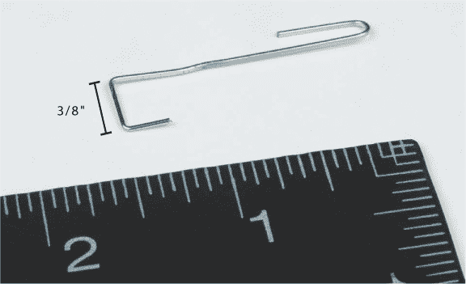

#### 最终组装

现在是最后的组装步骤！首先，将两块底座粘合在一起。将两个方形卡片的两端粘合，先从与伺服电机相对的侧面开始（图 6-33 和 6-34）。这样你就可以腾出空间将手放入并连接伺服电机号角的联动装置。

**图 6-33：** 最好的粘接两件物品的方法是使用蛇形或 S 形胶水图案。

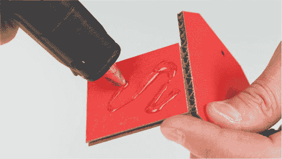

**图 6-34：** 首先固定底座的远端。

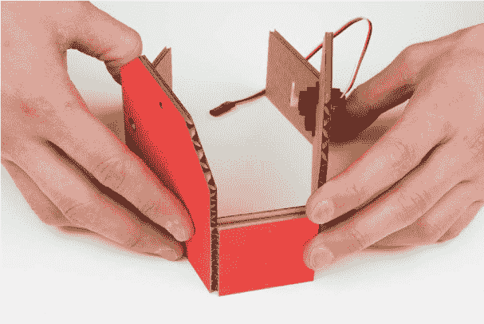

在伺服电机一侧保持开放，拿起弯曲回形针的原始钩端，将其钩入伺服电机号角的最后一个孔，如图 6-35 所示。

**图 6-35：** 将回形针挂过伺服电机号角的最后一个孔

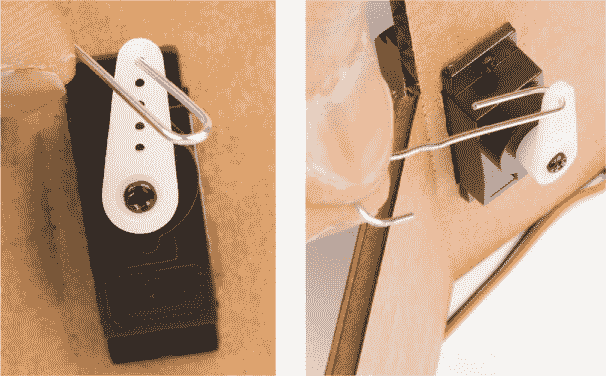

**四连杆联动与将伺服电机连接至完成任务**

将伺服电机旋转运动转化为平衡梁上下运动的机制叫做*四杆联动*。我们设计了这个模板，使联动的长度大约为 1 1/2 英寸，并假设伺服电机的转盘长度为 1/2 英寸。我们使用这些测量值来计算伺服电机和梁的运动。如果你脑海中浮现出圆圈、弧线、支点以及大量复杂的几何形状，不用担心：我们已经完成了所有的复杂部分。下图展示了四杆联动的工作原理，其中联动和梁的支点被突出显示。

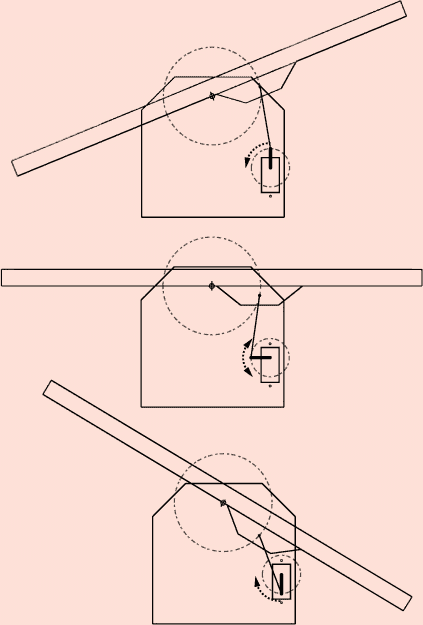

四杆联动是将物体的旋转运动（例如伺服电机的旋转）转换为不同运动（如梁的上下运动）的一种神奇方式。工程师和机器人专家经常使用这些机制和联动来让物体移动。

将联动装置的另一端通过电枢支架上的孔挂入，如图 6-36 所示。

**图 6-36：** 将回形针联动的另一端挂到电枢支架上

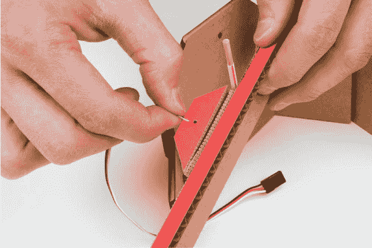

现在，将轴插入底座的一侧，小心地对齐另一侧，插入轴并通过匹配的孔，然后将底座另一端的标签粘合在一起（图 6-37 和 6-38）。

**图 6-37：** 将平衡梁安装到底座上

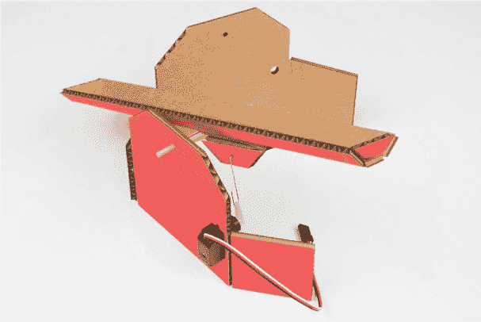

**图 6-38：** 完成的平衡梁项目

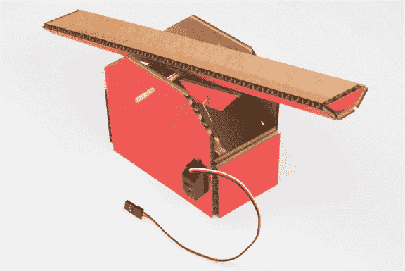

最后，将伺服电机重新连接到面包板电路中（图 6-39）。给 Arduino 供电，伺服电机应自动调整到正确的位置。旋转电位器并进行测试，确保联动和支点都按预期移动。如果没有，检查所有组件是否仍在原位，并确保没有掉落任何部件。

作为最后一步，我们建议添加一个额外的矩形底座支撑件。底座应大约为 2 × 3.75 英寸。将这块支撑件插入你的外壳底部，以增加额外的支撑。

**图 6-39：** 将伺服电机重新连接到面包板电路

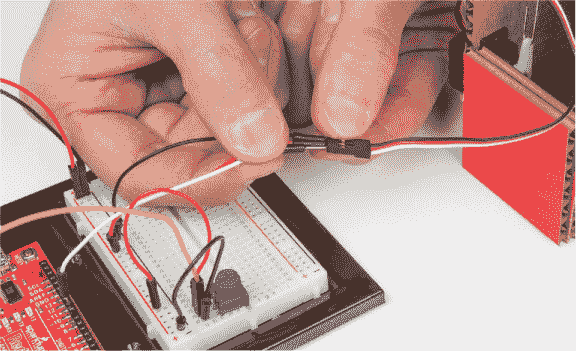

到此为止，你的项目已经完成！现在，找一个乒乓球或弹珠，测试你的控制和精度技能。你现在有了一个游戏，当你应该做一些更有生产力的事情时，可以玩一玩。你能在不掉落的情况下将球来回滚动多少次？挑战一个朋友，看看谁更厉害！

### 进一步探索

这个项目是了解 Arduino 中伺服电机和库的一个很好的入门。这里有很大的潜力，我们希望分享一些起点，供你玩转伺服电机。

#### 黑客

将电位器替换为来自项目 5 的光传感器电路。你需要添加一个 10 kΩ电阻，并调整你使用的缩放值。现在，把手上下移动在光传感器上方来控制球的运动。去挑战一下你的朋友吧！你是更擅长使用光传感器还是电位器呢？

#### 修改

你可以为你的平衡梁添加一个“自动驾驶”模式，让它自动平衡球。为此，你需要在电路中添加一个开关。正如你在项目 5 中看到的，开关类似于按钮，能够在电路中接通或断开连接，但在开关中，连接会保持不变，直到再次切换。你将使用的开关称为*单刀双掷（SPDT）*开关，如图 6-40 所示。这是一个专业术语，意味着有一个公共引脚和两个可以连接的选项。当开关处于最左边位置时，它连接中心引脚和左边引脚；当开关处于最右边位置时，它连接中心引脚和右边引脚。

**图 6-40：** 单刀双掷开关

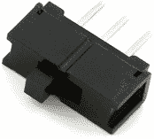

当正确接线时，这个开关将充当开关，允许你读取它是设置为 5V 还是接地。将开关放置在面包板上，确保每个引脚都有自己的接孔。我们将开关放置在面包板的顶部，如图 6-41 所示。与电位器相似，使用两根较短的跳线将开关的两个外侧引脚连接到面包板的 5V 和接地电源轨。使用第三根跳线将开关的中心引脚连接到 Arduino 的第 12 引脚。该电路的完整示意图见图 6-41。

**图 6-41：** 带有模式选择开关的最终电路

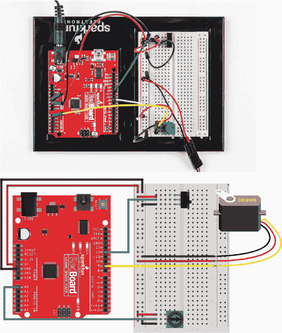

中心引脚是信号引脚，会根据开关的位置读取`HIGH`或`LOW`。你将使用这个信号引脚与一些基本逻辑配合，切换手动控制（使用电位器）和自动驾驶（使舵机自行前后移动）模式。

从本书的资源网站*[`www.nostarch.com/arduinoinventor/`](https://www.nostarch.com/arduinoinventor/)*下载并上传*P6_AutoBalanceBeam.ino*草图到你的 Arduino。查看草图中的注释，了解它是如何工作的。

记住，如果在切换自动驾驶模式时光束没有居中，球很可能会掉下来。可能需要尝试几次，但当你成功时，它看起来就像魔法一样！看看我们的视频，展示了这里运行的情况：[`www.nostarch.com/arduinoinventor/`](https://www.nostarch.com/arduinoinventor/)。
