## 第八章：7 微型桌面温室

温室有各种形状和大小，从由塑料薄膜制成的小型室内温室到占地几千平方英尺的大型工业温室应有尽有。然而，并非每个人都想要一个全尺寸的温室，因此在本项目中，你将构建一个较小的模型，可以放在桌面上（见图 7-1）。

**图 7-1：** 微型桌面温室

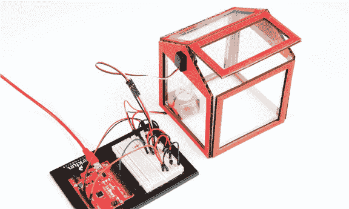

在传统的温室中，透明玻璃或塑料窗格允许光能进入，来加热温室的内部，而温室被密封以困住温暖的空气，从而导致整体温度的升高。当然，危险在于温室可能会变得*过于*炎热。为了调节温度，许多温室配有风扇和*自动通风口*，当温室内温度过高时，自动开启顶部的窗户以通风。

你的温室也将配备一个自动通风口。你将构建一个温室控制器，监测温度，如果温度过高，窗户将打开，风扇将启动。

**温室效应**

温室足够温暖，可以全年种植蔬菜，因为它们能够捕捉并储存能量。地球的大气层类似于温室。太阳的热量由地球辐射出来，然后被大气层反射并捕获。这种独特的特性被称为*温室效应*，它负责保持我们星球的温度适宜并宜居。如果没有它，我们星球的温度将接近 0 华氏度（–18 摄氏度）！

温室效应的另一个常见例子是夏天中午的汽车。若车窗关闭，车内温度可以比外部温度高出 20 到 30 度。这就是为什么你绝对不能把宠物留在车内——尤其是在夏天！

### 收集材料

为了提升自动通风口，本项目使用了一种与第 6 项目中平衡梁使用的伺服电机类似的电机。我们还将在这个项目中介绍三种新零件：用于风扇的小型直流电机，*晶体管*用来控制电机，以及*温度传感器*用来检测温室内的温度。

当你收集零件时，你会发现晶体管和温度传感器非常相似——它们都是小巧的三脚设备，带有一个圆形的黑色塑料端，边缘是平的（见图 7-2）。为了区分它们，可以将平边对准光源，你应该能看到一些印刷标记；温度传感器上应标有字母*TMP*。收集好零件，见图 7-3 和 7-4，然后我们开始吧！

**图 7-2：** TMP36 温度传感器（左）和 2N2222 晶体管（右）

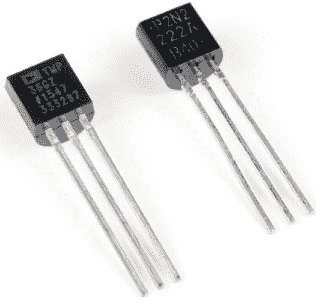

#### 电子元件

• 一个 SparkFun RedBoard（DEV-13975）、Arduino Uno（DEV-11021）或任何其他兼容 Arduino 的板子

• 一根 USB Mini-B 电缆（CAB-11301 或你板子的 USB 电缆）

• 一个无焊面包板（PRT-12002）

• 一个 330Ω电阻（COM-08377，或 COM-11507，包含 20 个包装）

• 一个二极管（COM-08588）

• 一个 NPN 晶体管—2N2222 或 BC337（COM-13689）

• 一个 TMP36 温度传感器（SEN-10988）

• 一个爱好电机（ROB-11696）

**注意**

*带星号（*）的零件不包含在标准 SparkFun 发明者套件中，但可以在单独的附加套件中找到。*

• 一个亚微型伺服电机（ROB-09065）

• 男对男跳线（PRT-11026）

• 男对母跳线（PRT-09140*）

**图 7-3：** 微型桌面温室的组件

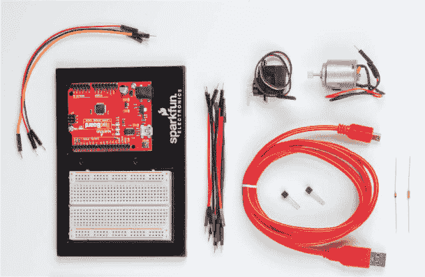

#### 其他材料和工具

• 铅笔（未显示）

• 工艺刀

• 金属尺

• 尺子

• 尖嘴钳

• 线剪

• 胶水（热熔胶枪或工艺胶水）

• 遮蔽胶带（未显示）

• 纸板（约一张 11 × 17 英寸或三张 8.5 × 11 英寸的纸）

• 外壳模板（请参见图 7-18 和第 208 页）

• 一张透明胶片（8.5 × 11 英寸，未显示）

• 1 个中型回形针（未显示）

**图 7-4：** 推荐的工具和材料

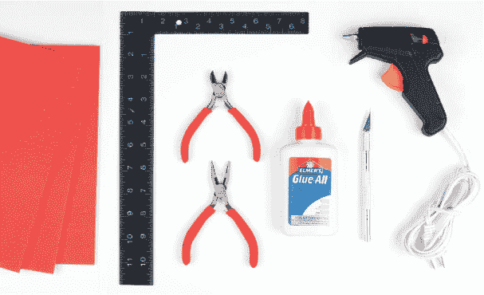

### 新组件

首先，让我们看一下新的组件，从温度传感器开始。

#### TMP36 温度传感器

你已经知道如何测量光照强度。通过这个小巧的传感器，你还可以测量温度。TMP36 是最容易使用的温度传感器之一。传感器本身被封装在一个小型塑料外壳中，形状像一个带平边的圆柱体，并且只有三个引脚。（记得将平边朝向光源，以便识别字母*TMP*，这样就不会将其与晶体管混淆。如果显示的是 2N2222 或其他内容，那就是错误的部件。）

正确连接电源后，TMP36 传感器将产生与其所感应的温度成正比的电压。类似于你在项目 5 中测量光照强度或在项目 6 中测量电位器位置的方式，你可以使用`analogRead()`来测量该传感器上的电压。我们将在本项目中展示如何将该电压转换为温度读数。

#### 标准爱好电机

为了让空气流动穿过温室，你将使用一个小型爱好者电机来制作风扇，如图 7-5 所示。这是最简单类型的电机。当你将它的两根电线连接到电源时，电机会旋转，反向连接时，电机会朝相反方向旋转。不同于你在项目 6 中使用的伺服电机，这个爱好者电机会连续旋转。爱好者电机工作电压在 3V 到 6V 之间，所以非常适合 Arduino 项目。

**图 7-5：** 标准直流爱好电机

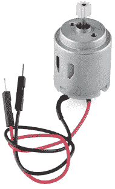

#### NPN 晶体管

晶体管的发明使得创造各种数字设备成为可能。例如，Arduino 上的微控制器实际上由数百万个晶体管组成。晶体管属于一类叫做*半导体*的元件。半导体是一种设备，它有时表现得像导体，允许电流流动，而有时像绝缘体一样，阻止电流流动。

本项目通过提升 Arduino 的电流输出，使用晶体管像开关一样工作。爱好者电机大约需要 200-300 mA 的电流，但 Arduino 的`OUTPUT`引脚最多只能提供约 40 mA 的电流。通过一个简单的晶体管电路，我们将向你展示如何使用低电流的 Arduino 引脚触发晶体管开关，像开关一样打开或关闭。

### 采用系统化方法

为了组织起见，你将把这个项目分成三个独立的部分或子系统来构建。这种被称为*系统化方法*的技术，工程师用来将一个复杂的项目分解成几个可以单独构建和测试的可管理部分。三个不同部分的主要组件是温度传感器、伺服电机（用于自动通风）和直流电机（用于风扇）。这三部分的原理图如图 7-6 所示，整个项目的接线图如图 7-7 所示。

**图 7-6：** 电路的原理图

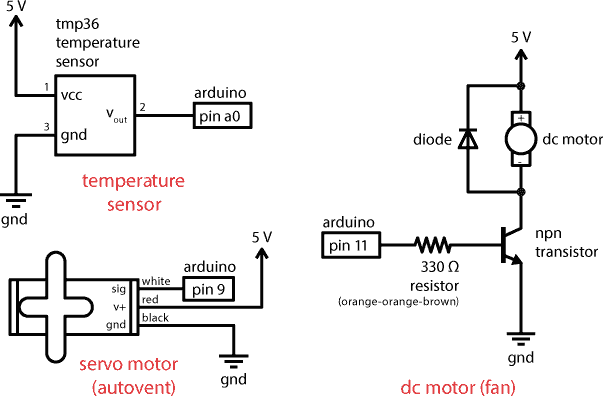

**图 7-7：** 电路的接线图

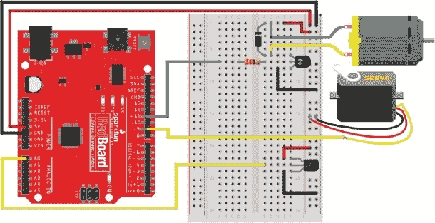

### 构建温度监控器

首先，让我们来看一下温室控制系统中用于测量温度的部分。市面上有许多不同的温度传感器。你可能会遇到几种常见类型，比如*热敏电阻*，它根据温度变化电阻值，和*热电偶*，它输出一个非常小的电压（低于 10 mV），并需要一个放大器电路来使用。TMP36 是一种第三类传感器，它简单地输出一个电压，经过校准，在 25 摄氏度时为 0.75 V。随后，电压会根据周围环境的温度线性变化。这意味着随着温度变化，电压也会相应变化，如图 7-8 所示。

**图 7-8：** TMP36 传感器的线性温度与电压响应

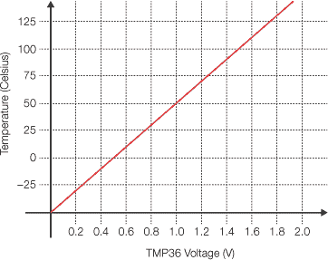

#### 使用 TMP36 测量温度

TMP36 是最容易使用的温度传感器之一。该传感器被封装在一个小塑料外壳中，外形像一个带有平边的圆柱体，并且只有三个引脚。

如前所述，TMP36 与晶体管非常相似，而晶体管也包含在 SparkFun 发明家套件中，因此通过在光源下倾斜部件并检查其平面边缘，查看是否有*TMP*字母。如果是*2N2222*或其他字母，则表示该部件不正确。

TMP36 提供的电压输出与周围环境的摄氏温度直接相关。既然你已经知道如何使用 `analogRead()` 命令测量电压，那么这个传感器就容易使用了。

外侧引脚用于接地和电源连接，中间的引脚是传感器的电压信号。要使用 TMP36，只需将一个引脚连接到 5 V，一个引脚连接到地线，感应引脚连接到 Arduino 模拟引脚以读取温度。请注意传感器的连接方式。当平面朝左时，顶部引脚应连接到 5 V，底部引脚应连接到地线。在 25 摄氏度时，感应引脚的电压读数将为 0.750 V（750 毫伏）。随着温度变化，该引脚的电压将按每摄氏度 0.010 V（10 毫伏）的速率变化。现在，这些数字听起来可能有些复杂，但我们将向你展示如何使用这些信息在代码中获取实际的温度读数，并将其转换为华氏度。不过，在此之前，我们先进行接线。

#### 连接温度传感器

图 7-9 显示了温度监测电路的单独接线。你大部分的元件将位于面包板的右侧，因此需要将 Arduino 板上的 5 V 和 GND 通过跳线直接连接到面包板右侧的电源轨。接着，将 TMP36 传感器插入面包板的下半部分，确保传感器的平面朝左，如 图 7-9 所示。

**图 7-9：** 显示只有温度传感器的简化接线图

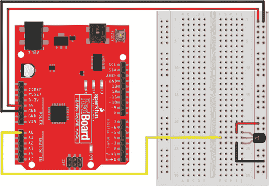

接下来，使用两根短跳线将 TMP36 传感器的顶部引脚连接到 5 V，将底部引脚连接到地线，确保平面朝左。中间的引脚是传感器的输出电压。将这根引脚通过跳线连接到 Arduino 板的 A0 引脚，就完成了！

现在让我们看看一个代码示例，了解如何从这个传感器获取温度读数。

#### 编程温度传感器

TMP36 传感器根据环境温度产生电压输出。TMP36 的数据手册提供了将电压读数转换为温度的几个参考点：它显示电压变化率为每摄氏度 0.010 V，在 25 摄氏度时，传感器的电压为 0.750 V。利用这些信息，如果你测量传感器的输出电压，你可以在代码中将其转换为温度读数。

你可能还记得 项目 5 中提到的，`analogRead()` 函数将电压读取为整数，其中 5 V 对应 `1023`，0 V 对应 `0`。为了理解这个数值，你需要将其转换为电压，再将电压转换为摄氏度，最后将其转换为华氏度。为了让代码更简洁，首先你需要编写一个自定义函数，将原始的 `analogRead()` 数字转换为电压。

##### 创建自定义转换函数

示例 7-1 展示了一个自定义函数的例子，该函数会将原始的`analogRead()`值转换并返回转换后的电压值。

**示例 7-1：** 自定义函数`volts()`将原始模拟值转换为电压

```
➊ float ➋volts(➌int rawValue)
  {
➍   const float AREF = 5.0;
➎   float calculatedVolts;
➏   calculatedVolts = rawValue * AREF / 1023;
➐   return ➑calculatedVolts;
  }
```

在项目 3 中，我们展示了如何编写自己的自定义函数，以简化代码并使`loop()`更易于阅读。在这些示例中，函数的数据类型始终设置为`void`，因为这些函数没有返回值。在这种情况下，你希望函数能够返回从`analogRead()`转换为电压的结果，因此需要指定数据类型。使用数据类型`float` ➊，因为你希望此函数返回尽可能精确的小数位数。命名该函数为`volts` ➋，以使其尽可能简洁又具有描述性，然后定义传递给此函数的参数 ➌，在这个例子中，它就是来自`analogRead()`的原始值。

将原始的`analogRead()`值转换为电压所需的数学计算非常简单，因为正如我们之前提到的，我们已经知道`analogRead()`函数在输入 5 V 时返回`1023`，在输入 0 V 时返回`0`。这意味着`analogRead()`的值`1023`等于 5 V。自定义的`volts()`函数利用这个比率将原始的`analogRead()`测量值转换为电压。

**注意**

*通常的做法是使用全大写字母来表示常量或常量名称。*

首先，声明一个作为引用使用的变量，命名为`AREF` ➍，并用它来定义参考电压，即 5.0 V。由于你将在整个代码中使用它，因此使用`const`关键字将其设置为常量。

接下来，你将定义一个变量来存储转换结果，命名为`calculatedVolts` ➎。注意，这个变量的数据类型也设置为`float`。你需要确保进行的数学运算在整数之外的部分也足够精确。为了计算电压，只需将`rawCount`乘以`AREF`（5.0 V）与 1023 的比率 ➏。

`return`指令 ➐ 是我们在之前的项目中没有使用过的命令。当程序执行到`return`指令时，它会退出自定义的`volts()`函数，并*返回*到调用该函数的代码位置。当你在`return`指令后面放置一个值时，函数会返回并报告该值。`return`的数据类型必须与函数的数据类型匹配。到目前为止，我们使用的所有函数都没有包含`return`，因为这些函数的定义数据类型是`void`，并且没有返回值。在这里，`return`指令后跟着变量`calculatedVolts` ➑，这告诉程序返回`calculatedVolts`的值到调用它的代码位置。

请注意，`return`指令也可以与具有`void`数据类型的函数一起使用，以指示草图退出该函数并返回。在这种情况下，`return`后面没有值（参见 Listing 7-2）。

**LISTING 7-2：** 一个带有`void`数据类型和`return`指令的自定义函数

```
void blink()
{
  digitalWrite(13, HIGH);
  delay(500);
  digitalWrite(13, LOW);
  delay(500);
  return;
}
```

##### 测试该函数

让我们用一个示例草图来测试新的`volts()`函数。在 Listing 7-1 的代码中，向`setup()`和`loop()`添加几行，读取 A0 引脚上的电压，并将其打印到串口监视器。完整的代码示例见 Listing 7-3。

**LISTING 7-3：** 测试模拟到电压的转换

```
//Example sketch – reads analog input from A0 and prints the
//raw analog value and the voltage
int rawSensorValue;
float rawVolts;

void setup()
{
  **Serial**.begin(9600);  //initializes the serial communication
  **Serial**.print("raw");
  **Serial**.print("\t");  //tab character
  **Serial**.print("volts");
  **Serial**.println();    //new line character
}

void loop()
{
  rawSensorValue = analogRead(A0);   //read in sensor value
  rawVolts = volts(rawSensorValue);  //convert sensor value
                                     //to volts
  **Serial**.print(rawSensorValue);  //print raw sensor value
  **Serial**.print("\t");
  **Serial**.print(rawVolts);  //print raw voltage reading
  **Serial**.println();        //new line character
}

/***********************************************************/
float volts(int rawCount)
{
   float AREF = 5.0;
   float calculatedVolts;
   calculatedVolts = rawCount * AREF / 1023;
   return calculatedVolts;
}
```

将你的 Arduino 板通过 USB 电缆连接到计算机，上传此示例代码，然后打开串口监视器。你应该会看到文本在屏幕上滚动，就像在 Figure 7-10 中那样。根据这个结果，模拟值 156 等于 0.76V。你可以使用以下计算来检查输出电压：156 × (5.0 / 1,023) = 0.762 V。当数学运算结果正确时，总是很棒！

**FIGURE 7-10：** 串口监视器输出的原始传感器值和电压

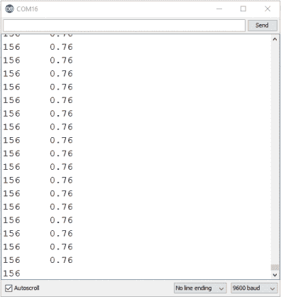

如果在`loop()`中没有额外的`delay()`命令，Arduino 每秒大约读取传感器 80 到 90 次，并将信息发送回计算机。这就是为什么你会得到一连串的读数，而不是单个读数。如果你希望减慢草图打印读数到屏幕的速度，只需在`loop()`的末尾、最后一个`Serial.println();`之后添加`delay(1000);`。这将使循环速度变为每秒一个读数，从而不会像之前那样快速流动。你将在稍后的代码中实现这一点。

还有一步需要做，让草图显示温度而不是电压。

##### 将电压转换为温度

现在你需要一个公式来将电压转换为温度。你知道 TMP36 输出的电压会根据它感应到的温度线性变化，这意味着随着温度变化，电压也会按比例变化。因此，为了创建一个公式，你将使用*斜率-截距*方程：

*y* = *mx* + *b*

这个方程描述了一条直线，或者更一般地，描述了两个变量 *x* 和 *y* 之间的关系，其中 *m* 是描述变化率的斜率，*b* 是 y 截距，表示该直线与 y 轴的交点。在这种情况下，两个变量 *x* 和 *y* 分别是电压和温度，你将使用已知的变量 *x*（电压）来计算未知的变量 *y*（温度）。

如前所述，温度传感器的数据手册指出，电压变化的速率是每摄氏度 0.010 V，或者每 100 摄氏度 1 V。这个速率是直线的斜率，因此在方程中成为 *m*。如果你代入变量，方程将如下所示：

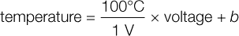

TMP36 的数据表还提供了一个参考点，用于将电压映射到摄氏度：在 25 摄氏度时，传感器的电压为 0.750 V。将这些数值代入公式中以求解 y 轴截距 *b*：

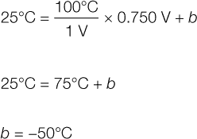

现在你有了 *m* 和 *b* 的数值。下面是最终的公式：

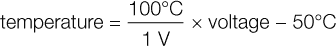

这是一种可以应用于任何具有与电压成线性关系的传感器的技术。这也是一个很好的提醒，表明数学是重要且有用的。不过，如果这些内容让你感到困惑，别担心——你只需要知道的是，要找到传感器的温度，你只需将电压读数代入这个公式即可。

现在，在代码中使用这个公式将 `rawVolts` 读数转换为温度。你将从列表 7-3 中的示例代码开始，并添加列表 7-4 中的新代码，以显示来自传感器的温度读数。

**列表 7-4：** 将电压转换为温度

```
  //Example sketch – calculates the temperature from the TMP36
  //sensor and prints it to the Serial Monitor
  int rawSensorValue;
  float rawVolts;
➊ float tempC;
  float tempF;

  void setup()
  {
    Serial.begin(9600);  //initializes the serial communication
    Serial.print("raw");
    Serial.print("\t");  //tab character
    Serial.print("volts");
➋   **Serial**.print("\t");
    **Serial**.print("degC");
    **Serial**.print("\t");
    **Serial**.print("degF");
    Serial.println();
  }

  void loop()
  {
    rawSensorValue = analogRead(A0);   //read in sensor value
    rawVolts = volts(rawSensorValue);  //convert sensor value
                                       //to volts

➌   tempC = 100 * rawVolts – 50;  //convert volts to deg. C
➍   tempF = 1.8 * tempC + 32;     //convert deg. C to deg. F

  --*snip*--
    Serial.print(rawVolts);  //print raw voltage reading
➎   **Serial**.print("\t");
    **Serial**.print(tempC);
    **Serial**.print("\t");
    **Serial**.print(tempF);
    Serial.println();        //new line character
➏   delay(1000);
  }

  /***********************************************************/
  float volts(int rawCount)
  --*snip*--
```

首先，在全局命名空间顶部添加两行代码来声明用于存储摄氏度温度 (`tempC`) 和华氏度温度 (`tempF`) 的变量 ➊。接下来，在 `setup()` 中添加几行代码，使用适当的列标题来显示打印到串口监视器上的读数，并用制表符分隔，它由控制字符 `\t` 表示 ➋。现在，你可以使用斜截式方程来计算摄氏度温度 ➌。最后，你还会添加一行代码，将温度从摄氏度转换为华氏度 ➍。

此外，为了提供更多反馈，添加一些额外的 `Serial.print()` 行，确保将新变量 ➎ 打印到串口监视器上。注意，最后一行 `Serial.print()` 实际上是一个 `Serial.println()` 命令，它插入了换行符并将光标移动到下一行。这将确保每个新的读数从新的一行开始。最后，添加 1 秒的延迟 ➏ 以减慢循环速度，确保每秒只采样一次，给你足够的时间查看文本。

上传更新后的代码到你的 Arduino，并打开串口监视器。你应该会看到四列数据滚动在屏幕上，如图 7-11 所示。正如新列标题所示，这些数据分别代表原始数据、电压、摄氏度温度和华氏度温度。如果你用手指挤压温度传感器，你会注意到温度上升。恭喜你，你已经完成了一个工作温度监视器，这是这个项目的第一大部分！

**图 7-11：** 串口监视器显示来自 TMP36 的温度

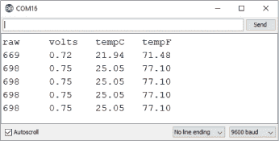

### 构建伺服电机自动通风装置

你将使用像项目 6 中使用的伺服电机来打开和关闭温室的窗户。伺服电机是一种简单的电动机，使用三根线分别连接控制信号（黄色或白色）、电源（红色）和地线（黑色），如图 7-12 所示。

**图 7-12：** 将伺服电机添加到电路中

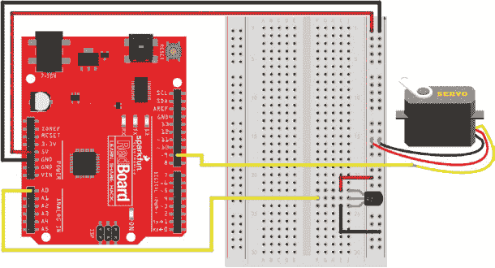

大多数标准伺服电机都有一个三针母连接器。将三根公对公跳线连接到这三根引脚上，以扩展这些连接，如图 7-13 所示。如果可能，最好将跳线的颜色与伺服连接器上的引线颜色匹配。然后，将黄色（或白色）信号线连接到 Arduino 板上的 9 号引脚。将红色线连接到 5V，将黑色线连接到面包板右侧的 GND。

**图 7-13：** 插入公对公跳线将伺服电机连接到面包板

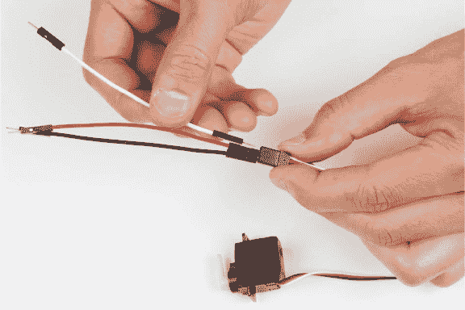

### 编程自动通风窗

添加清单 7-5 中的伺服代码。

**清单 7-5：** 添加伺服控制

```
➊ #include<**Servo**.h>
➋ **Servo** myServo;

  //Example sketch – calculates the temperature from the TMP36
  //sensor and prints it to the Serial Monitor
  int rawSensorValue;
  float rawVolts;
  float tempC;
  float tempF;
➌ int setPoint = 85;
  int returnPoint = 83;

  void setup()
  {
    myServo.attach(➍9, 1000, 2000); //initializes myServo object
    Serial.begin(9600);  //initializes the serial communication
    --*snip*--
  }

  void loop()
  {
    --*snip*--
    Serial.println();    //new line character

➎   if(tempF > setPoint)
    {
      myServo.write(180);
    }
    else if(tempF < returnPoint)
    {
      myServo.write(0);
    }
    delay(1000);
  }

  /***********************************************************/
  float volts(int rawCount)
  --*snip*--
```

回想一下项目 6，要使用伺服电机，你需要包含伺服库 ➊ 并创建一个名为`myServo`的伺服对象 ➋。接下来，创建两个变量 ➌ 来定义控制系统的*设定点*。这些设定点是窗户自动打开和关闭的温度。注意，`setPoint`（打开窗户）比`returnPoint`（关闭窗户）高 2 度，这意味着窗户不会在这 2 度之间打开或关闭。这种控制技术被称为*滞后*，对于温度可能会有轻微波动的系统非常有用，它能防止窗户因温度变化微小而频繁地开关。

最后，你需要通过告诉 Arduino 伺服电机连接到 9 号引脚来初始化伺服电机 ➍。你可能会注意到，`myServo.attach()`命令有两个额外的数字，而不是你在项目 6 中使用的一个数字。要理解原因，请查看第 201 页的“伺服电机的工作原理”。

最后，在控制逻辑中，你将使用嵌套的`if()`–`else if()`控制语句。将 8 行代码添加到➎，位于`delay()`之前，用于在温度高于 85 华氏度（`setPoint`）时将伺服电机移动到 180 度位置，在温度降到 83 华氏度以下（`returnPoint`）时将伺服电机返回到 0 度位置。这将打开和关闭自动通风窗。

从清单 7-5 上传更新后的代码到你的 Arduino，并打开串行监视器。通过用手指夹住传感器或将手掌围绕传感器吹气，使其温度超过 85 度，来试试。观察串行监视器，看看温度是否上升。一旦温度达到 85 度，你应该能听到伺服电机的声音，它会转到指定位置。现在，让温度传感器静置并冷却。一旦温度降到`returnPoint`以下，你应该再次听到伺服电机的声音，它会返回到 0 度位置。挺酷吧？

现在你将构建最终组件：风扇。

### 构建风扇电机

风扇将通过一个小型直流爱好电机旋转，这是一种标准的圆柱形设备，具有两根导线和一个中心轴，当你给它施加电压时，轴会旋转。你一直使用的伺服电机内部有齿轮，可以让它在非常精确的运动范围内移动。回想一下，它的运动范围大约只有 180 度。这里你将使用直流电机，而不是伺服电机，因为你需要风扇叶片在你持续施加电力时不断旋转。这使得它非常适合做风扇功能。你将使用的直流电机设计用于 3V 到 6V 之间的电压，但当它旋转时，电流大约在 200-300 毫安之间。而 Arduino 的`OUTPUT`引脚仅能驱动大约 40 毫安的电流，因此为了给直流电机提供足够的电流，你将构建一个额外的电路，称为*晶体管放大电路*——更技术性地说，是*共射极放大器*。

**伺服电机的工作原理**

伺服电机是一种根据来自微控制器的信号将电机移至特定位置的整洁设备。标准伺服电机具有大约 180 度的固定运动范围。

所有伺服电机都有三根线：一根白色（或有时是黄色或橙色）的信号线、一根红色的电源线和一根黑色的接地线。信号是一种每 20 毫秒发送一次的独特脉冲，频率为 50 赫兹。为了编码一个位置，微控制器会通过改变脉冲的宽度来指示电机将要转动的角度或位置（有关脉冲宽度调制的更多详情，请参见项目 5）。对于大多数标准伺服电机，1,000 微秒（1,000 μs）的脉冲表示 0 度位置，2,000 微秒的脉冲表示完全的 180 度位置，因此 1,500 微秒的脉冲表示伺服电机的中点或 90 度位置。

Arduino 的*Servo.h*库将脉冲宽度映射到电机的位置，但该库对伺服电机的位置和脉冲宽度有稍微不同的定义，0 度位置的脉冲为 544 μs，180 度位置的脉冲为 2400 μs。这使得该库能够与*扩展范围*的伺服电机一起工作，但超出了大多数标准伺服电机的限制。因此，当你使用像`myServo.write(0);`这样的命令时，电机会接收到一个 544 μs 的脉冲，并尝试超出其物理限制。如果发生这种情况，电机会抖动、嗡嗡作响并发热，因为它无法移动到与 544 μs 脉冲对应的位置。

为了抵消这个问题，你可以在代码中为伺服电机设置限制。如同在项目 6 中一样，使用命令`myServo.attach(9);`来初始化 Arduino 的 9 号引脚上的伺服电机。你也可以添加参数来设置电机的上下脉冲宽度限制，像这样：`myServo.attach(9, 1000, 2000);`。通过这个初始化，命令`myServo.write(0);`将使电机移动到 0 度角的位置，并且不会发生抖动、嗡嗡声或发热。

如果你想了解更多关于伺服电机如何工作的内容，可以查看 SparkFun 上的教程，网址是*[`www.sparkfun.com/tutorials/283/`](https://www.sparkfun.com/tutorials/283/)。*

一个晶体管有三个引脚：集电极（C）、基极（B）和发射极（E）。任何流入基极的电流都会在集电极引脚上得到放大。基极就像一个控制门，允许电流从集电极流向发射极。你施加在基极上的压力越大，门就会开得越宽，更多的电流可以从集电极流向发射极。晶体管的奇妙之处在于，你只需在基极上施加少量电流，就能让大量电流从集电极流向发射极。如果你给基极提供过多的电流，可能会烧毁晶体管，所以就像你使用电阻限制 LED 电流一样，你会在电路中使用一个 330 Ω的电阻来限制流向基极的电流。

晶体管有许多不同的应用，如放大器和其他设备，但在这里你只需将其用作一个可控开关。尽管 Arduino 引脚只能提供少量电流，当你向晶体管的基极发送`HIGH`信号时，晶体管会“打开”。这允许电流在集电极和发射极之间流动。它本质上将这些引脚连接在一起，就像关闭一个开关。

晶体管的发射极一侧连接到接地轨道。注意电机的一侧连接到 5V 轨道，电机的另一侧连接到晶体管的集电极。当晶体管被打开时，这会将集电极连接到晶体管的发射极，从而关闭电机和地面之间的开关，使电机转动。工程师称之为“在截止模式和饱和模式之间操作晶体管”。电机的电源直接来自电源轨道。这意味着你可以使用 Arduino `OUTPUT`引脚提供的有限电流来控制需要更大电流的设备。

你将根据图 7-14 所示，在面包板的顶部部分搭建晶体管电路。

**图 7-14：** 添加风扇电机晶体管控制电路

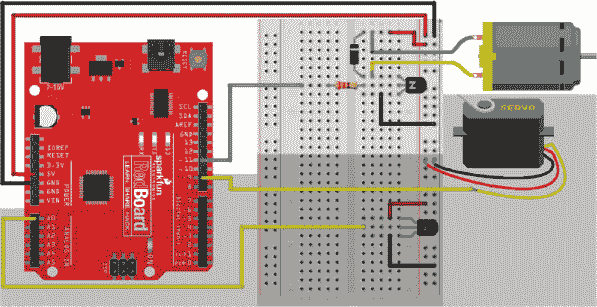

在你的工具包中找到晶体管。正如图 7-15 所示，晶体管看起来与温度传感器非常相似，但如果你仔细观察，你应该能看到外壳平面上的 2N2222 或 BC337。这是一个*NPN 晶体管*，它将作为你用 Arduino 控制的电机开关。

**图 7-15：** 本项目中使用的 NPN 晶体管——2N2222（左）和替代部件 BC337（右）

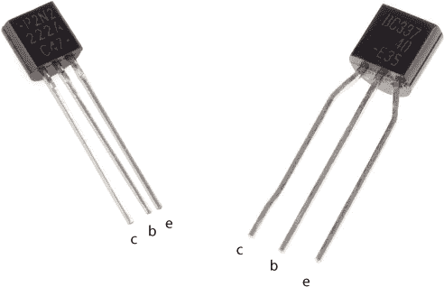

将晶体管保持平面朝左，并将其插入面包板的顶部部分，使顶部引脚大约在六行下方，如图 7-14 所示。在这个位置，顶部引脚是集电极，中间是基极，底部是发射极（见图 7-15）。

将一个 330 Ω的电阻连接到基极引脚，并将其拉伸穿过面包板中的沟槽，如图 7-14 所示。然后，将该电阻的另一端连接到 Arduino 的 11 号引脚，这样 11 号引脚就通过 330 Ω的电阻连接到基极引脚。这是来自 Arduino 的低电流控制信号，用来开关晶体管。当晶体管开启时，电流将通过电机，电机将转动。

将一根小跳线从晶体管的发射极（下端引脚）连接到地线。最后，将电机的一根线连接到晶体管的集电极（上端引脚）。电机会根据你使用的电线不同而顺时针或逆时针转动，但在这个情况下，电机的转动方向并不重要，你可以选择任意一根电机线。将电机的另一根线连接到电源轨，然后使用跳线将面包板的电源轨连接到 Arduino 的 5V 端。当在基极引脚上检测到微小的电流信号时，集电极和发射极之间的连接被闭合。这时，电流从 5V 通过电机到 GND，完成了一个电路路径，从而使电机开始转动。图 7-16 展示了电机的电路。

**图 7-16：** 用 Arduino 引脚驱动电机的晶体管电路

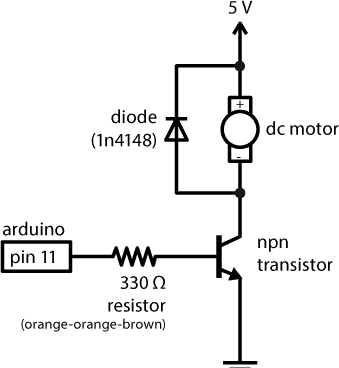

该电路的最后一个部分是一个保护二极管，有时也称为*反向二极管*，它能够保护晶体管免受电机可能造成的损坏。在电机内部，有许多线圈，这些线圈通过产生电磁场，推动和拉动电机中的永久磁铁—这就是导致轴转动的原因。线圈是电子学中非常有趣的元件。它们产生的磁场实际上是一种储存能量的形式，当电路关闭时，这种储存的能量会反弹并导致电压尖峰，进而损坏晶体管。反向二极管为这些电压尖峰提供了一个泄放的通道，从而避免电压通过晶体管。它有时也被称为*缓冲电路*。

为了正确连接这个元件，需要注意的是二极管是*有极性的*，其方向是有区别的。二极管的本体在一端有一条线或带，如图 7-17 所示。确保带有标记的那一侧连接到电机的正极（5V）。

**图 7-17：** 用于晶体管电路中的反向二极管，旁边放有一个硬币以作大小对比

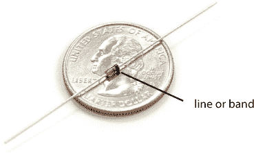

将二极管添加到电机中，确保带有标记的一侧连接到电机的 5V 电线，如图 7-16 中的电路图所示。将二极管的另一脚连接到电机的另一根线—即连接到晶体管集电极引脚的那根。这意味着二极管的两脚与电机的两根线共享相同的连接。当两个设备这样连接时，我们称它们是*并联*连接的。

现在你应该已经完成了一个完整的电路，其中包括图 7-6 中的三个子电路。接下来你需要再添加几行代码来控制电机。

#### 编程风扇电机

控制电机的代码非常简单，就像你用来控制 LED 开关的代码一样。将清单 7-6 中的代码添加到你当前的草图中。

**清单 7-6：** 完整的微型桌面温室控制代码

```
  #include<Servo.h>
  Servo myServo;
  --*snip*--

  void setup()
  {
➊   pinMode(11, OUTPUT);
    myServo.attach(9, 1000, 2000);
    Serial.begin(9600);  //initializes the serial communication
    --*snip*--
  }
 void loop()
  {
    --*snip*--
    Serial.println();    //new line character

    if(tempF > setPoint)
    {
      myServo.write(180);
➋     digitalWrite(11, HIGH);  //turn the fan on
    }
    else if(tempF < returnPoint)
    {
      myServo.write(0);
➌     digitalWrite(11, LOW);   //turn the fan off
    }
    delay(1000);
  }

  /***********************************************************/
  float volts(int rawCount)
  {
    const float AREF = 5.0;
    float calculatedVolts;
    calculatedVolts = rawCount * AREF / 1023;
    return calculatedVolts;
  }
```

只有几行新代码。第一行是在`setup()`中。这一行设置了 11 号引脚，该引脚通过晶体管连接到电机，设为`OUTPUT` ➊。接下来是`if()`-`else if()`条件语句块。在这里，你添加了两条命令来打开电机 ➋ 和关闭电机 ➌。记住，电机实际上是温室的风扇。通过这些额外的代码，风扇将在窗户打开时启动，窗户关闭时停止。

添加完这些代码行后，将最新版本上传到你的 Arduino，打开串口监视器，重新测试一次。尝试通过将温度传感器夹在手指间或使用呼吸加热它，看看会发生什么。当温度读数接近 85 华氏度时，舵机电机应该开始工作，爱好电机也应该启动。你可能会注意到，一旦电机启动，温度读数就会完全失常。这里涉及的内容较多，但我们有一个快速的解决方法。

#### 隔离电机效应

当电机开启时，由于电机的额外电流负载，Arduino 的电压会下降到大约 4.1-4.5 伏。你可能会发现，电机启动后，温度读数开始不规则变化，而且电机可能会反复开关几次，直到温度读数稳定下来。我们之前提到过，当使用`analogRead()`时，`1023`等于 5 伏，但这只是部分正确。完整的事实是，`1023`等于源电压的大小，所以如果源电压降到 4.1 伏，那么`1023`现在就等于 4.1 伏。这会影响 Arduino 获取准确测量值的能力。

为了纠正这个问题，在`loop()`的开头，即第一个大括号后，添加两行代码，告诉 Arduino 在读取温度传感器之前关闭电机：

```
digitalWrite(11, LOW);  //turn off the motor before
                        //reading sensor
delay(1);               //short 1 ms delay before
                        //reading sensor
```

现在，Arduino 会在读取温度传感器电压之前，关闭电机 1 毫秒。这会隔离电机的电压下降与`analogRead()`之间的干扰，而且不需要添加过多的代码。

添加这两行代码后，将新草图上传到你的 Arduino，再次尝试加热传感器。现在，它应该更加稳定地工作了。电路已搭建好，代码运行流畅，接下来是构建实际的温室结构。

### 构建微型桌面温室外壳

我们提供了一个使用纸板制作的温室外壳模板，但你可以使用任何你喜欢的材料。事实上，宜家出售一种叫做 SOCKER 的小型温室，你可以很容易地修改它来配合这个项目。

对于微型桌面温室，完成后的尺寸大约为底座 4.5 × 4.5 英寸，最高点为 6 英寸。在* [`www.nostarch.com/arduinoinventor/`](https://www.nostarch.com/arduinoinventor/)*提供的资源中，我们有两个模板选项：一个是分成三张 8.5 × 11 英寸的纸板（如图 7-18 所示），另一个是单张 11 × 17 英寸的纸板。

**图 7-18：** 微型桌面温室纸板外壳模板（非全尺寸）

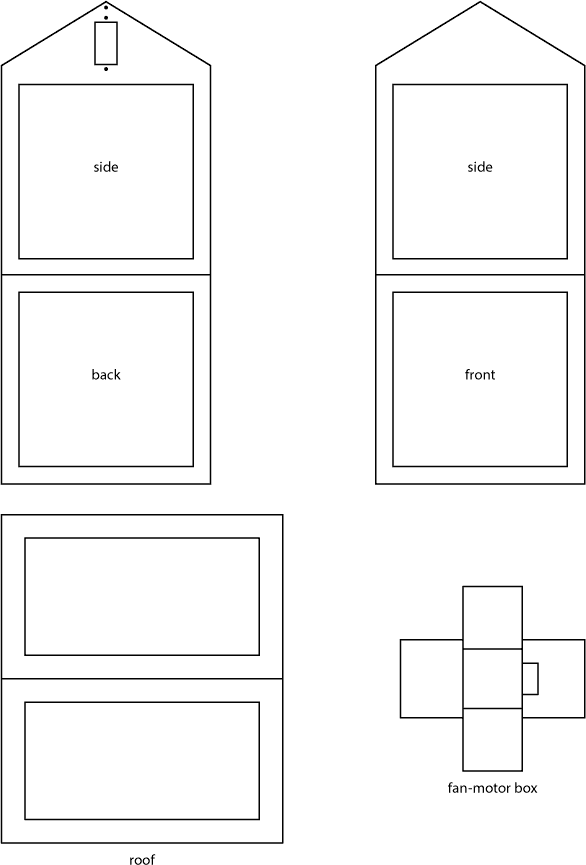

小心地从纸板上剪下模板的各个部分。这里有四个独特的部分：五边形的侧面、前后方的正方形墙壁、屋顶窗户和风扇电机支架。取一块正方形的侧面和一块五边形的前后墙面，将它们并排放置，透明面朝上。使用一条窄胶带将这两块固定在一起，如图 7-19 所示。重复此过程，直到所有四个侧面墙壁都固定好，但不要把最后两面墙壁贴合；将封闭部分平放，直到加上窗户。

**图 7-19：** 使用窄条胶带将各个部分固定在一起。

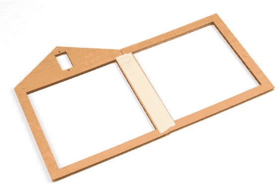

现在，你需要将六块透明薄膜切割成稍大于每个墙壁和窗户开口的大小。根据我们提供的模板，你需要四块尺寸为 4.25 × 4.25 英寸的正方形和两块尺寸为 4.25 × 2.5 英寸的正方形。你应该能够从一张透明薄膜中切出这六块；建议先将它们描绘出来，这样可以最大限度地利用薄膜。此时，你只需要固定侧墙的窗户；屋顶窗户将在最后加上。使用一条胶水或小片胶带，将这些窗户固定在温室的内侧，与胶带同一侧，如图 7-20 所示。

**图 7-20：** 小心地将透明薄膜窗对齐并粘贴到纸板上。

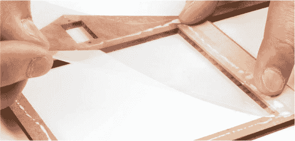

一旦这些透明窗片到位，再沿最后一个裸露的边缘粘上一条胶带，将其连接起来，这样你就有了一个正方形的底座和一个像小温室一样的结构，如图 7-21 所示。温室的顶部和底部应该仍然是开放的，可能还会感觉有些不稳定，但一旦你加上屋顶，整个结构就会稳定下来。

**图 7-21：** 温室四个侧面完成


#### 添加自动通风窗伺服电机

在我们的模板上，我们尽可能靠近窗户的枢轴点处为伺服电机做了一个小切口，以最大限度地增加窗户在伺服电机角度变化时的开度。断开伺服电机与电路的连接，如果伺服电机端没有安装伺服头，给伺服电机加一个。我们推荐使用单面伺服头，因为它能更清楚地显示伺服电机的指向。用手指轻轻顺时针旋转伺服电机，直到它停止，设定电机在 180 度的位置。这个位置是窗户完全打开时伺服头的位置。卸下并重新安装伺服头，使其朝上，方向与伺服电机背面出来的电线相反，如图 7-22 所示。

**图 7-22：** 伺服电机角度为 180 度——顺时针旋转


现在，将伺服电机从温室内部的模板孔中穿过，使电线朝下，伺服头朝上（见图 7-23）。

**图 7-23：** 将伺服电机放入温室

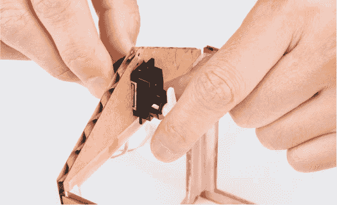

伺服电机的接头应该与纸板平齐。你可以使用随伺服电机附带的螺丝以及我们模板上的两个小螺孔来固定伺服电机，或者使用一些热熔胶将其固定在合适位置。

#### 制作纸夹连杆

如同在项目 6 中一样，你需要一个连杆将伺服头与窗户连接。取一个中号的回形针，拉直所有部分，除了末端的小钩子。然后，拿一个尺子，在离小钩子末端约 1 1/8 英寸的地方加上一个锋利的 90 度弯曲，弯曲方向远离钩子，如图 7-24 所示。

**图 7-24：** 弯曲纸夹连杆

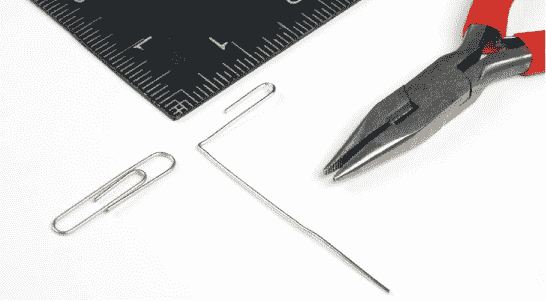

#### 添加屋顶

屋顶部分是一个矩形的纸板。按照图 7-25 所示，剪掉窗户，并在屋顶的中心线处做压痕。压痕边缘将作为窗户翻板的铰链，允许窗户开合。

**图 7-25：** 屋顶部分


将温室定位，使伺服电机在左侧。屋顶的一半将用胶水固定，另一半将形成一个可开合的窗户翻板。使用少量热熔胶，将屋顶的一半结构固定到温室上。只粘合屋顶的三条边（即六条边中的一半），这样仍然可以有一个可以打开的翻板。确保打开的一侧与伺服头运动的方向一致，如图 7-26 所示。

**图 7-26：** 固定屋顶。确保只粘合屋顶的一半，这样另一半才能打开。

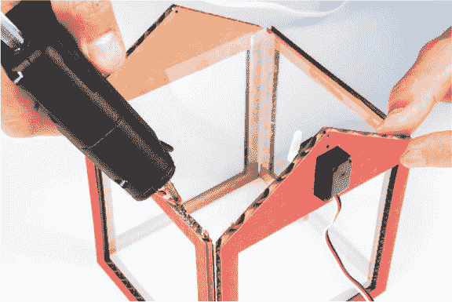

如图 7-27 所示，将回形针连杆挂到舵机角的最后一个孔上，圆形的钩子连接到舵机上。确保对面的弯曲部分指向舵机电动机的方向。这将挂在屋顶部件的框架上。

**图 7-27：** 舵机角和回形针连杆

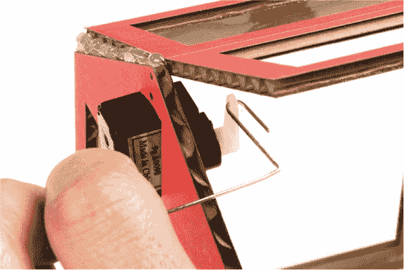

保持窗户翻盖打开，旋转回形针，直到您可以将其插入框架的侧面，通过纸板本身。如果回形针不够长，您可以重新弯曲它，或者将舵机角的角度稍微向上调整，以延长连杆的长度。将温室结构稍微抬起并从下方重新调整舵机角可能会有帮助。一旦您调整好舵机角，使其能够接触到位置，就可以将回形针的一端插入窗框的侧面，如图 7-28 所示。

**图 7-28：** 舵机臂连杆与窗翻盖连接

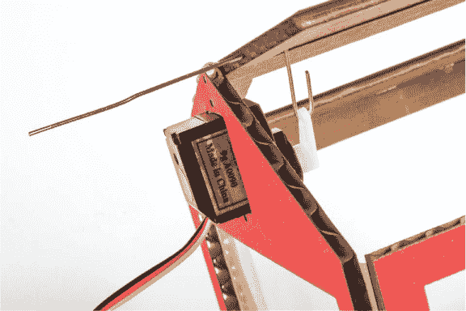

将从另一侧突出部分的回形针弯曲成钩形，以防止连杆掉出来（见图 7-29），然后将剩余部分剪掉。现在小心地前后移动舵机；您应该能够打开和关闭温室的盖子！

**图 7-29：** 舵机连杆中钩子的弯曲

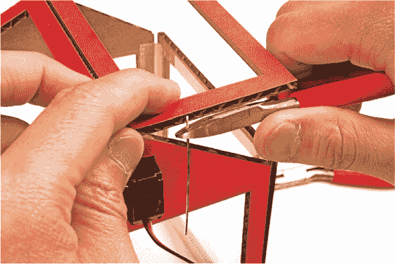

机制完成后，您可以将透明窗户粘贴或固定到温室的顶部。四个角落涂上一小点胶水即可将窗板固定住。窗板应该放在温室屋顶的外面，以便为连杆的开启和关闭留出空间。接下来，您将制作一个盒子来容纳电动机和风扇。

#### 制作风扇电动机盒

电动机将作为风扇来移动空气，以便在温室温度过高时帮助通风。为了防止电动机在旋转和振动时移动，我们设计了一个小纸板盒来固定它。模板设计为一个五面盒子，并且有一个小孔，以允许电动机电线通过，见图 7-30。

从一块硬纸板上剪下这个模板，并小心地在虚线处打折，使其可以折叠成一个盒子。使用胶带或热熔胶固定盒子的四个边，以确保它能紧密地容纳电动机（见图 7-31）。

要制作风扇叶片，您需要将一小块卡纸粘到电动机的末端。将风扇叶片剪裁成不超过 1.25 英寸宽。为了帮助风扇更好地移动空气，按图 7-32 所示折叠卡纸的边缘。

**图 7-30：** 风扇电动机盒

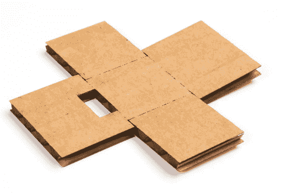

**图 7-31：** 完全组装的电动机盒，电动机位于其中

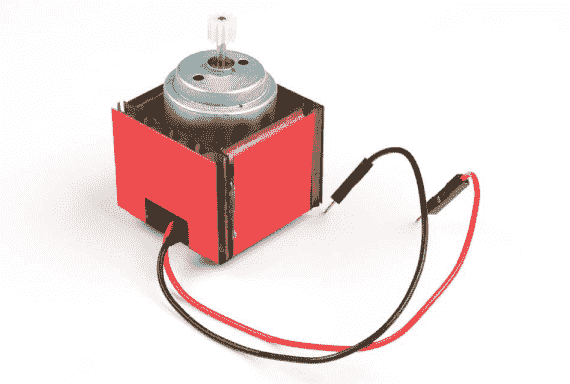

**图 7-32：** 最终风扇叶片


这样可以确保风扇不会碰到植物或温室内部的其他物体。使用少量热胶，将风扇叶片固定到电机上，如图 7-33 和图 7-34 所示。

**图 7-33：** 将风扇叶片固定到电机上

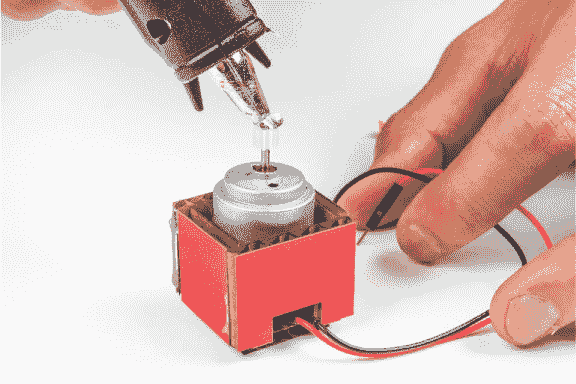

**图 7-34：** 风扇电机组件完成

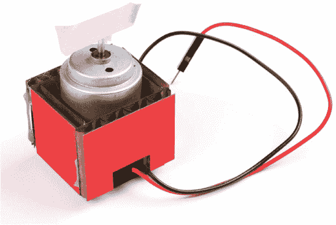

#### 连接它

现在你拥有了所有需要的组件来搭建你的迷你桌面温室，是时候安装电子设备了。将温度传感器从面包板上取下，使用三根公对母跳线来扩展传感器的连接，如图 7-35 所示。注意你移动的电线，并使用延长线重新连接它们。当你将温度传感器的平面朝向自己，针脚朝左时，顶端的针脚是电源，中间的针脚是信号，底部的针脚是接地。我们使用红色、黄色和黑色电线分别表示电源、信号和接地连接。

**图 7-35：** 使用公对母跳线扩展温度传感器

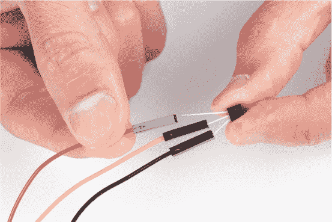

你需要将温度传感器放置在温室内部。使用一小块遮蔽胶带将温度传感器直接固定在植物上，然后将其放入新的温室中，如图 7-36 所示。现在你可以将电线从温室的一侧引出，或者你也可以打个小孔，将电线穿过。

**图 7-36：** 将温度传感器直接固定到你的植物上


同样，将风扇电机组件移动到温室的角落附近。电机的电线应该足够长，能直接连接到面包板，如果需要，你可以添加额外的公对母延长线来简化接线。

现在，你应该仍然有足够的空间让一小株植物舒适地休息在这个新建的小温室中。是时候把你的新异国植物放进去，安置到你全新的温室里！为了测试我们的自动通风系统如何有效地调节温度，我们用一些非常大的泛光灯模拟了室内阳光，来加热空气。

图 7-37 展示了我们在迷你桌面温室中的一项测试。

**图 7-37：** 测试迷你桌面温室

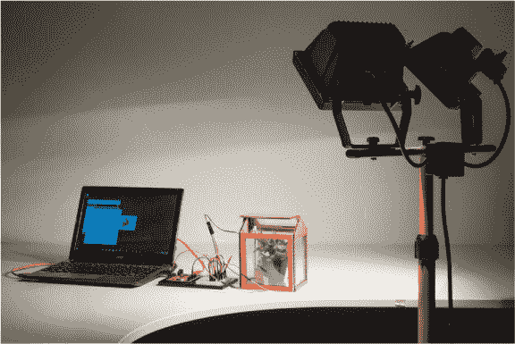

### 进一步探索

这个项目有很多提升的机会。

#### 黑客

目前，你的温室还挺小的。为了给更多的植物腾出空间，找一个像复印纸盒子那样大的纸箱，剪几个窗户，用透明膜覆盖窗户，然后将电子设备移到这个更大、更好的温室里。或者，看看 IKEA 卖的塑料温室。你可以在哪里安装伺服电机，以便你能开关这个温室的窗户？

#### 修改

当前的设定温度是 85 华氏度，虽然这是一个适合我们测试的温度，因为我们可以通过自己的体温轻松地提高温度，但实际上对于大多数植物来说，这个温度还是偏低。查找一下你植物的理想生长温度，并修改你的代码以使用这个新的设定温度。

你还可以修改温室采样温度的频率，通过延迟来调整。1 秒钟的延迟非常短。如果温度波动，盖子将在几秒钟内开关多次，这样会变得很烦人。将延迟时间更改为 5 分钟左右，即 30,000 毫秒。
