## 第九章：8 画图机器人，机器人艺术家

作为向 Logo 海龟项目的致敬，在这个项目中我们将制作一个画图机器人：一个你可以编程来移动和绘制的机器人。Logo 是由 Daniel G. Bobrow、Wally Feurzeig、Seymour Papert 和 Cynthia Solomon 于 1960 年代末期创立的编程语言。后来它被改编成支持一个带绘图笔的机器人，称为海龟（见图 8-1）。

**图 8-1：** Logo 海龟的早期版本

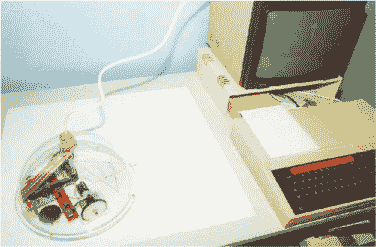

海龟被连接到计算机，以接收 Logo 语言中的移动命令，例如 `fd 10` 来驱动前进 10 步。当海龟移动时，它会用附带的笔绘制图形。这些 Logo 海龟是一个早期的教育系统，旨在通过视觉化的方式教授编程概念。

你将制作自己的 Arduino 控制的海龟，画图机器人（图 8-2），它的灵感来自 Seymour Papert 及其团队的工作。

**图 8-2：** 完成的画图机器人

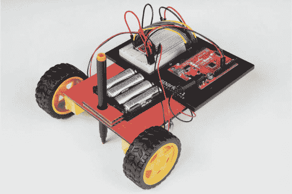

### 所需材料

你的机器人将有两个轮子，每个轮子都有一个电机，通过一个新的组件称为 *H-桥* 由 Arduino 控制。H-桥是一个小型模块化电路板，类似于你在上一个项目中使用的晶体管电路，只不过它可以让你控制电机的速度和方向。这将给你的机器人提供最大的灵活性和控制能力。收集好你的部件（如图 8-3 和图 8-4 所示），让我们开始吧！

#### 电子元件

• 一个 SparkFun RedBoard（DEV-13975），Arduino Uno（DEV-11021），或任何其他兼容的 Arduino 板

• 一条 USB Mini-B 数据线（CAB-11301 或你板子的 USB 数据线）

• 一个无焊接面包板（PRT-12002）

• 两个齿轮驱动的业余电机（ROB-13302*）

• 一个 TB6612FNG H-桥电机驱动器（ROB-09457* 未焊接或 ROB-13845* 已焊接）

• 两个适合齿轮驱动电机的橡胶轮（ROB-13259*）

• 公对公跳线（PRT-11026）

• 公对母跳线（PRT-09140*）

• 一个 4 AA 电池座（PRT-09835*）

**注意**

*带星号（*）的部件不包含在标准 SparkFun 发明者工具包中，但可在单独的附加工具包中购买。*

**图 8-3：** 画图机器人的组件和材料


#### 其他材料和工具

• 铅笔

• 手工刀

• 金属直尺

• 胶水（热熔胶枪或手工胶水）

• （可选）电钻和 3/16 英寸钻头

• （可选）烙铁

• 纸板（约 12 英寸见方）或纸箱

• 乒乓球

• 外壳模板（见 图 8-12，第 235 页）

**图 8-4：** 推荐工具

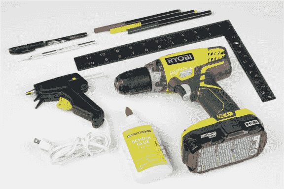

### 新组件

在这个项目中，你将使用两个新组件：H-桥电机驱动器和齿轮驱动的业余电机。让我们来看看这些组件是如何工作的。

#### H-桥电机驱动集成电路

在项目 7 中，你使用了一个晶体管电路来控制单个电机与 Arduino，这使得你能够控制电机的速度，但无法控制其旋转方向。在本项目中，你将使用一个名为*H 桥电机驱动器*的新组件，它将使你能够同时控制电机的速度和旋转方向。

H 桥电机驱动器是一个集成电路（IC）芯片，由大约十几个晶体管通过内部连接一起，封装在一个小型塑料外壳中。*IC 芯片*是一个预先接线的电路，它被集成到一个单一的封装中，旨在简化复杂项目的构建。市面上有许多不同类型的 IC，其中一个例子是 Arduino Uno 的“大脑”，即 ATMega328 芯片。在本项目中，H 桥电机驱动器 IC 使你能够通过连接电源和少数信号线到 Arduino，控制电机的速度和旋转方向。

你可能记得在项目 7 中，晶体管仅仅是一个可以电子控制的开关。标准的 H 桥电机驱动器由四到五个晶体管（或开关）按 H 形结构连接，如图 8-5 所示。（图中的电机不包括在 H 桥 IC 内，你需要自己添加它。）通过控制四个主要开关（标记为 A–D）中哪些是开关，你可以控制电流通过电机的流向。第五个开关（E）控制电机旋转的速度。

**图 8-5：** 具有方向和速度控制的 H 桥电路

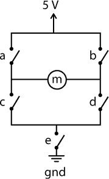

记住电流是从正极流向负极的。如果你关闭 A 和 D 开关，电流将从左到右流经电机，使电机朝一个方向旋转。如果你关闭 B 和 C 开关，电流将从右到左流经电机，使其朝相反方向旋转。

E 开关通过 PWM（参见“使用 PWM 创建模拟信号”第 139 页）迅速开关。PWM 信号的占空比将决定电机的旋转速度。在你的机器人中，将有两个电机，每个电机都有自己的 H 桥电路，你将为每个电机连接一个车轮，从而控制其旋转速度和方向。

本项目中使用的 H 桥电机驱动器是东芝 TB6612FNG，如图 8-6 所示。它以一个带孔的分立板形式出现，孔间距为 0.100 英寸——非常适合插入面包板。

**图 8-6：** TB6612FNG H 桥电机驱动器分立板（未焊接引脚）

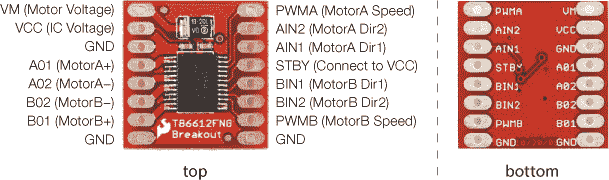

**注意**

*该芯片还具有一个待机引脚，可以用来将电机置于待机模式以节省电力，但你不需要这个功能，因此将禁用它。*

东芝 TB6612FNG 实际上是一个*双*H 桥集成电路。这意味着它在一个小封装中内置了两个完整的 H 桥电路，允许你使用一个电路板控制机器人上的两个电机。H 桥将两个电机区分为 A 和 B，如你在电路板底部的图 8-6 中所见。要控制每个 H 桥电路，你需要使用三根信号线：两根用于方向控制，一根用于速度控制。

你可以选择购买带有焊接针脚的电路板，也可以选择没有焊接针脚的版本。如果你想省去焊接的麻烦，确保你购买的是已预焊接针脚的电路板（ROB-13845）。如果你买的是没有预焊接针脚的电路板（ROB-09457），也没问题，但你需要将男针焊接到针脚上；有关焊接说明，请参阅第 302 页中的“如何焊接”部分。在开始构建这个项目之前，无论如何，你应该确保手头的电路板看起来像图 8-7 所示。

**图 8-7：** DEV-12211 H 桥电机驱动器，已焊接针脚

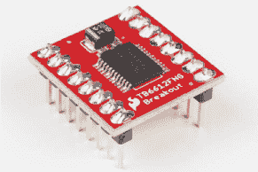

#### 齿轮驱动爱好者电机

我们在项目 7 中使用的基本爱好者电机非常适合用于简单的机制，如旋转风扇，但它并不提供很大的*扭矩*（旋转力）。在这个项目中，我们需要用电机来移动整个项目，因此我们需要使用*齿轮电机*——一个连接到*齿轮箱*的电机（见图 8-8）。

**图 8-8：** 一个齿轮驱动爱好者电机由一个基本电机和一个齿轮箱组成

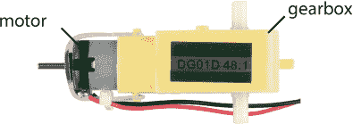

齿轮箱本质上将机械旋转转换为扭矩。这个齿轮箱具有 48:1 的减速比，这意味着电机的 48 次旋转等于输出轴的 1 次旋转。这将电机的转速降低大约 1/48 倍，同时扭矩增加 48 倍。基本上，输出速度变慢，但扭矩大大增加。

### 构建 DRAWBOT 原型

现在，让我们连接电路，看看它是如何工作的。你现在只需要连接一个电机来测试 H 桥电机驱动器，因此你只需使用双 H 桥板的一半。图 8-9 显示了电路板和 Arduino 的连接方式。电路板横向分为两部分，顶部控制电机 A，底部控制电机 B，尽管电源引脚是两个电机共用的。从 Arduino 连接 5V 和 GND 到面包板的电源轨，并确保添加一根跳线，将面包板上的两个 5V 轨连接起来，这样你就可以使用任意一个轨道供电；这样可以避免交叉太多的电线，并保持电路板整洁。

**图 8-9：** H 桥测试电路

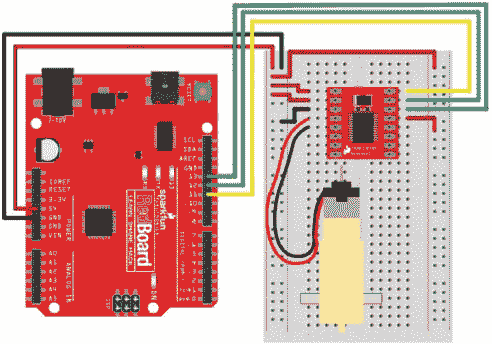

从 H-桥的左上角开始，连接 5V 到顶部的两个引脚，VM 和 VCC。VM 控制电机的电源，VCC 控制芯片的电源。接下来，使用跳线将芯片的一个 GND 引脚连接到面包板的 GND 轨道。H-桥上有三个地引脚，如图 8-7 所示，你可以选择任意一个。

接下来，你将连接电机。电机有两根电线：红色和黑色。电线的方向实际上并不重要，但为了保持一致，连接红色电线到标记为 A01 的引脚，黑色电线到标记为 A02 的引脚。

剩余的引脚位于左侧，用于控制第二个电机和另一个 GND 引脚，所以暂时留着它们。H-桥扩展板顶部右侧的引脚用于 Motor A 的信号线连接。最上面的引脚标记为 PWMA，控制电机的速度。将其连接到 Arduino 的 11 引脚。（记住，3、5、6、9、10 和 11 引脚都支持 PWM 功能，可以与 `analogWrite()` 函数一起使用。）

接下来的两个引脚，标记为 AIN2 和 AIN1，用于控制 Motor A 的方向和驱动，你可以通过将这些引脚设置为不同的高低组合来控制。表 8-1 显示了这些组合。将 AIN2 连接到 Arduino 的 12 引脚，将 AIN1 连接到 Arduino 的 11 引脚。

**表 8-1:** H-桥电机控制器功能

| **AIN1** | **AIN2** | **功能** |
| --- | --- | --- |
| 高 | 低 | 顺时针 |
| 低 | 高 | 逆时针 |
| 高 | 高 | 电子刹车（见注释） |
| 低 | 低 | 停止/滑行 |

**注释**

*将两个引脚设置为高电平将启用* 电子刹车。*电机的两根电线基本上被短接在一起，导致电机的旋转突然停止。相反，将两个引脚都设置为低电平将只停止电机的主动旋转，意味着车轮会滑行至停，而不是突然停下。*

最后，你需要禁用 STBY 引脚。如前所述，这个 H-桥 IC 有一个待机引脚，允许你将芯片置于低功耗睡眠模式，这在对功耗有要求的应用中非常有用。对于这个项目，你不需要这个功能，所以你将禁用它。这个芯片设计时将 STBY 作为*低电平有效*输入。这意味着当该引脚为低电平时，它进入待机模式。要禁用待机，你需要将此引脚直接连接到电源轨上的 5V。

### 编程 DRAWBOT

让我们从一个简单的测试开始。这个简单的示例将使电机顺时针缓慢旋转 1 秒钟，改变方向后快速逆时针旋转 1 秒钟，然后停止 1 秒钟，之后重新开始。打开 Arduino IDE，将清单 8-1 中的代码复制到你的窗口中。完成后，点击 **上传**，然后看看发生了什么！

**清单 8-1:** H-桥电机控制器的速度和方向控制示例

```
➊ const byte AIN1 = 13;
  const byte AIN2 = 12;
  const byte PWMA = 11;

  void setup()
  {
    pinMode(AIN1, OUTPUT);
    pinMode(AIN2, OUTPUT);
    pinMode(PWMA, OUTPUT);
  }
 void loop()
  {
    //set direction to clockwise
➋   digitalWrite(AIN1, HIGH);
    digitalWrite(AIN2, LOW);
➌   analogWrite(PWMA, 50);
    delay(1000);

    //set direction to counterclockwise
➍   digitalWrite(AIN1, LOW);
    digitalWrite(AIN2, HIGH);
    analogWrite(PWMA, 255);
    delay(1000);

    //brake
➎   digitalWrite(AIN1, HIGH);
    digitalWrite(AIN2, HIGH);
    delay(1000);
  }
```

该草图以一种新的数据类型开始：`const byte` ➊。关键字`const`用于声明一个*常量*，它类似于变量，但其值在代码中不能再被改变。因此，常量对于声明那些在代码中始终保持不变的东西非常有用，比如引脚号或配置。在这种情况下，这些常量定义了控制 H 桥的引脚号。由于引脚号是介于 0 和 13 之间的数字，因此可以将这些常量定义为数据类型`byte`。

**注意**

*大多数情况下，使用常量或变量并不会有太大区别，但常量在 Arduino 上使用的内存更少，因此在可以使用常量的情况下，最好采用它们，并且你可能会在网上看到其他人的示例中使用常量。此外，虽然这不是一个硬性规定，但常量的命名通常使用全大写字母。*

接下来，你将引脚设置为输出，然后使用两个`digitalWrite()`函数 ➋ 设置你希望电机旋转的方向，这两个函数作用于`AIN1`和`AIN2`引脚。第一个循环块将`AIN1`设置为`HIGH`，`AIN2`设置为`LOW`，这会让电机顺时针旋转。为了设置速度，你使用`analogWrite()`函数 ➌ 作用于`PWMA`引脚。你可能还记得项目 5，你可以使用`analogWrite()`将模拟引脚设置为从`0`到`255`的 PWM 值；这里给定的值`50`是相对较慢的。电机会旋转 1 秒钟，因为有`delay(1000)`，接下来的循环块则通过两个`digitalWrite()`函数 ➍ 改变电机的方向。这里，草图简单地交换了哪个引脚是`HIGH`，哪个是`LOW`，并通过`analogWrite()`将速度设置为`255`，再加上另一个`delay(1000)`，使电机旋转 1 秒钟。

草图的最后部分将`AIN1`和`AIN2`都设置为`HIGH` ➎，并添加另一个`delay(1000)`。这应用了电子刹车，并在循环再次开始之前停止电机 1 秒钟，然后重复该模式。

以这段代码为例，现在你只需三行代码就可以控制电机的速度和方向！但我们可以让它更简单。让我们通过使用自定义函数来清理代码。

#### 创建一个自定义函数

目前，每次你想控制电机时，都会使用三行代码：两行控制方向，一行设置速度。在这一部分，你将创建一个自定义函数，它只需一个数字来同时确定旋转的方向和速度。这个数字可以是`-255`到`255`之间的任何值，如果数字为正，则电机顺时针旋转；如果为负，则电机逆时针旋转。将 Listing 8-2 中的代码添加到草图的末尾。

**LISTING 8-2：** 设置电机 A 的速度的自定义函数

```
  void ➊setMotorA(➋int motorSpeed)
  {
➌   if (motorSpeed > 0)
    {
      digitalWrite(AIN1, HIGH);
      digitalWrite(AIN2, LOW);
    }
➍   else if (motorSpeed < 0)
    {
      digitalWrite(AIN1, LOW);
      digitalWrite(AIN2, HIGH);
    }
➎   else
    {
      digitalWrite(AIN1, HIGH);
      digitalWrite(AIN2, HIGH);
    }
➏   analogWrite(PWMA, abs(motorSpeed));
  }
```

将函数命名为`setMotorA()` ➊。该函数使用一个数字作为单一参数`motorSpeed` ➋来设置电机的速度。首先，一个简单的`if()`语句通过检查`motorSpeed`是否大于零来判断数字是正数还是负数。如果`motorSpeed`为正数 ➌，`if()`语句设置方向引脚，使电机顺时针旋转。如果它是负数 ➍，`else if()`语句设置方向引脚，使电机逆时针旋转。如果既不是正数也不是负数（即它是`0`），一个最终的`else`语句 ➎将两个方向引脚设置为`HIGH`，以应用刹车并停止电机。

➏行使用`abs()`数学函数来求`motorSpeed`的*绝对值*。`analogWrite()`函数设置电机的速度，但它仅适用于`0`到`255`之间的值。`abs()`函数确保使用`motorSpeed`的正部分，即*绝对值*，来设置速度。

#### 清理代码

现在，让我们通过这个新函数来清理`loop()`函数。你可以在列表 8-3 中看到，`loop()`的代码变得更简洁，阅读起来也更容易。将这些更改应用到你的草图中的`loop()`，然后上传到你的开发板上。它的表现应该和之前一样。如果你想将电机设置为不同的速度或方向，只需要一行代码！

**列表 8-3：** 使用自定义函数`setMotorA()`的简化版`loop()`

```
void loop()
{
  //set direction to clockwise
  setMotorA(100);
  delay(1000);

  //set direction to counterclockwise
  setMotorA(-255);
  delay(1000);

  //stop
  setMotorA(0);
  delay(1000);
}
```

这段代码设置了一个`setMotorA()`的值和一个延迟，用于调整每次速度和方向的变化。现在你已经有了你的 Drawbot 的基础！接下来，你将接线第二个电机。

### 接线第二个电机

DrawBot 需要第二个电机，这样它才能在两个轮子上快速移动。图 8-10 展示了第二个电机的接线方式。将电机 B 插入在突破板左侧，位于第一个电机连接处下方，红线连接到 B02，黑线连接到 B01。接着，将信号控制线添加到 H 桥突破板，位于右侧的 STBY 引脚下方。将 H 桥的 PWMB 引脚连接到 Arduino 的引脚 10 用于速度控制，将 BIN1 和 BIN2 引脚分别连接到 Arduino 的引脚 8 和 9 用于方向控制。

**图 8-10：** 电机驱动器和两个电机的接线图

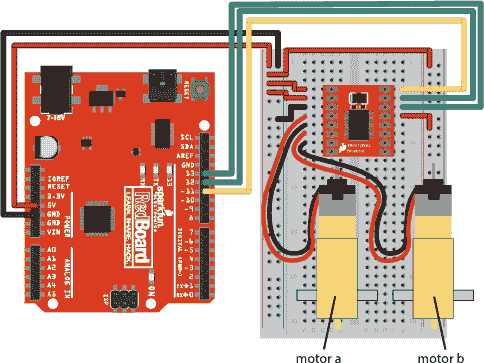

现在，你需要添加控制第二个电机的代码，具体内容参见列表 8-4。

**列表 8-4：** 为电机 B 添加常量和`pinMode()`函数

```
  const byte AIN1 = 13;
  const byte AIN2 = 12;
  const byte PWMA = 11;

➊ const byte BIN1 = 8;
  const byte BIN2 = 9;
  const byte PWMB = 10;

  void setup()
  {
    pinMode(AIN1, OUTPUT);
    pinMode(AIN2, OUTPUT);
    pinMode(PWMA, OUTPUT);

➋   pinMode(BIN1, OUTPUT);
    pinMode(BIN2, OUTPUT);
    pinMode(PWMB, OUTPUT);
  }
```

这段代码为电机 B 添加了三个额外的常量 ➊，用于信号控制引脚，并在`setup()`中将这些引脚设置为`OUTPUT` ➋。

接下来，你将再次编写一个自定义函数来控制电机 B。这个代码和`setMotorA()`函数非常相似，你可以通过高亮显示`setMotorA()`代码，复制（CTRL-C）并粘贴（CTRL-V）到`setMotorA()`函数下方，然后将`A`改为`B`，节省时间。这是程序员常用的一种技巧，可以节省大量时间。你只需要小心确保将所有`A`都改为`B`，否则代码将无法正常工作（清单 8-5）。

**清单 8-5：** 电机 B 的自定义函数

```
void setMotorB(int motorSpeed)
{
  if (motorSpeed > 0)
  {
    digitalWrite(BIN1, HIGH);
    digitalWrite(BIN2, LOW);
  }
  else if (motorSpeed < 0)
  {
    digitalWrite(BIN1, LOW);
    digitalWrite(BIN2, HIGH);
  }
  else
  {
    digitalWrite(BIN1, HIGH);
    digitalWrite(BIN2, HIGH);
  }
  analogWrite(PWMB, abs(motorSpeed));
}
```

现在，草图需要为`setMotorA()`和`setMotorB()`设置`motorSpeed`值。让我们把这些添加进去，测试电机一起工作。

### 驱动两个电机

为了让你的绘图机器人前进，你需要右电机顺时针旋转，左电机逆时针旋转。这个看起来可能有些违反直觉，但从侧面看看机器人底盘。图 8-11 展示了机器人框架的两侧，并且用箭头标出了前进方向。

**图 8-11：** 机器人从左右两侧的侧视图。为了前进，右轮必须顺时针旋转，左轮必须逆时针旋转。


在机器人的右侧，电轮需要顺时针旋转才能让机器人前进，而在机器人的左侧，电轮则需要逆时针旋转。注意每个轴的旋转方向。如果需要，可以将一块遮蔽胶带贴在电机旋转端，这样你就能看到轴的旋转方向。

现在，为了让机器人后退，只需反转那些方向。将`setMotorB()`的自定义函数代码添加到你的草图中后，调整你的`loop()`使其像清单 8-6 那样，然后上传代码，观察电机旋转！

**清单 8-6：** 测试两个电机的新`loop()`代码

```
void loop()
{
  //drive forward medium speed for one second
  setMotorA(100);
  setMotorB(-100);
  delay(1000)

  //drive backward quickly for one second
  setMotorA(-255);
  setMotorB(255);
  delay(1000);

  //stop for one second
  setMotorA(0);
  setMotorB(0);
  delay(1000);
}
```

你应该看到电机 A（右侧）顺时针旋转，而电机 B（左侧）逆时针旋转，之后 1 秒钟它们会互换。如果你发现两个电机在同一方向旋转，请交换*其中一个*电机的红黑线连接。

只需几行代码，你就可以让你的绘图机器人前进、右转、左转、后退，并且摇摆不定！

现在是时候为你的绘图机器人构建一个框架或*底盘*了。因为你编写的代码都在草图的`loop()`部分，所以你的电机会继续旋转、停止、旋转、停止。为了在构建底盘时停止电机的旋转，暂时断开 USB 线与电脑的连接。

### 构建绘图机器人底盘

如果你使用的是带面包板支架和 Arduino 基板的 SIK，那么你需要将 Drawbot 的底盘做得至少和基板一样大。基板的尺寸是 6 英寸 × 4.25 英寸。你可以使用一块纸板或薄胶合板制作底盘。根据我们的设计，我们将底盘做成了一个 6 × 8 英寸的矩形，如图 8-12 所示。你可以从 *[`www.nostarch.com/arduinoinventor/`](https://www.nostarch.com/arduinoinventor/)* 下载这个模板的 PDF 文件。

**图 8-12：** Drawbot 底盘的底部视图（非全尺寸）

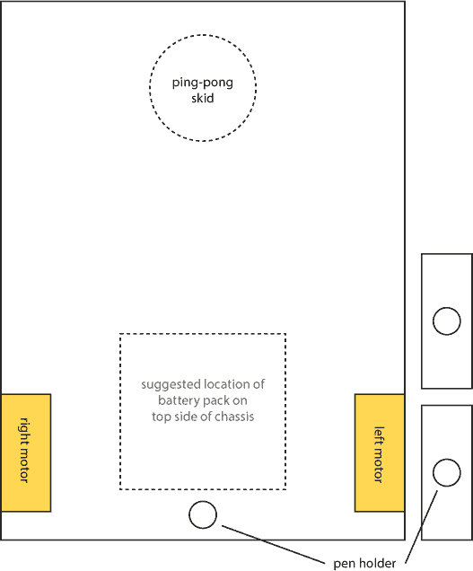

使用胶带或热熔胶枪，将电机固定在底盘的底部，按照图 8-13 所示的方向安装，电机的轮毂靠近后部，电机的较长端朝向前部。（热熔胶是一种很好的半永久性固定方法，因为你可以用工艺刀轻松刮掉它，移除零件，如果以后想重用它。）在将电机固定到底盘时，你可能需要暂时断开电机与面包板电路的连接，所以记得在粘好后重新连接它们。如果需要重新接线，可以参考图 8-10。

**图 8-13：** 使用热熔胶将电机安装到底盘

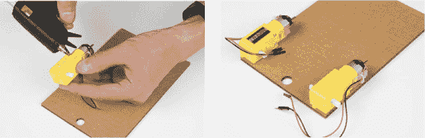

我们的基础模板上有一个孔，是为了安装笔或记号笔设计的。毕竟，Drawbot 需要能够绘图！为了让笔更稳固，我们将两块较小的纸板粘在一起，做成了一个更高的笔架。将这些纸板粘到孔的正上方，如图 8-14 所示。

**图 8-14：** 将笔架粘到底盘上

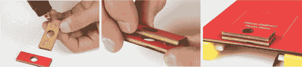

最后，将车轮安装到电机上。你会注意到电机的轴上有两个平面边缘（图 8-15）。确保将这些平面边缘与车轮轴孔的平面边缘对齐。安装可能会有点紧。推车轮时，要牢牢握住整个电机，以免不小心把电机从底盘上撕下来。

**图 8-15：** 电机轴的侧面图。将平面边缘与车轮开口的平面对齐。

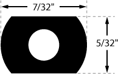

Drawbot 将使用两个电机车轮作为动力和转向，同时在另一端使用滑动滑轮来保持平衡。这种方法叫做*差动转向*。这个特定的 Drawbot 被设计为前驱系统，后部使用乒乓球作为滑动滑轮。随着 Drawbot 的移动，乒乓球会在地面上滑动。将乒乓球按图 8-16 所示粘好，尽量将其居中，以确保最佳平衡。

**注意**

*如果你想自己做车轮，可以参考图 8-15 中轴孔的形状和尺寸。*

**图 8-16：** 将乒乓球作为滑行滑轮安装

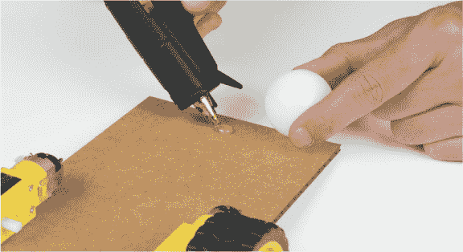

现在，将面包板支架、Arduino 和电池包放置在底盘顶部，如图 8-17 所示。使用少许胶带或一些胶水点，确保它们不会移动。

**图 8-17：** 面包板支架、Arduino 和电池组安装在纸板底盘上

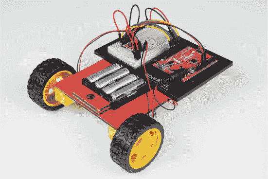

#### 测试和故障排除

重新连接 USB 线到你的 Arduino 板，或者插入电池包，看看发生了什么。你可能需要握住电缆，以免它缠绕。机器人应该会慢慢向前移动 1 秒钟，快速反向移动 1 秒钟，然后停止 1 秒钟。因为你所有的代码都在`loop()`中，所以 Drawbot 会不断重复这个动作，直到你断开电源。在调试代码时，你可能想将 Drawbot 的后端垫在几本书上，以避免车轮触碰到桌面。

现在，如果你的机器人行为不像你预期的那样，你需要进行一些故障排除来找出问题所在。首先，确定问题。有两个常见的问题我们在这个机器人上见过：移动方向错误和转圈。如果它先向后移动而不是向前移动，交换连接到 H 桥的两个电机的红线和黑线。如果你的机器人转圈而不是向前或向后移动，尝试交换 Motor A 或 Motor B 的电机线——不要同时交换两者，否则你会遇到同样的问题。现在，你应该有一个可以前进然后后退、停下并重复这个动作的 Drawbot。

在继续之前，测试一下 Drawbot 在 1 秒钟内移动的距离，并记录下来。你会给它加上标记笔开始画线，你可能需要调整速度和时间，以便让 Drawbot 更容易控制。如果你在一个小桌子上工作，较慢的速度和较短的时间可能是最好的选择。

#### 转弯并制作图案：机器人方舞

现在你已经掌握了让机器人前进和后退的操作，看看你能用你的新创作做出什么有趣的图案。在将标记笔放到你的 Drawbot 上之前，试着转弯。

要让机器人向右转，两个电机都需要逆时针旋转，要让机器人向左转，它们需要顺时针旋转。看看你能不能让你的 Drawbot 跳个小方舞！画一个方形的基本步骤如下：

• 向前移动。

• 转动 90 度。

• 向前移动。

• 转动 90 度。

• 向前移动。

• 转动 90 度。

• 向前移动。

• 转动 90 度。

图 8-18 展示了所需的步骤。你会注意到，你会重复相同的步骤四次。你已经知道可以使用`loop()`来执行重复的动作，但循环是无限重复的，而你希望你的绘图机器人在四次转动后停止。幸运的是，有一种编程技巧非常适合重复某部分代码指定次数：那就是`for()`循环。

**图 8-18：** 简单广场舞的步骤

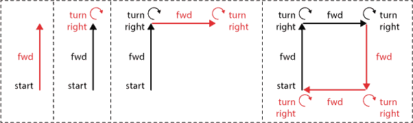

`for()` 循环以命令`for`开始，后跟一对圆括号。在圆括号内有三个部分。参见列表 8-7。

**列表 8-7：** `for()` 循环

```
for(➊int count = 0; ➋count < 4; ➌count++)
  {
  ➍ //insert code here that you want to repeat
  }
```

第一部分 ➊ 是计数器变量的声明和初始化，用于跟踪循环的重复次数。你将这个变量声明为整数，命名为`count`，并初始化为`0`。你可以随意命名这个变量，只要在接下来的两个部分使用相同的变量名即可。接下来的部分是*条件语句* ➋，它控制`for()`循环是否继续执行或停止。在这里，只要条件语句`count < 4`为`true`，循环就会继续。由于`count`初始化为`0`，所以第一次循环时该条件为`true`，循环将继续。第三部分是*增量语句* ➌，它告诉`for()`循环在每次重复后如何处理计数器变量。这里，`count++`是`count = count + 1`的简写，表示每次循环时将计数器变量增加 1。最后一部分 ➍ 是你希望重复或循环执行的代码，就像你放在花括号中的任何代码一样。

所以，总的来说，`for()` 循环的参数表示循环应继续运行，直到运行四次为止，此时`count`将增加到`4`，条件语句将变为`false`，循环退出。`for()` 循环是一种非常方便的方式，可以清理代码并将指令重复特定次数。

现在，使用这个新技能编写你的广场舞代码。在你的草图中，将`loop()`替换为列表 8-8 中的`loop()`。其他部分保持不变。

**列表 8-8：** 广场舞代码

```
  void loop()
  {
➊   for(int count = 0; count < 4; count++)
    {
      //drive forward
    ➋ setMotorA(100);
      setMotorB(-100);
    ➌ delay(500);

      //turn right
    ➍ setMotorA(-100);
      setMotorB(-100);
      delay(250);
    }
➎   delay(1000);
  }
```

**快速操作变量的简写**

通常，你可能希望在代码中增加、减少或修改一个变量的值。最常见的用途是每次循环重复时将变量的值增加 1，你可以使用`变量名 = 变量名 + 1`来实现。但是，也有一些简写的方法可以修改变量的值，如下表所示。

| **简写代码** | **完整代码** | **描述** |
| --- | --- | --- |
| `变量名++;` | `变量名 = 变量名 + 1;` | 增加 1 |
| `变量名 += 2;` | `变量名 = 变量名 + 2;` | 增加 2 |
| `变量名 += n;` | `变量名 = 变量名 + *n*;` | 增加 *n* |
| `variableName--;` | `variableName = variableName - 1;` | 递减 1 |
| `variableName -= 2;` | `variableName = variableName - 2;` | 递减 2 |
| `variableName -= n;` | `variableName + variableName - *n*;` | 递减 *n* |
| `variableName *= n;` | `variableName = variableName * *n*;` | 乘以 *n* |
| `variableName /= n;` | `variableName = variableName / *n*;` | 除以 *n* |

为了绘制一个正方形，草图使用 `for()` 循环 ➊ 重复这四个步骤。机器人首先前进 ➋ 半秒钟 ➌。你需要确保它不会走得太远，避免在地板上画得一团乱。接下来，要让机器人转弯，草图将两个电机设置为逆时针旋转 ➍。为了完成每个正方形，你添加了一个短暂的 1 秒延迟 ➎。注意，延迟是在 `for()` 循环的大括号之后。Drawbot 会重复这四个步骤——前进并转弯四次——然后等待 1 秒后，整个 `loop()` 循环再重复。这将给你时间手动移动 Drawbot 或重新调整位置，如果需要的话。我们办公室里的这些数值效果很好，但你可能需要根据自己的 Drawbot 微调速度设置和时间。调整你的草图，直到你得到一个方形的移动模式。如果不完美也没关系——只要继续测试转角的速度。这就是你要创造的艺术的一部分！

我们已经在清单 8-9 中包括了完整的方形舞步 Drawbot 草图。

**清单 8-9：** 完整的 Drawbot 方形舞步代码

```
const byte AIN1 = 13;
const byte AIN2 = 12;
const byte PWMA = 11;

const byte BIN1 = 8;
const byte BIN2 = 9;
const byte PWMB = 10;

void setup()
{
  pinMode(AIN1, OUTPUT);
  pinMode(AIN2, OUTPUT);
  pinMode(PWMA, OUTPUT);

  pinMode(BIN1, OUTPUT);
  pinMode(BIN2, OUTPUT);
  pinMode(PWMB, OUTPUT);
}

void loop()
{
  for(int count = 0; count < 4; count++)
  {
    //drive forward
    setMotorA(100);
    setMotorB(-100);
    delay(500);

    //turn right
    setMotorA(-100);
    setMotorB(-100);
    delay(250);
  }
  delay(1000);
}

void setMotorA(int motorSpeed)
{
  if (motorSpeed > 0)
  {
    digitalWrite(AIN1, HIGH);
    digitalWrite(AIN2, LOW);
  }
  else if (motorSpeed < 0)
  {
    digitalWrite(AIN1, LOW);
    digitalWrite(AIN2, HIGH);
  }
  else
  {
    digitalWrite(AIN1, LOW);
    digitalWrite(AIN2, LOW);
  }
  analogWrite(PWMA, abs(motorSpeed));
}

void setMotorB(int motorSpeed)
{
  if (motorSpeed > 0)
  {
    digitalWrite(BIN1, HIGH);
    digitalWrite(BIN2, LOW);
  }
  else if (motorSpeed < 0)
  {
    digitalWrite(BIN1, LOW);
    digitalWrite(BIN2, HIGH);
  }
  else
  {
    digitalWrite(BIN1, LOW);
    digitalWrite(BIN2, LOW);
  }
  analogWrite(PWMB, abs(motorSpeed));
}
```

正如我们之前提到的，底盘模板的前端有一个凹槽，用来放置标记笔。我们建议使用可洗的或干擦标记笔。找一块大海报纸或干擦板，铺在地板上。务必小心，不要让它在地板上乱画！这可能会惹上麻烦。（相信我们，我们以前犯过这个错误，真是后悔不已。）

将你的 Drawbot 放在绘图表面上。用一块胶带固定标记笔，确保它与绘图表面接触良好。手动移动 Drawbot，在绘图表面上测试标记笔的位置。现在，插入 USB 电缆连接到电脑，看看会发生什么。如果它看起来会跑出绘图表面，直接掉到地板上，赶紧抓住 Drawbot。

为了让操作更有趣，改变标记笔的颜色或修改代码来绘制不同大小的正方形。看看你能否让你的 Drawbot 绘制螺旋和星形！图 8-19 展示了我们在办公室中 Drawbot 绘制的一些有趣图案。

**图 8-19：** Drawbot 在行动——确保使用一张大纸，以免它把地板弄得满是画！

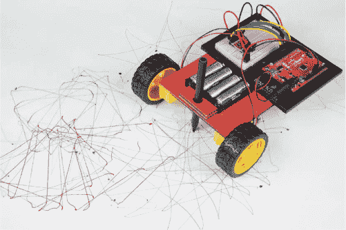

如果你想给你的 Drawbot 增加一些风格，试着翻翻你的手工材料，或者找一些废弃的纸板，看看你能想到什么。我们在办公室把一个旧的椒盐饼罐放在了我们的 Drawbot 上。现在它被称为椒盐饼机器人（Pretzel Bot），它四处走动并派发免费的椒盐饼（见图 8-20）。

**图 8-20：** 椒盐饼机器人！Arduino 和面包板被隐藏在盒子里。

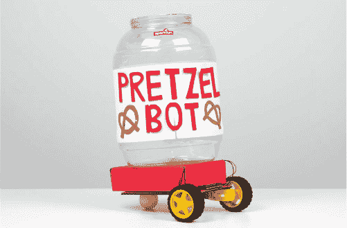

### 进一步探索

Drawbot 是基础机器人学的入门。最简单的机器人实际上只是一个控制器和两个电动机，这正是你在这里拥有的。我们将为你提供一些想法，带你迈向下一个层次。

#### 黑客

预编程的动作很有趣，但每次你想要改变模式时，都需要重新上传草图。不过，通过对代码做一些更改，你可以在 Drawbot 仍在运行时，通过串口监视器控制它。

到目前为止，你只使用串口监视器来读取 Arduino 在项目运行时发送回计算机的数据，比如传感器数据，但串口监视器也可以向 Arduino 发送数据。打开串口监视器窗口，你会看到顶部有一个小文本框，并且有一个标记为发送的按钮，如图 8-21 所示。这个框允许你向 Arduino 发送数据，这样你就可以从串口监视器控制它。

**图 8-21：** 串口监视器窗口

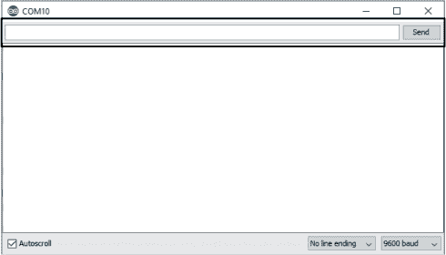

*P8_DrawbotSerial.ino* 草图（可从 *[`www.nostarch.com/arduinoinventor/`](https://www.nostarch.com/arduinoinventor/)* 下载）使用串口监视器发送三个数字来控制电动机 A、电动机 B 和驱动时间。

看看代码。这个新的草图声明了三个变量来存储电动机 A 的速度、电动机 B 的速度和延迟时间，这三个数字就是你发送的内容。你使用`Serial.begin(9600);`初始化与 Arduino 的通信，通过串口监视器发送和接收数据。Arduino 读取你输入到串口监视器的数据，并将任何整数赋值给三个变量 `speedA`、`speedB` 和 `delayTime`，然后这些值会用于熟悉的 `setMotorA()`、`setMotorB()` 和 `delay()` 函数。更多完整的解释可以参考代码中的注释。

将草图上传到你的 Drawbot，打开串口监视器，输入 **100 -100 500**，然后按下 ENTER 或点击**发送**（参见图 8-22）。Drawbot 应该向前移动半秒钟后停止。现在，你可以精细调整你的 Drawbot 程序，而不必每次都重新上传代码！代码将运行一次，除非你给它额外的命令，否则不会重复。当你输入六个数字时，如`100 -100 500 -100 -100 250`，会发生什么呢？试试看能不能编排出一个由一系列数字表示的舞蹈程序。

**图 8-22：** 编排机器舞蹈

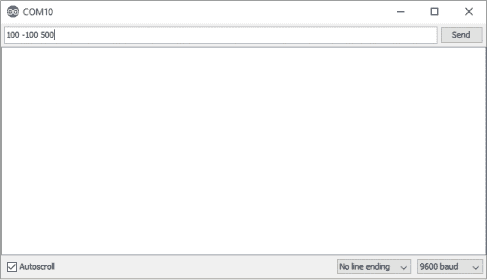

#### 修改

你还可以让你的绘图机器人编程绘制其他哪些形状？运用你学到的 `for()` 循环，看看能否修改代码让它绘制三角形或星形。你需要进行一些实验，调整时机和速度，使其刚刚好。当你一次只移动一个轮子时，会发生什么呢？

#### 奖励

有一个奖励脚本（在 *[`www.nostarch.com/arduinoinventor/`](https://www.nostarch.com/arduinoinventor/)*）可以让你使用更简单的命令控制海龟，例如 `fd 10` 和 `bk 10` 来向前或向后移动 10 步。下载 *P8_BonusTurtle.ino* 并将其加载到你的 IDE 中。然后打开串口监视器，输入以下命令：`fd 10` 向前移动 10 步，`bk 10` 向后移动 10 步，`rt 90` 向右转 90 度，`lt 90` 向左转 90 度。看看你能否用这些指令让你的新海龟跳一个方形舞！
