## 第十章：9 拖车计时器

在项目 4 中，你制作了一个反应计时器来测量你按下按钮的速度。在这个项目中，你将基于那里的技巧，制作一个用于 Hot Wheels 启发的赛道的计时器（见图 9-1）。我们将向你展示如何在一个小型便携式 LCD 屏幕上显示完赛时间，这样你就可以将项目从电脑上分离出来。我们还将展示如何修改这个项目，增加第二条赛道和指示灯（LED）来显示哪辆车获胜。你准备好了吗？

**图 9-1：** 完成的拖车计时器

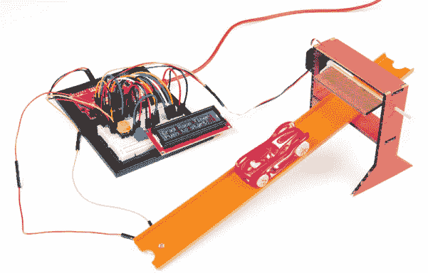

### 所需材料

本项目使用的许多部件你可能已经熟悉（见图 9-2 和 9-3）。我们只会介绍一个新部件：16 × 2 字符 LCD，你将用它直接显示比赛时间，而不是在电脑屏幕的串行监视器中显示。

**注意**

*在“深入了解”第 273 页，我们将展示如何修改你的拖车计时器，使你可以竞速两辆车并显示获胜时间。标准的 SparkFun 发明者套件包括一个光敏电阻（SEN-09088），但你需要两个来完成这个最终的修改。幸运的是，光敏电阻是一个相当便宜的元件，所以你可以购买另一个，或者和拥有发明者套件的朋友合作，做出双人版本。*

#### 电子元件

• 一个 SparkFun RedBoard (DEV-13975)，Arduino Uno (DEV-11021)，或任何其他兼容的 Arduino 板

• 一根 USB Mini-B 电缆 (CAB-11301 或你的板载 USB 电缆)

• 一个无焊接面包板 (PRT-12002)

• 一个 10 kΩ 电阻，如果你想做双人版本，则需要两个 (COM-08374，或者 COM-11508，一包 20 个)

• 一个光敏电阻（SEN-09088），如果你想做双人版本则需要两个*

• 一个按键开关 (COM-10302)

• 一个 10 kΩ 可调电阻 (COM-09806)

• 一个 16 × 2 字符 LCD (LCD-00255)

• 一个微型伺服电机 (ROB-09065)

• 公对公跳线 (PRT-11026)

• 公对母跳线 (PRT-09140*)

**注意**

*标记有星号（*）的部件不包含在标准的 SparkFun 发明者套件中，但可以在单独的附加包中购买。*

**图 9-2：** 拖车计时器的组件

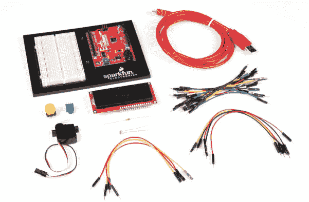

#### 其他材料和工具

• 工艺刀

• 金属尺

• 钳子

• 线切割钳

• 纸胶带

• 胶水（热熔胶枪或手工胶水）

• 硬纸板（约 8.5 × 11 英寸），一个小纸盒，或厚卡纸

• 竹签

• 外壳模板（见图 9-15，第 266 页）

• Hot Wheels 或其他小型玩具车进行竞速（未显示）

• （可选）玩具车赛道（未显示）

**图 9-3：** 推荐的工具和材料

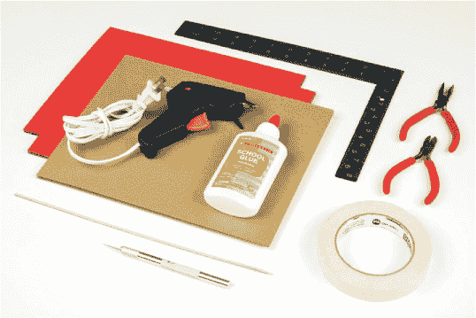

在之前的项目中，我们使用串口监视器将 Arduino 发送的信息显示到计算机上。在这个项目中，我们将教你如何将 LCD 直接添加到你的项目中，这是一个值得学习的技能。LCD 需要许多连接线，但不用担心——我们将一步一步地教你。当你掌握了这个部分的使用后，你可以将其添加到你过去的一些项目中，使它们完全便携！

### 新组件：16 × 2 字符 LCD

*LCD*是*液晶显示*的缩写。液晶技术发明已有 40 多年，广泛应用于数字手表、闹钟、投影仪、电视、计算机显示器等设备中。

你将在这个项目中使用的 LCD 是一个简单的*单色*显示屏，意味着它只能显示一种颜色。显示屏下方有一层液晶。液晶是一种独特的化学物质，当施加微小电流时，它会从透明变为不透明。结合背光或反射镜，液晶可以用于构建非常简单的显示器。光线的通过或阻挡取决于电流施加在液晶的哪个区域——这意味着如果你能控制电流，就能制作出图形。

16 × 2 字符 LCD 显示最多 32 个字符的信息，每个字符被分解为一个 5 × 8 像素矩阵。每个单独的像素可以根据施加的电流改变透明度，由 Arduino 控制。例如，当图 9-4 中的黄色像素变为不透明时，字母*A*将在 LCD 屏幕上显示。

**图 9-4：** 5 × 8 像素矩阵上表示的大写字母*A*

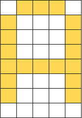

单个字符包含 40 个独立像素，每个像素都由 Arduino 控制，这意味着有 1280 条不同的控制线！幸运的是，这个项目中使用的 LCD 配备了日立公司生产的特殊并行接口 LCD 驱动 IC——HD44780。这个芯片允许你仅通过六条来自 Arduino 的控制线在屏幕上显示几乎任何字符。图 9-5 显示了 LCD 上的引脚。

**图 9-5：** 一个简单的 16 × 2 字符 LCD

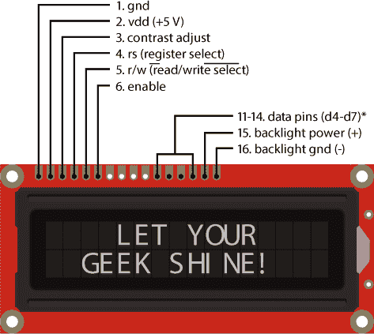

**注意**

*LCD*可以使用最多八个引脚来传输数据（d0–d7），但我们将要使用的 LCD 仅使用四个引脚，这些引脚标记为 d4–d7。

LCD 共有 16 个引脚，但本项目只使用引脚 1–6 和 11–16。引脚从左到右编号为 1 至 16（顶部的引脚）。表 9-1 描述了 LCD 上每个引脚的功能。在一些数据表中，你可能会看到标签上有一条线，例如引脚 5 上的标签。这个线条表示该特性是*低电平有效*，意味着该引脚在低电压时被激活。因此，在这种情况下，当你想写入 LCD 时，引脚 5 需要设置为`LOW`。我们将在“连接数据和控制电路”一节中详细讨论这一点，见第 255 页。

**表 9-1:** 16 × 2 字符 LCD 引脚描述

| **引脚** | **描述** |
| --- | --- |
| 1 | 地（GND） |
| 2 | LCD 电源（5V） |
| 3 | 对比度调整（0–5V） |
| 4 | 寄存器选择（RS） |
| 5 |  |
| 6 | 启用 |
| 7–10 | 数据线 d0–d3（未使用） |
| 11–14 | 数据线 d4–d7（每次传输 4 位数据） |
| 15 | 背光电源（5V） |
| 16 | 背光接地（GND） |

与其单独控制每个字符的 40 个像素，HD44780 驱动芯片通过四个数据线和两个控制线来解释 Arduino 发送的数据，并将其转换为显示的字符。为了进一步简化接口，Arduino 社区编写了一个 LCD 库，用于向 LCD 写入代码。我们将在代码中查看这一点。

### 拖拉赛计时器操作

在开始连接电子元件之前，让我们讨论一下草图的功能。我们设计这个赛车计时器时，当按下按钮时，舵机向上移动，打开起始门，允许赛车沿赛道下坡。同时，Arduino 记录起始时间，并等待看到赛车何时到达赛道底部的光敏电阻处，那里使用的是项目 5 中的相同光传感器电路。你将把光传感器嵌入赛道的中心，这样当赛车经过时，它会投下一个阴影，Arduino 可以检测到。当 Arduino 检测到阴影时，它将记录停止时间，并计算总时间，即停止时间减去起始时间。如果这听起来像是项目 4 中的反应计时器，那是因为它确实是！

### 构建 LCD 电路

你将从构建 LCD 电路开始。LCD 共有 16 个引脚，但你只会使用其中的 12 个。图 9-6 展示了 LCD 电路连接的原理图。

**图 9-6:** LCD 电路连接的原理图

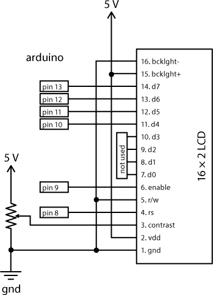

LCD 有 16 个引脚，占用面包板的 16 行，因此在进行此项目时需要小心布置。你将把 LCD 安装在面包板右侧的前 16 行。确保将 Arduino 的电源和地线连接到面包板左侧的电源和地线轨道。

请注意，LCD 上的引脚没有标注。在我们引导你完成接线时，我们将按顺序提到 LCD 上的引脚，从底部的 1 号引脚开始。

#### 为 LCD 供电

LCD 有两个独立的电源，一个用于背光，另一个用于控制逻辑。你需要将这两者分开接线。

将 LCD 的 1 号引脚连接到 GND，LCD 的 2 号引脚连接到 5 V，使用面包板上的电源轨道。这为 LCD 的控制电路和 HD44780 LCD 驱动芯片提供电源。接下来，将 LCD 的 15 号引脚连接到 5 V，LCD 的 16 号引脚连接到 GND，再次使用电源轨道。这两个连接为 LCD 内置的背光提供电源（参见 图 9-7）。

**图 9-7：** 连接 LCD 的电源和背光。

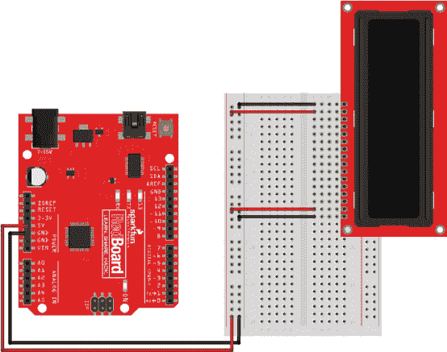

#### 控制对比度

你可以调整 LCD 屏幕的对比度。为此，你可以使用电位器控制 LCD 3 号引脚上的电压，电位器与平衡梁中的电压分压电路类似（参见 项目 6）。回想一下，电位器与可变电阻是相同的：它有三个引脚，当你旋转旋钮时，中间引脚与任一端引脚之间的电阻发生变化。如果你将电位器的顶部和底部引脚连接到 5 V 和 GND，你就得到一个可变电压分压器，其中中心引脚上的电压会根据旋钮的旋转程度在 5 V 和 GND 之间变化（参见 图 9-8）。

**图 9-8：** 电位器示意图，作为可变电压分压器连接

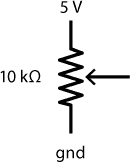

将电位器添加到面包板上，位于 LCD 下方。将电位器的外部引脚连接到 5 V 和 GND，将中间引脚连接到 LCD 的 3 号引脚，用于对比度控制。

现在，你只需要添加 LCD 的数据和控制线路。

#### 连接数据和控制线路

你需要另外七根电缆来连接 LCD，包括四条数据线和三条控制线。LCD 的引脚 5 是读/写功能，允许 Arduino 读取和向显示器写入数据。你只需使用这个读/写连接来向 LCD 发送数据，或者写入设备，所以你可以将它连接到地（GND），也就是“将引脚接地”。如果你查看表 9-1，你会注意到标签上有一条线覆盖着*写入*（Write）。如前所述，这种符号通常在数据表和文档中使用，表示低电平信号将激活该功能。低输入等同于地，因此请添加一根电缆将 LCD 的引脚 5 连接到 GND，如图 9-9 所示。

**图 9-9：** 将 LCD 的引脚 5 连接到 GND 进行控制。

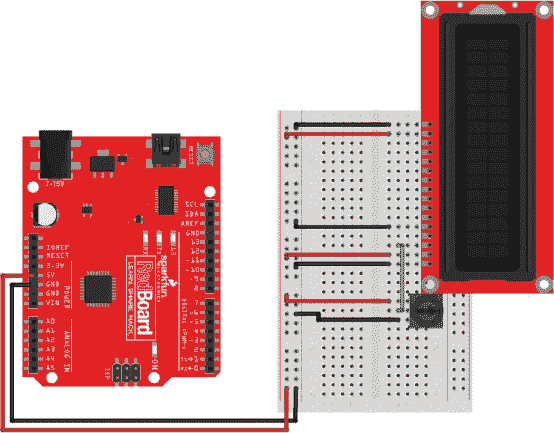

最后的六根电缆将连接 LCD 和 Arduino。LCD 的引脚 11 到 14 是 Arduino 用来向 LCD 发送信息的四条数据线。将这些引脚连接到 Arduino 的引脚 10、11、12 和 13，如图 9-10 所示。电缆应直接从 Arduino 板连接到 LCD，避免交叉。

最后两条连接是引脚 6 的使能（Enable）和引脚 4 的寄存器选择（Register Select）。使能引脚用于向 LCD 发出数据传输信号，寄存器选择引脚决定数据是表示要显示的字符还是指令，如清除屏幕或移动光标；这能让你更好地控制屏幕上显示的内容。将 Arduino 的引脚 9 连接到 LCD 的引脚 6，将 Arduino 的引脚 8 连接到 LCD 的引脚 4，如图 9-10 所示。

**图 9-10：** LCD 电路的最终接线

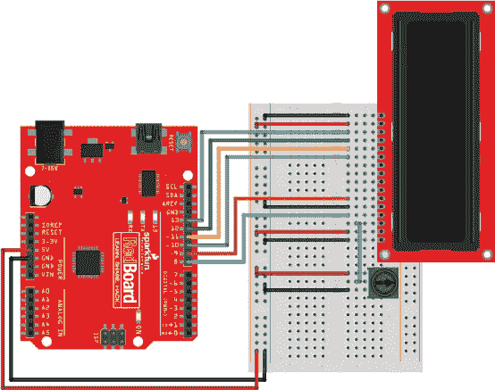

表 9-2 显示了 LCD 屏幕的连接，帮助你确保所有连接正确。

**表 9-2：** LCD 引脚连接

| **LCD 引脚** | **连接** |
| --- | --- |
| 16 | 地 (GND) |
| 15 | 5V |
| 14 | Arduino 引脚 13 |
| 13 | Arduino 引脚 12 |
| 12 | Arduino 引脚 11 |
| 11 | Arduino 引脚 10 |
| 10 | 不适用 |
| 9 | 不适用 |
| 8 | 不适用 |
| 7 | 不适用 |
| 6 | Arduino 引脚 9 |
| 5 | 地 (GND) |
| 4 | Arduino 引脚 8 |
| 3 | 电位器的中间引脚 |
| 2 | 5V |
| 1 | 地 (GND) |

#### 测试 LCD

在接线之前，先测试一下，确保电路到目前为止按预期工作。将 Arduino 连接到计算机。

一旦供电，背光应该会亮起。尝试旋转电位器旋钮。即使 LCD 上没有显示任何内容，你也应该能看到屏幕对比度的变化，从最暗到最高时显示 32 个明亮的矩形。

如果你没有看到此内容，请仔细检查接线。确保所有电源连接到 LCD 的接线与表 9-2 中的内容一致。

一旦你让 LCD 工作，复制 Listing 9-1 中的代码到 Arduino，并上传到你的设备。这段简单的示例应该会在第一行显示文本 *SparkFun Arduino*，在第二行显示一个运行的计数器。

**LISTING 9-1:** 用于在 LCD 上显示文本和运行的 `millis()` 计数器的测试代码

```
➊ #include<**LiquidCrystal**.h>
➋ **LiquidCrystal** lcd(8, 9, 10, 11, 12, 13);

  void setup()
  {
➌   lcd.begin(16, 2);  //initializes interface to LCD
➍   lcd.clear();
➎   lcd.print("SparkFun Arduino");
  }

  void loop()
  {
➏   lcd.setCursor(0, 1);      //move cursor to the 2nd line
                              //(col 0, row 1)
➐   lcd.print(millis()/1000); //print the number of
                              //seconds elapsed
  }
```

让我们来看看这个示例中发生了什么。首先，它包含了 Arduino 社区创建的 *LiquidCrystal.h* 库 ➊，这个库简化了六个不同的控制和数据线。这将使你更容易向 LCD 发送指令。

接下来，这段代码创建了一个名为 `lcd` 的对象，使用了 LiquidCrystal 库 ➋。注意，这次在创建对象时，你传递了一组参数，对应 LCD 的引脚：寄存器选择、使能引脚和四个数据引脚。这是你配置每个功能对应的引脚的地方。在某些文档中，你可能会看到这个命令写作 `LiquidCrystal lcd(RS, Enable, d4, d5, d6, d7)`。

你可能会想知道为什么我们不使用 LCD 的四个引脚。这个 LCD 可以通过四个或八个数据线传输数据。根据 LCD 的数据手册，当你使用四个数据线时，你需要使用 LCD 上方的四个引脚——标记为 d4、d5、d6 和 d7 的引脚。虽然这种方式传输数据到 LCD 需要 Arduino 花费两倍的时间，但它有助于保持电路尽可能简单，记住，Arduino 的时钟频率是 16 MHz。这可是非常快的！

LiquidCrystal 库有大约 20 个不同的命令，可以简化对这个 LCD 的控制。在这个示例中，我们会向你展示一些基本命令，允许你配置屏幕大小、清空屏幕、显示信息和移动光标。

`setup()` 部分的代码包含了一些只会在 Arduino 启动时运行一次的指令。其中第一个是 `lcd.begin(16, 2);` ➌，它将 LCD 设置为 16 × 2 字符 LCD，使得库可以正确地换行并从一行移到下一行。

下一条指令，`lcd.clear();` ➍，允许你在显示新文本之前清空屏幕。它还会将光标的位置重置到屏幕第一行的第一个字符。如果没有这条指令，LCD 会保留上次显示的内容。

然后，命令 `lcd.print("SparkFun Arduino");` ➎ 会在 LCD 上显示文本 *SparkFun Arduino*。由于 `lcd.clear()` 指令刚刚清空了屏幕，这段文本将出现在显示的第一行。这段文本正好是 16 个字符长，应该填满 LCD 的第一行。这个命令类似于 `Serial.print()`，但使用 `lcd.print()` 时，你不需要连接到计算机或者打开串口监视器，就能看到来自设备的文本和信息。

`loop()` 每次重复时都会用新信息刷新屏幕。首先，它使用 `lcd.setCursor(0, 1);` ➏ 将光标移动到 LCD 的第二行，以免覆盖第一行的 *SparkFun Arduino* 文本。`setCursor()` 方法中的两个数字指示字符的位置（0）和行数（1）。像很多编程环境一样，Arduino 的计数是从 0 开始的，而不是从 1 开始。

**注意**

*LiquidCrystal 库只适用于字符型 LCD 显示屏。图形 LCD 屏幕也有提供，但它们使用一个不同的库，叫做 OpenGLCD，它允许你显示图形，如线条、矩形和圆形，以及文本。*

最后，草图使用另一个 `lcd.print()` 指令打印一个计数器 ➐。这个计数器使用 `millis()` 函数，它报告自 Arduino 通电以来的毫秒数。将这个值除以 1,000，就可以得到秒数的计数器。我们将在比赛计时器中使用类似的技巧。

现在，你能弄清楚如何更改文本，使得第一行显示你的名字吗？如何将时间显示改为以分钟为单位而不是秒数？多试试这个代码示例，直到你熟悉如何在 LCD 上显示数据。只需要 Arduino 的六个 GPIO 引脚，你就能将 LCD 显示器添加到任何项目中！

本示例演示了 Arduino LiquidCrystal 库中最常用的指令，但如果你想查看其他可以使用的命令，请参考 *[`www.arduino.cc/en/Reference/LiquidCrystal/`](https://www.arduino.cc/en/Reference/LiquidCrystal/)。*

现在你已经使 LCD 电路工作，接下来是添加按钮、伺服电机和光传感器电路。

### 添加其余的电子元件

拖拉赛计时器将使用你在之前的项目中已经组装好的几个部件：一个用于开始比赛的按钮，一个用于控制汽车起跑门的伺服电机，和一个用于检测汽车到达赛道终点的光敏电阻。图 9-11 展示了这三个附加组件的原理图。

**图 9-11：** 拖拉赛计时器中附加组件的原理图

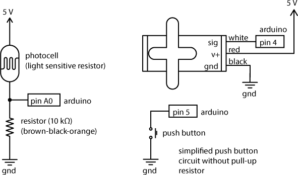

将一个按钮放置在面包板上，使其两腿分别位于中心分隔线的两侧，并将一侧的两个引脚连接到 Arduino 的引脚 5 和 GND。部件将填满面包板的大部分空间，因此请密切注意面包板上的行以及各个组件的连接方式。为了节省空间，本项目使用了没有外部上拉电阻的按钮，这与 项目 4 中反应计时器的做法不同。相反，我们将在代码中启用上拉电阻。

接下来，连接将打开起跑闸门的伺服电机。使用三根公对公跳线，将信号线（黄色或白色）连接到 Arduino 的 4 号引脚，将红线连接到 5 V 电源轨，将黑线连接到 GND 电源轨。

最后，添加光传感器电路并连接一个电压分压电路。将光敏电阻的一端连接到 5 V 电源轨，另一端通过一个 10 kΩ 的下拉电阻连接到 GND 电源轨。将同时连接光敏电阻和 10 kΩ 上拉电阻的这一行连接到 Arduino 的 A0 引脚。这个电路应该与 项目 5 中的夜光电路相似。

这个电路包含很多组件，所以请慢慢来，并仔细核对你的接线是否与图 9-12 中的图示一致。

**图 9-12：** 拖拉赛计时器的完整电子电路，包括起始按钮和闸门

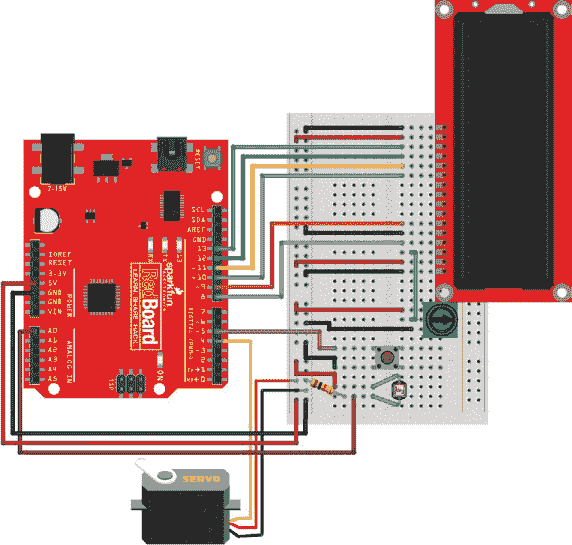

### 编程拖拉赛计时器

现在让我们将所有内容整合在一起。启动一个新的草图，并输入清单 9-2 中的代码，或者从 *[`www.nostarch.com/arduinoinventor/`](https://www.nostarch.com/arduinoinventor/)* 下载该代码。这个示例将结合我们在过去项目中单独使用过的几个概念和思想。

**清单 9-2：** 拖拉赛计时器草图

```
➊ #include<**LiquidCrystal**.h>
  #include<**Servo**.h>

  **LiquidCrystal** lcd(8, 9, 10, 11, 12, 13);
➋ **Servo** startingGate;

➌ const byte buttonPin = 5;
  const byte servoPin = 4;
  const byte finishSensor1Pin = A0;
  const int darkThreshold = 500;

➍ int finishSensor1;
  boolean finishFlag = false;
  long startTime;
  long stopTime;
  float raceTime;

  void setup()
  {
➎   pinMode(buttonPin, INPUT_PULLUP);

    startingGate.attach(servoPin, 1000, 2000);
    startingGate.write(0);

➏   lcd.begin(16, 2);
    lcd.clear();
    lcd.print("Drag Race Timer");
    lcd.setCursor(0, 1);
    lcd.print("Push to start!");

➐   while (digitalRead(buttonPin) == HIGH)
    {
    }

    lcd.clear();
    lcd.print("Go!");

    startingGate.write(180);
    startTime = millis();
  }

  void loop()
  {
➑   finishSensor1 = analogRead(finishSensor1Pin);
➒   if ((finishFlag == false) && (finishSensor1 < darkThreshold))
    {
      finishFlag = true;
      stopTime = millis();
      raceTime = stopTime - startTime;
      lcd.clear();
      lcd.print("Finish Time:");
      lcd.setCursor(0, 1);
➐   lcd.print(raceTime / 1000, 3);
    }
  }
```

让我们来看一下这一切是如何工作的。首先，草图通过 `#include` 指令 ➊ 引入了两个库，*LiquidCrystal.h* 和 *Servo.h*。接下来，它初始化了一个名为 `lcd` 的 `LiquidCrystal` 对象，类似于清单 9-1，以及一个名为 `startingGate` 的 `Servo` 对象 ➋。

然后，草图声明了一组常量，用于连接按钮、电动机和光敏电阻电路的引脚 ➌。这样一来，在你进行更改和修改时，如果需要将某根线移到 Arduino 的不同引脚，只需在代码中更改一个数字即可。最后一个常量是一个名为 `darkThreshold` 的阈值，用于设置检测汽车是否遮挡光传感器时的光照水平。这里将其设置为 `500`，大约处于 0–1023 范围的中间，但你可能需要根据自己房间的环境调整这个值。

接下来，草图声明了一些变量 ➍。`finishSensor1` 变量用于存储光敏电阻传感器的原始值。下一个变量 `finishFlag` 是一个*状态变量*，用于跟踪草图当前的状态。`finishFlag` 变量初始化为 `false`，用于表示比赛是否结束（就像在一级方程式比赛中挥动的终点旗帜，标志着比赛的胜者）。我们稍后将在代码中根据传感器的输入值来设置它。接下来的三个变量用于通过 Arduino 内置的 `millis()` 定时器来计算比赛时间。

现在，代码的`setup()`部分通过声明引脚模式为`INPUT_PULLUP`➎来设置按钮引脚，使用内建的上拉电阻。这一技巧消除了在项目 4 中使用外部上拉电阻的需要。

接下来，草图初始化舵机并将其默认位置设置为`0`。这将是起跑门下降时的位置。

草图然后将一些信息显示到 LCD➏上，告知用户如何开始比赛。这几行代码设置 LCD，清空屏幕，并显示两行文本。请小心，文本每行限制在 16 个字符以内；超过 16 个字符，文本会超出屏幕显示到右侧。接着，代码通过使用`while()`循环技术➐等待按钮按下，这种技术在反应计时器中使用，它会阻止草图继续，直到按钮被按下。当按钮被按下时，`digitalRead(buttonPin)`会读取为`LOW`，然后代码将舵机移动到上升位置并设置`startTime`变量。

在`loop()`中，草图读取光传感器并将当前读数存储到变量`finishSensor1`➑。传感器将被嵌入在坡道的尽头。当汽车越过终点线时，它将滚过传感器，遮挡大部分光线，类似于项目 5 中的夜灯草图，草图会将传感器的值与`darkThreshold`值进行比较。

**注意**

*你的传感器需要放在一个光线适中的区域，以便传感器被照亮和被遮挡时的对比度足够大，能够引起电压的下降。请注意，天花板灯光可能会在你身体的阴影投射到传感器时导致虚假检测。如果你想确保传感器工作良好，可以拿一盏小台灯，把它放在传感器上方。*

记住，在汽车通过传感器的时间里，`loop()`可能会重复几次。因为我们只想捕捉到汽车越过终点线的第一个时刻，草图使用了一个复合`if()`语句➒来捕捉`finishFlag`变量为`false` *并且* 终点传感器被遮挡的时刻（即其值小于`darkThreshold`）。`&&`表示逻辑与（参见复合逻辑运算符在第 264 页）。请特别注意`if()`语句中使用的括号数量——它们表示运算顺序以及逻辑如何运作。

现在，在`if()`语句内部，`finishFlag`状态变量切换为`true`。因为`finishFlag`状态变量现在设置为`true`，所以复合`if()`语句只会捕捉到汽车越过传感器的第一个时刻。

草图接着记录停止时间并计算经过的比赛时间。最后，草图将比赛时间打印到 LCD 上。

`raceTime` 变量被声明为 `float`（浮动点数变量），以便它可以存储带有小数的数字。默认情况下，`lcd.print()` 方法会显示浮动点数值的两位小数精度，但你可以向 `lcd.print()` 方法添加第二个参数来指定更多或更少的小数位数。在 ➓ 中，草图通过将毫秒数除以 1,000 来计算已过去的秒数。指令 `lcd.print(raceTime / 1000, 3);` 中的额外 `3` 告诉 Arduino 显示小数点后三位数，因此时间将精确到毫秒。不要忘记代码中的最后两个大括号。请仔细检查确保代码与 清单 9-2 相符，并将草图上传到设备。

**复合逻辑运算符**

在第四章中，我们介绍了用于比较两个值的简单逻辑比较运算符。回想一下，逻辑比较或表达式的结果只能是 `true` 或 `false`。在编程中，有时需要同时比较多个条件；例如，当你需要在一个变量为 false 且传感器值小于阈值时才执行某段代码：`((finishFlag == false) && (finishSensor1 < darkThreshold))`。这里，注意到逻辑比较被括号分组在复合 AND (`&&`) 的两侧。

两个或多个逻辑比较的组合称为 *复合逻辑表达式*。表达式是从左到右 *评估*（或读取）的。为了保持所有内容在一起并遵守正确的运算顺序，使用括号分隔各个表达式是一个好主意。用来组合逻辑表达式的两种主要运算符是 AND 和 OR，如下表所示。

| **符号** | **复合运算符** | **描述** |
| --- | --- | --- |
| `(*表达式 A*) && (*表达式 B*)` | AND | `*表达式 A*` 和 `*表达式 B*` 必须都为 `true`。 |
| (`*表达式 A*) &#124;&#124; (*表达式 B*)` | OR | `*表达式 A*` 或 `*表达式 B*` 必须为 `true`。 |

### 快速测试

如果你的一切连接正确且代码上传成功，你将听到伺服电机移动到 0 度位置，并看到 LCD 上显示的信息，如 图 9-13 所示。如果文本出现乱码或其他错误，请仔细检查 LCD、按钮和光传感器的连接。

**图 9-13：** 比赛开始时的 LCD 显示文本

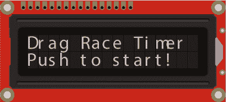

按下按钮，看看会发生什么。伺服电机应该移动，显示屏应该变更为 “Go!” 的信息。现在，用手指遮住光敏电阻。LCD 屏幕应该显示自按下按钮并遮住光敏电阻后的经过时间（见 图 9-14）。

当电子元件都正常工作时，是时候搭建起跑门和赛道了。如果传感器没有按预期工作，可以尝试更改`darkThreshold`值。如果传感器太敏感或立即触发，减小`darkThreshold`值。如果覆盖传感器时它没有反应，可以尝试增大该值。做完这些更改后，重新上传代码并再次测试。

**图 9-14：** LCD 显示屏与经过的时间

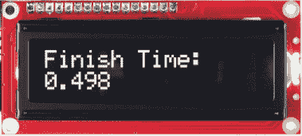

### 构建拖拉赛道

拖拉赛道包括一个起跑塔和一个旋转门，控制汽车进入赛道。对于赛道，你可以使用一段玩具赛车赛道，也可以从卡纸上自制。塔的模板如图 9-15 所示。你可以从* [`www.nostarch.com/arduinoinventor/`](https://www.nostarch.com/arduinoinventor/)*下载这个模板的 PDF 文件。

**图 9-15：** 起跑门的纸板模板（非实际尺寸）

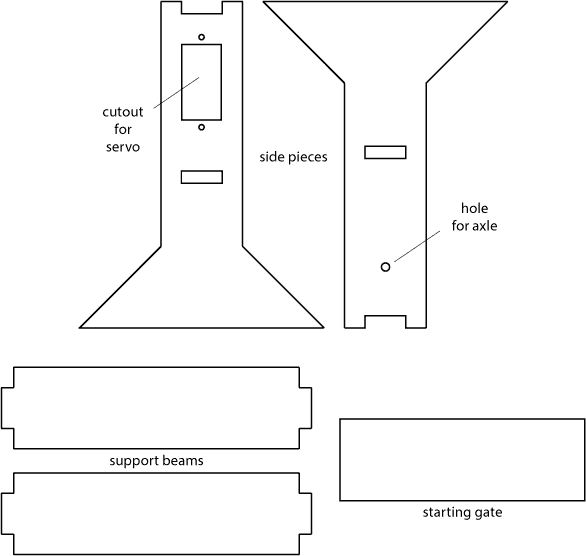

#### 搭建起跑塔

小心地从纸板上剪下模板（见图 9-16）。模板一侧有一个孔用于安装伺服器，另一侧有一个孔用于安装起跑门的竹签轴心。其他部件包括支撑梁和起跑门。

**图 9-16：** 按模板描线并小心地用锋利的工艺刀剪下部件。

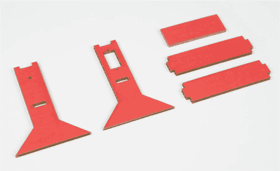

在切好部件后，首先将伺服器安装在图 9-15 中标记的开口处。从支撑梁外侧插入伺服器，使伺服器舵轮朝向车子。你可以使用随伺服器附带的小螺丝，或者少量胶水将伺服器固定到位，如图 9-17 所示。暂时不要安装伺服器舵轮，下一步会将其安装到起跑门上。

**图 9-17：** 使用热胶固定伺服器

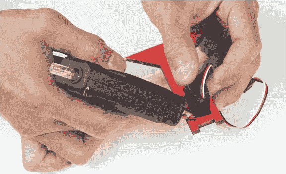

现在，将两根支撑梁粘合到位。下部支撑梁将插入每个侧面切口中的槽口。上部支撑梁应准确地嵌入每个侧面顶部的缺口中。使用少量胶水将这些部件固定到位。完成后，你应该拥有一个类似于图 9-18 所示的起始支撑塔。

**图 9-18：** 添加支撑梁

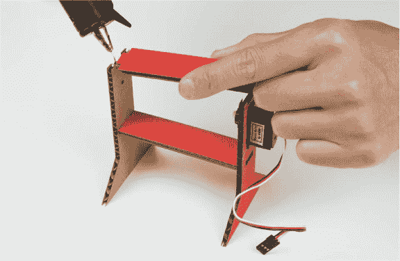

#### 组装起跑门

要搭建起跑门，你需要一块 2.5 × 1 英寸的纸板和一根短小的竹签或细长的咖啡搅拌棒。这将作为起跑门的轴心。首先，在起跑门的边缘涂上一小滴胶水，并将伺服器舵轮固定，使其中心悬挂在边缘之外，如图 9-19 所示。

**图 9-19：** 将伺服器舵盘粘贴到起始门的边缘

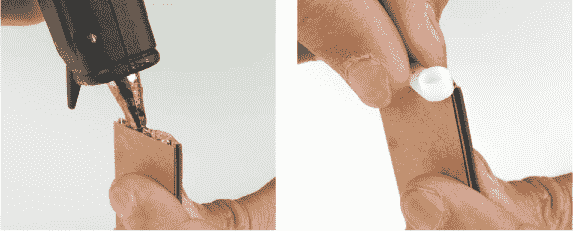

将竹签剪至 3.5 英寸长。在边缘涂上一条胶水，并将车轴与伺服器的舵盘对齐，如图 9-20 所示。

**图 9-20：** 将车轴粘贴到起始门上

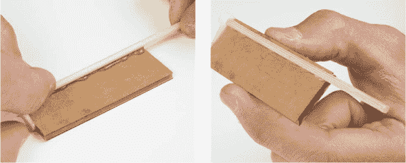

插入你的 Arduino 并按下重置按钮来重置伺服器的位置。记住，代码开始时伺服器处于 0 度位置；这是下垂位置，起始门将车子固定在原地。要将起始门放入支撑塔，首先将车轴插入与伺服器相对的侧面孔中，如图 9-21 所示。记住，当门打开时，它会顺时针旋转。

**图 9-21：** 将车轴插入起始门的侧面孔中

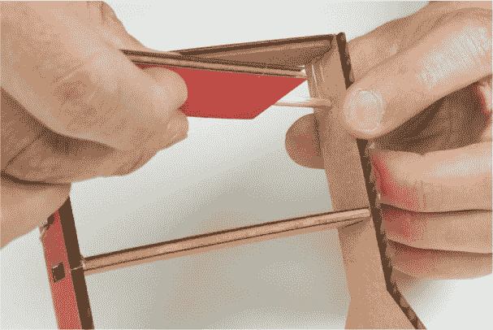

完成的起始塔和门如图 9-22 所示。

**图 9-22：** 完成的起始塔

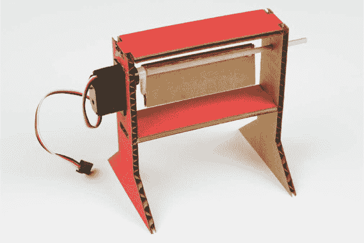

现在你需要一个轨道。你可以使用标准的 Hot Wheels 轨道，这会适合安装到下方支撑架上，或者自己制作轨道。如果你想使用 Hot Wheels 轨道，可以跳到 “添加光敏电阻” 的部分，参见第 270 页。

#### 自己制作轨道

要制作自己的轨道，你需要至少一张 3.5 × 11 英寸的卡纸。你可以制作几段轨道并将它们粘贴在一起，形成更长的轨道，但在我们的例子中，我们只使用一段轨道。

你需要将轨道的两侧边缘折叠。每一侧，都要量测并标记离边缘一英寸四分之一的位置。现在，沿着这些线折叠，使轨道的每一侧都有一个四分之一英寸的凸缘。（使用金属尺子或桌边来帮助折叠卡纸，通常能够得到一条整齐的折痕。）这个凸缘将防止你的汽车飞出轨道，并且增加一点结构强度。你的轨道应该类似于图 9-23 所示的样子。

现在，使用一个小型手持打孔器，在轨道末端大约半英寸的位置打一个孔，用来安装光敏电阻。如果你没有打孔器，工艺刀或尖锐的铅笔也可以使用。只要小心切割纸张，并且使用切割垫来保护桌面。孔的大小需要刚好能容纳光敏电阻的头部。

**图 9-23：** 完成的轨道，两个边缘已经折叠起来

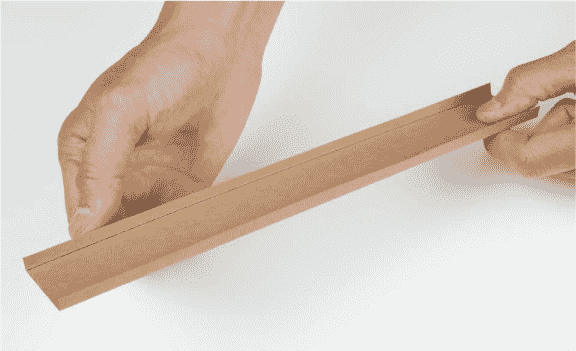

#### 添加光敏电阻

无论你使用的是自制赛道还是标准玩具赛道，下一步是将光敏电阻添加到坡道底部。光敏电阻将充当你的终点线传感器。（标准 Hot Wheels 赛道的末端有一个小孔，直径略小于光敏电阻传感器的直径。幸运的是，塑料赛道足够柔韧，你可以直接将光敏电阻的头部按压通过这个孔。）

将光敏电阻从面包板上取下，并将引脚弯曲成直角，使其看起来像图 9-24 所示。

**图 9-24：** 将光敏电阻的头部弯曲成直角。

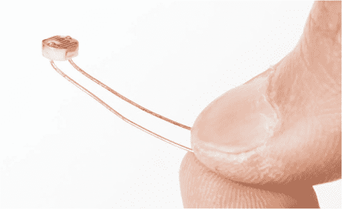

将光敏电阻的头部插入赛道上的孔中。确保光敏电阻没有突出太多，否则小车会卡住它；小车应该能够不受干扰地滚过传感器。将电阻的引脚弯曲成直角后，你应该能够像图 9-25 所示，安全地将它们固定在赛道的底部。

**图 9-25：** 将光敏电阻固定到赛道上

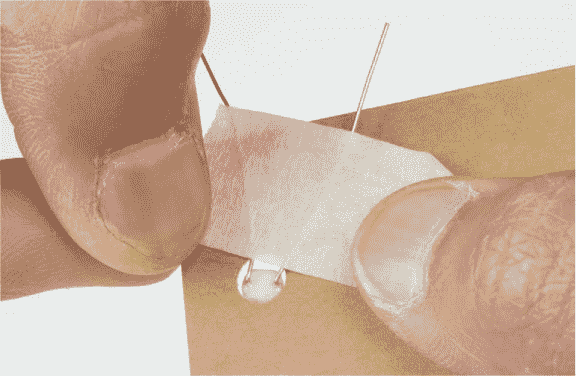

使用一对母对公跳线将光敏电阻重新连接到面包板。如果你将赛道延伸得太远，无法到达面包板，可以根据需要添加更多的母对公跳线来延长连接线。

**想要感受极速吗？计算平均速度**

使用这个项目，你可以准确测量小车从坡道上滚下来并穿过终点线所需的时间，但你不知道小车的*速度*——还是知道的？

好吧，你已经知道小车到达赛道底部所需的总时间，并且知道赛道的长度。通过这两条信息，你可以*估算*小车的运动速度。我们之所以称之为估算，是因为这实际上是一个平均速度，而不是小车到达坡道底部传感器时的确切速度。如果你观察小车滚下坡道，你会看到它从坡道顶部开始时没有移动，然后慢慢移动，接着在下坡过程中继续加速。

平均速度定义为单位时间内行驶的距离。因此，要找到平均速度，你需要测量赛道的长度，并将该值除以经过的时间。


我们的赛道从起点门到终点传感器的长度大约是 8.5 英寸，在我们上一次测试中，时间为 0.581 秒。如果将这两个数字相除，我们得到的平均速度是 14.6 英寸每秒。


记住，这是小车的*平均*速度。对于我们的简单直坡设置，这大致是小车在坡道中部的运动速度，由于小车在坡道顶部时并未移动，这意味着在坡道底部时，小车的速度是这个速度的两倍。你的车移动得有多快？

#### 测试与故障排除

最后，将赛道的末端没有光敏电阻的部分放置在起始塔旁边，使坡道大约延伸出塔的长度，约等于玩具车的长度（见图 9-26）。这将是起始位置。

**图 9-26：** 完成的拖车计时器，车已准备好发车

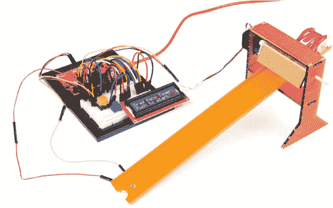

如果您还没有这样做，将 Arduino 重新连接到您的计算机或电源上。按下重置按钮，确保草图重新启动，然后找出您最喜欢的火柴盒车或 Hot Wheels 车，并将其放在起跑门后面。按下起跑按钮，观看您的车起跑！

到达终点花了多长时间？在我们的赛道上，我们的玩具车用了超过 0.5 秒的时间。尝试几种不同的车，或者邀请一些朋友来看谁的车更快。如果你在车上粘上一些硬币，它会更快吗？进行实验，看看不同的东西如何影响你的赛车时间。

### 进一步扩展

在这个项目中，我们向您介绍了如何使用 LCD 直接显示来自 Arduino 草图的信息。以下是一些如何进一步拓展此项目的想法。

#### 改装

与自己比赛的乐趣是有限的。让我们看看如何添加第二个赛道，并让两辆车互相比赛。（见图 9-27）对于这个改装，您需要一个额外的光敏电阻，这个电阻在标准的 SparkFun Inventor’s Kit 中没有包含。可以找一个也有此工具包的朋友，单独购买一个，或者在本书的附加零件包中找到一个。

首先，您需要创建一个独立的终点传感器电路。我们能够在面包板的底部附近插入一个光敏电阻和一个下拉电阻电路，如图 9-28 所示。通过一个 10 kΩ下拉电阻将第二个光敏电阻电路连接到 Arduino 的 2 号引脚，并将另一个引脚连接到 5V 电源轨。

将光敏电阻放置在第二个轨道上，并添加公对母跳线将其连接到面包板上的电路。将第二个轨道放置在第一个轨道旁边，放置在起始塔上。现在，是时候上传一些新的代码，以便同时使用这两个传感器。您只需添加几行额外的代码，允许两辆车进行比赛。从*[`www.nostarch.com/arduinoinventor/`](https://www.nostarch.com/arduinoinventor/)*下载*P9_TwoCarDragRaceTimer.ino*文件并打开它。

让我们来看看此代码的新增部分。首先，代码为第二个光敏电阻终点传感器添加了一个新常量和变量，`finishSensor2Pin`和`finishSensor2`。

然后，它通过复合`if()`语句检查哪个传感器首先被跨越。如果车#1 首先到达，`finishSensor1`将为`0`，而`finishSensor2`仍为`1`。在这个`if()`语句内部，指令将获胜信息显示到 LCD 屏幕上，并将状态变量`finishFlag`设置为`true`。

`else-if()` 语句检查车 #2 是否首先穿越终点线；在这种情况下，`finishSensor2` 将为 `0`，而 `finishSensor1` 仍然为 `1`。如果两辆车确实同时穿越终点线，这段代码什么也不做。看看你能否想出如何在平局时添加一个平局功能。

代码中有很多注释来帮助解释更多内容。现在，上传代码到你的开发板并开始竞赛！谁的车最快？

**图 9-27：** 拖曳赛计时器，带有两条赛道

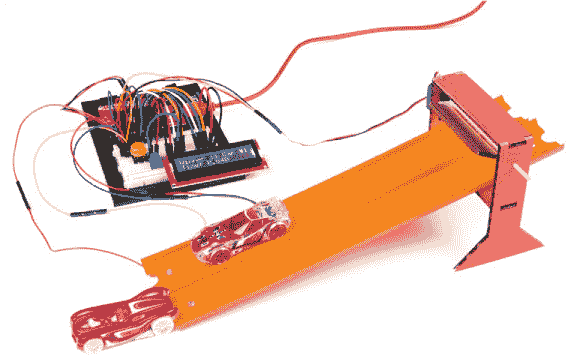

**图 9-28：** 添加第二个光敏电阻，用于同时竞赛两辆车

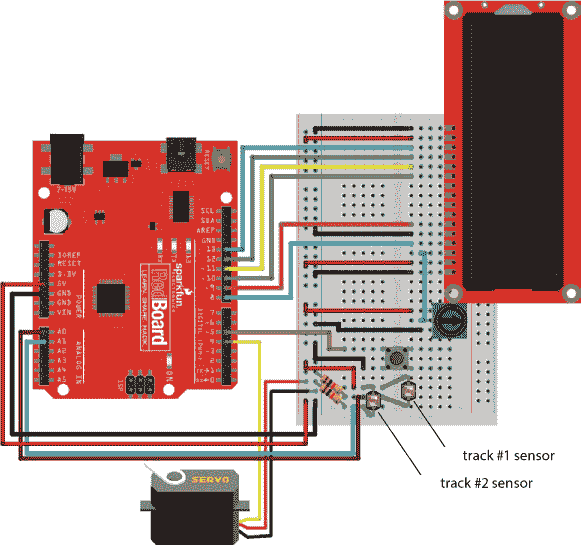

#### 修改

现在你已经了解了如何使用 LCD 电路，试着回去并给你已经完成的项目添加一个 LCD。在任何你用串行监视器显示信息的项目中，比如第 4 项目的反应计时器或第 7 项目的小型桌面温室，你都可以将串行监视器替换为 LCD。

你需要检查电路连接和使用的引脚配置；你需要从你的 Arduino 获取六个 GPIO 引脚来控制 LCD。如果你想看到一个使用 LCD 的反应计时器项目示例，可以查看我们在 InventorSpace 上创建的教程，* [`invent.sparkfun.com/cwists/preview/1145-sik-lcd-reaction-timer/`](https://invent.sparkfun.com/cwists/preview/1145-sik-lcd-reaction-timer/) *。
