## 第十一章：10 个微型电子钢琴

在这个项目中，你将使用一种特殊的触摸传感器和一个压电蜂鸣器来制作一个 Arduino 钢琴（见图 10-1）。无论你是否具备音乐才能，这都将是一个有趣的项目！

**图 10-1：** 完成的微型电子钢琴

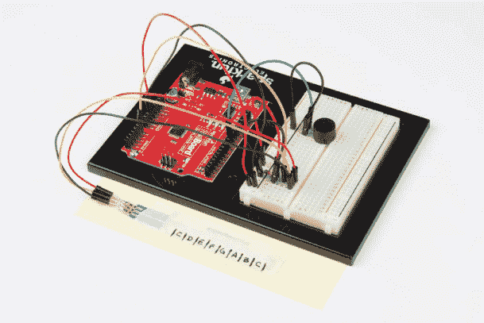

### 所需材料

本项目中只有几个新部件。一个是*软电位器（SoftPot）*，它将作为你的键盘，另一个是*压电蜂鸣器*，它将提供声音。你需要的材料如图 10-2 和图 10-3 所示。准备好你的材料，我们开始吧。

#### 电子部件

• 一个 SparkFun RedBoard（DEV-13975），Arduino Uno（DEV-11021），或任何兼容 Arduino 的开发板

• 一根 USB Mini-B 电缆（CAB-11301，或你的开发板 USB 电缆）

• 一个无焊面包板（PRT-12002）

• 一个 10 kΩ电阻（COM-08374，或 20 个装的 COM-11508）

• 一个 50 毫米 SoftPot 膜电位器（SEN-08680）

• 一个压电蜂鸣器（COM-07950）

• 公对公跳线（PRT-11026）

**注意**

*本项目中使用的所有部件均为 SparkFun 发明者套件中的标准部件。*

**图 10-2：** 微型电子钢琴的组件

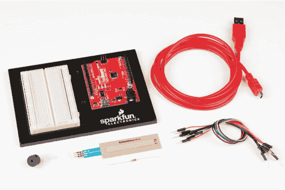

#### 其他材料和工具

• 铅笔

• 工艺刀

• 金属尺

• （可选）电烙铁

• 遮蔽胶带

• 硬纸板或卡纸（约 4 × 5 英寸）或一个小纸盒

**图 10-3：** 额外的材料

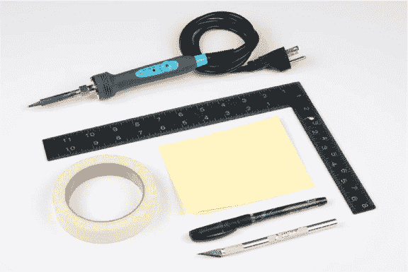

### 新组件

如我们所述，本项目只引入两个新部件。第一个是 SoftPot 触摸传感器：一种特殊类型的电位器，类似于项目 6 中使用的，但它会对压力做出反应。第二个新部件是压电蜂鸣器。让我们更详细地了解这两个部件。

#### SoftPot 膜电位器

在项目 6 中，我们介绍了一种简单的电位器，带有旋钮，可以用来控制平衡梁。SoftPot，如图 10-4 所示，工作原理相似，但它对压力做出反应，而不是旋转旋钮。

**图 10-4：** 50 毫米 SoftPot

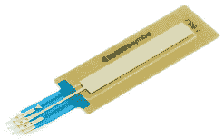

SoftPot 是一种薄而柔韧的传感器，可以检测沿其长度施加压力的位置。当你按压时，中间引脚和最接近的端引脚之间的电阻会在 0Ω和 10kΩ之间变化，具体取决于检测到的压力大小。SoftPot 传感器有一层薄膜，将中间引脚连接与外侧引脚分开。该传感器非常精确，几乎具有无限的分辨率。在工业应用中，SoftPot 常用于识别滑动部件、机器人手臂以及其他进行精确运动的部件的位置。

在这个项目中，你将使用这个传感器作为钢琴键盘。你将把条形的长度分成八个部分或“键”，用来演奏不同的音符。SoftPot 实际上与之前项目中使用的旋钮电位器相同。在电路图和示意图中，你可能会看到与图 10-5 相同的符号。

**图 10-5：** SoftPot 的电路图与常规电位器的电路图完全相同。

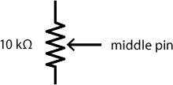

#### 压电蜂鸣器

压电蜂鸣器（图 10-6）类似于扬声器，当你对两个引脚施加电压时，会产生可听见的“咔嗒”声；这些“咔嗒”声发生得非常快，每秒几百次甚至几千次，其频率产生了音调。在典型的压电蜂鸣器内部，有一个特殊的晶体，叫做*压电元件*，当施加电压时它会发生形变。晶体与一个圆形金属片连接，当晶体形变时，金属片会震动小圆柱内的空气，从而产生“咔嗒”声。

**图 10-6：** 压电蜂鸣器

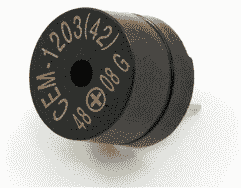

**注意**

*包含在 SparkFun 发明者套件中的蜂鸣器实际上使用的是一个小型磁性线圈，而不是压电元件，但它的工作原理是相同的。我们仍然称其为压电蜂鸣器。*

你已经知道如何使用 Arduino 以不同的速度闪烁 LED 了。现在，如果你以每秒数百次的速率“闪烁”蜂鸣器，我们就可以将这些“咔嗒”声转换为音调！用于表示蜂鸣器、扬声器和类似元件的电气符号有几种不同的形式。我们在本章中使用的符号如图 10-7 所示。

**图 10-7：** 蜂鸣器的电气符号

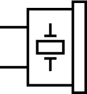

### 构建电路

该电路只使用了两个电子元件：蜂鸣器和 SoftPot，分别如图 10-8 和图 10-9 所示。将蜂鸣器插入面包板时，你可能会注意到其引脚比面包板的孔稍微靠得更近。只需轻轻弯曲引脚，使其与孔对齐，然后插入蜂鸣器。引脚应该与三个孔的间距一致。

SoftPot 有三个引脚，类似于你在第六章中使用的电位器。但与常规电位器不同，SoftPot 需要一个下拉电阻，以确保当没有输入或没有施加压力时，SoftPot 默认为 0 的状态。这将防止在没有按压传感器时蜂鸣器发出噪音。

**图 10-8：** 微型电子钢琴电路的示意图

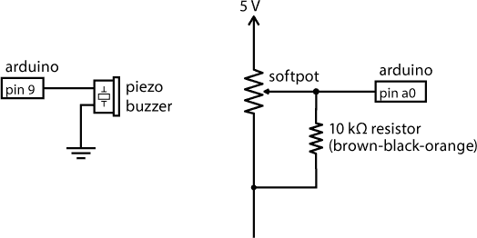

**图 10-9：** 微型电子钢琴电路在面包板上的原型

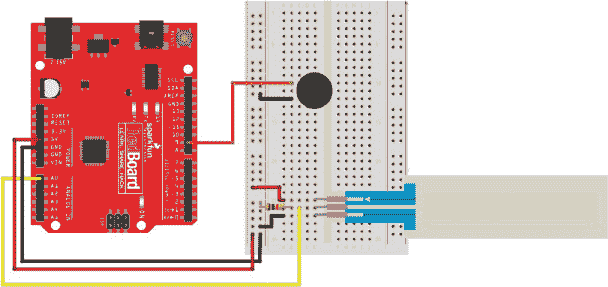

按照图示组装电路。电路相当简单。首先，将 5V 和 GND 连接到面包板左侧的电源和接地轨道。接着，把蜂鸣器大约放置在面包板顶部 10 行的位置。将蜂鸣器的一端连接到 Arduino 的引脚 9，另一端连接到接地轨道。然后，将 SoftPot 插入面包板的底部。将 SoftPot 的顶部引脚连接到 5V 电源轨道，底部引脚连接到接地轨道，中间引脚连接到 Arduino 的模拟输入引脚 A0。记住，SoftPot 需要一个下拉电阻连接在滑动引脚（中间引脚）和接地轨道之间。最后，在中间引脚和接地轨道之间添加一个 10 kΩ的电阻。

一旦你完成了搭建，就可以尝试几个代码示例了。

### 编程迷你电子钢琴

首先，你将通过让蜂鸣器发出噪音和可识别的音调来测试构建，然后将这些噪音和音调映射到 SoftPot 上。一旦你了解了如何让代码发出声音，我们将向你展示如何添加功能，使你可以像玩一个小钢琴一样演奏多达八个不同的音符。

你已经看到 Arduino 能够生成非常快速的脉冲并响应瞬间的按钮按压。连接好电路后，你将利用这些功能来发出一些有趣的声音，并测试蜂鸣器的频率响应。

#### 测试蜂鸣器

Arduino 有一些命令，使得播放音符变得非常简单。控制 Arduino 发出声音的有两个函数：`tone()`，它让蜂鸣器播放你指定的频率，以及`noTone()`，它告诉蜂鸣器停止发声，以便你控制音符的时长。以下是如何使用这两个函数的说明。

```
//creates a tone of *frequency* on *pin* for a *duration* in ms
tone(*pin*, *frequency*, *duration*);

//stops the playing of a tone on the given pin
noTone(*pin*);
```

`tone()`函数需要三个参数：蜂鸣器连接的引脚号、要播放的频率和播放音符的持续时间。调用时，`tone()`会在指定的引脚上生成一个你提供的频率的方波，持续指定的时间。这个方波触发了连接到该引脚的蜂鸣器内部的圆盘振动，从而发出该频率的声音。开始后，`tone()`会持续指定的时间，或者直到你调用另一个不同频率的`tone()`命令，或者调用`noTone()`命令停止 Arduino 播放声音。

将清单 10-1 中的代码复制到 Arduino IDE 中，或从* [`www.nostarch.com/arduinoinventor/`](https://www.nostarch.com/arduinoinventor/)*下载草图。在这个示例中，你将使用串口监视器来选择频率，蜂鸣器将在半秒钟内播放该音调。

**清单 10-1：** 串口音调测试代码

```
  //Serial Tone Test Example
  //Upload this example and then open the Serial Monitor
  int freq;
  void setup()
  {
➊   pinMode(9, OUTPUT);
    **Serial**.begin(9600);
    **Serial**.println("Type in a frequency to play.");
  }

  void loop()
  {
➋   if(**Serial**.available() > 0)  //wait for a serial
                                //input string
    {
➌    freq = **Serial**.parseInt();  //parse out integer value
      **Serial**.print("Playing note: ");  //user feedback
      **Serial**.println(freq);
➍    tone(9, freq, 500);  //play the note for 500 ms
➎    delay(500);  //delay for the note duration
    }
    else
    {
      noTone(9);
    }
  }
```

让我们来看一下这一切是如何工作的。在`setup()`中，草图设置了蜂鸣器 GPIO 引脚的`pinMode` ➊，初始化了 Arduino 上的串口通信，并打印出一条简短的消息，指示玩家该做什么。

接下来，在`loop()`中，`if(Serial.available() > 0)`语句➋检查是否有数据通过串口通信发送过来，代码如下：`Serial.available()`返回从串口监视器接收到的字节数，而`if()`语句将该值与零进行比较；如果字节数大于零，则意味着数据已接收，脚本会读取这些数据➌。`Serial.parseInt()`函数将数据转换为整数，并将其存储在变量`freq`中。

代码使用`tone()`函数➍播放存储在`freq`中的频率 500 毫秒，然后有一个短暂的`delay()` ➎。`delay()`确保音符播放完 500 毫秒后才会开始下一个音符。`tone()`命令是一个*非阻塞函数*：它执行完后会继续执行下一条指令，而不需要等待。

在将此草图上传到你的设备后，打开串口监视器（CTRL-SHIFT-M 或 **工具 ▸ 串口监视器**）。然后，点击行结束符下拉列表（图 10-10），并选择**无行结束符**。当你在数字设备之间发送数据时，有时会使用一个不可见的*行结束符（EOL）*字符来表示消息的结束。最常用的两个 EOL 字符是*换行符（NL）*和*回车符（CR）*。虽然该字符可能看起来是不可见的，但对于 Arduino 来说，这个字符仍然会被读取为一个值。选择此选项可以确保它不会发送任何额外的字符。

现在，在最上方的框中，你可以输入任意数字并按回车，蜂鸣器会播放该音符半秒钟（500 毫秒）。人类的听觉范围大约是 20 Hz 到 20,000 Hz，所以可以尝试不同的频率，但要保持在这个范围内。

**图 10-10：** 打开串口监视器，将该选项更改为**无行结束符**。

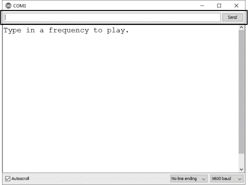

Arduino 上的串口通信有一个 64 字节长的缓冲区。*缓冲区*就像是数据进入设备时的等待队列，在这种情况下，它允许你通过串口监视器一次发送多个音符。例如，你可以通过输入以下数字来播放《小星星》这首歌，数字之间用逗号分隔且不包含空格。最后一个逗号也很重要。`Serial.parseInt()`命令会寻找由非数字字符（如逗号）分隔的数字字符。Arduino 需要看到最后一个符号（最终的逗号），以解析出最后一个音符。

```
262,262,392,392,440,440,392,392,349,349,330,330,294,294,262,262,
```

确保不要在这里输入空格。每个字符等于 1 字节数据，如果你试图一次发送超过最大 64 字节的数据，最后几项数据将会被截断。

最后，蜂鸣器的频率被优化为 2,047 Hz。你可能会注意到，当你尝试这个频率时，蜂鸣器非常、*非常*响，可能会让人觉得烦人，所以请注意：你周围的人可能不太喜欢 2,047 Hz 频率下蜂鸣器发出的高频声音！

#### 创建特定音符

如果你想尝试一些更传统的方式，可以将实际的音乐音符与频率关联起来。许多乐器以中央 C 为参考点，中央 C 的频率大约为 262 Hz。表 10-1 显示了 C 大调音阶一个八度的频率简表。

**表 10-1：** C 大调音阶的音符和频率

| **注意** | **大约频率** |
| --- | --- |
| C | 262 |
| D | 294 |
| E | 330 |
| F | 349 |
| G | 392 |
| A | 440 |
| B | 494 |
| C | 524 |

尝试实验看看能不能演奏一首歌。为了帮助你入门，“小星星”从音符 CC、GG、AA、GG、FF、EE、DD、CC 开始。你可能会注意到，Arduino 发出的声音不是最有旋律的。这是因为 Arduino 只能将引脚设置为 `HIGH`（开）或 `LOW`（关）。这会生成一个方波，产生刺耳的音调。你可以使用电容器做一些技巧来创建噪音过滤器，从而柔化这个声音，但那是另一本书的内容！

#### 使用 SoftPot 生成声音

用频率制作音乐很有趣，但一次又一次地输入它们非常繁琐。相反，你可以使用 SoftPot 作为一个传感器，它的值会对应蜂鸣器的频率。

SoftPot 通过一个简单的电压分压器连接，这样对软条的压力就会转化为从 0 到 5 V 的电压。记住，Arduino 可以通过 `analogRead()` 函数将 0 到 5 V 的模拟电压转换为 `0` 到 `1023` 的数值。使用 清单 10-2 中的简单草图，你可以通过按压 SoftPot 向蜂鸣器发送频率。当 SoftPot 没有被按压时，由于下拉电阻的作用，值默认为 `0`，因此不会发出声音。

启动一个新的 Arduino 草图，复制清单 10-2 中的代码示例，并将其上传到您的设备。

**清单 10-2：** 发声器示例代码

```
  //Noisemaker Example
  //upload this example, open the Serial Monitor,
  //and then squeeze the SoftPot
➊ int sensorValue;
  void setup()
  {
    pinMode(9, OUTPUT);
    **Serial**.begin(9600);
  }

  void loop()
  {
➋   sensorValue = analogRead(A0);
➌   if (sensorValue > 0)    //if there's a press on sensor,
                            //play note
    {
➍    **Serial**.print("Raw sensor reading: ");
     **Serial**.println(sensorValue);
➎    tone(9, sensorValue, ➏50);
     delay(➐50);
    }
➑    else
    {
      noTone(9);
    }
  }
```

让我们来看看这个草图是怎么工作的。你首先声明一个变量来存储原始的传感器读取值 ➊。在循环中，`analogRead()` 函数读取 A0 引脚上的电压 ➋，并将该值赋给变量 `sensorValue`。当没有施加压力时，该值将为 0 V。你使用 `if()` 语句 ➌ 来检查输入值是否大于 `0`，如果是，草图就会打印出原始的传感器值 ➍，并使用 `tone()` 命令 ➎ 播放 `sensorValue` 中存储的值。如果草图在播放音符时卡住了，尝试将 `if()` 语句中的 `0` 改为更大的数字，比如 `10` 或 `20` ➌。这个技术叫做 *设置死区范围*。有些传感器并不总是返回零值，因此这个死区范围设定了一个值范围，程序仍然可以将其视为零。每个传感器可能略有不同。

请注意，在这个示例中，我们改变了`tone()`播放的持续时间➏和`delay()`的时间➐，将其设置为`50`毫秒。这将允许你更快速地更改音符。否则，你只能播放半秒长的音符！最后，你需要确保 Arduino 只在按下 SoftPot 时才播放音调。为此，你可以使用`else()`语句来检测 SoftPot 是否未被按下➑，并使用`noTone()`命令来关闭蜂鸣器。

现在，不再使用从串口监视器发送的频率，而是 Arduino 使用 SoftPot 的原始传感器值。要进行尝试，只需用拇指和食指夹住 SoftPot，在传感器的不同点施加压力。当你上下滑动手指时，可以产生从 1 赫兹到 1,023 赫兹的音调。你听到了什么？听起来像外星人降临吗？相当酷吧——现在你有了自己的特效生成器！你能演奏出类似歌曲的东西吗？如果不能，看看下一个示例。

#### 演奏一首歌

现在你已经了解了 Arduino 如何发出声音，接下来是将 SoftPot 的传感器读取值映射到真实音符的过程，这样你就可以演奏真正的音乐了。你将把传感器分成八个不同的部分（或键），并将这些部分映射到一个索引，用来播放音符。

将清单 10-3 中的草图复制到 Arduino IDE 中，并将其上传到你的设备。

**清单 10-3：** 微型电子钢琴草图

```
  //Tiny Electric Piano Example Code
➊ int frequencies[] = {262, 294, 330, 349, 392, 440, 494, 524};
  int sensorValue;
➋ byte note;

  void setup()
  {
    pinMode(9, OUTPUT);
    **Serial**.begin(9600);
  }
 void loop()
  {
    sensorValue = analogRead(A0);
    if (sensorValue > 0)   //if it's a note, play it!
    {
      //map the key pressed to a note
    ➌ note = map(sensorValue, 0, 1023, 0, 8);
    ➍ note = constrain(note, 0, 7);
      **Serial**.print(sensorValue);
      **Serial**.print("\t");
      **Serial**.println(➎frequencies[note]);
      tone(9, ➏frequencies[note], 50);
      delay(50);
    }
    else
    {
      noTone(9);
    }
  }
```

看一下代码。首先，你声明了一个数据结构，称为数组。*数组*是一种表示多个值的变量，而不仅仅是一个单一的值。数组可以是任何标准数据类型，包括字节、整数、长整型和浮点型，并且你需要在数组名称之前声明数据类型。

声明一个数组类似于声明一个变量，只不过数组名称后面跟着两个方括号`[ ]`。当你初始化数组时，你需要在两个大括号`{ }`内定义列表，并使用逗号分隔每个值：

```
*dataType arrayName*[] = {*val0*, *val1, val2, val3, val4*... };
```

清单 10-3 声明了一个名为`frequencies[]`的整数（`int`）数组，用于存储八个音符频率的值➊。你可以通过方括号中的索引号来访问数组中的值。第一个值被称为`frequencies[0]`，第二个值是`frequencies[1]`，以此类推。请注意，和往常一样，索引从 0 开始，而不是从 1 开始，正如图 10-11 所示。

**图 10-11：** `frequencies[]`数组元素

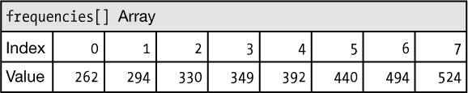

然后，草图声明了一个名为`note`的索引变量➋。数组只有八个值，因此你可以将该变量声明为`byte`，因为它比整数占用更少的内存空间。接下来，草图使用`map()`函数➌将原始的`sensorValue`读取值从 0–1,023 范围映射到 0–8 的范围。

`map()`函数是将一个值范围转换到另一个值范围的一个好工具。你传入输入值、输入的范围和目标范围，它会将你的输入值缩放到目标范围，如下所示：

```
map(*inValue*, *inMin*, *inMax*, *outMin*, *outMax*);
```

程序将这个缩放后的值赋给变量`note`。这个值将作为索引来引用数组。但是，虽然`map()`函数将 0–1,023 的范围映射到 0–8 的范围，但`frequencies[]`数组实际上只有八个值，且索引从 0 到 7。

我们这样做是因为`map()`在从一个范围映射到另一个范围时会向下舍入，因此，为了获得八个均匀间隔的值，我们实际上需要提供九个值。只有当输入等于 1,023 时，才会产生值 8。由于值 8（第九个值）不是数组的有效索引，我们使用另一个命令`constrain()` ➍来修正这个问题。此函数将值限制在 0 到 7 的范围内。任何低于 0 的值都被限制为最小值 0，而任何大于 7 的值都被限制为最大值 7。`constrain()`函数通常与`map()`一起使用，用于缩放和限制值。

`constrain()`函数的使用方法如下：

```
constrain(*value*, *minValue*, *maxValue*);
```

最后，程序将当前触发音符的频率输出到串行监视器 ➎，并使用`tone()`函数 ➏来播放这个音符。

测试时，按压或挤压 SoftPot。当你上下移动手指沿着传感器的长度时，你会听到不同的音符。试试你能弹奏出什么歌曲。

现在，让我们将这个原型制作成一个完成的钢琴！

### 制作钢琴

为了将原型转换成一个更实用的钢琴，你只需要将其应用到一个平面表面上，并标出八个键位。

不幸的是，这个传感器的引脚既不够长也不够粗，无法直接插入公对母跳线，因此，如果你想将其从面包板上取下，我们建议你从发明者套件中焊接三根公对公跳线到 SoftPot 的两端，如图 10-12 所示。或者，你*可以*使用公对母跳线，但需要使用一把尖嘴钳压紧两端。如果你这么做，将传感器引脚插入一组公对母跳线并压碎传感器引脚周围的塑料外壳。确保导线与传感器的引脚接触。

**图 10-12：** 将导线焊接到 SoftPot

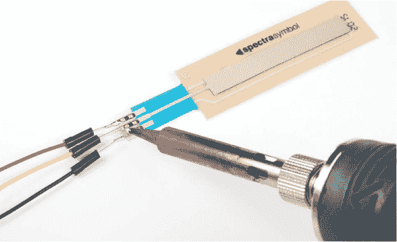

SoftPot 具有粘性背面，设计用于平放在硬表面上，因此，连接好导线后，将传感器粘贴到任何便携的硬表面上（如图 10-13 所示），比如一小块纸板，甚至是面包板支架本身。

**图 10-13：** SoftPot 安装选项


SoftPot 传感器长 50 毫米（约 2 英寸）。你需要将传感器的长度划分成八个键位，也就是说每个键大约应有四分之一英寸宽。使用遮蔽胶带或纸张，按照图 10-14 的示例标出八个四分之一英寸宽的键。

**图 10-14：** 标记键位

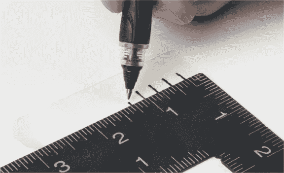

接下来，将遮蔽胶带或纸张放在 SoftPot 上，以便为演奏音符提供指导。完成的键盘应类似于图 10-15。如果你愿意，你可以在键上标注与代码中的频率匹配的音符，帮助你从乐谱中演奏。

**图 10-15：** 完成的微型电动钢琴键盘

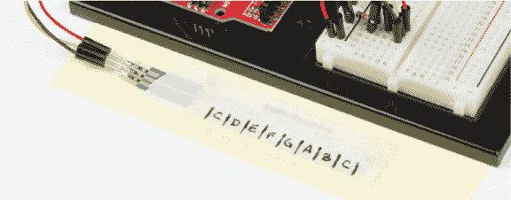

### 深入探索

在这个项目中，我们介绍了压电蜂鸣器和 SoftPot。现在你已经知道如何发出一些有趣的声音，下面是一些扩展此项目的想法。

#### 破解

尝试修改代码，看看能创造出哪些有趣的音调。例如，如果你想用不同的调或音阶演奏一首歌，你可以改变数组中的频率。表 10-2 显示了可以用来改变钢琴调性的频率。C 大调和 G 大调是音乐中最常用的两种音阶。你可以在线查找一些乐谱，或者随便试试。你能用你的新 SoftPot 钢琴演奏《小星星》吗？

**表 10-2：** 选定的三重八度音符大致频率

| **音符** | **大致频率** | **音符** | **大致频率** | **音符** | **大致频率** |
| --- | --- | --- | --- | --- | --- |
| C[3] | 131 | C[4] | 262 | C[5] | 524 |
| C^♯[3]/D^♭[3] | 139 | C^♯[4]/D^♭[4] | 277 | C^♯[5]/D^♭[5] | 554 |
| D[3] | 147 | D[4] | 294 | D[5] | 587 |
| D^♯[3]/E^♭[3] | 156 | D^♯[4]/E^♭[4] | 311 | D^♯[5]/E^♭[5] | 622 |
| E[3] | 165 | E[4] | 330 | E[5] | 659 |
| F[3] | 175 | F[4] | 349 | F[5] | 698 |
| F^♯[3]/G^♭[3] | 185 | F^♯[4]/G^♭[4] | 370 | F^♯[5]/G^♭[5] | 740 |
| G[3] | 196 | G[4] | 392 | G[5] | 784 |
| G^♯[3]/A^♭[3] | 208 | G^♯[4]/A^♭[4] | 415 | G^♯[5]/A^♭[5] | 831 |
| A[3] | 220 | A[4] | 440 | A[5] | 880 |
| A^♯[3]/B^♭[3] | 233 | A^♯[4]/B^♭[4] | 466 | A^♯[5]/B^♭[5] | 932 |
| B[3] | 247 | B[4] | 494 | B[5] | 988 |

#### 修改

为了让事情更加有趣，将一个*失真踏板*添加到这个钢琴项目中。这个按钮将切换音阶，给你 8 个音符的价格换来 16 个音符。按照图 10-16 所示，将按钮连接到 Arduino 的第 2 引脚。

这个草图只需要为踏板添加几行额外的代码，每次按下按钮时，乘数变量将循环变化。这被称为*状态机*，因为每次按下按钮时，变量的状态都会改变。这个修改的代码在本书的资源中，位于*[`www.nostarch.com/arduinoinventor/`](https://www.nostarch.com/arduinoinventor/)*，文件名为*P10_TinyPiano_v2.ino*。

**图 10-16：** 为八度控制添加按钮到引脚 2

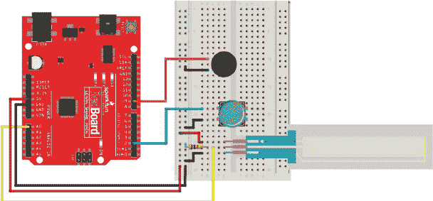

新的代码行声明了一个状态变量 `octaveMultiplier`，然后添加了一个 `pinMode()` 命令来设置引脚 2 为 `INPUT`。当按钮被按下时，状态变量 `octaveMultiplier` 会递增，从而改变频率，使得音符升高。

尝试一下。当您按下按钮时，音符应该都会升高一个八度。现在，您可以使用这个简单的 Arduino 乐器演奏最多 16 个音符！

#### 附加项目：二进制小号

SoftPot 是一个不错的设计，但作为额外奖励，我们构建了一个 Arduino 乐器，使用实际的按钮作为键，而不是 SoftPot。这个最后的项目叫做二进制小号。它使用三个按钮来指定播放的音符，第四个按钮用于播放音符，就像吹小号一样。通过三个按钮，您可以使用表 10-3 中显示的按键组合来指定最多八种不同的组合。

**表 10-3：** 二进制小号按钮序列

| **按钮 1** | **按钮 2** | **按钮 3** | **播放的音符** |
| --- | --- | --- | --- |
| 上 | 上 | 上 | C (262 Hz) |
| 上 | 上 | 下 | D (294 Hz) |
| 上 | 下 | 上 | E (330 Hz) |
| 上 | 下 | 下 | F (349 Hz) |
| 下 | 上 | 上 | G (392 Hz) |
| 下 | 上 | 下 | A (440 Hz) |
| 下 | 下 | 上 | B (494 Hz) |
| 下 | 下 | 下 | C (524 Hz) |

您可能会认出这个模式是一个二进制序列。它按照 000、001、010、011、100、101、110 和 111 的顺序计数。

为了在面包板上腾出位置放置四个按钮，将蜂鸣器稍微上移一点，然后按照图 10-17 所示添加这些按钮。

**图 10-17：** 二进制小号接线图

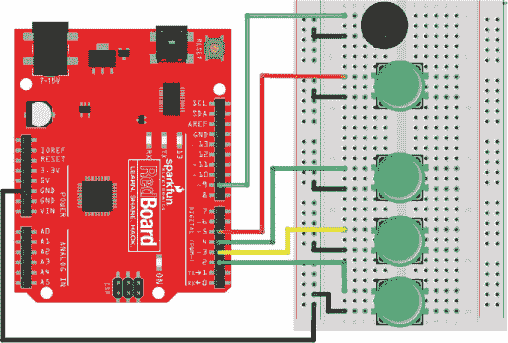

此修改的完整代码可以在书籍资源中的 *[`www.nostarch.com/arduinoinventor/`](https://www.nostarch.com/arduinoinventor/)* 网站上找到，文件名为 *P10_TinyBinaryTrumpet.ino*。使用二进制小号演奏音符需要一些时间来适应，但表 10-3 中的按键序列应该能帮助您快速掌握。

结果是，使用四个按钮，您实际上可以演奏最多 16 个不同的音符。您能找出如何修改示例以实现这一点吗？查看书籍资源以了解如何操作。

无论您是使用小型电子钢琴还是二进制小号，我们都希望这对您未来从事音乐创作的职业有所帮助。现在，去找到一个观众，展示您的最新技能吧！
