## 附录

## 更多电子技术知识

本附录提供了使用万用表和焊接的操作指南，并且是读取电阻器色带的实用参考。

### 使用万用表测量电气

*万用表*是诊断和排除电路故障的必备工具。顾名思义，它是一种能够测量与电气相关的多种内容的仪表——即电流、连续性、电阻和电压。让我们来看一下如何使用万用表。在本教程中，我们将使用 SparkFun VC830L（TOL-12966；如图 A-1 所示），但这些方法应适用于大多数万用表。

#### 万用表的部件

万用表有三个主要部件，在图 A-1 中标出。

**图 A-1：** 一款典型的万用表

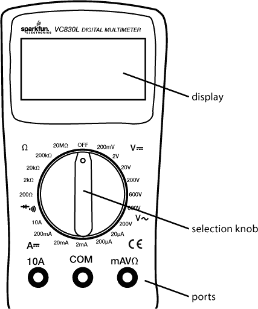

显示屏通常可以显示四位数字和一个负号。选择旋钮允许用户将万用表设置为读取不同的内容，如毫安（mA）电流、电压（V）和电阻（Ω）。选择旋钮外部的数字表示每个设置的最大值或范围。

在某些万用表上，显示屏不会显示单位。在这种情况下，假定显示的值具有与设置相同的单位，因此如果你将范围设置为 200 Ω，显示的数字将以Ω为单位。如果你将范围设置为 2 kΩ、20 kΩ或 200 kΩ，则显示的值将以 kΩ为单位。

大多数万用表配有两个探头，插入设备前面的三个端口中的两个。这三个端口分别标有 COM、mAVΩ和 10A。COM 代表*公共端*，几乎总是应连接到地、负极或电路的负端。mAVΩ端口用于测量电流（最多 200 mA）、电压（V）和电阻（Ω）。10A 端口是用于测量大于 200 mA 电流的特殊连接端口。

大多数探头的末端有香蕉型连接器，可以插入万用表，使得不同类型的探头可以使用。对于大多数测量，将红色探头插入 mAVΩ端口，将黑色探头插入 COM 端口。

#### 测量连续性

测量连续性可能是排除故障和调试电路中最重要的功能。这项功能使我们能够测试导电性，并追踪电气连接是否已接通。将万用表设置为连续性模式，标有二极管符号并且有传播波（像声音从扬声器发出）围绕它，尽管这在不同的万用表之间可能会有所不同。

将两个探头端点接触在一起，你应该能听到响铃声——这就是为什么检查连续性有时被称为“响铃”电路。你可以使用这种方法测试无焊面包板上哪些孔是连接的，哪些不是。探头的尖端通常太大，不能直接插入面包板，但你可以将两根导线插入面包板的同一排，并将探头的两端触摸到每根导线的末端。你应该能听到响铃声，表示这两根导线通过排连接在一起。你也可以使用这种方法追踪电路。因为你通常看不见所有导线的走向，这是一种快速的方式来测试两个点是否电连接。当你检查连续性时，连接探头的哪一侧并不重要，因为你只是检查一侧是否与另一侧电连接。

#### 测量电阻

连续性设置仅在电阻较低时发出响声，但要获得电阻的实际值，你需要使用电阻设置。将旋钮调至标有欧米伽符号（Ω）的电阻设置，它代表*欧姆*，即测量电阻的单位。确保你测量的电阻器或元件没有通电或连接到电路中。电阻器像许多电气元件一样有两个端点。要测量电阻，只需将探头的两端触摸到电阻器的两端。与连续性测量一样，连接红色和黑色探头的位置不重要。

有几种可能的电阻范围设置可供选择。这些设置表示你可以测量的最大值。如果你想高精度地测量一个小电阻，可以将万用表设置得很低——例如设置为 200 Ω。

如果你尝试测量超过范围的电阻，万用表会显示`[1\. ]`，并且不会显示零。如果电阻大于你选择的范围，尝试将范围调高一点，再次进行测量。

试试看！如果你测量 330 Ω电阻（橙色-橙色-棕色），在每个设置下你记录的值是多少？所有电阻都有公差带；大多数电阻的公差通常为 5%。你的测量误差是多少百分比？是否在公差范围内？

测量光敏电阻的电阻。将你的手或其他不透明物体放在光敏电阻上方，并在不同高度下测量电阻。

#### 测量电压

电压是两点之间电势的测量，有时也被称为*电势差*。类似于电阻设置，测量电压的不同设置指定了最大值。

你会注意到有两个范围符号，一个是两个直线，另一个是一个弯曲的线。两个直线表示*直流电（DC）*测量，这是电子学中最常用的测量方式。弯曲的线表示*交流电（AC）*，就是你家墙壁里的电。确保旋钮调到了正确的设置——你可能需要选择直流电（DC）。20 V 档位是本书项目的最佳选择，因为在 Arduino 上所有的电压都限制在 5 V 以内。

现在，试着测量 Arduino 板上的电压。使用 USB 电缆将你的 Arduino 板连接到计算机以供电。要测量电压，将黑色探针连接到 GND（地）。然后，用红色探针测试各个点或引脚的电压（相对于 GND）。5 V 引脚显示的是什么？3.3 V 引脚呢？

#### 测量电流

*电流*是电荷在电路中流动的速率，单位是*安培*（*amps*）。为了捕捉电荷的流动速率并测量电流，你需要断开电路并将表计连接到你想要测量电流的位置。将旋钮调节到你预期测量的电流范围。如果你测量的电流可能超过 200 mA，转动选择旋钮至 10A 档，并将红色探针插入万用表机身上标有 10A 的端口。如果不确定，这个范围是最安全的开始选择，可以避免损坏表计。

例如，要测量一个简单的 LED 和电阻电路中的电流，你可以在 LED 和电阻之间将电路切入（见图 A-2）。电流必须通过万用表。因为这是一个串联电路，你可以在这条路径上的任何位置测量电流：在 LED 之前、LED 之后，或者电阻之后。

**图 A-2：** 将万用表插入电路测量电流

在测量电流时，要非常小心，不要超过万用表的限制——你应该能从万用表的用户手册中找到其支持的电流范围。如果超过电流限制，可能会导致万用表的保险丝烧断。（如果保险丝烧断不必担心——更换保险丝并不贵。更换新保险丝时，你可能需要用螺丝刀打开万用表的后盖。）标准的 mAVΩ端口通常能处理最高 200 mA 的电流。

### 如何进行焊接

焊接是制作电子原型项目时最基础的技能之一。它涉及将一种特殊金属——*焊锡*——熔化并将其夹在两个组件之间，使它们更持久地连接在一起（见图 A-3）。

**图 A-3：** 焊接

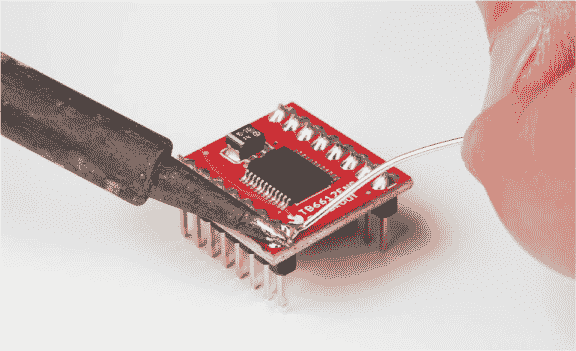

焊料，如图 A-4 所示，是一种熔点较低的金属合金。现代焊料的熔点大约在 180 摄氏度或 356 华氏度左右，差不多是烘焙饼干时需要的温度。大多数用于电子设备的焊料内部含有*助焊剂*，一种清洁液体。焊料融化时，助焊剂帮助清洁焊接表面，并促进焊料的流动。

**图 A-4：** 一卷焊料

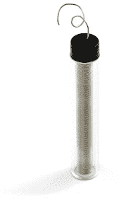

要进行焊接，你需要使用*烙铁*。大多数烙铁的大小大约和一根中等大小的胡萝卜差不多，分为两个主要部分：手柄和加热端（见图 A-5）。

**图 A-5：** 一款典型的烙铁

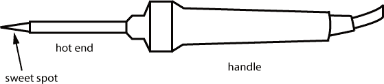

焊接铁有许多样式和类型。较便宜的烙铁大约价格为 10 美元，通常有一个固定温度设置，但我们建议选择带有温控旋钮的烙铁。烙铁的最佳温度大约是 650 华氏度。如果温度太高，尖端会迅速氧化并变脏。如果温度不够高，则无法融化焊料。可调温的烙铁能帮助你控制这一点，所以值得花些额外的钱购买。

使用烙铁时要非常小心：当你打开烙铁时，加热端会迅速加热到足以融化金属的温度。那真的很热！始终从手柄处握住烙铁——即使烙铁关掉了，也绝不能从加热端握住。

你还应该用一块纸板、一块切割垫或废木块来保护你工作时的桌面表面。而且，在开始焊接之前，你应该始终佩戴护眼装备。小块的焊料和助焊剂有时会飞溅出来。为了保护你的宝贵眼睛，最好保持安全！

#### 加热烙铁

使用烙铁时，首先插上电源并让它加热。根据烙铁的类型，这可能需要 30 秒到几分钟的时间。在烙铁加热时，请确保它放在支架上，以免加热端接触到桌面或工作台。

当烙铁变热时，焊料应该能轻松融化，所以可以通过将焊料的一端触碰到烙铁的尖端侧面来进行测试。这是烙铁最热的部分，被称为*甜点*（见图 A-6），你应该使用这一部分来加热元件。如果焊料立刻融化，说明你的烙铁已经足够热，能够进行焊接。

**图 A-6：** 烙铁尖端的侧面比尖端的最前端要热得多。

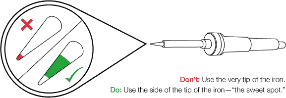

#### 完善你的焊接技巧

与你可能认为的不同，焊接时并不直接将铁头接触到焊料以将其融化。诀窍是将铁头放在你打算焊接的元件上约 2 到 3 秒钟。然后将焊料直接涂抹到加热的接头上，焊料就会融化。焊料总是会朝着热源流动，并停留在元件的最热部分。如果你将焊料直接加到铁头上，它可能会聚集在铁头上，而不会流到你想焊接的部位。如果发生这种情况，只需清洁铁头并重新尝试。像握住铅笔一样握住铁头，用你的主手从手柄处握住它。另一只手则握住一段焊料。小心不要将焊料握得离你正在融化的端部太近，因为热量可能会沿着焊料传导到你的手指。

将铁头的甜点部位触碰到你打算焊接的元件上。确保铁头的甜点部位同时接触到两个需要焊接的部件，以便它们均匀加热，如图 A-3 所示。数三秒钟：一千零一、一千零二、一千零三。

接下来，在将铁头保持在元件上的同时，将焊料的末端送入接头。记住，焊料会朝着热源流动。

当你送入足够的焊料使接头填满时，移开焊料，但再保持铁头在接头上 1 秒钟。这会让焊料流动并定型。然后将铁头从接头上移开，放回支架上。

一个好的焊接接头应该是平滑且略带光泽的。如果你正在焊接到电路板上，接头通常会呈现出小火山或巧克力糖果的形状。焊接需要练习，因此如果你的焊接接头看起来不干净或不平滑，可以尝试重新加热接头，让焊料再次流动并定型，或者再加一点焊料。图 A-7 展示了一些常见的焊接错误及其解决方案。

**图 A-7：** 常见的焊接错误及解决方案

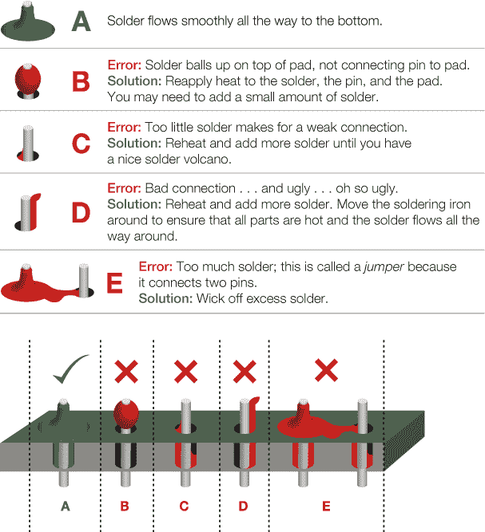

#### 清洁铁头

保持铁头清洁是获得良好焊接接头的秘诀之一。我们建议在每次使用前加热铁头，并使用铜刷或湿海绵擦去可能积累的多余焊料和氧化物。

如果铁头脏了且你无法擦去多余的积垢，可以使用铁头清洁剂（TOL-13246）；这是一种由温和酸和焊料混合而成的物质。使用时，加热铁头，将热铁头的尖端放入清洁剂中，让清洁剂溶解氧化物和积垢，约 10 到 15 秒。然后，用海绵擦拭铁头。如果需要，可以重复此过程。铁头应该是光亮的。

#### 焊接技巧

图 A-8 展示了更多使用焊接铁头的提示和建议。

**图 A-8：** 焊接提示和建议

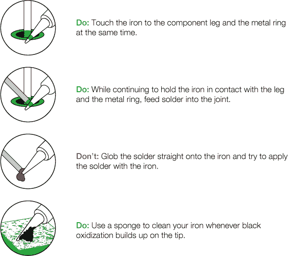

**注意**

*某些类型的焊锡含有铅。我们强烈建议在进行任何焊接后，无论使用哪种类型的焊锡，都要洗手。*

使用烙铁是一项任何制造者工具箱中都应具备的技能。当你准备将原型项目做得更持久、更耐用时，焊接能确保线路和组件之间的连接不会断开。

### 额外的焊接工具

这里有一些额外的工具，我们推荐你使用，以帮助你每次都能制作完美的焊点。这些工具帮助固定你的零件、清理焊点并去除多余的焊锡。

#### 第三只手

*第三只手* 基本上是一种夹具，用来固定你正在焊接的零件，是焊接时最好的助手之一。第三只手有很多种版本，但大多数只是几只鳄鱼夹固定在一个重型支架上，帮助你在用手持焊锡和烙铁时固定零件。许多基本款甚至还配有放大镜和小型烙铁支架，如图 A-9 所示。

**图 A-9：** 第三只手焊接支架

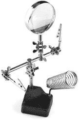

#### 助焊剂笔

做出一个好的焊点的窍门之一是确保所有表面干净，你可以使用助焊剂，一种稍带酸性的清洁液，通常由树脂制成。助焊剂笔（见图 A-10）的使用方法像涂料标记笔；你只需将笔尖按在你正在焊接的焊点上，直到有少量液体流到电路板上。然后将烙铁直接放在焊点上，插入焊锡，借助助焊剂，焊锡会更快速地融化，并更好地与组件结合。

**图 A-10：** 一支水溶性助焊剂笔

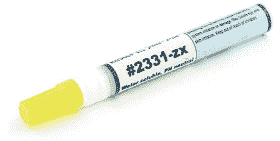

助焊剂对焊接有很大的帮助，但它有一定的腐蚀性，因此确保尽量减少与皮肤的接触，并在使用后立即洗手。

#### 焊锡吸取带

在焊接时，你有时会发现自己加了太多焊锡，或者将焊锡弄到了不该去的地方。桌面上有两种工具可以帮助你去除多余的焊锡。第一种是*焊锡吸取带*，这是一种细密编织的铜网，形状像带子，如图 A-11 所示。

使用焊锡吸取带时，将吸取带放在你希望去除焊锡的焊点上，将加热后的烙铁放在吸取带上，既加热吸取带，也加热下方的焊点，焊锡融化后会被吸取带吸走，进入铜网。完成！

**图 A-11：** 焊锡吸取带的特写

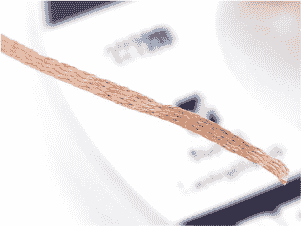

在移除吸取带和烙铁时，确保将烙铁保持在吸取带上。如果你过早地将烙铁拿开，吸取带会被焊接到电路板上。如果发生这种情况，只需重新加热焊点以去除吸取带。

#### 焊锡吸尘器

另一个可以去除多余焊锡的工具称为*吸锡器*或*吸锡泵*。这个巧妙的工具使用柱塞（类似于注射器）创建真空，并通过按下按钮释放。

要使用吸锡器，首先按下柱塞以预装工具。接下来，加热您希望移除的焊点，直到它完全熔化为液态。将吸锡器的尖端靠在焊锡上（同时保持熔化状态），最后按下释放按钮吸走多余的焊锡。

如果不起作用，请再试一次。有时在您希望从中去除焊锡的区域添加少量焊锡会有所帮助。

### 电阻器和色环

电阻器的值有很广泛的范围，但是如何通过看这个小组件来判断它的值呢？上面没有数字或文字！

电阻器使用色环系统来显示它们的值。图 A-12 展示了色环系统的工作原理。

大多数电阻器有四到五个彩色环。电阻器的最后一个环指定了*容差*或制造商允许的变化程度。大多数情况下，您的电阻器将有一个金色的容差环，为 5%。这意味着制造商允许该电阻器的值波动多达 500Ω仍然被视为 10 kΩ 电阻器。例如，具有 5%容差的 10 kΩ 电阻器的电阻值可以波动到 500Ω，并且仍然被视为 10 kΩ 电阻器。

当您从左向右阅读带有容差环的电阻器时（通常是金色或银色环朝向右侧），剩余的环指定了电阻值。在四环电阻器上，前两个环指定基数，第三个环是乘数。在五环电阻器上，前三个环指定基数，第四个环是乘数。

例如，10 kΩ 电阻器的前三个色环是棕色、黑色和橙色。根据图 A-12 中的图表，棕色代表 1，黑色代表 0，因此棕黑表示基数是 10。第三个环是橙色，指定了一个 10³ 的乘数，总计为 10,000。最后一个环指定了容差，在这个例子中是 5%（金色）。

**图 A-12：** 电阻器颜色编码速查表

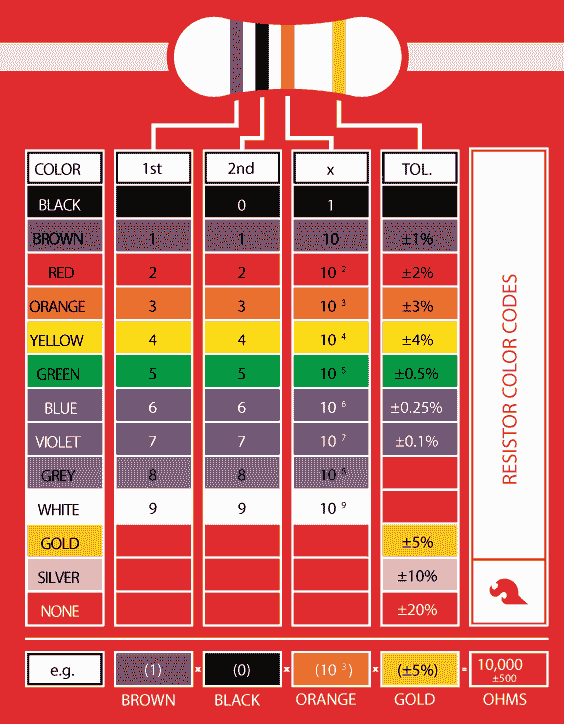

以防以后需要查找电阻器颜色编码，你可能想折角此页作为参考。没关系，我们不会告诉图书管理员。
