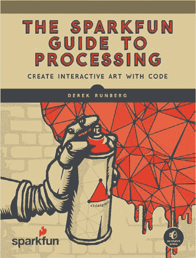
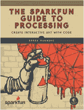
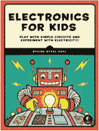
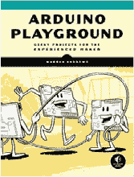
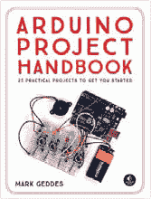
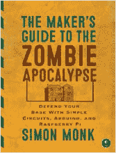
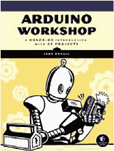

## 第十二章：后记

我们希望你喜欢本书中的项目制作过程。我们在构思不同的项目创意时非常开心，项目中融合了纸板、纸张、乒乓球和其他常见材料，以及基本的电子元件。但本书中的项目仅仅是一个开始。我们希望这些项目能激发你的灵感，并帮助你释放你内心的发明家！我们鼓励你将每章中的组件和概念结合起来，创造属于你自己的*Franken-duino*项目！如果你有任何想法或建议想要与我们分享，请通过* ArduinoInventorsGuide@sparkfun.com *给我们留言。

祝你好运，祝你愉快地创作！

### 附加资源

Arduino 背后的社区非常庞大。Arduino IDE 每月被下载近 60 万次。尽管 Google 几乎能找到互联网上的任何信息，但这里有一些我们经常使用并推荐的其他资源。

**Arduino 学习社区** *[`www.arduino.cc/en/Guide/HomePage`](https://www.arduino.cc/en/Guide/HomePage)*

**Arduino 语言参考** *[`www.arduino.cc/en/Reference/HomePage`](https://www.arduino.cc/en/Reference/HomePage)*

**SparkFun 教育教程** *[`learn.sparkfun.com/`](https://learn.sparkfun.com/)*

**Adafruit 学习 Arduino 社区** *[`learn.adafruit.com/category/learn-arduino`](https://learn.adafruit.com/category/learn-arduino)*

### 鸣谢

我们感激 Arduino 社区、SparkFun 的每一位成员以及 No Starch Press 的编辑们给予我们的巨大支持。本书中我们所汇编的创意和项目归功于这些人，以及过去几年里无数次的白板头脑风暴、电子邮件和旁聊。我们还要感谢我们的家人——Zondra、Bear、Bridge、Mariela、Mia 和 Maeva——在测试、原型制作和写作过程中给予的支持。谢谢你们！

### 关于 SparkFun 系列

SparkFun 系列是 No Starch Press 与 SparkFun Electronics 之间的合作，后者是一个在线零售商，销售各种零件，帮助你实现自己的电子项目。系列中的每本书都由 SparkFun 的经验丰富的制作人员撰写，并由 No Starch Press 的编辑们编辑。最终的结果？就是你现在正在阅读的这本书。

### SparkFun 处理指南

*SparkFun 处理指南*展示了如何制作与周围世界互动的数字艺术作品。通过使用 Processing 编程语言和一点想象力，你可以将详细的像素艺术扩展到宏大的比例，录制和采样音频来创建自己的音效板，并创建反映声音、光线、温度和时间变化的可视化效果。

**资源**

访问 *[`www.nostarch.com/arduinoinventor/`](https://www.nostarch.com/arduinoinventor/)* 获取项目模板、草图、更新、勘误表和其他信息。

*更多实用的书籍来自*  **NO STARCH PRESS**

**THE SPARKFUN GUIDE TO PROCESSING**

使用代码创建互动艺术

*作者* DEREK RUNBERG

2015 年 8 月，312 页，$29.95

ISBN 978-1-59327-612-6

*全彩*

**儿童电子学**

玩转简单电路并实验电力！

*作者* ØYVIND NYDAL DAHL

2016 年 7 月，328 页，$24.95

ISBN 978-1-59327-725-3

*全彩*

**ARDUINO 游乐场**

为经验丰富的创客提供的极客项目

*作者* WARREN ANDREWS

2017 年 3 月，344 页，$29.95

ISBN 978-1-59327-744-4

**ARDUINO 项目手册**

25 个实用项目，帮助你入门

*作者* MARK GEDDES

2016 年 6 月，272 页，$24.95

ISBN 978-1-59327-690-4

*全彩*

**THE MAKER’S GUIDE TO THE ZOMBIE APOCALYPSE**

用简单电路、Arduino 和树莓派来保护你的基地

*作者* SIMON MONK

2015 年 10 月，296 页，$24.95

ISBN 978-1-59327-667-6

**ARDUINO 工作坊**

一本包含 65 个项目的动手入门书

*作者* JOHN BOXALL

2013 年 5 月，392 页，$29.95

ISBN 978-1-59327-448-1

1.800.420.7240 或 1.415.863.9900 | sales@nostarch.com | [www.nostarch.com](http://www.nostarch.com)

# 开始 DIY 电子项目

**要求**

**ARDUINO UNO 或 SPARKFUN REDBOARD**

Arduino 微控制器使学习电子学变得容易，但可能很难知道从哪里开始。这本书中的 10 个项目将教你如何与超级智能的 Arduino 和一些零件一起构建、编码和发明。

首先，你将通过一本介绍电路工作原理、如何读取接线图，以及如何使用无焊接面包板构建和测试项目的入门书籍掌握基础知识。接下来，你将学习如何使用电动机、LED、传感器等硬件让你的设备动起来、发出声音、闪烁，并与世界互动，在此过程中完成以下 10 个项目：

• 第一个经典的 Arduino 项目：让 LED 闪烁

• 一款迷你交通灯

• 一款显示动画图案和形状的 LED 屏幕

• 一款快节奏的按键游戏，测试你的反应能力

• 一款光敏、变色的夜灯

• 一款具有挑战性的平衡球游戏

• 一款带自动风扇和通风口的温度感应迷你温室

• 一款可以控制的电动机器人

• 一款为玩具车设计的计时器

• 一款可以真正弹奏的迷你电子钢琴！

每个项目都将教会你真实的编码技巧，让你能够控制你的发明，例如如何使用变量存储温度读数、如何用函数启动计时器或旋转电动机，以及如何使用循环做出决策。你还会发现一些技巧和窍门，帮助你为每个小工具增添自己的创意，并进一步提升。

### 关于 Sparkfun 电子公司

SparkFun Electronics 是一个在线零售商店，销售用于 DIY 项目的电子零件。它为公众提供课程，同时通过其教育部为教育工作者提供资源、教程和专业发展。

|  | ***极致极客娱乐*^™** **[www.nostarch.com](http://www.nostarch.com)** |
| --- | --- |

***“我躺平。”**

本书采用了耐用的装订方式，不会自动合上。*
