## 第一章：**设置与实用技能**

本书假设你已经有一定的硬件经验，因此其中的项目不会手把手地指导你。但如果你需要复习一些基本技能，例如布线和编程 Arduino 板，请继续阅读。

本章还介绍了一些你可能会觉得有用的技巧，尽管它们并非构建项目所必需。例如，在大多数项目中，我提供了可以用来制造屏蔽 PCB 的 PCB 文件，但如果你想制作 PCB 而不是将电路焊接到原型板上，可以阅读第 13 页的“制作自己的 PCB”章节。如果你从未自己组装过连接器或需要关于使用小型外形集成电路的指导，可以在第 20 页的“使用 SOICs”章节中找到相关信息。

### 准备 Arduino 板

无论你使用的是 Arduino Nano、Pro Mini，还是它们的克隆板，你的板子很可能会以插针分开且未焊接的形式到达。所有我购买的板子都是这种情况（见图 0-1）。

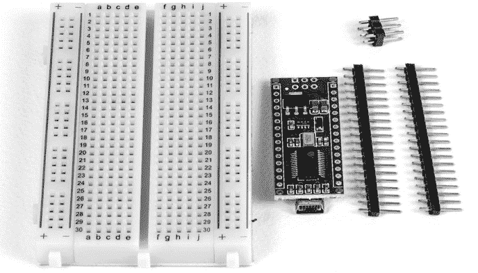

*图 0-1：一块带插针的 Arduino Nano 克隆板和面包板，作为焊接的辅助工具。*

在你能使用 Arduino 或其克隆板之前，需要先将插针焊接上。处理器板附带的插针条通常比所需的插针多，第一步是将它们修剪到所需的数量。黑色塑料固定件上有凹槽，便于剪切。我使用一把简单的斜口钳来剪切塑料（见图 0-2）。

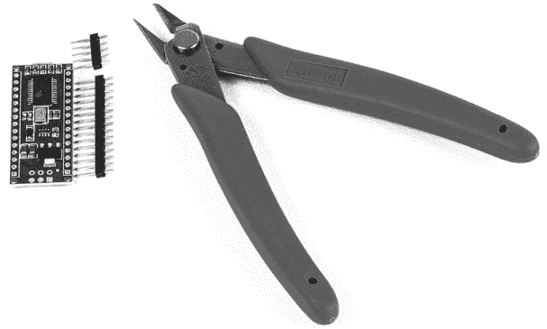

*图 0-2：Arduino Pro Mini 克隆板，插针已修剪至适当长度。五针插条适配板子的末端。*

下一步是将插针插入面包板，确保处理器板上的孔能正好覆盖在插针上。将插针的长端插入面包板，如图 0-3 所示。在两排插针之间留有四排空孔——也就是三排加上中间的分隔空隙——这样处理器板就能合适地放置。

最后的步骤是将处理器板放置在插针的短端上，如图 0-4 所示，并进行焊接。

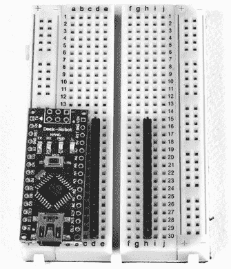

*图 0-3：插针已经插入面包板，准备好进行焊接 Nano 克隆板。*

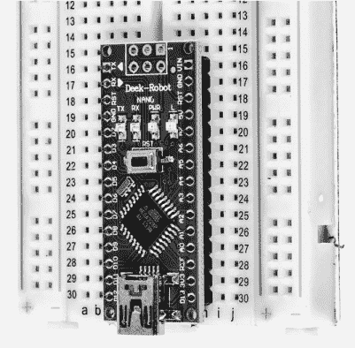

*图 0-4：Nano 克隆板已放置在面包板上，准备好进行焊接。*

现在你的板子已经安装好所有插针，准备接线了。

### 固定 I²C 板到 LCD 上

本书中的许多项目也使用带有集成电路（I²C）接口的液晶显示器（LCD）（见图 0-5）。本书使用的 LCD 可以带或不带 I²C 适配器板，尽管我通常需要单独购买 LCD 和适配器板。

如果适配器板尚未连接到 LCD，将两者连接的方法与准备 Arduino 板相似。适配器板通常带有已安装的排针，因此你只需将其插入显示器并进行焊接。

连接显示器和适配器通常没有任何问题，但在某些情况下，适配器可能具有几乎接触显示板的电路。为了避免连接短路，我建议在 LCD 背面贴上电气胶带，以将其与 I²C 适配器板上的连接隔离开。

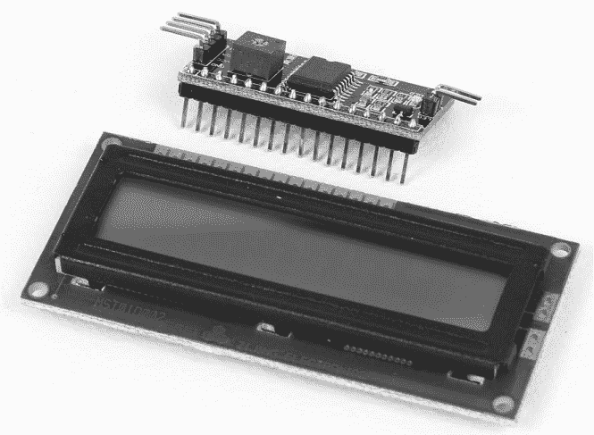

*图 0-5：16×2 LCD 和 FTDI 模块*

你可能还会发现，I²C 板上的排针突出穿过 LCD 板，导致在将显示器安装到外壳时出现问题。尽量将 I²C 板焊接得尽可能远离 LCD 板，以最小化排针穿过板的长度。图 0-6 显示了一个适配器板，准备将排针插入 LCD 基板。

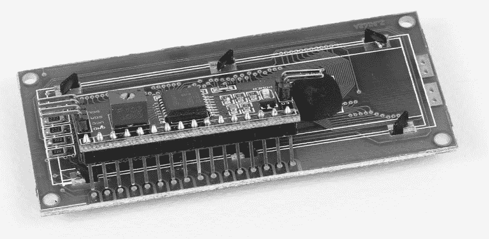

*图 0-6：I²C 板已就位，准备焊接*

如果将适配器板焊接在这样的位置过于困难，可以将插针插到极限，焊接它们，然后使用线切割器修剪，使它们尽可能与 LCD 板齐平。

根据你的 LCD 和适配器板，可能需要输入到草图中的 I²C 地址会有所不同。有一个非常简单的扫描器可用，访问*[`playground.arduino.cc/Main/I2cScanner/`](http://playground.arduino.cc/Main/I2cScanner/)*即可。只需按照说明操作即可找出 LCD 的 I²C 地址。0x27 和 0x30 是常见的地址。

### 上传草图到你的 Arduino

在你将项目的电路组装到面包板上之后，接下来就是将草图加载到微控制器上并进行测试。我建议使用 Arduino Nano、Pro Mini 或它们的克隆板，适用于本书中的大多数项目。

#### *安装 Arduino IDE*

你可能已经在计算机上安装了免费的 Arduino 集成开发环境（IDE）；如果没有，立即下载并安装该程序。只需访问*[`www.arduino.cc/`](https://www.arduino.cc/)*，点击**下载**，然后下载适合你操作系统的 Arduino IDE 版本。最新版本是 1.6.*x*。然后，访问 Arduino 的[入门页面](https://www.arduino.cc/en/Guide/HomePage/)，并按照官方安装说明进行操作。

**注意**

*如果你不熟悉 IDE，可以在 Arduino 网站上找到许多教程和示例代码文件。我强烈建议你阅读这些资料，以便熟悉软件使用*。

#### *使用 Arduino IDE*

安装完成后，打开 Arduino IDE。会出现一个空白的草图，名称格式为：*sketch_<date**>***。要保存草图，选择**文件 ▸ 另存为**。在打开的对话框中，选择你要保存草图的位置和文件名。

在为本书中的项目创建新草图时，你有两个选择：可以直接在草图窗口中输入代码，或者你可以从资源文件下载草图文件，访问 *[`www.nostarch.com/arduinoplayground/`](https://www.nostarch.com/arduinoplayground/)*，然后将代码复制并粘贴到草图窗口中。

我通常喜欢先*验证*草图——也就是编译它——再尝试上传到开发板，以确保在将草图输入到 IDE 时没有出现错误。验证非常简单，只需点击左上角的勾选标志（参见图 0-7）。当你将鼠标悬停在勾选按钮上时，*验证*一词会出现在该行五个图标的右侧。

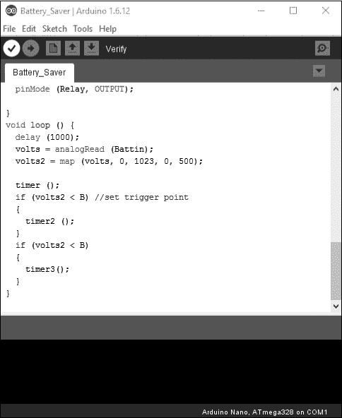

*图 0-7: 草图窗口，勾选了验证图标，位于图标列表的开头*

如果你的代码能够正确编译，那么它就准备好上传到开发板上了。

#### *连接和编程 Arduino Nano*

验证草图后，你需要将 Arduino 开发板连接到电脑。在本书中使用的 Arduino 开发板中，Nano 是最容易连接和编程的，因为它内置了 USB 接口。

对于 Nano，找到一根一端是 USB 插头（A 型），另一端是 mini-B USB 插头的电缆；你的开发板可能已经附带了一根。将 USB 端连接到电脑，将 mini-B USB 端连接到 Nano。选择**工具 ▸ 开发板**，然后选择正确的开发板和微控制器（参见图 0-8）。

你可能还需要选择正确的串口 COM 端口来连接你的 Arduino，尽管某些版本的 IDE 会自动找到一个空闲端口并连接到它。进入**工具 ▸ 端口**，然后从弹出的菜单中选择一个串口。如果遇到任何问题，可以参考操作系统的个别指南，访问 *[`www.arduino.cc/en/Guide/HomePage/`](https://www.arduino.cc/en/Guide/HomePage/)*。

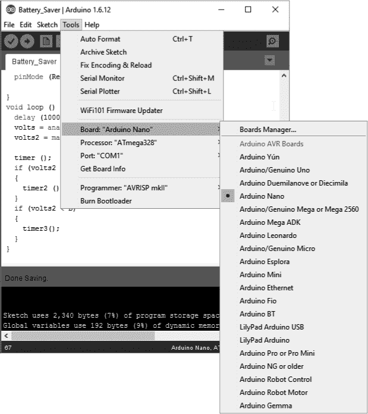

*图 0-8: 草图窗口，工具菜单已打开。我选择了带有 ATmega328 的 Arduino Nano*。

编程 Nano 的最后一步是上传代码。首先，确保开发板仍然通过 USB 线连接到电脑。然后，点击**上传**按钮，它看起来像一个指向右边的箭头（参见图 0-9）。当你将鼠标悬停在上传按钮上时，*上传*一词应该出现在五个主图标的右侧。

上传代码到 Arduino 通常不会花费太长时间，但它取决于程序的长度。上传完成后，你可以为电路供电并进行测试。（在使用外部电源供电之前，不要忘记拔掉 USB 连接线。）

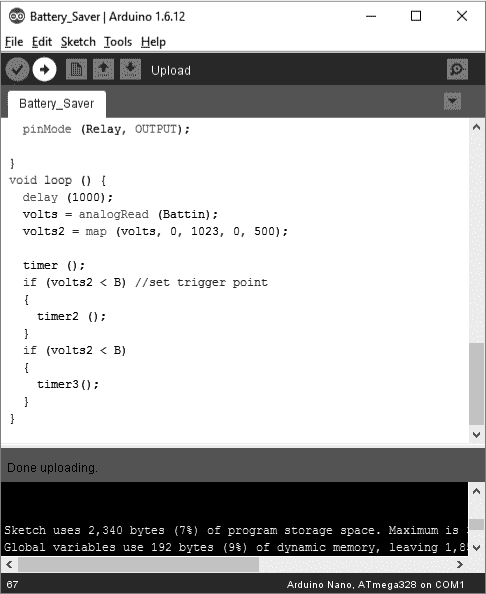

*图 0-9：点击上传按钮的草图窗口*

#### *连接和编程 Arduino Pro Mini*

Arduino Pro Mini（或其克隆版）的工作方式与 Arduino Nano 非常相似，但它没有内置 USB 接口，而是采用晶体管-晶体管逻辑（TTL）连接。我找到的最简单的方法是移除 Arduino Uno 的处理器芯片，如图 0-10 所示，并使用 Uno 板作为编程器。

不带处理器的 Uno 可以通过 USB 直接连接到计算机，因此它可以为连接的 Pro Mini 板提供电源和编程信号。Arduino Uno 的 USB 电缆是标准 USB 电缆，一端是常规的（A 型）USB 连接器，另一端是方形的（B 型）USB 连接器（见图 0-10）。有关 USB 电缆的更多信息，可以参考*[`www.sparkfun.com/pages/USB_Guide/`](https://www.sparkfun.com/pages/USB_Guide/)*。

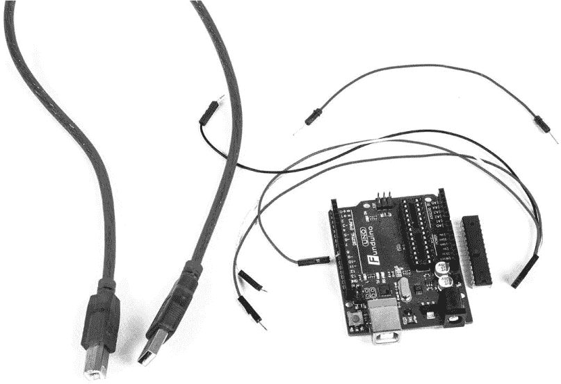

*图 0-10：移除处理器后的 Arduino Uno 克隆板（在板的右侧），USB 电缆，编程电缆组件，以及松动的重置线*

按如下方式将 Uno 连接到 Pro Mini：

• 将 Pro Mini 的 Rx 连接到 Uno 的 Rx

• 将 Pro Mini 的 Tx 连接到 Uno 的 Tx

• 将 Pro Mini 的 VCC 连接到 Uno 的 5.0V

• 将 Pro Mini 的 GND 连接到 Uno 的 GND

• 将 Pro Mini 的 RST 连接到 Uno 的 RST

我制作了一根简单的电缆，用于连接正负电压供电以及接收（Rx）和发送（Tx）信号（见图 0-11）。电缆的一端直接插入 Uno 上的插针，另一端的 4 针插头连接到 Pro Mini 的边缘插针。你也可以使用单独的跳线，就像你在面包板上使用的那样。我发现最简单的方法是将 Pro Mini 插入面包板，以便可以使用跳线连接 RST 信号，如图 0-11 所示。

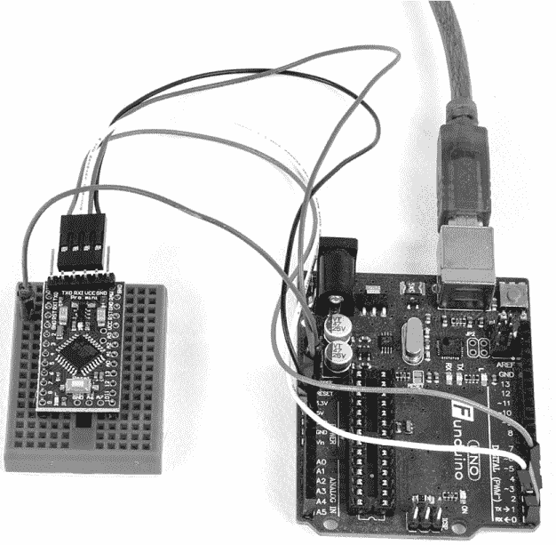

*图 0-11：准备编程的 Arduino Pro Mini 克隆版，Arduino Uno 克隆版作为编程器，Arduino Uno 的 USB 连接提供电源*。

在将 UNO 的 USB 电缆插入计算机之前，确保*所有*连接正确对接。当你编程 Pro Mini 时，从工具菜单的板卡部分选择正确的板卡；即使你将 Arduino Uno 插入计算机，你依然是在编程 Pro Mini。一旦这个设置完成，你可以像上传到 Nano 一样上传程序到 Pro Mini。

虽然使用 Arduino Uno 中介是编程 Pro Mini 的最简单方式，但你也可以购买 USB 转 TTL 设备，如 图 0-12 所示。我在 eBay 上购买了几台，价格在 5 到 12 美元之间，经过一些小调整（端子有时标记不同），它们都能正常工作。

编程 Arduino 只是其中的一部分。要构建一个真正持久的项目，你需要将工作中的 Arduino 电路焊接到电路板上。一个定制的*印刷电路板 (PCB)*，有时也叫做*印刷接线板*，是保持你的项目干净整洁的最佳方式——如果你愿意投入额外的工作制作一个的话。

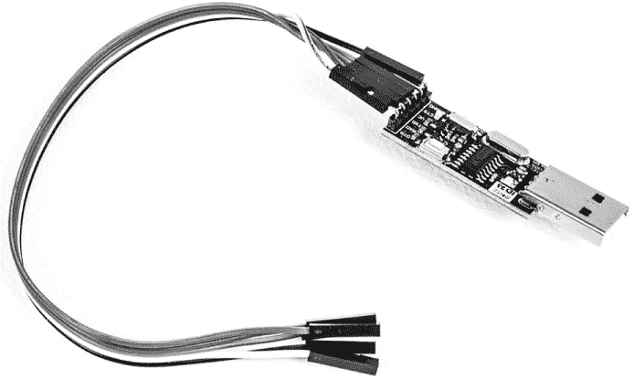

*图 0-12：一种用于编程 Pro Mini 和其他没有自己 USB 接口的控制器电路板的 USB 适配器。这个适配器使用男性 USB (A 型) 插头，并且有一个数据终端准备 (DTR) 引脚，而不是复位引脚 (RST)。大多数 USB 转 TTL 设备可以使用 3.3V 或 5V 供电，但在供电之前要检查一下，因为有些设备只能在 3.3V 下工作*。

### 使用 PCB 软件

市面上有许多 PCB 设计程序，它们的复杂度和价格各不相同。许多软件是免费的，目的是吸引客户使用公司提供的设施来制作电路板。因此，在尝试使用这些免费的工具制作 DIY 电路板时，可能会遇到一些问题——例如，软件在免费版本中可能会锁定某些功能。我使用 ExpressPCB (*[`www.expresspcb.com/`](https://www.expresspcb.com/)*) 来设计单面和双面电路板。

**注意**

*对于双面 DIY 电路板，我需要手动翻转图像。制作双面电路板的诀窍是正确对齐两面。为了简化许多项目的对齐过程，你可以在传输图像之前，在空白的铜板上做对齐标记并钻对齐孔。偶尔，我也会使用一个叫 TurboCAD 的绘图程序（类似于 AutoCAD）来制作双面电路板*。

ExpressPCB 提供了我找到的最便宜的电路板制作解决方案。该公司提供了一种 MiniBoard 服务，提供一种标准尺寸的无附加功能的电路板，价格相对较低。此外，随着行业推出更新的软件包，使用包含新 IC 封装的软件包变得至关重要。我使用 ExpressPCB 制作适配器板——从 SOIC 到 DIP，并将 SOIC 集成到成品电路板中，因为该软件非常适用于较小的几何图形。即使我想制作一个“专用”微控制器电路板，可能需要多个层、地平面和 VCC 平面，ExpressPCB 也很可能满足这些需求。

要使用该程序，只需访问 ExpressPCB 网站，下载免费的软件并安装。ExpressPCB 网站上有几个关于如何使用该软件的教程，我建议你利用这些教程。还有一款免费的配套软件 ExpressSCH，它是一个用于编写电路原理图的原理图捕捉程序。虽然它的功能整合度不如理想，但将这两款程序一起使用，有助于电路设计。

**注意**

*本书中的所有 PCB 设计均使用 ExpressPCB 设计软件制作，所有设计文件可以在* [`www.nostarch.com/arduinoplayground/`](https://www.nostarch.com/arduinoplayground/) *下载。要查看或更改 PCB 图纸，你需要下载该软件。*

使用 ExpressPCB 的另一个优点是，你可以将自己为制作电路板所开发的同一文件发送到公司的工厂进行加工。我在书中的一些项目中就这么做了——大多数情况下，在自己制作并希望清理板子后，我发现结果非常令人满意。工厂加工的板提供了电镀孔——如果你制作双面板，就需要在板的两面进行焊接。它们还提供了焊接镀层，并可以制作抗焊接涂层和丝网印刷图像。图 0-13 展示了我用 ExpressPCB 制作的板。

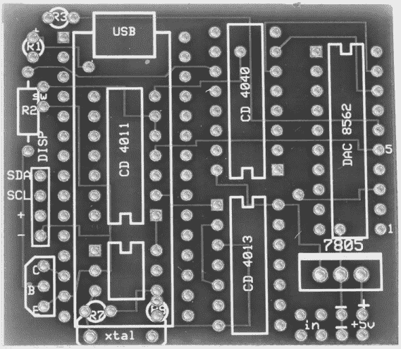

*图 0-13：一块专业完成的 PCB，具有抗焊接涂层和丝网印刷。我用这块板制作了第八章中的弹道测速仪。*

**制造多块不同板的技巧**

你可以使用 ExpressPCB 的 MiniBoard 服务以非常低的成本制作多块板。为了符合 MiniBoard 的要求并获得折扣，板的强制性尺寸是 3.8×2.5 英寸，启动程序时，黄色引导框会自动显示该尺寸的区域。在准备像图 0-14 中这样的 PCB 时，我将几个较小的板复制并粘贴到 MiniBoard 价格的最大尺寸范围内，从而将它们合并成一块大“板”。

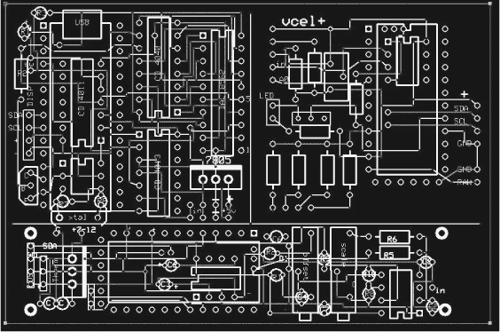

*图 0-14：为一个 MiniBoard 订单制作的三块不同的板。用于弹道测速仪的是左上角的板，pH 计的是底部的板。右上角是用于光学转速计的板，但未包含在书中。一个价格，你可以获得每块板的三份副本。你所需要做的就是将它们剪开。*

### 制作你自己的 PCB

在设计好 PCB 之后，有多种制作 PCB 的技术。正如我将在第二章中讨论的，最常见的方法是减法方法，通过选择性去除覆铜板上的铜层来留下电路图案。铜可以通过机械铣削去除，但如果你想在家制作 PCB，最常见且最便宜的方法是用化学蚀刻图案。

在进行化学蚀刻时，电路图案通过*光敏胶*印刷在空白板上，光敏胶是一种化学物质，可以防止铜在受处理区域被*蚀刻剂*去除。蚀刻剂是一种酸，会攻击覆铜板上未处理的铜。图 0-15 展示了铜板转变为 PCB 的过程。

*图 0-15：从左到右：未经处理的擦洗过的铜箔板；上面印有光敏胶的板；以及没有钻孔的蚀刻后的板*

在过去，制作 PCB 是一项繁琐且混乱的工作——尤其是对于业余爱好者。首先，你需要布置 PCB 图案，直到不久前，这通常是通过在光照台上用胶带在乙酸纸上完成的。然后，你需要清洁铜箔板，并旋转涂布光敏胶。这需要暴露于紫外线下，并用四氯化碳（CCl[4]）或三氯乙烯（C[2]HCl[3]）显影，而这些对你都不好。之后，你将开始使用氯化铁（FeCl[3]）或过硫酸铵（（NH[4]）[2]S[2]O[8]）进行混乱的蚀刻过程。经过所有这些步骤，你通常需要花费大部分时间来制作一块电路板。

今天，所有这些都发生了变化。借助当今的现代 PCB 软件，你通常可以在不到一小时的时间内，设计出一个相对简单的单面或甚至双面板图案，具体取决于其复杂性。从那时起，过程变得更加简便。

#### *应用图案*

如果你想学习蚀刻自己的 PCB，可以访问 PulsarProFX 网站（*[`www.pcbfx.com/`](http://www.pcbfx.com/)*），该网站提供了将图像轻松转印到铜箔板上的工具。Pulsar 的 PCB Fab-in-a-Box 产品是一个完整的工具包，包含了制作几个电路板所需的一切。一个关键成分是特殊的纸张，你可以用激光打印机打印图像，并利用热量将图像转移到铜箔板上。整个制作过程——钻孔之前——几乎从不超过一个小时，除非你缺少蚀刻剂，这会延长蚀刻时间。

除了 Pulsar 工具包中的物品外，所需的唯一工具是：

• 一台激光打印机

• 一台塑料覆膜机（Pulsar 建议使用 GBC 覆膜机，但我多年来一直使用 Office Depot 品牌的机器，它也能很好地工作。）

• 一个水浴

将 PCB 图案应用到铜箔板上的程序相对简单：

1.  使用 PCB 布局程序（例如 ExpressPCB）在计算机上设计图案。

1.  使用激光打印机，而不是喷墨打印机，将图像打印到 Pulsar 提供的特殊纸张上。激光墨水是一种聚合物化合物，当加热时会融化并部分与纸张结合，将图像留在纸上。当纸张重新加热到空白的印刷电路板上时，可以轻松地将图像转移到板上。

1.  使用廉价的办公室覆膜机，将图像直接从纸张转移到干净的覆铜板上。

纸上的热墨水变成了覆铜板上的抗蚀层。Pulsar 提供了一个额外的薄膜层，热熔与激光打印墨水结合，但单独的墨水也能抵抗蚀刻液。

#### *蚀刻电路板*

虽然铜不是一种高度活跃的金属，但有几种置换反应可以有效蚀刻铜。然而，许多由此产生的副产品有一定的毒性，几乎所有副产品都是必须以特殊方式处理或回收的材料，因为它们对环境极其有害。大多数铜盐对多种植物和动物，包括人类，都是强烈的毒药。

对于更好的蚀刻方法，我推荐一个名为“停止使用氯化铁蚀刻液（更好的解决方案）”的 Instructables 页面，你可以在 *[`www.instructables.com/id/Stop-using-Ferric-Chloride-etchant!--A-better-etc/`](https://www.instructables.com/id/Stop-using-Ferric-Chloride-etchant!--A-better-etc/)* 找到它。在混合蚀刻液之前，请仔细阅读此教程中的环境和个人安全警告。

本教程中描述的系统使用标准的家用化学品：过氧化氢（H[2]O[2]）和盐酸（本质上是氯化氢，HCl）。与旧的氯化铁或过硫酸铵技术相比，这个过程更加环保。你还可以在不丢弃旧溶液的情况下再生所描述的溶液，因为它实际上使用铜——即铜氯化物在水合盐酸溶液中——来溶解铜。

除了蚀刻液，你还需要一个容器来蚀刻电路板。对于非常小型和中型电路板，可以使用圆柱形容器，例如图 0-16 中的烧杯。

将蚀刻液放入安全的容器中，接下来就是将 PCB 放入蚀刻液中，并在不需要的铜层被去除后取出 PCB。在图 0-16 中的情形下，电路板被浸入和取出蚀刻液。请注意，烧杯放置在加热板上。加热溶液可以加速蚀刻过程，但请确保温度保持在 100 到 120°F 之间。

对于较大的电路板，可以使用某种锅具。如果你倾斜锅具，蚀刻液会流过电路板，正如图 0-17 中所示。

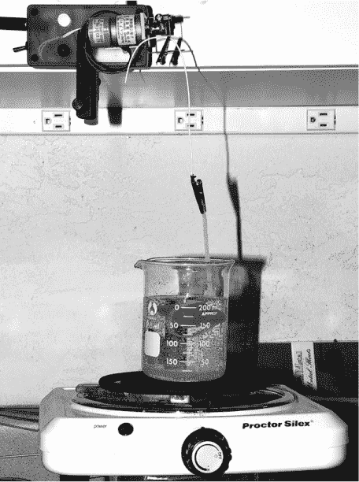

*图 0-16：在烧杯中通过 PCB 蚀刻自动搅拌器搅动蚀刻液进行小板蚀刻，来自第二章。电路板使用塑料线扎固定。*

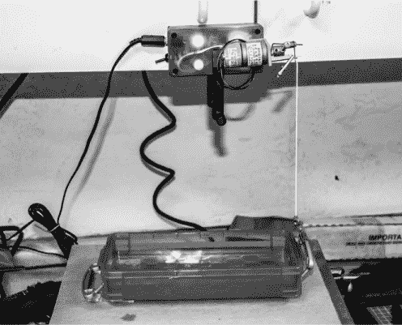

*图 0-17：在由 PCB 蚀刻自动搅拌器倾斜的容器中蚀刻更大的电路板*

平盘可以是玻璃或塑料材质。过去，我曾使用玻璃烤盘，但图 0-17 中的容器是塑料的。如果你使用塑料容器，使用时要小心热量。推荐区域内的温度应是安全的。

在这两种蚀刻情况下，使用基于 Arduino 的搅拌器（见第二章以构建该项目）可以加快蚀刻速度。搅拌器提供了一种简单的机械方式来搅动蚀刻液，加速蚀刻过程。

#### *钻孔电路板*

蚀刻只会去除铜，因此，除非你制作的是单面板且全部是表面贴装元件，否则你必须手动为组件钻孔。根据设备和孔数的不同，钻孔 PCB 可能是件繁琐的事。

在我刚开始制作电路板时，我使用 Dremel 工具手工钻孔，钻头是 #66 类型。对于小型项目，手动钻孔可以，但对于更大的项目，使用钻床会更加方便。

如果你已经拥有一台 Dremel 工具，那你真是幸运了。根据购买地点的不同，花不到 40 美元，一款 Dremel 钻床附件可以很好地用于电路板以及其他数百种任务。如果你还没有 Dremel 工具，你可以在网上选购一款大约 30 美元或更便宜的。市场上也有许多其他价格相对低廉的高速钻头和钻床组合。你可以在 Harbor Freight 和其他进口商品供应商处找到这些产品。

如果你计划生产多个 PCB，我建议使用专用的钻床，而不是钻床附件。有一些低压电源的便宜型号，也有一些高价型号，例如图 0-18 中的 Electro-Mechano，这款设备专门设计用于在珠宝和 PCB 上打小孔。只需选择一款适合你需求的设备即可。你还需要小号钻头来打孔。我推荐一套 10 支的钨钢钻头，具有 1/8 英寸的柄部，可以在 Electronic Goldmine（零件编号 #G15421）购买到。亚马逊也有类似的套装，我曾以非常实惠的价格购买了几套。

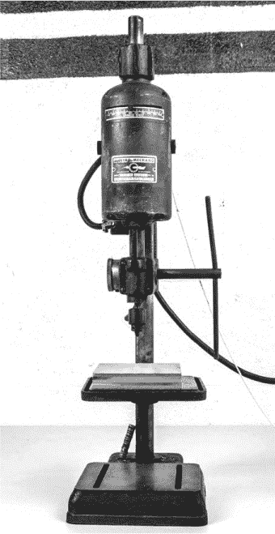

*图 0-18：我用于钻孔 PCB 的小型 Electro-Mechano 钻床*

### 本书中使用的连接器

在本书中，我尽量简化连接器的使用，并减少使用的连接器种类。但是无论你是否制作自己的 PCB，你总是需要某种方式将 LCD、I²C 适配器、传感器等模块连接起来；有时你可能需要自己组装连接器。

我经常使用的连接器是一种 0.100 英寸间距的连接器系列，这种标准适用于 PCB 上的男性和女性插座，也适用于某些电缆组件的独立连接器。尽管本书中使用的组件来自 Pololu Robotics and Electronics（* [`www.pololu.com/`](https://www.pololu.com/) *），但许多其他供应商，如 Jameco、Newark、Mouser、Digi-Key 等，也提供相同或类似的组件。

图 0-19 展示了我使用过的一些基本连接器配置。

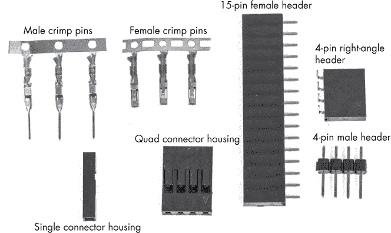

*图 0-19：一些基本的连接器*

男性和女性压接连接器是我制作的大多数电缆中的主力。不过，这些连接器必须压接到它们所连接的电线中。要压接一个针脚，你可以使用专业的压接工具（参见图 0-20），这样压接出的效果很好（参见图 0-21）。

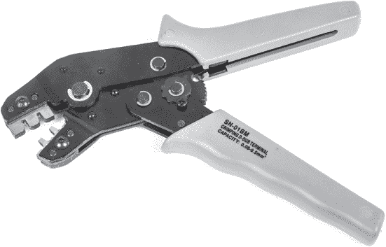

*图 0-20：用于将 0.100 英寸压接连接器压接到 26、28 和 30 号线的压接工具*

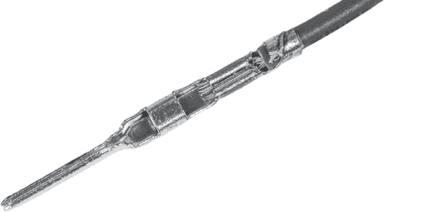

*图 0-21：使用压接工具正确压接的男性压接连接器*

Pololu 销售的压接工具相对容易使用，能够压接出坚固的连接，但价格有点高，大约 30 美元。如果你不想购买压接工具，也可以使用一把小钳子进行压接。虽然这样得到的连接可能不如专业工具压接得漂亮，但应该同样有效。图 0-22 展示了我用钳子压接的电缆。

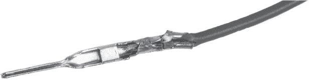

*图 0-22：一个与图 0-21 中相同的男性连接器，使用一把钳子手动压接。两个连接器都牢固地安装在连接器外壳中，效果良好*。

你可以使用带有女性压接针脚的线缆来插入男性插座。这些对于通过电缆连接 PCB 的各个部分，以及将 Arduino 板连接到扩展板非常有用。

插座和外壳的尺寸从单引脚到 10 引脚、15 引脚甚至更大都有。本书中大多数涉及手工制作连接器的项目使用的是 2 引脚和 4 引脚的连接器。

### 使用 SOIC

制作通孔插座的连接器没问题，但带有 0.100 英寸间距引脚的通孔集成电路越来越难以获得。虽然制造商继续生产许多老格式的 IC，但新设计往往只有表面贴装元件。这些新封装被称为 *小外形集成电路（SOIC）*。图 0-23 展示了两个 SOIC 元件与一个 8 引脚的 DIP IC 一起进行尺寸比较。

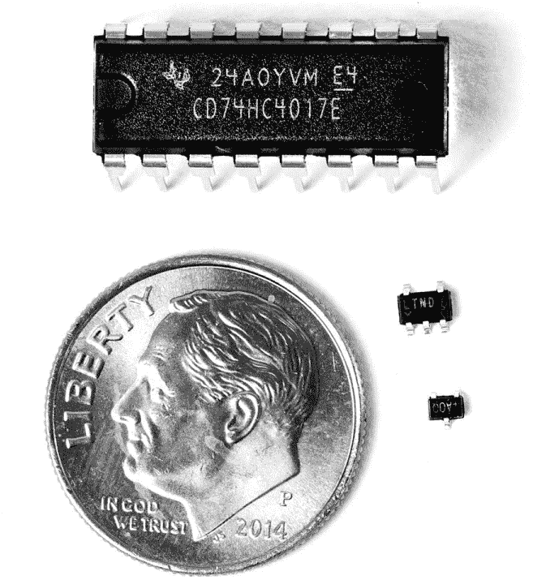

*图 0-23：标准的 DIP 封装（上）与两个小型 SMD 集成电路的比较，一个是 5 引脚的 Linear Technology LTC1799，采用 TSOT-23 封装（中），另一个是 3 引脚的 Maxim MAX7375AUR，采用 SOT-23 封装（下），旁边有一枚一角硬币作比例*

#### *什么是 SMT 设备？*

图 0-23 中显示的两个非 DIP IC 是*表面贴装技术（SMT）*设备。SMT 设备直接焊接到 PCB 的表面，而不是通过底部的孔将引脚突出。SMT 的优点在于，可以将设备做得更小，并且它们可以彼此靠得很近，从而实现更紧凑的设计。许多 SMT 元件的引脚间距为 0.95 毫米（0.0374 英寸）或更小，这与之前讨论的 0.100 英寸间距的元件不相符。

使用 SMT 组件还可以减少布线长度，这在高频情况下至关重要。许多电路板有多个层（本书中的项目最多有两层），层之间的连接以前是通过 IC 引脚的孔来完成的。这些连接现在更常通过*通孔*来实现，通孔是板中的小型镀铜孔。自动化贴装设备现在也开始专注于 SMT 元件。未来，电阻器、电容器、电感器、LED、保险丝等很可能仅以表面贴装配置提供，但这可能需要一段时间。

本书中提到的 SMT 封装是*有引脚的*——也就是说，封装本身有引脚突出，尽管这些引脚并不是为了通过 PCB 上的孔来连接。带引脚的 IC 有多种配置，封装引脚间距不同，从相对稀疏的引脚——比如图 0-23 中的两个 SMT 元件——到引脚数量高达几百的 IC。

**注意**

*本书避免使用某些 SMT 封装类型，例如具有直接连接补丁的超小型封装，其中芯片直接连接到 PCB（称为芯片封装在板上，Chip-on-Board），以及球栅阵列封装，其中连接是封装底部的受控坍塌焊料凸点。*

#### *焊锡膏法*

使用含铅的 SMT 芯片会留下几个选择。一个选择是设计一个具有正确焊盘的 PCB，以适配 SOIC 封装，并将 IC 直接焊接到 PCB 上。焊接 SOIC 组件涉及涂抹焊锡膏并加热电路板本身。虽然这是可行的方法（网络上有很多相关教程），但填充电路板可能会比较困难，尤其是当电路板同时包含穿孔和 SMT 元件时。除非你有用于涂抹焊锡膏的模板，否则焊锡膏需要手动涂抹，通常使用注射器，有时用尖锐的牙签或牙科钳。图 0-24 展示了我在此过程中使用的一套工具。

几家在线供应商提供价格合理的注射器焊锡膏。大多数焊锡膏的熔点在 300°F 到 470°F 之间（有些较低），因此可以在烤面包炉或热板上的容器中焊接电路板。

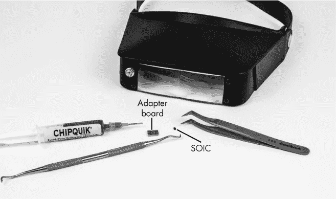

*图 0-24：Chip Quik 焊料、头戴式放大镜、牙科钩、镊子、适配器板和 SOIC（镊子旁的斑点），准备安装*

我使用的焊膏是 Chip Quik。它相对便宜，带有一个针管和喷嘴，熔点只有 138°C 或 281°F。尽管喷嘴可能稍微小一些，但它在大多数应用中都能正常工作。Chip Quik 的低熔点使得在烤面包机或加热板上焊接电路板变得非常容易，但在其他情况下可能会成为一个问题：在高电流应用中，焊接点可能会加热到足以熔化焊料的温度。但在本书中的电压、电流和信号水平下，我不认为这是一个问题。

在焊膏涂抹后，可以用一把镊子和稳稳的手将组件小心地放置到焊膏上。我还使用头戴式放大镜，以便能看到连接。当芯片放置到位后，剩下的就是将组件加热到焊料的熔点，哗啦——任务完成。

如果你选择在普通的烤面包机中加热电路板，而不是购买专门的 SMT 烤箱，那么请确保不要使用你用来做饭的烤面包机。许多焊料仍然含有铅，已被认为对健康有害。助焊剂材料（在焊膏中，用于使焊料更容易流动）和粘合剂也含有某些挥发性化合物，如果误食，可能对健康不利。

你还可以将较小的电路板放进一个小而干净的金属罐中。然后将罐子放到加热板上，并在罐子上放一小块钢板（铝也可以）以保持热量。当焊膏熔化后，去掉热源。整个过程通常只需要几分钟。

对于像我这样手指粗的人来说，0.95 毫米还是挺小的，无论是涂抹焊膏、放置组件，还是直接焊接带引脚的 SMT 组件。这个过程有时需要我尝试几次。如果你还不准备在主 PCB 上直接使用焊膏解决方案，可以考虑购买适配器板，将 SMT 组件转换为常规的 0.100 英寸中心孔安装。

一些供应商提供小型适配器板，可以将 SOIC 封装转换为中心间距为 0.100 英寸的 DIP 封装。图 0-25 中的适配器板来自 Futurlec (*[`www.futurlec.com/`](http://www.futurlec.com/)*)。Futurlec 的适配器板每个只售 $0.28，所以我订购了各种不同的，包括适用于 8 引脚、14 引脚、16 引脚和 18 引脚 SOIC 的板子。

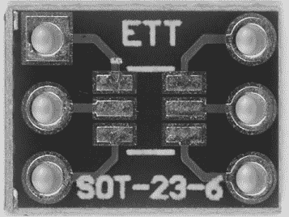

*图 0-25：Futurlec 6PINSO23 适配器板*

即使使用适配器，最佳的焊接方案是使用焊膏和烤箱（或者如我刚刚描述的那样使用罐子）。但如果你没有这种技术所需的材料，你也可以直接焊接 SOIC 组件。

#### *直接焊接*

直接焊接 SOIC 组件有点棘手。这样做需要一个细尖的焊接铁，尽管我使用的是我平常用的那种焊接铁（我认为我的尖端是 0.7 毫米）。以下是这种方法的工作原理：

1.  首先，将公头排针放置在面包板上，并将适配器放在顶部，然后焊接它们，形成一个稳定的平台（参见图 0-26）。

    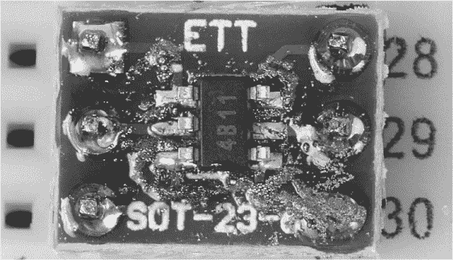

    *图 0-26：带有插针并插入面包板以焊接集成电路的适配器板。图中的颗粒是焊锡和助焊剂的残留物，稍后我使用酒精和棉签清理干净。*

1.  尽管适配器的铜板上有焊锡，但它的厚度不足以固定集成电路的引脚。需要更多焊锡，因此小心地在一个焊盘上融化一薄层焊锡。（通常，我会放入过多的焊锡，之后用吸锡带去除，但这也没问题，因为它仍然在焊盘上留下了一层薄薄的焊锡涂层。）

1.  将元件放置在适配器板上，牢牢固定（我使用牙科探针施加压力），然后将热铁放在有焊锡的引脚上。

1.  一旦第一个引脚固定好，它就能固定元件的位置，然后你可以小心地用热铁焊接其他引脚。

图 0-27 显示了我用这种方法焊接的电路板。它可能看起来不太漂亮，但它能正常工作。

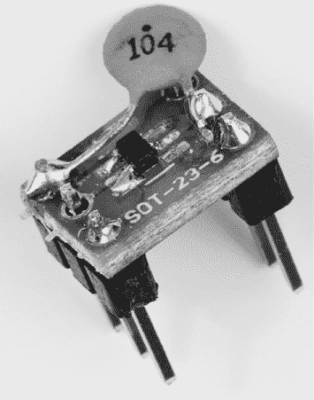

*图 0-27：一个完成的适配器板，已安装公头排针、集成电路已焊接，且解耦电容焊接在两个引脚之间。这是图 0-26 的清理版。*

如图 0-27 所示的完成适配器板可以安装在常规的通孔板上，孔间距为 0.100 英寸。我在本书的弹道计时器（第八章）和方波发生器（第九章）项目中使用了这一技术。

### 总结思考

凭借本章的知识和一些前期的电子经验，你已准备好应对本书中的任何项目。我将在后续根据需要介绍其他重要技术和信息。
