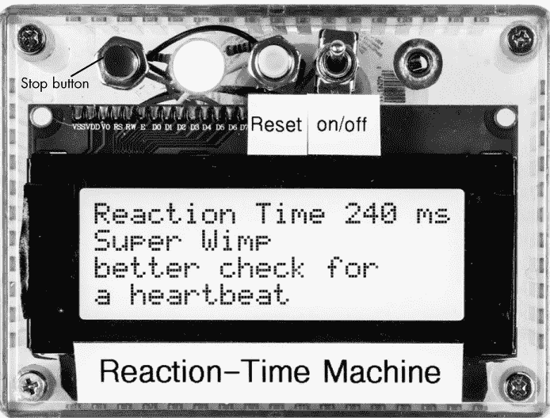
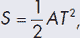
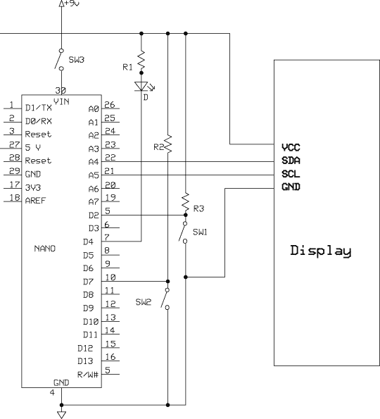
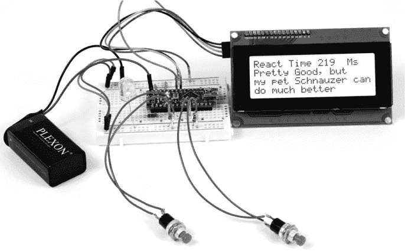
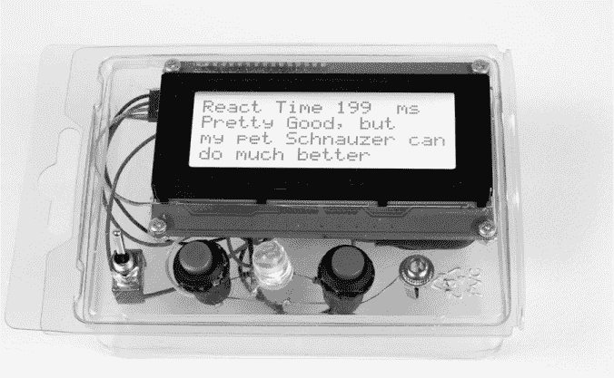
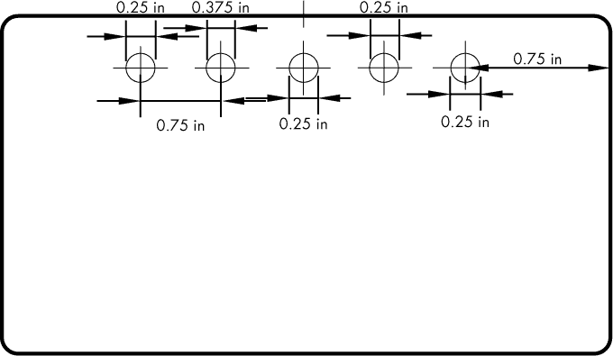
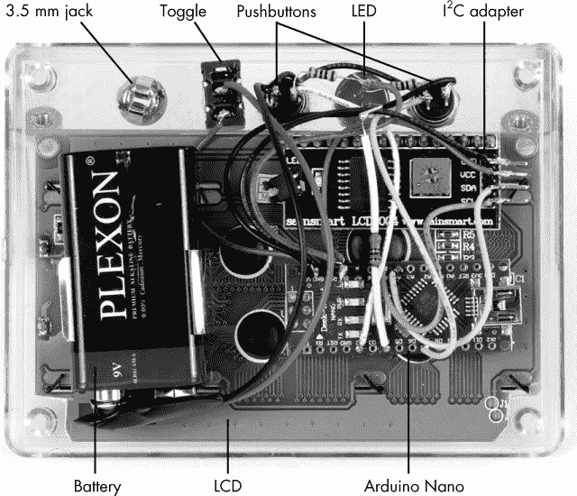
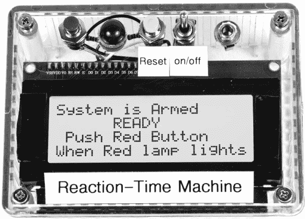

## 第二章：**反应时间机器**


在本章中，我将向你展示如何制作一个时光机——也就是反应时间机器。我很想说这个项目将带你“回到未来”，但遗憾的是，它做不到。它所看的“时间”是你对刺激的反应时间，这也让它成为一个有趣的游戏。这个项目旨在精确测量个人的反应时间，并为个人的表现提供反馈区域（见图 1-1）。你还可以个性化游戏，使它对你、你的朋友和家人来说更加有趣。



*图 1-1：完成的反应时间机器*

### 所需工具

焊接铁和焊料

电钻和钻头

安装胶带

剪线钳

### 零件清单

这个项目的零件数量是本书中最少的，但不要因此小看它的价值。我的家人和朋友们反复享受这个游戏，而且它很便携，所以你可以带着它去聚会和其他活动。

你需要以下材料：

一个 Arduino Nano 或克隆板

两个单刀单掷（SPST）瞬时开关（最好一个带红色按钮，另一个带不同颜色的按钮）

一个单刀单掷（SPST）切换开关

一个红色 LED

两个 10 千欧电阻

一个 470 欧姆电阻

（可选）一个可听见的指示器，Mallory Sonalert 或类似设备

一个 4×20 LCD

一个 I²C 适配器，如果 LCD 未包含（请参阅“将 I²C 板固定到 LCD”，见第 3 页）

**注意**

*我单独购买了一个 16×2 LCD 及其外部 I²C 板，并将两者焊接在一起。不过，许多在线商家提供已焊接好的相同显示器和 I²C 适配器，价格和单独购买两块板差不多，甚至更便宜。特别可以查看 eBay*。

一个 9V 电池

一个 9V 电池夹

一个 3.5 毫米插孔（如果使用远程开关）

一个 Hammond 1591 BTCL 外壳

28 号或 30 号连接线

22 号固态导线

### 下载

在开始这个项目之前，请检查本书的以下资源文件，网址是 *[`www.nostarch.com/arduinoplayground/`](https://www.nostarch.com/arduinoplayground/)*

**草图文件** *Reaction.ino*

**外壳的钻孔模板** *ReactionEnclosure.pdf*

### 反应与反射

人们常常将反应和反射混淆，所以我会从定义这两者开始。*反射*是对刺激的非自愿、自动反应。在反射动作中，刺激绕过大脑，直接从刺激源传递到脊髓，再返回控制反应的受体，而不经过任何认知反应。（尽管我知道很多人几乎所有的刺激和信息——似乎都会绕过大脑，经常只是迷失在途中。）想象一下医生用膝盖锤敲击你的膝盖，以触发膝跳反射。

*反应*则是将刺激信号传递到大脑进行处理，然后通过神经传导返回反应器，产生某种运动行为。这个过程比典型的反射反应稍慢，尽管一些运动员据说拥有极快的反应时间，他们的反应可能更接近反射而不是反应。

**注意**

《体育画报》*在这一领域做了有趣的研究，发表了关于棒球运动员和其他运动员的文章，这些运动员的反应时间似乎异常迅速*。

### 游戏是如何运作的？

反应时间机器游戏测量的是个人在看到视觉刺激（在本例中为 LED）后，按下按钮所需的时间。通过一个小的修改，你可以在游戏中加入听觉刺激：只需将 LED 替换为一个可听的提示音装置，如 Mallory Sonalert。反应时间以毫秒或秒为单位（由你选择），它是从刺激激活的那一刻到参与者按下按钮的那一刻之间的时间。

**反应时间设备的历史**

多年来，出现了许多测量反应时间的设备。我记得其中一个最简单的设备要求你将手指放在由另一个人悬空拿着的标尺两端。当标尺掉落时，你需要看它在你抓住它之前移动了多远。这个距离可以通过代数公式转化为时间。



其中*S*是移动的距离，*A*是重力加速度，*T*是反应时间。在完成这个项目后，你可以同时进行标尺测试和反应时间机器测试，看看两个设备之间的时间差距有多小。

#### *使用 Arduino Nano 测量时间*

尽管有许多方法可以测量经过的时间，但这个项目利用了 Arduino Nano 保持准确时间的能力。微控制器非常擅长保持时间，它们能够以最小的延迟测量一个输入与另一个输入之间的时间间隔。除了计时你的反应外，Nano 还会在 LCD 屏幕上显示结果。

Nano 几乎完成了这个项目的所有工作；其他组件基本上是被动的。在测试了一些初期版本后，我对草图进行了功能增强，使游戏更有趣且更精准。例如，我最初使用一个简单的按钮来重置 Nano 并启动计时器。参与者会在 LCD 显示时按下红色停止按钮，Nano 测量重置按钮和停止按钮按下之间的时间。然而，我发现玩家可以预见到重置按钮被按下，从而获得一些令人惊叹的反应时间。

为了防止玩家预期刺激何时出现，我让 Nano 延迟启动计时器。书中的版本生成一个从按下重置按钮开始的随机延迟，在随机延迟后激活刺激，并从刺激到玩家按下停止按钮的时刻开始计时。这样解决了一个问题。

然后，其中一位参与者试图提前行动，通过按住停止按钮来提前开始。我通过在草图中设置一个最小反应时间来解决这个问题。任何低于该最小值的反应时间都会触发错误，LCD 屏幕上会显示“Jumped the Gun”，表示玩家按得太快。

我使用了一个相对较大的显示器——4 行，每行 20 个字符——以便有足够的空间显示反应时间以及一些关于玩家相对能力的评论。你可以根据自己的喜好将评论写得幽默或严肃，但必须不超过 60 个字符——也就是说，每行最多 20 个字符，三行总共 60 个字符。虽然我将评论留给你来定制，但该项目的草图中包含了一些我在制作过程中使用的想法。你总可以编辑评论并重新加载草图，以显示适合一组用户（如朋友或亲戚）的评论。

#### *预期的速度范围*

根据我测试的小样本，大多数个体的反应时间似乎差异很大。有趣的是，年龄似乎并不是一个因素。平均反应时间大约为 200 毫秒，这也是许多研究人员所确定的平均反应时间。

我测试的样本中，反应最快的人为 105 毫秒；然而，这位个体无法重复这一表现。几位个体的成绩介于 105 毫秒和 125 毫秒之间，但并不稳定。显著更低的反应时间可能是异常的，或者是个体提前预期到刺激的结果。我玩家们未能重复极快反应时间，这一现象可能进一步支持这个观点。（我并不想指责任何人成功地预猜了释放时刻。）

### 原理图

虽然显示器本可以直接接线，但使用 I²C 互联让事情变得简单得多，且将接口减少为仅四根电线：正极、地线、数据线和时钟线（见图 1-2）。

需要的组件只有 Nano、三个开关（一个电源切换开关和两个短按按钮开关用于激活和重置）、一个 LED、显示器和三个电阻。尽管零件数量相对较少，但该项目运行得非常简洁优雅。



*图 1-2：反应时间机器的原理图*

### 面包板

就像我大多数 Arduino 项目一样，第一步是准备面包板来验证概念并测试草图。以下是如何接线面包板：

1.  将面包板上的红色正极轨道连接在一起。

1.  将面包板上的蓝色负极导轨连接在一起。

1.  将 Arduino Nano（或克隆板）插入面包板，保持一侧留两行，另一侧留三行。（如果 Nano 板没有焊接插针，请参见“准备 Arduino 板”第 2 页。）

1.  将 Nano 板的 5V 端子连接到面包板上的红色正极导轨。

1.  将 Nano 板的 GND 端子连接到面包板上的蓝色负极导轨。

1.  将电池连接器的负极电线连接到蓝色负极导轨。记住，面包板没有开关，所以你必须断开电池才能关闭它。

1.  将电池连接器的正极引线连接到 Nano 板的 VIN 端口。（不要将电池的正极端子连接到红色正极导轨，这可能会永久损坏 Nano 板。）

1.  将 5 英寸的电线连接到两个常开型瞬时按钮开关。（我使用 22 号实心导线，这样它可以直接插入面包板。）

1.  为 LCD 准备一条电缆束（请参见“将 I²C 板固定到 LCD 上”第 3 页）。

1.  将 LCD 的红色电线连接到面包板上的红色正极导轨（5V），黑色电线连接到蓝色负极导轨。

1.  将显示器的黄色电线（SDA）插入 Nano 板的 A4 引脚。

1.  将显示器的绿色电线（SCL）插入 Nano 板的 A5 引脚。

1.  将每个按钮开关的一侧连接到蓝色负极导轨。

1.  将红色反应开关（SW2）的另一侧连接到 Nano 板的 D7 引脚。

1.  将黄色重置开关（SW1）的另一侧连接到 Nano 板的 D2 引脚。

1.  从 Nano 板的 D7 引脚连接一个 10 千欧姆电阻到红色正极导轨。

1.  从 Nano 板的 D2 引脚连接一个 10 千欧姆电阻到红色正极导轨。

1.  将 LED 的阳极端（较长的引脚）连接到红色正极导轨，阴极端连接到面包板上的一个空行。

1.  从 LED 的阴极端连接一个 470 欧姆电阻到 Nano 板的 D4 引脚。

将*Reaction.ino*草图上传到 Arduino Nano（请参见“上传草图到你的 Arduino”第 5 页），此时你应该准备好开始使用。图 1-3 展示了面包板上的布局，开关通过电线悬挂。



*图 1-3：反应时间机器的面包板布局。由于没有开/关开关，你必须断开电池才能关闭它*。

### 草图

草图是实际的计算机程序，它告诉 Arduino 做什么以及何时做。它使用自己独特的语言编写，包含结构、变量、数组、函数等，这些构成了微控制器遵循的“食谱”。这个语言会被转换成一串零和一，传递到控制器的不同部分，执行存储、计时、比较、算术运算等功能。

将计算机语言转换为一系列零和一的过程被称为*编译*。当你点击草图窗口左上角的验证和编译按钮时，Arduino 集成开发环境（IDE）中的编译例程将被激活。

由于在检查分数时可以插入所有的消息，草图变得相当长；然而，基本操作只需要少量代码行。你可以按原样使用评分函数，修改它，或者复制粘贴来创建新的评分函数。正如你在我的消息选项中看到的，我已经玩得很开心了。

以下代码已被截断，以减少行数。然而，你可以简单地访问*[`www.nostarch.com/arduinoplayground/`](https://www.nostarch.com/arduinoplayground/)*下载完整的草图，其中包含多个消息。

```
/*
Includes score function, random number generation, false start
"jump the gun" indicator, and multiple messages spaced 10 ms apart

Mod for "jump the gun" gives response if time <70 ms
*/

#include <Wire.h> //Libraries included
#include <LiquidCrystal_I2C.h>

int start_time = 0;
int stop_time = 0;
int reacttime = 0;
int x;
int R;
int randnumber1;
int z;

LiquidCrystal_I2C lcd (0x3F, 20, 4); //Initiate LCD

void setup() {
    Serial.begin (9600);
    pinMode(2, INPUT);
    pinMode(4, OUTPUT);
    pinMode(7, INPUT);
    lcd.init();
    lcd.backlight();
}
//Begin function "score"
void score() {
    lcd.clear();
    lcd.print("Reaction Time ");
    lcd.print(reacttime);
    lcd.print(" ms");
    lcd.setCursor(0, 1);

    if((reacttime >= 105) && (reacttime < 135)) {
       lcd.print("Approaching Superman");
       lcd.setCursor(0, 2);
       lcd.print("but you can still do");
       lcd.setCursor(0, 3);
       lcd.print("a lot better");
    }

    if((reacttime >= 135) && (reacttime < 180)) {
       lcd.print("Superhero Status");
       lcd.setCursor(0, 2);
       lcd.print("but not yet");
       lcd.setCursor(0, 3);
       lcd.print("Superman");
    }

    if((reacttime >= 180) && (reacttime < 225)) {
       lcd.print("You are trying ??");
       lcd.setCursor(0, 2);
       lcd.print("but not hard enough");
       lcd.setCursor(0, 3);
       lcd.print("still a loser");
    }

    if(reacttime > 225) {
       lcd.print("Lost your touch");
       lcd.setCursor(0, 2);
       lcd.print("If you ever had it");
       lcd.setCursor(0, 3);
       lcd.print("on the border of wimpy");
    }
}

//Begin main program
void loop() {
    digitalWrite(4, HIGH); 
    lcd.clear();
    lcd.print("System is Armed");
    delay(1000);
    lcd.setCursor(0, 1);
    lcd.print("     READY     ");
    lcd.setCursor(0, 2);
    lcd.print(" Push Red Button");
    lcd.setCursor(0, 3);
    lcd.print("When Red lamp lights");

    randnumber1 = random(5, 25); //Generate random number between 5 and 25
    R = randnumber1;
    for(x = 0; x < R; x++);
    delay(5000);
    if(x == R) {
       digitalWrite(4, LOW); //Turn on start lamp
       start_time = millis(); //Initiate timer
       lcd.clear();
       lcd.print("Mash React Button");
       lcd.setCursor(0, 1);
       lcd.print("           ");
       lcd.setCursor(0, 2);
       lcd.print("          ");
       lcd.setCursor(0, 3);
       lcd.print("          ");

       while(digitalRead(7) == 1); //Wait for response

       stop_time = millis(); //Complete timing cycle
    }

    reacttime = stop_time - start_time;

    if(reacttime < 70) { //Jump the gun indicator
       lcd.clear();
       lcd.setCursor(0, 0);
       lcd.print("Too anxious. You");
       lcd.setCursor(0, 1);
       lcd.print("(Jumped the Gun)");
       lcd.setCursor(0, 3);
       lcd.print("Could be Fatal!");
    }
    score();

    Halt:
    while(digitalRead(2) == 1);
}
```

`#include`行初始化了库：I²C 库，*Wire.h*，建立了 I²C 通信的规则，液晶显示库允许 Arduino 控制 LCD。接下来，我们定义了七个用于计算反应时间的变量。然后，`setup()`设置了串行通信——以便你可以调整代码并在串行监视器上查看——并将不同的引脚定义为输入和输出。输入引脚用于复位和停止按钮，输出引脚用于定义 LED，提示玩家何时按下停止按钮。

#### *自定义反应评论*

这个项目最有趣的方面之一是有机会在展示玩家反应时间时发挥创意。在`setup()`之后，草图展示了一个名为`score()`的函数，根据参与者的反应速度列出可以显示在 LCD 上的不同评论。函数未必是最有效的方式（也可以使用查找表或其他方法），但它足够有效。我在这个版本中只使用了一个评分函数；然而，你可以轻松地定义任意多个，并修改草图来选择其中一个。例如，你可能会编写第二个名为`score1()`的函数，包含不同的评论和时机。然后，为了在两个函数之间切换，你只需更改调用`score()`的那一行，改为调用`score1()`。

要自定义草图以包含可以引用你自己朋友或家人的评论，你只需将我的草图中的评论替换为你自己的评论。不要忘记将你想要打印到 LCD 上的文本放在引号内，以便 Arduino 能够识别可打印的字符。

关于反应时间本身的说明：每个评论适用于 5 或 10 毫秒的反应时间范围。我选择这些范围是随意的。在你玩了反应时间机器一会儿之后，你可能希望根据用户的反应集中在某个特定区域（比如从 195 到 225 毫秒）来调整这些范围。我发现许多反应时间在 190 到 250 毫秒之间，但你的朋友和家人的情况可能会有所不同。在这种情况下，你可以将评论之间的间隔设置为 1 或 2 毫秒，以避免玩家一直得到相同的评论。

你可以根据需要添加任意多的评论，最多每毫秒一个评论。如果你不小心重叠了时间，程序可能无法编译。

**注意**

*如果你想了解你的游戏测量结果如何与网络上的反应时间测量工具进行比较，可以在网上找到这些工具。不过，由于 PC 本身的延迟，这些工具的准确性可能存在问题*。

**关于编写代码以设置 LCD 的说明**

关于 LCD 设置有几点需要注意。这个示例使用了 LiquidCrystal 库，*LiquidCrystal_I2C.h*。如果你的 Arduino IDE 没有包含这个库，你可以按照 Arduino 网站上的参考部分的说明轻松下载该库（* [`www.arduino.cc/reference/`](http://www.arduino.cc/reference/) *）。

此外，每个 I²C 设备都有自己的 I²C 地址。这允许多个 I²C 设备通过一条串行线连接。通常设备文档会提供地址——在我使用的 I²C LCD 的例子中，地址是 0x3F。因此，当程序初始化 LCD 时，代码看起来是这样的：

```
LiquidCrystal_I2C lcd (0x3F, 20, 4);
```

然而，不同的显示器具有不同的地址。如果你有一个 I²C 设备但不知道其地址，你可以通过将设备连接到 Arduino，下载一个扫描程序并运行它，轻松找到该地址。扫描程序应该会在串行监视器上显示 I²C 地址。

本书中的许多项目都使用类似的代码来操作 LCD，因此每当你需要复习这段代码如何工作的时，可以参考这个框。

#### *循环中发生的事情*

现在让我们来看一下程序的循环部分。在`void loop()`启动程序后，程序调用`digitalWrite(4, HIGH)`来关闭活动指示灯。然后，LCD 屏幕被清除，并写入文本，表示系统已启动并准备好让玩家在红色 LED 点亮时按下反应按钮。

接下来，生成一个 5 到 25 之间的随机数，程序调用`delay(5000)`来从零开始每五秒钟计数，直到达到随机数。一旦达到了随机数，三件事会发生：首先，指示灯亮起；其次，Nano 中的内部计时器开始计时；第三，显示器将改变为“按下反应按钮”。

**注意**

*更广泛的随机数范围可能会使这个游戏对玩家来说更加有趣。你可以通过改变随机数的数量、延迟或两者的组合来轻松进行实验*。

然后，Nano 通过`while(digitalRead(7) == 1);`等待直到反应按钮被按下。按钮按下后，Nano 计算反应时间，公式为`reacttime = stop_time - start_time`。这个时间会显示在 LCD 上，并用于选择`score()`函数中的适当评论。此外，如果玩家的反应时间小于 70 毫秒，条件语句会显示“抢先反应”的相应文字在 LCD 上。系统随后会停止，准备好进行重置。

否则，串口打印模块已经包含在内，以便你在调整代码并在串口监视器上查看时使用。它也有助于调试。

最后，调用`score()`函数，然后执行`Halt`命令，系统就准备好重置按钮被按下。

### 构建

构建反应时间机器可以根据需要简单或复杂。最初，我将所有组件放入了一个柔性手腕支架的塑料包装中。我用 X-ACTO 刀割了一个孔给显示器连接器，并用打孔器和锥形扩孔器打了开关和 LED 的孔。结果有些粗糙，如图 1-4 所示。



*图 1-4：这是反应时间机器的最初原始包装，虽然能用，但太脆弱。塑料薄膜厚度仅为 0.018 英寸*。

#### *准备一个坚固的外壳*

当然，真实的外壳会让游戏更加坚固，这在竞争激烈的玩家不断按按钮时尤为重要。为了保持尽可能简单，我使用了 Hammond（1591 BTCL）的一款透明 ABS 塑料外壳。外壳的透明顶部让我可以将显示器放在盖子后面，而不是为了让显示器突出而开孔。为了安装组件，我按照图 1-5 中的图纸在盖子上钻了孔。



*图 1-5：反应时间机器的钻孔模板*

四分之一英寸的孔适合瞬时按键开关、切换开关和 3.5 毫米插孔。对于 10 毫米的 LED，我使用了 3/8 英寸的钻头，然后扩孔使其紧密配合。LED 不需要其他安装硬件。

**注意**

*3.5 毫米插孔与执行开关并联。如果你想使用外部独立开关，可以直接插入插孔。然而，我放弃了这个尝试，因为大多数参与者更喜欢手持盒子*。

#### *硬件安装*

为了将显示器安装到外壳上，我使用了 3M 双面室内/室外超重型安装胶带。我裁剪了两段与 LCD 显示器端框相同大小的胶带，并将显示器直接粘贴到盖子上。该胶带难以移除，因此务必第一次就放置准确。我还使用相同的胶带将 Nano 和电池座安装到显示器背面。在安装显示器时，我还使用了剪线钳小心地剪去显示电路板的角落，以便它能足够深入外壳而不碰到盖子的安装支柱。请参见图 1-6，这是从底部看到的完成品。

一旦所有组件到位，剩下的就是将它们焊接在一起，并在需要的地方插入电阻。特别需要注意的是 I²C 适配器，它是位于开关和 LED 下方的黑色小板。虽然我本可以弯曲连接器并使用排针连接，但根据我如何压接连接器，外壳可能无法关闭。因此，我选择将电线直接焊接。只有四根电线，而且焊接时没有太多困难。最后，我打印出来并附上了来自 Brother 标签机的标签。图 1-7 展示了完成的装置。



*图 1-6：这是安装在 ABS 塑料外壳中的装置背面。注意显示器的角落（左下和右下）已经被剪掉，以适应顶部安装支柱。3.5 mm 插孔未接线，因为我决定在此实现中不使用它*。



*图 1-7：安装在 Hammond 1591 BTCL 透明塑料外壳中的完整反应时间机器*

### 定制化的想法

你可以实现许多变化来增加反应时间机器的多功能性和娱乐性。例如，在我开发时，我将霍尔效应开关连接到其中一个模拟输入，并修改了程序，在激活霍尔效应开关时，自动减少一定百分比的反应时间。然后，我在手指上粘贴了一个小磁铁，磁铁与霍尔效应开关正对着，这样我握住盒子时，它就会激活开关。在我玩的时候，我的反应时间减少了大约 20%，而其他人则有一个实际的读数。当然，我并不建议读者去欺骗对手！

还有其他可以进行的修改，例如在草图计数到随机数时添加音调或哔声。通过添加一个提示音和几行代码，便可以轻松实现。如果你足够聪明，还可以添加其他音效，例如在得分较低时播放的粗俗声音。

你还可以锻炼大脑，并为草图添加代码，例如，在你重置之前，将三次尝试后的分数进行平均。我在玩这个设备时尝试了许多变种，但我想提醒你，可能会花费大量时间来获得微小的优势。把游戏组装起来，享受其中的乐趣。
