## 第三章：**PCB 蚀刻的自动搅拌器**


本项目使用 Arduino 微控制器来感应马达电流消耗的变化（即马达使用电力的速率），然后反转马达的方向。电流消耗的测量和应用有许多用途，本项目提供了一种示例方法，未来在电子项目开发中可能会非常有用。

“自己制作 PCB”在第 13 页展示了如何使用现成且环保的家庭产品，以非常低的成本在家设计和制作电路板。这个过程的一部分包括将铜层蚀刻掉。将电路板浸入蚀刻液中并搅动时，过程会更有效，液体在电路板表面会形成层流，双向流动。根据蚀刻液的化学活性和铜的厚度，这一过程可能需要 10 到 15 分钟，甚至超过半小时！站在那里搅拌蚀刻液的确很无聊，但你可以制作一个装置，自动将电路板浸入并取出溶液（参见图 2-1）。

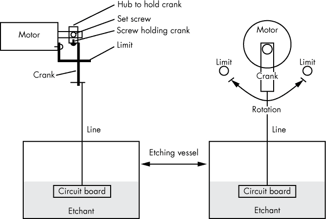

*图 2-1：展示了用于将电路板浸入并取出蚀刻液的马达、曲轴和蚀刻槽的设置。虽然有许多方法可以搅动电路板，但将其浸入并取出蚀刻溶液效果很好，尤其适用于小型电路板*。

在本项目中，Arduino 用来测量马达的电流。当马达的旋转到达极限位置时，开始停滞，电流消耗增加。Arduino 通过反应电流的增加来反转马达。

**自动马达反转项目的灵感来源**

本项目的灵感来源于我的朋友遇到的一个模型火车配件问题。该配件包括一个索道，用来将假想的滑雪者上下小山。原始的机制失败了，于是我制作了一个小电路来驱动直流马达，使滑雪者上下移动。我的想法是，当电车到达轨道的顶部或底部时，马达会减速或停止，从而导致电流消耗增加。这种过高的电流消耗会通过改变极性反转马达，从而使电车反向行驶。到目前为止，滑雪者依旧停留在山脚下，因为我和我的朋友从未安装电路板，但核心电路运作良好，并且预示着其他有趣的应用。

接收输入、处理信息并输出结果是*任何*微控制器的基本功能。在这个案例中，Arduino 启动电机旋转，等待检测到电机的电流大于正常值，然后反转电机的旋转方向。这个简单的功能有许多不同的应用：你可以利用电压降来为超载电机提供安全关闭机制，创建限制运动的系统等等。

### 所需工具

一个 6-32 螺纹 tapping 工具

电钻和钻头

一把尖嘴钳

### 零件清单

一个 Arduino Nano 或克隆板

一个 SN754410 四路 H 桥 IC（如果需要，可以带插座）（注意，如果使用插座，PCB 提供的散热功能将失效。）

一块印刷电路板（PCB）或通孔板

一个限流电阻器（你应该有多个不同值的电阻可供实验，范围从 1 欧姆到 10 欧姆。对于小型电机，1/8 W 电阻即可，但对于较大负载，建议使用 1/4 W 或 1/2 W 电阻。）

两个 330 欧姆、1/8 W 电阻

两个 LED 灯，一个红色，一个绿色

一个 LM7805 电压调节器

一个塑料外壳（我推荐使用 Hammond 1591 XXATBU。）

两个 2 针母头连接器，用于将电机连接到屏蔽板

四个 4 针母头连接器，用于将 Nano 插入

一个小型焊接接头

一个 3.5 毫米、2 导线的插孔和插头

一个单极单投（SPST）拨动开关

一个插头式墙壁适配器，输出 5 至 12V，至少 200 mA

一个齿轮头电机（我使用的是 6V 电机，Amico 20 RPM 6VDC。）

两个 M3×0.5 mm 螺丝，配有螺纹垫片

限位电缆，最好是 0.039 钢琴线或弹簧线

废铜或铝

一个 4-40 或 6-32 螺丝

### 下载

在开始这个项目之前，检查本书的以下资源文件：*[`www.nostarch.com/arduinoplayground/`](https://www.nostarch.com/arduinoplayground/)*

**草图** *Reverse.ino*

**屏蔽** *Reverse.pcb*

**模板** *MotorMount.pdf*

### 自动电机反转原理

Arduino 非常适合这个项目，因为它能够控制整个系统，并且简化了适配不同电流需求的电机的问题。如果用离散组件实现该项目，将需要比等效的 Arduino 电路更多的组件。而且，对于不同电机或不同反转阈值的变化，将意味着需要更换大量硬件，但使用 Arduino，只需简单地更改程序。Arduino 还提供了在运行的两端添加延迟的灵活性。

你将连接到 Arduino 的电机电路使用了一个电阻器，位于电源与电机之间（见图 2-2）。当电机减速或停滞时，电流增大，导致电阻器上的电压降。

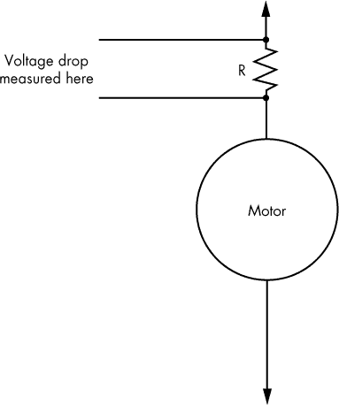

*图 2-2：电阻器两端的电压由正电源与电机输入之间产生。正是这个电压触发了电路的工作*。

电阻 R 上的电压降是微控制器的实际输入。在这个项目中，电压降被输入到 Arduino Nano 的两个模拟输入引脚，这两个引脚跨越了电压降电阻。微控制器处理这个输入并根据你的程序生成输出。

**注意**

*你可以只使用单个模拟输入来实现电路，但那样会限制电路的一些灵活性——特别是当你使用的电机工作在不同电压下时*。

### 原理图

振动器电路将电阻 R1 上的电压输入到 Arduino 的两个模拟输入引脚 A0 和 A1 中，设置了实际的输入（见图 2-3）。

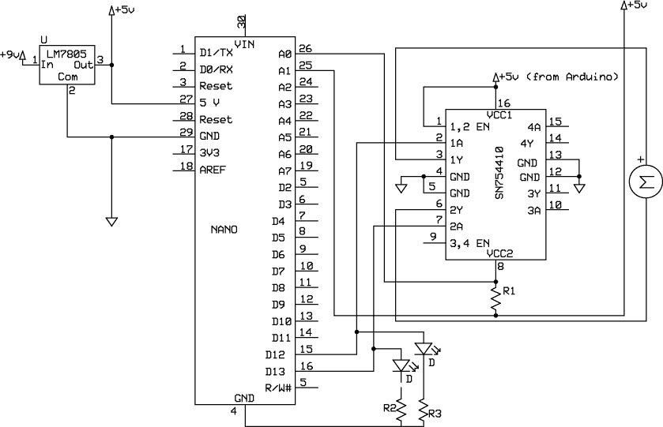

*图 2-3：本项目的完整原理图显示了 5.6 欧姆电压降电阻（R1）、两个 LED（D）、330 欧姆限流电阻（R2 和 R3）以及四通道 H-Bridge（SN754410），其中一半用于使用*。

这个电路中的所有地线连接在一起，A0 和 A1 引脚之间的电压是你的程序用来决定何时反转电机方向的电压。请注意，这个电压不是相对于正电源轨或负电源轨的，但它必须在 0 到 5V 之间，以防止损坏微控制器。如果你在连接 H-Bridge 时遇到困难，请参阅“使用 H-Bridge”，该部分在第 48 页。

每个模拟引脚背后的模拟到数字转换器（ADC）提供 10 位分辨率，这意味着转换器最多可以提供 1,024 个不同的值，即 210，从 0 到 1,023，具体取决于输入。

因此，如果电源是 5V，每次增量大约是

5V ÷ 1023 ≈ 0.0048V。

### 确定反转阈值

为了编写一个程序，让 Arduino 知道何时反转电机，你必须自己确定这个临界点，通过一些数学计算和一点信念。

首先，确定你所使用的电机的电流消耗。通常在电机标签上会标明。我的电机的电流消耗约为 40 毫安（mA），即 40 千分之一安培（见图 2-4）。现在我们进入复杂的数学计算。你需要使用一个称为*欧姆定律*的公式来确定在程序中设置的电压阈值。

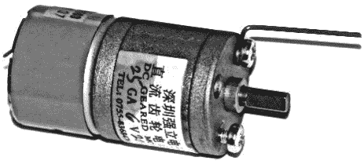

*图 2-4：我使用了一款亚洲进口电机，如图所示安装了一个限位引脚，证明了其可靠性和性能。螺丝为 M3×0.05*。

我在电机电路中使用了一个 5.6 欧姆电阻。使用欧姆定律，即电压等于电流乘以电阻（*V* = *IR*，其中电压以伏特为单位，电流以安培为单位，电阻以欧姆为单位），我们可以计算出 40 mA 乘以 5.6 欧姆的电阻大约是 0.224V：

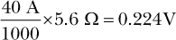

现在，回到 ADC。它有 1,024 个单位来表示 5V，因此每个单位代表 0.0049V。一点算术可以得出，0.224V 的降压大约代表 1,024 个单位中的 46 个：

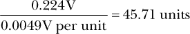

有些估算你必须相信——至少在你通过测试确认之前是这样。这是其中之一。当电机减速或停转时，电流消耗会增加。根据电机的不同，电流的增加通常是正常电流的两到四倍，但也可能更多。

**注意**

*在没有负载（或负载很小）的情况下，电机的电流消耗最小。正常运行负载下，电流可能是无负载电流的四到五倍。在重负载下，电流可能是无负载电流的 10 倍，具体取决于电机设计*。

所以根据我们的良好信念模型，设置电机反转阈值的一个好起点是 ADC 的 1,024 单位中的 90 到 100 个单位之间。

或者，你也可以使用数字万用表先测量精确的电流消耗（参见图 2-5）。使用万用表测量电流消耗时，初始时将其指示器设置为 200 mA；如果电机在搭建这里描述的电路时没有动起来，你可能需要将其设置为 10 A。

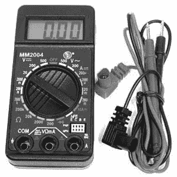

*图 2-5：万用表对许多项目非常有用，家里备一个很方便。它们可以从不同的来源购买，价格范围也很广。我使用的是来自 Electronic Goldmine 的便宜款，但如果你计划做高压实验，建议投资一款非常好的万用表。*

按照图 2-6 所示搭建电路，然后将万用表的红色探头连接到电源上。将万用表的黑色探头连接到电机的电线，完成电路连接。如果读数为负值，请反转万用表的红色和黑色探头。根据电源电压和电机电压要求，你可能还需要通过电压调节器电路将电机连接到电源，如在“电压调节器”一节中所描述的，见第 58 页。

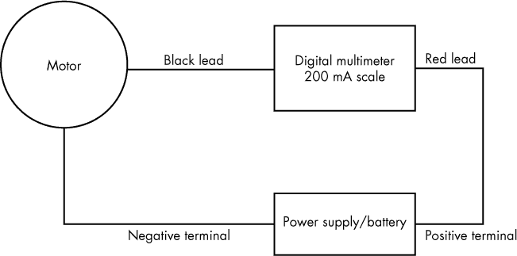

*图 2-6：测量电机电流消耗的连接图*

要检查电流消耗，请抓住电机的轴以减缓它，并观察万用表上的读数。你可以通过将读数代入欧姆定律，计算电压并转换为步数，像我做的那样，从而得到准确的 ADC 步数指示。

**注意**

*在草图中，我使用了 100 作为反转的阈值。你也可以通过将 100 乘以 0.0049V 来计算电压降的绝对值：*

100 步 × 每步 0.0049V = 0.49V

请记住，精确的阈值取决于你使用的电机类型。不同的电机具有不同的电流能力，甚至可能需要不同阻值的电阻。另外，请注意电流消耗的数值并不精确。永久磁铁电机的特性是负载下的电流消耗是一个范围，而不是一个精确的数值。

随着电流的增加，电压降也会增加，直到达到微控制器被指示执行某个操作的点。在此时，A0 和 A1 之间出现的模拟电压差会超过预设的阈值，这将使 Arduino 启动。一旦达到阈值，Arduino 会告诉 H 桥反转电流至电机。

### 使用 H 桥

在未来的项目中，你可能会遇到 H 桥驱动器，因为它是一个非常多功能的部件，可以执行许多不同的功能。市面上有多种 H 桥芯片可供选择，但我一直在使用德州仪器的 SN754410 四端 H 桥。它很受欢迎，因为它能在宽广的电压范围内工作，非常灵活且价格便宜。逻辑电平为 5V，而驱动电压可高达 36V，持续输出 1A（峰值输出为 2A），因此能够驱动各种爱好用电机、电磁铁，甚至继电器。它采用标准的 16 引脚双排直插封装（DIP）。DIP 封装曾是长期的标准，但现在正逐渐被更新的类型所取代（请参见 “使用 SOIC” 在 第 20 页）。它是传统的“千足虫”式电路。

图 2-7 显示了 SN754410 H 桥的引脚图，而 表 2-1 显示了它的功能表。你可以在德州仪器的数据手册中找到更多信息，链接为 *[`www.ti.com/lit/ds/slrs007b/slrs007b.pdf`](http://www.ti.com/lit/ds/slrs007b/slrs007b.pdf)*。

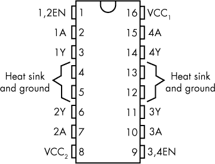

*图 2-7：此项目中使用的 SN754410 四端 H 桥芯片的引脚图。请注意，当从顶部观看时，带缺口指向上的芯片左上角是引脚 1*。

**表 2-1：** SN754410 的功能表

| **输入** |  | **输出（Y）** |
| --- | --- | --- |
| **A** | **EN** |  |
| --- | --- | --- |
| H | H | H |
| L | H | L |
| X | L | Z |

根据数据手册，在此功能表中，*H* 代表 *高电平*，*L* 代表 *低电平*，*X* 表示电平与电路行为无关，*Z* 表示高阻抗，这会关闭电机。

H 桥是一种优雅的电机控制解决方案，原因有几个。它允许从单一电源反转极性，并且提供不同的逻辑和控制电压。此外，如果双 H 桥的两个输入都为高或低，则没有输出。该草图利用了这一点，在一个函数中编写了停止电机的指令。本书中的其他项目也使用了这个功能。

### 面包板

对于大多数 Arduino 项目，我建议首先在面包板上搭建电路，以确保你走在正确的方向上，并验证你的初步假设。使用标准面包板和作为配件出售的插头线（参见 图 2-8）。

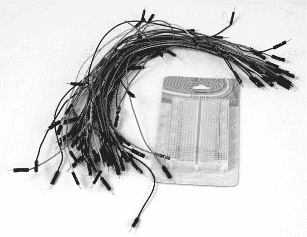

*图 2-8：典型的小型面包板和插头线*

在你开始在面包板上搭建电路之前，先检查一下你的 Arduino。许多 Arduino 板已经预先焊接好了男性插针。然而，并非所有情况都如此；一些亚洲供应商会将插针与处理器板一起放松在包装里。如果你的板子缺少插针，请参阅 “准备 Arduino 板” 章节，在 第 2 页 找到完整的安装说明。

大多数面包板在每侧的整个长度上都有红色和蓝色条纹；这些条纹旁边的孔分别用于电源（+）和接地（−）。在连接电路之前，使用一根线将右侧的红色列与左侧的红色列连接起来。同样，将蓝色列也连接在一起。

**警告**

*不要* *将红色列连接到蓝色列！这会导致短路，并烧坏电子元件*。

图 2-9 展示了我用于这个项目的面包板，来自 图 2-3 的原理图列出了连接方式。

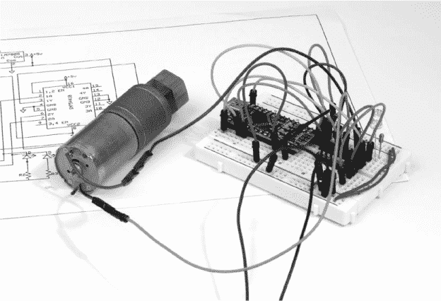

*图 2-9：这是我用作概念验证的面包板，确保一切如预期工作*。

**警告**

*在 Arduino 正在通过电压调节器接收电源时，不要将其插入计算机。这可能会烧坏 Arduino*。

我建议按以下方式原型化你的电路：

1.  将 Nano 板插入面包板，留出几行孔在一端。

1.  从标记为 *5V* 的 Nano 引脚（引脚 27）引出一根线，连接到面包板上的红色正极轨道。

1.  从 Nano 的 GND 引脚（引脚 29）引出一根线，连接到面包板上的蓝色负极轨道。

1.  找到面包板上三个连续的孔，确保它们不会与任何东西连接，然后将 LM7805 的三个引脚插入这些孔。

1.  LM7805 的输入引脚将连接到 9V 电源，LM7805 的接地引脚将连接到蓝色负极轨道，芯片的输出引脚将连接到红色正极轨道。（参见 图 2-10 查看 LM7805 引脚排列图。）

    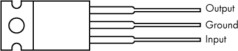

    *图 2-10：LM7805 调节器的引脚排列*

1.  将 H-桥插入面包板，缺口朝向 Nano，并且在 H-桥和 Nano 之间留出几行空位。

1.  使用一根线将 H 桥的第 1 针脚和第 16 针脚连接起来（见图 2-7）。然后，再用一根线将第 1 针脚连接到面包板的正连接端。这条来自第 1 针脚和第 16 针脚的连接为 H 桥提供运行逻辑的电压，并使所用的 H 桥部分启用。

1.  使用一根线将 H 桥的第 4 针脚和第 5 针脚连接起来，然后将它们连接到面包板的负极端。将第 4 针脚或第 5 针脚通过电线连接到地面即可。

1.  同样地，将 H 桥的第 12 针脚和第 13 针脚连接起来，并将它们连接到地面。

1.  使用一根线将电机的一端（哪一端不重要）连接到 H 桥的第 3 针脚，并将 H 桥的第 6 针脚连接到电机的另一端。

1.  将 Nano 的数字引脚 D12 连接到 H 桥的第 2 针脚。

1.  将 Nano 的数字引脚 D13 连接到 H 桥的第 7 针脚。

1.  将 5.6 欧姆电阻（R1）的一端连接到 H 桥的第 8 针脚。

1.  将电阻 R1 的另一端连接到面包板上的红色正极轨道。

1.  使用一根线将 H 桥的第 8 针脚与 Nano 的模拟引脚 A0 连接。

1.  使用一根线将正极（红色）连接器与 Nano 的模拟引脚 A1 连接。

1.  将一个 LED 的正极（长引脚）插入 Nano 的 D12 针脚。

1.  将 LED 的负极插入面包板的空白行中。

1.  从 LED 的负极所在的那一行，连接一根 300 欧姆的电阻（R2）到蓝色负极轨道。

1.  将第二个 LED 的正极（长引脚）插入 Nano 的 D13 针脚。

1.  将第二个 LED 的负极插入面包板的空白行中。

1.  从第二个 LED 的负极所在的那一行，连接一根 330 欧姆电阻（R3）到蓝色负极轨道。

VCC2 电源驱动电机输出。它从电源的正极开始——原理图中的稳压器输出针脚——通过电阻 R1 到达 H 桥的第 8 针脚。VCC2 成为电阻 R1 的低电压端；随着电机负载的增加，它的电压会变低，因为电阻的另一端连接到电源的正极。VCC2 电源电压可以在 5V 的逻辑电压到 H 桥的 36V 极限之间变化。对于这个项目，我直接将电压降电阻连接到 5V 电源，这对于一个 6V 电机来说非常适用。

Nano 的 D12 和 D13 输出引脚驱动 H 桥的 A 输入，而 A0 和 A1 输入则跨接在电压降电阻 R1 上。正是这个电压降值告诉 Arduino 改变输出，以指示 H 桥反转电动机。当输出 D13 为高而 D12 为低时，H 桥的输出引脚 2Y 变为正，而 1Y 保持为负。当 D12 为高而 D13 为低时，反转发生，1Y 变为正而 2Y 保持为负。当两个引脚的输出都是高或低时，它们处于相同的电势（或电压），电动机不会被驱动。（参见 H 桥芯片的数据手册中的功能表，或查看表 2-1。）

### 草图

以下草图的编写方式是，当电动机达到一个方向的极限时，两个输出都变低；当电动机达到另一个方向的极限时，两个输出都变高。当两个输出都是高或低时，电动机两端没有电压，并且会停止一定的延迟时间。延迟满足后，电动机会开始反向运转。由于 LED 连接到 D12 和 D13 引脚，你还会看到一个视觉指示。当电动机暂停在一个方向时，两个 LED 都亮起，而当电动机暂停在另一个方向时，两个 LED 都熄灭。

```
     /* Sketch for the Automatic Motor Reversal Project
     */

     //Identify pins that will not change
     const int ledPin1 = 12; //LED1 in schematic
     const int ledPin2 = 13; //LED2 in schematic
     const int analog0 = A0;
     const int analog1 = A1;
     int analogValue0 = 0; //Identify variables for analog inputs
     int analogValue1 = 0;
     int analogdifference = 0;
     int threshold = 100; //The threshold value calculated to stop the motor

     int reading;
     int state;
     int previous = LOW;
     int count = 0;
     int numberstops = 250;
     int time = 0; //The last time the motor reversed

     //Amount of time to wait to get rid of the jitters when the motor reverses
     int debounce = 400;

➊   void setup() { //This is the setup routine
     //Initializes pins as input or output
       pinMode(analog0, INPUT);
       pinMode(analog1, INPUT);
       pinMode(ledPin1, OUTPUT);
       pinMode(ledPin2, OUTPUT);
       Serial.begin(9600); //Was used in setting up the parameters
     }

➋   void loop() { //This begins the processing section
         //Enter an endless do-nothing loop after the counter reaches the limit
         while(count > numberstops) {
             digitalWrite(ledPin1, LOW);
             digitalWrite(ledPin2, LOW);
         }

     analogValue0 = (analogRead(analog0)); //Read the analog values
     analogValue1 = (analogRead(analog1));

➌   //Setting up the analog difference
     analogdifference = analogValue1 - analogValue0; //This is the voltage drop
     //analogValue1 will be greater than analogValue0

     //These were added to view what was happening on the serial monitor
     Serial.print("count =      ");
     Serial.println(count);
     Serial.print("analogdifference =      ");
     Serial.println(analogdifference);
     Serial.println();
     Serial.print("numberstops =      ");
     Serial.println(numberstops);

     //This comparator looks at the difference or drop across the resistor
➍   if(analogdifference > threshold) {
        reading = HIGH;
     }
     else {
        reading = LOW;
     }

     //Toggles the output and includes the debounce
➎   if(reading == HIGH && previous == LOW && millis() - time > debounce) {
        if(state == HIGH) {
           state = LOW;
        }
        else {
           state = HIGH;
        }
        //Increments the counter each time the motor reverses
➏   count++;
        time = millis(); 
     }

     //Writes the state to the output pins that drive the H-Bridge
     digitalWrite(ledPin1, state);
     digitalWrite(ledPin2, !state); previous = reading;
  }
```

这个草图为项目使用的引脚设置了易于理解的别名，并为引用模拟输入和其他关键值添加了便捷的常量和变量。在草图定义并初始化输入输出引脚之后，开始主循环。

在主循环中，草图会计算电阻上的电压降，并以模拟步长表示 ➌。在 ➍，草图会判断读取值是高还是低。从 100 到 120 的阈值对我使用的 6V、20 转/分钟电动机来说是可靠的，但你可能需要实验以找到适合你电动机的正确值。关于如何估算阈值的更多信息，请参见“确定反转阈值”以及第 46 页。在 ➎ 处的读取值决定是否需要反转电动机。

**分压电阻对电流感应至关重要**

我已经使用几个类似的电动机测试过这个反转电路，只需要对草图中的阈值做一点微调。然而，对于电流消耗极高或极低的电动机，你可能需要预估一个与模拟差异（analogdifference）完全不同的值，或者使用不同的分压电阻，这在电路图中是 R1。你可能需要将分压电阻的值降低到像 2.2 欧姆这样的数值，这样就需要减小你用来比较模拟差异的值。

对于大多数小电动机来说，分压电阻的值越低（通常在 1 到 10 欧姆之间），模拟差异通常会更稳定，效果越好。对于其他电动机，进行实验以找到最适合的电阻值。

当草图检查`reading`以查看电机是否需要反转时，还使用`debounce`值来确保高读数不是由电机换向器或刷子在合法反向期间产生的电噪声造成的。我将`debounce`设置为 400，但对于不同的电机可能需要进行调整。特别是对于较大的电机，可能需要将其设置得更高。

这个草图还包括一些在将电机作为 PCB 搅拌器时并非必需但在其他应用中可能有帮助的功能。让我们更详细地看看这些项目的方面。

我添加的一项功能是添加一个计数器来跟踪电机反转的次数。在草图中，计数增量显示在➏处为`count++`。在项目中，当`count`达到某个值（如果`count = numberstops`），电机将停止。如果您希望设置一个警报，比如可听到的报警器来告知您完成了，可以通过添加一行代码来轻松实现这一点，以写入其中一个数字输出引脚。我在草图中设置了最大的`count`值，使用`numberstops = 250`，所以电机将反转 250 次然后停止。这提供了略多于 15 分钟的蚀刻时间，使用 5V 运行的我选择的电机，这应该足够蚀刻大多数电路板。

当达到最大计数时，草图进入`while`循环开始，停止搅拌。这基本上使处理器停滞，您必须按电源开关重新启动或重置搅拌器。将此循环放在软件的开始附近只是提醒它的存在。

计数、可选的警报和停止功能的背后思想是提醒您检查电路板是有帮助的。如果电路板已完成蚀刻，继续搅拌会加速线路的削蚀，这是不好的，因为它会削弱（甚至可能断裂！）小铜线迹。另一方面，如果在合理的时间内未完成蚀刻，您可能需要刷新蚀剂。

**MOD: 可调停止量**

如果在草图中设置一个固定的最大停止数让你不满意，可以尝试在电源和地之间连接一个电位器，将调节引脚（通常是电位器的中间引脚）连接到 Arduino 的 A2 输入引脚。然后，将 numberstops 设置为 A2 的值，该值应在 0 到 1,023 之间，这取决于电位器刮板的位置。

草图的区别在于这里。首先，更改

```
int numberstops = 250;
```

至

```
int numberstops = setNumber;
```

然后，添加以下内容：

```
int setNumber;
int analogPin2 = A2;
int analogValue2;
setNumber = analogRead(analogPin2);
```

因为时间是相对的，您可以使用一个 270 度旋转的线性电位器，并在外壳上做一些粗略的标记以指示计数的次数。

### 护盾

对于这个项目，我建议制作一个小型的 PCB*护盾*，它基本上是一个设计为插入 Arduino Nano 的主板。使用护盾，你的电机反转项目可以保持紧凑，并且你可以以最少的工作量进行设计和制作。

#### *PCB 布局*

你可以直接将项目的部件焊接到一块带孔的项目板上，但我相信，制作并组装护盾所需的时间要比将部件放到穿孔板上并手工接线少。通过准备、蚀刻、钻孔和组装自己的 PCB，你还将获得宝贵的经验。而且最终，一些项目足够复杂，手工接线就不再是一个理想的选择。（参考图 5-13 和第 148 页中的示例。）

为了制作我的印刷电路布局，我使用了一款免费的软件程序，叫做 ExpressPCB。图 2-11 展示了我所用的 PCB 布局。

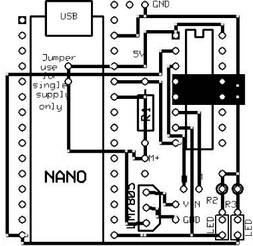

*图 2-11：这是我在项目中使用的实际 PCB 图案。Arduino Nano 可以直接焊接到板上，也可以通过插针连接器插入。*

如果你不想自己设计 PCB，但仍然想制作电路板，可以从*[`www.nostarch.com/arduinoplayground/`](https://www.nostarch.com/arduinoplayground/)*下载*Reverse.pcb*文件，并按照第 13 页中“制作自己的 PCB”的说明操作。制作好你的 PCB 后，只需将所有部件焊接到正确的位置，你的护盾就完成了。

#### *护盾设计说明*

如果你自己设计护盾，有几个设计因素你必须牢记。

##### 模拟输入

请确保根据图 2-3 中的电路原理图，将 A1 和 A0 输入连接到 R1 电阻器的正确端。A1 应连接到电源侧，A0 连接到 H 桥侧。在草图中，为了比较模拟值，我们计算差值：`analogdifference = analogValue1 – analogValue0`，其中`analogValue1`是电阻器高端的输入信号。在这个例子中，`analogValue0`是 A0，`analogValue1`是 A1。

##### 接地和散热

引脚 4、5、12 和 13 是 H 桥上的地线，它们也充当散热器以防止芯片过热。在拟议的护盾上包含了一个小区域，用于增加散热器的面积。如果你使用的是相对较小的电机——例如 6V、20 mA 的电机——则不需要更多的散热措施。如果你使用的是更大的电机或驱动较重的负载，可以考虑使用 PCB 的另一面作为散热器。

##### 电压调节器

本项目使用了独立的 5V 稳压器来为 Nano 供电。一个 9V、200 mA 的插头墙适配器连接到板载的 LM7805 稳压器，这将电压从大约 9V 降到 5V。外部稳压器被包括进来，以便使用比 Nano 内置稳压器更强大的稳压器。确保正确连接稳压器的引脚（见图 2-10）。

你可以将 7.5V DC 或 9V DC 墙壁电源直接连接到 Nano 的 VIN 引脚，并使用板载稳压器，这样我的电机就能正常工作。但是，如果你使用更大的电机或高电流 LED，它可能会使板载稳压器负担过重，甚至可能烧坏它。

电源电压越高，稳压器将需要更多的工作来将电压降低到 5V。过度使用稳压器可能会导致其过热并失效。例如，给稳压器输入 12V 可能是 5V 稳压的上限。9V 输入更好，而 7.5V 输入则更优。如果稳压器芯片变热，给其散热片加装散热器。一个小的铝片通常就足够了，但也可以使用普通的散热器。而且，尽管最好将供电电压尽可能接近输出电压，但请记住，稳压器需要至少比稳压输出高 1V 才能正常工作，因此它必须至少接收到 6V，即 5V 稳压输出加上 1V。超过 12V 的输入电压也是可行的，但一定要确保不要超过设备的限制。

**MOD: 使用更高电压**

如果你为这个项目使用更高电压的电机，它将转得更快，拥有更大的扭矩等等。但是你*不能*仅仅将更高的电压连接到 H 桥第 8 引脚的降压电阻的高端。那样会导致 A0 和 A1 与地之间的电压超过 5V，这对 Arduino 上的 ATmega328 微控制器的健康有害。（这是唯一一个相对于地的电压很重要的情况。）因此，必须进行修改。查看图 2-12 中的原理图中的 R1。电源首先连接到电阻 R2；R2 与电阻 R3 连接，R3 接地。

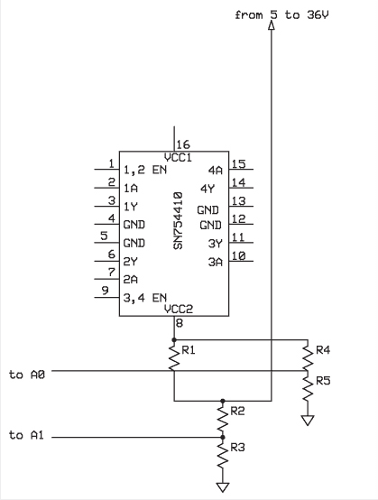

*图 2-12：如果你选择使用更高电压并驱动更快的电机，你将需要通过在 A0 和 A1 输入端前添加电压分压器来修改电路*。

为了避免损坏 Nano 处理器，你需要确保在接合点处的电压保持在 5V 以下，相对于地面。实现这一点最简单的方法是使用电压分压器。两个电阻对将较高的电压进行分压：第一对是 R2 和 R3；第二对是 R4 和 R5。电阻的值应当使得每一对电阻接合点的输出——R1 和 R2，R4 和 R5——对于任何输入电压值，都略低于 5V。

使用此公式：

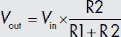

并且通过图 2-13 中的原理图来确定电压分压电路中应使用的电阻值。

例如，如果你从 9V 开始，并随意选择一个 10 千欧姆的电阻串联，根据计算器，你需要用一个 12.5 千欧姆的电阻将其与地相接。我手头上最接近的电阻是 12 千欧姆，效果很好。如果你找不到适合需要的标准电阻，你也可以使用两个标准电阻并联，以通过这个公式得到你想要的电阻值：

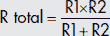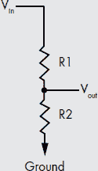

*图 2-13：一个基本的电压分压器。要找到你应该使用的电阻，将你自己分压器的数值代入公式，就像你的分压器是这个电路一样*。

如果你不想自己做代数运算，你可以使用一些方便的在线电压分压器计算器，如*[`www.sengpielaudio.com/calculator-paralresist.htm`](http://www.sengpielaudio.com/calculator-paralresist.htm)* 或 *[`www.raltron.com/cust/tools/voltage_divider.asp`](http://www.raltron.com/cust/tools/voltage_divider.asp)*。SparkFun 也有一个关于电压分压的优秀教程，并且提供了自己的计算器：*[`learn.sparkfun.com/tutorials/voltage-dividers/`](http://learn.sparkfun.com/tutorials/voltage-dividers/)*。

##### 方向 LED

当然，哪个 Arduino 项目没有闪烁的 LED 呢？正如你在原理图和保护板 PCB 上看到的，我包括了两个 LED：一个红色用于顺时针旋转，绿色用于逆时针旋转。但哪个方向对应哪个 LED 是由你来决定的：只需反转电机引线即可改变 LED 状态。

### 构建

对于这个项目，你将使用电机反转技术来创建一个加速 PCB 腐蚀的搅拌器。为此，你将用一个 Arduino 驱动的电机将 PCB 悬挂在腐蚀溶液上方，如图 2-1 所示。一个小型外壳将包含 Arduino Nano、保护板、电机与限位电线、方向 LED、电源开关和电源插座。

在组装好外壳后，你只需将它安装在腐蚀设置的上方，并将反转器连接到 PCB 或托盘上。我将我的外壳夹在工作台上方的柜门上，下面放置了一个腐蚀容器（见图 2-14）。整个系统可以快速组装和拆卸。

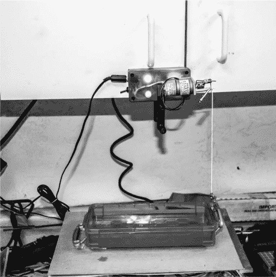

*图 2-14：对于较大的 PCB，尝试使用托盘腐蚀，这是一种更传统的方法。只需将电机反转器连接到托盘上，以便摇动电路板，而不是使用反转器将电路板浸入并取出溶液中*。

本项目其余部分的构建需要一些耐心，也许还需要一些创造力来收集所需的零件。你将需要几颗 M3 螺钉来将电机固定到电机板上——在这种情况下，是一个小型的铝制 L 形支架——以及一些限位电线，最好使用 0.039 的钢琴弦或弹簧钢丝。你还需要一小块废料黄铜或铝块——圆形或矩形都可以——用来连接到电机轴和曲柄上，以及一颗长的 4-40 或 6-32 螺钉作为曲柄，另加一个 M3 垫片和焊接端子，用来将搅拌器线连接到曲柄上。图 2-15 展示了几乎完成的、未安装的产品。

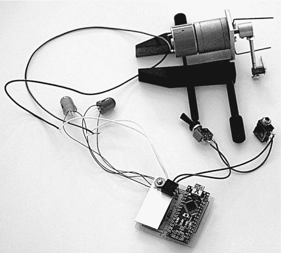

*图 2-15：在将组件放入外壳之前，先接线并进行最终测试。测试时，我将电机夹住，这样曲柄可以自由转动。调节器散热器遮挡了大部分的屏蔽。*

#### *限位电线*

限位电线通过与电机曲柄碰撞，实质上限制了电机的旋转。它们与曲柄碰撞的旋转点就是旋转的限制。当曲柄撞到限位电线时，这些电线会阻止电机继续转动，并触发反转。

我推荐使用钢琴弦或弹簧钢丝，这样在曲柄到达旋转极限时，能提供一定的弹性。用一对尖嘴钳将两根限位电线弯成所需的形状（参见图 2-16）。这些电线将固定在电机安装螺钉的外侧，电机安装支架外侧。你可以通过松开螺钉并旋转电线来改变旋转的限位。

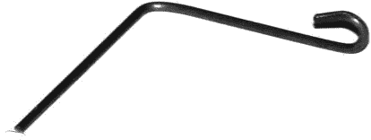

*图 2-16：这是限位销的形成方法。一对好的尖嘴钳可以轻松完成这项工作。*

#### *曲柄衬套*

曲柄衬套仅仅是将电机的旋转传递给曲柄的部件。图 2-17 详细展示了衬套、垫片和焊接端子的结构。

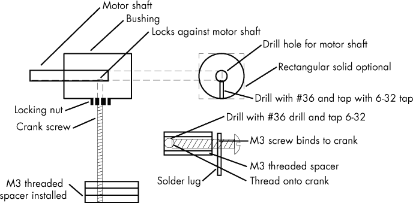

*图 2-17：驱动机构的细节，它将电机的旋转转化为搅拌器的升降运动。*

虽然在组装这个项目的过程中可能会有许多不同的变体，但这是我用来组装它的步骤：

1.  在衬套的中心钻一个孔，孔的大小适合电机轴。衬套可以是一个直径约为 0.5 英寸、长度约为 0.75 英寸的小黄铜或铝圆棒。矩形的材料也能很好地工作。使用与电机轴尺寸最接近的钻头。例如，如果你的电机轴直径是 0.157 英寸，就可以使用 11/64 英寸的钻头，差不多就够了。孔的位置不需要精确到中心——只要接近即可。

1.  在轴承中，与电机轴孔垂直的位置，使用#36 钻头钻孔。然后，攻丝所钻的孔，使得一颗长 6-32 螺钉能够同时作为限位螺钉和曲柄。你也可以使用单独的限位螺钉，将曲柄移得更远，正如我在图 2-18 中所做的那样。

1.  将曲柄螺钉旋入轴承，使其紧贴电机轴，并使用锁紧螺母固定螺钉位置（参见图 2-18）。

    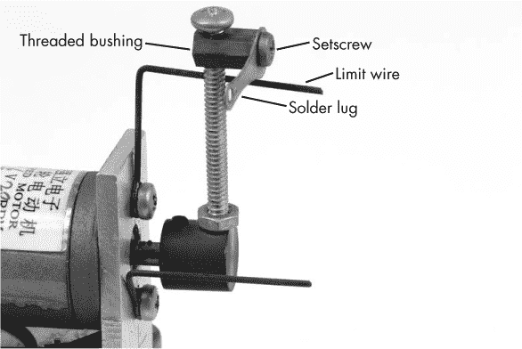

    *图 2-18：一张详细展示曲柄头部的照片。注意用于固定电线的焊接片和左侧的鳄鱼夹*。

1.  在曲柄的末端，你最终将连接一条线，用于将 PCB 板拉进和拉出蚀刻液。这个接头可以是一个螺母，甚至是一个鳄鱼夹，固定在曲柄上。然而，在细节中，我使用了一个 7 毫米长的 M3 六角公对公间隔套。我从间隔套的一侧平面开始，用同样的#36 钻头将间隔套贯穿钻孔。然后，我用 6-32 丝攻攻丝，并将其旋入曲柄。

1.  取一个 M3×0.5 mm 机器螺钉，将其穿过焊接片（查看图 2-19 了解焊接片本身，查看图 2-18 了解焊接片的安装情况）。将螺钉完全旋入支架，直到它紧固在曲柄螺钉上。

    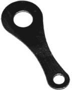

    *图 2-19：用于固定电线的焊接片，这些电线固定了蚀刻板。如果你无法购买类似的物品，可以用一块废金属或塑料轻松制作一个*。

我本地的 Ace 硬件店提供了我所需的所有配件，除了 M3 间隔套，我从 eBay 上购买了它。你应该能在 Home Depot 或 Lowe’s 找到相同的物品。

#### *包装*

屏蔽和 Nano 适配一个标准的塑料外壳（参见图 2-20）。在外壳上钻孔，用于 3.5 mm 电源插孔、作为电源开关和重置按钮的 SPST 开关、指示 LED 和电机线。

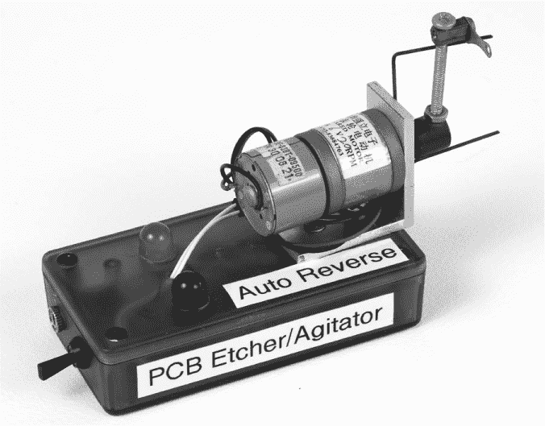

*图 2-20：完成的外壳，包含电机、限位电线、方向指示 LED、电源开关（重置）和电源插孔。LED 会亮起，每个方向一个。当电机在一个方向暂停时，两个 LED 都会亮；当它在另一个方向暂停时，两个 LED 都会熄灭*。

大多数 3.5 毫米插孔使用约 1/4 英寸的孔，与开关的孔径相同。如果你希望孔更加紧密，15/64 英寸会更合适。使用 5 毫米或 10 毫米 LED 将决定所需孔的尺寸。根据我的经验，不同品牌的 LED 直径略有不同，因此你可能需要先尝试较小的钻头，测试 LED 是否合适。对于 5 毫米和 10 毫米 LED，常用的英制钻头尺寸分别为 3/8 英寸和 3/16 英寸。如果你有一套锥形扩孔器，可以从较小的孔开始，扩孔至适合 LED 的紧密配合。

将电机安装在一小块铝角上，这种铝角在大多数五金店都有售。我购买了一段 1 英寸长的 1.5×1.5 英寸铝角，并用手锯将其切割到合适的尺寸。如果你使用的是我所用的电机，可以参考图 2-21 中的模板，或从* [`www.nostarch.com/arduinoplayground/`](https://www.nostarch.com/arduinoplayground/)* 下载并打印，剪下来，将其贴在铝角支架上，用中心冲或钉子仔细标记支架上的孔位。接下来，钻孔——电机安装孔为 1/8 英寸，中心孔为 5/16 英寸。如果你使用不同的电机，则需要测量并标出安装孔。


*图 2-21：电机安装模板*

如果你认为将来会在另一个项目中使用屏蔽，直接使用一些双面泡沫胶带将其固定在外壳上。否则，可以使用支撑柱和螺丝将其固定在内部，螺丝尺寸可根据需要选择。

### 蚀刻过程

制作 PCB 有多种技术，最常见的是减法工艺，它从一块铜覆板或粘合到电气绝缘基板上的铜箔开始，通过选择性地去除铜层，在板上留下图案。虽然铜可以通过机械铣削去除，但最常见的方法是通过化学方式选择性地蚀刻板上的图案。

在化学蚀刻过程中，电路图案通过化学阻焊剂打印在空白板上，这样在没有涂覆阻焊剂的区域，铜会被蚀刻剂去除。蚀刻剂是一种具有化学活性的物质，它会攻击未处理的铜层，只留下电路所需的铜。我在《制作你的 PCB》的第 13 页中详细描述了如何逐步蚀刻电路，且该项目使得这一过程变得更加简单。

我们的目标是将一块未蚀刻的电路板悬挂在容器中的蚀刻液上方，并保持电路板在蚀刻液中尽可能长的时间，同时搅拌器上下运动，产生蚀刻液沿电路板表面流动的层流。我建议使用尼龙扎带来固定电路板，因为尼龙对蚀刻液相对不透。你可以将扎带固定在电机轴上，用鳄鱼夹将扎带固定，这样电路板就可以轻松取下（见图 2-22）。

我使用了一个 250 毫升的烧杯作为蚀刻容器。对于非常小的电路板，这种方法效果非常好。对于较大的电路板，我推荐使用一个大量程的量杯，比如一个 2 夸脱的 Pyrex 量杯。一个 600 毫升的烧杯适用于中等大小的电路板。对于更大的电路板，你可以使用托盘，具体见图 2-14。

开关和电源输入位于外壳的左侧。为了固定正在蚀刻的电路板，我通过焊接接头穿入一根线，并用一个小鳄鱼夹将这根线固定在电路板上。在接头的背面，你可以系一个小结，或者用某种夹子固定，以确保线不会掉进接头并进入酸液。在我的设置中，一个夹具（在照片中的电机后面）将外壳固定在悬挂的门上。

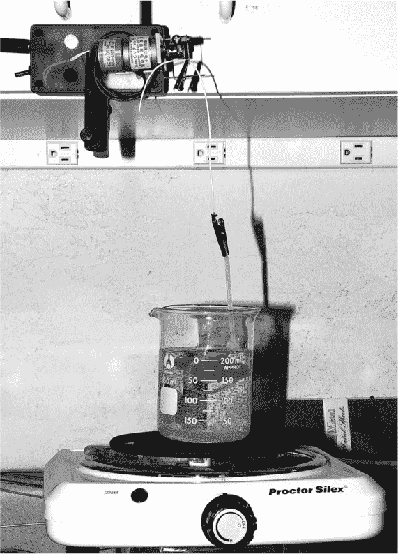

*图 2-22：这个基于 Arduino 的蚀刻搅拌器正在蚀刻电路板。蚀刻液应在蚀刻铜层时变为翡翠绿色。电路板通过一个用鳄鱼夹固定的尼龙扎带悬挂。线通过曲柄上的一个孔，并用另一个鳄鱼夹固定。一个 LED 灯亮起*。

请注意，蚀刻容器放置在加热板上。虽然蚀刻将在室温下进行，但加热会稍微加速这个过程。小心不要让蚀刻液过热：如果你将加热板设置在低温，使液体保持在约 100 到 120 华氏度之间，这样可以加速蚀刻而不会软化光刻胶。
